# OpenAI + Stripe ACP (Agentic Commerce Protocol) 深度研究报告

> 本报告是 Agentic Payment 系列研究的子报告之一，聚焦 OpenAI 与 Stripe 联合主导的 Agentic Commerce Protocol (ACP)。
> 总览报告见 [agentic_payment_research.md](../agentic_payment_research.md)，AP2 报告见 [2.google_ap2/google_ap2_research.md](../2.google_ap2/google_ap2_research.md)。

## 1. 概述：ACP 是什么，解决什么问题 (Overview)

### 1.1 Agentic Commerce 的核心挑战

传统电商的整个技术栈都是为"人类坐在屏幕前操作"设计的。当 AI Agent 代替人类执行购物任务时，五个根本性断裂点浮现：

```
传统电商                              Agentic Commerce
─────────                            ─────────────────
人类浏览网页 → 发现商品                Agent 如何发现商品？没有标准化的机器可读目录
商户看到人类 → 信任交易                商户看到 Agent 请求，如何区分合法 Agent 和恶意 Bot？
人类点击购买 → 隐含授权                Agent 没有"点击"，如何证明用户授权？
人类填写卡号 → 完成支付                Agent 没有信用卡，如何安全支付？
每个网站独立 → 各自集成                N 个 Agent × M 个商户 = N×M 集成成本
```

这五大挑战——**商品发现、信任、授权、支付、集成**——构成了 Agentic Commerce 的核心技术难题。2025 年 AI 流量涌入零售网站增幅超过 4,700%，问题已从理论变成现实。

ACP 在 2025 年 6 月出现，有几个关键催化因素：ChatGPT 周活跃用户超过 4 亿形成巨大的 Agent 购物需求；Stripe 已服务数百万商户具备快速推广基础；Google 发布 A2A/AP2、Amazon 推出 Buy for Me 带来竞争压力；GPT-4o 等模型使 Agent 具备了理解商品和辅助决策的能力。

### 1.2 ACP 的回答：三大子规范覆盖结账全链路

Agentic Commerce Protocol (ACP) 是 OpenAI 与 Stripe 于 2025 年 6 月联合发布的开放商务协议（Apache 2.0），核心使命是**让 AI Agent 在对话中无缝完成购物**——从商品发现到结账支付，全程不离开 Agent 界面。

ACP 的设计哲学是**"务实优先，快速落地"**——最大化利用 Stripe 现有支付基础设施，以最小的商户改造成本实现 Agent 购物。从协议发布到 ChatGPT Instant Checkout 上线仅用了 3 个月。

ACP 由三大子规范组成，覆盖从商品发现到支付完成的完整结账链路：

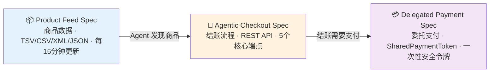

| 子规范 | 核心职责 | 关键技术 |
|--------|---------|---------|
| **Product Feed Spec**（商品数据规范） | 定义商户如何向 Agent 平台提供结构化商品数据 | HTTPS 推送、TSV/CSV/XML/JSON 多格式、每 15 分钟增量同步 |
| **Agentic Checkout Spec**（结账规范） | 定义 Agent 与商户之间的标准化结账 API 交互 | 5 个 REST 端点、Checkout Session 状态机、Rich Cart State |
| **Delegated Payment Spec**（委托支付规范） | 定义安全的委托支付令牌机制 | SharedPaymentToken (SPT)：商户限定、金额限定、时间限定、一次性使用 |

2025 年 9 月 29 日，ACP 在 ChatGPT 中以 **Instant Checkout** 功能正式上线，成为全球首个大规模落地的 AI Agent 购物体验。首批合作商户包括 Etsy、Shopify（100 万+商户）、Glossier、SKIMS、Spanx、Vuori 等。

### 1.3 三大子规范如何应对五大挑战

ACP 的设计策略是：在自身擅长的领域（商品发现、支付、集成）给出完整方案，在非核心领域（信任、授权）采用"够用即可"的务实策略，依赖 Stripe 基础设施快速落地。

#### 挑战一：商品发现 — Product Feed Spec 解决结构化数据问题

| 维度 | ACP 的解决方案 |
|------|--------------|
| 核心问题 | Agent 无法像人类一样浏览网页，需要机器可读的结构化商品数据 |
| 技术思路 | 通过 **Product Feed Spec** 定义标准化的商品数据格式和推送机制 |
| 具体接口 | 商户通过 HTTPS 向 Agent 平台推送 TSV/CSV/XML/JSON 格式的商品数据 |
| 数据内容 | 商品描述、价格、库存、媒体资源、评论、性能信号（转化率/退货率） |
| 更新机制 | 增量推送，最快每 15 分钟同步一次库存和价格变更 |
| 解决程度 | ⭐⭐⭐⭐ — 提供了完整的商品数据标准，但采用被动推送模型（Push），不如 UCP 的主动能力发现机制（Capabilities Discovery）灵活 |

ACP 的商品发现是"数据驱动"的——商户预先将商品目录推送给 Agent 平台，Agent 在本地索引中搜索匹配商品。这种模式适合大规模商品目录的场景（如 Shopify 100 万+商户），但在实时性和动态发现方面不如 UCP 的"能力发现"模式。

#### 挑战二：信任 — 依赖 Stripe 品牌信任，缺乏独立验证机制

| 维度 | ACP 的解决方案 |
|------|--------------|
| 核心问题 | 商户如何区分合法 Agent 和恶意 Bot？如何信任 Agent 发起的交易？ |
| 技术思路 | **中心化信任模型**——以 Stripe 作为可信中间方，Agent 通过 Stripe API Key 认证身份 |
| 具体机制 | Agent 平台（如 ChatGPT）通过 Stripe API 密钥与商户建立信任关系；SPT 由 Stripe 签发和验证，商户信任 Stripe 的背书 |
| Agent 身份验证 | 无独立的 Agent 身份验证协议——Agent 的"身份"等同于其 Stripe API 凭证 |
| 解决程度 | ⭐⭐⭐ — 在 Stripe 生态内信任链清晰有效，但缺乏 AP2 那样的去中心化加密签名验证（VC + DID），也没有 Visa TAP 的 RFC 9421 HTTP 签名机制。如果 Agent 不在 Stripe 生态内，信任建立缺乏标准化手段 |

ACP 的信任模型本质上是"平台背书"——用户信任 Stripe，Stripe 信任已注册的 Agent 平台，商户信任 Stripe 签发的 SPT。这条信任链短而高效，但高度依赖 Stripe 这个中心节点。对比之下，AP2 通过 Verifiable Credentials（VC）实现了任何方可独立验证的去中心化信任，Visa TAP 通过 RFC 9421 HTTP 签名实现了卡网络级别的 Agent 身份认证。

#### 挑战三：授权 — SPT 实现"单次交易授权"，不支持复杂委托

| 维度 | ACP 的解决方案 |
|------|--------------|
| 核心问题 | Agent 没有"点击购买按钮"的能力，如何证明用户授权了这笔交易？ |
| 技术思路 | 通过 **Delegated Payment Spec** 中的 **SharedPaymentToken (SPT)** 实现用户授权的安全传递 |
| 授权流程 | 用户在 Stripe Checkout UI 中明确确认支付 → Stripe 签发 SPT → Agent 持有 SPT 代表用户完成交易 |
| 授权约束 | SPT 四重约束：商户限定（merchant-scoped）、金额限定（amount-bounded）、时间限定（time-limited）、一次性使用（single-use） |
| HNP 场景 | 有限支持——SPT 需要用户在 Stripe UI 中实时确认，不支持"用户不在场时 Agent 自主决策支付"的 Human-Not-Present 场景 |
| 解决程度 | ⭐⭐⭐ — SPT 的最小权限设计在安全性上表现优秀，但授权模型仅覆盖"单次交易确认"场景。不支持 AP2 的 Intent Mandate（预授权 Agent 在规则范围内自主支付）和 Cart Mandate（购物车级别的细粒度授权），也不支持多步骤委托任务链 |

SPT 的设计哲学是"每笔交易都需要用户实时确认"，这在安全性上是最保守的选择，但也限制了 Agent 的自主性。AP2 的 Mandate 机制允许用户预先设定规则（如"每月不超过 $500 的办公用品采购可以自动执行"），Agent 在规则范围内无需用户逐笔确认——这是 ACP 目前无法实现的。

#### 挑战四：支付 — Stripe 全链路处理，SPT 是核心支付原语

| 维度 | ACP 的解决方案 |
|------|--------------|
| 核心问题 | Agent 没有信用卡，如何安全地代替用户完成支付？ |
| 技术思路 | **Stripe 全链路托管**——用户的支付信息存储在 Stripe，Agent 通过 SPT 间接触发支付，全程不接触真实卡号 |
| 用户绑定 | 用户在 Stripe Checkout UI 中绑定支付方式（信用卡/Apple Pay/Google Pay），支付凭证由 Stripe 安全存储（PCI DSS Level 1 合规） |
| 支付执行 | Agent 将 SPT 传递给商户 → 商户调用 Stripe API 使用 SPT 发起扣款 → Stripe 验证 SPT 有效性后执行支付 → 卡网络完成结算 |
| 安全保障 | PCI DSS 合规 + Network Tokenization（卡网络级别令牌化）+ Stripe Radar AI 欺诈检测 |
| 支持的支付方式 | Stripe 支持的所有方式：信用卡、借记卡、Apple Pay、Google Pay；PayPal 加入后进一步扩展 |
| 解决程度 | ⭐⭐⭐⭐⭐ — 支付是 ACP 最强的环节。Stripe 的支付基础设施成熟度极高，SPT 的安全设计精良，PCI DSS 合规和 Stripe Radar 提供了企业级的支付安全保障。唯一的局限是支付方式受限于 Stripe 生态（虽然 PayPal 的加入有所缓解），不如 AP2 的"支付方式无关"设计 |

ACP 在支付环节的核心优势是"零改造成本"——已使用 Stripe 的数百万商户几乎不需要额外开发即可接入 Agent 支付。用户的支付信息已经存储在 Stripe 中，SPT 只是在现有支付基础设施上增加了一层"Agent 友好"的委托机制。

#### 挑战五：集成 — 三层接入策略，覆盖从平台商户到自建系统

| 维度 | ACP 的解决方案 |
|------|--------------|
| 核心问题 | 每个 Agent 平台与每个商户单独集成，成本呈 N×N 指数增长 |
| 技术思路 | **标准化协议 + 平台插件 + MCP 兼容**，三层策略降低集成成本 |
| 第一层：平台插件 | Shopify、Wix、WooCommerce、BigCommerce、Squarespace、commercetools 等平台提供 ACP 插件，商户一键接入 |
| 第二层：REST API | 自建电商系统通过实现 5 个标准 REST 端点（Agentic Checkout Spec）接入 ACP |
| 第三层：MCP Server | ACP 可实现为 MCP Server，让任何兼容 MCP 的 Agent（Claude、Gemini、自建 Agent 等）调用结账能力 |
| Webhook 集成 | 通过 `order.created`、`order.updated` 等 Webhook 事件实现订单生命周期的自动化管理 |
| 解决程度 | ⭐⭐⭐⭐⭐ — 集成是 ACP 的另一大强项。三层接入策略覆盖了从"零代码接入"（平台插件）到"完全自定义"（REST API / MCP Server）的全部场景。Shopify 100 万+商户的一键接入尤其降低了生态冷启动的门槛 |

ACP 的集成策略体现了"务实优先"的设计哲学——不追求技术上的完美，而是最大化利用现有生态（Stripe 商户 + 电商平台插件）快速获得商户覆盖。MCP Server 的支持则为未来跨 Agent 平台的互操作性留下了扩展空间。

#### 五大挑战总览

```
┌──────────────────────────────────────────────────────────────────────────┐
│                    ACP 应对 Agentic Commerce 五大挑战                      │
├──────────┬───────────────────────────────────┬────────────┬──────────────┤
│  挑战     │  ACP 解决方案                      │  核心技术   │  解决程度     │
├──────────┼───────────────────────────────────┼────────────┼──────────────┤
│ 商品发现  │ Product Feed Spec 标准化商品数据    │ HTTPS 推送  │ ⭐⭐⭐⭐      │
│          │ TSV/CSV/XML/JSON 多格式支持         │ 增量同步    │              │
├──────────┼───────────────────────────────────┼────────────┼──────────────┤
│ 信任     │ Stripe 中心化信任模型               │ API Key    │ ⭐⭐⭐        │
│          │ 平台背书而非加密签名验证             │ SPT 验证    │              │
├──────────┼───────────────────────────────────┼────────────┼──────────────┤
│ 授权     │ SPT 单次交易授权                    │ SPT 四重约束│ ⭐⭐⭐        │
│          │ 用户在 Stripe UI 实时确认           │ Checkout UI│              │
├──────────┼───────────────────────────────────┼────────────┼──────────────┤
│ 支付     │ Stripe 全链路托管                   │ SPT + PCI  │ ⭐⭐⭐⭐⭐    │
│          │ Agent 不接触真实卡号                │ Radar 风控  │              │
├──────────┼───────────────────────────────────┼────────────┼──────────────┤
│ 集成     │ 三层接入：平台插件/REST API/MCP     │ 5 个端点    │ ⭐⭐⭐⭐⭐    │
│          │ Shopify 100万+商户一键接入          │ Webhook    │              │
└──────────┴───────────────────────────────────┴────────────┴──────────────┘
```

#### 核心洞察

ACP 的策略可以概括为**"扬长避短，快速落地"**：

1. **强项做到极致**：支付和集成是 ACP 最强的两个环节，这得益于 Stripe 成熟的支付基础设施和广泛的商户覆盖。ACP 没有重新发明轮子，而是在 Stripe 现有能力上增加了"Agent 友好"的协议层。

2. **弱项务实处理**：信任和授权是 ACP 相对薄弱的环节——没有 AP2 的去中心化加密签名，没有 Visa TAP 的 HTTP 签名验证，没有复杂的 Mandate 预授权机制。但 ACP 的判断是：对于"用户在 ChatGPT 中买一双鞋"这个核心场景，Stripe 的中心化信任和 SPT 的单次授权已经"够用"。

3. **互补而非替代**：ACP 的设计留下了与 AP2 互补的空间——未来当 Agent 需要执行更复杂的委托任务（如"每周自动采购办公用品"）时，可以在 ACP 的结账流程之上叠加 AP2 的 Mandate 授权机制，实现"ACP 管结账，AP2 管授权"的分层架构。

### 1.4 ACP 在 Agentic Commerce 技术栈中的位置

ACP 不处理支付信任与授权（那是 AP2 的职责），也不处理 Agent 间通信（那是 A2A 的职责）。它解决的是一个更直接的问题：**当用户在 AI 对话中说"帮我买这个"时，Agent 如何与商户系统完成标准化的结账流程？**

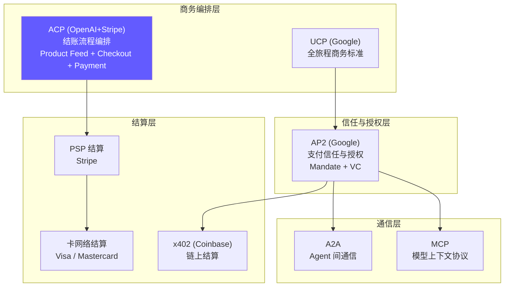

关键差异化特征：

- **结账层定位**：不是支付协议，而是结账编排协议——标准化 Agent 与商户之间的购物车管理和结账流程
- **SharedPaymentToken (SPT)**：Stripe 设计的核心支付原语——商户限定、金额限定、时间限定、一次性使用的委托支付令牌
- **嵌入式结账**：结账 UI 渲染在 Agent 界面内，用户无需跳转到商户网站
- **商户控制权**：商户保留 Merchant of Record 身份，保留订单接受/拒绝权
- **已大规模落地**：ChatGPT Instant Checkout 已上线运行，非实验性协议

一个成熟的 Agent 购物交易可能同时使用：UCP 发现商户能力 → ACP 编排结账流程 → AP2 提供授权证明。三者共同构成完整的 Agentic Commerce 技术栈。ACP 解决"怎么买"，AP2 解决"谁授权的"，UCP 解决"全旅程"。

### 1.5 为什么是 Stripe × OpenAI？双方的商业逻辑与战略目标

ACP 不是一个纯技术产物，而是 Stripe 和 OpenAI 各自商业战略的交汇点。理解双方"为什么要做这件事"，比理解"怎么做"更重要——因为商业动机决定了协议的设计取舍、推广节奏和长期演进方向。

#### 1.5.1 Stripe：从支付管道到 Agentic Commerce 基础设施

**核心命题：当购物入口从网页迁移到 AI 对话时，Stripe 如何确保自己不被绕过？**

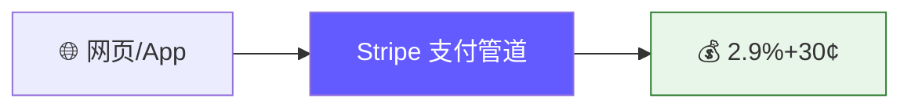

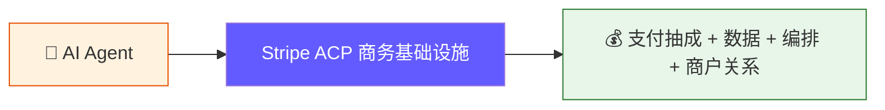

| 维度 | Stripe 的商业逻辑 |
|------|------------------|
| 防御性动机 | AI Agent 购物绕过传统网页结账，Stripe 的支付管道面临被"脱媒"风险。如果 Google AP2 让 Agent 直接与商户交互并通过卡网络结算，Stripe 可能沦为后台清算工具，丧失与商户的直接关系 |
| 进攻性动机 | 从"支付管道"升级为"Agentic Commerce 基础设施"——不仅处理支付，还掌控商品数据（Product Feed）、结账流程（Checkout）和商户关系（Merchant of Record），大幅提升在价值链中的位置 |
| 数据战略 | Product Feed Spec 让 Stripe 首次拥有了商品目录数据。传统模式下 Stripe 只看到"金额和卡号"，现在能看到"用户买了什么、从哪家商户、什么价格"——这些数据对风控、推荐和商户服务极具价值 |
| 网络效应 | ACP 的设计刻意将 Stripe 置于枢纽位置：Agent 必须通过 Stripe API 调用结账，商户必须通过 Stripe 推送商品数据，SPT 必须由 Stripe 签发和验证。每多一个 Agent 平台和商户接入，Stripe 的网络效应就更强 |
| 竞争卡位 | 抢在 Google（AP2）、Visa（TAP）、Mastercard（Agent Pay）之前定义 Agentic Commerce 的"事实标准"。如果 ACP 成为主流协议，Stripe 就从支付处理商升级为 Agentic Commerce 的"操作系统" |
| 收入模型 | 短期：现有支付抽成（2.9%+30¢）不变，Agent 渠道带来增量交易。中期：可能对 Product Feed 托管、高级结账功能收取 SaaS 费用。长期：成为 Agent 商务的基础设施层，类似 AWS 之于云计算 |

**深度分析：Agent 时代 Stripe 面临的四条"脱媒"路径**

Stripe 的防御性动机并非假设性风险——以下四条已经存在或正在形成的技术路径，都可以在 Agent 购物场景中绕过 Stripe：

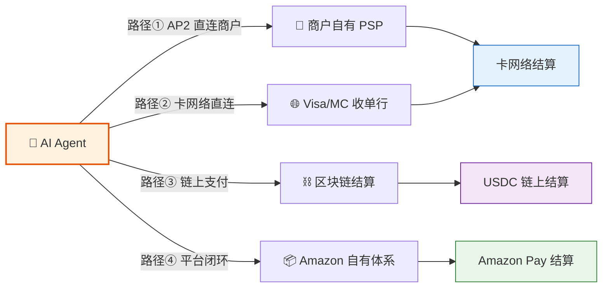

| 路径 | 机制 | 谁在推动 | Stripe 被绕过的方式 |
|------|------|---------|-------------------|
| ① Agent 直连商户 | AP2 的 Mandate 机制让 Agent 持有 Google 签发的授权凭证（VC），直接与商户支付端点交互。商户可选择任何 PSP 处理支付，不一定是 Stripe | Google AP2 | 商户验证 Mandate 后通过自有收单行向卡网络发起扣款，Stripe 在整个链路中没有位置 |
| ② 卡网络直连 | Visa TAP（RFC 9421 HTTP 签名）和 Mastercard Agent Pay 让 Agent 获得卡网络级别的身份认证，作为"数字化持卡人代理"直接与收单行交互 | Visa、Mastercard | 支付授权和清算完全在卡网络体系内完成，PSP 层（包括 Stripe）变成可选项 |
| ③ 链上支付 | Coinbase x402 协议通过 HTTP 402 状态码触发 USDC 链上支付，Agent 直接向商户的链上地址转账 | Coinbase | 整个流程在区块链上结算，完全不经过传统支付体系——不需要 Stripe，不需要卡网络 |
| ④ 平台闭环 | Amazon Buy for Me 让 Agent 在 Amazon 生态内完成购物，支付走 Amazon Pay，结算走 Amazon 自有体系 | Amazon | 封闭闭环，外部 PSP 无法介入 |

**为什么 Agent 时代"脱媒"风险比传统电商更大？**

传统电商中，Stripe 的核心价值是"简化商户接入支付"——商户不想自己对接卡网络的复杂协议，所以用 Stripe 做中间层。但 Agent 时代改变了这个前提：

- Agent 比普通商户更有技术能力，可以直接对接复杂的支付协议（AP2 Mandate、RFC 9421 签名）
- 新的授权机制（Verifiable Credentials、HTTP 签名）不依赖 Stripe 的 token 体系
- 新的结算通道（区块链 USDC）完全绕过传统支付轨道
- 超级平台（Amazon、Google）有动机构建自己的闭环，排除第三方 PSP

**Stripe 的应对：从"支付管道"升级为"不可绕过的商务编排层"**

ACP 的设计精妙之处在于：即使支付层被绕过，Stripe 在商务编排层仍然不可替代——

- Product Feed Spec 让商品数据必须经过 Stripe
- Agentic Checkout Spec 让结账流程必须经过 Stripe
- SPT 让支付授权必须由 Stripe 签发

这三层锁定确保了 Agent 不能"只用 Stripe 做支付"然后跳走，而是必须在整个购物链路中依赖 Stripe。

**Stripe 的核心赌注：** Agentic Commerce 不会消灭中间商，而是需要一个更强大的中间商。传统电商中 Stripe 只做支付，但在 Agent 时代，"谁控制结账流程，谁就控制商务"——ACP 让 Stripe 从支付层上升到了结账编排层。

#### 1.5.2 OpenAI / ChatGPT：从对话助手到商务入口

**核心命题：ChatGPT 拥有 4 亿周活用户和最强的对话能力，如何将"对话流量"转化为"商务价值"？**


| 维度 | OpenAI / ChatGPT 的商业逻辑 |
|------|---------------------------|
| 变现压力 | OpenAI 估值超 3000 亿美元，但核心收入仍依赖订阅费（$20/月）。4 亿周活用户中大量购物意图（"推荐一款…""帮我找…"）无法变现——用户问完就去 Amazon/Google 下单，ChatGPT 只是"免费导购" |
| 闭环需求 | ACP 的 Instant Checkout 让用户在对话中直接完成购买，不再跳转到外部网站。这将 ChatGPT 从"信息入口"升级为"交易入口"，实现"发现→决策→购买"的完整闭环 |
| 收入模型 | 交易佣金：每笔通过 Instant Checkout 完成的交易，OpenAI 可从 Stripe 或商户获得分成。商户推广：商品在 ChatGPT 中的排名和展示位可成为广告收入来源。数据价值：用户购物偏好数据可用于提升推荐精度和广告定向 |
| 竞争防御 | Google 有 Shopping Graph + AP2，Amazon 有 Buy for Me + Alexa，Apple 有 Apple Intelligence + Apple Pay。如果 ChatGPT 不能在对话中完成购物，用户会转向这些有原生商务能力的竞品 |
| 用户体验 | "对话即购物"是 ChatGPT 的差异化体验——用户不需要打开浏览器、搜索商品、比较价格、填写地址，只需说"帮我买上次那款咖啡"。这种体验一旦形成习惯，用户粘性极高 |
| 为什么选 Stripe | OpenAI 不想自建支付系统（合规成本高、商户拓展慢），Stripe 已有数百万商户和成熟的支付基础设施。合作比自建快 10 倍——从协议发布到 Instant Checkout 上线仅 3 个月 |

**OpenAI 的核心赌注：** AI 对话将成为下一代商务入口，就像搜索引擎曾经取代黄页一样。谁先在对话中实现无缝购物体验，谁就占据了 Agentic Commerce 的流量入口。

#### 1.5.3 双方利益的交汇与张力

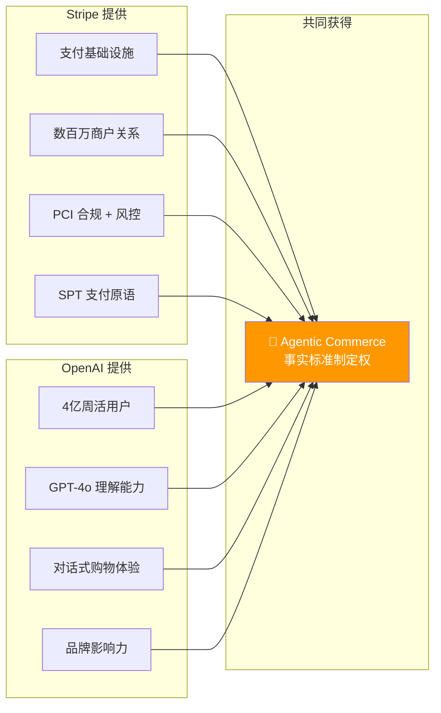

| 维度 | 利益交汇 | 潜在张力 |
|------|---------|---------|
| 标准制定 | 双方都希望 ACP 成为行业标准，获得先发优势 | 标准的控制权归谁？Apache 2.0 开源缓解了这一问题，但 Stripe 对核心 API 的实际控制力更强 |
| 商户关系 | Stripe 带来商户供给，OpenAI 带来用户需求，双边市场互补 | 商户数据归谁？Product Feed 数据流向 Stripe，但 OpenAI 也需要商品数据来训练推荐模型 |
| 收入分配 | 增量交易对双方都是新收入 | 交易佣金如何分成？Stripe 收取支付手续费，OpenAI 的分成比例尚未公开 |
| 开放性 | ACP 开源（Apache 2.0），允许其他 Agent 平台接入 | OpenAI 是否会给 ChatGPT 独占优势？如 Instant Checkout 的优先体验期 |
| 竞品应对 | 联合对抗 Google（AP2）、Amazon（Buy for Me）的竞争 | 如果 Google 或 Amazon 提出更优方案，双方是否会各自"跳船"？ |

#### 1.5.4 Stripe 的竞争格局：三层竞争，三种逻辑

Stripe 做 ACP 不是在和某一个对手竞争，而是同时面对三层不同性质的竞争，优先级和紧迫性各不相同：

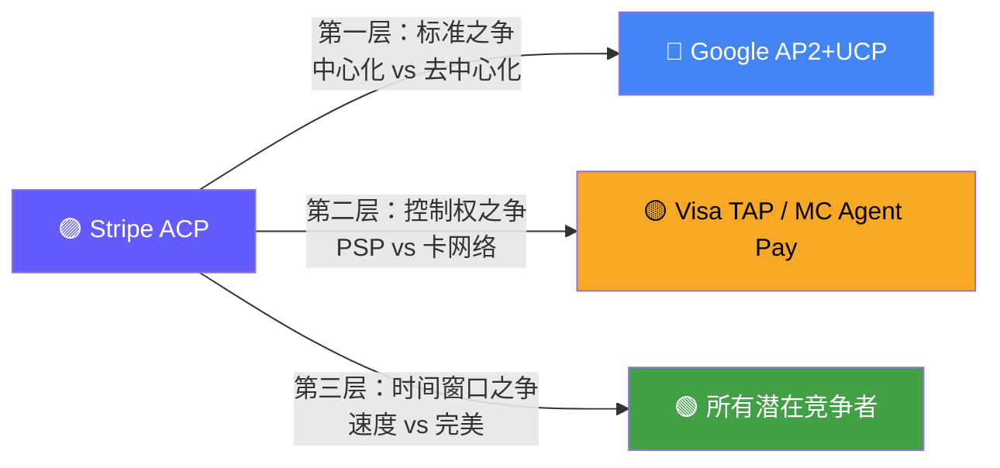

**第一层竞争（最核心）：与 Google AP2+UCP 争夺"Agentic Commerce 事实标准"**

这是 Stripe 最核心的竞争。本质上是两种架构路线的对决：

| 维度 | ACP（中心化路线） | AP2+UCP（去中心化路线） |
|------|------------------|----------------------|
| 架构哲学 | Stripe 作为中心枢纽，所有交易流经 Stripe | Agent 直接与商户交互，无中心节点 |
| 商户关系 | 商户通过 Stripe 接入，Stripe 掌控商户关系 | 商户独立暴露能力，任何 Agent 可直接对接 |
| 支付方式 | 绑定 Stripe 支付体系 | 支付方式无关（Payment-agnostic） |
| 信任模型 | Stripe 平台背书 | 加密签名（VC + DID）去中心化验证 |
| 如果胜出 | Stripe 成为 Agentic Commerce 的"操作系统"，不可替代 | Stripe 沦为众多可替换 PSP 之一，与 Adyen、Square 无差异 |

这不是"谁的技术更好"的竞争，而是"谁定义了 Agent 商务的基本拓扑"。如果 AP2 的去中心化模式成为主流，Stripe 在价值链中的位置将大幅下降——从"商务枢纽"退回到"支付管道"。

**第二层竞争（中等紧迫）：与卡组织争夺"Agent 身份认证与支付授权"控制权**

Visa TAP 和 Mastercard Agent Pay 想让卡网络成为 Agent 的身份认证层——Agent 的"数字身份"由卡网络签发和验证（RFC 9421 HTTP 签名）。如果这条路走通：

- 支付授权回到卡网络体系内，Stripe 的 SPT 失去存在必要
- Agent 通过卡网络认证后可直接与收单行交互，PSP 层变成可选项
- 卡组织从"后台清算管道"升级为"Agent 身份基础设施"

但这个竞争的紧迫性低于 Google，原因有三：卡组织标准制定周期长（通常 2-3 年）；卡组织和 Stripe 在传统支付中是合作关系（Stripe 是卡网络的收单渠道），不太可能正面对抗；卡组织的方案更偏向"增强现有体系"而非"颠覆现有体系"。

**竞争之外：ACP 与卡网络的合作可能性**

事实上，Stripe 与 Visa/Mastercard 的合作逻辑比竞争更强。Stripe 本身就是卡网络的收单渠道——每一笔通过 ACP 完成的信用卡交易，最终都要通过卡网络完成授权和清算。这个底层合作关系在 Agent 时代不会消失，反而可能加深：

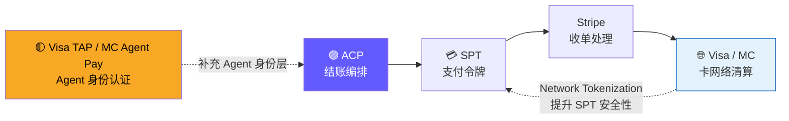

| 合作场景 | 机制 | 各方收益 |
|---------|------|---------|
| Agent 身份认证互补 | Agent 通过 Visa TAP（RFC 9421 HTTP 签名）或 MC Agent Pay 获得卡网络级别身份认证，然后使用 ACP 协议完成结账。ACP 管"怎么买"，TAP/Agent Pay 管"Agent 是谁" | ACP 补上了缺失的独立 Agent 身份验证能力；卡网络在 Agent 商务中获得身份层的控制权 |
| SPT + Network Tokenization | SPT 底层使用 Visa/MC 的 Network Token 而非真实卡号，卡网络能看到 Agent 交易的完整上下文（哪个 Agent、什么场景） | 提升授权通过率、降低欺诈率；对 Stripe、卡网络、商户三方都有利 |
| 风控数据互补 | 卡网络拥有全局跨商户交易数据和欺诈模式，Stripe 拥有商户侧数据和 Radar AI 风控。Agent 交易场景中双方数据互补 | 卡网络识别跨商户异常模式，Stripe 识别单商户内异常行为，联合风控效果优于各自单独运作 |
| 合规与监管协同 | Agent 交易是监管新领域，卡网络与 Stripe 联合制定 Agent 交易的合规标准，比各自为政更有效率 | 降低监管不确定性，加速 Agent 商务的合规落地 |

**为什么合作逻辑强于竞争：** Stripe 和卡网络的关系是"收单行 vs 卡网络"，不是替代关系。ACP 没有试图绕过卡网络（SPT 最终走卡网络结算），TAP/Agent Pay 也没有试图绕过 PSP（它们定义的是 Agent 身份层，不是结账层）。双方在价值链中的位置不同，互补大于冲突。最可能的演进方向是：ACP 成为结账编排标准，TAP/Agent Pay 成为 Agent 身份认证标准，两者在 Stripe 的支付处理层交汇。

**第三层竞争（最务实）：抢占时间窗口，建立网络效应壁垒**

这是 Stripe 最务实也最有把握的策略。Agentic Commerce 还在早期，谁先让足够多的商户和 Agent 平台接入自己的协议，谁就形成了网络效应——后来者即使技术更优，也很难撬动已有生态。

Stripe 的速度优势：

| 里程碑 | 时间 | 意义 |
|--------|------|------|
| ACP 协议发布 | 2025-06 | 抢在 UCP（2026-01）之前 7 个月定义标准 |
| Instant Checkout 上线 | 2025-09 | 从协议到产品仅 3 个月，竞品尚无可比产品 |
| Shopify 100 万+商户接入 | 2025-09 | 一键接入，竞品需要逐个商户谈判 |
| PayPal、Salesforce 加入 | 2025-10 | 生态扩展速度远超竞品 |

网络效应的逻辑：更多商户接入 → Agent 能买到更多商品 → 更多用户使用 → 更多 Agent 平台接入 → 更多商户接入。一旦这个飞轮转起来，AP2 即使技术更优，也很难说服商户"再接入一套协议"。

**一句话总结：** Stripe 做 ACP 的本质是用"速度+生态"对抗 Google 的"技术+开放"，同时在卡组织反应过来之前把自己从支付层升级到商务编排层，让自己在任何竞争格局下都不可替代。

#### 1.5.5 与竞品的商业逻辑对比

| 维度 | ACP (Stripe × OpenAI) | AP2 (Google) | Buy for Me (Amazon) | Visa TAP |
|------|----------------------|-------------|---------------------|----------|
| 核心驱动方 | 支付公司 + AI 公司 | 广告/搜索公司 | 电商平台 | 卡网络 |
| 商业模式 | 支付抽成 + 交易佣金 | 广告收入 + 数据价值 | 电商佣金 + Prime 生态 | 卡网络交易费 |
| 战略目标 | 成为 Agent 商务的结账基础设施 | 成为 Agent 商务的信任与授权层 | 将 Agent 购物锁定在 Amazon 生态内 | 确保卡网络在 Agent 时代不被绕过 |
| 开放程度 | 开源协议，但 Stripe 是实际枢纽 | 开源协议，去中心化设计 | 封闭生态，仅限 Amazon | 开放标准，卡网络中立 |
| 商户立场 | 商户保留 Merchant of Record | 商户直接与 Agent 交互 | 商户是 Amazon 卖家 | 商户通过收单行接入 |
| 谁受益最大 | Stripe（从支付升级为商务平台） | Google（强化广告+搜索入口） | Amazon（巩固电商垄断） | Visa/Mastercard（保住卡网络地位） |

**总结：** ACP 的诞生不是技术驱动，而是商业驱动。Stripe 需要在 Agent 时代保住并扩大自己的商务枢纽地位，OpenAI 需要将 4 亿用户的对话流量变现为交易收入。ACP 是双方利益的最大公约数——Stripe 提供商务基础设施，OpenAI 提供用户和 AI 能力，共同抢占 Agentic Commerce 的事实标准。

## 2. 核心概念与术语 (Key Concepts & Glossary)

- **ACP** (Agentic Commerce Protocol) — OpenAI 与 Stripe 联合发布的开放商务协议，覆盖商品发现、结账和支付
- **Product Feed Spec** (商品数据规范) — ACP 的第一个子规范，定义商户如何向 Agent 平台提供商品数据
- **Agentic Checkout Spec** (结账规范) — ACP 的第二个子规范，定义 Agent 与商户之间的结账 API 交互
- **Delegated Payment Spec** (委托支付规范) — ACP 的第三个子规范，定义安全的委托支付令牌机制
- **SharedPaymentToken (SPT)** — Stripe 设计的核心支付原语，商户限定、金额限定、时间限定、一次性使用的委托支付令牌
- **Checkout Session** (结账会话) — ACP 结账流程的核心对象，代表一次完整的购物车到支付的交互
- **Rich Cart State** (富购物车状态) — 结账会话返回的完整购物车信息，包含商品、定价、税费、配送、折扣、总计等
- **Instant Checkout** (即时结账) — ChatGPT 中基于 ACP 实现的嵌入式购物体验
- **Merchant of Record** (交易记录商户) — 在 ACP 中，商户保留 Merchant of Record 身份，负责订单履约和客户服务
- **Product Feed** (商品数据源) — 商户向 Agent 平台推送的结构化商品数据，支持 TSV/CSV/XML/JSON 格式
- **Webhook** — ACP 中用于订单生命周期管理的事件通知机制
- **Network Tokenization** (网络令牌化) — Stripe 支持的卡网络级别令牌化，进一步提升支付安全性
- **MCP Server** — ACP 可实现为 MCP (Model Context Protocol) Server，让任何兼容 MCP 的 Agent 调用

## 3. 发展历程 (History & Evolution)

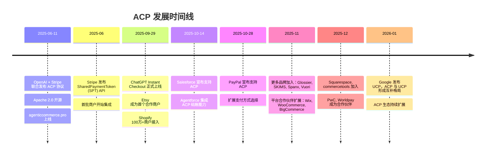

| 时间 | 事件 | 意义 |
|------|------|------|
| 2025-06-11 | ACP 协议发布 | 首个专为 Agent 结账设计的开放协议，填补结账编排层空白 |
| 2025-06 | SPT API 发布 | Stripe 的核心支付创新——安全的委托支付令牌 |
| 2025-09-29 | ChatGPT Instant Checkout 上线 | 全球首个大规模落地的 AI Agent 购物体验 |
| 2025-10-14 | Salesforce 加入 | 企业级 CRM 巨头接入，ACP 进入 B2B 领域 |
| 2025-10-28 | PayPal 加入 | 扩展支付方式，不再仅限于 Stripe 处理 |
| 2025-11 | 品牌和平台大规模接入 | 从早期采用进入规模化阶段 |
| 2026-01 | UCP 发布 | ACP 与 UCP 形成"结账编排 + 全旅程标准"的互补格局 |


## 4. 业务场景 (Use Cases)

### 4.1 参与角色 (Actors)

ACP 生态中涉及五类核心角色：

| 角色 | 说明 | 典型代表 |
|------|------|---------|
| 👤 消费者 (Consumer) | 发起购物意图的终端用户 | ChatGPT 用户 |
| 🤖 AI Agent | 代替用户执行购物任务的智能体 | ChatGPT、Claude、自建 Agent |
| 🏪 商户 (Merchant) | 提供商品和服务的卖方 | Etsy、Glossier、SKIMS、Shopify 商户 |
| 💳 支付服务商 (PSP) | 处理支付和签发 SPT 的中间方 | Stripe、PayPal |
| 👨‍💻 开发者 (Developer) | 构建 Agent 应用或商户集成的技术人员 | Agent 平台开发者、商户技术团队 |
| 🏢 企业采购方 (Enterprise Buyer) | 通过企业 Agent 执行 B2B 采购的组织 | Salesforce Agentforce 用户 |

### 4.2 用例总览图 (Use Case Diagram)

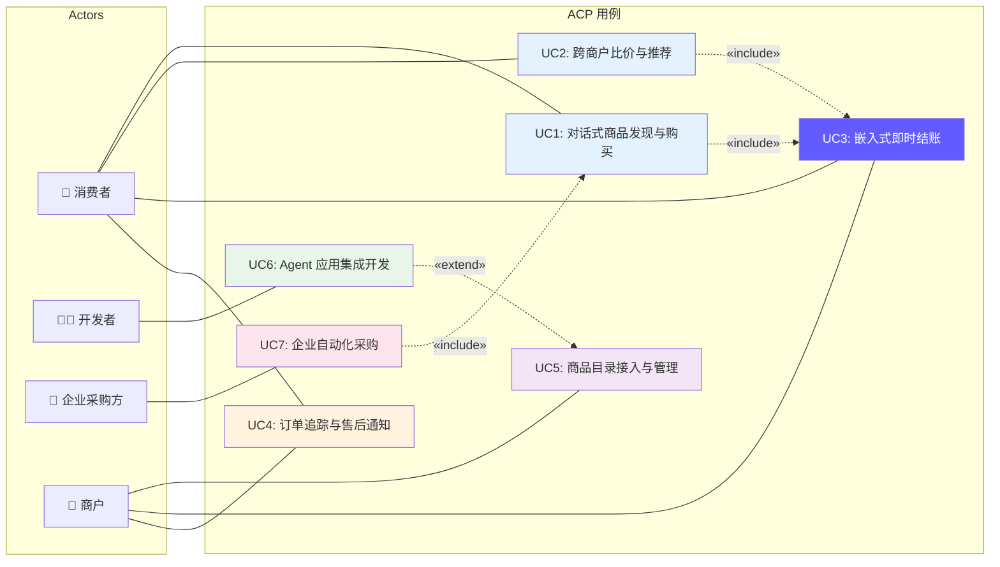

### 4.3 消费者场景

#### UC1: 对话式商品发现与购买

用户通过自然语言与 AI Agent 对话，Agent 从 Product Feed 中匹配商品，引导用户完成从发现到购买的完整流程。这是 ACP 最核心的端到端场景。

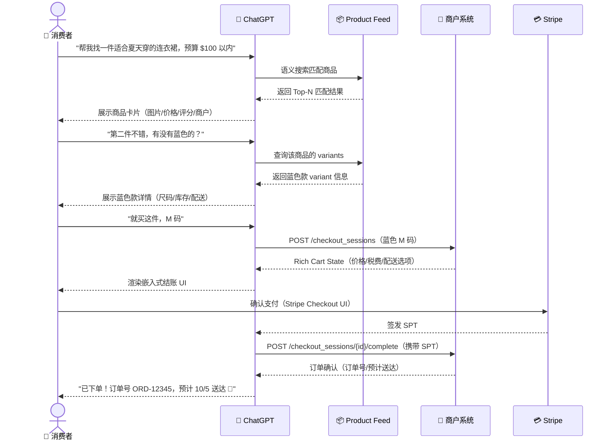

场景要点：
- 用户全程在 ChatGPT 对话界面内完成，无需跳转到任何外部网站
- Agent 利用 Product Feed 的结构化数据（variants、库存、评分）进行智能匹配和多轮对话
- 结账 UI 由 Stripe Elements 在 Agent 界面内渲染，用户在熟悉的 Stripe 界面中确认支付
- 从"帮我找"到"已下单"可在 2-3 分钟内完成

#### UC2: 跨商户比价与推荐

用户提出购物需求后，Agent 同时从多个商户的 Product Feed 中检索匹配商品，进行价格、评价、配送等多维度比较，帮助用户做出最优选择。

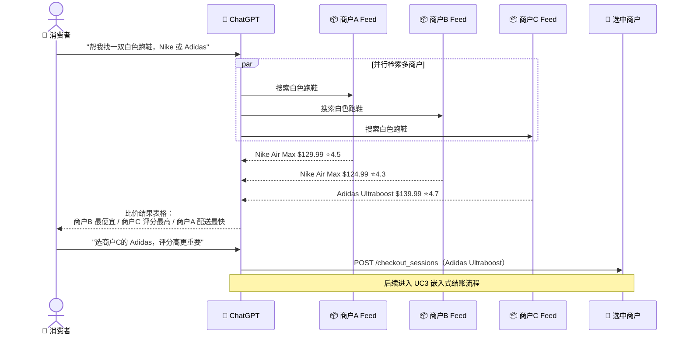

场景要点：
- Agent 利用多个商户的 Product Feed 并行检索，实现跨商户比价——这是传统电商中用户需要手动打开多个网站才能完成的操作
- Product Feed 中的 `performance_signals`（转化率/退货率）和 `reviews`（评分/评论数）为 Agent 提供了推荐排序的依据
- Agent 可以根据用户偏好（价格优先 / 评分优先 / 配送速度优先）智能排序

#### UC3: 嵌入式即时结账

用户确认购买意向后，结账 UI 在 Agent 界面内展开，用户无需跳转即可完成地址确认、配送选择、支付确认的完整结账流程。这是 ACP 的核心交互场景，被 UC1、UC2、UC7 等场景 include。

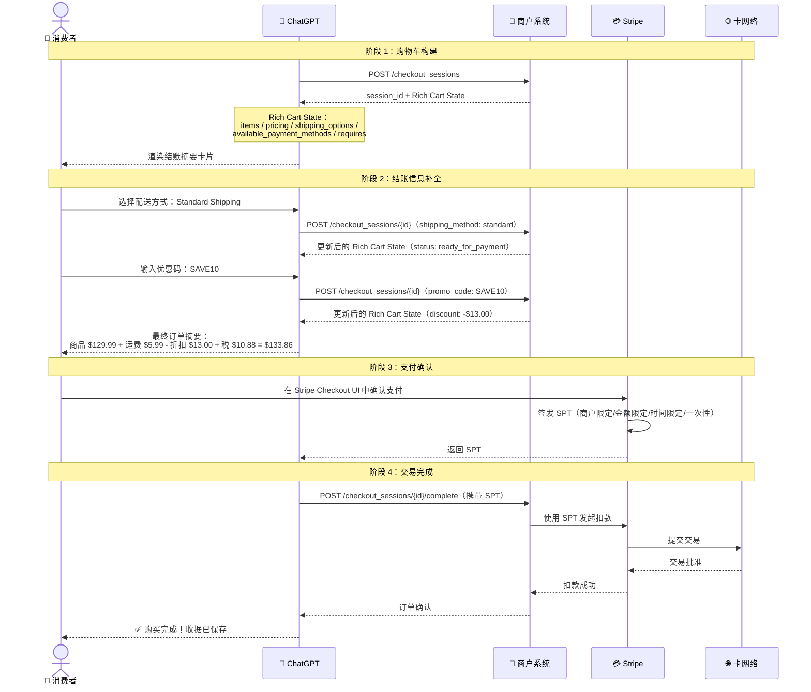

场景要点：
- 结账流程分为四个清晰阶段：购物车构建 → 信息补全 → 支付确认 → 交易完成
- Rich Cart State 是结账交互的核心数据结构，每次更新都返回完整的购物车状态（items / pricing / shipping / discounts / totals / status）
- `requires` 字段告诉 Agent 还需要补全哪些信息（如配送方式选择），当 `requires` 为空时状态变为 `ready_for_payment`
- 用户的真实卡号全程不暴露给 Agent 或商户——支付确认在 Stripe UI 中完成，Agent 只拿到 SPT

#### UC4: 订单追踪与售后通知

用户完成购买后，商户通过 Webhook 事件向 Agent 平台推送订单状态更新，Agent 在对话中主动通知用户。

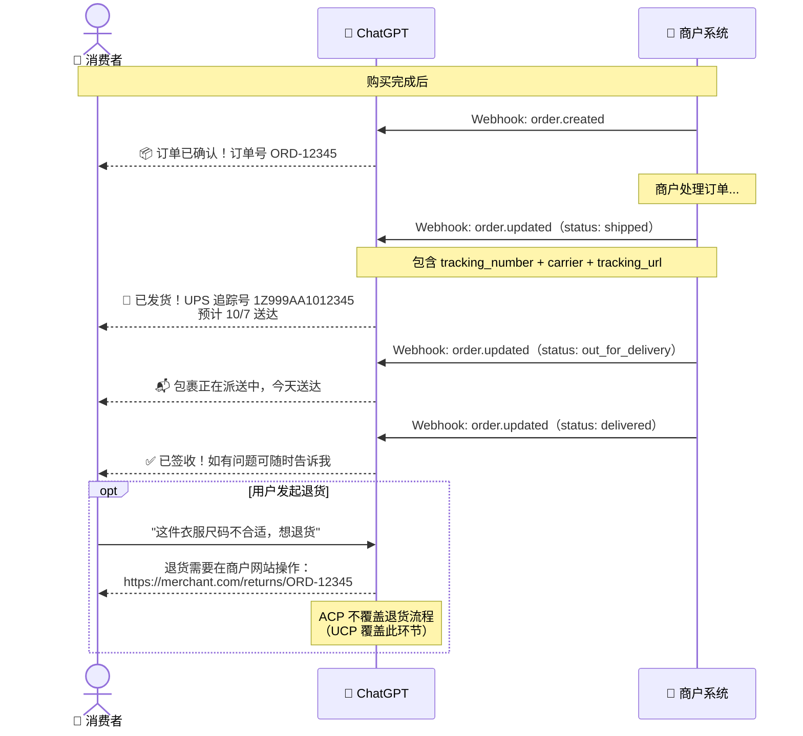

场景要点：
- Webhook 事件驱动的异步通知模式——商户在订单状态变更时主动推送，Agent 被动接收并通知用户
- ACP 覆盖了订单创建、发货、配送、签收等正向流程的通知
- 退货/退款等售后流程不在 ACP 覆盖范围内（这是 UCP 的职责），Agent 会引导用户到商户网站操作

### 4.4 商户场景

#### UC5: 商品目录接入与管理

商户通过 Product Feed Spec 将商品数据推送到 Agent 平台，使商品可被 AI Agent 发现和推荐。商户可以通过电商平台插件（零代码）或直接 API 两种方式接入。

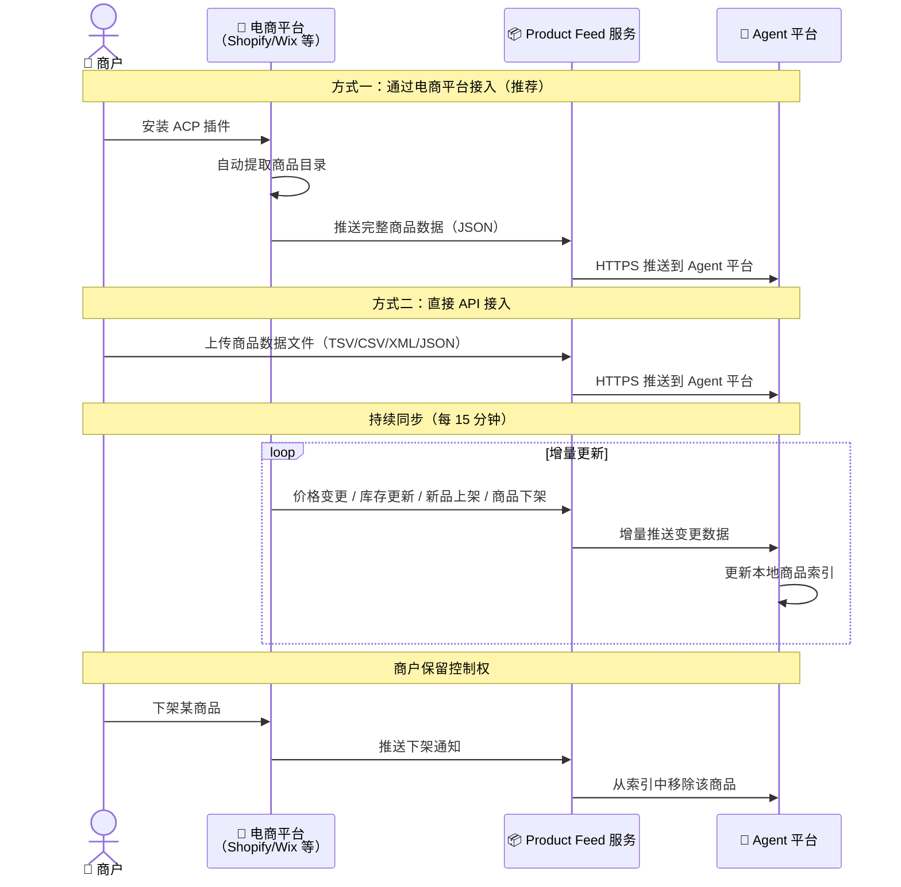

场景要点：
- 商户有两种接入路径：通过电商平台插件（Shopify 100 万+商户可一键接入）或直接 API 集成
- Product Feed 支持 TSV/CSV/XML/JSON 四种格式，兼容不同商户的技术栈
- 每 15 分钟增量同步确保价格和库存的准实时性
- 商户始终保留商品上下架的控制权——下架商品会从 Agent 平台的索引中移除

### 4.5 开发者场景

#### UC6: Agent 应用集成开发

开发者将 ACP 能力集成到自己的 Agent 应用中，有三种集成方式：MCP Server、REST API、电商平台插件。

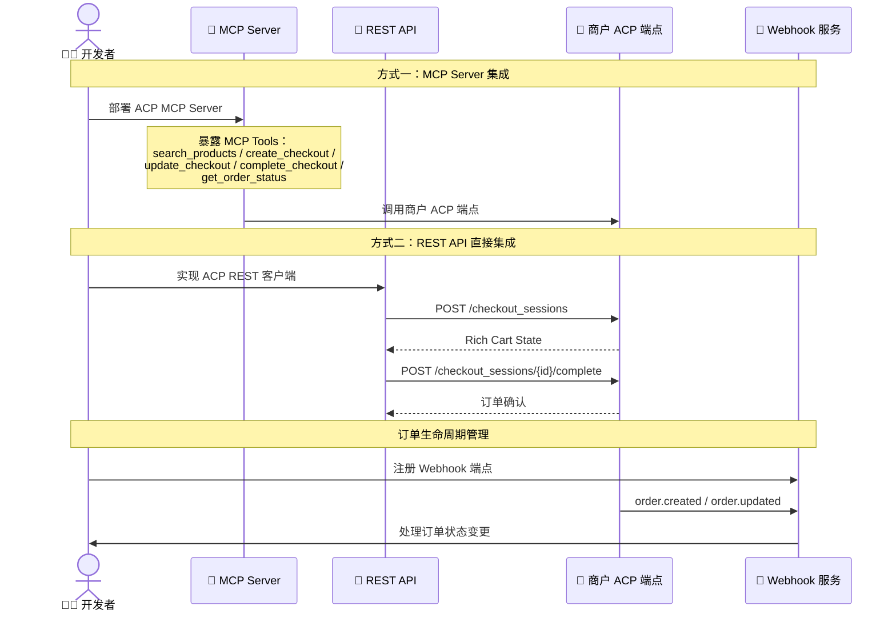

场景要点：
- MCP Server 方式让任何兼容 MCP 的 Agent（Claude、Gemini、自建 Agent 等）都能调用 ACP 结账能力，是跨平台互操作的关键
- REST API 方式适用于非 MCP 环境，开发者直接调用 5 个标准端点
- Webhook 集成实现订单生命周期的自动化管理（创建→发货→配送→签收）

### 4.6 企业 B2B 场景

#### UC7: 企业自动化采购

企业通过 Salesforce Agentforce 等平台构建内部采购 Agent，使用 ACP 自动发现供应商商品、比较报价、完成采购订单。

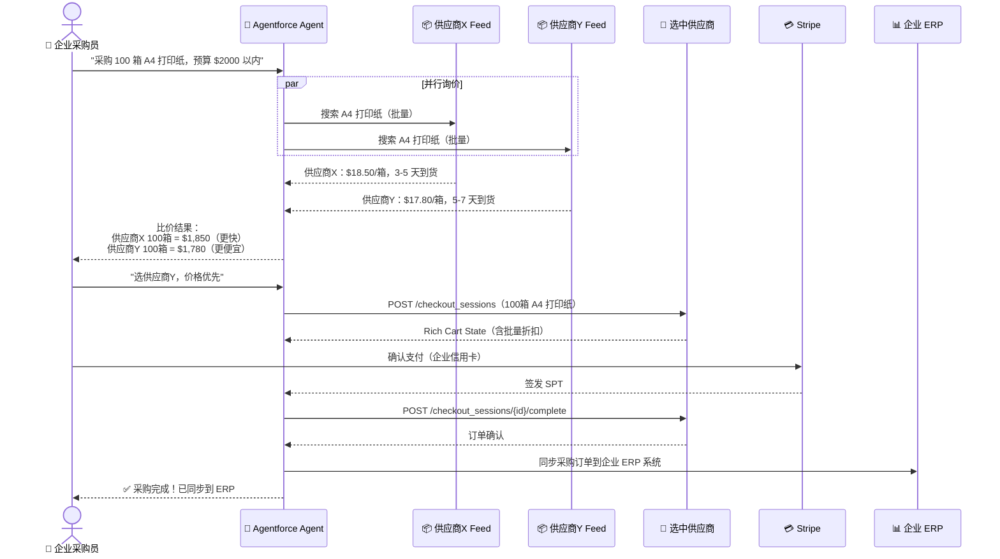

场景要点：
- 企业采购场景复用了消费者场景的核心流程（商品发现 → 比价 → 结账），但增加了企业特有的需求：批量采购、预算控制、ERP 同步
- Salesforce Agentforce 是目前 ACP 在企业 B2B 场景的主要落地平台
- 当前 ACP 的 SPT 单次授权模型在企业场景中存在局限——企业通常需要"预算范围内自动采购"的预授权能力（这是 AP2 Mandate 的优势领域）

### 4.7 用例与 ACP 子规范映射

| 用例 | Product Feed Spec | Agentic Checkout Spec | Delegated Payment Spec | Webhook |
|------|:-:|:-:|:-:|:-:|
| UC1: 对话式商品发现与购买 | ✅ 商品搜索 | ✅ 创建/完成结账 | ✅ SPT 支付 | ✅ 订单通知 |
| UC2: 跨商户比价与推荐 | ✅ 多商户检索 | — | — | — |
| UC3: 嵌入式即时结账 | — | ✅ 核心流程 | ✅ SPT 支付 | — |
| UC4: 订单追踪与售后通知 | — | ✅ 查询状态 | — | ✅ 状态推送 |
| UC5: 商品目录接入与管理 | ✅ 数据推送 | — | — | — |
| UC6: Agent 应用集成开发 | ✅ MCP/REST | ✅ MCP/REST | ✅ SPT 集成 | ✅ Webhook |
| UC7: 企业自动化采购 | ✅ 供应商检索 | ✅ 批量结账 | ✅ SPT 支付 | ✅ ERP 同步 |

### 4.8 业务逻辑关系总览

下图以线框图形式展示 ACP 生态中五大核心实体之间的业务逻辑关系：

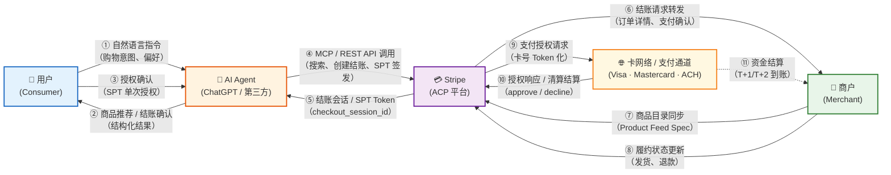

**关系说明：**

| 编号 | 关系路径 | 协议 / 机制 | 说明 |
|:---:|----------|------------|------|
| ①② | 用户 ↔ Agent | 自然语言 / UI | 用户通过对话或界面向 Agent 表达购物意图，Agent 返回结构化的商品推荐与结账摘要 |
| ③ | 用户 → Agent | SPT 授权 | 用户对单笔交易进行显式授权（Session Payment Token），确保"人在回路" |
| ④⑤ | Agent ↔ Stripe | MCP Server / REST API | Agent 调用 Stripe 提供的三大子规范接口：Product Feed（搜索）、Agentic Checkout（结账）、Delegated Payment（支付） |
| ⑥ | Stripe → 商户 | Checkout API / Webhook | Stripe 将结账请求转发至商户，商户确认库存并创建订单 |
| ⑦ | 商户 → Stripe | Product Feed Spec | 商户通过 Stripe Dashboard 或 API 将商品目录同步至 Stripe，供 Agent 检索 |
| ⑧ | 商户 → Stripe | Webhook 回调 | 商户将履约状态（发货、退款、取消）推送回 Stripe，Stripe 再通知 Agent |
| ⑨⑩ | Stripe ↔ 卡网络 | ISO 8583 / Token 化 | Stripe 作为收单方向卡网络发起支付授权，卡网络返回批准/拒绝结果 |
| ⑪ | 卡网络 → 商户 | 清算结算 | 资金通过卡网络清算后结算至商户账户（通常 T+1 或 T+2） |

**核心洞察：**

- Stripe 处于整个业务关系的枢纽位置——它同时连接 Agent（技术接口）、商户（商品与履约）和卡网络（资金流转），这是 ACP 与 AP2（Google 模式）的根本区别：AP2 让 Agent 直接与商户交互，而 ACP 通过 Stripe 做中心化中介
- 用户与卡网络之间没有直接关系——所有支付授权都通过 Stripe 代理完成，用户只需对 Agent 进行 SPT 授权，无需感知底层支付通道
- 商户与 Agent 之间也没有直接关系——商户只需对接 Stripe（而非每个 Agent），这大幅降低了商户的集成成本

## 5. 技术架构 (Architecture)

### 5.1 整体架构

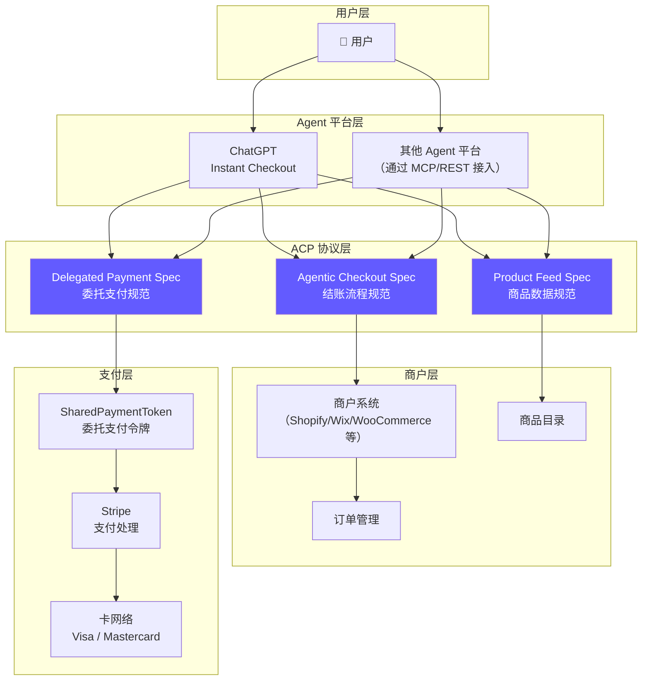

### 5.2 三大子规范关系

```mermaid
graph LR
    PF["📦 Product Feed Spec<br/>商品数据 · TSV/CSV/XML/JSON · 每15分钟更新"] -->|"Agent 发现商品"| AC["🛒 Agentic Checkout Spec<br/>结账流程 · REST API · 5个核心端点"] -->|"结账需要支付"| DP["💳 Delegated Payment Spec<br/>委托支付 · SharedPaymentToken · 一次性安全令牌"]

    style PF fill:#e3f2fd
    style AC fill:#fff3e0
    style DP fill:#f3e5f5
```

### 5.3 完整交易流程

```mermaid
sequenceDiagram
    participant 用户
    participant Agent as ChatGPT / Agent
    participant PF as Product Feed
    participant 商户 as 商户系统
    participant Stripe
    participant 卡网络
    
    Note over 用户,卡网络: 阶段 1：商品发现（Product Feed Spec）
    PF->>Agent: 推送商品数据（每 15 分钟更新）
    Note over PF,Agent: 格式：TSV/CSV/XML/JSON<br/>内容：商品描述、价格、库存、媒体、评论
    用户->>Agent: "帮我找一双白色跑鞋"
    Agent->>Agent: 从 Product Feed 中匹配商品
    Agent-->>用户: 展示匹配商品列表
    
    Note over 用户,卡网络: 阶段 2：结账流程（Agentic Checkout Spec）
    用户->>Agent: 选择商品，确认购买
    Agent->>商户: POST /checkout_sessions（创建结账会话）
    商户-->>Agent: 返回 session_id + Rich Cart State
    Note over Agent,商户: Rich Cart State 包含：<br/>items, pricing, taxes, fees,<br/>shipping, discounts, totals, status
    Agent->>商户: POST /checkout_sessions/{id}（更新：选择配送方式等）
    商户-->>Agent: 返回更新后的 Rich Cart State
    Agent-->>用户: 在 Agent 界面内渲染结账 UI
    
    Note over 用户,卡网络: 阶段 3：委托支付（Delegated Payment Spec）
    用户->>Stripe: 确认支付（Stripe Checkout UI）
    Stripe->>Stripe: 签发 SharedPaymentToken (SPT)
    Note over Stripe: SPT 属性：<br/>商户限定 (merchant-scoped)<br/>金额限定 (amount-bounded)<br/>时间限定 (time-limited)<br/>一次性使用 (single-use)
    Stripe-->>Agent: 返回 SPT
    Agent->>商户: POST /checkout_sessions/{id}/complete（携带 SPT）
    商户->>Stripe: 使用 SPT 扣款
    Stripe->>卡网络: 提交交易
    卡网络-->>Stripe: 交易批准
    Stripe-->>商户: 扣款成功
    商户-->>Agent: 订单确认
    Agent-->>用户: 购买完成 + 收据
    
    Note over 商户,Agent: 阶段 4：订单生命周期（Webhook）
    商户->>Agent: Webhook: order.created
    商户->>Agent: Webhook: order.updated（发货、配送等）
```


### 5.4 ChatGPT Instant Checkout 实现架构

ChatGPT Instant Checkout 是 ACP 的首个大规模落地实现，展示了 ACP 在真实产品中的完整应用。

#### 架构概览

```mermaid
graph TD
    subgraph ChatGPT 前端
        UI["ChatGPT 对话界面"]
        CHECKOUT_UI["嵌入式结账 UI<br/>（Stripe Elements 渲染）"]
        RECEIPT["订单收据展示"]
    end
    
    subgraph ChatGPT 后端
        INTENT["意图理解引擎<br/>（GPT-4o）"]
        SEARCH["商品搜索引擎<br/>（基于 Product Feed）"]
        ORCHESTRATOR["结账编排器<br/>（ACP 协议实现）"]
    end
    
    subgraph 外部服务
        MERCHANT_API["商户 API<br/>（ACP Checkout 端点）"]
        STRIPE_API["Stripe API<br/>（SPT 签发与处理）"]
        WEBHOOK_SVC["Webhook 服务<br/>（订单状态更新）"]
    end
    
    UI --> INTENT
    INTENT --> SEARCH
    SEARCH --> ORCHESTRATOR
    ORCHESTRATOR --> MERCHANT_API
    ORCHESTRATOR --> STRIPE_API
    STRIPE_API --> CHECKOUT_UI
    WEBHOOK_SVC --> RECEIPT
    MERCHANT_API --> WEBHOOK_SVC
    
    style ORCHESTRATOR fill:#635BFF,color:#fff
```

#### 用户体验流程

```mermaid
flowchart LR
    A["用户对话<br/>'帮我找一件绿色冬季夹克'"] --> B["GPT-4o 意图理解<br/>Product Feed 搜索"]
    B --> C["展示商品卡片"]
    C --> D{"用户选择"}
    D -->|"点击商品"| E["商品详情"]
    D -->|"更多选项"| B
    E --> F["点击 Buy"]
    F --> G["嵌入式结账 UI<br/>Stripe Elements"]
    G --> H["确认地址/支付/摘要"]
    H --> I["SPT 签发<br/>完成结账"]
    I --> J["订单确认 + 收据"]

    style F fill:#635BFF,color:#fff
    style I fill:#635BFF,color:#fff
```

#### 支持的商品类型

| 商品类型 | 支持状态 | 说明 |
|---------|---------|------|
| 实体商品 | ✅ 已支持 | 服装、鞋类、电子产品、家居用品等 |
| 数字商品 | ✅ 已支持 | 软件许可、数字内容等 |
| 订阅服务 | ✅ 已支持 | 定期配送、会员服务等 |
| 异步购买 | ✅ 已支持 | 预购、定制商品等 |

### 5.5 商户对接流程

商户接入 ACP 有三种路径，复杂度从低到高：

#### 对接路径总览

```mermaid
graph LR
    M["🏪 商户"] --> P1["路径①：平台插件<br/>零代码接入"]
    M --> P2["路径②：REST API<br/>标准化对接"]
    M --> P3["路径③：自建 MCP Server<br/>完全自定义"]

    P1 --> LIVE["✅ 上线"]
    P2 --> LIVE
    P3 --> LIVE

    style P1 fill:#E8F5E9,stroke:#2E7D32
    style P2 fill:#FFF3E0,stroke:#E65100
    style P3 fill:#F3E5F5,stroke:#6A1B9A
    style LIVE fill:#635BFF,color:#fff
```

#### 路径①：平台插件（零代码接入）

适用于使用 Shopify、Wix、WooCommerce、BigCommerce、Squarespace、commercetools 等电商平台的商户。

```mermaid
sequenceDiagram
    participant 商户 as 商户管理员
    participant 平台 as 电商平台 (Shopify 等)
    participant Stripe as Stripe
    participant ACP as ACP 生态

    商户->>平台: 1. 在平台应用商店安装 ACP 插件
    平台->>Stripe: 2. 自动同步商品目录 (Product Feed)
    平台->>Stripe: 3. 自动注册 Checkout 端点
    Stripe->>ACP: 4. 商品数据进入 Agent 可搜索索引
    Note over 商户: 完成！无需编写代码
    ACP-->>商户: 5. 开始接收 Agent 渠道订单
```

| 步骤 | 操作 | 耗时 |
|------|------|------|
| 安装插件 | 在电商平台应用商店一键安装 | 5 分钟 |
| 配置 Stripe | 关联 Stripe 账户（多数商户已有） | 10 分钟 |
| 商品同步 | 插件自动将商品目录推送至 Stripe | 自动 |
| 上线 | 商品出现在 ChatGPT 等 Agent 搜索结果中 | 24-48 小时 |

#### 路径②：REST API（标准化对接）

适用于自建电商系统的商户，需要实现 ACP 定义的 5 个标准 REST 端点。

```mermaid
sequenceDiagram
    participant 商户 as 商户开发团队
    participant Stripe as Stripe
    participant Agent as Agent 平台

    商户->>Stripe: 1. 注册 Stripe 账户，获取 API Key
    商户->>Stripe: 2. 按 Product Feed Spec 推送商品数据
    商户->>商户: 3. 实现 5 个 Checkout REST 端点
    Note over 商户: POST /checkout_sessions<br/>GET /checkout_sessions/{id}<br/>POST /checkout_sessions/{id}<br/>POST /checkout_sessions/{id}/complete<br/>POST /checkout_sessions/{id}/expire
    商户->>Stripe: 4. 集成 SPT 支付处理
    商户->>Stripe: 5. 配置 Webhook 接收订单事件
    Stripe->>Agent: 6. 商户上线，Agent 可发起结账
```

| 步骤 | 工作量 | 说明 |
|------|--------|------|
| Stripe 注册 | 1 天 | 账户注册 + API Key 配置 |
| Product Feed 推送 | 2-3 天 | 将商品目录转换为 ACP 格式并推送 |
| 5 个 REST 端点 | 1-2 周 | 核心开发工作，需对接现有订单系统 |
| SPT 支付集成 | 2-3 天 | 调用 Stripe API 处理 SPT 扣款 |
| Webhook 配置 | 1-2 天 | 订单状态变更通知 |
| 测试与上线 | 1 周 | 端到端测试 + 灰度上线 |

#### 路径③：自建 MCP Server（完全自定义）

适用于希望让任何 MCP 兼容 Agent（不限于 ChatGPT）调用自己商品和结账能力的商户或开发者。

```mermaid
sequenceDiagram
    participant 开发者 as 商户/开发者
    participant MCP as MCP Server
    participant Stripe as Stripe
    participant Agent as 任意 MCP Agent

    开发者->>Stripe: 1. 注册 Stripe 账户，获取 API Key（与路径②相同）
    开发者->>Stripe: 2. 按 Product Feed Spec 推送商品数据
    开发者->>MCP: 3. 开发 MCP Server，使用 Stripe API Key 对接 Stripe
    MCP->>MCP: 4. 封装 ACP 能力为 MCP Tools (search, checkout, pay...)
    Agent->>MCP: 5. Agent 通过 MCP 协议发现并调用 Tools
    MCP->>Stripe: 6. MCP Server 使用 Stripe API Key 转发请求
    Stripe-->>MCP: 7. 返回结账结果 / SPT
    MCP-->>Agent: 8. 返回 MCP Tool 响应
```

> **注意：** 路径③并不绕过 Stripe。MCP Server 只是改变了 Agent 侧的调用协议（从 REST 变为 MCP），商户侧对 Stripe 的依赖完全不变——仍需 Stripe API Key、Product Feed 推送和 SPT 支付处理。这再次印证了 Stripe 在 ACP 架构中不可绕过的枢纽地位。

| 优势 | 说明 |
|------|------|
| Agent 平台无关 | 不限于 ChatGPT，Claude、Gemini、自建 Agent 均可调用 |
| 能力可组合 | 可将 ACP 结账能力与其他 MCP Tools（库存查询、客服等）组合 |
| 完全控制 | 商户完全控制 MCP Server 的逻辑、权限和数据 |

### 5.6 MCP Server 实现方式

ACP 可以实现为 MCP (Model Context Protocol) Server，让任何兼容 MCP 的 Agent 调用结账能力。

#### MCP Server 架构

```mermaid
graph LR
    AGENT["任何 MCP 兼容 Agent<br/>（Claude, Gemini, 自建 Agent 等）"] -->|"MCP 工具调用"| TOOLS["MCP Tools"]
    TOOLS --> T1["search_products"]
    TOOLS --> T2["create_checkout"]
    TOOLS --> T3["update_checkout"]
    TOOLS --> T4["complete_checkout"]
    TOOLS --> T5["get_order_status"]
    T1 & T2 & T3 & T4 & T5 --> MERCHANT["商户 ACP API"]

    style TOOLS fill:#635BFF,color:#fff
```

#### MCP Tool 定义示例

```json
{
  "name": "create_checkout",
  "description": "创建一个新的结账会话，将商品添加到购物车",
  "input_schema": {
    "type": "object",
    "properties": {
      "merchant_id": {
        "type": "string",
        "description": "商户标识符"
      },
      "items": {
        "type": "array",
        "items": {
          "type": "object",
          "properties": {
            "product_id": {"type": "string"},
            "variant_id": {"type": "string"},
            "quantity": {"type": "integer"}
          },
          "required": ["product_id", "quantity"]
        }
      },
      "customer_email": {
        "type": "string",
        "description": "客户邮箱地址"
      },
      "shipping_address": {
        "type": "object",
        "description": "配送地址"
      }
    },
    "required": ["merchant_id", "items"]
  }
}
```


## 6. 技术规范详解 (Technical Deep Dive)

### 6.1 Product Feed Specification（商品数据规范）

Product Feed 是 ACP 的数据基础，定义了商户如何向 Agent 平台提供结构化的商品信息。

#### 数据格式与传输

| 特性 | 说明 |
|------|------|
| 支持格式 | TSV（Tab-Separated Values）、CSV、XML、JSON |
| 传输方式 | HTTPS 加密推送（Push 模型） |
| 更新频率 | 最快每 15 分钟同步库存和价格 |
| 数据内容 | 商品描述、媒体资源、评论、性能信号、库存状态、定价 |

#### 商品数据结构

```json
{
  "product_id": "SKU-12345",
  "title": "Nike Air Max 白色跑鞋",
  "description": "轻量化设计，适合日常跑步训练...",
  "price": {
    "amount": 129.99,
    "currency": "USD"
  },
  "availability": "in_stock",
  "inventory_count": 42,
  "images": [
    {
      "url": "https://merchant.com/images/shoe-white-1.jpg",
      "alt_text": "Nike Air Max 白色跑鞋正面图"
    }
  ],
  "categories": ["shoes", "running", "athletic"],
  "brand": "Nike",
  "variants": [
    {
      "variant_id": "SKU-12345-42",
      "size": "42",
      "color": "white",
      "price": {"amount": 129.99, "currency": "USD"},
      "availability": "in_stock"
    }
  ],
  "shipping": {
    "methods": ["standard", "express"],
    "estimated_delivery": "3-5 business days"
  },
  "reviews": {
    "average_rating": 4.5,
    "review_count": 1234
  },
  "performance_signals": {
    "conversion_rate": 0.12,
    "return_rate": 0.03
  }
}
```

#### 数据同步机制

```mermaid
sequenceDiagram
    participant 商户 as 商户系统
    participant Feed as Product Feed 服务
    participant Agent as Agent 平台
    
    Note over 商户,Agent: 初始同步
    商户->>Feed: 上传完整商品目录
    Feed->>Agent: HTTPS 推送完整数据
    
    Note over 商户,Agent: 增量更新（每 15 分钟）
    loop 每 15 分钟
        商户->>Feed: 推送变更数据（价格/库存/新品/下架）
        Feed->>Agent: HTTPS 增量推送
        Agent->>Agent: 更新本地商品索引
    end
    
    Note over 商户,Agent: 实时库存检查
    Agent->>商户: 结账时实时验证库存
    商户-->>Agent: 确认库存可用
```

### 6.2 Agentic Checkout Specification（结账规范）

结账规范定义了 Agent 与商户之间的标准化结账 API，是 ACP 的核心交互层。

#### 五个核心 REST 端点

| 端点 | 方法 | 功能 | 说明 |
|------|------|------|------|
| `/checkout_sessions` | POST | 创建结账会话 | 初始化购物车，传入商品和数量 |
| `/checkout_sessions/{id}` | POST | 更新结账会话 | 修改购物车内容、选择配送方式、应用优惠码等 |
| `/checkout_sessions/{id}` | GET | 获取会话状态 | 查询当前购物车状态和结账进度 |
| `/checkout_sessions/{id}/complete` | POST | 完成结账 | 提交支付凭证，完成交易 |
| `/checkout_sessions/{id}/cancel` | POST | 取消结账 | 取消当前结账会话 |

#### 结账会话状态机

```mermaid
stateDiagram-v2
    [*] --> not_ready_for_payment: POST /checkout_sessions
    not_ready_for_payment --> not_ready_for_payment: POST /checkout_sessions/{id}<br/>(更新购物车)
    not_ready_for_payment --> ready_for_payment: 所有必填信息完整
    ready_for_payment --> not_ready_for_payment: POST /checkout_sessions/{id}<br/>(修改导致信息不完整)
    ready_for_payment --> completed: POST /checkout_sessions/{id}/complete
    ready_for_payment --> canceled: POST /checkout_sessions/{id}/cancel
    not_ready_for_payment --> canceled: POST /checkout_sessions/{id}/cancel
    completed --> [*]
    canceled --> [*]
```

#### 创建结账会话 — 请求与响应示例

**请求：**

```http
POST /checkout_sessions
Content-Type: application/json

{
  "items": [
    {
      "product_id": "SKU-12345",
      "variant_id": "SKU-12345-42",
      "quantity": 1
    }
  ],
  "customer": {
    "email": "user@example.com",
    "shipping_address": {
      "line1": "123 Main St",
      "city": "San Francisco",
      "state": "CA",
      "postal_code": "94105",
      "country": "US"
    }
  },
  "metadata": {
    "agent_platform": "chatgpt",
    "session_context": "user requested white running shoes"
  }
}
```

**响应（Rich Cart State）：**

```json
{
  "id": "cs_abc123def456",
  "status": "not_ready_for_payment",
  "items": [
    {
      "product_id": "SKU-12345",
      "variant_id": "SKU-12345-42",
      "title": "Nike Air Max 白色跑鞋",
      "quantity": 1,
      "unit_price": {"amount": 129.99, "currency": "USD"},
      "image_url": "https://merchant.com/images/shoe-white-1.jpg"
    }
  ],
  "pricing": {
    "subtotal": {"amount": 129.99, "currency": "USD"},
    "shipping": {"amount": 5.99, "currency": "USD"},
    "tax": {"amount": 10.88, "currency": "USD"},
    "discount": {"amount": 0, "currency": "USD"},
    "total": {"amount": 146.86, "currency": "USD"}
  },
  "shipping_options": [
    {
      "id": "standard",
      "name": "Standard Shipping",
      "price": {"amount": 5.99, "currency": "USD"},
      "estimated_delivery": "2025-10-05"
    },
    {
      "id": "express",
      "name": "Express Shipping",
      "price": {"amount": 12.99, "currency": "USD"},
      "estimated_delivery": "2025-10-02"
    }
  ],
  "available_payment_methods": ["card", "apple_pay", "google_pay"],
  "requires": ["shipping_method_selection"],
  "created_at": "2025-09-30T10:00:00Z",
  "expires_at": "2025-09-30T11:00:00Z"
}
```

#### 更新结账会话 — 选择配送方式

```http
POST /checkout_sessions/cs_abc123def456
Content-Type: application/json

{
  "shipping_method": "standard",
  "promo_code": "SAVE10"
}
```

**响应：**

```json
{
  "id": "cs_abc123def456",
  "status": "ready_for_payment",
  "items": [...],
  "pricing": {
    "subtotal": {"amount": 129.99, "currency": "USD"},
    "shipping": {"amount": 5.99, "currency": "USD"},
    "tax": {"amount": 10.88, "currency": "USD"},
    "discount": {"amount": -13.00, "currency": "USD"},
    "total": {"amount": 133.86, "currency": "USD"}
  },
  "applied_discounts": [
    {
      "code": "SAVE10",
      "description": "10% off your order",
      "amount": {"amount": -13.00, "currency": "USD"}
    }
  ],
  "selected_shipping": {
    "id": "standard",
    "name": "Standard Shipping",
    "estimated_delivery": "2025-10-05"
  },
  "requires": []
}
```

#### 完成结账

```http
POST /checkout_sessions/cs_abc123def456/complete
Content-Type: application/json

{
  "payment_token": "spt_live_abc123...",
  "payment_method": "card"
}
```

**响应：**

```json
{
  "id": "cs_abc123def456",
  "status": "completed",
  "order": {
    "order_id": "ORD-789012",
    "confirmation_number": "CONF-345678",
    "total": {"amount": 133.86, "currency": "USD"},
    "estimated_delivery": "2025-10-05",
    "tracking_url": "https://merchant.com/track/ORD-789012"
  }
}
```


### 6.3 Delegated Payment Specification（委托支付规范）— SharedPaymentToken (SPT)

SharedPaymentToken (SPT) 是 Stripe 为 ACP 设计的核心支付原语，解决了"Agent 如何安全地代替用户支付"这一关键问题。

#### SPT 核心设计原则

SPT 的设计遵循**最小权限原则**——Agent 获得的支付能力被严格限定在完成当前交易所需的最小范围内：

```mermaid
graph TD
    subgraph "SPT 四大约束"
        A["🏪 商户限定<br/>merchant-scoped<br/>只能在指定商户使用"]
        B["💰 金额限定<br/>amount-bounded<br/>不能超过预设上限"]
        C["⏰ 时间限定<br/>time-limited<br/>过期自动失效"]
        D["1️⃣ 一次性使用<br/>single-use<br/>用后即毁"]
    end
    
    style A fill:#e3f2fd
    style B fill:#fff3e0
    style C fill:#f3e5f5
    style D fill:#e8f5e9
```

#### SPT 签发与使用流程

```mermaid
sequenceDiagram
    participant 用户
    participant Agent
    participant Stripe
    participant 商户
    participant 卡网络
    
    Note over 用户,卡网络: 步骤 1：用户确认授权
    Agent->>用户: 展示结账摘要（商品+价格+配送）
    用户->>Stripe: 在 Stripe Checkout UI 中确认支付
    Note over 用户,Stripe: 用户看到：商户名称、金额、商品摘要<br/>用户操作：选择支付方式、确认授权
    
    Note over 用户,卡网络: 步骤 2：Stripe 签发 SPT
    Stripe->>Stripe: 生成 SharedPaymentToken
    Note over Stripe: SPT 属性：<br/>• merchant_id: "merch_abc123"<br/>• max_amount: $146.86<br/>• currency: "USD"<br/>• expires_at: 1 小时后<br/>• single_use: true<br/>• payment_method: "pm_card_visa_****1234"
    Stripe-->>Agent: 返回 SPT (spt_live_abc123...)
    
    Note over 用户,卡网络: 步骤 3：Agent 使用 SPT 完成支付
    Agent->>商户: 提交 SPT 完成结账
    商户->>Stripe: 使用 SPT 发起扣款
    Stripe->>Stripe: 验证 SPT
    Note over Stripe: 检查项：<br/>✓ 商户 ID 匹配？<br/>✓ 金额 ≤ max_amount？<br/>✓ 未过期？<br/>✓ 未使用过？
    Stripe->>卡网络: 提交交易
    卡网络-->>Stripe: 交易批准
    Stripe-->>商户: 扣款成功
    
    Note over Stripe: SPT 自动失效（一次性）
    
    Note over 用户,卡网络: 步骤 4：安全保障
    Note over Stripe: 即使 SPT 被截获：<br/>❌ 无法在其他商户使用<br/>❌ 无法超额扣款<br/>❌ 无法重复使用<br/>❌ 过期后无法使用
```

#### SPT 安全特性详解

| 安全特性 | 说明 | 防御的攻击场景 |
|---------|------|-------------|
| 商户限定 (merchant-scoped) | SPT 绑定特定商户 ID，只能在该商户使用 | 防止 SPT 被转移到恶意商户 |
| 金额限定 (amount-bounded) | SPT 设定最大可扣金额，实际扣款不能超过此限 | 防止超额扣款 |
| 时间限定 (time-limited) | SPT 有明确的过期时间，过期自动失效 | 防止长期有效的支付凭证被滥用 |
| 一次性使用 (single-use) | SPT 使用一次后立即失效，无法重复使用 | 防止重放攻击 |
| PCI DSS 合规 | 真实卡号从不暴露给 Agent 或商户 | 防止卡号泄露 |
| Network Tokenization | 支持卡网络级别的令牌化 | 进一步隔离真实卡号 |
| 加密传输 | SPT 通过 HTTPS 加密传输 | 防止中间人攻击 |

#### SPT Webhook 事件

Stripe 为 SPT 提供了完整的生命周期事件通知：

| 事件 | 触发时机 | 接收方 |
|------|---------|--------|
| `shared_payment.granted_token.used` | SPT 被商户成功使用扣款 | SPT 签发方（Agent 平台） |
| `shared_payment.granted_token.deactivated` | SPT 被停用（过期/手动停用） | SPT 签发方（Agent 平台） |
| `shared_payment.issued_token.used` | SPT 被使用（从商户视角） | 商户 |
| `shared_payment.issued_token.deactivated` | SPT 被停用（从商户视角） | 商户 |

#### SPT 与其他委托支付方案对比

| 维度 | SPT (ACP/Stripe) | Delegated Vault Token (早期 ACP) | AP2 Mandate | Visa 限定令牌 |
|------|-----------------|--------------------------------|-------------|-------------|
| 签发方 | Stripe | Stripe | Credentials Provider | Visa |
| 约束维度 | 商户+金额+时间+单次 | 商户+金额+时间+单次 | Intent/Cart 约束条件 | 金额+商户类别+时间 |
| 用户确认方式 | Stripe Checkout UI | Stripe Checkout UI | VC 加密签名 | Passkey (FIDO2) |
| 支付方式 | Stripe 支持的所有方式 | Stripe 支持的所有方式 | 支付方式无关 | Visa 网络 |
| 审计能力 | Stripe 交易日志 | Stripe 交易日志 | 不可否认审计链 | TAP 签名链 |
| HNP 支持 | 有限（需预获取 Token） | 有限 | 原生支持 | 支持（预设规则） |

### 6.4 Webhook 与订单生命周期管理

ACP 通过 Webhook 事件驱动订单的生命周期管理，商户在订单状态变更时向 Agent 平台推送通知。

#### 订单 Webhook 事件

```mermaid
sequenceDiagram
    participant 商户
    participant Agent as Agent 平台
    participant 用户
    
    商户->>Agent: Webhook: order.created
    Note over 商户,Agent: 订单已创建，包含订单号和预计配送时间
    Agent-->>用户: 通知：订单已确认
    
    商户->>Agent: Webhook: order.updated (status: shipped)
    Note over 商户,Agent: 订单已发货，包含物流追踪号
    Agent-->>用户: 通知：订单已发货，追踪号 XXX
    
    商户->>Agent: Webhook: order.updated (status: delivered)
    Agent-->>用户: 通知：订单已送达
    
    商户->>Agent: Webhook: order.updated (status: refunded)
    Agent-->>用户: 通知：退款已处理
```

#### Webhook 事件结构

```json
{
  "event_type": "order.updated",
  "event_id": "evt_abc123",
  "timestamp": "2025-10-05T14:30:00Z",
  "data": {
    "order_id": "ORD-789012",
    "checkout_session_id": "cs_abc123def456",
    "status": "shipped",
    "tracking": {
      "carrier": "UPS",
      "tracking_number": "1Z999AA10123456784",
      "tracking_url": "https://ups.com/track/1Z999AA10123456784",
      "estimated_delivery": "2025-10-07"
    },
    "updated_at": "2025-10-05T14:30:00Z"
  }
}
```


## 7. 安全模型与信任架构 (Security Model & Trust Architecture)

### 7.1 安全架构概览

```mermaid
graph TD
    subgraph "用户安全"
        U1["支付信息加密<br/>（Stripe 托管）"]
        U2["SPT 最小权限<br/>（商户+金额+时间+单次）"]
        U3["用户明确确认<br/>（Stripe Checkout UI）"]
    end
    
    subgraph "Agent 安全"
        A1["Agent 不接触卡号<br/>（只持有 SPT）"]
        A2["API 密钥认证<br/>（Stripe API Key）"]
        A3["请求签名验证"]
    end
    
    subgraph "商户安全"
        M1["Merchant of Record<br/>（保留控制权）"]
        M2["订单接受/拒绝权"]
        M3["Webhook 签名验证"]
    end
    
    subgraph "支付安全"
        P1["PCI DSS 合规<br/>（Stripe 认证）"]
        P2["Network Tokenization<br/>（卡网络级别）"]
        P3["Stripe Radar<br/>（AI 欺诈检测）"]
    end
    
    style U2 fill:#635BFF,color:#fff
    style A1 fill:#635BFF,color:#fff
    style P1 fill:#635BFF,color:#fff
```

#### 用户安全

用户是 ACP 交易链中最需要保护的一方——用户的支付信息和授权意愿不能被滥用。

| 安全机制 | 说明 | 防御的风险 |
|---------|------|-----------|
| 支付信息 Stripe 托管 | 用户的信用卡号、CVV 等敏感信息存储在 Stripe 的 PCI DSS Level 1 合规环境中，Agent 和商户均无法接触真实卡号 | 防止 Agent 或商户泄露/盗用用户卡号 |
| SPT 最小权限原则 | SPT 四重约束：商户限定（只能在指定商户使用）、金额限定（不能超额扣款）、时间限定（过期失效）、一次性使用（用完即废） | 即使 SPT 被截获，攻击者也无法在其他商户使用、无法超额扣款、无法重复使用 |
| 用户明确确认 | 每笔交易都需要用户在 Stripe Checkout UI 中明确确认支付方式、金额和商户信息，Agent 无法绕过这一步 | 防止 Agent 在用户不知情的情况下发起支付（"Human-in-the-Loop"保障） |
| 交易可追溯 | 所有交易记录在 Stripe Dashboard 中可查，用户可随时查看历史订单和支付详情 | 用户对自己的消费有完整的可见性和控制权 |

#### Agent 安全

Agent 是交易的发起方，需要确保 Agent 本身不会成为攻击向量。

| 安全机制 | 说明 | 防御的风险 |
|---------|------|-----------|
| Agent 不接触卡号 | Agent 全程只持有 SPT（一次性令牌），不接触用户的真实支付信息。即使 Agent 被入侵，攻击者也拿不到卡号 | 防止 Agent 平台被攻破后导致大规模卡号泄露 |
| API Key 认证 | Agent 平台通过 Stripe API Key（`sk_live_xxx`）认证身份，Stripe 据此识别请求来源。API Key 支持权限范围限制和轮换 | 防止未授权的 Agent 冒充合法平台发起交易 |
| 请求签名验证 | Stripe 对 Webhook 回调使用签名验证（HMAC-SHA256），Agent 可验证回调确实来自 Stripe 而非伪造 | 防止中间人攻击伪造订单状态更新 |
| 速率限制 | Stripe API 对每个 API Key 有速率限制，防止 Agent 被劫持后发起大量恶意交易 | 防止自动化攻击和 DDoS |

#### 商户安全

商户作为 Merchant of Record，需要保留对订单和交易的控制权。

| 安全机制 | 说明 | 防御的风险 |
|---------|------|-----------|
| Merchant of Record 身份 | 商户保留交易记录商户身份，负责订单履约和客户服务。Stripe 不会替代商户的角色 | 确保商户对自己的业务有完整控制权，不被平台"脱媒" |
| 订单接受/拒绝权 | 商户可以根据自身业务规则（库存、风控、黑名单等）接受或拒绝 Agent 发起的订单 | 防止 Agent 强制商户接受不合理的订单（如异常大额、可疑地址） |
| Webhook 签名验证 | 商户接收的所有 Webhook 事件（`order.created`、`order.updated` 等）都带有 Stripe 签名，商户可验证事件真实性 | 防止攻击者伪造订单事件欺骗商户发货 |
| SPT 商户限定 | SPT 绑定到特定商户，其他商户无法使用同一个 SPT 发起扣款 | 防止 SPT 被转移到恶意商户进行欺诈扣款 |

#### 支付安全

支付环节是整个交易链中风险最高的部分，ACP 依赖 Stripe 成熟的支付安全基础设施。

| 安全机制 | 说明 | 防御的风险 |
|---------|------|-----------|
| PCI DSS Level 1 合规 | Stripe 持有最高级别的 PCI DSS 认证，所有卡号数据在传输和存储中均加密。商户和 Agent 无需自行处理 PCI 合规 | 防止支付数据在传输和存储过程中被窃取 |
| Network Tokenization | Stripe 支持 Visa/Mastercard 的卡网络级别令牌化，用 Network Token 替代真实卡号进行交易。即使 Token 泄露也无法还原卡号 | 提升授权通过率（卡网络信任 Network Token）、降低卡号泄露风险 |
| Stripe Radar AI 风控 | Stripe Radar 使用机器学习模型实时评估每笔交易的欺诈风险，基于 Stripe 全网数十亿笔交易数据训练 | 识别和拦截欺诈交易（盗卡、异常行为模式、高风险地区等） |
| 3D Secure 支持 | 高风险交易可触发 3D Secure 验证（如银行短信验证码），增加额外的身份验证层 | 防止盗卡交易，将欺诈责任转移给发卡行（Liability Shift） |
| 争议与退款处理 | Stripe 提供完整的争议处理流程，用户可对可疑交易发起退款申请 | 保障用户权益，降低商户的欺诈损失 |

### 7.2 信任链分析

ACP 的信任模型相对简洁，核心依赖 Stripe 作为可信中间方：

```mermaid
graph LR
    USER["用户"] -->|"信任"| STRIPE["Stripe<br/>（可信支付中间方）"]
    STRIPE -->|"签发 SPT"| AGENT["Agent"]
    AGENT -->|"携带 SPT"| MERCHANT["商户"]
    MERCHANT -->|"验证 SPT"| STRIPE
    
    Note1["信任链较短：<br/>用户 → Stripe → Agent → 商户 → Stripe"] -.-> STRIPE
    
    style STRIPE fill:#635BFF,color:#fff
```

**信任链特点**：

- **中心化信任**：Stripe 是整个信任链的核心，负责 SPT 签发、验证和支付处理
- **信任链较短**：相比 AP2 的多步 Mandate 签名链，ACP 的信任链更短、更简单
- **依赖 Stripe 基础设施**：安全性高度依赖 Stripe 的 PCI DSS 合规和欺诈检测能力
- **Trade-off**：简单性带来了快速落地的优势，但也意味着缺乏 AP2 那样的去中心化验证和不可否认审计链

#### 信任模型深度解读："Stripe 平台背书"的逻辑与架构

传统电商中，商户看到的是"一个人类在浏览器里操作"，信任是隐含的。Agent 时代，商户看到的是"一个 API 请求"，需要回答三个核心问题：

| 问题 | 传统电商的回答 | ACP 的回答 |
|------|-------------|-----------|
| 这个请求者是谁？（身份） | 浏览器 Cookie + 登录态 | Stripe API Key（`sk_live_xxx`）标识 Agent 平台 |
| 用户真的授权了吗？（授权） | 用户点击了"购买"按钮 | Stripe 签发了 SPT（用户在 Stripe UI 中确认） |
| 钱能收到吗？（支付保障） | 卡网络授权通过 | Stripe 验证 SPT 有效后执行扣款 |

ACP 对这三个问题的统一回答是：**商户不需要自己验证，Stripe 替你验证了。**

**信任传递链条：**

```mermaid
graph LR
    U["👤 用户"] -->|"① 绑定信用卡<br/>信任 Stripe 托管支付信息"| S["💳 Stripe<br/>（信任枢纽）"]
    S -->|"② 签发 API Key<br/>认证 Agent 平台身份"| A["🤖 Agent<br/>（ChatGPT 等）"]
    A -->|"③ 携带 SPT<br/>代表用户发起结账"| M["🏪 商户"]
    M -->|"④ 验证 SPT<br/>向 Stripe 确认令牌有效性"| S

    style S fill:#635BFF,color:#fff
```

每一环的信任逻辑：

| 环节 | 信任关系 | 技术机制 | 信任基础 |
|------|---------|---------|---------|
| ① 用户 → Stripe | 用户信任 Stripe 安全存储支付信息 | PCI DSS Level 1 合规、加密存储、Stripe 品牌信誉 | 品牌信任 + 合规认证 |
| ② Stripe → Agent | Stripe 认证 Agent 平台的身份 | Agent 平台在 Stripe 注册账户，获得 API Key（`sk_live_xxx`）。Stripe 知道这个 Key 属于 OpenAI | 账户注册 + API Key 认证 |
| ③ Agent → 商户 | Agent 代表用户向商户发起结账 | Agent 携带 Stripe 签发的 SPT，SPT 包含商户限定、金额限定、时间限定、一次性使用四重约束 | SPT 令牌（Stripe 背书） |
| ④ 商户 → Stripe | 商户验证 SPT 的有效性 | 商户调用 Stripe API 验证 SPT，Stripe 确认后执行扣款并将资金结算给商户 | Stripe API 验证 + 资金结算保障 |

**类比理解：** 这和信用卡在线支付的逻辑一样——商户不认识你，但商户信任 Visa/Mastercard 的授权结果。ACP 只是把"卡网络背书"换成了"Stripe 背书"，把"卡号"换成了"SPT"。

**局限性分析：**

| 局限 | 说明 | 对比 |
|------|------|------|
| 无独立 Agent 身份协议 | Agent 的"身份"就是一个 Stripe API Key，没有加密签名、没有 Verifiable Credential、没有去中心化验证。如果 API Key 泄露，任何人都能冒充这个 Agent | AP2 使用 VC + DID，Agent 身份可被任何方独立验证，不依赖单一平台 |
| 信任链高度中心化 | 如果 Stripe 宕机或被攻击，整个信任链断裂——Agent 无法获取 SPT，商户无法验证 SPT，支付无法处理 | AP2 的 VC 签名可离线验证，不依赖单一中心节点 |
| 跨生态信任缺失 | 如果商户不使用 Stripe（比如只用 Adyen 或 Square），ACP 的信任模型就不适用——没有 Stripe 账户就没有 API Key，没有 SPT | AP2 的信任模型与 PSP 无关，任何支付服务商都可以验证 Mandate |
| 不可否认性弱 | 交易记录存储在 Stripe 日志中，依赖 Stripe 的诚实性。如果发生争议，缺乏数学级别的不可否认证明 | AP2 的加密签名链（Intent → Cart → Payment）提供数学级不可否认性 |

**设计取舍的合理性：** ACP 选择"Stripe 平台背书"而非"去中心化加密验证"，是一个务实的工程决策。对于"用户在 ChatGPT 中买一双鞋"这个核心场景，Stripe 的中心化信任已经"够用"——用户已经信任 Stripe，商户已经是 Stripe 客户，增加 VC/DID 等复杂机制只会拖慢落地速度。但随着 Agent 商务规模扩大、跨平台互操作需求增加，ACP 可能需要引入更强的 Agent 身份验证机制——这正是与 Visa TAP / Mastercard Agent Pay 合作的潜在方向。

### 7.3 与 AP2 安全模型的对比

| 维度 | ACP (SPT) | AP2 (Mandate + VC) |
|------|-----------|-------------------|
| 信任模型 | 中心化（依赖 Stripe） | 去中心化（加密签名可独立验证） |
| 授权证明 | SPT 令牌（Stripe 签发和验证） | VC 加密签名（任何方可验证） |
| 审计能力 | Stripe 交易日志 | 不可否认审计链（Intent → Cart → Payment） |
| 不可否认性 | 依赖 Stripe 日志 | 加密签名提供数学级不可否认性 |
| HNP 支持 | 有限（需预获取 SPT） | 原生支持（Intent Mandate 预授权） |
| 复杂度 | 低（商户改造成本小） | 高（需要 VC 基础设施） |
| 落地速度 | 快（利用 Stripe 现有基础设施） | 慢（需要建设新基础设施） |


## 8. 生态与社区 (Ecosystem & Community)

### 合作伙伴全景

ACP 的生态围绕 OpenAI（Agent 平台）和 Stripe（支付基础设施）两大核心构建，并快速扩展到商户平台、品牌、企业软件和支付服务商。

```mermaid
graph TD
    subgraph "核心主导方"
        OPENAI["OpenAI<br/>Agent 平台 + ChatGPT"]
        STRIPE["Stripe<br/>支付基础设施 + SPT"]
    end
    
    subgraph "电商平台"
        SHOPIFY["Shopify<br/>100万+商户"]
        WIX["Wix"]
        WOOCOMMERCE["WooCommerce"]
        BIGCOMMERCE["BigCommerce"]
        SQUARESPACE["Squarespace"]
        COMMERCETOOLS["commercetools"]
    end
    
    subgraph "品牌商户"
        ETSY["Etsy<br/>（首个合作商户）"]
        GLOSSIER["Glossier"]
        SKIMS["SKIMS"]
        SPANX["Spanx"]
        VUORI["Vuori"]
    end
    
    subgraph "企业软件"
        SALESFORCE["Salesforce<br/>Agentforce 集成"]
    end
    
    subgraph "支付合作伙伴"
        PAYPAL["PayPal"]
        WORLDPAY["Worldpay"]
    end
    
    subgraph "咨询"
        PWC["PwC"]
    end
    
    ACP_CENTER["ACP<br/>协议"]
    
    OPENAI --> ACP_CENTER
    STRIPE --> ACP_CENTER
    SHOPIFY & WIX & WOOCOMMERCE & BIGCOMMERCE --> ACP_CENTER
    SQUARESPACE & COMMERCETOOLS --> ACP_CENTER
    ETSY & GLOSSIER & SKIMS & SPANX & VUORI --> ACP_CENTER
    SALESFORCE --> ACP_CENTER
    PAYPAL & WORLDPAY --> ACP_CENTER
    PWC --> ACP_CENTER
    
    style ACP_CENTER fill:#635BFF,color:#fff
```

### 合作伙伴分类

| 类别 | 合作伙伴 | 角色 |
|------|---------|------|
| Agent 平台 | OpenAI (ChatGPT) | ACP 的首个也是最大的 Agent 平台实现 |
| 支付基础设施 | Stripe | SPT 签发、支付处理、PCI 合规 |
| 电商平台 | Shopify, Wix, WooCommerce, BigCommerce, Squarespace, commercetools | 为平台上的商户提供 ACP 接入能力 |
| 品牌商户 | Etsy, Glossier, SKIMS, Spanx, Vuori | 首批直接接入 ACP 的品牌 |
| 企业软件 | Salesforce (Agentforce) | 将 ACP 结账能力集成到企业 Agent 平台 |
| 支付服务商 | PayPal, Worldpay | 扩展 ACP 的支付方式选择 |
| 咨询 | PwC | 帮助企业客户制定 ACP 采纳策略 |

### 关键合作伙伴详情

#### Shopify — 最大的平台合作伙伴

Shopify 是 ACP 生态中最重要的平台合作伙伴，其 100 万+商户通过 Shopify 的 ACP 集成即可接入 ChatGPT Instant Checkout。Shopify 的接入意味着 ACP 一夜之间获得了海量的商户覆盖。

#### Etsy — 首个合作商户

Etsy 是 ChatGPT Instant Checkout 的首个合作商户，其手工艺品和独特商品的特性与 AI 购物助手的"发现"场景高度契合。

#### Salesforce — 企业级扩展

2025 年 10 月 14 日，Salesforce 宣布在其 Agentforce 平台中支持 ACP，这标志着 ACP 从消费者场景扩展到企业 B2B 场景。企业可以通过 Agentforce 构建内部采购 Agent，使用 ACP 完成供应商商品发现和采购。

#### PayPal — 支付方式扩展

2025 年 10 月 28 日，PayPal 宣布支持 ACP，这意味着 ACP 的支付方式不再仅限于 Stripe 处理的信用卡和借记卡，还可以使用 PayPal 余额、PayPal Credit 等支付方式。

### 开源与社区

| 维度 | 详情 |
|------|------|
| 开源协议 | Apache 2.0 |
| 官方网站 | [agenticcommerce.pro](https://agenticcommerce.pro) |
| 技术文档 | [agentic-commerce-protocol.com](https://agentic-commerce-protocol.com) |
| OpenAI 开发者文档 | [developers.openai.com/commerce](https://developers.openai.com/commerce) |
| Stripe SPT 文档 | [docs.stripe.com](https://docs.stripe.com) |
| 生产状态 | 已上线（ChatGPT Instant Checkout） |

### 行业参与格局

```mermaid
graph LR
    subgraph "OpenAI + Stripe 阵营"
        ACP_E["ACP 协议"]
        CHATGPT_E["ChatGPT Instant Checkout"]
    end
    
    subgraph "Google 阵营"
        UCP_E["UCP"]
        AP2_E["AP2"]
        A2A_E["A2A"]
    end
    
    subgraph "跨阵营参与"
        PAYPAL_E["PayPal"] -.-> ACP_E
        PAYPAL_E -.-> AP2_E
        SALESFORCE_E["Salesforce"] -.-> ACP_E
        SALESFORCE_E -.-> AP2_E
        ETSY_E["Etsy"] -.-> ACP_E
        ETSY_E -.-> UCP_E
        SHOPIFY_E["Shopify"] -.-> ACP_E
        SHOPIFY_E -.-> UCP_E
    end
    
    Note1["多个合作伙伴同时参与<br/>ACP 和 AP2/UCP 生态<br/>→ 两者互补而非替代"] -.-> PAYPAL_E
```

值得注意的是，PayPal、Salesforce、Etsy、Shopify 等关键合作伙伴同时参与了 ACP 和 Google 的 AP2/UCP 生态，这进一步证实了两者的互补关系——ACP 处理"怎么买"，AP2 处理"谁授权的"。

## 9. 优劣势与竞品对比 (Pros, Cons & Comparison)

### ACP 优势

1. **已大规模落地**：ChatGPT Instant Checkout 已上线运行，是目前唯一大规模落地的 Agent 购物协议
2. **商户改造成本低**：已使用 Stripe 的商户只需少量改造即可接入，Shopify 等平台提供一键接入
3. **用户体验流畅**：嵌入式结账 UI 在 Agent 界面内渲染，无需跳转，对话连贯性不被打断
4. **SPT 安全设计精良**：四重约束（商户+金额+时间+单次）提供了强大的支付安全保障
5. **Stripe 生态加持**：数百万 Stripe 商户可以快速接入，支付处理、欺诈检测、PCI 合规等由 Stripe 提供
6. **开放标准**：Apache 2.0 开源，任何 Agent 平台都可以实现 ACP
7. **MCP 兼容**：可实现为 MCP Server，与更广泛的 Agent 生态集成
8. **商户保留控制权**：商户保留 Merchant of Record 身份和订单接受/拒绝权

### ACP 劣势

1. **授权模型简单**：SPT 是一次性令牌，不支持复杂的多步授权和委托任务（Human-Not-Present）场景
2. **缺乏不可否认审计链**：依赖 Stripe 交易日志，没有 AP2 那样的加密签名审计链
3. **中心化依赖**：高度依赖 Stripe 基础设施，如果 Stripe 出现问题，整个支付链路受影响
4. **信任层缺失**：ACP 不处理 Agent 身份验证和用户授权证明，需要与 AP2 或 TAP 等协议配合
5. **支付方式受限**：主要支持 Stripe 处理的支付方式，虽然 PayPal 已加入但覆盖面仍不如 AP2 的"支付方式无关"设计
6. **商品发现能力有限**：Product Feed 是被动推送模型，不如 UCP 的主动能力发现机制灵活
7. **不支持售后管理**：ACP 聚焦结账流程，不覆盖退货、退款、客服等售后环节（UCP 覆盖）

### 三大协议全面对比

| 维度 | ACP (OpenAI+Stripe) | AP2 (Google) | UCP (Google) |
|------|---------------------|--------------|--------------|
| 核心定位 | 结账流程编排 | 支付信任与授权 | 全旅程商务标准 |
| 覆盖范围 | 商品发现→结账→支付 | 授权→认证→审计 | 发现→结账→售后 |
| 解决的核心问题 | Agent 如何完成结账 | 谁授权了这笔支付 | Agent 如何与商户交互 |
| 授权机制 | SharedPaymentToken (SPT) | Mandate + VC 签名 | 依赖 AP2 |
| 支付方式 | Stripe + PayPal | 全支持（卡·银行·稳定币） | 依赖 AP2 |
| 审计能力 | Stripe 交易日志 | 不可否认审计链 | 依赖 AP2 |
| HNP 支持 | 有限 | 原生支持 | 依赖 AP2 |
| 商户改造成本 | 低（Stripe 商户几乎零成本） | 高（需要 VC 基础设施） | 中（需实现 Capabilities） |
| 落地速度 | 快（已上线） | 慢（早期采用阶段） | 慢（早期阶段） |
| 开放程度 | Apache 2.0 | Apache 2.0 | Apache 2.0 |
| 合作伙伴 | Stripe 商户生态 + 平台 | 60+ 组织 | 20+ 全球合作伙伴 |
| 生产就绪度 | ✅ 已上线 | 🔶 早期采用 | 🔶 早期阶段 |

### 协议互补关系

```mermaid
graph TD
    subgraph "完整的 Agent 购物技术栈"
        UCP_C["UCP<br/>全旅程商务标准<br/>发现→结账→售后"]
        ACP_C["ACP<br/>结账流程编排<br/>Product Feed + Checkout + Payment"]
        AP2_C["AP2<br/>支付信任与授权<br/>Mandate + VC"]
    end
    
    UCP_C -->|"结账环节可使用"| ACP_C
    UCP_C -->|"支付信任层"| AP2_C
    ACP_C -.->|"可增强信任"| AP2_C
    
    Note1["ACP 和 AP2 不是竞争关系<br/>而是互补关系：<br/>ACP = 怎么买<br/>AP2 = 谁授权的"] -.-> ACP_C
    
    style ACP_C fill:#635BFF,color:#fff
    style AP2_C fill:#4285F4,color:#fff
    style UCP_C fill:#34A853,color:#fff
```

**核心洞察**：

- **ACP 解决"怎么买"**：标准化 Agent 与商户之间的结账流程
- **AP2 解决"谁授权的"**：为支付提供加密签名的授权证明
- **UCP 解决"全旅程"**：覆盖从商品发现到售后的完整购物旅程

一个成熟的 Agent 购物交易可能同时使用：UCP 发现商户能力 → ACP 编排结账流程 → AP2 提供授权证明。三者共同构成完整的 Agentic Commerce 技术栈。


## 10. 快速上手 (Getting Started)

### 商户接入指南

#### 方式一：通过电商平台接入（推荐）

如果你已经在 Shopify、Wix、WooCommerce、BigCommerce、Squarespace 或 commercetools 上运营，可以通过平台提供的 ACP 插件快速接入：

```
1. 登录你的电商平台后台
2. 在应用/插件市场搜索 "Agentic Commerce" 或 "ChatGPT Checkout"
3. 安装并启用插件
4. 配置 Stripe 账户连接（如尚未使用 Stripe）
5. 配置 Product Feed 数据同步
6. 测试结账流程
7. 上线
```

#### 方式二：直接 API 集成

对于自建电商系统的商户，可以直接实现 ACP 的 REST API：

**步骤 1：配置 Product Feed**

```bash
# 准备商品数据文件（支持 TSV/CSV/XML/JSON）
# 通过 HTTPS 推送到 Agent 平台
curl -X POST https://api.agentplatform.com/v1/product-feeds \
  -H "Authorization: Bearer YOUR_API_KEY" \
  -H "Content-Type: application/json" \
  -d @products.json
```

**步骤 2：实现 Checkout API 端点**

```python
# Flask 示例：实现 ACP 结账端点
from flask import Flask, request, jsonify
import stripe

app = Flask(__name__)
stripe.api_key = "sk_live_..."

# 创建结账会话
@app.route("/checkout_sessions", methods=["POST"])
def create_checkout_session():
    data = request.json
    items = data.get("items", [])
    
    # 从数据库查询商品信息，计算价格
    cart = build_cart(items)
    
    session = {
        "id": generate_session_id(),
        "status": "not_ready_for_payment",
        "items": cart["items"],
        "pricing": cart["pricing"],
        "shipping_options": get_shipping_options(),
        "requires": ["shipping_method_selection"],
    }
    
    save_session(session)
    return jsonify(session)

# 更新结账会话
@app.route("/checkout_sessions/<session_id>", methods=["POST"])
def update_checkout_session(session_id):
    session = get_session(session_id)
    data = request.json
    
    if "shipping_method" in data:
        session = apply_shipping(session, data["shipping_method"])
    if "promo_code" in data:
        session = apply_promo(session, data["promo_code"])
    
    # 检查是否所有必填信息已完整
    if all_required_filled(session):
        session["status"] = "ready_for_payment"
        session["requires"] = []
    
    save_session(session)
    return jsonify(session)

# 获取会话状态
@app.route("/checkout_sessions/<session_id>", methods=["GET"])
def get_checkout_session(session_id):
    session = get_session(session_id)
    return jsonify(session)

# 完成结账
@app.route("/checkout_sessions/<session_id>/complete", methods=["POST"])
def complete_checkout(session_id):
    session = get_session(session_id)
    data = request.json
    payment_token = data.get("payment_token")  # SPT
    
    # 使用 SPT 通过 Stripe 扣款
    payment_intent = stripe.PaymentIntent.create(
        amount=session["pricing"]["total"]["amount"] * 100,
        currency=session["pricing"]["total"]["currency"].lower(),
        payment_method=payment_token,
        confirm=True,
    )
    
    if payment_intent.status == "succeeded":
        order = create_order(session)
        session["status"] = "completed"
        session["order"] = order
        save_session(session)
        
        # 发送 Webhook 通知
        send_webhook("order.created", order)
        
        return jsonify(session)
    else:
        return jsonify({"error": "Payment failed"}), 400

# 取消结账
@app.route("/checkout_sessions/<session_id>/cancel", methods=["POST"])
def cancel_checkout(session_id):
    session = get_session(session_id)
    session["status"] = "canceled"
    save_session(session)
    return jsonify(session)
```

**步骤 3：配置 Stripe SPT 接收**

```python
# 配置 Stripe Webhook 接收 SPT 事件
@app.route("/stripe/webhooks", methods=["POST"])
def stripe_webhook():
    payload = request.data
    sig_header = request.headers.get("Stripe-Signature")
    
    event = stripe.Webhook.construct_event(
        payload, sig_header, "whsec_..."
    )
    
    if event.type == "shared_payment.issued_token.used":
        # SPT 已被使用
        token_data = event.data.object
        handle_token_used(token_data)
    
    elif event.type == "shared_payment.issued_token.deactivated":
        # SPT 已失效
        token_data = event.data.object
        handle_token_deactivated(token_data)
    
    return jsonify({"status": "ok"})
```

#### 方式三：MCP Server 实现

```python
# 将 ACP 实现为 MCP Server
from mcp import Server, Tool

server = Server("acp-checkout")

@server.tool("search_products")
async def search_products(query: str, max_results: int = 10):
    """搜索商品目录"""
    results = product_catalog.search(query, limit=max_results)
    return [product.to_dict() for product in results]

@server.tool("create_checkout")
async def create_checkout(merchant_id: str, items: list):
    """创建结账会话"""
    session = await checkout_service.create_session(merchant_id, items)
    return session.to_dict()

@server.tool("complete_checkout")
async def complete_checkout(session_id: str, payment_token: str):
    """完成结账"""
    result = await checkout_service.complete(session_id, payment_token)
    return result.to_dict()

if __name__ == "__main__":
    server.run()
```

### 开发者资源

| 资源 | 链接 |
|------|------|
| ACP 官方网站 | [agenticcommerce.pro](https://agenticcommerce.pro) |
| ACP 技术文档 | [agentic-commerce-protocol.com](https://agentic-commerce-protocol.com) |
| OpenAI Commerce 文档 | [developers.openai.com/commerce](https://developers.openai.com/commerce) |
| Stripe SPT 文档 | [docs.stripe.com](https://docs.stripe.com) |
| Shopify ACP 集成 | Shopify App Store |
| Salesforce Agentforce | [salesforce.com/agentforce](https://www.salesforce.com/agentforce/) |

## 11. 来源 (Sources)

### 官方文档与公告

- [Agentic Commerce Protocol](https://agenticcommerce.pro) — ACP 官方网站
- [ACP Technical Documentation](https://agentic-commerce-protocol.com) — ACP 技术规范文档
- [OpenAI Commerce Developer Docs](https://developers.openai.com/commerce) — OpenAI 商务开发者文档
- [Stripe SharedPaymentToken API](https://docs.stripe.com) — Stripe SPT API 文档
- [Introducing Instant Checkout in ChatGPT](https://openai.com/index/instant-checkout/) — OpenAI 官方公告, 2025-09-29

### 技术分析

- [ACP Deep Dive: How AI Agents Will Shop for You](https://hexploits.com/p/acp-deep-dive) — Hexploits 技术深度分析
- [Agentic Commerce Protocol: A Technical Breakdown](https://nekuda.substack.com/p/agentic-commerce-protocol) — Nekuda Substack 技术拆解
- [How Stripe's SharedPaymentToken Works](https://stripe.com/blog) — Stripe 工程博客

### 行业报道

- [OpenAI and Stripe Launch Agentic Commerce Protocol](https://www.theverge.com) — The Verge, 2025-06
- [ChatGPT Can Now Buy Things for You](https://techcrunch.com) — TechCrunch, 2025-09
- [Salesforce Joins ACP Ecosystem](https://www.salesforce.com/news/) — Salesforce 新闻, 2025-10-14
- [PayPal Supports Agentic Commerce Protocol](https://newsroom.paypal-corp.com) — PayPal 新闻, 2025-10-28
- [The Rise of AI Shopping Agents](https://www.mckinsey.com) — McKinsey, 2025

### 竞品与对比

- [Google AP2 Protocol Announcement](https://cloud.google.com/blog/products/ai-machine-learning/announcing-agents-to-payments-ap2-protocol/) — Google Cloud Blog, 2025-09-16
- [Google Universal Commerce Protocol](https://cloud.google.com/blog) — Google Cloud Blog, 2026-01
- [Agentic Payment 协议研究报告](../agentic_payment_research.md) — 本系列总览报告

*报告撰写日期：2026-02-14*
*内容基于公开来源整理，部分信息经过改写以符合版权要求*
