# Amazon Buy for Me 深度研究报告

## 1. 概述 (Overview)

Amazon Buy for Me 是 Amazon 于 2025 年 4 月推出的 AI 代理购物功能（内部代号 **Project Starfish**），允许用户在 Amazon Shopping App 内直接购买第三方品牌网站上的商品——即使这些商品不在 Amazon 自营或第三方卖家库存中。

该功能由 **Amazon Bedrock** 驱动，底层使用 **Amazon Nova** 和 **Anthropic Claude** 模型，AI Agent 会自动导航到品牌网站、填写加密的用户支付和配送信息、完成结账流程。用户全程无需离开 Amazon App。

### 核心价值主张

- **消费者视角**：消除购物"死胡同"——当 Amazon 没有某商品时，不再需要离开 App 去其他网站搜索购买
- **Amazon 战略视角**：保持 Amazon 作为"默认购物入口"的地位，即使交易发生在第三方网站
- **品牌视角**（理论上）：获得 Amazon 3 亿+用户的流量曝光，触达新客户

### 核心争议

Buy for Me 引发了严重的商户反弹：

- **未经同意的 Opt-out 模式**：品牌被自动纳入，而非主动选择加入
- **AI 生成的不准确信息**：AI 抓取的商品图片、标题、描述与实际商品不符
- **已下架商品仍被展示**：导致无法履约的订单和退款纠纷
- **28% 的退单率（chargeback rate）**：远高于正常电商水平
- **IP 律师介入**：已有律师开始收集受影响商户信息，准备对 Amazon 提起法律诉讼

### "围墙花园 + 自建桥梁" 战略

Amazon 的 Agentic Commerce 策略与 Google（开放协议）和 OpenAI（基础设施协议）形成鲜明对比：

| 维度 | Amazon (Buy for Me) | Google (UCP) | OpenAI (ACP) |
|------|-------------------|-------------|-------------|
| 核心策略 | 垂直整合：在自有 App 内完成一切 | 水平标准化：为所有 Agent 建设开放轨道 | 基础设施协议：结账流程标准化 |
| Agent 归属 | Amazon 自有 Agent（Rufus） | 任何 Agent（Gemini、ChatGPT 等） | ChatGPT 及集成方 |
| 商户关系 | 单方面抓取，Opt-out 模式 | 商户主动接入，Opt-in 模式 | 商户主动集成 Stripe |
| 开放性 | 封闭（屏蔽外部 AI Agent） | 开放标准（Apache 2.0） | 开放标准（Apache 2.0） |
| 数据控制 | Amazon 控制发现、结账、用户数据 | 商户保留数据控制权 | 商户通过 Stripe 保留控制权 |

Forbes 的总结一针见血：**"Google builds open protocol rails, Amazon builds walled garden"**（Google 建设开放协议轨道，Amazon 建设围墙花园）。


## 2. 核心概念与术语 (Key Concepts & Glossary)

- **Buy for Me** — Amazon 的 AI 代理购物功能，AI Agent 代替用户在第三方品牌网站完成购买
- **Project Starfish** (海星计划) — Buy for Me 的内部代号。据泄露的内部文件，Amazon 计划 2025 年抓取多达 20 万家企业的在线目录，目标创造 75 亿美元销售额
- **Shop Direct** (直接购物) — Buy for Me 的姊妹功能，将用户重定向到品牌网站而非由 AI 代购
- **Rufus** — Amazon 的 AI 购物助手，2024 年 2 月推出，2025 年升级为具备自主购买能力的 Agentic AI，3 亿+用户，2025 年创造约 120 亿美元增量销售
- **Amazon Nova** — Amazon 自研的基础模型系列，Buy for Me 的核心 AI 引擎之一
- **Anthropic Claude** — Buy for Me 使用的另一个 AI 模型，由 Amazon 投资的 Anthropic 开发
- **Amazon Bedrock** — AWS 的托管 AI 服务平台，为 Buy for Me 提供底层 Agent 基础设施
- **Agentic Commerce** (代理商务) — AI Agent 自主发现、比较、购买商品的新商务模式
- **buyforme.amazon** — Buy for Me 订单使用的匿名邮箱域名，商户通过此邮箱识别 Buy for Me 订单
- **Opt-out 模式** — 品牌被自动纳入 Buy for Me，需主动发邮件退出（与 Opt-in 相反）
- **branddirect@amazon.com** — 品牌退出 Buy for Me 的联系邮箱
- **COSMO** (Contextual Shopping Model) — Amazon 的上下文购物模型，取代旧的 A9 算法，为 Rufus 提供商品理解能力
- **Lens Live** — Amazon 的视觉搜索功能，与 Rufus 集成，支持实时商品扫描和匹配
- **Auto-buy** (自动购买) — Rufus 的价格追踪+自动购买功能，用户设定目标价格后 Agent 自动下单

## 3. 发展历程 (History & Evolution)

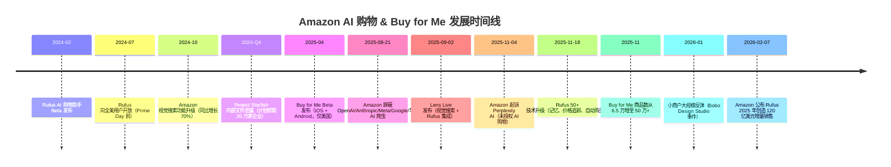

### 关键里程碑

| 时间 | 事件 | 意义 |
|------|------|------|
| 2024-02 | Rufus Beta 发布 | Amazon 进入 AI 购物助手赛道 |
| 2024-Q4 | Project Starfish 内部文件泄露 | 揭示 Amazon 大规模抓取计划：20 万家企业，75 亿美元目标 |
| 2025-04 | Buy for Me Beta 上线 | Amazon 首次让 AI Agent 在第三方网站代购，开创"垂直 Agentic Commerce" |
| 2025-08 | 屏蔽外部 AI 爬虫 | Amazon 封锁竞争对手的 AI Agent，同时自己抓取小商户——"双标"争议开始 |
| 2025-11 | 起诉 Perplexity | Amazon 法律行动打击外部 AI 购物，强化围墙花园 |
| 2025-11 | Rufus 重大升级 | 从问答工具进化为自主购物 Agent：记忆、价格追踪、自动购买 |
| 2026-01 | 商户大规模反弹 | Bobo Design Studio 视频 50 万+播放，IP 律师介入，媒体广泛报道 |
| 2026-02 | 120 亿美元数据公布 | 证明 Rufus/Buy for Me 的商业成功，但争议持续 |

### 为什么是现在？

Buy for Me 的出现有三个关键背景：

1. **AI Agent 能力成熟**：Amazon Bedrock + Nova + Claude 的组合使 AI 能够可靠地导航网站、填写表单、完成结账
2. **竞争压力**：Google（UCP/AP2）、OpenAI（ACP/ChatGPT Checkout）、Perplexity（AI 浏览器购物）都在争夺"AI 购物入口"
3. **流量防御**：当用户开始用 ChatGPT 或 Gemini 购物时，Amazon 面临失去"默认购物入口"地位的风险


## 4. 业务场景 (Use Cases)

### 消费者场景

- **品牌商品发现**：用户在 Amazon 搜索某 DTC 品牌的产品（如手工陶瓷杯），即使该品牌不在 Amazon 销售，Buy for Me 也能展示并代购
- **一站式购物**：用户无需在多个网站间切换，所有购买都在 Amazon App 内完成，订单统一追踪
- **价格追踪 + 自动购买**：通过 Rufus 设定目标价格（如"这双鞋降到 $80 时帮我买"），Agent 持续监控并自动下单，平均节省 20%
- **视觉搜索购物**：通过 Lens Live 拍照识别商品，Rufus 自动找到最佳购买渠道（Amazon 自营、第三方卖家或 Buy for Me）

### 品牌/商户场景

- **被动获客**（非自愿）：品牌网站被 Amazon 抓取后，商品自动出现在 Amazon 搜索结果中，获得 3 亿+用户的曝光
- **订单处理困扰**：收到来自 `@buyforme.amazon` 邮箱的订单，无法直接联系真实客户，退货和客服流程断裂
- **库存不同步**：Amazon 抓取的商品信息可能过时，导致已下架或缺货商品仍被展示和下单
- **退单风险**：Buy for Me 使用客户信用卡在品牌网站下单，但客户可能不认识该笔交易，导致高退单率

### Amazon 战略场景

- **流量防御**：当 Amazon 没有某商品时，用户不再需要离开 App——消除"购物死胡同"
- **数据积累**：即使交易发生在第三方网站，Amazon 仍掌握用户的搜索意图、购买偏好和行为数据
- **广告收入保护**：用户留在 Amazon 生态内，Sponsored Listings 等广告产品的曝光和点击不受影响
- **生态扩张**：从"卖 Amazon 有的东西"扩展到"帮用户买任何东西"，强化 Amazon 作为"万物商店"的定位

## 5. 技术架构 (Architecture)

### 整体架构

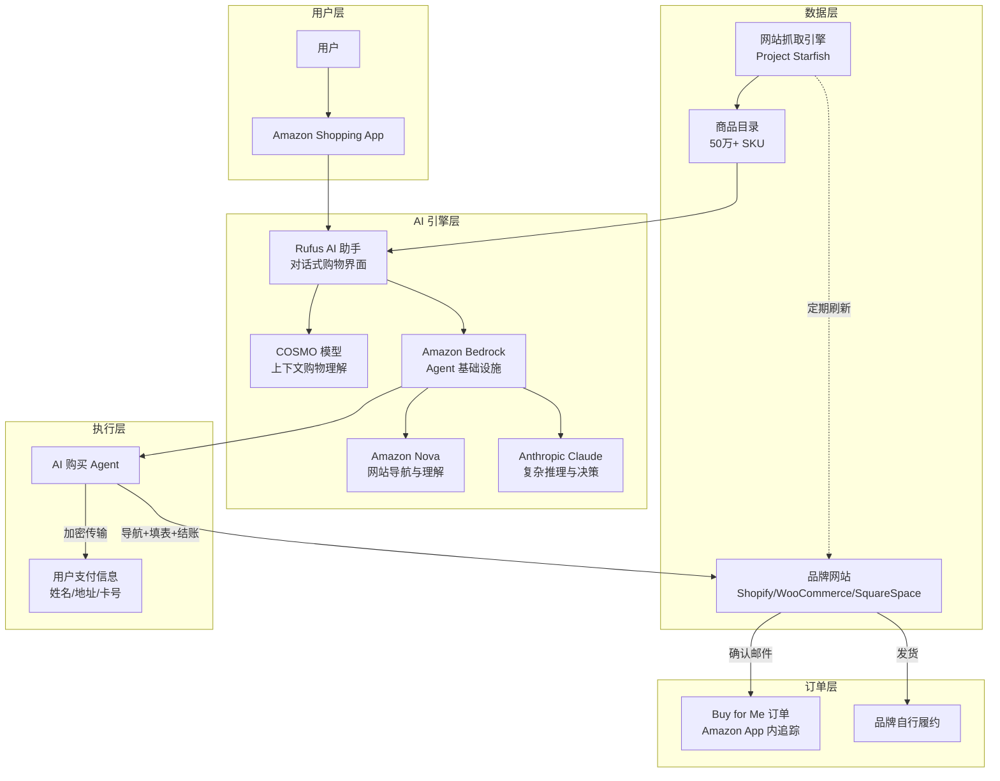

### 数据抓取与商品目录构建

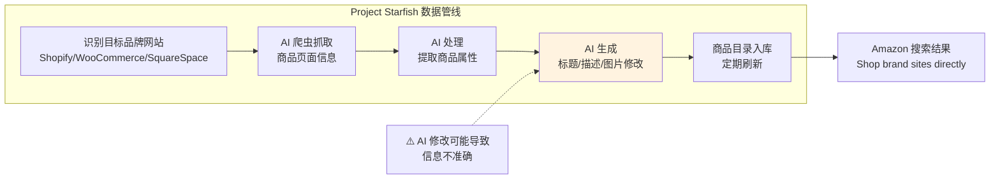

**关键技术细节**：

- **抓取范围**：主要针对 Shopify、WooCommerce、SquareSpace 等平台的独立站
- **数据处理**：Amazon 承认会"修改商品标题和描述以适应 Amazon Shopping App 的展示"——这是争议的核心来源
- **刷新频率**：Amazon 称"定期刷新以反映商户网站的变更"，但实际刷新不够及时，导致已下架商品仍被展示
- **规模**：从 2025 年 4 月的 6.5 万 SKU 增长到 2025 年 11 月的 50 万+ SKU

### AI Agent 购买流程

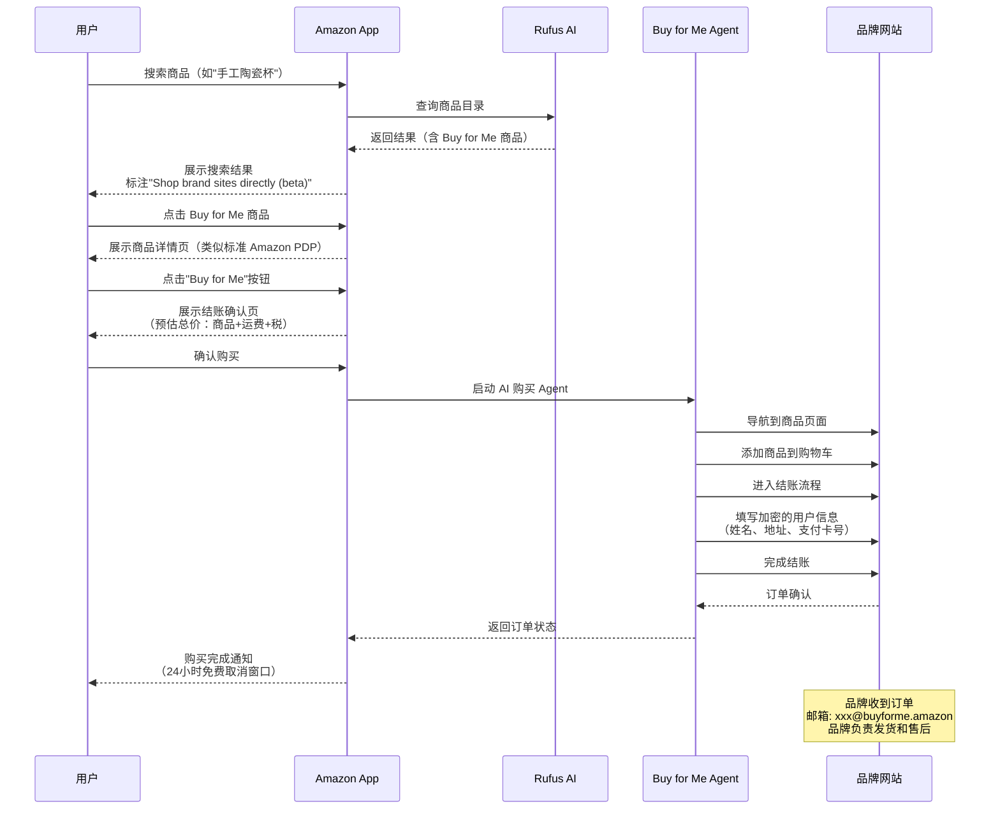

### 支付与安全机制

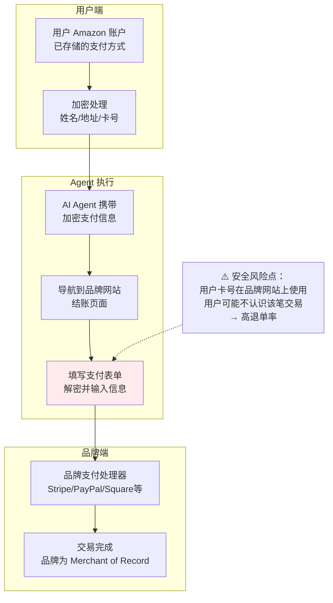

**Amazon 不是 Merchant of Record**（交易记录商户）——品牌是。这意味着：
- 退货、退款、客服都由品牌处理
- 信用卡账单上显示的是品牌名称，而非 Amazon
- 用户可能不认识该笔交易，导致向银行发起退单（chargeback）


## 6. 争议与反弹深度分析 (Controversy Deep Dive)

Buy for Me 引发的争议是 Agentic Commerce 时代最具代表性的"平台 vs 商户"冲突案例。本章深入分析争议的各个维度。

### 6.1 争议全景

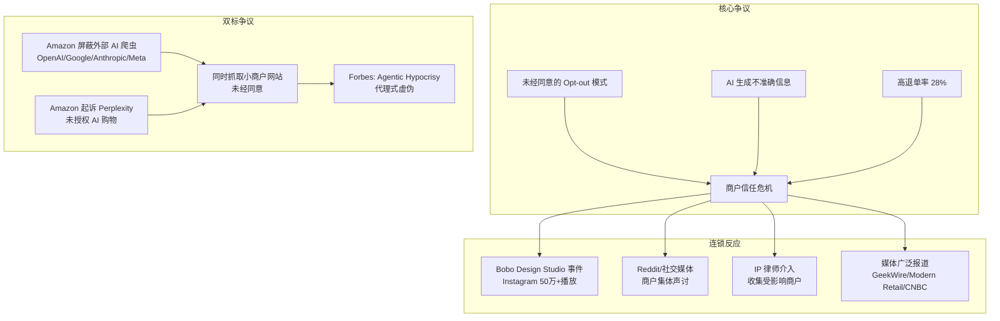

### 6.2 Bobo Design Studio 事件（标志性案例）

Bobo Design Studio 是一家独立手工设计品牌，其创始人 Angie 在 Instagram 上发布的视频获得 50 万+播放量，成为 Buy for Me 争议的标志性事件：

**发现过程**：
- 品牌从未在 Amazon 销售，也从未同意加入任何 Amazon 计划
- 通过长期客户的提醒才发现自己的商品出现在 Amazon App 中
- 发现 Amazon 使用了 AI 生成的图片，与实际商品不符
- 已从后台完全删除的商品仍在 Amazon 上展示和销售

**品牌的控诉**：
> "我的网站和无数其他网站正在被 Amazon 抓取。我甚至已经完全删除的商品（从后台彻底移除的）仍在 App 的'直接购物'区域被销售。他们使用的 AI 图片不是我的，还在为缺货商品授权订单。我没有选择加入，也没有简单的退出方式。"

**后续发展**：
- 联系 `branddirect@amazon.com` 要求退出，但响应缓慢
- 即使商品被移除后，仍有残留的 AI 生成内容痕迹
- IP 律师主动联系，开始收集受影响商户信息
- 创建 Google 表单收集其他受影响商户的详细信息

### 6.3 退单（Chargeback）危机

一位 Shopify 商户在 Reddit 上的报告揭示了 Buy for Me 的退单问题：

**关键数据**：
- 在 Buy for Me 启动后的几周内收到十几笔订单
- 这些订单的退单率达到 **28%**（正常电商退单率通常在 0.5-1%）
- Amazon 在品牌网站上以加价销售（进一步增加退单可能性）
- 没有建立退货流程就开始代购

**退单原因分析**：

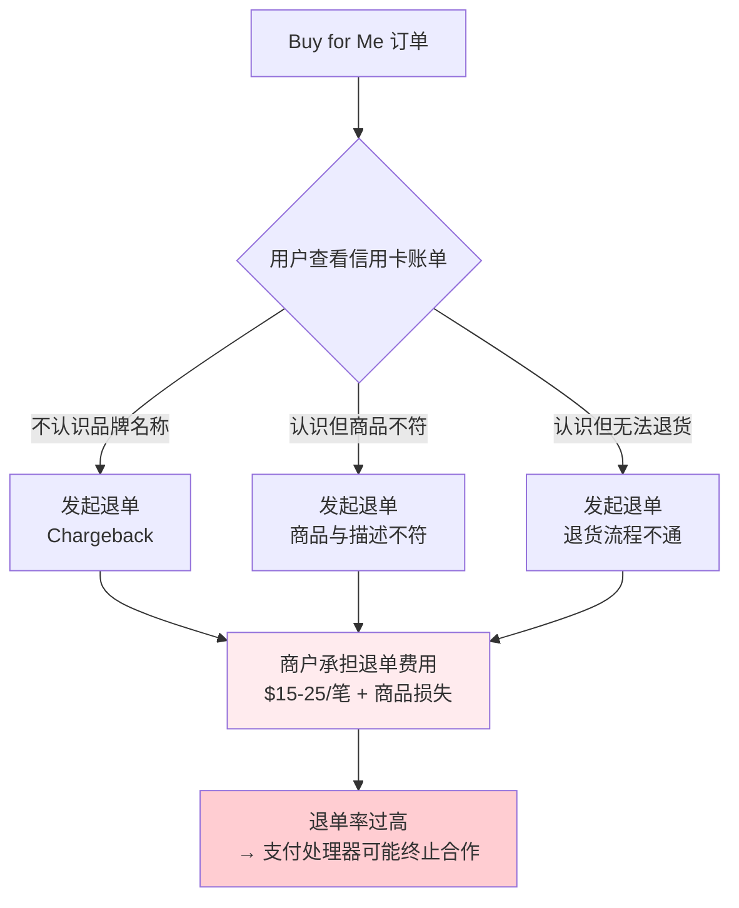

### 6.4 "双标"争议：Amazon 的 Agentic Hypocrisy

Buy for Me 争议的最讽刺之处在于 Amazon 的"双标"行为：

| Amazon 对外部 AI Agent 的态度 | Amazon 自己的行为 |
|------------------------------|------------------|
| 2025-08 更新 robots.txt，屏蔽 OpenAI、Google、Anthropic、Meta、华为、Mistral 的 AI 爬虫 | 通过 Project Starfish 大规模抓取 20 万家小商户网站 |
| 2025-11 起诉 Perplexity AI，指控其"未经授权部署 AI Agent 进入 Amazon 系统" | Buy for Me 的 AI Agent 未经商户授权就在其网站上下单 |
| CEO Andy Jassy 强调"需要保护客户体验"的解决方案 | Buy for Me 导致商户客户体验严重受损（错误信息、无法退货） |
| 屏蔽外部 Agent 的理由：保护 560 亿美元年广告收入 | 自己的 Agent 却在侵蚀小商户的客户关系和品牌信任 |

Marketplace Pulse 创始人 Juozas Kaziukėnas 在 LinkedIn 上指出：Amazon 对 Perplexity 做的事情，和 Amazon 通过 Buy for Me 对小商户做的事情，本质上是一样的。

### 6.5 Amazon 的官方回应

Amazon 发言人的声明：

> "Shop Direct 和 Buy for Me 是我们正在测试的计划，帮助客户发现目前不在 Amazon 商店销售的品牌和产品，同时帮助企业触达新客户并推动增量销售。我们收到了对这些计划的积极反馈。企业可以随时通过发送邮件至 branddirect@amazon.com 退出，我们会及时将其从这些计划中移除。Amazon 长期以来一直是小型和独立企业的支持者，如今我们商店中超过 60% 的销售来自独立卖家。"

**回应的问题**：
- "积极反馈"与大量商户投诉形成鲜明对比
- "及时移除"与商户报告的缓慢响应不符
- 未回应 AI 生成不准确信息的问题
- 未回应退单率异常高的问题
- 未回应"双标"质疑

## 7. 实现逻辑 (Implementation Logic)

### 7.1 Rufus 进化路径：从问答到自主购物

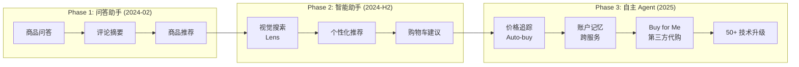

### 7.2 Buy for Me 完整购买流程

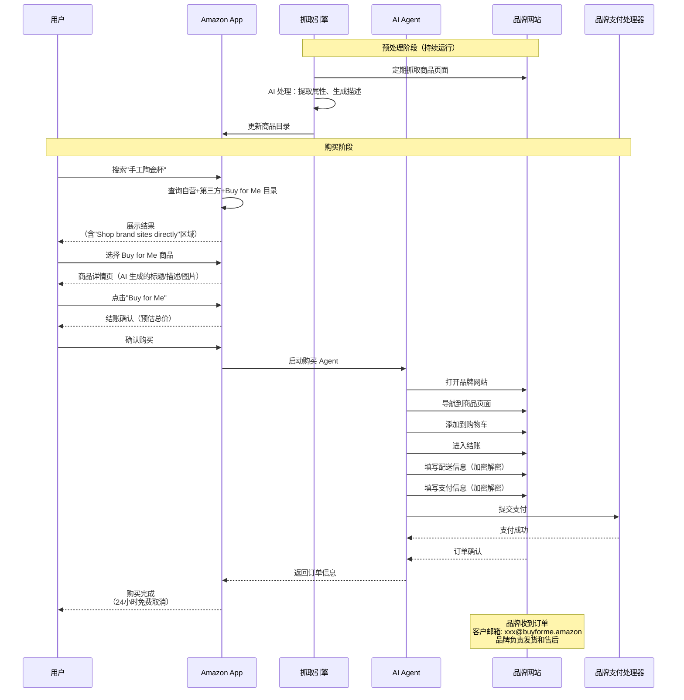

### 7.3 商户退出流程

```mermaid
flowchart TD
    A[商户发现商品被列在 Amazon] --> B{知道退出方式？}
    B -->|否| C[搜索信息 / 社交媒体求助]
    B -->|是| D[发送邮件至<br/>branddirect@amazon.com]
    C --> D
    D --> E{Amazon 响应？}
    E -->|及时| F[商品从 Buy for Me 移除]
    E -->|缓慢/无响应| G[多次跟进<br/>社交媒体施压]
    G --> F
    F --> H{完全移除？}
    H -->|是| I[退出完成]
    H -->|否| J[残留 AI 生成内容<br/>需继续跟进]
    J --> D
    
    style G fill:#fff3e0
    style J fill:#ffebee
```

### 7.4 Auto-buy（自动购买）流程

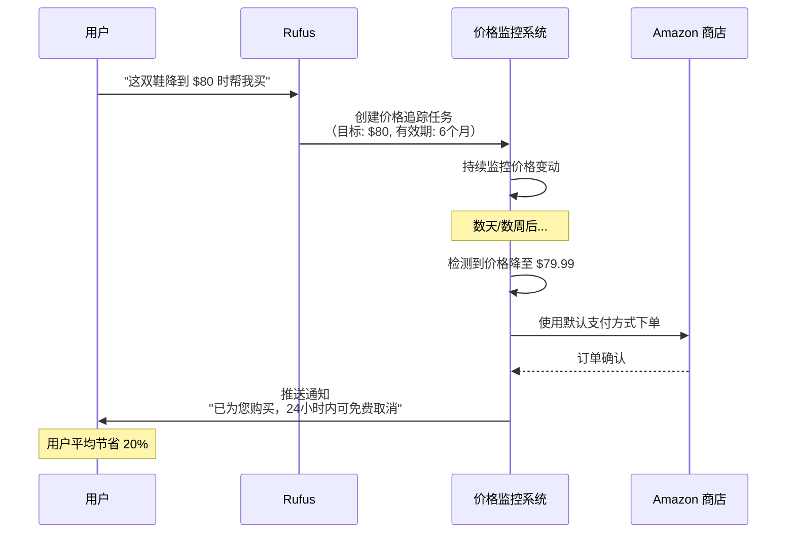


## 8. 生态与社区 (Ecosystem & Community)

### Amazon AI 购物生态全景

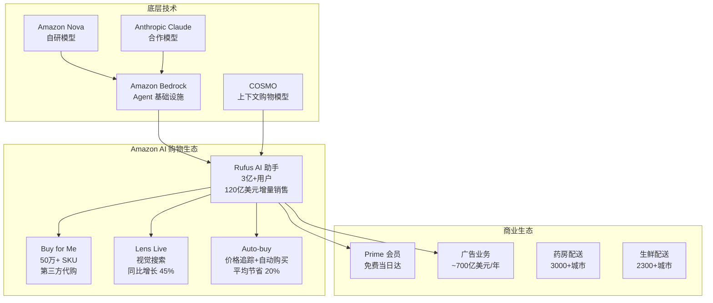

### Rufus 关键数据

| 指标 | 数据 | 来源 |
|------|------|------|
| 用户数 | 3 亿+ | Amazon Q4 2025 财报 |
| 增量销售 | ~120 亿美元（2025 年） | Amazon Q4 2025 财报 |
| 转化率提升 | 使用 Rufus 的用户转化率高 60% | Amazon 2025-11 公告 |
| 技术升级 | 50+ 次（2025 年） | Amazon 2025-11 公告 |
| Buy for Me SKU | 50 万+（2025-11） | Amazon 部署公告 |
| 视觉搜索增长 | 同比 45% | Amazon Q4 2025 财报 |
| 价格优势 | 连续 9 年美国最低价零售商（低 14%） | Profitero 报告 |

### Amazon 的"围墙花园"策略

Amazon 在 Agentic Commerce 领域采取了与 Google、OpenAI 截然不同的策略：

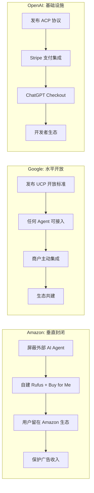

### AWS 的 Agentic Commerce 基础设施角色

值得注意的是，Amazon 的策略存在"零售 vs 云"的内部张力：

- **Amazon Retail**（零售）：封闭策略，屏蔽外部 Agent，自建围墙花园
- **AWS**（云服务）：开放策略，提供基础设施支持任何 Agent

AWS 的具体动作：
- 与 Visa 合作，在 Bedrock AgentCore 上构建 Agentic Commerce 解决方案
- 发布 Agent 支付工作流蓝图
- 在 AWS Marketplace 上提供 AI Agent 工具
- 发布"Agentic Payments"博客，面向 B2B 支付 AI 场景

这种"零售封闭 + 云开放"的双轨策略，反映了 Amazon 内部不同业务线的利益博弈。

## 9. 优劣势与竞品对比 (Pros, Cons & Comparison)

### Buy for Me 优势

1. **用户体验无缝**：全程在 Amazon App 内完成，无需跳转
2. **巨大的用户基础**：3 亿+活跃用户，即时获得海量流量
3. **AI 技术领先**：Bedrock + Nova + Claude 的组合提供强大的网站导航和理解能力
4. **数据飞轮**：更多用户使用 → 更多数据 → 更好的推荐 → 更多使用
5. **商业验证**：120 亿美元增量销售证明了商业模式的可行性
6. **生态协同**：与 Prime 会员、广告、物流等形成协同效应

### Buy for Me 劣势

1. **商户信任危机**：未经同意的 Opt-out 模式严重损害了与品牌的关系
2. **数据准确性问题**：AI 生成的商品信息经常不准确，导致客户投诉
3. **高退单率**：28% 的退单率远超行业正常水平，给商户带来财务损失
4. **法律风险**：IP 律师已介入，可能面临集体诉讼
5. **"双标"声誉风险**：屏蔽外部 Agent 同时抓取小商户，引发广泛批评
6. **客户关系断裂**：匿名邮箱导致品牌无法与真实客户建立关系
7. **封闭生态限制**：不兼容任何开放协议（UCP、ACP、AP2），形成信息孤岛
8. **监管风险**：ILSR 等机构已呼吁立法禁止未经授权的商品列表

### 竞品对比：三种 Agentic Commerce 路径

| 维度 | Amazon Buy for Me | Google UCP | OpenAI ACP |
|------|------------------|-----------|-----------|
| **核心策略** | 垂直整合（围墙花园） | 水平标准化（开放轨道） | 基础设施协议（结账标准） |
| **Agent 类型** | Amazon 自有（Rufus） | 任何 Agent | ChatGPT 及集成方 |
| **商户接入** | 被动（Opt-out，自动抓取） | 主动（Opt-in，商户集成） | 主动（Stripe 集成） |
| **开放性** | 封闭 | Apache 2.0 开源 | Apache 2.0 开源 |
| **Merchant of Record** | 品牌（非 Amazon） | 商户 | 商户 |
| **支付方式** | 用户 Amazon 账户中的卡 | 任意（信用卡/稳定币/银行转账） | Stripe 支持的所有方式 |
| **授权机制** | 用户在 Amazon 内确认 | Mandate + VC 签名 | Delegated Vault Token |
| **数据控制** | Amazon 控制 | 商户控制 | 商户通过 Stripe 控制 |
| **商户同意** | ❌ 未经同意 | ✅ 主动接入 | ✅ 主动集成 |
| **信息准确性** | ⚠️ AI 生成，可能不准确 | ✅ 商户提供 | ✅ 商户提供 |
| **退单风险** | 🔴 高（28%报告） | 🟢 低（标准流程） | 🟢 低（Stripe 风控） |
| **合作伙伴** | Amazon 独家 | 20+ 全球合作伙伴 | Stripe 商户生态 |
| **生产状态** | Beta（美国） | 早期采用 | 已上线（ChatGPT Checkout） |
| **用户规模** | 3 亿+ | 待定 | ChatGPT 用户群 |

### 三种路径的本质差异

```mermaid
graph TD
    subgraph "Amazon: 我来帮你买"
        A1[Amazon 控制发现] --> A2[Amazon 控制结账]
        A2 --> A3[品牌只负责发货]
        A3 --> A4[用户数据留在 Amazon]
    end
    
    subgraph "Google: 让任何 Agent 都能买"
        B1[开放标准定义接口] --> B2[商户暴露能力]
        B2 --> B3[任何 Agent 可调用]
        B3 --> B4[商户保留数据和关系]
    end
    
    subgraph "OpenAI: 在对话中完成购买"
        C1[ChatGPT 理解意图] --> C2[ACP 编排结账]
        C2 --> C3[Stripe 处理支付]
        C3 --> C4[商户通过 Stripe 控制]
    end
```

**核心洞察**：

- **Amazon** 解决的是"用户留存"问题——不让用户离开 Amazon
- **Google** 解决的是"互操作性"问题——让 Agent 和商户说同一种语言
- **OpenAI** 解决的是"结账体验"问题——让 AI 对话中的购买像点击按钮一样简单

三者并非直接竞争，而是代表了 Agentic Commerce 的三种不同哲学：**封闭垂直整合** vs **开放水平标准** vs **基础设施协议**。

## 10. 快速上手 (Getting Started)

### 对于品牌/商户：如何应对 Buy for Me

#### 检查你的品牌是否已被纳入

1. 在 Amazon Shopping App 中搜索你的品牌名称
2. 查看搜索结果中是否有"Shop brand sites directly (beta)"区域
3. 检查近期订单中是否有来自 `@buyforme.amazon` 邮箱的订单

#### 如何退出 Buy for Me

1. 发送邮件至 **branddirect@amazon.com**
2. 邮件中包含：品牌名称、网站 URL、要求移除的具体说明
3. 包含你的 Merchant Token（如果有 Amazon Seller 账户）
4. 如果未收到及时回复，通过社交媒体（Twitter/X）@Amazon 施压
5. 退出后检查是否有残留的 AI 生成内容

#### 如何识别 Buy for Me 订单

- 订单邮箱格式：`xxx@buyforme.amazon`
- 可在 Shopify 中使用 Shopify Flow 自动标记或屏蔽这些订单

#### 如何保护你的品牌

- 在 robots.txt 中限制 Amazon 爬虫访问（但效果不确定）
- 监控 Amazon App 中的品牌展示，确保信息准确
- 记录所有不准确的列表和由此产生的客户投诉，作为潜在法律行动的证据
- 关注 Bobo Design Studio 发起的商户维权行动

### 对于消费者：如何使用 Buy for Me

1. 打开 Amazon Shopping App（iOS 或 Android，仅美国）
2. 搜索你想要的商品
3. 在搜索结果中查找"Shop brand sites directly"区域
4. 点击感兴趣的商品，查看详情
5. 点击"Buy for Me"按钮
6. 确认预估总价（含商品价格、运费、税费）
7. 确认购买——AI Agent 将在品牌网站上完成结账
8. 在 Amazon App 的"Buy for Me Orders"区域追踪订单

**注意事项**：
- 退货和客服需联系品牌（非 Amazon）
- 商品信息可能与品牌网站上的实际信息有差异
- 购买后 24 小时内可免费取消

### 开发者资源

| 资源 | 链接 |
|------|------|
| Amazon Bedrock 文档 | [aws.amazon.com/bedrock](https://aws.amazon.com/bedrock/) |
| Bedrock AgentCore | [aws.amazon.com/bedrock/agentcore](https://aws.amazon.com/bedrock/agentcore/) |
| AI 购物助手蓝图 | [AWS Solutions - Shopping Assistants](https://aws.amazon.com/solutions/guidance/generative-ai-shopping-assistants-using-amazon-bedrock-agents/) |
| Amazon Nova 模型 | [aws.amazon.com/ai/nova](https://aws.amazon.com/ai/generative-ai/nova/) |
| Buy for Me 商户 FAQ | Amazon Seller Central（需登录） |

## 11. 来源 (Sources)

### 官方文档

- [Amazon: Track prices and 9 new Rufus features](https://www.aboutamazon.com/news/retail/how-to-use-amazon-shopping-ai-assistant) — About Amazon, 2025-11
- [Amazon: Buy for Me announcement](https://www.aboutamazon.com/news/retail/amazon-buy-for-me) — About Amazon, 2025-04
- [Amazon: AWS Agentic AI and Nova models](https://www.aboutamazon.com/news/aws/aws-agentic-ai-amazon-bedrock-nova-models) — About Amazon, 2026-02
- [AWS: Generative AI Shopping Assistants Blueprint](https://aws.amazon.com/solutions/guidance/generative-ai-shopping-assistants-using-amazon-bedrock-agents/) — AWS Solutions

### 行业分析

- [Amazon's AI shopping assistant drove $12 billion in sales for 2025](https://ppc.land/amazons-ai-shopping-assistant-drove-12-billion-in-sales-for-2025/) — PPC Land, 2026-02-07
- [Amazon's Rufus AI assistant gains memory, price tracking and auto-buying](https://ppc.land/amazons-rufus-ai-assistant-gains-memory-price-tracking-and-auto-buying/) — PPC Land, 2025-11-18
- [Amazon AI scraping project creates unauthorized listings for small brands](https://ppc.land/amazon-ai-scraping-project-creates-unauthorized-listings-for-small-brands/) — PPC Land, 2026-01
- [Amazon's Buy for Me and the Transition to Agentic Commerce](https://www.searchable.com/blog/amazon-buy-for-me-agentic-commerce) — Searchable, 2026-02
- [Why the AI shopping agent wars will heat up in 2026](https://www.modernretail.co/technology/why-the-ai-shopping-agent-wars-will-heat-up-in-2026/) — Modern Retail, 2026-01

### 争议报道

- [Amazon's "Buy For Me" Agentic AI Sparks Backlash](https://www.valueaddedresource.net/amazon-buy-for-me-small-business-backlash/) — Value Added Resource, 2026-01
- [Why some independent brands are upset with Amazon's Buy for Me](https://www.geekwire.com/2026/why-some-independent-brands-are-upset-with-amazons-new-buy-for-me-shopping-tool/) — GeekWire, 2026-01
- [Brands say Amazon's Buy for Me is listing products without permission](https://www.modernretail.co/technology/brands-are-upset-that-buy-for-me-is-featuring-their-products-on-amazon-without-permission/) — Modern Retail, 2026-01
- [Amazon AI Buy For Me Draws Backlash from Small Retailers](https://www.webpronews.com/amazon-ai-buy-for-me-draws-backlash-from-small-retailers-over-scraping/) — WebProNews, 2026-01
- [Small business owners say Amazon is selling their products without permission](https://www.kpax.com/science-and-tech/artificial-intelligence/small-business-owners-say-amazon-is-selling-their-products-without-permission) — KPAX, 2026-02
- [Prohibit Unauthorized Business Listings on Marketplace Platforms](https://ilsr.org/article/independent-business/prohibit-unauthorized-listings) — ILSR, 2026-01
- [Amazon Buy For Me Could Shut Down Your Store With Chargebacks](https://www.surebright.com/blog/amazon-buy-for-me-the-chargebacks-are-just-the-beginning) — SureBright, 2026-01

### 技术与竞品

- [Amazon can now buy products from other websites for you](https://www.theverge.com/news/642947/amazon-ai-buy-products-other-websites) — The Verge, 2025-04
- [Amazon's Buy for Me AI: What Shoppers, Brands, and Sellers Need to Know](https://clearadsagency.com/amazons-buy-for-me-ai-what-shoppers-brands-and-sellers-need-to-know/) — ClearAds, 2025-06
- [Amazon Redefines How Customers Shop with Buy for Me & Alexa Plus](https://www.cxtoday.com/customer-engagement-platforms/amazon-redefines-how-customers-shop-with-its-new-buy-for-me-feature-alexa-plus/) — CX Today, 2025-05
- [Could Amazon's Buy for Me redefine the future of online shopping?](https://www.ghacks.net/2025/04/04/could-amazons-buy-for-me-redefine-the-future-of-online-shopping/) — gHacks, 2025-04

*报告撰写日期：2026-02-13*
*内容基于公开来源整理，部分信息经过改写以符合版权要求*
