# Google AP2 (Agent Payments Protocol) 深度研究报告

> 本报告是 Agentic Payment 系列研究的子报告之一，聚焦 Google 主导的 Agent Payments Protocol (AP2)。
> 总览报告见 [agentic_payment_research.md](../agentic_payment_research.md)，UCP 报告见 [1.google_ucp/google_ucp_research.md](../1.google_ucp/google_ucp_research.md)。

## 1. 概述：AP2 是什么，解决什么问题 (Overview)

Agent Payments Protocol (AP2) 是 Google 于 2025 年 9 月发布的开放支付协议，专为 AI Agent 驱动的商务交易设计。AP2 的核心使命是为 Agent 发起的支付建立**信任基础设施**——通过加密签名的 Mandate（授权委托）机制，为每笔交易提供不可否认的用户意图证明。

AP2 不处理结账流程（那是 ACP 的职责），也不处理资金结算（那是 x402 或传统支付网络的职责）。它解决的是一个更根本的问题：**当 AI Agent 代替人类花钱时，如何证明这确实是用户的真实意愿？**

AP2 作为 A2A (Agent-to-Agent) 协议和 MCP (Model Context Protocol) 的开放扩展发布，由 60+ 合作伙伴共同参与，包括 Mastercard、American Express、PayPal、Coinbase、Salesforce、Adobe、Adyen 等。

关键差异化特征：

- **信任层定位**：不是支付协议，而是支付信任协议——为任何支付方式提供统一的授权证明框架
- **Mandate 机制**：通过 W3C Verifiable Credentials 实现的加密签名数字合约，创建从意图到支付的完整审计链
- **双模式支持**：原生支持 Human-Present（实时购买）和 Human-Not-Present（委托任务）两种交易模式
- **支付方式无关**：信用卡、借记卡、稳定币、实时银行转账均可，不绑定特定支付网络
- **开放互操作**：作为 A2A 和 MCP 的扩展，与现有 Agent 生态无缝集成

### 1.1 Agentic Commerce 的五大核心挑战

在 Agent 驱动的商务交易中，存在五个必须解决的核心挑战。这些挑战构成了评估任何 Agentic Commerce 协议的统一框架：

| # | 挑战 | 核心问题 | 传统电商如何解决 | Agent 时代为何失效 |
|---|------|---------|----------------|------------------|
| ① | 商品发现 (Discovery) | Agent 如何找到合适的商品和服务？ | 搜索引擎、推荐算法、商品目录 | Agent 需要结构化、机器可读的商品数据，而非 HTML 页面 |
| ② | 信任建立 (Trust) | 商户如何信任 Agent？Agent 如何信任商户？ | 品牌认知、用户评价、HTTPS | Agent 没有"品牌认知"，需要加密可验证的身份和授权证明 |
| ③ | 授权与委托 (Authorization) | 用户如何安全地授权 Agent 代为消费？ | 用户亲自点击"购买"按钮 | Agent 代购时，"点击购买"这一隐含授权不再存在 |
| ④ | 支付执行 (Payment) | Agent 如何安全地完成支付？ | 信用卡表单、3DS 验证、OTP | Agent 无法填写表单、完成人机验证或输入 OTP |
| ⑤ | 集成复杂度 (Integration) | 如何避免 N×N 的碎片化集成？ | 少数支付网关（Stripe、PayPal） | 每个 Agent 平台 × 每个商户 × 每种支付方式 = 指数级复杂度 |

### 1.2 AP2 如何回应五大挑战

AP2 的定位是**信任与授权层**，它不试图解决所有五大挑战，而是聚焦于自己最擅长的领域，并通过与其他协议的互补来覆盖完整链路：

| 挑战 | AP2 的回应 | 评级 | 说明 |
|------|-----------|------|------|
| ① 商品发现 | 不直接解决，依赖 UCP/ACP | ⭐⭐ | AP2 不处理商品数据，商品发现由 UCP 的 Product Feed 或 ACP 的 Product Spec 处理 |
| ② 信任建立 | **核心强项** — Mandate + VC 加密信任链 | ⭐⭐⭐⭐⭐ | 两步 Mandate 模型提供从意图到支付的完整、不可否认的信任证明，是所有协议中信任框架最完整的 |
| ③ 授权与委托 | **核心强项** — Intent/Cart Mandate 双层授权 | ⭐⭐⭐⭐⭐ | 原生支持 HP 和 HNP 两种模式，Intent Mandate 的约束条件设计是 Agent 自主行动的"授权边界" |
| ④ 支付执行 | 间接解决 — Payment Mandate 传递 Agent 信号 | ⭐⭐⭐⭐ | 不直接处理资金结算，但 Payment Mandate 为发卡行提供 Agent 参与信号，提升批准率；通过 x402 扩展支持稳定币结算 |
| ⑤ 集成复杂度 | 中等 — 开放协议但实现复杂 | ⭐⭐⭐ | 作为 A2A/MCP 扩展降低了协议层集成成本，但 Mandate/VC 基础设施的建设成本高于 ACP 的 Token 模式 |

**与 ACP 和 Visa TAP 的评级对比**：

| 挑战 | AP2 (Google) | ACP (OpenAI+Stripe) | Visa TAP |
|------|-------------|---------------------|----------|
| ① 商品发现 | ⭐⭐ | ⭐⭐⭐⭐⭐ | ⭐⭐ |
| ② 信任建立 | ⭐⭐⭐⭐⭐ | ⭐⭐⭐ | ⭐⭐⭐⭐⭐ |
| ③ 授权与委托 | ⭐⭐⭐⭐⭐ | ⭐⭐⭐ | ⭐⭐⭐⭐ |
| ④ 支付执行 | ⭐⭐⭐⭐ | ⭐⭐⭐⭐⭐ | ⭐⭐⭐⭐⭐ |
| ⑤ 集成复杂度 | ⭐⭐⭐ | ⭐⭐⭐⭐⭐ | ⭐⭐⭐ |
| **综合** | **⭐⭐⭐⭐** | **⭐⭐⭐⭐** | **⭐⭐⭐⭐** |

> 三大协议各有所长：ACP 在商品发现和支付执行上最强（Stripe 商户生态），TAP 在信任和支付上最强（Visa 网络），AP2 在信任和授权上最强（Mandate + VC）。三者互补而非替代。

### 1.3 AP2 在 Agentic Commerce 技术栈中的位置

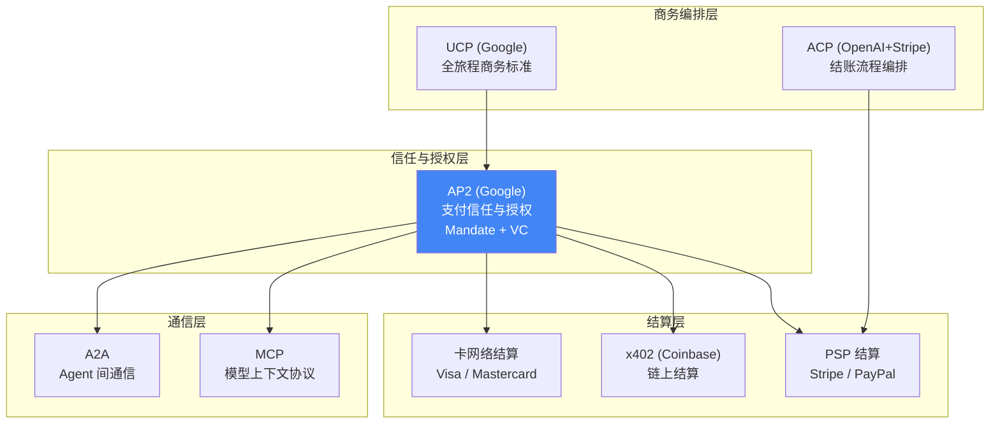
```mermaid
graph TD
    subgraph 商务编排层
        ACP["ACP (OpenAI+Stripe)<br/>结账流程编排"]
        UCP["UCP (Google)<br/>全旅程商务标准"]
    end
    
    subgraph 信任与授权层
        AP2_P["AP2 (Google)<br/>支付信任与授权<br/>Mandate + VC"]
    end
    
    subgraph 通信层
        A2A_P["A2A<br/>Agent 间通信"]
        MCP_P["MCP<br/>模型上下文协议"]
    end
    
    subgraph 结算层
        CARD["卡网络结算<br/>Visa / Mastercard"]
        X402["x402 (Coinbase)<br/>链上结算"]
        PSP["PSP 结算<br/>Stripe / PayPal"]
    end
    
    UCP --> AP2_P
    ACP --> PSP
    AP2_P --> A2A_P
    AP2_P --> MCP_P
    AP2_P --> CARD
    AP2_P --> X402
    AP2_P --> PSP
    
    style AP2_P fill:#4285F4,color:#fff
```

### 1.4 问题定义：3A 信任危机

当 AI Agent 代替人类发起支付交易时，现有支付系统的核心假设被打破——**"人类亲自点击购买按钮"这一隐含前提不再成立**。

这一断裂引发了三个根本性问题，即 Agentic Payment 领域的 **3A 问题**：

```
Agent 支付信任危机
├── Authorization（授权证明）
│   └── 谁允许 Agent 花这笔钱？如何证明用户确实授权了这笔特定交易？
├── Authenticity（意图真实性）
│   └── Agent 的请求是否准确反映了用户的真实意图？还是 AI 幻觉？
└── Accountability（责任归属）
    └── 交易出错时，责任归用户、Agent 平台、还是商户？
```

问题的具体表现：

- **授权模糊**：传统支付中，用户点击"购买"本身就是授权行为。Agent 代购时，商户和支付网络无法确认这笔交易是否经过用户明确许可
- **意图失真风险**：AI Agent 可能因"幻觉"（hallucination）错误理解用户意图，导致购买错误商品或超出预算
- **责任真空**：Agent 买错东西后，现有争议处理流程无法清晰界定是用户授权不当、Agent 理解错误、还是商户信息误导
- **生态碎片化**：如果没有统一标准，每个 Agent 平台、每个支付网络都会开发自己的专有方案，导致 N×N 集成问题

影响范围：McKinsey 预测 Agentic Commerce 将创造 $3-5 万亿经济价值，到 2030 年 AI 驱动的商务交易预计达 $5000 亿。如果信任问题不解决，这一市场将无法规模化。

**问题根源**：

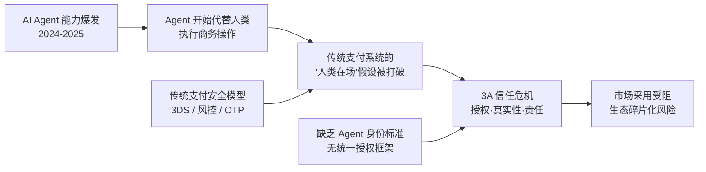
```mermaid
graph LR
    A["AI Agent 能力爆发<br/>2024-2025"] --> B["Agent 开始代替人类<br/>执行商务操作"]
    B --> C["传统支付系统的<br/>'人类在场'假设被打破"]
    C --> D["3A 信任危机<br/>授权·真实性·责任"]
    D --> E["市场采用受阻<br/>生态碎片化风险"]
    F["传统支付安全模型<br/>3DS / 风控 / OTP"] --> C
    G["缺乏 Agent 身份标准<br/>无统一授权框架"] --> D
```

**AP2 如何解决 3A 问题**：

| 问题 | AP2 的解决方式 | 关键机制 |
|------|--------------|---------|
| **Authorization（授权证明）** | 两步 Mandate 模型：Intent Mandate 记录用户意图和约束，Cart Mandate 锁定具体商品和价格，均由用户加密签名 | W3C Verifiable Credentials + 设备级硬件密钥签名 |
| **Authenticity（意图真实性）** | Mandate 是确定性的加密证明，不依赖 AI 推理；任何参与方都可独立验证签名的真实性 | ECDSA 签名 + 防篡改机制 + nonce 防重放 |
| **Accountability（责任归属）** | Intent → Cart → Payment → Settlement 的完整审计链，每一步都有加密签名关联，事后可追溯、可裁定 | 不可否认审计链 + 角色分离 + 责任锚定到真实实体 |
| **生态碎片化** | 开放协议 + 60+ 合作伙伴 + 支付方式无关设计，提供统一的"共同语言" | A2A/MCP 扩展 + Apache 2.0 开源 |

### 1.5 为什么是 Google？商业逻辑深度分析

#### 1.5.1 Google 的商业逻辑：为什么要做 AP2？

Google 推出 AP2 的商业动机可以从五个维度理解：

**① 防御逻辑：保护搜索和广告的核心收入**

Google 2024 年广告收入超过 $3000 亿，其中搜索广告占大头。Agentic Commerce 的崛起意味着用户不再通过 Google 搜索找商品，而是直接让 Agent 代购。如果 Agent 购物绕过 Google 搜索，Google 的广告模型将面临根本性威胁。

AP2 的防御价值：通过成为 Agent 支付的信任标准，Google 确保自己在 Agent 商务链路中保持关键位置——即使用户不再搜索，Agent 仍然需要通过 AP2 的 Mandate 框架来完成授权。

**② 进攻逻辑：构建 Agent 商务的完整技术栈**

Google 正在构建一个从通信到商务到支付的完整 Agent 技术栈：

| 层级 | 协议/产品 | 功能 |
|------|----------|------|
| Agent 开发 | ADK (Agent Development Kit) | Agent 构建框架 |
| Agent 通信 | A2A (Agent-to-Agent) | Agent 间发现与协作 |
| 工具调用 | MCP (Model Context Protocol) | Agent 工具调用标准 |
| 商务标准 | UCP (Universal Commerce Protocol) | 全旅程商务标准 |
| 支付信任 | **AP2** | 支付授权与信任证明 |
| AI 模型 | Gemini | 底层 AI 能力 |

AP2 是这个技术栈中的关键一环——没有信任层，整个 Agent 商务生态就无法规模化。

**③ 数据逻辑：通过实现层主导地位获取 Agent 商务交易数据**

需要区分**协议层**和**实现层**：AP2 作为开放协议，Mandate 在参与方之间点对点传递，不要求经过任何中心化服务器。理论上，如果用户使用 PayPal 的 Agent + PayPal Wallet，Google 什么数据都看不到。

但 Google 的数据获取能力来自其在实现层同时扮演的多个关键角色：

| 基础设施 | Google 的角色 | 可接触的数据 |
|---------|-------------|-------------|
| Gemini（Shopping Agent） | 用户直接与 Gemini 对话下达购物指令 | Intent Mandate 全部内容（意图、约束、预算） |
| Google Wallet（Credentials Provider） | 管理用户支付方式、触发硬件密钥签名 | 用户选择的支付方式、认证事件 |
| Android 平台（Credential Manager API） | 操作系统层面的凭证管理框架 | 哪些 App 在请求/提供凭证（元数据层面） |
| ADK（Agent 开发框架） | 开发者用 ADK 构建 Agent | Agent 的交互模式（如使用 Google 托管服务） |
| Vertex AI / Gemini API | Agent 的底层 AI 推理 | 推理上下文（如 Agent 调用 Gemini API） |

在实际使用中，由于 Gemini 是 Google 的 Agent 入口、Google Wallet 是 Android 上最成熟的 Credentials Provider、ADK 是推荐的开发框架，大量交易数据大概率会流经 Google 控制的基础设施。这些数据包括：
- Agent 购物的意图模式（Intent Mandate 中的约束条件）
- 商户的定价和履约行为（Cart Mandate 中的商品和价格）
- 交易模态分布（HP vs HNP 的比例）
- 支付方式偏好（信用卡 vs 稳定币 vs 银行转账）

这与 ACP 的情况类似——ACP 也是开放协议，但实际上大部分交易流经 Stripe 的基础设施，因为 Stripe 同时是协议的实现者和最大的 PSP。**开放协议 ≠ 去中心化数据流**，协议的开放性降低了锁定风险，但实现层的市场集中度决定了数据的实际流向。

这些数据对 Google 的广告定向、商务推荐和 AI 模型训练都有巨大价值。

**④ 生态逻辑：通过开放标准建立网络效应**

Google 选择将 AP2 作为开放协议（Apache 2.0）发布，而非封闭平台，这是经过深思熟虑的策略：
- 开放标准更容易获得行业采纳（60+ 合作伙伴证明了这一点）
- 网络效应：越多参与者使用 AP2，协议价值越高，Google 作为发起者的影响力越大
- 避免反垄断风险：开放协议比封闭平台更不容易引发监管关注

**⑤ 竞争逻辑：对抗 OpenAI+Stripe 的 ACP 联盟**

ACP 在 2025 年 6 月率先落地（ChatGPT Checkout），抢占了 Agentic Commerce 的先发优势。Google 需要一个差异化的回应：
- ACP 选择了"结账编排"定位，AP2 选择了"信任授权"定位——避免正面竞争
- AP2 的支付方式无关设计是对 ACP 绑定 Stripe 的直接回应
- 60+ 合作伙伴的阵容（包括 Mastercard、PayPal 等 ACP 未覆盖的巨头）是对 ACP 生态的包围

#### 1.5.2 脱媒威胁分析：谁在威胁谁？

在 Agentic Commerce 生态中，AP2 面临的脱媒威胁和它对其他参与者的脱媒威胁同时存在：

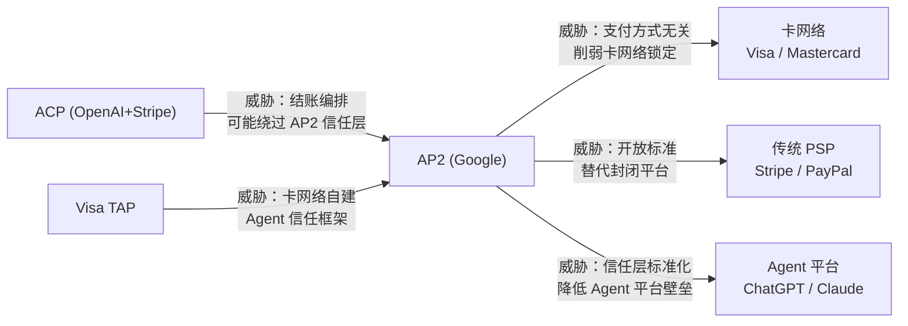
```mermaid
graph LR
    ACP_D["ACP (OpenAI+Stripe)"] -->|"威胁：结账编排<br/>可能绕过 AP2 信任层"| AP2_D["AP2 (Google)"]
    TAP_D["Visa TAP"] -->|"威胁：卡网络自建<br/>Agent 信任框架"| AP2_D
    AP2_D -->|"威胁：支付方式无关<br/>削弱卡网络锁定"| CARD_D["卡网络<br/>Visa / Mastercard"]
    AP2_D -->|"威胁：开放标准<br/>替代封闭平台"| PSP_D["传统 PSP<br/>Stripe / PayPal"]
    AP2_D -->|"威胁：信任层标准化<br/>降低 Agent 平台壁垒"| AGENT_D["Agent 平台<br/>ChatGPT / Claude"]
```

| 脱媒方向 | 威胁方 → 被威胁方 | 机制 | 可能性 |
|---------|-----------------|------|--------|
| ACP → AP2 | ACP 的 Delegated Vault Token 可能"够用"，商户不需要更复杂的 Mandate | 如果 HP 场景占主导，简单的 Token 模式可能足够 | 中 |
| Visa TAP → AP2 | Visa 自建的三层签名框架可能在卡网络内替代 AP2 的 Mandate | Visa 的 1.5 亿+ 受理商户是强大的分发渠道 | 中高 |
| AP2 → 卡网络 | AP2 的支付方式无关设计让商户可以绕过卡网络，直接使用稳定币或银行转账 | x402 扩展是这一威胁的具体体现 | 低（短期）/ 中（长期） |
| AP2 → PSP | 如果 AP2 成为标准，PSP 的差异化价值被压缩为纯粹的支付处理 | 信任层标准化降低了 PSP 的"增值服务"壁垒 | 低 |

#### 1.5.3 三层竞争格局

Agentic Commerce 的竞争可以分为三个层次：

**第一层：协议标准之争（谁定义规则）**

| 竞争者 | 协议 | 策略 | 优势 |
|--------|------|------|------|
| Google | AP2 + UCP + A2A | 全栈开放标准 | 技术栈最完整，生态最广 |
| OpenAI + Stripe | ACP | 快速落地，商户友好 | 已有生产部署（ChatGPT Checkout） |
| Coinbase | x402 | HTTP 原生，链上结算 | 最简单的集成模式 |

**第二层：基础设施之争（谁提供管道）**

| 竞争者 | 角色 | 策略 |
|--------|------|------|
| Visa | Agent 身份验证 + 卡网络结算 | TAP 三层签名 + 1.5 亿受理商户 |
| Mastercard | Agent 注册 + 令牌化 | Agent Pay + Payment Passkey |
| PayPal | 全栈支付处理 | AP2 集成 + 自有钱包 |
| Stripe | 结账编排 + 支付处理 | ACP + 商户生态 |

**第三层：入口之争（谁拥有用户）**

| 竞争者 | 入口 | Agent 商务策略 |
|--------|------|--------------|
| Google | Gemini + 搜索 | AP2/UCP 让 Gemini 成为购物 Agent |
| OpenAI | ChatGPT (4 亿用户) | ACP 让 ChatGPT 成为购物入口 |
| Apple | Siri + Apple Pay | 尚未明确，但 Apple Pay 是强大的支付基础设施 |
| Amazon | Alexa + 电商 | Buy for Me 功能，自有商品生态 |

#### 1.5.4 AP2 与卡网络的合作竞争

AP2 与 Visa/Mastercard 的关系是典型的"竞合"（coopetition）：

**合作面**：
- Mastercard 和 American Express 都是 AP2 的 60+ 合作伙伴之一
- Payment Mandate 可以嵌入卡网络的授权流（ISO 8583），为发卡行提供 Agent 参与信号
- AP2 的信任层与卡组织的身份验证层（TAP/Agent Pay）自然互补

**竞争面**：
- AP2 的"支付方式无关"设计意味着商户可以选择绕过卡网络，使用稳定币（x402）或银行转账
- 如果 AP2 成为标准，卡网络的"锁定效应"被削弱——商户不再被绑定在特定支付网络上
- Visa TAP 的三层签名框架在功能上与 AP2 的 Mandate 有重叠

**合作场景示意**：

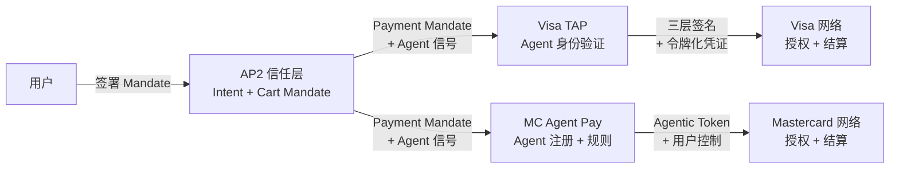
```mermaid
graph LR
    USER_C["用户"] -->|"签署 Mandate"| AP2_C["AP2 信任层<br/>Intent + Cart Mandate"]
    AP2_C -->|"Payment Mandate<br/>+ Agent 信号"| TAP_C["Visa TAP<br/>Agent 身份验证"]
    TAP_C -->|"三层签名<br/>+ 令牌化凭证"| VISA_C["Visa 网络<br/>授权 + 结算"]
    AP2_C -->|"Payment Mandate<br/>+ Agent 信号"| MAP_C["MC Agent Pay<br/>Agent 注册 + 规则"]
    MAP_C -->|"Agentic Token<br/>+ 用户控制"| MC_C["Mastercard 网络<br/>授权 + 结算"]
```

#### 1.5.5 商业逻辑对比表

| 维度 | AP2 (Google) | ACP (OpenAI+Stripe) | Visa TAP |
|------|-------------|---------------------|----------|
| 核心商业动机 | 保护搜索广告收入 + 构建 Agent 商务全栈 | 将 ChatGPT 流量变现 + 扩大 Stripe 商户覆盖 | 保护卡网络地位 + 扩展到 Agent 场景 |
| 收入模式 | 间接（广告 + 云服务 + 数据） | 直接（交易手续费分成） | 直接（网络交易费） |
| 开放策略 | 开放协议，Apache 2.0 | 开源，Apache 2.0 | 开放标准（RFC 9421） |
| 生态策略 | 全栈技术栈（A2A+MCP+UCP+AP2） | 双边平台（Agent ↔ 商户） | 网络效应（1.5 亿受理商户） |
| 脱媒风险 | 中（ACP 可能"够用"） | 低（已有生产部署） | 中（AP2 支付方式无关） |
| 最大优势 | 信任框架最完整 + 技术栈最全 | 落地最快 + 商户改造最少 | 受理网络最广 + 风控最成熟 |
| 最大劣势 | 尚无生产部署 | 信任深度不足 | 绑定 Visa 网络 |


## 2. 核心概念与术语 (Key Concepts & Glossary)

| 术语 | 全称 | 说明 |
|------|------|------|
| **Mandate** | 授权委托 | AP2 的核心概念，加密签名的数字合约，作为用户授权 Agent 执行特定操作的可验证证明。所有 Mandate 都以 W3C Verifiable Credential 形式表达 |
| **Intent Mandate** | 意图委托 | 捕获用户初始购物意图和约束条件的 VDC，在 HNP 场景中授予 Agent 有限的自主执行权 |
| **Cart Mandate** | 购物车委托 | 锁定具体商品、价格和配送方式的 VDC，由商户签名保证履约、用户签名确认批准，提供不可否认的购买证明 |
| **Payment Mandate** | 支付委托 | 从 Cart/Intent Mandate 派生的最小化凭证，专为支付网络和发卡行设计，传递 Agent 参与信号和交易模态（HP/HNP），不暴露 PCI/PII 数据 |
| **VDC** | Verifiable Digital Credential | AP2 对 W3C Verifiable Credential 的具体应用，具有防篡改、去中心化验证、可移植性和加密模块化等特性 |
| **HP** | Human-Present（人在场） | 用户实时参与交易流程的模式，类似传统电商但增加了加密审计链 |
| **HNP** | Human-Not-Present（人不在场） | 用户预先签署 Intent Mandate 后离开，Agent 在条件满足时自主执行交易的模式 |
| **Non-repudiable Audit Trail** | 不可否认审计链 | 从 Intent Mandate → Cart Mandate → Payment Mandate → Settlement Proof 的完整证据链，每一步都有加密签名关联 |
| **Role-Based Architecture** | 基于角色的架构 | AP2 定义的五种角色分离模型：User、Shopping Agent、Credentials Provider、Merchant Endpoint、Merchant Payment Processor |
| **Credentials Provider** | 凭证提供方 | 管理支付方式、签发令牌、处理认证的角色，确保 PCI 数据不暴露给 Agent 或商户 |
| **A2A x402 Extension** | A2A x402 扩展 | AP2 与 x402 协议的集成扩展，由 Google 与 Coinbase、Ethereum Foundation、MetaMask 合作推出，支持在 AP2 框架内进行稳定币结算 |
| **ADK** | Agent Development Kit | Google 的 Agent 开发框架，AP2 示例基于 ADK + Gemini 构建 |
| **A2A** | Agent-to-Agent | Google 发布的 Agent 间通信协议，AP2 作为其支付扩展 |
| **ECDSA** | 椭圆曲线数字签名算法 | Mandate 签名使用的加密算法 |
| **SPT** | SharedPaymentToken | ACP 的委托支付令牌（对比用） |

## 3. 发展历程 (History & Evolution)

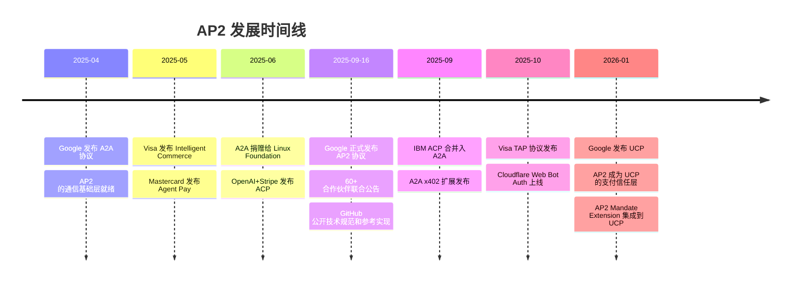
```mermaid
timeline
    title AP2 发展时间线
    2025-04 : Google 发布 A2A 协议
            : AP2 的通信基础层就绪
    2025-05 : Visa 发布 Intelligent Commerce
            : Mastercard 发布 Agent Pay
    2025-06 : A2A 捐赠给 Linux Foundation
            : OpenAI+Stripe 发布 ACP
    2025-09-16 : Google 正式发布 AP2 协议
              : 60+ 合作伙伴联合公告
              : GitHub 公开技术规范和参考实现
    2025-09 : IBM ACP 合并入 A2A
            : A2A x402 扩展发布
    2025-10 : Visa TAP 协议发布
            : Cloudflare Web Bot Auth 上线
    2026-01 : Google 发布 UCP
            : AP2 成为 UCP 的支付信任层
            : AP2 Mandate Extension 集成到 UCP
```

| 时间 | 事件 | 意义 |
|------|------|------|
| 2025-04 | A2A 协议发布 | 奠定 Agent 间通信基础，AP2 后来作为其支付扩展 |
| 2025-05 | Visa/Mastercard 发布 Agent 支付框架 | 传统支付巨头入场，验证了 Agent 支付的市场需求 |
| 2025-06 | ACP 发布并在 ChatGPT 上线 | 证明 Agent 购物可行，但暴露了信任层缺失 |
| 2025-09-16 | AP2 正式发布 | 60+ 合作伙伴的开放标准，填补信任层空白 |
| 2025-09 | A2A x402 扩展发布 | 将链上结算集成到 AP2 框架，支持稳定币支付 |
| 2025-10 | Visa TAP + Cloudflare Web Bot Auth | Agent 身份验证基础设施完善，与 AP2 互补 |
| 2026-01 | UCP 发布，AP2 成为其支付层 | AP2 从独立协议升级为 Google 商务生态的核心组件 |


## 4. 业务场景 (Use Cases)

### 4.1 参与角色 (Actors)

| 角色 | 类型 | 说明 |
|------|------|------|
| 👤 用户 (User) | 人类 | 提供授权，签署 Mandate，是唯一拥有签署权的人类参与者 |
| 🤖 Shopping Agent | AI Agent | 编排购买流程，将用户意图结构化为 Mandate，永远不接触原始支付凭证 |
| 🏪 Merchant Endpoint | 系统 | 协商条款，签署 Cart Mandate（履约承诺），管理商品和订单 |
| 💳 Merchant Payment Processor (MPP) | 系统 | 从 Cart Mandate 派生 Payment Mandate，路由到发卡行/支付网络 |
| 🔐 Credentials Provider | 系统 | 管理支付方式，签发令牌化凭证，处理认证，确保 PCI 数据隔离 |
| 🏦 发卡行/支付网络 (Issuer/Network) | 系统 | 接收 Payment Mandate，执行风控评估，完成授权和结算 |
| 🏪 商户 Agent (Merchant Agent) | AI Agent | 代表商户与 Shopping Agent 协商，提供个性化优惠（A2A 场景） |

### 4.2 用例总览图 (Use Case Diagram)

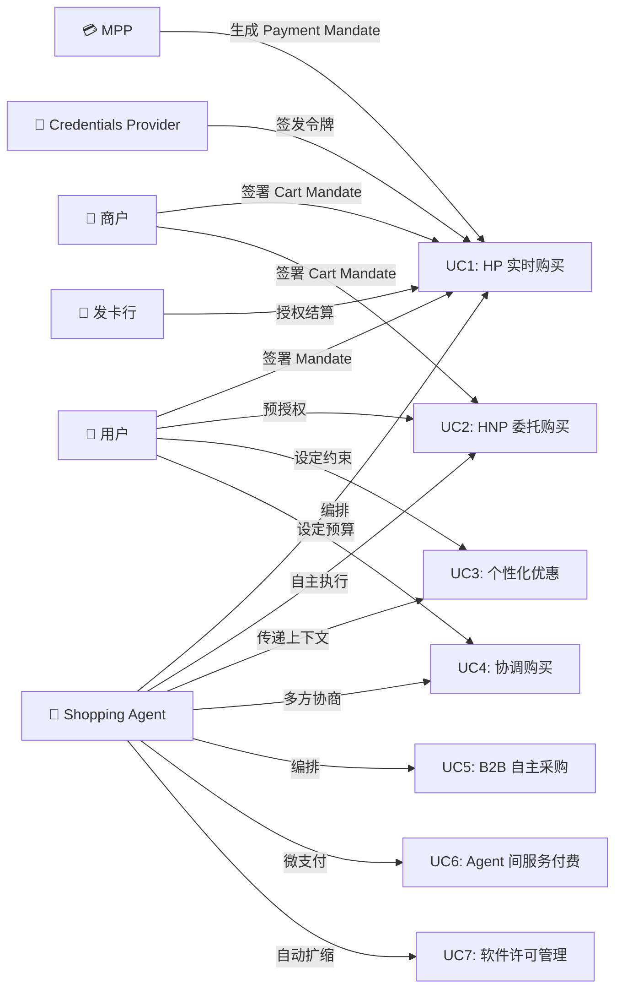
```mermaid
graph LR
    USER["👤 用户"]
    AGENT["🤖 Shopping Agent"]
    MERCHANT["🏪 商户"]
    MPP["💳 MPP"]
    CP["🔐 Credentials Provider"]
    ISSUER["🏦 发卡行"]

    USER -->|"签署 Mandate"| UC1["UC1: HP 实时购买"]
    USER -->|"预授权"| UC2["UC2: HNP 委托购买"]
    USER -->|"设定约束"| UC3["UC3: 个性化优惠"]
    USER -->|"设定预算"| UC4["UC4: 协调购买"]
    AGENT -->|"编排"| UC1
    AGENT -->|"自主执行"| UC2
    AGENT -->|"传递上下文"| UC3
    AGENT -->|"多方协商"| UC4
    AGENT -->|"编排"| UC5["UC5: B2B 自主采购"]
    AGENT -->|"微支付"| UC6["UC6: Agent 间服务付费"]
    AGENT -->|"自动扩缩"| UC7["UC7: 软件许可管理"]
    MERCHANT -->|"签署 Cart Mandate"| UC1
    MERCHANT -->|"签署 Cart Mandate"| UC2
    MPP -->|"生成 Payment Mandate"| UC1
    CP -->|"签发令牌"| UC1
    ISSUER -->|"授权结算"| UC1
```

### 4.3 UC1: Human-Present 实时购买

**场景**：用户告诉 Agent "帮我找一双白色跑鞋，预算 $150"，Agent 发现商品、比较选项、组装购物车，用户在可信界面上审核并签署 Cart Mandate 确认购买。

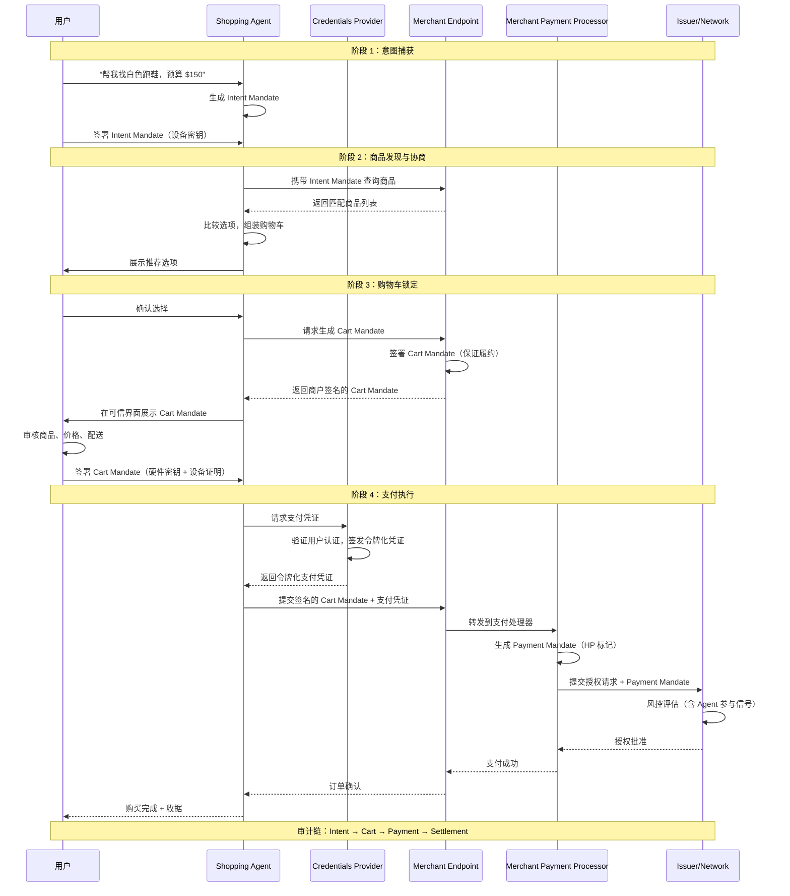
```mermaid
sequenceDiagram
    participant 用户
    participant Agent as Shopping Agent
    participant CP as Credentials Provider
    participant 商户 as Merchant Endpoint
    participant MPP as Merchant Payment Processor
    participant 发卡行 as Issuer/Network
    
    Note over 用户,发卡行: 阶段 1：意图捕获
    用户->>Agent: "帮我找白色跑鞋，预算 $150"
    Agent->>Agent: 生成 Intent Mandate
    用户->>Agent: 签署 Intent Mandate（设备密钥）
    
    Note over 用户,发卡行: 阶段 2：商品发现与协商
    Agent->>商户: 携带 Intent Mandate 查询商品
    商户-->>Agent: 返回匹配商品列表
    Agent->>Agent: 比较选项，组装购物车
    Agent->>用户: 展示推荐选项
    
    Note over 用户,发卡行: 阶段 3：购物车锁定
    用户->>Agent: 确认选择
    Agent->>商户: 请求生成 Cart Mandate
    商户->>商户: 签署 Cart Mandate（保证履约）
    商户-->>Agent: 返回商户签名的 Cart Mandate
    Agent->>用户: 在可信界面展示 Cart Mandate
    用户->>用户: 审核商品、价格、配送
    用户->>Agent: 签署 Cart Mandate（硬件密钥 + 设备证明）
    
    Note over 用户,发卡行: 阶段 4：支付执行
    Agent->>CP: 请求支付凭证
    CP->>CP: 验证用户认证，签发令牌化凭证
    CP-->>Agent: 返回令牌化支付凭证
    Agent->>商户: 提交签名的 Cart Mandate + 支付凭证
    商户->>MPP: 转发到支付处理器
    MPP->>MPP: 生成 Payment Mandate（HP 标记）
    MPP->>发卡行: 提交授权请求 + Payment Mandate
    发卡行->>发卡行: 风控评估（含 Agent 参与信号）
    发卡行-->>MPP: 授权批准
    MPP-->>商户: 支付成功
    商户-->>Agent: 订单确认
    Agent-->>用户: 购买完成 + 收据
    
    Note over 用户,发卡行: 审计链：Intent → Cart → Payment → Settlement
```

### 4.4 UC2: Human-Not-Present 委托购买

**场景**：用户签署 Intent Mandate "演唱会开票时立刻买两张，每张不超过 $200"，Agent 在条件满足时自动执行购买。

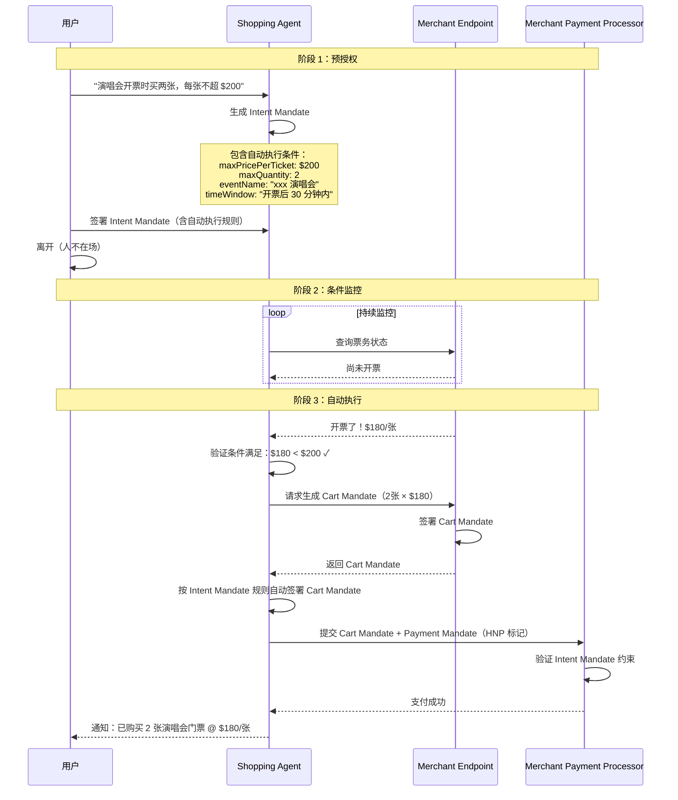
```mermaid
sequenceDiagram
    participant 用户
    participant Agent as Shopping Agent
    participant 商户 as Merchant Endpoint
    participant MPP as Merchant Payment Processor
    
    Note over 用户,MPP: 阶段 1：预授权
    用户->>Agent: "演唱会开票时买两张，每张不超 $200"
    Agent->>Agent: 生成 Intent Mandate
    Note over Agent: 包含自动执行条件：<br/>maxPricePerTicket: $200<br/>maxQuantity: 2<br/>eventName: "xxx 演唱会"<br/>timeWindow: "开票后 30 分钟内"
    用户->>Agent: 签署 Intent Mandate（含自动执行规则）
    用户->>用户: 离开（人不在场）
    
    Note over 用户,MPP: 阶段 2：条件监控
    loop 持续监控
        Agent->>商户: 查询票务状态
        商户-->>Agent: 尚未开票
    end
    
    Note over 用户,MPP: 阶段 3：自动执行
    商户-->>Agent: 开票了！$180/张
    Agent->>Agent: 验证条件满足：$180 < $200 ✓
    Agent->>商户: 请求生成 Cart Mandate（2张 × $180）
    商户->>商户: 签署 Cart Mandate
    商户-->>Agent: 返回 Cart Mandate
    Agent->>Agent: 按 Intent Mandate 规则自动签署 Cart Mandate
    Agent->>MPP: 提交 Cart Mandate + Payment Mandate（HNP 标记）
    MPP->>MPP: 验证 Intent Mandate 约束
    MPP-->>Agent: 支付成功
    Agent-->>用户: 通知：已购买 2 张演唱会门票 @ $180/张
```

### 4.5 UC3: 个性化优惠

**场景**：用户告诉 Agent 想买一辆自行车用于即将到来的旅行，Agent 将旅行日期等上下文传递给商户 Agent，商户 Agent 生成包含自行车、头盔和旅行架的定制捆绑优惠。

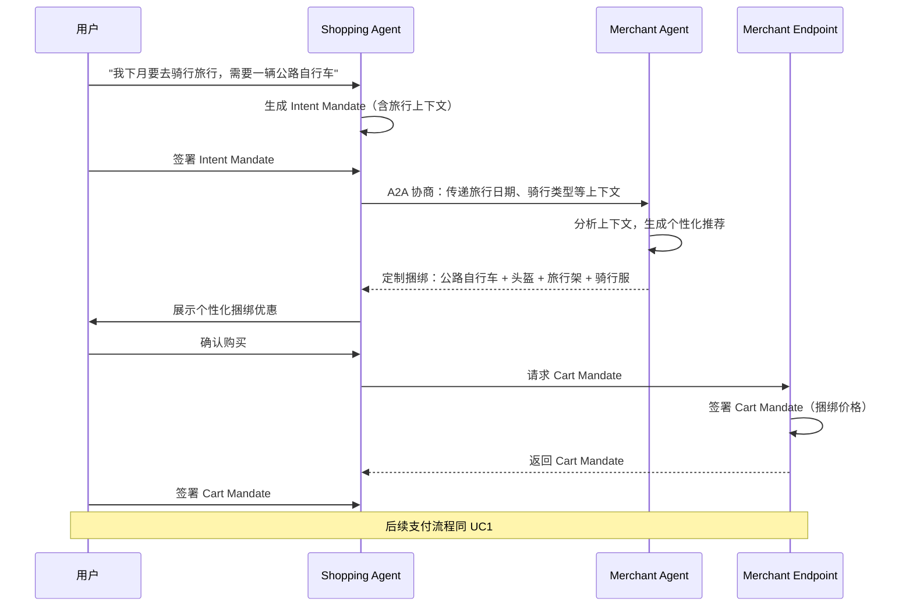
```mermaid
sequenceDiagram
    participant 用户
    participant Agent as Shopping Agent
    participant 商户Agent as Merchant Agent
    participant 商户 as Merchant Endpoint
    
    用户->>Agent: "我下月要去骑行旅行，需要一辆公路自行车"
    Agent->>Agent: 生成 Intent Mandate（含旅行上下文）
    用户->>Agent: 签署 Intent Mandate
    Agent->>商户Agent: A2A 协商：传递旅行日期、骑行类型等上下文
    商户Agent->>商户Agent: 分析上下文，生成个性化推荐
    商户Agent-->>Agent: 定制捆绑：公路自行车 + 头盔 + 旅行架 + 骑行服
    Agent->>用户: 展示个性化捆绑优惠
    用户->>Agent: 确认购买
    Agent->>商户: 请求 Cart Mandate
    商户->>商户: 签署 Cart Mandate（捆绑价格）
    商户-->>Agent: 返回 Cart Mandate
    用户->>Agent: 签署 Cart Mandate
    Note over 用户,商户: 后续支付流程同 UC1
```

### 4.6 UC4: 协调购买（多商户）

**场景**：用户说 "帮我订棕榈泉周末往返机票+酒店，总预算 $700"，Agent 同时与航空和酒店 Agent 协商，找到最优组合后同步签署两个 Cart Mandate 完成预订。

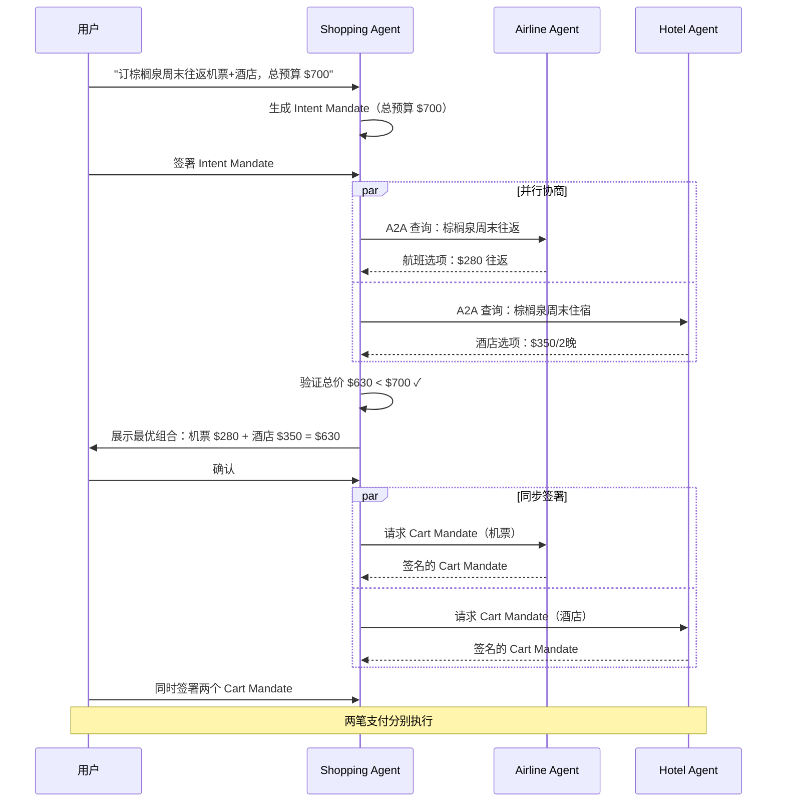
```mermaid
sequenceDiagram
    participant 用户
    participant Agent as Shopping Agent
    participant 航空Agent as Airline Agent
    participant 酒店Agent as Hotel Agent
    
    用户->>Agent: "订棕榈泉周末往返机票+酒店，总预算 $700"
    Agent->>Agent: 生成 Intent Mandate（总预算 $700）
    用户->>Agent: 签署 Intent Mandate
    
    par 并行协商
        Agent->>航空Agent: A2A 查询：棕榈泉周末往返
        航空Agent-->>Agent: 航班选项：$280 往返
    and
        Agent->>酒店Agent: A2A 查询：棕榈泉周末住宿
        酒店Agent-->>Agent: 酒店选项：$350/2晚
    end
    
    Agent->>Agent: 验证总价 $630 < $700 ✓
    Agent->>用户: 展示最优组合：机票 $280 + 酒店 $350 = $630
    用户->>Agent: 确认
    
    par 同步签署
        Agent->>航空Agent: 请求 Cart Mandate（机票）
        航空Agent-->>Agent: 签名的 Cart Mandate
    and
        Agent->>酒店Agent: 请求 Cart Mandate（酒店）
        酒店Agent-->>Agent: 签名的 Cart Mandate
    end
    
    用户->>Agent: 同时签署两个 Cart Mandate
    Note over 用户,酒店Agent: 两笔支付分别执行
```

### 4.7 UC5: Agent 间服务付费（x402 扩展）

**场景**：通过 A2A x402 扩展，一个 Agent 调用另一个 Agent 的付费 API 服务时自动完成稳定币微支付。

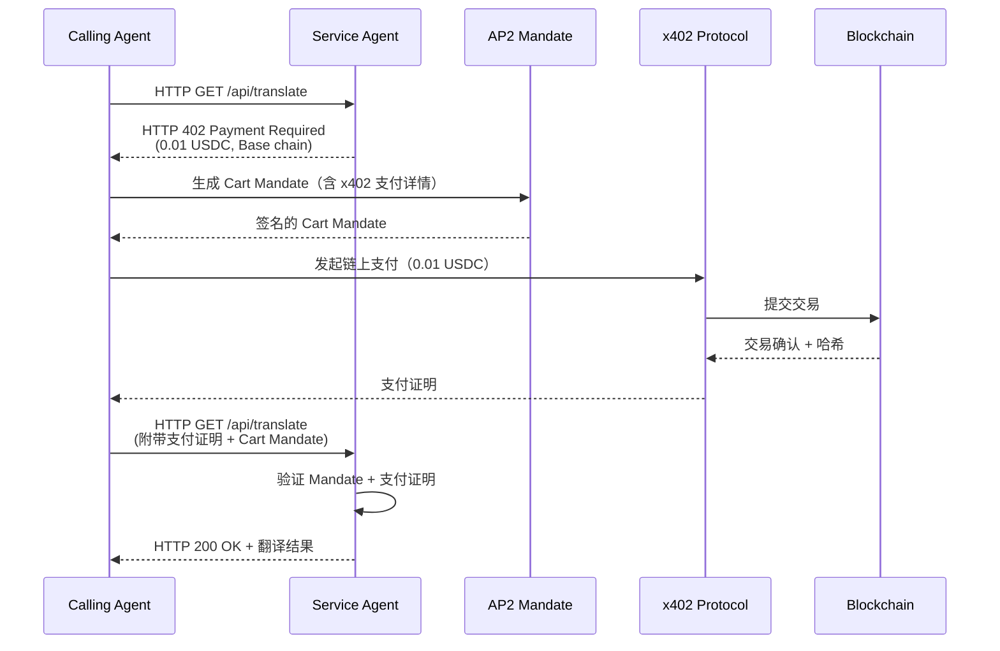
```mermaid
sequenceDiagram
    participant AgentA as Calling Agent
    participant AgentB as Service Agent
    participant AP2 as AP2 Mandate
    participant x402 as x402 Protocol
    participant 区块链 as Blockchain
    
    AgentA->>AgentB: HTTP GET /api/translate
    AgentB-->>AgentA: HTTP 402 Payment Required<br/>(0.01 USDC, Base chain)
    AgentA->>AP2: 生成 Cart Mandate（含 x402 支付详情）
    AP2-->>AgentA: 签名的 Cart Mandate
    AgentA->>x402: 发起链上支付（0.01 USDC）
    x402->>区块链: 提交交易
    区块链-->>x402: 交易确认 + 哈希
    x402-->>AgentA: 支付证明
    AgentA->>AgentB: HTTP GET /api/translate<br/>(附带支付证明 + Cart Mandate)
    AgentB->>AgentB: 验证 Mandate + 支付证明
    AgentB-->>AgentA: HTTP 200 OK + 翻译结果
```

### 4.8 业务逻辑关系总览 (Entity Relationship Overview)

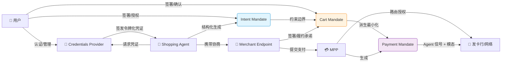
```mermaid
graph LR
    USER_E["👤 用户"] -->|"签署/授权"| IM_E("Intent Mandate")
    USER_E -->|"签署/确认"| CM_E("Cart Mandate")
    USER_E -->|"认证/管理"| CP_E["🔐 Credentials Provider"]
    
    AGENT_E["🤖 Shopping Agent"] -->|"结构化生成"| IM_E
    AGENT_E -->|"携带协商"| MERCHANT_E["🏪 Merchant Endpoint"]
    AGENT_E -->|"请求凭证"| CP_E
    
    IM_E -->|"约束边界"| CM_E
    CM_E -->|"派生最小化"| PM_E("Payment Mandate")
    
    MERCHANT_E -->|"签署/履约承诺"| CM_E
    MERCHANT_E -->|"提交支付"| MPP_E["💳 MPP"]
    
    MPP_E -->|"生成"| PM_E
    MPP_E -->|"路由授权"| ISSUER_E["🏦 发卡行/网络"]
    
    CP_E -->|"签发令牌化凭证"| AGENT_E
    PM_E -->|"Agent 信号 + 模态"| ISSUER_E
    
    style IM_E fill:#e1f5fe,stroke:#0288d1
    style CM_E fill:#fff3e0,stroke:#f57c00
    style PM_E fill:#f3e5f5,stroke:#7b1fa2
```

> 图例：圆角矩形 = Mandate 实体（数据对象），方角矩形 = 角色/系统（参与方）

**关系说明表**：

| 实体 A | 关系 | 实体 B | 说明 |
|--------|------|--------|------|
| 用户 | 签署/授权 | Intent Mandate | 用户通过设备密钥签署，授权 Agent 在约束范围内行动 |
| 用户 | 签署/确认 | Cart Mandate | 用户在可信界面（Trusted Surface）中审核并签署，确认具体购买 |
| 用户 | 认证/管理 | Credentials Provider | 用户管理支付方式，CP 处理认证 |
| Shopping Agent | 结构化生成 | Intent Mandate | Agent 将自然语言意图转化为结构化 JSON |
| Shopping Agent | 携带协商 | Merchant Endpoint | Agent 携带 Mandate 与商户协商商品和价格 |
| Intent Mandate | 约束边界 | Cart Mandate | Cart Mandate 必须满足 Intent Mandate 的约束条件 |
| Cart Mandate | 派生最小化 | Payment Mandate | MPP 从 Cart Mandate 提取最小化信息 |
| Merchant Endpoint | 签署/履约承诺 | Cart Mandate | 商户签名表示承诺兑现商品、价格和配送 |
| MPP | 路由授权 | 发卡行/网络 | MPP 将 Payment Mandate 提交给发卡行进行风控和授权 |
| Credentials Provider | 签发令牌化凭证 | Shopping Agent | CP 签发令牌化支付凭证，Agent 不接触原始卡号 |


## 5. 技术架构 (Architecture)

### 5.1 整体架构：基于角色的分离模型

AP2 定义了五种角色，每种角色有明确的职责边界，确保敏感数据只由适当的实体处理：

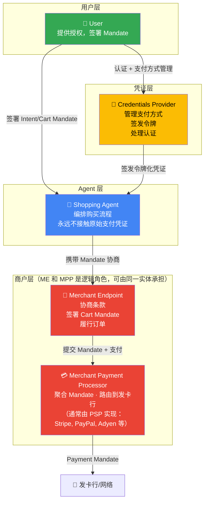
```mermaid
graph TB
    subgraph 用户层
        USER["👤 User<br/>提供授权，签署 Mandate"]
    end
    
    subgraph Agent 层
        AGENT["🤖 Shopping Agent<br/>编排购买流程<br/>永远不接触原始支付凭证"]
    end
    
    subgraph 凭证层
        CP["🔐 Credentials Provider<br/>管理支付方式<br/>签发令牌<br/>处理认证"]
    end
    
    subgraph "商户层（ME 和 MPP 是逻辑角色，可由同一实体承担）"
        ME["🏪 Merchant Endpoint<br/>协商条款<br/>签署 Cart Mandate<br/>履行订单"]
        MPP["💳 Merchant Payment Processor<br/>聚合 Mandate · 路由到发卡行<br/>（通常由 PSP 实现：Stripe, PayPal, Adyen 等）"]
    end
    
    USER -->|"签署 Intent/Cart Mandate"| AGENT
    AGENT -->|"携带 Mandate 协商"| ME
    USER -->|"认证 + 支付方式管理"| CP
    CP -->|"签发令牌化凭证"| AGENT
    ME -->|"提交 Mandate + 支付"| MPP
    MPP -->|"Payment Mandate"| ISSUER["🏦 发卡行/网络"]
    
    style USER fill:#34A853,color:#fff
    style AGENT fill:#4285F4,color:#fff
    style CP fill:#FBBC04,color:#000
    style ME fill:#EA4335,color:#fff
    style MPP fill:#EA4335,color:#fff
```

> **MPP 是逻辑角色，不是商户自建系统**：AP2 规范中的 Merchant Payment Processor (MPP) 是一个**逻辑角色**，定义的是"从 Cart Mandate 派生 Payment Mandate 并路由到发卡行"这一职责，而非要求商户自己实现支付处理能力。在实际部署中：
> - **绝大多数商户**：MPP 角色由其接入的 PSP（Payment Service Provider）承担，如 Stripe、PayPal、Adyen、Worldpay 等。PSP 需要基于 AP2 协议实现 MPP 接口，商户只需通过 PSP 的 SDK/API 接入即可。
> - **大型商户**（如 Amazon、Walmart）：可能自建支付处理能力，直接实现 MPP 角色。
> - **Merchant Endpoint 与 MPP 的关系**：两者可以是同一实体（PSP 同时承担商品协商和支付处理），也可以分离（商户自己管理商品和订单，PSP 只处理支付）。5.5 节的"路径一：通过 PSP 插件"就是 PSP 同时承担 ME + MPP 的典型场景。

**角色分离的安全价值**：

| 角色 | 可接触的数据 | 不可接触的数据 |
|------|------------|-------------|
| User | 自己的意图、支付方式选择 | — |
| Shopping Agent | Mandate 内容、商品信息 | 原始支付凭证（卡号、CVV） |
| Credentials Provider | 支付方式、认证数据 | 购物车详情（由商户管理） |
| Merchant Endpoint | 商品、价格、Cart Mandate | 原始支付凭证 |
| Merchant Payment Processor (MPP) | Payment Mandate、令牌化凭证 | 用户个人信息 |

> 注：MPP 角色通常由 PSP 实现。PSP 需要在其支付处理流程中集成 AP2 的 Mandate 派生和路由逻辑，将 Agent 参与信号（HP/HNP 模态、Mandate 哈希等）嵌入到发送给发卡行的授权请求中。

### 5.2 Mandate 数据流架构

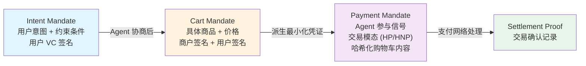
```mermaid
graph LR
    IM["Intent Mandate<br/>用户意图 + 约束条件<br/>用户 VC 签名"] -->|"Agent 协商后"| CM["Cart Mandate<br/>具体商品 + 价格<br/>商户签名 + 用户签名"]
    CM -->|"派生最小化凭证"| PM["Payment Mandate<br/>Agent 参与信号<br/>交易模态 (HP/HNP)<br/>哈希化购物车内容"]
    PM -->|"支付网络处理"| SP["Settlement Proof<br/>交易确认记录"]
    
    style IM fill:#e1f5fe
    style CM fill:#fff3e0
    style PM fill:#f3e5f5
    style SP fill:#e8f5e9
```

### 5.3 Mandate 签署的多方协作机制

Mandate 签署不是单一角色完成的操作，而是横跨多方的协作过程：

| Mandate 类型 | 谁生成 | 谁签署 | 在哪里签署 | 目的 |
|-------------|--------|--------|-----------|------|
| **Intent Mandate** | Shopping Agent（将用户自然语言意图结构化为 JSON 约束条件） | User（设备密钥签名） | Agent 平台的可信界面（Trusted Surface）<sup>*</sup> | 捕获用户意图和授权边界 |
| **Cart Mandate** | Merchant Endpoint（锁定具体商品、价格、配送方式） | Merchant 签 + User 签（双重签名） | 商户后端签署 → Agent 平台可信界面展示给用户签署 | 商户承诺履约 + 用户确认购买 |
| **Payment Mandate** | Merchant Payment Processor（从 Cart Mandate 派生最小化凭证） | 自动生成（无需用户签署） | PSP / MPP 后端 | 传递 Agent 参与信号给发卡行 |

> <sup>*</sup> **关于 Trusted Surface（可信界面）**：AP2 规范使用 "trusted surface" 这一术语，指用户可以安全审核和确认交易内容的界面。规范故意没有限定它必须是哪个特定平台的界面，在不同场景下 trusted surface 可以是不同的东西：
> - **审核购物车 / 签署 Mandate**：Agent 平台的界面（如 Gemini 对话窗口、ChatGPT 界面）
> - **3DS2 / OTP 挑战验证**：发卡行的界面（银行 App、银行网页）
> - **支付方式设置 / 令牌化**：Credentials Provider 的界面（如 Google Wallet App）
> - **HNP 场景中商户要求用户回来确认**：Agent 平台的通知界面
>
> 核心原则是：涉及用户签名和敏感操作的界面必须由受信任的实体控制，而非由 Agent 本身渲染，以防止 Agent 篡改展示内容。

各角色在签署流程中的职责：

- **Shopping Agent（编排者）**：将用户的自然语言意图（"帮我买双白色跑鞋，预算 $150"）结构化为 Intent Mandate 的 JSON 格式（约束条件、金额上限、商户白名单等），提交草案供用户审核。Agent 本身不签署任何 Mandate。
- **User（授权者）**：在可信界面（Trusted Surface）中审核 Mandate 内容，通过设备安全芯片中的私钥（ECDSA）签署。用户是唯一拥有签署权的人类参与者。
- **Merchant Endpoint（承诺者）**：签署 Cart Mandate 表示"这个商品、这个价格、这个配送方式我承诺兑现"。商户签名是履约承诺的加密证明。
- **Merchant Payment Processor（转换者）**：从 Cart Mandate 派生 Payment Mandate，提取最小化信息（金额、Agent 参与信号、交易模态 HP/HNP），不包含 PCI/PII 数据，专为发卡行风控设计。
- **Credentials Provider（凭证方）**：不参与 Mandate 签署，但在支付执行阶段提供令牌化支付凭证，确保原始卡号不暴露给 Agent 或商户。

**HP 与 HNP 模式下签署流程的关键区别**：

- HP 模式：Cart Mandate 由用户在可信界面（Trusted Surface）中实时审核并签署（硬件密钥 + 设备证明）
- HNP 模式：Cart Mandate 由 Agent 按照 Intent Mandate 中预设的 `autoExecuteConditions` 规则自动签署，无需用户再次确认。这就是为什么 Intent Mandate 的约束条件设计至关重要——它是 Agent 自主行动的"授权边界"

### 5.4 Mandate 状态机

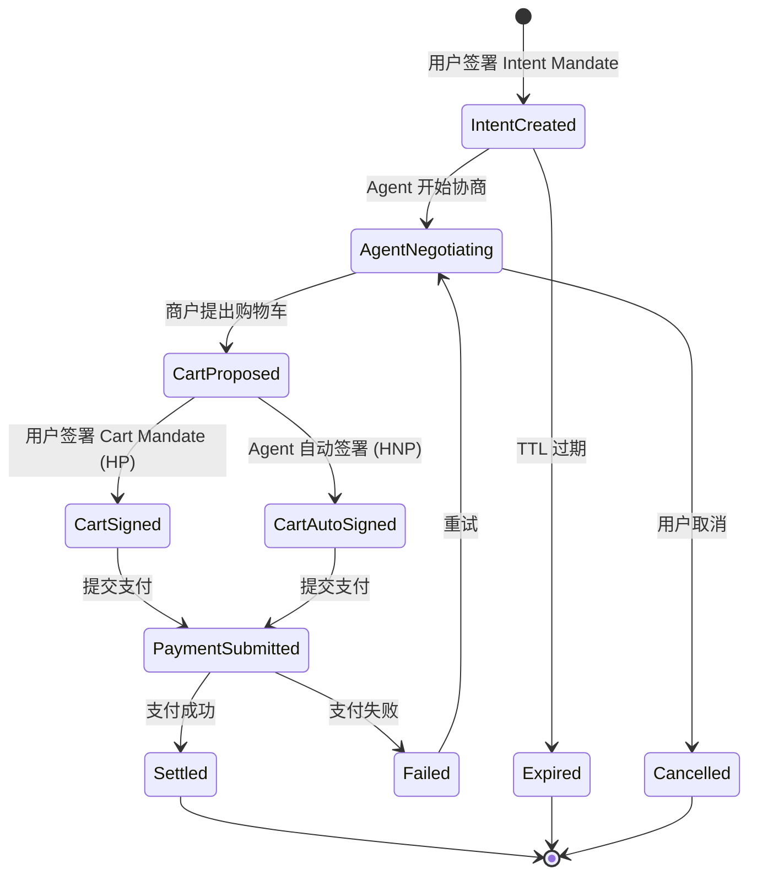
```mermaid
stateDiagram-v2
    [*] --> IntentCreated: 用户签署 Intent Mandate
    IntentCreated --> AgentNegotiating: Agent 开始协商
    AgentNegotiating --> CartProposed: 商户提出购物车
    CartProposed --> CartSigned: 用户签署 Cart Mandate (HP)
    CartProposed --> CartAutoSigned: Agent 自动签署 (HNP)
    CartSigned --> PaymentSubmitted: 提交支付
    CartAutoSigned --> PaymentSubmitted: 提交支付
    PaymentSubmitted --> Settled: 支付成功
    PaymentSubmitted --> Failed: 支付失败
    Settled --> [*]
    Failed --> AgentNegotiating: 重试
    
    IntentCreated --> Expired: TTL 过期
    AgentNegotiating --> Cancelled: 用户取消
    Expired --> [*]
    Cancelled --> [*]
```

### 5.5 商户/开发者对接流程

商户接入 AP2，本质上是要在现有的商品和订单系统之上，增加 AP2 协议层的能力。具体来说，商户侧需要完成以下职责：

| # | 职责 | 对应角色 | 说明 |
|---|------|---------|------|
| ① | **接收并验证 Intent Mandate** | ME | Agent 携带用户签署的 Intent Mandate 来协商，商户需要验证其签名有效性，并解析其中的约束条件（预算上限、商品类别、配送要求等） |
| ② | **生成并签署 Cart Mandate** | ME | 根据 Agent 选定的商品，锁定价格、库存和配送方式，生成 Cart Mandate 并用商户密钥签署——这是商户的**履约承诺**的加密证明 |
| ③ | **接收用户双签的 Cart Mandate** | ME | 用户在 Trusted Surface 审核并签署后，Agent 将双签（商户签 + 用户签）的 Cart Mandate 提交回商户 |
| ④ | **派生 Payment Mandate** | MPP | 从 Cart Mandate 中提取最小化信息（金额、Agent 参与信号、HP/HNP 模态、购物车哈希），生成 Payment Mandate |
| ⑤ | **路由到发卡行/支付网络** | MPP | 将 Payment Mandate 嵌入授权请求，提交给发卡行进行风控和授权 |
| ⑥ | **管理加密密钥** | ME + MPP | 生成和维护用于 Mandate 签名/验证的 ECDSA 密钥对 |

> 其中 ①②③ 属于 Merchant Endpoint (ME) 角色，④⑤ 属于 Merchant Payment Processor (MPP) 角色。如 5.1 节所述，MPP 通常由 PSP 实现，因此商户的实际工作量取决于选择哪条接入路径。

商户接入 AP2 有三条路径，复杂度和能力递增：

#### 路径一：通过 PSP 插件（最简单）

适用于已使用 PayPal、Adyen、Worldpay 等 PSP 的商户。

> **核心理解**：Agent 的交互对象始终是**商户**（Merchant Endpoint），PSP 对 Agent 来说是透明的。商户收到 Agent 的请求后，在后端调用 PSP 的 SDK/API 完成 Mandate 签署和支付处理。这与今天的电商模式一致——用户在商户网站点"付款"，商户后端调用 Stripe API 处理支付，用户并不直接跟 Stripe 交互。
>
> 路径一的"最简单"体现在：商户不需要自己实现 Mandate 的加密签名/验证逻辑，这些由 PSP 的 SDK 封装，商户只需把商品和订单数据传给 PSP SDK，PSP 帮你签 Cart Mandate、派生 Payment Mandate、路由到发卡行。

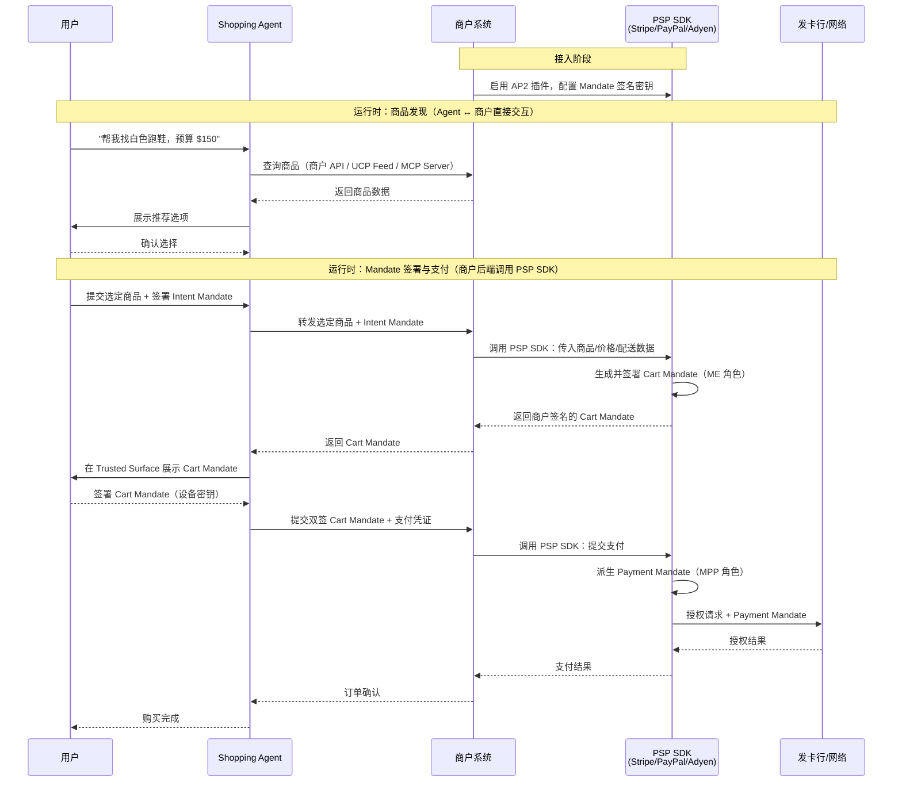
```mermaid
sequenceDiagram
    participant 用户 as 用户
    participant Agent as Shopping Agent
    participant 商户 as 商户系统
    participant PSP as PSP SDK<br/>(Stripe/PayPal/Adyen)
    participant 发卡行 as 发卡行/网络
    
    Note over 商户,PSP: 接入阶段
    商户->>PSP: 启用 AP2 插件，配置 Mandate 签名密钥
    
    Note over 用户,发卡行: 运行时：商品发现（Agent ↔ 商户直接交互）
    用户->>Agent: "帮我找白色跑鞋，预算 $150"
    Agent->>商户: 查询商品（商户 API / UCP Feed / MCP Server）
    商户-->>Agent: 返回商品数据
    Agent->>用户: 展示推荐选项
    用户-->>Agent: 确认选择
    
    Note over 用户,发卡行: 运行时：Mandate 签署与支付（商户后端调用 PSP SDK）
    用户->>Agent: 提交选定商品 + 签署 Intent Mandate
    Agent->>商户: 转发选定商品 + Intent Mandate
    商户->>PSP: 调用 PSP SDK：传入商品/价格/配送数据
    PSP->>PSP: 生成并签署 Cart Mandate（ME 角色）
    PSP-->>商户: 返回商户签名的 Cart Mandate
    商户-->>Agent: 返回 Cart Mandate
    Agent->>用户: 在 Trusted Surface 展示 Cart Mandate
    用户-->>Agent: 签署 Cart Mandate（设备密钥）
    Agent->>商户: 提交双签 Cart Mandate + 支付凭证
    商户->>PSP: 调用 PSP SDK：提交支付
    PSP->>PSP: 派生 Payment Mandate（MPP 角色）
    PSP->>发卡行: 授权请求 + Payment Mandate
    发卡行-->>PSP: 授权结果
    PSP-->>商户: 支付结果
    商户-->>Agent: 订单确认
    Agent-->>用户: 购买完成
```

| 优势 | 劣势 |
|------|------|
| 商户无需实现 Mandate 签名/验证逻辑 | 依赖 PSP 的 AP2 支持进度 |
| PSP SDK 封装所有 AP2 协议层操作 | 定制化能力有限（如自定义 Mandate 字段） |
| Agent 只需对接商户，无需感知 PSP 存在 | 额外的 PSP 费用 |

#### 路径二：REST API 直接集成

适用于有技术团队的商户，直接实现 AP2 的 Merchant Endpoint 接口。

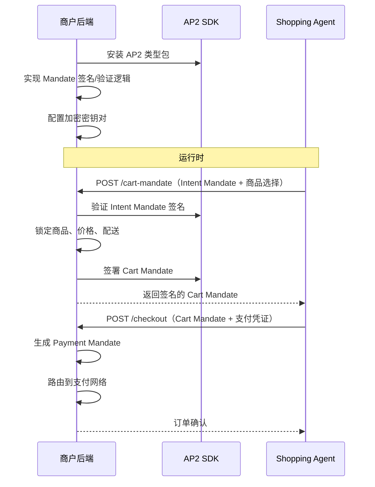
```mermaid
sequenceDiagram
    participant 商户 as 商户后端
    participant AP2SDK as AP2 SDK
    participant Agent as Shopping Agent
    
    商户->>AP2SDK: 安装 AP2 类型包
    商户->>商户: 实现 Mandate 签名/验证逻辑
    商户->>商户: 配置加密密钥对
    
    Note over 商户,Agent: 运行时
    Agent->>商户: POST /cart-mandate（Intent Mandate + 商品选择）
    商户->>AP2SDK: 验证 Intent Mandate 签名
    商户->>商户: 锁定商品、价格、配送
    商户->>AP2SDK: 签署 Cart Mandate
    商户-->>Agent: 返回签名的 Cart Mandate
    
    Agent->>商户: POST /checkout（Cart Mandate + 支付凭证）
    商户->>商户: 生成 Payment Mandate
    商户->>商户: 路由到支付网络
    商户-->>Agent: 订单确认
```

| 优势 | 劣势 |
|------|------|
| 完全控制 Mandate 逻辑 | 需要实现签名/验证 |
| 可深度定制 | 需要管理加密密钥 |
| 无 PSP 依赖 | 开发成本较高 |

#### 路径三：MCP Server 集成

适用于希望让 Agent 通过 MCP 工具调用直接交互的商户。

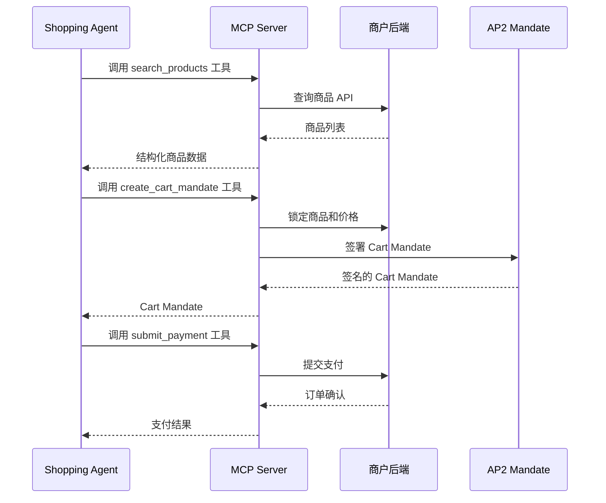
```mermaid
sequenceDiagram
    participant Agent as Shopping Agent
    participant MCP as MCP Server
    participant 商户 as 商户后端
    participant AP2 as AP2 Mandate
    
    Agent->>MCP: 调用 search_products 工具
    MCP->>商户: 查询商品 API
    商户-->>MCP: 商品列表
    MCP-->>Agent: 结构化商品数据
    
    Agent->>MCP: 调用 create_cart_mandate 工具
    MCP->>商户: 锁定商品和价格
    MCP->>AP2: 签署 Cart Mandate
    AP2-->>MCP: 签名的 Cart Mandate
    MCP-->>Agent: Cart Mandate
    
    Agent->>MCP: 调用 submit_payment 工具
    MCP->>商户: 提交支付
    商户-->>MCP: 订单确认
    MCP-->>Agent: 支付结果
```

| 优势 | 劣势 |
|------|------|
| Agent 原生集成体验 | 需要构建 MCP Server |
| 工具调用语义清晰 | MCP 生态仍在早期 |
| 与 A2A 协议无缝配合 | 需要维护 MCP Server |

### 5.6 协议栈集成架构

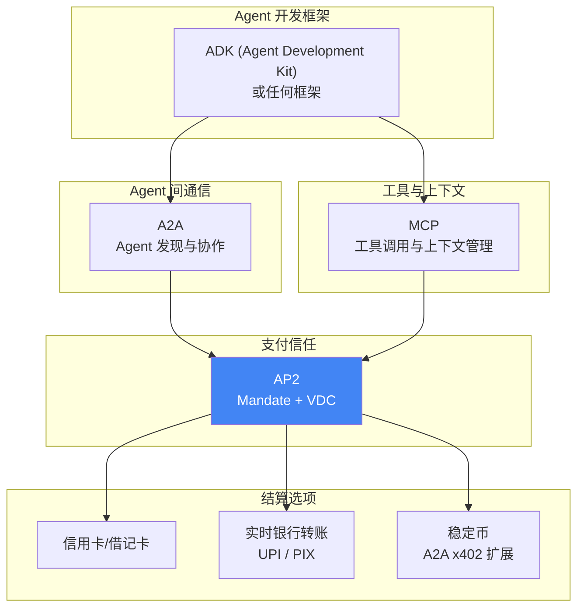
```mermaid
graph TD
    subgraph "Agent 开发框架"
        ADK["ADK (Agent Development Kit)<br/>或任何框架"]
    end
    
    subgraph "工具与上下文"
        MCP_T["MCP<br/>工具调用与上下文管理"]
    end
    
    subgraph "Agent 间通信"
        A2A_T["A2A<br/>Agent 发现与协作"]
    end
    
    subgraph "支付信任"
        AP2_T["AP2<br/>Mandate + VDC"]
    end
    
    subgraph "结算选项"
        CARDS["信用卡/借记卡"]
        BANK["实时银行转账<br/>UPI / PIX"]
        CRYPTO["稳定币<br/>A2A x402 扩展"]
    end
    
    ADK --> MCP_T
    ADK --> A2A_T
    A2A_T --> AP2_T
    MCP_T --> AP2_T
    AP2_T --> CARDS
    AP2_T --> BANK
    AP2_T --> CRYPTO
    
    style AP2_T fill:#4285F4,color:#fff
```


## 6. 技术规范详解 (Technical Deep Dive)

### 6.1 W3C Verifiable Credentials：AP2 信任架构的基石

AP2 的所有 Mandate 都以 W3C Verifiable Credentials (VC) 的形式表达。理解 VC 是理解 AP2 技术架构的前提。

#### 6.1.1 什么是 W3C Verifiable Credentials

W3C Verifiable Credentials（可验证凭证）是 W3C 国际标准（当前版本 v2.0），定义了一种**数字世界中可验证声明的通用数据格式**。可以将其理解为"数字世界的公证书"——一个实体对另一个实体做出的、可被第三方独立验证的加密签名声明。

**现实世界类比**：

| 现实世界凭证 | 对应的 VC | 签发者 |
|------------|----------|--------|
| 驾照 | JSON 对象："张三有驾驶资格" + 交管局数字签名 | 交管局 |
| 学位证书 | JSON 对象："张三获得计算机学士学位" + 大学数字签名 | 大学 |
| 银行对账单 | JSON 对象："张三账户余额 10 万" + 银行数字签名 | 银行 |
| **AP2 Cart Mandate** | **JSON 对象："用户授权购买 Nike 跑鞋 $129.99" + 用户签名 + 商户签名** | **用户 + 商户** |

**VC 的核心三角模型**：

```
签发者 (Issuer)                验证者 (Verifier)
   │                              ▲
   │ 签发 VC（加密签名）           │ 出示 VC（独立验证签名）
   ▼                              │
            持有者 (Holder)
```

- **签发者 (Issuer)**：创建并签名 VC 的实体。在 AP2 中，用户签署 Intent/Cart Mandate，商户签署 Cart Mandate，MPP 生成 Payment Mandate
- **持有者 (Holder)**：持有 VC 的实体，可以选择性地向他人出示。在 AP2 中，Shopping Agent 持有并传递 Mandate
- **验证者 (Verifier)**：接收并验证 VC 的实体，**无需联系签发者即可独立验证签名的真实性**。在 AP2 中，商户验证 Intent Mandate、发卡行验证 Payment Mandate

#### 6.1.2 VC 的关键技术特性

| 特性 | 说明 | 在 AP2 中的体现 |
|------|------|---------------|
| **防篡改** | 任何修改都会使加密签名失效 | Mandate 内容被篡改后签名验证失败，交易被拒绝 |
| **去中心化验证** | 验证者不需要联系签发者，可独立验证签名 | 商户验证 Cart Mandate 不需要联系 Google 的服务器 |
| **可移植** | 标准化 JSON-LD 格式，跨系统互通 | Mandate 可以在不同 Agent 平台、不同 PSP 之间传递 |
| **选择性披露** | 持有者可以只出示 VC 中的部分信息 | Payment Mandate 只包含最小化信息，不暴露完整购物车 |
| **加密模块化** | 支持多种签名算法（ECDSA、EdDSA 等） | AP2 可平滑升级到后量子密码学 |
| **可组合** | 多个 VC 可以关联形成证据链 | Intent → Cart → Payment Mandate 的审计链 |

#### 6.1.3 VC 在 AP2 中的具体应用

AP2 的三种 Mandate 本质上都是 VC 的具体应用实例（AP2 称之为 VDC，Verifiable Digital Credentials）：

```
W3C Verifiable Credentials（通用标准）
    │
    ├── Intent Mandate（AP2 的 VC 实例）
    │     签发者 = 用户（通过设备硬件密钥签名）
    │     内容 = 购物意图 + 约束条件 + TTL
    │     验证者 = Agent、商户、任何参与方
    │     用途 = 捕获用户意图，定义 Agent 行动边界
    │
    ├── Cart Mandate（AP2 的 VC 实例）
    │     签发者 = 商户签名 + 用户签名（双重 VC 签名）
    │     内容 = 具体商品 + 价格 + 配送 + 支付方式
    │     验证者 = MPP、发卡行、争议处理方
    │     用途 = 不可否认的购买证明 + 商户履约承诺
    │
    └── Payment Mandate（AP2 的 VC 实例）
          签发者 = MPP（自动派生）
          内容 = Agent 参与信号 + 交易模态(HP/HNP) + 金额哈希
          验证者 = 发卡行、支付网络
          用途 = 为发卡行风控提供 Agent 上下文
```

**VC 标准中的字段与 AP2 Mandate 的映射**：

| VC 标准字段 | AP2 中的含义 | 示例 |
|-----------|------------|------|
| `@context` | 声明使用 W3C VC 标准 | `["https://www.w3.org/2018/credentials/v1"]` |
| `type` | Mandate 类型 | `["VerifiableCredential", "CartMandate"]` |
| `issuer` | 签发者的去中心化标识符 | `did:example:merchant456` |
| `issuanceDate` | Mandate 签发时间 | `2025-09-16T10:15:00Z` |
| `credentialSubject` | Mandate 的核心业务内容 | 购物车详情、约束条件等 |
| `proof` | 加密签名（可以有多个） | ECDSA 签名 + 签名方法 + JWS |

#### 6.1.4 为什么 AP2 选择 VC 而不是自定义格式

| 考量维度 | VC 的优势 | 自定义格式的劣势 |
|---------|----------|---------------|
| **互操作性** | W3C 国际标准，任何实现了 VC 验证的系统都能验证 AP2 的 Mandate | 需要每个参与方单独实现专有格式的解析和验证 |
| **去中心化验证** | 商户验证 Mandate 不需要联系 Google 的服务器，独立验证签名即可 | 可能需要中心化验证服务 |
| **生态复用** | VC 生态已有大量工具库、验证器、钱包实现，AP2 不需要从零构建 | 需要自建整套工具链 |
| **未来兼容** | VC 标准支持加密模块化，可平滑升级到后量子密码学 | 升级加密算法需要重新设计格式 |
| **法律认可** | 欧盟 eIDAS 2.0 等法规正在将 VC 纳入法律框架，有助于 Mandate 的法律效力 | 自定义格式无法律先例 |
| **标准治理** | W3C 多方治理，不受单一公司控制 | 协议发起方对格式有完全控制权 |

**代价与风险**：

| 风险 | 说明 | 与竞品对比 |
|------|------|----------|
| VC 基础设施成熟度 | W3C VC 生态仍在成熟中，DID 解析器、VC 验证器的普及度有限 | ACP 使用 Stripe 现有 Token 基础设施，完全不依赖 VC 生态 |
| 实现复杂度 | 商户需要理解和实现 VC 签名/验证逻辑 | ACP 商户只需集成 Stripe SDK |
| 性能开销 | VC 的 JSON-LD 格式和签名验证比简单 Token 更重 | x402 的 HTTP 402 + 链上验证更轻量 |

> **总结**：AP2 选择 VC 作为底层格式，是用短期的实现复杂度换取长期的互操作性和去中心化验证能力。这一选择与 AP2 "信任层"的定位高度一致——信任层需要的是可被任何人独立验证的加密证明，而不是依赖某个中心化服务的 Token。

### 6.2 三种 Mandate 的数据结构

#### Intent Mandate（意图委托）

Intent Mandate 捕获用户的初始购物意图，包含以下关键字段：

```json
{
  "@context": ["https://www.w3.org/2018/credentials/v1"],
  "type": ["VerifiableCredential", "IntentMandate"],
  "issuer": "did:example:user123",
  "issuanceDate": "2025-09-16T10:00:00Z",
  "credentialSubject": {
    "intent": {
      "description": "Find me white running shoes under $150",
      "constraints": {
        "maxPrice": {
          "amount": 150,
          "currency": "USD"
        },
        "merchantAllowList": ["merchant-a.com", "merchant-b.com"],
        "skuConstraints": {
          "category": "running_shoes",
          "color": "white"
        },
        "timeToLive": "PT24H",
        "paymentMethodCategories": ["credit_card", "debit_card"]
      }
    },
    "delegationMode": "human-present",
    "autoExecuteConditions": null
  },
  "proof": {
    "type": "EcdsaSecp256k1Signature2019",
    "created": "2025-09-16T10:00:00Z",
    "verificationMethod": "did:example:user123#key-1",
    "proofPurpose": "assertionMethod",
    "jws": "eyJhbGciOiJFUzI1NksifQ..."
  }
}
```

#### Cart Mandate（购物车委托）

Cart Mandate 锁定具体的购买内容，包含双重签名（商户 + 用户）：

```json
{
  "@context": ["https://www.w3.org/2018/credentials/v1"],
  "type": ["VerifiableCredential", "CartMandate"],
  "issuer": "did:example:merchant456",
  "issuanceDate": "2025-09-16T10:15:00Z",
  "credentialSubject": {
    "intentMandateRef": "urn:uuid:intent-mandate-abc123",
    "cart": {
      "items": [
        {
          "sku": "SHOE-WHITE-42",
          "name": "Nike Air Max White",
          "quantity": 1,
          "unitPrice": {"amount": 129.99, "currency": "USD"}
        }
      ],
      "shipping": {
        "method": "standard",
        "address": "encrypted:...",
        "cost": {"amount": 5.99, "currency": "USD"}
      },
      "total": {"amount": 135.98, "currency": "USD"},
      "tax": {"amount": 10.88, "currency": "USD"}
    },
    "payer": "did:example:user123",
    "payee": "did:example:merchant456",
    "paymentMethod": "tokenized:visa-****-1234",
    "riskPayload": {
      "deviceAttestation": "...",
      "sessionId": "..."
    }
  },
  "proof": [
    {
      "type": "EcdsaSecp256k1Signature2019",
      "created": "2025-09-16T10:15:00Z",
      "verificationMethod": "did:example:merchant456#key-1",
      "proofPurpose": "assertionMethod",
      "jws": "merchant-signature..."
    },
    {
      "type": "EcdsaSecp256k1Signature2019",
      "created": "2025-09-16T10:15:30Z",
      "verificationMethod": "did:example:user123#key-1",
      "proofPurpose": "authentication",
      "jws": "user-signature..."
    }
  ]
}
```

#### Payment Mandate（支付委托）

Payment Mandate 是最小化凭证，专为支付网络设计：

```json
{
  "@context": ["https://www.w3.org/2018/credentials/v1"],
  "type": ["VerifiableCredential", "PaymentMandate"],
  "credentialSubject": {
    "cartMandateRef": "urn:uuid:cart-mandate-def456",
    "agentPresent": true,
    "transactionModality": "human-present",
    "cartContentHash": "sha256:a1b2c3d4e5f6...",
    "amount": {"amount": 146.86, "currency": "USD"}
  }
}
```

### 6.3 A2A x402 扩展 — 稳定币结算集成

Google 与 Coinbase、Ethereum Foundation、MetaMask 合作推出的 A2A x402 扩展，将链上结算能力集成到 AP2 框架中。

**架构**：

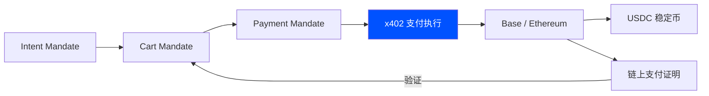
```mermaid
graph LR
    IM_X["Intent Mandate"] --> CM_X["Cart Mandate"] --> PM_X["Payment Mandate"]
    PM_X --> X402_EXT["x402 支付执行"]
    X402_EXT --> CHAIN["Base / Ethereum"]
    CHAIN --> USDC["USDC 稳定币"]
    CHAIN --> PROOF["链上支付证明"]
    PROOF -->|"验证"| CM_X
    
    style X402_EXT fill:#0052FF,color:#fff
```

**交易流程**：

```mermaid
sequenceDiagram
    participant Agent
    participant 商户
    participant AP2 as AP2 Mandate
    participant x402 as x402 Protocol
    participant 区块链
    
    Agent->>商户: HTTP GET /resource
    商户-->>Agent: HTTP 402 Payment Required<br/>(金额 + 链信息 + 钱包地址)
    Agent->>AP2: 生成 Cart Mandate（含 x402 支付详情）
    AP2-->>Agent: 签名的 Cart Mandate
    Agent->>x402: 发起链上支付（USDC）
    x402->>区块链: 提交交易
    区块链-->>x402: 交易确认 + 哈希
    x402-->>Agent: 支付证明
    Agent->>商户: HTTP GET /resource<br/>(附带支付证明 + Cart Mandate)
    商户->>商户: 验证 Mandate + 支付证明
    商户-->>Agent: HTTP 200 OK + 内容
```

这一扩展的价值在于：Agent 间的微支付和服务付费可以在 AP2 的信任框架内完成，同时享受区块链的即时结算和不可篡改特性。

### 6.4 PayPal 的 AP2 实现方案

PayPal 作为 AP2 的核心合作伙伴，公开了其详细的集成计划，展示了传统支付巨头如何采纳 AP2。

**PayPal 的 AP2 集成架构**：

```mermaid
graph LR
    WALLET["PayPal Wallet<br/>凭证管理 + 用户同意"] --> CHECKOUT["PayPal Checkout<br/>交易上下文中介"]
    CHECKOUT --> BRAINTREE["Braintree<br/>授权与结算路由"]
    CHECKOUT --> CORE["PayPal Core<br/>风控 + 争议处理"]
    M_EMBED["Mandate 嵌入<br/>ISO 8583 + API 流"] --> BRAINTREE
    M_RISK["Mandate 元数据<br/>注入风控引擎"] --> CORE
    M_DISPUTE["Mandate 证据<br/>增强 Seller Protection"] --> CORE
    
    style M_EMBED fill:#003087,color:#fff
    style M_RISK fill:#003087,color:#fff
    style M_DISPUTE fill:#003087,color:#fff
```

**PayPal 的五大集成方向**：

| 方向 | 说明 | 价值 |
|------|------|------|
| Payment Mandate 试点 | 将 Payment Mandate 嵌入授权流中，让发卡行看到 Agent 参与信号 | 提升批准率，减少误拒 |
| 挑战编排 | 标准化 3DS2/OTP 重定向挑战，在可信界面完成，避免重复验证 | 降低 HNP 场景的摩擦 |
| 争议证据增强 | 将 Cart/Intent Mandate 纳入 Seller Protection 工作流 | 加密证据链加速争议解决 |
| 信任框架演进 | 从策展允许列表过渡到 HTTPS/DNSSEC/mTLS 实时身份验证 | 可扩展的信任基础设施 |
| 生态赋能 | 提供 Mandate 创建/存储 API，分离 Agent 与非 Agent 流量分析 | 开发者友好的集成体验 |

### 6.5 AP2 与 UCP 的集成 — AP2 Mandate Extension

AP2 作为 UCP 的 `dev.ucp.shopping.ap2_mandate` 扩展，在 UCP 的 Checkout Capability 中提供加密授权证明。

```mermaid
sequenceDiagram
    participant Agent
    participant UCP as UCP Checkout Session
    participant 商户
    participant AP2 as AP2 Mandate
    
    Agent->>UCP: 创建 Checkout Session
    UCP-->>Agent: Session ID + 商品信息
    Agent->>UCP: 协商启用 AP2 Mandate Extension
    UCP->>商户: 请求 checkoutSignature (JWT)
    商户-->>UCP: 返回 checkoutSignature
    Note over UCP: 会话锁定：不可回退到标准结账
    UCP->>AP2: 生成 CheckoutMandate + PaymentMandate
    AP2-->>UCP: 签名的 Mandate
    Agent->>UCP: 用户签署确认
    UCP->>商户: 提交 Mandate + 支付
    商户-->>Agent: 订单确认
```

关键设计决策：一旦协商启用 AP2 Mandate Extension，会话被安全锁定，不可回退到标准结账流程。这确保了加密审计链的完整性。


## 7. 安全模型与信任架构 (Security Model & Trust Architecture)

### 7.1 安全架构概览

AP2 的安全设计围绕四个维度展开：

**维度一：加密原语**

| 机制 | 说明 | 用途 |
|------|------|------|
| ECDSA 签名 | 椭圆曲线数字签名算法 | Mandate 的不可否认签名 |
| 硬件密钥 | 设备安全芯片中的私钥 | 高保证级别的用户签名（Cart Mandate） |
| 设备证明 | 证明签名来自真实设备 | 防止远程伪造签名 |
| Nonce | 一次性随机数 | 防重放攻击 |
| 确定性签名基 | 一致的格式化规则 | 确保验证的一致性 |
| 加密模块化 | 支持多种加密算法 | 未来兼容后量子密码学 |

**维度二：数据隔离**

| 数据类型 | 谁可以接触 | 谁不可以接触 | 隔离机制 |
|---------|-----------|-------------|---------|
| 原始卡号 (PAN) | Credentials Provider | Agent、商户 | 令牌化 |
| CVV/CVC | Credentials Provider | 所有其他方 | 不存储、不传递 |
| 用户 PII | 用户、商户（加密） | Agent、MPP | Cart Mandate 中加密存储 |
| 购物车详情 | 商户、Agent | 发卡行 | Payment Mandate 只含哈希 |
| Agent 参与信号 | MPP、发卡行 | — | Payment Mandate 明文传递 |

**维度三：授权控制**

| 控制机制 | 说明 | 适用场景 |
|---------|------|---------|
| Intent Mandate TTL | 有效期限制，过期自动失效 | 防止无限期授权 |
| 金额上限 | maxPrice 约束 | 防止超预算消费 |
| 商户白名单 | merchantAllowList | 限制可交易商户范围 |
| 自动执行条件 | autoExecuteConditions | HNP 模式的精确授权边界 |
| 双重签名 | 商户签 + 用户签 | Cart Mandate 的双方确认 |

**维度四：审计与追溯**

| 审计点 | 内容 | 签名方 |
|--------|------|--------|
| Intent Mandate | 用户意图 + 约束条件 | 用户 |
| Cart Mandate | 具体商品 + 价格 + 配送 | 商户 + 用户 |
| Payment Mandate | Agent 信号 + 交易模态 + 金额哈希 | MPP（自动生成） |
| Settlement Proof | 交易确认 | 支付网络 |

### 7.2 信任链深度解读

AP2 的信任模型是一条从用户意图到最终结算的加密证据链，每一环都有明确的信任锚点：

```mermaid
graph LR
    U["👤 用户<br/>信任锚：设备硬件密钥"] -->|"ECDSA 签名<br/>Intent Mandate"| A["🤖 Agent<br/>信任锚：平台身份"]
    A -->|"携带 Mandate<br/>协商条款"| M["🏪 商户<br/>信任锚：域名 + 密钥"]
    M -->|"双重签名<br/>Cart Mandate"| U
    M -->|"派生 Payment Mandate<br/>最小化凭证"| MPP_T["💳 MPP<br/>信任锚：PSP 认证"]
    MPP_T -->|"Payment Mandate<br/>+ Agent 信号"| I["🏦 发卡行<br/>信任锚：网络成员资格"]
```

**每一环的信任逻辑**：

| 信任环节 | 信任问题 | AP2 的回答 | 信任锚点 |
|---------|---------|-----------|---------|
| 用户 → Agent | "Agent 会忠实执行我的意图吗？" | Intent Mandate 的约束条件是 Agent 行动的硬边界，任何越界行为都可通过 Mandate 验证发现 | 设备硬件密钥（不可导出） |
| Agent → 商户 | "商户会兑现承诺吗？" | Cart Mandate 中商户的签名是加密的履约承诺，事后可作为争议证据 | 商户域名 + 签名密钥 |
| 商户 → 用户 | "这笔交易真的是用户授权的吗？" | Cart Mandate 的用户签名（硬件密钥 + 设备证明）提供不可否认的授权证明 | 设备证明 + 硬件密钥 |
| MPP → 发卡行 | "这笔 Agent 交易可信吗？" | Payment Mandate 传递 Agent 参与信号和交易模态（HP/HNP），帮助发卡行做更精准的风控 | PSP 认证 + 网络成员资格 |

**信用卡类比**：

AP2 的 Mandate 机制可以类比为信用卡交易中的签名/PIN 验证，但更强大：

| 维度 | 传统信用卡 | AP2 Mandate |
|------|----------|-------------|
| 授权证明 | 签名/PIN/3DS | Intent + Cart Mandate（加密签名） |
| 意图记录 | 无（只有金额） | Intent Mandate（完整意图 + 约束条件） |
| 商户承诺 | 无（隐含在交易中） | Cart Mandate 商户签名（明确的履约承诺） |
| 审计链 | 交易日志（可篡改） | 不可否认审计链（加密关联） |
| 委托支付 | 预授权（金额固定） | Intent Mandate（条件化、灵活约束） |
| 争议处理 | 人工调查 | Mandate 证据链（加密可验证） |

**信任模型的四个局限**：

| 局限 | 说明 | 与 ACP/TAP 的对比 |
|------|------|------------------|
| VC 基础设施依赖 | W3C Verifiable Credentials 生态仍在成熟中，大规模部署面临基础设施挑战 | ACP 使用 Stripe 现有基础设施，无此问题；TAP 使用 FIDO2，已广泛部署 |
| 密钥管理负担 | 用户需要管理设备密钥，密钥丢失/更换设备时的恢复流程复杂 | ACP 由 Stripe 托管凭证；TAP 使用 Passkey（平台同步） |
| 初期策展信任 | 当前依赖允许列表，尚未实现完全去中心化的实时身份验证 | ACP 依赖 Stripe 商户审核；TAP 依赖 Visa 网络成员资格 |
| HNP 模式的信任边界 | Agent 在 HNP 模式下自动签署 Cart Mandate，如果 Intent Mandate 的约束条件设计不当，可能导致非预期交易 | ACP 不原生支持 HNP；TAP 通过预设规则控制 |

### 7.3 信任模型演进路线

```mermaid
graph LR
    A1["阶段 1：策展信任（当前）<br/>允许列表 + 人工审核"] --> B1["阶段 2：标准化信任（演进中）<br/>HTTPS + DNS + mTLS"]
    B1 --> C1["阶段 3：去中心化信任（未来）<br/>DID + 实时验证 + 后量子密码"]
```

| 阶段 | 信任机制 | 优势 | 局限 |
|------|---------|------|------|
| 阶段 1（当前） | 策展的允许列表 + 已知参与方注册 | 安全可控，适合早期生态 | 不可扩展，新参与者准入慢 |
| 阶段 2（演进中） | HTTPS + DNS 验证 + mTLS 双向认证 | 基于开放互联网标准，可扩展 | 依赖 CA 体系，中心化风险 |
| 阶段 3（未来） | DID 去中心化身份 + 实时验证 + 后量子密码学 | 完全去中心化，抗量子计算 | 基础设施尚不成熟 |

### 7.4 威胁模型

| 威胁 | 攻击向量 | AP2 的防御 | 残余风险 |
|------|---------|-----------|---------|
| Mandate 伪造 | 攻击者伪造用户签名的 Mandate | ECDSA + 硬件密钥（私钥不可导出） | 设备被物理入侵 |
| 重放攻击 | 重复提交已使用的 Mandate | Nonce + 一次性使用标记 | 验证方未正确检查 nonce |
| Agent 越权 | Agent 超出 Intent Mandate 约束执行交易 | 约束条件硬编码在 Mandate 中，MPP 验证 | 约束条件设计不当 |
| 中间人攻击 | 篡改 Agent 与商户间的通信 | TLS + Mandate 签名完整性验证 | TLS 配置不当 |
| 商户欺诈 | 商户签署 Cart Mandate 后不履约 | Cart Mandate 作为加密证据用于争议处理 | 争议处理流程尚未标准化 |
| 密钥泄露 | 用户设备密钥被盗 | 设备证明 + 硬件安全模块 | 高级持续性威胁 (APT) |
| AI 幻觉导致错误购买 | Agent 误解用户意图 | Intent Mandate 的约束条件限制损失范围 | 约束条件无法覆盖所有意图细节 |

### 7.5 设备硬件密钥：生成、管理与生命周期

AP2 信任链的根锚点是用户设备上的硬件密钥。理解这一密钥的来源和管理方式，对于评估 AP2 信任模型的实际可行性至关重要。

#### 7.5.1 硬件密钥的生成机制

AP2 中的设备硬件密钥依赖于现代移动设备的硬件安全模块：

| 平台 | 硬件安全模块 | 说明 |
|------|------------|------|
| Android | StrongBox / TEE (Trusted Execution Environment) | Google 要求 Android 9+ 设备支持 StrongBox 或 TEE |
| iOS | Secure Enclave | Apple 自研安全芯片，从 iPhone 5s 起内置 |

密钥生成流程：

```
用户在 Credentials Provider（如 Google Wallet）中添加支付卡
    ↓
Credentials Provider 调用 Android Credential Manager API
    ↓
Credential Manager 委托设备 TEE/StrongBox 生成 ECDSA 密钥对
    ↓
私钥锁定在安全芯片内部（不可导出、不可复制）
    ↓
公钥注册到 Credentials Provider 的后端服务
    ↓
密钥对与用户身份和支付方式绑定
```

关键特性：

- **芯片内生成**：密钥对由硬件安全芯片在芯片内部直接生成，私钥从生成那一刻起就从未离开过安全芯片
- **不可导出**：私钥无法被任何软件（包括操作系统本身）读取或复制
- **用户无感**：整个过程对用户透明，用户只需通过生物识别（指纹/面部）确认，底层的密钥生成和存储完全由硬件完成
- **类似 FIDO2/WebAuthn**：生成流程与 Passkey 创建流程高度相似，但 AP2 的密钥专用于 Mandate 签名，不可跨平台同步（这是与 Passkey 的关键区别）

#### 7.5.2 硬件密钥的使用流程

每次签署 Mandate 时，硬件密钥的使用流程如下：

```mermaid
sequenceDiagram
    participant Agent as Shopping Agent
    participant CP as Credentials Provider<br/>(如 Google Wallet)
    participant UI as Trusted Surface<br/>(可信界面)
    participant TEE as 设备安全芯片<br/>(TEE/StrongBox)
    participant 用户

    Agent->>CP: 请求用户签署 Mandate
    CP->>UI: 在可信界面展示 Mandate 内容
    UI->>用户: 显示交易详情（商品、价格、商户）
    用户->>TEE: 生物识别/PIN 解锁
    TEE->>TEE: 使用私钥对 Mandate 进行 ECDSA 签名
    TEE->>TEE: 生成设备证明（Device Attestation）
    TEE-->>CP: 返回签名结果 + 设备证明
    CP-->>Agent: 返回签名的 Mandate（含设备证明）
```

- **签名操作在芯片内完成**：外部只能拿到签名结果，无法接触私钥
- **设备证明同步附带**：证明签名来自真实的、未被篡改的物理设备，而非模拟器或远程攻击
- **生物识别门控**：每次签署都需要用户通过生物识别或设备 PIN 确认，防止未授权签名

#### 7.5.3 密钥管理的挑战

硬件密钥的管理是 AP2 信任模型中体验最重的部分：

| 场景 | 处理方式 | 用户体验 |
|------|---------|---------|
| **正常使用** | 生物识别解锁 → 芯片内签名 | 流畅，与 Apple Pay/Google Pay 体验一致 |
| **设备更换** | 旧设备私钥无法迁移（不可导出），需在新设备重新生成密钥对，通过 Credentials Provider 重新绑定 | 较繁琐，类似重新绑卡 |
| **设备丢失** | 通过 Credentials Provider 的恢复流程撤销旧密钥，在新设备注册新密钥（类似银行卡挂失补办） | 繁琐，需要身份验证 |
| **密钥轮换** | Credentials Provider 可定期要求用户在新密钥对上重新注册 | 中等，需用户配合 |
| **多设备使用** | 每台设备独立生成密钥对，各自注册到 Credentials Provider | 需在每台设备上分别设置 |

**与竞品的密钥管理对比**：

| 维度 | AP2（硬件密钥） | ACP（Stripe 托管） | TAP（FIDO2 Passkey） |
|------|---------------|-------------------|---------------------|
| 密钥生成位置 | 设备安全芯片内 | Stripe 服务器 | 设备安全芯片内 |
| 私钥可导出 | 否 | N/A（托管模式） | 可通过 iCloud/Google 跨平台同步 |
| 换设备体验 | 需重新注册绑定 | 无感（云端托管） | 可自动同步到新设备 |
| 多设备支持 | 每台设备独立密钥 | 天然多设备（云端） | 跨平台同步 |
| 安全级别 | 最高（硬件隔离，不可导出） | 中（依赖 Stripe 基础设施安全） | 高（硬件生成，但可同步意味着攻击面更大） |
| 用户认知负担 | 高（需理解密钥绑定概念） | 低（用户无感） | 低（与密码管理器体验一致） |

> AP2 选择了安全性最高但用户体验最重的方案。这是一个有意识的设计取舍——在 Agent 代替人类花钱的场景中，Google 认为不可否认性（non-repudiation）比便利性更重要。

### 7.6 Credentials Provider 生态现状与 Wallet 支持

#### 7.6.1 Credentials Provider 的角色定义

根据 AP2 官方规范，Credentials Provider 被定义为：

> "A specialized entity (or set of entities) responsible for the secure management and execution of payments credentials (e.g. a digital Wallet)."

注意规范用了 "e.g. a digital Wallet"——钱包只是一种实现形态，不是唯一选择。要充当 Credentials Provider，需要具备以下能力：

| 能力要求 | 说明 |
|---------|------|
| 支付方式管理 | 存储和管理用户的支付卡、银行账户等（令牌化形式） |
| 硬件密钥触发 | 调用设备 TEE/Secure Enclave 生成和使用签名密钥 |
| 用户认证 | 处理生物识别、PIN 等认证流程 |
| 令牌化凭证签发 | 向 Shopping Agent 提供令牌化支付凭证（不暴露原始卡号） |
| 支付挑战处理 | 处理 3DS2、OTP 等重定向挑战 |
| 信任关系建立 | 与 Shopping Agent 建立信任（当前为允许列表，未来为 mTLS 等） |

#### 7.6.2 当前 Wallet 支持现状（截至 2026 年初）

**目前没有任何 wallet 在生产环境中完整支持 AP2 的 Credentials Provider 角色。** AP2 整体仍处于早期采用阶段。各方进展如下：

| Wallet / 提供方 | 支持状态 | 具体进展 |
|---|---|---|
| **Google Wallet** | 🟡 示例代码就绪 | AP2 GitHub 上有 "Digital Payment Credentials Android" 示例，基于 Android Credential Manager API（`play-services-identity-credentials`）。Google Wallet 是第一个支持该 API 的钱包，最接近生产就绪 |
| **PayPal Wallet** | 🟡 详细路线图已公开 | PayPal 官方博客公开了五大集成方向：① Payment Mandate 试点 ② 挑战编排（3DS2/OTP）③ 争议证据增强 ④ 信任框架演进 ⑤ 生态赋能。PayPal 将自身定位为同时承担 Credential Provider + MPP 的双重角色 |
| **Samsung Wallet** | 🔵 平台能力就绪 | Samsung Wallet 已支持 Android Digital Credentials API，技术上可以充当 Credentials Provider，但尚未公开 AP2 具体集成计划 |
| **Coinbase Wallet / MetaMask** | 🟡 x402 场景 | 作为 A2A x402 扩展的合作方，主要覆盖稳定币结算场景下的凭证管理，不是传统卡支付的 Credentials Provider |
| **Revolut** | 🔵 合作伙伴 | 在 60+ 合作伙伴名单中，但未公开具体实现计划 |
| **银行 App** | ⚪ 尚无公开进展 | 银行 App 如果实现 Credential Manager Provider API，技术上可以充当此角色，但目前无银行公开宣布 AP2 支持 |
| **Apple Wallet** | ⚪ 未参与 | Apple 尚未宣布对 AP2 的支持。Apple 的 Secure Enclave 技术上完全可以支持硬件密钥签名，但 Apple 在 Agentic Commerce 领域的策略尚不明确 |

> 🟡 = 有明确适配计划或示例代码 | 🔵 = 平台能力就绪但无具体 AP2 计划 | ⚪ = 无公开进展

#### 7.6.3 信任建立机制对 Wallet 生态的约束

AP2 规范明确定义了短期和长期两种信任建立方式，这直接影响了哪些 wallet 能实际参与：

**短期（当前）：策展的允许列表**

```
Shopping Agent ←→ Credentials Provider 之间的信任
    ↓
通过手动策展的允许列表建立
    ↓
即使某个 wallet 技术上实现了 CP 接口
也需要被 Shopping Agent 平台（如 Gemini）加入白名单才能工作
    ↓
初期可用的 wallet 范围被进一步限制
```

根据 AP2 规范原文：
- Shopping Agent 可以选择只与受信任的 Credentials Provider 注册表合作
- Credentials Provider 也可以选择只与受信任的 Shopping Agent 合作
- 这些注册表是去中心化的，由各实体自行策展

**长期（演进中）：开放互联网标准**

未来 AP2 计划通过 HTTPS、DNS 所有权验证、mTLS 双向认证等开放标准实现实时信任建立，届时任何符合标准的 wallet 都可以动态加入生态，无需预先注册。

#### 7.6.4 PayPal 的 AP2 实现方案详解

PayPal 是目前公开信息最详细的 Credentials Provider 候选方，其集成架构值得深入分析：

```mermaid
graph TD
    subgraph "PayPal 作为 Credentials Provider"
        WALLET_P["PayPal Wallet<br/>凭证管理 + 用户同意<br/>设备密钥 + 生物识别 + 自适应认证"]
    end
    
    subgraph "PayPal 作为 MPP"
        CHECKOUT_P["PayPal Checkout<br/>交易上下文中介"]
        BRAINTREE_P["Braintree<br/>授权与结算路由"]
    end
    
    subgraph "Mandate 集成点"
        M1["Payment Mandate 嵌入<br/>ISO 8583 + API 流"]
        M2["Mandate 元数据<br/>注入风控引擎"]
        M3["Mandate 证据<br/>增强 Seller Protection"]
    end
    
    WALLET_P --> CHECKOUT_P
    CHECKOUT_P --> BRAINTREE_P
    M1 --> BRAINTREE_P
    M2 --> CORE_P["PayPal Core<br/>风控 + 争议处理"]
    M3 --> CORE_P
    
    style WALLET_P fill:#003087,color:#fff
    style M1 fill:#0070BA,color:#fff
    style M2 fill:#0070BA,color:#fff
    style M3 fill:#0070BA,color:#fff
```

PayPal 的五大集成方向：

| # | 方向 | 说明 | 预期价值 |
|---|------|------|---------|
| ① | Payment Mandate 试点 | 将 Payment Mandate 嵌入 ISO 8583 授权流，让发卡行看到 Agent 参与信号 | 提升批准率，减少误拒 |
| ② | 挑战编排 | 标准化 3DS2/OTP 重定向挑战，在可信界面完成，避免重复验证 | 降低 HNP 场景的摩擦 |
| ③ | 争议证据增强 | 将 Cart/Intent Mandate 纳入 Seller Protection 工作流 | 加密证据链加速争议解决 |
| ④ | 信任框架演进 | 从策展允许列表过渡到 HTTPS/DNSSEC/mTLS 实时身份验证 | 可扩展的信任基础设施 |
| ⑤ | 生态赋能 | 提供 Mandate 创建/存储 API，分离 Agent 与非 Agent 流量分析 | 开发者友好的集成体验 |

PayPal 的独特优势在于其架构天然契合 AP2 的角色分离模型：PayPal Wallet 管理凭证和用户同意（Credentials Provider），PayPal Checkout 中介交易上下文，Braintree 路由授权和结算（MPP）。这种分层架构使得 Mandate 可以在不改变现有支付流程的前提下嵌入。


## 8. 生态与社区 (Ecosystem & Community)

### 合作伙伴全景

AP2 于 2025 年 9 月 16 日发布时即拥有 60+ 合作伙伴，覆盖支付生态的各个层面：

```mermaid
graph TD
    subgraph "支付网络"
        MC["Mastercard"]
        AMEX["American Express"]
        JCB["JCB"]
        UPI["UnionPay International"]
    end
    
    subgraph "支付服务商"
        ADYEN["Adyen"]
        PAYPAL["PayPal"]
        WORLDPAY["Worldpay"]
        CHECKOUT["Checkout.com"]
        REVOLUT["Revolut"]
        AIRWALLEX["Airwallex"]
    end
    
    subgraph "科技巨头"
        SALESFORCE["Salesforce"]
        SERVICENOW["ServiceNow"]
        ADOBE["Adobe"]
        DELL["Dell"]
        INTUIT["Intuit"]
    end
    
    subgraph "Web3 / 加密"
        COINBASE["Coinbase"]
        METAMASK["MetaMask"]
        MYSTEN["Mysten Labs (Sui)"]
        ETH["Ethereum Foundation"]
    end
    
    subgraph "咨询与安全"
        ACCENTURE["Accenture"]
        DELOITTE["Deloitte"]
        PWC["PwC"]
        OKTA["Okta / Auth0"]
    end
    
    subgraph "商户与平台"
        ETSY["Etsy"]
        SHOPEE["Shopee"]
        GFG["Global Fashion Group"]
        MANUS["ManusAI"]
    end
    
    AP2_CENTER["AP2<br/>Google"]
    
    MC & AMEX & JCB & UPI --> AP2_CENTER
    ADYEN & PAYPAL & WORLDPAY & CHECKOUT --> AP2_CENTER
    SALESFORCE & SERVICENOW & ADOBE --> AP2_CENTER
    COINBASE & METAMASK & MYSTEN --> AP2_CENTER
    ACCENTURE & DELOITTE & PWC --> AP2_CENTER
    ETSY & SHOPEE & GFG --> AP2_CENTER
    
    style AP2_CENTER fill:#4285F4,color:#fff
```

### 合作伙伴分类

| 类别 | 合作伙伴 | 角色 |
|------|---------|------|
| 支付网络 | Mastercard, American Express, JCB, UnionPay International | 将 Payment Mandate 集成到卡网络授权流 |
| 支付服务商 | Adyen, PayPal, Worldpay, Checkout.com, Revolut, Airwallex, DLocal, Ebanx, Gr4vy, JusPay, Nexi, Payoneer, BHN, BVNK, Fiuu, NHN KCP | 实现 Mandate 嵌入和支付处理 |
| 科技平台 | Salesforce, ServiceNow, Adobe, Dell, Intuit | 在企业 Agent 平台中集成 AP2 |
| Web3 | Coinbase, MetaMask, Mysten Labs, Ethereum Foundation, Eigen Labs, Crossmint, Mesh, Lightspark | A2A x402 扩展，稳定币结算 |
| 咨询 | Accenture, Deloitte, PwC | 帮助企业客户制定 AP2 采纳策略 |
| 安全/身份 | Okta/Auth0, 1Password, Forter | Agent 身份验证和欺诈检测 |
| 商户 | Etsy, Shopee, Global Fashion Group | 早期部署和验证 |
| Agent 平台 | ManusAI, Confluent, Gravitee | Agent 开发和编排 |

### GitHub 仓库

- 仓库地址：[github.com/google-agentic-commerce/AP2](https://github.com/google-agentic-commerce/AP2)
- 包含 Python 和 Android 示例代码
- 使用 ADK (Agent Development Kit) 和 Gemini 2.5 Flash 构建示例
- 提供三个示例场景：Human-Present Cards、Human-Present x402、Digital Payment Credentials Android
- AP2 类型包可通过 `uv pip install` 直接安装

### 成熟度评估

| 维度 | 评估 |
|------|------|
| 规范完整度 | 中高 — 核心 Mandate 规范完整，但部分细节仍在演进 |
| 生态广度 | 高 — 60+ 合作伙伴覆盖支付全链路 |
| 生产部署 | 早期 — 有参考实现和示例，但尚无大规模生产部署 |
| 社区活跃度 | 中 — GitHub 有示例代码，但贡献者数量有限 |
| 标准化进程 | 进行中 — Google 承诺通过标准组织推进 |
| 总体成熟度 | **早期采用阶段** — 规范就绪，生态广泛，但落地需要时间 |

## 9. 优劣势与竞品对比 (Pros, Cons & Comparison)

### AP2 优势

| # | 优势 | 说明 |
|---|------|------|
| 1 | 最完整的信任框架 | 两步 Mandate 模型 + VC 签名提供了从意图到支付的完整、不可否认的审计链，这是其他方案都不具备的 |
| 2 | 支付方式无关 | 同一套 Mandate 框架适用于信用卡、稳定币、银行转账等所有支付方式，避免了绑定特定支付网络的局限 |
| 3 | 原生 HNP 支持 | Human-Not-Present 模式是 AP2 的原生设计，而非事后补丁，这对委托任务场景至关重要 |
| 4 | 生态最广 | 60+ 合作伙伴覆盖支付网络、PSP、科技巨头、Web3、咨询公司，是 Agentic Payment 领域生态最广的协议 |
| 5 | 开放标准 | Apache 2.0 开源，作为 A2A/MCP 的扩展，与现有 Agent 生态无缝集成 |
| 6 | 角色分离设计 | 五种角色的明确分工确保 PCI 数据不暴露给 Agent，最小化攻击面 |
| 7 | 与卡组织互补 | Visa 和 Mastercard 都是合作伙伴，AP2 的信任层与卡组织的身份验证层自然互补 |
| 8 | 加密模块化 | 支持未来的后量子密码学，具有前瞻性 |

### AP2 劣势

| # | 劣势 | 说明 |
|---|------|------|
| 1 | 尚无生产部署 | 截至 2026 年初，AP2 仍处于早期采用阶段，没有像 ACP (ChatGPT Checkout) 那样的大规模生产验证 |
| 2 | 实现复杂度高 | Mandate/VC 基础设施的建设成本显著高于 ACP 的 Delegated Vault Token 模式，商户需要实现 Mandate 签名和验证 |
| 3 | VC 基础设施依赖 | W3C Verifiable Credentials 生态本身仍在成熟中，大规模部署面临基础设施挑战 |
| 4 | Google 主导风险 | 虽然是开放协议，但 Google 的主导地位可能让部分参与者担忧治理的中立性 |
| 5 | 与 ACP 的竞合关系 | AP2 和 ACP 在某些场景下存在功能重叠，开发者可能困惑于选择哪个 |
| 6 | HNP 法律不确定性 | Agent 在用户不在场时自主执行交易的法律责任归属，在全球范围内尚无明确的监管框架 |
| 7 | 密钥管理挑战 | 用户需要管理用于签署 Mandate 的加密密钥，这对普通消费者来说可能是体验障碍 |
| 8 | 标准化进程缓慢 | 虽然 Google 承诺通过标准组织推进，但具体的标准化时间表尚不明确 |

### 三大协议全面对比

| 维度 | AP2 (Google) | ACP (OpenAI+Stripe) | Visa TAP |
|------|-------------|---------------------|----------|
| 核心定位 | 支付信任与授权 | 结账流程编排 | Agent 身份验证 + 卡网络支付 |
| 解决的核心问题 | 3A 问题（授权·真实性·责任） | Agent 如何完成结账 | 商户如何验证 Agent 身份 |
| 授权机制 | Mandate + VC 加密签名 | Delegated Vault Token | Passkey (FIDO2) + 三层签名 |
| 支付方式 | 全支持（卡·银行·稳定币） | 传统支付（卡·钱包） | Visa 网络 |
| 审计能力 | 完整不可否认审计链 | Stripe 交易日志 | TAP 签名链 |
| HNP 支持 | 原生支持（Intent Mandate） | 有限（需预获取 Token） | 支持（预设规则） |
| 开放程度 | 开放协议，Apache 2.0 | 开源，Apache 2.0 | 开放标准（RFC 9421） |
| 合作伙伴 | 60+ 组织 | Stripe 商户生态 | 100+ 合作伙伴 |
| 生产就绪度 | 早期采用阶段 | 已上线（ChatGPT） | 试点中 |
| 技术基础 | A2A + MCP + W3C VC | RESTful API / MCP | RFC 9421 + FIDO2 |
| 商户改造成本 | 高（Mandate 签名/验证） | 低（Stripe 插件） | 中（SDK 集成） |
| 信任深度 | ⭐⭐⭐⭐⭐ | ⭐⭐⭐ | ⭐⭐⭐⭐⭐ |
| 落地速度 | ⭐⭐ | ⭐⭐⭐⭐⭐ | ⭐⭐⭐ |

### 协议互补关系

```mermaid
graph LR
    AP2_R["AP2<br/>信任与授权层<br/>'谁授权的？'"] -->|"提供授权证明"| ACP_R["ACP<br/>结账编排层<br/>'怎么买？'"]
    AP2_R -->|"提供 Mandate 信号"| TAP_R["Visa TAP<br/>身份验证 + 结算<br/>'Agent 是谁？'"]
    ACP_R -->|"触发支付"| STRIPE_R["Stripe<br/>支付处理"]
    TAP_R -->|"卡网络授权"| VISA_R["Visa 网络<br/>结算"]
    AP2_R -->|"x402 扩展"| X402_R["x402<br/>链上结算<br/>'即时付款'"]
```

> 三大协议不是替代关系，而是互补关系。一个完整的 Agent 购物交易可以同时使用：AP2 提供授权证明 + ACP 编排结账流程 + TAP 验证 Agent 身份 + x402 完成链上结算。
