# Coinbase x402 协议深度研究报告

> 本报告是 Agentic Payment 系列研究的子报告之一，聚焦 Coinbase 主导的 x402 支付协议。
> 总览报告见 [agentic_payment_research.md](../agentic_payment_research.md)，AP2 报告见 [2.google_ap2/google_ap2_research.md](../2.google_ap2/google_ap2_research.md)。

## 1. 概述 (Overview)

x402 是 Coinbase 于 2025 年 5 月发布的开源支付协议，通过激活 HTTP 协议中沉睡 30 余年的 `402 Payment Required` 状态码，实现了互联网原生的即时加密货币支付。x402 的核心使命是为 Web 构建**缺失的支付层**——让网站、API 和 AI Agent 能够像处理普通 HTTP 请求一样处理支付，无需账户注册、API Key、信用卡或 KYC。

x402 不处理用户授权委托（那是 AP2 的职责），也不编排结账流程（那是 ACP 的职责）。它解决的是一个更底层的问题：**当机器需要为资源付费时，如何在一次 HTTP 请求中完成从发现价格到结算的全过程？**

x402 于 2025 年 9 月与 Cloudflare 联合宣布成立 x402 Foundation，推动其成为开放互联网标准。截至 2025 年底，x402 已处理超过 1 亿笔支付，年化交易量突破 6 亿美元。

关键差异化特征：

- **HTTP 原生**：直接复用 HTTP 协议的 402 状态码，无需新的传输协议或 SDK
- **零协议费用**：协议本身不收取任何费用，仅有链上 Gas 费
- **即时结算**：资金在 2 秒内到达卖方钱包，而非传统支付的 T+2
- **自托管**：资金直接进入卖方钱包，无第三方托管
- **机器友好**：专为 AI Agent 和程序化访问设计，无需人类交互
- **链无关**：支持 Base、Solana、Polygon 等多条链，V2 引入统一支付接口

### x402 在 Agentic Commerce 技术栈中的位置

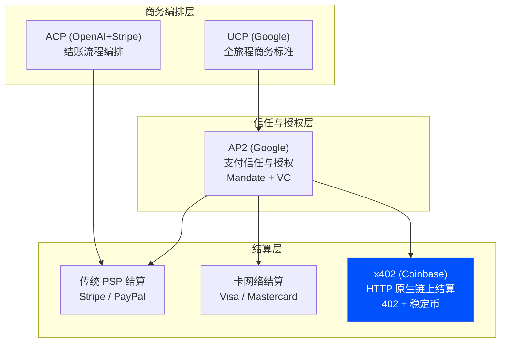

## 2. 问题定义与背景 (Problem Definition & Context)

### 2.1 问题是什么 (What is the Problem?)

互联网从诞生之初就预留了支付能力——HTTP 协议的设计者在 1997 年定义了状态码 `402 Payment Required`，并标注为"保留供未来使用"。然而 30 年过去了，这个状态码从未被正式启用。互联网的支付层始终依赖于外部系统（信用卡网络、支付网关、订阅平台），而非协议本身。

这一缺失在 AI Agent 时代变得尤为突出：

```
互联网支付层缺失的后果
├── 对人类用户
│   ├── 高摩擦：注册账户 → 绑定信用卡 → 填写表单 → 等待审核
│   ├── 高费用：2.9% + $0.30 的支付处理费，微支付不经济
│   └── 慢结算：T+2 天才能收到资金
├── 对 AI Agent
│   ├── 无法自主付费：Agent 没有信用卡，无法填写表单
│   ├── 无法发现价格：没有标准化的"这个资源多少钱"的协议
│   └── 无法即时结算：Agent 间的微支付需要即时确认
└── 对开发者
    ├── 集成复杂：每个支付方式需要独立集成
    ├── 账户管理：需要维护用户账户和订阅系统
    └── 跨境困难：不同国家的支付方式和合规要求不同
```

### 2.2 问题的来源与成因 (Root Causes & Origins)

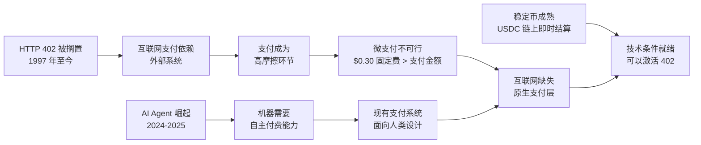

问题的根源在于：

- **HTTP 402 的历史遗憾**：1997 年 HTTP/1.1 规范定义了 402 状态码，但当时缺乏合适的数字货币和结算基础设施，该状态码被标注为"保留供未来使用"
- **传统支付的结构性限制**：信用卡网络设计于 1960 年代，面向人类消费者，每笔交易有固定成本（$0.30），使得微支付在经济上不可行
- **账户模型的摩擦**：现有支付系统要求用户注册账户、绑定支付方式、通过 KYC 验证，这些流程对机器来说是不可能完成的
- **结算延迟**：传统支付的 T+2 结算周期对需要即时确认的 Agent 间交易来说太慢

### 2.3 为什么是现在？(Why Now?)

x402 在 2025 年 5 月出现，有几个关键催化因素：

- **稳定币基础设施成熟**：USDC 在 Base、Solana 等链上实现了 2 秒内结算，Gas 费低至亚美分级别
- **AI Agent 能力爆发**：GPT-4、Claude、Gemini 等模型使 Agent 具备了自主决策和执行能力
- **Base L2 的低成本**：Coinbase 的 Base 链将 EVM 交易成本降至极低，使微支付在经济上可行
- **Cloudflare 的 Bot 流量洞察**：Cloudflare 每天向 Bot 和爬虫发送超过 10 亿个 HTTP 402 响应，证明了"付费访问"需求的巨大规模
- **开发者对简洁性的渴望**：相比复杂的支付集成，开发者更希望"几行代码就能收款"

## 3. 核心概念与术语 (Key Concepts & Glossary)

- **HTTP 402 Payment Required** — HTTP 协议中预留的状态码，x402 将其激活用于原生 Web 支付。服务端返回 402 表示"此资源需要付费才能访问"
- **Facilitator** (促成者) — x402 架构中的关键角色，负责验证支付签名、执行链上结算、确认支付完成。抽象了所有区块链复杂性，让开发者无需管理钱包、Gas 费或 RPC 连接
- **Resource Server** (资源服务器) — 提供付费资源的服务端，通过中间件声明哪些路由需要付费、价格多少、接受哪条链的支付
- **Client** (客户端) — 请求付费资源的一方，可以是 AI Agent、浏览器或任何 HTTP 客户端。负责构造支付签名并附加到请求头中
- **Payment Scheme** (支付方案) — 定义支付如何执行的规范。V1 主要支持 `exact`（精确金额链上支付），V2 新增 `deferred`（延迟结算）等方案
- **CAIP-2** (Chain Agnostic Improvement Proposal) — 链无关的网络标识格式，如 `eip155:8453`（Base 主网）、`solana:5eykt4UsFv8P8NJdTREpY1vzqKqZKvdp`（Solana 主网）
- **Bazaar** (集市) — x402 的服务发现层，机器可读的目录，帮助开发者和 AI Agent 发现和集成 x402 兼容的 API 端点
- **x402 Foundation** — Coinbase 与 Cloudflare 于 2025 年 9 月联合成立的基金会，负责推动 x402 成为开放互联网标准
- **Deferred Payment Scheme** (延迟支付方案) — Cloudflare 提出的 x402 扩展，支持延迟结算和批量支付，适用于爬虫和订阅场景
- **PAYMENT-REQUIRED Header** — V2 中将支付要求从响应体移至 HTTP 头部，释放请求体用于任意内容
- **Session** (会话) — V2 引入的概念，用户完成首次支付后获得会话令牌，后续访问无需重复链上支付

## 4. 发展历程 (History & Evolution)

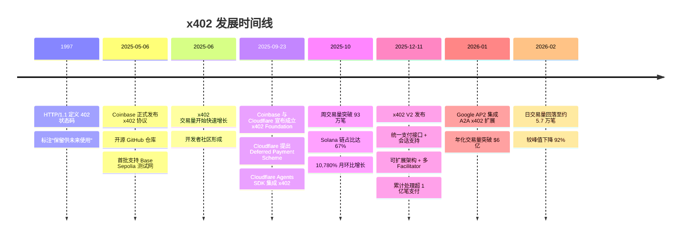

| 时间 | 事件 | 意义 |
|------|------|------|
| 1997 | HTTP/1.1 定义 402 状态码 | 互联网支付层的"预言"，但缺乏实现条件 |
| 2025-05-06 | Coinbase 发布 x402 | 激活沉睡 28 年的状态码，首个 HTTP 原生支付协议 |
| 2025-09-23 | x402 Foundation 成立 | Cloudflare 联合背书，从项目升级为开放标准 |
| 2025-10 | 交易量爆发式增长 | 周交易量 93 万笔，证明产品市场契合 |
| 2025-12-11 | V2 发布 | 从单次支付进化为完整支付基础设施 |
| 2026-01 | AP2 集成 x402 | 被 Google 的信任框架采纳为链上结算层 |
| 2026-02 | 交易量大幅回落 | 早期炒作退潮，进入理性增长阶段 |

## 5. 业务场景 (Use Cases)

### AI Agent 场景

- **API 按次付费**：AI Agent 调用付费 API（天气数据、股票行情、LLM 推理）时，无需预注册或订阅，每次请求自动完成微支付。Agent 发现 402 响应后自动签名付款并获取资源
- **Agent 间服务付费**：一个 Agent 调用另一个 Agent 的付费能力（如翻译、图像生成、代码审查），通过 x402 即时结算，无需建立账户关系
- **自主数据采购**：Agent 自动发现并购买训练数据、市场研究报告或实时数据流，按需付费而非包月订阅
- **MCP 工具付费**：通过 Cloudflare 的 MCP Server 集成，MCP 工具可以声明价格，Agent 调用时自动付费

### 开发者场景

- **API 货币化**：开发者只需添加几行中间件代码，即可为任何 API 端点设置价格，无需构建用户系统、订阅管理或支付集成
- **内容付费墙**：博客、视频、音乐等数字内容可以按篇/按次收费，无需用户注册，浏览器访问时自动弹出支付页面
- **开源项目打赏**：开源项目可以为高级功能或 API 设置微支付，直接收取 USDC 到自己的钱包
- **跨境 SaaS**：全球开发者无需处理不同国家的支付方式和合规要求，USDC 支付天然无国界

### 企业场景

- **爬虫付费访问**：网站通过 Cloudflare 的 Pay-per-Crawl 功能，向 AI 爬虫收取内容访问费用，使用 x402 的 Deferred Payment Scheme 实现批量结算
- **机器间微支付**：IoT 设备、自动化系统之间的小额即时支付，无需建立复杂的账户和结算关系
- **实时数据交易**：金融数据、传感器数据等高频实时数据的按次付费访问

## 6. 解决方案概述 (Solution Approach)

### 6.1 解决思路 (Solution Philosophy)

x402 的核心洞察是：**支付应该像 HTTP 请求一样简单——请求资源、收到价格、签名付款、获取内容，全在一次 HTTP 往返中完成。**

具体设计哲学：

- **协议级简洁**：不发明新的传输协议，直接复用 HTTP 的 402 状态码和标准头部
- **零摩擦接入**：无需账户注册、API Key、订阅或 KYC，有钱包就能付款
- **开发者优先**：几行中间件代码即可为 API 添加付费功能，SDK 覆盖 Node.js、Go、Python
- **结算层定位**：只做结算，不做商务编排或信任授权，与 ACP、AP2 互补而非竞争
- **链无关设计**：通过 CAIP-2 标准化网络标识，支持任意区块链，不绑定特定链

### 6.2 方案如何解决问题 (How the Solution Addresses the Problem)

| 问题 | x402 的解决方式 | 关键机制 |
|------|--------------|---------|
| **互联网缺失支付层** | 激活 HTTP 402 状态码，将支付嵌入 HTTP 协议本身 | 402 响应 + PAYMENT-REQUIRED 头部 + PAYMENT-SIGNATURE 头部 |
| **微支付不经济** | 零协议费用 + 低 Gas 费链（Base、Solana） | USDC 稳定币 + L2/高性能链 |
| **Agent 无法自主付费** | 纯程序化的支付流程，无需人类交互 | 钱包签名 + HTTP 头部传递支付证明 |
| **结算延迟** | 链上即时结算，2 秒内到账 | 区块链原生结算 + Facilitator 验证 |
| **集成复杂** | 中间件模式，几行代码即可集成 | Express/Hono/Gin/FastAPI 中间件 |
| **跨境困难** | USDC 天然无国界，全球统一 | 稳定币 + 区块链的全球可达性 |

### 6.3 方案的边界与局限 (Scope & Limitations)

x402 **解决了什么**：
- HTTP 原生的即时支付能力
- 机器间的无摩擦微支付
- 开发者友好的 API 货币化
- 跨境即时结算

x402 **没有解决什么**：
- **用户授权委托**：x402 不处理"谁授权了这笔支付"的问题，这由 AP2 的 Mandate 机制解决
- **结账流程编排**：商品发现、购物车管理、结账 UI 等由 ACP 或 UCP 处理
- **法币支付**：V1 仅支持加密货币（主要是 USDC），V2 开始规划传统支付轨道（ACH、SEPA）的支持
- **争议处理**：区块链交易不可逆，x402 目前没有内置的退款或争议处理机制
- **身份验证**：x402 不验证付款方的身份，只验证支付签名的有效性
- **复杂定价模型**：V1 仅支持固定价格的精确支付，V2 通过扩展开始支持更灵活的定价

## 7. 技术架构 (Architecture)

### 核心架构：四角色模型

x402 定义了四个核心角色，形成清晰的职责分离：

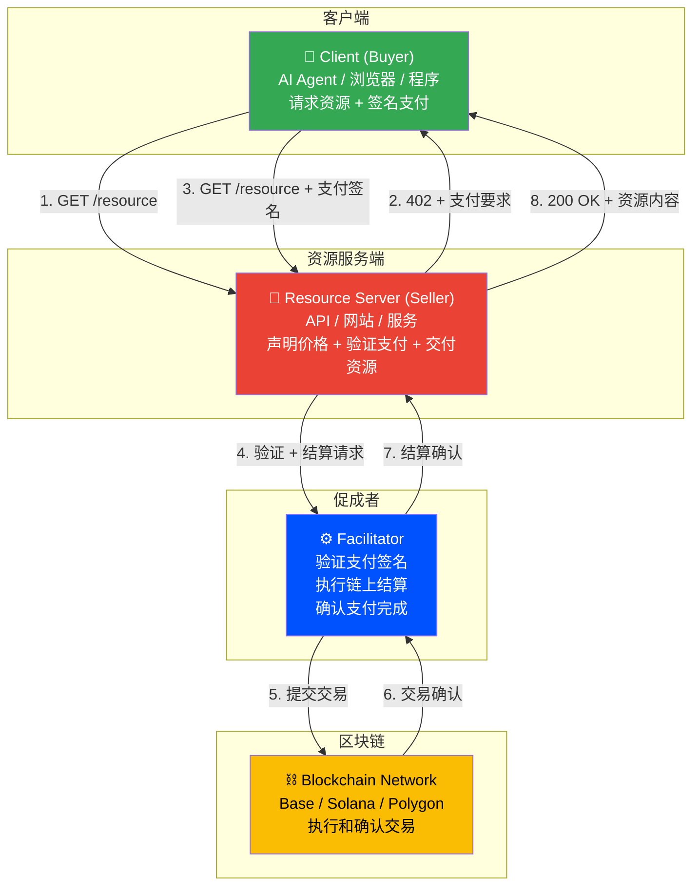

#### 角色职责详解

| 角色 | 职责 | 技术实现 |
|------|------|---------|
| Client (Buyer) | 请求付费资源，构造支付签名，附加到 HTTP 头部 | x402 客户端 SDK（`@x402/fetch`、Go/Python 客户端） |
| Resource Server (Seller) | 声明路由价格，验证支付，交付资源 | x402 中间件（Express/Hono/Gin/FastAPI/Flask） |
| Facilitator | 验证支付签名有效性，执行链上结算，返回结算证明 | Coinbase CDP Facilitator 或自托管 Facilitator |
| Blockchain | 执行和确认链上交易 | Base、Solana、Polygon 等 |

### 核心交易流程

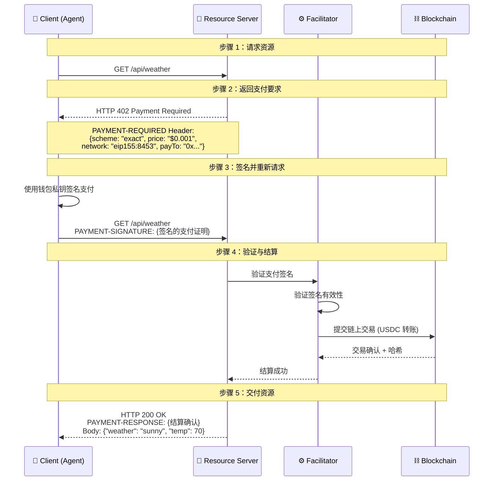

### Facilitator 架构详解

Facilitator 是 x402 架构中最关键的组件，它抽象了所有区块链复杂性：

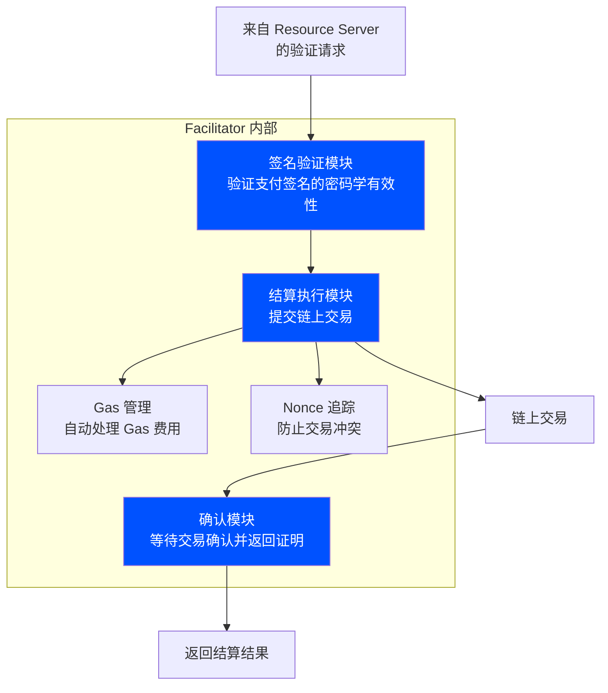

Facilitator 的核心价值：

| 能力 | 说明 |
|------|------|
| 区块链抽象 | 开发者无需了解区块链细节，Facilitator 处理所有链上交互 |
| Gas 管理 | 自动处理 Gas 费用估算和支付 |
| Nonce 追踪 | 管理交易 Nonce，防止并发交易冲突 |
| 多链支持 | 同一 Facilitator 可支持多条链的结算 |
| 可替换性 | 开发者可选择不同的 Facilitator（Coinbase CDP、自托管、第三方） |

主要 Facilitator 提供方：

| 提供方 | URL | 支持网络 |
|--------|-----|---------|
| Coinbase CDP | `https://api.cdp.coinbase.com/platform/v2/x402` | Base 主网、Solana 主网 |
| x402.org（测试） | `https://x402.org/facilitator` | Base Sepolia、Solana Devnet |
| 第三方 Facilitator | 各自部署 | 各链均可 |

### 支持的网络

x402 V2 使用 CAIP-2 格式标识网络：

| 网络 | CAIP-2 标识 | 类型 |
|------|------------|------|
| Base 主网 | `eip155:8453` | EVM 主网 |
| Base Sepolia | `eip155:84532` | EVM 测试网 |
| Solana 主网 | `solana:5eykt4UsFv8P8NJdTREpY1vzqKqZKvdp` | SVM 主网 |
| Solana Devnet | `solana:EtWTRABZaYq6iMfeYKouRu166VU2xqa1` | SVM 测试网 |
| Polygon 主网 | `eip155:137` | EVM 主网 |
| Avalanche 主网 | `eip155:43114` | EVM 主网 |
| Sei 主网 | `eip155:1329` | EVM 主网 |

## 8. 技术实现方案与路径 (Implementation Design & Path)

### 8.1 协议规范设计 (Protocol Specification)

#### 402 响应格式

当客户端请求付费资源时，服务端返回 402 响应，包含支付要求：

```json
{
  "accepts": [
    {
      "scheme": "exact",
      "network": "eip155:8453",
      "asset": "0x833589fCD6eDb6E08f4c7C32D4f71b54bdA02913",
      "maxAmountRequired": "1000000",
      "payTo": "0xYourWalletAddress",
      "resource": "https://example.com/api/weather"
    }
  ],
  "x402Version": 2
}
```

关键字段说明：

| 字段 | 说明 |
|------|------|
| `scheme` | 支付方案，`exact` 为精确金额链上支付，`deferred` 为延迟结算 |
| `network` | 区块链网络标识（CAIP-2 格式） |
| `asset` | 支付代币合约地址（通常为 USDC） |
| `maxAmountRequired` | 支付金额（最小单位，USDC 为 6 位小数） |
| `payTo` | 收款钱包地址 |
| `resource` | 被请求的资源 URL |

#### 支付签名格式

客户端使用钱包私钥签名支付信息，并通过 HTTP 头部传递：

```http
GET /api/weather HTTP/1.1
Host: example.com
X-PAYMENT: eyJwYXlsb2FkIjp7...base64 encoded payment payload...}
```

V2 中的头部结构：

| HTTP 头部 | 用途 |
|-----------|------|
| `PAYMENT-REQUIRED` | 服务端声明支付要求（V2 从响应体移至头部） |
| `PAYMENT-SIGNATURE` | 客户端的加密支付证明 |
| `PAYMENT-RESPONSE` | 服务端的支付确认 |
| `SIGN-IN-WITH-X` | 基于 CAIP-122 的钱包身份认证（V2 规划中） |

#### 路由配置接口

```typescript
interface RouteConfig {
  accepts: Array<{
    scheme: string;           // 支付方案 (e.g., "exact")
    price: string;            // 价格 (e.g., "$0.01")
    network: string;          // 网络 CAIP-2 标识
    payTo: string;            // 收款钱包地址
  }>;
  description?: string;       // 资源描述
  mimeType?: string;          // 响应 MIME 类型
  extensions?: {              // 可选扩展
    bazaar?: {                // Bazaar 服务发现
      discoverable: boolean;
      category: string;
      tags: string[];
    };
  };
}
```

### 8.2 V1 vs V2 架构演进

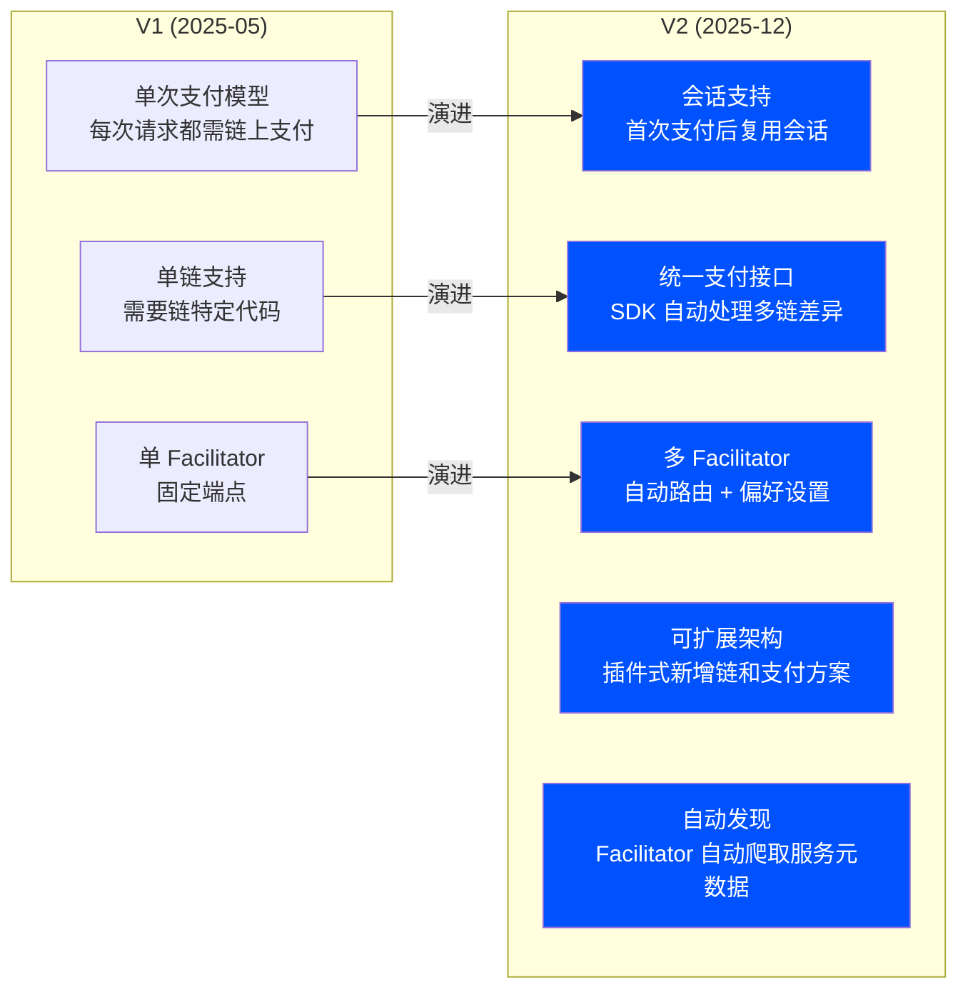

V2 的关键改进：

| 维度 | V1 | V2 |
|------|----|----|
| 支付模型 | 每次请求都需链上支付 | 会话支持，首次支付后复用 |
| 多链支持 | 需要链特定代码 | 统一接口，SDK 自动处理 |
| Facilitator | 单一固定端点 | 多 Facilitator + 自动路由 |
| 扩展性 | 修改核心规范 | 插件架构，新链/方案作为插件 |
| 服务发现 | 手动配置 | Facilitator 自动爬取元数据 |
| 身份 | 无 | 钱包身份 (CAIP-122 Sign-In-With-X) |
| 头部结构 | 支付要求在响应体 | 移至 HTTP 头部，释放请求体 |
| 向后兼容 | — | 完全兼容 V1 |

#### V2 三层架构

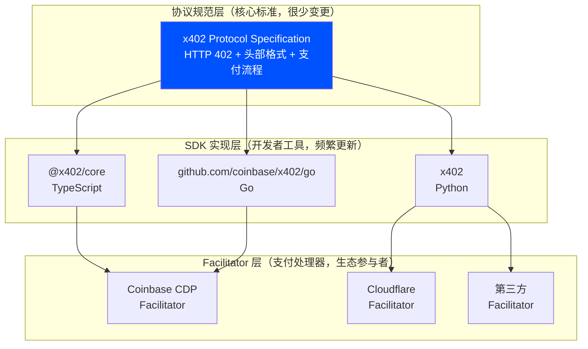

### 8.3 Cloudflare Deferred Payment Scheme

Cloudflare 为 x402 提出了延迟支付方案，专为爬虫和批量访问场景设计：

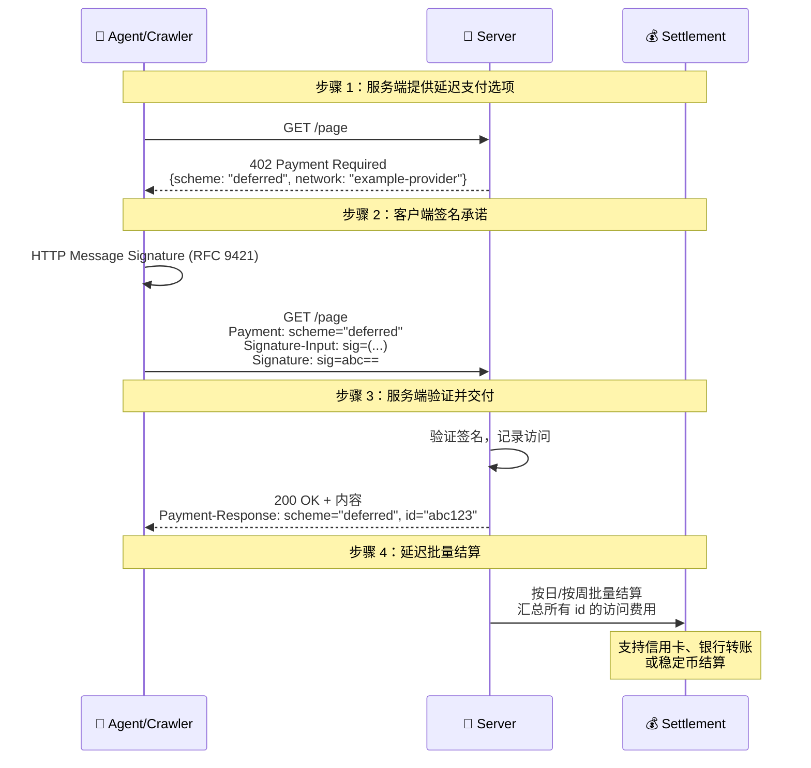

Deferred Scheme 的价值：

- **降低每次请求开销**：无需每次都进行链上交易
- **支持传统支付**：结算时可使用信用卡或银行转账，不限于加密货币
- **适合高频访问**：爬虫每天可能访问数百万页面，逐次链上支付不现实
- **审计友好**：每次访问都有加密签名记录，可追溯

### 8.4 Bazaar — 服务发现层

Bazaar 是 x402 的服务发现机制，帮助 AI Agent 自动发现可付费的 API 和服务：

```json
{
  "GET /weather": {
    "accepts": [
      {
        "scheme": "exact",
        "price": "$0.001",
        "network": "eip155:8453",
        "payTo": "0xYourAddress"
      }
    ],
    "description": "Get real-time weather data",
    "mimeType": "application/json",
    "extensions": {
      "bazaar": {
        "discoverable": true,
        "category": "weather",
        "tags": ["forecast", "real-time"]
      }
    }
  }
}
```

Bazaar 的工作方式：
- 服务在路由配置中声明 `bazaar` 扩展
- Facilitator 自动爬取并索引这些服务
- AI Agent 可通过 Bazaar 搜索和发现付费服务
- 类似于"付费 API 的搜索引擎"

### 8.5 Cloudflare 集成 — Agents SDK + MCP

Cloudflare 将 x402 深度集成到其 Agents SDK 和 MCP Server 中：

#### MCP Server 付费工具

```typescript
import { McpServer } from "@modelcontextprotocol/sdk/server/mcp.js";
import { McpAgent } from "agents/mcp";
import { withX402 } from "agents/x402";

export class PayMCP extends McpAgent {
  server = withX402(
    new McpServer({ name: "PayMCP", version: "1.0.0" }),
    X402_CONFIG
  );

  async init() {
    // 付费工具 — Agent 调用时自动触发 x402 支付
    this.server.paidTool(
      "square",
      "Squares a number",
      0.01, // 工具价格：$0.01
      { a: z.number() },
      {},
      async ({ number }) => {
        return { content: [{ type: "text", text: String(a ** 2) }] };
      }
    );

    // 免费工具
    this.server.tool(
      "add-two-numbers",
      "Adds two numbers",
      { a: z.number(), b: z.number() },
      async ({ a, b }) => {
        return { content: [{ type: "text", text: String(a + b) }] };
      }
    );
  }
}
```

#### Agent 客户端付费调用

```typescript
import { Agent } from "agents";
import { withX402Client } from "agents/x402";

export class MyAgent extends Agent {
  async onToolCall() {
    const x402Client = withX402Client(
      myMcpClient,
      { network: "base-sepolia", account: this.account }
    );

    // 第一个参数为确认回调，设为 null 则自动付费
    const res = await x402Client.callTool(
      this.onPaymentRequired, // 或 null（自动付费）
      { name: toolName, arguments: toolArgs }
    );
  }
}
```

### 8.6 开发者快速上手

#### 卖方集成（Express 示例）

```bash
# 安装依赖
npm install @x402/express @x402/core @x402/evm
```

```typescript
import express from "express";
import { paymentMiddleware } from "@x402/express";
import { x402ResourceServer, HTTPFacilitatorClient } from "@x402/core/server";
import { registerExactEvmScheme } from "@x402/evm/exact/server";

const app = express();
const payTo = "0xYourWalletAddress";

// 创建 Facilitator 客户端（测试网）
const facilitatorClient = new HTTPFacilitatorClient({
  url: "https://x402.org/facilitator"
});

// 创建资源服务器并注册 EVM 方案
const server = new x402ResourceServer(facilitatorClient);
registerExactEvmScheme(server);

// 添加支付中间件
app.use(
  paymentMiddleware(
    {
      "GET /weather": {
        accepts: [
          {
            scheme: "exact",
            price: "$0.001",
            network: "eip155:84532", // Base Sepolia
            payTo,
          },
        ],
        description: "Get current weather data",
        mimeType: "application/json",
      },
    },
    server,
  ),
);

app.get("/weather", (req, res) => {
  res.send({ weather: "sunny", temperature: 70 });
});

app.listen(4021);
```

#### 买方集成

```bash
# 安装依赖
npm install @x402/fetch
```

```typescript
import { x402Fetch } from "@x402/fetch";

// 自动处理 402 响应和支付
const response = await x402Fetch(
  "https://api.example.com/weather",
  { wallet: myWallet }
);
const data = await response.json();
```

#### 多语言 SDK 支持

| 语言 | 包名 | 安装命令 |
|------|------|---------|
| TypeScript/Node.js | `@x402/express`, `@x402/hono`, `@x402/next` | `npm install @x402/express` |
| Go | `github.com/coinbase/x402/go` | `go get github.com/coinbase/x402/go` |
| Python | `x402` | `pip install x402` |
| Ruby | `x402-rails`, `x402-payments` | `gem install x402-rails` |

#### 多网络支持配置

```typescript
import { registerExactEvmScheme } from "@x402/evm/exact/server";
import { registerExactSvmScheme } from "@x402/svm/exact/server";

const server = new x402ResourceServer(facilitatorClient);
registerExactEvmScheme(server);  // EVM 链（Base、Polygon 等）
registerExactSvmScheme(server);  // Solana

// 同一端点支持多条链
const routes = {
  "GET /weather": {
    accepts: [
      { scheme: "exact", price: "$0.001", network: "eip155:8453", payTo: evmAddress },
      { scheme: "exact", price: "$0.001", network: "solana:5eykt4UsFv8P8NJdTREpY1vzqKqZKvdp", payTo: solanaAddress },
    ],
  },
};
```

## 9. 与 AP2 的集成 — A2A x402 扩展

Google 与 Coinbase、Ethereum Foundation、MetaMask 合作推出的 A2A x402 扩展，将 x402 的链上结算能力集成到 AP2 的信任框架中。

### 集成架构

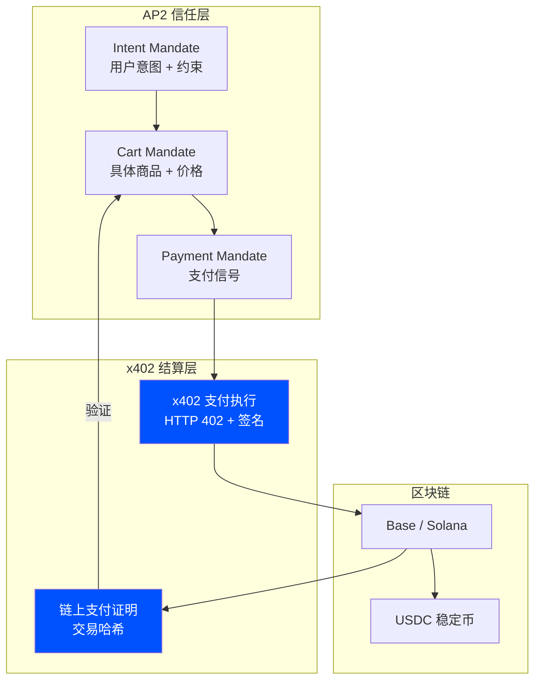

### 集成交易流程

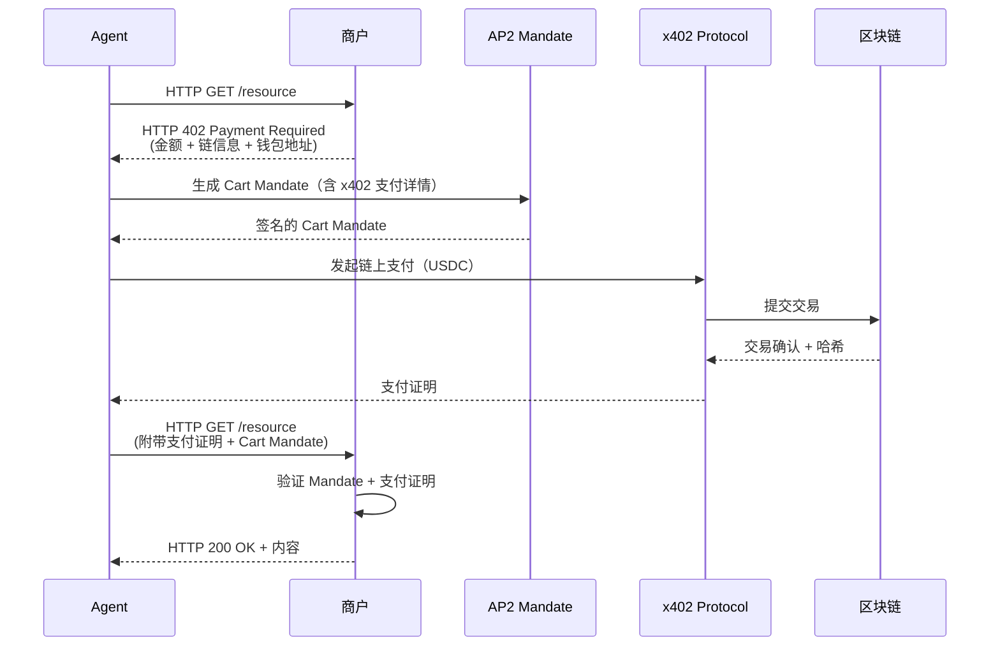

这一集成的价值：x402 提供即时结算能力，AP2 提供用户授权证明。两者结合后，Agent 间的付费交互既有加密审计链（AP2 Mandate），又有即时链上结算（x402）。正如 Coinbase 工程负责人 Erik Reppel 所说："x402 和 AP2 表明 Agent 间支付不再只是实验，它正在成为开发者实际构建的一部分。"

## 10. 类似方案与竞品分析 (Alternative Solutions & Comparison)

### 10.1 方案全景图

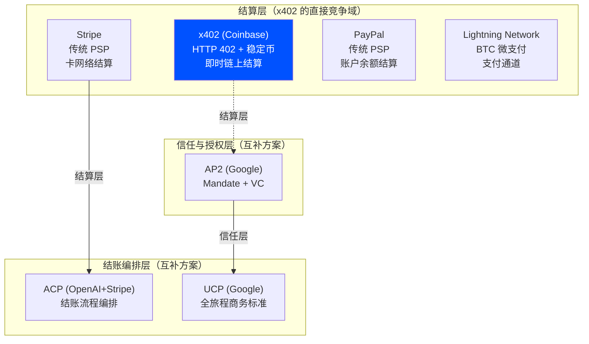

### 10.2 方案对比矩阵

| 维度 | x402 (Coinbase) | ACP (OpenAI+Stripe) | AP2 (Google) | Lightning Network | 传统 PSP (Stripe) |
|------|-----------------|---------------------|--------------|-------------------|-------------------|
| 核心定位 | HTTP 原生链上结算 | 结账流程编排 | 支付信任与授权 | BTC 微支付 | 传统在线支付 |
| 解决的问题 | 机器如何即时付款 | Agent 如何完成结账 | 谁授权了这笔支付 | BTC 小额即时支付 | 人类在线购物 |
| 支付方式 | 稳定币（USDC） | 信用卡/借记卡/钱包 | 全支持（卡+稳定币+银行） | BTC | 信用卡/借记卡 |
| 费用 | 0%（仅 Gas 费） | 2.9% + $0.30 | 取决于底层支付方式 | ~0（通道费极低） | 2.9% + $0.30 |
| 结算速度 | 2 秒 | T+2 天 | 取决于底层支付方式 | 即时 | T+2 天 |
| 微支付可行性 | ✅ 极低成本 | ❌ 固定费用太高 | 取决于底层 | ✅ 极低成本 | ❌ 固定费用太高 |
| 账户要求 | 无（仅需钱包） | 需要 Stripe 账户 | 需要 VC 基础设施 | 需要 LN 节点/钱包 | 需要商户账户 |
| Agent 友好度 | ⭐⭐⭐⭐⭐ | ⭐⭐⭐ | ⭐⭐⭐⭐ | ⭐⭐⭐ | ⭐ |
| 争议处理 | ❌ 无（链上不可逆） | ✅ 传统退款流程 | ✅ Mandate 审计链 | ❌ 无 | ✅ 完善的退款体系 |
| 法币支持 | ❌ V1 / 🔜 V2 规划 | ✅ 原生支持 | ✅ 原生支持 | ❌ | ✅ 原生支持 |
| 生产就绪度 | 规模化中（1亿+笔） | 已上线（ChatGPT） | 早期采用阶段 | 成熟 | 成熟 |
| 开源 | ✅ Apache 2.0 | ✅ Apache 2.0 | ✅ Apache 2.0 | ✅ | ❌ |

### 10.3 方案选型指南

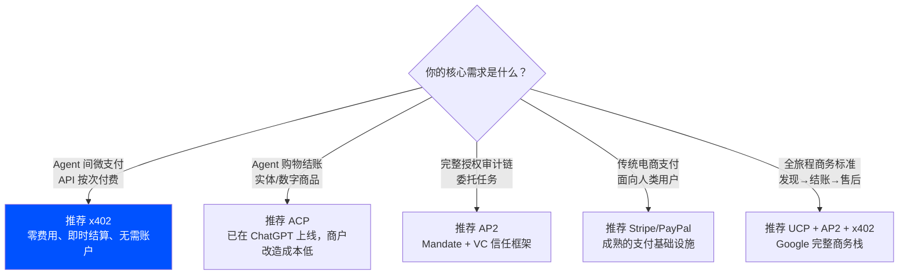

### 10.4 关键差异分析

**x402 vs ACP：结算层 vs 编排层**

x402 和 ACP 不是竞争关系，而是技术栈的不同层次。ACP 处理"怎么买"（商品发现、购物车、结账流程），x402 处理"怎么付"（即时链上结算）。一个完整的 Agent 购物交易可以用 ACP 编排结账流程，最终通过 x402 完成稳定币结算。核心区别在于：ACP 依赖 Stripe 的传统支付基础设施（信用卡、T+2 结算），x402 使用区块链原生结算（USDC、2 秒到账）。

**x402 vs AP2：结算层 vs 信任层**

AP2 解决"谁授权了这笔支付"（通过 Mandate + VC），x402 解决"如何即时完成支付"（通过 HTTP 402 + 链上结算）。Google 与 Coinbase 合作推出的 A2A x402 扩展将两者桥接：在 AP2 的 Mandate 信任框架内使用 x402 进行稳定币结算。两者是天然互补的。

**x402 vs Lightning Network：稳定币 vs BTC**

两者都解决微支付问题，但路径不同。Lightning Network 使用 BTC（价格波动大），x402 使用 USDC（价格稳定）。x402 的 HTTP 原生设计使其对 Web 开发者更友好，而 Lightning Network 在 BTC 生态中更成熟。对于商业场景，USDC 的价格稳定性是关键优势。

## 11. 生态与社区 (Ecosystem & Community)

### 核心合作伙伴

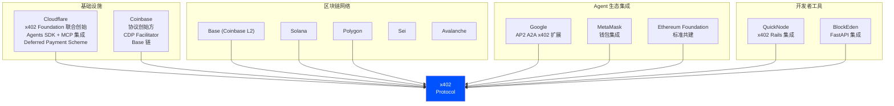

### 采用数据

| 指标 | 数据 | 时间 |
|------|------|------|
| 累计交易笔数 | 1 亿+ | 截至 2025 年 12 月 |
| 年化交易量 | ~$6 亿 | 2025 年底估算 |
| 峰值周交易量 | 93.2 万笔 | 2025 年 10 月 20 日当周 |
| 峰值日交易量 | 73.1 万笔 | 2025 年 12 月 |
| 当前日交易量 | ~5.7 万笔 | 2026 年 2 月 |
| 较峰值下降 | 92% | 2026 年 2 月 vs 2025 年 12 月峰值 |
| Solana 链占比 | 67% | 2025 年 Q3 |
| Solana 日交易额 | $38 万 | 峰值 |
| 开发者社区 | 600+ | Telegram 社区 |
| 月环比增长（峰值） | 10,780% | 2025 年 10 月 |

### 交易量趋势分析

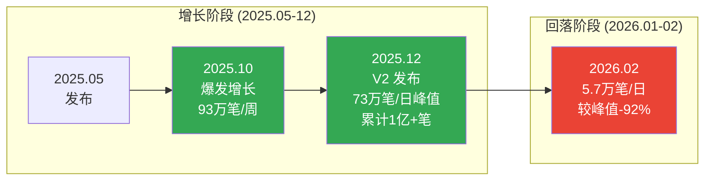

交易量大幅回落的可能原因：
- 早期投机性交易（Meme 币相关）退潮
- V1 的单次支付模型在高频场景下效率不足（V2 已通过会话机制解决）
- 协议仍处于早期采用阶段，真实商业用例尚在建设中
- 缺乏正式安全审计，企业级采用受限

### GitHub 与开发者资源

| 资源 | 链接/说明 |
|------|----------|
| 官方文档 | [docs.x402.org](https://docs.x402.org) |
| Coinbase 开发者文档 | [docs.cdp.coinbase.com/x402](https://docs.cdp.coinbase.com/x402) |
| GitHub 仓库 | [github.com/coinbase/x402](https://github.com/coinbase/x402) |
| npm 包 | `@x402/core`, `@x402/express`, `@x402/hono`, `@x402/next`, `@x402/fetch` |
| Go 模块 | `github.com/coinbase/x402/go` |
| Python 包 | `x402` (PyPI) |
| Ruby Gem | `x402-rails`, `x402-payments` |
| Cloudflare 博客 | [blog.cloudflare.com/x402](https://blog.cloudflare.com/x402/) |
| x402 Playground | Cloudflare 提供的在线测试环境 |
| 社区 Telegram | 600+ 开发者 |
| 社区 Discord | x402 官方 Discord |

### 成熟度评估

| 维度 | 评估 |
|------|------|
| 规范完整度 | 中高 — V2 规范完整，但部分扩展（如 Deferred Scheme）仍在提案阶段 |
| 生态广度 | 中 — Cloudflare 联合背书，多链支持，但合作伙伴数量不及 AP2 的 60+ |
| 生产部署 | 中高 — 已处理 1 亿+ 笔交易，但真实商业用例占比不明 |
| 安全审计 | 低 — 尚无主要安全公司的正式审计报告 |
| 社区活跃度 | 中 — 600+ 开发者社区，多语言 SDK，但贡献者规模有限 |
| 标准化进程 | 进行中 — x402 Foundation 成立，但尚未提交正式标准化提案 |
| 总体成熟度 | **规模化早期** — 交易量证明了可行性，但需要安全审计和更多真实商业用例 |

## 12. 优劣势总结 (Pros & Cons)

### 优势

1. **极致简洁**：激活 HTTP 原生的 402 状态码，无需新协议。开发者几行中间件代码即可为 API 添加付费功能，学习成本极低
2. **零协议费用**：协议本身不收取任何费用，仅有极低的链上 Gas 费（Base 链上亚美分级别），使微支付在经济上可行
3. **即时结算**：资金在 2 秒内到达卖方钱包，而非传统支付的 T+2 天，对 Agent 间的实时交互至关重要
4. **自托管**：资金直接进入卖方钱包，无第三方托管风险，无账户冻结风险
5. **机器原生**：纯程序化的支付流程，无需人类交互，天然适合 AI Agent 和自动化系统
6. **链无关**：通过 CAIP-2 标准支持多条链（Base、Solana、Polygon 等），不绑定特定区块链
7. **Cloudflare 联合背书**：x402 Foundation 的成立和 Cloudflare 的深度集成（Agents SDK、MCP、Pay-per-Crawl）提供了强大的基础设施支持
8. **已验证的规模**：1 亿+ 笔交易证明了协议的可行性和可扩展性
9. **V2 架构成熟**：会话支持、多 Facilitator、可扩展插件架构解决了 V1 的主要限制
10. **与 AP2 互补集成**：A2A x402 扩展将 x402 纳入 Google 的信任框架，获得更广泛的生态支持

### 劣势

1. **仅支持加密货币**：V1 仅支持 USDC 等稳定币，不支持法币支付。V2 规划了传统支付轨道但尚未实现，限制了非加密用户的采用
2. **无争议处理机制**：区块链交易不可逆，x402 没有内置的退款或争议处理流程。对于需要消费者保护的场景（如实体商品购买），这是重大缺陷
3. **缺乏正式安全审计**：截至 2026 年初，x402 尚未获得主要安全公司的正式审计报告，企业级采用存在顾虑
4. **交易量大幅回落**：从峰值日均 73 万笔降至约 5.7 万笔（-92%），表明早期增长中投机成分较大，真实商业需求有待验证
5. **无身份验证**：x402 不验证付款方的身份，只验证支付签名。对于需要 KYC/AML 合规的场景不适用
6. **Facilitator 中心化风险**：虽然 Facilitator 可自托管，但大多数开发者依赖 Coinbase CDP 的托管 Facilitator，存在单点依赖
7. **加密货币的用户门槛**：普通消费者需要拥有加密钱包和 USDC，这对非加密原生用户是显著的采用障碍
8. **监管不确定性**：加密货币支付在不同司法管辖区面临不同的监管要求，合规成本可能抵消零费用的优势
9. **无原生代币**：x402 协议没有自己的代币，尽管市场上出现了大量投机性的关联 Meme 币，但这些与协议本身无关

## 13. 快速上手 (Getting Started)

### 最小化上手步骤

```bash
# 1. 创建项目
mkdir x402-demo && cd x402-demo
npm init -y

# 2. 安装依赖
npm install express @x402/express @x402/core @x402/evm

# 3. 创建服务端 (server.js)
# 参见 8.6 节的 Express 示例代码

# 4. 启动服务
node server.js

# 5. 测试（无支付时返回 402）
curl http://localhost:4021/weather
# → HTTP 402 Payment Required + 支付指令

# 6. 使用 x402 客户端 SDK 完成支付测试
```

### 开发者资源

| 资源 | 链接 |
|------|------|
| 官方文档 | [docs.x402.org](https://docs.x402.org) |
| Coinbase 开发者文档 | [docs.cdp.coinbase.com/x402](https://docs.cdp.coinbase.com/x402) |
| 卖方快速入门 | [docs.x402.org/getting-started/quickstart-for-sellers](https://docs.x402.org/getting-started/quickstart-for-sellers) |
| 买方快速入门 | [docs.cdp.coinbase.com/x402/quickstart-for-buyers](https://docs.cdp.coinbase.com/x402/quickstart-for-buyers) |
| GitHub 仓库 | [github.com/coinbase/x402](https://github.com/coinbase/x402) |
| Cloudflare x402 博客 | [blog.cloudflare.com/x402](https://blog.cloudflare.com/x402/) |
| x402 Playground | Cloudflare 在线测试环境 |
| Bazaar 服务发现 | [docs.cdp.coinbase.com/x402/bazaar](https://docs.cdp.coinbase.com/x402/bazaar) |
| npm 包 | `@x402/core`, `@x402/express`, `@x402/hono`, `@x402/next`, `@x402/fetch` |
| Go 模块 | `github.com/coinbase/x402/go` |
| Python 包 | `pip install x402` |

### 路线图与未来规划

根据 V2 发布和 x402 Foundation 的公告，未来规划包括：

- **传统支付轨道**：V2 规划支持 ACH、SEPA、信用卡等传统支付方式，通过 Deferred Payment Scheme 实现
- **SIGN-IN-WITH-X**：基于 CAIP-122 的钱包身份认证，实现"用钱包登录"
- **更多链支持**：通过插件架构持续扩展支持的区块链网络
- **安全审计**：推进正式的第三方安全审计
- **标准化**：通过 x402 Foundation 推动协议成为正式的互联网标准
- **企业级功能**：批量结算、合规工具、分析仪表板等
- **Bazaar 生态**：扩展服务发现层，构建付费 API 的搜索引擎

## 14. 来源 (Sources)

### 官方文档
- [x402 官方文档](https://docs.x402.org) — x402 协议完整文档和开发者指南
- [Coinbase x402 开发者文档](https://docs.cdp.coinbase.com/x402) — Coinbase 平台的 x402 集成文档
- [x402 GitHub 仓库](https://github.com/coinbase/x402) — 开源代码、SDK 和示例
- [Cloudflare x402 博客](https://blog.cloudflare.com/x402/) — x402 Foundation 公告和 Cloudflare 集成详情

### 技术深度分析
- [PayIn: The Complete Guide to x402 Protocol](https://blog.payin.com/posts/x402-complete-guide) — x402 完整技术指南
- [PayIn: x402 V2 What's New](https://blog.payin.com/posts/x402-v2-whats-new) — V2 升级详解
- [PayIn: x402 Facilitators](https://blog.payin.com/posts/x402-facilitators) — Facilitator 架构深度分析
- [James Bachini: A Developer Guide to x402](https://jamesbachini.com/x402-protocol/) — 开发者视角的技术解读
- [BlockEden: x402 Protocol — HTTP-native Payment Standard](https://blockeden.xyz/blog/2025/10/26/x402-protocol-the-http-native-payment-standard-for-autonomous-ai-commerce/) — x402 全面技术分析
- [Hexploits: x402 — The Settlement Layer for Autonomous Agents](https://hexploits.com/blog/x402-the-payment-protocol-for-the-machine-economy) — x402 作为结算层的定位分析

### 行业分析
- [Chainstack: The Agentic Payments Landscape](https://chainstack.com/the-agentic-payments-landscape/) — ACP、AP2、x402 三大协议对比
- [Orium: Agentic Payments Explained — ACP, AP2, x402](https://orium.com/blog/agentic-payments-acp-ap2-x402) — 三大协议对比分析
- [CCN: Coinbase's Fix for the Internet's Missing Payment Layer](https://www.ccn.com/education/crypto/x402-coinbase-api-ai-crypto-payments-explained/) — x402 解决互联网支付层缺失
- [Crossmint: What is x402?](https://blog.crossmint.com/what-is-x402/) — x402 概述与分析
- [DWF Labs: Inside x402](https://www.dwf-labs.com/research/inside-x402-how-a-forgotten-http-code-becomes-the-future-of-autonomous-payments) — x402 深度研究报告

### 采用数据与新闻
- [CoinTelegraph: Solana Becomes Top x402 Payments Network](https://cointelegraph.com/news/x402-ecosystem-expands-solana) — Solana 成为 x402 最活跃链
- [Levex: AI Agents Finally Have Money](https://levex.com/en/blog/ai-agents-crypto-payment-infrastructure) — x402 交易量数据分析
- [CryptoNews: AI Agents Were Supposed to Power a New Economy](https://cryptonews.net/news/blockchain/32412108/) — x402 交易量回落分析
- [FameEX: What is x402 Protocol?](https://www.fameex.com/en-US/research/analysis/what-is-x402-protocol) — x402 Foundation 成立报道
- [Financial Times: Cloudflare and Coinbase Will Launch x402 Foundation](https://markets.ft.com/data/announce/detail?dockey=600-202509230900BIZWIRE_USPRX____20250923_BW730445-1) — x402 Foundation 官方公告

> Content was rephrased for compliance with licensing restrictions. 所有内容均基于公开来源整理，已进行改写和综合分析。访问日期：2026 年 2 月。
