# Visa TAP (Trusted Agent Protocol) 与 Intelligent Commerce 深度研究报告

> 本报告是 Agentic Commerce 系列研究的子报告之一，聚焦 Visa 的 Trusted Agent Protocol (TAP) 及其上层产品 Intelligent Commerce。
> 总览报告见 [agentic_commerce.md](../agentic_commerce.md)。
> 信息来源：[Visa Developer Center](https://developer.visa.com/capabilities/trusted-agent-protocol/trusted-agent-protocol-specifications)、[Visa Investor Relations](https://investor.visa.com/news/news-details/2025/Visa-Introduces-Trusted-Agent-Protocol-An-Ecosystem-Led-Framework-for-AI-Commerce/default.aspx)、[Visa Perspectives](https://global-corporate.review.visa.com/sites/visa-perspectives/innovation/visa-protocol-scale-agentic-commerce-globally.html)、[PYMNTS](https://www.pymnts.com/artificial-intelligence-2/2025/visa-turns-tokens-into-the-trust-layer-for-agentic-ai/) 等。内容经过改写以符合版权要求。

## 1. 概述：Visa TAP 是什么，解决什么问题 (Overview)

### 1.1 Agentic Commerce 的五大核心挑战

当 AI Agent 代替人类购物时，传统电商技术栈面临五个根本性断裂点：

| 挑战 | 核心问题 | 传统电商的假设 | Agent 时代的现实 |
|------|---------|--------------|----------------|
| 🔍 商品发现 | Agent 如何找到商品？ | 人类浏览网页、搜索引擎 | Agent 需要机器可读的商品目录 |
| 🔒 信任 | 商户如何区分合法 Agent 和恶意 Bot？ | 浏览器指纹、Cookie、CAPTCHA | Agent 无浏览器指纹，触发 Bot 检测 |
| 🔑 授权 | Agent 如何证明用户授权？ | 用户点击"购买"按钮 | Agent 没有"点击"能力，需要新的授权证明 |
| 💳 支付 | Agent 如何安全完成支付？ | 用户手动输入卡号 | Agent 不应接触真实卡号 |
| 🔌 集成 | 如何避免 N×M 集成爆炸？ | 商户对接少数支付网关 | N 个 Agent × M 个商户 = 指数级集成成本 |

**关键数据**：2025 年 AI 驱动的流量涌入美国零售网站，增幅超过 4,700%。Visa 威胁报告显示恶意 Bot 交易半年增长 25%（美国增长 40%）。

### 1.2 Visa 的回答：双层产品架构

Visa 在 Agentic Commerce 领域推出了两个层次的产品，分别解决不同的问题：

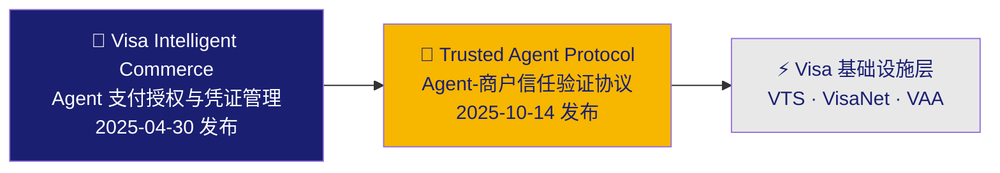

| 层次 | 产品 | 发布时间 | 核心问题 | 能力 |
|------|------|---------|---------|------|
| 上层 | Intelligent Commerce | 2025-04-30 | Agent 如何安全使用 Visa 支付？ | Agent 注册、Passkey 认证、令牌化凭证、个性化优惠、Agent 风控 |
| 下层 | TAP | 2025-10-14 | 商户如何识别和信任 Agent？ | 三层加密签名（Agent 身份 + 消费者身份 + 支付凭证）、HTTP 原生 |

两者的关系：**TAP 是 Intelligent Commerce 的协议基础层**。Intelligent Commerce 管"Agent 能不能付钱"，TAP 管"商户信不信这个 Agent"。

### 1.3 TAP 如何应对五大挑战

| 挑战 | TAP / Intelligent Commerce 的解决方案 | 评级 | 对比 ACP |
|------|--------------------------------------|------|---------|
| 🔍 商品发现 | ❌ TAP 不解决商品发现问题，需依赖 ACP Product Feed 或 UCP | ⭐ | ACP ⭐⭐⭐⭐ |
| 🔒 信任 | ✅ **TAP 核心优势**：三层加密签名（RFC 9421），CDN 层可自动验证，区分合法 Agent 和恶意 Bot | ⭐⭐⭐⭐⭐ | ACP ⭐⭐⭐ |
| 🔑 授权 | ✅ FIDO2/Passkey 生物识别确认 + 网络级支付控制（商户/金额/时间约束） | ⭐⭐⭐⭐ | ACP ⭐⭐⭐ |
| 💳 支付 | ✅ Visa 令牌化体系 + Network Token + VisaNet 授权，但仅限 Visa 卡 | ⭐⭐⭐⭐ | ACP ⭐⭐⭐⭐⭐ |
| 🔌 集成 | ✅ HTTP 头签名（低代码/零代码），CDN 层可代验证，1.75 亿+商户即时覆盖 | ⭐⭐⭐⭐⭐ | ACP ⭐⭐⭐⭐⭐ |

**核心洞察**：TAP 的最强环节是**信任**和**集成**——这恰恰是 ACP 的相对薄弱点。TAP 不解决商品发现问题，这是其与 ACP 互补的基础。两者的组合（ACP 管结账编排 + TAP 管信任验证）可能是最完整的 Agentic Commerce 方案。

### 1.4 TAP 在 Agentic Commerce 技术栈中的位置

```
┌─────────────────────────────────────────────────────────────┐
│                    商务编排层                                  │
│  ACP (OpenAI+Stripe)        UCP (Google)                     │
│  结账流程编排                全旅程商务标准                      │
├─────────────────────────────────────────────────────────────┤
│                    信任与授权层                                │
│  AP2 (Google)               TAP (Visa)  ← 本报告聚焦         │
│  支付信任与授权              卡网络原生 Agent 信任               │
│  Mandate + VC               三层签名 + Passkey                │
├─────────────────────────────────────────────────────────────┤
│                    结算层                                     │
│  Visa 卡网络    Stripe PSP    x402 链上结算    Mastercard      │
└─────────────────────────────────────────────────────────────┘
```

TAP 的独特定位：**它不重新发明支付流程，而是为现有 Web 商务注入 Agent 信任层**。商户网站几乎不需要改造，只需验证 HTTP 头中的加密签名即可识别合法 Agent。


### 1.5 为什么是 Visa？Visa 的商业逻辑与战略目标

#### 1.5.1 Visa 做 TAP 的商业逻辑

Visa 推出 TAP 不是技术探索，而是一场关乎生存的战略防御。核心逻辑可以用六个字概括：**防脱媒、守管道**。

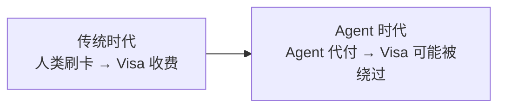

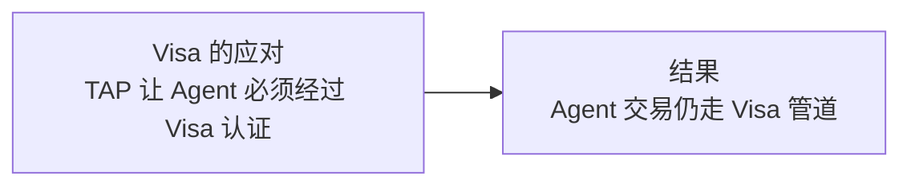

**六大商业驱动力：**

| 驱动力 | 逻辑 | 具体表现 |
|--------|------|---------|
| 防御：防止被 Agent 时代"脱媒" | 如果 Agent 可以直接用银行转账、稳定币支付，Visa 的卡网络就被绕过 | TAP 将 Agent 身份认证绑定到 Visa 体系，确保 Agent 交易走 Visa 管道 |
| 进攻：从支付管道升级为信任基础设施 | 传统 Visa 只管"钱能不能过"，TAP 让 Visa 管"Agent 能不能信" | 三层签名模型让 Visa 成为 Agent 商务的信任根 |
| 数据：获取 Agent 交易的全链路数据 | Agent 交易模式与人类不同，谁掌握 Agent 交易数据谁就掌握风控优势 | Intelligent Commerce 的商务信号共享机制 |
| 网络效应：Agent Provider / 商户双边锁定 | 越多 Agent 平台接入 Visa 认证，商户越有动力验证 TAP 签名；反之亦然 | 已签约 OpenAI、Microsoft、Anthropic、Samsung 等头部 Agent 平台 |
| 卡位：抢在标准碎片化之前定义规范 | 1.75 亿商户不可能为每个 AI 平台做定制集成，标准化是唯一出路 | TAP 基于 RFC 9421 开放标准，与 Cloudflare 联合推动 |
| 收入：Agent 交易量 = Visa 手续费收入 | TAP 本身免费，但 Agent 通过 Visa 卡网络的每笔交易都产生手续费 | 核心商业模式不变：交易量 × 费率 |

#### 1.5.2 Visa 面临的"脱媒"威胁

Agent 时代，Visa 的卡网络管道可能被四条路径绕过：

| 路径 | 威胁方 | 绕过方式 | 威胁等级 |
|------|--------|---------|---------|
| ① PSP 直连 | Stripe (ACP) | Agent 通过 Stripe SPT 支付，Stripe 可选择非 Visa 通道（如 ACH、SEPA） | ⭐⭐⭐ |
| ② 链上支付 | Coinbase (x402) | HTTP 402 触发 USDC 链上结算，完全绕过卡网络 | ⭐⭐ |
| ③ 平台闭环 | Amazon (Buy for Me) | Amazon Pay 闭环结算，Visa 只是底层资金来源之一 | ⭐⭐⭐ |
| ④ 银行直连 | 开放银行 (PSD2/FedNow) | Agent 直接发起银行转账，零卡网络费用 | ⭐⭐ |

**Visa 的应对策略**：TAP 不是被动防御，而是主动出击——通过将 Agent 身份认证绑定到 Visa 体系，让"经过 Visa 认证的 Agent"成为商户信任的前提条件。即使 Agent 最终用其他方式支付，TAP 签名仍然是商户验证 Agent 身份的标准方式。

#### 1.5.3 与 Stripe/ACP 的合作与竞争

Visa 和 Stripe 在 Agentic Commerce 中既是合作伙伴又是潜在竞争者：

| 维度 | 合作面 | 竞争面 |
|------|--------|--------|
| 支付处理 | Stripe 是 Visa 最大的 PSP 合作伙伴之一，大量 Stripe 交易走 Visa 管道 | Stripe 可以引导交易走非 Visa 通道（ACH、SEPA 等） |
| Agent 信任 | TAP 可以增强 ACP 的信任层（ACP 的信任模型相对薄弱） | 两者都想成为 Agent 商务的"必经之路" |
| 商户关系 | Visa 有 1.75 亿商户，Stripe 有开发者生态，互补 | 两者都想锁定商户到自己的生态 |
| 标准制定 | Stripe 是 TAP 的合作伙伴（PSP/收单行角色） | ACP 和 TAP 在"谁定义 Agent 商务标准"上有竞争 |

**最可能的结局**：ACP 管结账编排（商品发现 + 结账流程 + 支付触发），TAP 管信任验证（Agent 身份 + 消费者识别），Visa 卡网络管支付清算。三者形成互补的技术栈。

#### 1.5.4 竞争格局：三层竞争分析

**第一层：信任标准之争 — vs Google AP2**

| 维度 | TAP (Visa) | AP2 (Google) |
|------|-----------|-------------|
| 信任模型 | 三层加密签名（Visa 认证） | Mandate + Verifiable Credential |
| 去中心化程度 | 中心化（Visa 是信任根） | 去中心化（VC 可独立验证） |
| 集成成本 | 极低（HTTP 头签名） | 中等（需实现 AP2 API） |
| 覆盖范围 | 1.75 亿 Visa 商户 | 理论无限（开放标准） |
| 成熟度 | 规范已发布，试点中 | 规范已发布，60+ 合作伙伴 |

**第二层：控制权之争 — vs Stripe ACP**

核心问题：Agent 商务的"必经之路"是 Visa 的卡网络还是 Stripe 的支付平台？

- Visa 策略：TAP 让 Agent 身份认证必须经过 Visa → 商户信任 Visa 认证的 Agent → 交易走 Visa 管道
- Stripe 策略：ACP 让结账流程必须经过 Stripe → 商户用 Stripe 处理支付 → Stripe 选择最优支付通道

**第三层：时间窗口之争 — vs 所有竞争者**

| 竞争者 | 策略 | 时间窗口 |
|--------|------|---------|
| Visa TAP | 标准化 + 开放协议 + 1.75 亿商户即时覆盖 | 2025-2026 试点，2027 规模化 |
| Stripe ACP | 快速落地 + ChatGPT 已上线 + 开发者生态 | 已上线，先发优势 |
| Google AP2 | 最完整协议栈 + 去中心化 + 支付无关 | 规范已发布，落地较慢 |
| Mastercard Agent Pay | Agent 预注册 + Agentic Token + Decision Intelligence | 与 TAP 类似时间线 |

#### 1.5.5 与卡网络同行的合作与竞争

Visa TAP 与 Mastercard Agent Pay 在 Agent 身份认证领域直接竞争，但也有合作空间：

| 维度 | Visa TAP | Mastercard Agent Pay |
|------|---------|---------------------|
| Agent 身份 | 三层签名（RFC 9421） | Agent 预注册 + Agentic Token |
| 用户确认 | FIDO2/Passkey | Biometric Cardholder Verification |
| 风控 | Visa Protect for AI Agents | Decision Intelligence AI |
| 标准基础 | RFC 9421 + OpenID Connect | EMVCo + W3C |
| 合作伙伴 | Cloudflare（联合开发） | Microsoft（首个集成） |

**合作可能性**：两者可能通过 EMVCo 等行业标准组织走向统一，形成跨卡组织的 Agent 身份认证标准。商户不应该需要分别集成 Visa TAP 和 Mastercard Agent Pay。

#### 1.5.6 商业逻辑对比表

| 维度 | Visa TAP | Stripe ACP | Google AP2 | Mastercard Agent Pay |
|------|---------|-----------|-----------|---------------------|
| 核心身份 | 卡网络 | PSP | 科技平台 | 卡网络 |
| 商业模式 | 交易手续费 | 支付处理费 | 数据+广告+生态 | 交易手续费 |
| 防御目标 | 防止卡网络被绕过 | 防止 PSP 被绕过 | 防止搜索/广告被绕过 | 防止卡网络被绕过 |
| 进攻目标 | 成为 Agent 信任基础设施 | 成为 Agent 商务编排层 | 成为 Agent 商务标准制定者 | 成为 Agent 身份认证层 |
| 锁定机制 | Agent 认证绑定 Visa | 结账流程绑定 Stripe | 开放标准+生态 | Agent Token 绑定 MC |
| 开放程度 | 开放协议（GitHub） | 半开放（依赖 Stripe） | 完全开放标准 | 开放协议 |


## 2. 核心概念与术语 (Key Concepts & Glossary)

| 术语 | 全称 | 说明 |
|------|------|------|
| TAP | Trusted Agent Protocol | Visa 与 Cloudflare 联合开发的 Agent 信任验证协议，基于 RFC 9421 HTTP Message Signatures |
| Intelligent Commerce | Visa Intelligent Commerce | Visa 的 AI Agent 商务平台，包含四大能力模块 |
| Agent Recognition Signature | — | TAP 三层签名的第一层，基于 RFC 9421，证明 Agent 经过 Visa 认证 |
| Agentic Consumer Recognition Object | — | TAP 三层签名的第二层，包含消费者身份信息（ID Token + 设备数据） |
| Agentic Payment Container | — | TAP 三层签名的第三层，包含支付凭证数据（令牌、凭证哈希或 Browsing IOU） |
| Browsing IOU | — | Agent 访问付费内容时返回的支付承诺对象，用于 HTTP 402 场景 |
| ID Token | — | Visa 签发的 JWT（OpenID Connect 兼容），包含消费者的混淆化身份信息 |
| Key Store | — | Visa 托管的公钥存储服务（`https://mcp.visa.com/.well-known/jwks`） |
| Agent Provider | — | 经过 Visa 认证的 AI 平台（如 OpenAI、Microsoft、Anthropic、Samsung） |
| Site Protection Provider | — | CDN 或信任管理系统（如 Cloudflare），可代商户验证 TAP 签名 |
| VTS | Visa Token Service | Visa 的令牌化服务，将真实卡号替换为令牌 |
| FIDO2/Passkey | — | 基于公钥密码学的无密码认证标准，用于用户确认 Agent 授权 |
| Visa Payment Passkey | — | Visa 基于 FIDO 标准的认证方案，用于 CNP 场景 |
| Flexible Credential | — | Visa 的灵活凭证技术，允许单一支付身份在借记卡/信用卡/BNPL 间动态切换 |
| Web Bot Auth | — | Cloudflare 提出的 Web Bot 认证标准，TAP 与其对齐 |
| RFC 9421 | HTTP Message Signatures | IETF 标准，TAP 的 Agent 识别签名基于此构建 |
| SPT | SharedPaymentToken | ACP 的委托支付令牌（对比用） |

## 3. 发展历程 (History & Evolution)

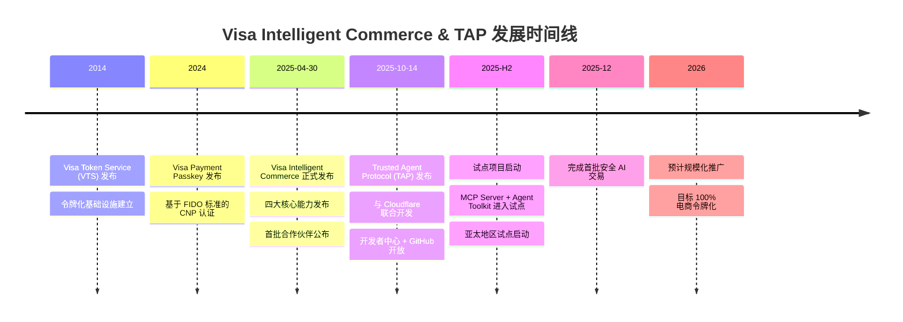

| 时间 | 事件 | 意义 |
|------|------|------|
| 2014 | Visa Token Service (VTS) 发布 | 建立令牌化基础设施，为 Agent 支付奠定技术基础 |
| 2024 | Visa Payment Passkey 发布 | 基于 FIDO 标准的无密码认证，为 Agent 授权确认铺路 |
| 2025-04-30 | Intelligent Commerce 发布 | Visa 正式进入 Agentic Payment 领域，发布完整产品套件 |
| 2025-10-14 | TAP 协议发布 | 解决商户侧的 Agent 信任问题，与 Cloudflare 联合推出 |
| 2025-H2 | 试点项目启动 | MCP Server 和 Agent Toolkit 进入生产试点 |
| 2025-12 | 首批安全 AI 交易 | 从实验走向生产验证 |
| 2026 | 预计规模化 | 大规模商业化推广 |

**值得注意的时间差**：Visa 分两步推出 Agent 商务能力——先解决支付侧（Intelligent Commerce，2025-04），再解决信任侧（TAP，2025-10）。这反映了务实策略：先让 Agent 能付钱，再让商户能信任 Agent。


## 4. 业务场景 (Use Cases)

### 4.1 参与角色 (Actors)

| 角色 | 说明 | 示例 |
|------|------|------|
| 👤 消费者 (Consumer) | 使用 AI Agent 购物的终端用户 | ChatGPT 用户、Copilot 用户 |
| 🤖 AI Agent | 代表消费者执行购物任务的 AI 系统 | ChatGPT、Microsoft Copilot、Perplexity |
| 🏢 Agent Provider | 经过 Visa 认证的 Agent 平台运营方 | OpenAI、Microsoft、Anthropic、Samsung |
| 🏪 商户 (Merchant) | 提供商品/服务的卖方 | 电商网站、付费内容平台 |
| 🛡️ Site Protection Provider | CDN/站点保护服务，可代商户验证 TAP 签名 | Cloudflare |
| 💳 Visa | 卡网络运营方，TAP 协议制定者，信任根 | Visa Inc. |
| 🏦 发卡行 (Issuer) | 向消费者发行 Visa 卡的金融机构 | Chase、Citi、HSBC |
| 🏦 收单行 (Acquirer) | 为商户处理支付的金融机构 | Stripe、Adyen、Worldpay |

### 4.2 用例总览图

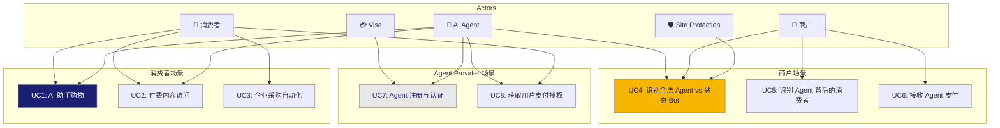

### 4.3 UC1: AI 助手购物（核心场景）

用户对 AI 助手说"帮我买一双跑鞋"：

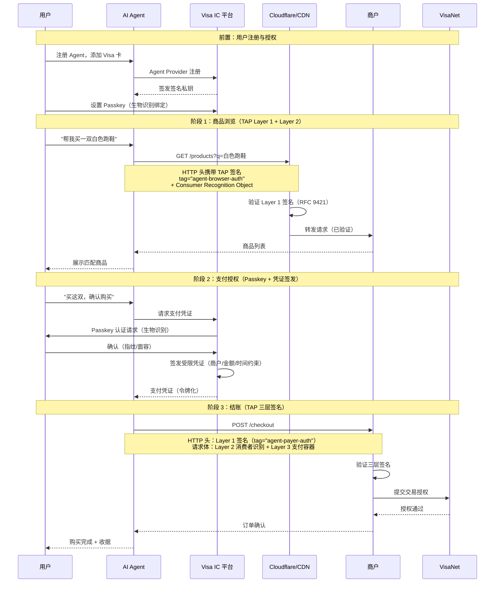

### 4.4 UC2: 付费内容访问（HTTP 402 场景）

Agent 需要访问商户的付费产品评论：

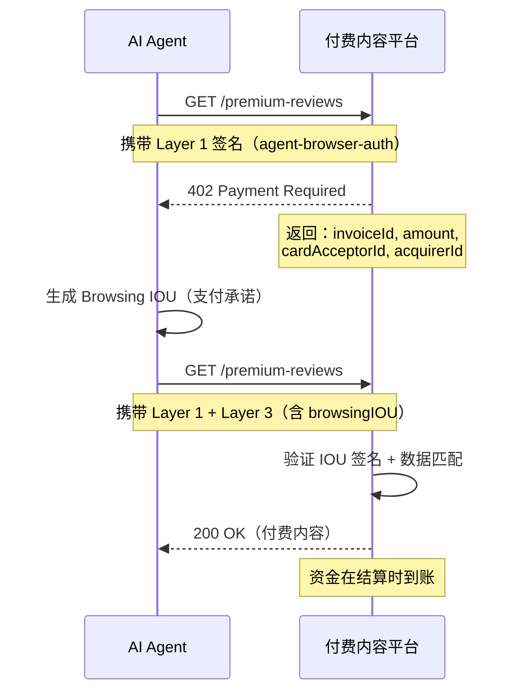

### 4.5 UC4: 商户识别合法 Agent vs 恶意 Bot

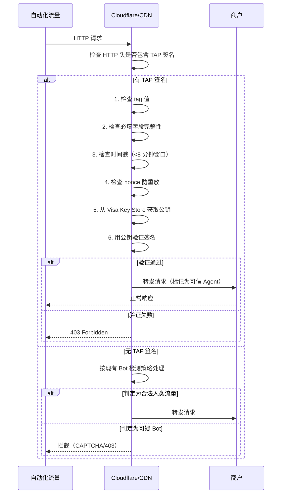

### 4.6 UC3: 企业采购自动化

企业 Agent 代表员工采购办公用品：

1. 企业在 Intelligent Commerce 平台注册 Agent，配置支付规则（商户类别限制、金额上限、审批流程）
2. Agent 携带 TAP 签名访问供应商网站，CDN 层自动验证
3. 通过 Passkey 认证获取受限支付凭证（限定商户类别、金额上限）
4. Agent 在授权范围内自动完成采购
5. 交易记录完整可审计，支持企业费用管理

### 4.7 用例与 TAP 层级映射

| 用例 | Layer 1<br/>Agent 身份 | Layer 2<br/>消费者识别 | Layer 3<br/>支付容器 | Intelligent Commerce |
|------|:---:|:---:|:---:|:---:|
| UC1: AI 助手购物 | ✅ | ✅ | ✅ (payload) | ✅ |
| UC2: 付费内容访问 | ✅ | 可选 | ✅ (browsingIOU) | — |
| UC3: 企业采购 | ✅ | ✅ | ✅ (payload) | ✅ |
| UC4: Agent vs Bot 识别 | ✅ | — | — | — |
| UC5: 消费者识别 | ✅ | ✅ | — | — |
| UC6: 接收 Agent 支付 | ✅ | ✅ | ✅ | ✅ |
| UC7: Agent 注册 | — | — | — | ✅ |
| UC8: 用户授权 | — | — | — | ✅ (Passkey) |

### 4.8 业务逻辑关系总览

TAP 生态中的五大实体及其交互关系：

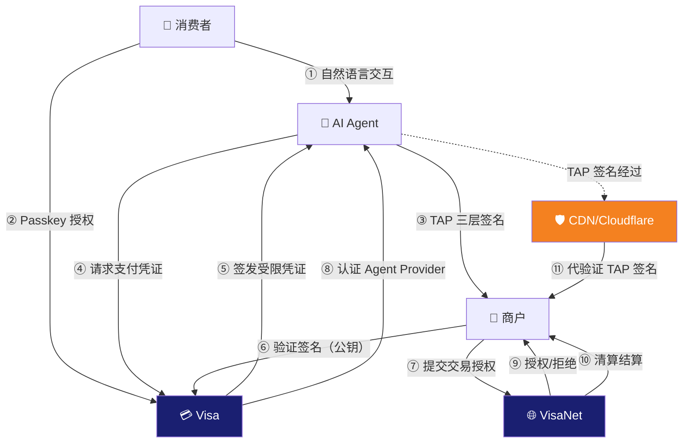

**关系说明：**

| 编号 | 关系路径 | 协议/机制 | 说明 |
|:---:|----------|----------|------|
| ① | 消费者 ↔ Agent | 自然语言/UI | 用户通过对话向 Agent 表达购物意图 |
| ② | 消费者 → Visa | FIDO2/Passkey | 用户通过生物识别确认 Agent 支付授权 |
| ③ | Agent → 商户 | TAP 三层签名 (HTTP) | Agent 携带签名访问商户网站，证明身份、消费者、支付能力 |
| ④⑤ | Agent ↔ Visa | Intelligent Commerce API | Agent 请求支付凭证，Visa 签发受限令牌 |
| ⑥ | 商户 → Visa | Key Store (JWKS) | 商户从 Visa 获取公钥验证 TAP 签名 |
| ⑦⑨ | 商户 ↔ VisaNet | ISO 8583 | 商户通过收单行向 VisaNet 提交交易授权 |
| ⑧ | Visa → Agent | Agent Provider 认证 | Visa 认证 Agent 平台身份，签发签名私钥 |
| ⑩ | VisaNet → 商户 | 清算结算 | 资金通过卡网络清算后结算至商户（T+1/T+2） |
| ⑪ | CDN → 商户 | 代理验证 | Cloudflare 等 CDN 可代商户验证 TAP 签名，商户零代码接入 |

**核心洞察：**

- **Visa 处于信任枢纽位置**：它同时认证 Agent（签发私钥）、服务商户（提供公钥验证）和处理支付（VisaNet 授权），这与 ACP 中 Stripe 的枢纽角色类似
- **CDN 层是关键创新**：通过 Cloudflare 代验证，商户可以零代码接入 TAP，这是 ACP 和 AP2 都不具备的能力
- **消费者与商户之间没有直接关系**：所有交互都通过 Agent 代理，消费者只需对 Visa 进行 Passkey 授权


## 5. 技术架构 (Architecture)

### 5.1 整体架构

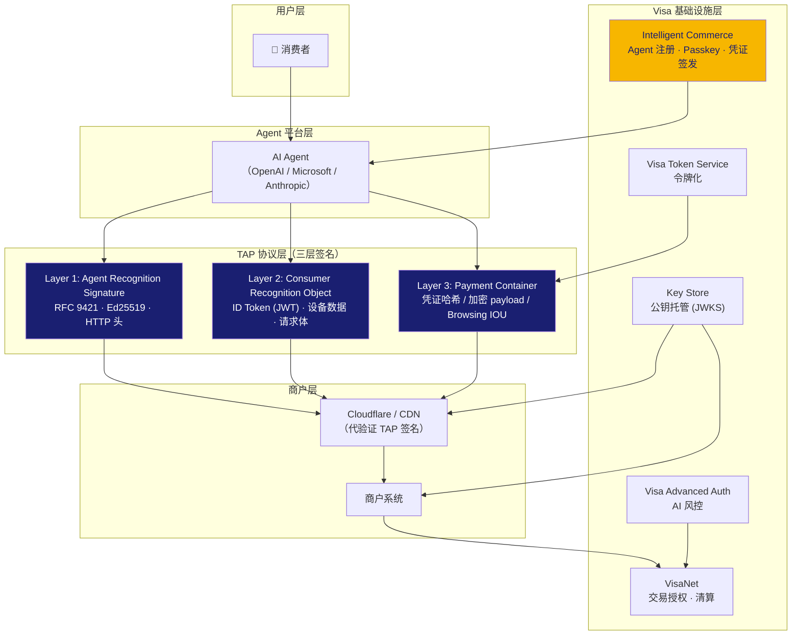

### 5.2 TAP 三层签名信任模型

TAP 的核心创新是三层签名信任模型。每一层解决一个不同的信任问题，三层通过共享的 `nonce` 值关联，形成完整的信任链。

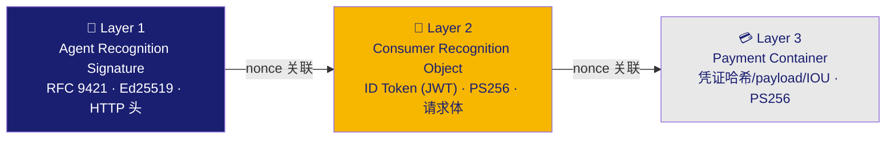

| 层级 | 名称 | 位置 | 算法 | 回答的问题 | 防护 |
|------|------|------|------|-----------|------|
| Layer 1 | Agent Recognition Signature | HTTP 头 | Ed25519 | 这个 Agent 是经过 Visa 认证的可信 Agent 吗？ | 身份伪造、请求篡改、重放攻击 |
| Layer 2 | Consumer Recognition Object | 请求体 JSON | PS256 | Agent 背后的消费者是谁？商户认识这个消费者吗？ | 消费者身份伪造 |
| Layer 3 | Payment Container | 请求体 JSON | PS256 | Agent 能完成支付吗？支付凭证是否合法？ | 支付凭证篡改、未授权支付 |

**关键设计**：三层通过共享 `nonce` 关联。商户验证时，首先验证 Layer 1 签名（最轻量），通过后再验证 Layer 2 和 Layer 3。这种分层设计允许商户根据场景选择验证深度：
- 仅浏览：验证 Layer 1 + Layer 2
- 支付：验证 Layer 1 + Layer 2 + Layer 3

### 5.3 完整交易流程

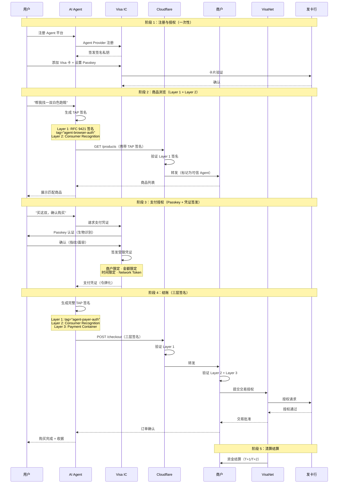

### 5.4 Intelligent Commerce 四大能力模块

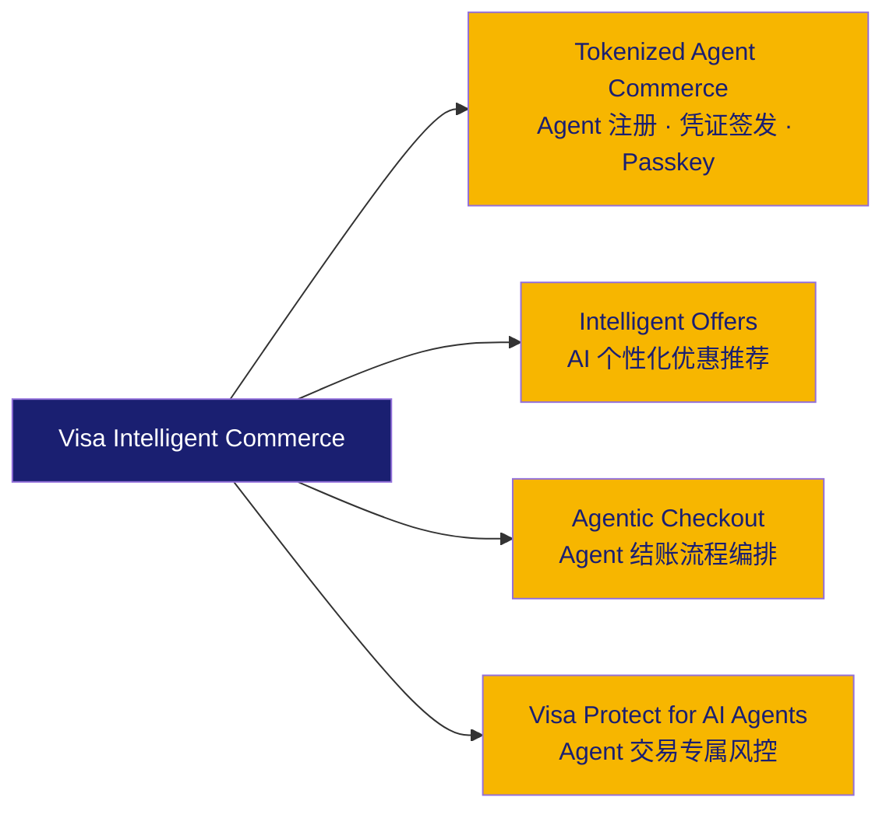

| 模块 | 功能 | 关键技术 |
|------|------|---------|
| Tokenized Agent Commerce | Agent 注册、Visa 卡绑定、支付凭证签发 | Visa Token Service + FIDO2/Passkey |
| Intelligent Offers | 基于交易历史的 AI 个性化优惠推荐 | Visa 交易数据 + AI 推荐引擎 |
| Agentic Checkout | Agent 结账流程编排，支持 Guest Checkout 和 API 集成 | TAP 三层签名 + 令牌化支付 |
| Visa Protect for AI Agents | 专为 Agent 交易模式训练的 AI 欺诈检测 | Visa Advanced Authorization + Agent 行为模型 |

### 5.5 商户对接流程

商户接入 TAP 有三种路径，复杂度从低到高：

#### 对接路径总览

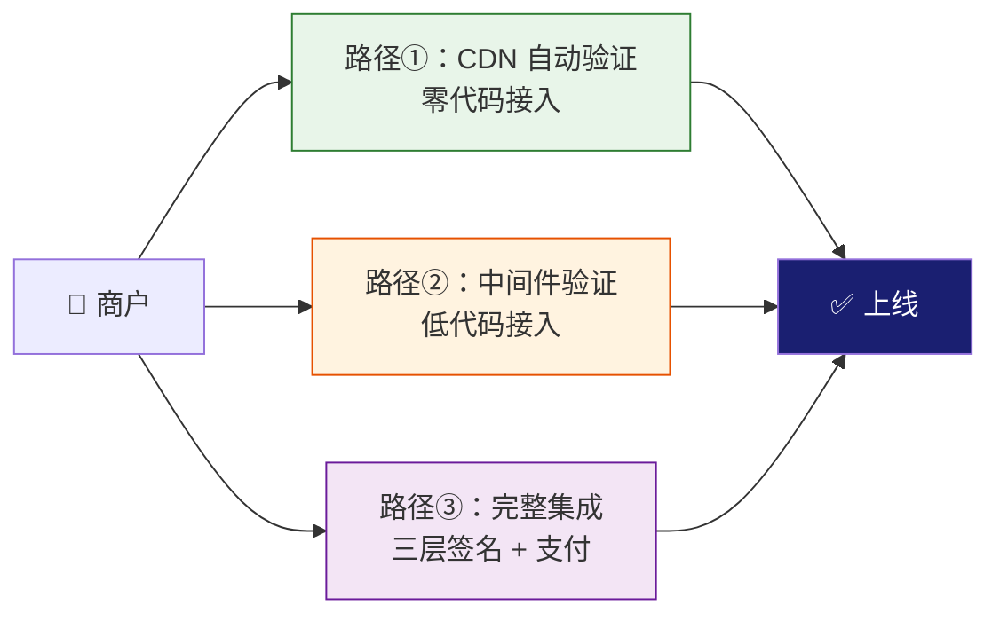

#### 路径①：CDN 自动验证（零代码）

适用于使用 Cloudflare 等支持 TAP 的 CDN 的商户。

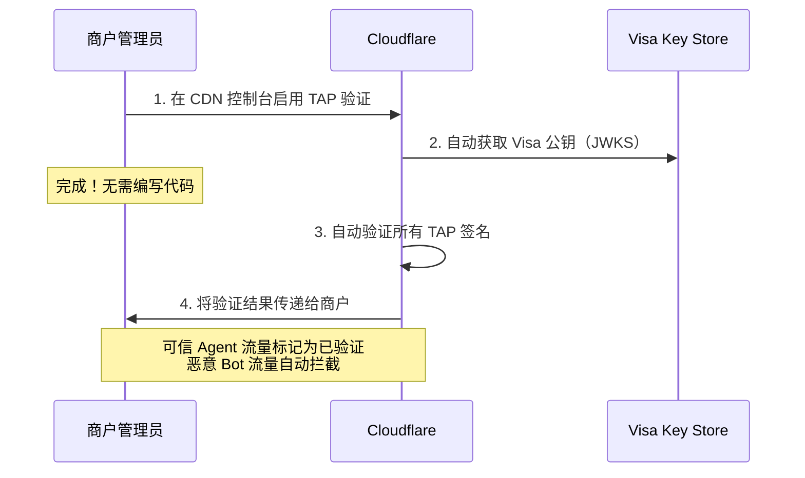

| 步骤 | 操作 | 耗时 |
|------|------|------|
| 启用 TAP | 在 CDN 控制台开启 TAP 验证功能 | 5 分钟 |
| 公钥同步 | CDN 自动从 Visa Key Store 获取公钥 | 自动 |
| 上线 | Agent 流量自动被验证和分类 | 即时 |

#### 路径②：中间件验证（低代码）

适用于不使用支持 TAP 的 CDN，但只需要验证 Agent 身份的商户。

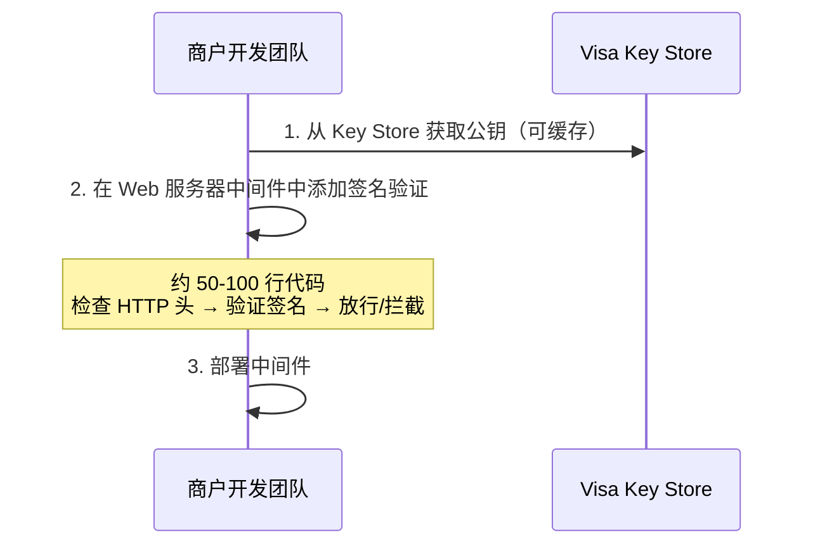

| 步骤 | 工作量 | 说明 |
|------|--------|------|
| 获取公钥 | 1 小时 | 调用 Visa JWKS 端点，配置缓存 |
| 实现验证逻辑 | 1-2 天 | 50-100 行代码，验证 RFC 9421 签名 |
| 测试与部署 | 1-2 天 | 端到端测试 |

#### 路径③：完整集成（中等代码量）

适用于需要完整利用 TAP 三层签名能力的商户（消费者识别 + 支付处理）。

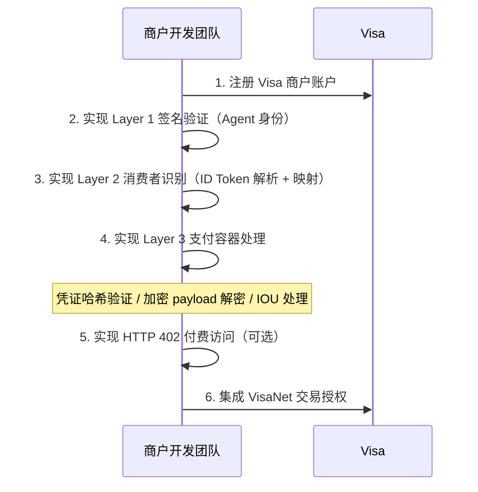

| 步骤 | 工作量 | 说明 |
|------|--------|------|
| Layer 1 验证 | 1-2 天 | RFC 9421 签名验证 |
| Layer 2 消费者识别 | 3-5 天 | JWT 解析 + 混淆化身份映射表 |
| Layer 3 支付处理 | 1-2 周 | 凭证哈希/加密 payload/IOU 处理 |
| HTTP 402 | 2-3 天 | 付费访问流程（可选） |
| 测试与上线 | 1 周 | 端到端测试 + 灰度上线 |

> **对比 ACP**：ACP 的商户对接也有三条路径（平台插件/REST API/MCP Server），但 TAP 的路径①（CDN 零代码）是独特优势——ACP 没有 CDN 层自动验证的能力。

### 5.6 MCP Server 与 Agent Toolkit

Visa 提供 MCP Server，让 Agent 可通过 MCP 协议与 Visa 平台交互：

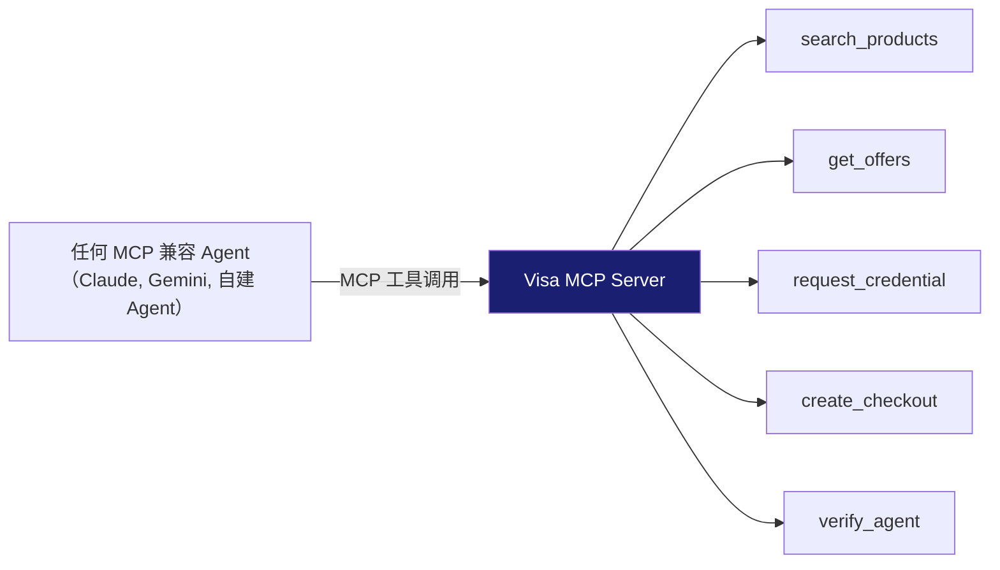

| 资源 | 说明 | 状态 |
|------|------|------|
| Visa MCP Server | Agent 通过 MCP 协议调用 Visa 能力 | 试点中 |
| Agent Toolkit | Visa Acceptance Platform 上的 Agent 工具包 | 试点中 |
| Developer Center | `developer.visa.com/capabilities/trusted-agent-protocol` | 已发布 |
| GitHub | TAP 规范开源 | 已发布 |


## 6. 技术规范详解 (Technical Deep Dive)

### 6.1 Layer 1: Agent Recognition Signature — RFC 9421 实现

TAP 的第一层签名基于 RFC 9421 HTTP Message Signatures 标准，是整个信任模型的基础。

#### 签名结构

HTTP 头中包含两个字段：

```
Signature-Input: sig2=("@authority" "@path");
     created=1735689600;
     expires=1735693200;
     keyId="poqkLGiymh_W0uP6PZFw-dvez3QJT5SolqXBCW38r0U";
     alg="Ed25519";
     nonce="e8N7S2MFd/qrd6T2R3tdfAuuANngKI7LFtKYI/vowzk4lAZyadIX6wW25MwG7DCT9RUKAJ0qVkU0mEeLElW1qg==";
     tag="agent-browser-auth"
Signature: sig2=:jdq0SqOwHdyHr9+r5jw3iYZH6aNGKijYp/EstF4RQTQdi5N5YYKrD+mCT1HA1nZDsi6nJKuHxUi/5Syp3rLWBA==:
```

#### 必填字段

| 字段 | 说明 | 安全作用 |
|------|------|---------|
| `@authority` | 目标 URI 的 authority（域名） | 防止签名被用于其他域名 |
| `@path` | 目标 URI 的绝对路径 | 防止签名被用于其他路径 |
| `created` | 请求创建时间戳 | 时间窗口验证 |
| `expires` | 请求过期时间戳 | 防止过期签名被重用 |
| `keyid` | 用于验证签名的公钥 ID | 定位验证公钥 |
| `alg` | 签名算法（Ed25519） | 算法协商 |
| `nonce` | 会话标识符 | 关联三层签名 + 防重放 |
| `tag` | 交互类型 | `agent-browser-auth`（浏览）或 `agent-payer-auth`（支付） |

#### 验证流程（6 步）

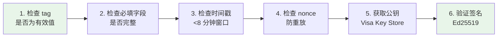

#### 签名基字符串构建示例（Python）

```python
# 输入值来自 HTTP 请求
authority = "example.com"
path = "/example-product"
created = 1735689600
expires = 1735693200
keyid = "poaKLGjymh_W0uP6PZFw-dvez3QJTSolqXBCW38r0U"
nonce = "e8N7S2MFd/qrddE7R23tdfAuuANngKI7LFtKYI/vIowzk4lAZYadIX6wW25MwG7DCT9RUKAJ0qVkUOmEeLEWI1qq=="
tag = "agent-browser-auth"

# 构建签名基字符串
signature_base = (
    f'"@authority": {authority}\n'
    f'"@path": {path}\n'
    f'"@signature-params": sig2=("@authority" "@path");'
    f'created={created};'
    f'keyid="{keyid}";'
    f'expires={expires};'
    f'nonce="{nonce}";'
    f'tag="{tag}"'
)
```

### 6.2 Layer 2: Agentic Consumer Recognition Object

第二层签名帮助商户识别 Agent 背后的消费者，实现"已登录"体验。

#### JSON 结构

```json
{
  "agenticConsumer": {
    "nonce": "e8N7S2MFd/qrd6T2R3tdfAuuANngKI7LFtKYI/vowzk4lAZyadIX6wW25MwG7DCT9RUKAJ0qVkU0mEeLElW1qg==",
    "idToken": { "/* Visa 签发的 JWT */" },
    "contextualData": {
      "countryCode": "US",
      "zip": "94105",
      "ipAddress": "203.0.113.42",
      "deviceData": { "/* 设备指纹数据 */" }
    },
    "kid": "poqkLGiymh_W0uP6PZFw-dvez3QJT5SolqXBCW38r0U",
    "alg": "PS256",
    "signature": "jdq0SqOwHdyHr9+..."
  }
}
```

#### ID Token（JWT）结构

| 类别 | Claim | 说明 |
|------|-------|------|
| Header | `alg` | 签名算法（PS256 优先于 RS256） |
| Header | `kid` | Visa 公钥 ID |
| Header | `typ` | `JWT+ext.id_token` |
| Public | `iss` | 签发者标识（Visa） |
| Public | `sub` | 消费者主体标识（Visa 内部唯一 ID） |
| Public | `aud` | 受众（目标商户） |
| Public | `exp` / `iat` | 过期时间 / 签发时间 |
| Standard | `phone_number` | **混淆化**手机号（E.164 格式） |
| Standard | `email` | **混淆化**邮箱（全小写） |
| Private | `phone_number_mask` | 掩码手机号（如 `+1******1234`），用于 UI 展示 |
| Private | `email_mask` | 掩码邮箱（如 `j***@example.com`），用于 UI 展示 |

**隐私设计要点**：身份信息全部混淆化传输。商户需要维护一个映射表，将混淆化的手机号/邮箱与自己系统中的实际手机号/邮箱匹配，才能识别消费者。

### 6.3 Layer 3: Agentic Payment Container

第三层签名携带支付凭证，根据支付方式不同有三种变体：

#### 变体 A：凭证哈希（Guest Checkout 表单填写场景）

```json
{
  "agenticPaymentContainer": {
    "nonce": "...",
    "credentialHash": "SHA256(卡号16位 + 有效月2位 + 有效年2位 + CVV3位)",
    "cardMetadata": {
      "lastFour": "1234",
      "paymentAccountReference": "V0010013020..."
    },
    "kid": "...", "alg": "PS256", "signature": "..."
  }
}
```

商户验证：用 Agent 表单填写的卡号+有效期+CVV 生成哈希，与 `credentialHash` 比对。不匹配则说明填写的数据被篡改，应拒绝交易。

#### 变体 B：加密支付对象（API/协议支付场景）

```json
{
  "agenticPaymentContainer": {
    "nonce": "...",
    "payload": "/* 用商户公钥加密的完整支付对象 */",
    "kid": "...", "alg": "PS256", "signature": "..."
  }
}
```

解密后的 payload 包含：paymentToken、expirationMonth/Year、cardholderName、dynamicData、shippingAddress、billingAddress、consumerEmailAddress 等。

#### 变体 C：Browsing IOU（HTTP 402 付费访问场景）

```json
{
  "agenticPaymentContainer": {
    "nonce": "...",
    "browsingIOU": {
      "invoiceId": "inv_abc123",
      "amount": "0.50",
      "cardAcceptorId": "MERCHANT_CAID",
      "acquirerId": "ACQUIRER_AID",
      "uri": "https://merchant.com/premium-reviews",
      "sequenceCounter": 1,
      "paymentService": "visa",
      "kid": "...", "alg": "PS256", "signature": "..."
    },
    "kid": "...", "alg": "PS256", "signature": "..."
  }
}
```

### 6.4 公钥检索服务

Visa 在 `https://mcp.visa.com/.well-known/jwks` 托管公钥：

```
GET /keys?keyID=poqkLGiymh_W0uP6PZFw-dvez3QJT5SolqXBCW38r0U

Response:
{
  "kty": "EC",
  "kid": "poqkLGiymh_W0uP6PZFw-dvez3QJT5SolqXBCW38r0U",
  "use": "sig",
  "alg": "Ed25519",
  "n": "...",
  "e": "..."
}
```

| 步骤 | 说明 |
|------|------|
| 1. 提取 keyid/kid | 从签名中获取公钥标识 |
| 2. 访问 JWKS URL | `https://mcp.visa.com/.well-known/jwks` |
| 3. 选择公钥 | 根据 `kid` 和 `alg` 匹配 |
| 4. 验证签名 | 用公钥验证 |
| 5. 缓存 | 商户可缓存公钥以减少网络请求 |


## 7. 安全模型与信任架构 (Security Model & Trust Architecture)

### 7.1 安全架构概览

TAP 的安全模型围绕四个维度构建：

#### 用户安全

| 安全机制 | 说明 | 防御的风险 |
|---------|------|-----------|
| FIDO2/Passkey 认证 | 用户通过生物识别（指纹/面容）确认 Agent 支付授权，不可被远程窃取 | 防止 Agent 在用户不知情的情况下发起支付 |
| 支付凭证受限签发 | Visa 签发的凭证绑定商户、金额、时间约束，超出范围自动失效 | 即使凭证被截获，攻击者也无法超额/跨商户使用 |
| 身份混淆化 | 消费者手机号/邮箱在 ID Token 中全部混淆化传输 | 防止 Agent 或商户泄露用户真实身份信息 |
| 交易可追溯 | 所有交易通过 VisaNet 记录，用户可通过发卡行查看 | 用户对消费有完整可见性 |

#### Agent 安全

| 安全机制 | 说明 | 防御的风险 |
|---------|------|-----------|
| Visa 认证的签名私钥 | 只有经过 Visa 认证的 Agent Provider 才能获得签名私钥 | 防止未授权 Agent 冒充合法平台 |
| RFC 9421 签名 | 签名覆盖 @authority 和 @path，任何修改都使签名失效 | 防止请求篡改和中间人攻击 |
| 时间戳 + nonce | 8 分钟时间窗口 + nonce 去重检查 | 防止重放攻击 |
| Agent 不持有真实卡号 | Agent 只持有令牌化凭证，不接触真实卡号 | 防止 Agent 被入侵后大规模卡号泄露 |

#### 商户安全

| 安全机制 | 说明 | 防御的风险 |
|---------|------|-----------|
| 三层签名验证 | 商户可验证 Agent 身份、消费者身份和支付凭证的完整性 | 全方位防止伪造和篡改 |
| CDN 层代验证 | Cloudflare 等 CDN 可代商户验证签名，零代码接入 | 降低商户安全实现成本 |
| 凭证哈希比对 | Guest Checkout 场景，商户可验证 Agent 填写的卡号数据未被篡改 | 防止 Agent 篡改支付信息 |
| Bot 流量分类 | 有 TAP 签名 = 可信 Agent，无签名 = 按现有策略处理 | 区分合法 Agent 和恶意 Bot |

#### 支付安全

| 安全机制 | 说明 | 防御的风险 |
|---------|------|-----------|
| Visa Token Service | 真实卡号替换为 Network Token，即使泄露也无法还原 | 卡号泄露风险 |
| VisaNet 网络级控制 | 在授权请求到达 VisaNet 时验证商户、金额等约束 | 超额扣款、跨商户滥用 |
| Visa Advanced Authorization | 实时交易风险评分，基于数千亿笔交易数据训练 | 欺诈交易识别 |
| Visa Protect for AI Agents | 专为 Agent 交易模式训练的 AI 欺诈检测模型 | Agent 特有的欺诈模式 |
| 3D Secure | 高风险交易可触发额外身份验证 | 盗卡交易 + Liability Shift |

### 7.2 信任链分析

#### 信任模型深度解读："Visa 认证背书"的逻辑与架构

传统电商中，商户通过浏览器指纹、Cookie、CAPTCHA 来判断"这是不是一个人类在操作"。Agent 时代，这些机制全部失效——Agent 没有浏览器指纹，不支持 Cookie，无法通过 CAPTCHA。商户需要回答三个核心问题：

| 问题 | 传统电商的回答 | TAP 的回答 |
|------|-------------|-----------|
| 这个请求者是谁？（身份） | 浏览器指纹 + Cookie + 登录态 | Layer 1: RFC 9421 签名（Visa 认证的 Agent） |
| 背后的消费者是谁？（消费者识别） | 用户登录账户 | Layer 2: ID Token（Visa 签发的混淆化身份） |
| 支付凭证合法吗？（支付保障） | 用户手动输入卡号 | Layer 3: 凭证哈希/加密 payload（Visa 令牌化） |

**信任传递链条：**

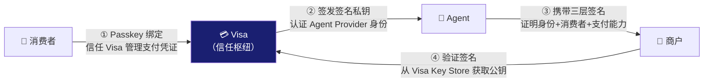

每一环的信任逻辑：

| 环节 | 信任关系 | 技术机制 | 信任基础 |
|------|---------|---------|---------|
| ① 消费者 → Visa | 消费者信任 Visa 安全管理支付凭证 | FIDO2/Passkey + Visa Token Service | 品牌信任 + 卡网络信誉 |
| ② Visa → Agent | Visa 认证 Agent Provider 的身份 | Agent Provider 注册 + 签名私钥签发 | 准入审核 + 密钥管理 |
| ③ Agent → 商户 | Agent 向商户证明身份、消费者和支付能力 | TAP 三层签名（RFC 9421 + JWT + Payment Container） | 加密签名（数学级证明） |
| ④ 商户 → Visa | 商户验证签名的有效性 | 从 Visa Key Store 获取公钥验证 | Visa 公钥基础设施 |

**类比理解**：TAP 的信任模型类似于 HTTPS 证书体系——Visa 扮演 CA（证书颁发机构）的角色，为 Agent 签发"数字证书"（签名私钥），商户通过 Visa 的"根证书"（公钥）验证 Agent 的身份。

#### 与 ACP 信任模型的对比

| 维度 | TAP (Visa) | ACP (Stripe) |
|------|-----------|-------------|
| 信任根 | Visa（卡网络） | Stripe（PSP） |
| Agent 身份证明 | RFC 9421 加密签名（数学级） | Stripe API Key（账户级） |
| 消费者识别 | ID Token (JWT) + 混淆化身份 | 无独立消费者识别机制 |
| 支付凭证保护 | 凭证哈希/加密 payload + Network Token | SPT（一次性令牌） |
| 去中心化程度 | 中心化（Visa 是信任根） | 中心化（Stripe 是信任根） |
| 不可否认性 | 加密签名提供较强的不可否认性 | 依赖 Stripe 日志 |
| 离线验证 | 公钥可缓存，支持一定程度的离线验证 | 完全依赖 Stripe 在线验证 |
| 跨生态 | 仅限 Visa 卡持卡人 | 仅限 Stripe 商户 |

**关键差异**：TAP 的 Agent 身份证明是加密签名级别的（RFC 9421），而 ACP 的 Agent 身份只是一个 API Key。这意味着 TAP 的 Agent 身份更难伪造，但也更复杂。

#### 与 AP2 信任模型的对比

| 维度 | TAP (Visa) | AP2 (Google) |
|------|-----------|-------------|
| 信任模型 | 三层加密签名（Visa 认证） | Mandate + Verifiable Credential |
| 去中心化 | 中心化（Visa 是信任根） | 去中心化（VC 可独立验证） |
| 审计链 | 三层签名 + VisaNet 日志 | VC 签名链（Intent → Cart → Payment） |
| 不可否认性 | 较强（加密签名） | 最强（数学级 VC 签名链） |
| 授权表达力 | 较弱（Passkey 确认 + 网络级控制） | 最强（Mandate 可表达复杂约束） |
| 集成复杂度 | 低（HTTP 头签名） | 高（需要 VC 基础设施） |
| 落地速度 | 中等（试点中） | 较慢（需要新基础设施） |

### 7.3 威胁模型与防护总览

| 威胁 | TAP 防护机制 | 防护层级 |
|------|-------------|---------|
| Agent 身份伪造 | Layer 1 RFC 9421 签名 + Visa 认证的公钥 | Layer 1 |
| 请求篡改 | 签名覆盖 @authority 和 @path | Layer 1 |
| 重放攻击 | nonce + 时间戳（8 分钟窗口）+ nonce 去重 | Layer 1 |
| 消费者身份伪造 | Layer 2 ID Token 由 Visa 签发（JWT） | Layer 2 |
| 支付凭证篡改 | Layer 3 凭证哈希/加密 payload | Layer 3 |
| 恶意 Bot 伪装 | 无 TAP 签名的流量可被 CDN 拦截 | CDN 层 |
| 中间人攻击 | HTTPS + 加密签名 | 传输层 |
| 凭证泄露 | Guest Checkout 只传哈希，API 场景用商户公钥加密 | Layer 3 |
| 欺诈交易 | Visa Protect for AI Agents + Visa Advanced Authorization | VisaNet 层 |


## 8. 生态与社区 (Ecosystem & Community)

### 合作伙伴全景

TAP 和 Intelligent Commerce 的生态围绕 Visa（卡网络）和 Cloudflare（Web 基础设施）两大核心构建，并快速扩展到 Agent 平台、电商平台、PSP 和金融科技公司。

```mermaid
graph TD
    subgraph "核心主导方"
        VISA_E["Visa<br/>卡网络 + TAP 协议"]
        CF["Cloudflare<br/>联合开发 TAP + CDN 验证"]
    end

    subgraph "AI Agent 平台"
        OPENAI_E["OpenAI"]
        MS["Microsoft"]
        ANTHROPIC["Anthropic"]
        SAMSUNG["Samsung"]
        PERPLEXITY["Perplexity"]
        IBM["IBM"]
    end

    subgraph "电商平台"
        SHOPIFY_E["Shopify"]
    end

    subgraph "PSP / 收单行"
        STRIPE_E["Stripe"]
        ADYEN["Adyen"]
        WORLDPAY_E["Worldpay"]
        NUVEI["Nuvei"]
        CHECKOUT["Checkout.com"]
        CYBERSOURCE["CyberSource"]
        ELAVON["Elavon"]
        FISERV["Fiserv"]
    end

    subgraph "金融科技"
        ANT["Ant International"]
        PAYPAL_E["PayPal"]
        COINBASE_E["Coinbase"]
    end

    TAP_CENTER["TAP / IC<br/>协议"]

    VISA_E --> TAP_CENTER
    CF --> TAP_CENTER
    OPENAI_E & MS & ANTHROPIC & SAMSUNG --> TAP_CENTER
    PERPLEXITY & IBM --> TAP_CENTER
    SHOPIFY_E --> TAP_CENTER
    STRIPE_E & ADYEN & WORLDPAY_E & NUVEI --> TAP_CENTER
    CHECKOUT & CYBERSOURCE & ELAVON & FISERV --> TAP_CENTER
    ANT & PAYPAL_E & COINBASE_E --> TAP_CENTER

    style TAP_CENTER fill:#1A1F71,color:#fff
    style CF fill:#F48120,color:#fff
```

### 合作伙伴分类

| 类别 | 合作伙伴 | 角色 |
|------|---------|------|
| 卡网络 | Visa | TAP 协议制定者，信任根，支付清算 |
| Web 基础设施 | Cloudflare | 联合开发 TAP，CDN 层代验证签名 |
| AI Agent 平台 | OpenAI、Microsoft、Anthropic、Samsung、Perplexity、IBM | 经过 Visa 认证的 Agent Provider |
| 电商平台 | Shopify | 为平台商户提供 TAP 接入能力 |
| PSP/收单行 | Stripe、Adyen、Worldpay、Nuvei、Checkout.com、CyberSource、Elavon、Fiserv | 处理 Agent 交易的支付 |
| 金融科技 | Ant International、PayPal | 扩展支付方式和地域覆盖 |
| 区块链 | Coinbase | x402 互操作性对齐 |

### 关键合作伙伴详情

#### Cloudflare — 联合开发者

Cloudflare 是 TAP 最重要的合作伙伴。TAP 与 Cloudflare 的 Web Bot Auth 标准对齐，Cloudflare CDN 可代商户自动验证 TAP 签名。这意味着使用 Cloudflare 的商户可以零代码接入 TAP——这是 TAP 相比 ACP 和 AP2 的独特优势。

#### Coinbase — x402 互操作

Visa 与 Coinbase 合作对齐 TAP 和 x402 的互操作性。两者都支持 HTTP 402 付费访问模式，但结算方式不同：TAP 通过 Visa 卡网络结算，x402 通过 USDC 链上结算。互操作意味着商户可以同时接受两种支付方式。

#### Stripe — PSP 合作伙伴

Stripe 同时是 ACP 的核心主导方和 TAP 的 PSP 合作伙伴。这种双重角色意味着 Stripe 可以在 ACP 结账流程中集成 TAP 的信任验证能力，形成"ACP 管结账 + TAP 管信任"的互补架构。

### 开源与社区

| 维度 | 详情 |
|------|------|
| 开放协议 | TAP 规范在 GitHub 开源 |
| 开发者中心 | [developer.visa.com/capabilities/trusted-agent-protocol](https://developer.visa.com/capabilities/trusted-agent-protocol) |
| Intelligent Commerce | [developer.visa.com/capabilities/visa-intelligent-commerce](https://developer.visa.com/capabilities/visa-intelligent-commerce/overview) |
| MCP Server | Visa 提供 MCP Server（试点中） |
| Agent Toolkit | Visa Acceptance Platform 上的工具包（试点中） |
| 生产状态 | 试点中（2025-H2），预计 2026 规模化 |


## 9. 优劣势与竞品对比 (Pros, Cons & Comparison)

### TAP 优势

| 优势 | 说明 |
|------|------|
| 商户采用成本极低 | CDN 层零代码验证，中间件仅需 50-100 行代码。ACP 和 AP2 都需要更多集成工作 |
| 全球即时覆盖 | 1.75 亿+ Visa 商户已有接受基础，无需重新建立商户关系 |
| HTTP 原生 | 基于 RFC 9421 标准，与现有 Web 基础设施完全兼容，无需自定义 API |
| CDN 层可直接采用 | Cloudflare 等 CDN 可代商户验证签名，这是 ACP 和 AP2 都不具备的独特能力 |
| 加密签名级 Agent 身份 | RFC 9421 签名比 ACP 的 API Key 提供更强的身份证明（数学级 vs 账户级） |
| 与现有风控深度集成 | Visa Advanced Authorization + Visa Protect for AI Agents，基于数千亿笔交易数据 |
| HTTP 402 原生支持 | 与 x402 类似的付费访问模式，但基于 Visa 卡网络结算，无需加密货币 |
| 隐私保护设计 | 消费者身份全部混淆化传输，掩码版本用于 UI 展示 |

### TAP 劣势

| 劣势 | 说明 |
|------|------|
| Visa 网络锁定 | 核心依赖 Visa 卡网络，非 Visa 卡持卡人无法使用。Mastercard、银联等持卡人被排除 |
| 不解决商品发现 | TAP 没有 Product Feed 等商品数据规范，需依赖 ACP 或 UCP |
| 不解决结账编排 | TAP 只管信任验证，不管结账流程编排，需依赖 ACP 或自建 |
| 授权表达力较弱 | 相比 AP2 的 Mandate 模型（可表达复杂约束），TAP 的 Passkey + 网络级控制较简单 |
| 审计链不如 AP2 | AP2 的 VC 签名链提供数学级不可否认性，TAP 的审计依赖 VisaNet 日志 |
| 中心化依赖 | 公钥由 Visa 托管，信任根在 Visa。如果 Visa Key Store 不可用，验证链断裂 |
| 尚未规模化 | 仍在试点阶段（2025-H2），ACP 已在 ChatGPT 上线 |
| Guest Checkout 局限 | 初期 Agent 支付通过表单填写完成，体验不如原生 API 集成 |

### 三大协议全面对比

| 维度 | TAP (Visa) | ACP (OpenAI+Stripe) | AP2 (Google) |
|------|-----------|---------------------|-------------|
| **定位** | Agent-商户信任验证 | 结账流程编排 | 支付信任与授权 |
| **核心问题** | 商户如何识别合法 Agent？ | Agent 如何完成结账？ | 用户如何安全授权 Agent？ |
| **商品发现** | ❌ 不支持 | ✅ Product Feed Spec | ❌ 需依赖 UCP |
| **信任模型** | 三层加密签名（RFC 9421） | SPT（Stripe 签发） | Mandate + VC |
| **Agent 身份** | 加密签名（数学级） | API Key（账户级） | VC + DID（去中心化） |
| **用户确认** | FIDO2/Passkey | Stripe Checkout UI | VC 签名 |
| **集成方式** | HTTP 头签名（零/低代码） | Stripe SDK / REST API | 自定义 AP2 API |
| **商户改造** | 极小（CDN 可代验证） | 中等（需集成 Stripe） | 中等（需实现 AP2） |
| **支付网络** | Visa 卡网络 | Stripe 支付网络 | 支付无关 |
| **覆盖范围** | 1.75 亿+ Visa 商户 | Stripe 商户 | 理论无限 |
| **开放性** | 开放协议（GitHub） | 半开放（依赖 Stripe） | 完全开放标准 |
| **成熟度** | 试点中 | 已上线（ChatGPT） | 规范已发布 |
| **CDN 层支持** | ✅ Cloudflare 代验证 | ❌ | ❌ |
| **HTTP 402** | ✅ Browsing IOU | ❌ | ❌ |

### 协议互补关系

TAP 与其他协议不是竞争关系，而是互补关系。一个完整的 Agent 购物流程可能同时使用多个协议：

```mermaid
graph LR
    S1["1. 通信层<br/>A2A 协议"] --> S2["2. 商品发现<br/>ACP Product Feed<br/>或 UCP"]
    S2 --> S3["3. 信任验证<br/>TAP 三层签名"]
    S3 --> S4["4. 结账编排<br/>ACP Checkout"]
    S4 --> S5["5. 支付授权<br/>AP2 Mandate<br/>或 Visa Passkey"]
    S5 --> S6["6. 支付清算<br/>Visa 卡网络"]

    style S3 fill:#1A1F71,color:#fff
    style S6 fill:#1A1F71,color:#fff
```

| 步骤 | 协议 | TAP 的角色 |
|------|------|-----------|
| 1. Agent 间通信 | A2A (Google) | — |
| 2. 商品发现 | ACP Product Feed / UCP | — |
| 3. Agent 到达商户 | **TAP** | ✅ 核心：验证 Agent 身份 |
| 4. 结账流程 | ACP Checkout | — |
| 5. 支付授权 | AP2 Mandate / Visa Passkey | ✅ 可选：Passkey 授权 |
| 6. 支付清算 | Visa 卡网络 | ✅ 核心：交易清算 |

Visa 在 TAP 发布公告中明确表示：正在与生态伙伴合作，确保 TAP 与 ACP 等协议互补，并与 Coinbase 合作对齐 x402 的互操作性。

## 10. 挑战与风险 (Challenges & Risks)

### 10.1 技术挑战

| 挑战 | 说明 | 缓解措施 |
|------|------|---------|
| 标准碎片化 | TAP、AP2、ACP 多协议并存，商户面临选择困难 | 各方声称互补，但实际集成仍有摩擦 |
| 公钥管理 | 1.75 亿商户需访问 Visa Key Store，网络延迟和可用性是挑战 | 公钥可缓存，CDN 层可代理 |
| 签名性能 | 每个请求都需签名验证，高流量商户可能有性能影响 | 缓存公钥 + CDN 层分担 |
| Guest Checkout 局限 | 初期通过表单填写完成支付，体验不如原生 API | 后续演进到原生 API 集成 |

### 10.2 生态挑战

| 挑战 | 说明 | 缓解措施 |
|------|------|---------|
| Visa 网络锁定 | 非 Visa 卡持卡人无法使用 | 可能通过 EMVCo 推动跨卡组织标准 |
| Agent Provider 有限 | 目前只有少数 AI 平台参与 | 已签约 6+ 头部平台 |
| 商户采用动力 | 商户需要看到 Agent 渠道的商业价值 | CDN 零代码接入降低门槛 |
| 发卡行配合 | 发卡行需升级系统支持 Passkey 和 Agent 流程 | Visa 推动发卡行升级 |

### 10.3 监管与合规风险

| 风险 | 说明 |
|------|------|
| Agent 交易责任归属 | Agent 买错东西时，是用户责任还是 Agent 平台责任？现有消费者保护法规可能不适用 |
| 跨境合规 | 不同国家对 AI Agent 交易的监管要求不同 |
| 数据隐私 | 消费者数据在 Agent 平台、Visa、商户之间流转，需符合 GDPR 等法规 |
| 反洗钱 (AML) | Agent 自动化交易可能被用于洗钱，需要新的 KYC/AML 框架 |

## 11. 未来展望 (Future Outlook)

### 11.1 短期（2026）

- TAP 从试点走向规模化部署
- 更多 CDN/站点保护提供商支持 TAP 自动验证
- Visa MCP Server 和 Agent Toolkit 正式发布
- 与 ACP、x402 的互操作性落地

### 11.2 中期（2027-2028）

- TAP 可能演进为跨卡组织的行业标准（通过 IETF、EMVCo 等标准组织）
- Agent 支付从 Guest Checkout 演进到原生 API 集成
- Flexible Credential 与 Agent 深度集成，实现智能支付方式选择
- Agent 交易量占电商总量的显著比例

### 11.3 长期（2029+）

- Agent 商务成为主流购物方式
- TAP 或其演进版本成为 Web 基础设施的一部分
- 卡网络从"人类支付基础设施"演进为"人类+Agent 支付基础设施"
- 争议解决、消费者保护等法规框架适应 Agent 交易

### 11.4 关键不确定性

| 不确定性 | 可能的走向 |
|---------|-----------|
| 标准之争 | TAP vs AP2 vs ACP，可能共存互补而非赢家通吃 |
| 消费者接受度 | 消费者是否愿意让 AI Agent 代为购物和支付？ |
| 监管态度 | 各国监管机构对 Agent 交易是鼓励还是限制？ |
| 安全事件 | 大规模 Agent 支付欺诈事件可能显著影响采用速度 |
| 跨卡组织统一 | Visa TAP 和 Mastercard Agent Pay 是否会通过 EMVCo 统一？ |


## 12. 来源 (Sources)

### 官方文档与公告

- [Visa Developer Center - TAP Specifications](https://developer.visa.com/capabilities/trusted-agent-protocol/trusted-agent-protocol-specifications)
- [Visa Developer Center - Intelligent Commerce](https://developer.visa.com/capabilities/visa-intelligent-commerce/overview)
- [Visa Investor Relations - TAP Press Release](https://investor.visa.com/news/news-details/2025/Visa-Introduces-Trusted-Agent-Protocol-An-Ecosystem-Led-Framework-for-AI-Commerce/default.aspx)
- [Visa Perspectives - Protocol for Agentic Commerce](https://global-corporate.review.visa.com/sites/visa-perspectives/innovation/visa-protocol-scale-agentic-commerce-globally.html)

### 技术分析

- [PYMNTS - Visa Turns Tokens Into Trust Layer](https://www.pymnts.com/artificial-intelligence-2/2025/visa-turns-tokens-into-the-trust-layer-for-agentic-ai/)
- [Oscilar - Visa TAP Analysis](https://oscilar.com/blog/visatap)

### 行业报道

- Visa 威胁报告：恶意 Bot 交易半年增长 25%（美国增长 40%）
- 2025 年 AI 驱动流量涌入美国零售网站增幅超过 4,700%

---

> 本报告基于公开信息编写，信息截至 2026 年 2 月。Visa TAP 和 Intelligent Commerce 仍在快速演进中，部分技术细节可能已更新。
> 内容经过改写以符合版权要求。
