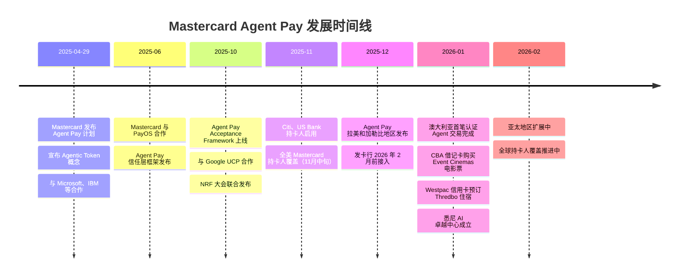
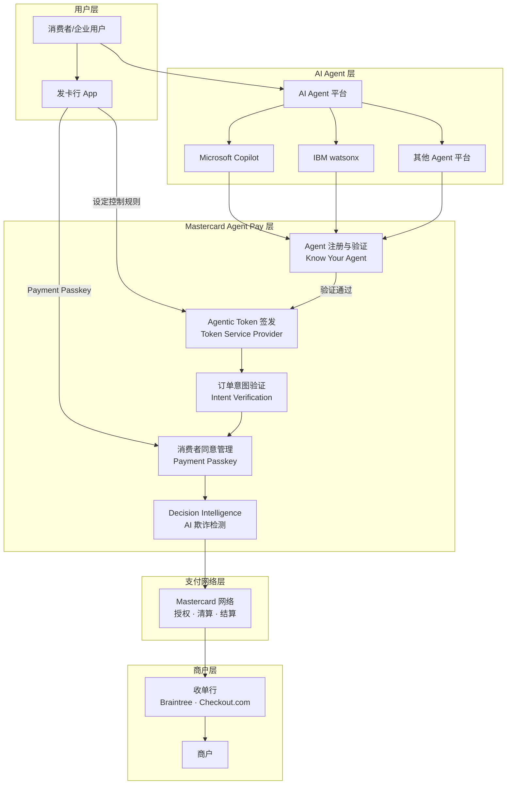
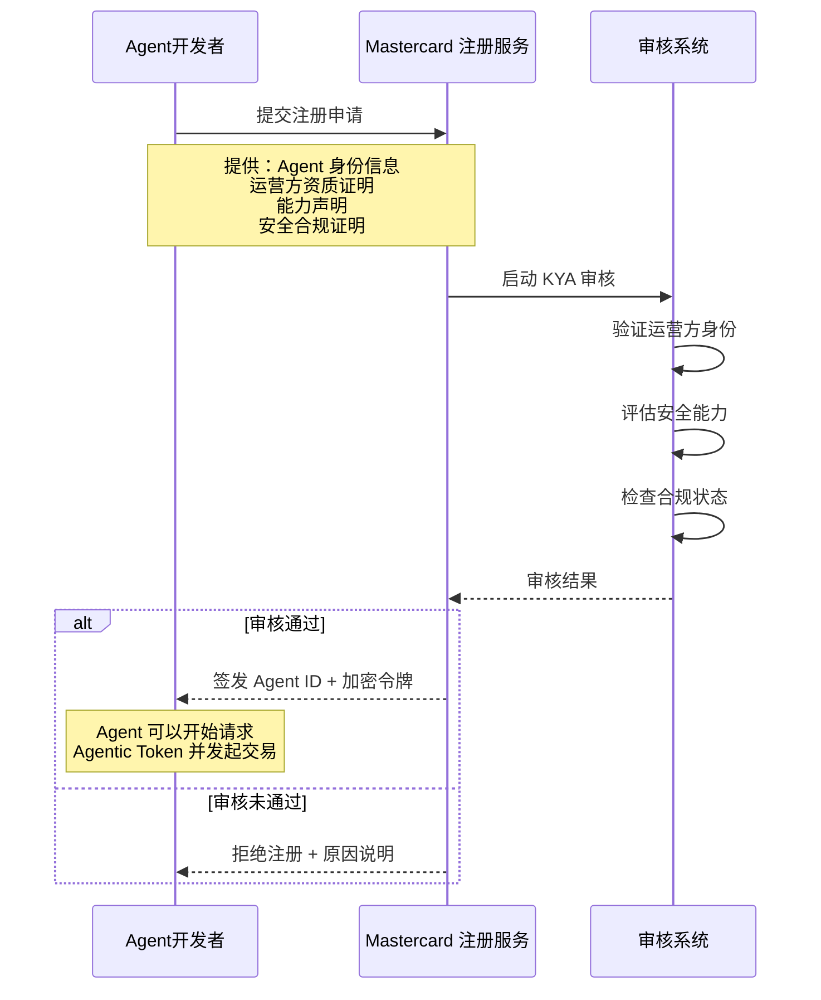
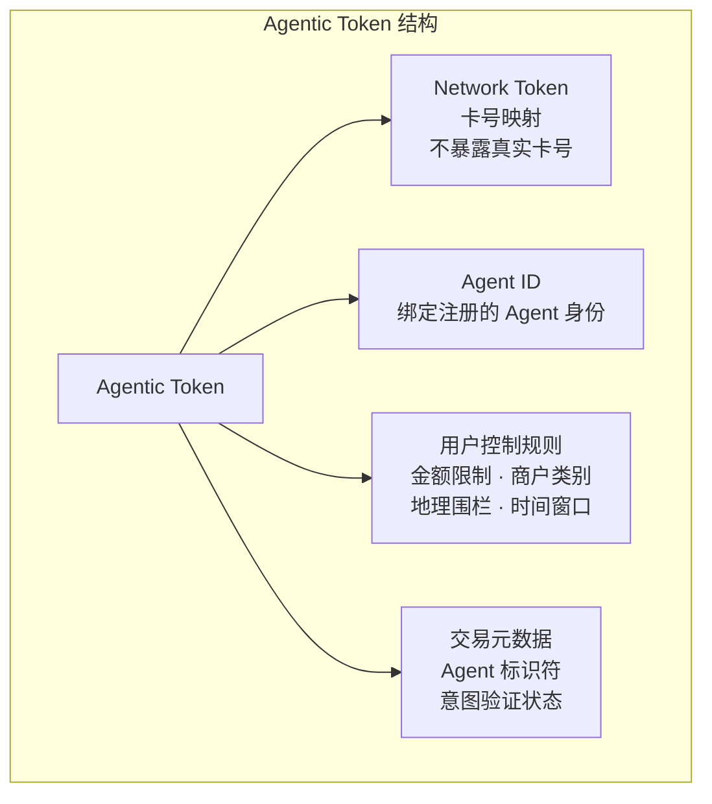
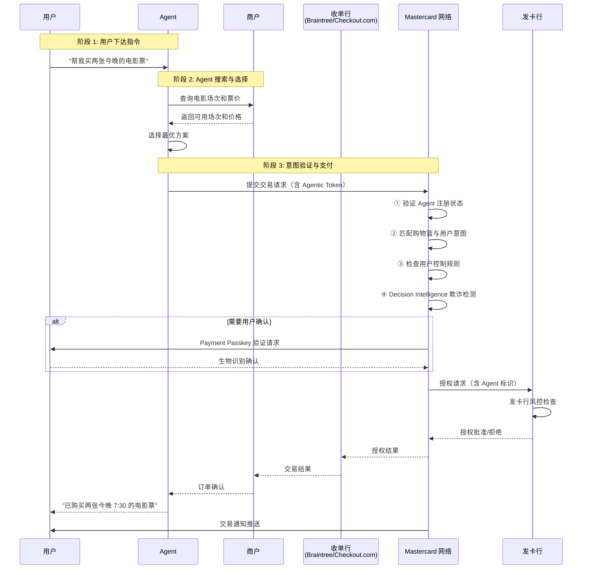
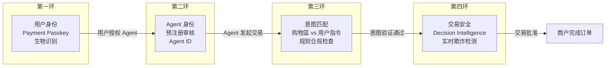
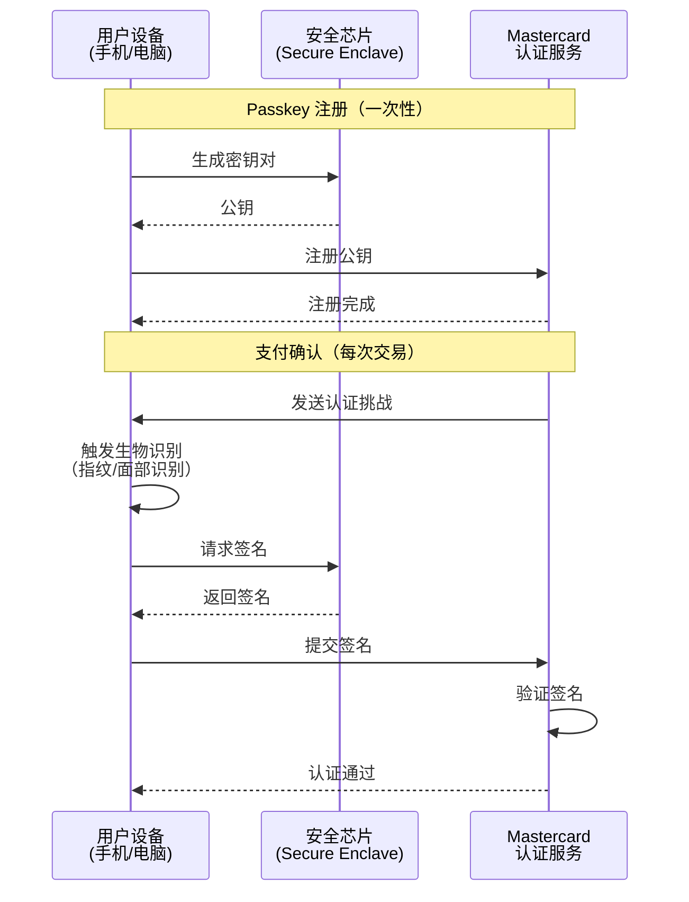
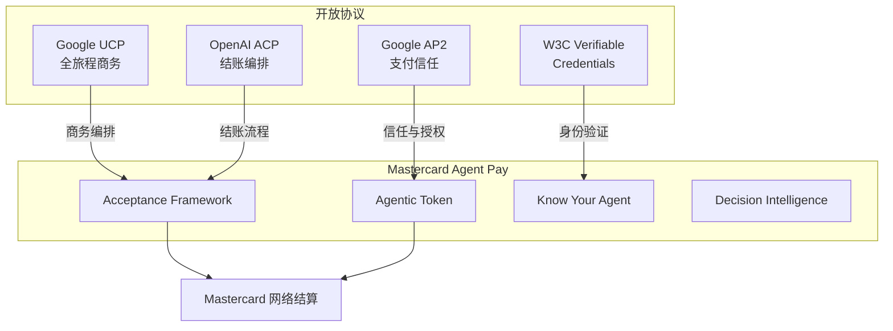
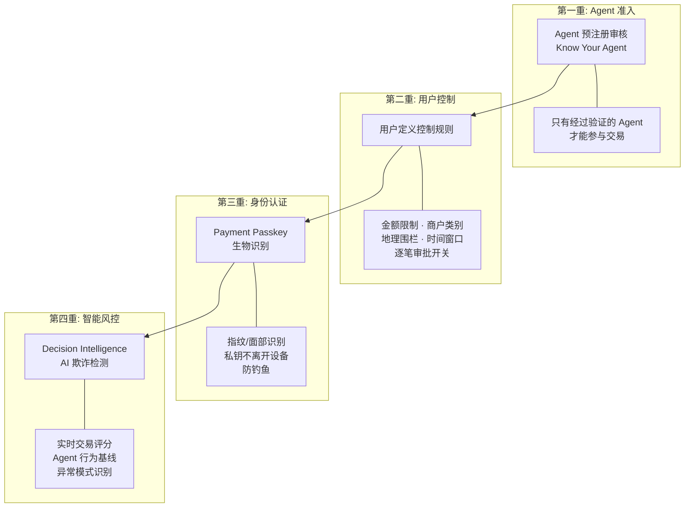
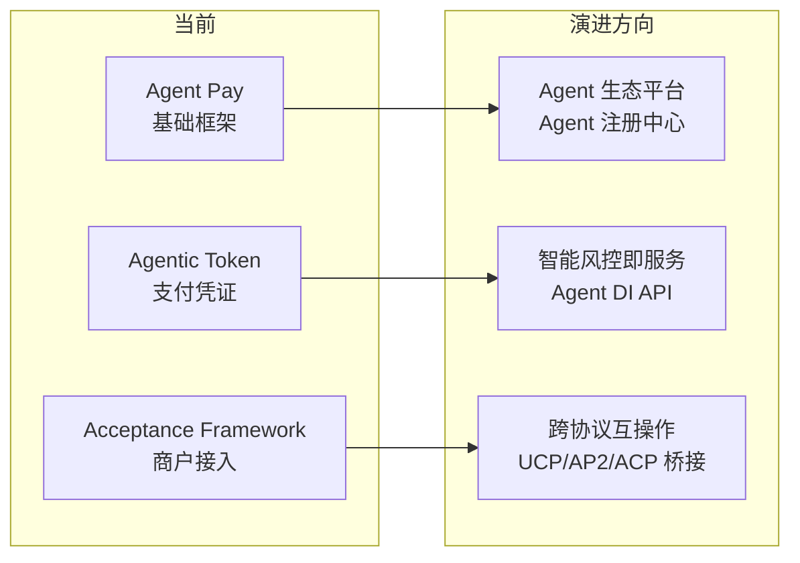

# Mastercard Agent Pay 深度研究报告

> 本报告是 Agentic Payment 系列研究的子报告之一，聚焦 Mastercard 的 Agent Pay 计划及其 Agentic Token 技术体系。
> 总览报告见 [agentic_payment_research.md](../agentic_payment_research.md)。
> 信息来源：[Mastercard Agent Pay 官方页面](https://www.mastercard.com/global/en/business/artificial-intelligence/mastercard-agent-pay.html)、[Mastercard Investor Relations](https://investor.mastercard.com/investor-news/investor-news-details/2025/Mastercard-Unveils-Agent-Pay-Pioneering-Agentic-Payments-Technology-to-Power-Commerce-in-the-Age-of-AI/default.aspx)、[PPC Land 深度分析](https://ppc.land/mastercard-bets-future-payments-run-through-ai-agents-instead-of-people/)、[SmartCompany 澳洲试点报道](https://www.smartcompany.com.au/artificial-intelligence/mastercard-agent-pay-ai-maincode/)、[Europe Says 澳洲首笔交易报道](https://www.europesays.com/2739546/) 等。内容经过改写以符合版权要求。

## 1. 概述 (Overview)

Mastercard Agent Pay 是 Mastercard 于 2025 年 4 月发布的 Agentic Payment 计划，旨在让 AI Agent 能够代表消费者和企业安全地发起、验证和完成支付交易。与 Visa 的 TAP 协议侧重于 Agent 身份验证的 HTTP 签名机制不同，Mastercard 选择了一条更偏向"中心化注册 + 代币化"的路径：**Agent 必须先注册、再验证、才能交易**。

Agent Pay 的核心理念是将 Mastercard 已有的代币化（Tokenization）基础设施扩展到 AI Agent 场景，通过签发专用的 Agentic Token，让 Agent 在不暴露用户真实卡号的前提下完成支付。同时，通过 Agent 预注册审核、用户定义控制规则、Payment Passkey 生物识别认证和 Decision Intelligence AI 欺诈检测四重保障，构建完整的 Agent 支付信任链。

关键差异化特征：

- **卡网络原生**：构建在 Mastercard 全球卡网络之上，复用现有代币化和风控基础设施
- **Agent 预注册制**：所有参与交易的 Agent 必须通过 Mastercard 审核注册，获得 Agent ID
- **Agentic Token**：专为 Agent 设计的支付令牌，封装卡号映射 + Agent ID 绑定 + 用户规则
- **用户定义控制**：消费者通过发卡行 App 设定单笔限额、月度总额、商户类别、地理围栏等精细规则
- **Payment Passkey**：与 FIDO Alliance 合作，基于生物识别（指纹/面部）的支付确认机制
- **Decision Intelligence**：AI 驱动的实时欺诈检测，专门针对 Agent 交易模式优化
- **向后兼容**：商户无需大规模改造系统，现有接受 Mastercard Token 的商户可直接支持 Agentic Token

### Mastercard Agent Pay 在 Agentic Commerce 技术栈中的位置

```
┌─────────────────────────────────────────────────────────────┐
│                    商务编排层                                  │
│  ACP (OpenAI+Stripe)        UCP (Google)                     │
│  结账流程编排                全旅程商务标准                      │
├─────────────────────────────────────────────────────────────┤
│                    信任与授权层                                │
│  AP2 (Google)               Mastercard Agent Pay             │
│  支付信任与授权              Agent 注册 + Agentic Token         │
│  Mandate + VC               预注册审核 + Payment Passkey       │
├─────────────────────────────────────────────────────────────┤
│                    结算层                                     │
│  Visa 卡网络    Stripe PSP    x402 链上结算    Mastercard 网络  │
└─────────────────────────────────────────────────────────────┘
```

Agent Pay 的独特定位：**它不重新发明支付流程，而是将 AI Agent 作为"可识别、可治理的参与者"嵌入到现有卡网络信任体系中**。商户看到的仍然是一笔 Mastercard Token 交易，但附带了额外的 Agent 身份信息和用户意图验证数据。


## 2. 问题定义与背景 (Problem Definition & Context)

### 2.1 问题是什么

当 AI Agent 代替人类发起支付时，传统支付系统面临四个核心失败点：

```
Agent 支付的四大失败点（Mastercard 视角）
├── ① 未验证的 Agent 执行欺诈购买
│   ├── 任何人都可以声称自己是"AI Agent"
│   ├── 没有标准化的 Agent 身份验证机制
│   └── 恶意 Bot 可以伪装成合法 Agent
├── ② 不兼容的技术标准导致商户接入碎片化
│   ├── 每个 AI 平台构建自己的集成方案
│   ├── 商户需要为每个 Agent 平台做定制开发
│   └── 缺乏通用的数据交换协议
├── ③ 模糊的交易意图引发争议
│   ├── Agent 是否正确理解了用户的购买意图？
│   ├── "买健康零食"被解读为"买羽衣甘蓝片"是否合理？
│   └── 意图验证缺乏标准化机制
└── ④ 未经授权的支付在无用户批准的情况下执行
    ├── Agent 可能在用户不知情的情况下花钱
    ├── 缺乏强制性的用户确认机制
    └── 传统的"点击购买"授权模式不适用于 Agent
```


### 2.2 为什么是 Mastercard？

Mastercard 拥有解决这些问题的独特优势：

| 优势 | 说明 |
|------|------|
| 全球卡网络 | 覆盖全球数十亿张卡和数百万商户的支付网络 |
| 代币化基础设施 | 已为移动支付、Card-on-File、订阅等场景提供成熟的 Token 服务 |
| Decision Intelligence | AI 驱动的实时欺诈检测系统，每年处理数十亿笔交易 |
| Payment Passkey | 与 FIDO Alliance 合作的生物识别认证标准 |
| 商户关系 | 与全球商户、发卡行、收单行的深度合作关系 |
| 监管合规 | 成熟的争议处理、退款和合规框架 |

Mastercard 的核心判断是：**Agent 支付不需要重建支付基础设施，而是需要在现有基础设施上增加 Agent 身份层和意图验证层**。这与 Google AP2 从零构建新的信任框架形成鲜明对比。

### 2.3 行业背景数据

- Adobe Analytics 数据显示，2025 年 Q1 美国零售网站来自生成式 AI 的流量增长了 1,200%
- OpenAI 在 2025 年 4 月达到 8 亿活跃用户，较 2 月的 4 亿翻倍
- PYMNTS Intelligence 数据显示，39% 的美国消费者已使用生成式 AI 进行网购
- McKinsey 预测到 2030 年，Agent 商务可能影响美国 B2C 零售收入 $9000 亿至 $1 万亿
- 澳大利亚研究预测，到 2030 年 Agent 商务可能影响 55% 的消费者交易，价值高达 A$6700 亿


## 3. 核心概念与术语 (Key Concepts & Glossary)

- **Agent Pay** — Mastercard 的 Agentic Payment 计划总称，包含技术框架、商户接入方案和咨询服务
- **Agentic Token** — 专为 AI Agent 设计的支付令牌，基于 Mastercard 现有 Token 能力扩展，封装卡号映射 + Agent ID + 用户规则
- **Agent Registration** (Agent 注册) — Agent 必须通过 Mastercard 审核注册才能参与交易的准入机制
- **Know Your Agent (KYA)** — 类似 KYC（了解你的客户），Mastercard 对 Agent 身份和资质的审核流程
- **Agent Pay Acceptance Framework** — 面向商户的 Agent 交易接受框架，定义商户如何识别和处理 Agent 发起的交易
- **Payment Passkey** — 基于 FIDO 标准的生物识别支付确认机制，替代传统密码和 OTP
- **Decision Intelligence** — Mastercard 的 AI 欺诈检测系统，实时分析交易模式并评估风险
- **Order Intent Verification** (订单意图验证) — 验证 Agent 执行的购买是否符合用户原始意图的机制
- **Consumer Consent** (消费者同意) — 强制性的用户授权确认，确保 Agent 不会在未经许可的情况下花钱
- **Universal Data Exchange Protocol** — Mastercard 提出的通用数据交换协议，使 Agent 可与任何支持该标准的商户通信
- **Agentic Consulting Services** — Mastercard 为发卡行、收单行、商户提供的 Agent 支付接入咨询服务
- **Dynamic Yield** — Mastercard 旗下的个性化引擎，用于 Agent 场景下的个性化推荐
- **Brighterion** — Mastercard 旗下的机器学习平台，用于 Agent 交易的风险评估


## 4. 发展历程 (History & Evolution)



### 关键里程碑详解

**2025 年 4 月 — 首次发布**

Mastercard 在 2025 年 4 月 29 日正式发布 Agent Pay 计划，核心公告包括：
- 引入 Agentic Token 概念，基于现有代币化能力扩展
- 宣布与 Microsoft（Azure OpenAI Service、Copilot Studio）、IBM（watsonx Orchestrate）合作
- 与 Braintree（PayPal）、Checkout.com 合作在收单侧支持 Agentic Token
- 与 Samsung 合作探索设备端 Agent 支付

**2025 年 10 月 — Acceptance Framework 与 Google 合作**

在 NRF（美国零售联合会）大会上，Mastercard 与 Google 联合发布：
- Agent Pay Acceptance Framework 正式上线，定义商户接入标准
- 与 Google Universal Commerce Protocol (UCP) 深度合作
- 将 Agent Pay 的信任原则扩展到 AP2 和 Verifiable Credentials 标准
- Pablo Fourez（Mastercard 首席数字官）："开放、可互操作的协议是 Agent 商务的火花"

**2026 年 1 月 — 澳大利亚首笔实际交易**

Mastercard 在澳大利亚完成了全球首批经过完整认证的 Agent 支付交易：
- CBA（澳大利亚联邦银行）借记卡通过 AI Agent 购买 Event Cinemas 电影票
- Westpac 信用卡通过 AI Agent 预订 Thredbo 滑雪度假村住宿
- AI 由澳大利亚本土 LLM "Matilda"（Maincode 开发）驱动
- 支付通过 IPSI 处理，证明框架可跨不同支付环境和银行运作
- 所有参与方（发卡行、商户、银行）都能看到这是一笔 Agent 发起的交易


## 5. 业务场景 (Use Cases)

### 消费者场景

| 场景 | 描述 | Agent Pay 的作用 |
|------|------|-----------------|
| 智能购物 | 用户告诉 Agent "帮我找 $200 以内的登山装备"，Agent 跨多个零售商搜索、比价、选择最优方案 | Agentic Token 完成支付，用户通过 Payment Passkey 确认 |
| 委托购买 | 用户设定 "演唱会开票时立刻买两张"，Agent 在用户不在场时自动完成购买 | 用户预设控制规则（金额上限、商户类别），Agent 在规则范围内自主交易 |
| 订阅管理 | Agent 自动管理用户的各类订阅，在更优惠的方案出现时自动切换 | Agentic Token 支持 recurring payment 场景 |
| 电影票/旅行预订 | Agent 搜索电影场次或旅行住宿，找到最优选项后自动预订 | 澳大利亚试点已验证此场景（Event Cinemas + Thredbo） |

### 企业 B2B 场景

| 场景 | 描述 | Agent Pay 的作用 |
|------|------|-----------------|
| 自动采购 | 企业 Agent 根据库存水平自动触发供应商采购 | 虚拟企业 Mastercard Agentic Token，遵守企业消费政策 |
| 跨境供应商管理 | AI Agent 自动从国际供应商处采购，处理汇率和合规 | Token 支持跨境交易，Decision Intelligence 监控异常 |
| 软件许可管理 | Agent 根据实时使用量自动扩缩软件许可 | 预设规则控制最大支出，自动续费和升降级 |

### 商户与发卡行场景

| 场景 | 描述 |
|------|------|
| 商户 Agent 识别 | 商户收到 Agent 发起的订单时，可以看到额外的 Agent 身份标识，知道这是 Agent 交易而非人类直接购买 |
| 个性化 Agent 体验 | 商户识别到 Agent 后，可以提供针对 Agent 优化的产品数据和定价 |
| 发卡行风控 | 发卡行在授权请求中看到 Agent 信息，可以应用专门的 Agent 交易风控规则 |
| 用户可见性 | 用户在银行 App 中可以看到待处理和已完成的"订单意图"，了解 Agent 在做什么 |


## 6. 技术架构 (Technical Architecture)

### 6.1 整体架构




### 6.2 四大核心原则

Mastercard 围绕四个核心原则构建 Agent Pay 架构，每个原则对应一个具体的技术失败点：

| 原则 | 解决的失败点 | 技术实现 |
|------|-------------|---------|
| **Agent 注册与识别** | 未验证的 Agent 执行欺诈购买 | Agent 预注册审核 + 网络令牌审计追踪 |
| **接口标准化** | 不兼容的技术标准导致碎片化 | 通用数据交换协议 + UCP/AP2 兼容 |
| **订单意图验证** | 模糊的交易意图引发争议 | 购物篮数据与用户意图匹配验证 |
| **消费者同意** | 未经授权的支付执行 | Payment Passkey 生物识别 + 用户定义控制规则 |

### 6.3 Agent 注册流程



只有经过注册的 Agent 才能参与 Mastercard 网络中的交易。这种"准入制"与 Visa TAP 的"开放签名验证"形成对比——TAP 允许任何持有有效密钥的 Agent 参与，而 Mastercard 要求 Agent 先通过中心化审核。


### 6.4 Agentic Token 技术细节

Agentic Token 是 Agent Pay 的核心技术创新，基于 Mastercard 现有的代币化能力扩展：



**Agentic Token 与传统 Token 的区别**：

| 维度 | 传统 Network Token | Agentic Token |
|------|-------------------|---------------|
| 用途 | 移动支付、Card-on-File、订阅 | AI Agent 代理支付 |
| 绑定对象 | 设备或商户 | Agent ID + 用户账户 |
| 控制规则 | 商户级别限制 | 用户自定义精细规则 |
| 身份信息 | 持卡人信息 | 持卡人 + Agent 身份 |
| 可见性 | 商户和发卡行 | 商户、发卡行、收单行均可识别 Agent 交易 |
| 审计追踪 | 标准交易日志 | 增强日志（含 Agent ID、意图匹配结果） |

**Token 签发流程**：

1. 用户通过发卡行 App 请求为特定 Agent 启用支付
2. 发卡行触发 Payment Passkey 验证（生物识别）
3. 验证通过后，Mastercard Token Service Provider 签发 Agentic Token
4. Token 绑定用户账户 + Agent ID + 用户定义的控制规则
5. Token 下发给 Agent，Agent 可在规则范围内使用

### 6.5 完整交易流程




### 6.6 信任链模型

Mastercard 的 Agent Pay 构建了一条从用户到 Agent 到商户的完整信任链：



Surin Fernando（Mastercard 产品与解决方案负责人）的描述："我们正在创建一条信任链。所有参与方都能看到这是一笔 Agent 交易，哪个 Agent 参与了，以及客户已经表达了购买意图。"

关键设计原则：
- **如果购物篮数据与用户的订单意图不匹配，交易不会通过**
- 现有的退款和责任框架继续适用，但增加了额外的信心层
- 随着时间推移，用户将能在银行 App 中看到待处理和已完成的"订单意图"


## 7. 技术规范详解 (Technical Deep Dive)

### 7.1 Agent Pay Acceptance Framework

Agent Pay Acceptance Framework 是面向商户的技术框架，于 2025 年 10 月在 NRF 大会上正式发布。其核心设计原则是**向后兼容**——商户无需大规模改造系统即可支持 Agent 交易。

**框架特性**：

| 特性 | 说明 |
|------|------|
| 向后兼容 | 现有接受 Mastercard Token 的商户可直接支持 Agentic Token |
| 协议兼容 | 与 ACP、AP2、UCP 等开放协议兼容 |
| 最小改造 | 商户只需识别授权请求中的 Agent 标识字段 |
| 可选深度集成 | 商户可选择更深度的集成以获得更丰富的 Agent 交互能力 |
| 标准化数据交换 | 定义了 Agent 与商户之间的标准数据格式 |

**商户接入层级**：

```
商户接入 Agent Pay 的三个层级
├── Level 1: 基础接受（零改造）
│   ├── 现有 Mastercard Token 接受能力自动支持 Agentic Token
│   ├── 商户在授权响应中看到 Agent 交易标识
│   └── 适用于：所有现有 Mastercard 商户
├── Level 2: 增强识别（轻量改造）
│   ├── 商户解析 Agent 身份信息和意图验证数据
│   ├── 可针对 Agent 交易应用差异化策略
│   └── 适用于：希望优化 Agent 体验的商户
└── Level 3: 深度集成（完整集成）
    ├── 商户暴露结构化产品数据供 Agent 发现
    ├── 支持 Agent 协商定价和个性化优惠
    ├── 集成 UCP/ACP 等商务协议
    └── 适用于：大型零售商和电商平台
```


### 7.2 Payment Passkey 技术

Payment Passkey 是 Mastercard 与 FIDO Alliance 合作开发的生物识别支付确认机制，是 Agent Pay 中用户授权的核心技术。

**工作原理**：



**与传统认证方式的对比**：

| 维度 | 密码/OTP | 3D Secure | Payment Passkey |
|------|---------|-----------|-----------------|
| 用户体验 | 差（需记忆/输入） | 中（弹窗确认） | 优（指纹/面部一触即过） |
| 安全性 | 低（可被钓鱼/泄露） | 中（可被社工攻击） | 高（私钥不离开设备） |
| Agent 适用性 | 差（Agent 无法输入密码） | 差（Agent 无法处理弹窗） | 优（可在 Agent 流程中触发） |
| 标准 | 无统一标准 | EMVCo 3DS | FIDO2/WebAuthn |

### 7.3 Decision Intelligence 在 Agent 场景中的应用

Decision Intelligence 是 Mastercard 的 AI 欺诈检测系统，在 Agent Pay 中被扩展以处理 Agent 特有的交易模式。

**Agent 交易的特殊风控挑战**：

| 挑战 | 说明 | Decision Intelligence 的应对 |
|------|------|---------------------------|
| 交易模式异常 | Agent 交易频率和模式与人类不同 | 建立 Agent 专属的行为基线模型 |
| 批量交易 | Agent 可能短时间内发起多笔交易 | 区分合法批量操作和恶意刷单 |
| 跨商户行为 | Agent 可能同时在多个商户操作 | 跨商户关联分析，识别异常模式 |
| 意图偏离 | Agent 执行的购买可能偏离用户意图 | 意图匹配评分，标记高偏离交易 |

### 7.4 与开放协议的集成

Mastercard Agent Pay 被设计为与多种开放协议兼容：



**与 Google UCP 的合作**：
- Mastercard 是 UCP 的 20+ 合作伙伴之一
- Agent Pay 的信任原则被扩展到 UCP 框架中
- AP2 的 Verifiable Credentials 与 Mastercard 的 Agent 注册互补
- Pablo Fourez："通过与 Google 和行业伙伴合作，将 Agent Pay 的基础原则扩展到这些协议中"

**与 ACP 的兼容**：
- 商户通过 ACP 处理结账流程时，可使用 Agentic Token 完成支付
- ACP 的 Delegated Payment 规范可与 Agentic Token 配合使用


## 8. 与其他协议/框架对比 (Comparison with Other Protocols)

### 8.1 Mastercard Agent Pay vs Visa TAP 详细对比

两大卡组织在 Agent 支付领域采取了不同但互补的技术路线：

| 维度 | Mastercard Agent Pay | Visa TAP |
|------|---------------------|----------|
| **核心机制** | Agent 预注册 + Agentic Token | HTTP 签名验证 (RFC 9421) |
| **Agent 身份验证** | 中心化注册审核（KYA） | 去中心化密钥签名（Ed25519） |
| **信任模型** | 准入制（先注册后交易） | 签名制（持有有效密钥即可） |
| **用户认证** | Payment Passkey (FIDO) | Passkey (FIDO2) |
| **支付凭证** | Agentic Token（封装卡号+Agent ID+规则） | 限定用途支付令牌 |
| **商户改造** | 最小（现有 Token 接受即可） | 需验证 HTTP 签名 |
| **标准依赖** | FIDO Alliance, Tokenization | RFC 9421, FIDO2, OpenID Connect |
| **欺诈检测** | Decision Intelligence AI | VisaNet 规则引擎 |
| **开放标准** | 兼容 UCP/AP2/ACP | 与 Cloudflare 联合开发 |
| **试点状态** | 美国已上线，澳洲/拉美已完成首笔交易 | 美国试点中，亚太 2026 初 |
| **合作伙伴** | Microsoft, IBM, Samsung, Google | Cloudflare, Perplexity, OpenAI |


**核心差异分析**：

1. **准入制 vs 签名制**：Mastercard 要求 Agent 先通过中心化审核才能交易，类似"驾照制度"；Visa 允许任何持有有效密钥的 Agent 参与，类似"护照制度"。Mastercard 的方式更安全但可能限制创新速度，Visa 的方式更开放但依赖签名验证的可靠性。

2. **商户改造成本**：Mastercard 的向后兼容设计使商户几乎零改造即可支持 Agent 交易；Visa TAP 要求商户实现 RFC 9421 签名验证逻辑，改造成本更高但获得更丰富的 Agent 身份信息。

3. **技术开放度**：Visa TAP 基于开放标准（RFC 9421）构建，技术规范公开详细；Mastercard Agent Pay 更偏向商业框架，技术细节相对封闭。

### 8.2 与所有协议的全面对比

| 维度 | Mastercard Agent Pay | Visa TAP | AP2 (Google) | ACP (OpenAI+Stripe) | x402 (Coinbase) |
|------|---------------------|----------|-------------|---------------------|-----------------|
| 核心定位 | 卡网络 Agent 信任框架 | 卡网络 Agent 身份协议 | 支付信任与授权 | 结账流程编排 | 链上即时结算 |
| Agent 身份 | 预注册 + Agent ID | Ed25519 密钥签名 | A2A Agent Card + VC | 无独立 Agent 身份层 | 钱包地址 |
| 用户授权 | Payment Passkey | Passkey (FIDO2) | Mandate + VC 签名 | Stripe Checkout UI | 钱包私钥签名 |
| 支付凭证 | Agentic Token | 限定用途令牌 | 支付方式无关 | Delegated Vault Token | 链上交易签名 |
| 商户改造 | 最小（零改造可用） | 中（需签名验证） | 中（需 Mandate 验证） | 低（保留 Stripe 集成） | 低（HTTP 层原生） |
| 去中心化 | 低（中心化注册） | 中（开放标准+中心化密钥） | 中（开放但需 VC 基础设施） | 低（依赖 Stripe） | 高（链上结算） |
| 生产就绪 | ✅ 已上线 | ⚠️ 试点中 | ⚠️ 早期采用 | ✅ 已上线 | ⚠️ 规模化中 |
| 微支付支持 | ❌ 不适合 | ❌ 不适合 | ⚠️ 有限 | ⚠️ 有限 | ✅ 原生支持 |
| 人不在场 | ✅ 用户定义控制规则 | ✅ 预设规则 | ✅ Human-Absent Mandate | ⚠️ 需预获取 Token | ✅ 钱包自动签名 |


## 9. 安全模型 (Security Model)

### 9.1 四重安全保障



### 9.2 用户控制规则详解

用户通过发卡行 App 可以设定的控制规则：

| 规则类型 | 示例 | 说明 |
|---------|------|------|
| 单笔限额 | $500 | Agent 单次交易不能超过此金额 |
| 月度总额 | $2,000 | Agent 当月累计消费不能超过此金额 |
| 商户类别 | 仅零售、餐饮 | Agent 只能在指定商户类别消费 |
| 地理限制 | 仅美国 | Agent 只能在指定地区的商户消费 |
| 时间窗口 | 工作日 9:00-18:00 | Agent 只能在指定时间段内交易 |
| 逐笔审批 | 开启/关闭 | 是否要求每笔交易都需用户确认 |
| 特定商户 | 白名单/黑名单 | 允许或禁止特定商户 |

### 9.3 争议处理与责任归属

Mastercard 明确表示，现有的退款和责任框架继续适用于 Agent 交易，但增加了额外的信心层：

- **审计追踪**：每笔 Agent 交易都记录了 Agent ID、用户意图、购物篮匹配结果和授权链
- **责任不变**：商户和发卡行的现有责任分配不因 Agent 参与而改变
- **增强信心**：因为知道是 Agent 交易、知道哪个 Agent、知道用户意图已验证，争议处理更高效
- **Decision Intelligence 辅助**：AI 模型可以帮助判断 Agent 是否在授权范围内行动


## 10. 开发者体验 (Developer Experience)

### 10.1 开发者接入路径

Mastercard 为不同角色提供了差异化的接入路径：

| 角色 | 接入方式 | 所需工作 |
|------|---------|---------|
| **Agent 开发者** | Agent 注册 API | 提交注册申请，通过审核后获得 Agent ID 和 Token 请求能力 |
| **商户** | Acceptance Framework | Level 1 零改造；Level 2/3 按需集成 |
| **发卡行** | Agentic Token 服务 | 集成 Token 签发和用户控制规则管理 |
| **收单行** | 现有 Token 处理 | 识别 Agentic Token 中的 Agent 标识字段 |

### 10.2 Agentic Consulting Services

Mastercard 提供专业咨询服务帮助生态参与者快速接入：

- **发卡行咨询**：帮助银行在 App 中集成用户控制规则管理和 Payment Passkey
- **商户咨询**：帮助零售商优化产品数据结构以提升 Agent 可发现性
- **Agent 平台咨询**：帮助 AI 平台完成 Agent 注册和 Token 集成
- **合规咨询**：帮助各方理解 Agent 交易的监管要求和责任归属

### 10.3 与现有工具的集成

| 集成方 | 集成方式 | 状态 |
|--------|---------|------|
| Microsoft Azure OpenAI | Agent Pay SDK 集成到 Azure OpenAI Service | 已合作 |
| Microsoft Copilot Studio | Copilot 中嵌入 Agent Pay 支付能力 | 已合作 |
| IBM watsonx Orchestrate | 企业 Agent 工作流中集成 Agentic Token | 已合作 |
| Braintree (PayPal) | 收单侧 Agentic Token 处理 | 已集成 |
| Checkout.com | 收单侧 Agentic Token 处理 | 已集成 |
| Samsung | 设备端 Agent 支付探索 | 合作中 |


## 11. 商业模式 (Business Model)

### 11.1 Mastercard 的收入模式

Agent Pay 延续了 Mastercard 作为支付网络的传统商业模式，同时开辟了新的收入来源：

| 收入来源 | 说明 |
|---------|------|
| 交易手续费 | Agent 交易走 Mastercard 网络，产生标准的网络交换费 |
| Token 服务费 | Agentic Token 的签发和管理可能产生额外的 Token 服务费 |
| 咨询服务费 | Agentic Consulting Services 为发卡行、商户、Agent 平台提供付费咨询 |
| 数据与分析 | Agent 交易数据的匿名化分析和洞察服务 |
| Decision Intelligence | 增强的 Agent 风控服务可能作为增值服务收费 |

### 11.2 生态参与者的价值

| 参与者 | 获得的价值 |
|--------|-----------|
| **消费者** | 更便捷的购物体验，Agent 代劳日常购买，同时保持完全控制 |
| **商户** | 新的销售渠道（Agent 渠道），无需大规模改造即可接入 |
| **发卡行** | 保持在支付链中的位置，获得 Agent 交易的可见性和风控能力 |
| **收单行** | 通过现有 Token 处理能力支持 Agent 交易，无需额外投资 |
| **Agent 平台** | 获得可信的支付能力，提升 Agent 的商业价值 |

### 11.3 市场规模预测

- McKinsey 预测 Agentic Commerce 经济价值潜力达 **$3-5 万亿**
- 到 2030 年 AI 驱动的商务交易规模预计达 **$5000 亿**
- 澳大利亚市场预测 Agent 商务到 2030 年可能影响 55% 的消费者交易，价值 **A$6700 亿**
- PYMNTS Intelligence 预测 2025 年 Agent AI 将处理 20% 的电商任务


## 12. 挑战与风险 (Challenges & Risks)

### 12.1 技术挑战

| 挑战 | 说明 | 影响 |
|------|------|------|
| 意图理解准确性 | Agent 可能误解用户的购买意图 | 导致错误购买和争议 |
| 跨平台互操作 | 不同 Agent 平台的集成标准不统一 | 碎片化的商户体验 |
| 实时性要求 | Agent 交易需要毫秒级的验证和授权 | 对基础设施性能要求高 |
| 规模化挑战 | 当数百万 Agent 同时交易时的系统负载 | 需要弹性扩展能力 |

### 12.2 商业挑战

| 挑战 | 说明 |
|------|------|
| 消费者信任 | 90% 的澳大利亚消费者对 AI 购物仍有隐私顾虑 |
| 商户接受度 | 部分商户可能抵制 Agent 交易（如澳大利亚零售商的反对声音） |
| 竞争格局 | Visa TAP、Google AP2、OpenAI ACP 等多方竞争 |
| 标准碎片化 | 多个协议并存可能导致市场碎片化 |

### 12.3 监管风险

| 风险 | 说明 |
|------|------|
| 责任归属不清 | Agent 做出错误决策时，消费者、Agent 平台、商户的责任如何划分？ |
| 跨境合规 | 不同国家对 AI 交易的监管要求不同（如欧盟 SCA 要求） |
| 数据隐私 | Agent 收集和处理用户数据的合规性（GDPR 等） |
| 反洗钱 | Agent 交易是否需要额外的 KYC/AML 检查？ |

### 12.4 与 Amazon 封闭生态的竞争

Amazon 在 2025 年 11 月部署了自己的 Agent 购物能力（Buy for Me + Rufus），同时封锁了竞争对手的 AI Agent 访问其市场。这种封闭策略与 Mastercard 的开放协议方式形成直接冲突：

- Amazon 保护其 $560 亿年广告收入，阻止第三方 Agent 帮助消费者在 Amazon 之外发现产品
- Mastercard 和 Google 推动开放协议，使任何 Agent 可以与任何商户交易
- 这种"开放 vs 封闭"的竞争将持续影响 Agent 商务的发展方向


## 13. 未来展望 (Future Outlook)

### 13.1 短期（2026）

- **全球覆盖加速**：继美国、澳大利亚、拉美之后，向欧洲和亚太更多市场扩展
- **商户接入深化**：从 Level 1（零改造）向 Level 2/3（增强集成）推进
- **协议融合**：与 Google UCP、AP2 的技术集成进一步深化
- **用户体验优化**：银行 App 中的 Agent 交易管理界面完善

### 13.2 中期（2027-2028）

- **Agent 交易主流化**：Agent 发起的交易占比显著增长
- **B2B 场景爆发**：企业采购、供应链管理中的 Agent 支付规模化
- **监管框架明确**：各国对 Agent 交易的监管要求逐步清晰
- **Decision Intelligence 进化**：AI 风控模型针对 Agent 交易模式持续优化

### 13.3 长期（2029-2030）

- **Agent 经济成熟**：Agent 成为主要的商务交互界面之一
- **标准统一**：行业在 Agent 身份验证和支付授权方面形成统一标准
- **新商业模式**：Agent 间协议费、对话式市场等新货币化模式成熟
- **全球 $5000 亿交易规模**：Agent 驱动的商务交易达到预测规模

### 13.4 Mastercard 的战略方向




## 14. 总结 (Summary)

Mastercard Agent Pay 代表了传统卡组织应对 AI Agent 商务浪潮的务实路径。与 Visa TAP 的开放标准签名方案不同，Mastercard 选择了"中心化注册 + 代币化扩展"的策略，最大化复用现有基础设施，最小化商户改造成本。

**核心优势**：
- 向后兼容性极强，现有商户零改造即可支持
- 四重安全保障（注册 + 控制 + Passkey + DI）构建完整信任链
- 已在美国、澳大利亚、拉美完成实际交易验证
- 与 Google UCP/AP2 深度合作，拥抱开放协议生态

**核心挑战**：
- 中心化注册制可能限制 Agent 生态的创新速度
- 技术规范相对封闭，不如 Visa TAP 的 RFC 9421 标准透明
- 消费者信任和商户接受度仍需时间建立
- 多协议并存的碎片化风险

**关键洞察**：Mastercard 和 Visa 在 Agent 支付领域殊途同归——两者都采用"Agent 身份验证 + 限定令牌 + 用户生物识别"的三重保障，但 Mastercard 更偏向中心化治理（准入制），Visa 更偏向去中心化验证（签名制）。最终，两者很可能共存互补，就像它们在传统支付领域的关系一样。

> 材料来源：Mastercard 官方公告、PPC Land 深度分析、SmartCompany 澳洲试点报道、Europe Says 澳洲首笔交易报道、Agentic Commerce Agency 产品分析。Content was rephrased for compliance with licensing restrictions.
