# Agentic Commerce 总览研究报告

> 本报告是 Agentic Payment 系列研究的总览报告，综合分析 AI Agent 驱动的商务支付生态全景。
> 子报告索引：
> - [Google UCP 研究报告](1.google_ucp/google_ucp_research.md)
> - [OpenAI + Stripe ACP 研究报告](2.openai_strip_acp/openai_stripe_acp_research.md)
> - [Amazon Buy for Me 研究报告](3.amazon_payforme/amazon_buyforme_research.md)
> - [Google AP2 研究报告](4.google_ap2/google_ap2_research.md)
> - [Coinbase x402 研究报告](5.conibase_x402/coinbase_x402_research.md)
> - [Visa TAP 研究报告](6.visa_tap/visa_tap_research.md)
> - [Mastercard Agent Pay 研究报告](7.mastercard_agent_pay/mastercard_agent_pay_research.md)
> - [Agentic Commerce 欺诈与风控研究报告](10.fraud_risk_control/agentic_fraud_risk_research.md)

---

## 1. 概述 (Overview)

### 1.1 电商现状与 AI Agent 的崛起

过去二十年，电子商务围绕一个核心假设构建：**人类坐在屏幕前，用眼睛浏览、用手指点击、用键盘输入信用卡号**。从 HTML 表单到单页应用，从 PC 端到移动端，交互形态在变，但"人类操作浏览器"这一前提从未被质疑。

2024-2025 年，AI Agent 的能力跨过了一个关键门槛——它们不再只是回答问题的聊天机器人，而是能够**自主规划、执行多步骤任务**的智能体。当 Amazon Rufus 在 2024 年为用户推荐商品并在 2025 年创造了 **120 亿美元增量销售**时，行业意识到：AI Agent 不仅能影响购买决策，它们即将**代替人类执行购买行为本身**。

这就是 Agentic Commerce（代理商务）——AI Agent 代替人类自主发现商品、比较选项、发起授权和完成支付交易的新兴商务范式。

### 1.2 Agent 参与商务的根本性挑战

问题在于：**整个电商技术栈都是为人类设计的，Agent 无法直接使用**。

```
传统电商                              Agentic Commerce
─────────                            ─────────────────
人类浏览网页 → 发现商品                Agent 如何发现商品？没有标准化的机器可读目录
人类比较价格 → 做出决策                Agent 如何证明决策符合用户意图？
人类点击购买 → 隐含授权                Agent 没有"点击"，如何证明用户授权？
人类填写卡号 → 完成支付                Agent 没有信用卡，如何安全支付？
商户看到人类 → 信任交易                商户看到 Agent 请求，如何区分合法 Agent 和恶意 Bot？
```

这五个断裂点——发现、意图、授权、支付、信任——构成了 Agentic Commerce 的核心技术挑战。2025 年 AI 流量涌入零售网站，增幅超过 **4,700%**，商户的传统风控系统将 Agent 行为大量误判为 Bot 攻击，问题已经从理论变成了现实。

### 1.3 行业如何回应——三条技术路径

面对这些挑战，行业在 2025-2026 年间沿三条路径同时推进：

**路径一：开放协议派** — 像 HTTP/TCP 一样，为 Agent 商务定义开放标准，任何人可实现
- Google 主导 AP2（信任授权）、UCP（全旅程编排）
- Coinbase 主导 x402（链上即时结算）
- OpenAI + Stripe 主导 ACP（结账流程编排）

**路径二：卡网络扩展派** — 在现有 Visa/Mastercard 基础设施上叠加 Agent 能力层
- Visa TAP：RFC 9421 HTTP 签名验证 Agent 身份
- Mastercard Agent Pay：Agent 预注册 + Agentic Token

**路径三：平台封闭派** — 端到端控制，用户无需关心底层细节
- Amazon Buy for Me：在 Amazon 生态内完成 Agent 代理购买

这三条路径并非完全互斥——它们在不同层次解决不同问题，存在显著的互补性（详见第 7 章）。但它们背后代表了截然不同的商业哲学：**开放 vs 平台主导 vs 封闭**，这场路线之争将决定 Agentic Commerce 的最终形态。

### 1.4 七大方案全景

截至 2026 年 2 月，行业已形成 **三大开放协议 + 两大卡组织框架 + 一个封闭生态 + 一个统一标准** 的格局：

#### 1.4.1 开放协议

| 协议 | 主导方 | 核心定位 | 发布时间 | 生产状态 |
|------|--------|---------|---------|---------|
| **ACP** (Agentic Commerce Protocol) | OpenAI + Stripe | 结账流程编排 | 2025-06 | ✅ 已上线（ChatGPT Instant Checkout） |
| **AP2** (Agent Payments Protocol) | Google | 支付信任与授权 | 2025-09 | 🔶 早期采用（60+ 合作伙伴） |
| **x402** | Coinbase | HTTP 原生链上结算 | 2025-05 | ✅ 规模化中（1500 万+ 笔交易） |

#### 1.4.2 卡组织框架

| 框架 | 主导方 | 核心定位 | 发布时间 | 生产状态 |
|------|--------|---------|---------|---------|
| **Visa Intelligent Commerce + TAP** | Visa | 卡网络原生 Agent 信任 | 2025-04/10 | 🔶 试点中（美国/亚太/欧洲） |
| **Mastercard Agent Pay** | Mastercard | Agent 注册 + Agentic Token | 2025-04 | ✅ 已上线（美国/澳洲/拉美） |

#### 1.4.3 封闭生态

| 产品 | 主导方 | 核心定位 | 发布时间 | 生产状态 |
|------|--------|---------|---------|---------|
| **Buy for Me** | Amazon | 垂直整合 Agent 购物 | 2025-04 | ✅ 已上线（美国，50 万+ 商品） |

#### 1.4.4 统一标准

| 标准 | 主导方 | 核心定位 | 发布时间 | 生产状态 |
|------|--------|---------|---------|---------|
| **UCP** (Universal Commerce Protocol) | Google | 全旅程商务标准 | 2026-01 | 🔶 早期阶段（20+ 合作伙伴） |

此外，**A2A** (Agent-to-Agent Protocol) 作为 Google 主导的 Agent 间通信基础协议，是 AP2 和 UCP 的底层依赖。

#### 1.4.5 技术栈全景

```
┌─────────────────────────────────────────────────────────────────┐
│                      统一商务标准层                                │
│  UCP (Google) — 全旅程商务标准（发现→结账→售后）                    │
├─────────────────────────────────────────────────────────────────┤
│                      商务编排层                                   │
│  ACP (OpenAI+Stripe)              Amazon Buy for Me              │
│  结账流程编排                      垂直整合 Agent 购物              │
├─────────────────────────────────────────────────────────────────┤
│                      信任与授权层                                  │
│  AP2 (Google)        TAP (Visa)        Mastercard Agent Pay      │
│  Mandate + VC        三层签名          Agent 注册 + Agentic Token  │
├─────────────────────────────────────────────────────────────────┤
│                      通信层                                       │
│  A2A (Google)                    MCP (Anthropic)                  │
│  Agent 间通信                    模型上下文协议                     │
├─────────────────────────────────────────────────────────────────┤
│                      结算层                                       │
│  Visa 卡网络    Mastercard 网络    Stripe PSP    x402 链上结算     │
└─────────────────────────────────────────────────────────────────┘
```

---

## 2. 问题定义 (Problem Definition)

> 第 1 章概述了 Agent 参与商务的五个断裂点。本章进一步拆解每个挑战的技术细节，以及各方案如何分别回应。

### 2.1 五大挑战详解

```
Agentic Commerce 的五大核心挑战
├── ① 发现问题：Agent 如何找到商品和服务？
│   ├── 商户数据格式各异，Agent 无法高效跨平台搜索
│   ├── 没有标准化的"机器可读商品目录"
│   └── UCP 和 ACP Product Feed 分别尝试解决此问题
├── ② 信任问题：商户如何区分合法 Agent 和恶意 Bot？
│   ├── AI 流量涌入零售网站，增幅超 4,700%
│   ├── 传统风控系统将 Agent 行为误判为 Bot 攻击
│   └── TAP、AP2、Mastercard Agent Pay 分别提出信任方案
├── ③ 授权问题：如何证明 Agent 花钱是用户的真实意愿？
│   ├── "人类点击购买按钮"的隐含授权前提不再成立
│   ├── Agent 可能因 AI 幻觉错误理解用户意图
│   └── AP2 Mandate、Mastercard Payment Passkey 提供授权证明
├── ④ 支付问题：Agent 没有信用卡，如何完成支付？
│   ├── Agent 无法填写结账表单
│   ├── 需要安全的委托支付机制
│   └── ACP SPT、Visa Token、Mastercard Agentic Token、x402 稳定币
└── ⑤ 集成问题：N×N 集成复杂度如何解决？
    ├── 每个 Agent 平台 × 每个商户 = 指数级集成成本
    ├── UCP 将 N×N 简化为 1×N
    └── 开放标准 vs 封闭生态的路线之争
```

### 2.2 为什么是现在？

2025-2026 年 Agentic Commerce 集中爆发并非偶然：

| 驱动因素 | 说明 |
|---------|------|
| AI Agent 能力成熟 | 2025 年 AI Agent 已能影响大规模购买决策，缺少的最后一步是执行 |
| 商业利益驱动 | Amazon Rufus 2025 年创造 120 亿美元增量销售，证明了 Agent 商务的商业价值 |
| 支付基础设施就绪 | Visa TAP、Mastercard Agent Pay 等 Agent 支付基础设施在 2025 年建立 |
| 避免碎片化竞争 | 多方同时推出标准，争夺 Agentic Commerce 的"TCP/IP 时刻" |
| 监管压力 | 欧盟 AI Act、PSD3 等法规要求 Agent 交易具备可审计性和透明度 |

### 2.3 七大方案如何应对五大挑战

下表展示每个方案对五大挑战的回应方式。✅ 表示该方案直接解决此挑战，🔗 表示通过与其他协议组合间接解决，❌ 表示未覆盖或不适用。

| 挑战 → | ① 发现 | ② 信任 | ③ 授权 | ④ 支付 | ⑤ 集成 |
|--------|--------|--------|--------|--------|--------|
| **UCP** | ✅ Discovery Manifest<br/>`/.well-known/ucp` 标准化商品目录 | 🔗 依赖 AP2/TAP 提供信任层 | 🔗 通过 AP2 Mandate Extension | 🔗 支付方式中立，通过扩展接入 | ✅ 四种传输协议统一 N×N → 1×N |
| **ACP** | ✅ Product Feed 规范<br/>标准化商品数据格式 | 🔗 依赖 Stripe 平台信任 | ✅ SPT 四重约束<br/>（商户+金额+时间+单次） | ✅ Delegated Payment<br/>Stripe 代扣 | ✅ Stripe SDK 统一接入 |
| **Buy for Me** | ✅ Amazon 自有商品索引<br/>+ 爬取第三方网站 | ❌ 封闭平台内部信任<br/>无标准化机制 | ❌ 粗粒度点击确认<br/>28% 退单率反映意图理解不足 | ✅ Amazon 账户绑卡<br/>平台内闭环 | ❌ 封闭生态<br/>仅限 Amazon 平台 |
| **AP2** | ❌ 不涉及商品发现 | ✅ W3C VC 去中心化验证<br/>五种角色分离 | ✅ Mandate 三层机制<br/>Intent → Cart → Payment | 🔗 支付方式中立<br/>可接 x402 或卡网络 | 🔗 通过 UCP 统一编排 |
| **x402** | ❌ 不涉及商品发现 | ✅ 钱包地址即身份<br/>链上余额即信用 | ❌ 仅钱包签名<br/>无精细授权控制 | ✅ HTTP 402 链上即时结算<br/>USDC ~2 秒 | ✅ HTTP 中间件<br/>5 分钟集成 |
| **Visa TAP** | ❌ 不涉及商品发现 | ✅ RFC 9421 三层签名<br/>Agent + 消费者 + 支付 | ✅ FIDO2/Passkey<br/>生物识别确认 | ✅ Visa Token<br/>复用 1.75 亿+ 商户 | ✅ HTTP 头验证<br/>零代码/低代码 |
| **MC Agent Pay** | ❌ 不涉及商品发现 | ✅ Agent 预注册审核<br/>+ Decision Intelligence | ✅ Payment Passkey<br/>+ 规则引擎（限额/类别/围栏） | ✅ Agentic Token<br/>向后兼容现有商户 | ✅ 现有 Token 通道<br/>商户无需改造 |

**关键洞察**：

没有任何单一方案能独立解决全部五大挑战。这解释了为什么协议间的互补组合（详见第 7 章）比单一方案的选择更重要：

```
完整解决方案 = 发现层（UCP/ACP）+ 信任层（AP2/TAP/MC）+ 支付层（x402/卡网络）

示例组合：
• UCP（发现+集成）+ AP2（信任+授权）+ x402（支付）  → 全开放栈
• ACP（发现+支付）+ TAP（信任+授权）               → 平台+卡网络栈
• ACP（发现+支付）+ MC Agent Pay（信任+授权）       → 平台+卡网络栈
```

---

## 3. 发展历程 (History & Evolution)

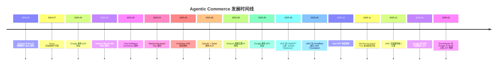

### 关键里程碑

| 时间 | 事件 | 意义 |
|------|------|------|
| 2024-02 | Amazon Rufus Beta | 大型平台首次将 AI Agent 引入购物场景 |
| 2025-04 | A2A / Buy for Me / Visa IC / MC Agent Pay | "Agentic Commerce 月"——四大玩家同月入场 |
| 2025-05 | x402 发布 | 区块链阵营提出 HTTP 原生支付方案 |
| 2025-06 | ACP 发布 | OpenAI+Stripe 定义结账编排标准 |
| 2025-09 | AP2 发布 + ChatGPT Instant Checkout 上线 | 信任层标准确立 + 首个大规模 Agent 购物体验落地 |
| 2025-10 | Visa TAP 发布 | 卡网络巨头推出 Agent 身份验证协议 |
| 2026-01 | UCP 发布 | Google 尝试统一全旅程商务标准 |

---

## 4. 核心概念与术语 (Key Concepts & Glossary)

| 术语 | 定义 |
|------|------|
| **Agentic Commerce** | AI Agent 代替人类自主发现、比较、购买商品的商务范式 |
| **A2B (Agent-to-Business)** | Agent 与商户之间的交易模式 |
| **M2M (Machine-to-Machine)** | 机器与机器之间的自动化交易模式 |
| **Mandate** | AP2 中通过 W3C Verifiable Credentials 实现的加密签名数字合约，证明用户授权意图 |
| **SharedPaymentToken (SPT)** | ACP 中 Stripe 设计的委托支付令牌——商户限定、金额限定、时间限定、一次性使用 |
| **Agentic Token** | Mastercard 为 Agent 设计的专用支付令牌，封装卡号映射 + Agent ID 绑定 + 用户规则 |
| **TAP 三层签名** | Visa TAP 的 Agent 识别签名 + 消费者识别签名 + 支付容器签名，通过 nonce 关联 |
| **x402 Payment Required** | HTTP 协议中沉睡 30 年的状态码，被 Coinbase 激活用于原生支付 |
| **UCP Capability** | UCP 中商户暴露的标准化功能单元（如 Checkout、Order Management） |
| **Discovery Manifest** | UCP 商户发布在 `/.well-known/ucp` 的 JSON 文档，声明支持的能力和端点 |
| **Payment Passkey** | Mastercard 与 FIDO Alliance 合作的生物识别支付确认机制 |
| **Merchant of Record (MoR)** | 交易中承担法律和财务责任的商户实体 |
| **Human-Present / Human-Not-Present** | AP2 的两种交易模式：实时购买 vs 委托任务 |
| **Decision Intelligence** | Mastercard AI 驱动的实时欺诈检测系统 |
| **Embedded Checkout** | 结账 UI 嵌入在 Agent 界面内，用户无需跳转到商户网站 |

---

## 5. 七大方案深度解读

本章逐一介绍 Agentic Commerce 生态中的七大方案，每个方案包含核心架构、关键技术和差异化定位。详细技术分析请参阅各子报告。

### 5.1 Google UCP — 全旅程商务标准

> 详细报告：[Google UCP 研究报告](1.google_ucp/google_ucp_research.md)

**一句话定位**：为 AI Agent 与商务系统之间建立通用语言，覆盖从商品发现到售后的完整购物旅程。

**核心架构**：

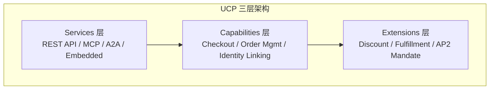

**UCP 五方角色模型**

UCP 生态中有五类核心参与角色，各自承担明确的职责边界。以下用 UML 类图定义角色属性与关系，用用例图展示角色的交互场景。

角色定义（UML 类图）：

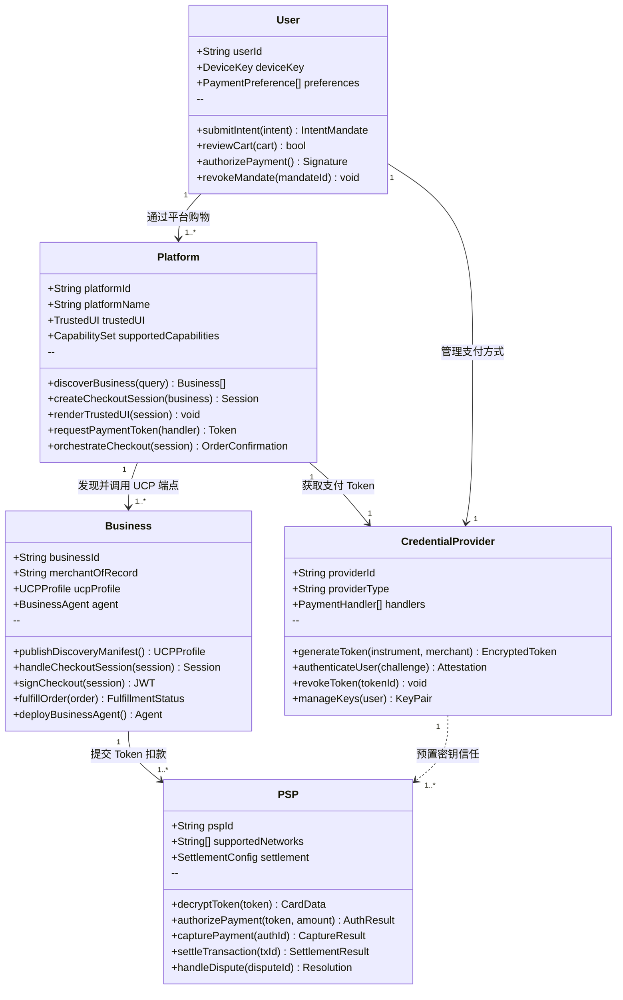

五方角色职责详解：

| 角色 | 核心职责 | 可触及的数据 | 不可触及的数据 | 典型实例 |
|------|---------|------------|-------------|---------|
| **① User（消费者）** | 提交购买意图、审核购物车、在 Trusted UI 中授权支付、签署 Mandate | 自己的意图、支付方式选择、订单详情 | — | 终端用户 |
| **② Platform（平台）** | 面向消费者的入口，提供 Trusted UI，编排结账流程，代表用户发现商户和发起结账 | 商品信息、购物车、加密后的支付 Token | 原始卡号、CVV、用户密码 | Google Search AI Mode、Gemini App、未来的 Copilot 等 |
| **③ Business（商户）** | 暴露 UCP 端点，处理订单，作为 Merchant of Record 承担法律和财务责任，可部署 Business Agent | 商品、价格、Cart Mandate、配送信息 | 原始支付凭证 | Etsy、Wayfair、Shopify 商户 |
| **④ Credential Provider（凭证提供方）** | 管理支付工具，将卡号转换为加密 Token，处理用户认证 | 支付方式、认证数据、设备密钥 | 购物车详情（由商户管理） | Google Pay、Apple Pay、银行数字钱包 |
| **⑤ PSP（支付服务商）** | 解密 Token，发起卡网络授权，处理结算和争议 | Payment Mandate、令牌化凭证、交易金额 | 用户个人信息、购物车详情 | Stripe、Adyen、PayPal |

角色交互场景（UML 用例图）：

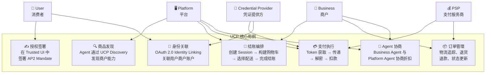

**五方协作的完整交易时序**（Native Checkout + AP2 Mandate）：

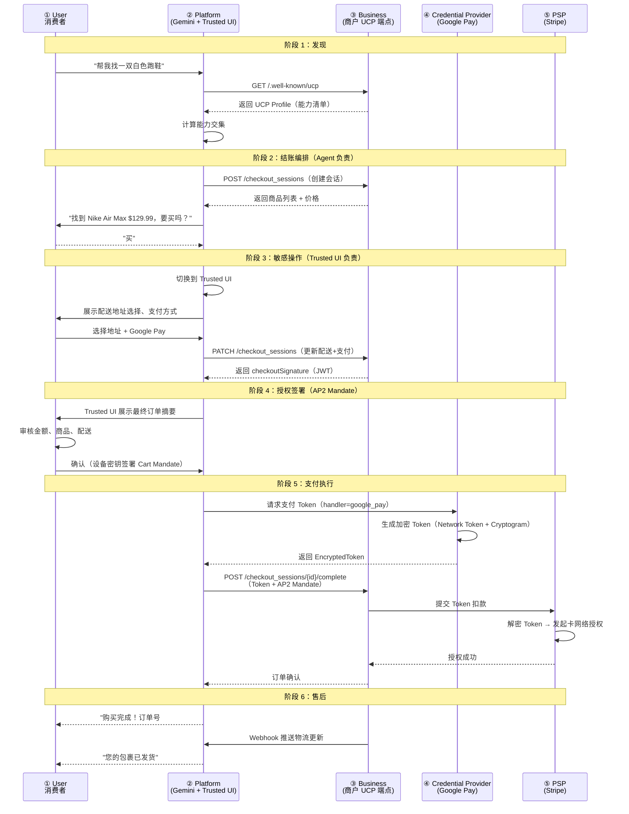

**角色边界的关键设计原则**：

| 原则 | 说明 | 安全价值 |
|------|------|---------|
| **Token 单向流动** | 支付 Token 只能从 Platform → Business → PSP 单向传递，不可反向 | 商户无法获取用户原始支付信息 |
| **Agent 不触碰凭证** | Platform 中的 Agent 组件永远不接触原始支付凭证，只有 Credential Provider 处理 | 即使 Agent 被攻破，支付数据不泄露 |
| **Trusted UI 隔离** | 敏感操作（地址、支付、签署）在 Platform 的 Trusted UI 中完成，Agent 无法干预 | 防止恶意 Agent 伪造确认界面 |
| **Merchant of Record 不变** | Business 始终是交易的法律责任方，Platform 不替代商户角色 | 责任归属清晰，合规链路完整 |
| **凭证提供方独立** | Credential Provider 独立于 Platform 和 Business，可跨平台复用 | 用户换平台时支付方式可迁移 |

**关键技术特征**：

| 维度 | 说明 |
|------|------|
| 发布方 | Google（联合 Shopify、Etsy、Wayfair、Target、Walmart 开发） |
| 发布时间 | 2026 年 1 月 11 日（NRF 大会） |
| 核心解决问题 | N×N 集成复杂度 → 1×N 标准化接入 |
| 传输协议 | REST API、MCP、A2A、Embedded Protocol 四种绑定 |
| 发现机制 | `/.well-known/ucp` Discovery Manifest |
| 支付集成 | 通过 AP2 Mandate Extension 实现支付信任 |
| 商户控制 | 商户始终保留 Merchant of Record 身份 |
| 开放性 | 开源（Apache 2.0） |
| 合作伙伴 | 20+ 全球合作伙伴（Visa、Mastercard、Stripe、Adyen 等） |

**为什么重要**：UCP 是目前唯一尝试覆盖完整商务旅程（发现→结账→售后）的开放标准。如果成功，它将成为 Agentic Commerce 的"HTTP"——所有 Agent 和商户的通用接口层。但其成功高度依赖 Google 生态的推动力和商户的采纳意愿。

**UCP 与 A2A 的结合机制**：

UCP 并非独立运作，而是 Google 协议族（A2A + UCP + AP2）的中间层。三者的分工是：A2A 是管道（Agent 怎么对话），UCP 是语义（对话内容是什么），AP2 是安全锁（谁授权花钱）。

```
Google 协议族分层架构

┌─────────────────────────────────────────────────┐
│  UCP — 商务语义层                                 │
│  定义结账、订单、身份关联等业务操作的标准化语义       │
│  Capabilities: Checkout / Order Mgmt / Identity   │
├─────────────────────────────────────────────────┤
│  AP2 — 信任与授权层                               │
│  通过 Mandate + VC 提供加密授权证明                │
│  在 UCP 中作为 AP2 Mandate Extension 集成          │
├─────────────────────────────────────────────────┤
│  A2A — Agent 间通信层                             │
│  定义 Agent 如何发现彼此、交换消息、协作完成任务     │
│  UCP Capabilities 作为 A2A Extension 被调用        │
└─────────────────────────────────────────────────┘
```

A2A 与 UCP 的结合体现在两个层面：

1. **A2A 是 UCP 四种传输协议之一**：UCP Services 层支持 REST API、MCP、A2A、Embedded Protocol 四种通信绑定。当使用 A2A 绑定时，商户在 `/.well-known/agent-card.json` 发布 Agent Card，AI Agent 通过 A2A 协议与商户 Agent 直接通信，UCP 的 Capabilities 作为 A2A Extension 被调用。

2. **A2A 是 Agent-to-Agent 场景的通信基础**：在 Agent 间协商场景中（如用户的个人 Agent 与商户 Agent 谈判折扣），A2A 提供消息传递管道，UCP 定义消息中承载的商务语义（商品信息、价格、配送选项等）。

**实际交易流程示例**：

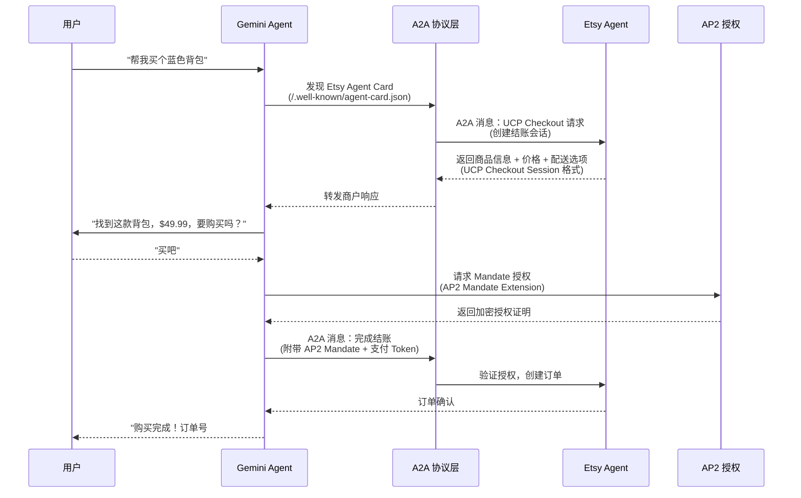

**UCP 与 AP2 的协作机制：Identity Linking vs AP2 Mandate**

UCP 已经有了 Identity Linking（身份关联）机制，为什么还需要 AP2 Mandate？这两者解决的是完全不同层面的信任问题：

| 维度 | Identity Linking（身份关联） | AP2 Mandate（支付授权证明） |
|------|---------------------------|--------------------------|
| 核心问题 | "这个 Agent 有权访问用户在商户的账户吗？" | "用户真的授权了这笔具体的交易吗？" |
| 技术基础 | OAuth 2.0 Authorization Code（RFC 6749） | W3C Verifiable Credential + 加密签名 |
| 信任类型 | 身份信任——证明 Agent 代表用户 | 交易信任——证明用户授权了具体金额和商品 |
| 作用范围 | 持续性（Token 有效期内可反复使用） | 一次性（每笔交易独立签署） |
| 类比 | 酒店房卡——证明你是住客，可以进出房间 | 签字支票——授权一笔具体金额的支付 |

两者的协作关系可以用一个比喻理解：Identity Linking 是"门禁卡"（你有权进入这个商户的会员系统），AP2 Mandate 是"签字授权书"（你授权花这笔钱买这个东西）。前者解决"你是谁"，后者解决"你同意花多少钱"。

**HP 模式（Human-Present）与 HNP 模式（Human-Not-Present）的关键区别**：

```mermaid
graph TB
    subgraph HP["HP 模式：用户实时参与"]
        HP1["用户对 Agent 说：帮我买双白色跑鞋"]
        HP2["Agent 通过 UCP 搜索商品、构建购物车"]
        HP3["Google UI 弹出：确认购买 Nike Air Max $129.99？"]
        HP4["用户在 Google UI 中确认支付"]
        HP5["AP2 生成 Cart Mandate（用户实时签署）"]
        HP1 --> HP2 --> HP3 --> HP4 --> HP5
    end
    
    subgraph HNP["HNP 模式：Agent 自主执行"]
        HNP1["用户预先签署 Intent Mandate：<br/>演唱会开票时自动买两张，每张不超$200"]
        HNP2["Agent 持续监控票务网站"]
        HNP3["开票！Agent 自动通过 UCP 创建结账会话"]
        HNP4["Agent 用 Intent Mandate 自动生成 Cart Mandate"]
        HNP5["无需用户确认，直接完成支付"]
        HNP1 --> HNP2 --> HNP3 --> HNP4 --> HNP5
    end
```

- 在 HP 模式下，用户实时在场确认，Identity Linking 已经提供了身份验证。但 AP2 Mandate 仍然有价值——它为每笔交易生成加密审计链（Intent→Cart→Payment 三级 Mandate），即使出现争议也有不可篡改的证据。
- 在 HNP 模式下，AP2 Mandate 是不可或缺的。用户不在场，没有人点"确认购买"按钮。Agent 必须持有用户预先签署的 Intent Mandate（含金额上限、商户白名单、时间窗口等约束），才能自主完成交易。Identity Linking 只能证明 Agent 有权访问账户，但无法证明用户授权了这笔具体的购买。

**UCP 中 AP2 Mandate Extension 的工作机制**：

AP2 Mandate 在 UCP 中以 Extension（`dev.ucp.shopping.ap2_mandate`）的形式集成。当商户和平台在能力协商阶段都声明支持 AP2 Mandate Extension 时，结账流程会增加加密授权步骤：

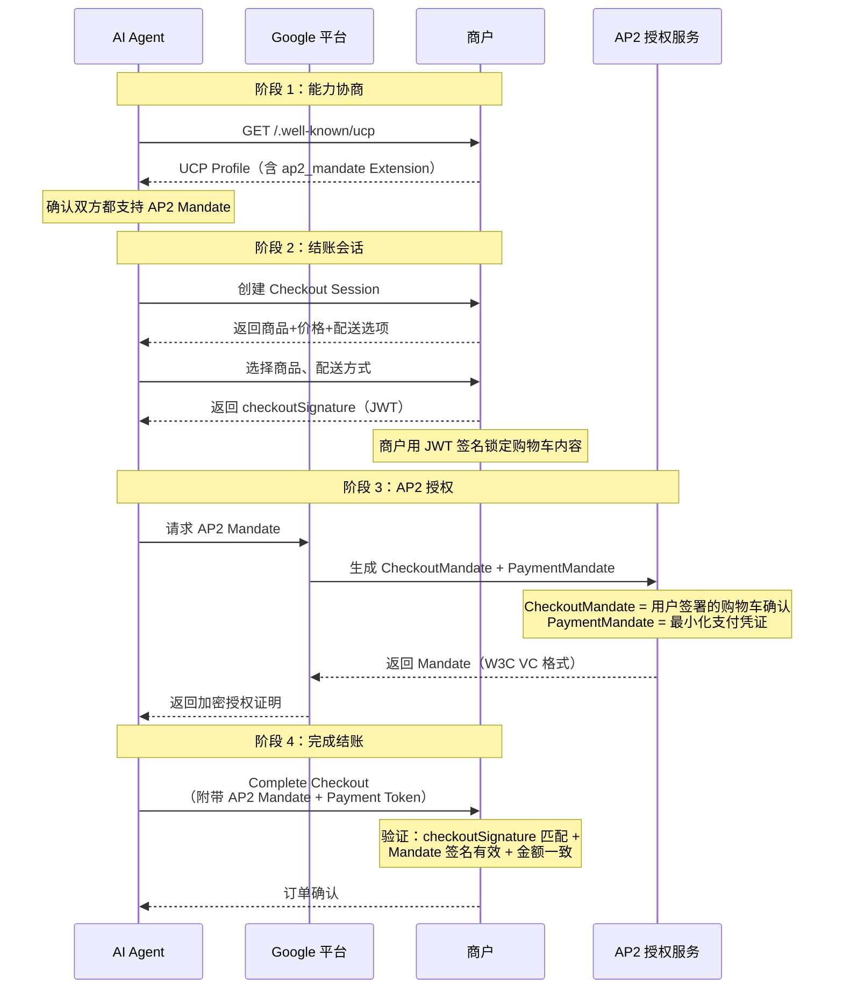

关键技术细节：一旦结账会话协商了 AP2 Mandate Extension，该会话就被"安全锁定"——不能回退到标准结账流程。这确保了支持 AP2 的交易始终具有完整的加密授权链，防止降级攻击。

> 详细技术分析参见：[Google UCP 研究报告 - Identity Linking 深度解析](1.google_ucp/google_ucp_research.md) 和 [Google AP2 研究报告 - Mandate 机制](4.google_ap2/google_ap2_research.md)

**Intent Mandate 的签署时机与执行方式**

Mandate 签署是 AP2 安全模型的核心操作。签署的时机和方式因 HP/HNP 模式而异：

```
签署时机对比

HP 模式（用户在场）                    HNP 模式（用户不在场）
┌──────────────────────┐              ┌──────────────────────┐
│ 用户："帮我找白色跑鞋"  │              │ 用户："演唱会开票时     │
│                      │              │  自动买两张，≤$200/张" │
│  ↓ 立即生成+签署       │              │                      │
│  Intent Mandate      │              │  ↓ 立即生成+签署       │
│  （设备密钥，轻量确认） │              │  Intent Mandate      │
│                      │              │  （硬件密钥+设备证明）  │
│  ↓ Agent 搜索商品     │              │                      │
│  ↓ 用户审核购物车      │              │  ↓ 用户离开           │
│  ↓ 用户签署Cart Mandate│             │  ↓ Agent 自主监控     │
│  （硬件密钥+设备证明）  │              │  ↓ 条件满足，自动签署  │
│                      │              │    Cart Mandate       │
│  ↓ 完成支付           │              │  ↓ 自动完成支付       │
└──────────────────────┘              └──────────────────────┘
```

签署操作的技术本质：

| 维度 | 说明 |
|------|------|
| 凭证格式 | W3C Verifiable Credential（JSON-LD） |
| 签名算法 | ECDSA 椭圆曲线签名（`EcdsaSecp256k1Signature2019`） |
| 私钥存储 | 设备安全芯片（类似 Apple Secure Enclave / Android StrongBox） |
| 防重放 | 每次签署附带唯一 Nonce + 时间戳 |
| 设备证明 | Device Attestation——证明签名来自真实物理设备，非远程伪造 |
| 签署界面 | 必须在 Google 可信界面（Trusted UI）中完成，Agent 无法伪造 |

HNP 模式下 Intent Mandate 的签署流程：

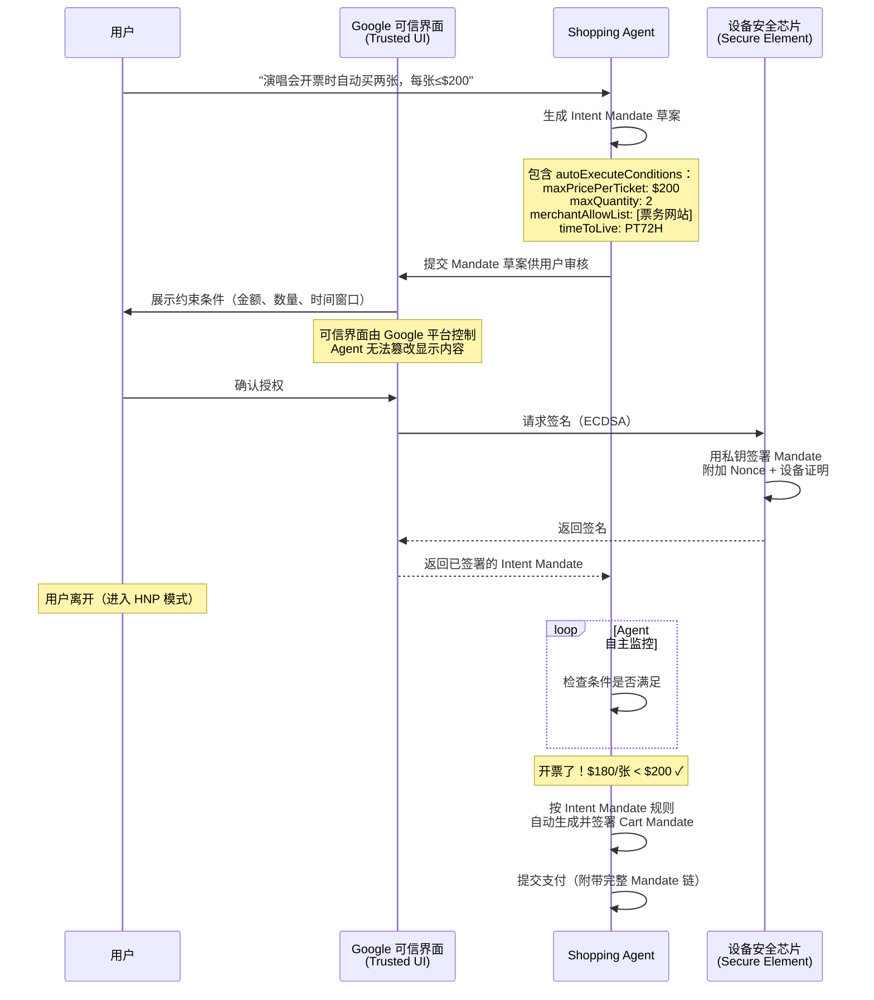

关键安全设计：签署必须在 Google 可信界面（Trusted UI）中完成，而非 Agent 自己的界面。这防止了恶意 Agent 伪造签署界面、欺骗用户签署不符合预期的 Mandate。可信界面由平台（Google）控制，Agent 只能提交 Mandate 草案，无法干预用户看到的内容和签署过程。

> 详细技术分析参见：[Google AP2 研究报告 - HP/HNP 交易流程](4.google_ap2/google_ap2_research.md)

---

### 5.2 OpenAI + Stripe ACP — 结账流程编排

> 详细报告：[OpenAI + Stripe ACP 研究报告](2.openai_strip_acp/openai_stripe_acp_research.md)

**一句话定位**：让 AI Agent 在对话中无缝完成购物——从商品发现到结账支付，全程不离开 Agent 界面。

**核心架构**：

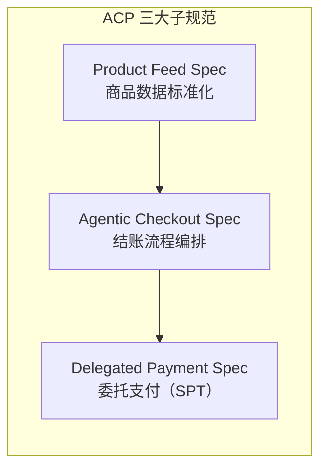

**关键技术特征**：

| 维度 | 说明 |
|------|------|
| 发布方 | OpenAI + Stripe |
| 发布时间 | 2025 年 6 月 |
| 核心解决问题 | Agent 如何与商户完成标准化结账流程 |
| 核心支付原语 | SharedPaymentToken (SPT)——商户限定、金额限定、一次性使用 |
| 结账体验 | 嵌入式结账（UI 渲染在 Agent 界面内） |
| 落地产品 | ChatGPT Instant Checkout（2025-09 上线） |
| 首批商户 | Etsy、Shopify（100 万+商户）、Glossier、SKIMS 等 |
| 开放性 | 开源（Apache 2.0） |

**为什么重要**：ACP 是全球首个大规模落地的 AI Agent 购物协议。ChatGPT Instant Checkout 的上线证明了 Agent 商务不是概念验证，而是已经在运行的商业现实。ACP 的 SPT 机制巧妙地解决了"Agent 不应持有信用卡"的安全问题。

#### 5.2.1 ACP 信任模型分析：平台信任 vs 密码学信任

ACP 采用的是**"双平台信任"模型**——与 AP2 的密码学信任形成鲜明对比。

**ACP 已实现的信任保障**：

| 信任机制 | 实现方式 | 防御目标 |
|---------|---------|---------|
| Stripe Checkout UI 隔离 | 用户在 Stripe 控制的 UI 中确认支付，Agent 无法篡改界面内容 | 防止 Agent 伪造交易信息 |
| SPT 四重约束 | 商户限定 + 金额限定 + 时间限定 + 一次性使用 | 限制 Token 泄露的损害范围 |
| Agent 不接触卡号 | 真实卡号由 Stripe 托管，Agent 只持有 SPT | 防止卡号泄露 |
| Stripe Radar AI 风控 | 平台级机器学习欺诈检测 | 识别异常交易模式 |
| PCI DSS 合规 | Stripe 承担全部 PCI 合规责任 | 支付数据安全 |

**ACP 未覆盖的信任维度（与 AP2/TAP 对比）**：

| 信任维度 | ACP 现状 | AP2/TAP 方案 | 影响 |
|---------|---------|-------------|------|
| Agent 身份验证 | ❌ 无独立验证机制 | TAP: RFC 9421 HTTP 签名 | 商户无法密码学验证 Agent 合法性 |
| 用户授权证明 | ⚠️ 仅"用户点击 Stripe UI 确认" | AP2: W3C VC Mandate 签名链 | 无不可否认的密码学授权证明 |
| 审计链 | ⚠️ 仅 Stripe 交易日志 | AP2: 独立可验证的 Mandate 链 | 争议时缺乏独立验证能力 |
| HNP 模式 | ❌ 不支持（用户必须在场） | AP2: 原生支持预签 Mandate | 无法支持 Agent 自主执行委托任务 |

**信任模型对比**：

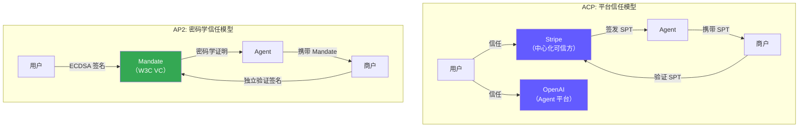

**核心差异**：
- **ACP 的隐含假设**：信任 OpenAI（控制 Agent）+ 信任 Stripe（控制支付）= 交易可信。信任链短、落地快，但依赖两个中心化平台的信誉。
- **AP2 的隐含假设**：密码学签名不可伪造 = 交易可信。信任链长、实现复杂，但任何方可独立验证，不依赖单一平台。
- **关键洞察**：ACP 的 Stripe Checkout UI 与 UCP 的 Trusted UI 扮演类似角色——都是平台控制的安全界面，将敏感操作与 Agent 隔离。区别在于 UCP/AP2 在此基础上叠加了密码学 Mandate 签名，而 ACP 完全依赖 Stripe 的中心化验证。

**务实权衡**：ACP 选择平台信任是有意为之的工程权衡——更简单的信任模型带来了更快的落地速度（ChatGPT Instant Checkout 已上线），代价是密码学保证弱于 AP2。对于当前阶段的 Agentic Commerce，这可能是正确的选择：先跑起来，再逐步增强信任层。

---

### 5.3 Amazon Buy for Me — 垂直整合 Agent 购物

> 详细报告：[Amazon Buy for Me 研究报告](3.amazon_payforme/amazon_buyforme_research.md)

**一句话定位**：在 Amazon App 内由 AI Agent 代替用户在第三方品牌网站完成购买，消除购物"死胡同"。

**核心架构**：

```
Amazon Buy for Me 架构
┌──────────────────────────────────────────┐
│  Amazon Shopping App                      │
│  ┌────────────────────────────────────┐  │
│  │  Rufus AI 购物助手                   │  │
│  │  (Amazon Nova + Anthropic Claude)   │  │
│  └──────────┬─────────────────────────┘  │
│             │                             │
│  ┌──────────▼─────────────────────────┐  │
│  │  Amazon Bedrock Agent 基础设施       │  │
│  │  自动导航 → 填写信息 → 完成结账      │  │
│  └──────────┬─────────────────────────┘  │
│             │                             │
│  ┌──────────▼─────────────────────────┐  │
│  │  加密用户数据（支付+配送信息）        │  │
│  └────────────────────────────────────┘  │
└──────────────────┬───────────────────────┘
                   │ 自动导航
                   ▼
          第三方品牌网站（未经同意）
```

**关键技术特征**：

| 维度 | 说明 |
|------|------|
| 发布方 | Amazon |
| 发布时间 | 2025 年 4 月 |
| 核心解决问题 | Amazon 没有的商品，用户也能在 App 内购买 |
| AI 引擎 | Amazon Nova + Anthropic Claude（Amazon Bedrock） |
| 商户关系 | Opt-out 模式（品牌被自动纳入，需主动退出） |
| 商品覆盖 | 50 万+ 商品（从 6.5 万快速扩展） |
| 核心争议 | 28% 退单率、AI 生成不准确信息、未经同意抓取 |
| 开放性 | 完全封闭（屏蔽外部 AI Agent） |

**为什么重要**：Buy for Me 代表了 Agentic Commerce 的"围墙花园"路径——与 Google/OpenAI 的开放协议形成鲜明对比。它展示了 Agent 商务的巨大商业潜力（Rufus 2025 年创造 120 亿美元增量销售），但也暴露了未经同意的 Agent 代购引发的严重商户反弹和法律风险。Forbes 总结："Google builds open protocol rails, Amazon builds walled garden"。

---

### 5.4 Google AP2 — 支付信任与授权

> 详细报告：[Google AP2 研究报告](4.google_ap2/google_ap2_research.md)

**一句话定位**：为 Agent 发起的支付建立信任基础设施——通过加密签名的 Mandate 机制，为每笔交易提供不可否认的用户意图证明。

**核心架构**：

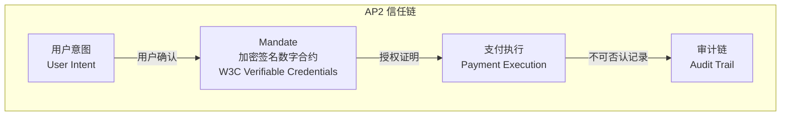

**关键技术特征**：

| 维度 | 说明 |
|------|------|
| 发布方 | Google |
| 发布时间 | 2025 年 9 月 |
| 核心解决问题 | Agent 花钱时如何证明是用户的真实意愿（3A 问题） |
| 核心机制 | Mandate（W3C Verifiable Credentials 加密签名数字合约） |
| 交易模式 | Human-Present（实时购买）+ Human-Not-Present（委托任务） |
| 支付方式 | 支付方式无关（信用卡、稳定币、银行转账均可） |
| 协议基础 | A2A + MCP 的开放扩展 |
| 合作伙伴 | 60+（Mastercard、AmEx、PayPal、Coinbase、Salesforce 等） |

**为什么重要**：AP2 解决的是 Agentic Commerce 最根本的信任问题——Authorization（授权证明）、Authenticity（意图真实性）、Accountability（责任归属）。没有信任层，任何结账协议都无法安全运行。AP2 的 Mandate 机制为整个生态提供了"数字公证"能力。

---

### 5.5 Coinbase x402 — HTTP 原生链上结算

> 详细报告：[Coinbase x402 研究报告](5.conibase_x402/coinbase_x402_research.md)

**一句话定位**：激活 HTTP 协议中沉睡 30 年的 `402 Payment Required` 状态码，实现互联网原生的即时加密货币支付。

**核心架构**：

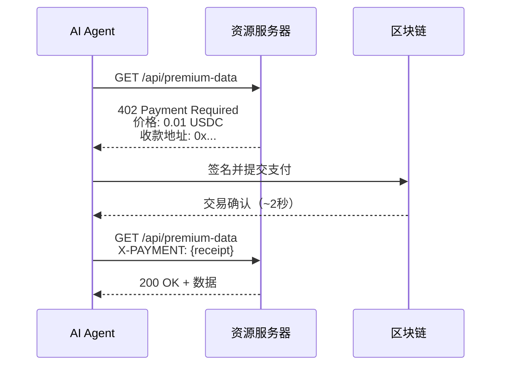

**关键技术特征**：

| 维度 | 说明 |
|------|------|
| 发布方 | Coinbase |
| 发布时间 | 2025 年 5 月 |
| 核心解决问题 | 机器需要为资源付费时，如何在一次 HTTP 请求中完成 |
| 协议基础 | HTTP 402 状态码 |
| 结算方式 | 链上即时结算（USDC 稳定币，~2 秒） |
| 协议费用 | 零（仅链上 Gas 费） |
| 支持链 | Base、Solana、Polygon 等多链 |
| 交易规模 | 1 亿+ 笔交易，年化 6 亿+ 美元 |
| 合作伙伴 | Cloudflare（联合成立 x402 Foundation） |

**为什么重要**：x402 代表了 Agentic Commerce 的"加密原生"路径。它不依赖传统卡网络或 PSP，而是将支付直接嵌入 HTTP 协议层。对于 API 经济和 Agent 间微支付场景（如 Agent 付费调用另一个 Agent 的 API），x402 提供了最低摩擦的解决方案。零协议费用 + 即时结算的特性使其在微支付场景中具有独特优势。

---

### 5.6 Visa TAP — 卡网络原生 Agent 信任

> 详细报告：[Visa TAP 研究报告](6.visa_tap/visa_tap_research.md)

**一句话定位**：在现有卡网络基础设施上叠加 Agent 能力层，让商户通过验证 HTTP 头中的加密签名即可识别合法 Agent。

**核心架构**：

```
Visa TAP 三层签名信任模型
┌─────────────────────────────────────────────┐
│  第一层：Agent 识别签名                        │
│  Agent Platform → 签名 Agent 身份              │
│  "这个请求来自已注册的合法 Agent"               │
├─────────────────────────────────────────────┤
│  第二层：消费者识别签名                         │
│  Consumer Identity Provider → 签名消费者身份    │
│  "这个 Agent 背后的消费者是经过验证的真实用户"    │
├─────────────────────────────────────────────┤
│  第三层：支付容器签名                           │
│  Payment Container → 签名支付凭证              │
│  "这笔支付使用的是经过授权的 Visa Token"         │
├─────────────────────────────────────────────┤
│  三层通过 nonce 关联，形成完整信任链              │
└─────────────────────────────────────────────┘
```

**关键技术特征**：

| 维度 | 说明 |
|------|------|
| 发布方 | Visa |
| 发布时间 | Intelligent Commerce 2025-04 / TAP 2025-10 |
| 核心解决问题 | 商户如何区分合法 Agent 和恶意 Bot |
| 核心机制 | RFC 9421 HTTP Message Signatures 三层签名 |
| 用户确认 | FIDO2/Passkey 生物识别 |
| 集成方式 | 低代码/零代码（复用现有 Web 基础设施） |
| 全球覆盖 | 200+ 国家/地区、1.75 亿+ 商户接受点 |
| 合作伙伴 | Cloudflare（联合开发 Web Bot Auth 标准） |

**为什么重要**：Visa TAP 的独特价值在于"不重新发明支付流程"。它不要求商户构建新的 API 或集成新的支付系统，而是在现有 HTTP 请求中添加加密签名头。这意味着 1.75 亿+ 现有 Visa 商户可以以最低成本支持 Agent 交易。与 Cloudflare 的合作使 TAP 能够在 CDN/站点保护层直接部署，进一步降低集成门槛。

---

### 5.7 Mastercard Agent Pay — Agent 注册 + Agentic Token

> 详细报告：[Mastercard Agent Pay 研究报告](7.mastercard_agent_pay/mastercard_agent_pay_research.md)

**一句话定位**：将 AI Agent 作为"可识别、可治理的参与者"嵌入到现有卡网络信任体系中——Agent 必须先注册、再验证、才能交易。

**核心架构**：

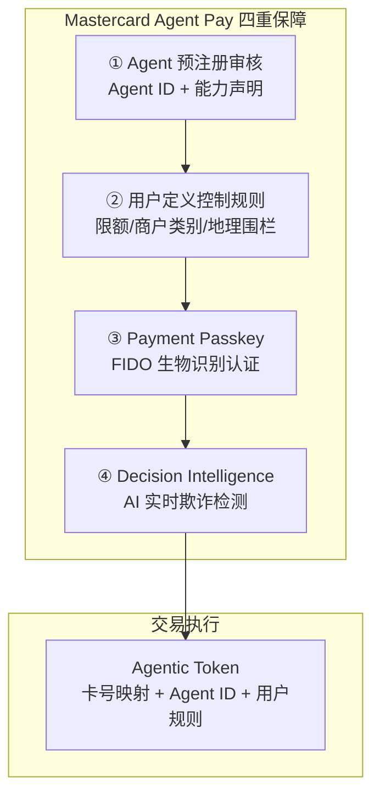

**关键技术特征**：

| 维度 | 说明 |
|------|------|
| 发布方 | Mastercard |
| 发布时间 | 2025 年 4 月 |
| 核心解决问题 | 未验证 Agent 执行欺诈购买 + 模糊交易意图引发争议 |
| 核心机制 | Agent 预注册 + Agentic Token + Payment Passkey + Decision Intelligence |
| 用户控制 | 单笔限额、月度总额、商户类别、地理围栏等精细规则 |
| 向后兼容 | 现有接受 Mastercard Token 的商户可直接支持 |
| 落地市场 | 美国、澳洲（首笔交易 2025-11）、拉美 |
| 合作伙伴 | Microsoft、Samsung、Mastercard 发卡行网络 |

**为什么重要**：Mastercard Agent Pay 代表了"中心化注册 + 代币化"的信任路径——与 Visa TAP 的"HTTP 签名验证"和 AP2 的"去中心化 Mandate"形成三种不同的信任哲学。其核心优势是向后兼容性：商户看到的仍然是一笔 Mastercard Token 交易，只是附带了额外的 Agent 身份信息。这大幅降低了商户的采纳门槛。

---

## 6. 协议对比分析

> 本章将七大方案放在同一坐标系下进行多维度对比，帮助读者快速理解各方案的定位差异与适用场景。

### 6.1 全景对比矩阵

| 维度 | Google UCP | OpenAI+Stripe ACP | Amazon Buy for Me | Google AP2 | Coinbase x402 | Visa TAP | Mastercard Agent Pay |
|------|-----------|-------------------|-------------------|-----------|---------------|---------|---------------------|
| **信任模型** | 协议层中立（依赖底层协议） | Stripe 中心化 SPT | 平台封闭（Amazon 内部） | 去中心化 W3C VC 签名 | 钱包私钥签名 | RFC 9421 HTTP 三层签名 | 中心化注册 + Agentic Token |
| **支付方式** | 任意（通过扩展） | 传统卡/银行 via Stripe | Amazon 账户余额/绑卡 | 任意（Mandate 抽象） | 链上 USDC 稳定币 | Visa Token（现有卡网络） | Mastercard Token（现有卡网络） |
| **商户接入成本** | 中（需实现 UCP 端点） | 低（Stripe SDK 集成） | 零（Amazon 代理购买） | 中-高（VC 签发 + Mandate 解析） | 低（HTTP 402 中间件） | 极低（HTTP 头验证） | 极低（现有 Token 通道） |
| **开放性** | 开放协议（Apache 2.0） | 半开放（Stripe 主导） | 封闭（Amazon 专有） | 开放协议（W3C 标准） | 开放协议（MIT） | 半开放（Visa 主导） | 封闭（Mastercard 专有） |
| **生产就绪度** | 早期（Etsy/Wayfair 试点） | 已上线（ChatGPT Checkout） | 已上线（50 万+ SKU） | 早期（60+ 合作伙伴签约） | 已上线（1 亿+ 笔交易） | 早期（首批交易 2025-12） | 已上线（美国/澳洲/拉美） |
| **授权机制** | 依赖底层协议 | SPT 四重约束 | 用户点击确认 | Mandate 三层机制 | 钱包签名 | Passkey + 三层签名 | Payment Passkey + 规则引擎 |
| **HNP 支持** | 通过 A2A 扩展 | 无原生支持 | 不适用 | HP/HNP 双模式原生支持 | 原生支持（无需人参与） | 通过 Browsing IOU | 无原生支持 |
| **审计能力** | 依赖底层协议 | Stripe Dashboard | Amazon 订单系统 | VC 可验证凭证链 | 链上全透明 | 签名日志可追溯 | Decision Intelligence 日志 |
| **结算速度** | 依赖底层协议 | T+2（传统卡网络） | 即时（Amazon 内部） | 依赖底层支付 | ~2 秒（链上即时） | T+2（Visa 网络） | T+2（Mastercard 网络） |
| **微支付适用性** | 通过 x402 扩展 | 差（卡网络最低费用） | 不适用 | 通过 x402 扩展 | 优秀（零协议费） | 差（卡网络最低费用） | 差（卡网络最低费用） |

### 6.2 技术架构分层对比

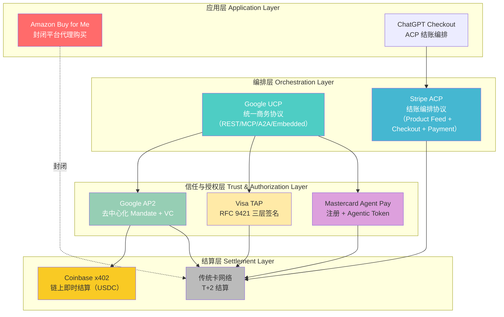

### 6.3 信任模型光谱

七大方案的信任模型可以沿"去中心化 ↔ 中心化"光谱排列：

```
去中心化                                                          中心化
◄─────────────────────────────────────────────────────────────────────►
  x402          AP2           Visa TAP        ACP          MC Agent Pay    Buy for Me
  (钱包签名)    (W3C VC)      (RFC 9421)     (Stripe SPT)  (注册+Token)   (平台封闭)
  
  无需注册      自主签发       平台签发        平台签发       预注册审核      完全托管
  链上验证      任何人可验证    商户验证签名    Stripe 验证    MC 网络验证     Amazon 内部
```

### 6.4 生产就绪度评估

| 方案 | 阶段 | 关键里程碑 | 预计大规模可用 |
|------|------|-----------|--------------|
| Amazon Buy for Me | ✅ 已上线 | 50 万+ SKU，28% 退单率 | 已可用（仅 Amazon 生态） |
| Coinbase x402 | ✅ 已上线 | 1 亿+ 笔交易，V2 发布 2025-12 | 已可用（加密生态） |
| OpenAI+Stripe ACP | ✅ 已上线 | ChatGPT Checkout 2025-09，100 万+ Shopify 商户 | 2026 H1（广泛商户） |
| Mastercard Agent Pay | ✅ 已上线 | 澳洲首笔交易 2025-11，美国/拉美已上线 | 2026 H1（全球扩展） |
| Visa TAP | 🔶 早期 | 首批安全 AI 交易 2025-12，Cloudflare 合作 | 2026 H2 |
| Google AP2 | 🔶 早期 | 60+ 合作伙伴签约，PayPal 详细集成计划 | 2026 H2 |
| Google UCP | 🔶 早期 | 2026-01 NRF 发布，Etsy/Wayfair 试点 | 2027+ |

### 6.5 两大卡组织方案深度对比：Visa TAP vs Mastercard Agent Pay

> Visa TAP 和 Mastercard Agent Pay 都是传统卡网络巨头面向 Agentic Commerce 的战略布局，但它们代表了两种截然不同的信任哲学和技术路线。本节进行深度对比分析。

#### 6.5.1 核心哲学差异：签名制 vs 准入制

两大方案的根本分歧在于"如何建立对 Agent 的信任"：

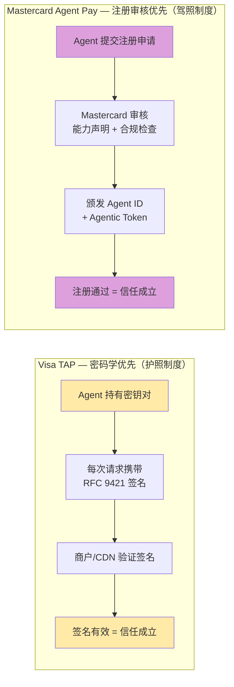

类比理解：
- **Visa TAP ≈ 护照制度**：你持有一本密码学签发的"护照"（密钥对），每次入境（发起请求）时出示护照并盖章（签名），边检（商户/CDN）验证护照真伪即可放行。无需提前向每个国家注册。
- **Mastercard Agent Pay ≈ 驾照制度**：你必须先通过考试（注册审核），获得驾照（Agent ID + Agentic Token），才能上路（执行交易）。驾照由权威机构（Mastercard）统一颁发和管理。

#### 6.5.2 多维度对比矩阵

| 维度 | Visa TAP | Mastercard Agent Pay |
|------|----------|---------------------|
| **信任建立方式** | 密码学签名验证（RFC 9421） | 中心化注册审核 + Token 颁发 |
| **Agent 身份载体** | HTTP 签名头（公钥 + 签名） | Agent ID + Agentic Token（注册凭证） |
| **签名层数** | 三层（Agent + Consumer + Payment） | 单层（Agentic Token 封装所有信息） |
| **消费者识别** | 独立签名层（Consumer Identity Provider） | 嵌入 Token 内（Payment Passkey 绑定） |
| **支付凭证传递** | Payment Container 签名（Visa Token） | Agentic Token（Mastercard Token + Agent ID + 规则） |
| **商户集成成本** | 极低（验证 HTTP 头签名，可由 CDN 代理） | 极低（现有 Token 通道，附加 Agent 元数据） |
| **HTTP 402 支持** | ✅ 原生支持（Browsing IOU 机制） | ❌ 无原生支持 |
| **用户控制粒度** | 通过 Browsing IOU 设定预算上限 | 精细规则引擎（单笔限额/月度总额/商户类别/地理围栏） |
| **技术开放性** | 半开放（RFC 9421 标准 + Visa 扩展） | 封闭（Mastercard 专有框架） |
| **CDN/WAF 集成** | ✅ 深度集成（Cloudflare Web Bot Auth 联合开发） | ❌ 无 CDN 层集成 |
| **意图验证** | 签名链隐式验证（三层 nonce 关联） | Decision Intelligence AI 实时分析 |
| **欺诈检测** | 依赖商户/发卡行现有系统 | Decision Intelligence（AI 驱动，实时评分） |
| **HNP 支持** | ✅ 通过 Browsing IOU（Agent 自主浏览付费） | ❌ 无原生 HNP 支持 |
| **落地进度** | 早期（首批交易 2025-12） | 已上线（美国/澳洲/拉美，2025-11 首笔交易） |
| **合作伙伴** | Cloudflare、Anthropic、Google | Microsoft、Samsung、发卡行网络 |
| **全球覆盖** | 200+ 国家/地区，1.75 亿+ 商户 | 210+ 国家/地区，1 亿+ 商户 |

#### 6.5.3 深层差异分析

**① 协议（Protocol）vs 框架（Framework）**

这是两者最本质的区别：

- **Visa TAP 是一个协议（Protocol）**：它定义了一套标准化的签名格式（RFC 9421）、签名层次（三层）、验证流程。任何实现了该协议的参与方都可以互操作。Visa 提供的是"规则"，而非"平台"。
- **Mastercard Agent Pay 是一个框架（Framework）**：它提供了一套完整的注册、审核、Token 颁发、规则引擎、欺诈检测的端到端服务。Agent 必须在 Mastercard 的体系内运作。Mastercard 提供的是"平台"，而非仅仅是"规则"。

这意味着：
- Visa TAP 更容易被第三方扩展和集成（如 Cloudflare 在 CDN 层直接验证签名）
- Mastercard Agent Pay 提供更完整的开箱即用体验（注册即可用，无需自建验证逻辑）

**② 商户视角的差异**

| 商户关注点 | Visa TAP | Mastercard Agent Pay |
|-----------|----------|---------------------|
| 我需要做什么？ | 验证 HTTP 签名头（或让 CDN 代理验证） | 接受 Agentic Token（与普通 Token 交易几乎相同） |
| 我能获得什么额外信息？ | Agent 身份 + 消费者身份 + 支付授权的密码学证明 | Agent ID + 用户规则约束 + Decision Intelligence 风控评分 |
| 我的风控责任？ | 需自行利用签名信息做风控决策 | Mastercard Decision Intelligence 提供实时风控支持 |
| 集成复杂度？ | 低（HTTP 头解析）但需理解签名验证逻辑 | 极低（现有 Token 通道）但受限于 MC 生态 |

**③ 创新速度 vs 安全保障的权衡**

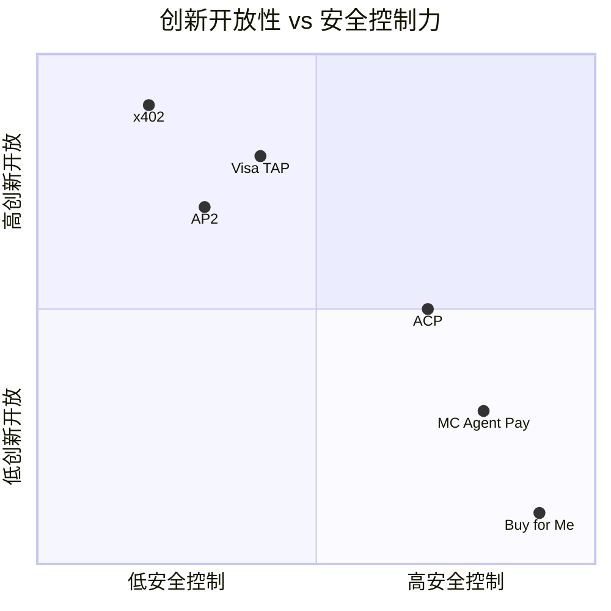

- **Visa TAP** 偏向"高创新开放 + 中等安全控制"：开放的签名协议允许快速创新，但安全依赖各参与方自行实现
- **Mastercard Agent Pay** 偏向"高安全控制 + 较低创新开放"：中心化注册和 Decision Intelligence 提供强安全保障，但创新受限于 Mastercard 的框架演进速度

**④ HTTP 402 — Visa 的独特能力**

HTTP 402 Payment Required 是 Visa TAP 相对于 Mastercard Agent Pay 的一个关键差异化能力：

```
Agent 浏览付费内容的流程（Visa TAP Browsing IOU）：

Agent → 请求付费内容 → 商户返回 HTTP 402
                              ↓
                    402 响应包含：价格、支付方式、IOU 模板
                              ↓
                    Agent 签署 Browsing IOU（预算内自动签署）
                              ↓
                    商户验证 IOU 签名 → 返回内容
                              ↓
                    IOU 后续通过 Visa 网络结算
```

这使得 Visa TAP 天然支持 HNP（Human-Not-Present）场景——Agent 可以在无人参与的情况下自主浏览和购买付费内容。Mastercard Agent Pay 目前没有等效机制，其交易仍需通过传统的 Payment Passkey 授权流程。

#### 6.5.4 共同点与趋同趋势

尽管路线不同，两大卡组织在以下方面高度一致：

| 共同点 | 说明 |
|--------|------|
| FIDO/Passkey 用户认证 | 都采用 FIDO2/Passkey 作为消费者身份验证的基础 |
| 复用卡网络基础设施 | 都基于现有的 Visa/Mastercard Token 网络，而非构建全新支付通道 |
| 与 Google 合作 | Visa 与 Google UCP/AP2 深度集成；Mastercard 与 Google 在 Passkey 标准上合作 |
| 采纳 Cloudflare WBA | Visa 联合开发 Web Bot Auth；Mastercard 也在探索 CDN 层 Agent 验证 |
| 向后兼容优先 | 都强调现有商户无需大幅改造即可支持 Agent 交易 |
| 渐进式部署 | 都采用"先试点、再扩展"的策略，而非一步到位 |

#### 6.5.5 一句话总结

> **Visa TAP = "密码学优先"的开放协议路线** — 用签名证明信任，让生态自由验证
> **Mastercard Agent Pay = "注册审核优先"的平台治理路线** — 用准入证明信任，让平台统一管控
>
> 两者不是非此即彼的关系。在成熟的 Agentic Commerce 生态中，一个 Agent 可能同时持有 Visa TAP 签名密钥和 Mastercard Agent ID，根据商户支持的网络选择不同的信任证明方式——正如今天消费者钱包中同时有 Visa 和 Mastercard 卡片一样。

#### 6.5.6 商业化路径对比：标准之战 vs 平台之战

两大卡组织虽然都瞄准 Agentic Commerce，但商业化路径截然不同——Visa 赌"标准"，Mastercard 赌"平台"。

**Visa TAP 商业化路径：协议免费 → 交易量驱动 → 网络效应变现**

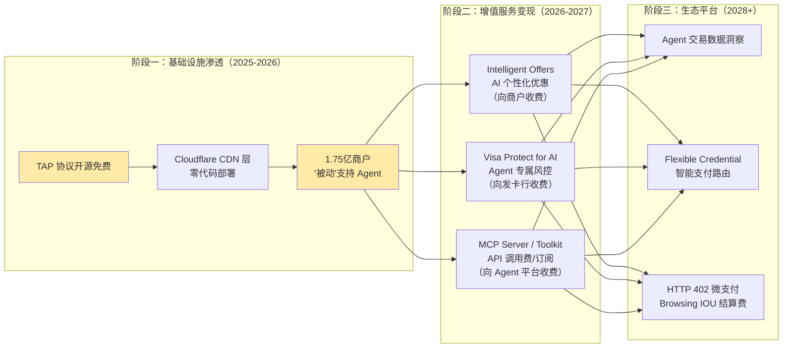

Visa 的核心逻辑：TAP 越普及 → 通过 Visa 卡网络的 Agent 交易越多 → 网络交换费收入越高。协议本身不收费，但所有交易都必须走 Visa 管道。这是经典的"免费标准 + 收费管道"模式。

关键杠杆：**1.75 亿现有商户 × CDN 层零代码部署 = 极低的市场渗透成本**。Visa 不需要逐个说服商户"接入 TAP"，只需要说服 Cloudflare 等 CDN 默认开启 TAP 验证，商户就自动获得 Agent 交易能力。

**Mastercard Agent Pay 商业化路径：注册准入 → 全链路服务 → 平台化变现**

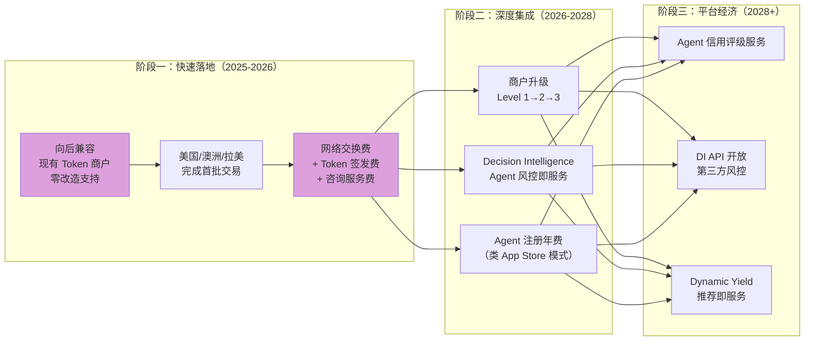

Mastercard 的核心逻辑：掌握 Agent 准入权 → 每个环节都有变现点 → 从支付网络升级为 Agent 商务平台。中心化注册制赋予 Mastercard 强大的生态控制力和定价权。

关键杠杆：**KYA 注册审核 = Agent 准入权**。每个想接入 Mastercard 网络的 Agent 都必须通过审核，这是 Mastercard 独有的生态控制点。

**商业化路径对比矩阵**

| 维度 | Visa TAP | Mastercard Agent Pay |
|------|----------|---------------------|
| 变现模式 | 免费协议 + 交易量驱动 | 全链路服务 + 平台抽成 |
| 市场渗透策略 | CDN 层自动部署（自上而下） | 发卡行/商户逐个接入（自下而上） |
| 核心壁垒 | 协议标准化 + 网络效应 | 注册准入权 + 风控数据 |
| 商户获客成本 | 极低（CDN 代理，商户无感） | 低（零改造）但需主动接入 |
| Agent 获客成本 | 低（开放密钥签发） | 高（需通过 KYA 审核） |
| 增值服务空间 | 中（风控、优惠、数据洞察） | 大（注册、风控、咨询、评级、推荐） |
| 收入多样性 | 偏单一（交易费为主） | 多元（交易费 + 服务费 + 咨询费 + API 费） |
| 生态控制力 | 弱（开放协议，无法锁定） | 强（注册准入，可控定价） |
| 规模化速度 | 快（CDN 批量部署） | 慢（逐个审核注册） |
| 风险 | 协议被替代或边缘化 | 注册制被市场抵制，创新受限 |

**一句话总结**：

> **Visa 赌的是"标准之战"** — 谁的协议成为 Web 默认标准，谁就赢得交易量
> **Mastercard 赌的是"平台之战"** — 谁掌握 Agent 准入权和风控数据，谁就掌握定价权
>
> 历史类比：这像极了 Android（开放标准，靠广告/服务变现）vs iOS（封闭平台，靠准入抽成变现）的路线之争。两者都成功了，但成功的方式完全不同。

---

## 7. 互补关系与生态格局

> 七大方案并非简单的竞争关系——它们在不同层次解决不同问题，存在显著的互补性。本章分析协议间的协作模式与生态格局。

### 7.1 协议互补架构

Agentic Commerce 的完整交易流程可以分解为四个层次，不同协议在不同层次发挥作用：

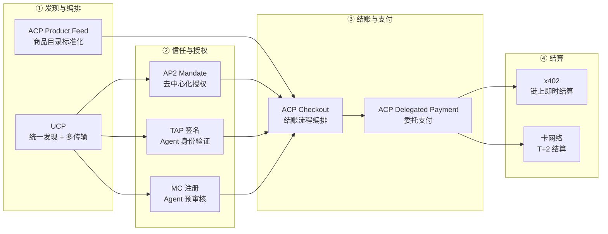

### 7.2 三大互补组合

**组合一：ACP（结账编排）+ AP2（信任授权）+ x402（链上结算）**

这是目前最被看好的"全栈开放"组合：
- ACP 提供标准化的商品发现和结账流程
- AP2 的 Mandate 机制提供去中心化的用户授权
- x402 处理链上即时结算（特别适合微支付和 Agent-to-Agent 场景）
- AP2 已原生支持 x402 扩展，PayPal 的集成计划中明确包含 x402 结算路径

**组合二：UCP（统一层）+ AP2（信任层）+ 卡网络（结算层）**

Google 主推的"统一协议"路径：
- UCP 作为最上层的统一发现和编排协议
- AP2 的 Mandate Extension 已集成到 UCP 中
- 底层结算通过 Visa/Mastercard 现有卡网络完成
- 适合传统电商场景，商户迁移成本最低

**组合三：卡网络原生（TAP/MC Agent Pay）+ ACP（结账编排）**

传统金融机构的渐进路径：
- Visa TAP 或 Mastercard Agent Pay 提供 Agent 身份验证和支付授权
- ACP 提供标准化的结账流程
- 完全复用现有卡网络基础设施
- 适合风险厌恶型商户和受监管行业

### 7.3 跨生态参与者

多个关键参与者同时参与多个协议生态，形成了复杂的交叉网络：

```mermaid
graph TD
    subgraph "支付服务商"
        PP["PayPal"]
        SP["Stripe"]
    end

    subgraph "商户平台"
        SHOP["Shopify<br/>100 万+ 商户"]
        ETSY["Etsy"]
        WF["Wayfair"]
    end

    subgraph "技术平台"
        SF["Salesforce"]
        CF["Cloudflare"]
    end

    subgraph "协议"
        P_ACP["ACP"]
        P_AP2["AP2"]
        P_UCP["UCP"]
        P_TAP["TAP"]
        P_X402["x402"]
    end

    PP --> P_ACP
    PP --> P_AP2
    SP --> P_ACP
    SHOP --> P_ACP
    ETSY --> P_UCP
    WF --> P_UCP
    SF --> P_ACP
    SF --> P_AP2
    CF --> P_TAP
    CF --> P_X402

    style PP fill:#003087,color:#fff
    style SP fill:#635bff,color:#fff
    style SHOP fill:#96bf48,color:#fff
    style SF fill:#00a1e0,color:#fff
    style CF fill:#f38020,color:#fff
```

**关键观察**：
- **PayPal** 同时参与 ACP 和 AP2，是最积极的"双栖"参与者，其 5 大集成方向覆盖了结账、授权、钱包等全链路
- **Salesforce** 同时加入 ACP 和 AP2 生态，反映了企业级客户对多协议兼容的需求
- **Cloudflare** 同时与 Visa（TAP Web Bot Auth）和 Coinbase（x402 Foundation）合作，在基础设施层连接了传统金融和加密两个世界
- **Shopify** 的 100 万+ 商户是 ACP 最大的商户基础，但 UCP 的开放性可能吸引其未来参与

### 7.4 开放 vs 封闭之争

| 阵营 | 代表方案 | 核心主张 | 优势 | 风险 |
|------|---------|---------|------|------|
| **完全开放** | AP2、x402、UCP | 协议应像 HTTP 一样开放，任何人可实现 | 创新速度快、无锁定 | 碎片化、安全标准不一 |
| **平台主导开放** | ACP、TAP | 由行业领导者定义标准，开放接入 | 快速落地、质量可控 | 平台依赖、费用不透明 |
| **完全封闭** | Buy for Me | 平台端到端控制，用户无需关心细节 | 体验最优、即时可用 | 生态锁定、商户无选择权 |

Amazon Buy for Me 的争议尤其值得关注：它在屏蔽外部 AI 爬虫（robots.txt）的同时，自己的 Agent 却可以自由访问第三方商户网站，这种"双标"行为引发了 Bobo Design Studio 等小商户的强烈反弹，甚至有 IP 律师介入。这场争议的走向可能影响整个 Agentic Commerce 的开放性方向。

---

## 8. 安全模型深度对比

> 安全与信任是 Agentic Commerce 的核心挑战。当 AI Agent 代替人类执行交易时，"谁在请求？""谁授权的？""出了问题谁负责？"这三个问题必须有明确答案。本章深入对比各方案的安全模型。

### 8.1 五种信任哲学

```mermaid
graph TD
    subgraph "去中心化验证"
        AP2_T["AP2: W3C VC 签名<br/>─────────────<br/>• Issuer 签发 VC<br/>• Agent 持有 VC<br/>• 商户自主验证<br/>• 无需中心化注册"]
        X402_T["x402: 钱包私钥签名<br/>─────────────<br/>• 钱包地址即身份<br/>• 链上余额即信用<br/>• 交易即验证<br/>• 完全无需信任第三方"]
    end

    subgraph "标准化签名"
        TAP_T["Visa TAP: RFC 9421<br/>─────────────<br/>• 三层 HTTP 签名<br/>• Agent + 消费者 + 支付<br/>• nonce 关联三层<br/>• 商户验证签名头"]
    end

    subgraph "中心化管控"
        ACP_T["ACP: Stripe SPT<br/>─────────────<br/>• 四重约束令牌<br/>• 商户+金额+时间+单次<br/>• Stripe 签发与验证<br/>• 中心化信任锚"]
        MC_T["MC Agent Pay: 注册制<br/>─────────────<br/>• Agent 预注册审核<br/>• Agentic Token 映射<br/>• Payment Passkey 认证<br/>• Decision Intelligence 风控"]
    end

    style AP2_T fill:#96ceb4,color:#333
    style X402_T fill:#f9ca24,color:#333
    style TAP_T fill:#ffeaa7,color:#333
    style ACP_T fill:#45b7d1,color:#fff
    style MC_T fill:#dda0dd,color:#333
```

### 8.2 安全机制详细对比

| 安全维度 | AP2 | Visa TAP | MC Agent Pay | ACP | x402 | Buy for Me |
|---------|-----|---------|-------------|-----|------|-----------|
| **Agent 身份验证** | VC 持有者证明 | RFC 9421 Agent 签名 | 预注册 Agent ID | Stripe 平台认证 | 钱包地址 | Amazon 内部 |
| **用户授权方式** | Mandate（Intent→Cart→Payment） | FIDO2/Passkey | Payment Passkey + 规则引擎 | SPT 令牌约束 | 钱包签名 | 点击确认 |
| **授权粒度** | 极细（五种角色分离） | 中（三层签名） | 细（限额/类别/地理围栏） | 细（商户+金额+时间+单次） | 粗（钱包余额） | 粗（单次确认） |
| **欺诈检测** | 依赖 Verifier 实现 | Visa 风控系统 | Decision Intelligence AI | Stripe Radar | 链上透明 | Amazon 风控 |
| **争议处理** | VC 审计链 | Visa 争议流程 | Mastercard 争议流程 | Stripe 争议流程 | 链上不可逆 | Amazon A-to-Z |
| **可撤销性** | Mandate 可随时撤销 | 签名可吊销 | Token 可冻结 | SPT 可过期/撤销 | 链上不可逆 | 订单可取消 |
| **隐私保护** | 选择性披露（ZKP 路线图） | 最小化数据共享 | Token 化隐藏卡号 | Stripe 数据隔离 | 链上公开（伪匿名） | Amazon 数据孤岛 |
| **合规适配** | W3C 标准，全球适用 | PCI DSS 合规 | PCI DSS 合规 | PCI DSS 合规 | 加密监管不确定 | 平台自治 |

### 8.3 攻击面分析

> 更详细的欺诈分类学和攻击向量分析见子报告：[Agentic Commerce 欺诈与风控研究报告](10.fraud_risk_control/agentic_fraud_risk_research.md)

| 攻击向量 | 最脆弱方案 | 最强防御方案 | 说明 |
|---------|----------|-----------|------|
| Agent 身份伪造 | x402（钱包可创建） | MC Agent Pay（预注册审核） | 中心化注册提供最强身份保障，但牺牲了开放性 |
| 授权越权 | Buy for Me（粗粒度） | AP2（五种角色 + Mandate） | AP2 的角色分离模型提供最精细的权限控制 |
| 中间人攻击 | 无标准签名的方案 | Visa TAP（RFC 9421） | HTTP 签名标准提供传输层完整性保护 |
| 重放攻击 | 无 nonce 的方案 | Visa TAP（nonce 关联三层） | 三层 nonce 关联有效防止签名重放 |
| 资金盗取 | x402（链上不可逆） | ACP（SPT 四重约束） | SPT 的商户+金额+时间+单次约束最大限度限制损失 |
| 隐私泄露 | x402（链上公开） | AP2（选择性披露路线图） | 链上透明性与隐私保护存在根本张力 |

### 8.4 用户控制力对比

用户对 Agent 交易行为的控制力是安全模型的核心维度：

```
用户控制力从弱到强：

Buy for Me ──► x402 ──► ACP ──► Visa TAP ──► MC Agent Pay ──► AP2
  │              │         │         │              │              │
  单次确认      钱包余额   SPT约束   Passkey+签名   规则引擎       Mandate三层
  无精细控制    无限额     四重约束   三层验证       限额/类别/围栏  Intent→Cart→Payment
                                                                  五种角色分离
```

AP2 的 Mandate 机制提供了最强的用户控制力：用户可以在 Intent（意图）、Cart（购物车）、Payment（支付）三个阶段分别设置约束，并通过五种角色分离（User、Agent、Merchant、Issuer、Verifier）实现最小权限原则。


### 8.5 Web Bot Auth：Agent 身份认证基础设施层

> 在上述七大方案讨论"Agent 如何支付"之前，有一个更基础的问题需要回答：**商户如何区分合法 AI Agent 和恶意 Bot？** Web Bot Auth (WBA) 正是解决这一问题的 IETF 标准化协议，由 Cloudflare 提出，并被 Visa、Mastercard、AWS 等共同采纳为 Agent 身份认证的基础层。

#### 8.5.1 问题背景：4,700% 的 AI 流量冲击

2025 年，AI 驱动的流量涌入零售网站，增幅超过 4,700%。商户面临一个两难困境：

```
传统 Bot 防御                          Agentic Commerce 需求
─────────────                          ─────────────────────
CAPTCHA 挑战 → 阻止自动化流量          AI Agent 本身就是自动化流量
IP 黑名单   → 封锁可疑来源            Agent 运行在云端，IP 频繁变化
User-Agent  → 识别爬虫                 User-Agent 可被任意伪造
速率限制    → 限制请求频率             Agent 需要高频浏览比价

结果：商户的 WAF 将合法 AI 购物 Agent 大量误判为恶意 Bot
      → 阻断了潜在的 Agent 商务收入
```

传统的 Bot 识别依赖 IP 地址和 User-Agent 字符串，但这两者都可以被轻易伪造，无法提供可验证的身份证明。

#### 8.5.2 Web Bot Auth 协议架构

Web Bot Auth (WBA) 是 Cloudflare 于 2025 年 5 月提出的 IETF 草案协议（`draft-meunier-web-bot-auth-architecture`），核心思想是：**用公钥密码学为 Agent 签发"密码学身份证"，让每个 HTTP 请求都携带可验证的数字签名**。

```mermaid
graph TD
    subgraph "WBA 协议三要素"
        KEY["🔑 密钥目录<br/>/.well-known/http-message-signatures-directory<br/>Agent 公钥的公开发布点"]
        SIG["✍️ HTTP 消息签名<br/>RFC 9421 HTTP Message Signatures<br/>每个请求附带 Ed25519 签名"]
        VER["✅ 签名验证<br/>WAF/CDN 层自动验证<br/>无需商户修改基础设施"]
    end
    KEY -->|"公钥发现"| VER
    SIG -->|"签名验证"| VER
    
    style KEY fill:#f0f4ff,stroke:#4285f4
    style SIG fill:#fff3e0,stroke:#ff9800
    style VER fill:#e8f5e9,stroke:#4caf50
```

**协议核心流程**：

```mermaid
sequenceDiagram
    participant Agent as AI Agent
    participant WAF as WAF/CDN<br/>(Cloudflare/AWS WAF)
    participant Dir as 公钥目录<br/>(/.well-known/)
    participant Merchant as 商户网站

    Note over Agent: 1. Agent 开发者生成 Ed25519 密钥对
    Note over Agent: 2. 公钥发布到 /.well-known/ 目录
    Note over Agent: 3. 向 WAF 提供商注册

    Agent->>WAF: HTTP 请求 + Signature + Signature-Input + Signature-Agent
    Note over Agent,WAF: Signature-Input 包含：<br/>• tag="web-bot-auth"<br/>• keyid=公钥指纹<br/>• created/expires 时间戳<br/>• nonce 防重放<br/>• alg="Ed25519"

    WAF->>WAF: 检查 Signature-Input 和 Signature 头
    WAF->>Dir: 获取 keyid 对应的公钥（可缓存）
    Dir-->>WAF: 返回 JWK 公钥
    WAF->>WAF: 验证时间戳（created < now < expires）
    WAF->>WAF: 检查 nonce 唯一性（防重放）
    WAF->>WAF: Ed25519 签名验证

    alt 验证通过
        WAF->>Merchant: 转发请求（标记为 verified bot）
        Note over Merchant: 商户无需修改任何代码
    else 验证失败
        WAF-->>Agent: 拒绝/CAPTCHA/限速
    end
```

**HTTP 请求示例**：

```http
GET /product/green-jacket HTTP/1.1
Host: www.merchant.com
User-Agent: Mozilla/5.0 MyShoppingAgent/1.1
Signature-Agent: "https://agent-provider.com/.well-known/http-message-signatures-directory"
Signature-Input: sig2=("@authority" "@path" "signature-agent");
  created=1735689600;
  expires=1735693200;
  keyid="poqkLGiymh_W0uP6PZFw-dvez3QJT5SolqXBCW38r0U";
  alg="Ed25519";
  nonce="e8N7S2MFd/qrd6T2R3tdfAuuANngKI7LFtKYI/vowzk4IAZyadIX6wW25MwG7DCT9RUKAJ0qVkU0mEeLEIW1qg==";
  tag="web-bot-auth"
Signature: sig2=:jdq0SqOwHdyHr9+r5jw3iYZH6aNGKijYp/EstF4RQTQdi5N5YYKrD+mCT1HA1nZDsi6nJKuHxUi/5Syp3rLWBA==:
```

#### 8.5.3 Visa Trusted Agent Protocol (TAP) — WBA 的商务扩展

Visa 与 Cloudflare 联合开发的 Trusted Agent Protocol (TAP) 在 WBA 基础上增加了**商务语义层**，将 Agent 身份认证扩展为完整的商务信任框架。

**TAP 三层签名模型**：

```mermaid
graph TD
    subgraph "第一层：Agent 识别签名（HTTP Header）"
        L1["RFC 9421 HTTP Message Signature<br/>─────────────────────<br/>• tag=agent-browser-auth（浏览）<br/>• tag=agent-payer-auth（支付）<br/>• 基于 WBA 协议<br/>• 证明 Agent 是 Visa 注册的可信 Agent"]
    end

    subgraph "第二层：消费者识别签名（Request Body）"
        L2["Agentic Consumer Recognition Object<br/>─────────────────────<br/>• Visa ID Token（JWT，含混淆的手机/邮箱）<br/>• 设备数据 + IP + 地理位置<br/>• nonce 与第一层关联<br/>• 让商户识别回头客"]
    end

    subgraph "第三层：支付容器签名（Request Body）"
        L3["Agentic Payment Container<br/>─────────────────────<br/>• 支付凭证哈希（guest checkout）<br/>• 加密支付载荷（API 支付）<br/>• 浏览 IOU（402 付费内容）<br/>• PAR 关联底层资金账户"]
    end

    L1 -->|"nonce 关联"| L2
    L2 -->|"nonce 关联"| L3

    style L1 fill:#1a1f71,color:#fff
    style L2 fill:#f7b600,color:#333
    style L3 fill:#1a1f71,color:#fff
```

**TAP 与 WBA 的关系**：

| 维度 | WBA（基础层） | TAP（商务扩展层） |
|------|-------------|-----------------|
| 提出方 | Cloudflare | Visa + Cloudflare |
| 解决问题 | Agent 是谁？是否合法？ | Agent 要做什么？代表谁？如何支付？ |
| 签名层数 | 1 层（Agent 身份） | 3 层（Agent + 消费者 + 支付） |
| tag 值 | `web-bot-auth` | `agent-browser-auth` / `agent-payer-auth` |
| 消费者识别 | ❌ 不涉及 | ✅ Visa ID Token + 设备数据 |
| 支付能力 | ❌ 不涉及 | ✅ 支付凭证哈希 / 加密载荷 / 402 IOU |
| 公钥目录 | Agent 自托管 | Visa 托管（`mcp.visa.com/.well-known/jwks`） |
| 注册方式 | 向 Cloudflare 提交 | 向 Visa Intelligent Commerce 注册 |
| 适用场景 | 通用 Bot 认证 | Agentic Commerce 专用 |

**TAP 六方参与者模型**：

| 参与者 | 角色 | 说明 |
|--------|------|------|
| Agent Provider | Agent 开发方 | 构建 Agent，向 Visa 注册获取密钥，签署 HTTP 请求 |
| Consumer | 消费者 | 在 Agent 平台创建账户，关联支付凭证 |
| Checkout Enabler | 结账辅助方 | 透传 Agent 签名和参数（如浏览器自动化工具） |
| Site Protection Provider | 站点保护方 | CDN/WAF（如 Cloudflare），验证签名，过滤恶意流量 |
| Merchant | 商户 | 接收验证结果，决定是否允许 Agent 交互 |
| Payment Scheme | 支付网络 | Visa/Mastercard，托管公钥目录，定义信任规则 |

#### 8.5.4 AWS WAF Web Bot Auth 支持

AWS 于 2025 年 11 月宣布 AWS WAF 支持 Web Bot Auth，同时 Amazon Bedrock AgentCore Browser 于 2025 年 10 月推出 WBA 签名能力（Preview）。AWS 的方案覆盖了 WBA 生态的**两端**：Agent 端（签名生成）和商户端（签名验证）。

**AWS WBA 双端架构**：

```mermaid
graph LR
    subgraph "Agent 端：AgentCore Browser"
        AC["Amazon Bedrock<br/>AgentCore Browser"]
        SIGN["WBA 签名模块<br/>（自动签署每个 HTTP 请求）"]
        REG["密钥注册<br/>（自动注册到 WAF 提供商）"]
        AC --> SIGN --> REG
    end

    subgraph "商户端：AWS WAF"
        WAF["AWS WAF<br/>Bot Control v4.0+"]
        LABELS["WBA 标签系统"]
        L1_["verified — 签名验证通过"]
        L2_["failed — 签名验证失败"]
        L3_["expired — 签名已过期"]
        L4_["unknown_bot — 未知 Bot"]
        WAF --> LABELS
        LABELS --> L1_
        LABELS --> L2_
        LABELS --> L3_
        LABELS --> L4_
    end

    REG -.->|"公钥分发"| WAF
    SIGN -->|"签名请求"| WAF

    style AC fill:#ff9900,color:#fff
    style WAF fill:#ff9900,color:#fff
```

**AWS WAF WBA 标签**（Bot Control v4.0+）：

| 标签 | 含义 | 建议动作 |
|------|------|---------|
| `awswaf:managed:aws:bot-control:bot:web_bot_auth:verified` | WBA 签名验证通过 | ALLOW |
| `awswaf:managed:aws:bot-control:bot:web_bot_auth:failed` | WBA 签名验证失败 | BLOCK / CAPTCHA |
| `awswaf:managed:aws:bot-control:bot:web_bot_auth:expired` | WBA 签名已过期 | BLOCK |
| `awswaf:managed:aws:bot-control:bot:web_bot_auth:unknown_bot` | 未知 Bot（有签名但未注册） | CAPTCHA / 限速 |

**AgentCore Browser WBA 启用方式**：

```python
import boto3
cp_client = boto3.client('bedrock-agentcore-control')
response = cp_client.create_browser(
    name="signed_browser",
    description="Browser with Web Bot Auth enabled",
    networkConfiguration={"networkMode": "PUBLIC"},
    executionRoleArn="arn:aws:iam::123456789012:role/AgentCoreExecutionRole",
    browserSigning={"enabled": True}  # 启用 WBA 签名
)
```

**AWS WAF 规则示例**（允许 WBA 验证通过的 Bot）：

```yaml
- Name: AllowVerifiedWBABots
  Priority: 200
  Action:
    Allow: {}
  Statement:
    LabelMatchStatement:
      Scope: LABEL
      Key: awswaf:managed:aws:bot-control:bot:web_bot_auth:verified
```

#### 8.5.5 Cloudflare vs AWS WAF：Web Bot Auth 实现对比

| 对比维度 | Cloudflare | AWS WAF |
|---------|-----------|---------|
| **角色定位** | WBA 协议发起者 + WAF 验证方 + Agent SDK 提供方 | WAF 验证方 + AgentCore Browser 签名方 |
| **协议贡献** | 起草 IETF 草案，定义协议规范 | 参与协议制定，推动标准化 |
| **Agent 端能力** | Cloudflare Workers Agent SDK（支持 WBA + x402 + TAP） | Amazon Bedrock AgentCore Browser（WBA 签名 Preview） |
| **WAF 验证能力** | 原生支持，自动验证 WBA 签名 | Bot Control v4.0+，四种 WBA 标签 |
| **支持的 Bot 控制商** | 自身即 Bot 控制商 | 支持 Cloudflare、HUMAN Security、Akamai、DataDome |
| **商务协议集成** | Visa TAP + Mastercard Agent Pay + x402 | 通过 AgentCore Browser 透传签名 |
| **部署范围** | 全球 CDN 网络（保护数百万网站） | 仅 CloudFront 分发（2025-11） |
| **密钥管理** | Agent 自托管 + Cloudflare 注册 | AgentCore 自动生成 + 自动注册到多家 WAF |
| **商户集成成本** | 零代码（Managed Rules 自动生效） | 零代码（Bot Control 规则自动生效） |
| **开源工具** | Rust 库 + npm 包 + 验证 CLI | AgentCore SDK（Python/Strands） |
| **成熟度** | ✅ 生产就绪（2025-05 起） | 🔶 Preview（AgentCore）/ GA（WAF 验证） |

**关键差异分析**：

```mermaid
graph TD
    subgraph "Cloudflare 生态：协议主导者"
        CF_PROTO["协议层<br/>IETF WBA 草案起草者"]
        CF_SDK["Agent SDK<br/>Workers 原生支持<br/>WBA + TAP + Agent Pay + x402"]
        CF_WAF["WAF 层<br/>全球 CDN 原生验证"]
        CF_BIZ["商务集成<br/>Visa TAP 联合开发<br/>MC Agent Pay 集成"]
        CF_PROTO --> CF_SDK --> CF_WAF --> CF_BIZ
    end

    subgraph "AWS 生态：基础设施提供者"
        AWS_AGENT["Agent 端<br/>AgentCore Browser<br/>自动 WBA 签名"]
        AWS_WAF["WAF 端<br/>Bot Control v4.0<br/>WBA 标签验证"]
        AWS_INFRA["基础设施<br/>CloudFront + WAF<br/>Bedrock + AgentCore"]
        AWS_AGENT --> AWS_WAF --> AWS_INFRA
    end

    CF_PROTO -.->|"协议标准"| AWS_AGENT
    CF_WAF -.->|"互认验证"| AWS_WAF

    style CF_PROTO fill:#f48120,color:#fff
    style AWS_INFRA fill:#ff9900,color:#fff
```

**核心洞察**：

1. **Cloudflare 是协议主导者**：WBA 协议由 Cloudflare 起草，Visa TAP 由 Cloudflare 联合开发。Cloudflare 在 Agentic Commerce 安全层扮演了类似"HTTP 标准制定者"的角色。

2. **AWS 是基础设施跟进者**：AWS 在 WBA 生态中的角色是"实现者"而非"定义者"——AgentCore Browser 实现签名生成，AWS WAF 实现签名验证，但协议本身由 Cloudflare 主导。

3. **互补而非竞争**：两者在 WBA 生态中形成互补——Cloudflare 保护的网站可以验证 AgentCore Browser 签名的 Agent，AWS WAF 保护的网站也可以验证 Cloudflare Agent SDK 签名的 Agent。WBA 作为开放标准，天然支持跨平台互操作。

4. **商务深度差异显著**：Cloudflare 通过与 Visa/Mastercard 的深度合作，已将 WBA 扩展为完整的商务信任框架（TAP 三层签名 + Agent Pay 集成）。AWS WAF 目前仅提供基础的 WBA 签名验证，尚未与支付网络深度集成。

5. **当前采纳率仍低**：根据实际 WAF 日志分析（DevelopersIO 博客 2025-11 数据），即使是主流 Bot（Googlebot、GPTBot 等）也尚未普遍发送 WBA 签名。目前观察到的 WBA 签名主要来自 Cloudflare Bot 和 Amazon Bedrock AgentCore Browser。

#### 8.5.6 WBA 在 Agentic Commerce 协议栈中的位置

```
┌─────────────────────────────────────────────────────────────────┐
│                      商务编排层                                   │
│  UCP (全旅程)  │  ACP (结账流程)  │  Buy for Me (封闭生态)        │
├─────────────────────────────────────────────────────────────────┤
│                      支付信任层                                   │
│  AP2 (Mandate VC)  │  Visa TAP (三层签名)  │  MC Agent Pay       │
├─────────────────────────────────────────────────────────────────┤
│                  ▶ Agent 身份认证层 ◀                             │
│  Web Bot Auth (IETF 草案) — Ed25519 HTTP 消息签名                │
│  Cloudflare 验证 │ AWS WAF 验证 │ HUMAN │ Akamai │ DataDome     │
├─────────────────────────────────────────────────────────────────┤
│                      传输层                                       │
│  HTTPS  │  A2A  │  MCP  │  HTTP 402                              │
├─────────────────────────────────────────────────────────────────┤
│                      结算层                                       │
│  卡网络 (Visa/MC)  │  Stripe  │  区块链 (Base L2)                │
└─────────────────────────────────────────────────────────────────┘
```

WBA 位于**支付信任层之下、传输层之上**，是整个 Agentic Commerce 协议栈的"Agent 身份基础设施"。Visa TAP 和 Mastercard Agent Pay 都将 WBA 作为 Agent 认证的底层机制，在此基础上叠加各自的商务语义（消费者识别、支付容器等）。

**这意味着**：无论商户选择哪种上层商务协议（UCP/ACP/AP2），WBA 都是 Agent 进入商户网站的"第一道门"。商户的 WAF（无论是 Cloudflare 还是 AWS WAF）首先通过 WBA 验证 Agent 身份，然后才进入上层的商务流程。

---

## 9. 商户接入指南

> 面对七种方案，商户应该如何选择？本章提供基于场景的决策框架。

### 9.1 决策树

```mermaid
graph TD
    START["商户需要支持<br/>Agent 交易"] --> Q1{"是否已在<br/>Amazon 平台销售？"}
    
    Q1 -->|是| A1["Buy for Me 自动覆盖<br/>（无需额外接入）"]
    Q1 -->|否| Q2{"主要交易类型？"}
    
    Q2 -->|"传统电商<br/>（实物商品）"| Q3{"是否已接入<br/>Stripe？"}
    Q2 -->|"API/数据服务<br/>（微支付）"| A2["x402 优先<br/>HTTP 402 中间件"]
    Q2 -->|"Agent-to-Agent<br/>（无人参与）"| Q4{"是否需要<br/>法币结算？"}
    
    Q3 -->|是| A3["ACP 优先<br/>Stripe SDK 升级"]
    Q3 -->|否| Q5{"是否接受<br/>Visa/Mastercard？"}
    
    Q5 -->|是| A4["TAP / MC Agent Pay<br/>现有卡网络扩展"]
    Q5 -->|否| A5["AP2 + UCP<br/>开放协议全栈接入"]
    
    Q4 -->|是| A6["AP2 + 卡网络结算"]
    Q4 -->|否| A7["x402 链上结算<br/>+ AP2 授权"]

    style START fill:#333,color:#fff
    style A1 fill:#ff6b6b,color:#fff
    style A2 fill:#f9ca24,color:#333
    style A3 fill:#45b7d1,color:#fff
    style A4 fill:#dda0dd,color:#333
    style A5 fill:#96ceb4,color:#333
    style A6 fill:#4ecdc4,color:#fff
    style A7 fill:#f9ca24,color:#333
```

### 9.2 场景化推荐

| 商户类型 | 推荐方案 | 理由 | 接入成本 | 时间线 |
|---------|---------|------|---------|--------|
| **Shopify 商户** | ACP（Stripe 集成） | Shopify 已原生支持 ACP，100 万+ 商户可一键启用 | 极低 | 即时 |
| **Amazon 卖家** | Buy for Me（自动） | 无需主动接入，Amazon 自动代理购买 | 零 | 已可用 |
| **API/SaaS 提供商** | x402 | 微支付场景最优，零协议费，HTTP 402 中间件 5 分钟集成 | 低 | 即时 |
| **大型零售商** | UCP + AP2 | 多渠道统一，开放协议避免平台锁定 | 高 | 6-12 个月 |
| **传统线下商户** | TAP / MC Agent Pay | 复用现有 POS 和卡网络基础设施 | 极低 | 3-6 个月 |
| **金融服务** | AP2 + TAP | 强合规需求，VC 审计链 + RFC 9421 签名 | 中-高 | 6-12 个月 |
| **跨境电商** | AP2 + x402 | 去中心化授权 + 链上即时结算，无跨境手续费 | 中 | 3-6 个月 |
| **订阅服务** | ACP + AP2 Mandate | SPT 约束 + Mandate 周期授权 | 中 | 3-6 个月 |

### 9.3 多协议并行策略

对于大型商户，建议采用"分层接入"策略：

```
第一阶段（立即）：
├── 接入 ACP（如已使用 Stripe）或 TAP/MC Agent Pay（如已接受卡支付）
├── 目标：快速支持主流 Agent 平台（ChatGPT、Microsoft Copilot 等）
└── 投入：最小化，复用现有基础设施

第二阶段（6 个月内）：
├── 接入 AP2 Mandate 机制
├── 目标：支持去中心化 Agent 授权，提升用户控制力
└── 投入：中等，需要实现 VC 验证逻辑

第三阶段（12 个月内）：
├── 接入 UCP 统一层
├── 可选：接入 x402（如有微支付/API 场景）
├── 目标：统一多协议接入点，降低长期维护成本
└── 投入：较高，但长期 ROI 最优
```

---

## 10. 挑战与风险

> Agentic Commerce 仍处于早期阶段，面临技术、商业、监管等多维度挑战。

### 10.1 碎片化困境

当前最大的挑战是协议碎片化——七种方案各自为政，商户面临 N×N 集成问题：

```
                    Agent 平台
            ┌───┬───┬───┬───┬───┐
            │GPT│Gem│Cop│Ale│...│
            └─┬─┴─┬─┴─┬─┴─┬─┴─┬─┘
              │   │   │   │   │
    ┌─────────┼───┼───┼───┼───┼─────────┐
    │   ACP   │UCP│AP2│TAP│MC │  x402   │  ← 协议层
    └─────────┼───┼───┼───┼───┼─────────┘
              │   │   │   │   │
            ┌─┴─┬─┴─┬─┴─┬─┴─┬─┴─┐
            │商户│商户│商户│商户│...│  ← 每个商户需要
            │ A │ B │ C │ D │   │     支持多个协议
            └───┴───┴───┴───┴───┘
```

UCP 试图成为这个问题的解决方案（统一编排层），但其自身也是一个新协议，增加了而非减少了选择的复杂性。这与 [xkcd 927](https://xkcd.com/927/) 的"标准增殖"困境如出一辙。

### 10.2 监管风险

| 监管领域 | 风险描述 | 影响方案 | 严重程度 |
|---------|---------|---------|---------|
| **EU AI Act** | AI Agent 作为"高风险 AI 系统"可能需要额外合规 | 所有方案 | 🔴 高 |
| **PSD3/PSR** | 欧盟支付服务指令修订可能要求 Agent 持有支付牌照 | ACP、AP2、x402 | 🔴 高 |
| **加密资产监管（MiCA）** | USDC 结算可能面临稳定币监管限制 | x402 | 🟡 中 |
| **消费者保护** | Agent 代理购买的退款/争议责任归属不明 | Buy for Me、ACP | 🟡 中 |
| **反垄断** | 平台封闭 + 屏蔽竞争对手 Agent 可能触发反垄断审查 | Buy for Me | 🟡 中 |
| **数据隐私（GDPR）** | Agent 处理用户支付数据的合规性 | 所有方案 | 🟡 中 |
| **跨境支付合规** | 链上跨境结算可能违反外汇管制 | x402 | 🔴 高 |

### 10.3 Amazon Buy for Me 争议

Buy for Me 是目前争议最大的方案，核心矛盾包括：

- **28% 退单率**：近三分之一的 Agent 代理购买被退回，反映了 Agent 理解用户意图的能力仍然不足
- **"双标"行为**：Amazon 通过 robots.txt 屏蔽外部 AI 爬虫访问自己的商品页面，但 Buy for Me Agent 却自由爬取第三方商户网站
- **Bobo Design Studio 事件**：小型设计品牌发现 Amazon Agent 未经授权抓取其网站内容并代理销售，引发 IP 律师介入
- **Opt-out 争议**：商户无法主动选择退出 Buy for Me 的代理购买，只能被动接受
- **120 亿美元增量**：尽管争议不断，Buy for Me 预计带来 120 亿美元增量销售，商业利益与伦理争议的张力持续存在

### 10.4 信任模型成熟度

| 挑战 | 说明 | 受影响方案 |
|------|------|----------|
| **VC 生态不成熟** | W3C Verifiable Credentials 的签发者网络尚未建立 | AP2 |
| **密钥管理复杂** | 普通用户难以管理加密钱包私钥 | x402 |
| **Passkey 普及率** | FIDO2/Passkey 在全球的普及率仍然有限 | TAP、MC Agent Pay |
| **SPT 单点故障** | Stripe 作为唯一 SPT 签发者，存在单点故障风险 | ACP |
| **注册制扩展性** | Agent 预注册审核在 Agent 数量爆发时可能成为瓶颈 | MC Agent Pay |

### 10.5 技术挑战

- **Agent 意图理解**：当前 Agent 对用户购买意图的理解准确率不足（Buy for Me 28% 退单率为证），这是所有方案的共同瓶颈
- **多 Agent 协作**：当多个 Agent 需要协作完成一笔交易时（如比价 Agent + 支付 Agent + 物流 Agent），缺乏标准化的 Agent 间通信协议（A2A 仍在早期）
- **离线/弱网场景**：大部分方案假设稳定的网络连接，对离线或弱网环境的支持不足
- **长尾商户覆盖**：开放协议（AP2、UCP）的接入成本对小型商户仍然偏高，可能加剧数字鸿沟

### 10.6 欺诈与风控：Agent 时代的全新挑战

> 详细分析见子报告：[Agentic Commerce 欺诈与风控研究报告](10.fraud_risk_control/agentic_fraud_risk_research.md)

Agentic Commerce 对传统风控体系构成了根本性冲击。传统风控建立在"人类操作浏览器"的假设之上（设备指纹、鼠标轨迹、3D Secure 弹窗），而 Agent 交易打破了这些假设的每一条。

**核心数据**：

| 指标 | 数据 | 来源 |
|------|------|------|
| AI 流量增幅 | 4,700% | 零售网站 |
| 恶意 Bot 交易增长 | 25%（美国 40%） | Visa |
| 暗网 AI Agent 提及增幅 | 450% | Visa 威胁情报 |
| Bot 欺诈年损失 | $1,860 亿 | Fingerprint |
| 退单量增长预测 | 24%（2025-2028） | Datos Insights |
| Agent 退单率 | 28% | Amazon Buy for Me |

**四类新型欺诈**：

1. **Agent 被劫持**（提示注入/越狱、凭证窃取）— 传统风控完全无法检测
2. **Agent 被利用为工具**（自动化盗卡测试、合成身份欺诈）— 传统风控部分有效
3. **Agent 自身缺陷**（幻觉错误购买、意图误解退单）— 全新问题类别
4. **新型社会工程**（假商户钓鱼 Agent、AI 持续对话式钓鱼）— 传统风控完全无法检测

**风控范式转移**：从"检测人类行为"（设备指纹 + 行为生物学 + 3DS）转向"验证 Agent 身份"（密码学签名 + Mandate 验证 + Agent 注册 + 实时 AI 决策）。SISA 2026 年 1 月报告将此称为从"Block Bots"到"Authenticate Agents"的范式转变。

**责任归属困境**：当 Agent 购买出错时，用户、Agent 开发者、商户、支付网络四方的责任边界模糊。牛津大学法学院分析指出，现有支付法律框架（如欧盟 PSR）对"Agent 交易是否算未授权交易"缺乏明确定义。Mastercard 已将"问责（Accountability）"列为 Agentic Commerce 三大标准之一。


---

## 11. 行业趋势与市场规模

> 本章综合 McKinsey、Reuters、Gartner 等机构的研究数据，分析 Agentic Commerce 的市场规模预测、消费者行为变迁和商业模式演进。

### 11.1 市场规模预测

根据多方研究，Agentic Commerce 正在经历指数级增长：

| 指标 | 数据 | 来源 |
|------|------|------|
| 2030 年美国 B2C 零售 Agent 商务规模 | **$9,000 亿 - $1 万亿** | McKinsey |
| 2030 年全球 Agent 商务规模 | **$3 万亿 - $5 万亿** | McKinsey |
| 2030 年通过 AI Agent 完成的电商比例 | **25-30%** | Gartner |
| 2030 年 AI Agent 年销售额 | **$5,000 亿** | Reuters |
| AI 平台产品查询年增长率 | **340% YoY** | OpenAI |
| Google 产品搜索量变化 | **-23% YoY** | Similarweb |
| Google 点击率变化 | **-30% YoY** | BrightEdge |

### 11.2 消费者行为变迁：从 UX 到 AX

一个根本性的范式转移正在发生——从用户体验（UX）到 Agent 体验（AX）：

```
传统电商（UX 时代）                    Agentic Commerce（AX 时代）
─────────────────                     ──────────────────────────
视觉设计驱动转化                       API 设计驱动发现
导航结构引导浏览                       结构化数据支撑理解
页面性能影响体验                       协议标准决定兼容性
SEO 优化搜索排名                       AEO 优化 Agent 推荐
人类在浏览器中决策                      Agent 在协议层代理决策
```

**关键数据**：51% 的 Z 世代已经在 AI 平台（而非传统搜索引擎）开始产品搜索。这意味着对于下一代消费者，Agent 不是"替代品"，而是"默认入口"。

### 11.3 三种交互模型

McKinsey 将 Agentic Commerce 的交互模式归纳为三种：

```mermaid
graph LR
    subgraph "模型一：Agent-to-Site"
        U1["用户"] --> A1["个人 Agent"]
        A1 --> S1["商户网站"]
        S1 --> T1["完成交易"]
    end

    subgraph "模型二：Agent-to-Agent"
        U2["用户"] --> A2["个人 Agent"]
        A2 <--> MA2["商户 Agent"]
        MA2 --> T2["协商 + 交易"]
    end

    subgraph "模型三：Brokered Agent-to-Site"
        U3["用户"] --> A3["个人 Agent"]
        A3 --> B3["中介平台 Agent"]
        B3 --> S3A["商户 A"]
        B3 --> S3B["商户 B"]
        B3 --> S3C["商户 C"]
    end
```

- **Agent-to-Site**：Agent 直接与商户平台交互（如旅行 Agent 扫描多个酒店网站）——对应 ACP、TAP、MC Agent Pay 的场景
- **Agent-to-Agent**：Agent 与商户 Agent 自主协商（如个人购物 Agent 与零售商 AI 谈判折扣）——对应 A2A、AP2 的 HNP 模式
- **Brokered Agent-to-Site**：中介 Agent 跨平台聚合（如餐厅预订 Agent 通过 OpenTable 平台 Agent 查找）——对应 UCP 的统一编排层

### 11.4 商业模式演进

Agentic Commerce 不仅改变交易方式，还催生全新的商业模式：

| 新商业模式 | 说明 | 对应协议 |
|-----------|------|---------|
| **Answer Engine Optimization (AEO)** | 取代 SEO，优化内容以被 AI Agent 推荐 | UCP Discovery Manifest、ACP Product Feed |
| **Agent 即时结账佣金** | Answer Engine 在推荐后提供即时结账，收取交易佣金 | ACP Instant Checkout |
| **内容付费（Bot Monetization）** | 机器访问内容需要付费，三阶段：识别→控制→支付 | x402、Cloudflare Web Bot Auth |
| **数据洞察销售** | 品牌付费获取 Agent 过滤后的匿名消费者行为分析 | 平台数据服务 |
| **对话式市场** | AI Agent 通过对话完成购买，平台收取上架费和佣金 | A2A + ACP |
| **跨 Agent 协议费** | 不同平台 Agent 交互时收取互操作费用 | AP2、UCP |
| **情境赞助** | 品牌赞助 Agent 在特定场景中的推荐（如 Tesla 赞助 AI 出行规划） | 平台广告模式 |

### 11.5 信任的五个维度

McKinsey 提出 Agentic Commerce 信任的五维模型，与七大方案的安全设计高度对应：

| 信任维度 | 含义 | 对应技术方案 |
|---------|------|------------|
| **Know Your Agent (KYA)** | 识别和验证 Agent 身份 | TAP RFC 9421 签名、MC Agent Pay 预注册、Cloudflare Web Bot Auth |
| **以人为中心** | 用户始终保持控制权和最终决策权 | AP2 Mandate、MC Payment Passkey、ACP SPT 约束 |
| **拥抱透明** | Agent 行为可解释、可审计 | AP2 VC 审计链、x402 链上透明、Stripe Dashboard |
| **保护数据安全** | 用户数据最小化共享和安全存储 | AP2 选择性披露、Visa Token 化、MC Agentic Token |
| **负责任治理** | 建立 Agent 行为的治理框架和问责机制 | EU AI Act、PSD3、行业自律标准 |

### 11.6 内容经济的危机与机遇

AI Agent 的崛起正在重塑内容经济的基本模型：

- **Wikipedia 困境**：2025 年人类访问量同比下降约 8%，而 Bot 带宽消耗增长约 50%。知识被机器消费，却不带来传统流量或收益
- **Publisher 的生存挑战**：当 AI 可以"直接回答"用户问题，网站失去访客、广告收入和订阅机会
- **"开放数据 + 免费访问"模式的可持续性危机**：生成式 AI 环境下，传统内容分发模式面临根本性威胁

这催生了 **Bot Monetization（机器付费）** 的新范式——x402 和 Cloudflare Web Bot Auth 正是这一趋势的技术基础。未来，"机器访问内容需要付费"可能成为互联网的新常态。

---

## 12. 未来展望

> Agentic Commerce 正处于从"概念验证"到"规模化落地"的关键转折点。本章基于当前趋势，展望未来 3-5 年的发展方向。

### 12.1 趋势预测

```mermaid
timeline
    title Agentic Commerce 发展路线图
    
    2025 H2 : ACP ChatGPT Checkout 大规模推广
             : x402 V2 发布，多链扩展
             : MC Agent Pay 全球扩展
             : Visa TAP 首批商户上线
    
    2026 H1 : AP2 首批生产部署
             : UCP Etsy/Wayfair 正式上线
             : 协议互操作性标准初步形成
             : EU AI Act 对 Agent Commerce 的首批指导意见
    
    2026 H2 : 协议整合加速（预计 2-3 个方案被淘汰或合并）
             : PayPal 完成 AP2 + ACP 双协议集成
             : 首个跨协议交易标准发布
    
    2027 : UCP 或类似统一层成为事实标准
          : Agent Commerce 占电商总交易额 5-10%
          : 主要监管框架落地
    
    2028+ : Agent Commerce 成为主流购物方式之一
           : 协议碎片化基本解决
           : Agent 身份成为新的"数字身份"基础设施
```

### 12.2 收敛趋势

当前七种方案最终可能收敛为 2-3 个主要路径：

**路径一：开放协议栈（最可能胜出）**
- UCP（编排）+ AP2（授权）+ x402（链上结算）+ 卡网络（法币结算）
- 类比：HTTP + TLS + DNS 的互联网协议栈
- 优势：开放、可组合、无平台锁定
- 挑战：需要更长时间建立生态

**路径二：平台主导栈**
- ACP（Stripe 编排）+ TAP/MC Agent Pay（卡网络信任）
- 类比：iOS/Android 的平台生态
- 优势：快速落地、体验一致
- 挑战：平台依赖、费用不透明

**路径三：封闭平台（逐渐边缘化）**
- Amazon Buy for Me 等封闭方案
- 类比：AOL 的围墙花园
- 优势：短期体验最优
- 挑战：反垄断压力、商户反弹

### 12.3 三派路线深度分析：发展路线、竞争优势与前景预判

> 1.3 节定义了 Agentic Commerce 的三条技术路径：开放协议派、卡网络扩展派、平台封闭派。本节对三派的发展路线、核心赌注、胜出条件和前景进行深度分析。

#### 12.3.1 开放协议派：从标准之争到基础设施化

**阵营成员**：Google（UCP + AP2）、OpenAI + Stripe（ACP）、Coinbase（x402）

**发展路线图**：

```mermaid
graph TB
    subgraph "Phase 1: 标准竞争期（2025-2026）"
        O1["多协议并存<br/>ACP/AP2/UCP/x402<br/>各自圈地"]
        O2["试点验证<br/>ChatGPT Checkout<br/>Etsy/Wayfair"]
        O1 --> O2
    end
    subgraph "Phase 2: 互操作融合期（2026-2027）"
        O3["协议互操作标准形成<br/>UCP 作为编排层<br/>AP2 作为授权层<br/>ACP 作为结账层"]
        O4["PayPal/Shopify 等<br/>大型平台双协议集成"]
        O2 --> O3 --> O4
    end
    subgraph "Phase 3: 基础设施化（2028+）"
        O5["协议栈固化<br/>类似 HTTP+TLS+DNS"]
        O6["Agent Commerce<br/>占电商 10-20%"]
        O4 --> O5 --> O6
    end

    style O1 fill:#4ecdc4,color:#fff
    style O5 fill:#4ecdc4,color:#fff
```

**内部分化与竞合关系**：

开放协议派并非铁板一块，内部存在微妙的竞合关系：

| 子阵营 | 核心利益 | 与其他子阵营的关系 |
|--------|---------|-------------------|
| Google（UCP+AP2） | 成为 Agent 商务的"HTTP"，保持搜索/广告入口地位 | 希望 ACP 成为 UCP 的子模块，而非独立协议 |
| OpenAI+Stripe（ACP） | 掌握 Agent 结账入口，Stripe 扩大支付份额 | 希望保持 ACP 独立性，不被 UCP 吞并 |
| Coinbase（x402） | 推动链上支付主流化，USDC 成为 Agent 结算货币 | 与所有法币协议互补，但长期可能替代卡网络结算 |

**关键赌注**：开放标准最终会像 HTTP 一样成为默认基础设施，平台锁定不可持续。

**胜出条件**：
1. 协议间互操作标准在 2027 年前形成（否则碎片化会让商户转向更简单的卡网络方案）
2. 至少一个"杀手级应用"证明开放协议栈的端到端价值（ChatGPT Checkout 是候选）
3. Google 和 OpenAI 能在 UCP vs ACP 的定位上达成共识（编排层 vs 结账层的分工）

**前景评估**：⭐⭐⭐⭐（4/5）

长期最有可能胜出的路线。互联网历史反复证明：开放标准最终会赢得基础设施层的竞争（HTTP 胜过 AOL、TCP/IP 胜过 OSI、HTML 胜过 Flash）。但短期（2025-2027）面临碎片化风险——如果 ACP 和 UCP 无法达成互操作共识，商户可能因"选择疲劳"而延迟采纳。

**最大风险**：内部分裂。如果 Google 和 OpenAI 将 UCP vs ACP 视为零和竞争而非互补分工，开放协议派可能自我消耗，给卡网络派留出窗口期。

#### 12.3.2 卡网络扩展派：从支付管道到 Agent 信任基础设施

**阵营成员**：Visa（Intelligent Commerce + TAP）、Mastercard（Agent Pay + Agentic Token）

**发展路线图**：

```mermaid
graph TB
    subgraph "Phase 1: 存量优势变现（2025-2026）"
        C1["复用现有商户网络<br/>Visa 1.75亿 + MC 1亿+<br/>零/低改造接入"]
        C2["首批 Agent 交易<br/>MC 澳洲/美国/拉美<br/>Visa 首批安全交易"]
        C1 --> C2
    end
    subgraph "Phase 2: 信任层卡位（2026-2028）"
        C3["成为开放协议栈的<br/>'信任与结算层'<br/>UCP→TAP→Visa 网络"]
        C4["增值服务变现<br/>Agent 风控/数据/优惠"]
        C2 --> C3 --> C4
    end
    subgraph "Phase 3: 双重身份（2028+）"
        C5["既是结算管道<br/>又是 Agent 信任基础设施"]
        C6["Agent 交易成为<br/>卡网络新增长引擎"]
        C4 --> C5 --> C6
    end

    style C1 fill:#ffeaa7,color:#333
    style C5 fill:#ffeaa7,color:#333
```

**Visa vs Mastercard 的内部竞争**：

两大卡组织虽然同属一派，但路线差异显著（详见 6.5 节）：

| 维度 | Visa 的赌注 | Mastercard 的赌注 |
|------|-----------|------------------|
| 短期策略 | CDN 层批量部署 TAP，快速覆盖 | 发卡行逐个接入，深度绑定 |
| 中期目标 | 成为 Agent 身份验证的"默认标准" | 成为 Agent 注册和治理的"权威平台" |
| 长期愿景 | TAP 演进为跨卡组织的行业标准 | Agent Pay 成为 Agent 经济的准入门户 |
| 与开放协议的关系 | 主动融入（TAP 对齐 ACP/x402） | 选择性合作（与 UCP 合作，保持框架独立性） |

**关键赌注**：Agent 交易最终仍需通过卡网络结算（至少法币部分），卡组织的存量优势不可替代。

**胜出条件**：
1. Agent 交易的主要结算仍走卡网络（而非被 x402 等链上结算分流）
2. 成功从"结算管道"升级为"信任基础设施"（否则只是被动的管道角色）
3. Visa 和 Mastercard 至少有一方与开放协议派达成深度集成（而非被绕过）

**前景评估**：⭐⭐⭐⭐（4/5）

短期最确定的赢家。无论开放协议派如何演进，法币结算在可预见的未来仍需通过卡网络。卡组织的真正风险不是被替代，而是被"降维"——从"信任+结算"的双重角色退化为纯粹的"结算管道"。如果 AP2 的 Mandate + VC 模型成为信任层的主导标准，卡网络可能失去信任层的定价权，只剩下结算层的交换费收入。

**深度解读：什么是卡网络的"信任层定价权"？**

传统卡网络收取的交换费（interchange fee，通常 1.5%-3%）之所以能维持高费率，是因为卡网络同时提供了两层价值：

| 价值层 | 功能 | 真实成本 | 定价贡献 |
|--------|------|---------|---------|
| **结算管道层** | 资金清算、结算、跨境汇兑 | 低（~0.1%-0.3%） | 小 |
| **信任基础设施层** | 欺诈检测、身份验证（3DS/Passkey）、争议处理、退款保护、商户资质审核、交易担保 | 中 | **大（定价权的主要来源）** |

商户愿意付 1.5%-3% 的费率，不是因为"搬钱"值这么多钱，而是因为卡网络承担了信任担保角色——"我帮你验证买家身份，检测欺诈，出了问题我帮你处理争议和退款"。

在 Agentic Commerce 中，如果开放协议（AP2 Mandate + VC）接管了信任层，卡网络面临"管道化"风险：

```
传统模式（信任+结算 打包收费）：
消费者 → 商户 → Visa/MC 验证身份 + 风控 + 争议处理 + 结算
                         ↑
                   打包收费 1.5%-3%（信任层贡献了大部分定价权）

AP2 主导的新模式（信任层被剥离）：
消费者 → Agent → AP2 Mandate 验证意图+授权（开放协议，低费/免费）
                         ↓
                   商户自行验证 VC 签名（无需卡网络参与）
                         ↓
                   Visa/MC 只做资金结算（纯管道，定价权大幅下降）
```

这与电信运营商的"管道化"困境高度类似：运营商曾同时提供"通信管道 + 增值服务（短信、彩铃、门户）"，定价权很强。但当微信/WhatsApp 把增值服务层拿走后，运营商只剩"数据管道"，ARPU 持续走低。

这也解释了 Visa/Mastercard 为何都在积极布局信任层而非仅守住结算层：

- **Visa TAP**：通过 RFC 9421 签名验证卡位"Agent 身份验证标准"——验证环节就是信任层
- **MC Agent Pay**：通过 KYA 注册审核卡位"Agent 准入门户"——准入权就是信任层
- **Decision Intelligence / Visa Protect**：把 AI 风控包装成增值服务，确保信任层价值不被开放协议替代

> **一句话**：卡网络的战略核心不是保住结算管道（短期内无人能替代），而是保住信任层的定位——因为信任层才是高利润区。

**最大风险**：链上结算的崛起。如果 x402/USDC 在微支付和 Agent 间交易场景中获得显著份额，卡网络的结算垄断将被打破。但在大额消费者交易中，卡网络的消费者保护（退款、争议处理）仍是不可替代的优势。

#### 12.3.3 平台封闭派：从围墙花园到战略防御

**阵营成员**：Amazon（Buy for Me + Rufus）、Apple（潜在参与者）

**发展路线图**：

```mermaid
graph TB
    subgraph "Phase 1: 生态内闭环（2025-2026）"
        P1["Amazon Buy for Me<br/>50万+ SKU<br/>仅限 Amazon 生态"]
        P2["封锁竞争对手 Agent<br/>保护 $560亿广告收入"]
        P1 --> P2
    end
    subgraph "Phase 2: 防御性扩展（2026-2028）"
        P3["被迫有限开放<br/>反垄断压力<br/>+ 商户/消费者需求"]
        P4["选择性接入开放协议<br/>（可能支持 UCP 的部分能力）"]
        P2 --> P3 --> P4
    end
    subgraph "Phase 3: 分化（2028+）"
        P5A["情景A：成为开放生态的<br/>'超级商户'<br/>（类似 Amazon 接受 Visa）"]
        P5B["情景B：维持封闭<br/>但份额逐渐被侵蚀"]
        P4 --> P5A
        P4 --> P5B
    end

    style P1 fill:#ff6b6b,color:#fff
    style P2 fill:#ff6b6b,color:#fff
```

**Amazon 的战略逻辑**：

Amazon 封闭策略的核心不是技术选择，而是商业防御：

```
Amazon 的核心恐惧：

开放 Agent 商务生态 → Agent 跨平台比价 → 消费者发现 Amazon 不是最便宜的
                    → Agent 绕过 Amazon 搜索 → $560亿/年广告收入受威胁
                    → 商户直接与 Agent 交易 → Amazon 作为中间商被去中介化

因此：封锁第三方 Agent + 自建 Agent 购物 = 保护核心商业模式
```

**关键赌注**：平台的用户粘性和商品丰富度足以抵御开放生态的竞争。

**胜出条件**：
1. 消费者更看重"便利性"而非"最优价格"（愿意留在 Amazon 生态内让 Agent 购物）
2. 反垄断监管不强制要求开放 Agent 访问
3. Amazon 的 Agent 购物体验持续领先第三方 Agent

**前景评估**：⭐⭐（2/5）

短期体验最优但长期最不确定。Amazon Buy for Me 目前 28% 的退单率暴露了封闭生态的局限——Agent 只能在 Amazon 内选择，无法跨平台比价，导致用户满意度不高。更关键的是，封闭策略面临三重压力：

1. **反垄断压力**：欧盟 DMA（数字市场法案）和美国 FTC 可能要求 Amazon 开放 Agent 访问
2. **商户反弹**：商户不愿被锁定在单一平台，开放协议给了他们替代选择
3. **消费者觉醒**：当消费者意识到开放 Agent 可以跨平台找到更好的价格和选择时，封闭生态的吸引力会下降

**最大风险**：重蹈 AOL 覆辙。AOL 曾是互联网最大的"围墙花园"，但开放 Web 最终赢得了用户。如果开放协议派成功构建了流畅的跨平台 Agent 购物体验，Amazon 的封闭策略可能从"竞争优势"变为"增长瓶颈"。

#### 12.3.4 三派博弈全景：竞争、合作与收敛

```mermaid
graph TB
    subgraph "开放协议派"
        OP["UCP + AP2 + ACP + x402<br/>🎯 成为基础设施标准"]
    end
    subgraph "卡网络扩展派"
        CN["Visa TAP + MC Agent Pay<br/>🎯 成为信任+结算层"]
    end
    subgraph "平台封闭派"
        CP["Amazon Buy for Me<br/>🎯 保护平台生态"]
    end

    OP -->|"需要卡网络做法币结算"| CN
    CN -->|"需要开放协议做上层编排"| OP
    OP -->|"争夺商户和消费者"| CP
    CN -->|"争夺 Agent 信任层定位"| OP
    CP -->|"被迫有限开放"| OP
    CP -->|"仍需卡网络结算"| CN

    style OP fill:#4ecdc4,color:#fff
    style CN fill:#ffeaa7,color:#333
    style CP fill:#ff6b6b,color:#fff
```

**三派关系的本质**：

| 关系 | 性质 | 说明 |
|------|------|------|
| 开放协议 ↔ 卡网络 | **竞合** | 信任层竞争（AP2 Mandate vs TAP 签名 vs MC 注册），结算层合作（法币交易仍走卡网络） |
| 开放协议 ↔ 封闭平台 | **对抗** | 根本性的路线冲突——开放 vs 封闭，类似早期互联网 vs AOL |
| 卡网络 ↔ 封闭平台 | **共存** | Amazon 内部交易仍需卡网络结算，但 Amazon 不需要 TAP/Agent Pay 的信任层 |

**最可能的终局（2028-2030）**：

```
最可能的 Agentic Commerce 技术栈（2030 年）

┌─────────────────────────────────────────────────────────┐
│  编排层：UCP 或其演进版本（事实标准）                        │
│  ├── 商品发现、比价、购物车管理                             │
│  └── 多传输协议（REST/MCP/A2A）                           │
├─────────────────────────────────────────────────────────┤
│  结账层：ACP（Stripe 生态）+ 平台原生结账                   │
│  ├── 结账流程编排                                         │
│  └── 委托支付管理                                         │
├─────────────────────────────────────────────────────────┤
│  信任层：AP2 Mandate + 卡网络验证（共存）                   │
│  ├── AP2：去中心化授权（高价值/复杂交易）                   │
│  ├── TAP：HTTP 签名验证（Web 商户快速验证）                │
│  └── MC Agent Pay：注册+Token（企业/合规场景）             │
├─────────────────────────────────────────────────────────┤
│  结算层：卡网络（法币）+ x402（链上微支付）                  │
│  ├── Visa/MC：大额消费者交易（退款保护）                    │
│  └── x402/USDC：Agent 间微支付 + API 付费                 │
├─────────────────────────────────────────────────────────┤
│  身份层：Cloudflare WBA + FIDO Passkey                    │
│  ├── Agent 身份认证（Web Bot Auth）                        │
│  └── 消费者身份认证（Passkey 生物识别）                     │
└─────────────────────────────────────────────────────────┘

Amazon 定位：生态内的"超级商户"，接受开放协议的 Agent 访问
            （类似今天 Amazon 接受 Visa/MC 支付）
```

**核心判断**：三派不会"三选一"，而是在不同层次各自占据位置。开放协议派赢得编排层和授权层，卡网络派守住信任验证层和结算层，封闭平台派被迫从"围墙花园"退化为"超级商户"。最终的 Agentic Commerce 技术栈将是三派能力的分层组合，而非某一派的完全胜出。

### 12.4 UCP 能否成为"商务领域的 HTTP"？

Google 对 UCP 的愿景是成为 Agentic Commerce 的统一协议层——就像 HTTP 统一了 Web 访问一样。这个愿景面临的关键考验：

| 成功条件 | 当前状态 | 评估 |
|---------|---------|------|
| 足够多的商户采纳 | Etsy、Wayfair 试点，20+ 合作伙伴 | 🟡 早期 |
| 主要 Agent 平台支持 | 四种传输协议（REST/MCP/A2A/Embedded） | 🟢 架构就绪 |
| 与现有协议兼容 | AP2 Mandate Extension 已集成 | 🟢 良好 |
| 支付方式中立 | 通过扩展支持任意支付 | 🟢 设计合理 |
| 社区治理 | Apache 2.0 开源 | 🟢 开放 |
| 竞争对手认可 | Stripe/Visa/Mastercard 尚未表态 | 🔴 不确定 |

**关键判断**：UCP 的成功不取决于技术优劣，而取决于能否获得 Stripe（ACP）和 Visa/Mastercard（TAP/Agent Pay）阵营的认可。如果这些玩家选择将 UCP 作为上层编排协议（而非竞争对手），UCP 有望成为统一层；否则，市场将长期维持多协议并存的格局。

### 12.5 Agentic Commerce 对中国跨境支付机构的影响与参与路径

> PingPong、连连（LianLian）、Airwallex 等中国跨境支付/收单机构在全球跨境电商生态中扮演关键角色。Agentic Commerce 的兴起将从根本上改变它们的业务逻辑和竞争格局。

#### 12.5.1 当前业务模式与 Agentic Commerce 的冲击点

这些机构的核心业务可以概括为三类：

| 业务类型 | 代表机构 | 核心能力 | Agentic Commerce 冲击 |
|---------|---------|---------|---------------------|
| **跨境收款** | PingPong、连连、Airwallex | 为中国卖家在 Amazon/Shopify 等平台收取海外买家的货款，提供多币种虚拟账户、汇率优化、资金归集 | 中等冲击：Agent 购物不改变资金流向，但改变了订单来源和交易模式 |
| **跨境收单** | Airwallex、连连 | 为出海商户（独立站、SaaS）提供全球收单能力，接受海外消费者的卡支付/本地支付 | 高冲击：Agent 发起的交易需要新的身份验证和风控逻辑 |
| **B2B 跨境付款** | PingPong、Airwallex | 为企业提供跨境供应商付款、薪资发放等 | 高冲击：B2B Agent 采购将大幅改变付款触发方式和审批流程 |

**核心冲击逻辑**：

```
传统跨境电商交易链：
消费者（人类）→ 浏览商户网站 → 手动下单 → 收单机构处理支付 → 资金结算

Agentic Commerce 交易链：
消费者 → 指令 Agent → Agent 跨平台比价/选品 → Agent 自动下单
                                                    ↓
                                    收单机构面临的新问题：
                                    ① 交易发起者是 Agent，不是人类浏览器
                                    ② 风控模型需要识别 Agent vs Bot
                                    ③ 支付授权方式从"用户点击"变为"Mandate/Token"
                                    ④ 交易频率和模式完全不同
                                    ⑤ 争议处理：Agent 买错了谁负责？
```

#### 12.5.2 三重影响分析

**影响一：收单侧——Agent 交易的风控重构**

当 Agent 代替消费者在独立站下单时，跨境收单机构面临的最大挑战是风控模型失效：

| 传统风控信号 | Agent 交易中的变化 | 影响 |
|------------|------------------|------|
| 浏览器指纹 | Agent 无浏览器指纹 | 传统设备指纹风控失效 |
| 用户行为模式 | Agent 行为模式与人类完全不同（无鼠标移动、无页面停留） | 行为分析模型需重建 |
| IP 地址/地理位置 | Agent 可能从云端发起请求，IP 与消费者不一致 | 地理围栏规则需调整 |
| 3D Secure 验证 | Agent 无法处理传统 3DS 弹窗 | 需支持 Passkey/Mandate 等新验证方式 |
| 交易频率 | Agent 可能短时间内发起大量交易 | 需区分合法批量操作和恶意刷单 |

这意味着 Airwallex、连连等提供收单服务的机构必须升级风控引擎，支持 TAP 签名验证、AP2 Mandate 解析、ACP Delegated Payment 等新的 Agent 交易模式。

**影响二：收款侧——平台规则变化传导**

PingPong、连连的跨境收款业务高度依赖 Amazon、Shopify 等平台。当这些平台接入 Agentic Commerce 协议后：

- **Amazon**：封闭策略（Buy for Me）意味着 Agent 交易仍在 Amazon 内部闭环，对收款机构影响较小——资金流不变，只是订单来源从"人类浏览"变为"Agent 代购"
- **Shopify**：已与 Stripe ACP 深度集成，100 万+ Shopify 商户将支持 Agent 结账。中国卖家的 Shopify 独立站将开始收到 Agent 发起的订单，收款机构需要能识别和处理这类交易
- **独立站（DTC）**：如果中国出海品牌的独立站接入 UCP/ACP，Agent 将成为新的流量入口。收款机构需要帮助商户理解和优化 Agent 渠道的转化率

**影响三：B2B 侧——Agent 采购自动化**

这是最具颠覆性的场景。当企业 Agent 自动执行跨境采购时：

```
传统 B2B 跨境付款：
采购员 → 手动比价 → 审批流程 → 财务手动付款 → PingPong/Airwallex 执行跨境汇款

Agent 驱动的 B2B 跨境付款：
企业 Agent → 自动比价/选供应商 → 自动触发审批（规则引擎）
                                        ↓
                              审批通过 → Agent 自动发起付款指令
                                        ↓
                              跨境支付机构 API 执行付款
```

这对 PingPong、Airwallex 的 B2B 业务既是威胁也是机会：
- **威胁**：如果 Agent 直接调用银行 API 或链上结算（x402），跨境支付机构可能被绕过
- **机会**：如果跨境支付机构提供 Agent 友好的 API（MCP Server、ACP 兼容接口），它们可以成为 Agent 的"首选支付工具"

#### 12.5.3 参与方式与战略选择

中国跨境支付机构有四种参与 Agentic Commerce 的路径：

**路径一：成为 Agent 友好的 PSP（最务实）**

```mermaid
graph LR
    subgraph "Agent 友好的 PSP"
        A1["提供 MCP Server<br/>让 Agent 通过 MCP<br/>调用支付能力"]
        A2["支持 ACP 协议<br/>成为 ACP 的<br/>Payment Provider"]
        A3["支持 TAP 签名验证<br/>在收单侧验证<br/>Agent 身份"]
        A4["Agent 专属风控<br/>重建适配 Agent<br/>交易模式的风控模型"]
    end

    style A1 fill:#4ecdc4,color:#fff
```

核心逻辑：不定义协议，而是成为所有协议的"支付执行层"。类似 Stripe 在 ACP 中的角色——Stripe 不是协议的发明者（那是 OpenAI），但 Stripe 是协议的支付执行者。

具体动作：
- 发布 MCP Server，让 Agent 平台（Claude、ChatGPT、Gemini）可以通过 MCP 协议调用 PingPong/Airwallex 的支付能力
- 实现 ACP Delegated Payment 接口，成为 ACP 生态中的 Payment Provider
- 在收单网关中集成 TAP 签名验证和 AP2 Mandate 解析
- 训练 Agent 交易专属的风控模型（区分合法 Agent 和恶意 Bot）

**路径二：成为跨境 Agent 商务的基础设施（最有野心）**

```mermaid
graph TB
    subgraph "跨境 Agent 商务基础设施"
        B1["多币种 Agent 钱包<br/>Agent 持有多币种余额<br/>自动汇率优化"]
        B2["跨境 Agent 结算网络<br/>Agent 间跨境即时结算<br/>（法币+稳定币混合）"]
        B3["出海商户 Agent 接入套件<br/>帮助中国卖家的独立站<br/>快速支持 Agent 交易"]
    end

    style B1 fill:#ffeaa7,color:#333
```

核心逻辑：利用跨境支付的独特能力（多币种、汇率、合规），构建 Agent 商务场景中不可替代的基础设施层。Stripe 和 Adyen 在单一市场很强，但在跨境多币种场景中，PingPong/Airwallex 有独特优势。

**路径三：成为中国出海商户的 Agent 商务赋能者（最差异化）**

| 赋能方向 | 具体服务 |
|---------|---------|
| Agent 可发现性 | 帮助中国卖家的独立站实现 UCP 兼容的商品数据结构化，让 Agent 能"看懂"商品信息 |
| Agent 结账优化 | 提供 ACP 兼容的结账 SDK，让中国卖家的独立站支持 Agent 自动结账 |
| Agent 渠道分析 | 提供 Agent 流量分析工具，帮助商户理解"哪些 Agent 在推荐我的产品" |
| 跨境合规 | 处理 Agent 交易中的跨境税务、关税、退款等合规问题 |

核心逻辑：中国出海商户（SHEIN、Anker、独立站卖家）是 Agentic Commerce 的重要供给侧。帮助这些商户快速接入 Agent 生态，是中国跨境支付机构的独特价值——Stripe/Adyen 不会专门服务中国出海商户的需求。

**路径四：拥抱链上结算（最前沿）**

对于 Airwallex 这样已有加密货币/稳定币能力的机构：
- 集成 x402 协议，支持 USDC 链上即时结算
- 提供法币↔稳定币的自动桥接，让 Agent 可以在法币和链上结算之间无缝切换
- 在 B2B 跨境付款场景中，利用稳定币降低汇率成本和结算延迟

#### 12.5.4 竞争格局变化：谁会被淘汰，谁会崛起？

```mermaid
quadrantChart
    title Agentic Commerce 对跨境支付机构的影响
    x-axis "低 Agent 适应能力" --> "高 Agent 适应能力"
    y-axis "低跨境独特性" --> "高跨境独特性"
    "Stripe/Adyen（全球 PSP）": [0.8, 0.3]
    "Airwallex": [0.5, 0.7]
    "PingPong": [0.3, 0.8]
    "连连": [0.3, 0.7]
    "传统银行跨境汇款": [0.1, 0.5]
```

| 机构类型 | Agentic Commerce 影响 | 前景 |
|---------|---------------------|------|
| **Stripe/Adyen**（全球 PSP） | 已深度参与协议定义（Stripe 是 ACP 联合创建者，Adyen 是 AP2 合作伙伴），Agent 适应能力最强 | ⭐⭐⭐⭐⭐ 最大受益者 |
| **Airwallex** | 技术能力强（已有 AI Assistant、全球收单），但尚未参与任何 Agentic Commerce 协议 | ⭐⭐⭐⭐ 有潜力，需快速行动 |
| **PingPong** | 跨境收款核心业务受冲击较小（资金流不变），但缺乏收单侧的 Agent 适配能力 | ⭐⭐⭐ 需要从收款向收单/B2B 扩展 |
| **连连** | 与 PingPong 类似，收款业务相对安全，收单业务需升级 | ⭐⭐⭐ 需要技术升级 |
| **传统银行跨境汇款** | Agent 自动化将加速去中介化，传统银行的人工流程将被 Agent 绕过 | ⭐⭐ 最大输家 |

#### 12.5.5 关键判断

> **短期（2025-2027）**：影响有限。Agentic Commerce 仍处于早期，跨境支付机构的核心业务（收款、换汇）不会被立即颠覆。但这是布局窗口期——谁先发布 MCP Server、谁先支持 ACP/TAP，谁就在 Agent 生态中占据先发位置。
>
> **中期（2027-2029）**：分化加剧。支持 Agent 交易的跨境支付机构将获得新的交易量增长（Agent 渠道），不支持的将逐渐失去独立站商户。B2B 跨境付款场景中，Agent 自动采购将成为主流，不提供 API/MCP 接口的机构将被边缘化。
>
> **长期（2029+）**：重新洗牌。跨境支付机构的竞争维度从"费率+汇率+速度"变为"Agent 兼容性+风控能力+协议覆盖度"。能够同时支持法币结算（卡网络）和链上结算（x402/USDC）的机构将拥有最大的竞争优势。
>
> **一句话**：Agentic Commerce 不会消灭跨境支付机构，但会重新定义它们的价值——从"帮人搬钱"升级为"帮 Agent 搬钱"。谁先完成这个升级，谁就赢得下一个十年。

---

## 13. AWS 在 Agentic Commerce 中的定位与方案

> 本章基于 AWS 内部材料和公开产品信息，分析 AWS 在 Agentic Commerce 生态中的定位、已有能力和战略方向。

### 13.1 AWS 的战略定位

AWS 在 Agentic Commerce 中的角色不是"定义协议"，而是**为所有协议提供基础设施**——帮助零售商和品牌在 Agent 驱动的未来中保持可见性、可交易性和竞争力。

```
AWS 在 Agentic Commerce 技术栈中的位置

┌─────────────────────────────────────────────────────────────┐
│                    协议层（AWS 不直接参与）                     │
│  UCP / ACP / AP2 / TAP / MC Agent Pay / x402               │
├─────────────────────────────────────────────────────────────┤
│                    Agent 基础设施层（AWS 核心能力）             │
│  Amazon Bedrock AgentCore Gateway                           │
│  ├── MCP Server 托管与管理                                   │
│  ├── API → MCP 工具自动转换                                  │
│  ├── 安全认证（OAuth/Cognito）                               │
│  └── 可观测性与扩展性                                        │
├─────────────────────────────────────────────────────────────┤
│                    安全与识别层                                │
│  AWS WAF（2026 年加入 Agent 识别生态）                        │
│  ├── 高级人类遥测信号                                        │
│  ├── 精细化 Bot 评分（从标签到风险分数）                       │
│  ├── Bot 指纹识别（BFP）                                     │
│  ├── 自适应挑战机制                                          │
│  └── 增强 ML 模型                                           │
├─────────────────────────────────────────────────────────────┤
│                    计算与网络层                                │
│  EC2 / Lambda / CloudFront / API Gateway / ...              │
└─────────────────────────────────────────────────────────────┘
```

### 13.2 Amazon Bedrock AgentCore Gateway

AgentCore Gateway 是 AWS 在 Agentic Commerce 中最直接的产品切入点，解决了 MCP 落地的核心基础设施挑战：

| MCP 挑战 | AgentCore Gateway 解决方案 |
|---------|--------------------------|
| **安全性**：身份认证、授权、访问控制 | OAuth 集成（Cognito 自动配置）、统一安全端点 |
| **可观测性**：监控、追踪、性能指标 | 内置监控和追踪能力 |
| **扩展性**：高流量、连接池、限流 | 云原生弹性扩展 |
| **演进性**：版本管理、兼容性、扩展 | 标准化工具发现和版本管理 |

**商户接入流程**：

```
1. 准备 API
   └── 为零售 API 创建 OpenAPI 3.0 规范（商品目录、库存、结账、订单）

2. 配置认证
   └── OAuth（Cognito 自动配置）或 API Key

3. 创建 AgentCore Gateway
   └── 上传 OpenAPI 规范或 Lambda ARN → 自动转换为 MCP 工具

4. 连接 Agent
   └── 获取 MCP 端点 URL → 配置到 Claude、ChatGPT 或自定义 Agent
```

### 13.3 AWS WAF 的 Agent 识别演进

AWS WAF 计划在 2026 年加入 Agent 识别生态，从传统的"阻止 Bot"转向"识别和管理 Agent"：

| 能力 | 说明 | 对应挑战 |
|------|------|---------|
| **高级人类遥测信号** | 更精准地区分人类、合法 Agent 和恶意 Bot | 信任问题 |
| **精细化 Bot 评分** | 从简单标签升级为连续风险分数 | 从二元判断到灰度管理 |
| **Bot 指纹识别（BFP）** | 新型 Bot 指纹技术 | Agent 身份验证 |
| **自适应挑战机制** | 高级阻断能力 | 恶意 Agent 防御 |
| **增强 ML 模型** | 防止攻击者操纵高级信号 | 对抗性安全 |

### 13.4 零售商的四大战略问题

AWS 为零售商定义了四个必须回答的 Agentic Commerce 战略问题：

| # | 战略问题 | 说明 | AWS 支持方案 |
|---|---------|------|-------------|
| 1 | **入站 Agent/Bot 策略** | 是否允许 AI Agent 访问？是否优化内容以被 Agent 推荐？如何衡量产品是否被 Answer Engine 推荐？ | AWS WAF Agent 识别 + AEO 合作伙伴 Salesplay |
| 2 | **结账策略** | 是否允许在 Answer Engine 上即时结账？如何影响销售、广告和忠诚度？ | AgentCore Gateway 支持 ACP 等新兴标准 |
| 3 | **出站 Agent 策略** | 是否实现类似 Buy for Me 的能力扩展品类？ | ACP + MCP + Amazon Nova Act |
| 4 | **站内 Agent 策略** | 是否有智能购物助手？如何留住用户不流失到 Answer Engine？ | Bedrock 购物助手 Demo + GenAIIC 方案 |

### 13.5 潜在合作伙伴生态

AWS 在 Agentic Commerce 的识别、控制和支付三个层面均有潜在合作伙伴：

| 层面 | 合作伙伴 | 能力 |
|------|---------|------|
| **识别** | Cloudflare Web Bot Auth | RFC 9421 签名验证，Agent 身份认证 |
| **识别+控制** | DataDome | 传统 Bot 管理 + Agent 识别 |
| **控制+支付** | TollBit | Bot 付费墙，内容付费控制 |
| **识别+支付** | SkyFire | Know Your Agent (KYA) + KYAPay |

### 13.6 AWS 的机会与建议

```mermaid
graph TD
    subgraph "短期机会（6 个月内）"
        S1["AgentCore Gateway<br/>帮助商户快速暴露 MCP 端点"]
        S2["AWS WAF 升级<br/>Agent 识别与管理"]
        S3["AEO Salesplay<br/>帮助商户优化 Agent 可见性"]
    end

    subgraph "中期机会（6-18 个月）"
        M1["多协议 API Gateway<br/>统一 ACP/UCP/AP2 接入"]
        M2["Agent 身份服务<br/>VC 签发 + 密钥管理"]
        M3["Amazon Pay 集成<br/>作为 AP2/UCP 支付后端"]
    end

    subgraph "长期机会（18 个月+）"
        L1["Agent Commerce 合规服务<br/>EU AI Act / PSD3"]
        L2["Agent 分析平台<br/>Agent 行为洞察 + 转化优化"]
        L3["跨协议结算基础设施<br/>法币 + 稳定币统一结算"]
    end

    S1 --> M1
    S2 --> M2
    S3 --> M1
    M1 --> L1
    M2 --> L2
    M3 --> L3
```

---

## 14. 参考来源

> 本报告综合了以下子研究报告及外部来源。各子报告包含更详细的技术分析、架构图和参考链接。

### 14.1 子研究报告

| 编号 | 报告 | 路径 |
|------|------|------|
| 1 | Google UCP 研究报告 | [google_ucp_research.md](1.google_ucp/google_ucp_research.md) |
| 2 | OpenAI + Stripe ACP 研究报告 | [openai_stripe_acp_research.md](2.openai_strip_acp/openai_stripe_acp_research.md) |
| 3 | Amazon Buy for Me 研究报告 | [amazon_buyforme_research.md](3.amazon_payforme/amazon_buyforme_research.md) |
| 4 | Google AP2 研究报告 | [google_ap2_research.md](4.google_ap2/google_ap2_research.md) |
| 5 | Coinbase x402 研究报告 | [coinbase_x402_research.md](5.conibase_x402/coinbase_x402_research.md) |
| 6 | Visa TAP 研究报告 | [visa_tap_research.md](6.visa_tap/visa_tap_research.md) |
| 7 | Mastercard Agent Pay 研究报告 | [mastercard_agent_pay_research.md](7.mastercard_agent_pay/mastercard_agent_pay_research.md) |
| 8 | Agentic Commerce 欺诈与风控研究报告 | [agentic_fraud_risk_research.md](10.fraud_risk_control/agentic_fraud_risk_research.md) |

### 14.2 协议与标准

- **Google Universal Commerce Protocol (UCP)** — [universalcommerce.dev](https://universalcommerce.dev)
- **Stripe Agentic Commerce Protocol (ACP)** — [docs.stripe.com/agentic-commerce](https://docs.stripe.com/agentic-commerce)
- **Google Agent Payments Protocol (AP2)** — [github.com/nicognaW/agent-payments-protocol](https://github.com/nicognaW/agent-payments-protocol)
- **Coinbase x402 Protocol** — [github.com/coinbase/x402](https://github.com/coinbase/x402)
- **Visa Trusted Agent Protocol (TAP)** — [developer.visa.com/tap](https://developer.visa.com/tap)
- **Cloudflare Web Bot Auth** — [developers.cloudflare.com/bots/concepts/bot/verified-bots/web-bot-auth](https://developers.cloudflare.com/bots/concepts/bot/verified-bots/web-bot-auth/)
- **IETF WBA 草案** — [datatracker.ietf.org/doc/draft-meunier-web-bot-auth-architecture](https://datatracker.ietf.org/doc/draft-meunier-web-bot-auth-architecture/)
- **Visa TAP GitHub** — [github.com/visa/trusted-agent-protocol](https://github.com/visa/trusted-agent-protocol)
- **AWS WAF Web Bot Auth 支持** — [aws.amazon.com/about-aws/whats-new/2025/11/aws-waf-web-bot-auth-support](https://aws.amazon.com/about-aws/whats-new/2025/11/aws-waf-web-bot-auth-support)
- **Amazon Bedrock AgentCore Browser WBA** — [docs.aws.amazon.com/bedrock-agentcore/latest/devguide/browser-web-bot-auth.html](https://docs.aws.amazon.com/bedrock-agentcore/latest/devguide/browser-web-bot-auth.html)
- **W3C Verifiable Credentials** — [w3.org/TR/vc-data-model-2.0](https://www.w3.org/TR/vc-data-model-2.0/)
- **RFC 9421 HTTP Message Signatures** — [rfc-editor.org/rfc/rfc9421](https://www.rfc-editor.org/rfc/rfc9421)
- **FIDO2/WebAuthn** — [fidoalliance.org](https://fidoalliance.org)

### 14.3 行业报告与分析

- McKinsey — *The Agentic Commerce Opportunity: How AI Agents Are Ushering In A New Era For Consumers And Merchants* (2025-10)
- Visa — *Intelligent Commerce* 白皮书 (2025-04)
- Mastercard — *Agentic Commerce* 发布会 (2025-04)
- Stripe — *Agentic Commerce Protocol* 技术文档 (2025-09)
- Google — *Universal Commerce Protocol* NRF 发布 (2026-01)
- Coinbase — *x402 V2* 发布公告 (2025-12)
- a16z — *The Agentic Commerce Opportunity* 研究报告
- Reuters — AI Agent 年销售额预测 ($5,000 亿 by 2030)
- Gartner — 电商 Agent 渗透率预测 (25-30% by 2030)
- Similarweb — Google 产品搜索量变化 (-23% YoY)
- BrightEdge — Google 点击率变化 (-30% YoY)
- Visa — *Agentic Commerce Risks and AI Security Explained* 威胁全景分析 (2025)
- Fingerprint — *Agentic Commerce Fraud: Threats and Solutions* (2025)
- Akamai — *2025 Digital Fraud and Abuse Report*（AI Bot 流量激增 300%，商务行业两月 250 亿次 AI Bot 请求）
- SISA — *Payment Intelligence Report: Fraud & Scam Landscape* (2026-01)
- Datos Insights — 退单量预测（2025-2028 增长 24%，达 3.24 亿笔）
- Bain — 2027 年 40% 线上交易涉及 AI Agent
- Oscilar — *Without AI Risk Decisioning, Agentic Payments Will Fail* (2025)
- Chargeback Gurus — *Agentic Commerce and the Rising Risk of Chargebacks* (2025)
- Riskified — *Who Owns the Risk When AI Pays?* (2025)
- American Banker — *Agentic AI Will Shake Up Chargebacks* (2025)
- Oxford Law Blog — *When AI Buys the Wrong Thing: Autonomy, Consent, and Liability* (2026-02)

### 14.4 AWS 内部材料

| 材料 | 说明 |
|------|------|
| *Position on Agentic Commerce* (2025-11) | AWS 内部立场文件，定义零售商四大战略问题和 AWS 支持方案 |
| *AI Agentic e-Commerce：当机器开始为内容付费* | 内容付费视角分析，Bot Monetization 三阶段，AWS WAF 规划 |
| *IND386: From UX to AX — MCP Servers for AI Shopping Agents* | Amazon Bedrock AgentCore Gateway 技术方案，UX→AX 范式转移 |

### 14.5 新闻与事件

- Amazon Buy for Me 发布与争议报道 (2025)
- Bobo Design Studio vs Amazon Buy for Me 事件
- Mastercard 澳大利亚首笔 Agent Pay 认证交易 (CBA + Event Cinemas, Westpac + Thredbo)
- Mastercard 悉尼 AI 卓越中心成立
- Cloudflare + Visa Web Bot Auth 联合开发 Trusted Agent Protocol (2025-10)
- Cloudflare + Mastercard Agent Pay WBA 集成 (2025-10)
- AWS WAF 宣布 Web Bot Auth 支持，Bot Control v4.0 (2025-11)
- Amazon Bedrock AgentCore Browser WBA 签名 Preview (2025-10)
- Akamai + Visa 战略合作：Agent 身份验证 + Bot 检测一体化 (2025-12)
- Mastercard 提出 Agentic Commerce 三大标准：意图、欺诈预防、问责 (2026-01)
- Mastercard 高管：AI Agent 可能解决在线购物 $7.5 亿欺诈问题 (2025-05)
- Cloudflare + Coinbase x402 Foundation 成立

---

> **报告说明**：本报告基于截至 2026 年 2 月的公开信息编写。Agentic Commerce 领域发展迅速，建议定期更新。各章节的详细技术分析请参阅对应的子研究报告。
