# Google Universal Commerce Protocol (UCP) 研究报告

## 1. 概述 (Overview)

Universal Commerce Protocol (UCP，通用商务协议) 是 Google 于 2026 年 1 月 11 日在美国零售联合会 (NRF) 年度大会上发布的开源商务标准。UCP 的核心目标是为 AI Agent 与商务系统之间建立一套通用语言，使 Agent 能够在整个购物旅程中——从商品发现、结账购买到售后服务——与任何商户无缝交互，无需为每个商户或平台构建定制集成。

UCP 解决的核心问题是 **N×N 集成复杂度**：当前电商系统为人类设计（页面、表单、按钮），每个零售商暴露库存、定价、结账和履约的方式各不相同，迫使 AI 平台为每个商户构建一对一集成。随着 AI 购物界面的增多，这种模式无法扩展。UCP 通过定义标准化的、机器可读的商务能力接口，将这个 N×N 问题简化为 1×N——集成一次，即可与所有参与商户交互。

UCP 由 Google 与 Shopify、Etsy、Wayfair、Target、Walmart 联合开发，获得 Adyen、American Express、Best Buy、Flipkart、Macy's、Mastercard、Stripe、The Home Depot、Visa、Zalando 等 20+ 全球合作伙伴背书。截至 2026 年 2 月，已有数百家科技公司、支付合作伙伴和零售商表达了接入兴趣，Etsy 和 Wayfair 已在 Google AI Mode 和 Gemini App 中上线 UCP 驱动的购物体验。

关键差异化特征：
- **全旅程覆盖**：不仅处理结账，还覆盖商品发现、身份关联、订单管理和售后
- **传输协议无关**：同时支持 REST API、MCP、A2A 和嵌入式协议四种通信方式
- **商户保留控制权**：商户始终是 Merchant of Record，保留定价、库存、履约和客户关系的完全控制
- **与 AP2/A2A 原生集成**：内置对 Agent 支付授权 (AP2) 和 Agent 间通信 (A2A) 的支持

## 2. 核心概念与术语 (Key Concepts & Glossary)

- **Capability** (能力) — UCP 中商户暴露的核心功能单元，代表 Agent 可以执行的标准化操作，如 Checkout、Order Management、Identity Linking
- **Extension** (扩展) — 在核心 Capability 上叠加的可选功能模块，如 Discount（折扣）、Fulfillment（履约）、Buyer Consent（买家同意），通过 `extends` 字段声明父 Capability
- **Service** (服务) — 定义 UCP 参与方之间数据交换的通信层，支持 REST API、MCP、A2A 和 Embedded Protocol 四种传输绑定
- **Discovery Manifest** (发现清单) — 商户发布在 `/.well-known/ucp` 的 JSON 文档，声明支持的服务、能力、版本和端点，Agent 通过它动态发现商户能力
- **Capability Intersection** (能力交集) — UCP 采用 server-selects 架构，商户从平台和自身能力的交集中选择协商结果，Extension 若缺少父 Capability 则自动裁剪
- **Merchant of Record (MoR)** (记录商户) — 交易中承担法律和财务责任的商户实体，UCP 确保商户始终保留 MoR 身份
- **Payment Handler** (支付处理器) — UCP 中定义支付工具如何被处理的规范（非实体），将支付工具（Payment Instrument）与处理方式解耦
- **Checkout Session** (结账会话) — Agent 与商户之间的有状态交互，包含购物车、定价、税费、配送和支付信息，通过 Session ID 管理生命周期
- **Embedded Checkout** (嵌入式结账) — 允许宿主（如 Google Search 或 AI Agent）通过 iframe/webview 嵌入商户的 Web 结账界面，支持双向通信
- **Native Checkout** (原生结账) — 商户构建 RESTful API，Google 调用该 API 创建和管理结账会话，用户在 Google UI 中完成敏感信息填写
- **AP2 Mandate Extension** — UCP 与 AP2 协议的集成扩展，提供加密签名的用户授权证明，一旦协商启用则会话被安全锁定，不可回退到标准结账流程

## 3. 发展历程 (History & Evolution)

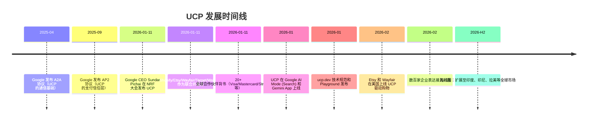

### 关键里程碑

| 时间 | 事件 | 意义 |
|------|------|------|
| 2025-04 | A2A 协议发布 | 奠定 Agent 间通信基础，后成为 UCP Services 层的传输选项 |
| 2025-09 | AP2 协议发布 | 建立 Agent 支付信任框架，后集成为 UCP 的 AP2 Mandate Extension |
| 2026-01-11 | UCP 正式发布 | Google CEO 在 NRF 大会亲自发布，信号级别极高 |
| 2026-01 | 首批商户上线 | Lowe's、Michaels、Poshmark、Reebok 作为早期部署合作伙伴 |
| 2026-02 | Etsy/Wayfair 上线 | UCP 驱动的购物体验在 Google AI Mode 中对美国用户开放 |

### 为什么是现在？

UCP 的发布时机并非偶然：
1. **AI Agent 能力成熟**：2025 年 AI Agent 已能影响大规模购买决策，缺少的最后一步是执行——需要标准化基础设施
2. **避免碎片化**：OpenAI+Stripe 的 ACP 已于 2025 年 6 月发布，Google 需要在竞争性标准固化之前推出自己的开放标准
3. **N×N 问题加剧**：随着 AI 购物界面（Search AI Mode、Gemini、ChatGPT 等）增多，商户面临的集成负担指数级增长
4. **支付生态就绪**：Visa TAP、Mastercard Agent Pay 等 Agent 支付基础设施已在 2025 年建立

## 4. 业务场景 (Use Cases)

### 消费者购物场景

- **AI 搜索直购**：用户在 Google Search AI Mode 中搜索"适合冬季跑步的鞋子"，AI Agent 发现多个 UCP 商户的商品，比较价格和评价，用户确认后直接在搜索界面完成结账，无需跳转到商户网站
- **Gemini 对话购物**：用户对 Gemini 说"帮我找一件 $50 以下的蓝色连帽衫"，Agent 通过 UCP Discovery 查询多个商户能力，展示匹配商品，用户选择后通过 Google Pay 一键完成支付
- **会员权益自动应用**：用户已通过 Identity Linking 关联了 Walmart 会员账户，Agent 在结账时自动应用 Walmart+ 会员折扣和免运费权益，无需用户手动输入
- **跨商户比价**：Agent 同时查询 Target、Wayfair 和 Etsy 的同类商品，利用 UCP 标准化的定价和履约能力，为用户生成包含价格、配送时间和退货政策的对比表

### 商户运营场景

- **统一接入多 AI 平台**：商户实现一次 UCP 集成，即可被 Google Search、Gemini、以及未来任何支持 UCP 的 AI 平台发现和交易
- **品牌 Agent 代理**：UCP 支持商户部署自己的 Business Agent（数字销售助理），在 AI 购物界面中代表品牌与消费者互动
- **嵌入式结账保留品牌体验**：通过 Embedded Checkout，商户的自定义结账 UI 嵌入在 Google 界面中，保留品牌视觉和交叉销售机会
- **实时库存和定价同步**：商户通过 UCP 能力暴露实时库存和动态定价，Agent 始终获取最新信息，减少因信息过时导致的取消订单

### 售后服务场景

- **订单追踪**：用户问 Gemini "我的 Etsy 订单到哪了"，Agent 通过 UCP Order Management 能力查询物流状态并返回
- **自动退货**：用户说"这件衣服不合身，帮我退货"，Agent 通过 UCP 发起退货请求，商户系统处理后返回退货标签
- **退款状态查询**：Agent 通过 Webhook 接收商户推送的退款状态更新，主动通知用户

### 开发者/平台场景

- **AI 平台快速接入商户**：AI 平台通过 UCP 标准化 API 批量接入商户，无需为每个商户构建定制集成
- **支付服务商统一接口**：Stripe、Adyen、PayPal 等 PSP 通过 UCP Payment Handler 规范定义一次支付处理方式，即可被所有 UCP 平台调用

## 5. 技术架构 (Architecture)

### 角色模型

UCP 定义了四个核心参与角色：

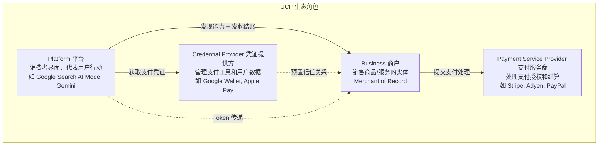

| 角色 | 职责 | 示例 |
|------|------|------|
| Platform（平台） | 面向消费者的界面，代表用户发现商户、发起结账、展示 UI | Google Search AI Mode、Gemini App、第三方 AI 购物助手 |
| Business（商户） | 销售商品/服务，作为 Merchant of Record 承担法律和财务责任 | 零售商、航空公司、酒店、服务提供商 |
| Credential Provider（凭证提供方） | 安全管理支付工具和用户数据 | Google Wallet、Apple Pay、银行数字钱包 |
| Payment Service Provider（PSP） | 处理支付授权、结算的金融基础设施 | Stripe、Adyen、PayPal、Braintree |

### 三层核心架构

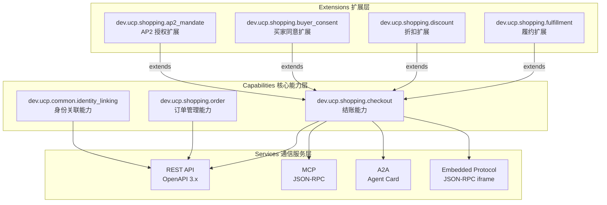

#### 1. Capabilities（核心能力）

| Capability | 命名空间 | 功能 | 技术实现 |
|-----------|---------|------|---------|
| Checkout | `dev.ucp.shopping.checkout` | 完整购买流程：创建会话、增删商品、计算总价、选择支付/配送、完成交易 | RESTful Session API，支持 Native 和 Embedded 两种模式 |
| Order Management | `dev.ucp.shopping.order` | 订单生命周期管理：物流追踪、退货发起、退款处理、状态更新 | Webhook 推送（JWT RFC 7797 签名），包含 Line Items、Fulfillment、Adjustments |
| Identity Linking | `dev.ucp.common.identity_linking` | Agent 代表用户在商户站点执行操作的授权 | OAuth 2.0 Authorization Code 流程，RFC 8414 发现，支持 Token 撤销 (RFC 7009) |

#### 2. Extensions（扩展）

| Extension | 命名空间 | 父 Capability | 功能 |
|-----------|---------|--------------|------|
| Fulfillment | `dev.ucp.shopping.fulfillment` | Checkout | 配送/自提选项、地址管理、运费计算、多种履约方式 |
| Discount | `dev.ucp.shopping.discount` | Checkout | 折扣码提交、自动折扣应用、分配方式（each/across） |
| Buyer Consent | `dev.ucp.shopping.buyer_consent` | Checkout | 隐私同意管理（analytics/preferences/marketing/sale_of_data），CCPA/GDPR 合规 |
| AP2 Mandate | `dev.ucp.shopping.ap2_mandate` | Checkout | AP2 加密授权证明，商户提供 checkoutSignature (JWT)，平台提供 CheckoutMandate + PaymentMandate |

#### 3. Services（通信服务）

| 传输协议 | 规范 | 用途 | 特点 |
|---------|------|------|------|
| REST API | OpenAPI 3.x | 主要通信方式 | 标准 HTTP 动词，JSON 请求/响应，最广泛支持 |
| MCP | JSON-RPC | LLM 集成 | UCP Capability 1:1 映射为 MCP Tool，Agent 可直接调用 `create_checkout` 等工具 |
| A2A | Agent Card 规范 | Agent 间通信 | 商户暴露 A2A Agent 支持 UCP 作为 A2A Extension |
| Embedded Protocol | JSON-RPC (iframe) | 嵌入式结账 | 通过 `continue_url` 启动，宿主与商户 iframe 双向通信 |

### 发现与协商机制

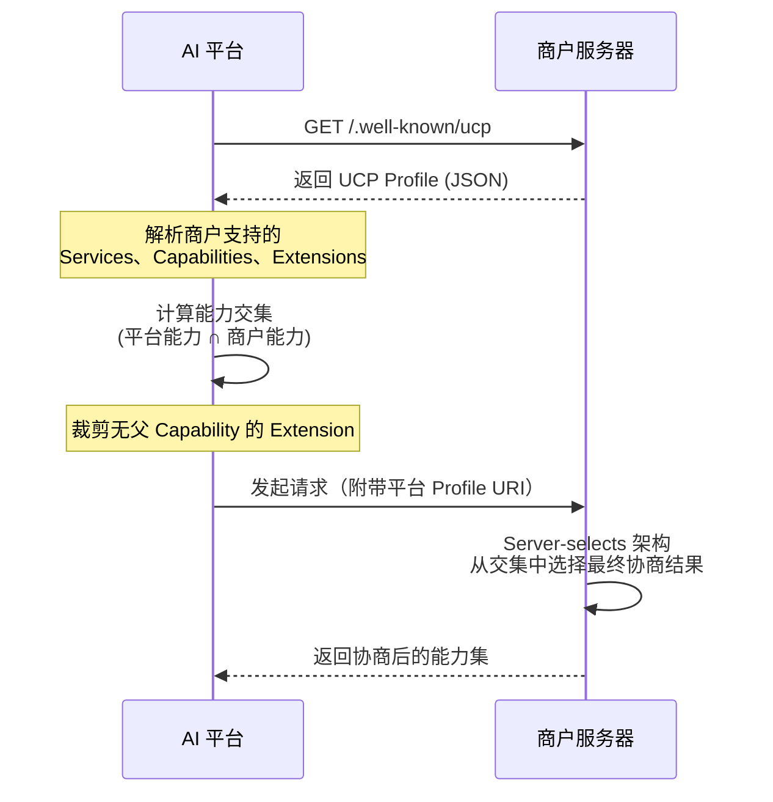

商户 UCP Profile 示例（`/.well-known/ucp`）：

```json
{
  "ucp": {
    "version": "2026-01-11",
    "services": {
      "dev.ucp.shopping": {
        "version": "2026-01-11",
        "spec": "https://ucp.dev/specification/overview",
        "rest": {
          "schema": "https://ucp.dev/services/shopping/rest.openapi.json",
          "endpoint": "https://business.example.com/ucp/v1"
        },
        "mcp": {
          "schema": "https://ucp.dev/services/shopping/mcp.openrpc.json",
          "endpoint": "https://business.example.com/ucp/mcp"
        },
        "a2a": {
          "endpoint": "https://business.example.com/.well-known/agent-card.json"
        },
        "embedded": {
          "schema": "https://ucp.dev/services/shopping/embedded.openrpc.json"
        }
      }
    },
    "capabilities": [
      {
        "name": "dev.ucp.shopping.checkout",
        "version": "2026-01-11",
        "spec": "https://ucp.dev/specification/checkout",
        "schema": "https://ucp.dev/schemas/shopping/checkout.json"
      }
    ]
  }
}
```

### Checkout 状态生命周期

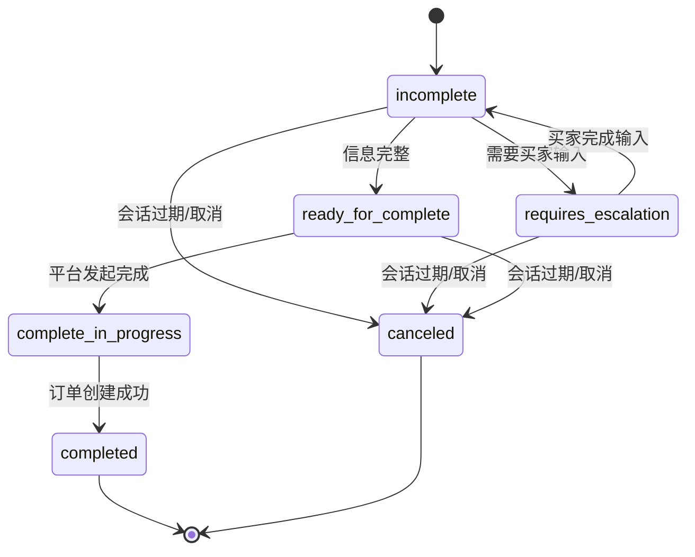

| 状态 | 说明 |
|------|------|
| `incomplete` | 缺少必要信息，平台应通过 Update Checkout 补充 |
| `requires_escalation` | 需要买家通过 `continue_url` 直接输入（如自定义选项） |
| `ready_for_complete` | 所有信息已收集，平台可发起最终确认 |
| `complete_in_progress` | 商户正在处理订单创建 |
| `completed` | 订单创建成功 |
| `canceled` | 会话无效或过期 |


### 5.1 Checkout 机制深度解析 (Checkout Deep Dive)

UCP 的 Checkout 能力是整个协议最核心的交易执行层。本节深入分析 Native Checkout 和 Embedded Checkout 的完整技术细节，包括 API 交互、状态管理和职责分离模型。

#### 5.1.1 Native Checkout 完整 API 流程

Native Checkout 采用 RESTful Session API 模式，平台（如 Google）通过四步 API 调用完成完整结账：

**Step 1: Create Checkout Session（创建结账会话）**

```
POST /checkout_sessions
```

请求示例：

```json
{
  "line_items": [
    {
      "product_id": "SKU-12345",
      "quantity": 1,
      "variant_id": "color-blue-size-m"
    }
  ],
  "buyer": {
    "email": "buyer@example.com",
    "shipping_address": {
      "street": "123 Main St",
      "city": "San Francisco",
      "state": "CA",
      "zip": "94105",
      "country": "US"
    }
  },
  "platform_profile_uri": "https://platform.example.com/.well-known/ucp"
}
```

响应示例：

```json
{
  "id": "cs_abc123",
  "status": "incomplete",
  "line_items": [...],
  "pricing": {
    "subtotal": { "amount": "59.99", "currency": "USD" },
    "shipping": { "amount": "5.99", "currency": "USD" },
    "tax": { "amount": "5.40", "currency": "USD" },
    "total": { "amount": "71.38", "currency": "USD" }
  },
  "required_fields": ["payment_method"],
  "available_payment_handlers": [
    { "handler_id": "google_pay", "name": "Google Pay" }
  ],
  "continue_url": null
}
```

商户在此步骤中执行：验证商品可用性、计算定价（含税费和运费）、创建服务端会话、返回缺失字段列表。

**Step 2: Get Checkout Session（获取会话状态）**

```
GET /checkout_sessions/{id}
```

平台可随时轮询会话状态，获取最新的定价、库存和状态信息。商户应确保响应反映实时数据。

**Step 3: Patch Checkout Session（更新会话）**

```
PATCH /checkout_sessions/{id}
```

请求示例（更新配送地址和应用折扣码）：

```json
{
  "shipping_address": {
    "street": "456 Oak Ave",
    "city": "Los Angeles",
    "state": "CA",
    "zip": "90001",
    "country": "US"
  },
  "discount_codes": ["SAVE10"]
}
```

商户收到更新后重新计算所有费用（运费可能因地址变化而改变，折扣码需验证有效性），返回更新后的完整会话状态。当所有必需字段都已填写，状态从 `incomplete` 转为 `ready_for_complete`。

**Step 4: Complete Checkout Session（完成结账）**

```
POST /checkout_sessions/{id}/complete
```

请求示例：

```json
{
  "payment_method": {
    "handler_id": "google_pay",
    "token": "encrypted_payment_token_from_google_pay"
  }
}
```

商户验证支付 Token、创建订单、扣款，状态经历 `complete_in_progress` → `completed`。

#### Agent 与 Google UI 的职责分离

Native Checkout 的关键设计原则是 **确定性保障**——Agent 负责非敏感的商品发现和购物车构建，Google UI 负责敏感信息的填写和最终确认：

| 职责方 | 操作 | 原因 |
|--------|------|------|
| AI Agent | 商品搜索与推荐 | Agent 擅长理解用户意图和跨商户比较 |
| AI Agent | 构建购物车（选择商品、数量、变体） | 非敏感操作，Agent 可自主完成 |
| Google UI | 填写/确认配送地址 | 敏感个人信息，需用户直接操作 |
| Google UI | 选择支付方式（Google Pay） | 支付凭证不经过 Agent，直接从 Credential Provider 获取 |
| Google UI | 最终购买确认 | 确保用户明确知情并同意最终金额 |
| 商户后端 | 定价、税费、库存计算 | 商户保留 Merchant of Record 的完全控制权 |

这种分离确保了：即使 Agent 出现幻觉或误解用户意图，用户在 Google UI 中仍有最终确认的机会，支付凭证也不会暴露给 Agent。

#### 5.1.2 Embedded Checkout 双向通信机制

Embedded Checkout 适用于需要复杂自定义逻辑的商户（如商品定制、特殊配置选项）。商户的 Web 结账 UI 通过 iframe/webview 嵌入 Google 界面，双方通过 JSON-RPC 协议进行双向通信。

**启动流程**

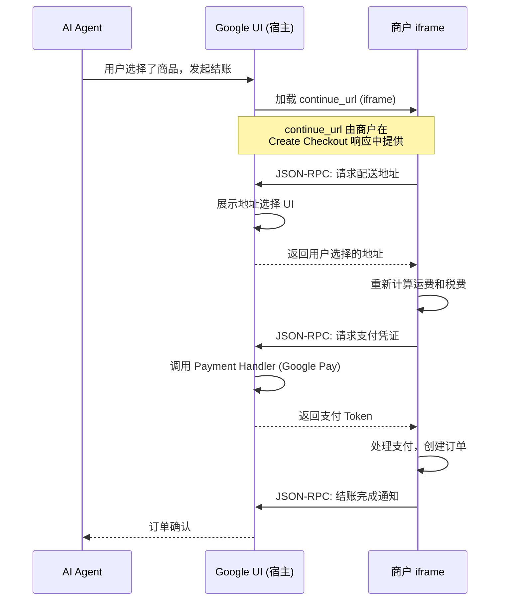

**双向通信协议**

宿主（Google UI）和商户 iframe 之间通过 JSON-RPC 消息通信：

| 方向 | 消息类型 | 说明 |
|------|---------|------|
| 商户 → 宿主 | `request_shipping_address` | 商户请求宿主提供用户配送地址 |
| 商户 → 宿主 | `request_payment_credential` | 商户请求宿主通过 Payment Handler 获取支付凭证 |
| 商户 → 宿主 | `checkout_complete` | 商户通知宿主结账已完成 |
| 商户 → 宿主 | `checkout_canceled` | 商户通知宿主结账已取消 |
| 宿主 → 商户 | `address_selected` | 宿主返回用户选择的地址 |
| 宿主 → 商户 | `payment_credential` | 宿主返回支付 Token |

**Embedded vs Native 选择矩阵**

| 维度 | Native Checkout | Embedded Checkout |
|------|----------------|-------------------|
| 适用场景 | 标准商品，流程简单 | 复杂定制商品，需要商户特有 UI |
| 开发成本 | 较低（实现 REST API） | 较高（需构建嵌入式 Web UI + JSON-RPC） |
| 品牌体验 | Google UI 统一风格 | 商户保留完整品牌视觉 |
| 交叉销售 | 有限 | 商户可在 iframe 中展示推荐商品 |
| 用户体验一致性 | 高（跨商户统一） | 因商户而异 |
| 敏感信息处理 | Google UI 直接处理 | 商户可委托给宿主，也可自行处理 |

#### 5.1.3 Checkout Session 状态机详解

Checkout Session 的状态转换不仅是简单的线性流程，而是包含多个分支和回退路径的完整状态机：

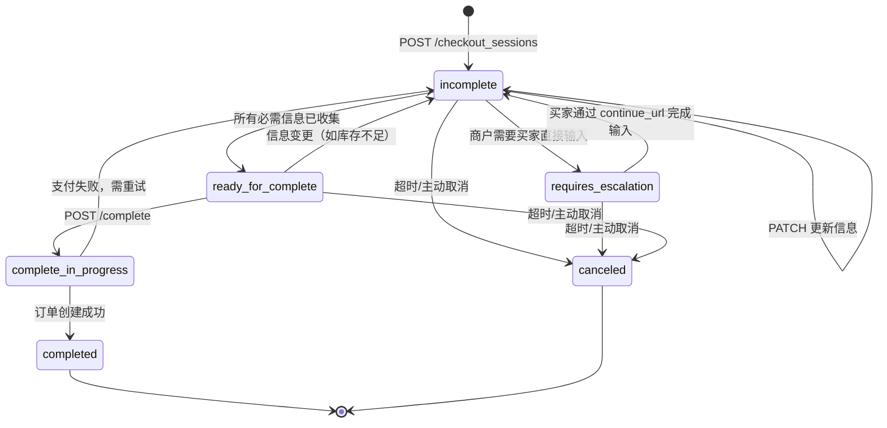

关键状态转换说明：

| 转换 | 触发条件 | 处理逻辑 |
|------|---------|---------|
| `incomplete` → `requires_escalation` | 商户需要买家直接输入（如选择定制选项、确认年龄验证） | 商户返回 `continue_url`，平台引导用户在商户页面完成操作 |
| `requires_escalation` → `incomplete` | 买家在 `continue_url` 页面完成输入 | 商户更新会话数据，平台继续结账流程 |
| `ready_for_complete` → `incomplete` | 库存变化、价格更新或其他后端状态变更 | 平台需重新获取会话状态并补充信息 |
| `complete_in_progress` → `incomplete` | 支付处理失败（如余额不足、Token 过期） | 平台需引导用户重新选择支付方式 |

---

### 5.2 Identity Linking 机制深度解析 (Identity Linking Deep Dive)

Identity Linking 是 UCP 的身份关联能力，允许 AI Agent 代表用户在商户站点执行操作。它解决的核心问题是：**Agent 如何证明自己有权代表某个用户访问该用户在商户处的账户？**

#### 5.2.1 OAuth 2.0 Authorization Code 流程

UCP 的 Identity Linking 基于 OAuth 2.0 Authorization Code Grant（RFC 6749），采用 `client_secret_basic` 认证方式（RFC 6749 Section 2.3.1）。

**完整流程**

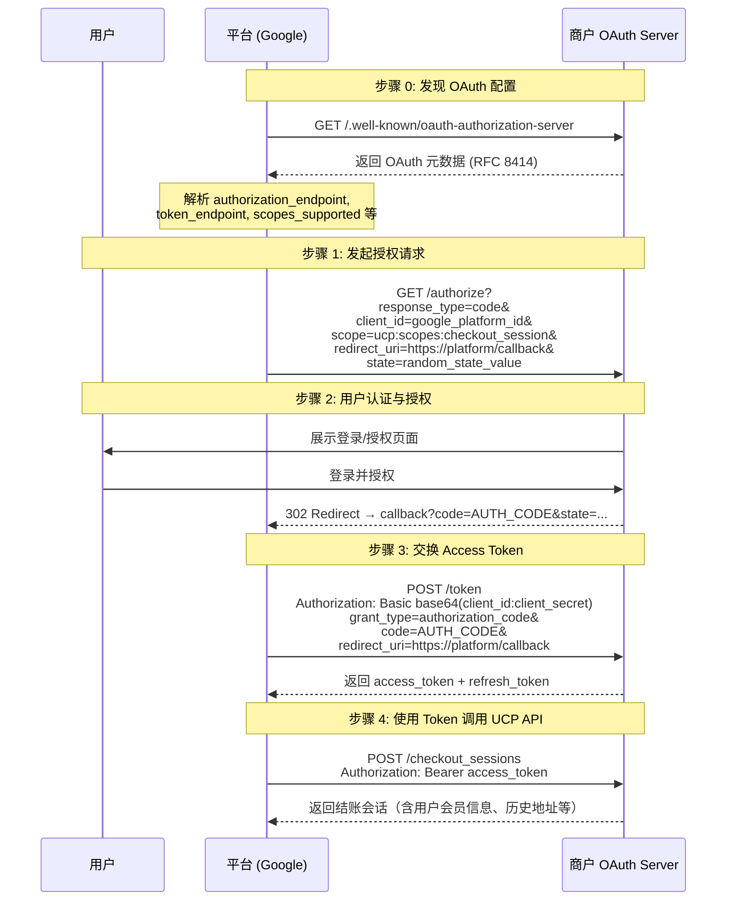

#### 5.2.2 OAuth 元数据发现 (RFC 8414)

商户必须在 `/.well-known/oauth-authorization-server` 发布 OAuth 服务器元数据：

```json
{
  "issuer": "https://business.example.com",
  "authorization_endpoint": "https://business.example.com/oauth/authorize",
  "token_endpoint": "https://business.example.com/oauth/token",
  "revocation_endpoint": "https://business.example.com/oauth/revoke",
  "scopes_supported": [
    "ucp:scopes:checkout_session",
    "ucp:scopes:order_management"
  ],
  "response_types_supported": ["code"],
  "grant_types_supported": ["authorization_code", "refresh_token"],
  "token_endpoint_auth_methods_supported": ["client_secret_basic"],
  "code_challenge_methods_supported": ["S256"]
}
```

关键设计决策：

| 设计点 | UCP 选择 | 原因 |
|--------|---------|------|
| 认证方式 | `client_secret_basic` | HTTP Basic Auth 简单可靠，广泛支持 |
| Scope 命名 | `ucp:scopes:checkout_session` | 统一前缀确保跨商户一致性，Agent 无需为每个商户学习不同的 scope |
| 发现机制 | RFC 8414 | 标准化元数据发现，平台无需硬编码商户 OAuth 端点 |
| PKCE 支持 | `S256` | 防止授权码拦截攻击（RFC 7636） |

#### 5.2.3 Google Streamlined Linking（简化关联）

标准 OAuth 流程需要浏览器重定向，用户体验较为割裂。Google 提供了 Streamlined Linking 机制，允许用户在 Google UI 内完成账户关联或创建，无需跳转到商户网站。

**核心机制：JWT Assertions**

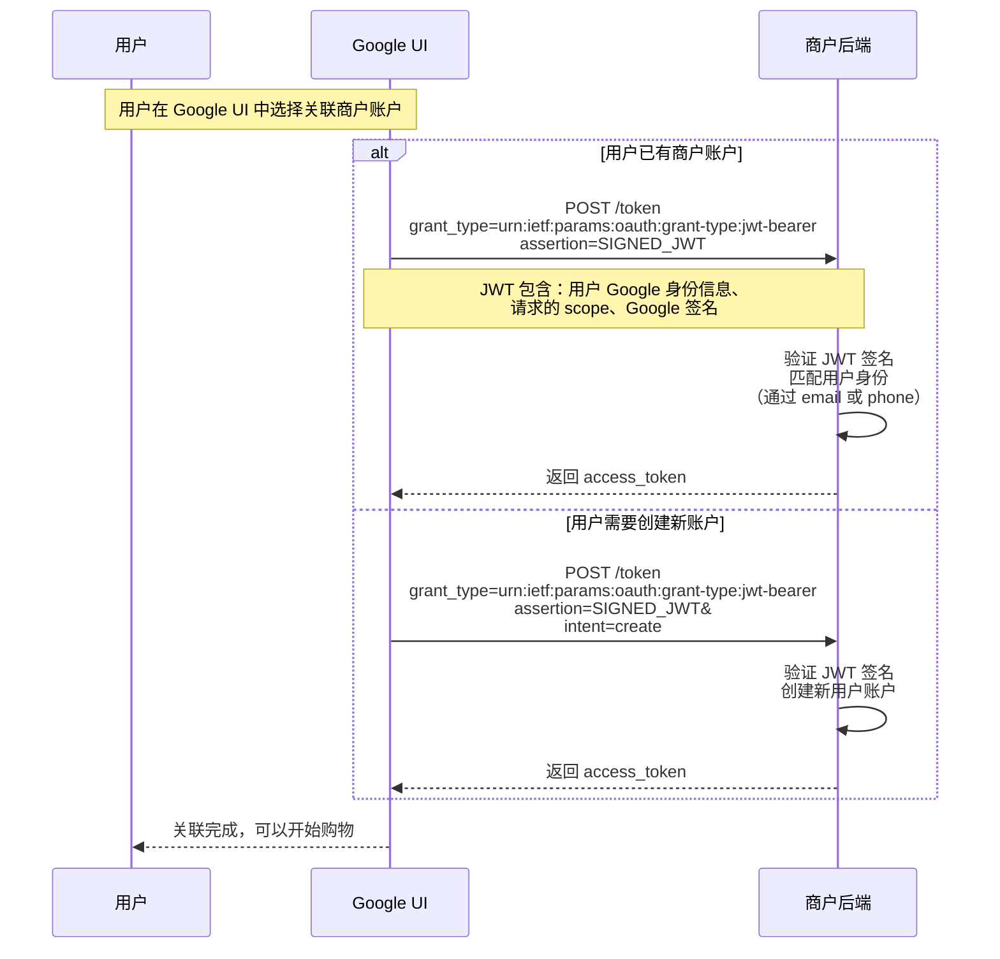

Streamlined Linking 的优势：
- **无浏览器重定向**：用户始终在 Google UI 中操作，体验流畅
- **自动账户匹配**：通过 Google 身份信息（email/phone）自动匹配商户账户
- **支持账户创建**：用户无需离开 Google UI 即可在商户处创建新账户
- **JWT 安全保障**：Google 签名的 JWT 确保请求来源可信

#### 5.2.4 Token 管理与安全

**Token 撤销 (RFC 7009)**

用户可随时撤销对平台的授权：

```
POST /oauth/revoke
Content-Type: application/x-www-form-urlencoded
Authorization: Basic base64(client_id:client_secret)

token=ACCESS_TOKEN&token_type_hint=access_token
```

商户必须支持 Token 撤销端点，确保用户对数据访问的完全控制权。

**Guest Checkout 降级方案**

当 Identity Linking 不可用时（用户拒绝关联、商户不支持、Token 过期），UCP 自动降级为 Guest Checkout：

| 场景 | 行为 |
|------|------|
| 用户拒绝关联 | 以访客身份结账，不获取会员权益 |
| Token 过期且 refresh 失败 | 提示用户重新授权，或降级为访客 |
| 商户不支持 Identity Linking | 直接使用 Guest Checkout，手动填写信息 |

Guest Checkout 确保了 UCP 的普适性——即使没有身份关联，基本的结账流程仍然可以完成。

---

### 5.3 支付三角信任模型深度解析 (Payment Triangle Deep Dive)

UCP 的支付架构基于"支付三角"（Payment Triangle）信任模型，将支付工具（Payment Instrument）与支付处理方式（Payment Handler）解耦，实现了灵活且安全的支付编排。

#### 5.3.1 四方角色模型与信任关系

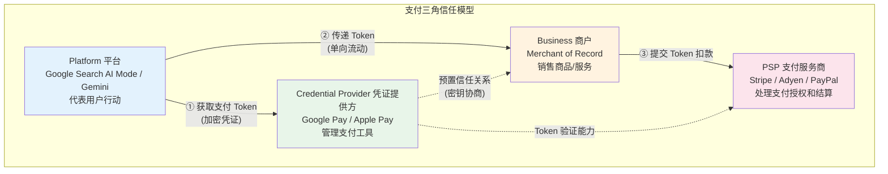

**信任关系矩阵**

| 关系 | 信任类型 | 建立方式 | 数据流向 |
|------|---------|---------|---------|
| Platform ↔ Credential Provider | 技术集成信任 | 平台集成 Google Pay SDK，通过 API 获取 Token | 平台请求 → CP 返回加密 Token |
| Platform → Business | 单向 Token 传递 | 平台将 Token 附在 Complete Checkout 请求中 | 仅 Platform → Business（不可反向） |
| Credential Provider ↔ Business | 预置密钥信任 | 商户在 PSP 处配置 Google Pay，CP 与 PSP 共享解密密钥 | 密钥协商在注册时完成 |
| Business → PSP | 支付处理信任 | 商户与 PSP 签约，获取 API 密钥 | 商户提交 Token → PSP 解密并处理 |

#### 5.3.2 Payment Handler 抽象层

Payment Handler 是 UCP 支付架构的核心抽象——它将"用什么支付"（Payment Instrument）与"怎么处理支付"（Handler）解耦：

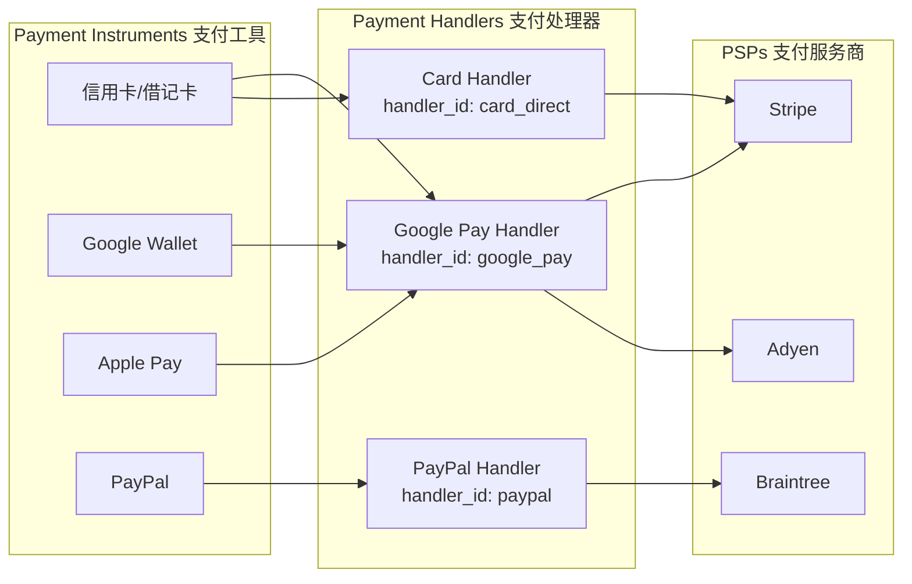

**Handler 的职责**

| 职责 | 说明 |
|------|------|
| Token 生成 | 将原始支付工具（如卡号）转换为加密 Token |
| 安全封装 | 确保敏感数据（卡号、CVV）不暴露给平台或 Agent |
| 路由决策 | 根据 Handler ID 将 Token 路由到正确的 PSP |
| 密钥管理 | 管理与商户/PSP 之间的加密密钥 |

#### 5.3.3 Google Pay Handler 具体实现

Google Pay 是 UCP 初期的主要 Payment Handler，采用 Headless 集成模式：

**商户配置（一次性）**

商户在 UCP Profile 中声明支持 Google Pay Handler：

```json
{
  "payment_handlers": [
    {
      "handler_id": "google_pay",
      "supported_networks": ["visa", "mastercard", "amex"],
      "supported_methods": ["PAN_ONLY", "CRYPTOGRAM_3DS"],
      "gateway": "stripe",
      "gateway_merchant_id": "merchant_stripe_id"
    }
  ]
}
```

**Token 获取与传递流程**

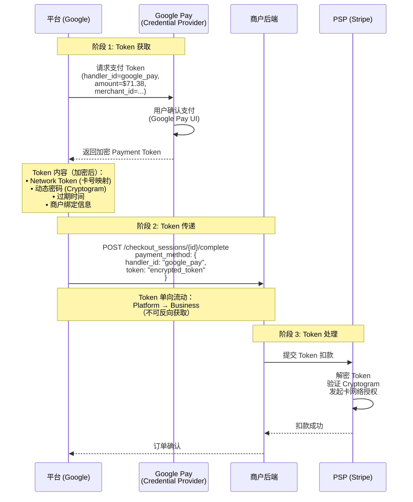

#### 5.3.4 安全设计原则

**凭证单向流动原则**

UCP 严格执行凭证的单向流动：Token 只能从 Platform 传递给 Business，Business 不能反向获取 Platform 持有的其他凭证。这确保了：
- 商户无法获取用户的原始支付信息
- 即使商户系统被攻破，攻击者也无法利用 Token 反向获取卡号
- PCI-DSS 合规范围最小化——商户只需处理 Token，不接触原始卡数据

**Handler ID 路由防止密钥混淆攻击**

每个 Payment Handler 有唯一的 `handler_id`，Token 在生成时绑定了特定的 Handler ID 和商户信息。这防止了"密钥混淆攻击"——攻击者无法将一个商户的 Token 用于另一个商户，因为 PSP 在解密时会验证 Token 中的商户绑定信息。

**三阶段支付生命周期**

| 阶段 | 名称 | 参与方 | 操作 |
|------|------|--------|------|
| 1 | Negotiation（协商） | Platform ↔ Business | 商户声明支持的 Payment Handler，平台选择可用的 Handler |
| 2 | Acquisition（获取） | Platform ↔ Credential Provider | 平台从凭证提供方获取加密 Token |
| 3 | Completion（完成） | Platform → Business → PSP | 平台将 Token 提交给商户，商户转交 PSP 处理 |

---

### 5.4 四方完整交互时序 (End-to-End Interaction Sequence)

以下时序图展示了 Platform、Business、Credential Provider 和 PSP 四方在一次完整 UCP 结账流程中的交互：

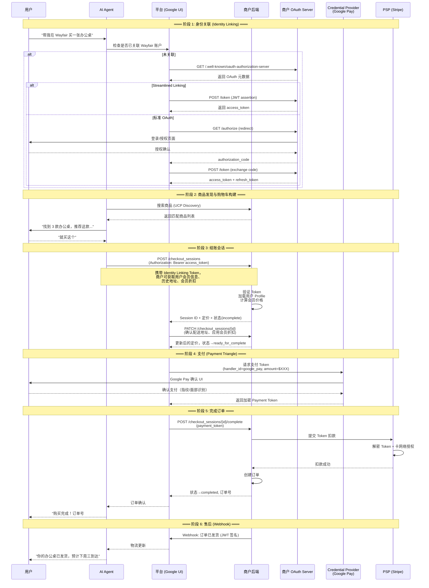

#### 各阶段关键技术要点

| 阶段 | 关键技术 | 安全保障 |
|------|---------|---------|
| 身份关联 | OAuth 2.0 + RFC 8414 发现 + Streamlined Linking (JWT) | PKCE 防授权码拦截，Token 撤销支持 (RFC 7009) |
| 商品发现 | UCP Discovery Manifest + 能力协商 | Server-selects 架构，商户控制暴露的能力 |
| 结账会话 | RESTful Session API + 状态机 | 会话超时自动取消，幂等操作 |
| 支付 | Payment Handler 抽象 + Token 单向流动 | PCI-DSS 范围最小化，Handler ID 防密钥混淆 |
| 完成订单 | 原子性操作（扣款+创建订单） | 支付失败可回退到 incomplete 状态 |
| 售后 | Webhook + JWT (RFC 7797) 签名 | 签名验证确保 Webhook 来源可信 |

---

### 5.5 与 ACP Checkout 的技术对比

| 维度 | UCP Checkout | ACP Checkout |
|------|-------------|-------------|
| API 风格 | `POST` 创建 + `GET` 查询 + `PATCH` 更新 + `POST` 完成 | `POST` 创建 + `POST` 更新 + `GET` 查询 + `POST` 完成 + `POST` 取消 |
| 更新方式 | `PATCH`（部分更新，语义更精确） | `POST`（全量提交修改） |
| 身份关联 | 原生 Identity Linking (OAuth 2.0) | 无原生身份关联 |
| 支付抽象 | Payment Handler（解耦工具与处理） | Delegated Vault Token（一次性令牌） |
| 嵌入式结账 | 原生支持（Embedded Protocol + JSON-RPC） | 支持（嵌入式 UI 渲染在 Agent 界面） |
| 状态机复杂度 | 6 个状态，含 `requires_escalation` 回退 | 较简单，线性流程为主 |
| 会员权益 | 通过 Identity Linking 自动应用 | 需商户在 Product Feed 中预置 |
| 售后管理 | 原生 Order Management Capability | 商户自行处理 |
| 传输协议 | REST + MCP + A2A + Embedded（四种） | 仅 REST（可实现为 MCP Server） |


## 6. 实现逻辑 (Implementation Logic)

### 商户接入完整流程

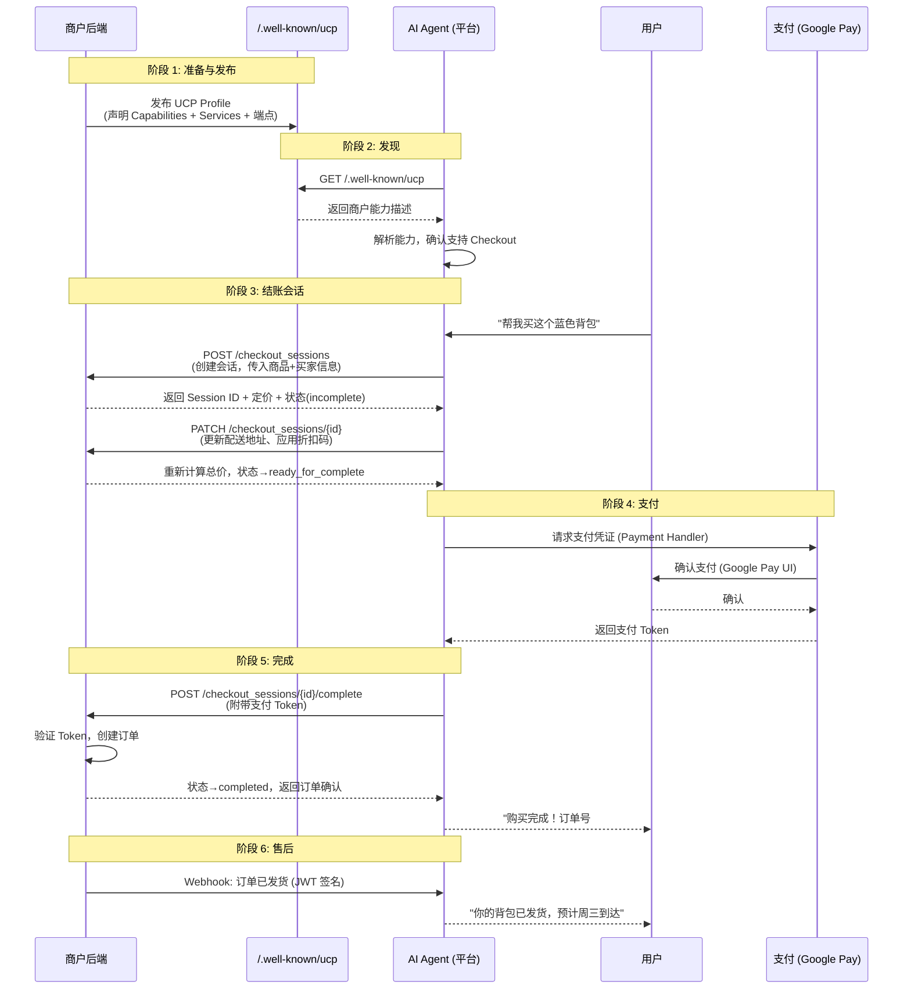

### 两种结账集成模式

#### Native Checkout（原生结账）

商户构建 RESTful API，Google 直接调用：

```
POST   /checkout_sessions              → 创建结账会话
GET    /checkout_sessions/{id}         → 获取会话状态
PATCH  /checkout_sessions/{id}         → 更新会话（添加商品、地址、折扣等）
POST   /checkout_sessions/{id}/complete → 完成订单
```

流程：Agent 构建购物车 → 传递给 Google UI → 用户在 Google UI 中填写敏感信息（地址、支付）→ 提交订单。

适用场景：标准商品，无需复杂自定义逻辑。

#### Embedded Checkout（嵌入式结账）

商户的 Web 结账 UI 通过 iframe 嵌入 Google 界面：

```json
// 商户在 UCP Profile 中声明 Embedded 支持
"embedded": {
  "schema": "https://ucp.dev/services/shopping/embedded.openrpc.json"
}
```

流程：商户返回 `continue_url` → Google 在 iframe 中加载商户结账页面 → 双向通信（宿主可委托地址选择、支付凭证等）→ 商户保留完整结账体验。

适用场景：需要复杂自定义逻辑（如商品定制、特殊配置）的商户。

### 支付架构

UCP 采用解耦的支付架构，将支付工具（Payment Instrument）与支付处理（Payment Handler）分离：

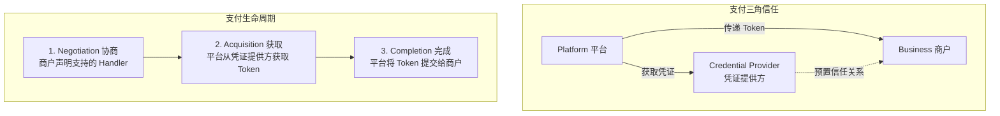

安全原则：
- 凭证单向流动：Platform → Business（不可反向）
- 平台处理 Token 而非原始卡号（PCI-DSS 范围最小化）
- Handler ID 路由确保正确密钥使用（防止密钥混淆攻击）

### 在 Google 平台上线的额外步骤

UCP 本身是平台无关的，但在 Google 界面（AI Mode、Gemini）上线需要额外步骤：

1. **设置 Merchant Center 账户**：Google 的验证和政策层，存储商品 Feed、配送/退货政策、税务设置
2. **获取 UCP 审批**：Google 单独审批 UCP 集成，聚焦支付安全、消费者保护和 Agent 发起结账的合规性
3. **使能力可发现**：通过标准 UCP 发现流程，在 Google 的 AI 体验中暴露商务能力

### Schema 架构

UCP 使用 JSON Schema 进行数据验证，采用日期版本化（YYYY-MM-DD）和反向域名命名空间：

| Schema 类别 | 用途 | 命名空间示例 |
|------------|------|-------------|
| Capability Schema | 定义协商后的能力 | `dev.ucp.shopping.checkout` |
| Component Schema | 能力内的数据结构 | 购物车、定价、税费等 |
| Type Schema | 可复用的类型定义 | 地址、货币、日期等 |
| Meta Schema | 协议结构定义 | UCP Profile 格式 |

所有 Capability Schema 必须是自描述的（self-describing），包含 `name` 和 `version` 字段，无需交叉引用其他文档即可确定能力和版本。

供应商可使用自己的反向域名命名空间扩展 UCP（如 `com.shopify.loyalty`），无需中央注册。

## 7. 生态与社区 (Ecosystem & Community)

### 合作伙伴全景

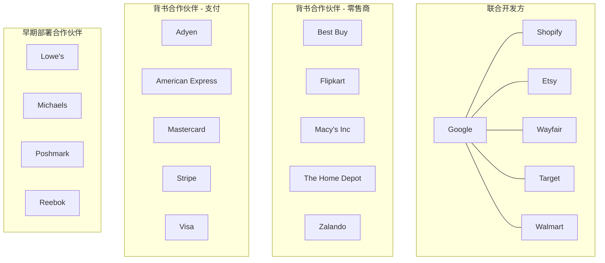

### 合作伙伴分类

| 类别 | 合作伙伴 | 参与方式 |
|------|---------|---------|
| 联合开发 | Shopify、Etsy、Wayfair、Target、Walmart | 参与协议设计和规范制定 |
| 支付背书 | Adyen、American Express、Mastercard、Stripe、Visa、PayPal | 支持 UCP 支付标准，计划集成 Payment Handler |
| 零售背书 | Best Buy、Flipkart、Macy's、The Home Depot、Zalando | 计划接入 UCP，暴露商务能力 |
| 早期部署 | Lowe's、Michaels、Poshmark、Reebok | 已在 Google AI 购物助手中部署 UCP 集成 |
| 已上线 | Etsy、Wayfair | 已在 Google AI Mode (Search) 和 Gemini 中上线 UCP 驱动购物 |

### Walmart 的深度集成

Walmart 计划将 UCP 驱动的商品发现直接集成到 Gemini 中，利用用户的购买历史推荐互补商品，并跨 Walmart 和 Sam's Club 应用会员权益。这是 UCP Identity Linking 能力的典型应用场景。

### Shopify 的战略定位

Shopify 作为联合开发方，将 UCP 定位为标准化商务交互的方式，同时不剥夺商户的控制权。Shopify 的数百万商户可通过 Shopify 平台统一接入 UCP，大幅降低单个商户的集成成本。供应商可使用 `com.shopify.*` 命名空间扩展 UCP 能力。

### 开源与社区

| 维度 | 详情 |
|------|------|
| 开源协议 | 开源（具体协议待确认） |
| 技术规范 | [ucp.dev/specification](https://ucp.dev/specification) |
| GitHub | [github.com/Universal-Commerce-Protocol/ucp](https://github.com/Universal-Commerce-Protocol/ucp) |
| Playground | [ucp.dev/playground](https://ucp.dev/playground) — 交互式演示环境 |
| 参考实现 | Python 和 TypeScript，社区贡献其他语言 |
| 成熟度 | early-stage（2026 年 1 月刚发布，快速增长中） |
| 治理 | Google 主导，行业合作伙伴参与 |

### 与其他协议的生态关系

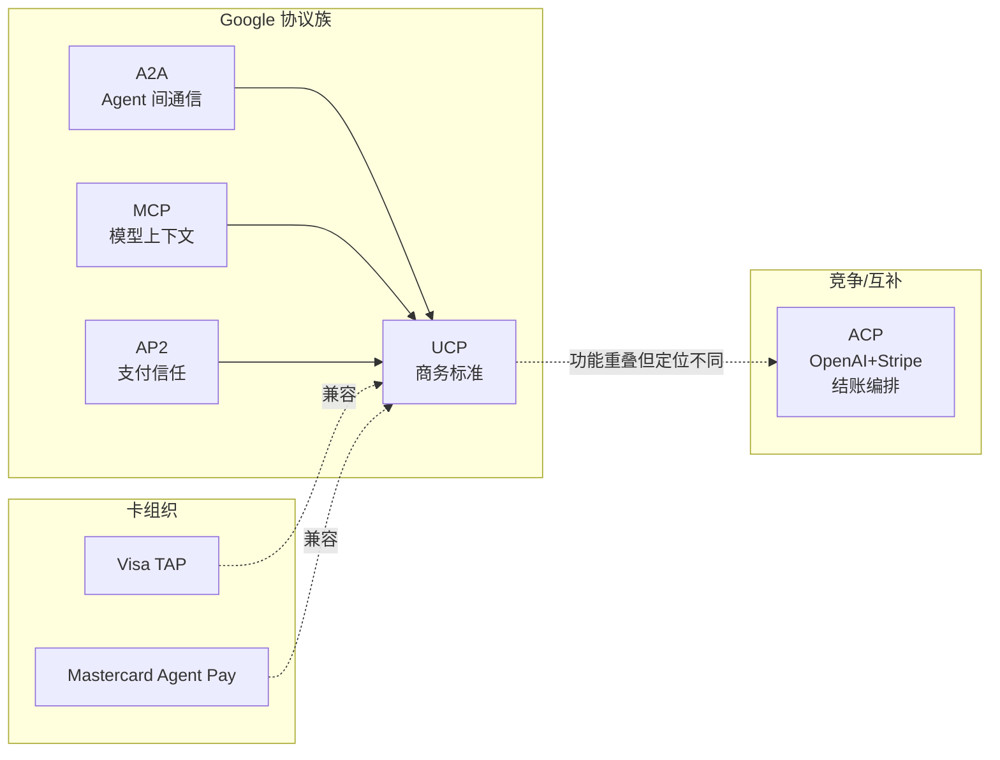

## 8. 优劣势与竞品对比 (Pros, Cons & Comparison)

### UCP 优势

1. **全旅程覆盖**：从发现到售后的完整商务生命周期，不仅仅是结账
2. **传输协议灵活**：同时支持 REST、MCP、A2A、Embedded 四种通信方式，适应不同技术栈
3. **商户保留控制权**：Merchant of Record 身份不变，定价、库存、履约逻辑由商户决定
4. **强大的合作伙伴生态**：20+ 全球顶级零售商和支付公司背书，Shopify 作为联合开发方带来百万级商户基础
5. **原生 AP2 集成**：内置加密授权证明，支持 Agent 自主交易的安全需求
6. **可扩展架构**：供应商可通过反向域名命名空间自定义扩展，无需中央注册
7. **Google 分发优势**：直接在 Google Search AI Mode 和 Gemini 中触达用户

### UCP 劣势

1. **早期阶段**：2026 年 1 月刚发布，生态仍在建设中，功能和集成方式可能频繁变化
2. **Google 平台依赖**：虽然协议本身是开放的，但当前主要在 Google 界面中运行，实际的平台中立性有待验证
3. **商户"最后触点"风险**：结账移入 AI Agent 和浏览器级体验后，商户可能失去交叉销售、追加销售和品牌强化的最终交互点
4. **集成复杂度较高**：相比 ACP 的纯 REST 方案，UCP 的多传输协议和能力协商机制增加了实现复杂度
5. **数据质量要求高**：Agent 无法从非结构化页面推断信息，商户必须提供高质量的结构化商品数据
6. **支付方式有限**：初期仅支持 Google Pay，PayPal 等其他支付方式计划后续集成
7. **地理覆盖有限**：当前仅在美国上线，全球扩展（印度、印尼、拉美）在路线图中但尚未实现

### UCP vs ACP 全面对比

| 维度 | UCP (Google+Shopify) | ACP (OpenAI+Stripe) |
|------|---------------------|---------------------|
| 核心定位 | 标准化结账执行和全旅程商务互操作 | Agent 驱动的购物决策和委托购买 |
| 解决的问题 | N×N 集成复杂度，跨平台结账标准化 | Agent 如何代表用户完成购买 |
| 关键概念 | Capabilities + Extensions + Services | Product Feed + Checkout + Delegated Payment |
| 协议层次 | 执行层（交易如何可靠完成） | 决策层（Agent 如何协调购买决策） |
| 传输协议 | REST + MCP + A2A + Embedded（多协议） | 仅 REST API |
| 支付方式 | Google Pay（初期），计划扩展 PayPal 等 | Stripe 支付（卡、钱包等） |
| 商户接入 | Merchant Center + UCP 审批 + /.well-known/ucp | Stripe 集成 + ACP 端点实现 |
| 商户控制 | Merchant of Record，支持 Embedded Checkout 保留品牌体验 | Merchant of Record，商户保留订单接受/拒绝权 |
| 发现机制 | /.well-known/ucp JSON Manifest + 能力协商 | Product Feed 结构化商品数据 |
| 售后支持 | 原生支持（Order Management Capability + Webhook） | 商户自行处理 |
| 身份关联 | OAuth 2.0 Identity Linking（关联商户会员账户） | 无原生身份关联 |
| 安全授权 | AP2 Mandate Extension（加密签名） | Delegated Vault Token（一次性令牌） |
| 开源 | 开源 | Apache 2.0 |
| 主要运行界面 | Google Search AI Mode、Gemini App | ChatGPT Instant Checkout |
| 合作伙伴 | 20+ 全球零售商和支付公司 | Stripe 商户生态 |
| 生产状态 | 已上线（Etsy、Wayfair 在美国） | 已上线（ChatGPT Checkout） |
| 适用场景 | 大型零售商、多平台分发、全旅程商务 | 快速接入、ChatGPT 渠道、简单结账流程 |

### 关键洞察：UCP 和 ACP 不是二选一

UCP 和 ACP 在同一购物旅程中可以共存：
- 用户可以通过 ACP 风格的 AI 助手（如 ChatGPT）完成商品发现和决策
- 最终的结账执行可以通过 UCP 风格的标准化协议完成
- 商户可以同时支持两者，将它们视为不同的订单来源渠道

对商户而言，正确的策略不是"选一个"，而是确保商品数据、库存准确性和订单处理能力足够健壮，能够接入两者。

## 9. 快速上手 (Getting Started)

### 商户接入步骤

#### 步骤 1：准备商务后端

确保后端系统能够：
- 管理商品数据、定价和库存
- 应用业务规则（税费、折扣、履约约束）
- 处理结账会话和订单创建
- 暴露 API 供 AI Agent 调用

UCP 叠加在现有商务基础设施之上，不需要替换现有系统。

#### 步骤 2：发布 UCP Profile

在 `/.well-known/ucp` 发布 JSON Manifest：

```json
{
  "ucp": {
    "version": "2026-01-11",
    "services": {
      "dev.ucp.shopping": {
        "version": "2026-01-11",
        "rest": {
          "schema": "https://ucp.dev/services/shopping/rest.openapi.json",
          "endpoint": "https://your-store.com/ucp/v1"
        }
      }
    },
    "capabilities": [
      {
        "name": "dev.ucp.shopping.checkout",
        "version": "2026-01-11"
      }
    ]
  }
}
```

#### 步骤 3：实现 Checkout API

Native Checkout 核心端点：

```
POST   /checkout_sessions              # 创建结账会话
GET    /checkout_sessions/{id}         # 获取会话状态
PATCH  /checkout_sessions/{id}         # 更新会话
POST   /checkout_sessions/{id}/complete # 完成订单
```

#### 步骤 4：配置支付处理

声明支持的 Payment Handler，配置与 PSP 的集成。

#### 步骤 5：设置 Webhook

为订单生命周期事件（发货、退款等）配置 Webhook 端点，使用 JWT (RFC 7797) 签名验证。

#### 步骤 6（Google 平台）：Merchant Center + UCP 审批

如需在 Google AI Mode 和 Gemini 中上线：
1. 设置 Google Merchant Center 账户
2. 申请 Google UCP 审批
3. 通过审批后，商务能力自动在 Google AI 体验中可发现

### 开发者资源

| 资源 | 链接 |
|------|------|
| 技术规范 | [ucp.dev/specification](https://ucp.dev/specification) |
| Playground | [ucp.dev/playground](https://ucp.dev/playground) |
| GitHub | [github.com/Universal-Commerce-Protocol/ucp](https://github.com/Universal-Commerce-Protocol/ucp) |
| Google 开发者指南 | [developers.google.com/merchant/ucp](https://developers.google.com/merchant/ucp) |
| UCP Profile 指南 | [developers.google.com/merchant/ucp/guides/ucp-profile](https://developers.google.com/merchant/ucp/guides/ucp-profile) |
| Native Checkout 指南 | [developers.google.com/merchant/ucp/guides/checkout/native](https://developers.google.com/merchant/ucp/guides/checkout/native) |
| Embedded Checkout 指南 | [developers.google.com/merchant/ucp/guides/checkout/embedded](https://developers.google.com/merchant/ucp/guides/checkout/embedded) |
| Identity Linking 指南 | [developers.google.com/merchant/ucp/guides/identity-linking](https://developers.google.com/merchant/ucp/guides/identity-linking) |

### 路线图

| 方向 | 内容 |
|------|------|
| 全旅程深化 | 商品发现、购物车构建、忠诚度/会员权益、原生交叉销售和追加销售 |
| 全球扩展 | 印度、印尼、拉美等市场，适配区域化支付互操作 |
| 支付方式扩展 | PayPal 及更多支付方式集成 |
| 社区驱动 | 基于社区反馈和业务需求灵活调整优先级 |

## 10. 来源 (Sources)

### 官方文档
- [Google Developers Blog: Under the Hood — Universal Commerce Protocol (UCP)](https://developers.googleblog.com/under-the-hood-universal-commerce-protocol-ucp/)
- [Google UCP 开发者指南 — UCP Profile](https://developers.google.com/merchant/ucp/guides/ucp-profile)
- [Google UCP 开发者指南 — Native Checkout](https://developers.google.com/merchant/ucp/guides/checkout/native)
- [Google UCP 开发者指南 — Embedded Checkout](https://developers.google.com/merchant/ucp/guides/checkout/embedded)
- [Google UCP 开发者指南 — Identity Linking](https://developers.google.com/merchant/ucp/guides/identity-linking)
- [Google UCP 开发者指南 — Google Pay Payment Handler](https://developers.google.com/merchant/ucp/guides/google-pay-payment-handler)
- [UCP 技术规范](https://ucp.dev/specification)
- [UCP GitHub 仓库](https://github.com/Universal-Commerce-Protocol/ucp)

### 行业分析
- [AltexSoft: Google's Universal Commerce Protocol Explained](https://www.altexsoft.com/blog/universal-commerce-protocol/)
- [Unthinkable: UCP Explained — Architecture, Payments, and Agentic Commerce](https://www.unthinkable.co/blogs/ucp-explained-architecture-payments-and-agentic-commerce/)
- [a2aprotocol.ai: Universal Commerce Protocol — The Complete 2026 Guide](https://a2aprotocol.ai/blog/2026-universal-commerce-protocol)
- [Cahoot.ai: OpenAI ACP vs Google UCP](https://www.cahoot.ai/openai-acp-vs-google-ucp/)
- [Atwix: The Real Differences Between AI Shopping Protocols](https://www.atwix.com/ecommerce/ucp-vs-acp-differences/)
- [Search Engine Journal: Google's Ads Chief Details UCP Expansion](https://www.searchenginejournal.com/googles-ads-chief-details-ucp-expansion-new-ai-mode-ads/567007/)
- [InfoQ: Google's UCP Powers Agentic Shopping](https://www.infoq.com/news/2026/01/google-ucp/)
- [Fintech Wrapup: Breaking Down Shopify and Google's UCP](https://www.fintechwrapup.com/p/deep-dive-breaking-down-shopify-and)
- [PPC Land: Universal Commerce Protocol Could Make Checkout Buttons Obsolete](https://ppc.land/universal-commerce-protocol-could-make-checkout-buttons-obsolete/)
- [Ekamoira: UCP — The Complete 2026 Guide to Agentic Commerce](https://www.ekamoira.com/blog/universal-commerce-protocol-ucp-complete-2026-guide-to-agentic-commerce-visibility-implementation-and-strategy)
- [TF Labs: Developer Guide to Implementing UCP](https://www.tflabs.io/post/developer-guide-to-implementing-the-universal-commerce-protocol-ucp)

> Content was rephrased for compliance with licensing restrictions. 所有内容均基于公开来源整理，已进行改写和综合分析。
