# OpenAI + Stripe ACP (Agentic Commerce Protocol) 深度研究报告

> 本报告是 Agentic Payment 系列研究的子报告之一，聚焦 OpenAI 与 Stripe 联合主导的 Agentic Commerce Protocol (ACP)。
> 总览报告见 [agentic_payment_research.md](../agentic_payment_research.md)，AP2 报告见 [2.google_ap2/google_ap2_research.md](../2.google_ap2/google_ap2_research.md)。

## 1. 概述 (Overview)

Agentic Commerce Protocol (ACP) 是 OpenAI 与 Stripe 于 2025 年 6 月联合发布的开放商务协议，专为 AI Agent 驱动的商品发现、结账和支付设计。ACP 的核心使命是**让 AI Agent 能够在对话中无缝完成购物**——从商品发现到结账支付，全程不离开 Agent 界面。

ACP 不处理支付信任与授权（那是 AP2 的职责），也不处理 Agent 间通信（那是 A2A 的职责）。它解决的是一个更直接的问题：**当用户在 AI 对话中说"帮我买这个"时，Agent 如何与商户系统完成标准化的结账流程？**

ACP 由三大子规范组成：Product Feed Spec（商品数据规范）、Agentic Checkout Spec（结账规范）和 Delegated Payment Spec（委托支付规范），覆盖了从商品发现到支付完成的完整结账链路。

2025 年 9 月 29 日，ACP 在 ChatGPT 中以 **Instant Checkout** 功能正式上线，成为全球首个大规模落地的 AI Agent 购物体验。首批合作商户包括 Etsy、Shopify（100 万+商户）、Glossier、SKIMS、Spanx、Vuori 等。

关键差异化特征：

- **结账层定位**：不是支付协议，而是结账编排协议——标准化 Agent 与商户之间的购物车管理和结账流程
- **三大子规范**：Product Feed（商品数据）+ Agentic Checkout（结账流程）+ Delegated Payment（委托支付），覆盖完整结账链路
- **SharedPaymentToken (SPT)**：Stripe 设计的核心支付原语——商户限定、金额限定、时间限定、一次性使用的委托支付令牌
- **嵌入式结账**：结账 UI 渲染在 Agent 界面内，用户无需跳转到商户网站
- **商户控制权**：商户保留 Merchant of Record 身份，保留订单接受/拒绝权
- **已大规模落地**：ChatGPT Instant Checkout 已上线运行，非实验性协议

### ACP 在 Agentic Commerce 技术栈中的位置

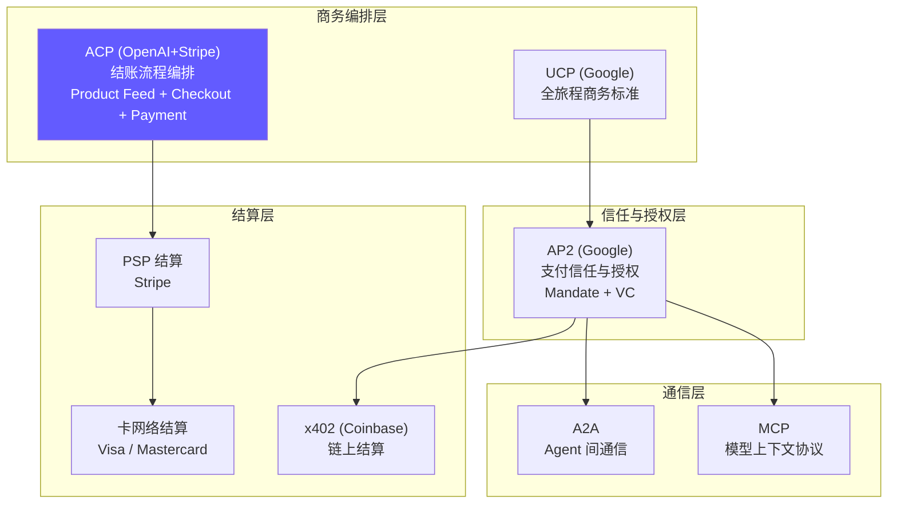
```mermaid
graph TD
    subgraph 商务编排层
        ACP_P["ACP (OpenAI+Stripe)<br/>结账流程编排<br/>Product Feed + Checkout + Payment"]
        UCP_P["UCP (Google)<br/>全旅程商务标准"]
    end
    
    subgraph 信任与授权层
        AP2_P["AP2 (Google)<br/>支付信任与授权<br/>Mandate + VC"]
    end
    
    subgraph 通信层
        A2A_P["A2A<br/>Agent 间通信"]
        MCP_P["MCP<br/>模型上下文协议"]
    end
    
    subgraph 结算层
        PSP["PSP 结算<br/>Stripe"]
        CARD["卡网络结算<br/>Visa / Mastercard"]
        X402["x402 (Coinbase)<br/>链上结算"]
    end
    
    ACP_P --> PSP
    PSP --> CARD
    UCP_P --> AP2_P
    AP2_P --> A2A_P
    AP2_P --> MCP_P
    AP2_P --> X402
    
    style ACP_P fill:#635BFF,color:#fff
```


## 2. 问题定义与背景 (Problem Definition & Context)

### 2.1 问题是什么 (What is the Problem?)

传统电商的结账流程是为"人类在浏览器中操作"设计的——用户浏览商品页面、点击"加入购物车"、填写地址和支付信息、点击"确认购买"。当 AI Agent 代替人类执行购物任务时，这套流程完全失效：

```
Agent 结账困境
├── 无标准化接口
│   └── Agent 无法像人类一样"点击按钮"，需要结构化的 API 与商户系统交互
├── 商品发现碎片化
│   └── 每个商户的商品数据格式不同，Agent 无法高效地跨商户发现和比较商品
├── 支付凭证安全
│   └── Agent 不应直接持有用户的信用卡号，需要安全的委托支付机制
└── 用户体验断裂
    └── 传统结账需要跳转到商户网站，打断了 AI 对话的连贯性
```

问题的具体表现：

- **N×N 集成问题**：如果没有统一标准，每个 Agent 平台需要与每个商户单独集成，成本呈指数增长
- **商品数据不一致**：不同商户使用不同的数据格式描述商品，Agent 难以进行跨商户比较
- **支付安全风险**：如果 Agent 直接持有用户支付凭证，一旦 Agent 被攻破，用户资金面临风险
- **结账体验割裂**：用户在 ChatGPT 中说"帮我买这个"，却需要跳转到浏览器完成结账，体验极差

### 2.2 为什么是现在？(Why Now?)

ACP 在 2025 年 6 月出现，有几个关键催化因素：

- **ChatGPT 用户规模**：2025 年 ChatGPT 周活跃用户超过 4 亿，形成了巨大的 Agent 购物需求
- **Stripe 支付基础设施成熟**：Stripe 已服务数百万商户，具备快速推广 Agent 支付的基础
- **竞争压力**：Google 在 2025 年 4 月发布 A2A、9 月发布 AP2，Amazon 在 4 月推出 Buy for Me，OpenAI 需要快速建立自己的商务生态
- **AI 能力成熟**：GPT-4o 等模型使 Agent 具备了理解商品、比较选项、辅助决策的能力
- **商户需求**：商户希望触达 AI Agent 用户群，但缺乏标准化的接入方式

### 2.3 ACP 的设计哲学

ACP 的核心设计哲学可以用一句话概括：**"务实优先，快速落地"**。

与 AP2 从零设计完整信任框架不同，ACP 选择最大化利用 Stripe 现有的支付基础设施，以最小的商户改造成本实现 Agent 购物。这一策略的 trade-off 是：授权模型相对简单（不支持复杂的多步授权和委托任务），但落地速度极快——从协议发布到 ChatGPT 上线仅用了 3 个月。

## 3. 核心概念与术语 (Key Concepts & Glossary)

- **ACP** (Agentic Commerce Protocol) — OpenAI 与 Stripe 联合发布的开放商务协议，覆盖商品发现、结账和支付
- **Product Feed Spec** (商品数据规范) — ACP 的第一个子规范，定义商户如何向 Agent 平台提供商品数据
- **Agentic Checkout Spec** (结账规范) — ACP 的第二个子规范，定义 Agent 与商户之间的结账 API 交互
- **Delegated Payment Spec** (委托支付规范) — ACP 的第三个子规范，定义安全的委托支付令牌机制
- **SharedPaymentToken (SPT)** — Stripe 设计的核心支付原语，商户限定、金额限定、时间限定、一次性使用的委托支付令牌
- **Checkout Session** (结账会话) — ACP 结账流程的核心对象，代表一次完整的购物车到支付的交互
- **Rich Cart State** (富购物车状态) — 结账会话返回的完整购物车信息，包含商品、定价、税费、配送、折扣、总计等
- **Instant Checkout** (即时结账) — ChatGPT 中基于 ACP 实现的嵌入式购物体验
- **Merchant of Record** (交易记录商户) — 在 ACP 中，商户保留 Merchant of Record 身份，负责订单履约和客户服务
- **Product Feed** (商品数据源) — 商户向 Agent 平台推送的结构化商品数据，支持 TSV/CSV/XML/JSON 格式
- **Webhook** — ACP 中用于订单生命周期管理的事件通知机制
- **Network Tokenization** (网络令牌化) — Stripe 支持的卡网络级别令牌化，进一步提升支付安全性
- **MCP Server** — ACP 可实现为 MCP (Model Context Protocol) Server，让任何兼容 MCP 的 Agent 调用

## 4. 发展历程 (History & Evolution)

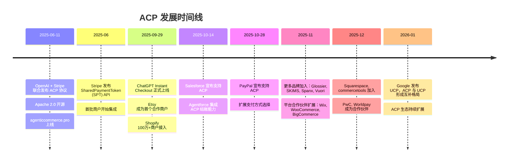
```mermaid
timeline
    title ACP 发展时间线
    2025-06-11 : OpenAI + Stripe 联合发布 ACP 协议
               : Apache 2.0 开源
               : agenticcommerce.pro 上线
    2025-06 : Stripe 发布 SharedPaymentToken (SPT) API
            : 首批商户开始集成
    2025-09-29 : ChatGPT Instant Checkout 正式上线
              : Etsy 成为首个合作商户
              : Shopify 100万+商户接入
    2025-10-14 : Salesforce 宣布支持 ACP
              : Agentforce 集成 ACP 结账能力
    2025-10-28 : PayPal 宣布支持 ACP
              : 扩展支付方式选择
    2025-11 : 更多品牌加入：Glossier, SKIMS, Spanx, Vuori
           : 平台合作伙伴扩展：Wix, WooCommerce, BigCommerce
    2025-12 : Squarespace, commercetools 加入
           : PwC, Worldpay 成为合作伙伴
    2026-01 : Google 发布 UCP，ACP 与 UCP 形成互补格局
           : ACP 生态持续扩展
```

| 时间 | 事件 | 意义 |
|------|------|------|
| 2025-06-11 | ACP 协议发布 | 首个专为 Agent 结账设计的开放协议，填补结账编排层空白 |
| 2025-06 | SPT API 发布 | Stripe 的核心支付创新——安全的委托支付令牌 |
| 2025-09-29 | ChatGPT Instant Checkout 上线 | 全球首个大规模落地的 AI Agent 购物体验 |
| 2025-10-14 | Salesforce 加入 | 企业级 CRM 巨头接入，ACP 进入 B2B 领域 |
| 2025-10-28 | PayPal 加入 | 扩展支付方式，不再仅限于 Stripe 处理 |
| 2025-11 | 品牌和平台大规模接入 | 从早期采用进入规模化阶段 |
| 2026-01 | UCP 发布 | ACP 与 UCP 形成"结账编排 + 全旅程标准"的互补格局 |


## 5. 业务场景 (Use Cases)

### 消费者场景

- **对话式购物**：用户在 ChatGPT 中说"帮我找一件适合夏天穿的连衣裙，预算 $100 以内"，Agent 通过 Product Feed 发现匹配商品，展示选项，用户确认后通过 Instant Checkout 在对话中完成购买
- **即时购买**：用户看到 Agent 推荐的商品后，点击"Buy"按钮，结账 UI 在 Agent 界面内渲染，无需跳转到商户网站
- **跨商户比价**：Agent 通过多个商户的 Product Feed 获取同类商品信息，为用户比较价格、评价和配送选项
- **订阅管理**：通过 ACP 的异步购买支持，Agent 可以帮助用户管理订阅类商品的定期购买

### 商户场景

- **触达 AI 用户群**：通过接入 ACP，商户的商品可以出现在 ChatGPT 等 Agent 平台的购物推荐中，触达数亿 AI 用户
- **嵌入式结账**：商户的结账流程嵌入到 Agent 界面中，减少用户跳转带来的流失
- **保留控制权**：商户保留 Merchant of Record 身份，保留订单接受/拒绝权，保留客户关系
- **低改造成本**：已使用 Stripe 的商户只需少量改造即可接入 ACP

### 开发者场景

- **MCP Server 集成**：开发者可以将 ACP 实现为 MCP Server，让任何兼容 MCP 的 Agent 调用结账能力
- **RESTful API 集成**：ACP 也可以实现为标准 RESTful API，适用于非 MCP 环境
- **Webhook 集成**：通过 Webhook 事件（order.created, order.updated）实现订单生命周期的自动化管理
- **多平台接入**：Shopify、Wix、WooCommerce、BigCommerce、Squarespace、commercetools 等平台已提供 ACP 插件

### 企业 B2B 场景

- **Salesforce Agentforce 集成**：企业通过 Salesforce 的 Agentforce 平台，让内部 Agent 使用 ACP 完成采购流程
- **自动化采购**：企业 Agent 通过 ACP 自动发现供应商商品、比较报价、完成采购订单

## 6. 技术架构 (Architecture)

### 整体架构

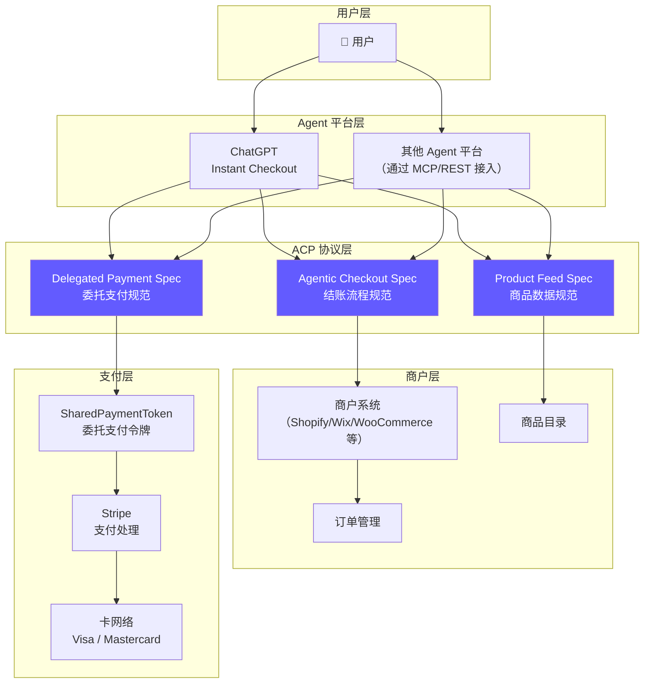
```mermaid
graph TD
    subgraph 用户层
        USER["👤 用户"]
    end
    
    subgraph Agent 平台层
        CHATGPT["ChatGPT<br/>Instant Checkout"]
        OTHER["其他 Agent 平台<br/>（通过 MCP/REST 接入）"]
    end
    
    subgraph ACP 协议层
        PF["Product Feed Spec<br/>商品数据规范"]
        AC["Agentic Checkout Spec<br/>结账流程规范"]
        DP["Delegated Payment Spec<br/>委托支付规范"]
    end
    
    subgraph 商户层
        MERCHANT["商户系统<br/>（Shopify/Wix/WooCommerce 等）"]
        CATALOG["商品目录"]
        ORDER["订单管理"]
    end
    
    subgraph 支付层
        STRIPE["Stripe<br/>支付处理"]
        SPT["SharedPaymentToken<br/>委托支付令牌"]
        CARD_NET["卡网络<br/>Visa / Mastercard"]
    end
    
    USER --> CHATGPT
    USER --> OTHER
    CHATGPT --> PF
    CHATGPT --> AC
    CHATGPT --> DP
    OTHER --> PF
    OTHER --> AC
    OTHER --> DP
    PF --> CATALOG
    AC --> MERCHANT
    DP --> SPT
    SPT --> STRIPE
    STRIPE --> CARD_NET
    MERCHANT --> ORDER
    
    style PF fill:#635BFF,color:#fff
    style AC fill:#635BFF,color:#fff
    style DP fill:#635BFF,color:#fff
```

### 三大子规范关系

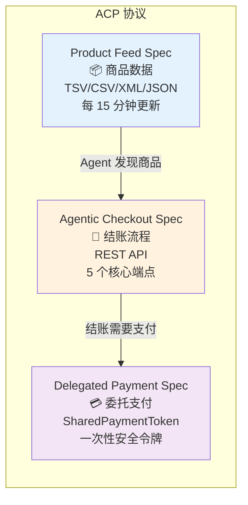
```mermaid
graph LR
    subgraph "ACP 协议"
        PF["Product Feed Spec<br/>📦 商品数据<br/>TSV/CSV/XML/JSON<br/>每 15 分钟更新"]
        AC["Agentic Checkout Spec<br/>🛒 结账流程<br/>REST API<br/>5 个核心端点"]
        DP["Delegated Payment Spec<br/>💳 委托支付<br/>SharedPaymentToken<br/>一次性安全令牌"]
    end
    
    PF -->|"Agent 发现商品"| AC
    AC -->|"结账需要支付"| DP
    
    style PF fill:#e3f2fd
    style AC fill:#fff3e0
    style DP fill:#f3e5f5
```

### 完整交易流程

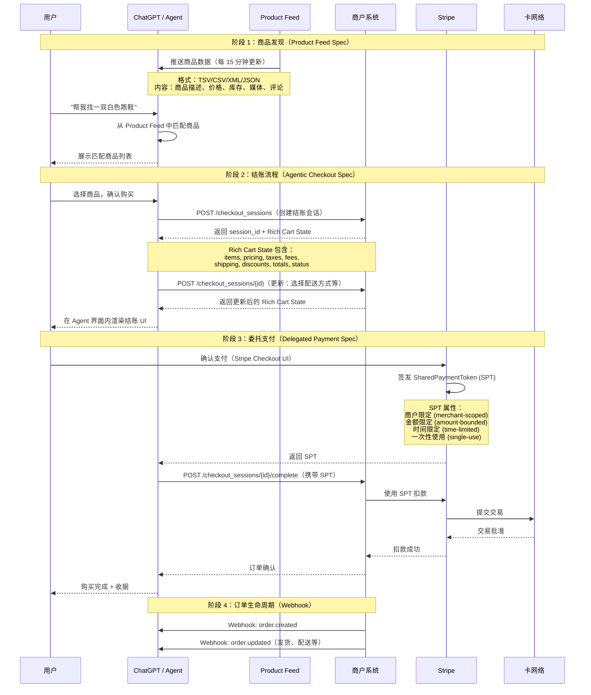
```mermaid
sequenceDiagram
    participant 用户
    participant Agent as ChatGPT / Agent
    participant PF as Product Feed
    participant 商户 as 商户系统
    participant Stripe
    participant 卡网络
    
    Note over 用户,卡网络: 阶段 1：商品发现（Product Feed Spec）
    PF->>Agent: 推送商品数据（每 15 分钟更新）
    Note over PF,Agent: 格式：TSV/CSV/XML/JSON<br/>内容：商品描述、价格、库存、媒体、评论
    用户->>Agent: "帮我找一双白色跑鞋"
    Agent->>Agent: 从 Product Feed 中匹配商品
    Agent-->>用户: 展示匹配商品列表
    
    Note over 用户,卡网络: 阶段 2：结账流程（Agentic Checkout Spec）
    用户->>Agent: 选择商品，确认购买
    Agent->>商户: POST /checkout_sessions（创建结账会话）
    商户-->>Agent: 返回 session_id + Rich Cart State
    Note over Agent,商户: Rich Cart State 包含：<br/>items, pricing, taxes, fees,<br/>shipping, discounts, totals, status
    Agent->>商户: POST /checkout_sessions/{id}（更新：选择配送方式等）
    商户-->>Agent: 返回更新后的 Rich Cart State
    Agent-->>用户: 在 Agent 界面内渲染结账 UI
    
    Note over 用户,卡网络: 阶段 3：委托支付（Delegated Payment Spec）
    用户->>Stripe: 确认支付（Stripe Checkout UI）
    Stripe->>Stripe: 签发 SharedPaymentToken (SPT)
    Note over Stripe: SPT 属性：<br/>商户限定 (merchant-scoped)<br/>金额限定 (amount-bounded)<br/>时间限定 (time-limited)<br/>一次性使用 (single-use)
    Stripe-->>Agent: 返回 SPT
    Agent->>商户: POST /checkout_sessions/{id}/complete（携带 SPT）
    商户->>Stripe: 使用 SPT 扣款
    Stripe->>卡网络: 提交交易
    卡网络-->>Stripe: 交易批准
    Stripe-->>商户: 扣款成功
    商户-->>Agent: 订单确认
    Agent-->>用户: 购买完成 + 收据
    
    Note over 商户,Agent: 阶段 4：订单生命周期（Webhook）
    商户->>Agent: Webhook: order.created
    商户->>Agent: Webhook: order.updated（发货、配送等）
```


## 7. 技术规范详解 (Technical Deep Dive)

### 7.1 Product Feed Specification（商品数据规范）

Product Feed 是 ACP 的数据基础，定义了商户如何向 Agent 平台提供结构化的商品信息。

#### 数据格式与传输

| 特性 | 说明 |
|------|------|
| 支持格式 | TSV（Tab-Separated Values）、CSV、XML、JSON |
| 传输方式 | HTTPS 加密推送（Push 模型） |
| 更新频率 | 最快每 15 分钟同步库存和价格 |
| 数据内容 | 商品描述、媒体资源、评论、性能信号、库存状态、定价 |

#### 商品数据结构

```json
{
  "product_id": "SKU-12345",
  "title": "Nike Air Max 白色跑鞋",
  "description": "轻量化设计，适合日常跑步训练...",
  "price": {
    "amount": 129.99,
    "currency": "USD"
  },
  "availability": "in_stock",
  "inventory_count": 42,
  "images": [
    {
      "url": "https://merchant.com/images/shoe-white-1.jpg",
      "alt_text": "Nike Air Max 白色跑鞋正面图"
    }
  ],
  "categories": ["shoes", "running", "athletic"],
  "brand": "Nike",
  "variants": [
    {
      "variant_id": "SKU-12345-42",
      "size": "42",
      "color": "white",
      "price": {"amount": 129.99, "currency": "USD"},
      "availability": "in_stock"
    }
  ],
  "shipping": {
    "methods": ["standard", "express"],
    "estimated_delivery": "3-5 business days"
  },
  "reviews": {
    "average_rating": 4.5,
    "review_count": 1234
  },
  "performance_signals": {
    "conversion_rate": 0.12,
    "return_rate": 0.03
  }
}
```

#### 数据同步机制

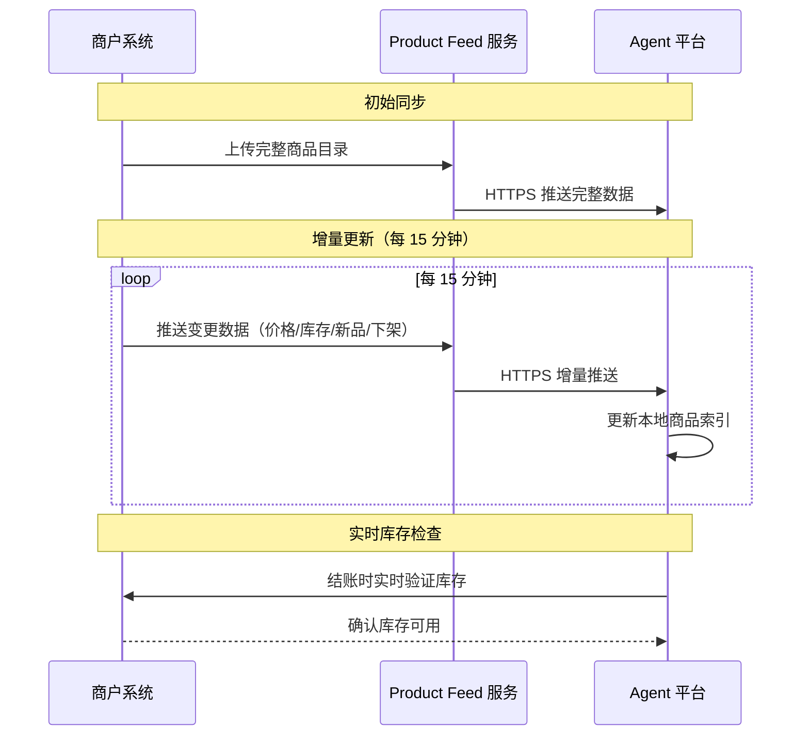
```mermaid
sequenceDiagram
    participant 商户 as 商户系统
    participant Feed as Product Feed 服务
    participant Agent as Agent 平台
    
    Note over 商户,Agent: 初始同步
    商户->>Feed: 上传完整商品目录
    Feed->>Agent: HTTPS 推送完整数据
    
    Note over 商户,Agent: 增量更新（每 15 分钟）
    loop 每 15 分钟
        商户->>Feed: 推送变更数据（价格/库存/新品/下架）
        Feed->>Agent: HTTPS 增量推送
        Agent->>Agent: 更新本地商品索引
    end
    
    Note over 商户,Agent: 实时库存检查
    Agent->>商户: 结账时实时验证库存
    商户-->>Agent: 确认库存可用
```

### 7.2 Agentic Checkout Specification（结账规范）

结账规范定义了 Agent 与商户之间的标准化结账 API，是 ACP 的核心交互层。

#### 五个核心 REST 端点

| 端点 | 方法 | 功能 | 说明 |
|------|------|------|------|
| `/checkout_sessions` | POST | 创建结账会话 | 初始化购物车，传入商品和数量 |
| `/checkout_sessions/{id}` | POST | 更新结账会话 | 修改购物车内容、选择配送方式、应用优惠码等 |
| `/checkout_sessions/{id}` | GET | 获取会话状态 | 查询当前购物车状态和结账进度 |
| `/checkout_sessions/{id}/complete` | POST | 完成结账 | 提交支付凭证，完成交易 |
| `/checkout_sessions/{id}/cancel` | POST | 取消结账 | 取消当前结账会话 |

#### 结账会话状态机

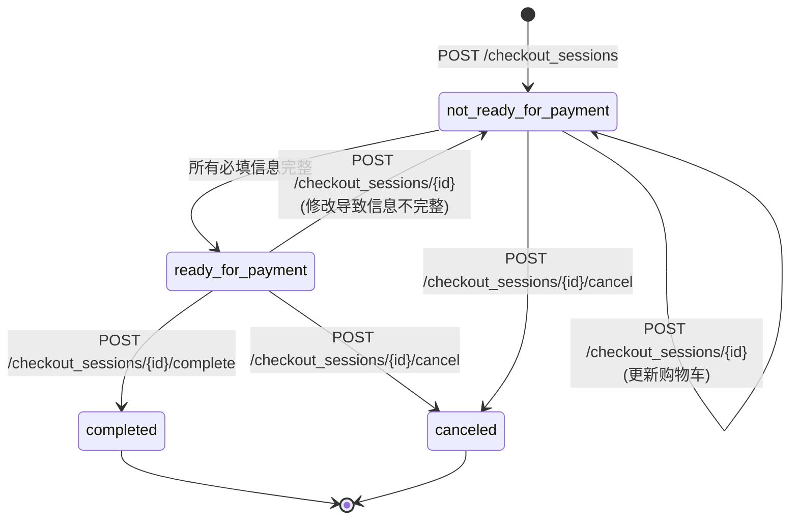
```mermaid
stateDiagram-v2
    [*] --> not_ready_for_payment: POST /checkout_sessions
    not_ready_for_payment --> not_ready_for_payment: POST /checkout_sessions/{id}<br/>(更新购物车)
    not_ready_for_payment --> ready_for_payment: 所有必填信息完整
    ready_for_payment --> not_ready_for_payment: POST /checkout_sessions/{id}<br/>(修改导致信息不完整)
    ready_for_payment --> completed: POST /checkout_sessions/{id}/complete
    ready_for_payment --> canceled: POST /checkout_sessions/{id}/cancel
    not_ready_for_payment --> canceled: POST /checkout_sessions/{id}/cancel
    completed --> [*]
    canceled --> [*]
```

#### 创建结账会话 — 请求与响应示例

**请求：**

```http
POST /checkout_sessions
Content-Type: application/json

{
  "items": [
    {
      "product_id": "SKU-12345",
      "variant_id": "SKU-12345-42",
      "quantity": 1
    }
  ],
  "customer": {
    "email": "user@example.com",
    "shipping_address": {
      "line1": "123 Main St",
      "city": "San Francisco",
      "state": "CA",
      "postal_code": "94105",
      "country": "US"
    }
  },
  "metadata": {
    "agent_platform": "chatgpt",
    "session_context": "user requested white running shoes"
  }
}
```

**响应（Rich Cart State）：**

```json
{
  "id": "cs_abc123def456",
  "status": "not_ready_for_payment",
  "items": [
    {
      "product_id": "SKU-12345",
      "variant_id": "SKU-12345-42",
      "title": "Nike Air Max 白色跑鞋",
      "quantity": 1,
      "unit_price": {"amount": 129.99, "currency": "USD"},
      "image_url": "https://merchant.com/images/shoe-white-1.jpg"
    }
  ],
  "pricing": {
    "subtotal": {"amount": 129.99, "currency": "USD"},
    "shipping": {"amount": 5.99, "currency": "USD"},
    "tax": {"amount": 10.88, "currency": "USD"},
    "discount": {"amount": 0, "currency": "USD"},
    "total": {"amount": 146.86, "currency": "USD"}
  },
  "shipping_options": [
    {
      "id": "standard",
      "name": "Standard Shipping",
      "price": {"amount": 5.99, "currency": "USD"},
      "estimated_delivery": "2025-10-05"
    },
    {
      "id": "express",
      "name": "Express Shipping",
      "price": {"amount": 12.99, "currency": "USD"},
      "estimated_delivery": "2025-10-02"
    }
  ],
  "available_payment_methods": ["card", "apple_pay", "google_pay"],
  "requires": ["shipping_method_selection"],
  "created_at": "2025-09-30T10:00:00Z",
  "expires_at": "2025-09-30T11:00:00Z"
}
```

#### 更新结账会话 — 选择配送方式

```http
POST /checkout_sessions/cs_abc123def456
Content-Type: application/json

{
  "shipping_method": "standard",
  "promo_code": "SAVE10"
}
```

**响应：**

```json
{
  "id": "cs_abc123def456",
  "status": "ready_for_payment",
  "items": [...],
  "pricing": {
    "subtotal": {"amount": 129.99, "currency": "USD"},
    "shipping": {"amount": 5.99, "currency": "USD"},
    "tax": {"amount": 10.88, "currency": "USD"},
    "discount": {"amount": -13.00, "currency": "USD"},
    "total": {"amount": 133.86, "currency": "USD"}
  },
  "applied_discounts": [
    {
      "code": "SAVE10",
      "description": "10% off your order",
      "amount": {"amount": -13.00, "currency": "USD"}
    }
  ],
  "selected_shipping": {
    "id": "standard",
    "name": "Standard Shipping",
    "estimated_delivery": "2025-10-05"
  },
  "requires": []
}
```

#### 完成结账

```http
POST /checkout_sessions/cs_abc123def456/complete
Content-Type: application/json

{
  "payment_token": "spt_live_abc123...",
  "payment_method": "card"
}
```

**响应：**

```json
{
  "id": "cs_abc123def456",
  "status": "completed",
  "order": {
    "order_id": "ORD-789012",
    "confirmation_number": "CONF-345678",
    "total": {"amount": 133.86, "currency": "USD"},
    "estimated_delivery": "2025-10-05",
    "tracking_url": "https://merchant.com/track/ORD-789012"
  }
}
```


### 7.3 Delegated Payment Specification（委托支付规范）— SharedPaymentToken (SPT)

SharedPaymentToken (SPT) 是 Stripe 为 ACP 设计的核心支付原语，解决了"Agent 如何安全地代替用户支付"这一关键问题。

#### SPT 核心设计原则

SPT 的设计遵循**最小权限原则**——Agent 获得的支付能力被严格限定在完成当前交易所需的最小范围内：

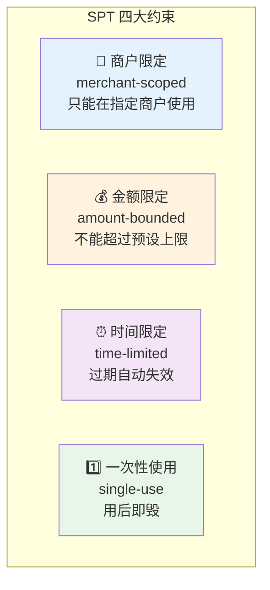
```mermaid
graph TD
    subgraph "SPT 四大约束"
        A["🏪 商户限定<br/>merchant-scoped<br/>只能在指定商户使用"]
        B["💰 金额限定<br/>amount-bounded<br/>不能超过预设上限"]
        C["⏰ 时间限定<br/>time-limited<br/>过期自动失效"]
        D["1️⃣ 一次性使用<br/>single-use<br/>用后即毁"]
    end
    
    style A fill:#e3f2fd
    style B fill:#fff3e0
    style C fill:#f3e5f5
    style D fill:#e8f5e9
```

#### SPT 签发与使用流程

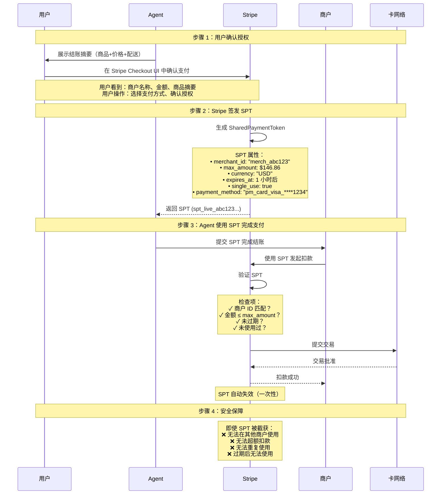
```mermaid
sequenceDiagram
    participant 用户
    participant Agent
    participant Stripe
    participant 商户
    participant 卡网络
    
    Note over 用户,卡网络: 步骤 1：用户确认授权
    Agent->>用户: 展示结账摘要（商品+价格+配送）
    用户->>Stripe: 在 Stripe Checkout UI 中确认支付
    Note over 用户,Stripe: 用户看到：商户名称、金额、商品摘要<br/>用户操作：选择支付方式、确认授权
    
    Note over 用户,卡网络: 步骤 2：Stripe 签发 SPT
    Stripe->>Stripe: 生成 SharedPaymentToken
    Note over Stripe: SPT 属性：<br/>• merchant_id: "merch_abc123"<br/>• max_amount: $146.86<br/>• currency: "USD"<br/>• expires_at: 1 小时后<br/>• single_use: true<br/>• payment_method: "pm_card_visa_****1234"
    Stripe-->>Agent: 返回 SPT (spt_live_abc123...)
    
    Note over 用户,卡网络: 步骤 3：Agent 使用 SPT 完成支付
    Agent->>商户: 提交 SPT 完成结账
    商户->>Stripe: 使用 SPT 发起扣款
    Stripe->>Stripe: 验证 SPT
    Note over Stripe: 检查项：<br/>✓ 商户 ID 匹配？<br/>✓ 金额 ≤ max_amount？<br/>✓ 未过期？<br/>✓ 未使用过？
    Stripe->>卡网络: 提交交易
    卡网络-->>Stripe: 交易批准
    Stripe-->>商户: 扣款成功
    
    Note over Stripe: SPT 自动失效（一次性）
    
    Note over 用户,卡网络: 步骤 4：安全保障
    Note over Stripe: 即使 SPT 被截获：<br/>❌ 无法在其他商户使用<br/>❌ 无法超额扣款<br/>❌ 无法重复使用<br/>❌ 过期后无法使用
```

#### SPT 安全特性详解

| 安全特性 | 说明 | 防御的攻击场景 |
|---------|------|-------------|
| 商户限定 (merchant-scoped) | SPT 绑定特定商户 ID，只能在该商户使用 | 防止 SPT 被转移到恶意商户 |
| 金额限定 (amount-bounded) | SPT 设定最大可扣金额，实际扣款不能超过此限 | 防止超额扣款 |
| 时间限定 (time-limited) | SPT 有明确的过期时间，过期自动失效 | 防止长期有效的支付凭证被滥用 |
| 一次性使用 (single-use) | SPT 使用一次后立即失效，无法重复使用 | 防止重放攻击 |
| PCI DSS 合规 | 真实卡号从不暴露给 Agent 或商户 | 防止卡号泄露 |
| Network Tokenization | 支持卡网络级别的令牌化 | 进一步隔离真实卡号 |
| 加密传输 | SPT 通过 HTTPS 加密传输 | 防止中间人攻击 |

#### SPT Webhook 事件

Stripe 为 SPT 提供了完整的生命周期事件通知：

| 事件 | 触发时机 | 接收方 |
|------|---------|--------|
| `shared_payment.granted_token.used` | SPT 被商户成功使用扣款 | SPT 签发方（Agent 平台） |
| `shared_payment.granted_token.deactivated` | SPT 被停用（过期/手动停用） | SPT 签发方（Agent 平台） |
| `shared_payment.issued_token.used` | SPT 被使用（从商户视角） | 商户 |
| `shared_payment.issued_token.deactivated` | SPT 被停用（从商户视角） | 商户 |

#### SPT 与其他委托支付方案对比

| 维度 | SPT (ACP/Stripe) | Delegated Vault Token (早期 ACP) | AP2 Mandate | Visa 限定令牌 |
|------|-----------------|--------------------------------|-------------|-------------|
| 签发方 | Stripe | Stripe | Credentials Provider | Visa |
| 约束维度 | 商户+金额+时间+单次 | 商户+金额+时间+单次 | Intent/Cart 约束条件 | 金额+商户类别+时间 |
| 用户确认方式 | Stripe Checkout UI | Stripe Checkout UI | VC 加密签名 | Passkey (FIDO2) |
| 支付方式 | Stripe 支持的所有方式 | Stripe 支持的所有方式 | 支付方式无关 | Visa 网络 |
| 审计能力 | Stripe 交易日志 | Stripe 交易日志 | 不可否认审计链 | TAP 签名链 |
| HNP 支持 | 有限（需预获取 Token） | 有限 | 原生支持 | 支持（预设规则） |

### 7.4 Webhook 与订单生命周期管理

ACP 通过 Webhook 事件驱动订单的生命周期管理，商户在订单状态变更时向 Agent 平台推送通知。

#### 订单 Webhook 事件

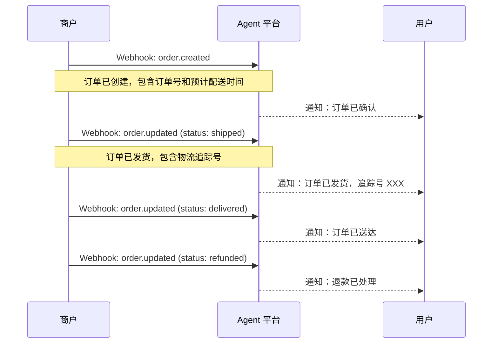
```mermaid
sequenceDiagram
    participant 商户
    participant Agent as Agent 平台
    participant 用户
    
    商户->>Agent: Webhook: order.created
    Note over 商户,Agent: 订单已创建，包含订单号和预计配送时间
    Agent-->>用户: 通知：订单已确认
    
    商户->>Agent: Webhook: order.updated (status: shipped)
    Note over 商户,Agent: 订单已发货，包含物流追踪号
    Agent-->>用户: 通知：订单已发货，追踪号 XXX
    
    商户->>Agent: Webhook: order.updated (status: delivered)
    Agent-->>用户: 通知：订单已送达
    
    商户->>Agent: Webhook: order.updated (status: refunded)
    Agent-->>用户: 通知：退款已处理
```

#### Webhook 事件结构

```json
{
  "event_type": "order.updated",
  "event_id": "evt_abc123",
  "timestamp": "2025-10-05T14:30:00Z",
  "data": {
    "order_id": "ORD-789012",
    "checkout_session_id": "cs_abc123def456",
    "status": "shipped",
    "tracking": {
      "carrier": "UPS",
      "tracking_number": "1Z999AA10123456784",
      "tracking_url": "https://ups.com/track/1Z999AA10123456784",
      "estimated_delivery": "2025-10-07"
    },
    "updated_at": "2025-10-05T14:30:00Z"
  }
}
```


### 7.5 ChatGPT Instant Checkout 实现架构

ChatGPT Instant Checkout 是 ACP 的首个大规模落地实现，展示了 ACP 在真实产品中的完整应用。

#### 架构概览

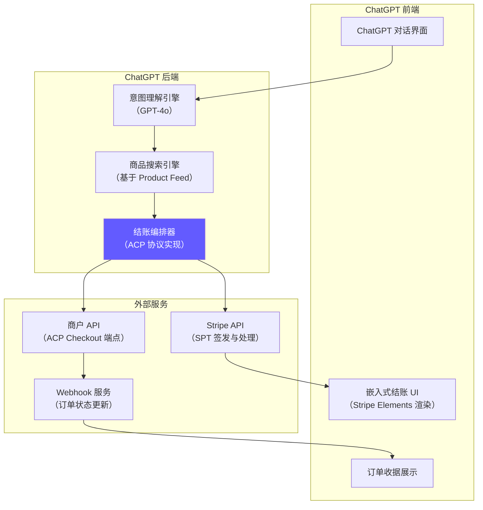
```mermaid
graph TD
    subgraph ChatGPT 前端
        UI["ChatGPT 对话界面"]
        CHECKOUT_UI["嵌入式结账 UI<br/>（Stripe Elements 渲染）"]
        RECEIPT["订单收据展示"]
    end
    
    subgraph ChatGPT 后端
        INTENT["意图理解引擎<br/>（GPT-4o）"]
        SEARCH["商品搜索引擎<br/>（基于 Product Feed）"]
        ORCHESTRATOR["结账编排器<br/>（ACP 协议实现）"]
    end
    
    subgraph 外部服务
        MERCHANT_API["商户 API<br/>（ACP Checkout 端点）"]
        STRIPE_API["Stripe API<br/>（SPT 签发与处理）"]
        WEBHOOK_SVC["Webhook 服务<br/>（订单状态更新）"]
    end
    
    UI --> INTENT
    INTENT --> SEARCH
    SEARCH --> ORCHESTRATOR
    ORCHESTRATOR --> MERCHANT_API
    ORCHESTRATOR --> STRIPE_API
    STRIPE_API --> CHECKOUT_UI
    WEBHOOK_SVC --> RECEIPT
    MERCHANT_API --> WEBHOOK_SVC
    
    style ORCHESTRATOR fill:#635BFF,color:#fff
```

#### 用户体验流程

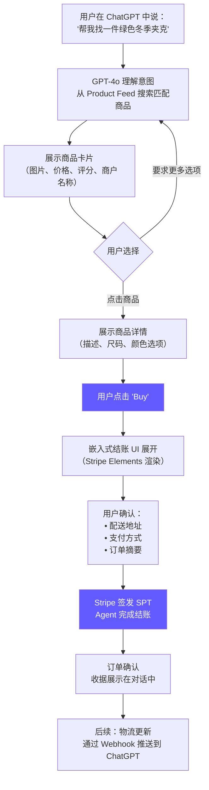
```mermaid
flowchart TD
    A["用户在 ChatGPT 中说：<br/>'帮我找一件绿色冬季夹克'"] --> B["GPT-4o 理解意图<br/>从 Product Feed 搜索匹配商品"]
    B --> C["展示商品卡片<br/>（图片、价格、评分、商户名称）"]
    C --> D{"用户选择"}
    D -->|"点击商品"| E["展示商品详情<br/>（描述、尺码、颜色选项）"]
    D -->|"要求更多选项"| B
    E --> F["用户点击 'Buy'"]
    F --> G["嵌入式结账 UI 展开<br/>（Stripe Elements 渲染）"]
    G --> H["用户确认：<br/>• 配送地址<br/>• 支付方式<br/>• 订单摘要"]
    H --> I["Stripe 签发 SPT<br/>Agent 完成结账"]
    I --> J["订单确认<br/>收据展示在对话中"]
    J --> K["后续：物流更新<br/>通过 Webhook 推送到 ChatGPT"]
    
    style F fill:#635BFF,color:#fff
    style I fill:#635BFF,color:#fff
```

#### 支持的商品类型

| 商品类型 | 支持状态 | 说明 |
|---------|---------|------|
| 实体商品 | ✅ 已支持 | 服装、鞋类、电子产品、家居用品等 |
| 数字商品 | ✅ 已支持 | 软件许可、数字内容等 |
| 订阅服务 | ✅ 已支持 | 定期配送、会员服务等 |
| 异步购买 | ✅ 已支持 | 预购、定制商品等 |

### 7.6 MCP Server 实现方式

ACP 可以实现为 MCP (Model Context Protocol) Server，让任何兼容 MCP 的 Agent 调用结账能力。

#### MCP Server 架构

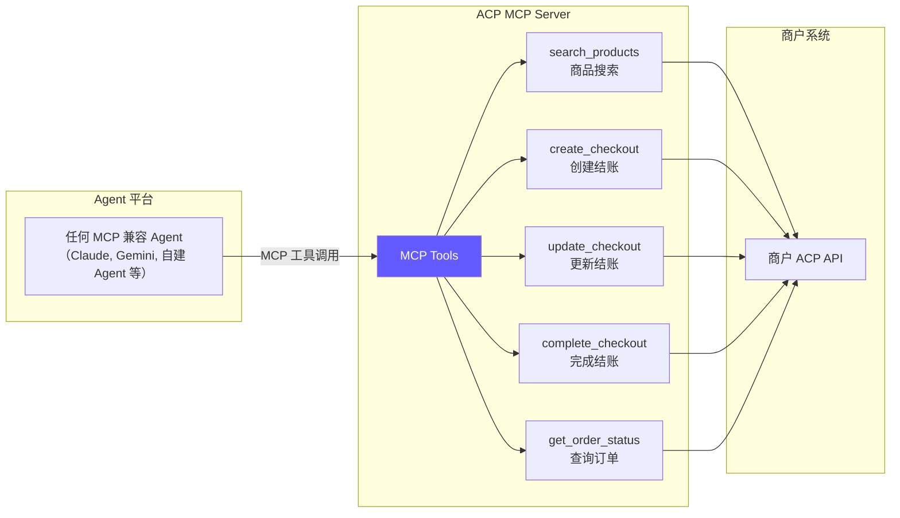
```mermaid
graph LR
    subgraph "Agent 平台"
        AGENT["任何 MCP 兼容 Agent<br/>（Claude, Gemini, 自建 Agent 等）"]
    end
    
    subgraph "ACP MCP Server"
        TOOLS["MCP Tools"]
        T1["search_products<br/>商品搜索"]
        T2["create_checkout<br/>创建结账"]
        T3["update_checkout<br/>更新结账"]
        T4["complete_checkout<br/>完成结账"]
        T5["get_order_status<br/>查询订单"]
        TOOLS --> T1
        TOOLS --> T2
        TOOLS --> T3
        TOOLS --> T4
        TOOLS --> T5
    end
    
    subgraph "商户系统"
        MERCHANT["商户 ACP API"]
    end
    
    AGENT -->|"MCP 工具调用"| TOOLS
    T1 & T2 & T3 & T4 & T5 --> MERCHANT
    
    style TOOLS fill:#635BFF,color:#fff
```

#### MCP Tool 定义示例

```json
{
  "name": "create_checkout",
  "description": "创建一个新的结账会话，将商品添加到购物车",
  "input_schema": {
    "type": "object",
    "properties": {
      "merchant_id": {
        "type": "string",
        "description": "商户标识符"
      },
      "items": {
        "type": "array",
        "items": {
          "type": "object",
          "properties": {
            "product_id": {"type": "string"},
            "variant_id": {"type": "string"},
            "quantity": {"type": "integer"}
          },
          "required": ["product_id", "quantity"]
        }
      },
      "customer_email": {
        "type": "string",
        "description": "客户邮箱地址"
      },
      "shipping_address": {
        "type": "object",
        "description": "配送地址"
      }
    },
    "required": ["merchant_id", "items"]
  }
}
```

## 8. 安全模型与信任架构 (Security Model & Trust Architecture)

### 8.1 安全架构概览

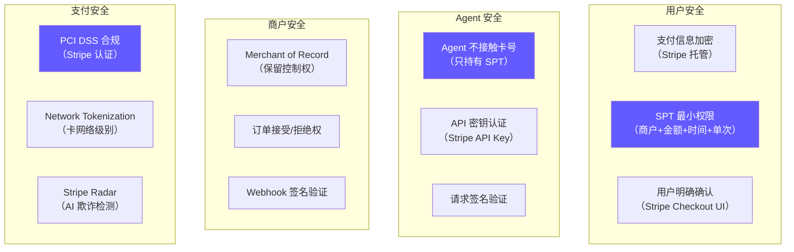
```mermaid
graph TD
    subgraph "用户安全"
        U1["支付信息加密<br/>（Stripe 托管）"]
        U2["SPT 最小权限<br/>（商户+金额+时间+单次）"]
        U3["用户明确确认<br/>（Stripe Checkout UI）"]
    end
    
    subgraph "Agent 安全"
        A1["Agent 不接触卡号<br/>（只持有 SPT）"]
        A2["API 密钥认证<br/>（Stripe API Key）"]
        A3["请求签名验证"]
    end
    
    subgraph "商户安全"
        M1["Merchant of Record<br/>（保留控制权）"]
        M2["订单接受/拒绝权"]
        M3["Webhook 签名验证"]
    end
    
    subgraph "支付安全"
        P1["PCI DSS 合规<br/>（Stripe 认证）"]
        P2["Network Tokenization<br/>（卡网络级别）"]
        P3["Stripe Radar<br/>（AI 欺诈检测）"]
    end
    
    style U2 fill:#635BFF,color:#fff
    style A1 fill:#635BFF,color:#fff
    style P1 fill:#635BFF,color:#fff
```

### 8.2 信任链分析

ACP 的信任模型相对简洁，核心依赖 Stripe 作为可信中间方：

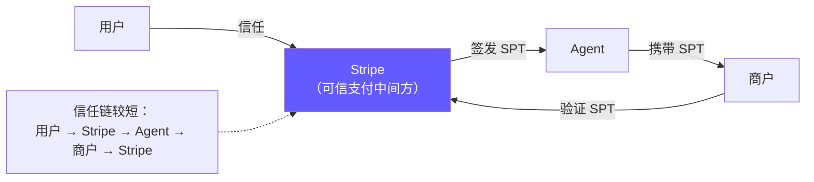
```mermaid
graph LR
    USER["用户"] -->|"信任"| STRIPE["Stripe<br/>（可信支付中间方）"]
    STRIPE -->|"签发 SPT"| AGENT["Agent"]
    AGENT -->|"携带 SPT"| MERCHANT["商户"]
    MERCHANT -->|"验证 SPT"| STRIPE
    
    Note1["信任链较短：<br/>用户 → Stripe → Agent → 商户 → Stripe"] -.-> STRIPE
    
    style STRIPE fill:#635BFF,color:#fff
```

**信任链特点**：

- **中心化信任**：Stripe 是整个信任链的核心，负责 SPT 签发、验证和支付处理
- **信任链较短**：相比 AP2 的多步 Mandate 签名链，ACP 的信任链更短、更简单
- **依赖 Stripe 基础设施**：安全性高度依赖 Stripe 的 PCI DSS 合规和欺诈检测能力
- **Trade-off**：简单性带来了快速落地的优势，但也意味着缺乏 AP2 那样的去中心化验证和不可否认审计链

### 8.3 与 AP2 安全模型的对比

| 维度 | ACP (SPT) | AP2 (Mandate + VC) |
|------|-----------|-------------------|
| 信任模型 | 中心化（依赖 Stripe） | 去中心化（加密签名可独立验证） |
| 授权证明 | SPT 令牌（Stripe 签发和验证） | VC 加密签名（任何方可验证） |
| 审计能力 | Stripe 交易日志 | 不可否认审计链（Intent → Cart → Payment） |
| 不可否认性 | 依赖 Stripe 日志 | 加密签名提供数学级不可否认性 |
| HNP 支持 | 有限（需预获取 SPT） | 原生支持（Intent Mandate 预授权） |
| 复杂度 | 低（商户改造成本小） | 高（需要 VC 基础设施） |
| 落地速度 | 快（利用 Stripe 现有基础设施） | 慢（需要建设新基础设施） |


## 9. 生态与社区 (Ecosystem & Community)

### 合作伙伴全景

ACP 的生态围绕 OpenAI（Agent 平台）和 Stripe（支付基础设施）两大核心构建，并快速扩展到商户平台、品牌、企业软件和支付服务商。


```mermaid
graph TD
    subgraph "核心主导方"
        OPENAI["OpenAI<br/>Agent 平台 + ChatGPT"]
        STRIPE["Stripe<br/>支付基础设施 + SPT"]
    end
    
    subgraph "电商平台"
        SHOPIFY["Shopify<br/>100万+商户"]
        WIX["Wix"]
        WOOCOMMERCE["WooCommerce"]
        BIGCOMMERCE["BigCommerce"]
        SQUARESPACE["Squarespace"]
        COMMERCETOOLS["commercetools"]
    end
    
    subgraph "品牌商户"
        ETSY["Etsy<br/>（首个合作商户）"]
        GLOSSIER["Glossier"]
        SKIMS["SKIMS"]
        SPANX["Spanx"]
        VUORI["Vuori"]
    end
    
    subgraph "企业软件"
        SALESFORCE["Salesforce<br/>Agentforce 集成"]
    end
    
    subgraph "支付合作伙伴"
        PAYPAL["PayPal"]
        WORLDPAY["Worldpay"]
    end
    
    subgraph "咨询"
        PWC["PwC"]
    end
    
    ACP_CENTER["ACP<br/>协议"]
    
    OPENAI --> ACP_CENTER
    STRIPE --> ACP_CENTER
    SHOPIFY & WIX & WOOCOMMERCE & BIGCOMMERCE --> ACP_CENTER
    SQUARESPACE & COMMERCETOOLS --> ACP_CENTER
    ETSY & GLOSSIER & SKIMS & SPANX & VUORI --> ACP_CENTER
    SALESFORCE --> ACP_CENTER
    PAYPAL & WORLDPAY --> ACP_CENTER
    PWC --> ACP_CENTER
    
    style ACP_CENTER fill:#635BFF,color:#fff
```

### 合作伙伴分类

| 类别 | 合作伙伴 | 角色 |
|------|---------|------|
| Agent 平台 | OpenAI (ChatGPT) | ACP 的首个也是最大的 Agent 平台实现 |
| 支付基础设施 | Stripe | SPT 签发、支付处理、PCI 合规 |
| 电商平台 | Shopify, Wix, WooCommerce, BigCommerce, Squarespace, commercetools | 为平台上的商户提供 ACP 接入能力 |
| 品牌商户 | Etsy, Glossier, SKIMS, Spanx, Vuori | 首批直接接入 ACP 的品牌 |
| 企业软件 | Salesforce (Agentforce) | 将 ACP 结账能力集成到企业 Agent 平台 |
| 支付服务商 | PayPal, Worldpay | 扩展 ACP 的支付方式选择 |
| 咨询 | PwC | 帮助企业客户制定 ACP 采纳策略 |

### 关键合作伙伴详情

#### Shopify — 最大的平台合作伙伴

Shopify 是 ACP 生态中最重要的平台合作伙伴，其 100 万+商户通过 Shopify 的 ACP 集成即可接入 ChatGPT Instant Checkout。Shopify 的接入意味着 ACP 一夜之间获得了海量的商户覆盖。

#### Etsy — 首个合作商户

Etsy 是 ChatGPT Instant Checkout 的首个合作商户，其手工艺品和独特商品的特性与 AI 购物助手的"发现"场景高度契合。

#### Salesforce — 企业级扩展

2025 年 10 月 14 日，Salesforce 宣布在其 Agentforce 平台中支持 ACP，这标志着 ACP 从消费者场景扩展到企业 B2B 场景。企业可以通过 Agentforce 构建内部采购 Agent，使用 ACP 完成供应商商品发现和采购。

#### PayPal — 支付方式扩展

2025 年 10 月 28 日，PayPal 宣布支持 ACP，这意味着 ACP 的支付方式不再仅限于 Stripe 处理的信用卡和借记卡，还可以使用 PayPal 余额、PayPal Credit 等支付方式。

### 开源与社区

| 维度 | 详情 |
|------|------|
| 开源协议 | Apache 2.0 |
| 官方网站 | [agenticcommerce.pro](https://agenticcommerce.pro) |
| 技术文档 | [agentic-commerce-protocol.com](https://agentic-commerce-protocol.com) |
| OpenAI 开发者文档 | [developers.openai.com/commerce](https://developers.openai.com/commerce) |
| Stripe SPT 文档 | [docs.stripe.com](https://docs.stripe.com) |
| 生产状态 | 已上线（ChatGPT Instant Checkout） |

### 行业参与格局

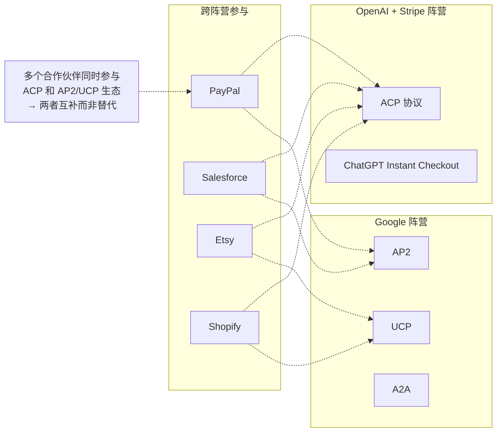
```mermaid
graph LR
    subgraph "OpenAI + Stripe 阵营"
        ACP_E["ACP 协议"]
        CHATGPT_E["ChatGPT Instant Checkout"]
    end
    
    subgraph "Google 阵营"
        UCP_E["UCP"]
        AP2_E["AP2"]
        A2A_E["A2A"]
    end
    
    subgraph "跨阵营参与"
        PAYPAL_E["PayPal"] -.-> ACP_E
        PAYPAL_E -.-> AP2_E
        SALESFORCE_E["Salesforce"] -.-> ACP_E
        SALESFORCE_E -.-> AP2_E
        ETSY_E["Etsy"] -.-> ACP_E
        ETSY_E -.-> UCP_E
        SHOPIFY_E["Shopify"] -.-> ACP_E
        SHOPIFY_E -.-> UCP_E
    end
    
    Note1["多个合作伙伴同时参与<br/>ACP 和 AP2/UCP 生态<br/>→ 两者互补而非替代"] -.-> PAYPAL_E
```

值得注意的是，PayPal、Salesforce、Etsy、Shopify 等关键合作伙伴同时参与了 ACP 和 Google 的 AP2/UCP 生态，这进一步证实了两者的互补关系——ACP 处理"怎么买"，AP2 处理"谁授权的"。

## 10. 优劣势与竞品对比 (Pros, Cons & Comparison)

### ACP 优势

1. **已大规模落地**：ChatGPT Instant Checkout 已上线运行，是目前唯一大规模落地的 Agent 购物协议
2. **商户改造成本低**：已使用 Stripe 的商户只需少量改造即可接入，Shopify 等平台提供一键接入
3. **用户体验流畅**：嵌入式结账 UI 在 Agent 界面内渲染，无需跳转，对话连贯性不被打断
4. **SPT 安全设计精良**：四重约束（商户+金额+时间+单次）提供了强大的支付安全保障
5. **Stripe 生态加持**：数百万 Stripe 商户可以快速接入，支付处理、欺诈检测、PCI 合规等由 Stripe 提供
6. **开放标准**：Apache 2.0 开源，任何 Agent 平台都可以实现 ACP
7. **MCP 兼容**：可实现为 MCP Server，与更广泛的 Agent 生态集成
8. **商户保留控制权**：商户保留 Merchant of Record 身份和订单接受/拒绝权

### ACP 劣势

1. **授权模型简单**：SPT 是一次性令牌，不支持复杂的多步授权和委托任务（Human-Not-Present）场景
2. **缺乏不可否认审计链**：依赖 Stripe 交易日志，没有 AP2 那样的加密签名审计链
3. **中心化依赖**：高度依赖 Stripe 基础设施，如果 Stripe 出现问题，整个支付链路受影响
4. **信任层缺失**：ACP 不处理 Agent 身份验证和用户授权证明，需要与 AP2 或 TAP 等协议配合
5. **支付方式受限**：主要支持 Stripe 处理的支付方式，虽然 PayPal 已加入但覆盖面仍不如 AP2 的"支付方式无关"设计
6. **商品发现能力有限**：Product Feed 是被动推送模型，不如 UCP 的主动能力发现机制灵活
7. **不支持售后管理**：ACP 聚焦结账流程，不覆盖退货、退款、客服等售后环节（UCP 覆盖）

### 三大协议全面对比

| 维度 | ACP (OpenAI+Stripe) | AP2 (Google) | UCP (Google) |
|------|---------------------|--------------|--------------|
| 核心定位 | 结账流程编排 | 支付信任与授权 | 全旅程商务标准 |
| 覆盖范围 | 商品发现→结账→支付 | 授权→认证→审计 | 发现→结账→售后 |
| 解决的核心问题 | Agent 如何完成结账 | 谁授权了这笔支付 | Agent 如何与商户交互 |
| 授权机制 | SharedPaymentToken (SPT) | Mandate + VC 签名 | 依赖 AP2 |
| 支付方式 | Stripe + PayPal | 全支持（卡·银行·稳定币） | 依赖 AP2 |
| 审计能力 | Stripe 交易日志 | 不可否认审计链 | 依赖 AP2 |
| HNP 支持 | 有限 | 原生支持 | 依赖 AP2 |
| 商户改造成本 | 低（Stripe 商户几乎零成本） | 高（需要 VC 基础设施） | 中（需实现 Capabilities） |
| 落地速度 | 快（已上线） | 慢（早期采用阶段） | 慢（早期阶段） |
| 开放程度 | Apache 2.0 | Apache 2.0 | Apache 2.0 |
| 合作伙伴 | Stripe 商户生态 + 平台 | 60+ 组织 | 20+ 全球合作伙伴 |
| 生产就绪度 | ✅ 已上线 | 🔶 早期采用 | 🔶 早期阶段 |

### 协议互补关系

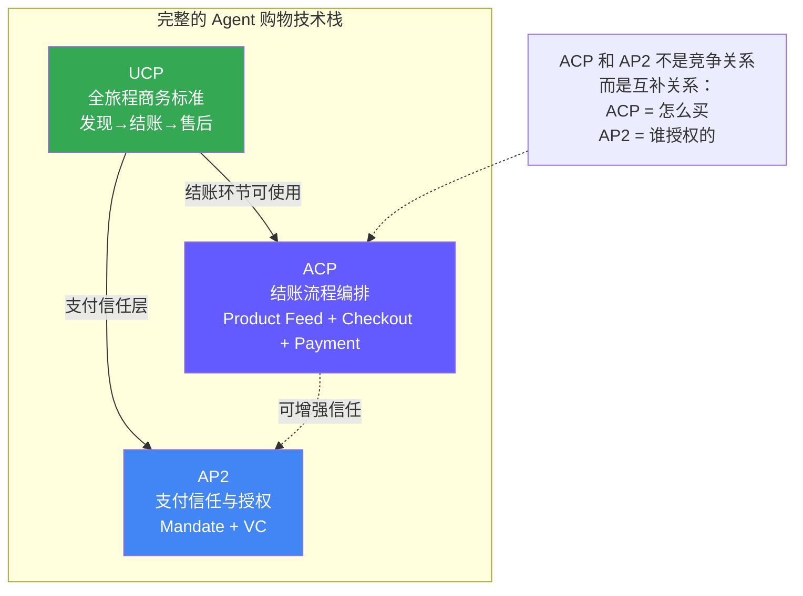
```mermaid
graph TD
    subgraph "完整的 Agent 购物技术栈"
        UCP_C["UCP<br/>全旅程商务标准<br/>发现→结账→售后"]
        ACP_C["ACP<br/>结账流程编排<br/>Product Feed + Checkout + Payment"]
        AP2_C["AP2<br/>支付信任与授权<br/>Mandate + VC"]
    end
    
    UCP_C -->|"结账环节可使用"| ACP_C
    UCP_C -->|"支付信任层"| AP2_C
    ACP_C -.->|"可增强信任"| AP2_C
    
    Note1["ACP 和 AP2 不是竞争关系<br/>而是互补关系：<br/>ACP = 怎么买<br/>AP2 = 谁授权的"] -.-> ACP_C
    
    style ACP_C fill:#635BFF,color:#fff
    style AP2_C fill:#4285F4,color:#fff
    style UCP_C fill:#34A853,color:#fff
```

**核心洞察**：

- **ACP 解决"怎么买"**：标准化 Agent 与商户之间的结账流程
- **AP2 解决"谁授权的"**：为支付提供加密签名的授权证明
- **UCP 解决"全旅程"**：覆盖从商品发现到售后的完整购物旅程

一个成熟的 Agent 购物交易可能同时使用：UCP 发现商户能力 → ACP 编排结账流程 → AP2 提供授权证明。三者共同构成完整的 Agentic Commerce 技术栈。


## 11. 快速上手 (Getting Started)

### 商户接入指南

#### 方式一：通过电商平台接入（推荐）

如果你已经在 Shopify、Wix、WooCommerce、BigCommerce、Squarespace 或 commercetools 上运营，可以通过平台提供的 ACP 插件快速接入：

```
1. 登录你的电商平台后台
2. 在应用/插件市场搜索 "Agentic Commerce" 或 "ChatGPT Checkout"
3. 安装并启用插件
4. 配置 Stripe 账户连接（如尚未使用 Stripe）
5. 配置 Product Feed 数据同步
6. 测试结账流程
7. 上线
```

#### 方式二：直接 API 集成

对于自建电商系统的商户，可以直接实现 ACP 的 REST API：

**步骤 1：配置 Product Feed**

```bash
# 准备商品数据文件（支持 TSV/CSV/XML/JSON）
# 通过 HTTPS 推送到 Agent 平台
curl -X POST https://api.agentplatform.com/v1/product-feeds \
  -H "Authorization: Bearer YOUR_API_KEY" \
  -H "Content-Type: application/json" \
  -d @products.json
```

**步骤 2：实现 Checkout API 端点**

```python
# Flask 示例：实现 ACP 结账端点
from flask import Flask, request, jsonify
import stripe

app = Flask(__name__)
stripe.api_key = "sk_live_..."

# 创建结账会话
@app.route("/checkout_sessions", methods=["POST"])
def create_checkout_session():
    data = request.json
    items = data.get("items", [])
    
    # 从数据库查询商品信息，计算价格
    cart = build_cart(items)
    
    session = {
        "id": generate_session_id(),
        "status": "not_ready_for_payment",
        "items": cart["items"],
        "pricing": cart["pricing"],
        "shipping_options": get_shipping_options(),
        "requires": ["shipping_method_selection"],
    }
    
    save_session(session)
    return jsonify(session)

# 更新结账会话
@app.route("/checkout_sessions/<session_id>", methods=["POST"])
def update_checkout_session(session_id):
    session = get_session(session_id)
    data = request.json
    
    if "shipping_method" in data:
        session = apply_shipping(session, data["shipping_method"])
    if "promo_code" in data:
        session = apply_promo(session, data["promo_code"])
    
    # 检查是否所有必填信息已完整
    if all_required_filled(session):
        session["status"] = "ready_for_payment"
        session["requires"] = []
    
    save_session(session)
    return jsonify(session)

# 获取会话状态
@app.route("/checkout_sessions/<session_id>", methods=["GET"])
def get_checkout_session(session_id):
    session = get_session(session_id)
    return jsonify(session)

# 完成结账
@app.route("/checkout_sessions/<session_id>/complete", methods=["POST"])
def complete_checkout(session_id):
    session = get_session(session_id)
    data = request.json
    payment_token = data.get("payment_token")  # SPT
    
    # 使用 SPT 通过 Stripe 扣款
    payment_intent = stripe.PaymentIntent.create(
        amount=session["pricing"]["total"]["amount"] * 100,
        currency=session["pricing"]["total"]["currency"].lower(),
        payment_method=payment_token,
        confirm=True,
    )
    
    if payment_intent.status == "succeeded":
        order = create_order(session)
        session["status"] = "completed"
        session["order"] = order
        save_session(session)
        
        # 发送 Webhook 通知
        send_webhook("order.created", order)
        
        return jsonify(session)
    else:
        return jsonify({"error": "Payment failed"}), 400

# 取消结账
@app.route("/checkout_sessions/<session_id>/cancel", methods=["POST"])
def cancel_checkout(session_id):
    session = get_session(session_id)
    session["status"] = "canceled"
    save_session(session)
    return jsonify(session)
```

**步骤 3：配置 Stripe SPT 接收**

```python
# 配置 Stripe Webhook 接收 SPT 事件
@app.route("/stripe/webhooks", methods=["POST"])
def stripe_webhook():
    payload = request.data
    sig_header = request.headers.get("Stripe-Signature")
    
    event = stripe.Webhook.construct_event(
        payload, sig_header, "whsec_..."
    )
    
    if event.type == "shared_payment.issued_token.used":
        # SPT 已被使用
        token_data = event.data.object
        handle_token_used(token_data)
    
    elif event.type == "shared_payment.issued_token.deactivated":
        # SPT 已失效
        token_data = event.data.object
        handle_token_deactivated(token_data)
    
    return jsonify({"status": "ok"})
```

#### 方式三：MCP Server 实现

```python
# 将 ACP 实现为 MCP Server
from mcp import Server, Tool

server = Server("acp-checkout")

@server.tool("search_products")
async def search_products(query: str, max_results: int = 10):
    """搜索商品目录"""
    results = product_catalog.search(query, limit=max_results)
    return [product.to_dict() for product in results]

@server.tool("create_checkout")
async def create_checkout(merchant_id: str, items: list):
    """创建结账会话"""
    session = await checkout_service.create_session(merchant_id, items)
    return session.to_dict()

@server.tool("complete_checkout")
async def complete_checkout(session_id: str, payment_token: str):
    """完成结账"""
    result = await checkout_service.complete(session_id, payment_token)
    return result.to_dict()

if __name__ == "__main__":
    server.run()
```

### 开发者资源

| 资源 | 链接 |
|------|------|
| ACP 官方网站 | [agenticcommerce.pro](https://agenticcommerce.pro) |
| ACP 技术文档 | [agentic-commerce-protocol.com](https://agentic-commerce-protocol.com) |
| OpenAI Commerce 文档 | [developers.openai.com/commerce](https://developers.openai.com/commerce) |
| Stripe SPT 文档 | [docs.stripe.com](https://docs.stripe.com) |
| Shopify ACP 集成 | Shopify App Store |
| Salesforce Agentforce | [salesforce.com/agentforce](https://www.salesforce.com/agentforce/) |

## 12. 来源 (Sources)

### 官方文档与公告

- [Agentic Commerce Protocol](https://agenticcommerce.pro) — ACP 官方网站
- [ACP Technical Documentation](https://agentic-commerce-protocol.com) — ACP 技术规范文档
- [OpenAI Commerce Developer Docs](https://developers.openai.com/commerce) — OpenAI 商务开发者文档
- [Stripe SharedPaymentToken API](https://docs.stripe.com) — Stripe SPT API 文档
- [Introducing Instant Checkout in ChatGPT](https://openai.com/index/instant-checkout/) — OpenAI 官方公告, 2025-09-29

### 技术分析

- [ACP Deep Dive: How AI Agents Will Shop for You](https://hexploits.com/p/acp-deep-dive) — Hexploits 技术深度分析
- [Agentic Commerce Protocol: A Technical Breakdown](https://nekuda.substack.com/p/agentic-commerce-protocol) — Nekuda Substack 技术拆解
- [How Stripe's SharedPaymentToken Works](https://stripe.com/blog) — Stripe 工程博客

### 行业报道

- [OpenAI and Stripe Launch Agentic Commerce Protocol](https://www.theverge.com) — The Verge, 2025-06
- [ChatGPT Can Now Buy Things for You](https://techcrunch.com) — TechCrunch, 2025-09
- [Salesforce Joins ACP Ecosystem](https://www.salesforce.com/news/) — Salesforce 新闻, 2025-10-14
- [PayPal Supports Agentic Commerce Protocol](https://newsroom.paypal-corp.com) — PayPal 新闻, 2025-10-28
- [The Rise of AI Shopping Agents](https://www.mckinsey.com) — McKinsey, 2025

### 竞品与对比

- [Google AP2 Protocol Announcement](https://cloud.google.com/blog/products/ai-machine-learning/announcing-agents-to-payments-ap2-protocol/) — Google Cloud Blog, 2025-09-16
- [Google Universal Commerce Protocol](https://cloud.google.com/blog) — Google Cloud Blog, 2026-01
- [Agentic Payment 协议研究报告](../agentic_payment_research.md) — 本系列总览报告

*报告撰写日期：2026-02-14*
*内容基于公开来源整理，部分信息经过改写以符合版权要求*
