# Google AP2 (Agent Payments Protocol) 深度研究报告

> 本报告是 Agentic Payment 系列研究的子报告之一，聚焦 Google 主导的 Agent Payments Protocol (AP2)。
> 总览报告见 [agentic_payment_research.md](../agentic_payment_research.md)，UCP 报告见 [1.google_ucp/google_ucp_research.md](../1.google_ucp/google_ucp_research.md)。

## 1. 概述 (Overview)

Agent Payments Protocol (AP2) 是 Google 于 2025 年 9 月发布的开放支付协议，专为 AI Agent 驱动的商务交易设计。AP2 的核心使命是为 Agent 发起的支付建立**信任基础设施**——通过加密签名的 Mandate（授权委托）机制，为每笔交易提供不可否认的用户意图证明。

AP2 不处理结账流程（那是 ACP 的职责），也不处理资金结算（那是 x402 或传统支付网络的职责）。它解决的是一个更根本的问题：**当 AI Agent 代替人类花钱时，如何证明这确实是用户的真实意愿？**

AP2 作为 A2A (Agent-to-Agent) 协议和 MCP (Model Context Protocol) 的开放扩展发布，由 60+ 合作伙伴共同参与，包括 Mastercard、American Express、PayPal、Coinbase、Salesforce、Adobe、Adyen 等。

关键差异化特征：

- **信任层定位**：不是支付协议，而是支付信任协议——为任何支付方式提供统一的授权证明框架
- **Mandate 机制**：通过 W3C Verifiable Credentials 实现的加密签名数字合约，创建从意图到支付的完整审计链
- **双模式支持**：原生支持 Human-Present（实时购买）和 Human-Not-Present（委托任务）两种交易模式
- **支付方式无关**：信用卡、借记卡、稳定币、实时银行转账均可，不绑定特定支付网络
- **开放互操作**：作为 A2A 和 MCP 的扩展，与现有 Agent 生态无缝集成

### AP2 在 Agentic Commerce 技术栈中的位置

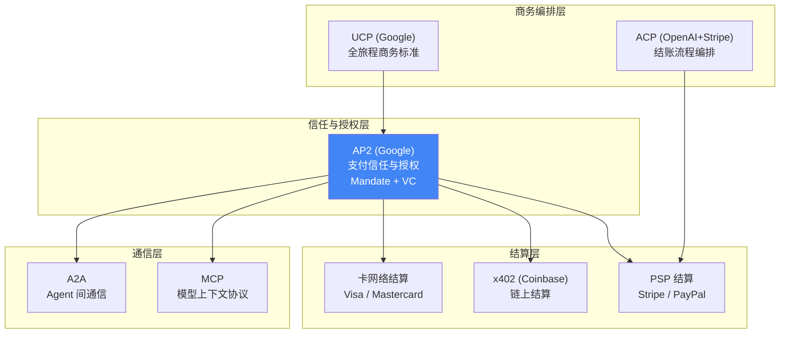

## 2. 问题定义与背景 (Problem Definition & Context)

### 2.1 问题是什么 (What is the Problem?)

当 AI Agent 代替人类发起支付交易时，现有支付系统的核心假设被打破——**"人类亲自点击购买按钮"这一隐含前提不再成立**。

这一断裂引发了三个根本性问题，即 Agentic Payment 领域的 **3A 问题**：

```
Agent 支付信任危机
├── Authorization（授权证明）
│   └── 谁允许 Agent 花这笔钱？如何证明用户确实授权了这笔特定交易？
├── Authenticity（意图真实性）
│   └── Agent 的请求是否准确反映了用户的真实意图？还是 AI 幻觉？
└── Accountability（责任归属）
    └── 交易出错时，责任归用户、Agent 平台、还是商户？
```

问题的具体表现：

- **授权模糊**：传统支付中，用户点击"购买"本身就是授权行为。Agent 代购时，商户和支付网络无法确认这笔交易是否经过用户明确许可
- **意图失真风险**：AI Agent 可能因"幻觉"（hallucination）错误理解用户意图，导致购买错误商品或超出预算
- **责任真空**：Agent 买错东西后，现有争议处理流程无法清晰界定是用户授权不当、Agent 理解错误、还是商户信息误导
- **生态碎片化**：如果没有统一标准，每个 Agent 平台、每个支付网络都会开发自己的专有方案，导致 N×N 集成问题

影响范围：McKinsey 预测 Agentic Commerce 将创造 $3-5 万亿经济价值，到 2030 年 AI 驱动的商务交易预计达 $5000 亿。如果信任问题不解决，这一市场将无法规模化。

### 2.2 问题的来源与成因 (Root Causes & Origins)

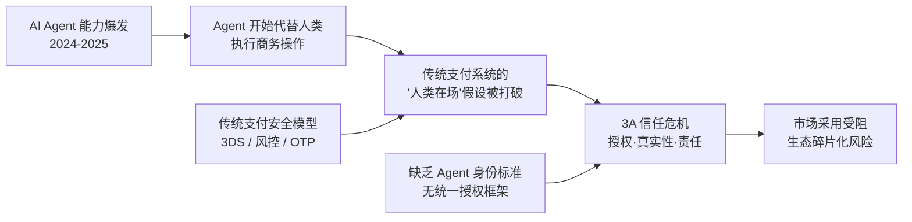

问题的根源在于支付系统的设计哲学与 AI Agent 的运作方式之间存在根本性矛盾：

- **支付系统假设人类直接参与**：从 3D Secure 挑战到欺诈检测，整个安全模型都围绕"人类实时操作"构建
- **Agent 是概率性系统**：AI Agent 基于概率推理做决策，而支付需要确定性的授权证明
- **缺乏 Agent 身份基础设施**：传统身份验证（密码、OTP、生物识别）都面向人类设计，Agent 没有"手指"去完成指纹验证
- **跨平台互操作缺失**：不同 Agent 平台（ChatGPT、Gemini、Claude）之间没有统一的支付授权标准

### 2.3 问题的现状 (Current State of the Problem)

在 AP2 出现之前，行业的应对方式主要是各自为政的专有方案：

| 现有方案 | 局限性 |
|---------|--------|
| ACP (OpenAI+Stripe) Delegated Vault Token | 一次性令牌，授权模型简单，不支持复杂的多步授权和委托任务 |
| Visa TAP 三层签名 | 聚焦 Agent 身份验证，但绑定 Visa 网络，非通用标准 |
| Mastercard Agent Pay | 需要 Agent 预注册审核，中心化管理，扩展性受限 |
| 传统 OAuth 2.0 | 面向人类设计的授权流程，Agent 无法完成交互式授权 |

这些方案的共同问题：**没有一个提供了从用户意图到最终支付的完整、可验证、不可否认的审计链**。

### 2.4 为什么是现在？(Why Now?)

AP2 在 2025 年 9 月出现，有几个关键催化因素：

- **Agent 能力成熟**：GPT-4、Gemini 2.0 等模型使 Agent 具备了真正的自主购物能力
- **ChatGPT Checkout 上线**：OpenAI + Stripe 的 ACP 在 2025 年 6 月率先落地，证明了 Agent 购物的可行性，但也暴露了信任层的缺失
- **卡组织入场**：Visa 和 Mastercard 在 2025 年 5 月相继发布 Agent 支付框架，表明传统支付巨头认可了这一趋势
- **A2A 协议基础就绪**：Google 在 2025 年 4 月发布的 A2A 协议提供了 Agent 间通信的标准化基础，AP2 可以作为其支付扩展自然落地
- **行业碎片化压力**：多个专有方案并存的局面迫使行业需要一个开放的统一标准


## 3. 核心概念与术语 (Key Concepts & Glossary)

- **Mandate** (授权委托) — AP2 的核心概念，加密签名的数字合约，作为用户授权 Agent 执行特定操作的可验证证明。所有 Mandate 都以 W3C Verifiable Credential 形式表达
- **Intent Mandate** (意图委托) — 捕获用户初始购物意图和约束条件的 VDC，在 Human-Not-Present 场景中授予 Agent 有限的自主执行权
- **Cart Mandate** (购物车委托) — 锁定具体商品、价格和配送方式的 VDC，由商户签名保证履约、用户签名确认批准，提供不可否认的购买证明
- **Payment Mandate** (支付委托) — 从 Cart/Intent Mandate 派生的最小化凭证，专为支付网络和发卡行设计，传递 Agent 参与信号和交易模态（HP/HNP），不暴露 PCI/PII 数据
- **VDC** (Verifiable Digital Credential，可验证数字凭证) — AP2 对 W3C Verifiable Credential 的具体应用，具有防篡改、去中心化验证、可移植性和加密模块化等特性
- **Human-Present (HP)** (人在场模式) — 用户实时参与交易流程的模式，类似传统电商但增加了加密审计链
- **Human-Not-Present (HNP)** (人不在场模式) — 用户预先签署 Intent Mandate 后离开，Agent 在条件满足时自主执行交易的模式
- **Non-repudiable Audit Trail** (不可否认审计链) — 从 Intent Mandate → Cart Mandate → Payment Mandate → Settlement Proof 的完整证据链，每一步都有加密签名关联
- **Role-Based Architecture** (基于角色的架构) — AP2 定义的五种角色分离模型：User、Shopping Agent、Credentials Provider、Merchant Endpoint、Merchant Payment Processor
- **Credentials Provider** (凭证提供方) — 管理支付方式、签发令牌、处理认证的角色，确保 PCI 数据不暴露给 Agent 或商户
- **A2A x402 Extension** — AP2 与 x402 协议的集成扩展，由 Google 与 Coinbase、Ethereum Foundation、MetaMask 合作推出，支持在 AP2 框架内进行稳定币结算

## 4. 发展历程 (History & Evolution)

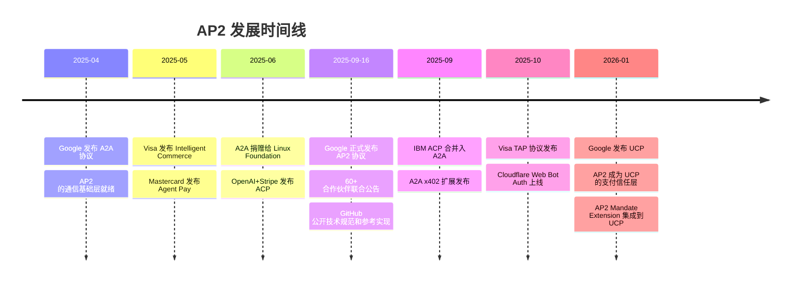

| 时间 | 事件 | 意义 |
|------|------|------|
| 2025-04 | A2A 协议发布 | 奠定 Agent 间通信基础，AP2 后来作为其支付扩展 |
| 2025-05 | Visa/Mastercard 发布 Agent 支付框架 | 传统支付巨头入场，验证了 Agent 支付的市场需求 |
| 2025-06 | ACP 发布并在 ChatGPT 上线 | 证明 Agent 购物可行，但暴露了信任层缺失 |
| 2025-09-16 | AP2 正式发布 | 60+ 合作伙伴的开放标准，填补信任层空白 |
| 2025-09 | A2A x402 扩展发布 | 将链上结算集成到 AP2 框架，支持稳定币支付 |
| 2025-10 | Visa TAP + Cloudflare Web Bot Auth | Agent 身份验证基础设施完善，与 AP2 互补 |
| 2026-01 | UCP 发布，AP2 成为其支付层 | AP2 从独立协议升级为 Google 商务生态的核心组件 |

## 5. 业务场景 (Use Cases)

### 消费者场景

- **智能购物（HP 模式）**：用户告诉 Agent "帮我找一双白色跑鞋"，Agent 发现商品、比较选项、组装购物车，用户在可信界面上审核并签署 Cart Mandate 确认购买。整个过程有加密审计链，比传统点击"购买"更安全
- **委托购买（HNP 模式）**：用户签署 Intent Mandate "演唱会开票时立刻买两张，每张不超过 $200"，Agent 在条件满足时自动执行购买。Intent Mandate 提供了加密证明，证明用户预先授权了这类购买
- **个性化优惠**：用户告诉 Agent 想买一辆自行车用于即将到来的旅行，Agent 将旅行日期等上下文传递给商户 Agent，商户 Agent 生成包含自行车、头盔和旅行架的定制捆绑优惠
- **协调购买**：用户说 "帮我订棕榈泉周末往返机票+酒店，总预算 $700"，Agent 同时与航空和酒店 Agent 协商，找到最优组合后同步签署两个 Cart Mandate 完成预订

### 企业 B2B 场景

- **自主采购**：企业 Agent 通过 Google Cloud Marketplace 自动采购合作伙伴解决方案，Intent Mandate 定义预算和供应商白名单
- **软件许可自动扩缩**：Agent 根据实时使用量自动扩展软件许可，Cart Mandate 记录每次扩展的具体数量和价格
- **Agent 间服务付费**：通过 A2A x402 扩展，一个 Agent 调用另一个 Agent 的付费服务时自动完成稳定币微支付

### 开发者场景

- **Agent 服务货币化**：开发者构建的 Agent 可以通过 AP2 + x402 向调用方收费，Mandate 确保每次调用都有明确的授权和支付证明
- **多支付方式集成**：通过 AP2 的支付方式无关设计，开发者一次集成即可支持信用卡、稳定币、银行转账等多种支付方式


## 6. 解决方案概述 (Solution Approach)

### 6.1 解决思路 (Solution Philosophy)

AP2 的核心洞察是：**Agent 支付的信任问题不应该由概率性的 AI 推理来解决，而应该由确定性的加密证明来解决。**

具体而言，AP2 采用了以下设计哲学：

- **确定性证明优于概率推理**：不依赖 AI 的"判断"来证明用户意图，而是通过加密签名的 Mandate 提供数学上不可否认的证明
- **协议化而非平台化**：作为开放协议而非封闭平台，任何合规的 Agent 都可以与任何合规的商户交易
- **角色分离**：通过五种角色的明确分工，确保敏感数据（如支付凭证）只由适当的实体处理
- **支付方式无关**：信任层与结算层解耦，同一套 Mandate 框架适用于所有支付方式
- **渐进式信任**：初期通过策展的允许列表建立信任，逐步过渡到基于 HTTPS、DNS、mTLS 等开放互联网标准的实时身份验证

### 6.2 方案如何解决问题 (How the Solution Addresses the Problem)

| 问题 | AP2 的解决方式 | 关键机制 |
|------|--------------|---------|
| **Authorization（授权证明）** | 两步 Mandate 模型：Intent Mandate 记录用户意图和约束，Cart Mandate 锁定具体商品和价格，均由用户加密签名 | W3C Verifiable Credentials + 设备级硬件密钥签名 |
| **Authenticity（意图真实性）** | Mandate 是确定性的加密证明，不依赖 AI 推理；任何参与方都可独立验证签名的真实性 | ECDSA 签名 + 防篡改机制 + nonce 防重放 |
| **Accountability（责任归属）** | Intent → Cart → Payment → Settlement 的完整审计链，每一步都有加密签名关联，事后可追溯、可裁定 | 不可否认审计链 + 角色分离 + 责任锚定到真实实体 |
| **生态碎片化** | 开放协议 + 60+ 合作伙伴 + 支付方式无关设计，提供统一的"共同语言" | A2A/MCP 扩展 + Apache 2.0 开源 |

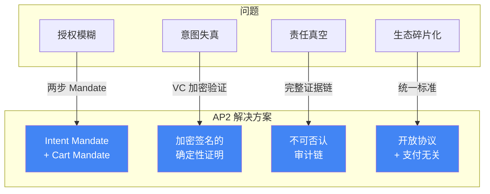

### 6.3 方案的边界与局限 (Scope & Limitations)

AP2 **解决了什么**：
- 用户授权的加密证明
- 交易意图的不可否认记录
- Agent 参与信号的标准化传递
- 跨支付方式的统一信任框架

AP2 **没有解决什么**：
- **结账流程编排**：商品发现、购物车管理、结账 UI 等由 ACP 或 UCP 处理
- **资金结算**：实际的资金转移由底层支付网络（卡网络、x402、银行转账）处理
- **Agent 身份验证**：Agent 本身的身份验证由 Visa TAP、Mastercard Agent Pay 或 Cloudflare Web Bot Auth 等处理
- **欺诈检测**：AP2 提供 Mandate 元数据供风控引擎使用，但不自行做欺诈判断
- **商品数据标准**：商品描述、定价、库存等数据标准由 UCP 或 ACP 的 Product Feed 规范处理

## 7. 技术架构 (Architecture)

### 核心架构：基于角色的分离模型

AP2 定义了五种角色，每种角色有明确的职责边界，确保敏感数据只由适当的实体处理：

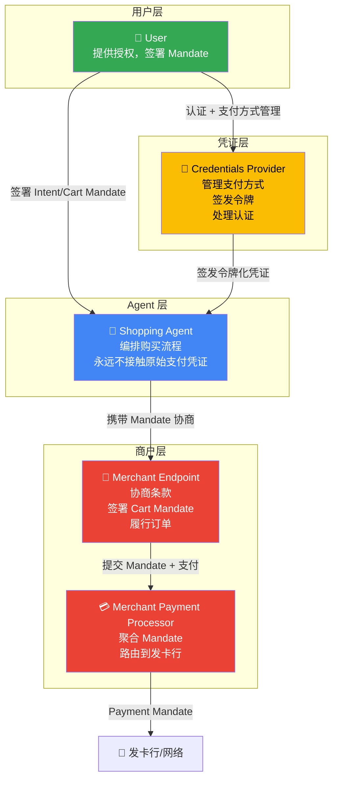

角色分离的安全价值：

| 角色 | 可接触的数据 | 不可接触的数据 |
|------|------------|-------------|
| User | 自己的意图、支付方式选择 | — |
| Shopping Agent | Mandate 内容、商品信息 | 原始支付凭证（卡号、CVV） |
| Credentials Provider | 支付方式、认证数据 | 购物车详情（由商户管理） |
| Merchant Endpoint | 商品、价格、Cart Mandate | 原始支付凭证 |
| Merchant Payment Processor | Payment Mandate、令牌化凭证 | 用户个人信息 |

### Mandate 数据流架构

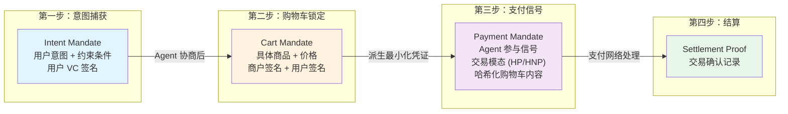

### 协议栈集成架构

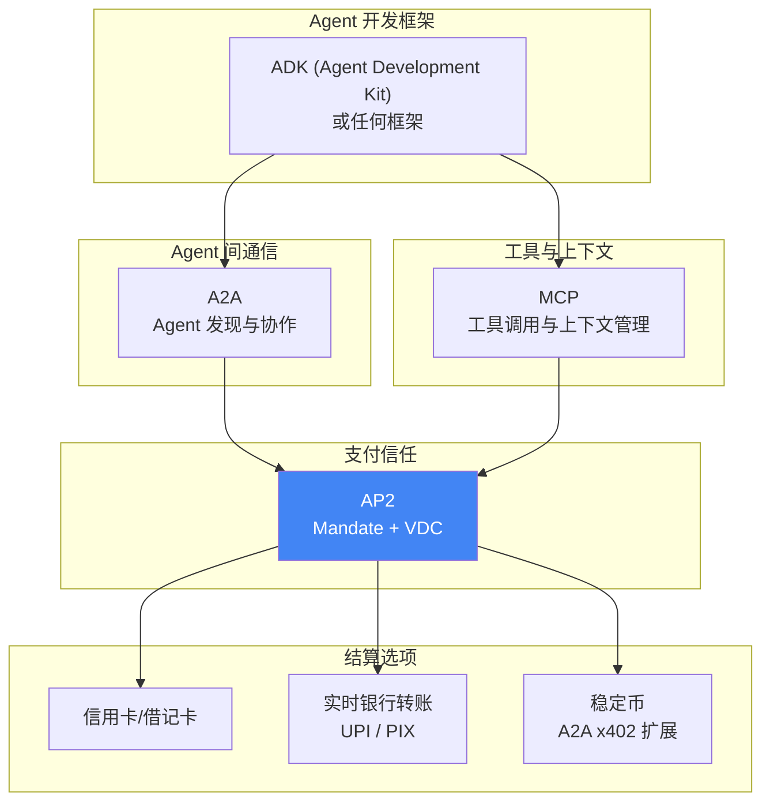


## 8. 技术实现方案与路径 (Implementation Design & Path)

### 8.1 协议/规范设计 (Protocol / Specification Design)

#### 三种 Mandate 的数据结构

**Intent Mandate（意图委托）**

Intent Mandate 捕获用户的初始购物意图，包含以下关键字段：

```json
{
  "@context": ["https://www.w3.org/2018/credentials/v1"],
  "type": ["VerifiableCredential", "IntentMandate"],
  "issuer": "did:example:user123",
  "issuanceDate": "2025-09-16T10:00:00Z",
  "credentialSubject": {
    "intent": {
      "description": "Find me white running shoes under $150",
      "constraints": {
        "maxPrice": {
          "amount": 150,
          "currency": "USD"
        },
        "merchantAllowList": ["merchant-a.com", "merchant-b.com"],
        "skuConstraints": {
          "category": "running_shoes",
          "color": "white"
        },
        "timeToLive": "PT24H",
        "paymentMethodCategories": ["credit_card", "debit_card"]
      }
    },
    "delegationMode": "human-present",
    "autoExecuteConditions": null
  },
  "proof": {
    "type": "EcdsaSecp256k1Signature2019",
    "created": "2025-09-16T10:00:00Z",
    "verificationMethod": "did:example:user123#key-1",
    "proofPurpose": "assertionMethod",
    "jws": "eyJhbGciOiJFUzI1NksifQ..."
  }
}
```

**Cart Mandate（购物车委托）**

Cart Mandate 锁定具体的购买内容，包含双重签名（商户 + 用户）：

```json
{
  "@context": ["https://www.w3.org/2018/credentials/v1"],
  "type": ["VerifiableCredential", "CartMandate"],
  "issuer": "did:example:merchant456",
  "issuanceDate": "2025-09-16T10:15:00Z",
  "credentialSubject": {
    "intentMandateRef": "urn:uuid:intent-mandate-abc123",
    "cart": {
      "items": [
        {
          "sku": "SHOE-WHITE-42",
          "name": "Nike Air Max White",
          "quantity": 1,
          "unitPrice": {"amount": 129.99, "currency": "USD"}
        }
      ],
      "shipping": {
        "method": "standard",
        "address": "encrypted:...",
        "cost": {"amount": 5.99, "currency": "USD"}
      },
      "total": {"amount": 135.98, "currency": "USD"},
      "tax": {"amount": 10.88, "currency": "USD"}
    },
    "payer": "did:example:user123",
    "payee": "did:example:merchant456",
    "paymentMethod": "tokenized:visa-****-1234",
    "riskPayload": {
      "deviceAttestation": "...",
      "sessionId": "..."
    }
  },
  "proof": [
    {
      "type": "EcdsaSecp256k1Signature2019",
      "created": "2025-09-16T10:15:00Z",
      "verificationMethod": "did:example:merchant456#key-1",
      "proofPurpose": "assertionMethod",
      "jws": "merchant-signature..."
    },
    {
      "type": "EcdsaSecp256k1Signature2019",
      "created": "2025-09-16T10:15:30Z",
      "verificationMethod": "did:example:user123#key-1",
      "proofPurpose": "authentication",
      "jws": "user-signature..."
    }
  ]
}
```

**Payment Mandate（支付委托）**

Payment Mandate 是最小化凭证，专为支付网络设计：

```json
{
  "@context": ["https://www.w3.org/2018/credentials/v1"],
  "type": ["VerifiableCredential", "PaymentMandate"],
  "credentialSubject": {
    "cartMandateRef": "urn:uuid:cart-mandate-def456",
    "agentPresent": true,
    "transactionModality": "human-present",
    "cartContentHash": "sha256:a1b2c3d4e5f6...",
    "amount": {"amount": 146.86, "currency": "USD"}
  }
}
```

#### Mandate 状态机

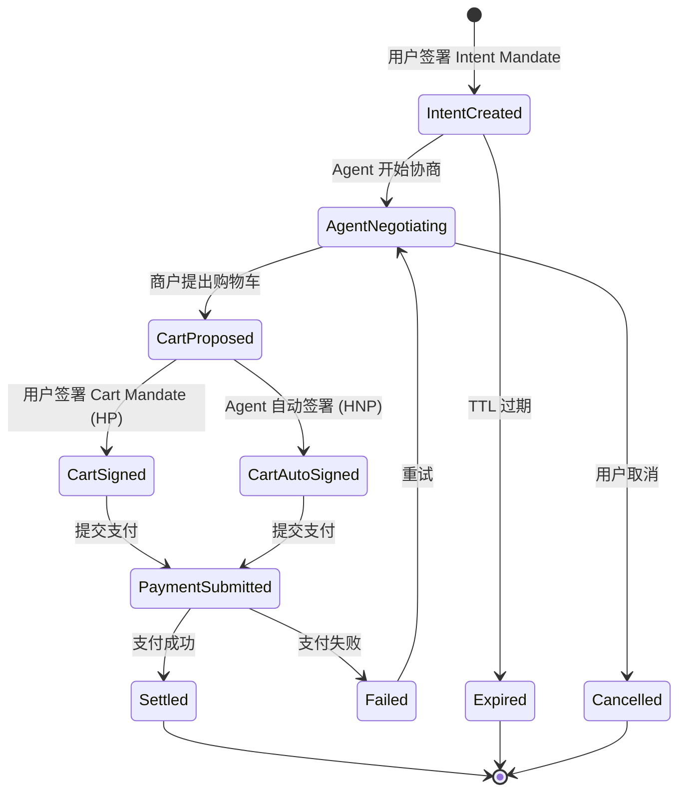

### 8.2 核心流程 (Core Workflows)

#### Human-Present (HP) 完整交易流程

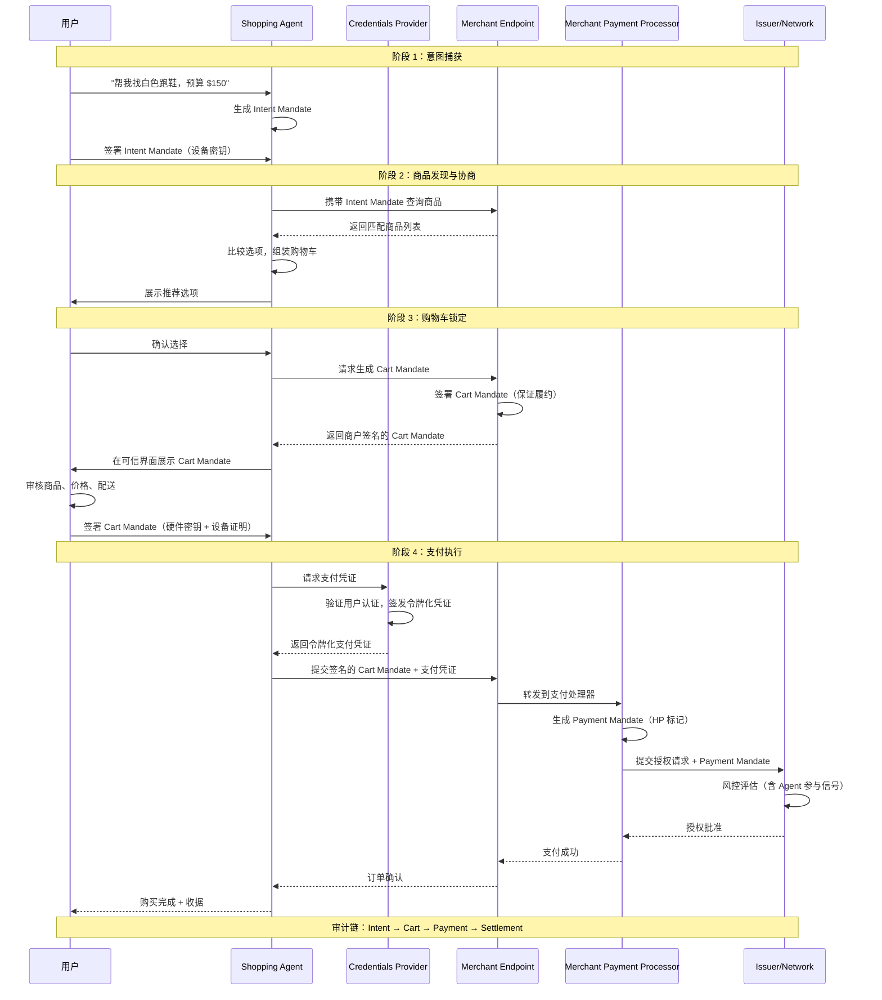

#### Human-Not-Present (HNP) 委托任务流程

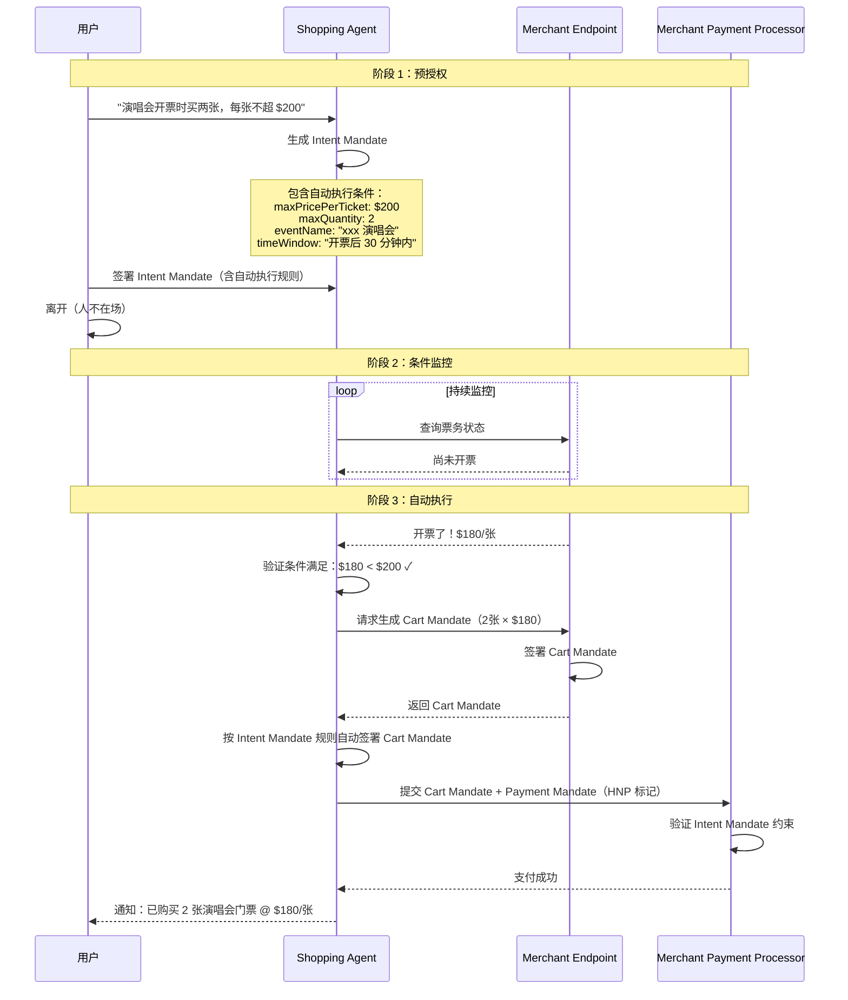

### 8.3 安全机制 (Security Mechanisms)

#### 加密原语

| 机制 | 说明 | 用途 |
|------|------|------|
| ECDSA 签名 | 椭圆曲线数字签名算法 | Mandate 的不可否认签名 |
| 硬件密钥 | 设备安全芯片中的私钥 | 高保证级别的用户签名（Cart Mandate） |
| 设备证明 | 证明签名来自真实设备 | 防止远程伪造签名 |
| Nonce | 一次性随机数 | 防重放攻击 |
| 确定性签名基 | 一致的格式化规则 | 确保验证的一致性 |
| 加密模块化 | 支持多种加密算法 | 未来兼容后量子密码学 |

#### 信任模型演进

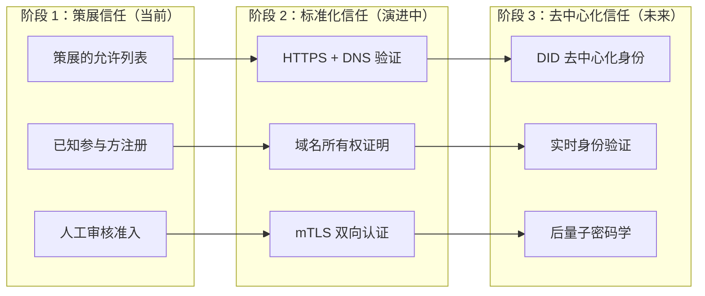

#### 安全设计要点

- **PCI 数据隔离**：原始支付凭证（卡号、CVV）永远不暴露给 Shopping Agent，只由 Credentials Provider 处理
- **最小化 Payment Mandate**：传递给发卡行的 Payment Mandate 只包含 Agent 参与信号和哈希化的购物车内容，不包含 PII
- **责任锚定到真实实体**：AP2 将责任归属到用户、商户或发卡行等真实实体，而非 Agent 本身
- **Intent Mandate TTL**：Intent Mandate 有明确的有效期（Time-to-Live），过期自动失效，防止无限期授权

### 8.4 集成路径 (Integration Path)

#### 开发者快速上手

**前置条件**：
- Python 3.10+
- uv 包管理器
- Google API Key 或 Vertex AI 配置

**安装 AP2 类型包**：

```bash
uv pip install git+https://github.com/google-agentic-commerce/AP2.git@main
```

**认证配置**：

```bash
# 方式 1：Google API Key（开发环境推荐）
export GOOGLE_API_KEY='your_key'

# 方式 2：Vertex AI（生产环境推荐）
export GOOGLE_GENAI_USE_VERTEXAI=true
export GOOGLE_CLOUD_PROJECT='your-project-id'
export GOOGLE_CLOUD_LOCATION='global'
```

**运行示例场景**：

```bash
# 克隆仓库
git clone https://github.com/google-agentic-commerce/AP2.git
cd AP2

# 运行 Human-Present 卡支付示例
bash samples/python/scenarios/human-present-cards/run.sh

# 运行 Human-Present x402 示例
bash samples/python/scenarios/human-present-x402/run.sh
```

#### 商户集成架构

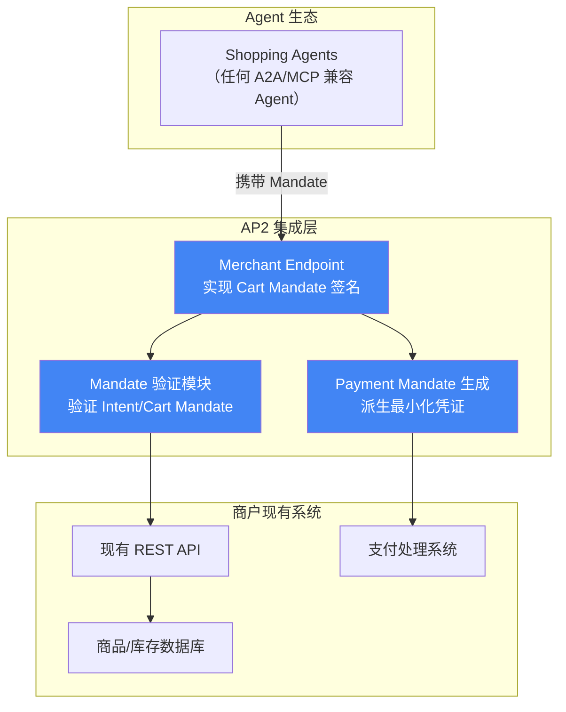

#### 与 UCP 的集成

AP2 作为 UCP 的 `dev.ucp.shopping.ap2_mandate` 扩展集成：

- 商户在 UCP Checkout Capability 中声明支持 AP2 Mandate Extension
- 一旦协商启用 AP2 Mandate，会话被安全锁定，不可回退到标准结账流程
- 商户提供 `checkoutSignature`（JWT），平台提供 `CheckoutMandate` + `PaymentMandate`


## 9. 协议/技术规范详解 (Technical Deep Dive)

> 本章深入分析 AP2 的关键技术扩展和集成点。

### 9.1 A2A x402 扩展 — 稳定币结算集成

Google 与 Coinbase、Ethereum Foundation、MetaMask 合作推出的 A2A x402 扩展，将链上结算能力集成到 AP2 框架中。

#### 架构

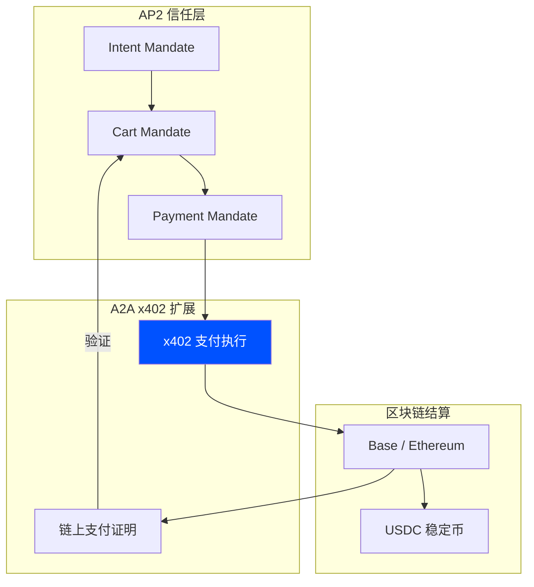

#### 交易流程

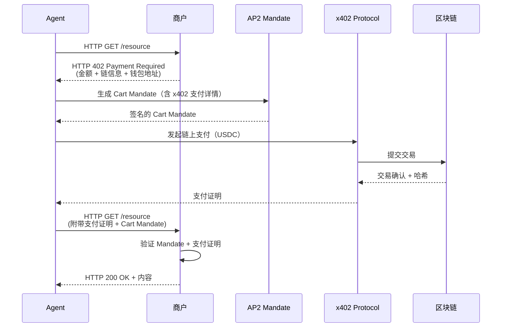

这一扩展的价值在于：Agent 间的微支付和服务付费可以在 AP2 的信任框架内完成，同时享受区块链的即时结算和不可篡改特性。正如 Coinbase 工程负责人 Erik Reppel 所说："x402 和 AP2 表明 Agent 间支付不再只是实验，它正在成为开发者实际构建的一部分。"

### 9.2 PayPal 的 AP2 实现方案

PayPal 作为 AP2 的核心合作伙伴，公开了其详细的集成计划，展示了传统支付巨头如何采纳 AP2。

#### PayPal 的 AP2 集成架构

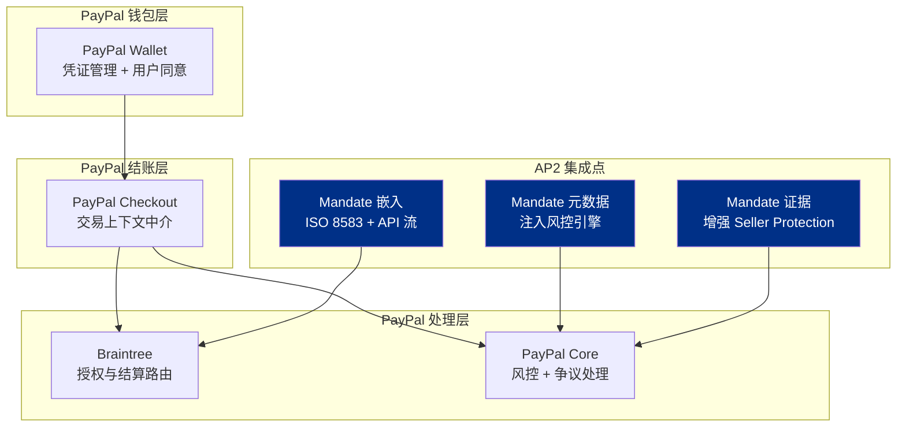

#### PayPal 的五大集成方向

| 方向 | 说明 | 价值 |
|------|------|------|
| Payment Mandate 试点 | 将 Payment Mandate 嵌入授权流中，让发卡行看到 Agent 参与信号 | 提升批准率，减少误拒 |
| 挑战编排 | 标准化 3DS2/OTP 重定向挑战，在可信界面完成，避免重复验证 | 降低 HNP 场景的摩擦 |
| 争议证据增强 | 将 Cart/Intent Mandate 纳入 Seller Protection 工作流 | 加密证据链加速争议解决 |
| 信任框架演进 | 从策展允许列表过渡到 HTTPS/DNSSEC/mTLS 实时身份验证 | 可扩展的信任基础设施 |
| 生态赋能 | 提供 Mandate 创建/存储 API，分离 Agent 与非 Agent 流量分析 | 开发者友好的集成体验 |

### 9.3 AP2 与 UCP 的集成 — AP2 Mandate Extension

AP2 作为 UCP 的 `dev.ucp.shopping.ap2_mandate` 扩展，在 UCP 的 Checkout Capability 中提供加密授权证明。

#### 集成流程

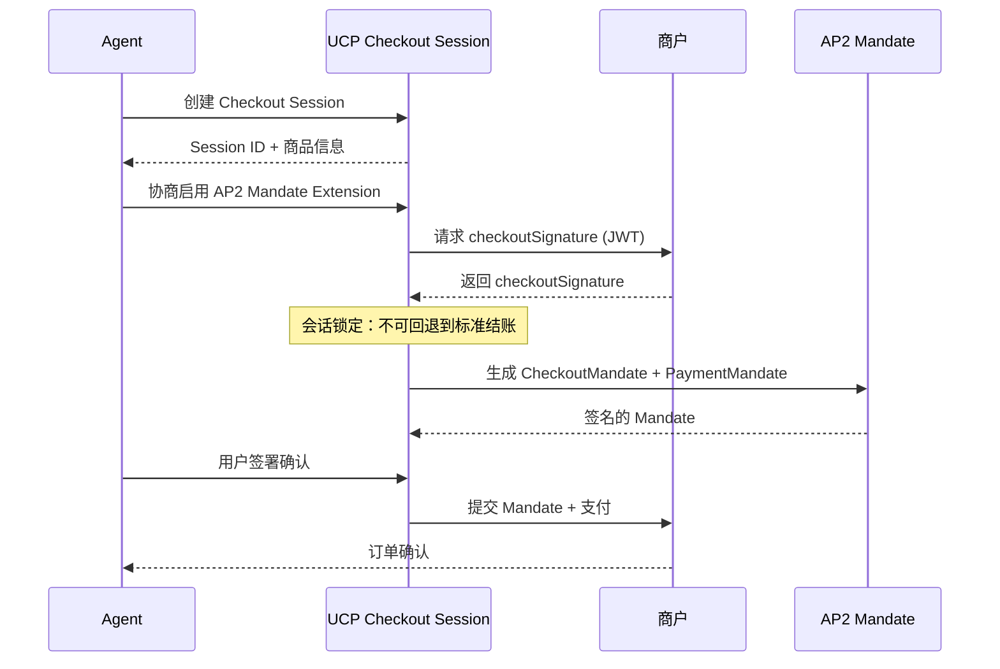

关键设计决策：一旦协商启用 AP2 Mandate Extension，会话被安全锁定，不可回退到标准结账流程。这确保了加密审计链的完整性。

## 10. 类似方案与竞品分析 (Alternative Solutions & Comparison)

### 10.1 方案全景图 (Solution Landscape)

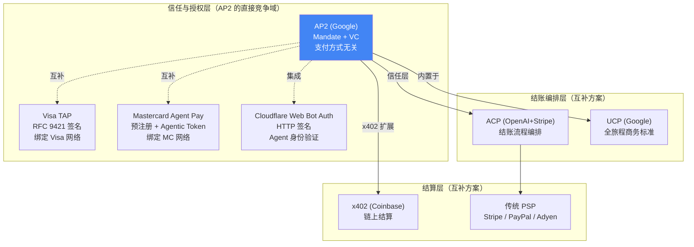

### 10.2 方案对比矩阵 (Comparison Matrix)

| 维度 | AP2 (Google) | ACP (OpenAI+Stripe) | x402 (Coinbase) | Visa TAP | Mastercard Agent Pay |
|------|-------------|---------------------|-----------------|----------|---------------------|
| 核心定位 | 支付信任与授权 | 结账流程编排 | 链上即时结算 | Agent 身份验证 | Agent 注册与令牌化 |
| 解决的核心问题 | 3A 问题（授权·真实性·责任） | Agent 如何完成结账 | Agent 如何即时付款 | 商户如何验证 Agent | 如何控制 Agent 消费 |
| 授权机制 | Mandate + VC 加密签名 | Delegated Vault Token | 钱包私钥签名 | Passkey (FIDO2) | Payment Passkey + 规则 |
| 支付方式 | 全支持（卡·银行·稳定币） | 传统支付（卡·钱包） | 加密货币（稳定币） | Visa 网络 | Mastercard 网络 |
| 审计能力 | 完整不可否认审计链 | Stripe 交易日志 | 链上不可篡改记录 | TAP 签名链 | MC 网络日志 |
| HNP 支持 | 原生支持（Intent Mandate） | 有限（需预获取 Token） | 无（即时结算） | 支持（预设规则） | 支持（用户控制规则） |
| 开放程度 | 开放协议，Apache 2.0 | 开源，Apache 2.0 | 开源 | 开放标准（RFC 9421） | 中心化注册审核 |
| 合作伙伴 | 60+ 组织 | Stripe 商户生态 | Cloudflare 联合 | 100+ 合作伙伴 | Citi, US Bank 等 |
| 生产就绪度 | 早期采用阶段 | 已上线（ChatGPT） | 规模化中 | 试点中 | 美国已上线 |
| 技术基础 | A2A + MCP + W3C VC | RESTful API / MCP | HTTP 402 状态码 | RFC 9421 + FIDO2 | Tokenization + FIDO |

### 10.3 方案选型指南 (Selection Guide)

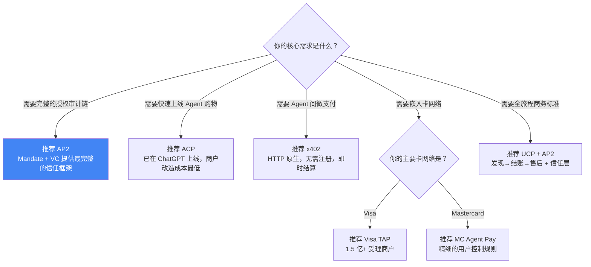

### 10.4 关键差异分析 (Key Differentiators)

**AP2 vs ACP：信任深度的差异**

ACP 选择借助 Stripe 现有基础设施快速落地，其 Delegated Vault Token 是一次性令牌，授权模型相对简单——适合"用户在场、即时购买"的场景。AP2 则从零设计了完整的两步 Mandate 模型和 VC 签名体系，原生支持 Human-Not-Present 的委托任务场景。Trade-off 是 AP2 的基础设施建设成本更高，落地更慢，但提供了更完整的信任保障。

两者不是替代关系，而是互补：ACP 处理"怎么买"，AP2 处理"谁授权的"。一个完整的 Agent 购物交易可以同时使用 ACP 编排结账流程 + AP2 提供授权证明。

**AP2 vs Visa TAP / Mastercard Agent Pay：开放 vs 封闭**

Visa TAP 和 Mastercard Agent Pay 都提供了强大的 Agent 身份验证和支付控制能力，但它们分别绑定各自的卡网络。AP2 的支付方式无关设计意味着同一套 Mandate 框架可以用于信用卡、稳定币、银行转账等任何支付方式。

实际上，AP2 与卡组织方案是互补的：AP2 提供用户授权证明，TAP/Agent Pay 提供 Agent 身份验证和网络层风控。Visa 和 Mastercard 都是 AP2 的合作伙伴，两者的集成是自然的。

**AP2 vs x402：信任层 vs 结算层**

x402 解决的是"如何即时付款"（通过 HTTP 402 + 链上结算），AP2 解决的是"谁授权了这笔付款"。A2A x402 扩展将两者桥接：在 AP2 的 Mandate 信任框架内使用 x402 进行稳定币结算。


## 11. 生态与社区 (Ecosystem & Community)

### 合作伙伴全景

AP2 于 2025 年 9 月 16 日发布时即拥有 60+ 合作伙伴，覆盖支付生态的各个层面：

```mermaid
graph TD
    subgraph "支付网络"
        MC["Mastercard"]
        AMEX["American Express"]
        JCB["JCB"]
        UPI["UnionPay International"]
    end
    
    subgraph "支付服务商"
        ADYEN["Adyen"]
        PAYPAL["PayPal"]
        WORLDPAY["Worldpay"]
        CHECKOUT["Checkout.com"]
        REVOLUT["Revolut"]
        AIRWALLEX["Airwallex"]
        DLOCAL["DLocal"]
        EBANX["Ebanx"]
    end
    
    subgraph "科技巨头"
        SALESFORCE["Salesforce"]
        SERVICENOW["ServiceNow"]
        ADOBE["Adobe"]
        DELL["Dell"]
        INTUIT["Intuit"]
    end
    
    subgraph "Web3 / 加密"
        COINBASE["Coinbase"]
        METAMASK["MetaMask"]
        MYSTEN["Mysten Labs (Sui)"]
        ETH["Ethereum Foundation"]
        EIGEN["Eigen Labs"]
    end
    
    subgraph "咨询与安全"
        ACCENTURE["Accenture"]
        DELOITTE["Deloitte"]
        PWC["PwC"]
        OKTA["Okta / Auth0"]
        ONEPASS["1Password"]
    end
    
    subgraph "商户与平台"
        ETSY["Etsy"]
        SHOPEE["Shopee"]
        GFG["Global Fashion Group"]
        MANUS["ManusAI"]
    end
    
    AP2_CENTER["AP2<br/>Google"]
    
    MC & AMEX & JCB & UPI --> AP2_CENTER
    ADYEN & PAYPAL & WORLDPAY & CHECKOUT --> AP2_CENTER
    SALESFORCE & SERVICENOW & ADOBE --> AP2_CENTER
    COINBASE & METAMASK & MYSTEN --> AP2_CENTER
    ACCENTURE & DELOITTE & PWC --> AP2_CENTER
    ETSY & SHOPEE & GFG --> AP2_CENTER
    
    style AP2_CENTER fill:#4285F4,color:#fff
```

### 合作伙伴分类

| 类别 | 合作伙伴 | 角色 |
|------|---------|------|
| 支付网络 | Mastercard, American Express, JCB, UnionPay International | 将 Payment Mandate 集成到卡网络授权流 |
| 支付服务商 | Adyen, PayPal, Worldpay, Checkout.com, Revolut, Airwallex, DLocal, Ebanx, Gr4vy, JusPay, Nexi, Payoneer, BHN, BVNK, Fiuu, NHN KCP | 实现 Mandate 嵌入和支付处理 |
| 科技平台 | Salesforce, ServiceNow, Adobe, Dell, Intuit | 在企业 Agent 平台中集成 AP2 |
| Web3 | Coinbase, MetaMask, Mysten Labs, Ethereum Foundation, Eigen Labs, Crossmint, Mesh, Lightspark | A2A x402 扩展，稳定币结算 |
| 咨询 | Accenture, Deloitte, PwC | 帮助企业客户制定 AP2 采纳策略 |
| 安全/身份 | Okta/Auth0, 1Password, Forter | Agent 身份验证和欺诈检测 |
| 商户 | Etsy, Shopee, Global Fashion Group | 早期部署和验证 |
| Agent 平台 | ManusAI, Confluent, Gravitee | Agent 开发和编排 |

### GitHub 仓库

- 仓库地址：[github.com/google-agentic-commerce/AP2](https://github.com/google-agentic-commerce/AP2)
- 包含 Python 和 Android 示例代码
- 使用 ADK (Agent Development Kit) 和 Gemini 2.5 Flash 构建示例
- 提供三个示例场景：Human-Present Cards、Human-Present x402、Digital Payment Credentials Android
- AP2 类型包可通过 `uv pip install` 直接安装

### 成熟度评估

| 维度 | 评估 |
|------|------|
| 规范完整度 | 中高 — 核心 Mandate 规范完整，但部分细节仍在演进 |
| 生态广度 | 高 — 60+ 合作伙伴覆盖支付全链路 |
| 生产部署 | 早期 — 有参考实现和示例，但尚无大规模生产部署 |
| 社区活跃度 | 中 — GitHub 有示例代码，但贡献者数量有限 |
| 标准化进程 | 进行中 — Google 承诺通过标准组织推进 |
| 总体成熟度 | **早期采用阶段** — 规范就绪，生态广泛，但落地需要时间 |

## 12. 优劣势总结 (Pros & Cons)

### 优势

1. **最完整的信任框架**：两步 Mandate 模型 + VC 签名提供了从意图到支付的完整、不可否认的审计链，这是其他方案都不具备的
2. **支付方式无关**：同一套 Mandate 框架适用于信用卡、稳定币、银行转账等所有支付方式，避免了绑定特定支付网络的局限
3. **原生 HNP 支持**：Human-Not-Present 模式是 AP2 的原生设计，而非事后补丁，这对委托任务场景至关重要
4. **生态最广**：60+ 合作伙伴覆盖支付网络、PSP、科技巨头、Web3、咨询公司，是 Agentic Payment 领域生态最广的协议
5. **开放标准**：Apache 2.0 开源，作为 A2A/MCP 的扩展，与现有 Agent 生态无缝集成
6. **角色分离设计**：五种角色的明确分工确保 PCI 数据不暴露给 Agent，最小化攻击面
7. **与卡组织互补**：Visa 和 Mastercard 都是合作伙伴，AP2 的信任层与卡组织的身份验证层自然互补
8. **加密模块化**：支持未来的后量子密码学，具有前瞻性

### 劣势

1. **尚无生产部署**：截至 2026 年初，AP2 仍处于早期采用阶段，没有像 ACP (ChatGPT Checkout) 那样的大规模生产验证
2. **实现复杂度高**：Mandate/VC 基础设施的建设成本显著高于 ACP 的 Delegated Vault Token 模式，商户需要实现 Mandate 签名和验证
3. **VC 基础设施依赖**：W3C Verifiable Credentials 生态本身仍在成熟中，大规模部署面临基础设施挑战
4. **Google 主导风险**：虽然是开放协议，但 Google 的主导地位可能让部分参与者担忧治理的中立性
5. **与 ACP 的竞合关系**：AP2 和 ACP 在某些场景下存在功能重叠，开发者可能困惑于选择哪个
6. **HNP 模式的法律不确定性**：Agent 在用户不在场时自主执行交易的法律责任归属，在全球范围内尚无明确的监管框架
7. **密钥管理挑战**：用户需要管理用于签署 Mandate 的加密密钥，这对普通消费者来说可能是体验障碍
8. **标准化进程缓慢**：虽然 Google 承诺通过标准组织推进，但具体的标准化时间表尚不明确

## 13. 快速上手 (Getting Started)

### 最小化上手步骤

```bash
# 1. 克隆仓库
git clone https://github.com/google-agentic-commerce/AP2.git
cd AP2

# 2. 配置认证
export GOOGLE_API_KEY='your_key_from_ai_studio'

# 3. 运行 Human-Present 卡支付示例
bash samples/python/scenarios/human-present-cards/run.sh

# 4. 打开浏览器访问 Shopping Agent URL，开始交互
```

### 开发者资源

| 资源 | 链接 |
|------|------|
| AP2 官方文档站 | [ap2-protocol.org](https://ap2-protocol.org/) |
| GitHub 仓库 | [github.com/google-agentic-commerce/AP2](https://github.com/google-agentic-commerce/AP2) |
| Google Cloud 公告 | [cloud.google.com/blog - AP2 Announcement](https://cloud.google.com/blog/products/ai-machine-learning/announcing-agents-to-payments-ap2-protocol/) |
| AP2 规范文档 | [ap2-protocol.org - Specification](https://ap2-protocol.org/) |
| AP2 介绍视频 | AP2 官方站点 < 7 分钟视频 |
| PayPal AP2 开发者博客 | [developer.paypal.com - AP2 Blog](https://developer.paypal.com/community/blog/PayPal-Agent-Payments-Protocol/) |
| Python 示例 | `samples/python/scenarios/` |
| Android 示例 | `samples/android/scenarios/` |
| AP2 类型包安装 | `uv pip install git+https://github.com/google-agentic-commerce/AP2.git@main` |

### 路线图与未来规划

根据 AP2 官方文档和 Google 公告，未来规划包括：

- **"Push" 支付支持**：扩展到实时银行转账（UPI、PIX）和数字货币
- **标准化推进**：通过标准组织正式化 AP2 规范
- **去中心化身份**：从策展允许列表过渡到基于开放互联网标准的实时身份验证
- **后量子密码学**：支持新兴的抗量子计算加密方案
- **PyPI 包发布**：AP2 类型包将发布到 PyPI，简化安装
- **社区贡献**：持续更新参考实现，接受社区创新

## 14. 来源 (Sources)

### 官方文档
- [AP2 官方文档站](https://ap2-protocol.org/) — AP2 协议完整文档和规范
- [Google Cloud AP2 公告](https://cloud.google.com/blog/products/ai-machine-learning/announcing-agents-to-payments-ap2-protocol/) — 2025.09.16 发布公告，含 60+ 合作伙伴声明
- [AP2 GitHub 仓库](https://github.com/google-agentic-commerce/AP2) — 技术规范、参考实现和示例代码
- [PayPal AP2 开发者博客](https://developer.paypal.com/community/blog/PayPal-Agent-Payments-Protocol/) — PayPal 的 AP2 集成方案详解

### 技术深度分析
- [Hexploits: AP2 — The Trust Layer for Agent Transactions](https://hexploits.com/blog/ap2-the-trust-layer-for-agent-transactions) — Agentic Commerce Stack 三部曲之 AP2 深度分析
- [Colin McNamara: A2A 和 AP2 协议深度解析](https://colinmcnamara.com/blog/understanding-a2a-ap2-protocols-builder-guide) — 开发者视角的 AP2 技术解读
- [Ken Huang: AP2 安全使用分析](https://kenhuangus.substack.com/p/secure-use-of-the-google-agent-payments) — AP2 安全框架分析
- [Descope: What is AP2 and How Does It Work?](https://www.descope.com/learn/post/ap2) — AP2 工作原理详解
- [Dazza Greenwood: Agent Payments Protocol (AP2)](https://www.dazzagreenwood.com/p/agent-payments-protocol-ap2) — AP2 Mandate 和 VC 机制分析

### 行业分析
- [Orium: Agentic Payments Explained — ACP, AP2, x402](https://orium.com/blog/agentic-payments-acp-ap2-x402) — 三大协议对比分析
- [Grid Dynamics: AP2 vs ACP & the Future of AI Payment Processing](https://www.griddynamics.com/blog/agentic-payments) — AP2 与 ACP 对比
- [Chainstack: The Agentic Payments Landscape](https://chainstack.com/the-agentic-payments-landscape/) — Agentic Payment 全景分析
- [Payram: MCP, A2A, AP2, ACP, x402 & ERC-8004 Explained](https://payram.com/blog/mcp-a2a-ap2-acp-x402-erc-8004) — 六大协议全面对比
- [Rivero: Why Google's AP2 Protocol Signals a New Era for Payment Disputes](https://rivero.tech/blog/google-ap2-protocol) — AP2 对争议处理的影响
- [CurateClick: 2025 Complete Guide to AI Agent Payments](https://curateclick.com/blog/ap2-protocol) — AP2 完整指南

### 新闻报道
- [AI News: Agent Payments Protocol for AI Commerce](https://www.ainews.com/p/google-launches-ap2-agent-payments-protocol-for-ai-commerce) — AP2 发布报道
- [WebProNews: Google Unveils AP2](https://www.webpronews.com/google-unveils-ap2-secure-protocol-for-ai-initiated-payments/) — AP2 发布分析
- [KiaDev: Google Unveils AP2](https://kiadev.net/news/2025-09-17-google-ap2-agent-payments-protocol) — AP2 技术概述
- [WinBuzzer: Google Launches AP2 Protocol](https://winbuzzer.com/2025/09/16/google-launches-ap2-protocol-to-enable-ai-agent-driven-payments-xcxwbn/) — AP2 发布报道

> Content was rephrased for compliance with licensing restrictions. 所有内容均基于公开来源整理，已进行改写和综合分析。访问日期：2026 年 2 月。
