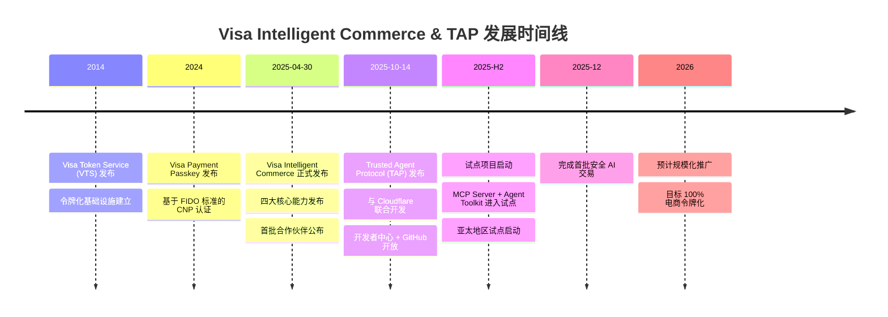

# Visa TAP (Trusted Agent Protocol) 与 Intelligent Commerce 深度研究报告

> 本报告是 Agentic Payment 系列研究的子报告之一，聚焦 Visa 的 Trusted Agent Protocol (TAP) 及其上层产品 Intelligent Commerce。
> 总览报告见 [agentic_payment_research.md](../agentic_payment_research.md)。
> 信息来源：[Visa Developer Center](https://developer.visa.com/capabilities/trusted-agent-protocol/trusted-agent-protocol-specifications)、[Visa Investor Relations](https://investor.visa.com/news/news-details/2025/Visa-Introduces-Trusted-Agent-Protocol-An-Ecosystem-Led-Framework-for-AI-Commerce/default.aspx)、[Visa Perspectives](https://global-corporate.review.visa.com/sites/visa-perspectives/innovation/visa-protocol-scale-agentic-commerce-globally.html)、[PYMNTS](https://www.pymnts.com/artificial-intelligence-2/2025/visa-turns-tokens-into-the-trust-layer-for-agentic-ai/) 等。内容经过改写以符合版权要求。

## 1. 概述 (Overview)

Visa 在 Agentic Payment 领域推出了两个层次的产品：

- **Visa Intelligent Commerce**（2025 年 4 月 30 日发布）— 面向 AI Agent 的完整商务平台，包含令牌化 Agent 商务、个性化优惠、Agent 结账、Agent 风控四大能力
- **Trusted Agent Protocol (TAP)**（2025 年 10 月 14 日发布）— 面向商户的 Agent 身份验证协议，解决"商户如何区分合法 Agent 和恶意 Bot"的核心信任问题

两者的关系：Intelligent Commerce 是 Visa 的 Agent 商务产品套件（侧重支付授权与凭证管理），TAP 是面向商户端的信任验证协议（侧重 Agent 身份识别与交易安全）。TAP 是 Intelligent Commerce 的协议基础层。

与 Google AP2 从零构建新的信任框架不同，Visa 选择了一条更务实的路径：**在现有卡网络基础设施上叠加 Agent 能力层**。TAP 不是要替代 Visa 的令牌化体系，而是在其之上增加了 Agent 身份验证、加密签名和消费者识别等 Agent 专属能力。

关键差异化特征：

- **卡网络原生**：直接构建在 Visa 全球卡网络之上，无需新的支付基础设施
- **HTTP 原生信任**：基于 RFC 9421 (HTTP Message Signatures) 标准，商户无需大规模改造系统
- **三层签名信任模型**：Agent 识别签名 + 消费者识别签名 + 支付容器签名，三层通过 nonce 关联
- **低代码/零代码集成**：商户可通过现有 Web 基础设施采用，无需自定义 API
- **FIDO2/Passkey 确认**：用户通过生物识别确认 Agent 支付授权
- **全球覆盖**：Visa 网络覆盖 200+ 国家/地区、1.75 亿+ 商户接受点
- **与 Cloudflare 联合开发**：与 Web Bot Auth 标准对齐，CDN/站点保护层可直接采用

### Visa TAP 在 Agentic Commerce 技术栈中的位置

```
┌─────────────────────────────────────────────────────────────┐
│                    商务编排层                                  │
│  ACP (OpenAI+Stripe)        UCP (Google)                     │
│  结账流程编排                全旅程商务标准                      │
├─────────────────────────────────────────────────────────────┤
│                    信任与授权层                                │
│  AP2 (Google)               TAP (Visa)                       │
│  支付信任与授权              卡网络原生 Agent 信任               │
│  Mandate + VC               三层签名 + Passkey                │
├─────────────────────────────────────────────────────────────┤
│                    结算层                                     │
│  Visa 卡网络    Stripe PSP    x402 链上结算    Mastercard      │
└─────────────────────────────────────────────────────────────┘
```

TAP 的独特定位：**它不重新发明支付流程，而是为现有 Web 商务注入 Agent 信任层**。商户网站几乎不需要改造，只需验证 HTTP 头中的加密签名即可识别合法 Agent。


## 2. 问题定义与背景 (Problem Definition & Context)

### 2.1 问题是什么

过去一年，AI 驱动的流量涌入美国零售网站，增幅超过 4,700%。商户面临一个前所未有的挑战：**如何区分合法的 AI 购物助手和恶意 Bot？**

传统的 Web 商务系统是为人类设计的。商户花了数十年优化风控系统来检测"不像人类"的行为。但 Agent 交易恰恰触发了这些系统设计来拦截的模式——自动化、高频、无浏览器指纹。

```
Agent 商务在现有 Web 基础设施中的挑战
├── 信任问题（TAP 核心解决的问题）
│   ├── 商户无法区分合法 Agent 和恶意 Bot
│   ├── CDN/站点保护系统误拦合法 Agent 交易
│   ├── 没有标准化的 Agent 身份验证机制
│   └── 商户不知道 Agent 背后的消费者是谁
├── 支付授权问题（Intelligent Commerce 解决的问题）
│   ├── Agent 没有信用卡，无法填写结账表单
│   ├── 如何安全地将支付凭证委托给 Agent？
│   ├── 如何限制 Agent 的支付权限？
│   └── 如何在 Agent 自主行动时确保用户知情同意？
├── 风控问题
│   ├── Agent 交易模式与人类不同，传统欺诈模型失效
│   ├── Visa 威胁报告显示恶意 Bot 交易半年增长 25%（美国增长 40%）
│   └── 自动化 Bot 已在大规模执行凭证填充、枚举和数据采集攻击
└── 生态问题
    ├── 1.75 亿+ 商户不可能为每个 AI 平台做定制集成
    ├── 需要标准化方案，而非碎片化的双边协议
    └── 现有 Agent 协议（ACP、AP2）需要自定义 API，集成成本高
```

### 2.2 为什么是 Visa？

Visa 在 Agentic Payment 领域有独特的战略位置：

- **全球最大卡网络**：覆盖 200+ 国家/地区、14,000+ 金融机构、1.75 亿+ 商户接受点
- **令牌化基础设施成熟**：全球电商交易量超过一半已令牌化，目标 100% 令牌化
- **风控能力领先**：Visa Advanced Authorization 每年分析数千亿笔交易
- **商户关系深厚**：与全球商户有直接的技术和商务关系
- **Web 基础设施对齐**：与 Cloudflare 合作，TAP 基于 HTTP 标准构建，CDN 层可直接采用

Visa 的策略核心：**标准化是唯一可行的路径**。1.75 亿商户不可能为每个 AI 平台做定制集成。TAP 提供低代码/零代码的采用路径，商户只需验证 HTTP 头中的签名即可。

### 2.3 两个产品的时间差

值得注意的是，Visa 分两步推出了 Agent 商务能力：

1. **2025 年 4 月 30 日 — Intelligent Commerce**：侧重"Agent 如何安全地使用 Visa 支付"，解决支付授权问题
2. **2025 年 10 月 14 日 — Trusted Agent Protocol**：侧重"商户如何识别和信任 Agent"，解决信任验证问题

这个时间差反映了 Visa 的务实策略：先解决支付侧的问题（让 Agent 能付钱），再解决商户侧的问题（让商户能信任 Agent）。

## 3. 核心概念与术语 (Key Concepts & Glossary)

- **TAP** (Trusted Agent Protocol) — Visa 与 Cloudflare 联合开发的 Agent 信任验证协议，基于 RFC 9421 HTTP Message Signatures，帮助商户识别合法 Agent
- **Intelligent Commerce** — Visa 的 AI Agent 商务平台，包含四大能力：Tokenized Agent Commerce、Intelligent Offers、Agentic Checkout、Visa Protect for AI Agents
- **Agent Recognition Signature** — TAP 三层签名中的第一层，基于 RFC 9421，证明 Agent 是经过 Visa 认证的可信 Agent
- **Agentic Consumer Recognition Object** — TAP 三层签名中的第二层，包含消费者身份信息（ID Token + 设备数据），帮助商户识别 Agent 背后的消费者
- **Agentic Payment Container** — TAP 三层签名中的第三层，包含支付凭证数据（令牌、凭证哈希或 Browsing IOU）
- **Browsing IOU** — 当商户通过 HTTP 402 响应请求付费访问时，Agent 返回的支付承诺对象
- **ID Token** — Visa 签发的 JWT（JSON Web Token），包含消费者的混淆化身份信息（哈希手机号、哈希邮箱），符合 OpenID Connect 标准
- **Key Store** — Visa 托管的公钥存储服务（`https://mcp.visa.com/.well-known/jwks`），商户从此获取验证签名所需的公钥
- **Agent Provider** — 经过 Visa 认证的 AI 平台（如 OpenAI、Microsoft、Anthropic、Samsung），被授权代表消费者发起交易
- **Site Protection Provider** — CDN 或信任管理系统（如 Cloudflare），位于商户网站前端，可代商户验证 TAP 签名
- **Visa Token Service (VTS)** — Visa 的令牌化服务，将真实卡号替换为令牌
- **FIDO2/Passkey** — 基于公钥密码学的无密码认证标准，Intelligent Commerce 使用其作为用户确认 Agent 授权的方式
- **Visa Payment Passkey** — Visa 基于 FIDO 标准的认证方案，用于 CNP（Card Not Present）场景的用户身份验证
- **Flexible Credential** — Visa 的灵活凭证技术，允许单一支付身份在借记卡、信用卡、BNPL 之间动态切换
- **Web Bot Auth** — Cloudflare 提出的 Web Bot 认证标准，TAP 与其对齐
- **RFC 9421** — HTTP Message Signatures 标准，TAP 的 Agent 识别签名基于此标准构建


## 4. 发展历程 (History & Evolution)



| 时间 | 事件 | 意义 |
|------|------|------|
| 2014 | Visa Token Service (VTS) 发布 | 建立令牌化基础设施，为 Agent 支付奠定技术基础 |
| 2024 | Visa Payment Passkey 发布 | 基于 FIDO 标准的无密码认证，为 Agent 授权确认铺路 |
| 2025-04-30 | Intelligent Commerce 发布 | Visa 正式进入 Agentic Payment 领域，发布完整产品套件 |
| 2025-10-14 | TAP 协议发布 | 解决商户侧的 Agent 信任问题，与 Cloudflare 联合推出 |
| 2025-H2 | 试点项目启动 | MCP Server 和 Agent Toolkit 进入生产试点 |
| 2025-12 | 首批安全 AI 交易 | 从实验走向生产验证 |
| 2026 | 预计规模化 | 大规模商业化推广 |

### 合作伙伴生态

TAP 和 Intelligent Commerce 的合作伙伴覆盖了 Agent 商务的全链路：

| 类别 | 合作伙伴 |
|------|----------|
| AI Agent 平台 | OpenAI、Microsoft、Anthropic、Samsung、Perplexity、IBM |
| 电商平台 | Shopify |
| PSP/收单行 | Stripe、Adyen、Worldpay、Nuvei、Checkout.com、CyberSource、Elavon、Fiserv |
| 基础设施 | Cloudflare（联合开发 TAP）、Coinbase（x402 互操作） |
| 金融科技 | Ant International、PayPal |

## 5. 业务场景 (Use Cases)

### 场景 1：AI 助手购物（Intelligent Commerce 核心场景）

用户对 AI 助手说"帮我买一双跑鞋"：

1. Agent 已在 Visa Intelligent Commerce 平台注册，用户已通过 Passkey 绑定 Visa 卡
2. Agent 携带 TAP 签名访问商户网站，商户验证签名后识别为合法 Agent
3. Agent 通过 Agentic Consumer Recognition Object 传递消费者身份，商户识别为已有客户
4. 用户确认购买后，Agent 通过 Passkey 认证获取支付凭证
5. Agent 通过 Agentic Payment Container 携带支付凭证完成结账
6. VisaNet 验证交易，发卡行授权，交易完成

### 场景 2：付费内容访问（TAP 的 HTTP 402 场景）

Agent 需要访问商户的付费产品评论：

1. Agent 请求访问付费资源
2. 商户返回 HTTP 402 响应，包含价格、商户 ID、收单行 ID
3. Agent 生成 Browsing IOU（支付承诺），包含在 Agentic Payment Container 中
4. 商户验证 IOU 签名和数据匹配后，授予访问权限
5. 资金在结算时到账

### 场景 3：商户识别合法 Agent vs 恶意 Bot

商户网站检测到自动化流量：

1. 流量到达 CDN/站点保护层（如 Cloudflare）
2. 检查 HTTP 头是否包含 TAP 签名（`tag="agent-browser-auth"` 或 `tag="agent-payer-auth"`）
3. 如果有签名：验证签名有效性 → 检查时间戳（8 分钟窗口）→ 检查 nonce 防重放 → 查询公钥验证 → 通过则放行
4. 如果无签名或验证失败：按现有 Bot 检测策略处理（可能拦截）

### 场景 4：企业采购自动化

企业 Agent 代表员工采购办公用品：

1. 企业在 Intelligent Commerce 平台注册 Agent，配置支付规则
2. Agent 携带 TAP 签名访问供应商网站
3. 通过 Passkey 认证获取受限支付凭证（限定商户类别、金额上限）
4. Agent 在授权范围内自动完成采购
5. 交易记录完整可审计，支持企业费用管理


## 6. 技术架构 (Architecture)

### 6.1 Visa Agentic Commerce 双层架构

Visa 的 Agent 商务能力分为两个层次，解决不同的问题：

```
┌─────────────────────────────────────────────────────────────────┐
│                 Visa Intelligent Commerce 平台                    │
│                 （Agent 支付授权与凭证管理）                        │
│                                                                   │
│  ┌──────────────┐ ┌──────────────┐ ┌──────────────┐ ┌──────────┐│
│  │ Tokenized    │ │ Intelligent  │ │ Agentic      │ │ Visa     ││
│  │ Agent        │ │ Offers       │ │ Checkout     │ │ Protect  ││
│  │ Commerce     │ │              │ │              │ │ for AI   ││
│  │              │ │ AI 个性化    │ │ Agent 结账   │ │ Agents   ││
│  │ Agent 注册   │ │ 优惠推荐     │ │ 流程编排     │ │          ││
│  │ 凭证签发     │ │              │ │              │ │ Agent    ││
│  │ Passkey 认证 │ │              │ │              │ │ 交易风控 ││
│  └──────────────┘ └──────────────┘ └──────────────┘ └──────────┘│
├─────────────────────────────────────────────────────────────────┤
│                 Trusted Agent Protocol (TAP)                      │
│                 （Agent-商户信任验证协议）                          │
│                                                                   │
│  ┌──────────────────┐ ┌──────────────────┐ ┌──────────────────┐ │
│  │ Layer 1           │ │ Layer 2           │ │ Layer 3           │ │
│  │ Agent Recognition │ │ Consumer          │ │ Payment           │ │
│  │ Signature         │ │ Recognition       │ │ Container         │ │
│  │                   │ │ Object            │ │                   │ │
│  │ RFC 9421          │ │ ID Token +        │ │ 支付凭证 +        │ │
│  │ HTTP 头签名       │ │ 设备/位置数据     │ │ Browsing IOU      │ │
│  └──────────────────┘ └──────────────────┘ └──────────────────┘ │
├─────────────────────────────────────────────────────────────────┤
│                 Visa 基础设施层                                    │
│  Visa Token Service (VTS)  │  VisaNet  │  Visa Advanced Auth     │
└─────────────────────────────────────────────────────────────────┘
```

### 6.2 TAP 三层签名信任模型（核心技术创新）

TAP 的核心创新是三层签名信任模型。每一层解决一个不同的信任问题，三层通过共享的 `nonce` 值关联，形成完整的信任链。

```
TAP 三层签名信任模型
│
├── Layer 1: Agent Recognition Signature（HTTP 头）
│   ├── 位置：HTTP 请求头（Signature-Input + Signature）
│   ├── 标准：RFC 9421 HTTP Message Signatures
│   ├── 算法：Ed25519
│   ├── 回答的问题："这个 Agent 是经过 Visa 认证的可信 Agent 吗？"
│   ├── 签名覆盖：@authority, @path, created, expires, keyid, nonce, tag
│   ├── tag 值：
│   │   ├── "agent-browser-auth" — 浏览交互（查看商品详情）
│   │   └── "agent-payer-auth" — 支付交互（结账）
│   └── 防护：身份伪造、请求篡改、重放攻击
│
├── Layer 2: Agentic Consumer Recognition Object（请求体）
│   ├── 位置：HTTP 请求体 JSON
│   ├── 回答的问题："Agent 背后的消费者是谁？商户认识这个消费者吗？"
│   ├── 包含：
│   │   ├── nonce — 与 Layer 1 相同，关联两层签名
│   │   ├── idToken — Visa 签发的 JWT（OpenID Connect 兼容）
│   │   │   ├── 混淆化手机号 (phone_number)
│   │   │   ├── 混淆化邮箱 (email)
│   │   │   ├── 掩码手机号 (phone_number_mask)
│   │   │   └── 掩码邮箱 (email_mask)
│   │   ├── contextualData — 消费者设备和位置信息
│   │   │   ├── countryCode (ISO 3166-1 alpha-2)
│   │   │   ├── zip (邮编或城市/州)
│   │   │   ├── ipAddress
│   │   │   └── deviceData
│   │   ├── kid — 公钥 ID（与 Layer 1 相同）
│   │   ├── alg — 签名算法（PS256）
│   │   └── signature — 签名值
│   └── 隐私设计：身份信息全部混淆化，商户需维护映射表匹配
│
└── Layer 3: Agentic Payment Container（请求体）
    ├── 位置：HTTP 请求体 JSON
    ├── 回答的问题："Agent 能完成支付吗？支付凭证是否合法？"
    ├── 包含（根据支付方式不同）：
    │   ├── 场景 A：Guest Checkout（表单填写）
    │   │   ├── credentialHash — 支付凭证哈希（卡号+有效期+CVV 的哈希）
    │   │   └── cardMetadata — 卡片元数据（末四位、PAR 等）
    │   ├── 场景 B：API/协议支付
    │   │   └── payload — 加密的完整支付对象（用商户公钥加密）
    │   │       ├── paymentToken, expirationMonth/Year, cardholderName
    │   │       ├── dynamicData
    │   │       ├── shippingAddress, billingAddress
    │   │       └── consumerEmailAddress, consumerName, consumerMobileNumber
    │   └── 场景 C：HTTP 402 付费访问
    │       └── browsingIOU — 支付承诺对象
    │           ├── invoiceId, amount, cardAcceptorId, acquirerId
    │           ├── uri, sequenceCounter, paymentService
    │           └── kid, alg, signature
    ├── nonce — 与 Layer 1、Layer 2 相同
    ├── kid, alg, signature
    └── 防护：支付凭证篡改、未授权支付
```

### 6.3 TAP 交互流程

#### 浏览交互（Agent 查看商品详情）

```
Agent                          商户网站/CDN                    Visa Key Store
  │                                │                              │
  │  GET /product-detail           │                              │
  │  Headers:                      │                              │
  │    Signature-Input: sig2=...   │                              │
  │      tag="agent-browser-auth"  │                              │
  │    Signature: sig2=:....:      │                              │
  │  Body:                         │                              │
  │    agenticConsumer: {...}      │                              │
  │────────────────────────────────>│                              │
  │                                │                              │
  │                                │  GET /keys?keyID=...         │
  │                                │─────────────────────────────>│
  │                                │  JWK (公钥)                  │
  │                                │<─────────────────────────────│
  │                                │                              │
  │                                │  验证流程：                   │
  │                                │  1. 检查 tag = agent-browser-auth ✓
  │                                │  2. 检查必填字段完整 ✓
  │                                │  3. 检查时间戳（<8分钟窗口）✓
  │                                │  4. 检查 nonce 防重放 ✓
  │                                │  5. 用公钥验证签名 ✓
  │                                │  6. 验证 Consumer Object 签名 ✓
  │                                │  7. 匹配消费者身份 ✓
  │                                │                              │
  │  200 OK (商品详情)             │                              │
  │<────────────────────────────────│                              │
```

#### 支付交互（Agent 结账）

```
Agent                          商户网站                        VisaNet
  │                                │                              │
  │  POST /checkout                │                              │
  │  Headers:                      │                              │
  │    Signature-Input: sig2=...   │                              │
  │      tag="agent-payer-auth"    │                              │
  │    Signature: sig2=:....:      │                              │
  │  Body:                         │                              │
  │    agenticConsumer: {...}      │                              │
  │    agenticPaymentContainer:    │                              │
  │      { credentialHash / payload / browsingIOU }               │
  │────────────────────────────────>│                              │
  │                                │                              │
  │                                │  验证三层签名                 │
  │                                │  验证支付凭证                 │
  │                                │                              │
  │                                │  提交交易授权请求             │
  │                                │─────────────────────────────>│
  │                                │                              │
  │                                │  授权响应                    │
  │                                │<─────────────────────────────│
  │                                │                              │
  │  交易结果                      │                              │
  │<────────────────────────────────│                              │
```

#### HTTP 402 付费访问流程

```
Agent                          商户网站
  │                                │
  │  GET /premium-reviews          │
  │  (携带 Layer 1 签名)           │
  │────────────────────────────────>│
  │                                │
  │  402 Payment Required          │
  │  { invoiceId, amount,          │
  │    cardAcceptorId, acquirerId } │
  │<────────────────────────────────│
  │                                │
  │  GET /premium-reviews          │
  │  (携带 Layer 1 + Layer 3)      │
  │  Layer 3 包含 browsingIOU:     │
  │  { invoiceId, amount,          │
  │    cardAcceptorId, acquirerId,  │
  │    uri, sequenceCounter,        │
  │    paymentService, signature }  │
  │────────────────────────────────>│
  │                                │
  │  商户验证：                     │
  │  1. IOU 数据与 402 响应匹配？  │
  │  2. 签名有效？                 │
  │  → 授予访问权限                │
  │                                │
  │  200 OK (付费内容)             │
  │<────────────────────────────────│
```

### 6.4 Intelligent Commerce 平台流程

```
用户                AI Agent              Visa IC 平台           商户          发卡行
 │                    │                      │                    │              │
 │ 1. 注册 Agent      │                      │                    │              │
 │ 2. 添加 Visa 卡    │                      │                    │              │
 │ 3. 设置 Passkey    │                      │                    │              │
 │───────────────────>│                      │                    │              │
 │                    │  Agent 注册           │                    │              │
 │                    │─────────────────────>│                    │              │
 │                    │                      │  卡片验证 + Passkey │              │
 │                    │                      │────────────────────────────────>│
 │                    │                      │  确认               │              │
 │                    │                      │<────────────────────────────────│
 │                    │                      │                    │              │
 │ "帮我买跑鞋"       │                      │                    │              │
 │───────────────────>│                      │                    │              │
 │                    │  请求个性化数据       │                    │              │
 │                    │─────────────────────>│                    │              │
 │                    │  Intelligent Offers   │                    │              │
 │                    │<─────────────────────│                    │              │
 │                    │                      │                    │              │
 │                    │  携带 TAP 签名浏览    │                    │              │
 │                    │──────────────────────────────────────────>│              │
 │                    │  商品详情 + 价格      │                    │              │
 │                    │<──────────────────────────────────────────│              │
 │                    │                      │                    │              │
 │ "确认购买"          │                      │                    │              │
 │ (Passkey 认证)     │                      │                    │              │
 │───────────────────>│                      │                    │              │
 │                    │  请求支付凭证         │                    │              │
 │                    │─────────────────────>│                    │              │
 │                    │                      │  验证 Passkey       │              │
 │                    │                      │  签发受限凭证       │              │
 │                    │                      │  设置网络级控制     │              │
 │                    │  支付凭证             │                    │              │
 │                    │<─────────────────────│                    │              │
 │                    │                      │                    │              │
 │                    │  携带 TAP 三层签名结账│                    │              │
 │                    │──────────────────────────────────────────>│              │
 │                    │                      │                    │  授权请求     │
 │                    │                      │                    │─────────────>│
 │                    │                      │                    │  授权响应     │
 │                    │                      │                    │<─────────────│
 │                    │  交易完成             │                    │              │
 │                    │<──────────────────────────────────────────│              │
 │                    │                      │                    │              │
 │                    │  分享商务信号         │                    │              │
 │                    │─────────────────────>│                    │              │
 │                    │                      │  (用于争议解决)     │              │
 │ 购买完成通知        │                      │                    │              │
 │<───────────────────│                      │                    │              │
```


## 7. 技术规范详解 (Technical Deep Dive)

### 7.1 Layer 1: Agent Recognition Signature — RFC 9421 实现

TAP 的第一层签名基于 RFC 9421 HTTP Message Signatures 标准，是整个信任模型的基础。

#### 签名结构

HTTP 头中包含两个字段：

```
Signature-Input: sig2=("@authority" "@path");
     created=1735689600;
     expires=1735693200;
     keyId="poqkLGiymh_W0uP6PZFw-dvez3QJT5SolqXBCW38r0U";
     alg="Ed25519";
     nonce="e8N7S2MFd/qrd6T2R3tdfAuuANngKI7LFtKYI/vowzk4lAZyadIX6wW25MwG7DCT9RUKAJ0qVkU0mEeLElW1qg==";
     tag="agent-browser-auth"
Signature: sig2=:jdq0SqOwHdyHr9+r5jw3iYZH6aNGKijYp/EstF4RQTQdi5N5YYKrD+mCT1HA1nZDsi6nJKuHxUi/5Syp3rLWBA==:
```

#### 必填字段

| 字段 | 说明 |
|------|------|
| `@authority` | 目标 URI 的 authority（域名） |
| `@path` | 目标 URI 的绝对路径 |
| `created` | 请求创建时间戳 |
| `keyid` | 用于验证签名的公钥 ID |
| `expires` | 请求过期时间戳 |
| `tag` | 交互类型：`agent-browser-auth`（浏览）或 `agent-payer-auth`（支付） |
| `alg` | 签名算法（Ed25519） |
| `nonce` | 会话标识符，关联三层签名 |

#### 验证流程

商户（或 Site Protection Provider）应执行以下验证步骤：

1. **检查 tag**：HTTP 头中是否包含 `tag="agent-browser-auth"` 或 `tag="agent-payer-auth"`？无则非可信 Agent
2. **检查必填字段**：上表所有字段是否完整？缺失则拦截
3. **检查时间戳**：`created` 和 `expires` 之间不超过 8 分钟；`created` 在过去；`expires` 在未来。不满足则拦截
4. **检查 nonce**：如果维护了最近 8 分钟的 nonce 记录，检查是否重复。重复则拦截（防重放攻击）
5. **获取公钥**：根据 `keyid` 从 Visa Key Store（`https://mcp.visa.com/.well-known/jwks`）获取公钥。获取失败或公钥过期则拦截
6. **验证签名**：构建签名基字符串，用公钥验证签名。验证失败则拦截

#### 签名基字符串构建示例（Python）

```python
# 输入值来自 HTTP 请求
authority = "example.com"
path = "/example-product"
created = 1735689600
expires = 1735693200
keyid = "poaKLGjymh_W0uP6PZFw-dvez3QJTSolqXBCW38r0U"
nonce = "e8N7S2MFd/qrddE7R23tdfAuuANngKI7LFtKYI/vIowzk4lAZYadIX6wW25MwG7DCT9RUKAJ0qVkUOmEeLEWI1qq=="
tag = "agent-browser-auth"

# 构建签名基字符串
signature_base = (
    f"@authority: {authority}\n"
    f"@path: {path}\n"
    f"\"@signature-params\": sig2=(\"@authority\" \"@path\");"
    f"created={created};"
    f"keyid=\"{keyid}\";"
    f"expires={expires};"
    f"nonce=\"{nonce}\";"
    f"tag=\"{tag}\""
)
```

### 7.2 Layer 2: Agentic Consumer Recognition Object

第二层签名帮助商户识别 Agent 背后的消费者，实现"已登录"体验。

#### JSON 结构

```json
{
  "agenticConsumer": {
    "nonce": "e8N7S2MFd/qrd6T2R3tdfAuuANngKI7LFtKYI/vowzk4lAZyadIX6wW25MwG7DCT9RUKAJ0qVkU0mEeLElW1qg==",
    "idToken": { "/* Visa 签发的 JWT */" },
    "contextualData": {
      "countryCode": "US",
      "zip": "94105",
      "ipAddress": "203.0.113.42",
      "deviceData": { "/* 设备指纹数据 */" }
    },
    "kid": "poqkLGiymh_W0uP6PZFw-dvez3QJT5SolqXBCW38r0U",
    "alg": "PS256",
    "signature": "jdq0SqOwHdyHr9+..."
  }
}
```

#### ID Token（JWT）结构

ID Token 是 Visa 签发的 JWT，符合 OpenID Connect 标准：

**Header:**

| 字段 | 说明 |
|------|------|
| `alg` | 签名算法（PS256 优先于 RS256） |
| `kid` | Visa 公钥 ID |
| `typ` | `JWT+ext.id_token` |

**Public Claims:**

| Claim | 说明 |
|-------|------|
| `iss` | 签发者标识（Visa） |
| `sub` | 消费者主体标识（Visa 内部唯一 ID） |
| `aud` | 受众（目标商户） |
| `exp` | 过期时间 |
| `iat` | 签发时间 |
| `auth_time` | 用户认证时间 |
| `amr` | 认证方法列表 |

**Standard Claims（隐私保护）:**

| Claim | 说明 |
|-------|------|
| `phone_number` | **混淆化**手机号（E.164 格式，去掉前导 +） |
| `phone_number_verified` | 手机号是否已验证 |
| `email` | **混淆化**邮箱（RFC 5322 格式，全小写） |
| `email_verified` | 邮箱是否已验证 |

**Private Claims（UI 友好）:**

| Claim | 说明 |
|-------|------|
| `phone_number_mask` | 掩码手机号（如 `+1******1234`），用于 UI 展示 |
| `email_mask` | 掩码邮箱（如 `j***@example.com`），用于 UI 展示 |

**隐私设计要点**：身份信息全部混淆化传输。商户需要维护一个映射表，将混淆化的手机号/邮箱与自己系统中的实际手机号/邮箱匹配，才能识别消费者。

### 7.3 Layer 3: Agentic Payment Container

第三层签名携带支付凭证，根据支付方式不同有四种变体：

#### 变体 A：凭证哈希（Guest Checkout 表单填写场景）

```json
{
  "agenticPaymentContainer": {
    "nonce": "...",
    "credentialHash": "SHA256(卡号16位 + 有效月2位 + 有效年2位 + CVV3位)",
    "cardMetadata": {
      "lastFour": "1234",
      "paymentAccountReference": "V0010013020...",
      "shortDescription": [
        {
          "contentType": "image/png",
          "mimeType": "image/png",
          "width": 200,
          "height": 126
        }
      ]
    },
    "kid": "...",
    "alg": "PS256",
    "signature": "..."
  }
}
```

商户验证：用 Agent 表单填写的卡号+有效期+CVV 生成哈希，与 `credentialHash` 比对。不匹配则说明填写的数据被篡改，应拒绝交易。

#### 变体 B：加密支付对象（API/协议支付场景）

```json
{
  "agenticPaymentContainer": {
    "nonce": "...",
    "payload": "/* 用商户公钥加密的完整支付对象 */",
    "kid": "...",
    "alg": "PS256",
    "signature": "..."
  }
}
```

解密后的 payload 包含：Token 对象（paymentToken, expirationMonth/Year, cardholderName）、dynamicData、ShippingAddress、BillingAddress、consumerEmailAddress 等。

#### 变体 C：Browsing IOU（HTTP 402 付费访问场景）

```json
{
  "agenticPaymentContainer": {
    "nonce": "...",
    "browsingIOU": {
      "invoiceId": "inv_abc123",
      "amount": "0.50",
      "cardAcceptorId": "MERCHANT_CAID",
      "acquirerId": "ACQUIRER_AID",
      "uri": "https://merchant.com/premium-reviews",
      "sequenceCounter": 1,
      "paymentService": "visa",
      "kid": "...",
      "alg": "PS256",
      "signature": "..."
    },
    "kid": "...",
    "alg": "PS256",
    "signature": "..."
  }
}
```

### 7.4 公钥检索服务

Visa 在 `https://mcp.visa.com/.well-known/jwks` 托管公钥，返回 JWK 格式：

```
GET /keys?keyID=poqkLGiymh_W0uP6PZFw-dvez3QJT5SolqXBCW38r0U

Response:
{
  "kty": "EC",
  "kid": "poqkLGiymh_W0uP6PZFw-dvez3QJT5SolqXBCW38r0U",
  "use": "sig",
  "alg": "Ed25519",
  "n": "...",
  "e": "..."
}
```

公钥检索流程：
1. 从签名中提取 `keyid`/`kid`
2. 访问 Visa well-known URL 获取公钥集
3. 根据 `kid` 和 `alg` 选择对应公钥
4. 用公钥验证签名
5. 商户可缓存公钥以减少网络请求


## 8. 与其他协议的对比分析 (Comparison)

### 8.1 TAP vs AP2 vs ACP 核心对比

| 维度 | TAP (Visa) | AP2 (Google) | ACP (OpenAI+Stripe) |
|------|-----------|-------------|---------------------|
| **定位** | Agent-商户信任验证 | 支付信任与授权 | 结账流程编排 |
| **核心问题** | 商户如何识别合法 Agent？ | 用户如何安全授权 Agent 支付？ | Agent 如何完成结账？ |
| **信任模型** | 三层加密签名（RFC 9421） | Mandate + Verifiable Credential | Delegated Vault Token |
| **用户确认** | FIDO2/Passkey | VC 签名 | Stripe Checkout UI |
| **标准基础** | RFC 9421, WebAuthn, OpenID Connect | W3C VC, A2A Protocol | Stripe API |
| **集成方式** | HTTP 头签名（低代码/零代码） | 自定义 API | Stripe SDK |
| **商户改造** | 极小（验证 HTTP 头即可） | 中等（需实现 AP2 API） | 中等（需集成 Stripe） |
| **支付网络** | Visa 卡网络 | 支付无关（卡、银行、稳定币） | Stripe 支付网络 |
| **覆盖范围** | 1.75 亿+ Visa 商户 | 理论上无限（开放标准） | Stripe 商户 |
| **开放性** | 开放协议（GitHub + Developer Center） | 开放标准 | 半开放（依赖 Stripe） |
| **互操作性** | 与 ACP、x402 对齐 | 与 A2A、UCP 集成 | 可增强 TAP 信任 |
| **成熟度** | 规范已发布，试点中 | 规范已发布，60+ 合作伙伴 | 已上线（ChatGPT 内购物） |

### 8.2 信任模型深度对比

```
TAP 信任模型                          AP2 信任模型
─────────────                         ─────────────
Layer 1: Agent 身份                   Agent Card: Agent 自描述
  RFC 9421 签名                         A2A 协议验证
  Visa 认证的公钥                       去中心化身份
                                      
Layer 2: 消费者身份                   Intent Mandate: 用户意图
  ID Token (JWT)                        Verifiable Credential 签名
  混淆化身份信息                        明确的约束条件
                                      
Layer 3: 支付凭证                     Cart Mandate: 购物车确认
  凭证哈希/加密 payload/IOU             VC 签名的具体商品+价格
  Visa 令牌化体系                       支付无关的授权
                                      
三层通过 nonce 关联                   两步 Mandate 通过 VC 链关联
```

### 8.3 关键差异分析

**TAP 的优势：**
- **商户采用成本极低**：只需验证 HTTP 头签名，无需新 API。Visa 明确目标是"低代码到零代码"
- **全球即时覆盖**：1.75 亿+ 商户已接受 Visa，无需重新建立商户关系
- **CDN 层可直接采用**：Cloudflare 等 CDN 可代商户验证签名，商户甚至不需要改代码
- **与现有风控集成**：Visa Advanced Authorization 可直接为 Agent 交易提供风控
- **HTTP 402 原生支持**：与 x402 类似的付费访问模式，但基于 Visa 卡网络结算

**TAP 的局限：**
- **Visa 网络锁定**：核心依赖 Visa 卡网络，非 Visa 卡无法使用
- **支付方式单一**：只支持 Visa 卡支付，不支持银行转账、稳定币等
- **授权模型较简单**：相比 AP2 的 Mandate 模型，TAP 的用户授权表达能力较弱
- **审计链不如 AP2 完整**：AP2 的 VC 签名链提供了更强的不可否认性
- **中心化依赖**：公钥由 Visa 托管，信任根在 Visa

### 8.4 互补关系

TAP 与其他协议不是竞争关系，而是互补关系：

```
场景：Agent 为用户购买商品

1. Agent 通过 A2A 协议与商户 Agent 通信（通信层）
2. Agent 通过 AP2 Mandate 获取用户授权（授权层）
3. Agent 携带 TAP 签名访问商户网站（信任层）
4. 商户通过 TAP 验证 Agent 身份（验证层）
5. Agent 通过 ACP 完成结账流程（编排层）
6. 支付通过 Visa 卡网络结算（结算层）

TAP 解决的是第 3-4 步：Agent 到达商户时，商户如何信任它？
```

Visa 在 TAP 发布公告中明确表示：正在与生态伙伴合作，确保 TAP 与 ACP 等协议互补，并与 Coinbase 合作对齐 x402 的互操作性。

## 9. 安全模型 (Security Model)

### 9.1 威胁模型与防护

| 威胁 | TAP 防护机制 |
|------|-------------|
| **Agent 身份伪造** | Layer 1 RFC 9421 签名 + Visa 认证的公钥。只有经过 Visa 认证的 Agent 才能获得签名私钥 |
| **请求篡改** | 签名覆盖 @authority 和 @path，任何修改都会使签名失效 |
| **重放攻击** | nonce + 时间戳（8 分钟窗口）+ nonce 去重检查 |
| **消费者身份伪造** | Layer 2 ID Token 由 Visa 签发（JWT），用 Visa 公钥验证 |
| **支付凭证篡改** | Layer 3 凭证哈希/加密 payload，商户可验证数据完整性 |
| **恶意 Bot 伪装** | 无 TAP 签名的自动化流量可被 CDN/站点保护层拦截 |
| **中间人攻击** | HTTPS + 加密签名，即使流量被截获也无法伪造签名 |
| **凭证泄露** | Guest Checkout 场景只传哈希，API 场景用商户公钥加密 |

### 9.2 隐私保护设计

TAP 在隐私保护方面有精心设计：

- **身份混淆化**：消费者手机号和邮箱在 ID Token 中全部混淆化传输，商户需要自己的映射表才能识别
- **掩码展示**：提供掩码版本（如 `j***@example.com`）用于 UI 展示，不暴露完整信息
- **用户控制**：消费者可以选择作为"访客"不分享太多信息，或选择与信任的商户分享更多数据以获得个性化体验
- **最小数据原则**：每层签名只包含该层所需的最少数据

### 9.3 与 Visa 现有安全体系的集成

TAP 不是独立的安全系统，而是与 Visa 现有安全体系深度集成：

- **Visa Advanced Authorization (VAA)**：实时交易风险评分，为 Agent 交易提供风控
- **Visa Protect for AI Agents**：专为 Agent 交易模式训练的 AI 欺诈检测模型
- **Visa Token Service (VTS)**：令牌化保护真实卡号不暴露
- **VisaNet 网络级控制**：在授权请求到达 VisaNet 时，验证请求来自预期商户、金额正确

## 10. 开发者体验 (Developer Experience)

### 10.1 商户集成路径

TAP 的设计目标是"低代码到零代码"集成：

**路径 1：CDN/站点保护层自动验证（零代码）**
- 如果商户使用 Cloudflare 等支持 TAP 的 CDN
- CDN 自动验证 TAP 签名，将验证结果传递给商户
- 商户无需改动任何代码

**路径 2：商户自行验证（低代码）**
- 在 Web 服务器中间件中添加签名验证逻辑
- 从 Visa Key Store 获取公钥（可缓存）
- 验证 HTTP 头中的签名
- 约 50-100 行代码

**路径 3：完整集成（中等代码量）**
- 验证三层签名
- 处理 Consumer Recognition Object 匹配消费者
- 处理 Payment Container 完成支付
- 实现 HTTP 402 付费访问（可选）

### 10.2 Agent Provider 集成路径

Agent 平台（如 OpenAI、Microsoft）需要：

1. 在 Visa Intelligent Commerce 平台注册为 Agent Provider
2. 获取签名私钥
3. 实现三层签名生成逻辑
4. 集成 Passkey 认证流程
5. 实现支付凭证请求和使用流程

### 10.3 开发者资源

- **Visa Developer Center**：`developer.visa.com/capabilities/trusted-agent-protocol`
- **GitHub**：TAP 规范开源
- **MCP Server**：Visa 提供 MCP Server，Agent 可通过 MCP 协议与 Visa 平台交互
- **Agent Toolkit**：Visa Acceptance Platform 上的 Agent 工具包，目前在试点中

## 11. 商业模式与生态 (Business Model & Ecosystem)

### 11.1 Visa 的商业模式

TAP 本身是开放协议，不直接收费。Visa 的商业模式仍然基于卡网络交易：

- **交易手续费**：Agent 通过 Visa 卡网络完成的每笔交易，Visa 收取网络费用
- **令牌化服务费**：Visa Token Service 的使用费
- **增值服务**：Intelligent Offers（个性化优惠）、Visa Protect for AI Agents（风控）等增值服务
- **数据服务**：基于交易数据的洞察和分析服务

核心逻辑：**TAP 越普及，通过 Visa 卡网络的 Agent 交易越多，Visa 的交易手续费收入越高**。

### 11.2 生态参与方的价值

| 参与方 | 获得的价值 |
|--------|-----------|
| **消费者** | AI 助手可以安全地代为购物，Passkey 确认简单直观 |
| **商户** | 低成本接入 Agent 渠道，区分合法 Agent 和恶意 Bot，保持客户关系 |
| **Agent 平台** | 获得 Visa 网络的全球商户覆盖，安全的支付能力 |
| **发卡行** | 在 Agent 交易中保持风控能力和客户关系 |
| **PSP/收单行** | 新的 Agent 交易量，与现有系统兼容 |
| **CDN/站点保护** | 新的增值服务（Agent 验证），减少误拦合法流量 |

### 11.3 竞争格局

```
Agentic Payment 竞争格局（2026 年初）

卡网络阵营：
├── Visa: Intelligent Commerce + TAP
│   优势：全球最大卡网络，HTTP 原生，低代码集成
│   策略：标准化 + 开放协议 + 生态合作
└── Mastercard: Agent Pay
    优势：Decision Intelligence AI 风控
    策略：Agent 预注册审核 + Agentic Token

科技公司阵营：
├── Google: AP2 + A2A + UCP
│   优势：最完整的协议栈，支付无关
│   策略：开放标准 + 去中心化
├── OpenAI + Stripe: ACP
│   优势：已上线（ChatGPT 购物），开发者友好
│   策略：快速落地 + Stripe 生态
└── Coinbase: x402
    优势：HTTP 原生，即时结算，零协议费
    策略：激活 HTTP 402 + 链上结算

趋势：各方正在走向互操作而非对抗
- TAP 与 ACP 互补
- TAP 与 x402 对齐互操作
- AP2 支付无关，可使用 Visa 卡网络结算
```

## 12. 挑战与风险 (Challenges & Risks)

### 12.1 技术挑战

- **标准化竞争**：TAP、AP2、ACP 等多个协议并存，商户面临选择困难。虽然各方声称互补，但实际集成仍有摩擦
- **公钥管理**：全球 1.75 亿商户需要能够访问 Visa Key Store 获取公钥，网络延迟和可用性是挑战
- **签名性能**：每个请求都需要签名验证，对高流量商户可能有性能影响（虽然可通过缓存公钥缓解）
- **Guest Checkout 局限**：初期 Agent 支付通过 Guest Checkout 表单填写完成，体验不如原生 API 集成

### 12.2 生态挑战

- **Visa 网络锁定**：TAP 核心依赖 Visa 卡网络，Mastercard、银联等其他卡组织的持卡人无法使用
- **Agent Provider 有限**：目前只有少数 AI 平台（OpenAI、Microsoft、Anthropic 等）参与，覆盖面有限
- **商户采用速度**：虽然集成成本低，但商户仍需要动力去采用。需要证明 Agent 渠道的商业价值
- **发卡行配合**：发卡行需要升级系统支持 Passkey 和 Agent 相关流程

### 12.3 监管与合规风险

- **Agent 交易责任归属**：当 Agent 买错东西时，是用户责任还是 Agent 平台责任？现有消费者保护法规可能不适用
- **跨境合规**：不同国家对 AI Agent 交易的监管要求不同
- **数据隐私**：虽然 TAP 有隐私保护设计，但消费者数据在 Agent 平台、Visa、商户之间流转，需要符合 GDPR 等法规

## 13. 未来展望 (Future Outlook)

### 13.1 短期（2026）

- TAP 从试点走向规模化部署
- 更多 CDN/站点保护提供商支持 TAP 自动验证
- Visa MCP Server 和 Agent Toolkit 正式发布
- 与 ACP、x402 的互操作性落地

### 13.2 中期（2027-2028）

- TAP 可能演进为跨卡组织的行业标准（通过 IETF、EMVCo 等标准组织）
- Agent 支付从 Guest Checkout 演进到原生 API 集成
- Flexible Credential 与 Agent 深度集成，实现智能支付方式选择
- Agent 交易量占电商总量的显著比例

### 13.3 长期（2029+）

- Agent 商务成为主流购物方式
- TAP 或其演进版本成为 Web 基础设施的一部分
- 卡网络从"人类支付基础设施"演进为"人类+Agent 支付基础设施"
- 争议解决、消费者保护等法规框架适应 Agent 交易

### 13.4 关键不确定性

- **标准之争**：TAP vs AP2 vs ACP，哪个会成为主导标准？还是会共存互补？
- **Agent 采用速度**：消费者是否真的愿意让 AI Agent 代为购物和支付？
- **监管态度**：各国监管机构对 Agent 交易的态度是鼓励还是限制？
- **安全事件**：如果发生大规模 Agent 支付欺诈事件，可能显著影响采用速度

## 14. 总结 (Summary)

Visa 通过 Intelligent Commerce + TAP 的双层产品策略，在 Agentic Payment 领域占据了独特位置：

**Intelligent Commerce** 解决"Agent 如何安全地使用 Visa 支付"——通过 Passkey 认证、令牌化凭证、网络级控制，让 Agent 能够在 Visa 卡网络中安全地代用户支付。

**TAP** 解决"商户如何识别和信任 Agent"——通过三层加密签名（Agent 身份 + 消费者身份 + 支付凭证），基于 HTTP 标准构建，让商户以极低成本区分合法 Agent 和恶意 Bot。

TAP 的核心竞争力在于：
1. **务实**：不重新发明轮子，在现有 Web 和卡网络基础设施上叠加 Agent 能力
2. **低摩擦**：商户几乎不需要改代码，CDN 层可自动验证
3. **全球覆盖**：1.75 亿+ 商户即时可用
4. **互操作**：与 ACP、x402 等协议互补而非竞争

TAP 的核心局限在于：
1. **Visa 锁定**：只支持 Visa 卡，非 Visa 持卡人无法使用
2. **授权表达力弱**：相比 AP2 的 Mandate 模型，用户授权的精细度不足
3. **中心化**：信任根在 Visa，不如 AP2 的去中心化 VC 模型

在 Agentic Payment 的竞争格局中，TAP 最可能的角色是：**Agent 商务的信任基础设施层**——无论 Agent 使用哪个上层协议（ACP、AP2、UCP），当它到达商户网站时，TAP 提供了一种标准化的方式让商户验证它的身份和意图。

---

> 本报告基于公开信息编写，信息截至 2026 年 2 月。Visa TAP 和 Intelligent Commerce 仍在快速演进中，部分技术细节可能已更新。
> 
> 主要信息来源：
> - [Visa Developer Center - TAP Specifications](https://developer.visa.com/capabilities/trusted-agent-protocol/trusted-agent-protocol-specifications)
> - [Visa Developer Center - Intelligent Commerce](https://developer.visa.com/capabilities/visa-intelligent-commerce/overview)
> - [Visa Investor Relations - TAP Press Release](https://investor.visa.com/news/news-details/2025/Visa-Introduces-Trusted-Agent-Protocol-An-Ecosystem-Led-Framework-for-AI-Commerce/default.aspx)
> - [Visa Perspectives - Protocol for Agentic Commerce](https://global-corporate.review.visa.com/sites/visa-perspectives/innovation/visa-protocol-scale-agentic-commerce-globally.html)
> - [PYMNTS - Visa Turns Tokens Into Trust Layer](https://www.pymnts.com/artificial-intelligence-2/2025/visa-turns-tokens-into-the-trust-layer-for-agentic-ai/)
> - [Oscilar - Visa TAP Analysis](https://oscilar.com/blog/visatap)
> 
> 内容经过改写以符合版权要求。
