# Agentic Commerce 总览研究报告

> 本报告是 Agentic Payment 系列研究的总览报告，综合分析 AI Agent 驱动的商务支付生态全景。
> 子报告索引：
> - [Google UCP 研究报告](1.google_ucp/google_ucp_research.md)
> - [OpenAI + Stripe ACP 研究报告](2.openai_strip_acp/openai_stripe_acp_research.md)
> - [Amazon Buy for Me 研究报告](3.amazon_payforme/amazon_buyforme_research.md)
> - [Google AP2 研究报告](4.google_ap2/google_ap2_research.md)
> - [Coinbase x402 研究报告](5.conibase_x402/coinbase_x402_research.md)
> - [Visa TAP 研究报告](6.visa_tap/visa_tap_research.md)
> - [Mastercard Agent Pay 研究报告](7.mastercard_agent_pay/mastercard_agent_pay_research.md)

---

## 1. 概述 (Overview)

### 1.1 电商现状与 AI Agent 的崛起

过去二十年，电子商务围绕一个核心假设构建：**人类坐在屏幕前，用眼睛浏览、用手指点击、用键盘输入信用卡号**。从 HTML 表单到单页应用，从 PC 端到移动端，交互形态在变，但"人类操作浏览器"这一前提从未被质疑。

2024-2025 年，AI Agent 的能力跨过了一个关键门槛——它们不再只是回答问题的聊天机器人，而是能够**自主规划、执行多步骤任务**的智能体。当 Amazon Rufus 在 2024 年为用户推荐商品并在 2025 年创造了 **120 亿美元增量销售**时，行业意识到：AI Agent 不仅能影响购买决策，它们即将**代替人类执行购买行为本身**。

这就是 Agentic Commerce（代理商务）——AI Agent 代替人类自主发现商品、比较选项、发起授权和完成支付交易的新兴商务范式。

### 1.2 Agent 参与商务的根本性挑战

问题在于：**整个电商技术栈都是为人类设计的，Agent 无法直接使用**。

```
传统电商                              Agentic Commerce
─────────                            ─────────────────
人类浏览网页 → 发现商品                Agent 如何发现商品？没有标准化的机器可读目录
人类比较价格 → 做出决策                Agent 如何证明决策符合用户意图？
人类点击购买 → 隐含授权                Agent 没有"点击"，如何证明用户授权？
人类填写卡号 → 完成支付                Agent 没有信用卡，如何安全支付？
商户看到人类 → 信任交易                商户看到 Agent 请求，如何区分合法 Agent 和恶意 Bot？
```

这五个断裂点——发现、意图、授权、支付、信任——构成了 Agentic Commerce 的核心技术挑战。2025 年 AI 流量涌入零售网站，增幅超过 **4,700%**，商户的传统风控系统将 Agent 行为大量误判为 Bot 攻击，问题已经从理论变成了现实。

### 1.3 行业如何回应——三条技术路径

面对这些挑战，行业在 2025-2026 年间沿三条路径同时推进：

**路径一：开放协议派** — 像 HTTP/TCP 一样，为 Agent 商务定义开放标准，任何人可实现
- Google 主导 AP2（信任授权）、UCP（全旅程编排）
- Coinbase 主导 x402（链上即时结算）
- OpenAI + Stripe 主导 ACP（结账流程编排）

**路径二：卡网络扩展派** — 在现有 Visa/Mastercard 基础设施上叠加 Agent 能力层
- Visa TAP：RFC 9421 HTTP 签名验证 Agent 身份
- Mastercard Agent Pay：Agent 预注册 + Agentic Token

**路径三：平台封闭派** — 端到端控制，用户无需关心底层细节
- Amazon Buy for Me：在 Amazon 生态内完成 Agent 代理购买

这三条路径并非完全互斥——它们在不同层次解决不同问题，存在显著的互补性（详见第 7 章）。但它们背后代表了截然不同的商业哲学：**开放 vs 平台主导 vs 封闭**，这场路线之争将决定 Agentic Commerce 的最终形态。

### 1.4 七大方案全景

截至 2026 年 2 月，行业已形成 **三大开放协议 + 两大卡组织框架 + 一个封闭生态 + 一个统一标准** 的格局：

#### 1.4.1 开放协议

| 协议 | 主导方 | 核心定位 | 发布时间 | 生产状态 |
|------|--------|---------|---------|---------|
| **ACP** (Agentic Commerce Protocol) | OpenAI + Stripe | 结账流程编排 | 2025-06 | ✅ 已上线（ChatGPT Instant Checkout） |
| **AP2** (Agent Payments Protocol) | Google | 支付信任与授权 | 2025-09 | 🔶 早期采用（60+ 合作伙伴） |
| **x402** | Coinbase | HTTP 原生链上结算 | 2025-05 | ✅ 规模化中（1500 万+ 笔交易） |

#### 1.4.2 卡组织框架

| 框架 | 主导方 | 核心定位 | 发布时间 | 生产状态 |
|------|--------|---------|---------|---------|
| **Visa Intelligent Commerce + TAP** | Visa | 卡网络原生 Agent 信任 | 2025-04/10 | 🔶 试点中（美国/亚太/欧洲） |
| **Mastercard Agent Pay** | Mastercard | Agent 注册 + Agentic Token | 2025-04 | ✅ 已上线（美国/澳洲/拉美） |

#### 1.4.3 封闭生态

| 产品 | 主导方 | 核心定位 | 发布时间 | 生产状态 |
|------|--------|---------|---------|---------|
| **Buy for Me** | Amazon | 垂直整合 Agent 购物 | 2025-04 | ✅ 已上线（美国，50 万+ 商品） |

#### 1.4.4 统一标准

| 标准 | 主导方 | 核心定位 | 发布时间 | 生产状态 |
|------|--------|---------|---------|---------|
| **UCP** (Universal Commerce Protocol) | Google | 全旅程商务标准 | 2026-01 | 🔶 早期阶段（20+ 合作伙伴） |

此外，**A2A** (Agent-to-Agent Protocol) 作为 Google 主导的 Agent 间通信基础协议，是 AP2 和 UCP 的底层依赖。

#### 1.4.5 技术栈全景

```
┌─────────────────────────────────────────────────────────────────┐
│                      统一商务标准层                                │
│  UCP (Google) — 全旅程商务标准（发现→结账→售后）                    │
├─────────────────────────────────────────────────────────────────┤
│                      商务编排层                                   │
│  ACP (OpenAI+Stripe)              Amazon Buy for Me              │
│  结账流程编排                      垂直整合 Agent 购物              │
├─────────────────────────────────────────────────────────────────┤
│                      信任与授权层                                  │
│  AP2 (Google)        TAP (Visa)        Mastercard Agent Pay      │
│  Mandate + VC        三层签名          Agent 注册 + Agentic Token  │
├─────────────────────────────────────────────────────────────────┤
│                      通信层                                       │
│  A2A (Google)                    MCP (Anthropic)                  │
│  Agent 间通信                    模型上下文协议                     │
├─────────────────────────────────────────────────────────────────┤
│                      结算层                                       │
│  Visa 卡网络    Mastercard 网络    Stripe PSP    x402 链上结算     │
└─────────────────────────────────────────────────────────────────┘
```

---

## 2. 问题定义 (Problem Definition)

> 第 1 章概述了 Agent 参与商务的五个断裂点。本章进一步拆解每个挑战的技术细节，以及各方案如何分别回应。

### 2.1 五大挑战详解

```
Agentic Commerce 的五大核心挑战
├── ① 发现问题：Agent 如何找到商品和服务？
│   ├── 商户数据格式各异，Agent 无法高效跨平台搜索
│   ├── 没有标准化的"机器可读商品目录"
│   └── UCP 和 ACP Product Feed 分别尝试解决此问题
├── ② 信任问题：商户如何区分合法 Agent 和恶意 Bot？
│   ├── AI 流量涌入零售网站，增幅超 4,700%
│   ├── 传统风控系统将 Agent 行为误判为 Bot 攻击
│   └── TAP、AP2、Mastercard Agent Pay 分别提出信任方案
├── ③ 授权问题：如何证明 Agent 花钱是用户的真实意愿？
│   ├── "人类点击购买按钮"的隐含授权前提不再成立
│   ├── Agent 可能因 AI 幻觉错误理解用户意图
│   └── AP2 Mandate、Mastercard Payment Passkey 提供授权证明
├── ④ 支付问题：Agent 没有信用卡，如何完成支付？
│   ├── Agent 无法填写结账表单
│   ├── 需要安全的委托支付机制
│   └── ACP SPT、Visa Token、Mastercard Agentic Token、x402 稳定币
└── ⑤ 集成问题：N×N 集成复杂度如何解决？
    ├── 每个 Agent 平台 × 每个商户 = 指数级集成成本
    ├── UCP 将 N×N 简化为 1×N
    └── 开放标准 vs 封闭生态的路线之争
```

### 2.2 为什么是现在？

2025-2026 年 Agentic Commerce 集中爆发并非偶然：

| 驱动因素 | 说明 |
|---------|------|
| AI Agent 能力成熟 | 2025 年 AI Agent 已能影响大规模购买决策，缺少的最后一步是执行 |
| 商业利益驱动 | Amazon Rufus 2025 年创造 120 亿美元增量销售，证明了 Agent 商务的商业价值 |
| 支付基础设施就绪 | Visa TAP、Mastercard Agent Pay 等 Agent 支付基础设施在 2025 年建立 |
| 避免碎片化竞争 | 多方同时推出标准，争夺 Agentic Commerce 的"TCP/IP 时刻" |
| 监管压力 | 欧盟 AI Act、PSD3 等法规要求 Agent 交易具备可审计性和透明度 |

### 2.3 七大方案如何应对五大挑战

下表展示每个方案对五大挑战的回应方式。✅ 表示该方案直接解决此挑战，🔗 表示通过与其他协议组合间接解决，❌ 表示未覆盖或不适用。

| 挑战 → | ① 发现 | ② 信任 | ③ 授权 | ④ 支付 | ⑤ 集成 |
|--------|--------|--------|--------|--------|--------|
| **UCP** | ✅ Discovery Manifest<br/>`/.well-known/ucp` 标准化商品目录 | 🔗 依赖 AP2/TAP 提供信任层 | 🔗 通过 AP2 Mandate Extension | 🔗 支付方式中立，通过扩展接入 | ✅ 四种传输协议统一 N×N → 1×N |
| **ACP** | ✅ Product Feed 规范<br/>标准化商品数据格式 | 🔗 依赖 Stripe 平台信任 | ✅ SPT 四重约束<br/>（商户+金额+时间+单次） | ✅ Delegated Payment<br/>Stripe 代扣 | ✅ Stripe SDK 统一接入 |
| **Buy for Me** | ✅ Amazon 自有商品索引<br/>+ 爬取第三方网站 | ❌ 封闭平台内部信任<br/>无标准化机制 | ❌ 粗粒度点击确认<br/>28% 退单率反映意图理解不足 | ✅ Amazon 账户绑卡<br/>平台内闭环 | ❌ 封闭生态<br/>仅限 Amazon 平台 |
| **AP2** | ❌ 不涉及商品发现 | ✅ W3C VC 去中心化验证<br/>五种角色分离 | ✅ Mandate 三层机制<br/>Intent → Cart → Payment | 🔗 支付方式中立<br/>可接 x402 或卡网络 | 🔗 通过 UCP 统一编排 |
| **x402** | ❌ 不涉及商品发现 | ✅ 钱包地址即身份<br/>链上余额即信用 | ❌ 仅钱包签名<br/>无精细授权控制 | ✅ HTTP 402 链上即时结算<br/>USDC ~2 秒 | ✅ HTTP 中间件<br/>5 分钟集成 |
| **Visa TAP** | ❌ 不涉及商品发现 | ✅ RFC 9421 三层签名<br/>Agent + 消费者 + 支付 | ✅ FIDO2/Passkey<br/>生物识别确认 | ✅ Visa Token<br/>复用 1.75 亿+ 商户 | ✅ HTTP 头验证<br/>零代码/低代码 |
| **MC Agent Pay** | ❌ 不涉及商品发现 | ✅ Agent 预注册审核<br/>+ Decision Intelligence | ✅ Payment Passkey<br/>+ 规则引擎（限额/类别/围栏） | ✅ Agentic Token<br/>向后兼容现有商户 | ✅ 现有 Token 通道<br/>商户无需改造 |

**关键洞察**：

没有任何单一方案能独立解决全部五大挑战。这解释了为什么协议间的互补组合（详见第 7 章）比单一方案的选择更重要：

```
完整解决方案 = 发现层（UCP/ACP）+ 信任层（AP2/TAP/MC）+ 支付层（x402/卡网络）

示例组合：
• UCP（发现+集成）+ AP2（信任+授权）+ x402（支付）  → 全开放栈
• ACP（发现+支付）+ TAP（信任+授权）               → 平台+卡网络栈
• ACP（发现+支付）+ MC Agent Pay（信任+授权）       → 平台+卡网络栈
```

---

## 3. 发展历程 (History & Evolution)

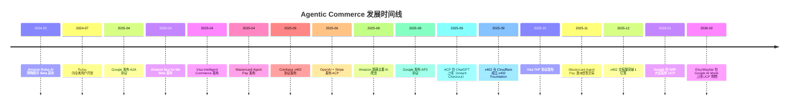

### 关键里程碑

| 时间 | 事件 | 意义 |
|------|------|------|
| 2024-02 | Amazon Rufus Beta | 大型平台首次将 AI Agent 引入购物场景 |
| 2025-04 | A2A / Buy for Me / Visa IC / MC Agent Pay | "Agentic Commerce 月"——四大玩家同月入场 |
| 2025-05 | x402 发布 | 区块链阵营提出 HTTP 原生支付方案 |
| 2025-06 | ACP 发布 | OpenAI+Stripe 定义结账编排标准 |
| 2025-09 | AP2 发布 + ChatGPT Instant Checkout 上线 | 信任层标准确立 + 首个大规模 Agent 购物体验落地 |
| 2025-10 | Visa TAP 发布 | 卡网络巨头推出 Agent 身份验证协议 |
| 2026-01 | UCP 发布 | Google 尝试统一全旅程商务标准 |

---

## 4. 核心概念与术语 (Key Concepts & Glossary)

| 术语 | 定义 |
|------|------|
| **Agentic Commerce** | AI Agent 代替人类自主发现、比较、购买商品的商务范式 |
| **A2B (Agent-to-Business)** | Agent 与商户之间的交易模式 |
| **M2M (Machine-to-Machine)** | 机器与机器之间的自动化交易模式 |
| **Mandate** | AP2 中通过 W3C Verifiable Credentials 实现的加密签名数字合约，证明用户授权意图 |
| **SharedPaymentToken (SPT)** | ACP 中 Stripe 设计的委托支付令牌——商户限定、金额限定、时间限定、一次性使用 |
| **Agentic Token** | Mastercard 为 Agent 设计的专用支付令牌，封装卡号映射 + Agent ID 绑定 + 用户规则 |
| **TAP 三层签名** | Visa TAP 的 Agent 识别签名 + 消费者识别签名 + 支付容器签名，通过 nonce 关联 |
| **x402 Payment Required** | HTTP 协议中沉睡 30 年的状态码，被 Coinbase 激活用于原生支付 |
| **UCP Capability** | UCP 中商户暴露的标准化功能单元（如 Checkout、Order Management） |
| **Discovery Manifest** | UCP 商户发布在 `/.well-known/ucp` 的 JSON 文档，声明支持的能力和端点 |
| **Payment Passkey** | Mastercard 与 FIDO Alliance 合作的生物识别支付确认机制 |
| **Merchant of Record (MoR)** | 交易中承担法律和财务责任的商户实体 |
| **Human-Present / Human-Not-Present** | AP2 的两种交易模式：实时购买 vs 委托任务 |
| **Decision Intelligence** | Mastercard AI 驱动的实时欺诈检测系统 |
| **Embedded Checkout** | 结账 UI 嵌入在 Agent 界面内，用户无需跳转到商户网站 |

---

## 5. 七大方案深度解读

本章逐一介绍 Agentic Commerce 生态中的七大方案，每个方案包含核心架构、关键技术和差异化定位。详细技术分析请参阅各子报告。

### 5.1 Google UCP — 全旅程商务标准

> 详细报告：[Google UCP 研究报告](1.google_ucp/google_ucp_research.md)

**一句话定位**：为 AI Agent 与商务系统之间建立通用语言，覆盖从商品发现到售后的完整购物旅程。

**核心架构**：

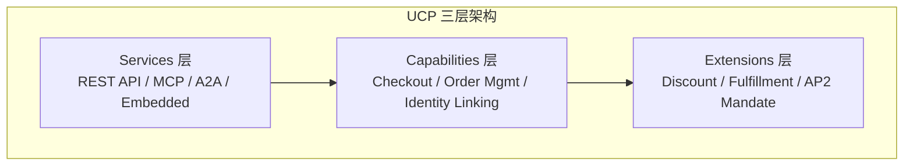

**关键技术特征**：

| 维度 | 说明 |
|------|------|
| 发布方 | Google（联合 Shopify、Etsy、Wayfair、Target、Walmart 开发） |
| 发布时间 | 2026 年 1 月 11 日（NRF 大会） |
| 核心解决问题 | N×N 集成复杂度 → 1×N 标准化接入 |
| 传输协议 | REST API、MCP、A2A、Embedded Protocol 四种绑定 |
| 发现机制 | `/.well-known/ucp` Discovery Manifest |
| 支付集成 | 通过 AP2 Mandate Extension 实现支付信任 |
| 商户控制 | 商户始终保留 Merchant of Record 身份 |
| 开放性 | 开源（Apache 2.0） |
| 合作伙伴 | 20+ 全球合作伙伴（Visa、Mastercard、Stripe、Adyen 等） |

**为什么重要**：UCP 是目前唯一尝试覆盖完整商务旅程（发现→结账→售后）的开放标准。如果成功，它将成为 Agentic Commerce 的"HTTP"——所有 Agent 和商户的通用接口层。但其成功高度依赖 Google 生态的推动力和商户的采纳意愿。

**UCP 与 A2A 的结合机制**：

UCP 并非独立运作，而是 Google 协议族（A2A + UCP + AP2）的中间层。三者的分工是：A2A 是管道（Agent 怎么对话），UCP 是语义（对话内容是什么），AP2 是安全锁（谁授权花钱）。

```
Google 协议族分层架构

┌─────────────────────────────────────────────────┐
│  UCP — 商务语义层                                 │
│  定义结账、订单、身份关联等业务操作的标准化语义       │
│  Capabilities: Checkout / Order Mgmt / Identity   │
├─────────────────────────────────────────────────┤
│  AP2 — 信任与授权层                               │
│  通过 Mandate + VC 提供加密授权证明                │
│  在 UCP 中作为 AP2 Mandate Extension 集成          │
├─────────────────────────────────────────────────┤
│  A2A — Agent 间通信层                             │
│  定义 Agent 如何发现彼此、交换消息、协作完成任务     │
│  UCP Capabilities 作为 A2A Extension 被调用        │
└─────────────────────────────────────────────────┘
```

A2A 与 UCP 的结合体现在两个层面：

1. **A2A 是 UCP 四种传输协议之一**：UCP Services 层支持 REST API、MCP、A2A、Embedded Protocol 四种通信绑定。当使用 A2A 绑定时，商户在 `/.well-known/agent-card.json` 发布 Agent Card，AI Agent 通过 A2A 协议与商户 Agent 直接通信，UCP 的 Capabilities 作为 A2A Extension 被调用。

2. **A2A 是 Agent-to-Agent 场景的通信基础**：在 Agent 间协商场景中（如用户的个人 Agent 与商户 Agent 谈判折扣），A2A 提供消息传递管道，UCP 定义消息中承载的商务语义（商品信息、价格、配送选项等）。

**实际交易流程示例**：

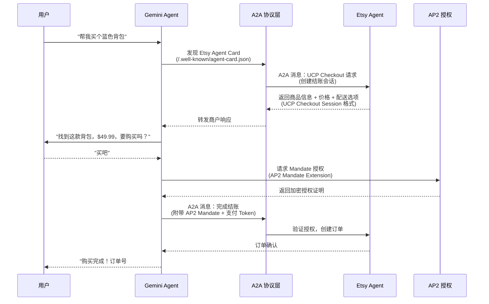

**UCP 与 AP2 的协作机制：Identity Linking vs AP2 Mandate**

UCP 已经有了 Identity Linking（身份关联）机制，为什么还需要 AP2 Mandate？这两者解决的是完全不同层面的信任问题：

| 维度 | Identity Linking（身份关联） | AP2 Mandate（支付授权证明） |
|------|---------------------------|--------------------------|
| 核心问题 | "这个 Agent 有权访问用户在商户的账户吗？" | "用户真的授权了这笔具体的交易吗？" |
| 技术基础 | OAuth 2.0 Authorization Code（RFC 6749） | W3C Verifiable Credential + 加密签名 |
| 信任类型 | 身份信任——证明 Agent 代表用户 | 交易信任——证明用户授权了具体金额和商品 |
| 作用范围 | 持续性（Token 有效期内可反复使用） | 一次性（每笔交易独立签署） |
| 类比 | 酒店房卡——证明你是住客，可以进出房间 | 签字支票——授权一笔具体金额的支付 |

两者的协作关系可以用一个比喻理解：Identity Linking 是"门禁卡"（你有权进入这个商户的会员系统），AP2 Mandate 是"签字授权书"（你授权花这笔钱买这个东西）。前者解决"你是谁"，后者解决"你同意花多少钱"。

**HP 模式（Human-Present）与 HNP 模式（Human-Not-Present）的关键区别**：

```mermaid
graph TB
    subgraph HP["HP 模式：用户实时参与"]
        HP1["用户对 Agent 说：帮我买双白色跑鞋"]
        HP2["Agent 通过 UCP 搜索商品、构建购物车"]
        HP3["Google UI 弹出：确认购买 Nike Air Max $129.99？"]
        HP4["用户在 Google UI 中确认支付"]
        HP5["AP2 生成 Cart Mandate（用户实时签署）"]
        HP1 --> HP2 --> HP3 --> HP4 --> HP5
    end
    
    subgraph HNP["HNP 模式：Agent 自主执行"]
        HNP1["用户预先签署 Intent Mandate：<br/>演唱会开票时自动买两张，每张不超$200"]
        HNP2["Agent 持续监控票务网站"]
        HNP3["开票！Agent 自动通过 UCP 创建结账会话"]
        HNP4["Agent 用 Intent Mandate 自动生成 Cart Mandate"]
        HNP5["无需用户确认，直接完成支付"]
        HNP1 --> HNP2 --> HNP3 --> HNP4 --> HNP5
    end
```

- 在 HP 模式下，用户实时在场确认，Identity Linking 已经提供了身份验证。但 AP2 Mandate 仍然有价值——它为每笔交易生成加密审计链（Intent→Cart→Payment 三级 Mandate），即使出现争议也有不可篡改的证据。
- 在 HNP 模式下，AP2 Mandate 是不可或缺的。用户不在场，没有人点"确认购买"按钮。Agent 必须持有用户预先签署的 Intent Mandate（含金额上限、商户白名单、时间窗口等约束），才能自主完成交易。Identity Linking 只能证明 Agent 有权访问账户，但无法证明用户授权了这笔具体的购买。

**UCP 中 AP2 Mandate Extension 的工作机制**：

AP2 Mandate 在 UCP 中以 Extension（`dev.ucp.shopping.ap2_mandate`）的形式集成。当商户和平台在能力协商阶段都声明支持 AP2 Mandate Extension 时，结账流程会增加加密授权步骤：

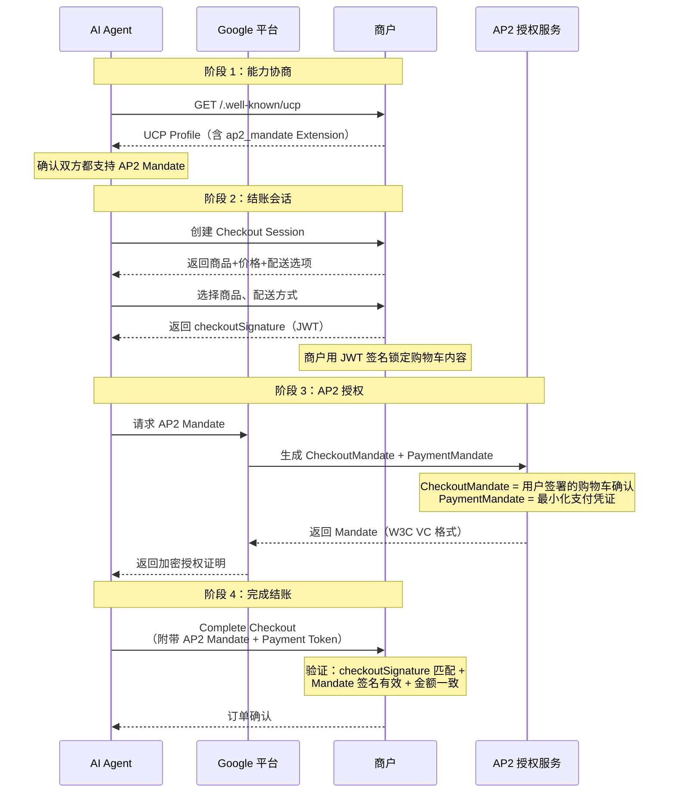

关键技术细节：一旦结账会话协商了 AP2 Mandate Extension，该会话就被"安全锁定"——不能回退到标准结账流程。这确保了支持 AP2 的交易始终具有完整的加密授权链，防止降级攻击。

> 详细技术分析参见：[Google UCP 研究报告 - Identity Linking 深度解析](1.google_ucp/google_ucp_research.md) 和 [Google AP2 研究报告 - Mandate 机制](4.google_ap2/google_ap2_research.md)

**Intent Mandate 的签署时机与执行方式**

Mandate 签署是 AP2 安全模型的核心操作。签署的时机和方式因 HP/HNP 模式而异：

```
签署时机对比

HP 模式（用户在场）                    HNP 模式（用户不在场）
┌──────────────────────┐              ┌──────────────────────┐
│ 用户："帮我找白色跑鞋"  │              │ 用户："演唱会开票时     │
│                      │              │  自动买两张，≤$200/张" │
│  ↓ 立即生成+签署       │              │                      │
│  Intent Mandate      │              │  ↓ 立即生成+签署       │
│  （设备密钥，轻量确认） │              │  Intent Mandate      │
│                      │              │  （硬件密钥+设备证明）  │
│  ↓ Agent 搜索商品     │              │                      │
│  ↓ 用户审核购物车      │              │  ↓ 用户离开           │
│  ↓ 用户签署Cart Mandate│             │  ↓ Agent 自主监控     │
│  （硬件密钥+设备证明）  │              │  ↓ 条件满足，自动签署  │
│                      │              │    Cart Mandate       │
│  ↓ 完成支付           │              │  ↓ 自动完成支付       │
└──────────────────────┘              └──────────────────────┘
```

签署操作的技术本质：

| 维度 | 说明 |
|------|------|
| 凭证格式 | W3C Verifiable Credential（JSON-LD） |
| 签名算法 | ECDSA 椭圆曲线签名（`EcdsaSecp256k1Signature2019`） |
| 私钥存储 | 设备安全芯片（类似 Apple Secure Enclave / Android StrongBox） |
| 防重放 | 每次签署附带唯一 Nonce + 时间戳 |
| 设备证明 | Device Attestation——证明签名来自真实物理设备，非远程伪造 |
| 签署界面 | 必须在 Google 可信界面（Trusted UI）中完成，Agent 无法伪造 |

HNP 模式下 Intent Mandate 的签署流程：

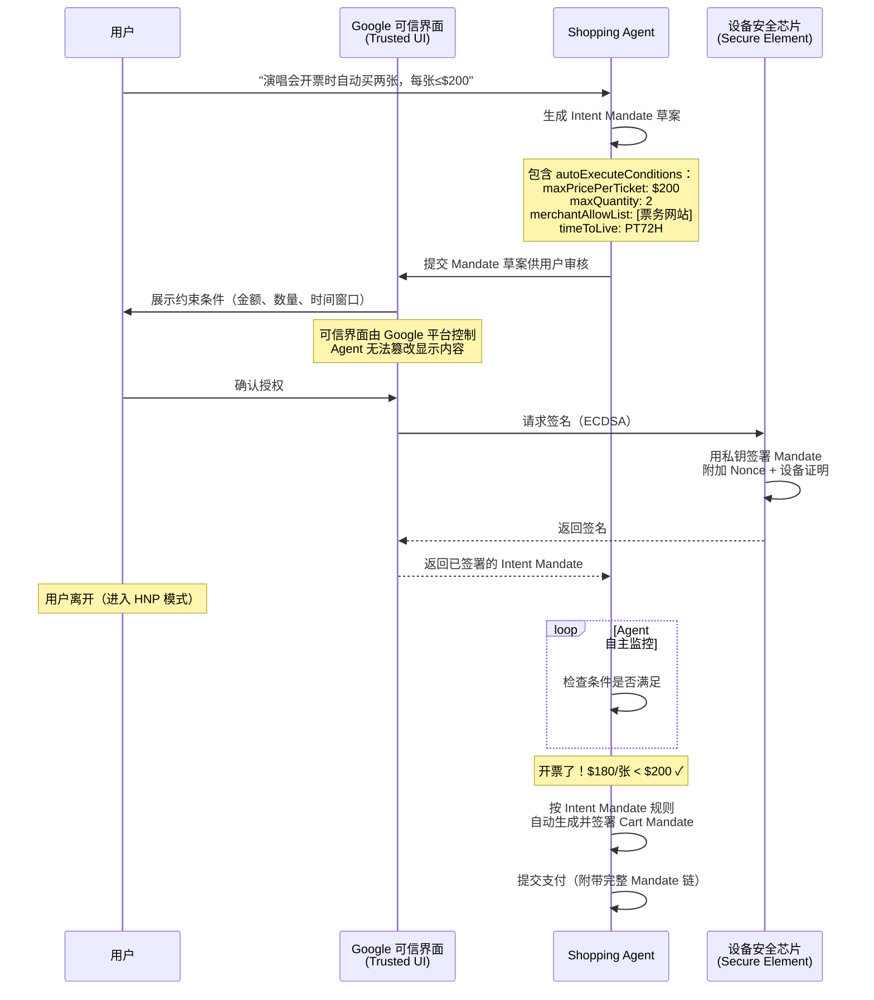

关键安全设计：签署必须在 Google 可信界面（Trusted UI）中完成，而非 Agent 自己的界面。这防止了恶意 Agent 伪造签署界面、欺骗用户签署不符合预期的 Mandate。可信界面由平台（Google）控制，Agent 只能提交 Mandate 草案，无法干预用户看到的内容和签署过程。

> 详细技术分析参见：[Google AP2 研究报告 - HP/HNP 交易流程](4.google_ap2/google_ap2_research.md)

---

### 5.2 OpenAI + Stripe ACP — 结账流程编排

> 详细报告：[OpenAI + Stripe ACP 研究报告](2.openai_strip_acp/openai_stripe_acp_research.md)

**一句话定位**：让 AI Agent 在对话中无缝完成购物——从商品发现到结账支付，全程不离开 Agent 界面。

**核心架构**：

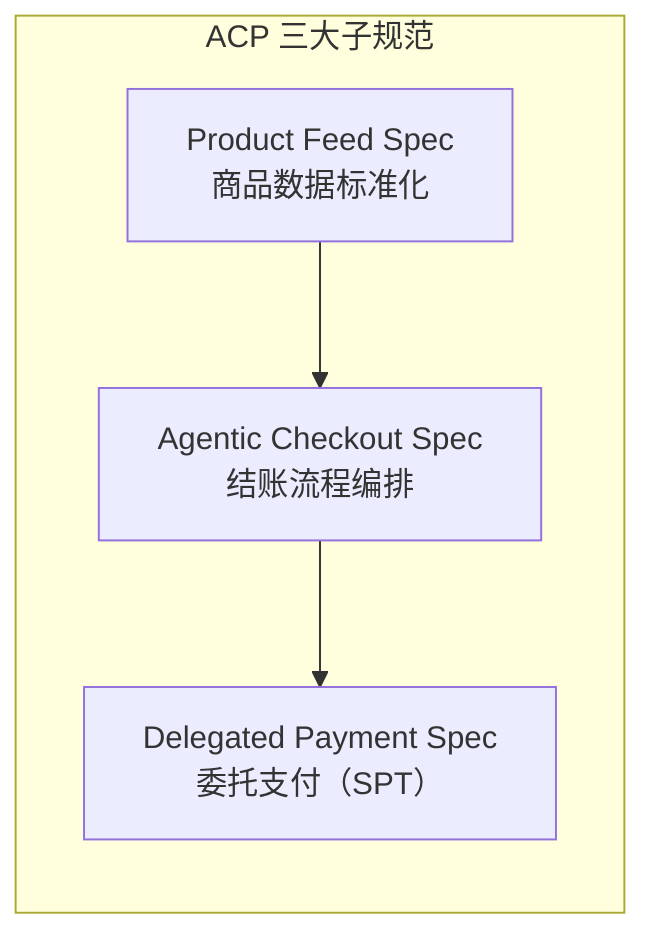

**关键技术特征**：

| 维度 | 说明 |
|------|------|
| 发布方 | OpenAI + Stripe |
| 发布时间 | 2025 年 6 月 |
| 核心解决问题 | Agent 如何与商户完成标准化结账流程 |
| 核心支付原语 | SharedPaymentToken (SPT)——商户限定、金额限定、一次性使用 |
| 结账体验 | 嵌入式结账（UI 渲染在 Agent 界面内） |
| 落地产品 | ChatGPT Instant Checkout（2025-09 上线） |
| 首批商户 | Etsy、Shopify（100 万+商户）、Glossier、SKIMS 等 |
| 开放性 | 开源（Apache 2.0） |

**为什么重要**：ACP 是全球首个大规模落地的 AI Agent 购物协议。ChatGPT Instant Checkout 的上线证明了 Agent 商务不是概念验证，而是已经在运行的商业现实。ACP 的 SPT 机制巧妙地解决了"Agent 不应持有信用卡"的安全问题。

---

### 5.3 Amazon Buy for Me — 垂直整合 Agent 购物

> 详细报告：[Amazon Buy for Me 研究报告](3.amazon_payforme/amazon_buyforme_research.md)

**一句话定位**：在 Amazon App 内由 AI Agent 代替用户在第三方品牌网站完成购买，消除购物"死胡同"。

**核心架构**：

```
Amazon Buy for Me 架构
┌──────────────────────────────────────────┐
│  Amazon Shopping App                      │
│  ┌────────────────────────────────────┐  │
│  │  Rufus AI 购物助手                   │  │
│  │  (Amazon Nova + Anthropic Claude)   │  │
│  └──────────┬─────────────────────────┘  │
│             │                             │
│  ┌──────────▼─────────────────────────┐  │
│  │  Amazon Bedrock Agent 基础设施       │  │
│  │  自动导航 → 填写信息 → 完成结账      │  │
│  └──────────┬─────────────────────────┘  │
│             │                             │
│  ┌──────────▼─────────────────────────┐  │
│  │  加密用户数据（支付+配送信息）        │  │
│  └────────────────────────────────────┘  │
└──────────────────┬───────────────────────┘
                   │ 自动导航
                   ▼
          第三方品牌网站（未经同意）
```

**关键技术特征**：

| 维度 | 说明 |
|------|------|
| 发布方 | Amazon |
| 发布时间 | 2025 年 4 月 |
| 核心解决问题 | Amazon 没有的商品，用户也能在 App 内购买 |
| AI 引擎 | Amazon Nova + Anthropic Claude（Amazon Bedrock） |
| 商户关系 | Opt-out 模式（品牌被自动纳入，需主动退出） |
| 商品覆盖 | 50 万+ 商品（从 6.5 万快速扩展） |
| 核心争议 | 28% 退单率、AI 生成不准确信息、未经同意抓取 |
| 开放性 | 完全封闭（屏蔽外部 AI Agent） |

**为什么重要**：Buy for Me 代表了 Agentic Commerce 的"围墙花园"路径——与 Google/OpenAI 的开放协议形成鲜明对比。它展示了 Agent 商务的巨大商业潜力（Rufus 2025 年创造 120 亿美元增量销售），但也暴露了未经同意的 Agent 代购引发的严重商户反弹和法律风险。Forbes 总结："Google builds open protocol rails, Amazon builds walled garden"。

---

### 5.4 Google AP2 — 支付信任与授权

> 详细报告：[Google AP2 研究报告](4.google_ap2/google_ap2_research.md)

**一句话定位**：为 Agent 发起的支付建立信任基础设施——通过加密签名的 Mandate 机制，为每笔交易提供不可否认的用户意图证明。

**核心架构**：

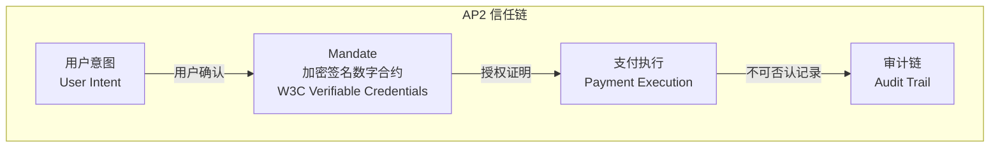

**关键技术特征**：

| 维度 | 说明 |
|------|------|
| 发布方 | Google |
| 发布时间 | 2025 年 9 月 |
| 核心解决问题 | Agent 花钱时如何证明是用户的真实意愿（3A 问题） |
| 核心机制 | Mandate（W3C Verifiable Credentials 加密签名数字合约） |
| 交易模式 | Human-Present（实时购买）+ Human-Not-Present（委托任务） |
| 支付方式 | 支付方式无关（信用卡、稳定币、银行转账均可） |
| 协议基础 | A2A + MCP 的开放扩展 |
| 合作伙伴 | 60+（Mastercard、AmEx、PayPal、Coinbase、Salesforce 等） |

**为什么重要**：AP2 解决的是 Agentic Commerce 最根本的信任问题——Authorization（授权证明）、Authenticity（意图真实性）、Accountability（责任归属）。没有信任层，任何结账协议都无法安全运行。AP2 的 Mandate 机制为整个生态提供了"数字公证"能力。

---

### 5.5 Coinbase x402 — HTTP 原生链上结算

> 详细报告：[Coinbase x402 研究报告](5.conibase_x402/coinbase_x402_research.md)

**一句话定位**：激活 HTTP 协议中沉睡 30 年的 `402 Payment Required` 状态码，实现互联网原生的即时加密货币支付。

**核心架构**：

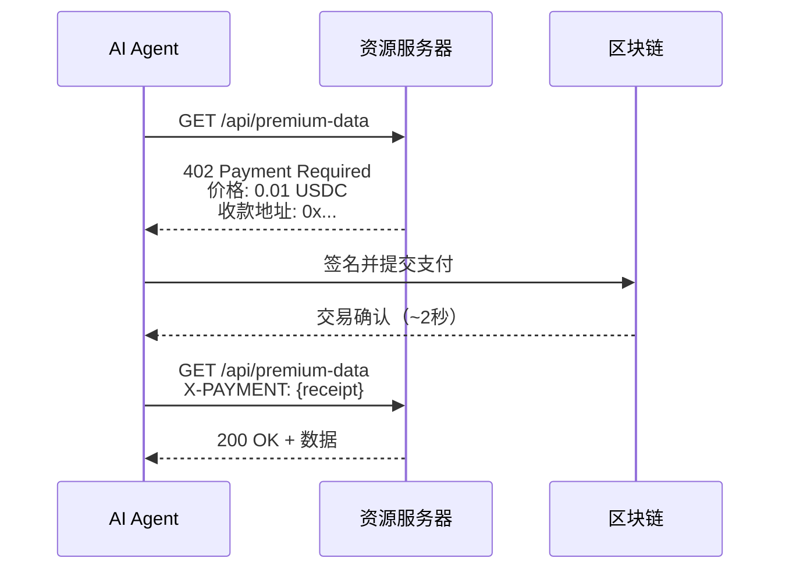

**关键技术特征**：

| 维度 | 说明 |
|------|------|
| 发布方 | Coinbase |
| 发布时间 | 2025 年 5 月 |
| 核心解决问题 | 机器需要为资源付费时，如何在一次 HTTP 请求中完成 |
| 协议基础 | HTTP 402 状态码 |
| 结算方式 | 链上即时结算（USDC 稳定币，~2 秒） |
| 协议费用 | 零（仅链上 Gas 费） |
| 支持链 | Base、Solana、Polygon 等多链 |
| 交易规模 | 1 亿+ 笔交易，年化 6 亿+ 美元 |
| 合作伙伴 | Cloudflare（联合成立 x402 Foundation） |

**为什么重要**：x402 代表了 Agentic Commerce 的"加密原生"路径。它不依赖传统卡网络或 PSP，而是将支付直接嵌入 HTTP 协议层。对于 API 经济和 Agent 间微支付场景（如 Agent 付费调用另一个 Agent 的 API），x402 提供了最低摩擦的解决方案。零协议费用 + 即时结算的特性使其在微支付场景中具有独特优势。

---

### 5.6 Visa TAP — 卡网络原生 Agent 信任

> 详细报告：[Visa TAP 研究报告](6.visa_tap/visa_tap_research.md)

**一句话定位**：在现有卡网络基础设施上叠加 Agent 能力层，让商户通过验证 HTTP 头中的加密签名即可识别合法 Agent。

**核心架构**：

```
Visa TAP 三层签名信任模型
┌─────────────────────────────────────────────┐
│  第一层：Agent 识别签名                        │
│  Agent Platform → 签名 Agent 身份              │
│  "这个请求来自已注册的合法 Agent"               │
├─────────────────────────────────────────────┤
│  第二层：消费者识别签名                         │
│  Consumer Identity Provider → 签名消费者身份    │
│  "这个 Agent 背后的消费者是经过验证的真实用户"    │
├─────────────────────────────────────────────┤
│  第三层：支付容器签名                           │
│  Payment Container → 签名支付凭证              │
│  "这笔支付使用的是经过授权的 Visa Token"         │
├─────────────────────────────────────────────┤
│  三层通过 nonce 关联，形成完整信任链              │
└─────────────────────────────────────────────┘
```

**关键技术特征**：

| 维度 | 说明 |
|------|------|
| 发布方 | Visa |
| 发布时间 | Intelligent Commerce 2025-04 / TAP 2025-10 |
| 核心解决问题 | 商户如何区分合法 Agent 和恶意 Bot |
| 核心机制 | RFC 9421 HTTP Message Signatures 三层签名 |
| 用户确认 | FIDO2/Passkey 生物识别 |
| 集成方式 | 低代码/零代码（复用现有 Web 基础设施） |
| 全球覆盖 | 200+ 国家/地区、1.75 亿+ 商户接受点 |
| 合作伙伴 | Cloudflare（联合开发 Web Bot Auth 标准） |

**为什么重要**：Visa TAP 的独特价值在于"不重新发明支付流程"。它不要求商户构建新的 API 或集成新的支付系统，而是在现有 HTTP 请求中添加加密签名头。这意味着 1.75 亿+ 现有 Visa 商户可以以最低成本支持 Agent 交易。与 Cloudflare 的合作使 TAP 能够在 CDN/站点保护层直接部署，进一步降低集成门槛。

---

### 5.7 Mastercard Agent Pay — Agent 注册 + Agentic Token

> 详细报告：[Mastercard Agent Pay 研究报告](7.mastercard_agent_pay/mastercard_agent_pay_research.md)

**一句话定位**：将 AI Agent 作为"可识别、可治理的参与者"嵌入到现有卡网络信任体系中——Agent 必须先注册、再验证、才能交易。

**核心架构**：

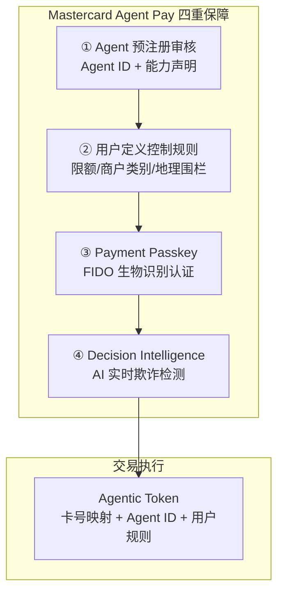

**关键技术特征**：

| 维度 | 说明 |
|------|------|
| 发布方 | Mastercard |
| 发布时间 | 2025 年 4 月 |
| 核心解决问题 | 未验证 Agent 执行欺诈购买 + 模糊交易意图引发争议 |
| 核心机制 | Agent 预注册 + Agentic Token + Payment Passkey + Decision Intelligence |
| 用户控制 | 单笔限额、月度总额、商户类别、地理围栏等精细规则 |
| 向后兼容 | 现有接受 Mastercard Token 的商户可直接支持 |
| 落地市场 | 美国、澳洲（首笔交易 2025-11）、拉美 |
| 合作伙伴 | Microsoft、Samsung、Mastercard 发卡行网络 |

**为什么重要**：Mastercard Agent Pay 代表了"中心化注册 + 代币化"的信任路径——与 Visa TAP 的"HTTP 签名验证"和 AP2 的"去中心化 Mandate"形成三种不同的信任哲学。其核心优势是向后兼容性：商户看到的仍然是一笔 Mastercard Token 交易，只是附带了额外的 Agent 身份信息。这大幅降低了商户的采纳门槛。

---

## 6. 协议对比分析

> 本章将七大方案放在同一坐标系下进行多维度对比，帮助读者快速理解各方案的定位差异与适用场景。

### 6.1 全景对比矩阵

| 维度 | Google UCP | OpenAI+Stripe ACP | Amazon Buy for Me | Google AP2 | Coinbase x402 | Visa TAP | Mastercard Agent Pay |
|------|-----------|-------------------|-------------------|-----------|---------------|---------|---------------------|
| **信任模型** | 协议层中立（依赖底层协议） | Stripe 中心化 SPT | 平台封闭（Amazon 内部） | 去中心化 W3C VC 签名 | 钱包私钥签名 | RFC 9421 HTTP 三层签名 | 中心化注册 + Agentic Token |
| **支付方式** | 任意（通过扩展） | 传统卡/银行 via Stripe | Amazon 账户余额/绑卡 | 任意（Mandate 抽象） | 链上 USDC 稳定币 | Visa Token（现有卡网络） | Mastercard Token（现有卡网络） |
| **商户接入成本** | 中（需实现 UCP 端点） | 低（Stripe SDK 集成） | 零（Amazon 代理购买） | 中-高（VC 签发 + Mandate 解析） | 低（HTTP 402 中间件） | 极低（HTTP 头验证） | 极低（现有 Token 通道） |
| **开放性** | 开放协议（Apache 2.0） | 半开放（Stripe 主导） | 封闭（Amazon 专有） | 开放协议（W3C 标准） | 开放协议（MIT） | 半开放（Visa 主导） | 封闭（Mastercard 专有） |
| **生产就绪度** | 早期（Etsy/Wayfair 试点） | 已上线（ChatGPT Checkout） | 已上线（50 万+ SKU） | 早期（60+ 合作伙伴签约） | 已上线（1 亿+ 笔交易） | 早期（首批交易 2025-12） | 已上线（美国/澳洲/拉美） |
| **授权机制** | 依赖底层协议 | SPT 四重约束 | 用户点击确认 | Mandate 三层机制 | 钱包签名 | Passkey + 三层签名 | Payment Passkey + 规则引擎 |
| **HNP 支持** | 通过 A2A 扩展 | 无原生支持 | 不适用 | HP/HNP 双模式原生支持 | 原生支持（无需人参与） | 通过 Browsing IOU | 无原生支持 |
| **审计能力** | 依赖底层协议 | Stripe Dashboard | Amazon 订单系统 | VC 可验证凭证链 | 链上全透明 | 签名日志可追溯 | Decision Intelligence 日志 |
| **结算速度** | 依赖底层协议 | T+2（传统卡网络） | 即时（Amazon 内部） | 依赖底层支付 | ~2 秒（链上即时） | T+2（Visa 网络） | T+2（Mastercard 网络） |
| **微支付适用性** | 通过 x402 扩展 | 差（卡网络最低费用） | 不适用 | 通过 x402 扩展 | 优秀（零协议费） | 差（卡网络最低费用） | 差（卡网络最低费用） |

### 6.2 技术架构分层对比

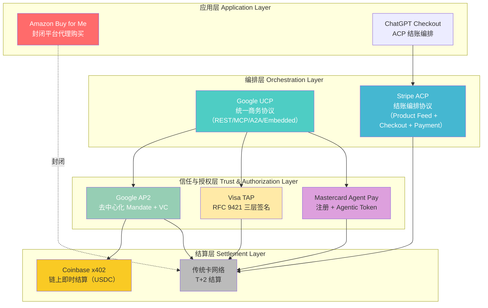

### 6.3 信任模型光谱

七大方案的信任模型可以沿"去中心化 ↔ 中心化"光谱排列：

```
去中心化                                                          中心化
◄─────────────────────────────────────────────────────────────────────►
  x402          AP2           Visa TAP        ACP          MC Agent Pay    Buy for Me
  (钱包签名)    (W3C VC)      (RFC 9421)     (Stripe SPT)  (注册+Token)   (平台封闭)
  
  无需注册      自主签发       平台签发        平台签发       预注册审核      完全托管
  链上验证      任何人可验证    商户验证签名    Stripe 验证    MC 网络验证     Amazon 内部
```

### 6.4 生产就绪度评估

| 方案 | 阶段 | 关键里程碑 | 预计大规模可用 |
|------|------|-----------|--------------|
| Amazon Buy for Me | ✅ 已上线 | 50 万+ SKU，28% 退单率 | 已可用（仅 Amazon 生态） |
| Coinbase x402 | ✅ 已上线 | 1 亿+ 笔交易，V2 发布 2025-12 | 已可用（加密生态） |
| OpenAI+Stripe ACP | ✅ 已上线 | ChatGPT Checkout 2025-09，100 万+ Shopify 商户 | 2026 H1（广泛商户） |
| Mastercard Agent Pay | ✅ 已上线 | 澳洲首笔交易 2025-11，美国/拉美已上线 | 2026 H1（全球扩展） |
| Visa TAP | 🔶 早期 | 首批安全 AI 交易 2025-12，Cloudflare 合作 | 2026 H2 |
| Google AP2 | 🔶 早期 | 60+ 合作伙伴签约，PayPal 详细集成计划 | 2026 H2 |
| Google UCP | 🔶 早期 | 2026-01 NRF 发布，Etsy/Wayfair 试点 | 2027+ |


---

## 7. 互补关系与生态格局

> 七大方案并非简单的竞争关系——它们在不同层次解决不同问题，存在显著的互补性。本章分析协议间的协作模式与生态格局。

### 7.1 协议互补架构

Agentic Commerce 的完整交易流程可以分解为四个层次，不同协议在不同层次发挥作用：

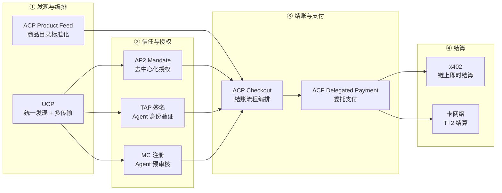

### 7.2 三大互补组合

**组合一：ACP（结账编排）+ AP2（信任授权）+ x402（链上结算）**

这是目前最被看好的"全栈开放"组合：
- ACP 提供标准化的商品发现和结账流程
- AP2 的 Mandate 机制提供去中心化的用户授权
- x402 处理链上即时结算（特别适合微支付和 Agent-to-Agent 场景）
- AP2 已原生支持 x402 扩展，PayPal 的集成计划中明确包含 x402 结算路径

**组合二：UCP（统一层）+ AP2（信任层）+ 卡网络（结算层）**

Google 主推的"统一协议"路径：
- UCP 作为最上层的统一发现和编排协议
- AP2 的 Mandate Extension 已集成到 UCP 中
- 底层结算通过 Visa/Mastercard 现有卡网络完成
- 适合传统电商场景，商户迁移成本最低

**组合三：卡网络原生（TAP/MC Agent Pay）+ ACP（结账编排）**

传统金融机构的渐进路径：
- Visa TAP 或 Mastercard Agent Pay 提供 Agent 身份验证和支付授权
- ACP 提供标准化的结账流程
- 完全复用现有卡网络基础设施
- 适合风险厌恶型商户和受监管行业

### 7.3 跨生态参与者

多个关键参与者同时参与多个协议生态，形成了复杂的交叉网络：

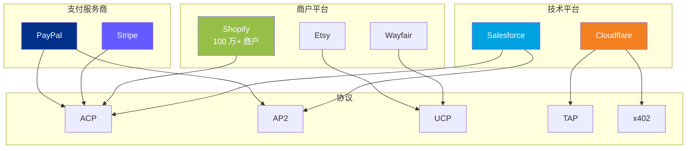

**关键观察**：
- **PayPal** 同时参与 ACP 和 AP2，是最积极的"双栖"参与者，其 5 大集成方向覆盖了结账、授权、钱包等全链路
- **Salesforce** 同时加入 ACP 和 AP2 生态，反映了企业级客户对多协议兼容的需求
- **Cloudflare** 同时与 Visa（TAP Web Bot Auth）和 Coinbase（x402 Foundation）合作，在基础设施层连接了传统金融和加密两个世界
- **Shopify** 的 100 万+ 商户是 ACP 最大的商户基础，但 UCP 的开放性可能吸引其未来参与

### 7.4 开放 vs 封闭之争

| 阵营 | 代表方案 | 核心主张 | 优势 | 风险 |
|------|---------|---------|------|------|
| **完全开放** | AP2、x402、UCP | 协议应像 HTTP 一样开放，任何人可实现 | 创新速度快、无锁定 | 碎片化、安全标准不一 |
| **平台主导开放** | ACP、TAP | 由行业领导者定义标准，开放接入 | 快速落地、质量可控 | 平台依赖、费用不透明 |
| **完全封闭** | Buy for Me | 平台端到端控制，用户无需关心细节 | 体验最优、即时可用 | 生态锁定、商户无选择权 |

Amazon Buy for Me 的争议尤其值得关注：它在屏蔽外部 AI 爬虫（robots.txt）的同时，自己的 Agent 却可以自由访问第三方商户网站，这种"双标"行为引发了 Bobo Design Studio 等小商户的强烈反弹，甚至有 IP 律师介入。这场争议的走向可能影响整个 Agentic Commerce 的开放性方向。

---

## 8. 安全模型深度对比

> 安全与信任是 Agentic Commerce 的核心挑战。当 AI Agent 代替人类执行交易时，"谁在请求？""谁授权的？""出了问题谁负责？"这三个问题必须有明确答案。本章深入对比各方案的安全模型。

### 8.1 五种信任哲学

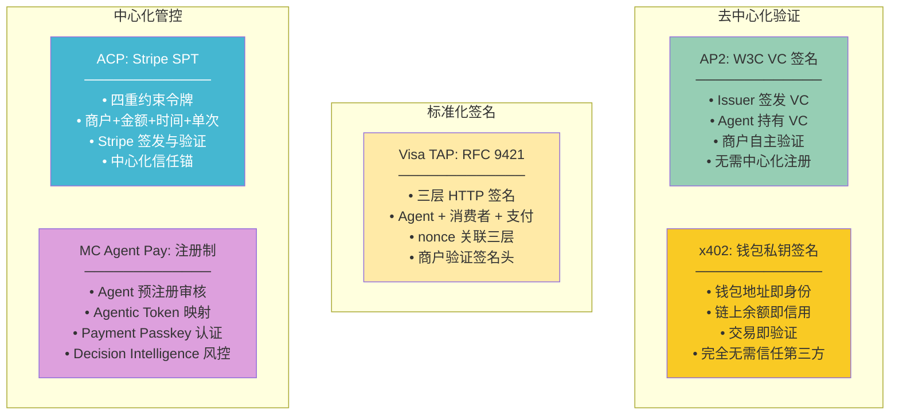

### 8.2 安全机制详细对比

| 安全维度 | AP2 | Visa TAP | MC Agent Pay | ACP | x402 | Buy for Me |
|---------|-----|---------|-------------|-----|------|-----------|
| **Agent 身份验证** | VC 持有者证明 | RFC 9421 Agent 签名 | 预注册 Agent ID | Stripe 平台认证 | 钱包地址 | Amazon 内部 |
| **用户授权方式** | Mandate（Intent→Cart→Payment） | FIDO2/Passkey | Payment Passkey + 规则引擎 | SPT 令牌约束 | 钱包签名 | 点击确认 |
| **授权粒度** | 极细（五种角色分离） | 中（三层签名） | 细（限额/类别/地理围栏） | 细（商户+金额+时间+单次） | 粗（钱包余额） | 粗（单次确认） |
| **欺诈检测** | 依赖 Verifier 实现 | Visa 风控系统 | Decision Intelligence AI | Stripe Radar | 链上透明 | Amazon 风控 |
| **争议处理** | VC 审计链 | Visa 争议流程 | Mastercard 争议流程 | Stripe 争议流程 | 链上不可逆 | Amazon A-to-Z |
| **可撤销性** | Mandate 可随时撤销 | 签名可吊销 | Token 可冻结 | SPT 可过期/撤销 | 链上不可逆 | 订单可取消 |
| **隐私保护** | 选择性披露（ZKP 路线图） | 最小化数据共享 | Token 化隐藏卡号 | Stripe 数据隔离 | 链上公开（伪匿名） | Amazon 数据孤岛 |
| **合规适配** | W3C 标准，全球适用 | PCI DSS 合规 | PCI DSS 合规 | PCI DSS 合规 | 加密监管不确定 | 平台自治 |

### 8.3 攻击面分析

| 攻击向量 | 最脆弱方案 | 最强防御方案 | 说明 |
|---------|----------|-----------|------|
| Agent 身份伪造 | x402（钱包可创建） | MC Agent Pay（预注册审核） | 中心化注册提供最强身份保障，但牺牲了开放性 |
| 授权越权 | Buy for Me（粗粒度） | AP2（五种角色 + Mandate） | AP2 的角色分离模型提供最精细的权限控制 |
| 中间人攻击 | 无标准签名的方案 | Visa TAP（RFC 9421） | HTTP 签名标准提供传输层完整性保护 |
| 重放攻击 | 无 nonce 的方案 | Visa TAP（nonce 关联三层） | 三层 nonce 关联有效防止签名重放 |
| 资金盗取 | x402（链上不可逆） | ACP（SPT 四重约束） | SPT 的商户+金额+时间+单次约束最大限度限制损失 |
| 隐私泄露 | x402（链上公开） | AP2（选择性披露路线图） | 链上透明性与隐私保护存在根本张力 |

### 8.4 用户控制力对比

用户对 Agent 交易行为的控制力是安全模型的核心维度：

```
用户控制力从弱到强：

Buy for Me ──► x402 ──► ACP ──► Visa TAP ──► MC Agent Pay ──► AP2
  │              │         │         │              │              │
  单次确认      钱包余额   SPT约束   Passkey+签名   规则引擎       Mandate三层
  无精细控制    无限额     四重约束   三层验证       限额/类别/围栏  Intent→Cart→Payment
                                                                  五种角色分离
```

AP2 的 Mandate 机制提供了最强的用户控制力：用户可以在 Intent（意图）、Cart（购物车）、Payment（支付）三个阶段分别设置约束，并通过五种角色分离（User、Agent、Merchant、Issuer、Verifier）实现最小权限原则。


---

## 9. 商户接入指南

> 面对七种方案，商户应该如何选择？本章提供基于场景的决策框架。

### 9.1 决策树

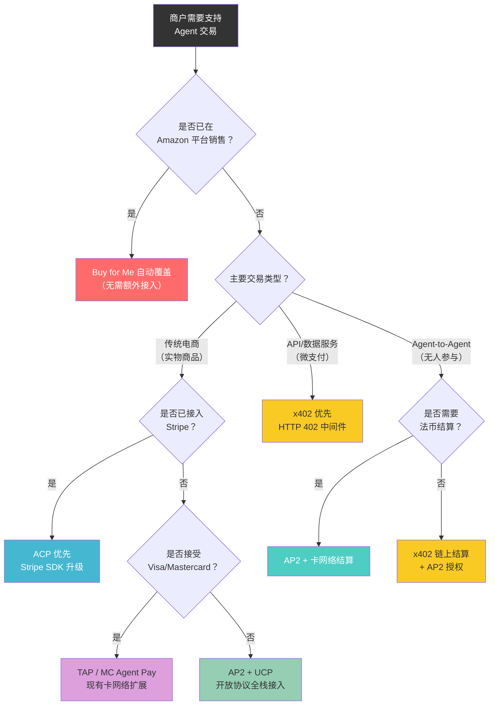

### 9.2 场景化推荐

| 商户类型 | 推荐方案 | 理由 | 接入成本 | 时间线 |
|---------|---------|------|---------|--------|
| **Shopify 商户** | ACP（Stripe 集成） | Shopify 已原生支持 ACP，100 万+ 商户可一键启用 | 极低 | 即时 |
| **Amazon 卖家** | Buy for Me（自动） | 无需主动接入，Amazon 自动代理购买 | 零 | 已可用 |
| **API/SaaS 提供商** | x402 | 微支付场景最优，零协议费，HTTP 402 中间件 5 分钟集成 | 低 | 即时 |
| **大型零售商** | UCP + AP2 | 多渠道统一，开放协议避免平台锁定 | 高 | 6-12 个月 |
| **传统线下商户** | TAP / MC Agent Pay | 复用现有 POS 和卡网络基础设施 | 极低 | 3-6 个月 |
| **金融服务** | AP2 + TAP | 强合规需求，VC 审计链 + RFC 9421 签名 | 中-高 | 6-12 个月 |
| **跨境电商** | AP2 + x402 | 去中心化授权 + 链上即时结算，无跨境手续费 | 中 | 3-6 个月 |
| **订阅服务** | ACP + AP2 Mandate | SPT 约束 + Mandate 周期授权 | 中 | 3-6 个月 |

### 9.3 多协议并行策略

对于大型商户，建议采用"分层接入"策略：

```
第一阶段（立即）：
├── 接入 ACP（如已使用 Stripe）或 TAP/MC Agent Pay（如已接受卡支付）
├── 目标：快速支持主流 Agent 平台（ChatGPT、Microsoft Copilot 等）
└── 投入：最小化，复用现有基础设施

第二阶段（6 个月内）：
├── 接入 AP2 Mandate 机制
├── 目标：支持去中心化 Agent 授权，提升用户控制力
└── 投入：中等，需要实现 VC 验证逻辑

第三阶段（12 个月内）：
├── 接入 UCP 统一层
├── 可选：接入 x402（如有微支付/API 场景）
├── 目标：统一多协议接入点，降低长期维护成本
└── 投入：较高，但长期 ROI 最优
```

---

## 10. 挑战与风险

> Agentic Commerce 仍处于早期阶段，面临技术、商业、监管等多维度挑战。

### 10.1 碎片化困境

当前最大的挑战是协议碎片化——七种方案各自为政，商户面临 N×N 集成问题：

```
                    Agent 平台
            ┌───┬───┬───┬───┬───┐
            │GPT│Gem│Cop│Ale│...│
            └─┬─┴─┬─┴─┬─┴─┬─┴─┬─┘
              │   │   │   │   │
    ┌─────────┼───┼───┼───┼───┼─────────┐
    │   ACP   │UCP│AP2│TAP│MC │  x402   │  ← 协议层
    └─────────┼───┼───┼───┼───┼─────────┘
              │   │   │   │   │
            ┌─┴─┬─┴─┬─┴─┬─┴─┬─┴─┐
            │商户│商户│商户│商户│...│  ← 每个商户需要
            │ A │ B │ C │ D │   │     支持多个协议
            └───┴───┴───┴───┴───┘
```

UCP 试图成为这个问题的解决方案（统一编排层），但其自身也是一个新协议，增加了而非减少了选择的复杂性。这与 [xkcd 927](https://xkcd.com/927/) 的"标准增殖"困境如出一辙。

### 10.2 监管风险

| 监管领域 | 风险描述 | 影响方案 | 严重程度 |
|---------|---------|---------|---------|
| **EU AI Act** | AI Agent 作为"高风险 AI 系统"可能需要额外合规 | 所有方案 | 🔴 高 |
| **PSD3/PSR** | 欧盟支付服务指令修订可能要求 Agent 持有支付牌照 | ACP、AP2、x402 | 🔴 高 |
| **加密资产监管（MiCA）** | USDC 结算可能面临稳定币监管限制 | x402 | 🟡 中 |
| **消费者保护** | Agent 代理购买的退款/争议责任归属不明 | Buy for Me、ACP | 🟡 中 |
| **反垄断** | 平台封闭 + 屏蔽竞争对手 Agent 可能触发反垄断审查 | Buy for Me | 🟡 中 |
| **数据隐私（GDPR）** | Agent 处理用户支付数据的合规性 | 所有方案 | 🟡 中 |
| **跨境支付合规** | 链上跨境结算可能违反外汇管制 | x402 | 🔴 高 |

### 10.3 Amazon Buy for Me 争议

Buy for Me 是目前争议最大的方案，核心矛盾包括：

- **28% 退单率**：近三分之一的 Agent 代理购买被退回，反映了 Agent 理解用户意图的能力仍然不足
- **"双标"行为**：Amazon 通过 robots.txt 屏蔽外部 AI 爬虫访问自己的商品页面，但 Buy for Me Agent 却自由爬取第三方商户网站
- **Bobo Design Studio 事件**：小型设计品牌发现 Amazon Agent 未经授权抓取其网站内容并代理销售，引发 IP 律师介入
- **Opt-out 争议**：商户无法主动选择退出 Buy for Me 的代理购买，只能被动接受
- **120 亿美元增量**：尽管争议不断，Buy for Me 预计带来 120 亿美元增量销售，商业利益与伦理争议的张力持续存在

### 10.4 信任模型成熟度

| 挑战 | 说明 | 受影响方案 |
|------|------|----------|
| **VC 生态不成熟** | W3C Verifiable Credentials 的签发者网络尚未建立 | AP2 |
| **密钥管理复杂** | 普通用户难以管理加密钱包私钥 | x402 |
| **Passkey 普及率** | FIDO2/Passkey 在全球的普及率仍然有限 | TAP、MC Agent Pay |
| **SPT 单点故障** | Stripe 作为唯一 SPT 签发者，存在单点故障风险 | ACP |
| **注册制扩展性** | Agent 预注册审核在 Agent 数量爆发时可能成为瓶颈 | MC Agent Pay |

### 10.5 技术挑战

- **Agent 意图理解**：当前 Agent 对用户购买意图的理解准确率不足（Buy for Me 28% 退单率为证），这是所有方案的共同瓶颈
- **多 Agent 协作**：当多个 Agent 需要协作完成一笔交易时（如比价 Agent + 支付 Agent + 物流 Agent），缺乏标准化的 Agent 间通信协议（A2A 仍在早期）
- **离线/弱网场景**：大部分方案假设稳定的网络连接，对离线或弱网环境的支持不足
- **长尾商户覆盖**：开放协议（AP2、UCP）的接入成本对小型商户仍然偏高，可能加剧数字鸿沟


---

## 11. 行业趋势与市场规模

> 本章综合 McKinsey、Reuters、Gartner 等机构的研究数据，分析 Agentic Commerce 的市场规模预测、消费者行为变迁和商业模式演进。

### 11.1 市场规模预测

根据多方研究，Agentic Commerce 正在经历指数级增长：

| 指标 | 数据 | 来源 |
|------|------|------|
| 2030 年美国 B2C 零售 Agent 商务规模 | **$9,000 亿 - $1 万亿** | McKinsey |
| 2030 年全球 Agent 商务规模 | **$3 万亿 - $5 万亿** | McKinsey |
| 2030 年通过 AI Agent 完成的电商比例 | **25-30%** | Gartner |
| 2030 年 AI Agent 年销售额 | **$5,000 亿** | Reuters |
| AI 平台产品查询年增长率 | **340% YoY** | OpenAI |
| Google 产品搜索量变化 | **-23% YoY** | Similarweb |
| Google 点击率变化 | **-30% YoY** | BrightEdge |

### 11.2 消费者行为变迁：从 UX 到 AX

一个根本性的范式转移正在发生——从用户体验（UX）到 Agent 体验（AX）：

```
传统电商（UX 时代）                    Agentic Commerce（AX 时代）
─────────────────                     ──────────────────────────
视觉设计驱动转化                       API 设计驱动发现
导航结构引导浏览                       结构化数据支撑理解
页面性能影响体验                       协议标准决定兼容性
SEO 优化搜索排名                       AEO 优化 Agent 推荐
人类在浏览器中决策                      Agent 在协议层代理决策
```

**关键数据**：51% 的 Z 世代已经在 AI 平台（而非传统搜索引擎）开始产品搜索。这意味着对于下一代消费者，Agent 不是"替代品"，而是"默认入口"。

### 11.3 三种交互模型

McKinsey 将 Agentic Commerce 的交互模式归纳为三种：

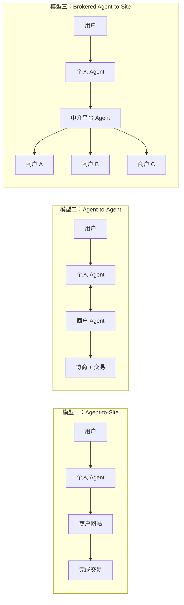

- **Agent-to-Site**：Agent 直接与商户平台交互（如旅行 Agent 扫描多个酒店网站）——对应 ACP、TAP、MC Agent Pay 的场景
- **Agent-to-Agent**：Agent 与商户 Agent 自主协商（如个人购物 Agent 与零售商 AI 谈判折扣）——对应 A2A、AP2 的 HNP 模式
- **Brokered Agent-to-Site**：中介 Agent 跨平台聚合（如餐厅预订 Agent 通过 OpenTable 平台 Agent 查找）——对应 UCP 的统一编排层

### 11.4 商业模式演进

Agentic Commerce 不仅改变交易方式，还催生全新的商业模式：

| 新商业模式 | 说明 | 对应协议 |
|-----------|------|---------|
| **Answer Engine Optimization (AEO)** | 取代 SEO，优化内容以被 AI Agent 推荐 | UCP Discovery Manifest、ACP Product Feed |
| **Agent 即时结账佣金** | Answer Engine 在推荐后提供即时结账，收取交易佣金 | ACP Instant Checkout |
| **内容付费（Bot Monetization）** | 机器访问内容需要付费，三阶段：识别→控制→支付 | x402、Cloudflare Web Bot Auth |
| **数据洞察销售** | 品牌付费获取 Agent 过滤后的匿名消费者行为分析 | 平台数据服务 |
| **对话式市场** | AI Agent 通过对话完成购买，平台收取上架费和佣金 | A2A + ACP |
| **跨 Agent 协议费** | 不同平台 Agent 交互时收取互操作费用 | AP2、UCP |
| **情境赞助** | 品牌赞助 Agent 在特定场景中的推荐（如 Tesla 赞助 AI 出行规划） | 平台广告模式 |

### 11.5 信任的五个维度

McKinsey 提出 Agentic Commerce 信任的五维模型，与七大方案的安全设计高度对应：

| 信任维度 | 含义 | 对应技术方案 |
|---------|------|------------|
| **Know Your Agent (KYA)** | 识别和验证 Agent 身份 | TAP RFC 9421 签名、MC Agent Pay 预注册、Cloudflare Web Bot Auth |
| **以人为中心** | 用户始终保持控制权和最终决策权 | AP2 Mandate、MC Payment Passkey、ACP SPT 约束 |
| **拥抱透明** | Agent 行为可解释、可审计 | AP2 VC 审计链、x402 链上透明、Stripe Dashboard |
| **保护数据安全** | 用户数据最小化共享和安全存储 | AP2 选择性披露、Visa Token 化、MC Agentic Token |
| **负责任治理** | 建立 Agent 行为的治理框架和问责机制 | EU AI Act、PSD3、行业自律标准 |

### 11.6 内容经济的危机与机遇

AI Agent 的崛起正在重塑内容经济的基本模型：

- **Wikipedia 困境**：2025 年人类访问量同比下降约 8%，而 Bot 带宽消耗增长约 50%。知识被机器消费，却不带来传统流量或收益
- **Publisher 的生存挑战**：当 AI 可以"直接回答"用户问题，网站失去访客、广告收入和订阅机会
- **"开放数据 + 免费访问"模式的可持续性危机**：生成式 AI 环境下，传统内容分发模式面临根本性威胁

这催生了 **Bot Monetization（机器付费）** 的新范式——x402 和 Cloudflare Web Bot Auth 正是这一趋势的技术基础。未来，"机器访问内容需要付费"可能成为互联网的新常态。

---

## 12. 未来展望

> Agentic Commerce 正处于从"概念验证"到"规模化落地"的关键转折点。本章基于当前趋势，展望未来 3-5 年的发展方向。

### 12.1 趋势预测

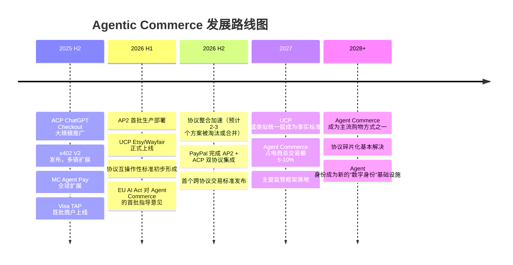

### 12.2 收敛趋势

当前七种方案最终可能收敛为 2-3 个主要路径：

**路径一：开放协议栈（最可能胜出）**
- UCP（编排）+ AP2（授权）+ x402（链上结算）+ 卡网络（法币结算）
- 类比：HTTP + TLS + DNS 的互联网协议栈
- 优势：开放、可组合、无平台锁定
- 挑战：需要更长时间建立生态

**路径二：平台主导栈**
- ACP（Stripe 编排）+ TAP/MC Agent Pay（卡网络信任）
- 类比：iOS/Android 的平台生态
- 优势：快速落地、体验一致
- 挑战：平台依赖、费用不透明

**路径三：封闭平台（逐渐边缘化）**
- Amazon Buy for Me 等封闭方案
- 类比：AOL 的围墙花园
- 优势：短期体验最优
- 挑战：反垄断压力、商户反弹

### 12.3 UCP 能否成为"商务领域的 HTTP"？

Google 对 UCP 的愿景是成为 Agentic Commerce 的统一协议层——就像 HTTP 统一了 Web 访问一样。这个愿景面临的关键考验：

| 成功条件 | 当前状态 | 评估 |
|---------|---------|------|
| 足够多的商户采纳 | Etsy、Wayfair 试点，20+ 合作伙伴 | 🟡 早期 |
| 主要 Agent 平台支持 | 四种传输协议（REST/MCP/A2A/Embedded） | 🟢 架构就绪 |
| 与现有协议兼容 | AP2 Mandate Extension 已集成 | 🟢 良好 |
| 支付方式中立 | 通过扩展支持任意支付 | 🟢 设计合理 |
| 社区治理 | Apache 2.0 开源 | 🟢 开放 |
| 竞争对手认可 | Stripe/Visa/Mastercard 尚未表态 | 🔴 不确定 |

**关键判断**：UCP 的成功不取决于技术优劣，而取决于能否获得 Stripe（ACP）和 Visa/Mastercard（TAP/Agent Pay）阵营的认可。如果这些玩家选择将 UCP 作为上层编排协议（而非竞争对手），UCP 有望成为统一层；否则，市场将长期维持多协议并存的格局。

---

## 13. AWS 在 Agentic Commerce 中的定位与方案

> 本章基于 AWS 内部材料和公开产品信息，分析 AWS 在 Agentic Commerce 生态中的定位、已有能力和战略方向。

### 13.1 AWS 的战略定位

AWS 在 Agentic Commerce 中的角色不是"定义协议"，而是**为所有协议提供基础设施**——帮助零售商和品牌在 Agent 驱动的未来中保持可见性、可交易性和竞争力。

```
AWS 在 Agentic Commerce 技术栈中的位置

┌─────────────────────────────────────────────────────────────┐
│                    协议层（AWS 不直接参与）                     │
│  UCP / ACP / AP2 / TAP / MC Agent Pay / x402               │
├─────────────────────────────────────────────────────────────┤
│                    Agent 基础设施层（AWS 核心能力）             │
│  Amazon Bedrock AgentCore Gateway                           │
│  ├── MCP Server 托管与管理                                   │
│  ├── API → MCP 工具自动转换                                  │
│  ├── 安全认证（OAuth/Cognito）                               │
│  └── 可观测性与扩展性                                        │
├─────────────────────────────────────────────────────────────┤
│                    安全与识别层                                │
│  AWS WAF（2026 年加入 Agent 识别生态）                        │
│  ├── 高级人类遥测信号                                        │
│  ├── 精细化 Bot 评分（从标签到风险分数）                       │
│  ├── Bot 指纹识别（BFP）                                     │
│  ├── 自适应挑战机制                                          │
│  └── 增强 ML 模型                                           │
├─────────────────────────────────────────────────────────────┤
│                    计算与网络层                                │
│  EC2 / Lambda / CloudFront / API Gateway / ...              │
└─────────────────────────────────────────────────────────────┘
```

### 13.2 Amazon Bedrock AgentCore Gateway

AgentCore Gateway 是 AWS 在 Agentic Commerce 中最直接的产品切入点，解决了 MCP 落地的核心基础设施挑战：

| MCP 挑战 | AgentCore Gateway 解决方案 |
|---------|--------------------------|
| **安全性**：身份认证、授权、访问控制 | OAuth 集成（Cognito 自动配置）、统一安全端点 |
| **可观测性**：监控、追踪、性能指标 | 内置监控和追踪能力 |
| **扩展性**：高流量、连接池、限流 | 云原生弹性扩展 |
| **演进性**：版本管理、兼容性、扩展 | 标准化工具发现和版本管理 |

**商户接入流程**：

```
1. 准备 API
   └── 为零售 API 创建 OpenAPI 3.0 规范（商品目录、库存、结账、订单）

2. 配置认证
   └── OAuth（Cognito 自动配置）或 API Key

3. 创建 AgentCore Gateway
   └── 上传 OpenAPI 规范或 Lambda ARN → 自动转换为 MCP 工具

4. 连接 Agent
   └── 获取 MCP 端点 URL → 配置到 Claude、ChatGPT 或自定义 Agent
```

### 13.3 AWS WAF 的 Agent 识别演进

AWS WAF 计划在 2026 年加入 Agent 识别生态，从传统的"阻止 Bot"转向"识别和管理 Agent"：

| 能力 | 说明 | 对应挑战 |
|------|------|---------|
| **高级人类遥测信号** | 更精准地区分人类、合法 Agent 和恶意 Bot | 信任问题 |
| **精细化 Bot 评分** | 从简单标签升级为连续风险分数 | 从二元判断到灰度管理 |
| **Bot 指纹识别（BFP）** | 新型 Bot 指纹技术 | Agent 身份验证 |
| **自适应挑战机制** | 高级阻断能力 | 恶意 Agent 防御 |
| **增强 ML 模型** | 防止攻击者操纵高级信号 | 对抗性安全 |

### 13.4 零售商的四大战略问题

AWS 为零售商定义了四个必须回答的 Agentic Commerce 战略问题：

| # | 战略问题 | 说明 | AWS 支持方案 |
|---|---------|------|-------------|
| 1 | **入站 Agent/Bot 策略** | 是否允许 AI Agent 访问？是否优化内容以被 Agent 推荐？如何衡量产品是否被 Answer Engine 推荐？ | AWS WAF Agent 识别 + AEO 合作伙伴 Salesplay |
| 2 | **结账策略** | 是否允许在 Answer Engine 上即时结账？如何影响销售、广告和忠诚度？ | AgentCore Gateway 支持 ACP 等新兴标准 |
| 3 | **出站 Agent 策略** | 是否实现类似 Buy for Me 的能力扩展品类？ | ACP + MCP + Amazon Nova Act |
| 4 | **站内 Agent 策略** | 是否有智能购物助手？如何留住用户不流失到 Answer Engine？ | Bedrock 购物助手 Demo + GenAIIC 方案 |

### 13.5 潜在合作伙伴生态

AWS 在 Agentic Commerce 的识别、控制和支付三个层面均有潜在合作伙伴：

| 层面 | 合作伙伴 | 能力 |
|------|---------|------|
| **识别** | Cloudflare Web Bot Auth | RFC 9421 签名验证，Agent 身份认证 |
| **识别+控制** | DataDome | 传统 Bot 管理 + Agent 识别 |
| **控制+支付** | TollBit | Bot 付费墙，内容付费控制 |
| **识别+支付** | SkyFire | Know Your Agent (KYA) + KYAPay |

### 13.6 AWS 的机会与建议

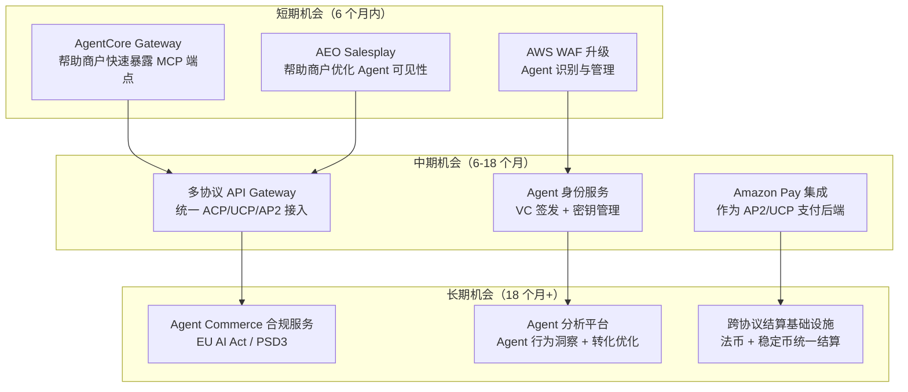

---

## 14. 参考来源

> 本报告综合了以下子研究报告及外部来源。各子报告包含更详细的技术分析、架构图和参考链接。

### 14.1 子研究报告

| 编号 | 报告 | 路径 |
|------|------|------|
| 1 | Google UCP 研究报告 | [google_ucp_research.md](1.google_ucp/google_ucp_research.md) |
| 2 | OpenAI + Stripe ACP 研究报告 | [openai_stripe_acp_research.md](2.openai_strip_acp/openai_stripe_acp_research.md) |
| 3 | Amazon Buy for Me 研究报告 | [amazon_buyforme_research.md](3.amazon_payforme/amazon_buyforme_research.md) |
| 4 | Google AP2 研究报告 | [google_ap2_research.md](4.google_ap2/google_ap2_research.md) |
| 5 | Coinbase x402 研究报告 | [coinbase_x402_research.md](5.conibase_x402/coinbase_x402_research.md) |
| 6 | Visa TAP 研究报告 | [visa_tap_research.md](6.visa_tap/visa_tap_research.md) |
| 7 | Mastercard Agent Pay 研究报告 | [mastercard_agent_pay_research.md](7.mastercard_agent_pay/mastercard_agent_pay_research.md) |

### 14.2 协议与标准

- **Google Universal Commerce Protocol (UCP)** — [universalcommerce.dev](https://universalcommerce.dev)
- **Stripe Agentic Commerce Protocol (ACP)** — [docs.stripe.com/agentic-commerce](https://docs.stripe.com/agentic-commerce)
- **Google Agent Payments Protocol (AP2)** — [github.com/nicognaW/agent-payments-protocol](https://github.com/nicognaW/agent-payments-protocol)
- **Coinbase x402 Protocol** — [github.com/coinbase/x402](https://github.com/coinbase/x402)
- **Visa Trusted Agent Protocol (TAP)** — [developer.visa.com/tap](https://developer.visa.com/tap)
- **W3C Verifiable Credentials** — [w3.org/TR/vc-data-model-2.0](https://www.w3.org/TR/vc-data-model-2.0/)
- **RFC 9421 HTTP Message Signatures** — [rfc-editor.org/rfc/rfc9421](https://www.rfc-editor.org/rfc/rfc9421)
- **FIDO2/WebAuthn** — [fidoalliance.org](https://fidoalliance.org)

### 14.3 行业报告与分析

- McKinsey — *The Agentic Commerce Opportunity: How AI Agents Are Ushering In A New Era For Consumers And Merchants* (2025-10)
- Visa — *Intelligent Commerce* 白皮书 (2025-04)
- Mastercard — *Agentic Commerce* 发布会 (2025-04)
- Stripe — *Agentic Commerce Protocol* 技术文档 (2025-09)
- Google — *Universal Commerce Protocol* NRF 发布 (2026-01)
- Coinbase — *x402 V2* 发布公告 (2025-12)
- a16z — *The Agentic Commerce Opportunity* 研究报告
- Reuters — AI Agent 年销售额预测 ($5,000 亿 by 2030)
- Gartner — 电商 Agent 渗透率预测 (25-30% by 2030)
- Similarweb — Google 产品搜索量变化 (-23% YoY)
- BrightEdge — Google 点击率变化 (-30% YoY)

### 14.4 AWS 内部材料

| 材料 | 说明 |
|------|------|
| *Position on Agentic Commerce* (2025-11) | AWS 内部立场文件，定义零售商四大战略问题和 AWS 支持方案 |
| *AI Agentic e-Commerce：当机器开始为内容付费* | 内容付费视角分析，Bot Monetization 三阶段，AWS WAF 规划 |
| *IND386: From UX to AX — MCP Servers for AI Shopping Agents* | Amazon Bedrock AgentCore Gateway 技术方案，UX→AX 范式转移 |

### 14.5 新闻与事件

- Amazon Buy for Me 发布与争议报道 (2025)
- Bobo Design Studio vs Amazon Buy for Me 事件
- Mastercard 澳大利亚首笔 Agent Pay 认证交易 (CBA + Event Cinemas, Westpac + Thredbo)
- Mastercard 悉尼 AI 卓越中心成立
- Cloudflare + Visa Web Bot Auth 联合开发
- Cloudflare + Coinbase x402 Foundation 成立

---

> **报告说明**：本报告基于截至 2026 年 2 月的公开信息编写。Agentic Commerce 领域发展迅速，建议定期更新。各章节的详细技术分析请参阅对应的子研究报告。
