# Agentic Payment 协议研究报告

## 1. 概述 (Overview)

Agentic Payment（代理支付）是指 AI Agent 代替人类自主发起、授权和完成支付交易的新兴支付范式。传统支付系统假设"人类点击购买按钮"，而 Agentic AI 的崛起打破了这一基本假设——Agent 没有浏览器窗口，没有手指去点击结账页面。

这一变革催生了一系列专为机器对机器（M2M）和 Agent 对商户（A2B）商务设计的支付协议。截至 2026 年初，行业已形成三大核心协议 + 两大卡组织框架的格局：

- **ACP** (Agentic Commerce Protocol) — OpenAI + Stripe 主导，聚焦结账层
- **AP2** (Agent Payments Protocol) — Google 主导，聚焦信任与授权层
- **x402** — Coinbase 主导，聚焦链上结算层
- **Visa Intelligent Commerce** — Visa 的 Agent 支付基础设施
- **Mastercard Agent Pay** — Mastercard 的 Agent 验证与代币化框架

此外，还有两个关键的基础协议支撑整个 Agentic Payment 生态：

- **A2A** (Agent-to-Agent Protocol) — Google 主导，Agent 间通信与协作的基础协议，AP2 的底层依赖
- **UCP** (Universal Commerce Protocol) — Google 2026 年 1 月发布，覆盖完整购物旅程的开放商务标准

核心要解决的三个问题——**3A 问题**：

### Authorization（授权证明）—— "谁允许 Agent 花这笔钱？"

传统支付中，用户亲自点击"购买"按钮就是授权行为本身。但当 Agent 代替用户行动时，商户和支付网络需要一种机制来验证：这笔交易确实经过了用户的明确许可，而非 Agent 自作主张。授权证明需要回答三个子问题：用户是否同意了这次消费？消费的范围（金额、商户、时间）是什么？Agent 是否在授权范围内行动？

### Authenticity（意图真实性）—— "这个 Agent 真的代表这个用户吗？"

当一个 Agent 声称"我代表张三购买这双鞋"时，商户如何确认这不是一个伪造的请求？Authenticity 要求建立从用户到 Agent 再到商户的完整信任链：Agent 的身份是否经过验证？Agent 携带的用户意图是否真实且未被篡改？整个请求链路是否可以被独立验证？

### Accountability（责任归属）—— "出了问题谁负责？"

传统支付中，持卡人对自己的消费行为负责，争议处理流程清晰。但 Agent 支付引入了新的中间层：如果 Agent 买错了东西，是用户的责任（因为用户授权了）还是 Agent 平台的责任（因为 Agent 理解错了意图）？Accountability 要求建立不可否认的审计链，记录从用户意图到最终交易的每一步决策，确保事后可追溯、可裁定。

### 各协议/框架的 3A 解决方案

| 3A 问题 | ACP (OpenAI+Stripe) | AP2 (Google) | x402 (Coinbase) | Visa (TAP) | Mastercard (Agent Pay) |
|---------|---------------------|--------------|------------------|-----------|----------------------|
| **Authorization**<br/>授权证明 | Delegated Vault Token：一次性令牌绑定金额上限、商户白名单和有效期，用户通过 Stripe Checkout UI 确认签发 | 两步 Mandate 模型：Intent Mandate 记录用户意图和约束，Cart Mandate 锁定具体商品和价格，均由 Verifiable Credential 签名 | 钱包私钥签名：Agent 持有的加密钱包直接签署链上交易，授权范围由钱包余额和预设规则限定 | Passkey (FIDO2) 生物识别：每次支付指令需用户指纹/面部确认，Visa 签发限定用途支付令牌 | Payment Passkey + 用户定义控制：用户通过发卡行 App 设定单笔限额、月度总额、商户类别、地理围栏等精细规则 |
| **Authenticity**<br/>意图真实性 | 依赖 Stripe 平台信任：Agent 通过 Stripe API 密钥认证，Token 由 Stripe 签发和验证，信任链较短 | VC 加密签名 + A2A Agent Card：Mandate 由 W3C Verifiable Credential 签名确保不可篡改，Agent 通过 Agent Card 声明身份并由 A2A 框架验证 | HTTP 402 协议原生验证：支付证明包含链上交易哈希，任何人可独立验证，无需信任中间方 | TAP 三层签名：Layer 1 (RFC 9421) 验证 Agent 身份，Layer 2 (ID Token) 识别消费者，Layer 3 (Payment Container) 保护支付凭证，三层通过 nonce 关联 | Agent 预注册审核：Agent 必须通过 Mastercard 资质审核获得 Agent ID，Agentic Token 绑定 Agent ID + 用户账户，双重身份验证 |
| **Accountability**<br/>责任归属 | Stripe 交易日志 + 商户 merchant of record：交易记录在 Stripe 平台，商户保留订单接受/拒绝权，争议走传统卡组织流程 | 不可否认审计链：Intent Mandate → Cart Mandate → Payment 形成完整证据链，每一步都有 VC 签名，支持事后独立审计和责任裁定 | 链上不可篡改记录：所有交易永久记录在区块链上，交易哈希可追溯，但争议处理机制尚不成熟 | TAP 签名链 + VisaNet 日志：完整的签名验证记录，加上 Visa 网络层的交易日志，争议处理纳入现有 Visa 体系 | Mastercard 网络日志 + Decision Intelligence：AI 模型持续分析 Agent 交易模式，异常交易自动标记，争议处理走 Mastercard 现有体系 |

从上表可以看出，各方案在 3A 问题上的侧重点不同：ACP 最务实（借助 Stripe 现有基础设施快速解决），AP2 最完整（原生设计了全链路审计能力），x402 最去中心化（依赖区块链的天然不可篡改性），而 Visa 和 Mastercard 则将 Agent 支付嵌入到各自成熟的卡网络信任体系中。

## 2. 核心概念与术语 (Key Concepts & Glossary)

- **Agentic Commerce** — AI Agent 自主发现商品、比较选项、完成购买的数字商务模式
- **Mandate** (授权委托) — AP2 协议中的核心概念，加密签名的数字合约，证明用户授权 Agent 执行特定操作
- **Intent Mandate** (意图委托) — 用户初始购物意图的可审计记录
- **Cart Mandate** (购物车委托) — 用户确认具体商品和价格后签署的不可篡改记录
- **Verifiable Credential (VC)** (可验证凭证) — 用于签署 Mandate 的加密凭证，确保不可否认性
- **Agentic Token** (代理代币) — Mastercard 为 AI Agent 创建的专用支付令牌，基于现有 tokenization 能力扩展
- **HTTP 402** — HTTP 协议中预留的"Payment Required"状态码，x402 协议将其激活用于原生 Web 支付
- **Delegated Authority** (委托权限) — 用户将消费权限委托给 Agent 的机制，包含金额限制、时间窗口等约束
- **Non-repudiable Audit Trail** (不可否认审计链) — 从意图到购物车到支付的完整证据链
- **Trusted Agent Protocol (TAP)** — Visa 的可信 Agent 协议，为 Agent 提供唯一加密签名作为"数字护照"
- **A2A Protocol** (Agent-to-Agent) — Google 主导的 Agent 间通信开放协议，定义 Agent Card、Task 等核心原语
- **Agent Card** — A2A 协议中 Agent 的自描述 JSON 文档，声明能力、端点和认证方式
- **Task** (任务) — A2A 协议中的工作单元，支持长时运行、流式结果和交互式输入
- **UCP** (Universal Commerce Protocol) — Google 2026 年发布的开放商务标准，定义 Capabilities、Extensions、Services 三层架构
- **Capability** (能力) — UCP 中商户暴露的核心功能（Identity Linking、Checkout、Order Management）
- **RFC 9421** — HTTP Message Signatures 标准，TAP 协议的加密签名基础
- **Browsing IOU** — TAP 中商户通过 HTTP 402 响应请求支付时，Agent 返回的支付承诺对象

## 3. 发展历程 (History & Evolution)

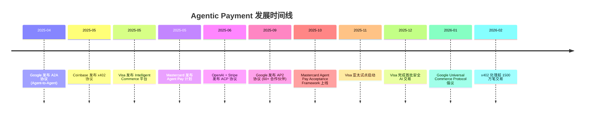
```mermaid
timeline
    title Agentic Payment 发展时间线
    2025-04 : Google 发布 A2A 协议 (Agent-to-Agent)
    2025-05 : Coinbase 发布 x402 协议
    2025-05 : Visa 发布 Intelligent Commerce 平台
    2025-05 : Mastercard 发布 Agent Pay 计划
    2025-06 : OpenAI + Stripe 发布 ACP 协议
    2025-09 : Google 发布 AP2 协议 (60+ 合作伙伴)
    2025-10 : Mastercard Agent Pay Acceptance Framework 上线
    2025-11 : Visa 亚太试点启动
    2025-12 : Visa 完成首批安全 AI 交易
    2026-01 : Google Universal Commerce Protocol 倡议
    2026-02 : x402 处理超 1500 万笔交易
```


## 4. 业务场景 (Use Cases)

### 消费者场景
- **智能购物**：用户告诉 Agent "我想要一件绿色冬季夹克，愿意多付 20%"，Agent 自动监控价格和库存，条件满足时自动购买
- **委托任务**：用户设定 "演唱会开票时立刻买两张"，Agent 在用户不在场时按预设规则自主完成交易
- **协调购买**：用户说 "帮我订棕榈泉周末往返机票+酒店，总预算 $700"，Agent 同时与航空和酒店 Agent 协商，找到最优组合后同步下单
- **个性化推荐**：商户 Agent 根据用户 Agent 传递的上下文（如旅行日期），自动生成定制捆绑优惠

### 企业 B2B 场景
- **自动采购**：企业 Agent 根据库存水平自动触发供应商采购
- **软件许可管理**：Agent 根据实时使用量自动扩缩软件许可
- **API 按需付费**：通过 x402 协议，Agent 调用付费 API 时自动完成微支付，无需预注册或 API Key

### 开发者场景
- **数据市场**：Agent 按次付费获取数据服务
- **计算资源**：Agent 自动购买临时计算资源
- **内容付费墙**：通过 HTTP 402 实现原生内容微支付

## 5. 技术架构 (Architecture)

### 协议栈分层架构

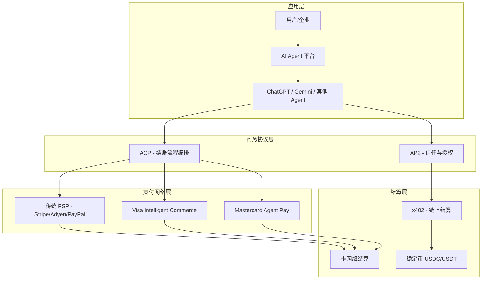
```mermaid
graph TD
    subgraph 应用层
        A[用户/企业] --> B[AI Agent 平台]
        B --> C[ChatGPT / Gemini / 其他 Agent]
    end
    
    subgraph 商务协议层
        C --> D[ACP - 结账流程编排]
        C --> E[AP2 - 信任与授权]
    end
    
    subgraph 支付网络层
        D --> F[Visa Intelligent Commerce]
        D --> G[Mastercard Agent Pay]
        D --> H[传统 PSP - Stripe/Adyen/PayPal]
    end
    
    subgraph 结算层
        H --> I[卡网络结算]
        E --> J[x402 - 链上结算]
        J --> K[稳定币 USDC/USDT]
        F --> I
        G --> I
    end
```

### 各协议核心架构

#### ACP (Agentic Commerce Protocol) — 结账层

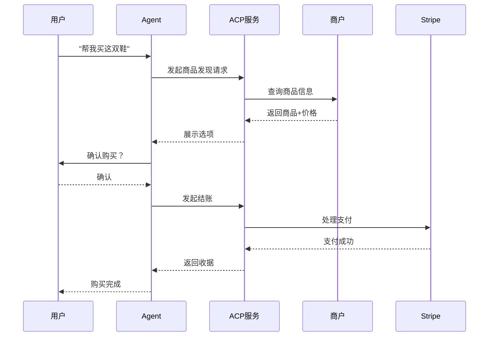
```mermaid
sequenceDiagram
    participant 用户
    participant Agent
    participant ACP服务
    participant 商户
    participant Stripe
    
    用户->>Agent: "帮我买这双鞋"
    Agent->>ACP服务: 发起商品发现请求
    ACP服务->>商户: 查询商品信息
    商户-->>ACP服务: 返回商品+价格
    ACP服务-->>Agent: 展示选项
    Agent->>用户: 确认购买？
    用户-->>Agent: 确认
    Agent->>ACP服务: 发起结账
    ACP服务->>Stripe: 处理支付
    Stripe-->>ACP服务: 支付成功
    ACP服务-->>Agent: 返回收据
    Agent-->>用户: 购买完成
```

- 由 OpenAI 和 Stripe 联合开发，Apache 2.0 开源
- 核心流程：意图 → 发现 → 确认 → 支付 → 收据，全在同一 AI 上下文中完成
- 商户保持 merchant of record 身份，交易走现有支付通道
- 已在 ChatGPT Instant Checkout 中上线运行
- 支持实体商品、数字商品、订阅和异步购买
- 可实现为 RESTful 接口或 MCP Server

#### AP2 (Agent Payments Protocol) — 信任与授权层

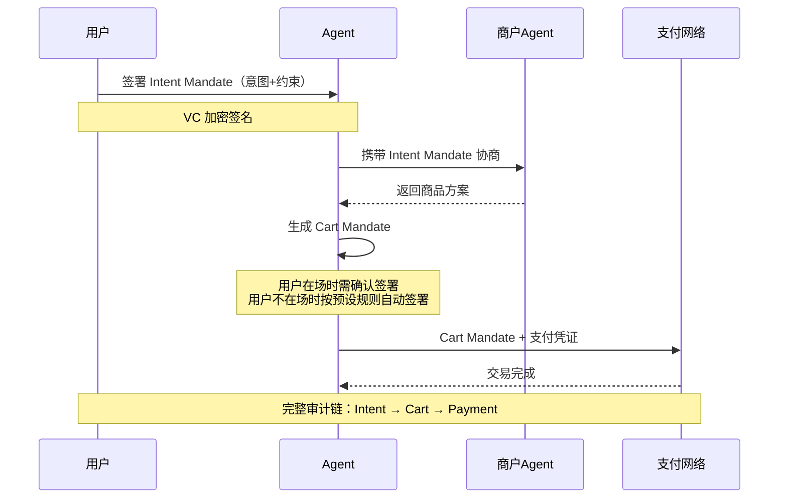
```mermaid
sequenceDiagram
    participant 用户
    participant Agent
    participant 商户Agent
    participant 支付网络
    
    用户->>Agent: 签署 Intent Mandate（意图+约束）
    Note over 用户,Agent: VC 加密签名
    Agent->>商户Agent: 携带 Intent Mandate 协商
    商户Agent-->>Agent: 返回商品方案
    Agent->>Agent: 生成 Cart Mandate
    Note over Agent: 用户在场时需确认签署<br/>用户不在场时按预设规则自动签署
    Agent->>支付网络: Cart Mandate + 支付凭证
    支付网络-->>Agent: 交易完成
    Note over 用户,支付网络: 完整审计链：Intent → Cart → Payment
```

- Google 主导，60+ 合作伙伴（AmEx、Mastercard、PayPal、Coinbase、Salesforce 等）
- 核心机制：Mandate（授权委托）+ Verifiable Credentials（可验证凭证）
- 两种模式：实时购买（人在场）和委托任务（人不在场）
- 支付方式无关：信用卡、借记卡、稳定币、实时银行转账均可
- 作为 A2A 协议和 MCP 的扩展使用
- Apache 2.0 开源，GitHub 公开技术规范

#### x402 — 链上结算层

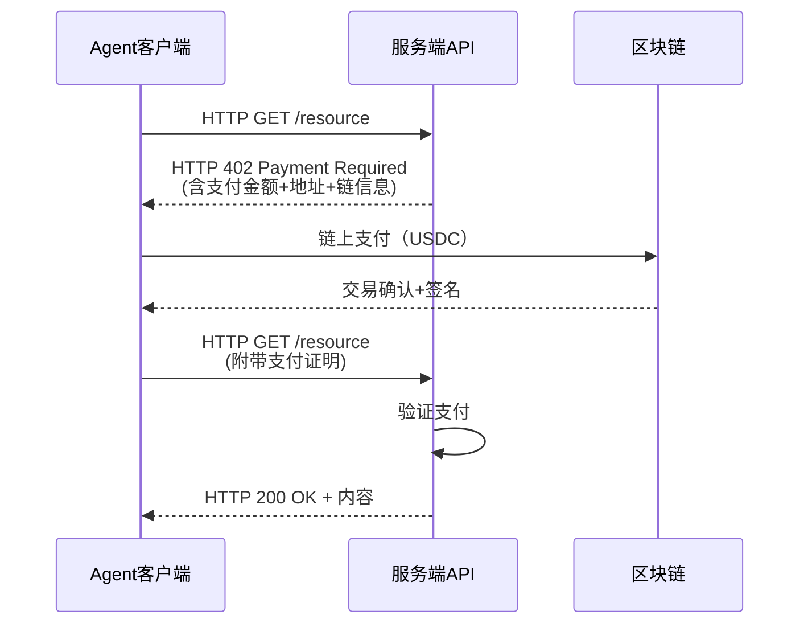
```mermaid
sequenceDiagram
    participant Agent客户端
    participant 服务端API
    participant 区块链
    
    Agent客户端->>服务端API: HTTP GET /resource
    服务端API-->>Agent客户端: HTTP 402 Payment Required<br/>(含支付金额+地址+链信息)
    Agent客户端->>区块链: 链上支付（USDC）
    区块链-->>Agent客户端: 交易确认+签名
    Agent客户端->>服务端API: HTTP GET /resource<br/>(附带支付证明)
    服务端API->>服务端API: 验证支付
    服务端API-->>Agent客户端: HTTP 200 OK + 内容
```

- Coinbase 发起，激活 HTTP 协议中沉睡 30 年的 402 状态码
- 极简设计：无需账户注册、API Key 或订阅
- 链无关（chain-agnostic），首批实现使用 USDC 稳定币
- 特别适合微支付和按次付费 API
- Cloudflare 联合创立 x402 Foundation
- 截至 2026 年初已处理超 1500 万笔交易


## 6. 协议技术规范详解 (Protocol Technical Deep Dive)

本章深入分析各协议的关键技术细节，包括 A2A、UCP、ACP、AP2、x402 和 TAP。

---

### 6.1 A2A (Agent-to-Agent Protocol) — Agent 间通信基础层

A2A 是整个 Agentic Payment 生态的通信基础。它不直接处理支付，但为 Agent 间的发现、协商和协作提供了标准化框架，AP2 和 UCP 都构建在其之上。

#### 在 Agentic Payment 中的位置

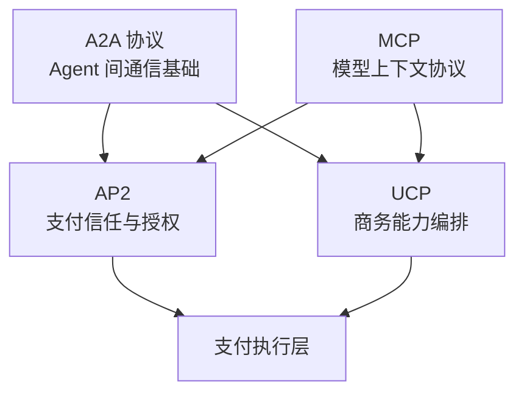
```mermaid
graph TD
    A2A[A2A 协议<br/>Agent 间通信基础] --> AP2[AP2<br/>支付信任与授权]
    A2A --> UCP[UCP<br/>商务能力编排]
    MCP[MCP<br/>模型上下文协议] --> AP2
    MCP --> UCP
    AP2 --> 支付执行[支付执行层]
    UCP --> 支付执行
```

#### 核心架构

A2A 定义了两种 Agent 角色：
- **Client Agent**（客户端 Agent）：发起任务请求
- **Remote Agent**（远程 Agent）：处理任务并返回结果

#### 三大核心原语

**1. Agent Card — Agent 自描述**

每个 A2A Agent 发布一个 JSON 格式的 Agent Card，声明自身能力：

```json
{
  "name": "Payment Agent",
  "description": "Handles secure payments",
  "url": "https://payment-agent.example.com",
  "skills": [
    {
      "id": "process-payment",
      "name": "Process Payment",
      "description": "Execute payment transactions"
    }
  ],
  "capabilities": {
    "streaming": true,
    "pushNotifications": true
  },
  "securitySchemes": {
    "oauth2": {
      "type": "oauth2",
      "flows": {
        "clientCredentials": {
          "tokenUrl": "https://auth.example.com/token",
          "scopes": { "agent:invoke": "..." }
        }
      }
    }
  }
}
```

发现方式：直接 URL、`/.well-known/agent.json`、或注册中心查找。

**2. Task — 工作单元**

Agent 间通过 Task 交互，支持状态机：

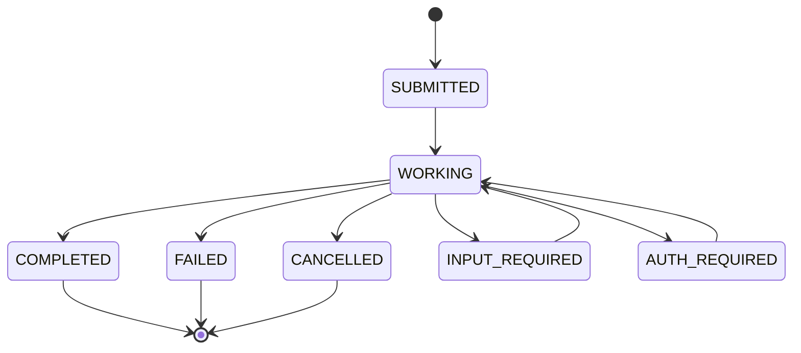
```mermaid
stateDiagram-v2
    [*] --> SUBMITTED
    SUBMITTED --> WORKING
    WORKING --> COMPLETED
    WORKING --> FAILED
    WORKING --> CANCELLED
    WORKING --> INPUT_REQUIRED
    WORKING --> AUTH_REQUIRED
    INPUT_REQUIRED --> WORKING
    AUTH_REQUIRED --> WORKING
    COMPLETED --> [*]
    FAILED --> [*]
    CANCELLED --> [*]
```

Task 特性：
- 长时运行：可持续数分钟到数小时，Remote Agent 发送进度更新
- 流式结果：结果以 Artifact 形式增量返回
- 交互式：Remote Agent 可暂停等待输入（INPUT_REQUIRED）或额外认证（AUTH_REQUIRED）

**3. 认证 — 委托现有标准**

A2A 不重新发明认证，而是委托给现有标准：OAuth 2.0、OpenID Connect、API Keys、HTTP Auth、mTLS。推荐使用 On-Behalf-Of (OBO) 模式（RFC 8693 Token Exchange），在 Agent 链中保留用户身份。

#### 在支付场景中的作用

| 场景 | A2A 的作用 |
|------|-----------|
| 购物 Agent 调用支付 Agent | Client Agent 通过 Agent Card 发现支付 Agent 能力，创建 Task 发起支付 |
| 多 Agent 协调购买 | 旅行 Agent 同时与航空 Agent 和酒店 Agent 通信，协调预算分配 |
| Agent 间结算 | 一个 Agent 调用另一个 Agent 的付费 API，通过 A2A + x402 完成微支付 |

#### 治理

- 2025 年 4 月 Google 发布初始规范
- 2025 年 6 月捐赠给 Linux Foundation
- 2025 年 9 月 IBM 的 ACP (Agent Communication Protocol) 合并
- 技术指导委员会：Google、Microsoft、AWS、IBM、Salesforce、SAP 等

---

### 6.2 UCP (Universal Commerce Protocol) — 全旅程商务标准

UCP 是 Google 在 2026 年 1 月 NRF 大会上发布的开放商务标准，覆盖从商品发现到售后的完整购物旅程。

#### 在 Agentic Payment 中的位置

UCP 是最上层的商务编排协议，整合了 A2A、MCP 和 AP2：

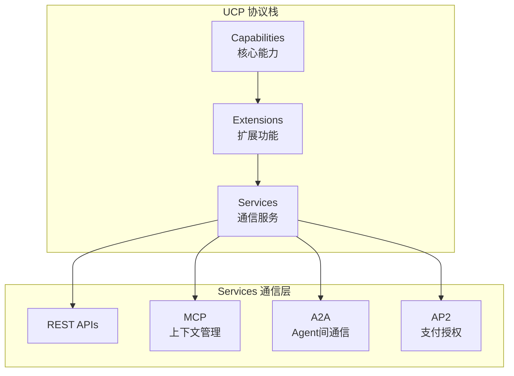
```mermaid
graph TD
    subgraph UCP 协议栈
        UCP_CAP[Capabilities<br/>核心能力] --> UCP_EXT[Extensions<br/>扩展功能]
        UCP_EXT --> UCP_SVC[Services<br/>通信服务]
    end
    
    subgraph Services 通信层
        UCP_SVC --> REST[REST APIs]
        UCP_SVC --> MCP_S[MCP<br/>上下文管理]
        UCP_SVC --> A2A_S[A2A<br/>Agent间通信]
        UCP_SVC --> AP2_S[AP2<br/>支付授权]
    end
```

#### 三层架构

**1. Capabilities（核心能力）**

商户通过 UCP 暴露的标准化功能：

| Capability | 功能 | 技术实现 |
|-----------|------|---------|
| Identity Linking | Agent 代表用户在商户站点执行操作的授权 | OAuth 2.0 授权流程 |
| Checkout | 完整购买流程：创建会话、增删商品、计算总价、选择支付/配送、完成交易 | RESTful Session API |
| Order Management | 订单追踪、发起退货、更新配送状态 | 订单状态机 API |

**2. Extensions（扩展功能）**

在核心 Capability 上叠加可选功能，例如：
- Checkout + Discounts 扩展 → Agent 可应用优惠券、会员折扣
- 每个 Extension 独立版本化，Agent 可查询是否可用

**3. Services（通信服务）**

| 通信协议 | 用途 |
|---------|------|
| REST APIs | 主要通信方式，定义端点、请求/响应 Schema |
| MCP | 多步交互中维护和共享上下文（如跟踪购物车、管理会话） |
| A2A | Agent 间直接通信，委托或编排复杂工作流 |
| AP2 | 安全的 Agent 发起支付，支持多种支付方式 |

#### 商户接入流程

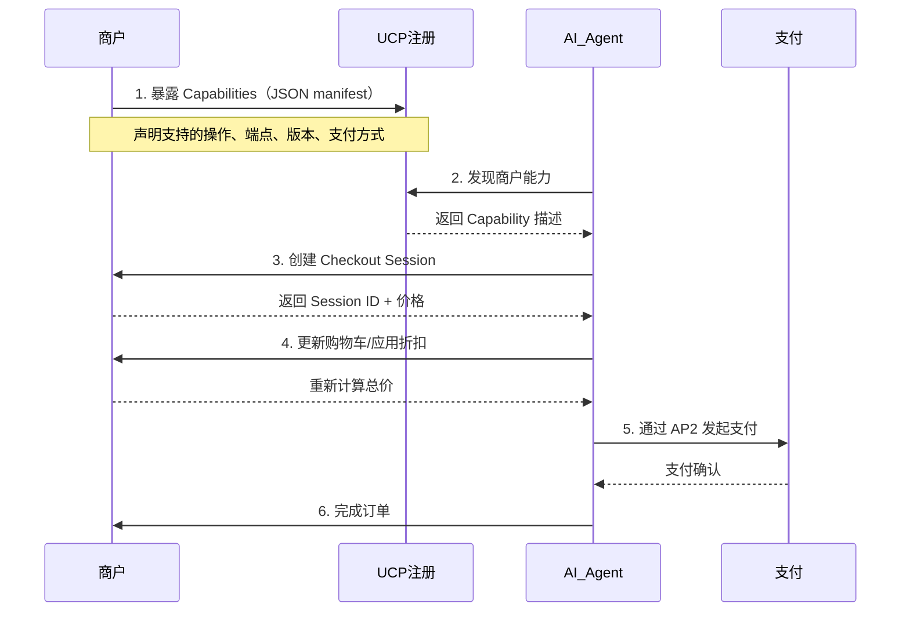
```mermaid
sequenceDiagram
    participant 商户
    participant UCP注册
    participant AI_Agent
    participant 支付
    
    商户->>UCP注册: 1. 暴露 Capabilities（JSON manifest）
    Note over 商户,UCP注册: 声明支持的操作、端点、版本、支付方式
    AI_Agent->>UCP注册: 2. 发现商户能力
    UCP注册-->>AI_Agent: 返回 Capability 描述
    AI_Agent->>商户: 3. 创建 Checkout Session
    商户-->>AI_Agent: 返回 Session ID + 价格
    AI_Agent->>商户: 4. 更新购物车/应用折扣
    商户-->>AI_Agent: 重新计算总价
    AI_Agent->>支付: 5. 通过 AP2 发起支付
    支付-->>AI_Agent: 支付确认
    AI_Agent->>商户: 6. 完成订单
```

#### 合作伙伴

Shopify、Etsy、Wayfair、Target、Walmart、Visa、Mastercard 等 20+ 全球合作伙伴。

---

### 6.3 ACP (Agentic Commerce Protocol) — 技术规范详解

#### 三大子规范

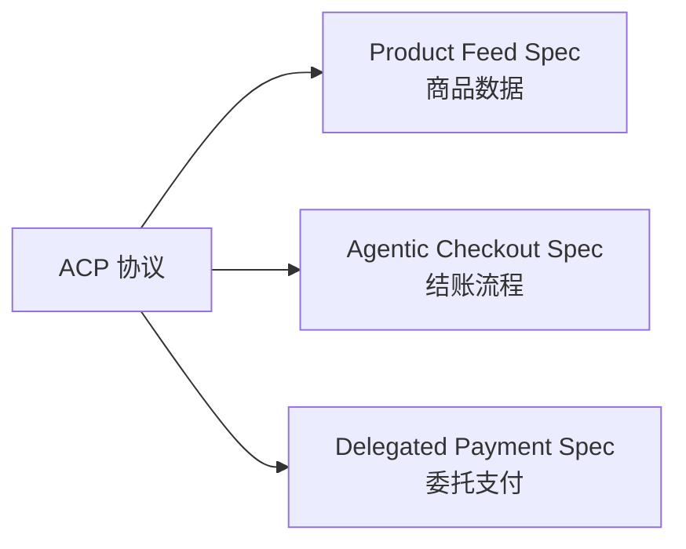
```mermaid
graph LR
    ACP[ACP 协议] --> PF[Product Feed Spec<br/>商品数据]
    ACP --> AC[Agentic Checkout Spec<br/>结账流程]
    ACP --> DP[Delegated Payment Spec<br/>委托支付]
```

**1. Product Feed Specification（商品数据规范）**

| 特性 | 说明 |
|------|------|
| 支持格式 | TSV、CSV、XML、JSON |
| 更新频率 | 最快每 15 分钟同步库存和价格 |
| 内容 | 商品描述、媒体、评论、性能信号 |
| 传输安全 | HTTPS 加密传输 |

**2. Agentic Checkout Specification（结账规范）**

核心 REST 端点：

```
POST   /checkout_sessions              # 创建购物车
POST   /checkout_sessions/{id}         # 更新购物车（应用修改）
GET    /checkout_sessions/{id}         # 获取当前状态
POST   /checkout_sessions/{id}/complete # 完成支付
POST   /checkout_sessions/{id}/cancel   # 取消
```

响应必须返回完整的 Rich Cart State：
- items（商品列表）
- pricing（定价）
- taxes/fees（税费）
- shipping（配送）
- discounts（折扣）
- totals（总计）
- status（状态）

特性：
- 嵌入式体验：结账 UI 渲染在 Agent 界面内
- 实时通信：订单状态实时更新
- 商户控制权：商户保留订单接受/拒绝权
- Webhook 集成：事件驱动的订单生命周期管理

**3. Delegated Payment Specification（委托支付规范）**

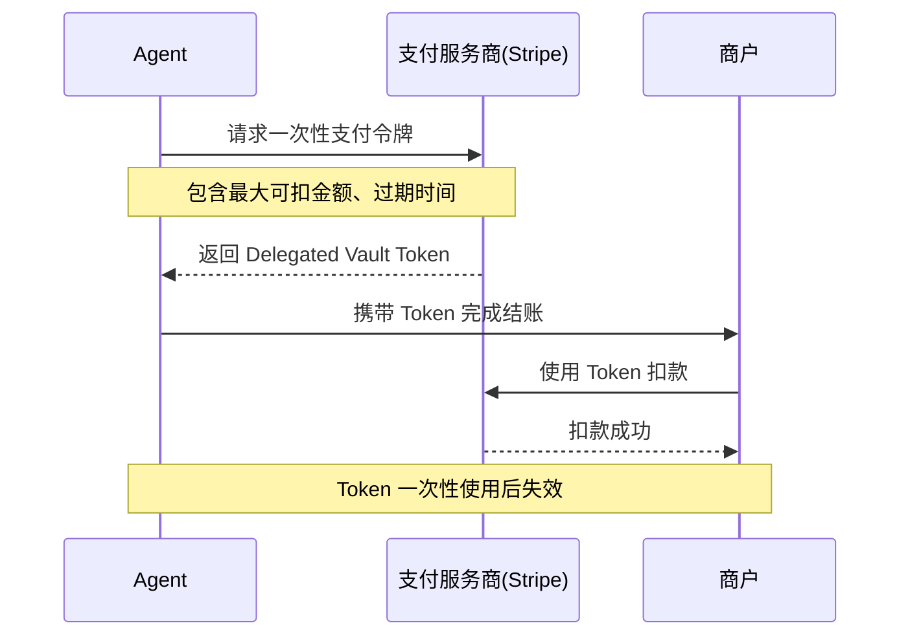
```mermaid
sequenceDiagram
    participant Agent
    participant PSP as 支付服务商(Stripe)
    participant 商户
    
    Agent->>PSP: 请求一次性支付令牌
    Note over Agent,PSP: 包含最大可扣金额、过期时间
    PSP-->>Agent: 返回 Delegated Vault Token
    Agent->>商户: 携带 Token 完成结账
    商户->>PSP: 使用 Token 扣款
    PSP-->>商户: 扣款成功
    Note over Agent,商户: Token 一次性使用后失效
```

安全特性：
- 一次性支付令牌（用后即毁）
- 最大可扣金额限制
- 时间限定的支付授权
- 加密凭证传输
- PCI DSS 合规
- 支持 Network Tokenization

---

### 6.4 TAP (Trusted Agent Protocol) — Visa 技术规范详解

TAP 由 Visa 与 Cloudflare 联合开发，基于 HTTP Message Signatures (RFC 9421) 标准，是目前技术规范最详细的 Agent 身份验证协议。

#### 三层签名信任模型

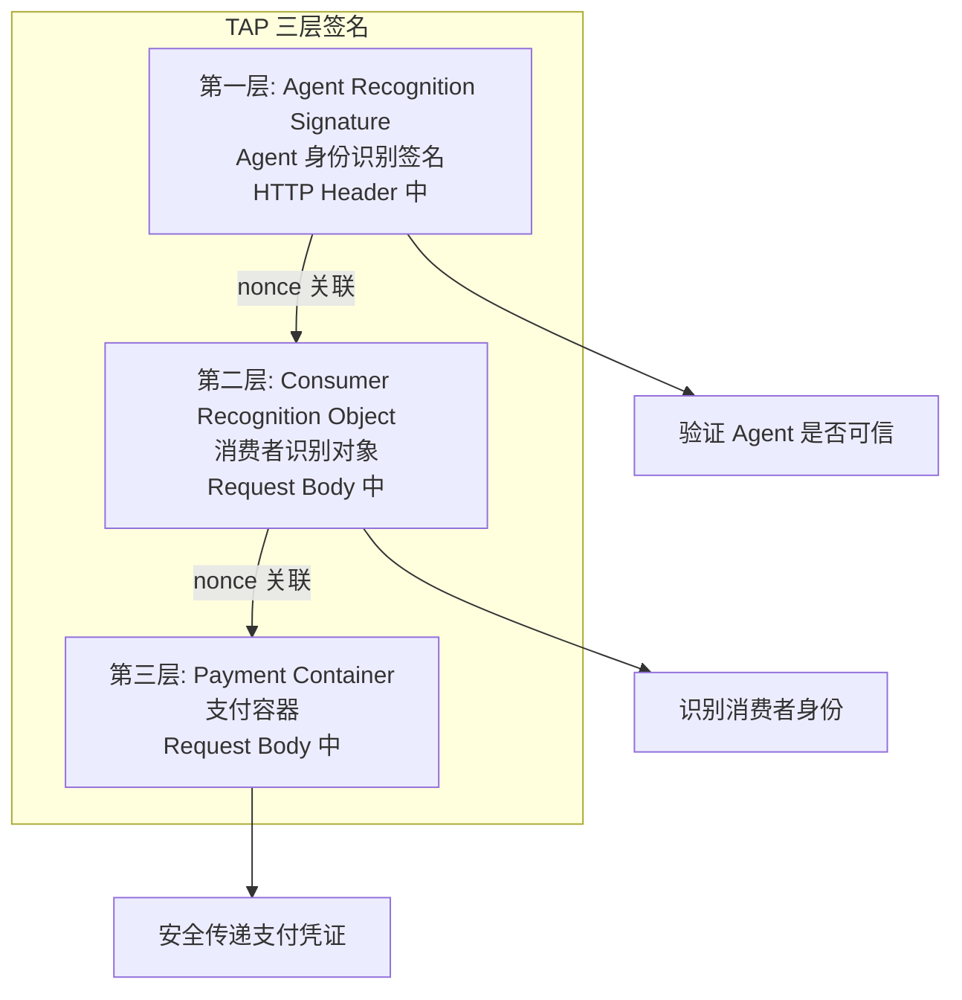
```mermaid
graph TD
    subgraph TAP 三层签名
        L1[第一层: Agent Recognition Signature<br/>Agent 身份识别签名<br/>HTTP Header 中]
        L2[第二层: Consumer Recognition Object<br/>消费者识别对象<br/>Request Body 中]
        L3[第三层: Payment Container<br/>支付容器<br/>Request Body 中]
    end
    
    L1 -->|nonce 关联| L2
    L2 -->|nonce 关联| L3
    
    L1 --> V1[验证 Agent 是否可信]
    L2 --> V2[识别消费者身份]
    L3 --> V3[安全传递支付凭证]
```

#### 第一层：Agent Recognition Signature

基于 RFC 9421 HTTP Message Signatures，在 HTTP Header 中携带：

```http
Signature-Input: sig2=("@authority" "@path");
     created=1735689600;
     expires=1735693200;
     keyId="poqkLGiymh_W0uP6PZFw-dvez3QJT5SolqXBCW38r0U";
     alg="Ed25519";
     nonce="e8N7S2MFd/qrd6T2R3tdfAuuANngKI7LFtKYI/vowzk4lAZyadIX6wW25MwG7DCT9RUKAJ0qVkU0mEeLElW1qg==";
     tag="agent-browser-auth"
Signature: sig2=:jdq0SqOwHdyHr9+r5jw3iYZH6aNGKijYp/EstF4RQTQdi5N5YYKrD+mCT1HA1nZDsi6nJKuHxUi/5Syp3rLWBA==:
```

必需字段：

| 字段 | 说明 |
|------|------|
| `@authority` | 目标 URI 的 authority |
| `@path` | 目标 URI 的绝对路径 |
| `created` | 请求创建时间戳 |
| `keyid` | 用于验证签名的公钥标识 |
| `expires` | 请求过期时间戳（与 created 间隔不超过 8 分钟） |
| `tag` | `agent-browser-auth`（浏览）或 `agent-payer-auth`（支付） |
| `alg` | 签名算法（Ed25519） |
| `nonce` | 会话标识符，防重放攻击 |

商户验证步骤：
1. 检查 tag 是否为 `agent-browser-auth` 或 `agent-payer-auth`
2. 验证所有必需字段存在
3. 验证时间戳（created 在过去，expires 在未来，间隔 ≤ 8 分钟）
4. 检查 nonce 是否重复（防重放）
5. 从 Key Store 获取公钥（Visa: `https://mcp.visa.com/.well-known/jwks`）
6. 构建 signature_base 字符串并验证签名

#### 第二层：Consumer Recognition Object

在 Request Body 中携带消费者身份信息：

```json
{
  "agenticConsumer": {
    "nonce": "与 Header 签名相同的 nonce",
    "idToken": { "JWT - Visa 签发的 ID Token" },
    "contextualData": {
      "countryCode": "US",
      "zip": "94105",
      "ipAddress": "...",
      "deviceData": { }
    },
    "kid": "与 Header 签名相同的 keyid",
    "alg": "PS256",
    "signature": "..."
  }
}
```

ID Token 是符合 OpenID Connect 标准的 JWT，包含：
- 混淆后的手机号（`phone_number`）和邮箱（`email`）
- 商户需维护映射表将混淆值匹配到实际用户账户
- 由 Visa 数字签名，公钥通过 JWKS 端点获取

#### 第三层：Payment Container

根据支付方式不同，包含不同内容：

| 场景 | 容器内容 |
|------|---------|
| 商户返回 HTTP 402 | Browsing IOU（支付承诺：invoiceId、amount、acquirerId 等） |
| Guest Checkout 表单 | Payment Credential Hash（卡号+有效期+CVV 的哈希值） |
| API/协议支付 | 完整加密 Payload（Token、动态数据、地址等，用商户公钥加密） |

#### 两个交互点

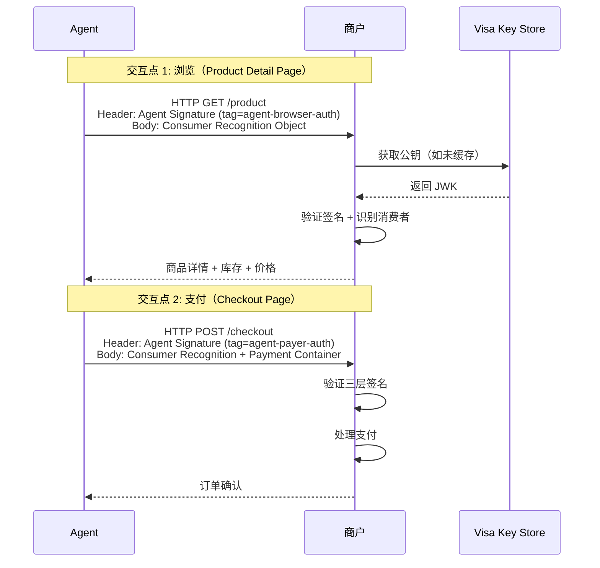
```mermaid
sequenceDiagram
    participant Agent
    participant 商户
    participant Visa_KeyStore as Visa Key Store
    
    Note over Agent,商户: 交互点 1: 浏览（Product Detail Page）
    Agent->>商户: HTTP GET /product<br/>Header: Agent Signature (tag=agent-browser-auth)<br/>Body: Consumer Recognition Object
    商户->>Visa_KeyStore: 获取公钥（如未缓存）
    Visa_KeyStore-->>商户: 返回 JWK
    商户->>商户: 验证签名 + 识别消费者
    商户-->>Agent: 商品详情 + 库存 + 价格
    
    Note over Agent,商户: 交互点 2: 支付（Checkout Page）
    Agent->>商户: HTTP POST /checkout<br/>Header: Agent Signature (tag=agent-payer-auth)<br/>Body: Consumer Recognition + Payment Container
    商户->>商户: 验证三层签名
    商户->>商户: 处理支付
    商户-->>Agent: 订单确认
```

---

### 6.5 协议技术栈全景与关系

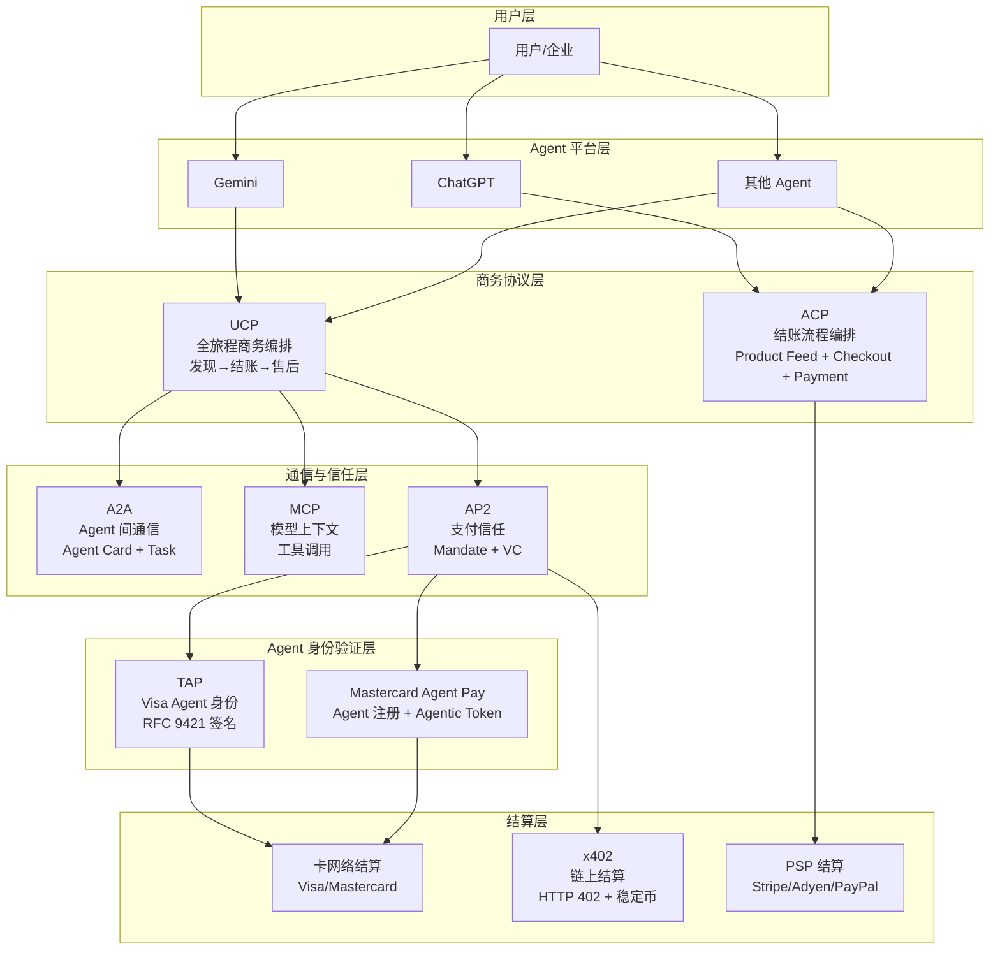
```mermaid
graph TB
    subgraph 用户层
        User[用户/企业]
    end
    
    subgraph Agent 平台层
        ChatGPT[ChatGPT]
        Gemini[Gemini]
        Other[其他 Agent]
    end
    
    subgraph 商务协议层
        UCP_P[UCP<br/>全旅程商务编排<br/>发现→结账→售后]
        ACP_P[ACP<br/>结账流程编排<br/>Product Feed + Checkout + Payment]
    end
    
    subgraph 通信与信任层
        A2A_P[A2A<br/>Agent 间通信<br/>Agent Card + Task]
        MCP_P[MCP<br/>模型上下文<br/>工具调用]
        AP2_P[AP2<br/>支付信任<br/>Mandate + VC]
    end
    
    subgraph Agent 身份验证层
        TAP_P[TAP<br/>Visa Agent 身份<br/>RFC 9421 签名]
        MC_AP[Mastercard Agent Pay<br/>Agent 注册 + Agentic Token]
    end
    
    subgraph 结算层
        CARD[卡网络结算<br/>Visa/Mastercard]
        X402_P[x402<br/>链上结算<br/>HTTP 402 + 稳定币]
        PSP_P[PSP 结算<br/>Stripe/Adyen/PayPal]
    end
    
    User --> ChatGPT
    User --> Gemini
    User --> Other
    
    ChatGPT --> ACP_P
    Gemini --> UCP_P
    Other --> UCP_P
    Other --> ACP_P
    
    UCP_P --> A2A_P
    UCP_P --> MCP_P
    UCP_P --> AP2_P
    ACP_P --> PSP_P
    
    AP2_P --> TAP_P
    AP2_P --> MC_AP
    AP2_P --> X402_P
    
    TAP_P --> CARD
    MC_AP --> CARD
```

#### 协议间关系总结

| 关系 | 说明 |
|------|------|
| A2A → AP2 | AP2 是 A2A 的支付扩展，复用 A2A 的通信和发现机制 |
| A2A → UCP | UCP 的 Services 层使用 A2A 作为 Agent 间通信通道 |
| MCP → AP2 | AP2 也可作为 MCP 的扩展使用，通过工具调用发起支付 |
| MCP → UCP | UCP 使用 MCP 在多步交互中维护上下文 |
| UCP vs ACP | 功能有重叠（都处理结账），UCP 覆盖更广（含发现和售后），ACP 更聚焦结账 |
| AP2 + TAP | TAP 提供 Agent 身份验证，AP2 提供用户授权委托，互补 |
| AP2 + x402 | A2A x402 扩展将链上结算集成到 AP2 框架中 |
| ACP + TAP | ACP 的通信通道可携带 TAP 签名，Visa 明确支持 |

---

## 7. Agent 支付授权与认证机制 (Agent Payment Authorization & Authentication)

本章聚焦 Agentic Payment 中最关键的安全问题：当 AI Agent 代替人类发起支付时，如何完成授权与认证？涵盖从用户授权委托、Agent 身份验证、支付凭证签发到交易执行的完整链路。

### 7.1 授权认证全链路概览

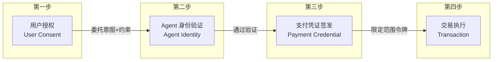
```mermaid
flowchart LR
    subgraph 第一步
        A[用户授权<br/>User Consent]
    end
    subgraph 第二步
        B[Agent 身份验证<br/>Agent Identity]
    end
    subgraph 第三步
        C[支付凭证签发<br/>Payment Credential]
    end
    subgraph 第四步
        D[交易执行<br/>Transaction]
    end
    
    A -->|委托意图+约束| B
    B -->|通过验证| C
    C -->|限定范围令牌| D
```

各协议/框架在这四个环节的实现方式不同，但都遵循同一核心原则：**用户始终是最终授权方，Agent 只是被委托的执行者**。

### 7.2 Visa Intelligent Commerce 授权流程

Visa 的授权体系围绕 TAP (Trusted Agent Protocol) 构建，强调"Agent 必须先证明自己是谁，才能代表用户行动"。

#### 完整授权链路

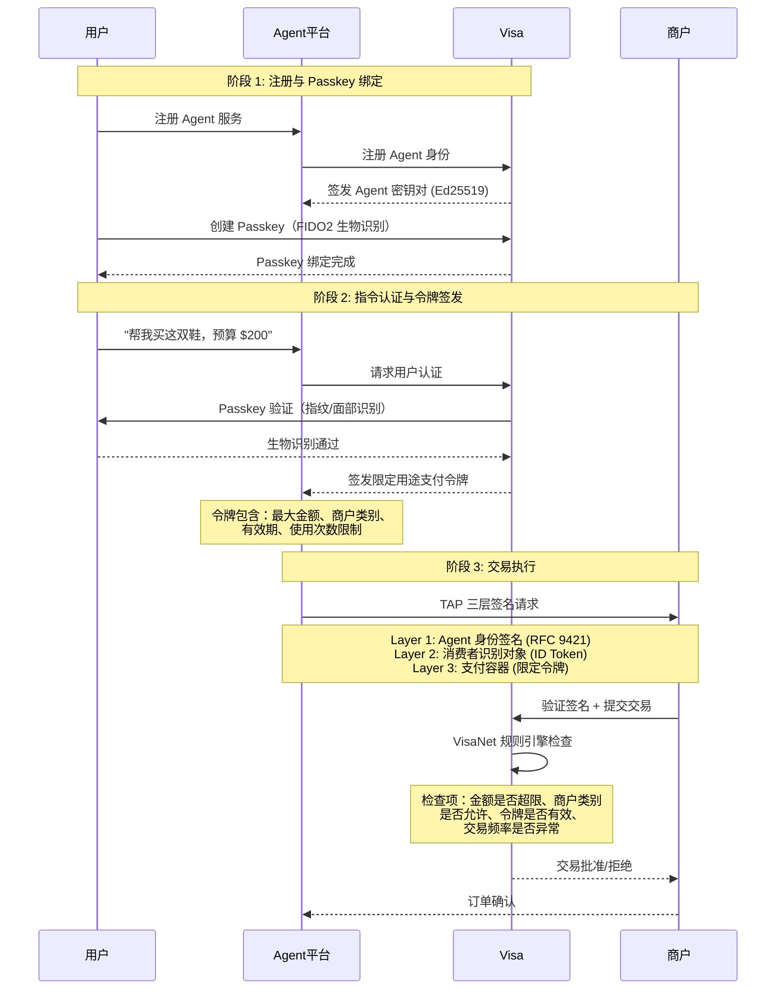
```mermaid
sequenceDiagram
    participant 用户
    participant Agent平台
    participant Visa
    participant 商户
    
    Note over 用户,Visa: 阶段 1: 注册与 Passkey 绑定
    用户->>Agent平台: 注册 Agent 服务
    Agent平台->>Visa: 注册 Agent 身份
    Visa-->>Agent平台: 签发 Agent 密钥对 (Ed25519)
    用户->>Visa: 创建 Passkey（FIDO2 生物识别）
    Visa-->>用户: Passkey 绑定完成
    
    Note over 用户,商户: 阶段 2: 指令认证与令牌签发
    用户->>Agent平台: "帮我买这双鞋，预算 $200"
    Agent平台->>Visa: 请求用户认证
    Visa->>用户: Passkey 验证（指纹/面部识别）
    用户-->>Visa: 生物识别通过
    Visa-->>Agent平台: 签发限定用途支付令牌
    Note over Agent平台: 令牌包含：最大金额、商户类别、<br/>有效期、使用次数限制
    
    Note over Agent平台,商户: 阶段 3: 交易执行
    Agent平台->>商户: TAP 三层签名请求
    Note over Agent平台,商户: Layer 1: Agent 身份签名 (RFC 9421)<br/>Layer 2: 消费者识别对象 (ID Token)<br/>Layer 3: 支付容器 (限定令牌)
    商户->>Visa: 验证签名 + 提交交易
    Visa->>Visa: VisaNet 规则引擎检查
    Note over Visa: 检查项：金额是否超限、商户类别<br/>是否允许、令牌是否有效、<br/>交易频率是否异常
    Visa-->>商户: 交易批准/拒绝
    商户-->>Agent平台: 订单确认
```

#### 五大安全机制

| 机制 | 说明 | 技术实现 |
|------|------|---------|
| Passkey 认证 | 用户通过生物识别（指纹/面部）确认授权意图 | FIDO2/WebAuthn 标准，私钥存储在用户设备安全芯片中 |
| Agent 专属令牌 | 为每个 Agent 签发独立的加密密钥对 | Ed25519 签名算法，公钥注册在 Visa Key Store |
| 指令认证 | 每次支付指令都需要用户明确确认 | Passkey 挑战-响应，防止 Agent 未经授权自行发起交易 |
| 限定用途支付令牌 | 支付凭证带有严格约束条件 | 金额上限、商户类别白名单、有效期、单次/多次使用 |
| VisaNet 规则引擎 | 网络层面的最终安全屏障 | 实时风控规则：金额、频率、地理位置、商户类别等多维度检查 |

#### Visa 的核心理念

Visa 将 Agent 视为"数字代理人"而非"数字钱包"——Agent 持有的不是支付卡本身，而是一个受严格约束的"委托书"。即使 Agent 被攻破，攻击者也只能在预设的金额、商户和时间范围内操作。

---

### 7.3 Mastercard Agent Pay 授权流程

Mastercard 的方案强调"Agent 必须先注册、再验证、才能交易"，采用预注册 + Agentic Token + 用户控制的三重保障。

#### 完整授权链路

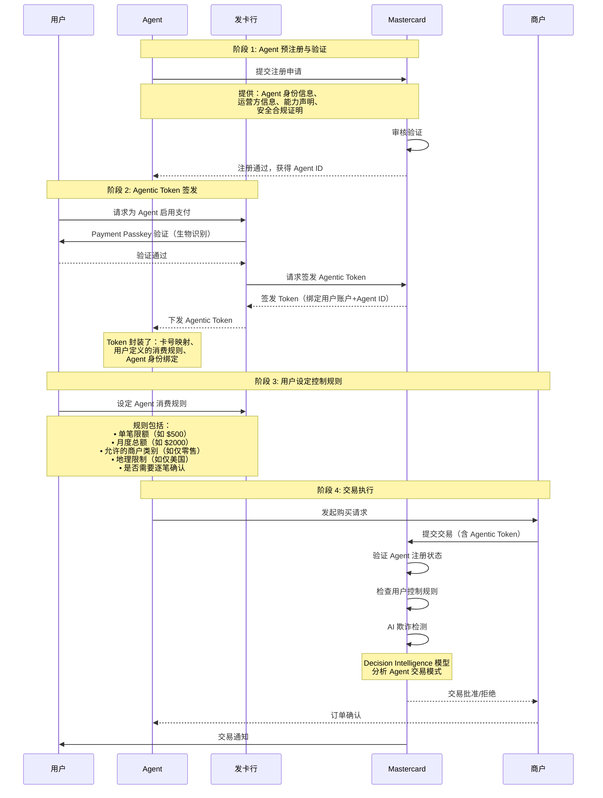
```mermaid
sequenceDiagram
    participant 用户
    participant Agent
    participant 发卡行
    participant Mastercard
    participant 商户
    
    Note over Agent,Mastercard: 阶段 1: Agent 预注册与验证
    Agent->>Mastercard: 提交注册申请
    Note over Agent,Mastercard: 提供：Agent 身份信息、<br/>运营方信息、能力声明、<br/>安全合规证明
    Mastercard->>Mastercard: 审核验证
    Mastercard-->>Agent: 注册通过，获得 Agent ID
    
    Note over 用户,发卡行: 阶段 2: Agentic Token 签发
    用户->>发卡行: 请求为 Agent 启用支付
    发卡行->>用户: Payment Passkey 验证（生物识别）
    用户-->>发卡行: 验证通过
    发卡行->>Mastercard: 请求签发 Agentic Token
    Mastercard-->>发卡行: 签发 Token（绑定用户账户+Agent ID）
    发卡行-->>Agent: 下发 Agentic Token
    Note over Agent: Token 封装了：卡号映射、<br/>用户定义的消费规则、<br/>Agent 身份绑定
    
    Note over 用户,商户: 阶段 3: 用户设定控制规则
    用户->>发卡行: 设定 Agent 消费规则
    Note over 用户,发卡行: 规则包括：<br/>• 单笔限额（如 $500）<br/>• 月度总额（如 $2000）<br/>• 允许的商户类别（如仅零售）<br/>• 地理限制（如仅美国）<br/>• 是否需要逐笔确认
    
    Note over Agent,商户: 阶段 4: 交易执行
    Agent->>商户: 发起购买请求
    商户->>Mastercard: 提交交易（含 Agentic Token）
    Mastercard->>Mastercard: 验证 Agent 注册状态
    Mastercard->>Mastercard: 检查用户控制规则
    Mastercard->>Mastercard: AI 欺诈检测
    Note over Mastercard: Decision Intelligence 模型<br/>分析 Agent 交易模式
    Mastercard-->>商户: 交易批准/拒绝
    商户-->>Agent: 订单确认
    Mastercard->>用户: 交易通知
```

#### 四大安全支柱

| 支柱 | 说明 | 实现方式 |
|------|------|---------|
| Agent 预注册 | 只有经过 Mastercard 审核的 Agent 才能参与交易 | 注册审核流程，验证 Agent 运营方资质和安全能力 |
| Agentic Token | 专为 Agent 设计的支付令牌，基于现有 tokenization 扩展 | Token 封装卡号映射 + Agent ID 绑定 + 用户规则，不暴露真实卡号 |
| 用户定义控制 | 用户通过发卡行 App 精细控制 Agent 的消费权限 | 金额限制、商户类别、地理围栏、时间窗口、逐笔审批开关 |
| Payment Passkey | 基于 FIDO 标准的生物识别认证 | 与 FIDO Alliance 合作，支持指纹、面部识别，替代传统密码和 OTP |

#### 生态合作伙伴

Mastercard 已与多方合作推进 Agent Pay 落地：

| 合作方 | 角色 |
|--------|------|
| Citi、US Bank | 首批发卡行，持卡人已可启用 Agent 支付 |
| IBM watsonx | AI Agent 平台集成 |
| Microsoft Azure OpenAI | AI Agent 平台集成 |
| Checkout.com | 收单侧 Agent Pay 支持 |
| Braintree (PayPal) | 收单侧 Agent Pay 支持 |
| FIDO Alliance | Payment Passkey 标准共建 |

---

### 7.4 AP2 Mandate 授权机制

AP2 的授权设计最为精细，采用两步 Mandate（授权委托）模型，区分"意图授权"和"购买授权"，并支持"人在场"和"人不在场"两种模式。

#### 两步 Mandate 模型

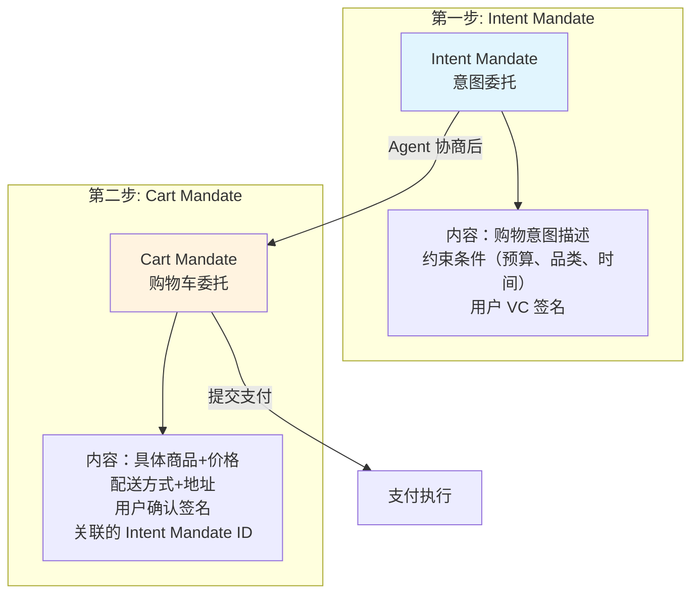
```mermaid
flowchart TD
    subgraph 第一步: Intent Mandate
        IM[Intent Mandate<br/>意图委托]
        IM_C[内容：购物意图描述<br/>约束条件（预算、品类、时间）<br/>用户 VC 签名]
        IM --> IM_C
    end
    
    subgraph 第二步: Cart Mandate
        CM[Cart Mandate<br/>购物车委托]
        CM_C[内容：具体商品+价格<br/>配送方式+地址<br/>用户确认签名<br/>关联的 Intent Mandate ID]
        CM --> CM_C
    end
    
    IM -->|Agent 协商后| CM
    CM -->|提交支付| PAY[支付执行]
    
    style IM fill:#e1f5fe
    style CM fill:#fff3e0
```

#### 两种授权模式

| 模式 | 场景 | Intent Mandate | Cart Mandate |
|------|------|---------------|-------------|
| Human-Present（人在场） | 用户实时参与购物 | 用户实时签署 | Agent 生成后，用户确认签署 |
| Human-Absent（人不在场） | 用户预设规则后离开 | 用户预先签署（含自动执行规则） | Agent 按预设规则自动签署 |

Human-Absent 模式的关键约束：
- Intent Mandate 必须包含明确的自动执行条件（如"价格低于 $X 时自动购买"）
- Cart Mandate 的生成必须严格符合 Intent Mandate 中的约束
- 完整审计链确保事后可追溯

#### Verifiable Credential (VC) 签名机制

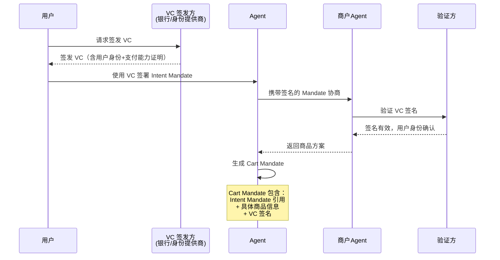
```mermaid
sequenceDiagram
    participant 用户
    participant VC签发方 as VC 签发方<br/>(银行/身份提供商)
    participant Agent
    participant 商户Agent
    participant 验证方
    
    用户->>VC签发方: 请求签发 VC
    VC签发方-->>用户: 签发 VC（含用户身份+支付能力证明）
    用户->>Agent: 使用 VC 签署 Intent Mandate
    Agent->>商户Agent: 携带签名的 Mandate 协商
    商户Agent->>验证方: 验证 VC 签名
    验证方-->>商户Agent: 签名有效，用户身份确认
    商户Agent-->>Agent: 返回商品方案
    Agent->>Agent: 生成 Cart Mandate
    Note over Agent: Cart Mandate 包含：<br/>Intent Mandate 引用<br/>+ 具体商品信息<br/>+ VC 签名
```

VC 的核心价值：
- **不可否认性**：用户无法否认曾授权 Agent 执行操作
- **可验证性**：任何参与方都可独立验证签名的真实性
- **隐私保护**：VC 可选择性披露信息（如只证明"年龄 > 18"而不暴露具体生日）

---

### 7.5 ACP Delegated Payment 授权机制

ACP 的授权模型相对简洁，聚焦于"一次性委托支付令牌"。

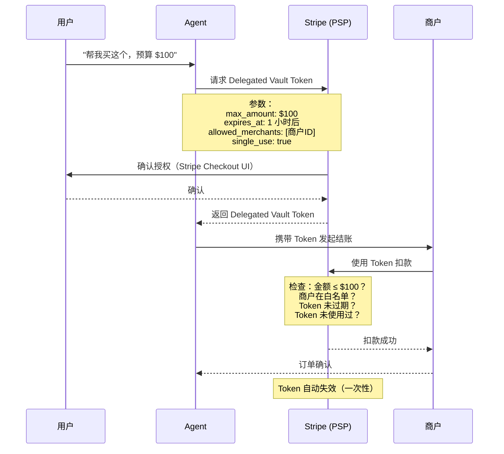
```mermaid
sequenceDiagram
    participant 用户
    participant Agent
    participant Stripe as Stripe (PSP)
    participant 商户
    
    用户->>Agent: "帮我买这个，预算 $100"
    Agent->>Stripe: 请求 Delegated Vault Token
    Note over Agent,Stripe: 参数：<br/>max_amount: $100<br/>expires_at: 1 小时后<br/>allowed_merchants: [商户ID]<br/>single_use: true
    Stripe->>用户: 确认授权（Stripe Checkout UI）
    用户-->>Stripe: 确认
    Stripe-->>Agent: 返回 Delegated Vault Token
    Agent->>商户: 携带 Token 发起结账
    商户->>Stripe: 使用 Token 扣款
    Note over Stripe: 检查：金额 ≤ $100？<br/>商户在白名单？<br/>Token 未过期？<br/>Token 未使用过？
    Stripe-->>商户: 扣款成功
    商户-->>Agent: 订单确认
    Note over Stripe: Token 自动失效（一次性）
```

安全特性：
- 一次性令牌：用后即毁，无法重复使用
- 金额上限：Agent 无法超额消费
- 时间限定：过期自动失效
- 商户限定：只能在指定商户使用
- PCI DSS 合规：真实卡号从不暴露给 Agent 或商户

---

### 7.6 各方案授权认证对比

| 维度 | Visa (TAP) | Mastercard (Agent Pay) | AP2 (Mandate) | ACP (Delegated Payment) |
|------|-----------|----------------------|---------------|------------------------|
| 用户授权方式 | Passkey (FIDO2) 生物识别 | Payment Passkey (FIDO) 生物识别 | Verifiable Credential 签名 | Stripe Checkout UI 确认 |
| Agent 身份验证 | Ed25519 密钥对 + Visa Key Store | 预注册审核 + Agent ID | A2A Agent Card + VC | 无独立 Agent 身份层 |
| 支付凭证类型 | 限定用途支付令牌 | Agentic Token（封装卡号映射） | 支付方式无关（由支付网络决定） | Delegated Vault Token（一次性） |
| 用户控制粒度 | 金额、商户类别、有效期 | 金额、商户类别、地理、时间、逐笔审批 | Intent/Cart Mandate 约束条件 | 金额、商户、有效期、单次使用 |
| 人不在场支持 | 支持（预设规则） | 支持（用户定义控制规则） | 原生支持（Human-Absent Mandate） | 有限（需预先获取 Token） |
| 审计追踪 | TAP 签名链 | Mastercard 网络日志 | Mandate 链（Intent → Cart → Payment） | Stripe 交易日志 |
| 欺诈检测 | VisaNet 规则引擎 | Decision Intelligence AI 模型 | 依赖底层支付网络 | Stripe Radar |
| 标准依赖 | RFC 9421, FIDO2, OpenID Connect | FIDO Alliance, Tokenization | W3C Verifiable Credentials | PCI DSS |

#### 关键洞察

1. **Visa 和 Mastercard 殊途同归**：两者都采用"Agent 身份验证 + 限定令牌 + 用户生物识别"的三重保障，但 Visa 更偏向开放标准（RFC 9421），Mastercard 更偏向中心化注册审核。

2. **AP2 最具前瞻性**：两步 Mandate 模型和 VC 签名提供了最完整的授权语义和审计能力，但基础设施建设成本最高。

3. **ACP 最务实**：利用 Stripe 现有的支付基础设施，快速实现了可用的委托支付，但授权模型相对简单，不支持复杂的多步授权场景。

4. **生物识别成为共识**：Visa (Passkey)、Mastercard (Payment Passkey) 和 FIDO Alliance 的合作表明，生物识别将成为 Agent 支付授权的标准用户确认方式，替代传统的密码和 OTP。

---

## 8. 实现逻辑 (Implementation Logic)

### 协议间关系与协作

```mermaid
graph LR
    subgraph 开放协议
        A2A[A2A<br/>Agent间通信] --> AP2[AP2<br/>信任与授权]
        MCP[MCP<br/>模型上下文] --> AP2
        AP2 --> x402[x402<br/>链上结算]
        ACP[ACP<br/>结账编排] --> PSP[传统PSP结算]
    end
    
    subgraph 卡组织框架
        VIC[Visa Intelligent<br/>Commerce] --> 卡网络
        MAP[Mastercard<br/>Agent Pay] --> 卡网络
    end
    
    AP2 -.兼容.-> VIC
    AP2 -.兼容.-> MAP
    ACP -.可集成.-> VIC
    ACP -.可集成.-> MAP
```

三大协议并非竞争关系，而是 Agentic Commerce 技术栈的不同层次：

| 层次 | 协议 | 职责 |
|------|------|------|
| 商务编排层 | ACP | 结账流程、商品发现、购物车管理 |
| 信任授权层 | AP2 | 身份验证、授权委托、审计追踪 |
| 结算执行层 | x402 | 链上即时支付、微支付 |
| 支付网络层 | Visa/Mastercard | Agent 验证、代币化、风控 |

一个大型企业可能同时使用：ACP 处理 Agent 购物结账，AP2 管理内部治理和审计，x402 处理机器间数据访问付费。

### Visa Intelligent Commerce 实现逻辑

```mermaid
flowchart TD
    A[AI Agent 平台] --> B[Visa MCP Server]
    B --> C{Agent 身份验证}
    C -->|TAP 加密签名| D[Visa Intelligent Commerce API]
    D --> E[商品发现与比价]
    D --> F[个性化推荐]
    D --> G[交易控制与限额]
    D --> H[支付执行]
    H --> I[1.5亿+ Visa 受理商户]
    D --> J[争议处理]
```

- 通过 MCP Server 让开发者快速接入 Visa API
- Trusted Agent Protocol (TAP) 为每个 Agent 提供唯一加密签名
- 100+ 合作伙伴，30+ 正在积极构建应用
- 美国试点合作伙伴：Skyfire、Nekuda、PayOS、Ramp
- 2026 年初亚太和欧洲试点启动

### Mastercard Agent Pay 实现逻辑

```mermaid
flowchart TD
    A[AI Agent] --> B{Agent 注册与验证}
    B -->|通过| C[获取 Agentic Token]
    C --> D[Agent Pay Acceptance Framework]
    D --> E[商户验证 Agent 身份]
    E --> F[用户意图确认]
    F --> G[Tokenized 支付执行]
    G --> H[Mastercard 网络]
    
    B -->|未通过| X[拒绝交易]
```

- Agent 必须预注册并通过 Mastercard 验证才能交易
- Agentic Token 基于现有 tokenization 能力扩展
- Citi 和 US Bank 持卡人已启用，2025 年底覆盖全美 Mastercard 持卡人
- 与 FIDO Alliance 合作推进可验证凭证标准
- 提供 Agentic Consulting Services 帮助发卡行、收单行、商户快速接入

## 9. 生态与社区 (Ecosystem & Community)

### 各协议生态对比

| 维度 | ACP | AP2 | x402 |
|------|-----|-----|------|
| 主导方 | OpenAI + Stripe | Google | Coinbase |
| 合作伙伴数 | 未公开（Stripe 商户生态） | 60+ 组织 | Cloudflare 联合创立 Foundation |
| 开源协议 | Apache 2.0 | Apache 2.0 | 开源（GitHub） |
| 生产状态 | 已上线（ChatGPT Checkout） | 早期采用阶段 | 开发者实验阶段→规模化 |
| 成熟度 | growing | early-stage | growing |
| GitHub | [agenticcommerce.pro](https://agenticcommerce.pro) | [Google AP2 Repo](https://cloud.google.com/blog/products/ai-machine-learning/announcing-agents-to-payments-ap2-protocol/) | [x402 on GitHub](https://docs.base.org/base-app/agents/x402-agents) |

### AP2 核心合作伙伴（部分）

- **支付网络**：Mastercard、JCB、UnionPay International
- **支付服务商**：Adyen、PayPal、Worldpay、Checkout.com、Revolut
- **科技巨头**：Salesforce、ServiceNow、Adobe、Dell
- **Web3**：Coinbase、MetaMask、Mysten Labs (Sui)、Ethereum Foundation
- **咨询**：Accenture、Deloitte、PwC
- **商户**：Etsy、Shopee、Global Fashion Group
- **金融科技**：Airwallex、DLocal、Ebanx、Intuit

### 行业参与格局

```mermaid
graph TD
    subgraph Google 阵营
        AP2_G[AP2 协议]
        A2A_G[A2A 协议]
        UCP[Universal Commerce Protocol]
    end
    
    subgraph OpenAI 阵营
        ACP_O[ACP 协议]
        CGP[ChatGPT Checkout]
    end
    
    subgraph 支付巨头 - 多方参与
        Visa[Visa] -.-> AP2_G
        Visa -.-> UCP
        MC[Mastercard] -.-> AP2_G
        PayPal[PayPal] -.-> AP2_G
        Stripe[Stripe] --> ACP_O
        Adyen[Adyen] -.-> AP2_G
    end
    
    subgraph Web3
        CB[Coinbase] --> x402_C[x402]
        CB -.-> AP2_G
        x402_C -.-> AP2_G
    end
```


## 10. 优劣势与竞品对比 (Pros, Cons & Comparison)

### 三大协议全面对比

| 维度 | ACP (OpenAI+Stripe) | AP2 (Google) | x402 (Coinbase) |
|------|---------------------|--------------|------------------|
| 核心定位 | 结账流程编排 | 信任与授权框架 | 链上即时结算 |
| 解决的问题 | Agent 如何完成购买 | Agent 如何证明授权 | Agent 如何即时付款 |
| 支付方式 | 传统支付（卡、钱包） | 支付方式无关（全支持） | 加密货币（稳定币为主） |
| 技术基础 | RESTful API / MCP Server | A2A + MCP 扩展 + VC | HTTP 402 状态码 |
| 商户改造成本 | 低（保留现有 Stripe 集成） | 中（需实现 Mandate 验证） | 低（HTTP 层原生支持） |
| 适用场景 | 电商购物、订阅 | 跨平台复杂交易、B2B | 微支付、API 按次付费 |
| 去中心化程度 | 低（依赖 Stripe） | 中（开放但需 VC 基础设施） | 高（链上结算） |
| 生产就绪度 | ✅ 已上线 | ⚠️ 早期采用 | ⚠️ 规模化中 |
| 合规友好度 | 高（走传统支付通道） | 高（内置审计链） | 中（加密货币监管不确定） |

### 卡组织框架对比

| 维度 | Visa Intelligent Commerce | Mastercard Agent Pay |
|------|--------------------------|---------------------|
| 核心机制 | TAP 加密签名 + MCP Server | Agent 注册验证 + Agentic Token |
| 覆盖范围 | 1.5 亿+ 受理商户 | 全球 Mastercard 网络 |
| 开发者工具 | MCP Server、Agent Acceptance Toolkit | Agent Pay Acceptance Framework |
| 试点状态 | 美国试点中，亚太/欧洲 2026 初 | 美国已上线（Citi、US Bank） |
| 标准合作 | Google Universal Commerce Protocol | FIDO Alliance 可验证凭证 |
| 与开放协议关系 | 兼容 AP2、ACP | 兼容 AP2 |

### 各方案优劣势

**ACP 优势**：生产就绪、商户改造成本低、走传统支付通道合规性好
**ACP 劣势**：对 Stripe 有一定依赖、不原生支持加密支付、授权模型相对简单

**AP2 优势**：最完整的信任框架、支付方式无关、60+ 合作伙伴生态最广
**AP2 劣势**：尚处早期采用阶段、Mandate/VC 基础设施需要建设、实现复杂度较高

**x402 优势**：极简设计、无需注册、天然适合微支付和 M2M 场景
**x402 劣势**：依赖加密货币基础设施、监管不确定性、不处理完整商务生命周期

## 11. 行业分析与市场展望 (Industry Analysis & Market Outlook)

> 本章综合 McKinsey、AWS 及行业公开材料，从市场规模、商业模式变革、信任与风险、货币化策略等维度分析 Agentic Commerce 的行业趋势。Content was rephrased for compliance with licensing restrictions.

### 11.1 市场规模与增长预测

Agentic Commerce 正处于从概念验证到规模化落地的关键转折点。多方数据指向一个共同结论：**AI Agent 驱动的商务交易将成为下一个万亿级市场**。

| 指标 | 数据 | 来源 |
|------|------|------|
| 经济价值潜力 | **$3-5 万亿** | McKinsey 2025 |
| AI 驱动商务交易规模（2030） | **$5000 亿** | 行业综合预测 |
| Z 世代在 AI 中启动购物的比例 | **51%** | AWS re:Invent IND386 |
| x402 协议累计交易笔数 | **1500 万+** | Coinbase/Base 2026.01 |
| AP2 合作伙伴数量 | **60+** | Google 2025.09 |
| Visa 受理商户覆盖 | **1.5 亿+** | Visa 2025 |

```mermaid
graph LR
    subgraph "2024-2025：概念验证期"
        P1["协议发布<br/>ACP / AP2 / x402"]
        P2["试点启动<br/>ChatGPT Checkout<br/>Visa 亚太试点"]
    end
    
    subgraph "2026-2027：早期采用期"
        P3["标准融合<br/>UCP 统一框架"]
        P4["生态扩展<br/>商户接入加速"]
    end
    
    subgraph "2028-2030：规模化期"
        P5["主流采用<br/>$5000亿交易规模"]
        P6["新商业模式<br/>Agent 经济成熟"]
    end
    
    P1 --> P2 --> P3 --> P4 --> P5 --> P6
```

### 11.2 从 UX 到 AX：商业范式转换

Agentic Commerce 推动的不仅是技术升级，更是一场从 **UX（User Experience，用户体验）到 AX（Agent Experience，Agent 体验）** 的根本性商业范式转换。

```mermaid
graph TB
    subgraph "UX 时代（传统电商）"
        U1["人类浏览商品页面"]
        U2["人类比较价格"]
        U3["人类点击购买按钮"]
        U4["人类输入支付信息"]
        U1 --> U2 --> U3 --> U4
    end
    
    subgraph "AX 时代（Agentic Commerce）"
        A1["Agent 通过 API/MCP 发现商品"]
        A2["Agent 跨平台自动比价"]
        A3["Agent 按预设规则自动购买"]
        A4["Agent 通过协议完成支付"]
        A1 --> A2 --> A3 --> A4
    end
    
    U1 -.->|"范式转换"| A1
```

**核心变化**：

| 维度 | UX 时代 | AX 时代 |
|------|---------|---------|
| 产品发现 | SEO（搜索引擎优化） | AEO（Answer Engine Optimization，答案引擎优化） |
| 购买决策 | 人类主观判断 | Agent 基于规则和数据的自动决策 |
| 交互界面 | 网页/App UI | API / MCP / A2A 协议接口 |
| 品牌忠诚度 | 人类对品牌的情感认同 | Agent 对结构化数据和评分的偏好 |
| 客户获取 | 广告投放、流量购买 | Agent 可发现性、协议兼容性 |
| 转化漏斗 | 浏览 → 加购 → 结账 → 支付 | 意图 → 发现 → 确认 → 自动执行 |

**AEO（Answer Engine Optimization）** 是 AX 时代的 "SEO"。当消费者越来越多地通过 AI Agent 而非搜索引擎发现产品时，商户需要确保自己的产品数据对 Agent 友好——这意味着结构化的语义元数据、标准化的 API 接口、以及与主流 Agent 协议的兼容性。

### 11.3 商户六大关键领域

McKinsey 提出了商户在 Agentic Commerce 时代需要 **创新（Innovation）或改造（Renovation）** 的六大关键领域：

```mermaid
graph TB
    subgraph "需要创新的领域（全新构建）"
        I1["① 客户参与与产品发现<br/>Agent 可发现的语义化商品目录<br/>实时意图识别与验证"]
        I2["② 客户关系与忠诚度<br/>超个性化 Agent 触发的优惠<br/>持久化客户上下文层"]
        I3["③ 支付与欺诈检测<br/>Agent 身份认证与授权<br/>实时欺诈评分与信任注册"]
    end
    
    subgraph "需要改造的领域（升级现有系统）"
        R1["④ 核心商务平台<br/>Agent 可执行的结构化交易<br/>动态定价与库存感知推荐"]
        R2["⑤ 门店服务<br/>数字-物理旅程同步<br/>空间计算与店内导航"]
        R3["⑥ 履约与退货<br/>自动化履约决策<br/>多承运商模块化连接"]
    end
    
    style I1 fill:#e3f2fd
    style I2 fill:#e3f2fd
    style I3 fill:#e3f2fd
    style R1 fill:#fff3e0
    style R2 fill:#fff3e0
    style R3 fill:#fff3e0
```

**三种 Agent 交互模式**：

每个领域都涉及三种 Agent 交互模式，复杂度递增：

| 模式 | 说明 | 示例 |
|------|------|------|
| Agent-to-Site | Agent 直接与商户网站/API 交互 | Agent 搜索商品、提交订单、追踪物流 |
| Agent-to-Agent | 消费者 Agent 与商户 Agent 直接通信 | Agent 间协商价格、验证身份、交换偏好 |
| Agent-to-Broker Agent | 通过中间 Broker Agent 跨多个商户协调 | 比价 Agent 聚合多家报价、忠诚度积分跨品牌兑换 |

### 11.4 信任模型：五维框架

信任是 Agentic Commerce 规模化的最大瓶颈。McKinsey 提出了 **五维信任模型**，从不同角度定义了 Agent 商务中信任的构成要素：

```mermaid
graph TB
    CENTER["Agentic Commerce<br/>信任"]
    
    CENTER --> D1["① Know Your Agent (KYA)<br/>了解你的 Agent"]
    CENTER --> D2["② Put Humans at Center<br/>以人为中心"]
    CENTER --> D3["③ Embrace Transparency<br/>拥抱透明"]
    CENTER --> D4["④ Secure Everyone's Data<br/>保护数据安全"]
    CENTER --> D5["⑤ Govern Responsibly<br/>负责任治理"]
    
    D1 --> E1["Agent 身份验证<br/>能力声明<br/>行为历史"]
    D2 --> E2["用户始终可控<br/>人类覆盖机制<br/>分级授权"]
    D3 --> E3["决策可解释<br/>审计日志<br/>实时通知"]
    D4 --> E4["数据主权<br/>加密传输<br/>最小权限"]
    D5 --> E5["合规框架<br/>跨境治理<br/>责任归属"]
```

**信任的地域差异**：

信任是高度文化相关的。在德国和日本等市场，消费者更偏好发票和 BNPL（先买后付）等强调控制和透明的支付方式，账户间转账在德国电商支付中占 26%。在这些市场，将购买决策委托给 AI Agent 面临更大的信任障碍。相比之下，韩国和中国等数字支付高度普及的市场，消费者对 Agent 代理购物的接受度可能更高。

**信任不是一次性协议，而是持续互动中建立的**。用户应能随时询问"我的数据如何被使用？"、"这个选择对我意味着什么？"，并能定义信任的边界。同意（Consent）不能是一个复选框，而必须是一个活的、灵活的协议。

### 11.5 风险图谱：三大核心风险

```mermaid
graph TB
    RISK["Agentic Commerce<br/>风险图谱"]
    
    RISK --> R1["系统性风险<br/>Systemic Risk"]
    RISK --> R2["责任归属风险<br/>Accountability Risk"]
    RISK --> R3["数据主权风险<br/>Data Sovereignty Risk"]
    
    R1 --> R1D["单个错误提示触发级联故障<br/>Agent 间互联放大错误影响<br/>需要优雅降级和回滚机制"]
    R2 --> R2D["AI 决策失误的责任归属不清<br/>平台 vs 品牌 vs 用户的责任边界<br/>EU AI Act 提供部分框架<br/>美国监管碎片化"]
    R3 --> R3D["跨境数据流动的合规挑战<br/>印度、法国推进数据本地化<br/>欧洲呼吁 AI 主权<br/>全球标准化尚未形成"]
    
    style R1 fill:#ffcdd2
    style R2 fill:#fff9c4
    style R3 fill:#c8e6c9
```

**系统性风险（雪球效应）**：自主 Agent 不仅是接口，更是决策者。规模化决策引入系统性风险——一个错误的提示可能触发一连串意外后果：错误预订的航班、过量订购的库存、未经同意的购买。当 Agent 跨多个系统互联时，小错误可能产生指数级影响。关键设计原则：Agent 是否能优雅降级？是否能回滚？如何修复非人类错误造成的声誉损害？

**责任归属（法律灰色地带）**：当 AI Agent 做出错误决策时，责任归属复杂。开发模型的平台？部署 Agent 的品牌？批准操作的用户？目前没有全球共识。EU AI Act 为高风险系统提供了部分框架，但执行仍在演进中。美国碎片化的监管让企业在责任真空中摸索。可解释性（Explainability）可能成为消费者权利，可审计日志可能成为监管要求。

**数据主权（地缘政治挑战）**：AI Agent 基于数据运行，数据主权问题日益地缘政治化。如果 Agent 通过美国 API 处理欧盟公民数据，是否合规？如果 Agent 基于全球数据训练但在本地行动，是否合法？OpenAI 的 "for countries" 模式（提供本地化基础设施和监管灵活性）凸显了在不违反各国数据保护、税收和消费者保护法的前提下扩展 Agent 平台的挑战。

### 11.6 货币化策略：新商业模式

Agentic Commerce 在威胁传统收入流（尤其是广告收入）的同时，也催生了全新的货币化模式：

```mermaid
graph TB
    subgraph "传统收入流（受威胁）"
        T1["搜索广告"]
        T2["展示广告"]
        T3["零售媒体网络"]
    end
    
    subgraph "新兴货币化模式"
        N1["多品牌捆绑与收入分成"]
        N2["实时协商费"]
        N3["高级 Agent 技能订阅"]
        N4["数据洞察与分析销售"]
        N5["对话式市场"]
        N6["Agent 间协议费"]
        N7["情境赞助"]
        N8["赞助式智能推荐"]
    end
    
    T1 & T2 & T3 -.->|"被替代"| N1 & N2 & N3 & N4 & N5 & N6 & N7 & N8
```

**八大新兴货币化模式**：

| 模式 | 说明 | 示例 |
|------|------|------|
| 多品牌捆绑与收入分成 | Agent 跨品牌协调购买，打包成无缝体验，各方按比例分成 | 蜜月套餐：Agent 整合机票、酒店、餐饮，协调平台收取服务费 |
| 实时协商费 | Agent 代表用户实时协商（升舱、积分兑换等），平台收取成功费 | 航空公司在 Agent 成功协商座位升级时支付费用 |
| 高级 Agent 技能订阅 | 垂直领域 Agent（时尚造型师、高端旅行规划师）通过订阅或分级访问变现 | 前沿实验室或第三方开发者提供付费 Agent 技能 |
| 数据洞察与分析销售 | 品牌付费获取匿名化的 Agent 过滤消费者行为分析 | 产品考虑/拒绝数据、价格敏感度、竞品比较 |
| 对话式市场 | Agent 演变为对话式市场，购买决策通过对话完成 | 市场所有者通过品牌上架费、销售佣金、支付处理费变现 |
| Agent 间协议费 | 不同平台的 Agent 交互时，通过协议层费用或佣金分成变现 | 跨平台 Agent 协作创造联合价值时的分润 |
| 情境赞助 | 品牌赞助与可穿戴设备、汽车、智能家居集成的情境体验 | Tesla 付费成为 AI 规划旅行的默认电动车提供商 |
| 赞助式智能推荐 | 与用户意图对齐的微妙"赞助智能建议"，前提是 Agent 保持公正性 | 在不损害用户信任的前提下，品牌为上下文相关的推荐付费 |

**先发优势**：率先行动的企业有机会定义这些定价模型，利用当前 Agent 通常免费、提供商尚未形成清晰收入策略的货币化空白期。

### 11.7 AI Bot 货币化三阶段模型

从商户视角，应对 AI Agent 流量的策略可以分为三个递进阶段：

```mermaid
graph LR
    subgraph "阶段1：识别 Identify"
        I1["区分人类 vs Bot vs Agent"]
        I2["Bot 评分与指纹识别"]
        I3["自适应验证挑战"]
    end
    
    subgraph "阶段2：控制 Control"
        C1["差异化访问策略"]
        C2["速率限制与配额"]
        C3["内容分级与权限"]
    end
    
    subgraph "阶段3：货币化 Monetize"
        M1["按次付费 API"]
        M2["订阅与分级访问"]
        M3["协议原生支付<br/>x402 / ACP"]
    end
    
    I1 & I2 & I3 -->|"知道谁在访问"| C1 & C2 & C3
    C1 & C2 & C3 -->|"控制如何访问"| M1 & M2 & M3
```

这三个阶段对应了不同的技术栈需求：

| 阶段 | 核心问题 | 技术方案 | 相关协议/标准 |
|------|---------|---------|-------------|
| 识别 | 谁在访问我的网站？ | Bot Scoring、行为指纹、RFC 9421 签名验证 | TAP (Visa)、Cloudflare Web Bot Auth |
| 控制 | 允许什么级别的访问？ | WAF 规则、速率限制、内容分级策略 | robots.txt 扩展、Agent Card 能力声明 |
| 货币化 | 如何从 Agent 流量获利？ | 付费 API、订阅模式、协议原生支付 | x402 (HTTP 402)、ACP (Stripe)、AP2 |

### 11.8 竞争格局与阵营分化

Agentic Payment 领域已形成明显的阵营分化，各方围绕不同的技术路线和商业利益展开竞合：

```mermaid
graph TB
    subgraph "Google 阵营：开放标准主导"
        G1["A2A — Agent 间通信"]
        G2["AP2 — 支付信任"]
        G3["UCP — 全旅程商务"]
        G1 --> G2 --> G3
    end
    
    subgraph "OpenAI + Stripe 阵营：务实落地"
        O1["ACP — 结账编排"]
        O2["ChatGPT Checkout — 已上线"]
    end
    
    subgraph "Web3 阵营：去中心化"
        W1["x402 — 链上结算"]
        W2["稳定币支付"]
    end
    
    subgraph "卡组织：嵌入现有网络"
        V1["Visa TAP + MCP Server"]
        M1["Mastercard Agent Pay + Token"]
    end
    
    subgraph "Amazon：双重角色"
        A1["Buy for Me — 封闭零售"]
        A2["AWS AgentCore — 开放云"]
    end
    
    G2 -.->|"兼容"| V1 & M1
    O1 -.->|"可集成"| V1 & M1
    W1 -.->|"扩展"| G2
```

**关键观察**：

1. **没有赢家通吃**：不同协议解决不同层次的问题（结账 vs 信任 vs 结算），更可能走向互补而非替代
2. **Google 生态最广**：AP2 的 60+ 合作伙伴覆盖支付网络、PSP、科技巨头、Web3，但落地最慢
3. **OpenAI 落地最快**：ChatGPT Checkout 已在生产环境运行，但生态相对封闭（依赖 Stripe）
4. **卡组织是关键变量**：Visa 和 Mastercard 的态度决定了 Agent 支付能否进入主流消费场景，两者都选择了"兼容多协议"的策略
5. **Amazon 的矛盾**：零售业务（Buy for Me）倾向封闭，云业务（AWS AgentCore）倾向开放，这种张力将持续存在

### 11.9 未来展望

```mermaid
timeline
    title Agentic Commerce 演进路线图
    2025 : 协议发布与试点
         : ACP/AP2/x402 发布
         : Visa/Mastercard 框架上线
         : ChatGPT Checkout 上线
    2026 : 标准融合与生态扩展
         : UCP 统一框架推进
         : AgentCore Gateway 商户接入
         : 跨协议互操作性改善
    2027 : 早期规模化
         : Agent 支付进入主流消费场景
         : 监管框架逐步明确
         : 新货币化模式验证
    2028-2030 : 成熟期
              : $5000亿交易规模
              : Agent 经济生态成熟
              : 全球标准化完成
```

**短期（2026）**：协议标准融合加速，UCP 作为统一框架整合 A2A、MCP、AP2；商户通过 AgentCore 等网关低成本接入；Bot 识别与 Agent 认证基础设施完善。

**中期（2027-2028）**：Agent 支付进入主流消费场景；监管框架（EU AI Act 执行、美国联邦立法）逐步明确；新货币化模式（Agent 间协议费、对话式市场）得到验证；跨境 Agent 商务的数据主权问题开始有解决方案。

**长期（2029-2030）**：AI Agent 成为主要的商务交互界面之一；$5000 亿交易规模目标可期；Agent 经济生态成熟，形成新的价值分配格局；"设计 Agent 体验" 成为与 "设计用户体验" 同等重要的商业能力。

> 材料来源：McKinsey "The Agentic Commerce Opportunity" 研究报告（2025.10）、AWS re:Invent IND386 演讲、AWS 内部 Agentic Commerce Position Paper（2025.11.06）、Chéng Chen AI Agentic e-Commerce 演讲材料。Content was rephrased for compliance with licensing restrictions.

## 12. 快速上手 (Getting Started)

### ACP — 商户接入

参考 Stripe 官方文档：[docs.stripe.com/agentic-commerce/protocol](https://docs.stripe.com/agentic-commerce/protocol)

核心步骤：
1. 实现 ACP 定义的 RESTful 端点（商品发现、结账创建、支付确认）
2. 或部署为 MCP Server 供 Agent 调用
3. 使用 Stripe 处理支付

### AP2 — 开发者接入

参考 Google 公开 GitHub 仓库，包含完整技术规范和参考实现。

核心步骤：
1. 理解 Mandate 数据结构（Intent Mandate / Cart Mandate）
2. 实现 Verifiable Credential 签发与验证
3. 集成到现有 A2A 或 MCP 工作流

### x402 — 开发者接入

参考 Base 文档：[docs.base.org/base-app/agents/x402-agents](https://docs.base.org/base-app/agents/x402-agents)

核心步骤：
1. 服务端：对需付费的端点返回 HTTP 402 + 支付信息
2. 客户端：解析 402 响应，完成链上支付，携带支付证明重新请求
3. 使用 x402 SDK 简化集成

### Visa Intelligent Commerce

参考 Visa 开发者门户，使用 MCP Server 接入 Visa API。

### Mastercard Agent Pay

商户通过 Agent Pay Acceptance Framework 注册，发卡行通过 Agentic Token 启用持卡人。

## 13. AWS 在 Agentic Payment 中的角色与价值

> 本章基于 AWS 内部材料、re:Invent 演讲及公开博客综合分析，阐述 AWS 云服务在 Agentic Commerce 技术栈中的定位、核心产品能力及落地方案。

### 13.1 从 UX 到 AX：范式转换中的 AWS 定位

Agentic Commerce 正在推动一场从 **UX（User Experience）到 AX（Agent Experience）** 的根本性范式转换。传统电商围绕人类用户设计界面和交互流程，而 Agentic Commerce 要求商户为 AI Agent 提供结构化、可编程的交互接口。

```mermaid
graph LR
    subgraph "传统 UX 时代"
        A[人类用户] --> B[浏览器/App]
        B --> C[网页/UI]
        C --> D[商户系统]
    end
    subgraph "AX 时代"
        E[人类用户] --> F[AI Agent]
        F --> G[MCP/API 接口]
        G --> H[AgentCore Gateway]
        H --> I[商户系统]
    end
    style F fill:#FF9900,color:#000
    style H fill:#FF9900,color:#000
```

**市场规模**：McKinsey 预测 Agentic Commerce 将创造 **$3-5 万亿** 经济价值；51% 的 Z 世代消费者已开始在 AI 中启动购物旅程；到 2030 年 AI 驱动的商务交易预计达 **$5000 亿**。

AWS 在这场转换中扮演 **基础设施提供者** 的角色，通过云服务帮助商户和开发者构建 Agent-ready 的商务系统，而非直接参与支付协议的制定。

### 13.2 核心产品：Amazon Bedrock AgentCore Gateway

**AgentCore Gateway** 是 AWS 在 Agentic Commerce 领域的核心产品，定位为连接 AI Agent 与商户后端系统的统一网关。

```mermaid
graph TB
    subgraph "AI Agent 层"
        A1[Claude Agent]
        A2[Nova Agent]
        A3[第三方 Agent]
    end
    
    subgraph "Amazon Bedrock AgentCore Gateway"
        GW[统一网关入口]
        TD[智能工具发现<br/>Tool Discovery]
        AUTH[OAuth / Cognito 认证]
        OBS[可观测性<br/>CloudWatch 集成]
        CONV[协议转换层]
    end
    
    subgraph "商户后端"
        API[现有 REST API]
        LAMBDA[Lambda 函数]
        MCP_S[MCP Server]
        LEGACY[遗留系统]
    end
    
    A1 & A2 & A3 --> GW
    GW --> TD
    GW --> AUTH
    GW --> OBS
    TD --> CONV
    CONV --> API
    CONV --> LAMBDA
    CONV --> MCP_S
    CONV --> LEGACY
    
    style GW fill:#FF9900,color:#000
    style TD fill:#FF9900,color:#000
    style AUTH fill:#FF9900,color:#000
    style OBS fill:#FF9900,color:#000
    style CONV fill:#FF9900,color:#000
```

**AgentCore Gateway 四大核心能力**：

| 能力 | 说明 | 价值 |
|------|------|------|
| 简化工具开发 | 将现有 OpenAPI Spec 自动转换为 MCP 兼容工具 | 商户无需重写后端，复用现有 API |
| 安全统一访问 | 集成 Amazon Cognito 提供 OAuth 认证 | Agent 身份验证、权限控制、审计追踪 |
| 智能工具发现 | Agent 可动态发现可用工具和能力 | 支持 ACP、AP2 等多协议的工具注册与发现 |
| 可观测性 | 原生集成 CloudWatch | 实时监控 Agent 调用链、延迟、错误率 |

**商户接入流程（4 步）**：

```mermaid
graph LR
    S1["① 准备 OpenAPI Spec<br/>描述现有 API"] --> S2["② 配置认证<br/>Cognito OAuth 设置"]
    S2 --> S3["③ 部署到 AgentCore Gateway<br/>自动转换为 MCP 工具"]
    S3 --> S4["④ 连接 Agent<br/>Agent 发现并调用工具"]
    
    style S1 fill:#232F3E,color:#fff
    style S2 fill:#232F3E,color:#fff
    style S3 fill:#FF9900,color:#000
    style S4 fill:#232F3E,color:#fff
```

### 13.3 AWS WAF：Agentic 时代的 Bot 识别层

在 Agentic Commerce 中，一个关键挑战是 **区分善意 Agent 和恶意 Bot**。AWS WAF 正在演进以应对这一挑战。

**AI Bot 货币化三阶段模型**（识别 → 控制 → 支付）：

```mermaid
graph LR
    subgraph "阶段1：识别 Identify"
        I1[Bot Scoring 评分]
        I2[Bot Fingerprinting BFP]
        I3[Adaptive Challenge 自适应挑战]
    end
    
    subgraph "阶段2：控制 Control"
        C1[差异化访问策略]
        C2[速率限制]
        C3[内容分级]
    end
    
    subgraph "阶段3：支付 Monetize"
        P1[按次付费 API]
        P2[订阅模式]
        P3[x402 / ACP 集成]
    end
    
    I1 & I2 & I3 --> C1 & C2 & C3
    C1 & C2 & C3 --> P1 & P2 & P3
    
    style I1 fill:#FF9900,color:#000
    style I2 fill:#FF9900,color:#000
    style I3 fill:#FF9900,color:#000
```

**AWS WAF 2026 规划能力**：

| 能力 | 说明 | 与 Agentic Payment 的关系 |
|------|------|--------------------------|
| Bot Scoring | 对每个请求进行 Bot 概率评分（0-100） | 区分合法 Agent（如 OpenAI Operator）和爬虫 |
| Bot Fingerprinting (BFP) | 基于行为特征的 Bot 指纹识别 | 识别 Agent 身份，为差异化定价提供基础 |
| Adaptive Challenge | 根据风险等级动态调整验证方式 | 对高风险 Agent 请求增加验证，低风险放行 |

**与行业标准的关系**：AWS WAF 的 Bot 识别能力与 Cloudflare 的 Web Bot Authentication、RFC 9421 HTTP Message Signatures 等标准形成互补，共同构建 Agent 身份验证的基础设施层。

### 13.4 AI 模型层：Bedrock + Nova + Claude

AWS 通过 Amazon Bedrock 提供驱动 Agentic Commerce 的 AI 模型能力：

```mermaid
graph TB
    subgraph "Amazon Bedrock 模型层"
        NOVA[Amazon Nova<br/>AWS 自研模型]
        CLAUDE[Anthropic Claude<br/>推理与对话]
        OTHERS[其他模型<br/>Llama, Mistral 等]
    end
    
    subgraph "Agent 能力"
        REASON[意图理解与推理]
        PLAN[购物计划生成]
        NEGO[价格比较与协商]
        EXEC[交易执行]
    end
    
    subgraph "Agentic Commerce 场景"
        SHOP[智能购物助手]
        COMPARE[跨平台比价]
        CHECKOUT[自动结账]
        RETURN[退换货处理]
    end
    
    NOVA & CLAUDE & OTHERS --> REASON & PLAN & NEGO & EXEC
    REASON & PLAN & NEGO & EXEC --> SHOP & COMPARE & CHECKOUT & RETURN
    
    style NOVA fill:#FF9900,color:#000
    style CLAUDE fill:#FF9900,color:#000
```

**Nova Act** 是 AWS 在 Agentic Commerce 中的重要工具，支持 Agent 在浏览器环境中执行操作（如填写表单、点击按钮），是实现 Outbound Agent（代表消费者主动去商户网站购物）的关键技术。

### 13.5 零售商四问框架：AWS 的 Agentic Commerce 战略指导

AWS 内部为零售客户提供了一个 **四问框架**，帮助商户制定 Agentic Commerce 策略：

```mermaid
graph TB
    Q["零售商 Agentic Commerce<br/>四大关键问题"]
    
    Q --> Q1["❶ 如何让 Agent 发现我的产品？<br/>Answer Engine Optimization (AEO)"]
    Q --> Q2["❷ 如何让 Agent 完成结账？<br/>Checkout Strategy"]
    Q --> Q3["❸ 如何派出自己的 Agent？<br/>Outbound Agent Strategy"]
    Q --> Q4["❹ 如何在站内部署 Agent？<br/>Onsite Agent Strategy"]
    
    Q1 --> A1["AWS 方案：AEO Salesplay<br/>+ 合作伙伴生态"]
    Q2 --> A2["AWS 方案：AgentCore Gateway<br/>支持 ACP/AP2/MCP"]
    Q3 --> A3["AWS 方案：ACP + MCP<br/>+ Nova Act"]
    Q4 --> A4["AWS 方案：Shopping Assistant Demo<br/>+ GenAIIC 支持"]
    
    style Q fill:#232F3E,color:#fff
    style A1 fill:#FF9900,color:#000
    style A2 fill:#FF9900,color:#000
    style A3 fill:#FF9900,color:#000
    style A4 fill:#FF9900,color:#000
```

| 问题 | 场景 | AWS 解决方案 | 关键技术 |
|------|------|-------------|---------|
| ❶ Agent 如何发现我？ | Agent 代替搜索引擎成为产品发现入口 | AEO Salesplay + 合作伙伴 | 结构化产品数据、语义元数据 |
| ❷ Agent 如何结账？ | 支持多种 Agentic 支付协议 | AgentCore Gateway | OpenAPI → MCP 转换、Cognito OAuth |
| ❸ 如何派出自己的 Agent？ | 商户主动派 Agent 去其他平台购物/比价 | ACP + MCP + Nova Act | Bedrock Agent、浏览器自动化 |
| ❹ 站内 Agent 体验？ | 在自有网站/App 中部署购物助手 | Shopping Assistant Demo + GenAIIC | Bedrock、RAG、个性化推荐 |

### 13.6 合作伙伴生态

AWS 在 Agentic Payment 领域构建了多层次的合作伙伴生态：

```mermaid
graph TB
    subgraph "支付网络合作"
        VISA["Visa<br/>Bedrock AgentCore 集成<br/>Intelligent Commerce"]
        MC["Mastercard<br/>Agent Pay 生态"]
    end
    
    subgraph "安全合作伙伴"
        DD["DataDome<br/>Bot 检测与管理"]
        TB["TollBit<br/>AI 内容货币化"]
    end
    
    subgraph "支付基础设施"
        SF["SkyFire<br/>Agent 支付中间件"]
        STRIPE["Stripe<br/>ACP 协议"]
    end
    
    AWS_CENTER["AWS<br/>Bedrock AgentCore<br/>+ WAF + CloudWatch"]
    
    VISA & MC --> AWS_CENTER
    DD & TB --> AWS_CENTER
    SF & STRIPE --> AWS_CENTER
    
    style AWS_CENTER fill:#FF9900,color:#000
```

**重点合作案例**：
- **Visa + AWS**：Visa 在 Amazon Bedrock AgentCore 上构建 Intelligent Commerce 解决方案，使 Agent 可通过 MCP Server 安全调用 Visa 的 1.5 亿+ 受理商户网络
- **DataDome**：在 AWS WAF 之上提供高级 Bot 管理能力，区分合法 Agent 和恶意 Bot
- **TollBit**：帮助内容提供商对 AI Agent 的内容消费进行货币化
- **SkyFire**：提供 Agent 支付中间件，支持 Agent 自主完成支付

### 13.7 AWS 的双重角色：零售 vs 云

AWS 在 Agentic Commerce 中存在一个独特的 **双重角色** 张力：

```mermaid
graph TB
    subgraph "Amazon 零售（封闭生态）"
        BFM["Buy for Me<br/>封闭式 Agent 购物"]
        RUFUS["Rufus<br/>站内购物助手"]
        AMZN["Amazon.com<br/>自有电商平台"]
    end
    
    subgraph "AWS 云（开放基础设施）"
        AC["AgentCore Gateway<br/>开放协议支持"]
        BED["Bedrock<br/>多模型平台"]
        WAF_S["WAF<br/>Bot 管理"]
    end
    
    TENSION["角色张力"]
    
    BFM & RUFUS & AMZN --> TENSION
    AC & BED & WAF_S --> TENSION
    
    style TENSION fill:#d32f2f,color:#fff
    style BFM fill:#232F3E,color:#fff
    style AC fill:#FF9900,color:#000
```

| 维度 | Amazon 零售 | AWS 云 |
|------|------------|--------|
| 策略 | 封闭生态，用户留在 Amazon 内 | 开放平台，支持所有商户 |
| Agent 定位 | Buy for Me — Amazon 自己的 Agent | AgentCore — 帮客户构建自己的 Agent |
| 支付协议 | 不公开，使用 Amazon Pay | 支持 ACP、AP2、MCP 等开放协议 |
| 竞争关系 | 与其他零售商竞争 | 为所有零售商提供基础设施 |
| 数据策略 | 数据留在 Amazon 生态内 | 客户拥有自己的数据 |

这种双重角色类似于 Amazon 在电商领域的 "既是平台又是卖家" 模式。对于 AWS 客户而言，关键是理解 **AWS 云服务是协议中立的基础设施**，不绑定特定支付协议，商户可以自由选择 ACP、AP2 或其他方案。

### 13.8 AWS Agentic Commerce 技术栈全景

综合以上分析，AWS 在 Agentic Payment 中的完整技术栈如下：

```mermaid
graph TB
    subgraph "Agent 层"
        AGENT["AI Agent<br/>(Bedrock Agent / 第三方)"]
    end
    
    subgraph "协议层"
        ACP_P["ACP<br/>(Stripe)"]
        AP2_P["AP2<br/>(Google)"]
        MCP_P["MCP<br/>(Anthropic)"]
        X402["x402<br/>(Coinbase)"]
    end
    
    subgraph "AWS 网关层"
        AGC["AgentCore Gateway<br/>协议转换 · 工具发现 · 认证"]
    end
    
    subgraph "AWS 安全层"
        WAF_F["AWS WAF<br/>Bot Scoring · BFP · Adaptive Challenge"]
        COG["Amazon Cognito<br/>OAuth · 身份管理"]
        IAM_F["AWS IAM<br/>权限控制"]
    end
    
    subgraph "AWS AI 层"
        BED_F["Amazon Bedrock<br/>Nova · Claude · Llama"]
        NA["Nova Act<br/>浏览器自动化"]
    end
    
    subgraph "AWS 基础设施层"
        LAMBDA_F["Lambda<br/>无服务器计算"]
        CW["CloudWatch<br/>监控与可观测性"]
        APIGW["API Gateway<br/>API 管理"]
    end
    
    subgraph "商户后端"
        MERCHANT["商户系统<br/>商品 · 库存 · 订单 · 支付"]
    end
    
    AGENT --> ACP_P & AP2_P & MCP_P & X402
    ACP_P & AP2_P & MCP_P & X402 --> AGC
    AGC --> WAF_F
    AGC --> COG
    WAF_F --> LAMBDA_F
    COG --> IAM_F
    BED_F --> AGENT
    NA --> AGENT
    LAMBDA_F --> MERCHANT
    CW --> AGC
    APIGW --> LAMBDA_F
    
    style AGC fill:#FF9900,color:#000
    style WAF_F fill:#FF9900,color:#000
    style COG fill:#FF9900,color:#000
    style BED_F fill:#FF9900,color:#000
    style NA fill:#FF9900,color:#000
    style LAMBDA_F fill:#FF9900,color:#000
    style CW fill:#FF9900,color:#000
    style APIGW fill:#FF9900,color:#000
    style IAM_F fill:#FF9900,color:#000
```

### 13.9 AWS 服务与行业框架映射

> 行业六大关键领域和五维信任模型的详细分析见第 11 章。本节聚焦 AWS 服务如何对应这些框架。

**六大关键领域的 AWS 服务映射**：

| 领域 | AWS 相关服务 |
|------|-------------|
| 客户参与与产品发现 | Bedrock、AgentCore、Personalize |
| 客户关系与忠诚度 | DynamoDB、Bedrock、API Gateway |
| 核心商务平台 | AgentCore Gateway、Lambda |
| 支付与欺诈检测 | WAF、Cognito、Fraud Detector |
| 门店服务 | IoT、Location Service |
| 履约与退货 | Step Functions、Lambda |

**五维信任模型的 AWS 服务映射**：

| 信任维度 | AWS 服务 |
|---------|---------|
| Know Your Agent (KYA) | WAF Bot Scoring + Cognito 身份验证 |
| Put Humans at Center | Bedrock Guardrails (Human-in-the-loop) |
| Embrace Transparency | CloudWatch 审计日志 + CloudTrail |
| Secure Everyone's Data | KMS 加密 + IAM 权限控制 |
| Govern Responsibly | AWS Config + Security Hub |

### 13.10 小结

AWS 在 Agentic Payment 生态中的价值可以用三个关键词概括：

1. **协议中立**：AgentCore Gateway 不绑定特定支付协议，支持 ACP、AP2、MCP 等多种标准，让商户自由选择
2. **降低门槛**：通过 OpenAPI → MCP 自动转换、Cognito 认证集成、CloudWatch 监控，将商户接入 Agentic Commerce 的成本从 "重建系统" 降低到 "配置网关"
3. **安全可信**：WAF Bot 识别 + Cognito 身份验证 + IAM 权限控制 + CloudTrail 审计，构建完整的 Agent 信任基础设施

> 材料来源：AWS re:Invent IND386 演讲（Aditya Pendyala & Martin Sakowski）、AWS 内部 Agentic Commerce Position Paper（2025.11.06）、Chéng Chen AI Agentic e-Commerce 演讲材料、McKinsey Agentic Commerce 研究报告（2025.10）、Visa on AWS Bedrock AgentCore 博客。Content was rephrased for compliance with licensing restrictions.

## 14. 来源 (Sources)

### 官方文档
- [Google AP2 官方公告](https://cloud.google.com/blog/products/ai-machine-learning/announcing-agents-to-payments-ap2-protocol/)
- [Google UCP 技术博客](https://developers.googleblog.com/under-the-hood-universal-commerce-protocol-ucp/)
- [Stripe ACP 文档](https://docs.stripe.com/agentic-commerce/protocol)
- [Stripe ACP 规范](https://docs.stripe.com/agentic-commerce/protocol/specification)
- [ACP 官方站点](https://agenticcommerce.pro/docs/what-is-acp/)
- [ACP Checkout 规范](https://agentic-commerce-protocol.com/docs/commerce/specs/checkout)
- [Visa TAP 技术规范](https://developer.visa.com/capabilities/trusted-agent-protocol/trusted-agent-protocol-specifications)
- [Visa TAP 开发者文档](https://developer.visa.com/capabilities/trusted-agent-protocol/docs)
- [Visa TAP 用例](https://developer.visa.com/use-cases/trusted-agent-protocol)
- [PayPal AP2 开发者博客](https://developer.paypal.com/community/blog/PayPal-Agent-Payments-Protocol/)
- [Visa Intelligent Commerce](https://corporate.visa.com/en/sites/visa-perspectives/innovation/visa-mcp-server-agent-acceptance-toolkit.html)
- [Visa 完成安全 AI 交易公告](https://corporate.visa.com/en/sites/visa-perspectives/newsroom/visa-partners-complete-secure-agentic-transactions.html)
- [Mastercard Agent Pay](https://www.mastercard.com/global/en/business/artificial-intelligence/mastercard-agent-pay.html)
- [Mastercard Agentic Commerce Framework](https://www.mastercard.com/global/en/news-and-trends/stories/2025/agentic-commerce-framework.html)
- [Base x402 开发文档](https://docs.base.org/base-app/agents/x402-agents)
- [Visa on AWS - Bedrock AgentCore 集成](https://aws.amazon.com/blogs/machine-learning/introducing-visa-intelligent-commerce-on-aws-enabling-agentic-commerce-with-amazon-bedrock-agentcore/)

### 行业分析
- [McKinsey: The Agentic Commerce Opportunity (2025.10)](https://www.mckinsey.com/capabilities/growth-marketing-and-sales/our-insights/the-agentic-commerce-opportunity)
- [Orium: ACP, AP2, x402 对比分析](https://orium.com/blog/agentic-payments-acp-ap2-x402)
- [AltexSoft: Google UCP 详解](https://www.altexsoft.com/blog/universal-commerce-protocol/)
- [Grid Dynamics: AP2 vs ACP 与 AI 支付处理的未来](https://www.griddynamics.com/blog/agentic-payments)
- [Chainstack: Agentic Payments 全景](https://chainstack.com/the-agentic-payments-landscape/)
- [Gr4vy: 2026 年商户 Agentic Payment 指南](https://gr4vy.com/posts/agentic-payments-in-2026-what-merchants-need-to-understand-and-prepare-for/)
- [AIMultiple: Agentic Payments 工具与用例](https://research.aimultiple.com/agentic-payments)
- [Crossmint: Agentic Payment 标准指南](https://blog.crossmint.com/agentic-payments-standard/)
- [Finextra: Visa TAP 深度分析](https://www.finextra.com/blogposting/29617/deep-dive-the-role-of-visas-trusted-agent-protocol-in-agentic-commerce)

### 技术深度
- [A2A 协议解析 (Shane De Coninck)](https://shanedeconinck.be/explainers/a2a)
- [A2A 技术架构分析 (Blott)](https://www.blott.com/blog/post/how-the-agent2agent-protocol-a2a-actually-works-a-technical-breakdown)
- [Google A2A 开发者社区](https://discuss.google.dev/t/understanding-a2a-the-protocol-for-agent-collaboration/189103)
- [Colin McNamara: A2A 和 AP2 协议深度解析](https://colinmcnamara.com/blog/understanding-a2a-ap2-protocols-builder-guide)
- [Ken Huang: AP2 安全使用分析](https://kenhuangus.substack.com/p/secure-use-of-the-google-agent-payments)
- [Questflow: 从 A2A 到 AP2 的演进](https://blog.questflow.ai/p/from-a2a-to-ap2-how-agents-learned)
- [OnFinality: x402 完整指南](https://blog.onfinality.io/what-is-x402/)
- [BlockEden: x402 处理 1500 万笔交易](https://blockeden.xyz/blog/2026/01/16/x402-protocol-ai-agent-autonomous-payments-http-402/)

> Content was rephrased for compliance with licensing restrictions. 所有内容均基于公开来源整理，已进行改写和综合分析。
