# 告警风暴解决方案设计

## 一、整体架构设计

### 1.1 架构原则

| 原则 | 说明 | 设计体现 |
|------|------|---------|
| 分层解耦 | 采集、评估、关联、抑制、路由、通知各层独立 | 每层可独立升级和扩展 |
| 事件驱动 | 告警状态变更触发后续处理，非轮询 | EventBridge / Alertmanager Webhook |
| 渐进增强 | 先用原生能力止血，再叠加自定义引擎 | 复合告警 → 关联引擎 → ML 增强 |
| 可观测性 | 告警系统本身也需要被监控 | 关联引擎的处理延迟、抑制率等指标 |

### 1.2 分层架构总览

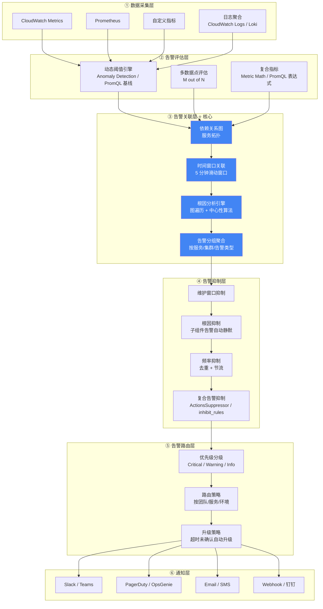

#### 各层职责与实现方式

**② 告警评估层 — "什么时候该告警"**

告警评估层是整个告警链路的第一道过滤器，其业务目标是**从源头减少无效告警的产生**。传统固定阈值告警的核心问题在于：阈值设高了漏报，设低了误报，而且同一个阈值无法适应指标的周期性波动（如白天流量高、夜间流量低）。评估层通过三种机制解决这个问题：

- **动态阈值（Anomaly Detection）**：用机器学习模型学习指标的历史模式，自动生成随时间变化的"正常范围带"，替代人工设定的固定阈值。CloudWatch 原生支持 Anomaly Detection，Prometheus 可通过 PromQL 的 `predict_linear()` 或外挂 Prophet 模型实现类似效果。
- **多数据点评估（M out of N）**：要求最近 N 个评估周期中至少 M 个超阈值才触发，过滤掉单次抖动导致的误报。CloudWatch 通过 `DatapointsToAlarm` 参数原生支持，Prometheus 通过 `for` 持续时间和 PromQL 的 `count_over_time()` 实现。
- **复合指标（Metric Math）**：将多个原始指标通过数学表达式组合为业务语义更明确的派生指标（如错误率 = 5xx / 总请求数），避免对单一指标的片面判断。CloudWatch 支持 Metric Math 表达式，Prometheus 天然支持 PromQL 表达式计算。

评估层的产出是一组**高质量的、已过滤抖动和误报的告警事件**，交给下游的关联层处理。

**③ 告警关联层 — "这些告警之间有什么关系"**

关联层是整个架构的核心，其业务目标是**将大量离散的告警事件关联为少数有意义的故障事件，并识别根因**。没有关联层时，一次数据库故障可能产生 50+ 条告警（DB 连接失败、API 超时、队列积压、前端报错……），运维人员需要逐条排查才能定位根因。关联层通过以下机制将 N 条告警压缩为 1 条根因通知：

- **依赖关系图**：维护服务间的拓扑依赖（如 API → 数据库、API → 缓存），作为根因推断的知识基础。可通过手动配置、CMDB 导入、或 AWS X-Ray / OpenTelemetry 的调用链自动发现来构建。
- **时间窗口关联**：将一定时间窗口内（通常 3-10 分钟）触发的告警视为同一故障事件的组成部分。窗口太短会遗漏级联告警，太长会把不相关的告警错误关联。
- **根因分析引擎**：在依赖图上执行图遍历算法，找出"自身告警但没有上游依赖也在告警"的节点作为根因候选。可结合告警时序、节点中心性等维度进行加权评分。
- **告警分组聚合**：将关联后的告警按服务、集群、告警类型等维度分组，生成结构化的故障摘要。

关联层的实现方式差异较大：CloudWatch 原生的 Composite Alarm 只能处理**静态的、预定义的**关联关系（需要提前写死布尔表达式），无法动态发现关联；要实现动态关联和根因分析，需要自建关联引擎（如 EventBridge + Lambda + DynamoDB）。Prometheus 生态中，Alertmanager 的 `group_by` 提供基础分组能力，但同样不具备依赖图遍历和根因分析能力，需要自建服务扩展。

**④ 告警抑制层 — "哪些告警不需要通知"**

抑制层的业务目标是**在关联分析的基础上，进一步消除冗余通知**。即使关联层已经识别出根因，仍然存在一些场景需要额外的抑制逻辑：

- **维护窗口抑制**：在计划内的变更窗口期间（如每周二凌晨的发布窗口），自动静默相关服务的告警，避免已知变更触发的告警干扰值班人员。CloudWatch 可通过 Composite Alarm 的 `ActionsEnabled` 动态开关实现，Prometheus 通过 Alertmanager 的 `mute_time_intervals` 配置。
- **根因抑制**：当根因告警已触发时，自动抑制其所有下游依赖组件的告警通知。例如数据库宕机时，抑制所有"数据库连接失败"的应用层告警。CloudWatch 通过 `ActionsSuppressor` 实现静态抑制，自建引擎可实现动态抑制。Prometheus 通过 Alertmanager 的 `inhibit_rules` 配置。
- **频率抑制（去重 + 节流）**：对同一告警的重复触发进行去重（如 5 分钟内同一告警只通知一次），对同一服务的告警进行节流（如每小时最多通知 3 次）。Alertmanager 的 `repeat_interval` 和 `group_wait` 提供原生支持，CloudWatch 需要在自建引擎中实现。
- **复合告警抑制**：利用复合告警的布尔逻辑，在规则层面定义抑制关系。例如 `ALARM("App-Error") AND NOT ALARM("DB-Down")` 表示"只有在数据库正常时，应用错误才需要通知"。

抑制层的关键挑战是**避免过度抑制**——抑制规则配置不当可能导致真实告警被静默，因此需要配套的抑制审计日志和定期审查机制。

**⑤ 告警路由层 — "通知谁、用什么方式、什么紧急程度"**

路由层的业务目标是**确保正确的告警以正确的优先级送达正确的人**。经过评估、关联、抑制三层过滤后，剩余的告警都是需要人工介入的有效告警，路由层决定它们的分发策略：

- **优先级分级**：根据告警的影响范围和紧急程度分为 Critical（立即响应）、Warning（限时响应）、Info（知悉即可）等级别。分级依据通常包括：受影响的服务等级（核心交易链路 vs 内部工具）、影响用户数、持续时间等。
- **路由策略**：根据告警的服务归属、环境（生产/预发/测试）、团队等维度，将告警路由到对应的接收方。例如数据库告警发给 DBA 团队，网络告警发给基础设施团队。CloudWatch 通过不同的 SNS Topic 实现路由，Alertmanager 通过 `route` 配置树的 `match` / `match_re` 规则实现。
- **升级策略**：当告警在指定时间内未被确认或处理时，自动升级通知（如 15 分钟未响应从 Slack 升级到电话，30 分钟未响应升级到管理层）。PagerDuty / OpsGenie 等专业 On-Call 平台原生支持多级升级策略，自建方案需要额外开发。

路由层通常不需要自建，成熟的告警平台（PagerDuty、OpsGenie、Alertmanager）都提供了完善的路由和升级能力。重点是**路由规则的设计和维护**——随着团队和服务的变化，路由规则需要持续更新。

### 1.3 AWS 原生方案架构

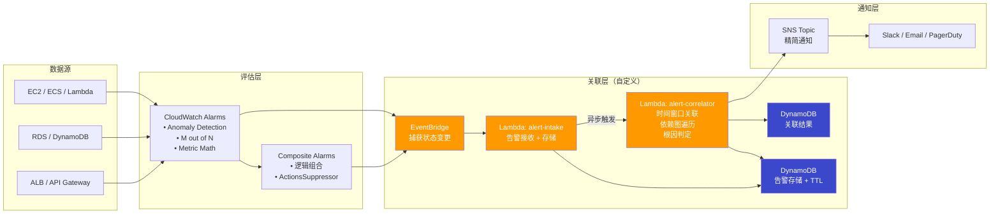

#### 1.3.1 CloudWatch 与自建关联引擎的协同设计

CloudWatch 原生能力和自建关联引擎各自负责不同的层次，通过 EventBridge 事件总线进行衔接。下面详细说明两者的分工、数据流转和组件选型。

**① 职责划分**

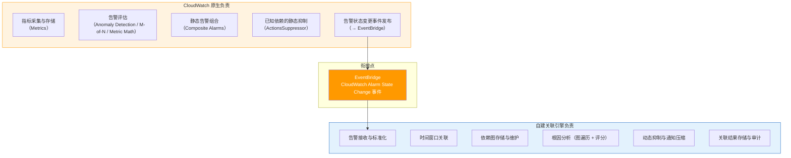

| 层次 | CloudWatch 原生 | 自建关联引擎 | 协同方式 |
|------|----------------|-------------|---------|
| 指标采集 | ✅ CloudWatch Metrics | — | — |
| 告警评估 | ✅ Alarms (阈值/异常/M-of-N) | — | — |
| 静态组合 | ✅ Composite Alarms | — | 已知固定依赖用 Composite 处理 |
| 静态抑制 | ✅ ActionsSuppressor | — | 简单场景直接用原生抑制 |
| 事件发布 | ✅ → EventBridge | — | 所有告警状态变更自动发布 |
| 事件接收 | — | ✅ Lambda: alert-intake | EventBridge Rule 路由到 Lambda |
| 告警存储 | — | ✅ DynamoDB: alert-store | 带 TTL 自动清理 |
| 依赖图存储 | — | ✅ DynamoDB: dependency-graph | 或 S3 JSON（小规模） |
| 时间窗口关联 | — | ✅ Lambda: alert-correlator | 查询窗口内告警 |
| 根因分析 | — | ✅ Lambda: alert-correlator | 图遍历 + 评分算法 |
| 动态抑制 | — | ✅ Lambda: alert-correlator | 根因确定后抑制子组件 |
| 通知压缩 | — | ✅ → SNS | N 条告警 → 1 条摘要 |

**② 端到端数据流**

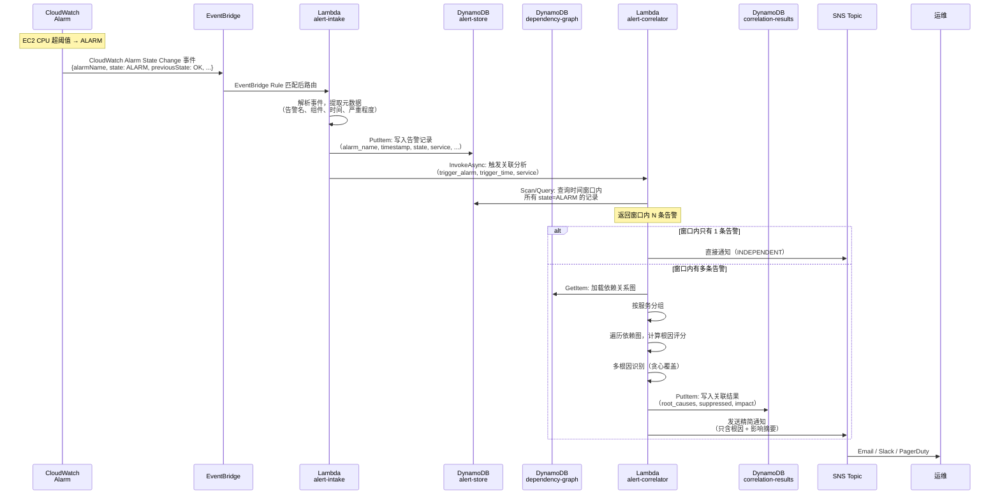

**③ 组件选型与理由**

**EventBridge — 事件总线（衔接层）**

| 维度 | 说明 |
|------|------|
| 为什么选它 | CloudWatch Alarm 状态变更会自动发布到 EventBridge，零配置即可捕获 |
| 替代方案 | SNS（但 SNS 的事件格式不如 EventBridge 丰富，且不支持内容过滤规则） |
| 关键配置 | Rule 匹配 `source: aws.cloudwatch` + `detail-type: CloudWatch Alarm State Change` |
| 容错 | 配置 DLQ（SQS），失败事件自动重试 3 次后进入死信队列 |

**Lambda — 计算引擎（alert-intake + alert-correlator）**

| 维度 | alert-intake | alert-correlator |
|------|-------------|-----------------|
| 职责 | 接收事件、解析、存储、触发关联 | 时间窗口查询、依赖图遍历、根因判定、通知 |
| 触发方式 | EventBridge 同步调用 | alert-intake 异步调用 (InvocationType=Event) |
| 超时 | 30 秒（简单写入） | 60 秒（需要查询 + 图遍历） |
| 内存 | 256 MB | 512 MB（依赖图可能较大） |
| 并发 | 默认（跟随告警量） | 建议设置 Reserved Concurrency = 10，避免风暴时过度并发 |
| 为什么用 Lambda | 事件驱动、按调用付费、无需运维服务器；告警是突发流量，Lambda 自动扩缩 |
| 替代方案 | ECS Fargate Task（适合关联分析耗时 > 15 分钟的超大规模场景） |

> 为什么分成两个 Lambda 而不是一个？
> - **解耦**：intake 是快速写入（< 1 秒），correlator 是重计算（可能 5-30 秒）。分开后 intake 不会被 correlator 阻塞。
> - **重试隔离**：intake 失败只影响单条告警存储；correlator 失败不影响告警接收。
> - **扩缩独立**：风暴时 intake 需要高并发接收，correlator 可以限制并发避免 DynamoDB 热点。

**DynamoDB — 存储层**

| 表 | 用途 | 键设计 | 为什么选 DynamoDB |
|----|------|--------|------------------|
| `alert-store` | 存储原始告警记录 | PK: `alarm_name`, SK: `timestamp` | 高并发写入（风暴时可能 100+ TPS）；TTL 自动清理过期数据；按需计费 |
| `dependency-graph` | 存储服务依赖关系图 | PK: `component_id` | 读多写少；单表即可存储全图；毫秒级读取 |
| `correlation-results` | 存储关联分析结果 | PK: `correlation_id`, SK: `timestamp` | 审计需要；30 天 TTL 自动清理 |

```
alert-store 表结构:
┌──────────────────┬───────────┬────────┬─────────┬──────────┬───────────┐
│ alarm_name (PK)  │ timestamp │ state  │ service │ namespace│ expire_at │
│                  │ (SK)      │        │         │          │ (TTL)     │
├──────────────────┼───────────┼────────┼─────────┼──────────┼───────────┤
│ EC2-CPU-High     │ 1708300800│ ALARM  │ compute │ AWS/EC2  │ 1708905600│
│ RDS-Conn-Failed  │ 1708300815│ ALARM  │ database│ AWS/RDS  │ 1708905615│
└──────────────────┴───────────┴────────┴─────────┴──────────┴───────────┘

GSI: service-time-index (PK: service, SK: timestamp)
→ 支持按服务 + 时间范围查询窗口内告警

dependency-graph 表结构:
┌──────────────────┬──────────────┬──────────┬──────────────────────────┐
│ component_id(PK) │ type         │ severity │ children                 │
├──────────────────┼──────────────┼──────────┼──────────────────────────┤
│ NetworkSwitch    │ infrastructure│ critical │ [Server-01, Server-02, …]│
│ Database-Primary │ database     │ critical │ [App-A, App-B, API-GW]   │
└──────────────────┴──────────────┴──────────┴──────────────────────────┘
```

> **为什么不用 ElastiCache Redis？**
> Redis 查询更快（亚毫秒），但告警关联场景的查询量不大（风暴时每次关联查询 1 次），DynamoDB 的毫秒级延迟完全够用。用 DynamoDB 的好处是全托管、无需管理集群、TTL 自动清理、按需付费。如果环境中已有 Redis 且告警量极大（> 1000 TPS），可以考虑用 Redis 替代 alert-store。

**SNS — 通知层**

| 维度 | 说明 |
|------|------|
| 用途 | 关联引擎输出精简通知 |
| 订阅者 | Email、Slack (via Lambda/ChatBot)、PagerDuty (via HTTPS endpoint) |
| 为什么不直接用 CloudWatch Alarm → SNS | CloudWatch 的 SNS 通知是每条告警独立发送，无法压缩；关联引擎的 SNS 通知是压缩后的摘要 |

**④ 双通道容错设计**

关联引擎是增强层，不能成为告警通知的单点故障。设计上保留两条通知通道：

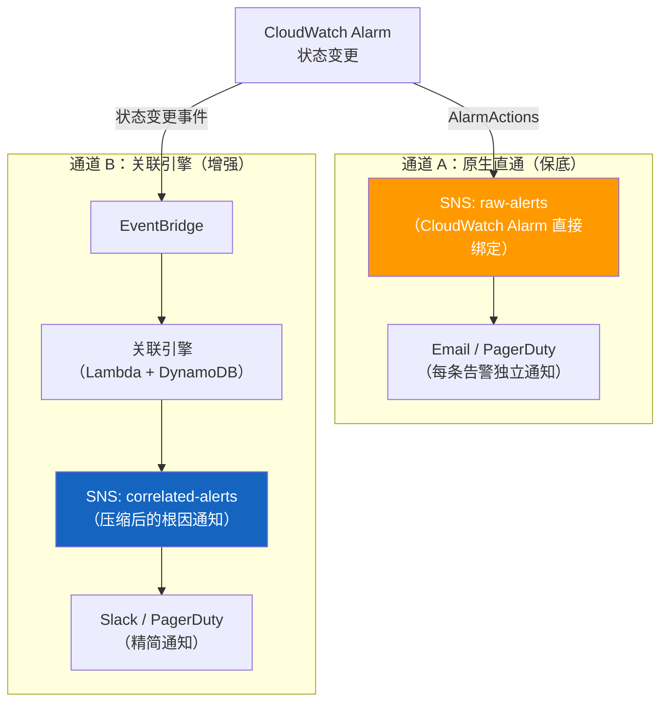

| 通道 | 触发条件 | 通知内容 | 适用场景 |
|------|---------|---------|---------|
| A: 原生直通 | 每条 CloudWatch Alarm 触发 | 原始告警（未压缩） | 关联引擎宕机时的保底通知 |
| B: 关联引擎 | 关联分析完成后 | 根因 + 影响摘要（压缩后） | 正常运行时的主通知通道 |

> 正常情况下运维团队主要关注通道 B（精简通知），通道 A 作为备份可以设置较低优先级（如 Email only）。当关联引擎故障时，通道 A 自动兜底，确保不会漏报。

**⑤ 成本估算**

以一个中等规模环境为例（200 个 CloudWatch Alarm，月均 5 次告警风暴，每次 ~100 条告警）：

| 组件 | 月成本估算 | 计算依据 |
|------|----------|---------|
| EventBridge | ~$0.50 | 500 事件/月 × $1/百万事件 |
| Lambda (intake) | ~$0.10 | 500 次调用 × 256MB × 1s |
| Lambda (correlator) | ~$0.50 | 500 次调用 × 512MB × 10s |
| DynamoDB (alert-store) | ~$1.00 | 按需模式，500 写入 + 2500 读取/月 |
| DynamoDB (dependency-graph) | ~$0.50 | 读多写少，极低用量 |
| DynamoDB (correlation-results) | ~$0.25 | 5 条结果/月 |
| SNS | ~$0.10 | 5 条通知/月 |
| **合计** | **~$3/月** | 非风暴期间几乎零成本 |

> 关联引擎的成本极低，因为它是纯事件驱动架构——没有告警时不产生任何费用。这是选择 Lambda + DynamoDB 而非 ECS + RDS 的核心原因。

### 1.4 Prometheus + Grafana 方案架构

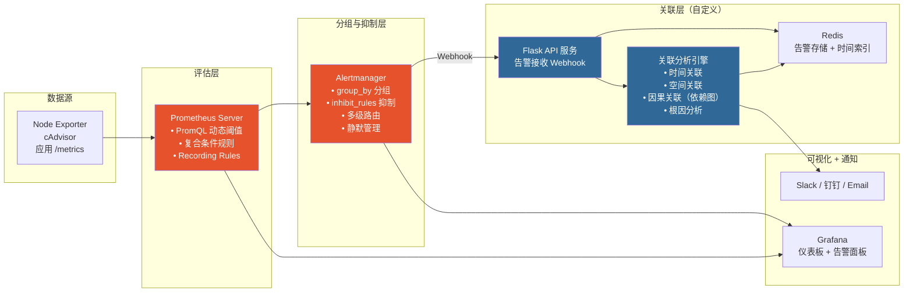

#### 1.4.1 Prometheus + Alertmanager 与自建关联引擎的协同设计

与 CloudWatch 方案类似，Prometheus 生态中也存在"原生能力"与"自建关联引擎"的分工。不同之处在于：Alertmanager 原生的分组和抑制能力比 CloudWatch Composite Alarm 更灵活（基于标签而非硬编码告警名），但同样缺乏动态依赖图遍历和根因分析能力。两者通过 Alertmanager 的 Webhook Receiver 进行衔接。

**① 职责划分**

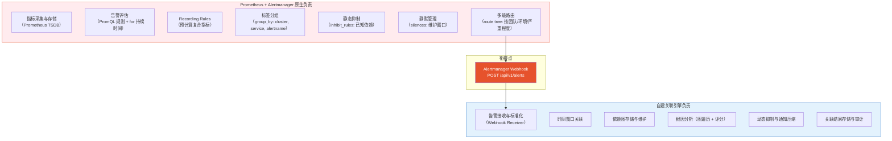

| 层次 | Prometheus + Alertmanager 原生 | 自建关联引擎 | 协同方式 |
|------|-------------------------------|-------------|---------|
| 指标采集 | ✅ Prometheus scrape + Exporter | — | — |
| 告警评估 | ✅ PromQL 规则 + `for` 持续时间 | — | — |
| 复合指标 | ✅ Recording Rules 预计算 | — | — |
| 标签分组 | ✅ `group_by` 按标签聚合 | — | 同 service/cluster 的告警合并为一组 |
| 静态抑制 | ✅ `inhibit_rules` | — | 已知固定依赖用原生抑制 |
| 静默管理 | ✅ `silences` / `mute_time_intervals` | — | 维护窗口直接用原生静默 |
| 多级路由 | ✅ `route` 配置树 | — | 按团队/环境/严重程度路由 |
| 事件发布 | ✅ → Webhook Receiver | — | Alertmanager 将分组后的告警 POST 到引擎 |
| 事件接收 | — | ✅ Flask API: `/webhook/alertmanager` | 解析 Alertmanager 的 JSON payload |
| 告警存储 | — | ✅ Redis: Sorted Set (按时间索引) | TTL 自动过期 |
| 依赖图存储 | — | ✅ Redis Hash / 内存 NetworkX 图 | 或 PostgreSQL（大规模） |
| 时间窗口关联 | — | ✅ 关联引擎 | 查询窗口内告警 |
| 根因分析 | — | ✅ 关联引擎 | 图遍历 + 评分算法 |
| 动态抑制 | — | ✅ 关联引擎 | 根因确定后抑制子组件 |
| 通知压缩 | — | ✅ → Slack / 钉钉 / Email | N 条告警 → 1 条摘要 |

> **与 CloudWatch 方案的关键差异**：Alertmanager 的 `group_by` + `inhibit_rules` 已经提供了比 CloudWatch Composite Alarm 更灵活的分组和抑制能力（基于标签动态匹配，而非硬编码告警名）。因此在 Prometheus 方案中，自建关联引擎主要补充的是**依赖图根因分析**和**跨服务的动态关联**，而非基础的分组和抑制。

**② 端到端数据流**

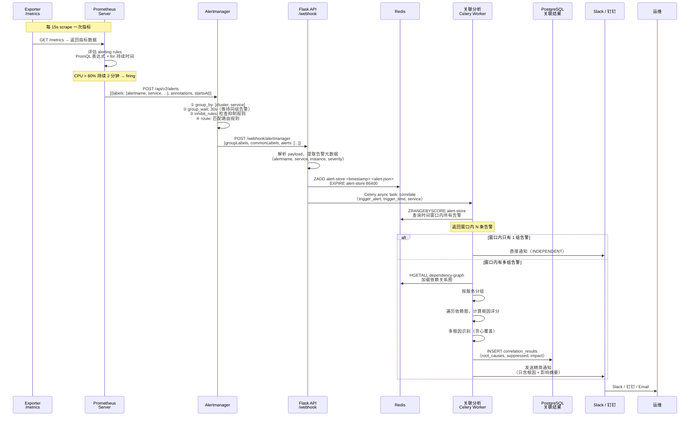

**③ 组件选型与理由**

**Prometheus Server — 指标采集与告警评估**

| 维度 | 说明 |
|------|------|
| 职责 | 指标采集（scrape）、存储（TSDB）、告警规则评估（PromQL） |
| 为什么选它 | 开源标准，生态丰富，PromQL 表达能力远超 CloudWatch Metric Math |
| 告警评估能力 | `for` 持续时间（类似 M-of-N）、PromQL 复合表达式、`predict_linear()` 趋势预测 |
| 局限 | 不提供原生 ML 异常检测（需外挂 Prophet 或自建模型） |
| 高可用 | Thanos / Cortex / VictoriaMetrics 实现长期存储和跨集群联邦 |

**Alertmanager — 分组、抑制、路由**

| 维度 | 说明 |
|------|------|
| 职责 | 告警去重、分组（`group_by`）、抑制（`inhibit_rules`）、静默（`silences`）、路由（`route`） |
| 核心优势 | 基于标签的动态分组和抑制，无需硬编码告警名；多级路由树支持复杂的团队/环境分发 |
| 与 CloudWatch 对比 | `group_by` ≈ Composite Alarm 的 OR 组合，但更灵活；`inhibit_rules` ≈ ActionsSuppressor，但支持标签匹配 |
| 局限 | 分组是静态的（配置时确定 `group_by` 标签），不能动态发现关联；抑制规则也是静态的 |
| 衔接方式 | 通过 `webhook_configs` 将分组后的告警 POST 到自建关联引擎 |

```yaml
# Alertmanager 关键配置示例
route:
  group_by: ['cluster', 'service', 'alertname']
  group_wait: 30s        # 等待同组告警聚合
  group_interval: 5m     # 同组告警重发间隔
  repeat_interval: 4h    # 未恢复告警重复通知间隔
  receiver: 'correlation-engine'  # 默认发送到关联引擎

  routes:
    - match: { severity: critical }
      receiver: 'pagerduty-critical'  # Critical 同时直发 PagerDuty（保底）
      continue: true                   # continue=true 确保也发到关联引擎

receivers:
  - name: 'correlation-engine'
    webhook_configs:
      - url: 'http://correlation-engine:5000/webhook/alertmanager'
        send_resolved: true

  - name: 'pagerduty-critical'
    pagerduty_configs:
      - service_key: '<pagerduty-key>'

inhibit_rules:
  # 已知静态依赖：DB 故障时抑制 App 层告警
  - source_match: { alertname: 'DatabaseDown' }
    target_match: { alertname: 'AppHighErrorRate' }
    equal: ['cluster']  # 同集群内才抑制
```

**Flask API — 告警接收（Webhook Receiver）**

| 维度 | 说明 |
|------|------|
| 职责 | 接收 Alertmanager 的 Webhook POST，解析告警 payload，写入 Redis，触发异步关联分析 |
| 为什么用 Flask | 轻量、Python 生态与关联引擎一致、部署简单 |
| 替代方案 | FastAPI（更高性能，推荐生产环境）、Go gin（更低延迟） |
| 部署方式 | K8s Deployment（2+ 副本）或 Docker Compose |
| 关键接口 | `POST /webhook/alertmanager` — 接收告警；`GET /health` — 健康检查 |

**Redis — 告警存储与依赖图缓存**

| 用途 | 数据结构 | 为什么选 Redis |
|------|---------|---------------|
| 告警存储 | Sorted Set（score = timestamp） | 时间窗口查询天然适合 `ZRANGEBYSCORE`；亚毫秒延迟 |
| 依赖图缓存 | Hash（key = component_id, value = JSON） | 读多写少，内存访问极快 |
| 告警去重 | Set（key = `dedup:{alertname}:{instance}`） | 防止 Alertmanager 重发导致重复处理 |
| 与 DynamoDB 对比 | — | Prometheus 方案通常自建部署，Redis 是自建环境中最常见的高速存储；无需 AWS 依赖 |

```
Redis 数据结构设计:

# 告警存储（Sorted Set，score = 时间戳）
ZADD alert-store 1708300800 '{"alertname":"EC2-CPU-High","service":"compute",...}'
ZADD alert-store 1708300815 '{"alertname":"RDS-Conn-Failed","service":"database",...}'

# 时间窗口查询（5 分钟窗口）
ZRANGEBYSCORE alert-store 1708300500 1708300830
→ 返回窗口内所有告警

# 依赖图（Hash）
HSET dependency-graph NetworkSwitch '{"type":"infrastructure","children":["Server-01","Server-02"]}'
HSET dependency-graph Database-Primary '{"type":"database","children":["App-A","App-B","API-GW"]}'

# 告警去重（Set + TTL）
SADD dedup:EC2-CPU-High:i-0a123 1
EXPIRE dedup:EC2-CPU-High:i-0a123 300
```

**Celery + Redis — 异步任务队列**

| 维度 | 说明 |
|------|------|
| 职责 | 异步执行关联分析任务，避免 Webhook 接口阻塞 |
| 为什么用 Celery | Python 生态标准异步框架；支持任务重试、超时、优先级队列 |
| Broker | Redis（复用已有 Redis，减少组件数） |
| 替代方案 | RQ（更轻量）、Dramatiq（更现代）；大规模场景可用 RabbitMQ 作为 Broker |
| 关键配置 | `task_time_limit = 60s`，`task_soft_time_limit = 45s`，`worker_concurrency = 4` |

**PostgreSQL — 关联结果持久化（可选）**

| 维度 | 说明 |
|------|------|
| 职责 | 存储关联分析结果，用于审计、报表、历史回溯 |
| 为什么用 PostgreSQL | 结构化查询能力强，适合关联结果的多维分析（按时间/服务/根因类型统计） |
| 替代方案 | 直接用 Redis（小规模，不需要长期审计时）；Elasticsearch（需要全文搜索时） |
| 是否必须 | 非必须。小规模环境可以只用 Redis + 日志文件，省去 PostgreSQL 的运维成本 |

**④ 双通道容错设计**

与 CloudWatch 方案的思路一致，关联引擎是增强层，不能成为通知的单点故障：

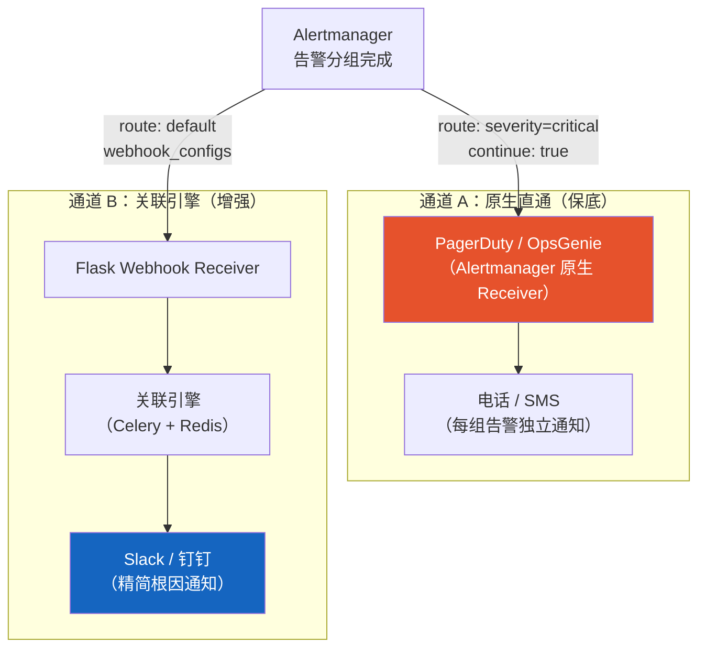

实现要点：

- Alertmanager 的 `route` 配置中，Critical 告警使用 `continue: true`，确保同时发送到原生 Receiver（PagerDuty）和关联引擎
- 关联引擎宕机时，Alertmanager 的 Webhook 发送失败会触发重试（`max_retries`），超过重试次数后告警仍然通过通道 A 送达
- 通道 A 使用 PagerDuty / OpsGenie 等专业 On-Call 平台，自带升级策略和电话通知能力

| 通道 | 触发条件 | 通知内容 | 适用场景 |
|------|---------|---------|---------|
| A: 原生直通 | Alertmanager 分组后直接发送 | 按 `group_by` 分组的告警（未做根因分析） | 关联引擎宕机时的保底；Critical 告警的即时通知 |
| B: 关联引擎 | 关联分析完成后 | 根因 + 影响摘要（压缩后） | 正常运行时的主通知通道 |

**⑤ 成本估算**

Prometheus 方案的成本结构与 CloudWatch 完全不同——没有按调用付费，但需要自建和运维基础设施：

以一个中等规模环境为例（200 个告警规则，月均 5 次告警风暴，K8s 部署）：

| 组件 | 资源需求 | 月成本估算 | 说明 |
|------|---------|----------|------|
| Prometheus Server | 2 vCPU / 4GB RAM | ~$60 | 含 TSDB 存储（30 天保留） |
| Alertmanager | 0.5 vCPU / 512MB RAM (×2) | ~$15 | 高可用双副本 |
| Flask API | 0.5 vCPU / 512MB RAM (×2) | ~$15 | Webhook 接收，双副本 |
| Celery Worker | 1 vCPU / 1GB RAM (×2) | ~$30 | 关联分析，双 Worker |
| Redis | 1 vCPU / 2GB RAM | ~$20 | 告警存储 + 依赖图 + Celery Broker |
| PostgreSQL（可选） | 1 vCPU / 2GB RAM | ~$25 | 关联结果持久化 |
| Grafana | 0.5 vCPU / 512MB RAM | ~$8 | 可视化 |
| **合计（含 PG）** | — | **~$173/月** | 固定成本，不随告警量变化 |
| **合计（不含 PG）** | — | **~$148/月** | 小规模可省去 PostgreSQL |

**与 CloudWatch 方案的成本对比：**

| 维度 | CloudWatch 方案 | Prometheus 方案 |
|------|----------------|----------------|
| 基础成本 | ~$3/月（几乎为零） | ~$150/月（固定基础设施） |
| 规模增长 | 线性增长（按告警数/Lambda 调用） | 基本不变（直到资源瓶颈） |
| 1000 告警/月 | ~$10/月 | ~$150/月 |
| 10000 告警/月 | ~$50/月 | ~$150/月（可能需扩容到 ~$200） |
| 运维人力 | 低（全托管） | 中（需维护 Prometheus/Redis/K8s） |
| 盈亏平衡点 | — | 约 5000+ 告警/月时 Prometheus 更划算 |

> Prometheus 方案的优势不在成本，而在**灵活性和可控性**：PromQL 的表达能力、标签体系的灵活分组、完全自主的关联引擎逻辑、不依赖任何云厂商。适合已有 K8s 基础设施和 Prometheus 运维经验的团队。

## 二、告警关联引擎设计

### 2.1 设计原理

告警关联引擎的目标是：在告警风暴发生时，从大量告警中自动识别根本原因，抑制衍生告警，将 N 条告警压缩为少数几条可操作的通知。

#### 2.1.1 三维关联模型

关联引擎从三个维度分析告警之间的关系：

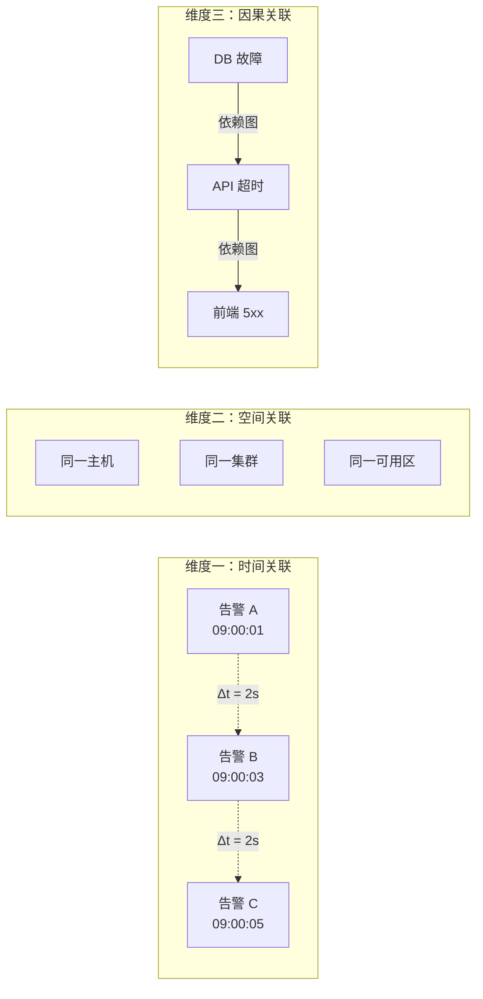

| 维度 | 含义 | 判定条件 | 权重 |
|------|------|---------|------|
| 时间关联 | 在同一时间窗口内触发的告警可能有共同原因 | 告警时间差 ≤ 时间窗口（默认 5 分钟） | 0.3 |
| 空间关联 | 来自同一主机/集群/可用区的告警更可能相关 | 共享 host / cluster / AZ 标签 | 0.2 |
| 因果关联 | 依赖图中存在 parent → child 关系 | 依赖图中可达 | 0.5 |

> 三个维度的权重可调。因果关联权重最高，因为它是唯一能确定性判断根因的维度；时间和空间关联是辅助信号，用于在依赖图不完整时提供补充判断。

#### 2.1.2 关联引擎状态机

每条告警进入关联引擎后，会经历以下状态流转：

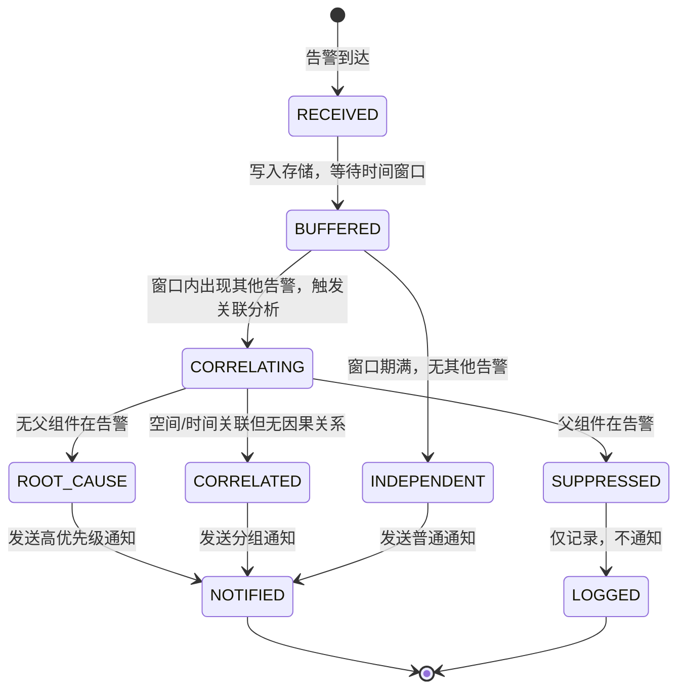

| 状态 | 含义 | 后续动作 |
|------|------|---------|
| RECEIVED | 刚到达，尚未处理 | 写入 DynamoDB/Redis |
| BUFFERED | 已存储，等待时间窗口内是否有其他告警 | 等待或被触发 |
| CORRELATING | 正在进行关联分析 | 遍历依赖图 |
| ROOT_CAUSE | 判定为根因 | 高优先级通知 + 抑制子组件 |
| SUPPRESSED | 被根因抑制 | 仅记录 |
| CORRELATED | 与其他告警关联但非因果关系（如同主机） | 分组通知 |
| INDEPENDENT | 孤立告警，无关联 | 正常通知 |

#### 2.1.3 时间窗口机制

时间窗口是关联引擎的核心参数，决定了"哪些告警被视为同一事件"。

```mermaid
gantt
    title 滑动时间窗口示例（窗口 = 5 分钟）
    dateFormat HH:mm:ss
    axisFormat %H:%M:%S

    section 告警到达
    DB-Down           :a1, 09:00:00, 1s
    API-Timeout       :a2, 09:00:15, 1s
    App-Error         :a3, 09:01:30, 1s
    Web-5xx           :a4, 09:02:00, 1s
    Cache-Miss        :a5, 09:04:50, 1s

    section 窗口范围
    DB-Down 的窗口     :w1, 08:55:00, 10m
    Cache-Miss 的窗口  :w2, 08:59:50, 10m
```

**窗口策略对比：**

| 策略 | 实现方式 | 优点 | 缺点 | 适用场景 |
|------|---------|------|------|---------|
| 固定窗口 | 每 5 分钟切割一次 | 实现简单 | 窗口边界处的告警可能被拆分 | 告警量稳定 |
| 滑动窗口 | 以每条告警为中心 ±T | 不会遗漏边界告警 | 计算量大 | 通用推荐 |
| 自适应窗口 | 根据告警到达速率动态调整 | 风暴时自动扩大窗口 | 实现复杂 | 大规模环境 |

**窗口大小选择指南：**

| 环境特征 | 推荐窗口 | 理由 |
|---------|---------|------|
| 微服务（调用链短） | 2-3 分钟 | 故障传播快，短窗口即可捕获 |
| 传统单体 + 中间件 | 5 分钟 | 故障传播链较长 |
| 跨区域/跨 AZ | 5-10 分钟 | 网络延迟导致告警到达时间差大 |
| 批处理/定时任务 | 10-15 分钟 | 任务执行周期长，故障体现慢 |

### 2.2 依赖关系图模型

#### 2.2.1 图结构定义

依赖关系图是一个有向无环图（DAG），节点代表基础设施或服务组件，边代表依赖关系。

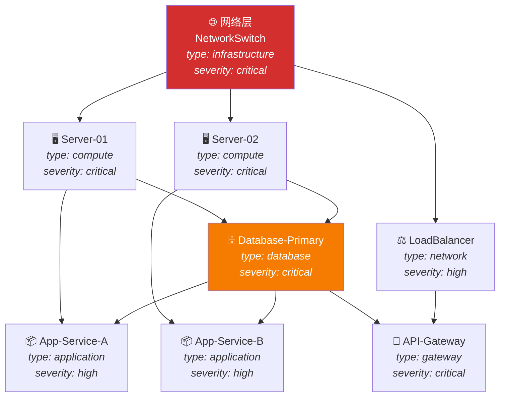

> 箭头方向 = 依赖方向（parent → child）。parent 故障会导致 child 受影响。根因分析时，从告警组件向上遍历，找到最上层的故障组件。

#### 2.2.2 节点属性

每个节点携带以下元数据，用于关联分析和根因评分：

| 属性 | 类型 | 说明 | 示例 |
|------|------|------|------|
| `id` | string | 唯一标识，对应告警中的组件名 | `Database-Primary` |
| `type` | enum | 组件类型层级 | `infrastructure` / `compute` / `database` / `application` / `gateway` |
| `severity` | enum | 组件重要性 | `critical` / `high` / `medium` / `low` |
| `children` | list | 依赖此组件的下游组件 | `['App-Service-A', 'API-Gateway']` |
| `labels` | dict | 空间关联标签 | `{host: 'srv-01', cluster: 'prod-east', az: 'us-east-1a'}` |
| `alarm_patterns` | list | 该组件关联的告警名称模式 | `['RDS-*', 'DB-Connection-*']` |

```python
# 完整的依赖关系图数据结构
DEPENDENCY_GRAPH = {
    'NetworkSwitch': {
        'type': 'infrastructure',
        'severity': 'critical',
        'children': ['Server-01', 'Server-02', 'LoadBalancer'],
        'labels': {'az': 'us-east-1a', 'layer': 'network'},
        'alarm_patterns': ['Network-*', 'VPC-*'],
    },
    'Server-01': {
        'type': 'compute',
        'severity': 'critical',
        'children': ['Database-Primary', 'App-Service-A'],
        'labels': {'host': 'srv-01', 'cluster': 'prod-east', 'az': 'us-east-1a'},
        'alarm_patterns': ['EC2-i-0a*'],
    },
    'Server-02': {
        'type': 'compute',
        'severity': 'critical',
        'children': ['Database-Primary', 'App-Service-B'],
        'labels': {'host': 'srv-02', 'cluster': 'prod-east', 'az': 'us-east-1b'},
        'alarm_patterns': ['EC2-i-0b*'],
    },
    'Database-Primary': {
        'type': 'database',
        'severity': 'critical',
        'children': ['App-Service-A', 'App-Service-B', 'API-Gateway'],
        'labels': {'cluster': 'prod-east', 'engine': 'aurora-mysql'},
        'alarm_patterns': ['RDS-*', 'DB-Connection-*', 'Aurora-*'],
    },
    'LoadBalancer': {
        'type': 'network',
        'severity': 'high',
        'children': ['API-Gateway'],
        'labels': {'cluster': 'prod-east'},
        'alarm_patterns': ['ALB-*', 'ELB-*'],
    },
    'App-Service-A': {
        'type': 'application',
        'severity': 'high',
        'children': [],
        'labels': {'cluster': 'prod-east', 'service': 'order-svc'},
        'alarm_patterns': ['ECS-order-*', 'App-Service-A-*'],
    },
    'App-Service-B': {
        'type': 'application',
        'severity': 'high',
        'children': [],
        'labels': {'cluster': 'prod-east', 'service': 'payment-svc'},
        'alarm_patterns': ['ECS-payment-*', 'App-Service-B-*'],
    },
    'API-Gateway': {
        'type': 'gateway',
        'severity': 'critical',
        'children': [],
        'labels': {'cluster': 'prod-east'},
        'alarm_patterns': ['API-*', 'APIGW-*'],
    },
}

# 反向索引（自动生成）: child → [parents]
REVERSE_GRAPH = {}
for parent, meta in DEPENDENCY_GRAPH.items():
    for child in meta['children']:
        REVERSE_GRAPH.setdefault(child, []).append(parent)
# 结果: {'Server-01': ['NetworkSwitch'], 'Database-Primary': ['Server-01', 'Server-02'], ...}
```

#### 2.2.3 依赖图的构建与维护

依赖图的准确性直接决定根因分析的质量。以下是四种构建策略，按推荐优先级排列：

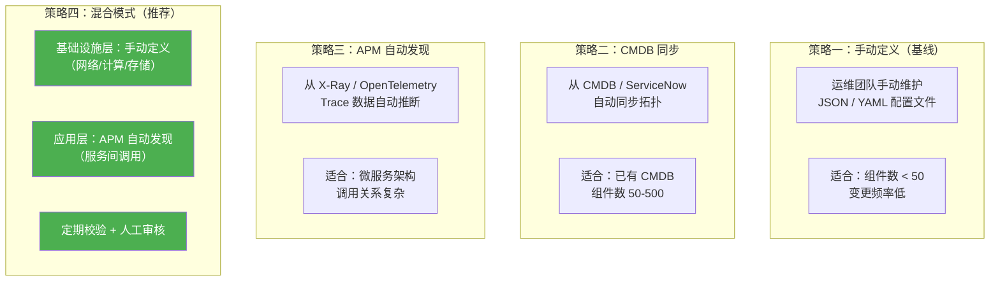

| 策略 | 准确性 | 维护成本 | 实时性 | 适用规模 |
|------|--------|---------|--------|---------|
| 手动定义 | 高（人工保证） | 高 | 低（需手动更新） | < 50 组件 |
| CMDB 同步 | 中（取决于 CMDB 质量） | 中 | 中（定时同步） | 50-500 组件 |
| APM 自动发现 | 中（只能发现调用关系） | 低 | 高（实时） | > 100 服务 |
| 混合模式 | 高 | 中 | 中-高 | 任意规模 |

**依赖图维护最佳实践：**

1. 基础设施层（网络 → 计算 → 存储）变更少，手动维护即可
2. 应用层通过 X-Ray Service Map 或 OpenTelemetry 自动发现调用关系
3. 每周自动校验：对比 APM 发现的拓扑与当前依赖图，标记差异
4. 变更联动：CI/CD 部署新服务时自动更新依赖图（通过 CloudFormation Output 或 Terraform State）

### 2.3 关联算法详解

#### 2.3.1 整体流程

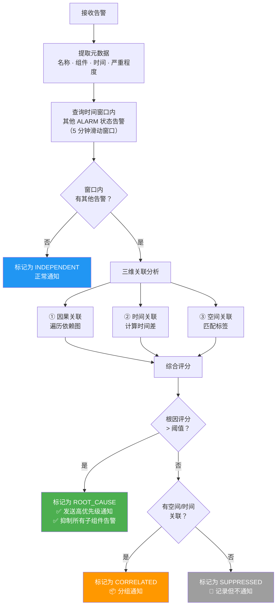

#### 2.3.2 根因评分算法

当时间窗口内存在多条告警时，需要对每个告警组件进行根因评分，分数最高的判定为根因。

```python
def calculate_root_cause_score(component: str, all_alarming: set, graph: dict, reverse_graph: dict) -> float:
    """
    根因评分算法

    评分维度:
      1. 因果得分 (0.5): 父组件不在告警中 → 高分；父组件也在告警中 → 低分
      2. 影响范围 (0.25): 下游受影响组件越多 → 分越高
      3. 组件权重 (0.15): infrastructure > compute > database > application
      4. 时间优先 (0.10): 最早触发的告警得分更高
    """
    score = 0.0
    meta = graph.get(component, {})

    # ── 维度 1: 因果得分 (权重 0.5) ──
    parents = reverse_graph.get(component, [])
    parents_in_alarm = [p for p in parents if p in all_alarming]
    if not parents:
        # 无父组件 = 图的根节点，天然根因候选
        causal_score = 1.0
    elif not parents_in_alarm:
        # 有父组件但都没告警 → 故障起源于此
        causal_score = 0.9
    else:
        # 父组件也在告警 → 不太可能是根因
        causal_score = 0.1 * (1 - len(parents_in_alarm) / len(parents))
    score += 0.5 * causal_score

    # ── 维度 2: 影响范围 (权重 0.25) ──
    affected_count = count_downstream(component, graph)
    total_nodes = len(graph)
    impact_score = min(affected_count / max(total_nodes, 1), 1.0)
    score += 0.25 * impact_score

    # ── 维度 3: 组件权重 (权重 0.15) ──
    TYPE_WEIGHTS = {
        'infrastructure': 1.0,
        'network': 0.9,
        'compute': 0.8,
        'database': 0.7,
        'gateway': 0.5,
        'application': 0.3,
    }
    type_score = TYPE_WEIGHTS.get(meta.get('type', ''), 0.3)
    score += 0.15 * type_score

    # ── 维度 4: 时间优先 (权重 0.10) ──
    # 由调用方传入，此处省略
    score += 0.10 * 0.5  # 占位

    return round(score, 3)


def count_downstream(component: str, graph: dict, visited: set = None) -> int:
    """递归计算下游受影响组件数"""
    if visited is None:
        visited = set()
    if component in visited:
        return 0
    visited.add(component)
    children = graph.get(component, {}).get('children', [])
    count = len(children)
    for child in children:
        count += count_downstream(child, graph, visited)
    return count
```

**评分示例（数据库故障场景）：**

| 组件 | 因果得分 | 影响范围 | 组件权重 | 时间优先 | 总分 | 判定 |
|------|---------|---------|---------|---------|------|------|
| Database-Primary | 0.45 (父组件未告警) | 0.19 (影响 3 个下游) | 0.11 (database) | 0.10 (最早) | **0.85** | ✅ ROOT_CAUSE |
| App-Service-A | 0.05 (父组件 DB 在告警) | 0.00 (无下游) | 0.05 (application) | 0.03 | **0.13** | SUPPRESSED |
| API-Gateway | 0.05 (父组件 DB 在告警) | 0.00 (无下游) | 0.08 (gateway) | 0.05 | **0.18** | SUPPRESSED |

#### 2.3.3 多根因场景处理

实际生产中，告警风暴可能由多个独立故障同时引发。关联引擎需要识别并分别报告。

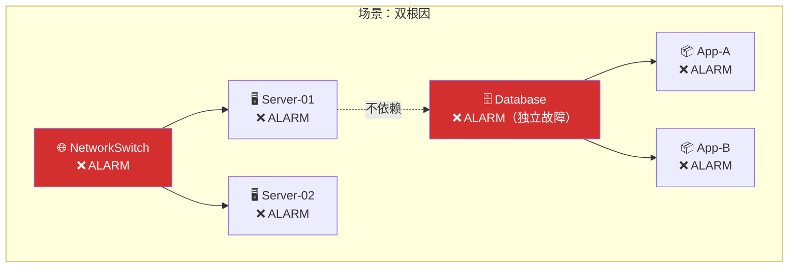

**处理逻辑：**

```python
def find_all_root_causes(alarming_components: set, graph: dict, reverse_graph: dict) -> list:
    """
    多根因识别算法

    步骤:
    1. 对所有告警组件计算根因评分
    2. 按评分降序排列
    3. 贪心选择: 选中一个根因后，将其所有下游组件标记为"已解释"
    4. 继续从未解释的组件中选择下一个根因
    5. 直到所有告警组件都被解释
    """
    scores = {}
    for comp in alarming_components:
        scores[comp] = calculate_root_cause_score(comp, alarming_components, graph, reverse_graph)

    sorted_components = sorted(scores.items(), key=lambda x: x[1], reverse=True)

    root_causes = []
    explained = set()

    for comp, score in sorted_components:
        if comp in explained:
            continue
        if score < 0.4:
            # 评分太低，不可能是根因
            break

        root_causes.append({'component': comp, 'score': score})
        # 标记此根因的所有下游为"已解释"
        explained.add(comp)
        _mark_downstream(comp, graph, explained)

    return root_causes


def _mark_downstream(component: str, graph: dict, explained: set):
    """递归标记下游组件"""
    for child in graph.get(component, {}).get('children', []):
        if child not in explained:
            explained.add(child)
            _mark_downstream(child, graph, explained)
```

**多根因通知格式：**

```
━━━ 告警关联分析结果 ━━━

⚠️ 检测到 2 个独立根因:

📍 根因 1: NetworkSwitch (评分 0.92)
   影响: Server-01, Server-02
   告警: Network-Switch-Down

📍 根因 2: Database-Primary (评分 0.85)
   影响: App-Service-A, App-Service-B, API-Gateway
   告警: DB-Connection-Failed

📊 总计: 7 条告警 → 2 条通知（压缩比 3.5:1）
```

#### 2.3.4 边界情况处理

| 场景 | 问题 | 处理策略 |
|------|------|---------|
| 循环依赖 | A → B → C → A，遍历死循环 | visited 集合防重入；打破循环取评分最高者 |
| 依赖图缺失 | 告警组件不在图中 | 降级为纯时间+空间关联；标记 `UNMODELED` |
| 告警延迟到达 | 根因告警晚于衍生告警 | 窗口内持续重新评估；根因到达后更新判定 |
| 告警抖动 | 同一组件反复 ALARM/OK | 引入 debounce：连续 N 次 ALARM 才计入 |
| 级联恢复 | 根因恢复但子组件未恢复 | 根因 OK 后等待宽限期，再检查子组件状态 |
| 孤立告警 | 窗口内只有一条告警 | 直接标记 INDEPENDENT，正常通知 |

### 2.4 告警风暴处理示例

#### 2.4.1 单根因场景

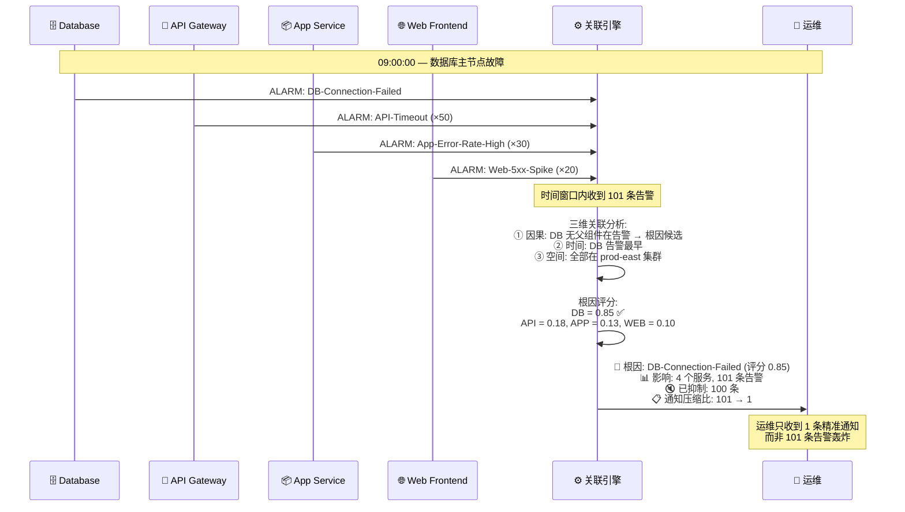

#### 2.4.2 多根因场景

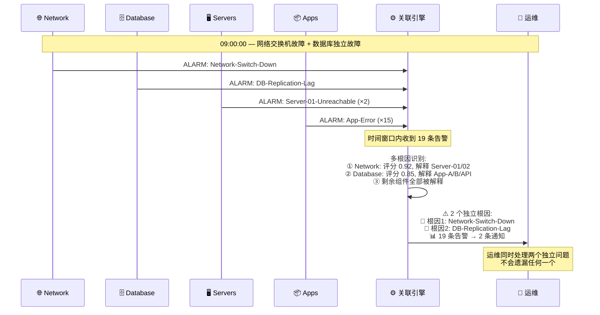

### 2.3 关联算法流程

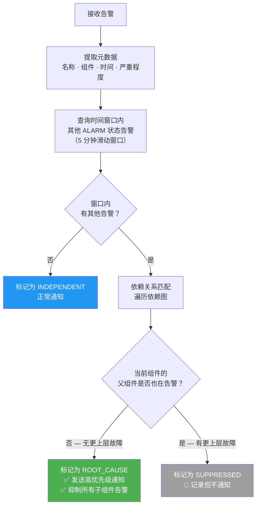

### 2.4 告警风暴处理示例

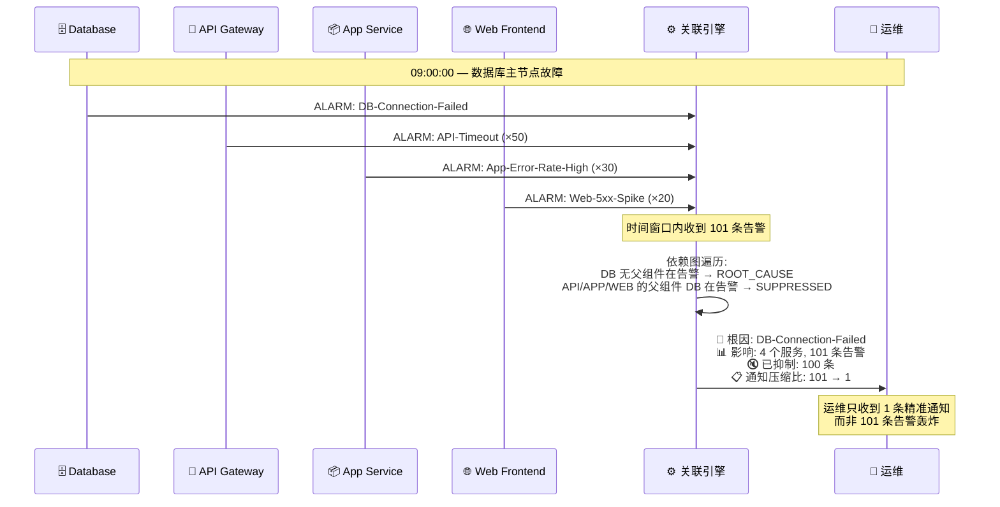

## 三、核心算法实现

### 3.1 根因分析算法

```python
def find_root_cause(alert, time_window=300):
    """
    根因分析算法
    """
    # 获取时间窗口内的所有告警
    related_alerts = get_alerts_in_window(alert.timestamp, time_window)
    
    # 构建告警组件图
    alert_components = [a.component for a in related_alerts]
    
    # 查找最上层的故障组件
    root_candidates = []
    for component in alert_components:
        if is_root_component(component, alert_components):
            root_candidates.append(component)
    
    # 返回优先级最高的根因
    return select_highest_priority_root(root_candidates)

def is_root_component(component, all_components):
    """
    判断是否为根因组件:
    如果该组件的所有父组件都不在告警列表中，则它是根因
    """
    parents = get_parent_components(component)
    return not any(parent in all_components for parent in parents)
```

### 3.2 告警抑制策略

```python
class AlertSuppressionEngine:
    def __init__(self):
        self.suppression_rules = []
        self.maintenance_windows = []
    
    def should_suppress(self, alert):
        """判断告警是否应该被抑制"""
        # 检查维护窗口
        if self.in_maintenance_window(alert):
            return True, "MAINTENANCE"
        
        # 检查根因抑制
        if self.has_root_cause_alert(alert):
            return True, "ROOT_CAUSE_EXISTS"
        
        # 检查频率抑制
        if self.exceeds_frequency_limit(alert):
            return True, "FREQUENCY_LIMIT"
        
        return False, None
```

## 四、技术选型对比

### 4.1 AWS 原生 vs Prometheus 方案对比

```mermaid
graph LR
    subgraph "AWS 原生方案"
        direction TB
        A1["✅ 零基础设施运维"]
        A2["✅ 与 AWS 服务深度集成"]
        A3["✅ 按使用量付费"]
        A4["⚠️ 关联引擎需自建"]
        A5["⚠️ 灵活性中等"]
    end

    subgraph "Prometheus 方案"
        direction TB
        B1["✅ 完全可定制"]
        B2["✅ 开源免费"]
        B3["✅ 社区生态丰富"]
        B4["⚠️ 需自建基础设施"]
        B5["⚠️ 运维成本较高"]
    end
```

| 维度 | AWS 原生 (CloudWatch) | Prometheus + Grafana |
|------|----------------------|---------------------|
| **动态阈值** | Anomaly Detection（内置 ML） | PromQL 基线计算（手动配置） |
| **告警分组** | Composite Alarms（逻辑组合） | Alertmanager group_by（标签分组） |
| **告警抑制** | ActionsSuppressor（复合告警级别） | inhibit_rules（全局规则） |
| **多数据点** | M out of N（原生支持） | `for` 子句 + 移动平均（间接实现） |
| **复合指标** | Metric Math（表达式） | PromQL（更强大） |
| **关联引擎** | 需自建（EventBridge + Lambda） | 需自建（Flask + Redis） |
| **依赖图** | 需自建（DynamoDB 存储） | 需自建（NetworkX / Redis） |
| **可视化** | CloudWatch Dashboards | Grafana（更丰富） |
| **成本模型** | 按告警数 + Lambda 调用 + DynamoDB | 服务器成本 + 运维人力 |
| **学习曲线** | 低（AWS 用户） | 中（需学 PromQL） |
| **适用场景** | 纯 AWS 环境 | 混合云 / 多云 / 自建 |

### 4.2 选型决策树

```mermaid
flowchart TD
    START["开始选型"] --> Q1{"基础设施<br/>在哪里？"}
    Q1 -->|"纯 AWS"| Q2{"团队对 Prometheus<br/>有经验？"}
    Q1 -->|"混合云 / 多云 / 自建"| PROM["✅ Prometheus + Grafana"]
    Q2 -->|"有"| Q3{"需要跨云<br/>统一监控？"}
    Q2 -->|"没有"| AWS["✅ AWS 原生方案"]
    Q3 -->|"是"| PROM
    Q3 -->|"否"| Q4{"预算偏好？"}
    Q4 -->|"按需付费，少运维"| AWS
    Q4 -->|"一次投入，完全掌控"| PROM

    style AWS fill:#FF9900,color:#fff
    style PROM fill:#E6522C,color:#fff
```

### 4.3 功能覆盖矩阵

| 功能 | CloudWatch 原生 | + 自建关联引擎 | Alertmanager 原生 | + 自建关联引擎 |
|------|:-:|:-:|:-:|:-:|
| 静态阈值告警 | ✅ | ✅ | ✅ | ✅ |
| 动态阈值 | ✅ ML | ✅ ML | ⚠️ PromQL | ⚠️ PromQL |
| M out of N | ✅ 原生 | ✅ 原生 | ⚠️ `for` 近似 | ⚠️ `for` 近似 |
| 复合指标 | ✅ Metric Math | ✅ Metric Math | ✅ PromQL | ✅ PromQL |
| 告警分组 | ✅ Composite | ✅ Composite | ✅ group_by | ✅ group_by |
| 静态抑制 | ✅ Suppressor | ✅ Suppressor | ✅ inhibit_rules | ✅ inhibit_rules |
| 时间窗口关联 | ❌ | ✅ | ❌ | ✅ |
| 依赖图根因分析 | ❌ | ✅ | ❌ | ✅ |
| 动态根因抑制 | ❌ | ✅ | ❌ | ✅ |
| 关联通知压缩 | ❌ | ✅ | ❌ | ✅ |
| 维护窗口 | ⚠️ 手动 | ✅ | ✅ silences | ✅ |
| 多级路由 | ⚠️ SNS 过滤 | ✅ | ✅ routes | ✅ |
| 升级策略 | ❌ | ✅ | ⚠️ repeat_interval | ✅ |

> ✅ = 原生支持 | ⚠️ = 部分支持或间接实现 | ❌ = 不支持

## 五、存储与计算选型

### 5.1 存储层

| 组件 | AWS 方案 | Prometheus 方案 | 选型理由 |
|------|---------|----------------|---------|
| 告警存储 | DynamoDB (TTL 自动清理) | Redis (内存快速查询) | 告警数据需要高并发写入和快速时间窗口查询 |
| 依赖关系 | DynamoDB / S3 JSON | Redis Hash / 内存 | 依赖图变更不频繁，读多写少 |
| 关联结果 | DynamoDB (30 天保留) | PostgreSQL (长期存储) | 关联结果需要持久化用于审计和分析 |
| 缓存 | ElastiCache Redis | Redis | 热点数据缓存，加速关联查询 |

### 5.2 计算层

| 组件 | AWS 方案 | Prometheus 方案 | 选型理由 |
|------|---------|----------------|---------|
| 告警接收 | Lambda (事件驱动) | Flask API (常驻服务) | AWS 用 Lambda 省成本，自建用常驻服务省冷启动 |
| 关联分析 | Lambda (异步调用) | Celery Worker (异步队列) | 关联分析可能耗时，需要异步处理 |
| 定时任务 | EventBridge Scheduler | Celery Beat | 定期清理、统计报告等 |

## 六、性能指标与监控

### 6.1 关键指标

| 指标 | 目标值 | 监控方式 |
|------|-------|---------|
| 告警处理延迟 | < 5 秒 | Lambda Duration / Flask 请求耗时 |
| 关联分析延迟 | < 10 秒 | Lambda Duration / Celery 任务耗时 |
| 误报率 | < 5% | 人工标注 + 定期审查 |
| 告警抑制率 | > 80%（风暴期间） | 抑制计数 / 总告警数 |
| 通知压缩比 | > 10:1（风暴期间） | 原始告警数 / 实际通知数 |
| 系统可用性 | > 99.9% | 健康检查 + 心跳监控 |

### 6.2 告警系统自身的监控

```mermaid
graph TD
    subgraph "监控告警系统本身"
        M1["告警接收速率突增<br/>→ 可能正在发生告警风暴"]
        M2["关联引擎处理延迟升高<br/>→ 需要扩容或优化"]
        M3["DLQ 消息堆积<br/>→ 有告警处理失败"]
        M4["通知发送失败率升高<br/>→ 通知渠道异常"]
    end
```

## 七、部署与运维

### 7.1 部署策略
- 蓝绿部署确保零停机
- 分阶段发布降低风险（先灰度 10% 告警流量）
- 自动回滚机制（关联引擎异常时 fallback 到直接通知）

### 7.2 容灾设计

```
正常路径:  告警 → EventBridge → Lambda → 关联分析 → 精简通知
降级路径:  告警 → SNS 直接通知（关联引擎不可用时）
```

> 关联引擎是增强层，不是必经路径。即使关联引擎完全宕机，告警仍然会通过原生的 CloudWatch Alarm → SNS 或 Alertmanager → Receiver 路径送达。

## 八、扩展性考虑

### 8.1 水平扩展
- 告警处理服务无状态设计
- DynamoDB 按需扩展 / Redis Cluster 分片
- Lambda 自动并发 / K8s HPA 自动扩缩

### 8.2 功能扩展路线

```mermaid
graph LR
    P0["P0: 基础能力<br/>动态阈值<br/>复合告警<br/>M out of N<br/>告警分组"] --> P1["P1: 关联引擎<br/>时间窗口关联<br/>依赖图根因分析<br/>通知压缩"]
    P1 --> P2["P2: 智能增强<br/>ML 异常检测<br/>自适应阈值<br/>预测性告警"]
    P2 --> P3["P3: 自动化<br/>自动修复<br/>Runbook 自动化<br/>ChatOps 集成"]

    style P0 fill:#4CAF50,color:#fff
    style P1 fill:#2196F3,color:#fff
    style P2 fill:#9C27B0,color:#fff
    style P3 fill:#FF5722,color:#fff
```
