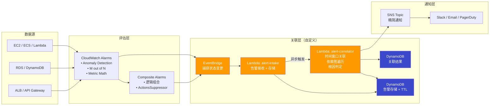
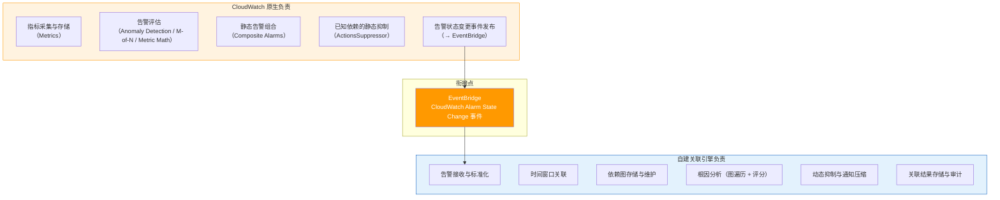
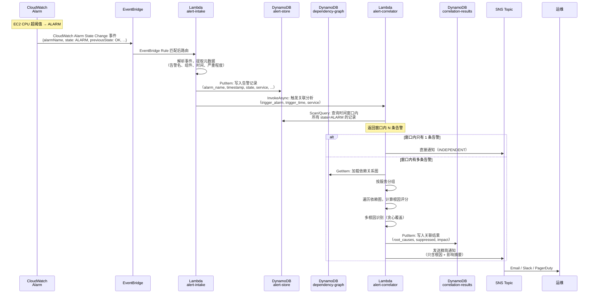
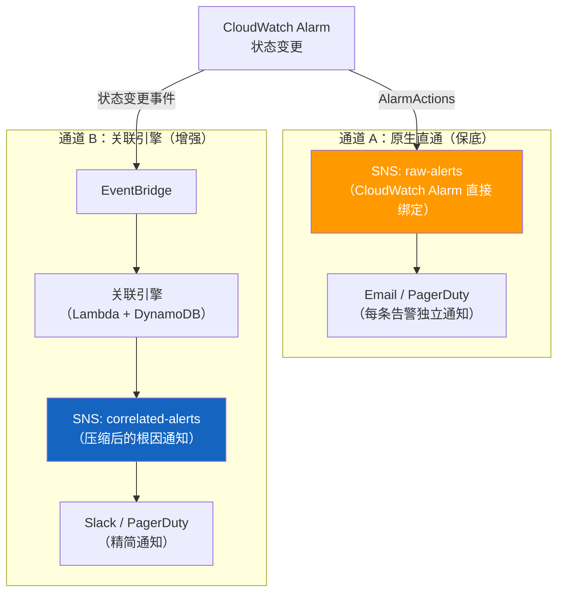

# CloudWatch 告警风暴解决方案实现

## 概述：CloudWatch 原生能力与自建关联引擎的三层递进

在进入具体实现之前，先理解 CloudWatch 方案的整体逻辑。告警风暴的治理分三层递进，每一层解决不同类型的噪音：

```
层次一：告警评估（减少误报）
  Anomaly Detection / M out of N / Metric Math
        ↓ 过滤掉"不该告的"
层次二：静态组合 + 静态抑制（处理已知依赖）
  Composite Alarms + ActionsSuppressor
        ↓ 压缩"已知关系的衍生告警"
层次三：自建关联引擎（处理动态/复杂依赖）
  EventBridge → Lambda → DynamoDB
        ↓ 动态根因分析 + 通知压缩
  精简通知
```

### 层次一：告警评估 — 决定"什么时候该告警"

CloudWatch 提供三种评估机制，目标是从源头减少误报：

**① Anomaly Detection（动态阈值）**

传统做法是设固定阈值（如 CPU > 80%），但很多指标有周期性波动（白天高晚上低），固定阈值要么白天漏报要么晚上误报。Anomaly Detection 用 ML 模型学习指标的历史模式，自动生成动态的"正常范围带"：

```
                 ┌─── 上界（预测值 + 2σ）
                 │
  ████████████   │   ← 正常范围带（灰色区域）
  █ 实际值  █   │
  ████████████   │
                 │
                 └─── 下界（预测值 - 2σ）

  超出灰色区域 → 触发告警
```

告警表达式：`ANOMALY_DETECTION_FUNCTION(m1, 2)` — 其中 `2` 是标准差倍数，越大越宽容。

→ 详见 [1.1 动态阈值实现](#11-动态阈值实现anomaly-detection)

**② M out of N（多数据点评估）**

传统模式是"连续 N 个周期都超阈值才告警"，但一个正常数据点就会重置计数，导致真实问题被延迟发现。M out of N 的逻辑是：最近 N 个评估周期中，只要有 M 个超阈值就触发。

```
传统 3/3:   ✗ ✓ ✗ ✗ ✗  →  不触发（第2个正常，重置计数）
M-of-N 3/5: ✗ ✓ ✗ ✗ ✗  →  触发（5个中4个异常 ≥ 3）
                              ✗=超阈值  ✓=正常
```

对应参数：`EvaluationPeriods = 5`（N），`DatapointsToAlarm = 3`（M）。

→ 详见 [1.3 多数据点评估实现](#13-多数据点评估实现m-out-of-n)

**③ Metric Math（复合指标）**

有些告警条件单个指标无法表达。比如"错误率 > 5%"需要用 `5xxError / TotalRequests * 100`。Metric Math 允许在告警中写数学表达式组合多个指标：

```
m1 = 5XXError (Sum)
m2 = Count (Sum)
e1 = (m1 / m2) * 100    ← 告警基于这个表达式的值
```

还支持条件表达式防除零：`IF(m2 > 0, m1/m2*100, 0)`

→ 详见 [1.4 复合指标告警实现](#14-复合指标告警实现metric-math)

### 层次二：静态组合 + 静态抑制 — 处理"已知的依赖关系"

**① Composite Alarms（静态组合）**

Composite Alarm 不监控指标，它监控的是**其他告警的状态**，用布尔表达式组合：

```python
# 任意一个组件故障 → 服务不健康
'ALARM("EC2-Down") OR ALARM("RDS-Down") OR ALARM("ALB-Unhealthy")'

# 必须同时满足 → 确认是真正的性能问题（而非单指标抖动）
'ALARM("High-CPU") AND ALARM("High-Latency")'

# 排除已知根因 → 只在非根因场景通知
'ALARM("App-Error") AND NOT ALARM("DB-Down")'
```

它把多个细粒度告警聚合成一个业务级别的判断。比如"订单服务不可用"= EC2 挂了 OR 数据库挂了 OR 负载均衡器异常。

但它是**静态的** — 必须提前写死哪些告警参与组合，不能动态发现关联。

**② ActionsSuppressor（静态抑制）**

ActionsSuppressor 是 Composite Alarm 的一个属性，指定一个告警作为"抑制器"：

```python
{
    'AlarmName': 'Service-Health',
    'AlarmRule': 'ALARM("DB-Down") OR ALARM("App-Error") OR ALARM("API-Timeout")',
    'ActionsSuppressor': 'DB-Down',              # DB-Down 作为抑制器
    'ActionsSuppressorWaitPeriod': 300,           # 等待 5 分钟
    'ActionsSuppressorExtensionPeriod': 60,       # 延长 1 分钟
}
```

工作流程：

```
09:00:00  App-Error 触发
          → Composite Alarm 进入 ALARM
          → 但先不通知，等待 5 分钟看 DB-Down 是否也触发

09:00:30  DB-Down 触发 → 抑制器激活
          → Composite Alarm 的通知被抑制（根因是 DB）
          → DB-Down 自己的 SNS 通知正常发送

09:05:30  DB-Down 恢复 → 抑制器解除
          → 再等 60 秒（ExtensionPeriod）
          → 如果 App-Error 还在 → 现在才发通知（说明 App 有独立问题）
```

它解决的问题是：DB 挂了导致 App 报错，运维只收到 DB 的告警，不会被 App 的告警轰炸。

但它也是**静态的** — 必须提前知道"DB-Down 是 App-Error 的根因"并手动配置。50 个服务、200 个告警时，手动维护这些抑制关系就不现实了。

→ 详见 [1.2 复合告警实现](#12-复合告警实现composite-alarms)

### 层次三：自建关联引擎 — 处理"动态的、复杂的依赖关系"

当环境中组件多、依赖关系动态变化时，静态的 Composite Alarm 规则无法覆盖所有场景。自建关联引擎通过 EventBridge 捕获所有告警状态变更，在 Lambda 中执行依赖图遍历和根因分析：

```
CloudWatch Alarm 状态变更
    → EventBridge（捕获事件）
    → Lambda: alert-intake（接收 + 存储到 DynamoDB）
    → Lambda: alert-correlator（时间窗口查询 + 依赖图遍历 + 根因评分）
    → SNS（只发送根因告警 + 影响摘要）
```

它能做到 Composite Alarm 做不到的事：
- **动态关联**：不需要提前配置哪些告警相关，时间窗口内的告警自动关联
- **根因分析**：遍历依赖图，自动判断哪个组件是根因
- **通知压缩**：101 条告警 → 1 条精简通知
- **多根因识别**：同时存在多个独立故障时，分别报告

→ 详见 [第二部分：自建告警关联引擎](#第二部分自建告警关联引擎eventbridge--lambda--dynamodb)

### 三层能力对照

| 能力 | 层次一：评估 | 层次二：静态组合/抑制 | 层次三：关联引擎 |
|------|:-----------:|:-------------------:|:---------------:|
| 减少误报 | ✅ | — | — |
| 过滤抖动 | ✅ | — | — |
| 已知依赖抑制 | — | ✅ | ✅ |
| 未知依赖发现 | — | ❌ | ✅ |
| 动态根因分析 | — | ❌ | ✅ |
| 通知压缩 | — | 部分（组合为 1 条） | ✅（N → 1 摘要） |
| 多根因识别 | — | ❌ | ✅ |
| 实现成本 | 零（原生） | 低（配置规则） | 中（自建 Lambda + DynamoDB） |
| 维护成本 | 零 | 中（规则随架构变更） | 低-中（依赖图维护） |

> 建议实施顺序：先用层次一和层次二快速止血（零开发），再根据需要决定是否建设层次三。

---

## 整体架构与组件协同

> 本章从全局视角说明 CloudWatch 原生能力与自建关联引擎如何协同工作，包括整体架构、职责划分、数据流转、组件选型和容错设计。理解这些之后，再进入第一部分和第二部分的具体实现。

### 架构总览



### 职责划分：CloudWatch 原生 vs 自建关联引擎

CloudWatch 原生能力和自建关联引擎各自负责不同的层次，通过 EventBridge 事件总线进行衔接：



| 层次 | CloudWatch 原生 | 自建关联引擎 | 协同方式 |
|------|----------------|-------------|---------|
| 指标采集 | ✅ CloudWatch Metrics | — | — |
| 告警评估 | ✅ Alarms (阈值/异常/M-of-N) | — | — |
| 静态组合 | ✅ Composite Alarms | — | 已知固定依赖用 Composite 处理 |
| 静态抑制 | ✅ ActionsSuppressor | — | 简单场景直接用原生抑制 |
| 事件发布 | ✅ → EventBridge | — | 所有告警状态变更自动发布 |
| 事件接收 | — | ✅ Lambda: alert-intake | EventBridge Rule 路由到 Lambda |
| 告警存储 | — | ✅ DynamoDB: alert-store | 带 TTL 自动清理 |
| 依赖图存储 | — | ✅ DynamoDB: dependency-graph | 或 S3 JSON（小规模） |
| 时间窗口关联 | — | ✅ Lambda: alert-correlator | 查询窗口内告警 |
| 根因分析 | — | ✅ Lambda: alert-correlator | 图遍历 + 评分算法 |
| 动态抑制 | — | ✅ Lambda: alert-correlator | 根因确定后抑制子组件 |
| 通知压缩 | — | ✅ → SNS | N 条告警 → 1 条摘要 |

### 端到端数据流



### 组件选型理由

**EventBridge — 事件总线（衔接层）**

| 维度 | 说明 |
|------|------|
| 为什么选它 | CloudWatch Alarm 状态变更会自动发布到 EventBridge，零配置即可捕获 |
| 替代方案 | SNS（但 SNS 的事件格式不如 EventBridge 丰富，且不支持内容过滤规则） |
| 关键配置 | Rule 匹配 `source: aws.cloudwatch` + `detail-type: CloudWatch Alarm State Change` |
| 容错 | 配置 DLQ（SQS），失败事件自动重试 3 次后进入死信队列 |

**Lambda — 计算引擎（alert-intake + alert-correlator）**

| 维度 | alert-intake | alert-correlator |
|------|-------------|-----------------|
| 职责 | 接收事件、解析、存储、触发关联 | 时间窗口查询、依赖图遍历、根因判定、通知 |
| 触发方式 | EventBridge 同步调用 | alert-intake 异步调用 (InvocationType=Event) |
| 超时 | 30 秒（简单写入） | 60 秒（需要查询 + 图遍历） |
| 内存 | 256 MB | 512 MB（依赖图可能较大） |
| 并发 | 默认（跟随告警量） | 建议设置 Reserved Concurrency = 10，避免风暴时过度并发 |
| 为什么用 Lambda | 事件驱动、按调用付费、无需运维服务器；告警是突发流量，Lambda 自动扩缩 |
| 替代方案 | ECS Fargate Task（适合关联分析耗时 > 15 分钟的超大规模场景） |

> 为什么分成两个 Lambda 而不是一个？
> - **解耦**：intake 是快速写入（< 1 秒），correlator 是重计算（可能 5-30 秒）。分开后 intake 不会被 correlator 阻塞。
> - **重试隔离**：intake 失败只影响单条告警存储；correlator 失败不影响告警接收。
> - **扩缩独立**：风暴时 intake 需要高并发接收，correlator 可以限制并发避免 DynamoDB 热点。

**DynamoDB — 存储层**

| 表 | 用途 | 键设计 | 为什么选 DynamoDB |
|----|------|--------|------------------|
| `alert-store` | 存储原始告警记录 | PK: `alarm_name`, SK: `timestamp` | 高并发写入（风暴时可能 100+ TPS）；TTL 自动清理过期数据；按需计费 |
| `dependency-graph` | 存储服务依赖关系图 | PK: `component_id` | 读多写少；单表即可存储全图；毫秒级读取 |
| `correlation-results` | 存储关联分析结果 | PK: `correlation_id`, SK: `timestamp` | 审计需要；30 天 TTL 自动清理 |

```
alert-store 表结构:
┌──────────────────┬───────────┬────────┬─────────┬──────────┬───────────┐
│ alarm_name (PK)  │ timestamp │ state  │ service │ namespace│ expire_at │
│                  │ (SK)      │        │         │          │ (TTL)     │
├──────────────────┼───────────┼────────┼─────────┼──────────┼───────────┤
│ EC2-CPU-High     │ 1708300800│ ALARM  │ compute │ AWS/EC2  │ 1708905600│
│ RDS-Conn-Failed  │ 1708300815│ ALARM  │ database│ AWS/RDS  │ 1708905615│
└──────────────────┴───────────┴────────┴─────────┴──────────┴───────────┘

GSI: service-time-index (PK: service, SK: timestamp)
→ 支持按服务 + 时间范围查询窗口内告警
```

**SNS — 通知层**

| 维度 | 说明 |
|------|------|
| 用途 | 关联引擎输出精简通知 |
| 订阅者 | Email、Slack (via Lambda/ChatBot)、PagerDuty (via HTTPS endpoint) |
| 为什么不直接用 CloudWatch Alarm → SNS | CloudWatch 的 SNS 通知是每条告警独立发送，无法压缩；关联引擎的 SNS 通知是压缩后的摘要 |

### 双通道容错设计

关联引擎是增强层，不能成为告警通知的单点故障。设计上保留两条通知通道：



| 通道 | 触发条件 | 通知内容 | 适用场景 |
|------|---------|---------|---------|
| A: 原生直通 | 每条 CloudWatch Alarm 触发 | 原始告警（未压缩） | 关联引擎宕机时的保底通知 |
| B: 关联引擎 | 关联分析完成后 | 根因 + 影响摘要（压缩后） | 正常运行时的主通知通道 |

> 正常情况下运维团队主要关注通道 B（精简通知），通道 A 作为备份可以设置较低优先级（如 Email only）。当关联引擎故障时，通道 A 自动兜底，确保不会漏报。

### 成本估算

以一个中等规模环境为例（200 个 CloudWatch Alarm，月均 5 次告警风暴，每次 ~100 条告警）：

| 组件 | 月成本估算 | 计算依据 |
|------|----------|---------|
| EventBridge | ~$0.50 | 500 事件/月 × $1/百万事件 |
| Lambda (intake) | ~$0.10 | 500 次调用 × 256MB × 1s |
| Lambda (correlator) | ~$0.50 | 500 次调用 × 512MB × 10s |
| DynamoDB (alert-store) | ~$1.00 | 按需模式，500 写入 + 2500 读取/月 |
| DynamoDB (dependency-graph) | ~$0.50 | 读多写少，极低用量 |
| DynamoDB (correlation-results) | ~$0.25 | 5 条结果/月 |
| SNS | ~$0.10 | 5 条通知/月 |
| **合计** | **~$3/月** | 非风暴期间几乎零成本 |

> 关联引擎的成本极低，因为它是纯事件驱动架构——没有告警时不产生任何费用。这是选择 Lambda + DynamoDB 而非 ECS + RDS 的核心原因。

---

## 第一部分：CloudWatch 原生能力（告警评估 + 静态组合/抑制）

> 本部分涵盖 CloudWatch 原生提供的四项能力，无需自建任何组件，通过配置即可使用。对应概述中的层次一（告警评估）和层次二（静态组合/抑制）。

### 1.1 动态阈值实现（Anomaly Detection）

#### 1.1.1 实现原理
使用 CloudWatch Anomaly Detection 基于机器学习自动学习指标的正常行为模式，并创建动态阈值带。

#### 1.1.2 完整代码实现

#### Python 代码实现

```python
import boto3
import json
from typing import Dict, List, Optional

class CloudWatchAnomalyDetector:
    def __init__(self, region_name: str = 'us-east-1'):
        """
        初始化 CloudWatch 异常检测器
        
        Args:
            region_name: AWS 区域名称
        """
        self.cloudwatch = boto3.client('cloudwatch', region_name=region_name)
    
    def create_anomaly_detector(self, 
                              namespace: str, 
                              metric_name: str, 
                              dimensions: List[Dict] = None,
                              stat: str = 'Average') -> str:
        """
        创建异常检测模型
        
        Args:
            namespace: 指标命名空间
            metric_name: 指标名称
            dimensions: 指标维度
            stat: 统计方法
            
        Returns:
            异常检测器 ARN
        """
        try:
            # 构建指标配置
            metric_config = {
                'Namespace': namespace,
                'MetricName': metric_name,
                'Stat': stat
            }
            
            if dimensions:
                metric_config['Dimensions'] = dimensions
            
            # 创建异常检测器
            response = self.cloudwatch.put_anomaly_detector(
                Namespace=namespace,
                MetricName=metric_name,
                Dimensions=dimensions or [],
                Stat=stat
            )
            
            print(f"异常检测器创建成功: {namespace}/{metric_name}")
            return response.get('ResponseMetadata', {}).get('RequestId')
            
        except Exception as e:
            print(f"创建异常检测器失败: {str(e)}")
            raise
    
    def create_anomaly_alarm(self,
                           alarm_name: str,
                           namespace: str,
                           metric_name: str,
                           threshold: float = 2.0,
                           dimensions: List[Dict] = None,
                           sns_topic_arn: str = None) -> str:
        """
        创建基于异常检测的告警
        
        Args:
            alarm_name: 告警名称
            namespace: 指标命名空间
            metric_name: 指标名称
            threshold: 异常阈值（标准差倍数）
            dimensions: 指标维度
            sns_topic_arn: SNS 主题 ARN
            
        Returns:
            告警 ARN
        """
        try:
            # 构建告警配置
            alarm_config = {
                'AlarmName': alarm_name,
                'ComparisonOperator': 'LessThanLowerOrGreaterThanUpperThreshold',
                'EvaluationPeriods': 2,
                'Metrics': [
                    {
                        'Id': 'm1',
                        'ReturnData': True,
                        'MetricStat': {
                            'Metric': {
                                'Namespace': namespace,
                                'MetricName': metric_name,
                                'Dimensions': dimensions or []
                            },
                            'Period': 300,
                            'Stat': 'Average'
                        }
                    },
                    {
                        'Id': 'ad1',
                        'Expression': f'ANOMALY_DETECTION_FUNCTION(m1, {threshold})'
                    }
                ],
                'ThresholdMetricId': 'ad1',
                'ActionsEnabled': True,
                'AlarmDescription': f'基于异常检测的告警: {metric_name}',
                'Unit': 'None'
            }
            
            # 添加 SNS 通知
            if sns_topic_arn:
                alarm_config['AlarmActions'] = [sns_topic_arn]
                alarm_config['OKActions'] = [sns_topic_arn]
            
            # 创建告警
            response = self.cloudwatch.put_metric_alarm(**alarm_config)
            
            print(f"异常检测告警创建成功: {alarm_name}")
            return f"arn:aws:cloudwatch:{self.cloudwatch.meta.region_name}:*:alarm:{alarm_name}"
            
        except Exception as e:
            print(f"创建异常检测告警失败: {str(e)}")
            raise

# 使用示例
if __name__ == "__main__":
    # 初始化检测器
    detector = CloudWatchAnomalyDetector(region_name='us-east-1')
    
    # 为 EC2 CPU 使用率创建异常检测
    dimensions = [{'Name': 'InstanceId', 'Value': 'i-1234567890abcdef0'}]
    
    # 创建异常检测模型
    detector.create_anomaly_detector(
        namespace='AWS/EC2',
        metric_name='CPUUtilization',
        dimensions=dimensions
    )
    
    # 创建基于异常检测的告警
    detector.create_anomaly_alarm(
        alarm_name='EC2-CPU-Anomaly-Detection',
        namespace='AWS/EC2',
        metric_name='CPUUtilization',
        threshold=2.0,  # 2个标准差
        dimensions=dimensions,
        sns_topic_arn='arn:aws:sns:us-east-1:123456789012:alerts'
    )
```

#### Terraform 配置

```hcl
# 异常检测器配置
resource "aws_cloudwatch_anomaly_detector" "cpu_anomaly" {
  metric_name = "CPUUtilization"
  namespace   = "AWS/EC2"
  stat        = "Average"
  
  dimensions = {
    InstanceId = var.instance_id
  }
  
  tags = {
    Name        = "CPU异常检测"
    Environment = var.environment
  }
}

# 基于异常检测的告警
resource "aws_cloudwatch_metric_alarm" "cpu_anomaly_alarm" {
  alarm_name          = "ec2-cpu-anomaly-${var.instance_id}"
  comparison_operator = "LessThanLowerOrGreaterThanUpperThreshold"
  evaluation_periods  = "2"
  threshold_metric_id = "e1"
  
  metric_query {
    id          = "e1"
    expression  = "ANOMALY_DETECTION_FUNCTION(m1, 2)"
    label       = "CPU异常检测"
    return_data = "true"
  }
  
  metric_query {
    id = "m1"
    
    metric {
      metric_name = "CPUUtilization"
      namespace   = "AWS/EC2"
      period      = "300"
      stat        = "Average"
      
      dimensions = {
        InstanceId = var.instance_id
      }
    }
  }
  
  alarm_description = "EC2实例CPU使用率异常检测告警"
  alarm_actions     = [aws_sns_topic.alerts.arn]
  ok_actions        = [aws_sns_topic.alerts.arn]
  
  tags = {
    Name        = "CPU异常告警"
    Environment = var.environment
  }
}
```

### 1.2 复合告警实现（Composite Alarms）

#### 1.2.1 实现原理

使用 CloudWatch Composite Alarms 实现告警关联和抑制。复合告警通过逻辑表达式组合多个告警，实现：
- 告警关联：识别相关告警之间的依赖关系
- 告警抑制：当根因告警触发时，自动抑制依赖告警
- 告警聚合：将多个告警合并为单一通知

#### 1.2.2 复合告警规则语法

##### 基本语法

复合告警使用 **AlarmRule** 表达式定义规则，支持以下逻辑运算符：

| 运算符 | 说明 | 示例 |
|-------|------|------|
| `AND` | 所有告警都触发 | `ALARM("A") AND ALARM("B")` |
| `OR` | 任意告警触发 | `ALARM("A") OR ALARM("B")` |
| `NOT` | 告警未触发 | `NOT ALARM("A")` |
| `()` | 分组优先级 | `(ALARM("A") OR ALARM("B")) AND ALARM("C")` |

##### 常见规则模式

**模式 1: OR 规则（任意组件故障）**
```python
# 任意一个组件告警就触发
alarm_rule = 'ALARM("EC2-CPU-High") OR ALARM("RDS-Connection-Failed") OR ALARM("API-Timeout")'
```

**模式 2: AND 规则（多个条件同时满足）**
```python
# 必须同时满足多个条件
alarm_rule = 'ALARM("High-CPU") AND ALARM("High-Memory") AND ALARM("High-Disk-IO")'
```

**模式 3: 复杂组合规则**
```python
# 根因告警 OR (依赖告警 AND 无根因)
alarm_rule = '''
ALARM("RootCause-NetworkDown") OR 
(ALARM("Dependent-ServiceUnavailable") AND NOT ALARM("RootCause-NetworkDown"))
'''
```

**模式 4: 服务健康检查（至少 N 个组件故障）**
```python
# 至少 2 个组件故障才触发
alarm_rule = '''
(ALARM("Component-A") AND ALARM("Component-B")) OR
(ALARM("Component-A") AND ALARM("Component-C")) OR
(ALARM("Component-B") AND ALARM("Component-C"))
'''
```

#### 1.2.3 完整代码实现

##### Python 代码实现

```python
class CompositeAlarmManager:
    def __init__(self, region_name: str = 'us-east-1'):
        """
        初始化复合告警管理器
        
        Args:
            region_name: AWS 区域名称
        """
        self.cloudwatch = boto3.client('cloudwatch', region_name=region_name)
    
    def create_composite_alarm(self,
                             alarm_name: str,
                             alarm_rule: str,
                             alarm_description: str = None,
                             actions_enabled: bool = True,
                             alarm_actions: List[str] = None,
                             ok_actions: List[str] = None,
                             actions_suppressor: str = None,
                             actions_suppressor_wait_period: int = None,
                             actions_suppressor_extension_period: int = None) -> str:
        """
        创建复合告警
        
        Args:
            alarm_name: 复合告警名称
            alarm_rule: 告警规则表达式（如 'ALARM("A") OR ALARM("B")'）
            alarm_description: 告警描述
            actions_enabled: 是否启用操作
            alarm_actions: 告警时的操作（SNS ARN 列表）
            ok_actions: 恢复时的操作（SNS ARN 列表）
            actions_suppressor: 告警抑制器（告警名称）
            actions_suppressor_wait_period: 抑制等待时间（秒）
            actions_suppressor_extension_period: 抑制延长时间（秒）
            
        Returns:
            复合告警 ARN
        """
        try:
            # 构建基本参数
            params = {
                'AlarmName': alarm_name,
                'AlarmRule': alarm_rule,
                'ActionsEnabled': actions_enabled
            }
            
            # 添加可选参数
            if alarm_description:
                params['AlarmDescription'] = alarm_description
            if alarm_actions:
                params['AlarmActions'] = alarm_actions
            if ok_actions:
                params['OKActions'] = ok_actions
            
            # 添加告警抑制配置
            if actions_suppressor:
                params['ActionsSuppressor'] = actions_suppressor
                if actions_suppressor_wait_period:
                    params['ActionsSuppressorWaitPeriod'] = actions_suppressor_wait_period
                if actions_suppressor_extension_period:
                    params['ActionsSuppressorExtensionPeriod'] = actions_suppressor_extension_period
            
            # 创建复合告警
            response = self.cloudwatch.put_composite_alarm(**params)
            
            print(f"复合告警创建成功: {alarm_name}")
            return f"arn:aws:cloudwatch:{self.cloudwatch.meta.region_name}:*:alarm:{alarm_name}"
            
        except Exception as e:
            print(f"创建复合告警失败: {str(e)}")
            raise
    
    def create_service_health_composite(self,
                                      service_name: str,
                                      component_alarms: List[str],
                                      sns_topic_arn: str = None) -> str:
        """
        创建服务健康状态复合告警
        
        Args:
            service_name: 服务名称
            component_alarms: 组件告警列表
            sns_topic_arn: SNS 主题 ARN
            
        Returns:
            复合告警 ARN
        """
        # 构建告警规则：任意组件告警触发时，服务告警
        alarm_rule = self.build_or_rule(component_alarms)
        
        composite_alarm_name = f"{service_name}-service-health"
        
        return self.create_composite_alarm(
            alarm_name=composite_alarm_name,
            alarm_rule=alarm_rule,
            alarm_description=f"{service_name} 服务健康状态告警",
            alarm_actions=[sns_topic_arn] if sns_topic_arn else None,
            ok_actions=[sns_topic_arn] if sns_topic_arn else None
        )
    
    def create_suppression_composite(self,
                                   alarm_name: str,
                                   root_cause_alarm: str,
                                   dependent_alarms: List[str],
                                   sns_topic_arn: str = None) -> str:
        """
        创建带抑制功能的复合告警
        
        当根因告警触发时，自动抑制依赖告警的通知
        
        Args:
            alarm_name: 复合告警名称
            root_cause_alarm: 根因告警名称
            dependent_alarms: 依赖告警列表
            sns_topic_arn: SNS 主题 ARN
            
        Returns:
            复合告警 ARN
        """
        # 构建规则：根因 OR 依赖告警
        dependent_rule = self.build_or_rule(dependent_alarms)
        alarm_rule = f'ALARM("{root_cause_alarm}") OR ({dependent_rule})'
        
        return self.create_composite_alarm(
            alarm_name=alarm_name,
            alarm_rule=alarm_rule,
            alarm_description=f"复合告警 - 根因: {root_cause_alarm}",
            actions_suppressor=root_cause_alarm,  # 根因告警作为抑制器
            actions_suppressor_wait_period=300,    # 等待 5 分钟
            actions_suppressor_extension_period=60, # 延长 1 分钟
            alarm_actions=[sns_topic_arn] if sns_topic_arn else None
        )
    
    @staticmethod
    def build_or_rule(alarm_names: List[str]) -> str:
        """构建 OR 规则"""
        return ' OR '.join([f'ALARM("{name}")' for name in alarm_names])
    
    @staticmethod
    def build_and_rule(alarm_names: List[str]) -> str:
        """构建 AND 规则"""
        return ' AND '.join([f'ALARM("{name}")' for name in alarm_names])
    
    @staticmethod
    def build_suppression_rule(primary_alarm: str, dependent_alarms: List[str]) -> str:
        """
        构建抑制规则：主告警触发时抑制依赖告警
        
        规则逻辑：主告警 OR (依赖告警 AND NOT 主告警)
        """
        dependent_rule = CompositeAlarmManager.build_or_rule(dependent_alarms)
        return f'ALARM("{primary_alarm}") OR ({dependent_rule} AND NOT ALARM("{primary_alarm}"))'
```

##### 使用示例

```python
# 初始化管理器
manager = CompositeAlarmManager(region_name='us-east-1')

# 示例 1: 简单 OR 规则
manager.create_composite_alarm(
    alarm_name='Service-Health-Check',
    alarm_rule='ALARM("EC2-Down") OR ALARM("RDS-Down") OR ALARM("LoadBalancer-Unhealthy")',
    alarm_description='服务健康检查 - 任意组件故障触发',
    alarm_actions=['arn:aws:sns:us-east-1:123456789012:critical-alerts']
)

# 示例 2: 根因抑制规则
manager.create_composite_alarm(
    alarm_name='Database-Connection-Alert',
    alarm_rule='ALARM("DB-Connection-Failed") AND NOT ALARM("RootCause-RDS-Down")',
    alarm_description='数据库连接失败（排除 RDS 宕机情况）',
    alarm_actions=['arn:aws:sns:us-east-1:123456789012:alerts']
)

# 示例 3: 使用 ActionsSuppressor
manager.create_composite_alarm(
    alarm_name='Composite-App-Health',
    alarm_rule='ALARM("RootCause-EC2-Down") OR ALARM("Dependent-DB-Connection-Failed")',
    actions_suppressor='RootCause-EC2-Down',  # 当根因触发时抑制通知
    actions_suppressor_wait_period=300,        # 等待 5 分钟
    actions_suppressor_extension_period=60,    # 延长 1 分钟
    alarm_actions=['arn:aws:sns:us-east-1:123456789012:alerts']
)

# 示例 4: 复杂健康评分
manager.create_composite_alarm(
    alarm_name='Critical-Service-Degradation',
    alarm_rule='''
    (ALARM("High-Error-Rate") AND ALARM("High-Latency")) OR
    (ALARM("Database-Slow") AND ALARM("Cache-Miss-High")) OR
    ALARM("Infrastructure-Critical")
    ''',
    alarm_description='服务严重降级 - 多维度评估',
    alarm_actions=['arn:aws:sns:us-east-1:123456789012:pagerduty']
)

# 示例 5: 使用辅助方法创建带抑制的复合告警
manager.create_suppression_composite(
    alarm_name='Network-Dependent-Alerts',
    root_cause_alarm='NetworkSwitch-Down',
    dependent_alarms=['Server-01-Down', 'Server-02-Down', 'LoadBalancer-Unhealthy'],
    sns_topic_arn='arn:aws:sns:us-east-1:123456789012:alerts'
)
```

#### 1.2.4 通过 CloudWatch Console 创建

##### 创建步骤

**步骤 1: 进入创建页面**
```
AWS Console → CloudWatch → Alarms → Create alarm → Create a composite alarm
```

或直接访问：
```
https://console.aws.amazon.com/cloudwatch/home?region=us-east-1#alarmsV2:composite/create
```

**步骤 2: 配置告警名称和描述**
- **Alarm name**: 输入告警名称（如 `Service-Health-Composite`）
- **Alarm description**: 输入描述（可选）

**步骤 3: 定义告警规则**

Console 提供两种方式：

**方式 A: 可视化规则构建器（推荐新手）**

```
┌─────────────────────────────────────────────────┐
│ Alarm rule builder                              │
├─────────────────────────────────────────────────┤
│                                                 │
│ [Add condition]                                 │
│                                                 │
│ ┌─────────────────────────────────────────┐   │
│ │ Condition 1                              │   │
│ │ Alarm: [Select alarm ▼] EC2-CPU-High    │   │
│ │ State: [ALARM ▼]                         │   │
│ └─────────────────────────────────────────┘   │
│                                                 │
│ [AND] [OR]                                      │
│                                                 │
│ ┌─────────────────────────────────────────┐   │
│ │ Condition 2                              │   │
│ │ Alarm: [Select alarm ▼] RDS-Down        │   │
│ │ State: [ALARM ▼]                         │   │
│ └─────────────────────────────────────────┘   │
│                                                 │
│ [Add condition]                                 │
└─────────────────────────────────────────────────┘
```

**方式 B: 直接输入规则表达式（推荐高级用户）**

切换到 "Expression" 模式，直接输入：
```
ALARM("EC2-CPU-High") OR ALARM("RDS-Down")
```

**步骤 4: 配置告警抑制（可选）**

```
┌─────────────────────────────────────────────────┐
│ Actions suppressor (optional)                   │
├─────────────────────────────────────────────────┤
│                                                 │
│ ☑ Enable actions suppressor                    │
│                                                 │
│ Suppressor alarm: [Select ▼] RootCause-Down    │
│                                                 │
│ Wait period: [300] seconds                      │
│ Extension period: [60] seconds                  │
│                                                 │
└─────────────────────────────────────────────────┘
```

**步骤 5: 配置通知**

```
┌─────────────────────────────────────────────────┐
│ Notification                                    │
├─────────────────────────────────────────────────┤
│                                                 │
│ Alarm state trigger: [In alarm ▼]              │
│                                                 │
│ Send notification to:                           │
│ [Select an SNS topic ▼] critical-alerts         │
│                                                 │
│ [+ Add notification]                            │
│                                                 │
└─────────────────────────────────────────────────┘
```

**步骤 6: 预览和创建**
- 预览告警规则
- 点击 **Create alarm**

##### Console 的优势和限制

**✅ 优势**
- **可视化操作**：无需编写代码
- **实时验证**：自动验证规则语法
- **告警选择器**：下拉菜单选择现有告警
- **即时预览**：查看规则效果

**⚠️ 限制**
- **批量创建困难**：一次只能创建一个
- **复杂规则不便**：超过 5 个条件时表达式更方便
- **无版本控制**：不如 IaC（Terraform/CloudFormation）
- **难以复制**：无法快速复制相似配置

##### 最佳实践建议

**适合用 Console 的场景：**
- 快速测试和验证
- 创建 1-2 个简单复合告警
- 学习和理解复合告警概念
- 临时应急处理

**适合用代码/IaC 的场景：**
- 批量创建多个告警
- 需要版本控制和审计
- 自动化部署
- 复杂的告警规则（> 5 个条件）

### 1.3 多数据点评估实现（M out of N）

#### 1.3.1 实现原理

CloudWatch 标准告警默认使用"连续 N 个周期都超阈值"的评估模式，但这在指标抖动场景下容易漏报。M out of N 机制允许在最近 N 个评估周期中，只要有 M 个数据点超阈值就触发告警，有效平衡灵敏度和抗抖动能力。

```
┌─────────────────────────────────────────────────────────────┐
│                    M out of N 评估逻辑                       │
├─────────────────────────────────────────────────────────────┤
│                                                             │
│  传统模式 (3/3 连续):                                        │
│  ┌───┬───┬───┬───┬───┐                                     │
│  │ ✗ │ ✓ │ ✗ │ ✗ │ ✗ │  → 不触发（第2个正常，重置计数）      │
│  └───┴───┴───┴───┴───┘                                     │
│                                                             │
│  M-of-N 模式 (3/5):                                         │
│  ┌───┬───┬───┬───┬───┐                                     │
│  │ ✗ │ ✓ │ ✗ │ ✗ │ ✗ │  → 触发（5个中4个异常 ≥ 3）          │
│  └───┴───┴───┴───┴───┘                                     │
│                                                             │
│  ✗ = 超阈值（Breaching）  ✓ = 正常（Not Breaching）          │
└─────────────────────────────────────────────────────────────┘
```

关键参数：
- `EvaluationPeriods`（N）：评估窗口包含的数据点数量
- `DatapointsToAlarm`（M）：触发告警所需的最少超阈值数据点数
- `Period`：每个数据点的采集周期（秒）

常见配置组合：

| 场景 | M | N | Period | 含义 |
|------|---|---|--------|------|
| 快速检测 | 2 | 3 | 60s | 3 分钟内 2 次超阈值 |
| 平衡模式 | 3 | 5 | 60s | 5 分钟内 3 次超阈值 |
| 抗抖动 | 3 | 5 | 300s | 25 分钟内 3 次超阈值 |
| 高灵敏度 | 1 | 1 | 60s | 1 次超阈值立即触发 |
| 保守模式 | 5 | 5 | 300s | 连续 25 分钟都超阈值 |

#### 1.3.2 缺失数据处理

M out of N 评估中，缺失数据点的处理策略至关重要：

| TreatMissingData | 行为 | 适用场景 |
|------------------|------|---------|
| `missing` | 维持当前状态 | 默认值，大多数场景 |
| `breaching` | 视为超阈值 | 关键指标，宁可误报 |
| `notBreaching` | 视为正常 | 低优先级指标 |
| `ignore` | 忽略该数据点 | 间歇性指标 |

```
示例：3 out of 5，TreatMissingData = breaching

数据点:  ✗  ?  ✗  ?  ✓
处理后:  ✗  ✗  ✗  ✗  ✓   → 触发（4 ≥ 3）
         ↑     ↑
       缺失→视为超阈值
```

#### 1.3.3 完整代码实现

##### Python 代码实现

```python
import boto3
from typing import Dict, List, Optional


class MOutOfNAlarmManager:
    """M out of N 多数据点评估告警管理器"""

    def __init__(self, region_name: str = 'us-east-1'):
        self.cloudwatch = boto3.client('cloudwatch', region_name=region_name)

    def create_m_of_n_alarm(
        self,
        alarm_name: str,
        namespace: str,
        metric_name: str,
        threshold: float,
        m: int,
        n: int,
        period: int = 60,
        stat: str = 'Average',
        comparison: str = 'GreaterThanThreshold',
        dimensions: List[Dict] = None,
        treat_missing_data: str = 'missing',
        sns_topic_arn: str = None,
        description: str = '',
    ) -> str:
        """
        创建 M out of N 告警

        Args:
            alarm_name: 告警名称
            namespace: 指标命名空间
            metric_name: 指标名称
            threshold: 阈值
            m: 触发所需的最少超阈值数据点数（DatapointsToAlarm）
            n: 评估窗口的数据点总数（EvaluationPeriods）
            period: 每个数据点的采集周期（秒）
            stat: 统计方法
            comparison: 比较运算符
            dimensions: 指标维度
            treat_missing_data: 缺失数据处理策略
            sns_topic_arn: SNS 主题 ARN
            description: 告警描述
        """
        params = {
            'AlarmName': alarm_name,
            'Namespace': namespace,
            'MetricName': metric_name,
            'Threshold': threshold,
            'ComparisonOperator': comparison,
            'EvaluationPeriods': n,
            'DatapointsToAlarm': m,
            'Period': period,
            'Statistic': stat,
            'TreatMissingData': treat_missing_data,
            'ActionsEnabled': True,
            'AlarmDescription': description or f'{metric_name} M-of-N 告警 ({m}/{n})',
        }

        if dimensions:
            params['Dimensions'] = dimensions
        if sns_topic_arn:
            params['AlarmActions'] = [sns_topic_arn]
            params['OKActions'] = [sns_topic_arn]

        self.cloudwatch.put_metric_alarm(**params)
        print(f"M-of-N 告警创建成功: {alarm_name} ({m}/{n})")
        return alarm_name

    # ── 预置模板 ──

    def create_cpu_alarm(
        self,
        instance_id: str,
        threshold: float = 80.0,
        m: int = 3,
        n: int = 5,
        sns_topic_arn: str = None,
    ):
        """EC2 CPU 使用率告警（抗抖动）"""
        return self.create_m_of_n_alarm(
            alarm_name=f'EC2-CPU-High-{instance_id}',
            namespace='AWS/EC2',
            metric_name='CPUUtilization',
            threshold=threshold,
            m=m, n=n,
            period=60,
            dimensions=[{'Name': 'InstanceId', 'Value': instance_id}],
            description=f'EC2 {instance_id} CPU > {threshold}% ({m}/{n})',
            sns_topic_arn=sns_topic_arn,
        )

    def create_rds_connection_alarm(
        self,
        db_instance_id: str,
        max_connections: int = 100,
        m: int = 2,
        n: int = 3,
        sns_topic_arn: str = None,
    ):
        """RDS 连接数告警（快速检测）"""
        return self.create_m_of_n_alarm(
            alarm_name=f'RDS-Connections-High-{db_instance_id}',
            namespace='AWS/RDS',
            metric_name='DatabaseConnections',
            threshold=float(max_connections),
            m=m, n=n,
            period=60,
            dimensions=[{'Name': 'DBInstanceIdentifier', 'Value': db_instance_id}],
            treat_missing_data='breaching',  # 连接数缺失视为异常
            description=f'RDS {db_instance_id} 连接数 > {max_connections} ({m}/{n})',
            sns_topic_arn=sns_topic_arn,
        )

    def create_alb_5xx_alarm(
        self,
        lb_arn_suffix: str,
        threshold: float = 10.0,
        m: int = 3,
        n: int = 5,
        sns_topic_arn: str = None,
    ):
        """ALB 5xx 错误数告警（平衡模式）"""
        return self.create_m_of_n_alarm(
            alarm_name=f'ALB-5xx-High',
            namespace='AWS/ApplicationELB',
            metric_name='HTTPCode_ELB_5XX_Count',
            threshold=threshold,
            m=m, n=n,
            period=60,
            stat='Sum',
            dimensions=[{'Name': 'LoadBalancer', 'Value': lb_arn_suffix}],
            treat_missing_data='notBreaching',  # 无流量时不告警
            description=f'ALB 5xx > {threshold} ({m}/{n})',
            sns_topic_arn=sns_topic_arn,
        )


# ── 使用示例 ──

mgr = MOutOfNAlarmManager()
sns_arn = 'arn:aws:sns:us-east-1:123456789012:alerts'

# EC2 CPU: 5 分钟内 3 次超 80%
mgr.create_cpu_alarm('i-1234567890abcdef0', threshold=80.0, m=3, n=5, sns_topic_arn=sns_arn)

# RDS 连接数: 3 分钟内 2 次超 100
mgr.create_rds_connection_alarm('mydb', max_connections=100, m=2, n=3, sns_topic_arn=sns_arn)

# ALB 5xx: 5 分钟内 3 次超 10
mgr.create_alb_5xx_alarm('app/my-alb/1234567890', threshold=10.0, m=3, n=5, sns_topic_arn=sns_arn)
```

##### Terraform 配置

```hcl
# EC2 CPU 使用率 M-of-N 告警
resource "aws_cloudwatch_metric_alarm" "ec2_cpu_m_of_n" {
  alarm_name          = "EC2-CPU-High-${var.instance_id}"
  comparison_operator = "GreaterThanThreshold"
  threshold           = 80
  evaluation_periods  = 5    # N = 5
  datapoints_to_alarm = 3    # M = 3
  period              = 60
  namespace           = "AWS/EC2"
  metric_name         = "CPUUtilization"
  statistic           = "Average"
  treat_missing_data  = "missing"

  dimensions = {
    InstanceId = var.instance_id
  }

  alarm_description = "EC2 CPU > 80% (3/5 数据点)"
  alarm_actions     = [aws_sns_topic.alerts.arn]
  ok_actions        = [aws_sns_topic.alerts.arn]
}

# RDS 连接数 M-of-N 告警
resource "aws_cloudwatch_metric_alarm" "rds_connections_m_of_n" {
  alarm_name          = "RDS-Connections-High-${var.db_instance_id}"
  comparison_operator = "GreaterThanThreshold"
  threshold           = var.max_connections
  evaluation_periods  = 3    # N = 3
  datapoints_to_alarm = 2    # M = 2
  period              = 60
  namespace           = "AWS/RDS"
  metric_name         = "DatabaseConnections"
  statistic           = "Average"
  treat_missing_data  = "breaching"  # 缺失视为异常

  dimensions = {
    DBInstanceIdentifier = var.db_instance_id
  }

  alarm_description = "RDS 连接数超限 (2/3 数据点)"
  alarm_actions     = [aws_sns_topic.alerts.arn]
}

# ALB 5xx M-of-N 告警
resource "aws_cloudwatch_metric_alarm" "alb_5xx_m_of_n" {
  alarm_name          = "ALB-5xx-High"
  comparison_operator = "GreaterThanThreshold"
  threshold           = 10
  evaluation_periods  = 5    # N = 5
  datapoints_to_alarm = 3    # M = 3
  period              = 60
  namespace           = "AWS/ApplicationELB"
  metric_name         = "HTTPCode_ELB_5XX_Count"
  statistic           = "Sum"
  treat_missing_data  = "notBreaching"  # 无流量时不告警

  dimensions = {
    LoadBalancer = var.lb_arn_suffix
  }

  alarm_description = "ALB 5xx 错误数过高 (3/5 数据点)"
  alarm_actions     = [aws_sns_topic.alerts.arn]
}
```

#### 1.3.4 M 和 N 选择指南

```
灵敏度高 ←──────────────────────────────→ 抗抖动强
  1/1        2/3        3/5        4/5        5/5

  适用:      适用:      适用:      适用:      适用:
  关键指标    快速检测    通用场景    稳定指标    保守策略
  零容忍     允许少量    平衡       允许偶发    必须持续
             误报       灵敏/稳定   抖动       异常才告
```

| 指标类型 | 推荐 M/N | 理由 |
|---------|----------|------|
| CPU/内存 | 3/5 | 短暂峰值常见，需过滤抖动 |
| 磁盘使用率 | 2/3 | 变化缓慢，异常即需关注 |
| 错误率 | 3/5 | 偶发错误正常，持续才需告警 |
| 连接数 | 2/3 | 连接泄漏需快速发现 |
| 延迟 | 3/5 | 网络抖动常见 |
| 队列深度 | 2/3 | 积压需快速响应 |
| 可用性 | 1/1 | 零容忍，立即告警 |

### 1.4 复合指标告警实现（Metric Math）

#### 1.4.1 实现原理

Metric Math 允许在 CloudWatch 告警中使用数学表达式组合多个指标，创建单个指标无法表达的告警条件。典型场景包括错误率、健康比例、资源利用率等需要多指标计算的场景。

支持的运算：
- 算术运算：`+`、`-`、`*`、`/`
- 比较运算：`>`、`<`、`>=`、`<=`
- 条件表达式：`IF(condition, trueValue, falseValue)`
- 聚合函数：`SUM`、`AVG`、`MIN`、`MAX`、`METRICS()`
- 异常检测：`ANOMALY_DETECTION_FUNCTION()`

```
┌─────────────────────────────────────────────────────────────┐
│                  Metric Math 工作原理                        │
├─────────────────────────────────────────────────────────────┤
│                                                             │
│  原始指标:                                                   │
│    m1 = 5XXError (Sum, 300s)                                │
│    m2 = Count (Sum, 300s)                                   │
│                                                             │
│  数学表达式:                                                 │
│    e1 = IF(m2 > 0, (m1 / m2) * 100, 0)                     │
│         ↑                                                   │
│         防除零保护                                           │
│                                                             │
│  告警评估:                                                   │
│    e1 > 5.0 ?  → 是 → ALARM                                │
│                → 否 → OK                                    │
│                                                             │
│  注意: 原始指标 m1/m2 的 ReturnData = False                  │
│        只有表达式 e1 的 ReturnData = True（用于评估）          │
└─────────────────────────────────────────────────────────────┘
```

#### 1.4.2 完整代码实现

##### Python 代码实现

```python
import boto3
from typing import List, Optional


class MetricMathAlarmManager:
    """Metric Math 复合指标告警管理器"""

    def __init__(self, region_name: str = 'us-east-1'):
        self.cloudwatch = boto3.client('cloudwatch', region_name=region_name)

    def create_metric_math_alarm(
        self,
        alarm_name: str,
        metrics: list,
        threshold: float,
        comparison: str = 'GreaterThanThreshold',
        evaluation_periods: int = 3,
        datapoints_to_alarm: int = 2,
        sns_topic_arn: str = None,
        description: str = '',
    ) -> str:
        """
        创建 Metric Math 告警

        Args:
            metrics: 指标和表达式列表，每个元素是 dict:
                - 原始指标: {'Id': 'm1', 'MetricStat': {...}, 'ReturnData': False}
                - 表达式:   {'Id': 'e1', 'Expression': '...', 'Label': '...'}
        """
        params = {
            'AlarmName': alarm_name,
            'Metrics': metrics,
            'Threshold': threshold,
            'ComparisonOperator': comparison,
            'EvaluationPeriods': evaluation_periods,
            'DatapointsToAlarm': datapoints_to_alarm,
            'ActionsEnabled': True,
            'AlarmDescription': description,
        }

        if sns_topic_arn:
            params['AlarmActions'] = [sns_topic_arn]
            params['OKActions'] = [sns_topic_arn]

        self.cloudwatch.put_metric_alarm(**params)
        print(f"Metric Math 告警创建成功: {alarm_name}")
        return alarm_name

    # ── 预置模板 ──

    def create_error_rate_alarm(
        self,
        alarm_name: str,
        api_name: str,
        stage: str,
        threshold_percent: float = 5.0,
        sns_topic_arn: str = None,
    ):
        """API Gateway 错误率告警"""
        dims = [
            {'Name': 'ApiName', 'Value': api_name},
            {'Name': 'Stage', 'Value': stage},
        ]
        metrics = [
            {
                'Id': 'errors',
                'MetricStat': {
                    'Metric': {
                        'Namespace': 'AWS/ApiGateway',
                        'MetricName': '5XXError',
                        'Dimensions': dims,
                    },
                    'Period': 300,
                    'Stat': 'Sum',
                },
                'ReturnData': False,
            },
            {
                'Id': 'total',
                'MetricStat': {
                    'Metric': {
                        'Namespace': 'AWS/ApiGateway',
                        'MetricName': 'Count',
                        'Dimensions': dims,
                    },
                    'Period': 300,
                    'Stat': 'Sum',
                },
                'ReturnData': False,
            },
            {
                'Id': 'error_rate',
                'Expression': '(errors / total) * 100',
                'Label': '5xx 错误率 (%)',
                'ReturnData': True,
            },
        ]

        return self.create_metric_math_alarm(
            alarm_name=alarm_name,
            metrics=metrics,
            threshold=threshold_percent,
            description=f'API {api_name} 5xx 错误率超过 {threshold_percent}%',
            sns_topic_arn=sns_topic_arn,
        )

    def create_target_group_health_alarm(
        self,
        alarm_name: str,
        tg_arn_suffix: str,
        lb_arn_suffix: str,
        min_healthy_percent: float = 50.0,
        sns_topic_arn: str = None,
    ):
        """ALB Target Group 健康实例比例告警"""
        dims = [
            {'Name': 'TargetGroup', 'Value': tg_arn_suffix},
            {'Name': 'LoadBalancer', 'Value': lb_arn_suffix},
        ]
        metrics = [
            {
                'Id': 'healthy',
                'MetricStat': {
                    'Metric': {
                        'Namespace': 'AWS/ApplicationELB',
                        'MetricName': 'HealthyHostCount',
                        'Dimensions': dims,
                    },
                    'Period': 60,
                    'Stat': 'Average',
                },
                'ReturnData': False,
            },
            {
                'Id': 'unhealthy',
                'MetricStat': {
                    'Metric': {
                        'Namespace': 'AWS/ApplicationELB',
                        'MetricName': 'UnHealthyHostCount',
                        'Dimensions': dims,
                    },
                    'Period': 60,
                    'Stat': 'Average',
                },
                'ReturnData': False,
            },
            {
                'Id': 'health_pct',
                'Expression': '(healthy / (healthy + unhealthy)) * 100',
                'Label': '健康实例比例 (%)',
                'ReturnData': True,
            },
        ]

        return self.create_metric_math_alarm(
            alarm_name=alarm_name,
            metrics=metrics,
            threshold=min_healthy_percent,
            comparison='LessThanThreshold',
            description=f'健康实例比例低于 {min_healthy_percent}%',
            sns_topic_arn=sns_topic_arn,
        )

    def create_lambda_throttle_rate_alarm(
        self,
        alarm_name: str,
        function_name: str,
        threshold_percent: float = 5.0,
        sns_topic_arn: str = None,
    ):
        """Lambda 节流率告警"""
        dims = [{'Name': 'FunctionName', 'Value': function_name}]
        metrics = [
            {
                'Id': 'throttles',
                'MetricStat': {
                    'Metric': {
                        'Namespace': 'AWS/Lambda',
                        'MetricName': 'Throttles',
                        'Dimensions': dims,
                    },
                    'Period': 300,
                    'Stat': 'Sum',
                },
                'ReturnData': False,
            },
            {
                'Id': 'invocations',
                'MetricStat': {
                    'Metric': {
                        'Namespace': 'AWS/Lambda',
                        'MetricName': 'Invocations',
                        'Dimensions': dims,
                    },
                    'Period': 300,
                    'Stat': 'Sum',
                },
                'ReturnData': False,
            },
            {
                'Id': 'throttle_rate',
                'Expression': 'IF(invocations > 0, (throttles / invocations) * 100, 0)',
                'Label': '节流率 (%)',
                'ReturnData': True,
            },
        ]

        return self.create_metric_math_alarm(
            alarm_name=alarm_name,
            metrics=metrics,
            threshold=threshold_percent,
            description=f'Lambda {function_name} 节流率超过 {threshold_percent}%',
            sns_topic_arn=sns_topic_arn,
        )


# ── 使用示例 ──

mm = MetricMathAlarmManager()

mm.create_error_rate_alarm(
    alarm_name='API-ErrorRate-High',
    api_name='my-api',
    stage='prod',
    threshold_percent=5.0,
    sns_topic_arn='arn:aws:sns:us-east-1:123456789012:alerts',
)

mm.create_target_group_health_alarm(
    alarm_name='ALB-TG-Unhealthy',
    tg_arn_suffix='targetgroup/my-tg/1234567890',
    lb_arn_suffix='app/my-alb/1234567890',
    min_healthy_percent=50.0,
    sns_topic_arn='arn:aws:sns:us-east-1:123456789012:critical-alerts',
)

mm.create_lambda_throttle_rate_alarm(
    alarm_name='Lambda-Throttle-High',
    function_name='my-function',
    threshold_percent=5.0,
    sns_topic_arn='arn:aws:sns:us-east-1:123456789012:alerts',
)
```

##### Terraform 配置

```hcl
# API Gateway 错误率告警
resource "aws_cloudwatch_metric_alarm" "api_error_rate" {
  alarm_name          = "API-ErrorRate-High"
  comparison_operator = "GreaterThanThreshold"
  threshold           = 5
  evaluation_periods  = 3
  datapoints_to_alarm = 2

  metric_query {
    id          = "error_rate"
    expression  = "(errors / total) * 100"
    label       = "5xx 错误率 (%)"
    return_data = true
  }

  metric_query {
    id = "errors"
    metric {
      namespace   = "AWS/ApiGateway"
      metric_name = "5XXError"
      period      = 300
      stat        = "Sum"
      dimensions = {
        ApiName = var.api_name
        Stage   = var.stage
      }
    }
    return_data = false
  }

  metric_query {
    id = "total"
    metric {
      namespace   = "AWS/ApiGateway"
      metric_name = "Count"
      period      = 300
      stat        = "Sum"
      dimensions = {
        ApiName = var.api_name
        Stage   = var.stage
      }
    }
    return_data = false
  }

  alarm_description = "API 5xx 错误率超过 5%"
  alarm_actions     = [aws_sns_topic.alerts.arn]
}
```

#### 1.4.3 常用 Metric Math 表达式速查

| 场景 | 表达式 | 说明 |
|------|--------|------|
| 错误率 | `(errors / total) * 100` | 百分比 |
| 健康比例 | `healthy / (healthy + unhealthy) * 100` | 百分比 |
| 节流率 | `IF(invocations > 0, throttles / invocations * 100, 0)` | 防除零 |
| 缓存命中率 | `hits / (hits + misses) * 100` | 百分比 |
| 每实例平均 | `METRICS("m1") / METRICS("m2")` | 跨维度聚合 |
| 环比变化 | `(current - METRICS("m1", 3600)) / METRICS("m1", 3600) * 100` | 与 1 小时前对比 |
| 异常检测 | `ANOMALY_DETECTION_FUNCTION(m1, 2)` | 2 个标准差 |
| 条件过滤 | `IF(requests > 100, error_rate, 0)` | 低流量时不告警 |

---

## 第二部分：自建告警关联引擎（EventBridge + Lambda + DynamoDB）

> 本部分是 CloudWatch 原生能力的扩展，用于处理动态的、复杂的依赖关系。对应概述中的层次三。需要自建 Lambda 函数和 DynamoDB 表。

### 2.1 架构设计

CloudWatch 原生的复合告警能处理静态依赖关系，但对于动态的、基于时间窗口的告警关联分析，需要借助 EventBridge + Lambda 构建自定义关联引擎。

```
┌─────────────────────────────────────────────────────────────────────┐
│                    CloudWatch 告警关联引擎架构                       │
└─────────────────────────────────────────────────────────────────────┘

CloudWatch Alarms
    │
    ▼
EventBridge Rule ──────────────────────────────────────┐
(匹配 CloudWatch Alarm 状态变更事件)                     │
    │                                                   │
    ▼                                                   ▼
Lambda: alert-intake                           SQS Dead Letter Queue
(告警接收 + 写入 DynamoDB)                      (失败重试)
    │
    ▼
DynamoDB: alert-store
(告警存储 + TTL 自动清理)
    │
    ▼
Lambda: alert-correlator (定时触发 / 事件触发)
(时间窗口关联 + 依赖图遍历 + 根因判定)
    │
    ├──▶ DynamoDB: correlation-results (关联结果)
    │
    └──▶ SNS Topic: correlated-alerts
         (只发送根因告警 + 关联摘要)
              │
              ├──▶ Email / PagerDuty
              ├──▶ Slack / Teams
              └──▶ Lambda: auto-remediation (可选)
```

### 2.2 EventBridge 规则配置

#### 2.2.1 捕获 CloudWatch Alarm 状态变更

```json
{
  "source": ["aws.cloudwatch"],
  "detail-type": ["CloudWatch Alarm State Change"],
  "detail": {
    "state": {
      "value": ["ALARM", "OK"]
    }
  }
}
```

#### 2.2.2 Terraform 配置

```hcl
# EventBridge 规则 - 捕获所有 CloudWatch 告警状态变更
resource "aws_cloudwatch_event_rule" "alarm_state_change" {
  name        = "capture-alarm-state-changes"
  description = "捕获所有 CloudWatch 告警状态变更事件"

  event_pattern = jsonencode({
    source      = ["aws.cloudwatch"]
    detail-type = ["CloudWatch Alarm State Change"]
    detail = {
      state = {
        value = ["ALARM", "OK"]
      }
    }
  })

  tags = {
    Purpose = "alert-correlation-engine"
  }
}

# 将事件路由到 Lambda
resource "aws_cloudwatch_event_target" "send_to_lambda" {
  rule      = aws_cloudwatch_event_rule.alarm_state_change.name
  target_id = "alert-intake-lambda"
  arn       = aws_lambda_function.alert_intake.arn

  # 失败时发送到 SQS DLQ
  dead_letter_config {
    arn = aws_sqs_queue.alert_dlq.arn
  }

  retry_policy {
    maximum_event_age_in_seconds = 300
    maximum_retry_attempts       = 3
  }
}

# DynamoDB 告警存储表
resource "aws_dynamodb_table" "alert_store" {
  name         = "alert-store"
  billing_mode = "PAY_PER_REQUEST"
  hash_key     = "alarm_name"
  range_key    = "timestamp"

  attribute {
    name = "alarm_name"
    type = "S"
  }

  attribute {
    name = "timestamp"
    type = "N"
  }

  attribute {
    name = "service"
    type = "S"
  }

  # 按服务查询的 GSI
  global_secondary_index {
    name            = "service-time-index"
    hash_key        = "service"
    range_key       = "timestamp"
    projection_type = "ALL"
  }

  # 自动清理 7 天前的数据
  ttl {
    attribute_name = "expire_at"
    enabled        = true
  }

  tags = {
    Purpose = "alert-correlation-engine"
  }
}

# 关联结果存储表
resource "aws_dynamodb_table" "correlation_results" {
  name         = "correlation-results"
  billing_mode = "PAY_PER_REQUEST"
  hash_key     = "correlation_id"
  range_key    = "timestamp"

  attribute {
    name = "correlation_id"
    type = "S"
  }

  attribute {
    name = "timestamp"
    type = "N"
  }

  ttl {
    attribute_name = "expire_at"
    enabled        = true
  }
}
```

### 2.3 Lambda: 告警接收（alert-intake）

```python
#!/usr/bin/env python3
# -*- coding: utf-8 -*-
"""
告警接收 Lambda
接收 EventBridge 转发的 CloudWatch Alarm 状态变更事件，
解析告警元数据并写入 DynamoDB，同时触发关联分析。
"""

import json
import boto3
import time
import os
import logging
from decimal import Decimal

logger = logging.getLogger()
logger.setLevel(logging.INFO)

dynamodb = boto3.resource('dynamodb')
lambda_client = boto3.client('lambda')

ALERT_TABLE = os.environ.get('ALERT_TABLE', 'alert-store')
CORRELATOR_FUNCTION = os.environ.get('CORRELATOR_FUNCTION', 'alert-correlator')

# 服务标签映射 —— 从告警名称前缀推断所属服务
SERVICE_PREFIX_MAP = {
    'EC2-': 'compute',
    'RDS-': 'database',
    'ALB-': 'loadbalancer',
    'Lambda-': 'serverless',
    'API-': 'api-gateway',
    'ECS-': 'container',
    'ElastiCache-': 'cache',
    'SQS-': 'queue',
    'DynamoDB-': 'dynamodb',
    'S3-': 'storage',
}


def infer_service(alarm_name: str) -> str:
    """从告警名称推断所属服务"""
    for prefix, service in SERVICE_PREFIX_MAP.items():
        if alarm_name.startswith(prefix):
            return service
    return 'unknown'


def handler(event, context):
    """
    Lambda 入口
    event 结构参考: https://docs.aws.amazon.com/AmazonCloudWatch/latest/monitoring/cloudwatch-and-eventbridge.html
    """
    try:
        detail = event.get('detail', {})
        alarm_name = detail.get('alarmName', '')
        state = detail.get('state', {})
        previous_state = detail.get('previousState', {})
        configuration = detail.get('configuration', {})

        # 构建告警记录
        now = int(time.time())
        record = {
            'alarm_name': alarm_name,
            'timestamp': now,
            'state': state.get('value', 'UNKNOWN'),
            'previous_state': previous_state.get('value', 'UNKNOWN'),
            'reason': state.get('reason', ''),
            'service': infer_service(alarm_name),
            'namespace': _extract_namespace(configuration),
            'metric_name': _extract_metric(configuration),
            'region': event.get('region', ''),
            'account_id': event.get('account', ''),
            'raw_event': json.loads(json.dumps(detail), parse_float=Decimal),
            'expire_at': now + 7 * 86400,  # 7 天后自动清理
        }

        # 写入 DynamoDB
        table = dynamodb.Table(ALERT_TABLE)
        table.put_item(Item=record)
        logger.info(f"告警已存储: {alarm_name} -> {state.get('value')}")

        # 如果是 ALARM 状态，异步触发关联分析
        if state.get('value') == 'ALARM':
            lambda_client.invoke(
                FunctionName=CORRELATOR_FUNCTION,
                InvocationType='Event',  # 异步调用
                Payload=json.dumps({
                    'trigger_alarm': alarm_name,
                    'trigger_time': now,
                    'service': record['service'],
                })
            )
            logger.info(f"已触发关联分析: {alarm_name}")

        return {'statusCode': 200, 'body': 'OK'}

    except Exception as e:
        logger.error(f"处理告警失败: {str(e)}", exc_info=True)
        raise


def _extract_namespace(config: dict) -> str:
    """从告警配置中提取 Namespace"""
    metrics = config.get('metrics', [])
    for m in metrics:
        stat = m.get('metricStat', {}).get('metric', {})
        if stat.get('namespace'):
            return stat['namespace']
    return 'unknown'


def _extract_metric(config: dict) -> str:
    """从告警配置中提取 MetricName"""
    metrics = config.get('metrics', [])
    for m in metrics:
        stat = m.get('metricStat', {}).get('metric', {})
        if stat.get('name'):
            return stat['name']
    return 'unknown'
```

### 2.4 Lambda: 告警关联分析（alert-correlator）

```python
#!/usr/bin/env python3
# -*- coding: utf-8 -*-
"""
告警关联分析 Lambda
基于时间窗口 + 依赖关系图进行根因分析，
将关联结果写入 DynamoDB 并通过 SNS 发送精简通知。
"""

import json
import boto3
import time
import os
import logging
import uuid
from typing import Dict, List, Optional
from boto3.dynamodb.conditions import Key, Attr

logger = logging.getLogger()
logger.setLevel(logging.INFO)

dynamodb = boto3.resource('dynamodb')
sns = boto3.client('sns')

ALERT_TABLE = os.environ.get('ALERT_TABLE', 'alert-store')
CORRELATION_TABLE = os.environ.get('CORRELATION_TABLE', 'correlation-results')
SNS_TOPIC_ARN = os.environ.get('SNS_TOPIC_ARN', '')
TIME_WINDOW = int(os.environ.get('TIME_WINDOW', '300'))  # 默认 5 分钟

# ──────────────────────────────────────────────
# 服务依赖关系图（生产环境建议存储在 DynamoDB 或 S3）
# 格式: parent -> [children]
# 含义: parent 故障会导致 children 受影响
# ──────────────────────────────────────────────
DEPENDENCY_GRAPH: Dict[str, List[str]] = {
    'network':       ['compute', 'database', 'loadbalancer', 'cache'],
    'compute':       ['api-gateway', 'container', 'serverless'],
    'database':      ['api-gateway', 'container'],
    'loadbalancer':  ['api-gateway'],
    'cache':         ['api-gateway', 'container'],
    'api-gateway':   [],
    'container':     [],
    'serverless':    [],
}

# 反向索引: child -> [parents]
REVERSE_GRAPH: Dict[str, List[str]] = {}
for parent, children in DEPENDENCY_GRAPH.items():
    for child in children:
        REVERSE_GRAPH.setdefault(child, []).append(parent)


def handler(event, context):
    """Lambda 入口"""
    try:
        trigger_alarm = event.get('trigger_alarm', '')
        trigger_time = event.get('trigger_time', int(time.time()))
        trigger_service = event.get('service', 'unknown')

        logger.info(f"开始关联分析: alarm={trigger_alarm}, service={trigger_service}")

        # 1. 查询时间窗口内的所有 ALARM 状态告警
        window_alerts = _query_alerts_in_window(trigger_time)
        logger.info(f"时间窗口内告警数量: {len(window_alerts)}")

        if len(window_alerts) <= 1:
            # 只有触发告警自身，无需关联
            _send_single_alert_notification(trigger_alarm, trigger_service)
            return {'statusCode': 200, 'body': 'single alert'}

        # 2. 按服务分组
        service_alerts = _group_by_service(window_alerts)

        # 3. 依赖图遍历 —— 找出根因服务
        root_cause_services = _find_root_causes(list(service_alerts.keys()))

        # 4. 构建关联结果
        correlation_id = str(uuid.uuid4())[:8]
        result = {
            'correlation_id': correlation_id,
            'timestamp': int(time.time()),
            'trigger_alarm': trigger_alarm,
            'total_alerts': len(window_alerts),
            'services_affected': list(service_alerts.keys()),
            'root_cause_services': root_cause_services,
            'root_cause_alarms': _get_alarms_for_services(root_cause_services, service_alerts),
            'suppressed_alarms': _get_suppressed_alarms(root_cause_services, service_alerts),
            'time_window_seconds': TIME_WINDOW,
            'expire_at': int(time.time()) + 30 * 86400,  # 保留 30 天
        }

        # 5. 写入关联结果
        table = dynamodb.Table(CORRELATION_TABLE)
        table.put_item(Item=result)
        logger.info(f"关联结果已存储: {correlation_id}")

        # 6. 发送精简通知（只通知根因 + 摘要）
        _send_correlated_notification(result)

        return {'statusCode': 200, 'body': json.dumps(result, default=str)}

    except Exception as e:
        logger.error(f"关联分析失败: {str(e)}", exc_info=True)
        raise


def _query_alerts_in_window(trigger_time: int) -> List[dict]:
    """查询时间窗口内所有 ALARM 状态的告警"""
    table = dynamodb.Table(ALERT_TABLE)
    start_time = trigger_time - TIME_WINDOW
    end_time = trigger_time + 30  # 允许 30 秒的时钟偏差

    # 使用 GSI 按时间范围扫描（生产环境建议优化查询模式）
    response = table.scan(
        FilterExpression=Attr('timestamp').between(start_time, end_time)
        & Attr('state').eq('ALARM')
    )
    return response.get('Items', [])


def _group_by_service(alerts: List[dict]) -> Dict[str, List[dict]]:
    """按服务分组"""
    groups: Dict[str, List[dict]] = {}
    for alert in alerts:
        svc = alert.get('service', 'unknown')
        groups.setdefault(svc, []).append(alert)
    return groups


def _find_root_causes(affected_services: List[str]) -> List[str]:
    """
    依赖图遍历找根因:
    如果一个服务在告警列表中，且它的所有父服务都不在告警列表中，
    则它是根因候选。
    """
    affected_set = set(affected_services)
    root_causes = []

    for svc in affected_services:
        parents = REVERSE_GRAPH.get(svc, [])
        # 没有父服务在告警列表中 → 根因
        if not any(p in affected_set for p in parents):
            root_causes.append(svc)

    # 如果所有服务都有父服务在告警中（循环依赖等边界情况），
    # 取依赖图中层级最高的
    if not root_causes:
        root_causes = affected_services[:1]

    return root_causes


def _get_alarms_for_services(services: List[str], service_alerts: Dict[str, List[dict]]) -> List[str]:
    """获取指定服务的告警名称列表"""
    alarms = []
    for svc in services:
        for alert in service_alerts.get(svc, []):
            alarms.append(alert.get('alarm_name', ''))
    return alarms


def _get_suppressed_alarms(root_services: List[str], service_alerts: Dict[str, List[dict]]) -> List[str]:
    """获取被抑制的告警（非根因服务的告警）"""
    suppressed = []
    root_set = set(root_services)
    for svc, alerts in service_alerts.items():
        if svc not in root_set:
            for alert in alerts:
                suppressed.append(alert.get('alarm_name', ''))
    return suppressed


def _send_correlated_notification(result: dict):
    """发送关联分析后的精简通知"""
    if not SNS_TOPIC_ARN:
        logger.warning("未配置 SNS_TOPIC_ARN，跳过通知")
        return

    root_alarms = result['root_cause_alarms']
    suppressed_count = len(result['suppressed_alarms'])
    total = result['total_alerts']

    subject = f"[告警关联] 根因: {', '.join(result['root_cause_services'])} | 共 {total} 条告警"

    message = (
        f"━━━ 告警关联分析结果 ━━━\n\n"
        f"关联 ID: {result['correlation_id']}\n"
        f"时间窗口: {result['time_window_seconds']}s\n\n"
        f"📍 根因服务: {', '.join(result['root_cause_services'])}\n"
        f"📍 根因告警:\n"
    )
    for alarm in root_alarms:
        message += f"   • {alarm}\n"

    message += (
        f"\n📊 影响范围:\n"
        f"   • 受影响服务: {len(result['services_affected'])} 个\n"
        f"   • 总告警数: {total} 条\n"
        f"   • 已抑制: {suppressed_count} 条\n"
        f"   • 通知压缩比: {total} → {len(root_alarms)}（减少 {suppressed_count} 条噪音）\n"
    )

    if result['suppressed_alarms']:
        message += f"\n🔇 被抑制的告警:\n"
        for alarm in result['suppressed_alarms'][:10]:
            message += f"   • {alarm}\n"
        if len(result['suppressed_alarms']) > 10:
            message += f"   ... 还有 {len(result['suppressed_alarms']) - 10} 条\n"

    sns.publish(
        TopicArn=SNS_TOPIC_ARN,
        Subject=subject[:100],  # SNS subject 限制 100 字符
        Message=message,
    )
    logger.info(f"关联通知已发送: {subject}")


def _send_single_alert_notification(alarm_name: str, service: str):
    """单条告警直接通知（无需关联）"""
    if not SNS_TOPIC_ARN:
        return

    sns.publish(
        TopicArn=SNS_TOPIC_ARN,
        Subject=f"[告警] {alarm_name}",
        Message=f"告警触发: {alarm_name}\n服务: {service}\n（无关联告警）",
    )
```

### 2.5 Lambda 部署 Terraform

```hcl
# Lambda: 告警接收
resource "aws_lambda_function" "alert_intake" {
  function_name = "alert-intake"
  runtime       = "python3.12"
  handler       = "alert_intake.handler"
  timeout       = 30
  memory_size   = 256

  filename         = data.archive_file.alert_intake_zip.output_path
  source_code_hash = data.archive_file.alert_intake_zip.output_base64sha256

  role = aws_iam_role.alert_lambda_role.arn

  environment {
    variables = {
      ALERT_TABLE        = aws_dynamodb_table.alert_store.name
      CORRELATOR_FUNCTION = aws_lambda_function.alert_correlator.function_name
    }
  }
}

# Lambda: 告警关联分析
resource "aws_lambda_function" "alert_correlator" {
  function_name = "alert-correlator"
  runtime       = "python3.12"
  handler       = "alert_correlator.handler"
  timeout       = 60
  memory_size   = 512

  filename         = data.archive_file.alert_correlator_zip.output_path
  source_code_hash = data.archive_file.alert_correlator_zip.output_base64sha256

  role = aws_iam_role.alert_lambda_role.arn

  environment {
    variables = {
      ALERT_TABLE       = aws_dynamodb_table.alert_store.name
      CORRELATION_TABLE = aws_dynamodb_table.correlation_results.name
      SNS_TOPIC_ARN     = aws_sns_topic.correlated_alerts.arn
      TIME_WINDOW       = "300"
    }
  }
}

# EventBridge 调用 Lambda 的权限
resource "aws_lambda_permission" "allow_eventbridge" {
  statement_id  = "AllowEventBridgeInvoke"
  action        = "lambda:InvokeFunction"
  function_name = aws_lambda_function.alert_intake.function_name
  principal     = "events.amazonaws.com"
  source_arn    = aws_cloudwatch_event_rule.alarm_state_change.arn
}

# SNS Topic
resource "aws_sns_topic" "correlated_alerts" {
  name = "correlated-alerts"
}

# IAM Role
resource "aws_iam_role" "alert_lambda_role" {
  name = "alert-correlation-lambda-role"

  assume_role_policy = jsonencode({
    Version = "2012-10-17"
    Statement = [{
      Action    = "sts:AssumeRole"
      Effect    = "Allow"
      Principal = { Service = "lambda.amazonaws.com" }
    }]
  })
}

resource "aws_iam_role_policy" "alert_lambda_policy" {
  name = "alert-correlation-lambda-policy"
  role = aws_iam_role.alert_lambda_role.id

  policy = jsonencode({
    Version = "2012-10-17"
    Statement = [
      {
        Effect = "Allow"
        Action = [
          "dynamodb:PutItem",
          "dynamodb:GetItem",
          "dynamodb:Query",
          "dynamodb:Scan",
        ]
        Resource = [
          aws_dynamodb_table.alert_store.arn,
          "${aws_dynamodb_table.alert_store.arn}/index/*",
          aws_dynamodb_table.correlation_results.arn,
        ]
      },
      {
        Effect   = "Allow"
        Action   = ["sns:Publish"]
        Resource = [aws_sns_topic.correlated_alerts.arn]
      },
      {
        Effect   = "Allow"
        Action   = ["lambda:InvokeFunction"]
        Resource = ["*"]
      },
      {
        Effect = "Allow"
        Action = [
          "logs:CreateLogGroup",
          "logs:CreateLogStream",
          "logs:PutLogEvents",
        ]
        Resource = ["arn:aws:logs:*:*:*"]
      },
    ]
  })
}
```
