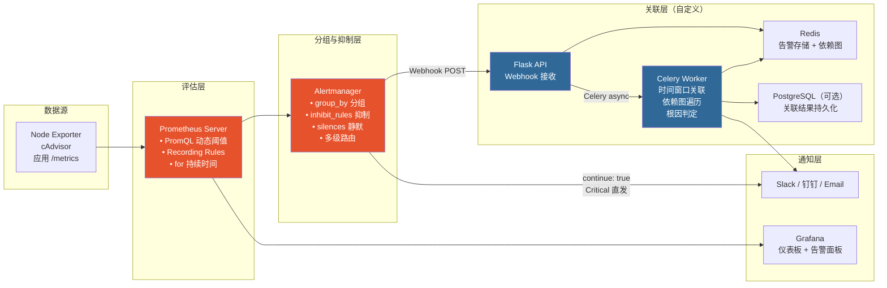
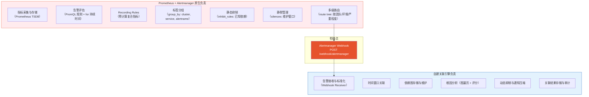
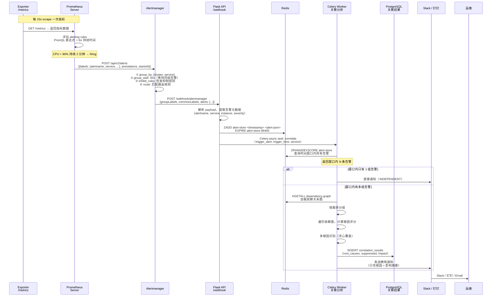
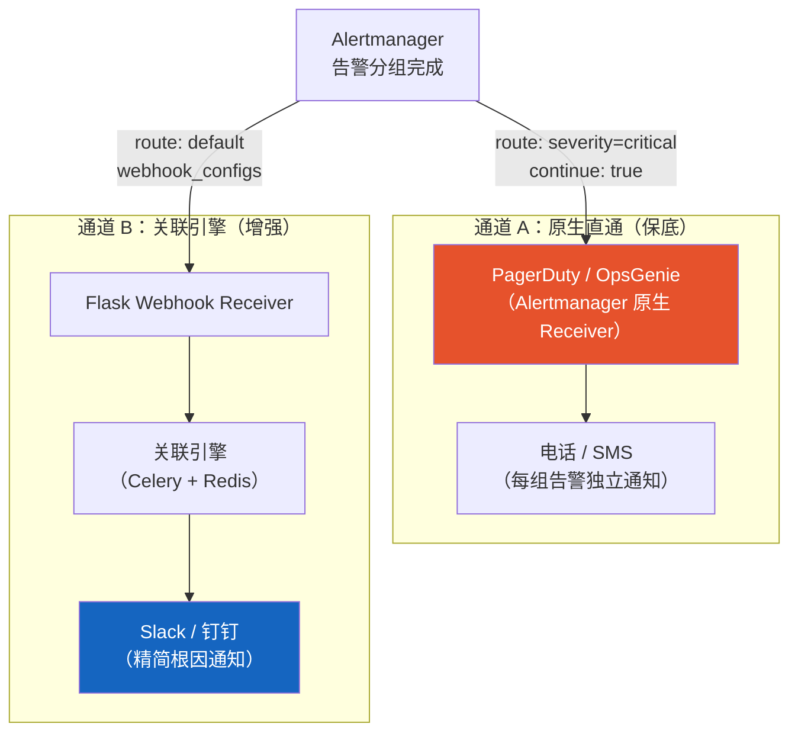
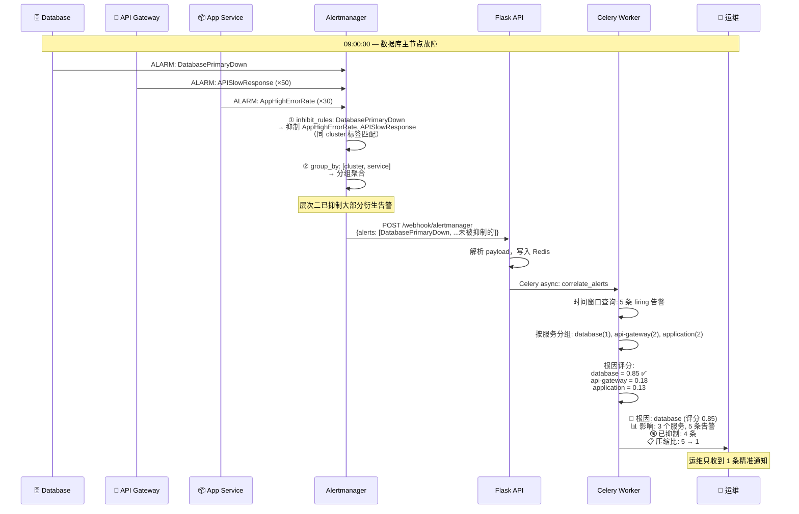
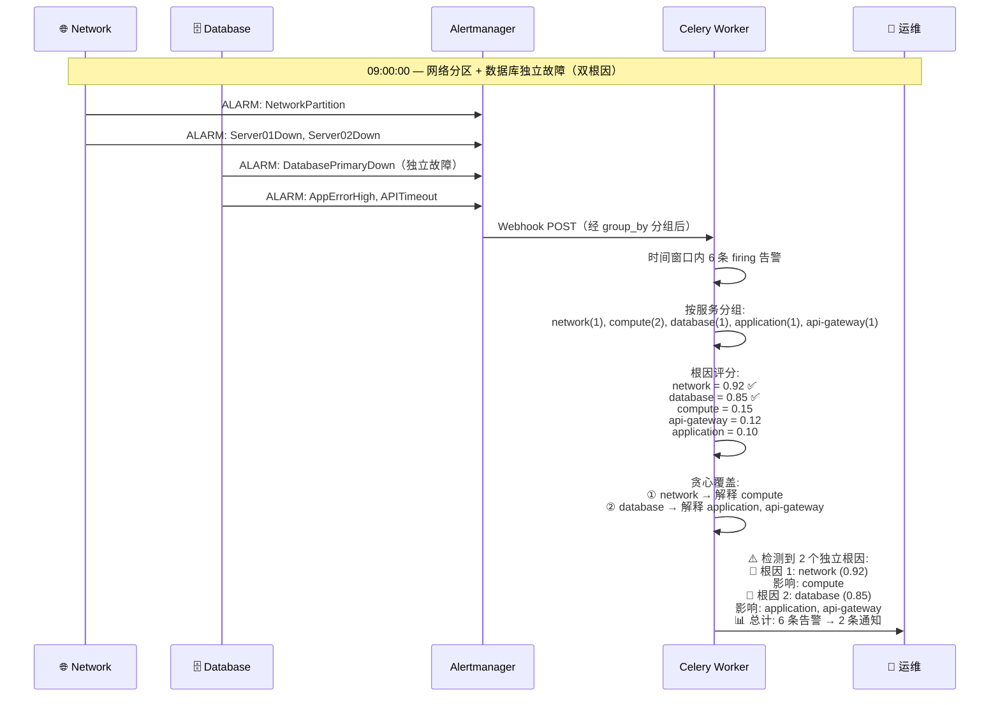

# Prometheus + Grafana 告警风暴解决方案实现

## 概述：Prometheus 原生能力与自建关联引擎的三层递进

在进入具体实现之前，先理解 Prometheus 方案的整体逻辑。与 CloudWatch 方案类似，告警风暴的治理分三层递进，但 Prometheus 生态在每一层的实现方式和能力边界有所不同：

```
层次一：告警评估（减少误报）
  PromQL 动态阈值 / for 持续时间 / Recording Rules 复合指标
        ↓ 过滤掉"不该告的"
层次二：标签分组 + 静态抑制（处理已知依赖）
  Alertmanager group_by + inhibit_rules + silences
        ↓ 压缩"已知关系的衍生告警"
层次三：自建关联引擎（处理动态/复杂依赖）
  Webhook → Flask → Redis → Celery
        ↓ 动态根因分析 + 通知压缩
  精简通知
```

### 层次一：告警评估 — 决定"什么时候该告警"

Prometheus 通过 PromQL 的强大表达能力提供三种评估机制，从源头减少误报：

**① PromQL 动态阈值**

传统固定阈值（如 CPU > 80%）无法适应指标的周期性波动。Prometheus 没有 CloudWatch 那样的内置 ML 异常检测，但 PromQL 提供了多种统计函数来构建动态基线：

```
方式一：历史基线 + 标准差
  avg_over_time(cpu[7d]) + 2 * stddev_over_time(cpu[7d])
  → 超过"过去 7 天均值 + 2 倍标准差"才告警

方式二：分位数基线
  quantile_over_time(0.95, cpu[4w])
  → 超过"过去 4 周的 95 分位数"才告警

方式三：趋势预测
  predict_linear(disk_free[6h], 3600*24)
  → 预测 24 小时后磁盘是否耗尽
```

与 CloudWatch Anomaly Detection 的对比：CloudWatch 是全自动 ML 模型，零配置；PromQL 需要手动编写表达式，但灵活性更高，可以精确控制基线计算逻辑。

→ 详见 [1.1 动态阈值规则](#11-动态阈值规则)

**② `for` 持续时间 + 多条件组合（抗抖动）**

Prometheus 的 `for` 子句要求告警条件持续满足一段时间才触发，功能类似 CloudWatch 的 M out of N，但机制不同：

```
CloudWatch M-of-N:  最近 5 个周期中 3 个超阈值 → 触发
Prometheus for:     连续 5 分钟都超阈值 → 触发（更严格）

Prometheus 近似 M-of-N 的方式:
  count_over_time((cpu > 80)[5m:1m]) >= 3
  → 5 分钟内至少 3 个 1 分钟采样点超 80%
```

此外，PromQL 天然支持多条件 AND/OR 组合，可以要求多个指标同时异常才告警：

```promql
# 错误率 > 5% AND 延迟 > 1s AND 有流量（排除低流量误报）
(rate(http_5xx[5m]) / rate(http_total[5m])) > 0.05
  and histogram_quantile(0.95, rate(http_duration_bucket[5m])) > 1.0
  and rate(http_total[5m]) > 1
```

→ 详见 [1.2 抗噪音规则](#12-抗噪音规则)

**③ Recording Rules（复合指标预计算）**

Recording Rules 是 Prometheus 特有的能力，将复杂的 PromQL 表达式预计算为新指标，类似 CloudWatch 的 Metric Math 但更强大：

```yaml
# 预计算错误率，供多条告警规则复用
- record: service:http_error_rate:5m
  expr: rate(http_requests_total{status=~"5.."}[5m]) / rate(http_requests_total[5m])

# 预计算系统健康评分
- record: instance:health_score
  expr: |
    1 - (
      (cpu_usage > 80) * 0.3 +
      (memory_usage > 85) * 0.3 +
      (disk_usage > 90) * 0.2 +
      (load_average / cpu_cores > 2) * 0.2
    )
```

Recording Rules 的优势：降低告警规则的计算开销、提高查询性能、统一指标口径。

→ 详见 [1.3 Recording Rules 与复合条件规则](#13-recording-rules-与复合条件规则)

### 层次二：标签分组 + 静态抑制 — 处理"已知的依赖关系"

Alertmanager 在这一层的能力比 CloudWatch Composite Alarm 更灵活，因为它基于标签动态匹配，而非硬编码告警名。

**① `group_by` 标签分组**

Alertmanager 将具有相同标签值的告警自动聚合为一组，一组只发一条通知：

```yaml
route:
  group_by: ['cluster', 'service', 'alertname']
  group_wait: 30s      # 等待 30 秒收集同组告警
  group_interval: 5m   # 同组新告警等 5 分钟再发
  repeat_interval: 4h  # 未恢复告警 4 小时重复一次
```

```
场景：order-service 同时触发 HighCPU、HighMemory、SlowResponse

CloudWatch 方式：需要手动创建 Composite Alarm 写死三个告警名
Alertmanager 方式：group_by: ['service'] 自动将同 service 的告警合并

结果：3 条告警 → 1 条分组通知（包含 3 条告警的摘要）
```

**② `inhibit_rules` 静态抑制**

当"源告警"触发时，自动抑制匹配的"目标告警"：

```yaml
inhibit_rules:
  # 节点宕机 → 抑制该节点上的所有其他告警
  - source_match:
      alertname: 'NodeDown'
    target_match_re:
      alertname: '.+'
    equal: ['instance']    # 同一 instance 才抑制

  # 数据库故障 → 抑制应用层错误率告警
  - source_match:
      alertname: 'DatabaseDown'
    target_match_re:
      alertname: '(AppHighErrorRate|APISlowResponse)'
    equal: ['cluster']     # 同一 cluster 才抑制
```

与 CloudWatch ActionsSuppressor 的对比：
- ActionsSuppressor 绑定在单个 Composite Alarm 上，一对一关系
- `inhibit_rules` 是全局规则，基于标签匹配，一条规则可以覆盖多个告警组合
- `inhibit_rules` 支持正则匹配（`target_match_re`），更灵活

**③ `silences` 静默管理（维护窗口）**

在计划变更期间临时静默告警，避免已知变更触发的告警干扰值班人员：

```bash
# 通过 amtool 创建静默（维护窗口 2 小时）
amtool silence add \
  --alertmanager.url=http://alertmanager:9093 \
  --author="ops-team" \
  --comment="计划维护: order-service 升级" \
  --duration=2h \
  service="order-service" environment="production"
```

也可以通过 `mute_time_intervals` 配置周期性静默（如每周二凌晨的发布窗口）。

→ 详见 [1.4 Alertmanager 完整配置](#14-alertmanager-完整配置)

### 层次三：自建关联引擎 — 处理"动态的、复杂的依赖关系"

Alertmanager 的 `group_by` 和 `inhibit_rules` 虽然比 CloudWatch Composite Alarm 更灵活，但仍然是静态配置——无法动态发现告警之间的关联，也不能做依赖图遍历和根因分析。自建关联引擎通过 Alertmanager Webhook 接收分组后的告警，在 Flask + Celery 中执行根因分析：

```
Alertmanager 分组后的告警
    → Webhook POST /webhook/alertmanager
    → Flask API（接收 + 存储到 Redis）
    → Celery Worker（时间窗口查询 + 依赖图遍历 + 根因评分）
    → Slack / 钉钉 / Email（只发送根因告警 + 影响摘要）
```

它能做到 Alertmanager 做不到的事：
- **动态关联**：不需要提前配置哪些告警相关，时间窗口内的告警自动关联
- **根因分析**：遍历依赖图，自动判断哪个组件是根因
- **通知压缩**：多组告警 → 1 条精简通知（含根因 + 影响摘要）
- **多根因识别**：同时存在多个独立故障时，分别报告

→ 详见 [第二部分：自建告警关联引擎](#第二部分自建告警关联引擎flask--redis--celery)

### 三层能力对照

| 能力 | 层次一：评估 | 层次二：标签分组/抑制 | 层次三：关联引擎 |
|------|:-----------:|:-------------------:|:---------------:|
| 减少误报 | ✅ | — | — |
| 过滤抖动 | ✅ | — | — |
| 已知依赖抑制 | — | ✅ | ✅ |
| 未知依赖发现 | — | ❌ | ✅ |
| 动态根因分析 | — | ❌ | ✅ |
| 通知压缩 | — | ✅（group_by 分组） | ✅（N → 1 摘要） |
| 多根因识别 | — | ❌ | ✅ |
| 实现成本 | 零（PromQL 规则） | 低（YAML 配置） | 中（自建 Flask + Redis） |
| 维护成本 | 低（规则审查） | 中（规则随架构变更） | 低-中（依赖图维护） |

**与 CloudWatch 方案的关键差异：**

| 维度 | CloudWatch 方案 | Prometheus 方案 |
|------|----------------|----------------|
| 层次一 | Anomaly Detection（ML 自动） | PromQL 统计函数（手动但更灵活） |
| 层次二 | Composite Alarm（硬编码告警名） | group_by + inhibit_rules（标签动态匹配） |
| 层次二能力 | 较弱（需提前写死组合） | 较强（标签匹配 + 正则 + 多级路由） |
| 层次三衔接 | EventBridge（自动捕获状态变更） | Webhook（Alertmanager 主动推送） |
| 层次三计算 | Lambda（Serverless，按调用付费） | Flask + Celery（常驻服务，固定成本） |
| 层次三存储 | DynamoDB（全托管） | Redis（需自建运维） |

> 建议实施顺序：先用层次一和层次二快速止血（零开发），再根据需要决定是否建设层次三。Prometheus 方案中层次二的能力已经相当强，很多中小规模环境仅靠 Alertmanager 的 group_by + inhibit_rules 就能有效控制告警风暴。

---

## 整体架构与组件协同

> 本章从全局视角说明 Prometheus 原生能力与自建关联引擎如何协同工作，包括整体架构、职责划分、数据流转、组件选型和容错设计。理解这些之后，再进入第一部分和第二部分的具体实现。

### 架构总览



### 职责划分：Prometheus + Alertmanager 原生 vs 自建关联引擎



| 层次 | Prometheus + Alertmanager 原生 | 自建关联引擎 | 协同方式 |
|------|-------------------------------|-------------|---------|
| 指标采集 | ✅ Prometheus scrape + Exporter | — | — |
| 告警评估 | ✅ PromQL 规则 + `for` 持续时间 | — | — |
| 复合指标 | ✅ Recording Rules 预计算 | — | — |
| 标签分组 | ✅ `group_by` 按标签聚合 | — | 同 service/cluster 的告警合并为一组 |
| 静态抑制 | ✅ `inhibit_rules` | — | 已知固定依赖用原生抑制 |
| 静默管理 | ✅ `silences` / `mute_time_intervals` | — | 维护窗口直接用原生静默 |
| 多级路由 | ✅ `route` 配置树 | — | 按团队/环境/严重程度路由 |
| 事件发布 | ✅ → Webhook Receiver | — | Alertmanager 将分组后的告警 POST 到引擎 |
| 事件接收 | — | ✅ Flask API: `/webhook/alertmanager` | 解析 Alertmanager 的 JSON payload |
| 告警存储 | — | ✅ Redis: Sorted Set（按时间索引） | TTL 自动过期 |
| 依赖图存储 | — | ✅ Redis Hash / 内存 NetworkX 图 | 或 PostgreSQL（大规模） |
| 时间窗口关联 | — | ✅ Celery Worker | 查询窗口内告警 |
| 根因分析 | — | ✅ Celery Worker | 图遍历 + 评分算法 |
| 动态抑制 | — | ✅ Celery Worker | 根因确定后抑制子组件 |
| 通知压缩 | — | ✅ → Slack / 钉钉 / Email | N 条告警 → 1 条摘要 |

> **与 CloudWatch 方案的关键差异**：Alertmanager 的 `group_by` + `inhibit_rules` 已经提供了比 CloudWatch Composite Alarm 更灵活的分组和抑制能力（基于标签动态匹配，而非硬编码告警名）。因此在 Prometheus 方案中，自建关联引擎主要补充的是**依赖图根因分析**和**跨服务的动态关联**，而非基础的分组和抑制。

### 端到端数据流



### 组件选型理由

**Prometheus Server — 指标采集与告警评估**

| 维度 | 说明 |
|------|------|
| 职责 | 指标采集（scrape）、存储（TSDB）、告警规则评估（PromQL） |
| 为什么选它 | 开源标准，生态丰富，PromQL 表达能力远超 CloudWatch Metric Math |
| 告警评估能力 | `for` 持续时间、PromQL 复合表达式、`predict_linear()` 趋势预测、Recording Rules 预计算 |
| 局限 | 不提供原生 ML 异常检测（需外挂 Prophet 或自建模型） |
| 高可用 | Thanos / Cortex / VictoriaMetrics 实现长期存储和跨集群联邦 |

**Alertmanager — 分组、抑制、路由**

| 维度 | 说明 |
|------|------|
| 职责 | 告警去重、分组（`group_by`）、抑制（`inhibit_rules`）、静默（`silences`）、路由（`route`） |
| 核心优势 | 基于标签的动态分组和抑制，无需硬编码告警名；多级路由树支持复杂的团队/环境分发 |
| 与 CloudWatch 对比 | `group_by` ≈ Composite Alarm 的 OR 组合，但更灵活；`inhibit_rules` ≈ ActionsSuppressor，但支持标签匹配 |
| 局限 | 分组是静态的（配置时确定 `group_by` 标签），不能动态发现关联；抑制规则也是静态的 |
| 衔接方式 | 通过 `webhook_configs` 将分组后的告警 POST 到自建关联引擎 |

**Flask API — 告警接收（Webhook Receiver）**

| 维度 | 说明 |
|------|------|
| 职责 | 接收 Alertmanager 的 Webhook POST，解析告警 payload，写入 Redis，触发异步关联分析 |
| 为什么用 Flask | 轻量、Python 生态与关联引擎一致、部署简单 |
| 替代方案 | FastAPI（更高性能，推荐生产环境）、Go gin（更低延迟） |
| 部署方式 | K8s Deployment（2+ 副本）或 Docker Compose |
| 关键接口 | `POST /webhook/alertmanager` — 接收告警；`GET /health` — 健康检查 |

**Redis — 告警存储与依赖图缓存**

| 用途 | 数据结构 | 为什么选 Redis |
|------|---------|---------------|
| 告警存储 | Sorted Set（score = timestamp） | 时间窗口查询天然适合 `ZRANGEBYSCORE`；亚毫秒延迟 |
| 依赖图缓存 | Hash（key = component_id, value = JSON） | 读多写少，内存访问极快 |
| 告警去重 | Set（key = `dedup:{alertname}:{instance}`） | 防止 Alertmanager 重发导致重复处理 |
| 与 DynamoDB 对比 | — | Prometheus 方案通常自建部署，Redis 是自建环境中最常见的高速存储；无需 AWS 依赖 |

```
Redis 数据结构设计:

# 告警存储（Sorted Set，score = 时间戳）
ZADD alert-store 1708300800 '{"alertname":"HighCPU","service":"compute",...}'
ZADD alert-store 1708300815 '{"alertname":"DBConnFailed","service":"database",...}'

# 时间窗口查询（5 分钟窗口）
ZRANGEBYSCORE alert-store 1708300500 1708300830
→ 返回窗口内所有告警

# 依赖图（Hash）
HSET dependency-graph network '{"type":"infrastructure","children":["compute","database","loadbalancer"]}'
HSET dependency-graph database '{"type":"database","children":["api-gateway","order-service"]}'

# 告警去重（Set + TTL）
SADD dedup:HighCPU:srv-01 1
EXPIRE dedup:HighCPU:srv-01 300
```

**Celery + Redis — 异步任务队列**

| 维度 | 说明 |
|------|------|
| 职责 | 异步执行关联分析任务，避免 Webhook 接口阻塞 |
| 为什么用 Celery | Python 生态标准异步框架；支持任务重试、超时、优先级队列 |
| Broker | Redis（复用已有 Redis，减少组件数） |
| 替代方案 | RQ（更轻量）、Dramatiq（更现代）；大规模场景可用 RabbitMQ 作为 Broker |
| 关键配置 | `task_time_limit = 60s`，`task_soft_time_limit = 45s`，`worker_concurrency = 4` |

**PostgreSQL — 关联结果持久化（可选）**

| 维度 | 说明 |
|------|------|
| 职责 | 存储关联分析结果，用于审计、报表、历史回溯 |
| 为什么用 PostgreSQL | 结构化查询能力强，适合关联结果的多维分析 |
| 替代方案 | 直接用 Redis（小规模，不需要长期审计时）；Elasticsearch（需要全文搜索时） |
| 是否必须 | 非必须。小规模环境可以只用 Redis + 日志文件 |

### 双通道容错设计

与 CloudWatch 方案的思路一致，关联引擎是增强层，不能成为通知的单点故障：



实现要点：

- Alertmanager 的 `route` 配置中，Critical 告警使用 `continue: true`，确保同时发送到原生 Receiver（PagerDuty）和关联引擎
- 关联引擎宕机时，Alertmanager 的 Webhook 发送失败会触发重试（`max_retries`），超过重试次数后告警仍然通过通道 A 送达
- 通道 A 使用 PagerDuty / OpsGenie 等专业 On-Call 平台，自带升级策略和电话通知能力

| 通道 | 触发条件 | 通知内容 | 适用场景 |
|------|---------|---------|---------|
| A: 原生直通 | Alertmanager 分组后直接发送 | 按 `group_by` 分组的告警（未做根因分析） | 关联引擎宕机时的保底；Critical 告警的即时通知 |
| B: 关联引擎 | 关联分析完成后 | 根因 + 影响摘要（压缩后） | 正常运行时的主通知通道 |

### 成本估算

Prometheus 方案的成本结构与 CloudWatch 完全不同——没有按调用付费，但需要自建和运维基础设施。

以一个中等规模环境为例（200 个告警规则，月均 5 次告警风暴，K8s 部署）：

| 组件 | 资源需求 | 月成本估算 | 说明 |
|------|---------|----------|------|
| Prometheus Server | 2 vCPU / 4GB RAM | ~$60 | 含 TSDB 存储（30 天保留） |
| Alertmanager | 0.5 vCPU / 512MB RAM (×2) | ~$15 | 高可用双副本 |
| Flask API | 0.5 vCPU / 512MB RAM (×2) | ~$15 | Webhook 接收，双副本 |
| Celery Worker | 1 vCPU / 1GB RAM (×2) | ~$30 | 关联分析，双 Worker |
| Redis | 1 vCPU / 2GB RAM | ~$20 | 告警存储 + 依赖图 + Celery Broker |
| PostgreSQL（可选） | 1 vCPU / 2GB RAM | ~$25 | 关联结果持久化 |
| Grafana | 0.5 vCPU / 512MB RAM | ~$8 | 可视化 |
| **合计（含 PG）** | — | **~$173/月** | 固定成本，不随告警量变化 |
| **合计（不含 PG）** | — | **~$148/月** | 小规模可省去 PostgreSQL |

**与 CloudWatch 方案的成本对比：**

| 维度 | CloudWatch 方案 | Prometheus 方案 |
|------|----------------|----------------|
| 基础成本 | ~$3/月（几乎为零） | ~$150/月（固定基础设施） |
| 规模增长 | 线性增长（按告警数/Lambda 调用） | 基本不变（直到资源瓶颈） |
| 1000 告警/月 | ~$10/月 | ~$150/月 |
| 10000 告警/月 | ~$50/月 | ~$150/月（可能需扩容到 ~$200） |
| 运维人力 | 低（全托管） | 中（需维护 Prometheus/Redis/K8s） |
| 盈亏平衡点 | — | 约 5000+ 告警/月时 Prometheus 更划算 |

> Prometheus 方案的优势不在成本，而在**灵活性和可控性**：PromQL 的表达能力、标签体系的灵活分组、完全自主的关联引擎逻辑、不依赖任何云厂商。适合已有 K8s 基础设施和 Prometheus 运维经验的团队。

---

## 第一部分：Prometheus + Alertmanager 原生能力（告警评估 + 标签分组/抑制）

> 本部分涵盖 Prometheus 和 Alertmanager 原生提供的能力，无需自建任何组件，通过 PromQL 规则和 YAML 配置即可使用。对应概述中的层次一（告警评估）和层次二（标签分组/抑制）。

### 1.1 动态阈值规则

#### 1.1.1 实现原理

Prometheus 没有 CloudWatch 那样的内置 ML 异常检测，但 PromQL 提供了丰富的统计函数来构建动态基线。核心思路是用历史数据计算"正常范围"，超出范围才告警。

三种常用方法：

| 方法 | PromQL 函数 | 适用场景 | 精度 |
|------|------------|---------|------|
| 均值 + 标准差 | `avg_over_time` + `stddev_over_time` | 正态分布的指标（CPU、内存） | 中 |
| 分位数基线 | `quantile_over_time` | 有长尾分布的指标（延迟、错误率） | 高 |
| 线性趋势预测 | `predict_linear` | 单调递增指标（磁盘使用率） | 中 |

#### 1.1.2 完整规则配置

```yaml
# prometheus-rules/dynamic-thresholds.yml
groups:
  - name: dynamic-thresholds
    rules:
      # ── 方法一：历史基线 + 标准差 ──
      # CPU 使用率超过"过去 7 天均值 + 2 倍标准差"且绝对值 > 70%
      - alert: HighCPUDynamic
        expr: |
          (
            avg_over_time(node_cpu_seconds_total{mode="idle"}[1h]) <
            (
              avg_over_time(node_cpu_seconds_total{mode="idle"}[7d]) -
              2 * stddev_over_time(node_cpu_seconds_total{mode="idle"}[7d])
            )
          ) and (
            (1 - avg_over_time(node_cpu_seconds_total{mode="idle"}[1h])) > 0.7
          )
        for: 10m
        labels:
          severity: warning
          category: performance
        annotations:
          summary: "CPU 使用率异常高于历史基线"
          description: "实例 {{ $labels.instance }} CPU 使用率超过历史基线 + 2σ"

      # ── 方法二：分位数基线 ──
      # 内存使用率超过过去 4 周的 95 分位数
      - alert: HighMemoryDynamic
        expr: |
          (
            node_memory_MemAvailable_bytes / node_memory_MemTotal_bytes < 0.15
          ) and (
            (1 - node_memory_MemAvailable_bytes / node_memory_MemTotal_bytes) >
            quantile_over_time(0.95, (1 - node_memory_MemAvailable_bytes / node_memory_MemTotal_bytes)[4w:5m])
          )
        for: 15m
        labels:
          severity: warning
        annotations:
          summary: "内存使用率超过历史 95 分位数"
          description: "实例 {{ $labels.instance }} 内存使用率 {{ $value | humanizePercentage }}"

      # ── 方法三：线性趋势预测 ──
      # 预测 24 小时后磁盘空间耗尽
      - alert: DiskWillFillIn24h
        expr: |
          predict_linear(node_filesystem_avail_bytes{fstype!~"tmpfs|overlay"}[6h], 24*3600) < 0
          and node_filesystem_avail_bytes > 0
        for: 30m
        labels:
          severity: warning
        annotations:
          summary: "磁盘空间预计 24 小时内耗尽"
          description: "实例 {{ $labels.instance }} 挂载点 {{ $labels.mountpoint }} 剩余 {{ $value | humanize1024 }}B"

      # ── 响应时间动态阈值 ──
      # 当前 P95 延迟超过"过去 1 小时 P95 + 3 倍标准差"，且有足够流量
      - alert: SlowResponseDynamic
        expr: |
          (
            histogram_quantile(0.95, rate(http_request_duration_seconds_bucket[5m]))
            >
            (
              avg_over_time(histogram_quantile(0.95, rate(http_request_duration_seconds_bucket[5m]))[1h:5m])
              + 3 * stddev_over_time(histogram_quantile(0.95, rate(http_request_duration_seconds_bucket[5m]))[1h:5m])
            )
          ) and (
            rate(http_requests_total[5m]) > 10
          )
        for: 5m
        labels:
          severity: warning
        annotations:
          summary: "响应时间异常 - 超过统计基线"
          description: "服务 {{ $labels.service }} P95 延迟 {{ $value | humanizeDuration }}"
```

#### 1.1.3 动态阈值方法选择指南

```
精度高 ←──────────────────────────────→ 实现简单
分位数基线    均值+标准差    固定阈值

  适用:        适用:          适用:
  延迟/错误率   CPU/内存       磁盘/队列
  有长尾分布    近似正态分布    单调变化
```

| 指标类型 | 推荐方法 | 理由 |
|---------|---------|------|
| CPU/内存 | 均值 + 2σ | 近似正态分布，标准差有效 |
| 请求延迟 | 分位数（P95/P99） | 长尾分布，均值不能反映真实情况 |
| 错误率 | 分位数（P95） | 偶发错误正常，需要排除长尾 |
| 磁盘使用率 | predict_linear | 单调递增，趋势预测更有意义 |
| 网络流量 | 均值 + 3σ | 波动大，需要更宽容的阈值 |

### 1.2 抗噪音规则

#### 1.2.1 实现原理

Prometheus 通过多种 PromQL 技巧减少告警噪音，核心思路是：**不要对单个数据点做判断，要对趋势和多维度做综合判断**。

| 技巧 | 作用 | 对应 CloudWatch |
|------|------|----------------|
| `for` 持续时间 | 要求条件持续满足 N 分钟 | 类似 M-of-N（但更严格） |
| `rate()` 平滑 | 计算速率而非瞬时值 | — |
| 多条件 AND | 多个指标同时异常才告警 | Composite Alarm AND |
| `count_over_time` | 窗口内超阈值次数 | M-of-N 的近似实现 |
| `deriv()` 趋势 | 基于变化趋势而非绝对值 | — |
| 最低流量门槛 | 低流量时不告警 | Metric Math IF 条件 |

#### 1.2.2 完整规则配置

```yaml
# prometheus-rules/noise-resistant.yml
groups:
  - name: noise-resistant-rules
    rules:
      # ── for 持续时间：过滤瞬时抖动 ──
      - alert: HighCPUStable
        expr: |
          100 - (avg by(instance) (rate(node_cpu_seconds_total{mode="idle"}[5m])) * 100) > 85
        for: 10m    # 持续 10 分钟才触发，过滤短暂峰值
        labels:
          severity: warning
        annotations:
          summary: "CPU 持续高使用率（> 85%，持续 10 分钟）"

      # ── 近似 M-of-N：窗口内超阈值次数 ──
      # 10 分钟内至少 6 个 1 分钟采样点超 80%（≈ 6/10）
      - alert: HighCPUMofN
        expr: |
          count_over_time(
            (
              (100 - (avg by(instance) (rate(node_cpu_seconds_total{mode="idle"}[1m])) * 100)) > 80
            )[10m:1m]
          ) >= 6
        for: 0s    # count_over_time 已经包含了时间窗口逻辑
        labels:
          severity: warning
        annotations:
          summary: "CPU 使用率频繁超 80%（10 分钟内 ≥ 6 次）"

      # ── 多条件组合：多指标同时异常才告警 ──
      - alert: ServiceDegraded
        expr: |
          (
            (rate(http_requests_total{status=~"5.."}[5m]) / rate(http_requests_total[5m])) > 0.01
          ) and (
            histogram_quantile(0.95, rate(http_request_duration_seconds_bucket[5m])) > 1.0
          ) and (
            rate(http_requests_total[5m]) > 1
          )
        for: 3m
        labels:
          severity: warning
        annotations:
          summary: "服务性能下降 — 错误率 + 延迟同时异常"
          description: "服务 {{ $labels.service }} 错误率和 P95 延迟同时超标"

      # ── 趋势告警：基于变化速率而非绝对值 ──
      - alert: CPUTrendIncreasing
        expr: |
          deriv(
            (100 - (avg by(instance) (rate(node_cpu_seconds_total{mode="idle"}[5m])) * 100))[30m:5m]
          ) > 0.5
          and (100 - (avg by(instance) (rate(node_cpu_seconds_total{mode="idle"}[5m])) * 100)) > 60
        for: 15m
        labels:
          severity: info
        annotations:
          summary: "CPU 使用率持续上升趋势"
          description: "实例 {{ $labels.instance }} CPU 每分钟上升约 {{ $value | printf \"%.2f\" }}%"

      # ── 错误率平滑：用较长窗口的 rate 过滤突发 ──
      - alert: HighErrorRateSmooth
        expr: |
          (
            rate(http_requests_total{status=~"5.."}[10m]) /
            rate(http_requests_total[10m])
          ) > 0.05
          and rate(http_requests_total[10m]) > 10
        for: 5m
        labels:
          severity: critical
        annotations:
          summary: "错误率持续升高（> 5%，10 分钟平滑窗口）"

      # ── 异常流量检测：基于分位数 ──
      - alert: AnomalousTraffic
        expr: |
          (
            rate(http_requests_total[5m]) >
            3 * quantile_over_time(0.95, rate(http_requests_total[5m])[1d:5m])
          ) or (
            rate(http_requests_total[5m]) <
            0.1 * quantile_over_time(0.5, rate(http_requests_total[5m])[1d:5m])
          )
        for: 10m
        labels:
          severity: info
        annotations:
          summary: "流量异常 — 超出正常范围"
```

#### 1.2.3 `for` 持续时间 vs CloudWatch M-of-N 对比

```
CloudWatch M-of-N (3/5, period=60s):
  ✗ ✓ ✗ ✗ ✗  →  触发（5 个中 4 个异常 ≥ 3）
  允许中间有正常数据点

Prometheus for: 5m:
  ✗ ✗ ✗ ✓ ✗  →  不触发（第 4 分钟正常，重置计时）
  要求连续满足条件

Prometheus count_over_time 近似 M-of-N:
  count_over_time((cpu > 80)[5m:1m]) >= 3
  ✗ ✓ ✗ ✗ ✗  →  触发（5 个中 4 个异常 ≥ 3）
  与 CloudWatch M-of-N 行为一致
```

> 建议：对于需要抗抖动但不能漏报的场景（如 CPU、错误率），优先使用 `count_over_time` 近似 M-of-N；对于需要确认持续异常的场景（如磁盘、队列积压），使用 `for` 持续时间。


### 1.3 Recording Rules 与复合条件规则

#### 1.3.1 实现原理

Recording Rules 是 Prometheus 特有的能力（CloudWatch 没有直接对应物），它将复杂的 PromQL 表达式预计算为新的时间序列指标，存储在 TSDB 中。这带来三个好处：

| 好处 | 说明 |
|------|------|
| 降低计算开销 | 复杂表达式只在 Recording Rule 评估时计算一次，告警规则直接引用预计算结果 |
| 提高查询性能 | Grafana 仪表板查询预计算指标，响应时间从秒级降到毫秒级 |
| 统一指标口径 | 多条告警规则和仪表板引用同一个 Recording Rule，避免口径不一致 |

```
不用 Recording Rules:
  告警规则 A: rate(http_5xx[5m]) / rate(http_total[5m])  ← 每次评估都计算
  告警规则 B: rate(http_5xx[5m]) / rate(http_total[5m])  ← 重复计算
  Grafana:    rate(http_5xx[5m]) / rate(http_total[5m])  ← 又算一次

用 Recording Rules:
  Recording:  service:http_error_rate:5m = rate(http_5xx[5m]) / rate(http_total[5m])
  告警规则 A: service:http_error_rate:5m > 0.05           ← 直接引用
  告警规则 B: service:http_error_rate:5m > 0.01           ← 直接引用
  Grafana:    service:http_error_rate:5m                   ← 直接引用
```

命名规范（Prometheus 官方推荐）：`level:metric_name:operations`
- `level`：聚合级别（如 `service`、`instance`、`cluster`）
- `metric_name`：原始指标名
- `operations`：应用的操作（如 `rate5m`、`avg`）

#### 1.3.2 完整规则配置

```yaml
# prometheus-rules/recording-rules.yml
groups:
  # ── 系统健康评分 ──
  - name: system-health-recording
    interval: 30s    # 每 30 秒预计算一次
    rules:
      # CPU 使用率（百分比）
      - record: instance:cpu_usage:rate5m
        expr: |
          100 - (avg by(instance) (rate(node_cpu_seconds_total{mode="idle"}[5m])) * 100)

      # 内存使用率（百分比）
      - record: instance:memory_usage:percent
        expr: |
          (1 - node_memory_MemAvailable_bytes / node_memory_MemTotal_bytes) * 100

      # 磁盘使用率（百分比）
      - record: instance:disk_usage:percent
        expr: |
          (1 - node_filesystem_avail_bytes{fstype!~"tmpfs|overlay"} / node_filesystem_size_bytes) * 100

      # 综合健康评分（0-1，越高越健康）
      - record: instance:health_score
        expr: |
          1 - clamp_max(
            (clamp_min(instance:cpu_usage:rate5m - 60, 0) / 40) * 0.3
            + (clamp_min(instance:memory_usage:percent - 70, 0) / 30) * 0.3
            + (clamp_min(instance:disk_usage:percent - 80, 0) / 20) * 0.2
            + (clamp_min(node_load1 / count without(cpu) (node_cpu_seconds_total{mode="idle"}) - 1, 0)) * 0.2
          , 1)

  # ── 应用性能指标 ──
  - name: app-performance-recording
    interval: 30s
    rules:
      # HTTP 错误率（按服务）
      - record: service:http_error_rate:5m
        expr: |
          sum by(service) (rate(http_requests_total{status=~"5.."}[5m]))
          / sum by(service) (rate(http_requests_total[5m]))

      # HTTP P95 延迟（按服务）
      - record: service:http_latency_p95:5m
        expr: |
          histogram_quantile(0.95,
            sum by(service, le) (rate(http_request_duration_seconds_bucket[5m]))
          )

      # HTTP P99 延迟（按服务）
      - record: service:http_latency_p99:5m
        expr: |
          histogram_quantile(0.99,
            sum by(service, le) (rate(http_request_duration_seconds_bucket[5m]))
          )

      # QPS（按服务）
      - record: service:http_qps:5m
        expr: |
          sum by(service) (rate(http_requests_total[5m]))

      # 可用性（按服务，非 5xx 比例）
      - record: service:availability:5m
        expr: |
          1 - service:http_error_rate:5m

  # ── 数据库指标 ──
  - name: database-recording
    interval: 30s
    rules:
      # 连接池使用率
      - record: instance:db_connection_usage:percent
        expr: |
          (pg_stat_activity_count / pg_settings_max_connections) * 100

      # 慢查询率
      - record: instance:db_slow_query_rate:5m
        expr: |
          rate(pg_stat_statements_mean_time_seconds_count{mean_time_gt="1s"}[5m])
          / rate(pg_stat_statements_calls_total[5m])

      # 复制延迟
      - record: instance:db_replication_lag:seconds
        expr: |
          pg_replication_lag_seconds

  # ── 网络与存储 ──
  - name: infra-recording
    interval: 30s
    rules:
      # 网络错误率
      - record: instance:network_error_rate:5m
        expr: |
          (rate(node_network_receive_errs_total[5m]) + rate(node_network_transmit_errs_total[5m]))
          / (rate(node_network_receive_packets_total[5m]) + rate(node_network_transmit_packets_total[5m]))

      # 磁盘 IO 利用率
      - record: instance:disk_io_utilization:5m
        expr: |
          rate(node_disk_io_time_seconds_total[5m]) * 100
```

#### 1.3.3 基于 Recording Rules 的复合告警

Recording Rules 预计算的指标可以直接用于告警规则，使告警表达式更简洁、更易维护：

```yaml
# prometheus-rules/composite-alerts.yml
groups:
  - name: composite-alerts
    rules:
      # ── 系统健康评分告警 ──
      # 健康评分低于 0.3 → 系统严重不健康
      - alert: SystemHealthCritical
        expr: instance:health_score < 0.3
        for: 5m
        labels:
          severity: critical
        annotations:
          summary: "系统健康评分严重偏低"
          description: "实例 {{ $labels.instance }} 健康评分 {{ $value | printf \"%.2f\" }}（阈值 0.3）"

      # ── 服务 SLO 违规告警 ──
      # 可用性低于 99.9% 且有足够流量
      - alert: ServiceSLOViolation
        expr: |
          service:availability:5m < 0.999
          and service:http_qps:5m > 10
        for: 5m
        labels:
          severity: critical
        annotations:
          summary: "服务 SLO 违规 — 可用性低于 99.9%"
          description: "服务 {{ $labels.service }} 可用性 {{ $value | humanizePercentage }}"

      # ── 应用性能综合告警 ──
      # 错误率 > 1% AND P95 延迟 > 2s（同时满足才告警）
      - alert: AppPerformanceDegraded
        expr: |
          service:http_error_rate:5m > 0.01
          and service:http_latency_p95:5m > 2.0
          and service:http_qps:5m > 1
        for: 3m
        labels:
          severity: warning
        annotations:
          summary: "应用性能下降 — 错误率和延迟同时异常"
          description: |
            服务 {{ $labels.service }}:
            错误率 = {{ with printf `service:http_error_rate:5m{service="%s"}` $labels.service | query }}{{ . | first | value | humanizePercentage }}{{ end }}
            P95 延迟 = {{ with printf `service:http_latency_p95:5m{service="%s"}` $labels.service | query }}{{ . | first | value | humanizeDuration }}{{ end }}

      # ── 数据库综合告警 ──
      # 连接池使用率 > 80% AND 慢查询率上升
      - alert: DatabaseStressed
        expr: |
          instance:db_connection_usage:percent > 80
          and instance:db_slow_query_rate:5m > 0.1
        for: 5m
        labels:
          severity: warning
        annotations:
          summary: "数据库压力过大 — 连接池和慢查询同时异常"

      # ── 存储综合告警 ──
      # 磁盘使用率 > 85% AND IO 利用率 > 80%
      - alert: StorageBottleneck
        expr: |
          instance:disk_usage:percent > 85
          and instance:disk_io_utilization:5m > 80
        for: 10m
        labels:
          severity: warning
        annotations:
          summary: "存储瓶颈 — 磁盘空间和 IO 同时紧张"
```

#### 1.3.4 Recording Rules vs CloudWatch Metric Math 对比

| 维度 | Recording Rules | Metric Math |
|------|----------------|-------------|
| 计算时机 | 预计算，结果存储为新指标 | 告警评估时实时计算 |
| 存储 | 占用 TSDB 存储空间 | 不额外存储 |
| 复用性 | 高（多条规则 + Grafana 共用） | 低（每个告警独立定义） |
| 表达能力 | PromQL 全部能力 | 有限的数学运算 + IF/METRICS |
| 嵌套 | 支持（Recording Rule 引用另一个 Recording Rule） | 不支持嵌套 |
| 性能 | 查询极快（已预计算） | 每次评估都计算 |
| 适用场景 | 复杂指标、高频查询、多处引用 | 简单比率计算、一次性使用 |


### 1.4 Alertmanager 完整配置

#### 1.4.1 实现原理

Alertmanager 是 Prometheus 生态中负责告警路由、分组、抑制和静默的核心组件。它接收 Prometheus Server 推送的告警，经过去重、分组、抑制、静默处理后，将告警路由到不同的通知渠道。

```
Prometheus Server
    │
    ▼ POST /api/v2/alerts
Alertmanager
    │
    ├── ① 去重（相同 fingerprint 的告警合并）
    ├── ② group_by（按标签分组）
    ├── ③ group_wait（等待同组告警聚集）
    ├── ④ inhibit_rules（检查抑制规则）
    ├── ⑤ silences（检查静默规则）
    ├── ⑥ route（匹配路由树）
    │
    ▼
通知渠道（Slack / Email / Webhook / PagerDuty）
```

Alertmanager 的核心能力对应概述中的层次二，与 CloudWatch Composite Alarm + ActionsSuppressor 的功能对标，但基于标签的动态匹配机制使其更灵活。

#### 1.4.2 完整 alertmanager.yml 配置

```yaml
# alertmanager.yml — 生产级完整配置
global:
  resolve_timeout: 5m           # 告警恢复后等待 5 分钟再发恢复通知
  smtp_from: 'alertmanager@example.com'
  smtp_smarthost: 'smtp.example.com:587'
  smtp_auth_username: 'alertmanager@example.com'
  smtp_auth_password: '${SMTP_PASSWORD}'
  smtp_require_tls: true
  slack_api_url: '${SLACK_WEBHOOK_URL}'

# ── 通知模板 ──
templates:
  - '/etc/alertmanager/templates/*.tmpl'

# ── 路由树 ──
route:
  # 默认分组标签
  group_by: ['cluster', 'service', 'alertname']
  group_wait: 30s           # 首次告警等待 30 秒收集同组告警
  group_interval: 5m        # 同组新告警等 5 分钟再发
  repeat_interval: 4h       # 未恢复告警 4 小时重复通知
  receiver: 'default-slack' # 默认接收器

  routes:
    # ── Critical 告警：立即通知 + 同时发送到关联引擎 ──
    - match:
        severity: critical
      receiver: 'pagerduty-critical'
      group_wait: 10s         # Critical 只等 10 秒
      repeat_interval: 1h     # 1 小时重复
      continue: true          # 继续匹配下一条路由（双通道容错）

    # ── 所有告警发送到关联引擎 Webhook ──
    - match_re:
        severity: 'critical|warning|info'
      receiver: 'correlation-engine-webhook'
      group_wait: 15s         # 短等待，让引擎尽快收到
      group_interval: 1m
      continue: false

    # ── 按团队路由 ──
    - match:
        team: 'database'
      receiver: 'slack-database-team'
      routes:
        - match:
            severity: critical
          receiver: 'pagerduty-database'

    - match:
        team: 'platform'
      receiver: 'slack-platform-team'

    - match:
        team: 'application'
      receiver: 'slack-app-team'

    # ── 低优先级告警：只发邮件 ──
    - match:
        severity: info
      receiver: 'email-digest'
      group_wait: 5m          # 等 5 分钟聚合
      repeat_interval: 24h    # 24 小时才重复

# ── 抑制规则 ──
inhibit_rules:
  # 规则 1: 节点宕机 → 抑制该节点上的所有其他告警
  - source_matchers:
      - alertname = "NodeDown"
      - severity = "critical"
    target_matchers:
      - severity =~ "warning|info"
    equal: ['instance']

  # 规则 2: 集群不可用 → 抑制该集群内所有告警
  - source_matchers:
      - alertname = "ClusterUnreachable"
    target_matchers:
      - alertname != "ClusterUnreachable"
    equal: ['cluster']

  # 规则 3: 数据库主节点故障 → 抑制应用层错误率告警
  - source_matchers:
      - alertname = "DatabasePrimaryDown"
      - severity = "critical"
    target_matchers:
      - alertname =~ "(AppHighErrorRate|APISlowResponse|ServiceSLOViolation)"
    equal: ['cluster']

  # 规则 4: 网络故障 → 抑制依赖网络的所有服务告警
  - source_matchers:
      - alertname = "NetworkPartition"
    target_matchers:
      - alertname != "NetworkPartition"
    equal: ['datacenter']

  # 规则 5: Critical 抑制同组件的 Warning
  - source_matchers:
      - severity = "critical"
    target_matchers:
      - severity = "warning"
    equal: ['alertname', 'instance']

# ── 接收器定义 ──
receivers:
  - name: 'default-slack'
    slack_configs:
      - channel: '#alerts-general'
        send_resolved: true
        title: '{{ .Status | toUpper }}: {{ .CommonLabels.alertname }}'
        text: >-
          {{ range .Alerts }}
          *{{ .Labels.alertname }}* ({{ .Labels.severity }})
          {{ .Annotations.summary }}
          {{ .Annotations.description }}
          {{ end }}

  - name: 'pagerduty-critical'
    pagerduty_configs:
      - service_key: '${PAGERDUTY_SERVICE_KEY}'
        severity: '{{ .CommonLabels.severity }}'
        description: '{{ .CommonAnnotations.summary }}'

  - name: 'correlation-engine-webhook'
    webhook_configs:
      - url: 'http://alert-correlation-engine:5000/webhook/alertmanager'
        send_resolved: true
        max_alerts: 0           # 不限制每次发送的告警数
        http_config:
          basic_auth:
            username: 'alertmanager'
            password: '${WEBHOOK_PASSWORD}'

  - name: 'slack-database-team'
    slack_configs:
      - channel: '#alerts-database'
        send_resolved: true

  - name: 'slack-platform-team'
    slack_configs:
      - channel: '#alerts-platform'
        send_resolved: true

  - name: 'slack-app-team'
    slack_configs:
      - channel: '#alerts-application'
        send_resolved: true

  - name: 'pagerduty-database'
    pagerduty_configs:
      - service_key: '${PAGERDUTY_DB_KEY}'

  - name: 'email-digest'
    email_configs:
      - to: 'ops-team@example.com'
        send_resolved: false
        headers:
          Subject: '[告警汇总] {{ .CommonLabels.cluster }} - {{ .Alerts | len }} 条告警'

# ── 周期性静默（维护窗口）──
# 注意: mute_time_intervals 在 Alertmanager 0.24+ 支持
mute_time_intervals:
  - name: 'weekly-maintenance'
    time_intervals:
      - weekdays: ['tuesday']
        times:
          - start_time: '02:00'
            end_time: '04:00'
```

#### 1.4.3 inhibit_rules 详解

`inhibit_rules` 是 Alertmanager 实现静态抑制的核心机制，功能对标 CloudWatch 的 ActionsSuppressor，但更灵活。

**工作原理：**

```
源告警（source）触发
    ↓
检查 equal 标签是否匹配
    ↓ 匹配
目标告警（target）的通知被抑制
```

**关键字段：**

| 字段 | 说明 | 示例 |
|------|------|------|
| `source_matchers` | 源告警匹配条件（触发抑制的告警） | `alertname = "NodeDown"` |
| `target_matchers` | 目标告警匹配条件（被抑制的告警） | `severity =~ "warning\|info"` |
| `equal` | 源和目标必须具有相同值的标签列表 | `['instance']` |

**匹配运算符（Alertmanager 0.22+）：**

| 运算符 | 说明 | 示例 |
|--------|------|------|
| `=` | 精确匹配 | `alertname = "NodeDown"` |
| `!=` | 不等于 | `alertname != "Watchdog"` |
| `=~` | 正则匹配 | `severity =~ "warning\|info"` |
| `!~` | 正则不匹配 | `alertname !~ "Info.*"` |

**与 CloudWatch ActionsSuppressor 的对比：**

| 维度 | inhibit_rules | ActionsSuppressor |
|------|--------------|-------------------|
| 作用范围 | 全局（所有告警） | 单个 Composite Alarm |
| 匹配方式 | 标签匹配（支持正则） | 硬编码告警名 |
| 一对多 | ✅ 一条规则覆盖多个告警 | ❌ 每个 Composite Alarm 单独配置 |
| 等待期 | ❌ 无（源告警触发即抑制） | ✅ `WaitPeriod`（等待根因出现） |
| 延长期 | ❌ 无 | ✅ `ExtensionPeriod` |
| 动态发现 | ❌ 静态配置 | ❌ 静态配置 |

> `inhibit_rules` 没有 ActionsSuppressor 的 WaitPeriod 机制。如果根因告警比衍生告警晚到达，衍生告警会先发出通知。这是 Alertmanager 的一个局限，自建关联引擎的时间窗口机制可以弥补。

#### 1.4.4 多级路由策略

Alertmanager 的路由配置是一棵树，从根节点开始逐级匹配，支持 `continue` 关键字实现多通道分发：

```
route (根)
  ├── severity=critical → PagerDuty (continue: true)
  │                        ↓ 继续匹配
  ├── severity=~"critical|warning|info" → Webhook（关联引擎）
  ├── team=database → Slack #database
  │     └── severity=critical → PagerDuty (database)
  ├── team=platform → Slack #platform
  ├── team=application → Slack #application
  └── severity=info → Email（低优先级）
```

**`continue: true` 的关键作用：**

```yaml
# Critical 告警同时发送到 PagerDuty 和关联引擎
- match:
    severity: critical
  receiver: 'pagerduty-critical'
  continue: true    # ← 匹配后不停止，继续匹配下一条路由

- match_re:
    severity: 'critical|warning|info'
  receiver: 'correlation-engine-webhook'
  continue: false   # ← 匹配后停止
```

这实现了双通道容错：Critical 告警既通过 PagerDuty 直接通知（保底），又发送到关联引擎做根因分析（增强）。

#### 1.4.5 silences 管理

Silences 用于在计划维护期间临时静默告警，避免已知变更触发的告警干扰值班人员。

**通过 amtool CLI 管理：**

```bash
# 创建静默（维护窗口 2 小时）
amtool silence add \
  --alertmanager.url=http://alertmanager:9093 \
  --author="ops-team" \
  --comment="计划维护: order-service v2.5 升级" \
  --duration=2h \
  service="order-service" environment="production"

# 查看当前活跃的静默
amtool silence query \
  --alertmanager.url=http://alertmanager:9093

# 提前结束静默
amtool silence expire <silence-id> \
  --alertmanager.url=http://alertmanager:9093

# 按标签查询静默
amtool silence query \
  --alertmanager.url=http://alertmanager:9093 \
  service="order-service"
```

**通过 API 管理：**

```bash
# 创建静默
curl -X POST http://alertmanager:9093/api/v2/silences \
  -H "Content-Type: application/json" \
  -d '{
    "matchers": [
      {"name": "service", "value": "order-service", "isRegex": false},
      {"name": "environment", "value": "production", "isRegex": false}
    ],
    "startsAt": "2026-02-20T02:00:00Z",
    "endsAt": "2026-02-20T04:00:00Z",
    "createdBy": "ops-team",
    "comment": "计划维护: order-service v2.5 升级"
  }'
```

**与 CloudWatch 维护窗口的对比：**

| 维度 | Alertmanager silences | CloudWatch |
|------|----------------------|------------|
| 创建方式 | CLI / API / Web UI | Console / API |
| 匹配方式 | 标签匹配（支持正则） | 按告警名 |
| 周期性 | `mute_time_intervals`（YAML 配置） | 需要 EventBridge 定时规则 |
| 审计 | Alertmanager 日志 | CloudTrail |


---

## 第二部分：自建告警关联引擎（Flask + Redis + Celery）

> 本部分是 Prometheus + Alertmanager 原生能力的扩展，用于处理动态的、复杂的依赖关系。对应概述中的层次三。需要自建 Flask API、Redis 存储和 Celery 异步 Worker。

### 2.1 架构设计

Alertmanager 的 `group_by` 和 `inhibit_rules` 能处理已知的静态依赖关系，但对于动态的、基于时间窗口的告警关联分析，需要通过 Webhook 将告警推送到自建关联引擎。

```
┌─────────────────────────────────────────────────────────────────────┐
│              Prometheus 告警关联引擎架构                             │
└─────────────────────────────────────────────────────────────────────┘

Alertmanager
    │
    ▼ POST /webhook/alertmanager
Flask API（告警接收 + 写入 Redis）
    │
    ├──▶ Redis: Sorted Set（告警存储，score = timestamp）
    │
    ▼
Celery Worker（异步关联分析）
    │
    ├── 时间窗口查询（ZRANGEBYSCORE）
    ├── 依赖图加载（Redis Hash / 内存）
    ├── 根因评分（图遍历 + 四维评分）
    ├── 多根因识别（贪心覆盖）
    │
    ├──▶ PostgreSQL（可选：关联结果持久化）
    │
    └──▶ Slack / 钉钉 / Email（精简通知）
```

**与 CloudWatch 方案的架构对应关系：**

| CloudWatch 方案 | Prometheus 方案 | 说明 |
|----------------|----------------|------|
| EventBridge Rule | Alertmanager `webhook_configs` | 事件捕获与路由 |
| Lambda: alert-intake | Flask API: `/webhook/alertmanager` | 告警接收与存储 |
| DynamoDB: alert-store | Redis: Sorted Set | 告警存储（时间索引） |
| DynamoDB: dependency-graph | Redis Hash / 内存 dict | 依赖图存储 |
| Lambda: alert-correlator | Celery Worker | 关联分析计算 |
| DynamoDB: correlation-results | PostgreSQL（可选） | 关联结果持久化 |
| SNS Topic | Slack / 钉钉 API | 通知发送 |


### 2.2 Flask Webhook 接收服务

```python
#!/usr/bin/env python3
# -*- coding: utf-8 -*-
"""
Flask Webhook 接收服务
接收 Alertmanager 的 Webhook POST，解析告警 payload，
写入 Redis，触发 Celery 异步关联分析。

对应 CloudWatch 方案中的 Lambda: alert-intake。
"""

import json
import time
import logging
import os
from flask import Flask, request, jsonify
import redis

app = Flask(__name__)
logging.basicConfig(level=logging.INFO, format='%(asctime)s %(levelname)s %(message)s')
logger = logging.getLogger(__name__)

# ── 配置 ──
REDIS_URL = os.environ.get('REDIS_URL', 'redis://localhost:6379/0')
ALERT_STORE_KEY = 'alert-store'
ALERT_TTL = int(os.environ.get('ALERT_TTL', '86400'))  # 24 小时
DEDUP_TTL = int(os.environ.get('DEDUP_TTL', '300'))     # 5 分钟去重窗口

redis_client = redis.Redis.from_url(REDIS_URL, decode_responses=True)

# 服务标签映射 —— 从 Alertmanager 标签推断所属服务
# 优先使用告警自带的 service 标签，其次从 alertname 前缀推断
ALERTNAME_SERVICE_MAP = {
    'NodeDown': 'compute',
    'HighCPU': 'compute',
    'HighMemory': 'compute',
    'DatabasePrimaryDown': 'database',
    'DBConnFailed': 'database',
    'DBSlowQuery': 'database',
    'NetworkPartition': 'network',
    'LoadBalancerUnhealthy': 'loadbalancer',
    'CacheMissHigh': 'cache',
    'APISlowResponse': 'api-gateway',
    'AppHighErrorRate': 'application',
}


def infer_service(labels: dict) -> str:
    """从告警标签推断所属服务"""
    # 优先使用显式的 service 标签
    if labels.get('service'):
        return labels['service']
    # 其次从 alertname 推断
    alertname = labels.get('alertname', '')
    for prefix, service in ALERTNAME_SERVICE_MAP.items():
        if alertname.startswith(prefix) or alertname == prefix:
            return service
    return 'unknown'


@app.route('/webhook/alertmanager', methods=['POST'])
def receive_alertmanager_webhook():
    """
    接收 Alertmanager Webhook POST

    Alertmanager Webhook payload 格式:
    {
      "version": "4",
      "groupKey": "...",
      "status": "firing" | "resolved",
      "receiver": "...",
      "groupLabels": {"cluster": "prod", "service": "order"},
      "commonLabels": {...},
      "commonAnnotations": {...},
      "externalURL": "...",
      "alerts": [
        {
          "status": "firing",
          "labels": {"alertname": "HighCPU", "instance": "srv-01", ...},
          "annotations": {"summary": "...", "description": "..."},
          "startsAt": "2026-02-20T09:00:00Z",
          "endsAt": "0001-01-01T00:00:00Z",
          "generatorURL": "...",
          "fingerprint": "abc123"
        },
        ...
      ]
    }
    """
    try:
        payload = request.get_json(force=True)
        if not payload:
            return jsonify({'error': 'empty payload'}), 400

        alerts = payload.get('alerts', [])
        group_labels = payload.get('groupLabels', {})
        now = int(time.time())
        stored_count = 0

        for alert in alerts:
            labels = alert.get('labels', {})
            alertname = labels.get('alertname', 'unknown')
            status = alert.get('status', 'unknown')
            fingerprint = alert.get('fingerprint', '')

            # 去重：同一 fingerprint 在 DEDUP_TTL 内不重复处理
            dedup_key = f"dedup:{fingerprint}"
            if redis_client.exists(dedup_key):
                logger.debug(f"跳过重复告警: {alertname} ({fingerprint})")
                continue

            # 构建标准化告警记录
            record = {
                'alertname': alertname,
                'status': status,
                'service': infer_service(labels),
                'instance': labels.get('instance', ''),
                'severity': labels.get('severity', 'warning'),
                'cluster': labels.get('cluster', ''),
                'namespace': labels.get('namespace', ''),
                'labels': labels,
                'annotations': alert.get('annotations', {}),
                'starts_at': alert.get('startsAt', ''),
                'fingerprint': fingerprint,
                'group_labels': group_labels,
                'received_at': now,
            }

            # 写入 Redis Sorted Set（score = 时间戳）
            redis_client.zadd(
                ALERT_STORE_KEY,
                {json.dumps(record): now}
            )
            # 设置去重标记
            redis_client.setex(dedup_key, DEDUP_TTL, '1')
            stored_count += 1

            # 如果是 firing 状态，触发异步关联分析
            if status == 'firing':
                from tasks import correlate_alerts
                correlate_alerts.delay(
                    trigger_alert=alertname,
                    trigger_time=now,
                    service=record['service'],
                    cluster=record['cluster'],
                )

        # 清理过期告警
        cutoff = now - ALERT_TTL
        redis_client.zremrangebyscore(ALERT_STORE_KEY, '-inf', cutoff)

        logger.info(f"处理完成: 收到 {len(alerts)} 条告警，存储 {stored_count} 条，"
                     f"去重跳过 {len(alerts) - stored_count} 条")

        return jsonify({'status': 'ok', 'stored': stored_count}), 200

    except Exception as e:
        logger.error(f"处理 Webhook 失败: {str(e)}", exc_info=True)
        return jsonify({'error': str(e)}), 500


@app.route('/health', methods=['GET'])
def health_check():
    """健康检查"""
    try:
        redis_client.ping()
        return jsonify({'status': 'healthy', 'redis': 'connected'}), 200
    except Exception as e:
        return jsonify({'status': 'unhealthy', 'error': str(e)}), 503


if __name__ == '__main__':
    app.run(host='0.0.0.0', port=5000, debug=False)
```


### 2.3 Celery 关联分析 Worker

```python
#!/usr/bin/env python3
# -*- coding: utf-8 -*-
"""
Celery 关联分析 Worker
基于时间窗口 + 依赖关系图进行根因分析。
对应 CloudWatch 方案中的 Lambda: alert-correlator。

核心算法与 02_solution_design.md 中的根因评分算法（2.3.2）对齐：
  1. 因果得分 (0.5): 父组件不在告警中 → 高分
  2. 影响范围 (0.25): 下游受影响组件越多 → 分越高
  3. 组件权重 (0.15): infrastructure > compute > database > application
  4. 时间优先 (0.10): 最早触发的告警得分更高
"""

import json
import time
import logging
import os
import uuid
import requests
from typing import Dict, List, Set, Optional
from celery import Celery
import redis

logger = logging.getLogger(__name__)

# ── Celery 配置 ──
REDIS_URL = os.environ.get('REDIS_URL', 'redis://localhost:6379/0')
celery_app = Celery('alert_correlator', broker=REDIS_URL, backend=REDIS_URL)
celery_app.conf.update(
    task_time_limit=60,
    task_soft_time_limit=45,
    worker_concurrency=4,
    task_acks_late=True,
    task_reject_on_worker_lost=True,
)

redis_client = redis.Redis.from_url(REDIS_URL, decode_responses=True)

# ── 配置 ──
ALERT_STORE_KEY = 'alert-store'
DEPENDENCY_GRAPH_KEY = 'dependency-graph'
TIME_WINDOW = int(os.environ.get('TIME_WINDOW', '300'))  # 默认 5 分钟
ROOT_CAUSE_THRESHOLD = 0.4  # 根因评分阈值
SLACK_WEBHOOK_URL = os.environ.get('SLACK_WEBHOOK_URL', '')
DINGTALK_WEBHOOK_URL = os.environ.get('DINGTALK_WEBHOOK_URL', '')


# ──────────────────────────────────────────────
# 服务依赖关系图
# 生产环境建议存储在 Redis Hash 或 PostgreSQL 中
# 格式: component_id -> {type, children}
# 含义: parent 故障会导致 children 受影响
# ──────────────────────────────────────────────
DEFAULT_DEPENDENCY_GRAPH: Dict[str, dict] = {
    'network':       {'type': 'infrastructure', 'children': ['compute', 'database', 'loadbalancer', 'cache']},
    'compute':       {'type': 'compute',        'children': ['api-gateway', 'application']},
    'database':      {'type': 'database',       'children': ['api-gateway', 'application']},
    'loadbalancer':  {'type': 'gateway',        'children': ['api-gateway']},
    'cache':         {'type': 'database',       'children': ['api-gateway', 'application']},
    'api-gateway':   {'type': 'gateway',        'children': []},
    'application':   {'type': 'application',    'children': []},
}


def load_dependency_graph() -> Dict[str, dict]:
    """从 Redis 加载依赖图，不存在则使用默认图"""
    try:
        graph_data = redis_client.hgetall(DEPENDENCY_GRAPH_KEY)
        if graph_data:
            return {k: json.loads(v) for k, v in graph_data.items()}
    except Exception as e:
        logger.warning(f"加载依赖图失败，使用默认图: {e}")
    return DEFAULT_DEPENDENCY_GRAPH


def build_reverse_graph(graph: Dict[str, dict]) -> Dict[str, List[str]]:
    """构建反向索引: child -> [parents]"""
    reverse = {}
    for parent, meta in graph.items():
        for child in meta.get('children', []):
            reverse.setdefault(child, []).append(parent)
    return reverse


# ──────────────────────────────────────────────
# 根因评分算法（与 02_solution_design.md 2.3.2 对齐）
# ──────────────────────────────────────────────

def count_downstream(component: str, graph: Dict[str, dict], visited: Set[str] = None) -> int:
    """递归计算下游受影响组件数"""
    if visited is None:
        visited = set()
    if component in visited:
        return 0
    visited.add(component)
    children = graph.get(component, {}).get('children', [])
    count = len(children)
    for child in children:
        count += count_downstream(child, graph, visited)
    return count


def calculate_root_cause_score(
    component: str,
    all_alarming: Set[str],
    graph: Dict[str, dict],
    reverse_graph: Dict[str, List[str]],
    earliest_time: Optional[int] = None,
    component_time: Optional[int] = None,
    window_seconds: int = TIME_WINDOW,
) -> float:
    """
    根因评分算法（四维评分）

    评分维度:
      1. 因果得分 (0.5): 父组件不在告警中 → 高分；父组件也在告警中 → 低分
      2. 影响范围 (0.25): 下游受影响组件越多 → 分越高
      3. 组件权重 (0.15): infrastructure > compute > database > application
      4. 时间优先 (0.10): 最早触发的告警得分更高
    """
    score = 0.0
    meta = graph.get(component, {})

    # ── 维度 1: 因果得分 (权重 0.5) ──
    parents = reverse_graph.get(component, [])
    parents_in_alarm = [p for p in parents if p in all_alarming]
    if not parents:
        causal_score = 1.0       # 无父组件 = 图的根节点
    elif not parents_in_alarm:
        causal_score = 0.9       # 父组件都没告警 → 故障起源于此
    else:
        causal_score = 0.1 * (1 - len(parents_in_alarm) / len(parents))
    score += 0.5 * causal_score

    # ── 维度 2: 影响范围 (权重 0.25) ──
    affected_count = count_downstream(component, graph)
    total_nodes = len(graph)
    impact_score = min(affected_count / max(total_nodes, 1), 1.0)
    score += 0.25 * impact_score

    # ── 维度 3: 组件权重 (权重 0.15) ──
    TYPE_WEIGHTS = {
        'infrastructure': 1.0,
        'network': 0.9,
        'compute': 0.8,
        'database': 0.7,
        'gateway': 0.5,
        'application': 0.3,
    }
    type_score = TYPE_WEIGHTS.get(meta.get('type', ''), 0.3)
    score += 0.15 * type_score

    # ── 维度 4: 时间优先 (权重 0.10) ──
    if earliest_time and component_time and window_seconds > 0:
        time_delta = component_time - earliest_time
        time_score = max(0, 1 - time_delta / window_seconds)
    else:
        time_score = 0.5  # 无时间信息时取中间值
    score += 0.10 * time_score

    return round(score, 3)


def find_all_root_causes(
    alarming_components: Set[str],
    graph: Dict[str, dict],
    reverse_graph: Dict[str, List[str]],
    service_times: Dict[str, int] = None,
) -> List[dict]:
    """
    多根因识别算法（贪心覆盖，与 02_solution_design.md 2.3.3 对齐）

    步骤:
    1. 对所有告警组件计算根因评分
    2. 按评分降序排列
    3. 贪心选择: 选中一个根因后，将其所有下游组件标记为"已解释"
    4. 继续从未解释的组件中选择下一个根因
    5. 直到所有告警组件都被解释或剩余评分低于阈值
    """
    if not alarming_components:
        return []

    earliest_time = min(service_times.values()) if service_times else None

    # 计算所有组件的根因评分
    scores = {}
    for comp in alarming_components:
        comp_time = service_times.get(comp) if service_times else None
        scores[comp] = calculate_root_cause_score(
            comp, alarming_components, graph, reverse_graph,
            earliest_time=earliest_time,
            component_time=comp_time,
        )

    sorted_components = sorted(scores.items(), key=lambda x: x[1], reverse=True)

    root_causes = []
    explained = set()

    for comp, score in sorted_components:
        if comp in explained:
            continue
        if score < ROOT_CAUSE_THRESHOLD:
            break

        root_causes.append({
            'component': comp,
            'score': score,
            'type': graph.get(comp, {}).get('type', 'unknown'),
        })
        # 标记此根因的所有下游为"已解释"
        explained.add(comp)
        _mark_downstream(comp, graph, explained)

    # 边界情况：所有组件评分都低于阈值
    if not root_causes and alarming_components:
        best = sorted_components[0]
        root_causes.append({
            'component': best[0],
            'score': best[1],
            'type': graph.get(best[0], {}).get('type', 'unknown'),
        })

    return root_causes


def _mark_downstream(component: str, graph: Dict[str, dict], explained: Set[str]):
    """递归标记下游组件为已解释"""
    for child in graph.get(component, {}).get('children', []):
        if child not in explained:
            explained.add(child)
            _mark_downstream(child, graph, explained)


# ──────────────────────────────────────────────
# Celery 异步任务
# ──────────────────────────────────────────────

@celery_app.task(bind=True, max_retries=3, default_retry_delay=10)
def correlate_alerts(self, trigger_alert: str, trigger_time: int,
                     service: str, cluster: str = ''):
    """
    告警关联分析主任务

    流程:
    1. 查询时间窗口内所有 firing 告警
    2. 按服务分组
    3. 加载依赖图
    4. 计算根因评分
    5. 多根因识别
    6. 发送精简通知
    """
    try:
        logger.info(f"开始关联分析: alert={trigger_alert}, service={service}")

        # 1. 查询时间窗口内的所有告警
        window_start = trigger_time - TIME_WINDOW
        window_end = trigger_time + 30  # 允许 30 秒时钟偏差

        raw_alerts = redis_client.zrangebyscore(
            ALERT_STORE_KEY, window_start, window_end
        )

        # 解析并过滤 firing 状态的告警
        alerts = []
        for raw in raw_alerts:
            try:
                alert = json.loads(raw)
                if alert.get('status') == 'firing':
                    alerts.append(alert)
            except json.JSONDecodeError:
                continue

        logger.info(f"时间窗口内 firing 告警数量: {len(alerts)}")

        if len(alerts) <= 1:
            # 只有触发告警自身，无需关联
            _send_notification({
                'type': 'INDEPENDENT',
                'trigger_alert': trigger_alert,
                'service': service,
                'total_alerts': len(alerts),
            })
            return {'status': 'independent', 'alerts': len(alerts)}

        # 2. 按服务分组
        service_alerts: Dict[str, List[dict]] = {}
        service_times: Dict[str, int] = {}
        for alert in alerts:
            svc = alert.get('service', 'unknown')
            service_alerts.setdefault(svc, []).append(alert)
            # 记录每个服务最早的告警时间
            alert_time = alert.get('received_at', trigger_time)
            if svc not in service_times or alert_time < service_times[svc]:
                service_times[svc] = alert_time

        # 3. 加载依赖图
        graph = load_dependency_graph()
        reverse_graph = build_reverse_graph(graph)

        # 4. 多根因识别
        alarming_services = set(service_alerts.keys())
        root_causes = find_all_root_causes(
            alarming_services, graph, reverse_graph, service_times
        )

        # 5. 构建关联结果
        root_cause_services = {rc['component'] for rc in root_causes}
        root_cause_alarms = []
        suppressed_alarms = []

        for svc, svc_alerts in service_alerts.items():
            alarm_names = [a.get('alertname', '') for a in svc_alerts]
            if svc in root_cause_services:
                root_cause_alarms.extend(alarm_names)
            else:
                suppressed_alarms.extend(alarm_names)

        correlation_id = str(uuid.uuid4())[:8]
        result = {
            'type': 'CORRELATED',
            'correlation_id': correlation_id,
            'timestamp': int(time.time()),
            'trigger_alert': trigger_alert,
            'total_alerts': len(alerts),
            'services_affected': list(service_alerts.keys()),
            'root_causes': root_causes,
            'root_cause_alarms': root_cause_alarms,
            'suppressed_alarms': suppressed_alarms,
            'time_window_seconds': TIME_WINDOW,
        }

        # 6. 存储关联结果（Redis，可选同步到 PostgreSQL）
        redis_client.setex(
            f"correlation:{correlation_id}",
            30 * 86400,  # 保留 30 天
            json.dumps(result)
        )

        # 7. 发送精简通知
        _send_notification(result)

        logger.info(f"关联分析完成: {correlation_id}, "
                     f"根因 {len(root_causes)} 个, "
                     f"抑制 {len(suppressed_alarms)} 条告警")

        return result

    except Exception as e:
        logger.error(f"关联分析失败: {str(e)}", exc_info=True)
        raise self.retry(exc=e)


def _send_notification(result: dict):
    """发送通知（Slack / 钉钉）"""
    if result.get('type') == 'INDEPENDENT':
        message = (
            f"⚡ *告警触发*\n"
            f"告警: {result['trigger_alert']}\n"
            f"服务: {result['service']}\n"
            f"（无关联告警）"
        )
    else:
        root_causes = result.get('root_causes', [])
        suppressed_count = len(result.get('suppressed_alarms', []))
        total = result.get('total_alerts', 0)

        message = f"━━━ 告警关联分析结果 ━━━\n\n"
        message += f"关联 ID: {result['correlation_id']}\n"
        message += f"时间窗口: {result['time_window_seconds']}s\n\n"

        if len(root_causes) > 1:
            message += f"⚠️ 检测到 {len(root_causes)} 个独立根因:\n\n"

        for i, rc in enumerate(root_causes, 1):
            comp = rc['component']
            score = rc['score']
            # 找出该根因服务的告警名
            rc_alarms = [a for a in result.get('root_cause_alarms', [])
                         if comp in a.lower() or True]  # 简化匹配
            message += f"📍 根因{f' {i}' if len(root_causes) > 1 else ''}: "
            message += f"{comp} (评分 {score})\n"

        message += (
            f"\n📊 影响范围:\n"
            f"   受影响服务: {len(result.get('services_affected', []))} 个\n"
            f"   总告警数: {total} 条\n"
            f"   已抑制: {suppressed_count} 条\n"
            f"   通知压缩比: {total} → {len(root_causes)}"
            f"（减少 {suppressed_count} 条噪音）\n"
        )

        if result.get('suppressed_alarms'):
            message += f"\n🔇 被抑制的告警:\n"
            for alarm in result['suppressed_alarms'][:10]:
                message += f"   • {alarm}\n"
            remaining = len(result['suppressed_alarms']) - 10
            if remaining > 0:
                message += f"   ... 还有 {remaining} 条\n"

    # 发送到 Slack
    if SLACK_WEBHOOK_URL:
        try:
            requests.post(SLACK_WEBHOOK_URL, json={'text': message}, timeout=10)
        except Exception as e:
            logger.error(f"Slack 通知失败: {e}")

    # 发送到钉钉
    if DINGTALK_WEBHOOK_URL:
        try:
            requests.post(DINGTALK_WEBHOOK_URL, json={
                'msgtype': 'text',
                'text': {'content': message}
            }, timeout=10)
        except Exception as e:
            logger.error(f"钉钉通知失败: {e}")

    logger.info(f"通知已发送: {message[:100]}...")
```


### 2.4 Docker / Kubernetes 部署

#### 2.4.1 Docker Compose（开发/测试环境）

```yaml
# docker-compose.yml
version: '3.8'

services:
  # ── Prometheus ──
  prometheus:
    image: prom/prometheus:v2.51.0
    ports:
      - "9090:9090"
    volumes:
      - ./prometheus.yml:/etc/prometheus/prometheus.yml
      - ./prometheus-rules:/etc/prometheus/rules
      - prometheus-data:/prometheus
    command:
      - '--config.file=/etc/prometheus/prometheus.yml'
      - '--storage.tsdb.retention.time=30d'
      - '--web.enable-lifecycle'

  # ── Alertmanager ──
  alertmanager:
    image: prom/alertmanager:v0.27.0
    ports:
      - "9093:9093"
    volumes:
      - ./alertmanager.yml:/etc/alertmanager/alertmanager.yml
    command:
      - '--config.file=/etc/alertmanager/alertmanager.yml'
      - '--cluster.listen-address='
    depends_on:
      - correlation-engine

  # ── Redis ──
  redis:
    image: redis:7-alpine
    ports:
      - "6379:6379"
    volumes:
      - redis-data:/data
    command: redis-server --appendonly yes --maxmemory 256mb --maxmemory-policy allkeys-lru

  # ── Flask Webhook 接收服务 ──
  correlation-engine:
    build:
      context: ./correlation-engine
      dockerfile: Dockerfile
    ports:
      - "5000:5000"
    environment:
      - REDIS_URL=redis://redis:6379/0
      - ALERT_TTL=86400
      - SLACK_WEBHOOK_URL=${SLACK_WEBHOOK_URL}
      - DINGTALK_WEBHOOK_URL=${DINGTALK_WEBHOOK_URL}
    depends_on:
      - redis
    healthcheck:
      test: ["CMD", "curl", "-f", "http://localhost:5000/health"]
      interval: 30s
      timeout: 5s
      retries: 3

  # ── Celery Worker ──
  celery-worker:
    build:
      context: ./correlation-engine
      dockerfile: Dockerfile
    command: celery -A tasks worker --loglevel=info --concurrency=4
    environment:
      - REDIS_URL=redis://redis:6379/0
      - TIME_WINDOW=300
      - SLACK_WEBHOOK_URL=${SLACK_WEBHOOK_URL}
      - DINGTALK_WEBHOOK_URL=${DINGTALK_WEBHOOK_URL}
    depends_on:
      - redis

  # ── Grafana ──
  grafana:
    image: grafana/grafana:10.4.0
    ports:
      - "3000:3000"
    volumes:
      - grafana-data:/var/lib/grafana
    environment:
      - GF_SECURITY_ADMIN_PASSWORD=${GRAFANA_PASSWORD:-admin}

  # ── PostgreSQL（可选：关联结果持久化）──
  postgres:
    image: postgres:16-alpine
    ports:
      - "5432:5432"
    environment:
      - POSTGRES_DB=alert_correlation
      - POSTGRES_USER=correlation
      - POSTGRES_PASSWORD=${PG_PASSWORD:-changeme}
    volumes:
      - postgres-data:/var/lib/postgresql/data
    profiles:
      - with-postgres    # 仅在 --profile with-postgres 时启动

volumes:
  prometheus-data:
  redis-data:
  grafana-data:
  postgres-data:
```

**correlation-engine/Dockerfile：**

```dockerfile
FROM python:3.12-slim

WORKDIR /app

COPY requirements.txt .
RUN pip install --no-cache-dir -r requirements.txt

COPY app.py tasks.py ./

EXPOSE 5000

CMD ["gunicorn", "-w", "2", "-b", "0.0.0.0:5000", "app:app"]
```

**correlation-engine/requirements.txt：**

```
flask==3.0.*
gunicorn==22.*
redis==5.*
celery==5.4.*
requests==2.*
```


#### 2.4.2 Kubernetes 部署（生产环境）

```yaml
# k8s/namespace.yml
apiVersion: v1
kind: Namespace
metadata:
  name: alert-correlation
  labels:
    app.kubernetes.io/part-of: alert-correlation-engine
---
# k8s/redis.yml
apiVersion: apps/v1
kind: Deployment
metadata:
  name: redis
  namespace: alert-correlation
spec:
  replicas: 1
  selector:
    matchLabels:
      app: redis
  template:
    metadata:
      labels:
        app: redis
    spec:
      containers:
        - name: redis
          image: redis:7-alpine
          ports:
            - containerPort: 6379
          command: ["redis-server", "--appendonly", "yes", "--maxmemory", "512mb"]
          resources:
            requests:
              cpu: 250m
              memory: 512Mi
            limits:
              cpu: 500m
              memory: 1Gi
          volumeMounts:
            - name: redis-data
              mountPath: /data
          livenessProbe:
            exec:
              command: ["redis-cli", "ping"]
            initialDelaySeconds: 5
            periodSeconds: 10
      volumes:
        - name: redis-data
          persistentVolumeClaim:
            claimName: redis-pvc
---
apiVersion: v1
kind: Service
metadata:
  name: redis
  namespace: alert-correlation
spec:
  selector:
    app: redis
  ports:
    - port: 6379
      targetPort: 6379
---
apiVersion: v1
kind: PersistentVolumeClaim
metadata:
  name: redis-pvc
  namespace: alert-correlation
spec:
  accessModes: [ReadWriteOnce]
  resources:
    requests:
      storage: 5Gi
---
# k8s/correlation-engine.yml
apiVersion: apps/v1
kind: Deployment
metadata:
  name: correlation-engine
  namespace: alert-correlation
spec:
  replicas: 2    # 双副本高可用
  selector:
    matchLabels:
      app: correlation-engine
  template:
    metadata:
      labels:
        app: correlation-engine
    spec:
      containers:
        - name: flask-api
          image: your-registry/correlation-engine:latest
          ports:
            - containerPort: 5000
          env:
            - name: REDIS_URL
              value: "redis://redis.alert-correlation:6379/0"
            - name: ALERT_TTL
              value: "86400"
            - name: SLACK_WEBHOOK_URL
              valueFrom:
                secretKeyRef:
                  name: notification-secrets
                  key: slack-webhook-url
          resources:
            requests:
              cpu: 250m
              memory: 256Mi
            limits:
              cpu: 500m
              memory: 512Mi
          livenessProbe:
            httpGet:
              path: /health
              port: 5000
            initialDelaySeconds: 10
            periodSeconds: 15
          readinessProbe:
            httpGet:
              path: /health
              port: 5000
            initialDelaySeconds: 5
            periodSeconds: 5
---
apiVersion: v1
kind: Service
metadata:
  name: correlation-engine
  namespace: alert-correlation
spec:
  selector:
    app: correlation-engine
  ports:
    - port: 5000
      targetPort: 5000
---
# k8s/celery-worker.yml
apiVersion: apps/v1
kind: Deployment
metadata:
  name: celery-worker
  namespace: alert-correlation
spec:
  replicas: 2    # 双 Worker
  selector:
    matchLabels:
      app: celery-worker
  template:
    metadata:
      labels:
        app: celery-worker
    spec:
      containers:
        - name: celery
          image: your-registry/correlation-engine:latest
          command: ["celery", "-A", "tasks", "worker",
                    "--loglevel=info", "--concurrency=4"]
          env:
            - name: REDIS_URL
              value: "redis://redis.alert-correlation:6379/0"
            - name: TIME_WINDOW
              value: "300"
            - name: SLACK_WEBHOOK_URL
              valueFrom:
                secretKeyRef:
                  name: notification-secrets
                  key: slack-webhook-url
          resources:
            requests:
              cpu: 500m
              memory: 512Mi
            limits:
              cpu: 1000m
              memory: 1Gi
          livenessProbe:
            exec:
              command: ["celery", "-A", "tasks", "inspect", "ping",
                        "--timeout", "10"]
            initialDelaySeconds: 30
            periodSeconds: 60
---
# k8s/secrets.yml（示例，生产环境使用 External Secrets 或 Sealed Secrets）
apiVersion: v1
kind: Secret
metadata:
  name: notification-secrets
  namespace: alert-correlation
type: Opaque
stringData:
  slack-webhook-url: "https://hooks.slack.com/services/xxx/yyy/zzz"
---
# k8s/hpa.yml — 自动扩缩
apiVersion: autoscaling/v2
kind: HorizontalPodAutoscaler
metadata:
  name: correlation-engine-hpa
  namespace: alert-correlation
spec:
  scaleTargetRef:
    apiVersion: apps/v1
    kind: Deployment
    name: correlation-engine
  minReplicas: 2
  maxReplicas: 5
  metrics:
    - type: Resource
      resource:
        name: cpu
        target:
          type: Utilization
          averageUtilization: 70
---
apiVersion: autoscaling/v2
kind: HorizontalPodAutoscaler
metadata:
  name: celery-worker-hpa
  namespace: alert-correlation
spec:
  scaleTargetRef:
    apiVersion: apps/v1
    kind: Deployment
    name: celery-worker
  minReplicas: 2
  maxReplicas: 8
  metrics:
    - type: Resource
      resource:
        name: cpu
        target:
          type: Utilization
          averageUtilization: 60
```


### 2.5 告警风暴处理示例

#### 2.5.1 单根因场景



#### 2.5.2 多根因场景



#### 2.5.3 Alertmanager 层次二 vs 关联引擎层次三的协同

```
场景: 数据库故障导致 80 条应用层告警

层次二（Alertmanager 原生）处理后:
  inhibit_rules: DatabasePrimaryDown 抑制 AppHighErrorRate, APISlowResponse
  group_by: [cluster, service] 将剩余告警分组
  结果: 80 条 → ~5 组通知（大幅减少，但仍有多组）

层次三（关联引擎）处理后:
  时间窗口关联 + 依赖图遍历 + 根因评分
  结果: 5 组 → 1 条根因通知（精准定位 database）

两层协同效果: 80 条告警 → 1 条精准通知
```

> Prometheus 方案中层次二的能力已经相当强（`inhibit_rules` 基于标签动态匹配），很多中小规模环境仅靠 Alertmanager 就能有效控制告警风暴。层次三的关联引擎主要在大规模、多服务、复杂依赖的场景中发挥价值。
