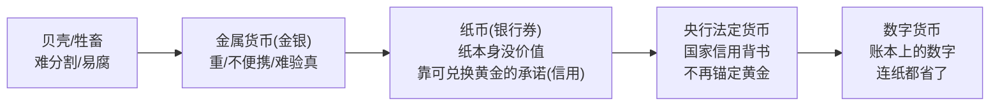
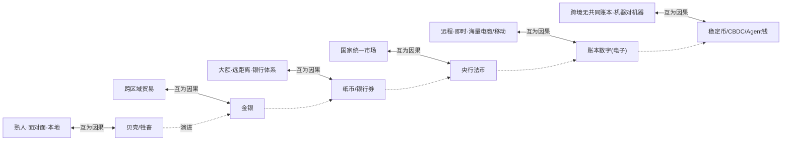
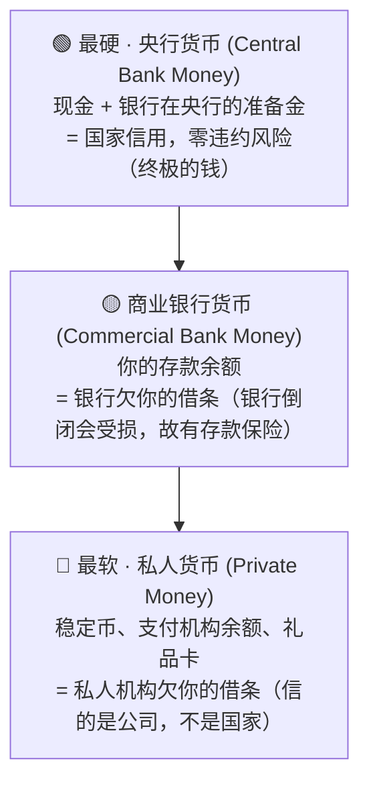
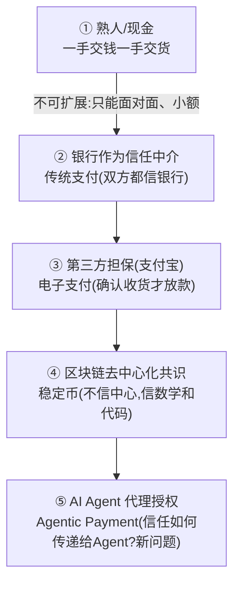
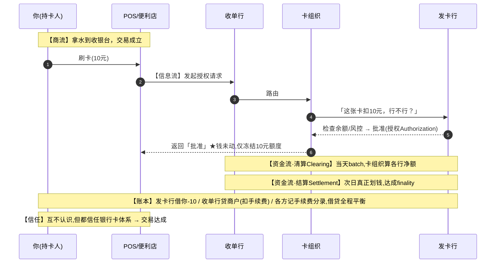

# 模块 0 · 地基（业务篇）：钱、账本、信用与清结算

> **学习者**：AWS 技术架构师 · 支付小白
> **本篇目标**：建立支付的"物理定律"——不懂这层，后面所有名词都是空中楼阁。学完你能用第一性原理回答：钱是什么？账本为什么是支付的核心？清算和结算到底差在哪？跟支付公司聊天时这些是"不露怯的根基"。
> **配套**：技术篇见 `00-foundation-tech.md`
> 标注：📌 关键定义 · 💡 案例 · 🎯 与支付公司交流要点 · ⚠️ 常见误区

---

## 开篇：为什么从"钱和账本"讲起

你是架构师，习惯先问"这个系统的核心抽象是什么"。支付系统的核心抽象只有一个词：**账本（Ledger）**。

所有支付公司——无论是工商银行、支付宝、Visa、连连，还是 Circle（发 USDC 的）——剥开所有产品和话术，本质都是**一家"账本运营公司"**：它维护一个记录"谁拥有多少钱"的账本，并提供"安全地修改这个账本"的服务。

> 🎯 **交流要点**：当你和支付公司技术高管聊天，如果你能说出"你们的核心其实是一个高一致性、强对账、可审计的账本系统，产品都是账本之上的接入层"，对方会立刻知道你懂行。这是整个支付领域的"第一性"。

下面我们从最底层一层层往上盖。

> 📍 **全景预告**：在钻进地基前，建议先扫一眼 `支付概念全景地图.md`——它把支付领域全部术语（发卡/收单/POS/SoftPOS/网关/虚拟卡/拒付/分账/代付/钱包/二维码/代理行/稳定币/Agent…）按所属模块排好，每个配一句"解决什么问题"。**先有整张地图，再逐块深挖，不会迷路。** 本模块讲的是地图最底层的"地基层"。

---

## 第一性追问 1：钱到底是什么？

### 1.1 问题的起点：没有钱的世界会怎样

想象没有钱，只有**以物易物（barter）**。你是养鸡的，想换一双鞋。问题立刻出现：

1. **需求双重巧合**：你得正好找到"一个想要鸡、又正好有鞋、又愿意换"的人。这个匹配成本极高。
2. **价值无法度量**：一只鸡 = 几双鞋？没有统一标尺。
3. **价值无法储存**：鸡会死，你没法把"劳动成果"存起来留到明年。

**钱，就是为解决这三个问题而被发明的。** 它的三大本职功能（这是教科书定义，但请用"解决什么问题"的角度记）：

📌 **钱的三大功能**：
| 功能 | 解决的问题 |
|---|---|
| **交易媒介**(medium of exchange) | 解决"需求双重巧合"——人人都收钱，不用以物易物 |
| **价值尺度**(unit of account) | 解决"无法度量"——一切用钱标价，有了统一标尺 |
| **价值储藏**(store of value) | 解决"无法储存"——把劳动成果存成钱，留到将来 |

### 1.2 钱的形态演进：实物 → 信用

钱本身也在演进，每一步都是为解决上一步的痛点：



📌 **最关键的认知飞跃**：现代的钱已经**不是"东西"，而是"信用"**。

你银行卡里的"10000 元"，不是金库里有 10000 元实物等着你，而是**一条记录 + 一个承诺**："银行欠你 10000 元，你随时可以取用。" 钱变成了**账本上的一个数字 + 背后的信用**。

> 💡 **案例**：你给朋友微信转 100 元。没有任何"100 元"实物移动。发生的只是：微信（及背后的银行）在账本上，把你的数字 -100、朋友的数字 +100。**钱从未移动，移动的只是账本上的数字。** 这句话请刻进脑子，它是整个支付领域的地基公理。

#### 1.2.1 钱的形态 ↔ 交易场景：互为因果、协同演进 🔧

> 🔑 **关键认知**：钱的形态**不是孤立地自己变**——它和"交易场景/模式"是**互为因果、协同演进**的。**新交易场景倒逼新钱形态，新钱形态又解锁新交易场景**，互相拉着往前走。



| 钱的形态 | 对应主导交易场景 | 因果关系（双向） |
|---|---|---|
| 贝壳/牲畜 | 熟人、面对面、本地小范围 | 场景小→对钱要求低；但难分割/易腐**限制**了交易规模 |
| 金银 | 跨区域贸易兴起 | 远距离贸易**需要**标准化保值载体；金银又**使**跨区贸易可行 |
| 纸币/银行券 | 大额、远距离、银行体系 | 搬金银不现实→**需要**"凭证+承诺"；纸币又**解锁**更大异地交易 |
| 央行法币 | 国家统一市场、现代经济 | 统一市场**需要**统一货币；法币又**支撑**全国性经济 |
| 账本数字（电子） | 远程、即时、海量电商/移动支付 | 网购/扫码**需要**钱瞬间远程转移；数字钱又**催生**电商爆发 |
| 稳定币/CBDC/Agent | 跨境无共同账本、机器对机器 | 跨境/AI 支付**需要**新账本；它们又**打开**新场景 |

- **场景拉动钱**：出现"现有钱搞不定"的新场景（更远/更大/更快/更碎）→ 倒逼新钱形态。
- **钱使能场景**：新钱形态成熟后**反过来解锁**原不可能的交易规模与模式——正反馈。
- 🔑 **所以钱的演进史 = 交易场景的扩张史**：从"熟人面对面"一路扩张到"陌生人跨境、甚至机器自动交易"。这正好呼应全研究主线——**支付 = 在共同信任的账本上改数字**；钱的演进本质是"账本+信任"不断适配越来越难的场景，直到跨境/Agentic 这种"没有共同账本"的极限场景，逼出稳定币/CBDC/智能体支付这**四套管道**（见 `CLAUDE.md §五` 四套管道心智模型）。

### 1.3 钱的"等级"：不是所有的钱都一样硬

这是和支付公司（尤其跨境/稳定币）深聊时极其重要的概念。你以为"钱就是钱"，但在金融体系里，**钱分等级**：

📌 **货币层级（Money Hierarchy）**：


**为什么这个分级重要？**

- 平时你感觉不到差别，因为它们能 1:1 互换（你存款能随时取现金）。
- 但在**跨境、大额、危机**时，等级就是**安全的生死线**：没人怀疑央行货币会违约，但谁都可能怀疑一家私人公司或一家外国银行。
- 这解释了后面很多设计：为什么银行间大额结算要用"央行货币"（最硬）；为什么稳定币暴雷（如 UST）会引发恐慌（它是最软的私人货币）；为什么央行要做 CBDC（把最硬的钱数字化）。

> 🎯 **交流要点**：能区分"这笔钱是央行货币还是商业银行货币还是私人货币"，是判断一个支付方案"风险等级"的核心视角。跨境支付公司天天在不同等级的钱之间转换。

---

## 第一性追问 2：账本是什么？为什么是支付的核心

### 2.1 账本的本质：记录"谁拥有什么"

既然钱是"账本上的数字 + 信用"，那么**支付 = 修改账本**。account（账户）这个词，词根就是"计数/记账"。

📌 **账本（Ledger）**：一个记录"每个账户拥有多少价值"的数据结构，以及所有变动的历史记录。

支付系统要做的，就是**安全、准确、不可抵赖地修改这个账本**。这里"安全准确"四个字，撑起了整个支付技术的半壁江山（技术篇细讲）。

### 2.2 复式记账：500 年不变的地基算法

这是会计的核心，也是每个支付/账务系统的底层算法。请务必理解，因为**所有支付公司的账务系统都基于它**。

📌 **复式记账（Double-Entry Bookkeeping）**：每一笔交易，必须**同时记录两条（或多条）方向相反的分录**，且**借方总额 = 贷方总额**（恒等）。

💡 **案例**：你向商户付款 100 元。账本上不是只改一个数字，而是：
```
借（Debit）：  你的账户    -100
贷（Credit）：  商户的账户  +100
              ───────────────
              合计:  -100 + 100 = 0  ✓ 永远平衡
```

**为什么要这么"麻烦"？第一性原因：**
1. **钱不会凭空产生或消失**——每一笔"出"必有对应的"入"，总账永远平衡。
2. **自带纠错能力**——如果借贷不平，立刻知道账错了。这是金融系统"对账"的基础。
3. **可审计、可追溯**——每一分钱的来龙去脉都有完整记录。

> 🎯 **交流要点**：支付公司面试/交流常考"一笔支付在账上怎么记"。能脱口而出"借贷必相等、资金有来源有去向、加上手续费分录"就过关了。手续费的例子：用户付 100，商户实收 99.4，通道收 0.6——账上是三条分录，借用户 100，贷商户 99.4，贷手续费收入 0.6，依然平衡。

### 2.3 账户体系：钱"装"在哪里

📌 支付系统里的账户不止"用户余额"一种，常见的有：
- **用户账户**：C 端/B 端客户的余额。
- **备付金账户/资金池**：支付机构代客户保管的钱（合规上严格隔离）。
- **中间账户/过渡账户**：资金在途时的临时停靠（如待结算）。
- **手续费/收入账户**：平台自己的收入。
- **准备金账户**：在央行或合作银行的账户。

💡 资金从 A 到 B，往往不是"一步到位"，而是在多个内部账户间流转，每一步都是一组复式记账分录。这就是为什么支付系统的账务模型复杂。

---

## 第一性追问 3：清算与结算——支付的"心脏搏动"

这是整个支付领域**最重要、最容易混淆**的一对概念。分清它，你就超过了 80% 的入门者。

### 3.1 用一个例子彻底讲透

设想 A 银行的客户和 B 银行的客户之间，今天发生了很多笔互相转账。一天下来：

📌 **清算（Clearing）= 交换信息 + 算账（算净额）**
> 两家银行交换所有支付指令，核对，计算出"轧差后谁该给谁多少净额"。比如算下来：今天 A 一共净欠 B 100 万。**此时钱还没动，只是"算清了账单"。**

📌 **结算（Settlement）= 真正划转资金 + 不可撤销（Finality）**
> A 真的把 100 万，从它在央行的账户，划到 B 在央行的账户。**钱动了，而且板上钉钉、不可逆。**

一句话记忆：
> **清算是"对账算钱"（说好谁该给谁多少），结算是"真的付钱"（且不能反悔）。**

### 3.2 为什么要把这两步分开？第一性原因

你可能会问：为什么不每笔都立刻划钱，非要先算账？因为有一个核心权衡——**流动性 vs 风险**：

| | 方案A：逐笔全额实时结算 (RTGS) | 方案B：批量轧差净额结算 (Netting) |
|---|---|---|
| 机制 | 每笔交易立刻在央行账本全额划转 | 攒一批，算净额，定时只划净额 |
| ✓ 优 | 安全：即时最终，无信用风险 | 省流动性：只需准备净额的钱 |
| ✗ 劣 | 耗流动性：每笔都要备足全款 | 有风险：结算前存在敞口（对手方可能违约） |
| 适合 | 大额、关键支付 | 海量小额支付 |

💡 **案例（美元的两套系统配合）**：
- **Fedwire**（美联储）= RTGS，逐笔全额实时，用于大额关键支付。
- **CHIPS**（私营）= 净额清算，海量跨境美元先轧差，日均 ~2.2 万亿美元，最后净额再到 Fedwire 做最终结算。
- **两者互补**：大额求稳走 RTGS，海量求省走 Netting。

> 🎯 **交流要点**：跨境支付的"慢"（T+2~T+5）很大程度来自清算结算的批量周期 + 跨时区 + 多级代理行。能从"清算结算分离 + 净额批处理"角度解释"为什么跨境慢"，比只会说"因为要过很多银行"高一个段位。

### 3.3 Finality（结算最终性）：金融系统的"承诺即真理"

📌 **结算最终性（Settlement Finality）**：一笔结算一旦完成，就**不可撤销、不可逆转**，法律和系统都认它板上钉钉。

**为什么这是金融的命根子？** 因为如果结算可以被随意撤销，那整个信任体系就崩了——你收到的钱随时可能被收回，谁还敢做生意？所以各国法律专门保护支付系统的结算最终性。

> ⚠️ **常见误区**：很多人以为"到账了就是结算完成了"。其实不一定——你看到余额增加，可能只是"清算完成的预记账"，真正的结算（央行层面资金划转）可能还在后面。退款/拒付（chargeback）能发生，正是因为某些环节还没达到最终性。稳定币之所以被认为"先进"，关键之一就是**链上转账确认即达成最终性（转账即结算）**，没有清算结算的时间差。

---

## 第一性追问 4：三个"流"——支付不只是钱在动

和支付公司聊业务，必须能区分三条并行的"流"。这是理解任何支付场景的框架：

📌 **支付的三流**：
| 流 | 是什么 | 例子 |
|---|---|---|
| **商流** | 商品/服务的所有权转移、订单 | 你下单买手机，订单生成 |
| **信息流** | 支付指令、报文、通知 | "请扣款 100 元"的指令在系统间传递（如 SWIFT 报文、ISO 8583） |
| **资金流** | 真实的资金划转 | 钱在账本/清算系统里实际移动 |

**关键洞察：三流往往不同步、不同路径。**

💡 **案例（跨境电商）**：
- **商流**：美国买家在 Amazon 下单（瞬间）。
- **信息流**：支付指令、SWIFT 报文在银行间传递（分钟~小时）。
- **资金流**：美元在美国清算、人民币在中国清算，靠汇率和代理行缝合，卖家几天后才真正收到人民币（T+N）。

> 🎯 **交流要点**：信息流和资金流分离，是理解 SWIFT 的钥匙——**SWIFT 只传信息流（报文），不碰资金流（不搬钱）**。能讲清这点，说明你真懂跨境支付的"管道"。

---

## 第一性追问 5：支付为什么需要"信任中介"

### 5.1 核心问题：陌生人之间凭什么敢交易

支付的本质难题之一是**信任**。你和一个陌生的卖家：
- 你怕"付了钱不发货"。
- 卖家怕"发了货收不到钱"。

这就是著名的**双花问题/信任问题**。解决它有几种思路，正好对应支付的几个时代：



📌 **洞察**：支付的每一次时代跃迁，本质都是**"信任如何建立"的方案升级**。这条线索会贯穿你后面所有模块的学习。

### 5.2 信任中介的价值与代价

中介（银行、支付机构、卡组织）提供信任，但要收费、要时间、要合规。这就埋下了后续所有创新的动机：**能不能更便宜、更快、更少中介地建立信任？** 稳定币和 Agentic Payment 都是对这个问题的新回答。

---

## 综合案例：一笔支付的完整业务视角

把上面所有概念串起来。你在便利店用银行卡买一瓶 10 元的水：



**这一个例子里藏着**：钱是账本数字、复式记账、授权 vs 清算 vs 结算、三流分离、信任中介、货币等级（你的存款是商业银行货币）。这就是地基的全部要素。

> ⚠️ **重要提醒：这只是"POS 线下卡支付"一种范式！**
> 上面这个便利店案例用的是**传统 POS 线下银行卡支付**的资金路径。它只是众多支付范式中的一种——换成 SoftPOS、电商网关支付、第三方钱包、稳定币、Agentic 支付，**参与方、三流路径、清结算方式、信任机制都会不同**。例如：
> - **稳定币支付**：没有"清算 vs 结算"分离（转账即结算），没有卡组织。
> - **钱包余额支付**：可能根本不经过卡组织，在钱包内部记账完成。
> - **Agentic 支付**：多了"人如何授权 Agent 代付"这一全新环节。
>
> 这些差异会在**各自模块**详细讲解（POS→模块1，电商/钱包→模块2，跨境→模块3，稳定币→模块4，Agentic→模块5）。同时，专门有一份 **`支付范式资金流对比.md`** 把全部 6 种范式**并排对比**——建议学完每个模块后回去看那份对比，逐步看清全貌。**切勿误以为"所有支付都长便利店这样"。**

---

## 本篇小结：地基的几句话（背下来）

1. **钱 = 账本上的数字 + 背后的信用**。钱不会移动，移动的只是账本数字。
2. **钱分等级**：央行货币 > 商业银行货币 > 私人货币。等级决定风险。
3. **支付 = 安全准确地修改账本**。所有支付公司本质是"账本运营公司"。
4. **复式记账**：借贷必相等，钱有来源有去向，自带纠错与审计。
5. **清算 ≠ 结算**：清算是算账（净额），结算是真划钱（且不可逆，finality）。
6. **三流分离**：商流、信息流、资金流不同步、不同路径。SWIFT 只管信息流。
7. **支付的本质难题是信任**，每个时代都是"信任建立方案"的升级。

---

## 通向下一层

- **技术怎么实现这个账本？** → `00-foundation-tech.md`（幂等、一致性、对账、为什么金融偏好强一致、账本系统设计）
- **传统支付怎么在地基上盖第一层楼？** → 模块 1 `01-cards-business.md`（银行卡与四方模型）

> 🎯 **此刻你已具备的对话能力**：能和支付公司聊清楚"钱的本质、账本、清结算、三流、信任"——这是所有后续业务的共同语言。
