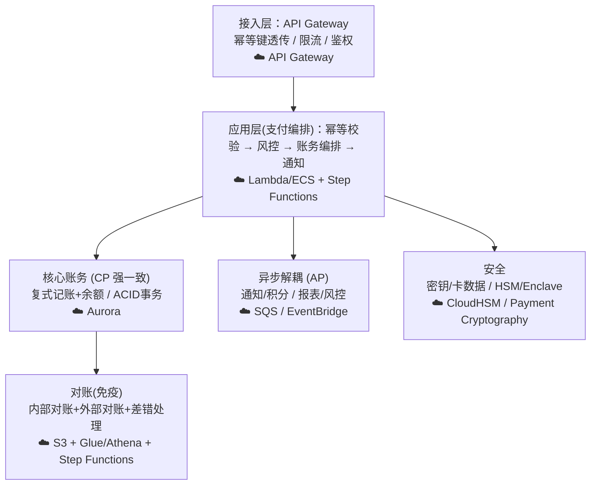

# 模块 0 · 地基（技术篇）：账本系统的工程实现与金融级约束

> **学习者**：AWS 技术架构师 · 支付小白
> **本篇目标**：把业务篇的"账本/清结算/复式记账"翻译成**工程语言**。回答：账本系统在代码层面长什么样？为什么金融系统对一致性如此偏执？幂等、对账、资金安全在技术上怎么落地？以及——这些约束如何影响后续每个模块的 AWS 架构选型。
> **配套**：业务篇见 `00-foundation-business.md`
> 标注：🔧 通用技术机制 · ☁️ AWS 映射 · ⚠️ 金融级坑点 · 🎯 与支付公司技术交流要点

---

## 开篇：作为架构师，你该如何"看"支付系统

你设计过很多系统，但支付系统有一个根本不同的"信仰"：

> **普通互联网系统优化的是"可用性和性能"（AP），支付系统优化的是"正确性和一致性"（CP）——宁可慢、宁可拒绝服务，也绝不能算错一分钱。**

这个信仰差异，决定了支付系统几乎所有的技术选型。记住它，后面的一切设计都有了"为什么"。

🎯 **交流要点**：和支付公司的架构师聊技术，开口先认同"资金正确性高于一切"，对方会把你当自己人。互联网思维的"先上线再迭代""最终一致性够用了"在核心账务上是大忌。

---

## 第一性追问 1：账本系统在工程上是什么

### 1.1 最朴素的账本：一张余额表 + 一张流水表

📌 账本系统的最小骨架是两张表：

**账户表 (accounts)** —— 当前状态，可由流水推导：

| account | balance |
|---|---|
| user_A | 1000 |
| user_B | 500 |

**流水表 (transactions / journal)** —— 不可变历史，append-only，每笔交易 ≥2 条分录：

| txn_id | account | debit | credit | time |
|---|---|---|---|---|
| t001 | user_A | 100 | | ... |
| t001 | user_B | | 100 | ... |

🔧 **两个关键设计原则**：
1. **流水表 append-only（只追加，不修改不删除）**：写错了要"红冲"（记一笔反向分录修正），而不是 UPDATE/DELETE 原记录。这保证完整可审计。
2. **余额 = 流水的累加结果**：余额表是"物化视图/快照"，理论上能从流水完整重算。这给了对账和故障恢复的依据。

> 🎯 这正是业务篇"复式记账"的工程落地：一笔交易在流水表里至少两条、借贷相等的分录。

### 1.2 状态模型 vs 事件模型（架构师视角）

🔧 两种账本实现哲学，你会在不同支付公司看到：
- **状态导向**：直接维护当前余额（accounts 表），流水作为日志。简单、查询快，但"为什么是这个余额"要靠日志回溯。
- **事件溯源（Event Sourcing）**：余额完全由事件流推导，当前状态只是投影。天然审计友好、可重放，但复杂度高。

⚠️ 金融账本大量采用"流水为真相源（source of truth），余额为派生物"的思路——这本质就是 Event Sourcing 的核心思想，即使不叫这个名字。

☁️ **AWS 对应**：
- **Amazon QLDB（Quantum Ledger Database）**：专为账本设计，**不可变、可加密验证（cryptographically verifiable）的交易日志**，自带完整历史。概念上就是"append-only 流水表 + 内置审计证明"。⚠️ 注意：AWS 已宣布 QLDB 进入维护/停止新接，迁移路径推荐 Aurora PostgreSQL；交流时可提"QLDB 的设计理念"但落地多用关系库。
- **Amazon Aurora（PostgreSQL/MySQL）**：实际生产中账务系统的主力，强一致、事务支持好、高可用。
- **DynamoDB**：高并发场景的账户/幂等表，但跨账户事务能力弱（需 TransactWriteItems），核心复式记账多用关系库。

---

## 第一性追问 2：为什么金融系统对"一致性"如此偏执

### 2.1 一个会让你睡不着的场景

转账：A 给 B 转 100。系统要做两件事：A 余额 -100，B 余额 +100。如果在这中间系统崩溃了——

- **A 扣了，B 没加** → 凭空消失 100 元（客户的钱丢了，灾难）。
- **A 没扣，B 加了** → 凭空多出 100 元（平台资损，灾难）。

🔧 这就是为什么**原子性（Atomicity）**是底线：这两个操作要么**全成功，要么全失败**，不存在中间态。这是 ACID 事务的 A。

> ⚠️ 这也是为什么核心账务**强依赖支持 ACID 事务的数据库**，而不能简单用"最终一致"的 NoSQL 凑合。一致性不是"性能优化项"，是"正确性底线"。

### 2.2 CAP 与支付的选择：坚定的 CP

🔧 CAP 定理：分布式系统在分区（P）时，只能在一致性（C）和可用性（A）间二选一。
- **支付核心账务选 CP**：宁可在网络分区时拒绝服务（返回失败、让用户重试），也不能返回一个可能错误的余额。
- 🎯 这与你做高可用 Web 系统的直觉（选 AP，保可用）相反。在支付里说"我们牺牲点一致性换可用性"，是危险信号。

### 2.3 但也不是处处强一致——分层

⚠️ 关键平衡：**资金核心强一致，外围可最终一致**。
- 强一致：余额扣减、复式记账、结算。
- 可最终一致：通知推送、积分、营销、报表、风控特征更新。

🎯 **交流要点**：能说出"核心账务 CP、外围业务 AP，用异步解耦"，体现你既懂金融底线又懂架构权衡。

---

## 第一性追问 3：幂等——支付技术的"第一信条"

### 3.1 问题：网络是不可靠的

🔧 支付请求会因为超时、重试、用户重复点击、消息重投而**重复到达**。如果不处理，"扣款一次"的请求可能扣三次。

📌 **幂等（Idempotency）**：同一个操作执行一次和执行 N 次，结果完全相同。**这是支付系统的第一信条，没有之一。**

### 3.2 通用实现

🔧 标准做法：**幂等键（Idempotency Key）**
```
1. 客户端为每笔支付生成唯一 idempotency_key（如 UUID），随请求带上
2. 服务端收到请求，先查这个 key 是否处理过：
   - 已处理 → 直接返回上次的结果（不重复扣款）
   - 未处理 → 加锁/插入唯一约束 → 执行 → 记录结果
3. 数据库唯一索引(unique key)是最后防线：重复插入直接失败
```

⚠️ **坑点**：
- 幂等键要覆盖"业务唯一性"——什么算"同一笔"要定义清楚（订单号？还是订单号+金额+时间窗？）。
- 幂等状态和实际扣款必须在**同一事务**里，否则"记了幂等但没扣款"或反之。
- 重试要区分"明确失败"（可重试）和"超时未知"（必须查询而非盲目重试）。

☁️ **AWS 映射**：
- **DynamoDB 条件写入**（`attribute_not_exists` + 唯一主键）= 天然的幂等去重表，高并发下性能好。
- **API Gateway** 支持幂等键透传；**Step Functions** 的任务天然支持幂等重试语义。
- **SQS** 标准队列至少一次投递（需消费端幂等）；**FIFO 队列**提供精确一次处理（exactly-once）+ 去重 ID。

🎯 **交流要点**：幂等是支付技术面试/交流的必考点。能讲"幂等键 + 唯一约束 + 同事务 + 超时查询而非盲重试"，技术深度立现。

---

## 第一性追问 4：对账——账本的"免疫系统"

### 4.1 为什么必须对账

🔧 即使有事务、有幂等，多系统之间仍会出现不一致：你的账本说收了 100 笔，银行/通道的账单说 99 笔。原因：网络、超时、单边账（一方记了一方没记）、通道 bug、时间差。

📌 **对账（Reconciliation）**：定期把**自己的账本**和**外部（银行/卡组织/通道）的账单**逐笔核对，找出差异并处理。这是金融系统的"免疫系统"，发现并修复资损。

### 4.2 对账的层次

🔧
- **内部对账**：自己各账户借贷是否平衡（复式记账保证，但仍要验）。
- **外部对账**：与银行/通道/卡组织的对账文件逐笔比对。
- **差错处理**：找出"我有它无""它有我无""金额不符"的差异，挂账、补单、红冲、人工核查。

⚠️ 对账是支付公司**最重、最不性感但最关键**的系统之一。资损往往在这里被发现。

☁️ **AWS 映射**：
- **S3** 存通道/银行对账文件 + 自己账本快照。
- **AWS Glue / EMR / Athena** 做大规模批量比对（数亿笔流水的 join 差异分析）。
- **Step Functions** 编排对账流程；**EventBridge** 调度；差异告警走 **SNS**。

🎯 **交流要点**：问支付公司"你们怎么做对账和差错处理"，是直击其工程成熟度的问题。能聊"多级对账 + 差异分类 + 红冲补单"很专业。

---

## 第一性追问 5：资金安全与密码学（地基的安全底座）

🔧 钱是攻击目标，支付系统的安全要求远高于普通系统：
- **传输安全**：TLS、报文加密签名（防篡改、防抵赖）。
- **敏感数据**：卡号、密钥绝不能明文落库（PCI-DSS 强制）。
- **密钥管理**：加解密、签名用的密钥要硬件级保护，人也碰不到明文密钥。
- **HSM（硬件安全模块）**：金融级密钥的"保险柜"，密钥在硬件内生成/使用，永不导出。

☁️ **AWS 映射**（你的主场，后面模块会反复用）：
- **AWS KMS**：密钥管理，加解密、信封加密。
- **AWS CloudHSM**：FIPS 140-2 Level 3 认证的专属 HSM，满足银行/卡组织的密钥合规。
- **AWS Payment Cryptography**：托管的支付专用密码服务（PIN、卡数据、EMV 密钥等），免自建 HSM 集群。
- **Nitro Enclaves**：隔离的可信执行环境，处理卡号/密钥等敏感数据，连运维都看不到。

🎯 **交流要点**：作为 AWS SA，这是你的差异化武器——支付公司最头疼的合规密钥管理，你能给出 CloudHSM/Payment Cryptography/Nitro Enclaves 的成体系方案。

---

## 第一性追问 6：金融级非功能性需求（NFR）

🔧 这些是支付系统的"隐形规格"，业务不说但必须满足：

| NFR | 要求 | 通用手段 | ☁️ AWS |
|---|---|---|---|
| **高可用** | 核心支付 99.99%+ | 多活、无单点、故障转移 | 多 AZ / 多 Region、Route 53 故障转移 |
| **强一致** | 资金零误差 | ACID 事务、分布式事务/Saga | Aurora、DynamoDB Transactions |
| **可扩展** | 大促峰值 | 水平扩展、分库分表、限流 | Aurora 读副本、DynamoDB 自动扩展、ASG |
| **资金安全** | 防资损/欺诈 | 幂等、对账、风控、双重校验 | 见上各节 |
| **可审计** | 监管/追溯 | 不可变日志、全链路追踪 | QLDB理念/CloudTrail、X-Ray |
| **数据驻留** | 合规(钱不能出境) | 区域隔离 | Region 隔离、合规框架 |

⚠️ **资金安全的"双保险"思维**：核心扣款常用"预扣-确认-补偿"（类 Saga）、定时核对、限额熔断等多重机制，单点失效也不导致资损。

---

## 综合：地基层的技术全景图



---

## 本篇小结：地基的技术信条（背下来）

1. **资金正确性 > 一切**。支付系统是 CP 不是 AP（核心账务）。
2. **账本 = append-only 流水（真相源）+ 派生余额**。写错用红冲，不改历史。
3. **幂等是第一信条**：幂等键 + 唯一约束 + 同事务 + 超时查询不盲重试。
4. **原子性是底线**：扣款与记账要么全成全败，依赖 ACID 事务。
5. **对账是免疫系统**：多级对账 + 差异分类 + 红冲补单，资损在这里现形。
6. **安全靠密码学硬件**：KMS/CloudHSM/Payment Cryptography/Nitro Enclaves。
7. **分层一致性**：核心强一致，外围最终一致，异步解耦。

---

## 通向下一层

- **业务全景再回顾** → `00-foundation-business.md`
- **第一个真实支付系统：银行卡四方模型怎么用这些技术搭起来** → 模块 1 `01-cards-tech-aws.md`（ISO 8583、HSM、PCI-DSS、卡数据安全的 AWS 方案）

> 🎯 **此刻你已具备的技术对话能力**：能和支付公司架构师聊清"账本工程模型、CP取舍、幂等、对账、HSM 密钥安全、金融 NFR"，并能把每一项映射到具体 AWS 服务——这正是你作为 AWS SA 的独特价值。
