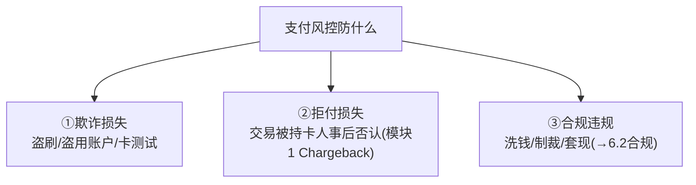
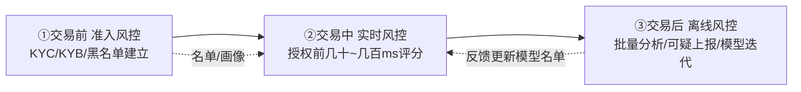
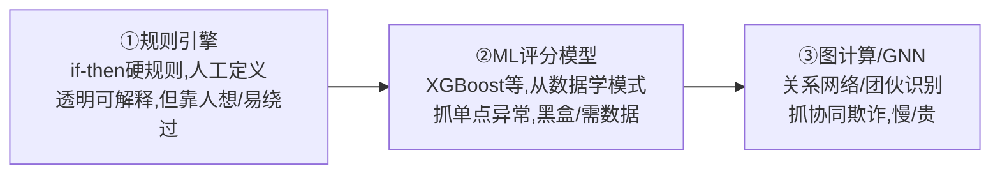
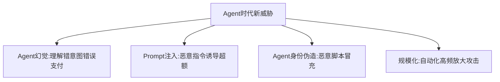
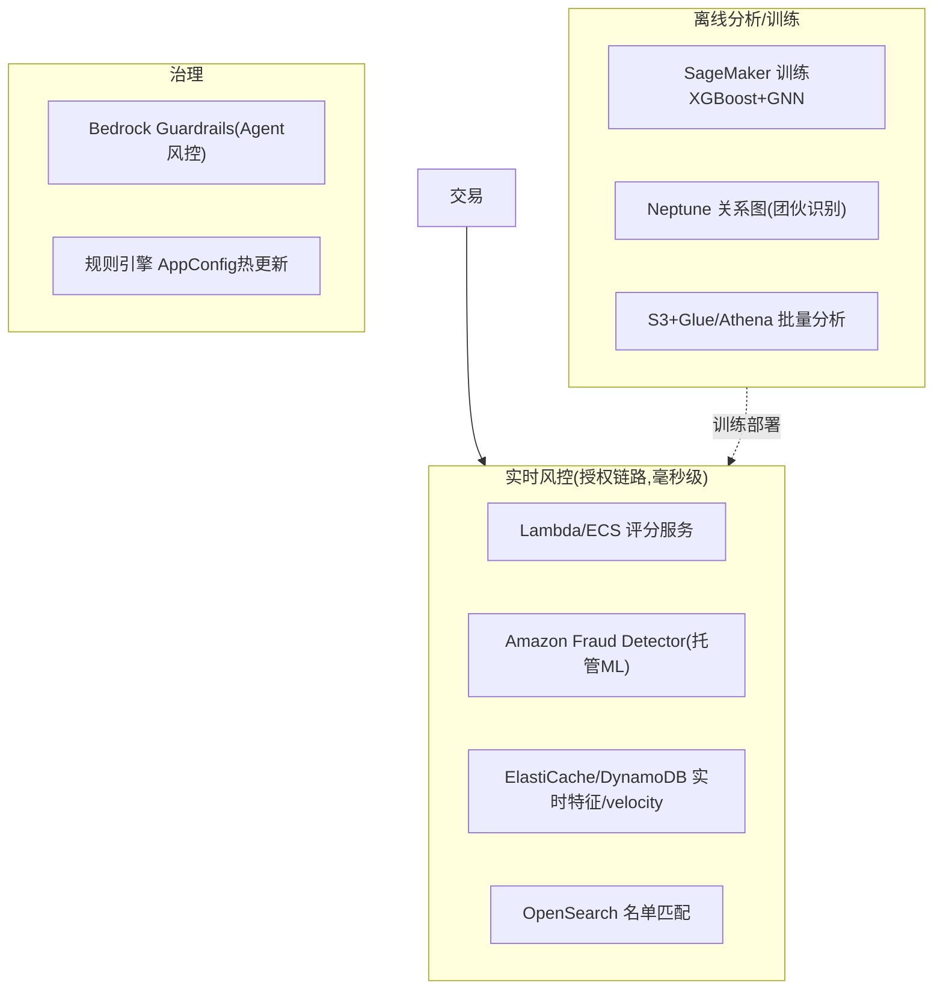

# 模块 6.1 · 风控与反欺诈（横向专题）

> **学习者**：AWS 技术架构师 · 支付小白
> **本篇目标**：系统化风控反欺诈——它在前面模块零散出现（卡支付风控、跨境制裁筛查、Agent风控），这里收口成专题：防什么、怎么防、三代技术演进、Agent时代新挑战 + AWS 完整方案。
> **前置**：模块1技术篇 §4.1.1（实时风控六维度）、模块3（制裁筛查）、模块5（Agent风控）
> **配套深度**：`agentic-payment/10.fraud_risk_control/`（Agent欺诈深度）、`reference/summary/Agentic_AI_on_payment_总结.md`（XGBoost+GNN/反欺诈Agent真实案例）
> 标注：🔧 通用 · ☁️ AWS · 📌 关键 · 🎯 交流要点

---

## 1. 第一性：风控防什么

回到模块1——支付是"拉"支付、商户先交货后收钱，所以**风控的本职是在"不该成功的交易成功之前拦住它"**。防三类损失：

> 📌 风控和合规有重叠但侧重不同：**风控**重"防欺诈损失"（钱的安全），**合规**重"满足监管"（KYC/AML/制裁，见 6.2）。实践中两者常在同一个引擎里协同。

---

## 2. 风控的分层：贯穿交易全生命周期

风控不是一个点，而是贯穿"交易前/中/后"的多道关卡（模块1讲过实时风控，这里看全貌）：

| 阶段 | 干什么 | 时效 |
|---|---|---|
| **交易前（准入）** | 商户 KYB、持卡人身份、黑白名单 | 离线 |
| **交易中（实时）** | 授权前评分，放行/拦截/加验 | 在线·毫秒级 |
| **交易后（监控）** | 批量分析、SAR上报、模型再训练 | 离线·批量 |

📌 **实时风控六维度**（模块1技术篇 §4.1.1 详讲）：卡/账户、金额频率(velocity)、行为历史、设备IP地理、商户、合规。**三档动作**：放行/加验(challenge)/拒绝。**核心矛盾**：漏过欺诈(资损) vs 误杀好人(流失)。

---

## 3. 风控技术三代演进

📌 风控规则的形态在演进（第一性：从"人写死规则"到"机器学模式"到"图识别团伙"）：

📌 **三代不是替代而是叠加**（纵深防御）：
- **规则引擎**：已知模式快速拦截（如"同卡10分钟>3笔→拒"）。
- **ML（XGBoost）**：看**单点行为**——55个特征（频率/金额/失败率/设备/凭证变更），抓异常行为。快、可解释(SHAP)、实时。
- **GNN（图神经网络）**：看**关系网络**——抓欺诈团伙、协同攻击（5个账号共享3台设备）。慢、准实时。

💡 **XGBoost + GNN 互补**（reference 真实案例的核心）：
> XGBoost 抓不到团伙（只看单点），GNN 抓不到单打独斗（图上无边）。两个分数都给编排 Agent 综合判断（"XGB=0.3 但 GNN=0.9 → 团伙成员，个人正常但周围全坏人，照样拦"）。**跨账号协同欺诈是规则引擎的最大盲区，GNN 是解药**。
> 📖 XGBoost vs GNN 详细对比、多Agent反欺诈架构见 `reference/summary/Agentic_AI_on_payment_总结.md`（第19-20页）。

---

## 4. Agent 时代的风控新挑战

⚠️ 模块5 讲过——Agent 付款让传统风控部分失效：

🔧 应对：支出治理(限额/单次凭证)、Agent身份验证(KYA)、Prompt注入防护(Guardrails)、人在环、可验证凭证+全链审计。
> 📖 详见 `10.fraud_risk_control/`（为什么传统风控在Agent时代失效）+ 模块5。

---

## 5. AWS 反欺诈完整方案

☁️ 把三代技术 + 实时/离线分层映射到 AWS：

| 风控能力 | ☁️ AWS |
|---|---|
| 实时评分(毫秒级) | Lambda/ECS + **Amazon Fraud Detector** |
| 实时特征/velocity计数 | ElastiCache / DynamoDB |
| ML模型训练(XGBoost) | **SageMaker** |
| 图/团伙识别(GNN) | **Neptune** + SageMaker(RGCN) |
| 名单匹配 | OpenSearch(模糊匹配) |
| 批量分析/可疑交易 | S3 + Glue/Athena/EMR |
| 规则热更新 | AppConfig |
| Agent风控 | Bedrock Guardrails |
| 多Agent调查台 | Bedrock AgentCore(reference案例) |

> 🎯 **交流杀手锏**：能给出"实时层(Fraud Detector+ElastiCache velocity+OpenSearch名单)+离线层(SageMaker XGBoost+Neptune GNN)+治理(Guardrails+AppConfig)"的完整反欺诈 AWS 方案，并讲清"规则+ML+图三代叠加纵深防御""XGBoost单点+GNN团伙互补"——是 AWS SA 在支付风控的核心能力。reference 里 Mastercard Brighterion(150B+笔/年)、Visa Protect、Stripe Radar 都是 AWS 反欺诈标杆案例。

---

## 6. 本篇小结（背下来）

1. **风控防三类损失**：欺诈/拒付/合规违规。重"钱的安全"，合规重"满足监管"(6.2)。
2. **三层贯穿**：交易前(准入KYB)/中(实时毫秒评分)/后(离线分析迭代)。
3. **实时六维度+三档动作**(放行/加验/拒绝)，核心矛盾=漏过欺诈vs误杀好人。
4. **技术三代叠加**：规则引擎(已知模式)+ML/XGBoost(单点异常)+GNN(团伙)——纵深防御。
5. **XGBoost单点 vs GNN团伙互补**：跨账号协同欺诈是规则盲区，GNN是解药。
6. **Agent时代新威胁**：幻觉/Prompt注入/身份伪造/规模化——靠支出治理+KYA+Guardrails+人在环。
7. **AWS栈**：Fraud Detector+ElastiCache+OpenSearch(实时)+SageMaker+Neptune(离线/图)+Guardrails(Agent)。

---

## 7. 通向

- **实时风控六维度详细** → 模块1技术篇 §4.1.1
- **制裁筛查/AML** → 6.2 合规体系
- **Agent欺诈深度** → `10.fraud_risk_control/` + 模块5
- **真实案例(XGBoost+GNN/Brighterion/Radar)** → `reference/summary/`
