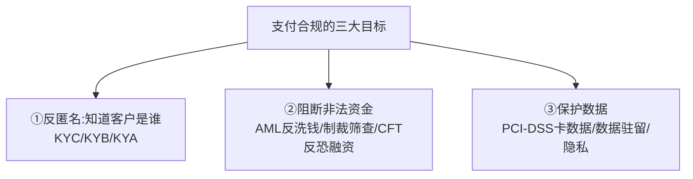
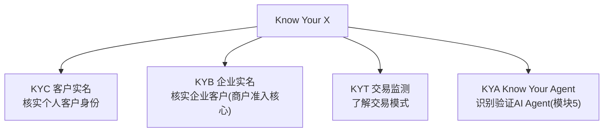
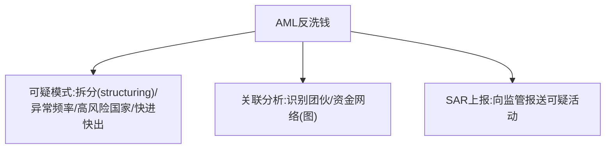
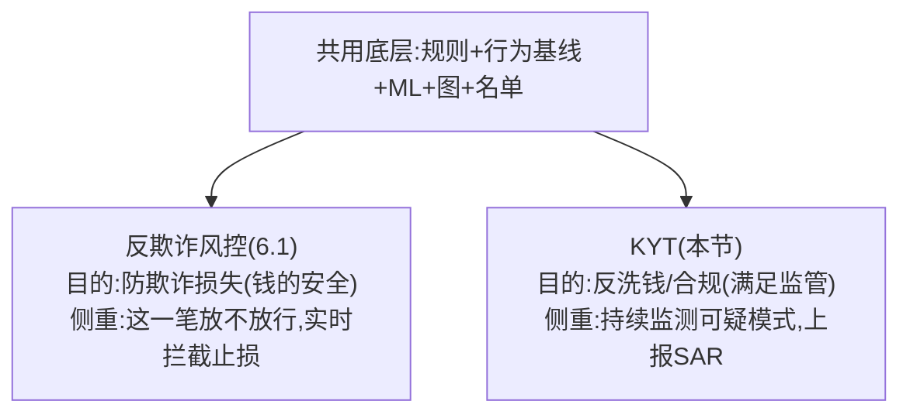
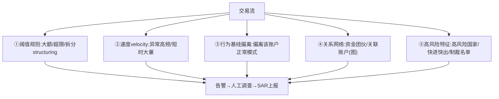
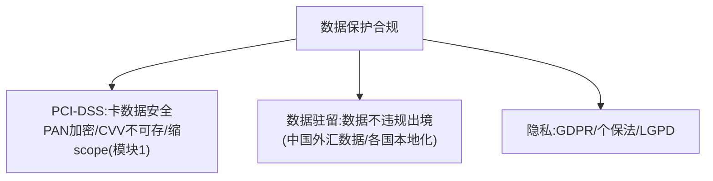

# 模块 6.2 · 合规体系（横向专题）

> **学习者**：AWS 技术架构师 · 支付小白
> **本篇目标**：系统化支付合规——KYC/KYB/AML/制裁筛查/PCI/数据驻留/牌照，散落各模块，这里收口成体系：每个合规要求"解决什么、怎么做"+ AWS 方案。
> **前置**：模块1(PCI-DSS/KYB)、模块3(制裁筛查/外汇申报)、模块5(KYA)、6.1风控
> **配套深度**：`跨境支付深度研究报告.md`(SAFE监管)、`stablecoin_cross_border_compliance.md`(稳定币合规)、`reference/summary/`(KYB Agent案例)
> 标注：🔧 通用 · ☁️ AWS · 📌 关键 · 🎯 交流要点

---

## 1. 第一性：支付为什么被重监管

📌 支付涉及**资金流动**——这是洗钱、恐怖融资、制裁规避、诈骗的主要通道。所以全球对支付施加重监管，核心目标：**知道你在和谁做生意（反匿名）+ 阻断非法资金（反洗钱/制裁）+ 保护数据（卡数据/隐私）**。

> ⚠️ 合规不是"成本中心"那么简单——**违规罚款可达数十亿美元甚至刑责**（违反 OFAC 制裁、反洗钱失职）。合规是支付牌照的命门，也是护城河（模块1讲过）。

---

## 2. 反匿名：KYC / KYB / KYA

📌 "Know Your X"系列——核实交易方身份，反匿名：

| 类型 | 核实谁 | 关键 |
|---|---|---|
| **KYC** | 个人客户 | 证件核验、人脸、地址 |
| **KYB** | 企业/商户 | 营业执照、法人、**UBO受益所有人穿透**(模块1) |
| **KYT** | 交易行为 | 监测交易模式、异常 |
| **KYA** | AI Agent | Agent身份、授权凭证(模块5新增) |

🔧 **KYB 是商户准入核心**（模块1技术篇 §4.1.2 讲过编排）：文档核验+UBO穿透+风险评分+制裁筛查，编排调用风控/合规/身份核验能力。
> 📖 KYB Agent 真实案例(Textract+Bedrock,处理时间-60-70%)见 `reference/summary/Agentic_AI_on_payment_总结.md`(第21-22页)。

---

## 3. 阻断非法资金：AML / 制裁筛查 / CFT

### 3.1 制裁筛查（最硬合规，模块3讲过）

📌 对每笔交易的收付款人比对各国制裁名单(OFAC/UN/EU/HMT)，命中则拦截上报。
- ⚠️ 核心难点=**模糊匹配**（别名/音译/拼写变体），误报率是核心矛盾。
- ☁️ **OpenSearch**(模糊匹配/编辑距离) + Comprehend(多语言实体)。

### 3.2 反洗钱 AML

📌 监测可疑交易模式，上报**可疑活动报告(SAR)**：

- 🔧 拆分(structuring)：把大额拆成多笔小额规避申报阈值——AML 重点监测对象。
- ☁️ SageMaker(模式识别)+Neptune(资金网络图,呼应6.1 GNN)+Glue/Athena(批量分析)。

### 3.2.1 KYT 交易监测：实现逻辑与技术原理

📌 **KYT（Know Your Transaction）= "交易层面的持续监测"**，是 AML 的核心执行手段——KYC 管"客户是谁"，KYT 管"交易像不像可疑/洗钱"。

⚠️ **KYT vs 反欺诈风控（6.1）的边界**（常被混淆）：

> 📌 两者**共用底层技术武器**(规则/ML/图)，但**视角不同**：反欺诈重"实时止损"，KYT 重"持续监测+上报监管"。风控引擎能承载 KYT，但 **KYT 本质是合规视角**(所以归在本模块6.2)。

📌 **KYT 监测什么（实现逻辑）**：

📌 **技术原理（五层组合，与6.1反欺诈同源）**：
- **①规则引擎**：阈值/拆分/快进快出硬规则。
- **②行为基线(Behavioral Baseline)**：给每个账户建"正常交易画像"，偏离即告警——KYT 比纯规则强的关键。
- **③ML 模型**：异常检测/可疑模式分类。
- **④图分析(GNN)**：洗钱常是多账户协同，用图识别资金网络/团伙(呼应6.1)。
- **⑤名单匹配**：制裁/黑名单(OpenSearch 模糊匹配)。

🔧 **两个 KYT 特有的技术点**：
- **实时+离线双模**：实时拦明显可疑(命中制裁)，**离线批量回溯**累计模式(拆分要看一段时间累计,单笔看不出)。
- **SAR 闭环**：可疑交易→生成调查 Case→人工核查→向监管上报**可疑活动报告(SAR)**。⚠️ 这是 KYT 区别于反欺诈的关键——**反欺诈是"拦截止损"，KYT 多了"上报监管"这一步**。

☁️ **AWS**：实时(Lambda/ECS+ElastiCache velocity计数+OpenSearch名单)+行为基线/ML(SageMaker异常检测)+图(Neptune资金网络)+离线回溯(Glue/Athena/EMR)+SAR案件管理(Step Functions编排调查流)。

> 🎯 **交流要点**：能区分"反欺诈(止损视角)vs KYT(反洗钱合规视角,有SAR上报)"，并讲清"KYT 靠行为基线偏离+图分析识别资金网络+实时离线双模+SAR闭环"——是支付合规的精准认知。链上场景的 KYT(稳定币地址监测)见模块4。

### 3.3 Travel Rule（链上也要传收付款人信息）

📌 模块4讲过——虚拟资产转账(超阈值)也要像电汇一样传递收付款人信息(VASP间)。稳定币合规的特殊点。

---

## 4. 保护数据：PCI-DSS / 数据驻留 / 隐私

- **PCI-DSS**（模块1技术篇详讲）：卡数据安全标准，核心策略=缩小scope(tokenization让系统碰不到真卡号)。
- **数据驻留**（模块3讲过）：跨境支付数据/资金不得违规出境——☁️ Region隔离+PrivateLink。
- **隐私**：GDPR(欧)/个保法(中)/LGPD(巴)等。

---

## 5. 牌照地图：经营支付的准入

📌 不同业务需不同牌照（前面各模块散落，这里汇总）：

| 业务 | 典型牌照 |
|---|---|
| 收单/第三方支付(中国) | 央行《支付业务许可证》(银行卡收单/网络支付等) |
| 跨境收款(中国出海) | SAFE跨境外汇业务资质 + 境外各国(美MSB/MTL、欧盟EMI、英FCA、港MSO、新MAS) |
| 稳定币 | 各地稳定币牌照(美GENIUS法案/香港稳定币条例) |
| 清算 | 清算牌照(稀缺,如银联/网联) |

> 🎯 **交流要点**：能讲"KYC/KYB/KYA反匿名 + AML/制裁阻断非法资金 + PCI/数据驻留保护数据 + 牌照准入"这套合规全景，并知道"制裁违规可罚数十亿"——是和支付公司聊合规的全局观。跨境/稳定币公司的牌照矩阵(模块1深化Airwallex/模块4)是其护城河。

---

## 6. AWS 合规方案

☁️
| 合规能力 | AWS |
|---|---|
| KYB/KYC文档核验 | Textract(OCR)+Rekognition(人脸)+Bedrock(风险研判) |
| 制裁名单筛查 | OpenSearch(模糊匹配)+Comprehend |
| AML模式/关联分析 | SageMaker+Neptune(图)+Glue/Athena |
| 卡数据合规(PCI) | Payment Cryptography+Nitro Enclaves+KMS+继承PCI-DSS L1(模块1) |
| 数据驻留 | Region隔离+PrivateLink |
| 审计 | CloudTrail+Audit Manager |
| KYB/AML编排 | Step Functions+Bedrock AgentCore(Agent化,reference案例) |

> 📖 KYB Agent、反欺诈调查Agent、合规审查(Stripe -26%)等真实案例见 `reference/summary/`。

---

## 7. 本篇小结（背下来）

1. **合规三大目标**：反匿名(KYC/KYB/KYA)+阻断非法资金(AML/制裁/CFT)+保护数据(PCI/驻留/隐私)。
2. **Know Your X**：KYC(个人)/KYB(企业,商户准入核心+UBO)/KYT(交易)/KYA(Agent)。
3. **制裁筛查最硬**：模糊匹配是难点,误报率核心矛盾,OpenSearch。
4. **AML**：监测拆分/异常/快进快出,SAR上报,图分析识别团伙。
5. **数据保护**：PCI-DSS(缩scope)/数据驻留(Region隔离)/隐私(GDPR/个保法)。
6. **牌照地图**：收单/跨境/稳定币/清算各需对应牌照,是护城河。
7. **AWS**：Textract+Bedrock(KYB)+OpenSearch(制裁)+SageMaker+Neptune(AML)+Payment Cryptography(PCI)+Region(驻留)+CloudTrail(审计)。

---

## 8. 通向

- **PCI-DSS/HSM详细** → 模块1技术篇 + 01c
- **制裁筛查/外汇申报** → 模块3技术篇
- **稳定币合规/Travel Rule** → 模块4 + `stablecoin_cross_border_compliance.md`
- **KYA/Agent合规** → 模块5
- **合规AI化案例** → `reference/summary/` + `10.fraud_risk_control/`
