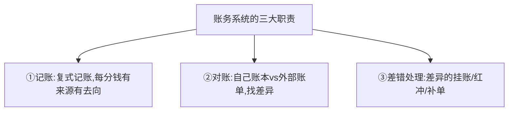
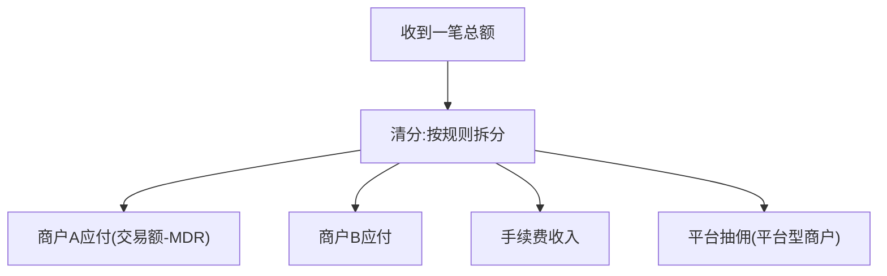
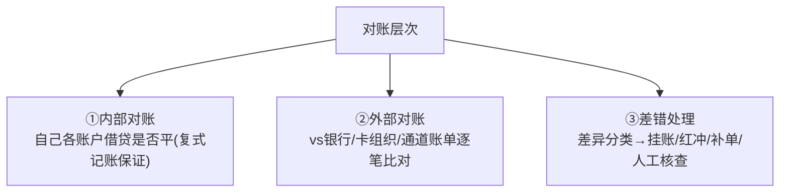
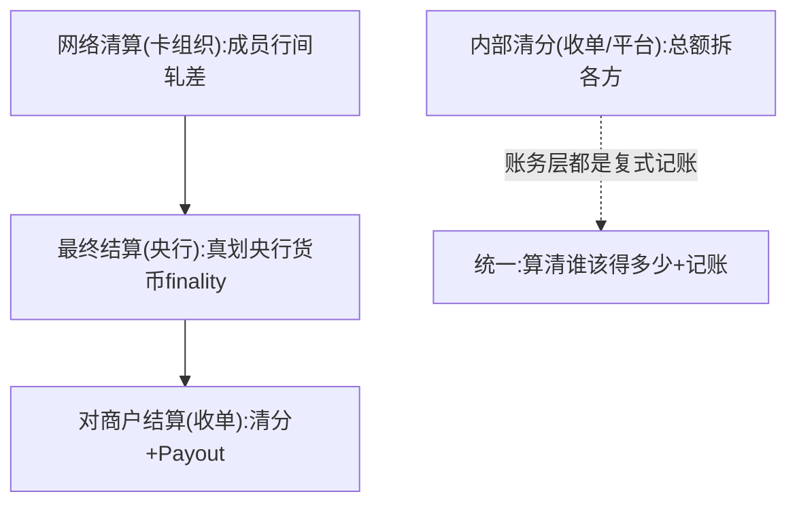
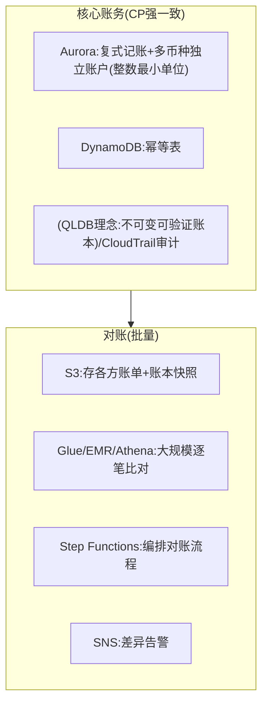

# 模块 6.3 · 账务与对账系统（横向专题）

> **学习者**：AWS 技术架构师 · 支付小白
> **本篇目标**：系统化账务与对账——这是支付系统的"心脏"，散落在地基技术篇(复式记账/对账)、各模块(清分/多币种)，这里收口成专题：账务模型、对账机制、差错处理 + AWS。
> **前置**：模块0技术篇(复式记账/对账/append-only)、模块1(清分/清结算)、模块3(多币种账务)
> 标注：🔧 通用 · ☁️ AWS · 📌 关键 · 🎯 交流要点

---

## 1. 第一性：账务系统是支付的心脏

模块0公理——支付=改账本。**账务系统就是那个"账本"的实现**，是支付公司最核心、最不能出错的系统。它要回答："每一分钱，从哪来、到哪去、现在在谁手里、对不对得平。"



> 📌 账务系统的信条(模块0)：**资金正确性>一切**——CP强一致、append-only流水、绝不用浮点数。

---

## 2. 账务模型：复式记账与账户体系

### 2.1 复式记账（模块0核心，这里深化）

📌 每笔交易**借贷两条且相等**，钱有来源有去向，自带纠错。

💡 一笔带手续费的支付：用户付100，商户实收99.4，通道收0.6：
```
借: 用户账户      -100
贷: 商户应付      +99.4
贷: 手续费收入    +0.6
   ───────────────────
   -100 + 99.4 + 0.6 = 0  ✓ 借贷恒等
```

🔧 **账本工程模型**(模块0技术篇)：append-only流水表(真相源,只追加不改删,错了红冲)+ 派生余额表(快照,可由流水重算)。

### 2.2 多层账户与清分（模块1清分的账务视角）



📌 账户类型(模块2讲过)：用户账户/备付金/中间过渡/手续费收入/准备金。资金在多账户间流转，每步都是一组复式分录。
📌 **多币种账务**(模块3)：每币种独立记账，换汇=两笔分录+汇差，金额用整数最小单位防浮点资损。

---

## 3. 对账：账本的免疫系统

📌 即使有事务+幂等，多系统间仍会不一致(网络/超时/单边账/通道bug)。**对账=定期把自己账本和外部账单逐笔核对，找差异修复**——发现资损的最后防线。



🔧 **差异类型**：
- **我有它无 / 它有我无**：单边账(一方记了一方没记，常因回调丢失，模块2讲过)
- **金额不符**：可能是汇差(模块3)或真差错
- **状态不符**：成功/失败不一致

🔧 **差错处理动作**：挂账(暂记待查)、红冲(反向分录冲销，不改原记录)、补单(补记漏单)、人工核查。

> ⚠️ 对账是支付公司**最重、最不性感但最关键**的系统——资损往往在这里被发现。跨境对账更难(多方多币种多时区+FX损益归因，模块3)。

---

## 4. 清算结算 vs 内部清分（账务视角统一）

📌 把前面散落的"清算/结算/清分"在账务层统一(模块1深化讲过分层)：



> 📌 无论网络清算、内部清分、对商户结算，**账务层本质都是复式记账**——"算清谁该得多少"+借贷记账。差别只在"在哪个主体、对外还是对内"。

---

## 5. AWS 账务对账方案

☁️


| 能力 | AWS |
|---|---|
| 核心账本(强一致复式记账) | **Aurora**(每币种独立账户,整数金额) |
| 幂等 | DynamoDB条件写入 |
| 不可变审计账本 | QLDB(理念)/CloudTrail |
| 对账文件存储 | S3 |
| 大规模对账比对 | **Glue/EMR/Athena**(数亿笔join差异) |
| 对账编排/调度 | Step Functions/EventBridge |
| 差异告警 | SNS |

> 🎯 **交流杀手锏**：账务对账是支付系统工程成熟度的试金石。能讲"复式记账(借贷恒等)+append-only流水(红冲不改删)+整数金额(防浮点)+多级对账(内部/外部/差错)+清算清分账务层统一"，并给出"Aurora强一致账本+Glue批量对账+Step Functions编排"的AWS方案——直击支付公司账务系统的核心。问对方"你们怎么做对账和差错处理"是直击其工程成熟度的问题。

---

## 6. 本篇小结（背下来）

1. **账务系统=支付的心脏**：记账+对账+差错处理，资金正确性>一切(CP强一致)。
2. **复式记账**：借贷恒等,钱有来源有去向,自带纠错;append-only流水(红冲不改删)+派生余额。
3. **多账户+清分+多币种**：资金多账户流转每步复式分录;换汇两笔分录;金额整数防浮点资损。
4. **对账=免疫系统**：内部对账+外部对账(vs银行/卡组织/通道)+差错处理(挂账/红冲/补单)。
5. **差异类型**：单边账(回调丢)/金额不符(汇差or差错)/状态不符。
6. **清算/清分账务层统一**：本质都是复式记账"算清谁该得多少"。
7. **AWS**：Aurora(强一致账本)+DynamoDB(幂等)+S3/Glue/Athena(批量对账)+Step Functions(编排)。

---

## 7. 通向

- **账本工程/幂等/CP取舍** → 模块0技术篇
- **清分/清结算分层** → 模块1技术篇 §4.1/§4.6
- **多币种账务/跨境对账** → 模块3技术篇
- **非功能性(高可用/一致性)** → 6.4
