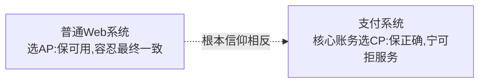
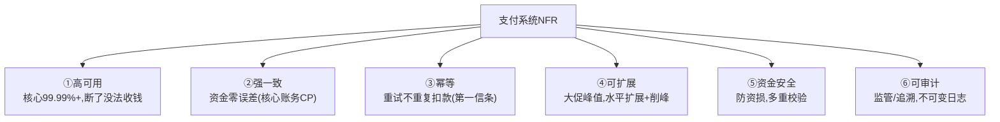
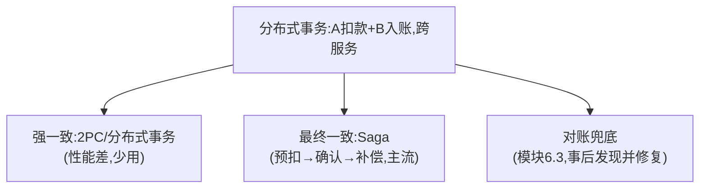
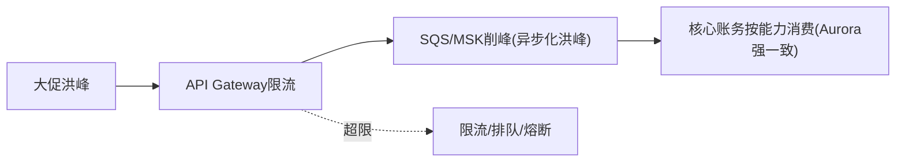
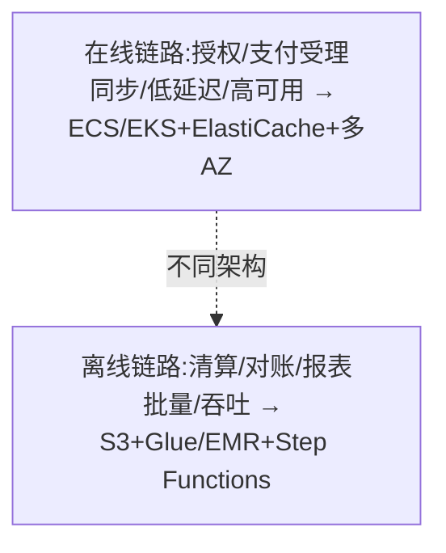

# 模块 6.4 · 支付系统的非功能性需求（横向专题）

> **学习者**：AWS 技术架构师 · 支付小白
> **本篇目标**：系统化支付系统的非功能性需求(NFR)——高可用/一致性/幂等/限流/资金安全。这些是支付系统的"隐形规格"，散落各模块，这里收口成专题 + AWS 方案。**这是你 AWS 架构师最熟悉、最能发挥的领域**。
> **前置**：模块0技术篇(CP/幂等/对账)、模块1(授权双架构)、模块2(削峰/异步)
> 标注：🔧 通用 · ☁️ AWS · 📌 关键 · 🎯 交流要点

---

## 1. 第一性：支付系统的特殊信仰

模块0讲过——**普通互联网系统优化"可用性+性能"(AP)，支付系统优化"正确性+一致性"(CP)：宁可慢、宁可拒绝服务，也绝不能算错一分钱。**

📌 这个信仰差异决定了支付系统几乎所有 NFR 选型。但**不是处处强一致**——核心账务CP，外围(通知/积分/报表)可AP，异步解耦。

---

## 2. 六大非功能性需求

| NFR | 要求 | 手段 | ☁️ AWS |
|---|---|---|---|
| **高可用** | 99.99%+ | 多活/无单点/故障转移/降级 | 多AZ/多Region + Route 53 |
| **强一致** | 资金零误差 | ACID事务/Saga | Aurora + DynamoDB Transactions |
| **幂等** | 不重复扣款 | 幂等键+唯一约束+同事务 | DynamoDB条件写入/SQS FIFO |
| **可扩展** | 大促峰值 | 水平扩展/削峰/限流 | Aurora读副本/DynamoDB自动扩展/SQS |
| **资金安全** | 防资损 | 幂等+对账+预扣确认补偿+限额熔断 | (见6.1/6.3) |
| **可审计** | 监管追溯 | 不可变日志/全链路追踪 | CloudTrail/X-Ray/QLDB理念 |

---

## 3. 幂等：支付的第一信条（模块0+2深化）

⚠️ 网络不可靠→请求重复到达(超时/重试/重复点击/消息重投)。不处理→扣款扣三次。

🔧 **标准做法**：幂等键(订单号/UUID)+唯一约束(最后防线)+同事务(幂等状态与扣款原子)+超时查询(不盲重试)。
🔧 **线上特殊**(模块2)：回调幂等(同笔回调可能重投,用流水号去重)。
☁️ **DynamoDB条件写入**(attribute_not_exists)做幂等去重表;**SQS FIFO**精确一次。

> 🎯 幂等是支付技术必考点。"幂等键+唯一约束+同事务+超时查询而非盲重试"是标准答案。

---

## 4. 高可用与一致性：分布式事务难题

📌 一笔支付常跨多个服务/数据源——"A扣款+B入账"要么全成要么全败。分布式下怎么保证？

🔧 **Saga/预扣-确认-补偿**(资金安全双保险)：核心扣款用"预扣→确认→失败补偿"，配合定时对账+限额熔断，单点失效也不资损。
☁️ **Step Functions**编排Saga;Aurora强一致核心;对账兜底(6.3)。

> 📌 **分层一致性**(模块0)：核心账务强一致(CP),外围(通知/积分/报表)最终一致(AP),用SQS/EventBridge异步解耦。

---

## 5. 可扩展：大促峰值与削峰

📌 双11/黑五峰值是极限考验(模块2讲过)：

🔧 **削峰**(SQS/Kafka异步化)+**限流熔断**(保护核心账务)+**水平扩展**(读副本/分库分表)。⚠️ 核心账务是CP,不能为了扛峰值牺牲一致性——用削峰把洪峰摊平，而非放松一致性。

---

## 6. 在线 vs 离线双架构（贯穿全书的模式）

📌 支付系统反复出现"在线同步 vs 离线批量"双架构(模块1授权/清算、模块6.3对账)：

> 🎯 **交流要点**：能指出支付系统普遍是"在线(实时交易系统)+离线(大数据批处理)"双架构，并分别给AWS选型——是支付系统架构分层的核心认知。

---

## 7. 完整 NFR-AWS 映射

☁️ 这是你 AWS 架构师的主场总图：

| NFR | 通用手段 | ☁️ AWS |
|---|---|---|
| 高可用99.99%+ | 多活/无单点/故障转移 | 多AZ/多Region/Route 53/降级stand-in |
| 强一致(核心) | ACID/Saga | Aurora/DynamoDB Transactions/Step Functions(Saga) |
| 幂等 | 幂等键+唯一约束 | DynamoDB条件写入/SQS FIFO |
| 削峰/可扩展 | 异步/限流/水平扩展 | SQS/MSK/API Gateway/Aurora读副本/DynamoDB自动扩展 |
| 资金安全 | 预扣确认补偿+对账+熔断 | Step Functions+对账(6.3)+限额 |
| 可审计 | 不可变日志/追踪 | CloudTrail/X-Ray/QLDB理念 |
| 数据驻留 | Region隔离 | Region+PrivateLink |
| 密钥/卡数据安全 | HSM/隔离 | Payment Cryptography/Nitro/KMS(01c) |

> 🎯 **交流杀手锏**：支付系统NFR是你AWS架构师最能发挥的领域。能讲"核心账务CP(Aurora)+幂等(DynamoDB)+削峰(SQS)+Saga编排(Step Functions)+多AZ容灾+在线离线双架构"，并解释每项解决的支付特有问题(资金正确性/重复扣款/大促峰值)，直接展现AWS SA在支付的工程价值。

---

## 8. 本篇小结（背下来）

1. **支付的特殊信仰**：核心账务CP(正确性>可用性),与普通Web系统(AP)相反;但分层——外围可AP。
2. **六大NFR**：高可用/强一致/幂等/可扩展/资金安全/可审计。
3. **幂等是第一信条**：幂等键+唯一约束+同事务+超时查询;回调幂等用流水号去重。
4. **分布式事务**：Saga(预扣-确认-补偿)主流+对账兜底;2PC少用。
5. **可扩展靠削峰**：SQS/Kafka异步化洪峰+限流熔断,不牺牲核心一致性。
6. **在线vs离线双架构**：授权(实时)/清算对账(批量)——贯穿全书的模式。
7. **AWS主场**：Aurora(CP)+DynamoDB(幂等)+SQS(削峰)+Step Functions(Saga)+多AZ+CloudTrail。

---

## 7. 通向

- **账本工程/CP/幂等基础** → 模块0技术篇
- **授权在线vs清算离线双架构** → 模块1技术篇
- **削峰/异步回调** → 模块2技术篇
- **对账/账务** → 6.3
- **密钥/卡数据安全NFR** → 01c
