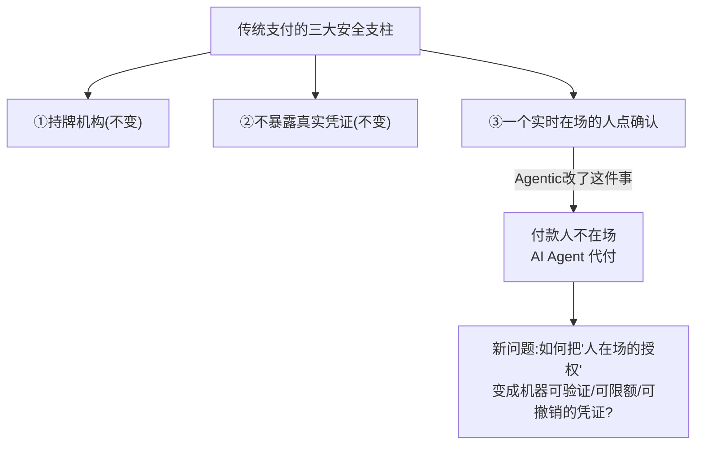
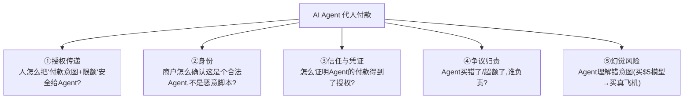
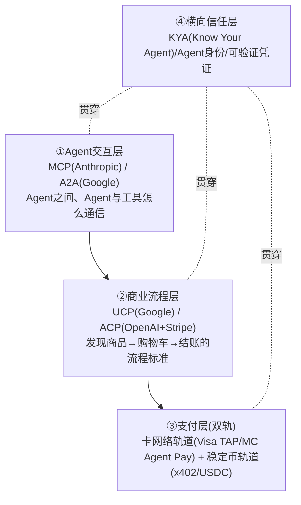
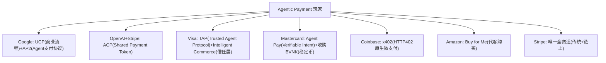
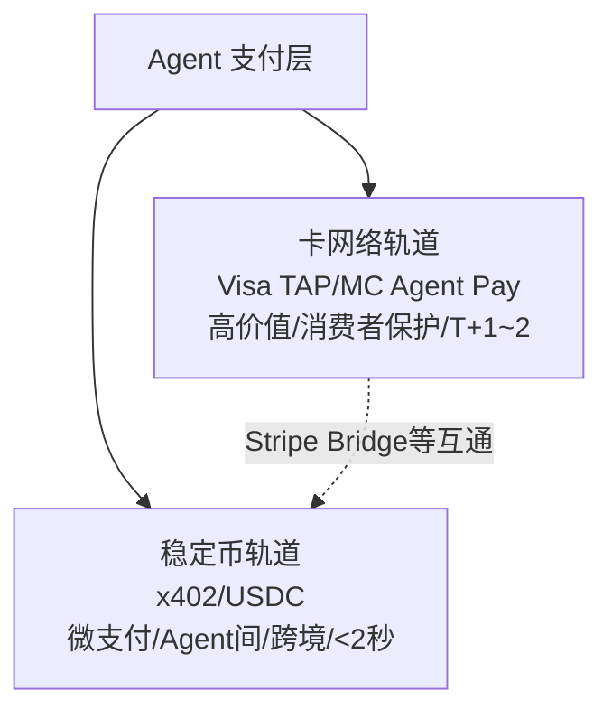
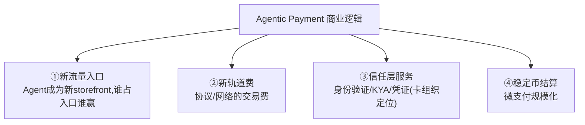

# 模块 5 · Agentic Payment（业务篇）：AI Agent 成为付款主体

> **学习者**：AWS 技术架构师 · 支付小白
> **本篇目标**：搞懂 Agentic Payment 的本质（AI Agent 代人付款带来的新问题）、协议格局、玩家、商业模式。学完你能和支付公司聊清楚"付款人不在场"这个核心难题，以及 UCP/ACP/AP2/x402/Visa TAP/Mastercard Agent Pay 各自在解决什么。
> **前置**：模块1-4（卡/电子/跨境/稳定币——Agentic 支付在这些轨道之上）、`支付范式资金流对比.md` 范式⑥
> **配套（已有深度专题，本篇大量指向）**：
> - 综述：`agentic_commerce.md`（七大方案+协议对比）
> - 协议专题：`1.google_ucp/`、`2.openai_strip_acp/`、`4.google_ap2/`、`5.conibase_x402/`、`6.visa_tap/`、`7.mastercard_agent_pay/`、`3.amazon_payforme/`
> - 风控：`10.fraud_risk_control/`
> - PPT总结：`reference/summary/`（四层协议栈、玩家格局、双轨）
> **组织方式**：top-down 主线，本篇是整合骨架，深度见各专题。零散追问见 FAQ。
> 标注：📌 关键 · 💡 案例 · 🎯 交流要点 · 📖 指向深度专题

---

## 1. 全景：Agentic Payment 改了什么

回顾模块0-4 的演进主线：受理入口在变（POS→手机→网关→App→链），但**付款的"发起者"一直是人**。Agentic Payment 改的就是这最后一点：

📌 **第一性核心问题**：传统支付安全靠三件事——**①持牌机构 ②不暴露真实凭证 ③一个实时在场的人点确认**。Agentic Payment **只改了第三件——付款人不在场了，AI Agent 代他付款**。

> 📌 **所有 Agentic Payment 协议（TAP/AP2/UCP/ACP/x402）都在回答同一个问题**：人不在场了，怎么让 Agent 的付款"可信"——证明它确实得到了人的授权、没超出授权范围、出事能追责。
> 🎯 **交流要点**：能把 Agentic Payment 归结为"只改了'人在场确认'这一件事，于是要重建授权的可验证性"——这是看穿整个赛道的第一性视角（来自 `reference/summary/AgenticPayment_介绍_总结.md`）。

---

## 2. AI Agent 作为付款主体带来的新问题

📌 这些新问题对应几个新概念（各协议的核心）：
- **意图/授权（Intent/Mandate）**：人给 Agent 的"可买什么、最多花多少、什么期限"的授权。
- **可验证凭证（Verifiable Credential, VC）**：可加密验证的授权凭证，Agent 出示给商户/支付方。
- **Agent 身份（Agent Identity / KYA）**：Know Your Agent——识别和验证 Agent。
- **支出治理（Spending Governance）**：限额、过期、单次使用（如 x402 的 PaymentSession、ACP 的 Shared Payment Token）。

> 💡 **Stripe 的经典案例**：用户让 Agent"买个 $5 的模型飞机"，Agent 幻觉去买了真飞机——这就是为什么需要**带预算限额的支付凭证**（Shared Payment Token，签名失败不扣预算）。支付是"agentic commerce 中唯一不能被妥协的信任层"。
> 📖 详见 `2.openai_strip_acp/` 和 `reference/summary/Agentic_AI_on_payment_总结.md`（Stripe ACP）。

---

## 3. 四层协议栈：理解整个生态的框架

📌 reference 总结提炼的**四层协议栈**——是理解 Agentic Commerce/Payment 所有协议的主框架：

| 层 | 协议 | 解决什么 |
|---|---|---|
| **① Agent 交互层** | MCP、A2A | Agent 间/Agent 与工具的通信 |
| **② 商业流程层** | UCP（Shopify 100万+商户默认）、ACP（Apache-2 开源） | 发现→购物车→结账的流程标准 |
| **③ 支付层（双轨）** | 卡网络（Visa TAP/MC Agent Pay）+ 稳定币（x402/USDC） | 真正的资金划转 |
| **④ 横向信任层** | KYA、Agent 身份、VC | 贯穿所有层的信任基础 |

> 📌 **关键判断**（reference）：终局是"**多层互补、按需组合的协议组合**"，而非单一协议胜出；2026 已从"协议竞争"转入"标准收敛+规模化部署"。
> 📖 四层栈、协议覆盖度、标准收敛趋势详见 `reference/summary/Agentic_Commerce_Overview_总结.md` + `agentic_commerce.md`。

---

## 4. 主要协议与玩家格局

各大玩家的协议布局（每个都有独立深度专题）：

| 玩家/协议 | 定位 | 深度专题 |
|---|---|---|
| **Google UCP** | 商业流程标准（Shopify默认） | `1.google_ucp/` |
| **Google AP2** | Agent Payments Protocol（授权/Mandate） | `4.google_ap2/` |
| **OpenAI+Stripe ACP** | Agentic Commerce Protocol（Shared Payment Token） | `2.openai_strip_acp/` |
| **Visa TAP** | 卡网络的 Agent 信任层 | `6.visa_tap/` |
| **Mastercard Agent Pay** | Verifiable Intent + 稳定币(BVNK) | `7.mastercard_agent_pay/` |
| **Coinbase x402** | HTTP 402 原生微支付（稳定币结算） | `5.conibase_x402/` |
| **Amazon Buy for Me** | 代客购买（含争议反弹分析） | `3.amazon_payforme/` |

> 🎯 **交流要点**：
> - **Stripe 是唯一全赛道玩家**（ACP 传统轨道 + x402/Bridge 链上轨道）。
> - **卡组织（Visa/MC）把"信任/身份"而非"速度/智能"作为决定性因素**——Visa IC 定位"Agent 经济的信任层"，MC 收购 BVNK 布局稳定币。
> - **x402 是最活跃的链上支付标准**，稳定币是其默认结算资产（衔接模块4）。
> 📖 各玩家详细布局见 `reference/summary/`（两份 PPT 总结都有玩家格局）。

---

## 5. 支付层双轨：卡网络 vs 稳定币

📌 Agentic Payment 的"钱"怎么走，分两轨（衔接模块1卡 + 模块4稳定币）：

| 轨道 | 特点 | 适合 |
|---|---|---|
| **卡网络** | 高价值、消费者保护、T+1~2、成熟受理网络 | 大额消费、需退款保护 |
| **稳定币** | 微支付（fraction of cent~<$1）、Agent间、跨境、<2秒 | API 调用付费、Agent 间结算、内容微支付 |

> 💡 **x402 的意义**：HTTP 402（"Payment Required"状态码）原生微支付——Agent 调用一个 API/访问一段内容，直接用稳定币付几分钱，无需账户注册。这是"机器对机器"支付的关键，传统卡组织做不到这种微额高频。
> 📖 x402 详见 `5.conibase_x402/`；稳定币作为结算资产见模块4 + `stablecoin_research.md` 第7节。

---

## 6. 商业模式与新护城河

📌 **新护城河 = 谁定义并占据"Agent 商务的标准+信任层"**：
- 商业流程标准（UCP/ACP 谁被更多商户采用）
- 信任层（Visa IC/MC——Agent 经济的信任基础设施）
- Agent 入口（OpenAI 把 ChatGPT 定位超级应用入口）

> 🎯 **交流要点**：Agentic Payment 的竞争不在"通道"，在"**标准话语权 + 信任层 + Agent 入口**"。市场空间 McKinsey 预计 2030 年 $3-5 万亿，Gartner 预计 15% 日常采购由 AI Agent 完成。

---

## 7. 本篇小结（背下来）

1. **Agentic Payment 只改了一件事**：付款人不在场，AI Agent 代付——于是要重建"授权的可验证性"。
2. **新问题**：授权传递/Agent身份(KYA)/可验证凭证/争议归责/幻觉风险。
3. **四层协议栈**：①交互层(MCP/A2A) ②商业流程层(UCP/ACP) ③支付层(卡网络+稳定币双轨) ④信任层(KYA/VC)。
4. **玩家格局**：Google(UCP+AP2)/OpenAI+Stripe(ACP)/Visa(TAP)/MC(Agent Pay)/Coinbase(x402)/Amazon(Buy for Me)；Stripe全赛道。
5. **支付双轨**：卡网络(高价值/保护) + 稳定币(微支付/Agent间/跨境)；x402 是机器对机器微支付关键。
6. **卡组织把"信任/身份"作为决定性因素**(非速度/智能)——定位 Agent 经济的信任层。
7. **新护城河 = 标准话语权+信任层+Agent入口**；市场 2030 年 $3-5 万亿。

---

## 8. 通向下一层

- **技术怎么实现？** → `05-agentic-payment-tech-aws.md`（协议机制/VC/x402/MCP/AgentCore + AWS）
- **各协议深度专题** → `1.google_ucp/` ~ `7.mastercard_agent_pay/`、`agentic_commerce.md`
- **风控（Agent时代欺诈）** → `10.fraud_risk_control/` + 模块6
- **稳定币作为结算资产** → 模块4
- **AWS AgentCore Payments 落地** → `reference/summary/Payment_Agentic_AI_总结.md`

---

## 附：常见追问（FAQ）

**Q：Agent 付款和我自己网上付款，本质区别在哪？**
A：本质区别是"**谁在场点确认**"。你自己付款时，是你本人实时看着、点"确认支付"——支付方默认"操作的人=持卡人"。Agent 付款时人不在场，支付方面对的是一个程序，必须额外回答："这个 Agent 真的得到了人的授权吗？授权范围是什么？"所以需要可验证凭证、限额、Agent 身份等新机制——这些在你本人付款时是隐含的（你在场就是最强的授权证明）。

**Q：这么多协议（UCP/ACP/AP2/TAP/x402）会不会只剩一个胜出？**
A：reference 的判断是**不会单一胜出，而是分层互补**。它们不在同一层竞争：MCP/A2A 是 Agent 交互层、UCP/ACP 是商业流程层、TAP/x402 是支付层。一笔 Agent 交易可能同时用到多层的多个协议（如 MCP 通信 + UCP 流程 + x402 支付）。2026 已从"协议竞争"转入"标准收敛+按需组合"。

**Q：x402 为什么用稳定币而不用卡？**
A：因为 x402 主打**微支付和机器对机器**（Agent 调一次 API 付几分钱）。卡组织的成本结构（交换费、最低手续费）不适合 fraction-of-cent 的微额高频；而稳定币链上转账成本极低（尤其 Layer 2）、7×24、无需账户注册，天然适合 Agent 间微支付。这也是为什么稳定币是 x402 的默认结算资产（模块4衔接点）。

**Q：Agent 买错了东西，钱能要回来吗？**
A：取决于走哪条轨道。**卡网络轨道**保留了传统的拒付/争议机制（模块1的 Chargeback），有消费者保护；**稳定币轨道**是"转账即结算、不可逆"（模块4），要回钱很难——所以稳定币轨道更依赖"事前"的支出治理（限额、单次凭证、签名）而非"事后"的追回。这也是卡组织强调"信任层+消费者保护"作为差异化的原因。
