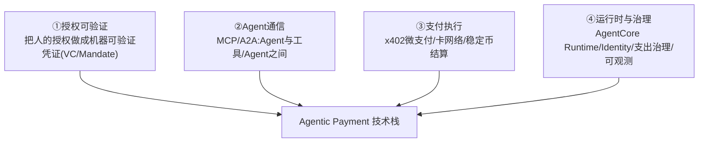
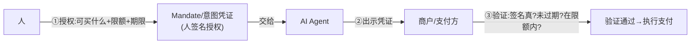
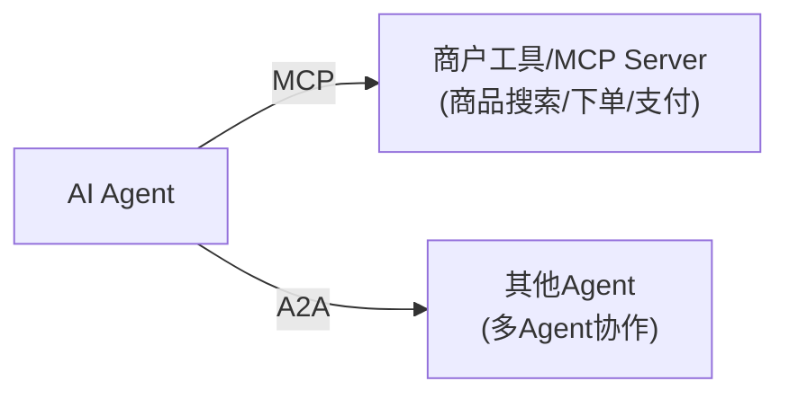
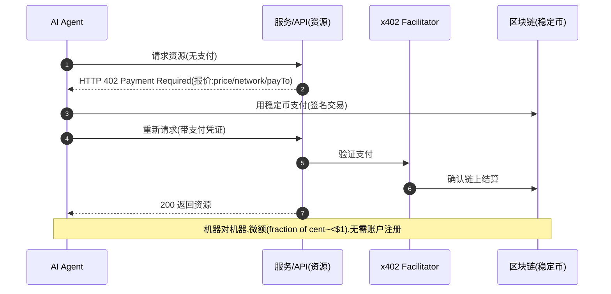
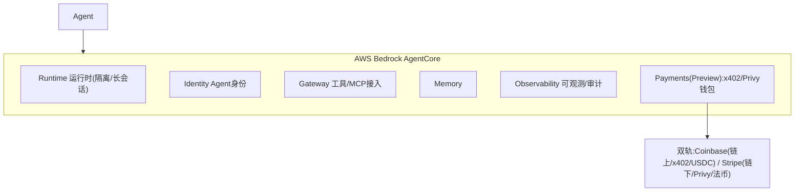
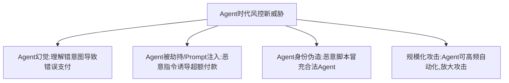

# 模块 5 · Agentic Payment（技术篇）：协议机制、授权凭证与 AWS

> **学习者**：AWS 技术架构师 · 支付小白
> **本篇目标**：把 Agentic Payment 的协议翻译成工程。回答：怎么把"人的授权"做成机器可验证的凭证？x402 微支付链路怎么跑？MCP/A2A 怎么连？AWS AgentCore Payments 怎么落地？——重点是"授权可验证"的技术实现和 AWS 方案。
> **前置**：业务篇 `05-agentic-payment-business.md`、模块1(卡/HSM)、模块4(稳定币/私钥)
> **配套深度专题**：各协议 `1.google_ucp/`~`7.mastercard_agent_pay/`；`reference/summary/Payment_Agentic_AI_总结.md`（AgentCore Payments/Self-build栈/x402架构）
> **组织方式**：top-down 主线。零散追问见 FAQ。
> 标注：🔧 通用技术 · ☁️ AWS · 📌 关键 · ⚠️ 坑点 · 🎯 交流要点
> ⚠️ **可信度**：协议机制基于各专题研究与 reference PPT；AWS AgentCore Payments 截至 2026 初为 **Preview**，特性/区域以官方文档为准。

---

## 1. 全景：Agentic Payment 技术栈

业务篇说核心问题是"付款人不在场，怎么让 Agent 付款可信"。技术上要解决四块：

> 🎯 **交流要点**：传统支付技术解决"账本+清结算+密钥"（模块0-4）；Agentic 额外要解决"**授权怎么从人传给 Agent 并可被机器验证**"——这是全新的技术命题，也是各协议的核心。

---

## 2. 授权可验证：把"人在场确认"变成机器凭证

📌 第一性：人在场时，"确认支付"按钮就是授权证明。人不在场后，要把授权变成一个**机器可验证、可限额、可撤销的数字凭证**。

🔧 **核心技术构件**：
- **Mandate/意图凭证**（如 Google AP2）：人用私钥**签名**一份授权（可买什么品类、最高金额、有效期、限定商户），Agent 持有它去付款。
- **可验证凭证（VC, Verifiable Credential）**：W3C 标准的加密可验证凭证——出示方证明"我有某授权"，验证方用公钥验签，无需联系签发方。
- **Shared Payment Token（ACP）**：带预算金额+欺诈信号的支付令牌，"俄罗斯套娃"式的逻辑层——签名失败不扣预算（防 Agent 幻觉超额）。
- **支出治理（x402 PaymentSession）**：maxSpendAmount + currency + 过期时间，约束 Agent 单次/累计花费。

📌 **共同模式**：都是"**人签名授权 → Agent 持凭证 → 验证方验签+查限额**"——用密码学签名替代"人在场点确认"。这和模块1的卡支付授权（发卡行实时决策）不同：这里授权是**预先签发、可离线验证**的。

> 🎯 **交流要点**：能讲"Agentic 授权 = 人签名的限额凭证(Mandate/VC)，Agent 持有出示，验证方验签查限额"——抓住了所有 Agent 支付协议的技术内核。各协议差异在凭证格式、签发方、验证方。
> 📖 AP2 的 Mandate、ACP 的 Shared Payment Token 详见 `4.google_ap2/`、`2.openai_strip_acp/`。

---

## 3. Agent 通信：MCP 与 A2A

🔧 Agent 要和外部世界交互，靠两类协议（业务篇四层栈的第①层）：
- **MCP（Model Context Protocol，Anthropic）**：Agent ↔ **工具/数据源**的连接标准——Agent 通过 MCP 调用商户的商品查询、下单、支付工具。
- **A2A（Agent2Agent，Google）**：Agent ↔ **Agent** 的通信——多 Agent 协作（如差旅 Agent 调用酒店 Agent）。

💡 **x402 Bazaar（Coinbase）**：一个 MCP 形式的"商家可发现目录"——Agent 通过 MCP 发现哪些服务支持 x402 付费，直接调用并用稳定币付款。
> 📖 MCP/A2A 在各协议中的应用见 `agentic_commerce.md`、`reference/summary/`。

---

## 4. 支付执行：x402 微支付链路

📌 x402 是 Agent 支付最有代表性的技术——用 HTTP **402（Payment Required）**状态码做原生微支付：

🔧 **关键**：x402 把"支付"嵌进 HTTP 协议本身——服务端返回 402 + 报价，客户端（Agent）用稳定币付款后重试。**Facilitator** 负责验证支付。结算用稳定币（转账即结算，模块4），适合微额高频。
> 📖 x402 完整机制见 `5.conibase_x402/`。

---

## 5. AWS AgentCore Payments 与落地架构

📌 **AWS Bedrock AgentCore**：构建/运行 Agent 的托管平台，含 Runtime/Identity/Gateway/Memory/Observability。其中 **AgentCore Payments**（Preview）专为 Agent 支付设计。

📌 **AgentCore Payments 双轨**（与 Coinbase + Stripe 共建）：
- **Coinbase 线**：链上/稳定币/x402（CDP Wallet + x402 Bazaar，USDC 结算）
- **Stripe 线**：链下/Privy 钱包/未来法币

📌 **支出治理四要素**（reference 总结）：①Authentication ②Transaction Execution（x402 微支付）③Spending Governance（PaymentSession: maxSpendAmount+currency+过期，签名失败不扣预算）④Observability。

☁️ **Self-build 标准架构栈**（reference PPT）：

| 层 | AWS 组件 |
|---|---|
| 出口/UI | Web/App/ChatGPT/Agent SDK |
| 商户侧边界(Outgoing) | CloudFront + Lambda@Edge + WAF + x402 Facilitator + TAP/RFC9421 验签 |
| 护栏&身份&审计 | Bedrock Guardrails + AP2 Mandate + IAM + CloudTrail |
| Agent 运行时&支付 | AgentCore Runtime + Payments(x402/Privy) + EKS/ECS/Lambda |
| 模型层 | Bedrock(Claude/Nova) + 2P 开源(Llama/DeepSeek/Qwen) |
| 支付专属 | Payment Cryptography + Nitro Enclaves(私钥) + KMS |

> 🎯 **交流杀手锏**：Agent 支付的 AWS 落地 = **AgentCore(Runtime+Payments+Identity) + Outgoing边界(CloudFront+Lambda@Edge+WAF+x402 Facilitator) + 护栏(Guardrails+AP2 Mandate) + 私钥保护(Nitro,模块4)**。能给出这套栈并说清每层作用，是 AWS SA 在 Agent 支付领域的核心能力。
> 📖 完整 Self-build 栈、Demo/Sample、双轨策略见 `reference/summary/Payment_Agentic_AI_总结.md`（第13-14页）。

---

## 6. Agent 时代的风控新挑战

⚠️ Agent 付款带来传统风控失效的新威胁（模块1风控的延伸）：

🔧 应对：支出治理（限额/单次凭证）、Agent 身份验证(KYA)、Prompt 注入防护（Bedrock Guardrails）、人在环（高风险需人确认）、可验证凭证 + 全链审计(CloudTrail/AgentCore Observability)。
> 📖 Agent 时代欺诈与风控详见 `10.fraud_risk_control/`（为什么传统风控失效+各协议风控方案）+ 模块6。

---

## 7. 本篇小结（背下来）

1. **技术核心 = 授权可验证**：把"人在场点确认"变成机器可验证/可限额/可撤销的凭证（Mandate/VC/Shared Payment Token）。
2. **共同模式**：人签名授权→Agent持凭证→验证方验签查限额（预先签发、可离线验证）。
3. **Agent通信**：MCP(Agent↔工具)/A2A(Agent↔Agent)。
4. **x402微支付**：HTTP 402状态码原生支付，稳定币结算，机器对机器微额高频。
5. **AgentCore Payments双轨**：Coinbase(链上/x402/USDC) + Stripe(链下/Privy/法币)；支出治理四要素。
6. **AWS Self-build栈**：AgentCore + Outgoing边界(CloudFront+Lambda@Edge+x402 Facilitator) + Guardrails+AP2 Mandate + Nitro私钥。
7. **风控新威胁**：幻觉/Prompt注入/身份伪造/规模化——靠支出治理+KYA+Guardrails+人在环+审计。

---

## 8. 通向下一层

- **业务全景** → `05-agentic-payment-business.md`
- **各协议深度** → `1.google_ucp/`~`7.mastercard_agent_pay/`、`agentic_commerce.md`
- **AgentCore Payments/Self-build栈/Demo** → `reference/summary/Payment_Agentic_AI_总结.md`
- **私钥保护(稳定币钱包)** → 模块4 `04-stablecoin-tech-aws.md`
- **风控合规体系** → 模块6 + `10.fraud_risk_control/`

---

## 附：常见追问（FAQ）

**Q：Mandate（授权凭证）和模块1卡支付的"授权"有什么不同？**
A：模块1的授权是**发卡行实时在线决策**（每笔刷卡，发卡行当场判断批准/拒绝）。Agentic 的 Mandate 是**人预先签发的离线凭证**——人提前签好"可买什么+限额+期限"，Agent 在这个范围内自主付款，验证方验签即可（无需每笔联系签发人）。一个是"实时逐笔决策"，一个是"预授权范围内自主"。这正是"人不在场"带来的根本转变。

**Q：x402 的 402 状态码是新发明的吗？**
A：不是。HTTP 402 "Payment Required" 是 HTTP 协议里**一直保留但从未被正式使用**的状态码（当年预留给数字支付，但没成标准）。x402 把它"复活"——服务端用 402 返回支付报价，客户端付款后重试。所以叫 x402（"把 402 用起来"）。这是个很巧妙的设计：支付能力直接嵌进 Web 协议层，Agent 天然能处理。

**Q：AgentCore Payments 现在能用在生产吗？**
A：截至 2026 初是 **Preview**（预览），覆盖特定区域（us-east-1/us-west-2/eu-central-1/ap-southeast-2 等），与 Coinbase、Stripe 共建。Preview 意味着可以体验、做 PoC，但生产可用性、SLA、区域覆盖以官方文档为准——这点要对客户诚实（reference PPT 也明确标注 Preview）。

**Q：为什么卡组织（Visa/MC）强调"信任层"而不是拼速度？**
A：因为 Agent 支付的瓶颈不是速度（链上稳定币已经够快），而是**信任**——商户怎么确信这个 Agent 真的得到了人的授权、不是恶意脚本？Visa 把 Intelligent Commerce 定位为"Agent 经济的信任层"，提供 Agent 身份验证、token 化凭证、消费者保护——这些是稳定币轨道（转账即结算、不可逆）缺乏的。卡组织用几十年积累的"信任和消费者保护"做差异化，而非和稳定币拼速度/成本。
