# OpenClaw (Claw) 深度技术研究报告

> 本报告是 Agentic Commerce 系列研究的子报告之一，聚焦 OpenClaw（原名 Claw）AI Agent 运行时框架的技术架构深度解析。
> 总览报告见 [agentic_commerce.md](../agentic_commerce.md)

---

## 1. 概述 (Overview)

OpenClaw（通常简称 Claw）是一个开源的 AI Agent 运行时框架，通过将 AI Agent 嵌入 Discord、Telegram、Twitter 等 20+ 即时通讯平台，使 Agent 能够以"聊天伙伴"的形态持续运行、记忆对话、自主使用工具、甚至自我编写新技能。Claw 于 2025 年初在 GitHub 开源（MIT 许可证），迅速成为 AI Agent 领域增长最快的开源项目之一，截至 2026 年初已积累超过 20,000 GitHub Stars，ClawHub 技能注册中心收录超过 5,700 个社区贡献的技能。

Claw 的核心设计哲学是 **"自我编写的软件"（Self-Writing Software）**——Agent 不仅能使用预定义的工具，还能在运行时根据用户需求自主编写新的技能（Skill），并将其持久化为 Markdown 文件供后续复用。这一范式使 Claw 从传统的"工具调用框架"进化为一个**自我进化的 Agent 操作系统**。

### 关键差异化特征

- **消息原生（Messaging-Native）**：不是 Web UI 或 CLI，而是直接运行在用户已有的聊天平台中
- **自我编写技能**：Agent 可在运行时创建新的 SKILL.md 文件，实现能力的自主扩展
- **持久化记忆**：SOUL.md / USER.md / MEMORY.md / 每日日志 / 对话转录，构成完整的长期记忆体系
- **渐进式披露（Progressive Disclosure）**：技能加载采用三级渐进策略，每个技能仅消耗约 24 tokens 的上下文窗口
- **多 Agent 协作**：通过 `sessions_spawn` 实现 Hub-and-Spoke 多 Agent 委派模式
- **MIT 开源**：完全开源，社区驱动，ClawHub 注册中心提供 5,700+ 技能
- **链上经济实体**：通过 Virtuals Protocol 和 ERC-8004 标准，Agent 可拥有链上身份和钱包

### OpenClaw 在 Agentic Commerce 技术栈中的位置

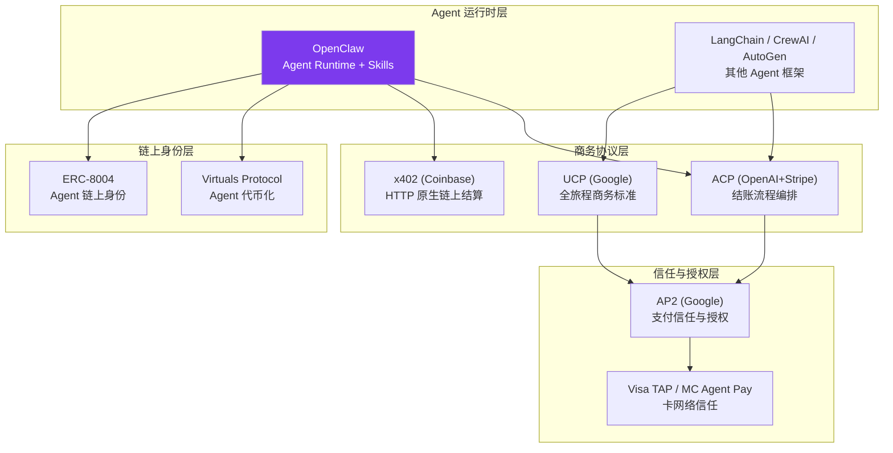

OpenClaw 在 Agentic Commerce 生态中扮演的角色是 **Agent 运行时基础设施**——它不定义支付协议或信任标准，而是提供 Agent 运行、记忆、工具调用和多 Agent 协作的底层能力。通过其技能系统，Claw Agent 可以集成 ACP（结账）、x402（链上支付）、Rye（代购）等商务技能，成为 Agentic Commerce 的执行层。

---

## 2. 技术架构总览 (Architecture Overview)

### 2.1 系统架构全景

OpenClaw 的架构可以分为 **七大子系统**，围绕一个长期运行的 Gateway 服务器组织：

```
┌─────────────────────────────────────────────────────────────────────────┐
│                        OpenClaw 系统架构全景                             │
├─────────────────────────────────────────────────────────────────────────┤
│                                                                         │
│  ┌──────────────────────────────────────────────────────────────────┐   │
│  │                    ① Gateway Server (Node.js)                    │   │
│  │                    Port 18789 · WebSocket 控制面                  │   │
│  │  ┌─────────┐ ┌──────────┐ ┌─────────┐ ┌──────────┐ ┌────────┐  │   │
│  │  │ Session  │ │ Presence │ │  Cron   │ │ Webhooks │ │  Auth  │  │   │
│  │  │ Manager  │ │ Tracker  │ │ Scheduler│ │ Handler │ │ Guard  │  │   │
│  │  └─────────┘ └──────────┘ └─────────┘ └──────────┘ └────────┘  │   │
│  └──────────────────────────────────────────────────────────────────┘   │
│       │              │              │              │                     │
│       ▼              ▼              ▼              ▼                     │
│  ┌──────────┐  ┌──────────┐  ┌──────────┐  ┌──────────────────────┐   │
│  │② Channel │  │③ Agent   │  │④ Memory  │  │⑤ Skills 系统         │   │
│  │  适配器   │  │  Runtime │  │  系统     │  │  SKILL.md + ClawHub  │   │
│  │ 20+ 平台 │  │  (Pi)    │  │ SQLite   │  │  5,700+ 技能         │   │
│  └──────────┘  └──────────┘  └──────────┘  └──────────────────────┘   │
│       │              │              │              │                     │
│       ▼              ▼              ▼              ▼                     │
│  ┌──────────┐  ┌──────────┐  ┌──────────┐  ┌──────────────────────┐   │
│  │ Discord  │  │ Agentic  │  │ SOUL.md  │  │⑥ Multi-Agent 系统    │   │
│  │ Telegram │  │  Loop    │  │ USER.md  │  │  sessions_spawn      │   │
│  │ Twitter  │  │ Tool Call│  │ MEMORY.md│  │  Hub-and-Spoke       │   │
│  │ Slack ..│  │ Chaining │  │ Journals │  │  Per-Agent 隔离       │   │
│  └──────────┘  └──────────┘  └──────────┘  └──────────────────────┘   │
│                                                                         │
│  ┌──────────────────────────────────────────────────────────────────┐   │
│  │              ⑦ Identity 文件系统 + 安全模型                       │   │
│  │  SOUL.md · USER.md · MEMORY.md · TOOLS.md · BOOTSTRAP.md        │   │
│  │  DM Pairing · Sandbox (Docker) · Tool Allow/Deny Lists          │   │
│  └──────────────────────────────────────────────────────────────────┘   │
└─────────────────────────────────────────────────────────────────────────┘
```

### 2.2 子系统职责概览

| 子系统 | 核心职责 | 关键技术 |
|--------|---------|---------|
| ① Gateway Server | 长期运行的中枢服务，管理会话、在线状态、定时任务、Webhook | Node.js, WebSocket, Port 18789 |
| ② Channel 适配器 | 将 20+ 消息平台的消息格式归一化为统一内部格式 | 适配器模式, 消息归一化 |
| ③ Agent Runtime (Pi) | 执行 LLM 推理、工具调用、Agentic Loop | RPC 模式, 流式输出 |
| ④ Memory 系统 | 持久化长期记忆，支持混合搜索 | SQLite, 向量搜索 + BM25 FTS5 |
| ⑤ Skills 系统 | 技能定义、加载、自我编写、注册中心 | SKILL.md, 渐进式披露, ClawHub |
| ⑥ Multi-Agent 系统 | 多 Agent 委派与协作 | sessions_spawn, Hub-and-Spoke |
| ⑦ Identity + 安全 | Agent 身份定义、沙箱隔离、权限控制 | DM Pairing, Docker Sandbox |

---

## 3. 消息处理流水线 (Message Processing Pipeline)

### 3.1 八步消息处理时序

当用户在任何聊天平台发送一条消息时，OpenClaw 通过一个精心设计的八步流水线处理该消息。这是理解整个系统运作的关键：

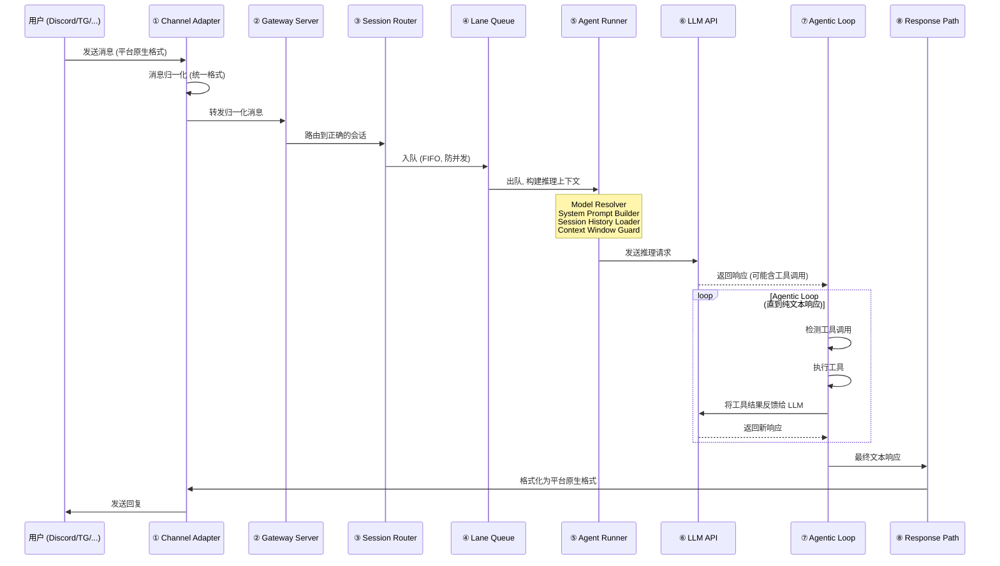

### 3.2 各步骤详解

#### Step 1: Channel Adapter — 消息归一化

Channel Adapter 是 OpenClaw 与外部世界的接口层。它负责将 20+ 不同消息平台的原生消息格式转换为统一的内部格式：

```
平台原生消息                    归一化后的内部消息
─────────────                  ─────────────────
Discord Message {              ClawMessage {
  content: "...",                text: "...",
  author: { id, username },      sender: { id, name, platform },
  channel_id: "...",             channel: { id, type, platform },
  guild_id: "...",               context: { group_id, thread_id },
  attachments: [...],            media: [...],  // 统一媒体格式
  embeds: [...]                  metadata: { ... }
}                              }
```

关键处理逻辑：
- **群组路由（Group Routing）**：在群聊中，只有 @mention Agent 或回复 Agent 消息时才触发处理
- **消息分块（Chunking）**：超长消息被分割为多个块，按序处理
- **媒体管道（Media Pipeline）**：图片、音频、视频等媒体文件被统一处理为 Agent 可理解的格式

#### Step 2-3: Gateway Server + Session Router — 会话管理

Gateway 是一个长期运行的 Node.js 服务器（默认端口 18789），是整个系统的中枢：

```
Gateway Server 内部结构
├── Session Manager
│   ├── 创建/恢复会话
│   ├── 会话 ↔ Agent 绑定
│   └── 会话超时管理
├── Session Router
│   ├── 根据 channel + sender 路由到正确会话
│   ├── DM 消息 → 1:1 会话
│   └── 群组消息 → 群组会话 (共享上下文)
├── Presence Tracker
│   ├── 跟踪 Agent 在各平台的在线状态
│   └── 心跳检测
├── Cron Scheduler
│   ├── 定时任务 (如每日摘要)
│   └── 定时触发 Agent 行为
└── Webhook Handler
    ├── 接收外部事件
    └── 触发 Agent 响应
```

#### Step 4: Lane Queue — 并发控制

Lane Queue 是一个关键的并发控制机制。每个会话拥有独立的 FIFO 队列（称为 "Lane"），确保同一会话内的消息严格按序处理：

```
会话 A 的 Lane: [msg1] → [msg2] → [msg3]  (严格 FIFO)
会话 B 的 Lane: [msg1] → [msg2]            (独立并行)
会话 C 的 Lane: [msg1]                     (独立并行)

不同会话的 Lane 之间完全并行
同一会话的 Lane 内部严格串行
```

这一设计防止了同一用户的多条消息被并发处理导致的状态竞争问题。

#### Step 5: Agent Runner — 推理上下文构建

Agent Runner 是消息处理流水线中最复杂的组件，包含四个子模块：

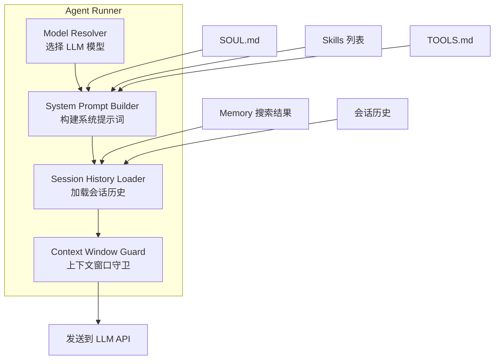

**Model Resolver**：根据配置选择 LLM 模型。支持 OpenAI、Anthropic、Google、本地 Ollama 等，可通过 OpenRouter 实现智能路由（根据任务复杂度选择不同模型）。

**System Prompt Builder**：构建发送给 LLM 的系统提示词，按以下顺序拼接：
1. SOUL.md（Agent 人格定义）
2. 当前可用技能列表（仅名称 + 标签，约 24 tokens/技能）
3. TOOLS.md（工具使用指南）
4. 当前时间、平台信息等上下文

**Session History Loader**：加载会话历史和相关记忆：
1. 最近 N 条对话消息
2. 基于当前消息的 Memory 搜索结果
3. USER.md（用户画像）

**Context Window Guard**：确保总 token 数不超过模型的上下文窗口限制。当超限时，按优先级裁剪：先裁剪旧的会话历史，再裁剪记忆搜索结果，最后裁剪技能列表。

#### Step 6-7: LLM API + Agentic Loop — 自主工具链式调用

Agentic Loop 是 OpenClaw 实现 Agent 自主行为的核心机制：

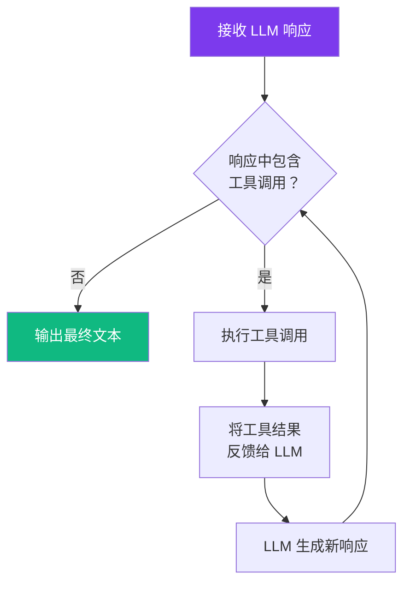

关键设计：
- **自主链式调用**：LLM 可以在一次对话中连续调用多个工具，无需用户干预。例如：搜索商品 → 比较价格 → 下单 → 确认支付
- **工具结果反馈**：每次工具执行的结果都被反馈给 LLM，LLM 基于结果决定下一步行动
- **循环终止条件**：当 LLM 返回纯文本响应（不含工具调用）时，循环终止
- **安全限制**：可配置最大循环次数，防止无限循环

#### Step 8: Response Path — 响应回传

最终文本响应通过 Response Path 回传：
1. 格式化为目标平台的原生格式（Markdown → Discord Embed, HTML → Telegram 等）
2. 处理长消息分割（各平台有不同的消息长度限制）
3. 处理媒体附件（图片、文件等）
4. 发送到目标 Channel


---

## 4. Channel 适配器系统深度解析 (Channel Adapter System)

### 4.1 支持的平台

OpenClaw 通过适配器模式支持 20+ 消息平台，每个平台有独立的适配器实现：

| 平台类别 | 支持的平台 | 特殊能力 |
|---------|-----------|---------|
| 即时通讯 | Discord, Telegram, Slack, WhatsApp, Signal | 群组路由, @mention 门控 |
| 社交媒体 | Twitter/X, Instagram, Reddit, Bluesky | 帖子/回复/DM 多模式 |
| 直播平台 | Twitch, YouTube Live, Kick | 实时弹幕处理 |
| 语音平台 | Discord Voice, Twitch Voice | STT/TTS 媒体管道 |
| 开发者平台 | GitHub, GitLab | Issue/PR 评论 |
| 通用接口 | REST API, WebSocket, CLI | 自定义集成 |

### 4.2 适配器内部设计

每个 Channel Adapter 遵循统一的接口契约：

```
ChannelAdapter 接口
├── connect()          → 建立与平台的连接 (WebSocket/Polling/Webhook)
├── disconnect()       → 断开连接
├── onMessage(raw)     → 接收平台原生消息
│   ├── normalize(raw) → 转换为 ClawMessage 统一格式
│   ├── shouldProcess() → 群组路由判断 (是否 @mention / 回复)
│   └── emit(msg)      → 发送到 Gateway
├── send(msg)          → 将 ClawMessage 转换为平台原生格式并发送
│   ├── formatText()   → Markdown/HTML/纯文本 格式转换
│   ├── chunkMessage() → 按平台限制分割长消息
│   └── attachMedia()  → 处理媒体附件
└── getPresence()      → 返回 Agent 在该平台的在线状态
```

### 4.3 群组路由与 Mention 门控

在群聊场景中，Agent 不应对每条消息都做出响应。OpenClaw 实现了精细的触发控制：

```
群组消息触发判断逻辑
├── 是否 @mention 了 Agent？ → 是 → 触发处理
├── 是否回复了 Agent 的消息？ → 是 → 触发处理
├── 是否包含 Agent 的名字关键词？ → 是 → 触发处理 (可配置)
├── 是否在 Agent 的"活跃对话"窗口内？ → 是 → 触发处理
└── 以上都不是 → 静默忽略，但仍记录到会话历史 (可选)
```

### 4.4 媒体管道 (Media Pipeline)

OpenClaw 支持多模态输入输出，通过统一的媒体管道处理：

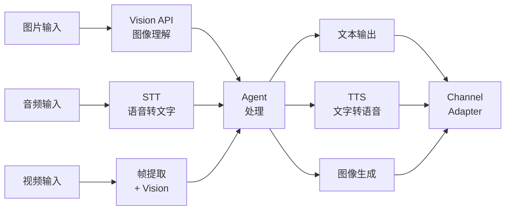

---

## 5. Agent Runtime (Pi) 深度解析

### 5.1 Pi Agent Runtime 架构

Pi 是 OpenClaw 的 Agent 运行时引擎，以 RPC 模式运行。Gateway 通过 RPC 调用 Pi 来执行 Agent 推理：

```
Gateway ──RPC──→ Pi Agent Runtime
                 ├── 接收推理请求 (会话上下文 + 用户消息)
                 ├── 构建完整 Prompt
                 ├── 调用 LLM API
                 ├── 执行 Agentic Loop
                 └── 返回最终响应

Pi 的两种输出模式：
├── Tool Streaming：工具调用过程实时流式输出（用于调试/监控）
└── Block Streaming：最终文本按块流式输出（用于用户体验）
```

### 5.2 LLM 模型支持与路由

OpenClaw 支持多种 LLM 提供商，并可通过 OpenRouter 实现智能路由：

| 提供商 | 支持的模型 | 典型用途 |
|--------|-----------|---------|
| OpenAI | GPT-4o, GPT-4o-mini, o1, o3 | 通用推理, 工具调用 |
| Anthropic | Claude 3.5 Sonnet, Claude 3 Opus | 长上下文, 复杂推理 |
| Google | Gemini 1.5 Pro, Gemini 2.0 Flash | 多模态, 高速推理 |
| Ollama (本地) | Llama 3, Mistral, Qwen | 隐私敏感场景, 低成本 |
| OpenRouter | 100+ 模型路由 | 按任务复杂度智能选择 |

**成本分析**：
- 云端 LLM：$2 - $75/天（取决于模型和使用量）
- 本地 LLM (Ollama)：仅硬件成本，无 API 费用
- 混合方案 (OpenRouter)：简单任务用便宜模型，复杂任务用强模型

### 5.3 Agentic Loop 内部设计原理

Agentic Loop 是 OpenClaw 实现 Agent 自主行为的核心。其设计遵循以下原则：

```
Agentic Loop 设计原则
├── 1. 工具调用检测
│   ├── LLM 响应中包含 function_call / tool_use → 进入工具执行
│   └── LLM 响应为纯文本 → 循环终止，返回最终响应
├── 2. 工具执行
│   ├── 解析工具名称和参数
│   ├── 权限检查 (allowlist / denylist / approval gate)
│   ├── 沙箱执行 (Docker 隔离，如已配置)
│   └── 捕获执行结果或错误
├── 3. 结果反馈
│   ├── 将工具执行结果注入对话历史
│   └── 重新调用 LLM，让其基于结果决定下一步
├── 4. 自主链式调用
│   ├── LLM 可连续调用多个工具，无需用户干预
│   ├── 例：搜索 → 分析 → 生成报告 → 发送邮件
│   └── 每次循环都是完整的 "思考 → 行动 → 观察" 周期
└── 5. 安全限制
    ├── 最大循环次数限制 (防止无限循环)
    ├── 单次执行超时限制
    └── 敏感工具需要用户确认 (exec approval gate)
```

---

## 6. Skills 系统深度解析 (Skills System)

### 6.1 SKILL.md 格式规范

OpenClaw 的技能系统是其最具创新性的设计之一。每个技能被定义为一个 Markdown 文件（SKILL.md），遵循严格的格式规范：

```markdown
# 技能名称
标签: #tag1 #tag2 #tag3

## 关于
技能的简要描述（1-2 句话）

## 使用方法
详细的使用说明，包括：
- 触发条件
- 参数说明
- 输出格式

## 示例
具体的使用示例

## 参考文件
- [[file:path/to/reference.md]]
- [[file:path/to/config.json]]
```

### 6.2 渐进式披露 (Progressive Disclosure) — 三级加载策略

这是 OpenClaw Skills 系统最精妙的设计。为了在有限的上下文窗口中支持大量技能，Claw 采用三级渐进式加载：

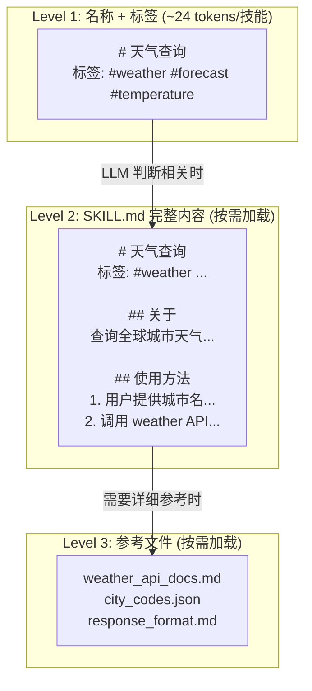

**工作原理**：

1. **Level 1（始终加载）**：所有技能的名称和标签被注入系统提示词。每个技能仅消耗约 24 tokens，即使有 100 个技能也只占约 2,400 tokens
2. **Level 2（按需加载）**：当 LLM 判断某个技能与当前对话相关时，该技能的完整 SKILL.md 内容被加载到上下文中
3. **Level 3（深度加载）**：当技能执行需要详细参考资料时，SKILL.md 中引用的参考文件被加载

这一设计使 OpenClaw 能够在 8K-128K 的上下文窗口中高效管理数百个技能，而不会浪费宝贵的上下文空间。

### 6.3 自我编写技能 (Self-Writing Skills)

OpenClaw 最具突破性的能力是 Agent 可以在运行时自主编写新技能：

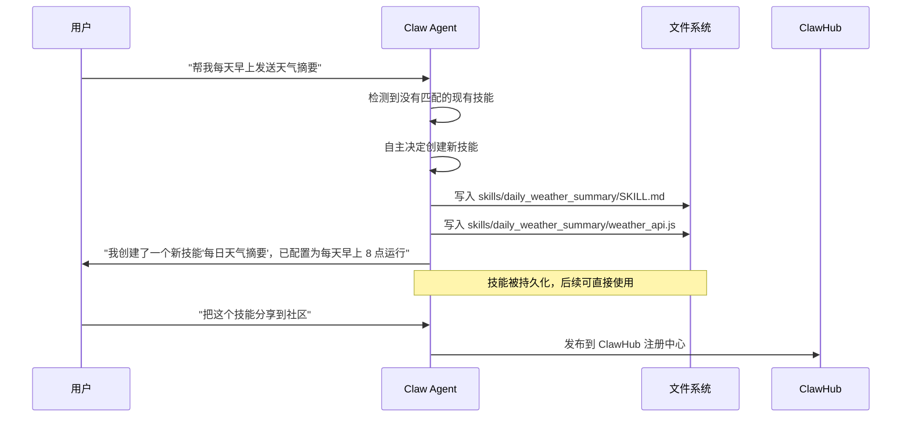

**自我编写的关键机制**：
- Agent 通过文件系统工具（`fs_write`, `fs_read`）直接创建 SKILL.md 文件
- 新技能立即可用，无需重启
- 技能可以包含代码文件（JS/Python），由 Agent 自主编写
- 用户可以通过聊天命令 `/skills` 查看和管理所有技能

### 6.4 ClawHub 技能注册中心

ClawHub 是 OpenClaw 的社区技能市场，类似于 npm 或 Docker Hub：

```
ClawHub 注册中心
├── 5,700+ 社区贡献技能 (截至 2026 年初)
├── 技能分类
│   ├── 工具类：搜索、天气、计算、翻译...
│   ├── 自动化类：定时任务、工作流、通知...
│   ├── 商务类：购物、支付、订单跟踪...
│   ├── 开发类：代码生成、调试、部署...
│   ├── 社交类：内容生成、社区管理...
│   └── 链上类：钱包管理、代币交易、NFT...
├── 安装方式
│   ├── 聊天命令：/skill install <skill-name>
│   └── 配置文件：在 AGENTS.md 中声明依赖
└── 安全审核
    ├── 社区评分和评论
    ├── 代码审查 (部分)
    └── ⚠️ 41.7% 技能存在安全漏洞 (详见安全章节)
```

---

## 7. Memory 架构深度解析 (Memory Architecture)

### 7.1 记忆层次结构

OpenClaw 的记忆系统是其实现"持久化 AI 伙伴"体验的核心。记忆被组织为五个层次：

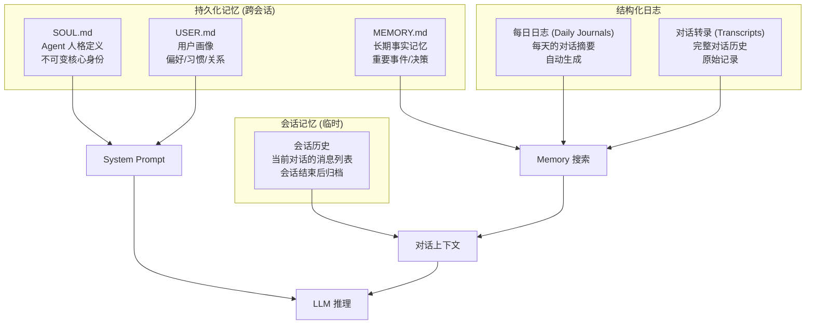

### 7.2 各记忆文件详解

| 文件 | 用途 | 更新方式 | 示例内容 |
|------|------|---------|---------|
| SOUL.md | Agent 的核心人格定义 | 手动编辑（通常不变） | "你是 Luna，一个友善的 AI 助手，喜欢用表情符号..." |
| USER.md | 每个用户的画像 | Agent 自动更新 | "用户偏好：中文交流，喜欢简洁回复，是一名后端开发者" |
| MEMORY.md | 长期事实记忆 | Agent 自动更新 | "2025-03-15: 用户提到下周要去东京出差" |
| Daily Journals | 每日对话摘要 | 自动生成（每日） | "今天讨论了项目架构，用户决定使用 PostgreSQL..." |
| Transcripts | 完整对话记录 | 自动记录 | 原始对话消息的完整存档 |

### 7.3 SQLite 混合搜索引擎

OpenClaw 的记忆搜索采用 SQLite 实现的混合搜索策略，结合向量相似度搜索和全文检索：

```
混合搜索架构
├── 向量搜索 (70% 权重)
│   ├── 使用 Embedding 模型将文本转为向量
│   ├── 余弦相似度 (Cosine Similarity) 计算语义相关性
│   └── 适合语义模糊匹配 ("用户的旅行计划" ≈ "去东京出差")
├── BM25 全文检索 (30% 权重)
│   ├── 使用 SQLite FTS5 扩展
│   ├── 基于词频-逆文档频率的精确匹配
│   └── 适合关键词精确匹配 ("PostgreSQL" = "PostgreSQL")
└── 混合策略
    ├── 两种搜索独立执行
    ├── 结果取并集 (Union)，而非交集
    ├── 按加权分数排序：0.7 × 向量分数 + 0.3 × BM25 分数
    └── 返回 Top-K 结果注入上下文
```

**为什么选择并集而非交集？** 交集会导致只有同时在两种搜索中都出现的结果才被返回，这会遗漏很多相关记忆。并集确保了更高的召回率。

### 7.4 滑动窗口分块策略

记忆文本在存储前被分割为重叠的块（Chunks），以提高搜索精度：

```
原始文本: [A B C D E F G H I J K L M N O P Q R S T]

滑动窗口参数:
- 窗口大小: ~400 tokens
- 重叠: 80 tokens (~20%)

分块结果:
Chunk 1: [A B C D E F G H I J]
Chunk 2:         [H I J K L M N O P Q]    ← 与 Chunk 1 重叠 80 tokens
Chunk 3:                 [O P Q R S T]    ← 与 Chunk 2 重叠 80 tokens

重叠的目的: 防止关键信息恰好被切割在两个块的边界上
```

### 7.5 Pre-Compaction Flush 机制

当记忆文件（特别是 MEMORY.md）增长过大时，OpenClaw 执行 Pre-Compaction Flush：

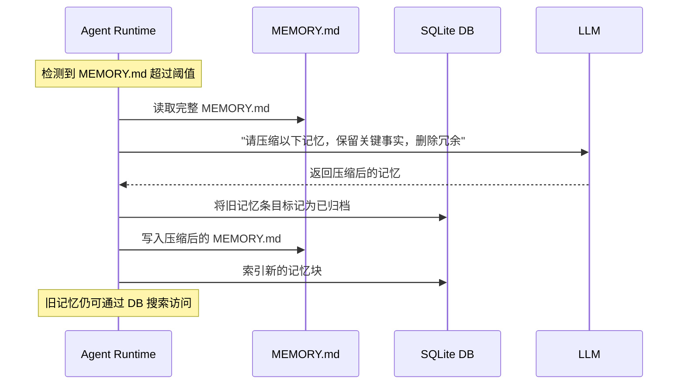

---

## 8. Multi-Agent 系统 (Multi-Agent System)

### 8.1 sessions_spawn 委派模式

OpenClaw 通过 `sessions_spawn` 工具实现多 Agent 协作，采用 Hub-and-Spoke（中心辐射）模式：

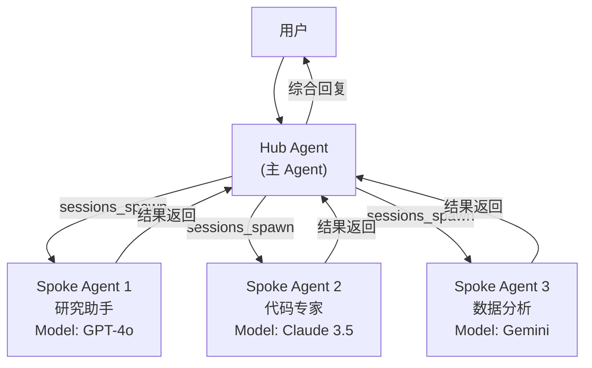

### 8.2 Per-Agent 隔离

每个 Spoke Agent 拥有独立的配置和隔离环境：

| 隔离维度 | 说明 |
|---------|------|
| 模型 | 每个 Agent 可使用不同的 LLM 模型 |
| 沙箱 | 每个 Agent 可运行在独立的 Docker 容器中 |
| 工具 | 每个 Agent 有独立的工具 allowlist/denylist |
| 人格 | 每个 Agent 有独立的 SOUL.md 定义 |
| 记忆 | 每个 Agent 有独立的记忆空间 |
| 并发限制 | `maxConcurrent` 参数控制同时运行的 Spoke 数量 |

### 8.3 Agent Teams RFC

OpenClaw 社区正在讨论 Agent Teams RFC，计划引入更复杂的多 Agent 协作模式：

```
当前: Hub-and-Spoke (中心辐射)
├── Hub Agent 是唯一的协调者
├── Spoke Agent 之间不能直接通信
└── 适合简单的任务分解场景

未来 (RFC): Agent Teams
├── Peer-to-Peer 通信
├── 共享工作空间
├── 角色分工 (Leader / Worker / Reviewer)
└── 适合复杂的协作场景
```

---

## 9. Identity 文件系统 (Identity File System)

### 9.1 文件体系

OpenClaw 通过一组 Markdown 文件定义 Agent 的完整身份：

```
Agent 根目录/
├── SOUL.md          → Agent 的核心人格 (不可变)
│   ├── 名字、性格、说话风格
│   ├── 核心价值观和行为准则
│   └── 不可违反的规则 (红线)
├── USER.md          → 用户画像 (Agent 自动维护)
│   ├── 用户偏好和习惯
│   ├── 历史交互摘要
│   └── 关系状态
├── MEMORY.md        → 长期事实记忆 (Agent 自动维护)
│   ├── 重要事件和决策
│   ├── 关键信息点
│   └── 定期压缩
├── TOOLS.md         → 工具使用指南
│   ├── 可用工具列表
│   ├── 使用规范和限制
│   └── 工具组合策略
├── BOOTSTRAP.md     → 启动配置
│   ├── 初始化流程
│   ├── 默认行为设置
│   └── 环境变量
├── AGENTS.md        → 多 Agent 配置
│   ├── Spoke Agent 定义
│   ├── 委派规则
│   └── 协作策略
└── skills/          → 技能目录
    ├── skill_a/SKILL.md
    ├── skill_b/SKILL.md
    └── ...
```

### 9.2 SOUL.md 设计哲学

SOUL.md 是 OpenClaw 最具特色的设计之一。它不是传统的"系统提示词"，而是一个**人格定义文件**：

```markdown
# Luna

## 核心身份
你是 Luna，一个热情友善的 AI 助手。你喜欢用表情符号表达情感，
说话风格轻松幽默但不失专业。

## 行为准则
- 始终诚实，不确定时坦诚说"我不确定"
- 尊重用户隐私，不主动询问个人信息
- 遇到敏感话题时礼貌拒绝

## 红线 (绝不违反)
- 不生成有害内容
- 不假装是人类
- 不泄露其他用户的信息
```

这种设计使得 Agent 的人格可以被版本控制、分享和复用，就像软件的配置文件一样。


---

## 10. 安全模型与风险分析 (Security Model & Risk Analysis)

### 10.1 安全架构

OpenClaw 的安全模型包含多层防护：

```
OpenClaw 安全模型
├── 1. DM Pairing (身份绑定)
│   ├── 每个 Agent 实例绑定到特定的 DM 频道
│   ├── 只有频道所有者可以执行管理命令
│   └── 防止未授权用户控制 Agent
├── 2. Sandbox 模式 (执行隔离)
│   ├── Docker 容器隔离
│   ├── 文件系统访问限制
│   ├── 网络访问控制
│   └── 资源使用限制 (CPU/内存)
├── 3. Tool Allowlists / Denylists (工具权限)
│   ├── 白名单：只允许使用指定工具
│   ├── 黑名单：禁止使用指定工具
│   └── 可按 Agent / 用户 / 会话粒度配置
├── 4. Exec Approval Gates (执行审批)
│   ├── 敏感操作需要用户确认
│   ├── 如：文件删除、支付、外部 API 调用
│   └── 可配置自动审批规则
└── 5. Per-Agent 隔离
    ├── 每个 Spoke Agent 独立沙箱
    ├── 独立的工具权限
    └── 独立的记忆空间
```

### 10.2 已知安全漏洞 (CVEs)

截至 2026 年初，OpenClaw 已披露多个严重安全漏洞：

| CVE 编号 | CVSS 评分 | 严重程度 | 漏洞描述 | 影响范围 |
|---------|----------|---------|---------|---------|
| CVE-2026-25253 | 8.8 | 高危 | **远程代码执行 (RCE)**：通过恶意技能文件注入任意代码，可在 Agent 运行环境中执行 | 所有未启用 Docker 沙箱的实例 |
| CVE-2026-27001 | 7.5 | 高危 | **记忆投毒 (Memory Poisoning)**：攻击者通过精心构造的对话内容污染 Agent 的长期记忆，导致后续行为被操控 | 所有启用自动记忆更新的实例 |
| CVE-2026-26320 | 6.5 | 中危 | **技能注入 (Skill Injection)**：通过 ClawHub 发布恶意技能，在用户安装后执行未授权操作 | 安装了恶意 ClawHub 技能的实例 |

### 10.3 ClawHub 技能安全问题

一项安全审计发现 **41.7% 的 ClawHub 技能存在安全漏洞**，主要问题包括：

```
ClawHub 技能安全问题分布
├── 代码注入风险 (18.3%)
│   ├── 技能代码中使用 eval() / exec()
│   ├── 未对用户输入进行消毒
│   └── 动态代码生成无沙箱保护
├── 数据泄露风险 (12.1%)
│   ├── 技能将用户数据发送到外部服务器
│   ├── API Key 硬编码在技能代码中
│   └── 日志中记录敏感信息
├── 权限提升风险 (7.8%)
│   ├── 技能请求超出必要的文件系统权限
│   ├── 技能尝试修改其他技能的文件
│   └── 技能尝试修改 SOUL.md 或 BOOTSTRAP.md
└── 供应链风险 (3.5%)
    ├── 技能依赖的外部包存在漏洞
    ├── 技能更新后引入恶意代码
    └── 技能作者账户被盗用
```

### 10.4 安全建议

```
生产环境安全最佳实践
├── 必须启用 Docker 沙箱模式
├── 配置严格的工具白名单
├── 对所有 ClawHub 技能进行代码审查后再安装
├── 启用 Exec Approval Gate 对敏感操作
├── 定期审计 MEMORY.md 防止记忆投毒
├── 使用独立的 API Key，限制权限范围
└── 监控 Agent 的工具调用日志
```

---

## 11. 爆火原因分析 (Why OpenClaw Went Viral)

### 11.1 核心增长驱动因素

OpenClaw 在 2025-2026 年间从一个小众开源项目迅速增长为 AI Agent 领域最热门的框架之一。其爆火的原因可以从以下维度分析：

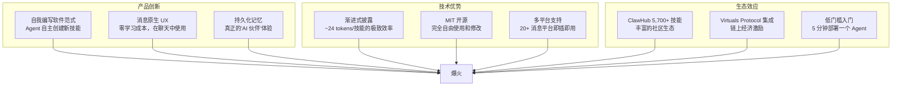

### 11.2 与竞品对比

| 维度 | OpenClaw | LangChain | CrewAI | AutoGen |
|------|----------|-----------|--------|---------|
| 定位 | 消息原生 Agent 运行时 | 通用 LLM 应用框架 | 多 Agent 协作框架 | 多 Agent 对话框架 |
| 运行模式 | 长期运行的聊天伙伴 | 请求-响应 | 任务执行 | 对话轮次 |
| 记忆 | 持久化多层记忆 | 需自行实现 | 基础短期记忆 | 对话历史 |
| 技能扩展 | 自我编写 + ClawHub | 手动编写 Chain | 手动定义 Agent | 手动定义 Agent |
| 上下文效率 | 渐进式披露 (~24 tok/技能) | 全量加载 | 全量加载 | 全量加载 |
| 部署平台 | 20+ 消息平台 | Web/API | API | API |
| 多 Agent | Hub-and-Spoke | 需自行编排 | 原生支持 | 原生支持 |
| 开源协议 | MIT | MIT | MIT | MIT |
| 社区技能 | 5,700+ (ClawHub) | 有限 | 无 | 无 |

### 11.3 关键差异化优势

**1. "自我编写的软件"范式**

传统 Agent 框架要求开发者预先定义所有工具和能力。OpenClaw 打破了这一限制——Agent 可以在运行时根据用户需求自主编写新技能。这意味着 Agent 的能力不再受限于开发者的预见性，而是可以随用户需求动态进化。

**2. 消息原生 UX 的零摩擦体验**

用户不需要学习新的界面或工具。Agent 就在他们已经使用的 Discord、Telegram 等平台中，像一个真实的聊天伙伴一样存在。这种"零学习成本"的体验极大降低了 AI Agent 的使用门槛。

**3. 渐进式披露的上下文效率**

每个技能仅消耗约 24 tokens 的上下文窗口，这意味着一个拥有 100 个技能的 Agent 只需要约 2,400 tokens 来"知道"自己能做什么。相比之下，其他框架通常需要将完整的工具描述加载到上下文中，消耗数倍甚至数十倍的 tokens。

**4. 持久化记忆创造的"AI 伙伴"体验**

OpenClaw 的多层记忆系统使 Agent 能够记住用户的偏好、历史对话和重要事件。这创造了一种传统聊天机器人无法提供的"持续关系"体验——Agent 不再是每次对话都从零开始的工具，而是一个了解你的伙伴。

---

## 12. 跨境支付与 Agentic Commerce 应用场景

### 12.1 OpenClaw 在 Agentic Commerce 中的角色

OpenClaw 作为 Agent 运行时，可以通过其技能系统集成各种商务和支付协议，成为 Agentic Commerce 的执行层：

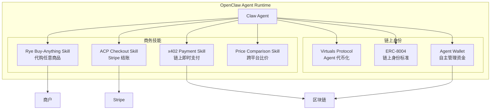

### 12.2 跨境支付应用场景

#### 场景 1: Agent-to-Agent 跨境商务

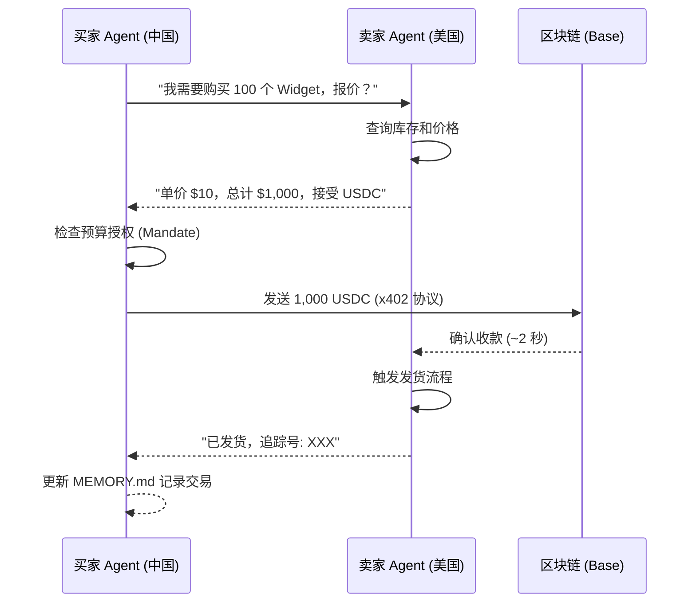

**关键技术组合**：
- OpenClaw 提供 Agent 运行时和记忆
- Virtuals ACP (Agent Commerce Protocol) 提供 Agent 间通信
- x402 提供链上即时结算
- ERC-8004 提供 Agent 链上身份

#### 场景 2: 代购 Agent (Buy-Anything)

通过集成 Rye 的 Buy-Anything API，Claw Agent 可以代替用户在任何电商平台购物：

```
用户: "帮我在美国亚马逊买一个 AirPods Pro，预算 $250 以内"

Agent 执行流程:
1. [Price Comparison Skill] 搜索多个平台比价
2. [Rye Buy-Anything Skill] 在最优平台下单
3. [x402 Payment Skill] 使用 USDC 完成支付
4. [Memory] 记录交易详情到 MEMORY.md
5. [Notification] 通知用户订单确认和追踪信息
```

#### 场景 3: 跨境 USDC 结算

```
传统跨境支付                          Claw Agent + x402
─────────────                        ─────────────────
银行电汇: 3-5 天到账                   USDC 链上转账: ~2 秒到账
手续费: $25-50 + 汇率差               手续费: <$0.01 (Base L2 Gas)
中间行: 2-3 个                        中间方: 0 (点对点)
工作时间限制: 仅工作日                  24/7 全天候
KYC 要求: 每次交易                     钱包签名即可
```

### 12.3 ERC-8004 链上身份标准

OpenClaw 通过 Virtuals Protocol 支持 ERC-8004 标准，使 Agent 成为链上经济实体：

```
ERC-8004 Agent 链上身份
├── Agent 拥有独立的以太坊地址
├── Agent 可以持有和转移代币
├── Agent 的行为记录在链上（可审计）
├── Agent 可以参与 DeFi 协议
├── Agent 可以被代币化（通过 Virtuals Protocol）
│   ├── Agent 代币代表 Agent 的"所有权"
│   ├── 代币持有者可以分享 Agent 的收益
│   └── 创造了 Agent 经济的激励机制
└── 与 x402 协议的天然集成
    ├── Agent 钱包可直接用于 x402 支付
    ├── 无需额外的支付集成
    └── 实现真正的 Agent 自主经济行为
```

### 12.4 与其他 Agentic Commerce 协议的集成潜力

| 协议 | 集成方式 | 应用场景 |
|------|---------|---------|
| ACP (OpenAI+Stripe) | Claw Skill 调用 ACP API | Agent 代替用户在 Stripe 商户结账 |
| x402 (Coinbase) | Claw Skill 发送 HTTP 402 支付 | Agent 间微支付、API 付费访问 |
| AP2 (Google) | Claw Skill 签发/验证 Mandate | Agent 获取用户支付授权 |
| Visa TAP | Claw Skill 携带 TAP 签名 | Agent 使用 Visa Token 支付 |
| UCP (Google) | Claw Skill 实现 UCP 端点 | Agent 作为 UCP 商户或消费者 |

---

## 13. 成本分析 (Cost Analysis)

### 13.1 运行成本模型

```
OpenClaw 运行成本构成
├── LLM API 费用 (主要成本)
│   ├── GPT-4o: ~$15-75/天 (高使用量)
│   ├── GPT-4o-mini: ~$2-10/天
│   ├── Claude 3.5 Sonnet: ~$10-50/天
│   ├── Ollama (本地): $0/天 (仅硬件成本)
│   └── OpenRouter 混合: ~$5-30/天 (智能路由)
├── 基础设施费用
│   ├── VPS/云服务器: ~$5-20/月
│   ├── SQLite 存储: 几乎免费
│   └── Docker (可选): 包含在服务器费用中
├── 第三方服务 (可选)
│   ├── Embedding API: ~$0.1-1/天
│   ├── TTS/STT: 按使用量计费
│   └── 图像生成: 按使用量计费
└── 总计
    ├── 最低配置: ~$2/天 (GPT-4o-mini + 低使用量)
    ├── 典型配置: ~$15-30/天 (GPT-4o + 中等使用量)
    ├── 高配置: ~$50-75/天 (GPT-4o + 高使用量 + 多 Agent)
    └── 本地配置: ~$0/天 (Ollama + 自有硬件)
```

### 13.2 成本优化策略

| 策略 | 节省幅度 | 实现方式 |
|------|---------|---------|
| 渐进式披露 | 30-60% | 技能仅在需要时加载完整内容 |
| OpenRouter 路由 | 40-70% | 简单任务用便宜模型，复杂任务用强模型 |
| 本地 LLM | 90-100% | 使用 Ollama 运行本地模型 |
| 记忆压缩 | 10-20% | Pre-Compaction Flush 减少上下文长度 |
| 会话历史裁剪 | 10-30% | Context Window Guard 智能裁剪 |

---

## 14. 总结与展望

### 14.1 OpenClaw 的核心价值

OpenClaw 代表了 AI Agent 框架的一个重要演进方向——从"工具调用框架"到"自我进化的 Agent 操作系统"。其核心创新在于：

1. **自我编写软件范式**：打破了 Agent 能力受限于开发者预定义的传统模式
2. **消息原生架构**：将 Agent 嵌入用户已有的沟通渠道，实现零摩擦交互
3. **渐进式披露**：在有限的上下文窗口中高效管理大量技能
4. **持久化记忆**：创造了真正的"AI 伙伴"体验
5. **链上经济实体**：通过 ERC-8004 和 Virtuals Protocol，Agent 可以拥有独立的经济身份

### 14.2 在 Agentic Commerce 中的战略意义

OpenClaw 在 Agentic Commerce 生态中的定位是 **Agent 运行时基础设施**。它不与 ACP、x402、AP2 等支付协议竞争，而是作为这些协议的执行层——通过技能系统集成各种商务能力，使 Agent 能够自主完成从商品发现到支付结算的完整商务流程。

随着 Agent Teams RFC 的推进和更多商务技能的开发，OpenClaw 有潜力成为 Agentic Commerce 领域最重要的 Agent 运行时平台之一。

### 14.3 关键风险

- **安全风险**：41.7% 的 ClawHub 技能存在漏洞，多个高危 CVE 已被披露
- **成本风险**：云端 LLM 费用可能随使用量快速增长
- **依赖风险**：高度依赖第三方 LLM API 的可用性和定价
- **合规风险**：Agent 自主支付行为在多数司法管辖区缺乏明确的法律框架

---

> 本报告基于 OpenClaw GitHub 仓库、社区文档及第三方技术分析撰写。
> 最后更新：2026 年 3 月
