# 模块 1 · 传统支付（业务篇）：银行卡与四方模型

> **学习者**：AWS 技术架构师 · 支付小白
> **本篇目标**：搞懂现代支付的骨架——银行卡四方模型与收单产业链。学完你能回答：卡支付的本质是什么？四方模型里各角色解决什么问题？收单产业链（收单行/Processor/ISO/PayFac/PSP）怎么分工分润？钱在各方之间怎么分？这套体系的护城河为什么 50 年没人能撼动？跨境收款公司（连连/PingPong/Airwallex）在产业链的什么位置？
> **前置**：模块0 地基（账本/清结算/三流）；**配套技术篇**：`01-cards-tech-aws.md`
> **组织方式**：top-down 主线叙述（见 `CLAUDE.md` 1.5）。零散追问见文末「附：常见追问」。
> 标注：📌 关键定义 · 💡 案例 · 🎯 与支付公司交流要点 · ⚠️ 常见误区

---

## 1. 全景：为什么从银行卡讲起

你在模块0 学了"支付=改账本"。但有个问题没解决：**你和一个素不相识的商户，账本根本不在同一家银行——你的钱在招行，商户的钱在工行，怎么改？**

模块0 的答案是"靠中间机构接力"。**银行卡四方模型，就是人类设计出的第一套、也是至今最成功的一套"标准化接力网络"。** 它让全球任意一张卡，能在全球任意一台机器上完成支付——背后是一套精妙的角色分工和利益分配机制。

本篇的主线（自顶向下）：

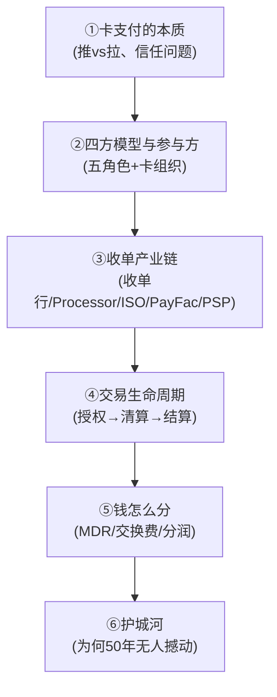

> 🎯 **交流要点**：跨境支付、电子支付、Apple Pay、稳定币卡，全都架在四方模型之上或与之交互。四方模型是和任何支付公司交流的"普通话"。

---

## 2. 卡支付的本质：推 vs 拉，与信任问题

### 2.1 推支付 vs 拉支付

📌 这是贯穿全模块的根本区分：
- **推（Push）**：付款人主动把钱推出去（电汇、转账）。付款人发起，账户先减。
- **拉（Pull）**：收款方凭一个授权，主动去付款人账户**拉**钱（银行卡、代扣）。你刷卡时没"打钱"，只是**签了一张授权书**："准许这个商户来我的发卡行扣款。"

**银行卡是典型的"拉"支付。** 这个性质决定了它的一切设计难题。

#### 2.1.1 判断标准：看"走哪条轨道"，不看平台类型 🔧

> 🔑 **最常见的误解**：以为"消费电商=拉、B2B=推"。错。**推/拉由"走哪条支付轨道（rail）"决定，不由平台或行业决定**——同一个平台换支付方式，推拉就变。判断只看一句：**谁发起、且发起方手里有没有对方账户的"扣款权"**。

| 支付轨道 | 推/拉 | 谁发起、钱怎么动 |
|---|---|---|
| **银行卡**（Visa/MC、信用卡 on file） | **拉** | 商户凭你给的授权，去你发卡行**扣款** |
| **银行转账 / 电汇 / 对公付款** | **推** | 付款人主动让自己银行把钱**推出去** |
| **钱包**（支付宝/微信支付） | **偏推（含托管）** | 你在 App 主动确认，钱从余额/绑定账户**推出** |
| **即时支付**（印度 UPI、巴西 PIX、FedNow） | **推** | 付款人主动发起即时转账 |
| **代扣 / 订阅**（SaaS 月扣、SEPA DD） | **拉** | 收款方凭长期授权**反复扣** |

#### 2.1.2 用真实电商对号入座（最值得记的对比）📌+🔧

| 平台 / 场景 | 主轨道 | 推/拉 | 靠什么补信任 |
|---|---|---|---|
| **Amazon**（海外消费电商） | 银行卡 on file | **拉** | 发卡行授权 + **拒付(chargeback)** |
| **淘宝**（国内消费电商） | 支付宝 + 担保交易 | **推（push-to-escrow）** | **担保托管(escrow)**，确认收货才放款 |
| **1688 / Alibaba.com**（B2B 批发） | 对公转账/电汇（+小额支付宝） | **推** | 付款人逐笔确认；大额走转账 |

> 💡 **escrow（担保交易/第三方资金托管）是什么**：让双方都信任的中立第三方**先把钱"扣住"，等约定条件满足（如买家确认收货）才放给收款方**。专治"陌生人之间先后交付、谁都不敢先动"的死结——卖家因"钱已锁定跑不掉"敢发货，买家因"没满意就不放款"敢付钱，双方无需互信、只需共同信任托管方。⚠️ 代价：托管方自己必须可信且不得挪用（→中国"客户备付金"须隔离存管/集中交存央行）+ 需配纠纷仲裁规则。**支付宝本质就是个 escrow 方**：你"确认付款"≠卖家收到钱，钱先进支付宝托管账户，"确认收货"那刻才放给卖家。

> ⚠️ **淘宝是经典反例——消费电商不一定是"拉"**。它和 Amazon 解决的是**同一个信任难题**（商户怕收不到钱、买家怕付了不发货），却走了两条相反的路：

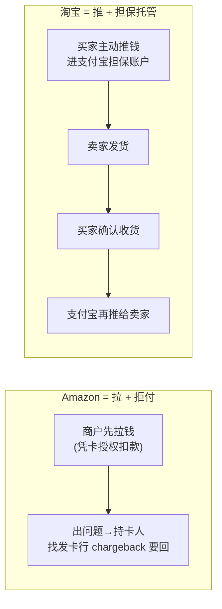

- **Amazon/卡**：用 **"拉 + 拒付"**——商户先拉钱，出问题持卡人找发卡行 chargeback 要回（西方信用卡/拒付体系成熟）。
- **淘宝/支付宝**：用 **"推 + 担保托管"**——买家先把钱推进托管池，确认收货才放款给卖家。这正是支付宝 2003 年起家的核心创新：**用 escrow 给"推支付"补信任**，绕开了中国当年没有成熟卡组织/拒付体系的现实。
- ⚠️ **两点澄清**：① 若支付宝绑卡走**快捷支付/代扣**，"从卡扣到支付宝余额"这一腿是拉，但**对商户而言淘宝是 push-to-escrow，不是商户来拉你**。② **1688 是阿里的"国内"B2B 批发平台**，真正的跨境 B2B 是 **Alibaba.com（国际站）**；很多人 1688 拿货再自行出口，但 1688 交易本身是境内的。

> 🔑 **第一性总结**：决定推拉的是**①金额与频次**（小额高频零售→丝滑的拉/钱包推；大额单笔 B2B→付款人逐笔确认的推）+ **②当地支付基础设施**（西方卡成熟→拉；中国钱包爆发→推+托管；印度/巴西→即时支付推）。**跨境 B2B 贸易只能是推**——因为跨境根本没有支撑"拉"的统一账本和跨境扣款授权（详见模块3，呼应主目录"四套管道"心智模型）。

### 2.2 由此推出的核心问题：信任

因为是"拉"且"商户先交货后收钱"：

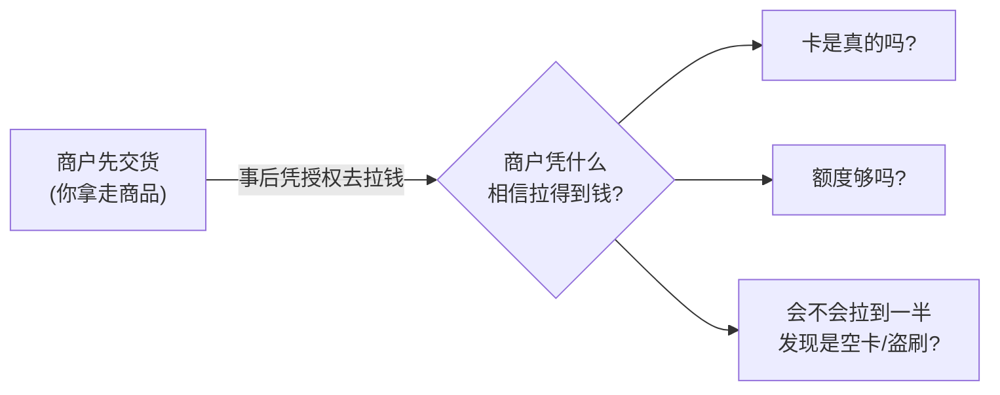

> ⚠️ **核心洞察**：整个卡组织体系的存在意义，就是**为商户解决"我凭什么相信能拉到钱"的信任问题**。下面所有角色和机制都是为它服务的。

---

## 3. 四方模型与参与方

### 3.1 全景

📌 **四方模型（Four-Party Model）**：

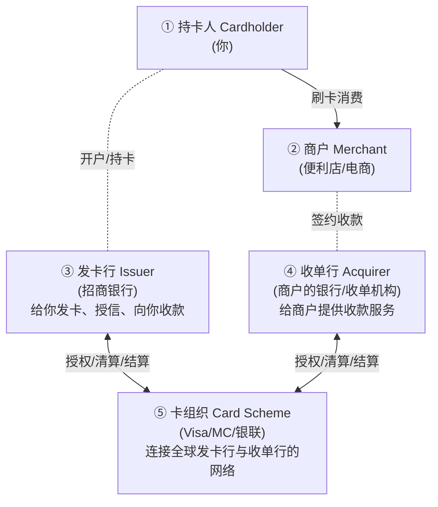

> "四方"指持卡人、商户、发卡行、收单行四个**参与方**；卡组织是连接它们的**网络/平台**（习惯仍叫四方模型）。

### 3.2 每个角色解决什么问题

| 角色 | 解决什么问题 | 核心职责 |
|---|---|---|
| **持卡人** | 想便捷消费、不带现金 | 持卡、签授权、最终还款 |
| **商户** | 想多收钱、不想自己管收款风险 | 提供商品/服务、受理卡 |
| **发卡行** | 谁来给持卡人授信、担风险 | 发卡、授信额度、风控、垫资、向持卡人收款 |
| **收单行** | 谁让商户"有资格"收卡 | 商户签约、提供受理终端、把钱结给商户 |
| **卡组织** | 解决发卡行↔收单行两两直连的 N×N 难题 | 路由、清算规则、品牌、争议仲裁 |

### 3.3 为什么必须有卡组织：N×N 难题

💡 全球几万家发卡行、几千万家商户。若每家发卡行要和每家收单行**单独连接**，连接数是天文数字（N×N）。

📌 **卡组织的本质 = 把 N×N 变成 N**：所有发卡行、收单行只需连接卡组织一家即可互通。卡组织提供：统一技术标准（报文流程）、统一规则（费率/争议/安全）、统一品牌（信任锚点）、清算结算的组织。

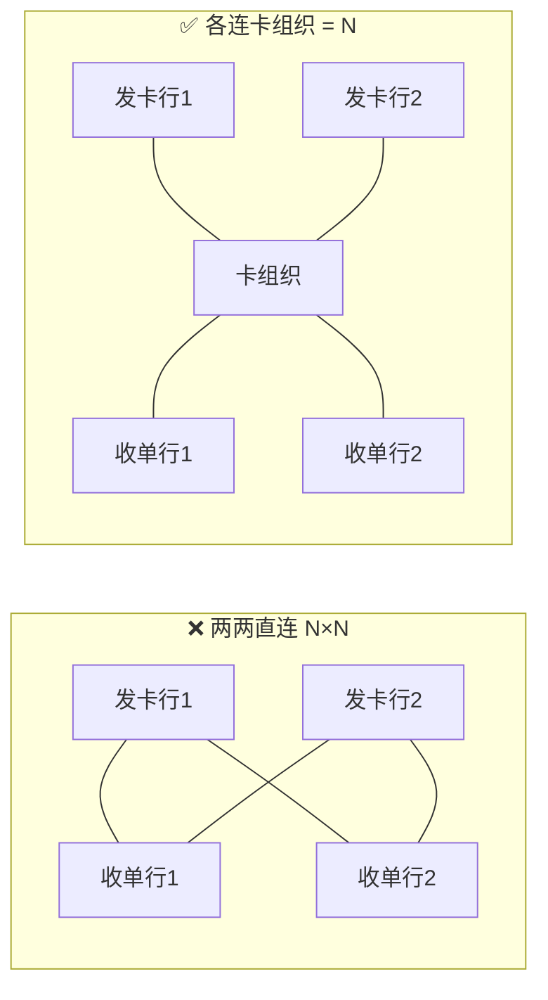

> 🎯 **交流要点**：卡组织**不发卡、不收单、不直接碰持卡人的钱**，它是"规则制定者+网络运营者+清算组织者"，本质是 two-sided platform（双边平台）。

### 3.4 四方 vs 三方模型

📌 **三方模型**：发卡、收单、卡组织**由同一家公司承担**（American Express、Discover、早期支付宝/微信闭环）。

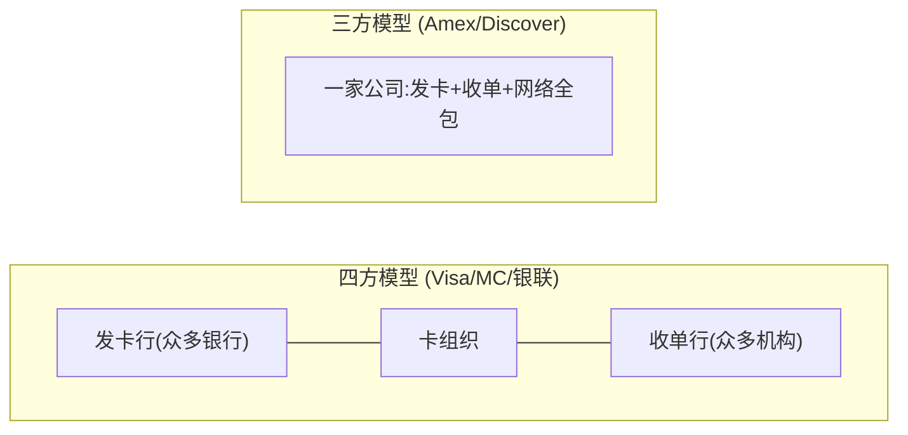

| | 四方模型 | 三方模型 |
|---|---|---|
| 发卡/收单 | 众多银行分担 | 自己一家全包 |
| 规模扩张 | 快（借力众多银行） | 慢（自己拓展） |
| 商户费率 | 较低 | 较高（但服务/数据更可控） |
| 控制力 | 分散 | 强（端到端掌控数据与体验） |

> 💡 这个区分在 Agentic Payment 时代会重新重要——很多新玩家（稳定币卡、Agent 钱包）选"闭环（类三方）"掌控体验和数据。

---

## 4. 收单产业链：谁来让商户"收得了卡"

四方模型里的"收单行"只是一个**角色**，现实中"让商户收卡"这件事被拆成了一条产业链。理解它，是和支付公司（尤其跨境收款公司）交流的关键。

### 4.1 为什么会有这么多收单角色：能力分解

📌 商户想受理银行卡，需要 **5 种能力，几乎没有一家全包**，于是产业链按能力分工：

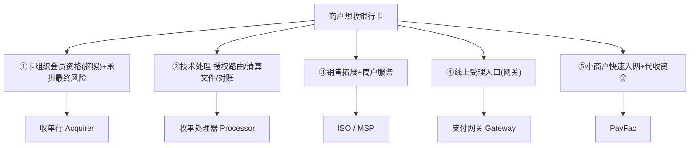

### 4.2 产业链各角色定位

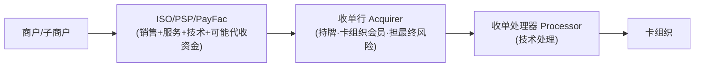

- **收单行（Acquirer）**：卡组织**正式会员**，持收单牌照。**唯一能直接接入卡组织清算、对资金结算负最终责任**的角色。卖的是"牌照+风险承担"。💡 Chase Paymentech、Wells Fargo；中国：银联商务等持牌机构。
- **收单处理器（Processor）**：纯**技术处理**（授权路由、清算文件、对账、风控引擎）。卖的是"技术处理规模"。💡 Fiserv、TSYS、Global Payments、FIS。（系统形态与牌照详见技术篇）
- **ISO（Independent Sales Organization）/ MSP**：**独立销售组织**，挂靠收单行，拓展商户+服务。⚠️ **不碰资金、不担风险**，商户与收单行直签，ISO 只做中介+地推，赚佣金/分润。
- **PayFac（Payment Facilitator）**：自己注册成**"主商户"**，下挂一堆**"子商户"**，**代收资金后再分给子商户**。把入网从"几天"压到"几分钟"。💡 Stripe、Square、PayPal、Adyen for Platforms。
- **PSP（Payment Service Provider）**：⚠️ **伞形术语，非精确角色**，泛指"提供支付受理服务的机构"，可能指 Gateway/PayFac/组合。🎯 听到 PSP 要追问"是持收单牌照、只做网关、还是 PayFac 代收资金？"

### 4.3 关键分水岭：ISO vs PayFac

很多人混淆这两个，钥匙是两个问题：**钱过不过你的手？风险你担不担？**

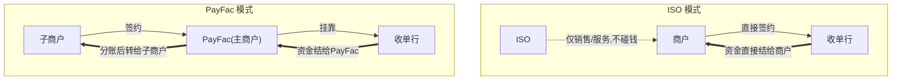

| 维度 | ISO | PayFac |
|---|---|---|
| 商户与谁签约 | 直接与**收单行** | 与 **PayFac**（成为子商户） |
| 资金是否经手 | ❌ 不经手 | ✅ **代收后分给子商户** |
| 风险承担 | ❌ 不担 | ✅ **承担子商户风险** |
| 入网速度 | 慢（银行逐个审批） | **快（秒级）** |
| 盈利 | residual（剩余分润） | markup（费率差价） |
| 监管 | 较轻 | 重（子商户 KYB、反洗钱、资金隔离） |

> 🎯 **交流要点**：PayFac 用"主商户-子商户"结构换取入网速度，代价是自己承担子商户风险和合规——直击其商业模式本质权衡。

#### 4.3.1 落地判定：4.2 里点名的角色/平台，哪些是 PayFac 收单？ 📌

> 🔑 **判断的唯一钥匙**（即 4.3 那两问）：**钱过不过它的手 + 子商户风险它担不担**。自己注册成主商户、下挂子商户、代收资金再分账、担 KYB 合规 = PayFac；否则不是。

| 4.2 角色/平台 | 是否 PayFac 收单 | 为什么 |
|---|---|---|
| **Stripe** | ✅ 是 | 主商户+子商户、代收分账、担合规（含 Connect 平台白标，见 `02c…/stripe.md §4.2`） |
| **Square** | ✅ 是 | 小微商户秒级入网、代收资金 |
| **PayPal** | ✅ 是 | 代收资金 + 账户钱包一体（PayFac + 闭环） |
| **Adyen for Platforms** | ✅ 是 | Adyen 面向平台的 PayFac 产品线 |
| **收单行 Acquirer**（Chase/Wells Fargo/银联商务） | ❌ 否 | 它是 PayFac 挂靠的持牌对象，本身不靠"主-子商户"结构 |
| **Processor**（Fiserv/TSYS/FIS） | ❌ 否 | 纯技术处理，不碰资金、不签商户 |
| **ISO / MSP** | ❌ 否 | 商户**直接与收单行签约**，ISO 不经手资金、不担风险 |
| **Gateway 网关** | ❌ 否 | 只提供线上受理入口，只传数据不代收资金 |
| **PSP** | ⚠️ 需追问 | 伞形术语——可能是 PayFac，也可能只是网关/组合 |

> 💡 **对应 4.1 的能力分解**：PayFac 模式 = 4.1 第 **⑤项能力"小商户快速入网+代收资金"**（`N5→PayFac`）；①②③④分别由收单行/Processor/ISO/Gateway 承担，都不是 PayFac。
>
> ⚠️ **两个易混点（呼应后文）**：① **跨境收款公司（连连/PingPong/Airwallex）= 跨境 PayFac，但仅在卖家"独立站"场景才真以 PayFac 收单**；在 Amazon 平台店里它是回款通道、不收单（§4.6.1）。② **Shopify 本身不是 PayFac**——台前是 Shopify Payments，底层收单引擎是 **Stripe Connect**（真正的 PayFac 是 Stripe）。

### 4.4 中国特殊性

⚠️ 与支付公司交流必知：
- 2018"**断直连**"后，第三方支付**不能直连银行**，必须经 **网联/银联** 清算。
- 收单需持央行**支付业务许可证（银行卡收单类）**。
- **聚合支付**（收钱吧、哆啦宝等）本质是"ISO 角色 + 多通道聚合"，**不得沉淀/清算资金**——碰了就是"**二清**"，违规红线。
- 🎯 聊中国支付公司，要分清"持牌收单机构"vs"聚合支付服务商"、"一清 vs 二清"。

### 4.5 真实案例对照

| 公司 | 角色定位 | 定价 | 特点 |
|---|---|---|---|
| **Stripe** | PayFac+Gateway+Processor 一体 | Flat 2.9%+30¢ | 开发者友好，API 化，秒入网 |
| **Square** | PayFac | 2.6%+10¢(线下) | 主打线下小微，自带硬件 |
| **Adyen** | **全栈**：自持收单牌照 | IC++ | 单平台覆盖全球大商户(Uber/Spotify) |
| **PayPal** | PayFac + 钱包(闭环) | Flat | 账户+受理一体 |
| **传统美国 ISO** | ISO（挂靠 Fiserv/Chase） | 赚 residual | 地推签商户，持续分润 |
| **中国：银联商务/拉卡拉/通联** | 持牌收单机构 | — | 持央行"收单"牌照 |
| **中国：收钱吧/哆啦宝** | 聚合支付(≈ISO+多通道) | 服务费/分润 | ⚠️不得碰清算资金 |
| **连连/PingPong** | **跨境PayFac+多币种账户+换汇** | 提现费+汇差+浮存 | PayFac骨架+跨境外壳 |
| **Airwallex** | **全栈跨境支付**(收单+账户+FX,自持多国牌照) | 类IC++ | "跨境版Adyen+PayFac" |
| **CardInfoLink** | Processor/收单技术服务商 | 技术/处理费 | 卖技术系统,不以自己名义清算商户资金 |

### 4.6 跨境收款公司 = 跨境 PayFac（直通你的目标）

这是与你**最终目标（与跨境支付公司深聊）**的关键串联。

📌 **连连国际/PingPong/Airwallex/Payoneer 的本质 = "跨境 PayFac/收单 + 换汇"**：

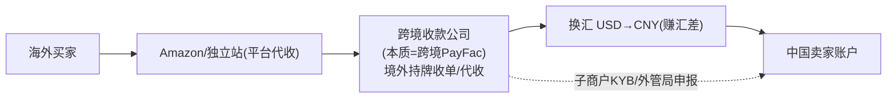

| 维度 | 国内 PayFac (Stripe) | 跨境收款公司 (连连/PingPong) |
|---|---|---|
| 主商户-子商户结构 | ✅ | ✅（中国卖家=子商户） |
| 代收资金后分账 | ✅ | ✅（境外收、境内付） |
| 子商户 KYB | ✅ | ✅（+跨境合规、外管局申报） |
| 额外能力 | — | **多币种账户 + 换汇（汇差核心收益）+ 多国牌照** |
| 盈利 | markup | **提现费 + 汇差 + 浮存** |

> 🎯 **精确表述**：连连/PingPong = **用 PayFac 的"代收分账"骨架，套上多币种账户+换汇+多国牌照的跨境外壳**；Airwallex 自持多国收单/EMI 牌照，更像"全栈跨境支付平台"。理解 PayFac + 模块3的"代理行/换汇/结售汇/外管局合规"，就能和它们平等对话。详见模块3 `03-crossborder-business.md` + `03c-crossborder-players/`。

⚠️ **必须厘清：这里的"主商户/子商户"分别指谁？以及它和 Amazon 收单是两条不同链路**

📌 **在连连的 PayFac 结构里**：
- **主商户（master merchant）= 连连**——它在境外收单行/卡组织注册成一个"大商户"。
- **子商户（sub-merchant）= 中国卖家**——用连连收款的卖家，挂在连连主商户号下（免去各自去境外银行开户）。

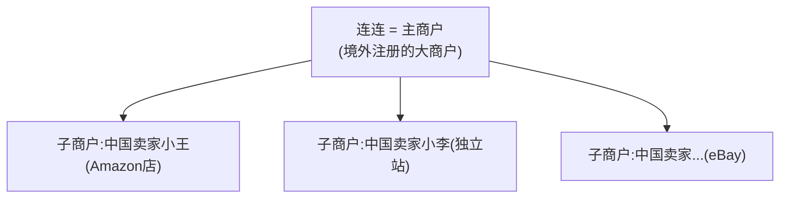

⚠️ **关键：买家付款 和 卖家收款 是两条不同链路，"商户"指代不同**：

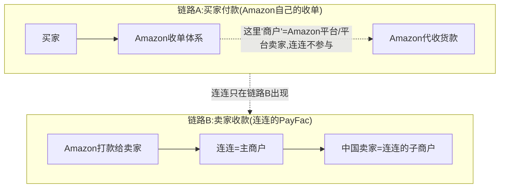

> 📌 **同一个中国卖家的双重身份**：在 **Amazon 眼里**是"Amazon 平台上的卖家"；在 **连连眼里**是"连连 PayFac 的子商户"。**连连不参与买家付款（链路A 是 Amazon 收单）**，它从"Amazon 把货款打给卖家"这一环才接入（链路B）——详见模块3深化 `03b` 环节①②③。
> 🎯 **交流要点**：能区分"Amazon 收单链路(商户=平台/平台卖家)"和"连连收款链路(主商户=连连/子商户=卖家)"——这是跨境收款里"商户"双重身份的常见绕点，讲清显专业。

#### 4.6.1 关键消歧：连连在「Amazon 平台店」≠ 收单 PayFac，在「独立站」才是 📌+🔧

> ⚠️ **最易混淆的点**：同样是"连连给中国卖家收款"，**平台店和独立站里连连的角色完全不同**——只有独立站才是真·收单 PayFac。

| 维度 | **Amazon 平台店** | **卖家自己的独立站** |
|---|---|---|
| **谁收单（受理买家刷卡）** | **Amazon 自己**收单，连连不碰 | **连连**受理买家刷卡（真·收单） |
| **连连的角色** | **收款账户 + 换汇提现通道**（回款服务商） | **跨境 PayFac/收单**（主商户，卖家=子商户） |
| **连连从哪一环接入** | **Amazon 把货款 payout 给卖家**那一刻 | **买家付款**那一刻 |
| **核心价值** | 多币种账户 + 换汇 + 结售汇 + 外管局申报 | 收单 + 上述跨境回款一条龙 |

> 🔑 **对比 Stripe@Shopify**：Stripe 是**底层收单引擎**、客户是**平台**(Shopify 签约)、真受理买家刷卡；连连@Amazon **不在收单链路**、客户是**卖家本人**、只做"收款账户+换汇提现"。所以"Stripe=引擎、连连=PayFac"这句话**只在独立站成立**；在 Amazon 上连连是回款通道、不是收单 PayFac。

**卖家在 Amazon 上"怎么选用连连"——本质=后台把收款账户填成连连的虚拟账户**：

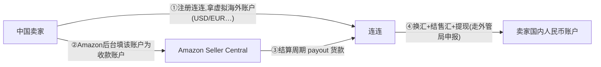

**Amazon 卖家可选的同类回款服务商**（🔧 角色定位为行业公知，费率/牌照随时间漂移、写正式材料须核官网+Seller Central 政策）：

| 服务商 | 特点 |
|---|---|
| **连连国际 / PingPong** | 国内头部，牌照多/费率competitive，主打 Amazon 卖家 |
| **Airwallex（空中云汇）** | 偏全栈跨境支付平台，自持多国牌照，企业级 |
| **Payoneer（派安盈）** | 最早做 Amazon 收款的国际玩家，全球覆盖广 |
| **World First（万里汇）** | 蚂蚁旗下，老牌 |
| **Wise** | 多币种账户，部分卖家用 |
| **Amazon ACCS（自家换汇）** | Amazon 内置换汇直接提现，⚠️ 汇率/费率通常不划算，多数卖家宁用第三方 |

> ⚠️ **数据可信度**：Airwallex 等多国牌照已逐家 deep-research 核查，详见 `03c-crossborder-players/`；CardInfoLink 业务边界属 🔧 角色特征判断，未逐项核实，正式判断请核其官网/牌照披露。

#### 4.6.2 收口总览：中国卖家海外战场 × 收款选择 × 同一服务商的双重角色 📌

> 🗺️ **全景**：中国卖家出海主要两类战场——**平台店（以 Amazon 为首）+ 独立站（以 Shopify 为首）**。两者最大区别在"**谁收单**"，这决定了连连/PingPong/Airwallex 扮演的角色完全不同。

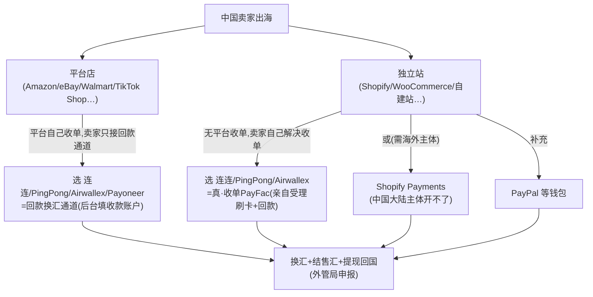

| 维度 | **平台店（Amazon 为首）** | **独立站（Shopify 为首）** |
|---|---|---|
| **谁收单** | **平台自己**收单 | **没有平台**——卖家自选的服务商收单 |
| **卖家要做什么** | 接一个**回款通道**（后台填收款账户） | **选一个收单服务商**（受理买家刷卡） |
| **连连/PingPong/Airwallex 的角色** | **回款换汇通道**（不收单） | **真·跨境 PayFac**（收单+回款一条龙） |
| **主流选择** | 连连/PingPong/Airwallex/Payoneer/World First | 连连/PingPong/Airwallex（中国卖家）；Shopify Payments（限有海外主体）；PayPal（补充） |
| **回国方式** | 换汇+结售汇+提现（外管局申报） | 同左 |

> 🔑 **最值得记的一句**：**同一家连连，在 Amazon 是"回款通道"、在独立站是"收单 PayFac"**——角色由"战场有没有平台帮你收单"决定。这是理解跨境收款服务商的钥匙（呼应 §4.6.1、`02c…/stripe.md` Shopify 段）。
>
> ⚠️ **纠两个常见误述**：① 独立站不是"选钱包"——**主要是选收单服务商**（连连/PingPong/Airwallex），PayPal 等钱包只是补充。② 中国大陆主体**开不了 Shopify Payments**，要用它需先有海外公司+海外银行账户。

> 📎 **平台店 vs 独立站(DTC) 的买家体验 & 卖家经营差异**（流量/客户数据/品牌资产/规则风险/成本结构…）已迁入电商支付场景篇 **`02b-ecommerce-payment.md §6.1.1`**——那里有完整的买家、卖家双视角对比表和"两条腿走路"结论。本节聚焦"收单产业链"，不再展开。

---

## 5. 交易生命周期：授权 → 清算 → 结算

模块0 讲过"清算≠结算"。在卡支付里它表现为**三段分离**，这是卡支付的精髓。

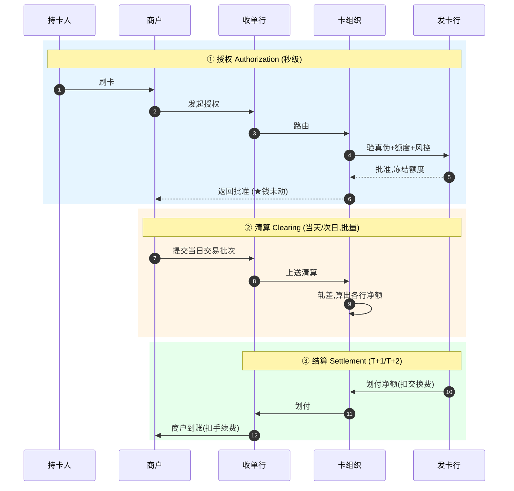

| 阶段 | 时机 | 干什么 | 钱动了吗 |
|---|---|---|---|
| **授权** | 刷卡瞬间(秒) | 验真伪+额度+风控，冻结额度 | **没动，只占座** |
| **清算** | 当天/次日(批量) | 商户提交批次，卡组织轧差算净额 | 算账 |
| **结算** | T+1/T+2 | 各行间真正划钱，达成 finality | **真动钱** |

> 💡 **解释日常**：刷卡立刻收到"消费提醒"短信（=授权），但账单几天后才出、商户几天后才到账（=结算）。退款最快，因为钱还没结算，撤销授权即可。
>
> 🎯 **交流要点**：能区分"授权成功 ≠ 钱到账"，理解"预授权/请款（capture）"（酒店押金、加油先冻结后扣实际金额）就是利用这个分离。
>
> 📌 **清结算是分层的**：这里的"清算/结算"在产业链上分属不同主体（卡组织做网络清算、央行做最终结算、收单机构做对商户结算）——详见技术篇「收单系统逻辑架构」。

### 5.1 交易动作全集：不只授权，还有这些"退钱"和"改额"

授权只是起点。真实交易有一组动作，尤其几种"退钱"机制**常被混淆但机制完全不同**：

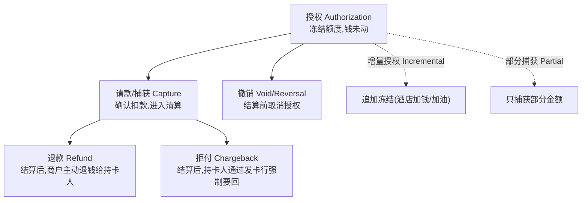

📌 **三种"退钱"的本质区别（必考点）**：

| 动作 | 何时 | 谁发起 | 走什么路径 | 商户视角 |
|---|---|---|---|---|
| **撤销 Void/Reversal** | 结算前 | 商户 | 取消授权,钱本就没动 | 最干净,无成本 |
| **退款 Refund** | 结算后 | **商户主动** | 反向交易,正常清算 | 友好,商户可控 |
| **拒付 Chargeback** | 结算后 | **持卡人/发卡行** | 强制扣回+举证 | 被动,有罚金+影响商户评级 |

> 💡 **关键**：商户最怕拒付——它是持卡人"绕过商户、直接找发卡行"要回钱，商户不仅丢货款还可能被罚款、拉高拒付率（过高会被卡组织处罚甚至停止收单）。所以商户宁可主动 Refund 也不愿被 Chargeback。
>
> 🎯 **交流要点**：能区分 Void/Refund/Chargeback 三者（结算前后、谁发起、是否强制），以及预授权场景的增量授权（酒店续住加钱）、部分捕获（实际消费<预授权）——是卡交易业务的基本功。

### 5.2 拒付完整生命周期：Chargeback → Representment → 仲裁

§5.1 的拒付只是开头。完整的争议处理是一个**多回合、有时效窗口的博弈**，这是收单机构（尤其跨境）的核心风险战场。

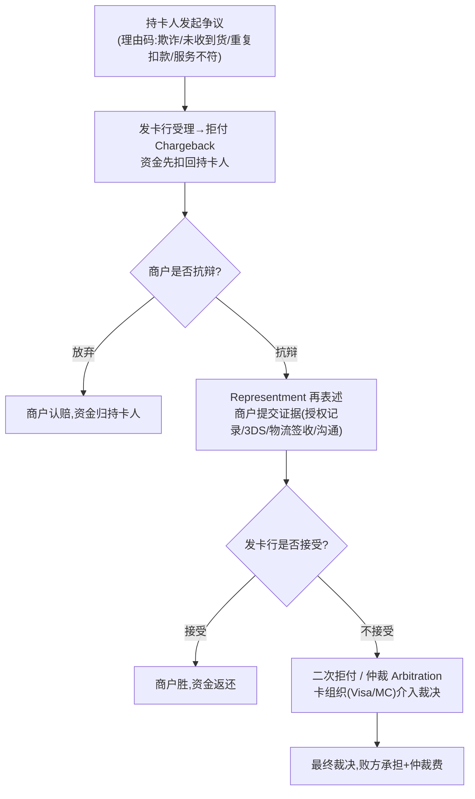

📌 **关键概念**：
- **理由码（Reason Code）**：拒付必须带理由分类——欺诈类（fraud）、未收到货/服务（not received）、重复扣款、商品不符等。不同理由码对应不同举证要求和时效。
- **Representment（再表述/抗辩）**：商户对拒付的**反向举证**——提交原始授权记录、3DS 验证结果、IP/设备指纹、物流签收凭证等，证明交易合法。这是拒付的"下半场"。
- **仲裁（Arbitration）**：双方僵持时由卡组织（Visa/MC）最终裁决，败方承担仲裁费。
- **时效窗口**：每个阶段有严格时限（如 Visa 争议常 ~20-30 天提交窗口，整个流程可达 120 天），**踩线即自动判负**——这是跨境的痛点（时区+多语种+人工取证慢）。

📌 **争议处理系统**（PPT 中出现，了解即可）：
- **Visa VROL**（Visa Resolve Online）：Visa 的在线争议解决平台。
- **Mastercom / Mastercard 争议平台**：Mastercard 对应系统。
- 收单机构/商户通过这些平台提交 Representment 证据。

> 🎯 **交流要点（直通跨境）**：跨境卡支付的 **Chargeback Win Rate（拒付胜率）通常只有 30-40%**，因为人工取证慢、容易踩时效窗口。**Representment 证据链自动组装**（自动拉授权记录/3DS/物流凭证打包成卡组织要求格式）能把胜率提到 55%+，是跨境收单的核心提效点（PPT 中 iPaylinks 的 Chargeback Agent PoC 正是做这个）。
>
> 💡 **拒付的商业意义**：拒付率是商户和收单机构的"健康指标"——过高会触发卡组织的监控计划（如 Visa VDMP/VFMP），罚款甚至终止收单资格。所以"降低拒付率 + 提高 Representment 胜率"是收单业务的核心 KPI。

---

## 6. 钱怎么分：MDR、交换费与分润

这是卡支付**最精妙、最反直觉**的部分。先问：**银行为什么抢着给你发信用卡、送积分送返现，还不收年费？它图什么？**

### 6.1 MDR：商户付出的总成本

📌 **MDR（Merchant Discount Rate，商户扣率）**：商户每笔交易付出的总手续费（如 2%~2.9%）。这是整个生态的"收入来源"。

💡 以 Stripe **2.9% + $0.30** 为例（示意，随卡种/地区浮动）：

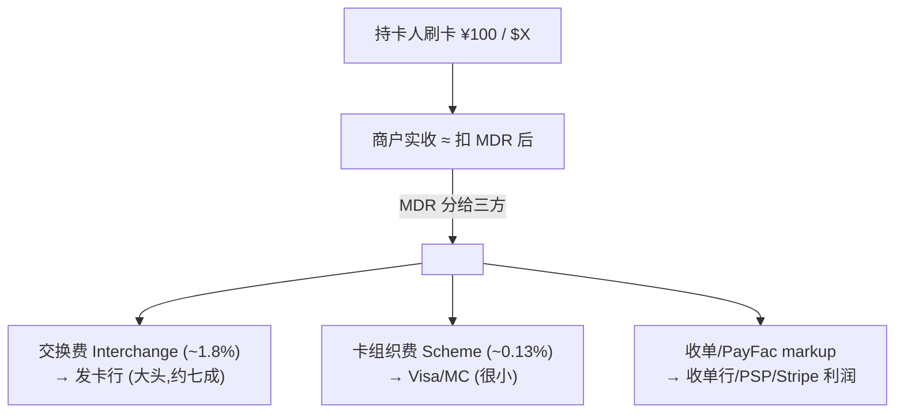

### 6.2 交换费：生态的激励引擎

📌 **交换费（Interchange Fee）**：MDR 里最大的一块，由**收单侧（商户）支付给发卡侧（银行）**。

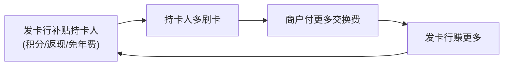

> **看穿本质**：发卡行承担最大的风险（不还钱、盗刷、垫资）和最大的获客成本（积分返现）。所以规则设计成"**收单侧付钱补贴发卡侧**"。**你每刷一笔，商户付的交换费就流进发卡行口袋——你和你的消费数据就是发卡行的核心资产。**
>
> 🎯 **交流要点**：各国监管对交换费设上限（欧盟 0.3%/0.2%、中国借贷记分开定价）会直接重塑市场。能聊"交换费上限如何影响发卡行积分策略和收单定价"很专业。

### 6.3 收单侧的分润模式

收单侧（MDR 里扣给发卡行和卡组织后剩下的部分）怎么分，有几种模式：

| 模式/角色 | 含义 | 谁用 |
|---|---|---|
| **Flat rate（统一费率）** | 不管底层成本，统一收如 2.9%+30¢ | Stripe/Square——简单透明，PayFac 赚成本与报价的差 |
| **Interchange++（IC++）** | 交换费+卡组织费**实报实销**，只加固定 markup | Adyen——大商户爱，透明省钱 |
| **Residual（ISO 剩余分润）** | ISO 拓来的商户，每笔交易收单行分给 ISO 一定比例，**只要商户还在交易就持续躺赚** | 传统美国 ISO 地推 |

> 💡 **三种盈利对比**：ISO 赚 residual（持续分润）、PayFac 赚 markup（费率差）、收单行赚 处理费+承担风险的对价。

### 6.4 各方收益模式总览

| 角色 | 怎么赚钱 |
|---|---|
| **发卡行** | 交换费(大头)+信用卡利息/分期+年费+数据价值 |
| **收单行/PSP** | 收单加价(MDR 扣给发卡行和卡组织后剩下的) |
| **卡组织** | 卡组织费(按笔/金额,单笔极薄但量极大)+跨境费+数据服务 |
| **商户** | (付费方)但获得"接受全球卡"的能力,换更多成交 |
| **持卡人** | (表面免费)享信用/积分/便利;实际成本隐含在商品价格里 |

> ⚠️ **常见误区**："持卡人不花钱"是错觉——MDR 最终体现在商品定价里，所有消费者（含用现金的）共同承担。这也是交换费监管的理由之一。

---

## 7. 发卡与收单：两端深入

### 7.1 发卡（Issuing）：服务持卡人侧

📌 金融机构向持卡人发卡，提供账户、授信、支付能力，承担风险。**关注**：授信与信用风险、风控（盗刷损失常由发卡行承担）、获客与活跃（积分/返现）、资金成本（免息期垫资）。

📌 **虚拟卡（Virtual Card）= 发卡的数字化形态**：无实体、即时生成、可设单次/限额/限商户。用途：线上支付（降盗刷）、企业给员工/供应商**代付与费控**、订阅管理、跨境给海外供应商付款。
> 🎯 虚拟卡是 fintech 热门切入点（Marqeta、Stripe Issuing），根技术是 tokenization（技术篇讲）。

**发卡业务的全貌远不止"发一张卡"，它管的是卡的整个生命周期与账户运营：**

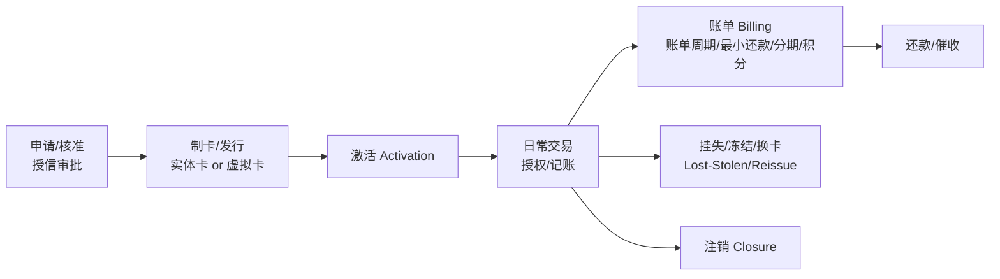

📌 **发卡侧的几个业务概念**：
- **卡生命周期**：申请→制卡→激活→用卡→挂失/补卡→注销，每个节点都有业务规则和风控。
- **账单（Billing）**：信用卡的账单周期、账单日、还款日、最小还款额、循环利息、分期、积分/返现——这些是发卡行最重要的收入来源（利息+分期手续费）。
- **授信与额度管理**：初始授信、临时提额、风险降额，是发卡行的核心风险决策。

📌 **卡测试攻击（Card Testing）—— 发卡/收单都要防的重要威胁**：
> 盗刷者拿到一批盗取的卡号后，会**批量小额试刷**（如 $1）来验证哪些卡号还有效、未被冻结。特征是"同一来源、短时间、大量小额、高失败率"。这是模块技术篇风控"频率维度（velocity）"重点防控的对象。
> 💡 PPT 案例：Stripe 用 Payments Foundation Model 把大企业遭受卡测试攻击的侦测率**再提升 64%**，上一代模型曾用两年把卡测试减少 80%——可见这是发卡/收单风控的硬仗。

> ⚠️ **范围说明**：Network Token（网络令牌）、Agent Network Token、代理就绪卡（agent-ready card）、VCN 用于 AI Agent 等"发卡新形态"，属于 Agentic Payment 范畴，见**模块5**与 `reference/summary/`。本节只讲传统发卡业务面。

### 7.2 收单（Acquiring）：服务商户侧

📌 为商户提供受理银行卡、并把资金结算给商户的服务。**关注**：商户准入（KYB，审核真实性/合规，防洗钱欺诈商户）、受理渠道（POS/网关/二维码）、资金结算（T+0/T+1，涉及垫资）、商户风险（商户跑路+消费者拒付，损失可能落到收单行）。

> 🎯 **交流要点**：跨境收款公司本质就是"跨境收单/收款 + 换汇"。理解收单的"商户准入、资金结算、拒付风险"三大关注点，就能和它们对话。

---

## 8. 护城河：为什么四方模型 50 年无人撼动

```mermaid
flowchart TB
    NE["①网络效应(双边)<br/>持卡人多→商户愿受理<br/>商户多→持卡人想用"]
    SW["②双边转换成本<br/>换网络要同时说服两边"]
    REG["③牌照与合规壁垒"]
    TR["④信任与品牌"]
    SC["⑤规模经济<br/>单笔成本极低"]
    NE --> MOAT["护城河<br/>50年无人撼动"]
    SW --> MOAT
    REG --> MOAT
    TR --> MOAT
    SC --> MOAT
```

📌 **核心 = 双边网络效应 + 双边转换成本**：要取代 Visa，得**同时**说服几十亿持卡人和几千万商户切换——任何一边不动，另一边就不动。这是"先有鸡还是先有蛋"的死结。

💡 **谁曾撼动？怎么破的？**——都不是正面硬刚，而是**换赛道**：
- **银联**：靠国家力量在本土建网（监管+本土银行强制接入）。
- **支付宝/微信**：用二维码 + 账户余额，绕开卡组织建自己的闭环网络（模块2）。
- **稳定币**：用"全球开放账本"绕开整个四方模型（模块4）。

> 🎯 **交流要点**：能讲"卡组织护城河是双边网络效应，破局者都换赛道（二维码/账户/链上）"——这是对支付竞争格局的高阶理解。Agentic Payment 新玩家也在找"换赛道"的机会。

---

## 9. 综合案例：东京便利店刷一张中国信用卡（跨境卡支付）

```mermaid
sequenceDiagram
    autonumber
    participant CH as 你(招行Visa卡)
    participant POS as 东京便利店POS
    participant ACQ as 日本收单行
    participant CS as Visa网络
    participant ISS as 招商银行(发卡行)
    Note over CH,ISS: ① 授权(秒级)
    CH->>POS: 刷卡 ¥1000日元
    POS->>ACQ: 授权请求
    ACQ->>CS: 路由(读卡BIN,识别招行Visa)
    CS->>ISS: 验真伪+额度+风控
    ISS-->>CS: 批准,冻结约¥50人民币额度
    CS-->>POS: 批准,打印小票
    Note over CS: ② 清算阶段 Visa用网络汇率把JPY换算CNY,算各方净额
    Note over ACQ,ISS: ③ 结算(T+1/2) 招行→Visa→收单行→便利店
    ISS->>CH: 账单记一笔≈¥50(含汇率),月底还款钱才真流出
```

**和境内案例的关键差异**：
1. **多了货币转换**——由 Visa 在清算环节用网络汇率把日元换成人民币。
2. **跨境刷卡比跨境电汇简单**——Visa 本身就是全球封闭网络，自带"共同账本"，不需代理行接力（对比模块3 的电汇）。
3. ⚠️ **DCC 坑**：店员问"按日元还是人民币结算"，**永远选当地货币（日元）**——选人民币（DCC）会被商户侧偷加 3%~7% 汇率加价。

---

## 10. 本篇小结（背下来）

1. **卡支付是"拉"支付**：商户先交货后拉钱，整个体系为解决"凭什么相信拉得到钱"。
2. **四方模型**：持卡人/商户/发卡行/收单行 + 卡组织网络，把 N×N 直连难题变成 N。卡组织不碰钱，是双边平台。
3. **收单产业链**：收单行(牌照+风险)、Processor(技术)、ISO(销售,不碰钱赚residual)、PayFac(代收+快速入网赚markup)、PSP(伞形词需追问)。ISO vs PayFac 分水岭=钱过不过手+风险担不担。
4. **三段分离**：授权(秒,占座) → 清算(算净额) → 结算(T+N,真划钱)。授权≠到账。
5. **交换费是发动机**：收单侧付钱补贴发卡侧，所以银行抢着发卡送积分。
6. **发卡服务持卡人**（授信/风控/获客），**收单服务商户**（KYB准入/受理/结算/拒付风险）。
7. **护城河 = 双边网络效应 + 双边转换成本**，破局者都靠"换赛道"。
8. **跨境收款公司 = 跨境 PayFac + 换汇 + 多国牌照**——通向你最终目标的关键认知。

---

## 11. 通向下一层

- **技术怎么实现？** → `01-cards-tech-aws.md`（ISO 8583/BIN路由、收单系统逻辑架构、网关路由、安全四件套、PCI-DSS、PayFac平台 + AWS）
- **线上没有 POS 怎么办？** → 模块2 `02-epayment-business.md`（支付网关、第三方支付、钱包）
- **跨境深入** → 模块3 `03-crossborder-business.md` + `03b` + `03c-crossborder-players/`
- **范式对比** → `支付范式资金流对比.md`

---

## 附：常见追问（FAQ）

> 难以编入主线、但实战常被问到的零散点。

**Q：MID 是什么？和 TID/MCC 什么关系？**
A：📌 **MID（Merchant ID，商户号）= 收单机构给商户的唯一身份编号**，用于结算路由（钱结给谁）、费率绑定、风控统计、对账归集。层级关系：一个 **MID（商户级）** 下可挂多个 **TID（Terminal ID，终端级，每台POS一个）**；一个商户可有多个 MID（多收单关系或多费率档）。**MCC**（商户类别码）是商户的行业属性，通常绑在 MID 上决定费率/风控。在 ISO 8583 报文里 MID 是 DE42。PayFac 场景下子商户用 sub-MID 标识。

**Q：商户、收单机构有自己的"清算"吗？**
A：有，但叫**内部清分**，区别于卡组织的"网络清算"。**收单机构**：收到清算层的汇总净额后，内部按商户拆开、扣 MDR、按 T+N 打款（清分+payout）。**普通单一商户**（便利店）基本没有，收到就是自己的钱。**平台型商户**（美团/淘宝/Uber）有且很重——把货款拆给平台抽佣+众多卖家/骑手，即**平台分账**（本质即 PayFac 分账）。本质都是模块0那句"算清谁该得多少"，只是发生在不同主体内部。详见技术篇清结算分层。

**Q：为什么一笔交易会有"多条通道"可选？**
A：两个层次。**网关/聚合层**：对接多家收单机构/支付方式，天然多通道。**单个收单机构内部**：来自"一卡多清算网络"（双标卡银联+Visa；美国 Durbin 法案强制借记卡支持≥2个网络）、多上游赞助行、多 MID、主备链路。无多通道则路由退化为唯一选择——这正是网关/聚合商"对接多家"的价值。详见技术篇网关路由。
