# 模块 3 · 跨境支付（业务篇）：没有共同账本的世界

> **学习者**：AWS 技术架构师 · 支付小白
> **本篇目标**：搞懂跨境支付为什么难、四套管道如何各自破题、谁在牌桌上、各方怎么赚钱、行业目标与新兴技术走向、中国出海怎么落地。学完你能和跨境支付公司聊清楚代理行/SWIFT/清算系统/换汇/合规这套"管道"，以及稳定币/CBDC 这些新技术"绕开了哪一步"。
> **前置**：模块0（清算/结算/三流/货币等级）、模块1（卡四方模型/收单）、模块2（电子支付）
> **配套**：
> - 技术篇 `03-crossborder-tech-aws.md`（SWIFT 报文/ISO 20022/多币种账务/汇率引擎/制裁筛查 + AWS）
> - 跨境收款深化 `03b-crossborder-collection-deepdive.md`（一笔货款七环节全链路 + 两个资金池）
> - 企业画像 `03c-crossborder-players/`（13 家跨境头部企业 deep-research 画像）
> **组织方式**：top-down 主线。本篇已**整合**原"跨境支付学习笔记 + 跨境支付架构图 + 跨境支付深度研究报告"三份材料的全部内容（第一性骨架、可视化图、G20 量化目标、新兴技术、引用来源），是模块3 的业务总入口。
> **可信度标注**：📌 已多源核查的一手事实（句末标来源/编号，引用清单见末尾附A） · 🔧 行业公知机制（教学性，未逐条引用） · ⚠️ 状态/风险告诫 · 💡 案例 · 🎯 交流要点

---

## 1. 一条主线：整个领域的第一性骨架

学一个领域，先抓住能推导出一切的那条主线。跨境支付的主线是一条金字塔式的推导链：

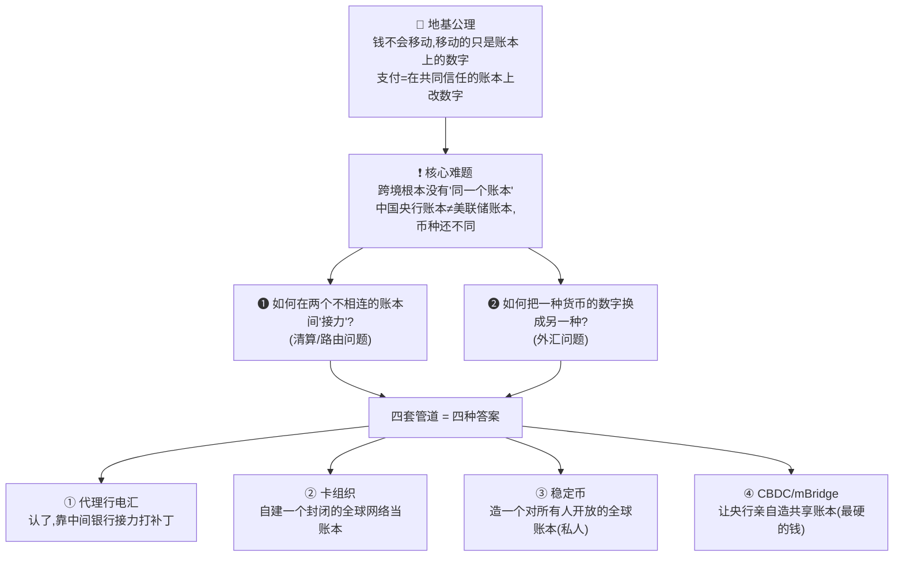

📌 **跨境支付的唯一总根源**：模块0 地基公理说"支付 = 在共同信任的账本上改数字"。国内支付快，因为全国银行都在央行同一个账本上。**跨境，根本没有'同一个账本'**——这就引出两个总根问题（如何接力 ❶、如何换汇 ❷），四套管道就是对这两个问题的四种回答。

> 🎯 **最高层洞察**：四套管道的差别只在**两个维度**——① **账本由谁造**（银行/私人公司/央行/Agent 生态）② **账本记哪种等级的钱**（商业银行借条/私人代币/央行货币）。**决定谁胜出的，往往不是技术，而是信任与权力的分配**——这是贯穿整个跨境支付（乃至整个支付研究）的元洞察。

📌 **跨境为什么难——五重不同**（总根源的展开）：

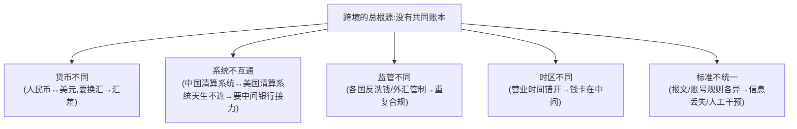

> 📌 **反直觉真相**：跨境支付里，**钱本身往往没真的"飞过国境"**。各国银行通过在彼此那开账户、"你记一笔我记一笔"的账本调整来等效实现跨境。SWIFT 只传报文（消息），它不搬钱。这是理解一切的关键。

---

## 2. 四套管道对比总图（核心中的核心）

这张表是整个跨境支付的"地图"。背下它，任何新技术/新闻都能往里归位。

| 管道 | 底层账本 | 用哪种"钱" | 谁主导 | 跨境结算方式 | 最大障碍 |
|---|---|---|---|---|---|
| **① 代理行电汇** | 多国央行账本，不互通 | 商业银行货币（借条） | 银行 + SWIFT | 代理行接力 + 汇率缝合 | 慢/贵/不透明（结构性） |
| **② 卡组织** | 私人封闭全球网络 | 商业银行货币 | Visa/MC/银联 | 网络内清算 + 换汇 | 交换费/DCC 坑 |
| **③ 稳定币** | 公开区块链（开放） | 私人代币（借条） | 私人公司 | 链上转账即结算 | on/off-ramp + 监管 |
| **④ CBDC/mBridge** | 央行共建账本（许可） | **央行货币（最硬）** | 多国央行 | 共享账本直接结算 | **治理/地缘政治** |

📌 **理解四套管道价值链的钥匙——钱的"等级"**：

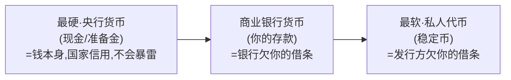

> 📌 **等级递降 = 风险递增**。跨境、大额、危机时，这个等级就是**安全的生死线**。这也是为什么 CBDC（用央行货币）在"钱的硬度"上天然优于稳定币（用私人借条）——理解这点，才懂 CBDC 的价值主张。

---

## 3. 三个贯穿全程的关键概念

四套管道里反复出现三个概念，先单独讲透。

### 3.1 清算 vs 结算（模块0 概念在跨境的体现）

- **清算（Clearing）** = 传递指令 + 算账："说好谁该给谁多少"，**钱还没最终动**。
- **结算（Settlement）** = 真正改账本 + 不可撤销（finality）：**钱动了，板上钉钉**。
- 一句话记：清算="说好怎么记"，结算="真的记下且不能反悔"。

🔧 **两种结算模式**：
- **RTGS（实时全额）**：每笔逐笔、立即、全额、不可逆——安全即时，但**极耗流动性**（如 Fedwire/CHAPS/T2）。
- **净额结算（Net）**：攒一批、算净额、定时结算——**省流动性**，但批处理+有风险敞口（如 CHIPS）。
- **互补关系**：大额求稳走 RTGS，海量求省走净额，不是竞争而是补集。

> 📌 跨境的"慢"很大程度来自：**清算结算的批量周期 + 跨时区 + 多级代理行接力**。代理行系统清算结算分离（时滞长）；卡组织分三段；稳定币转账即结算（无时滞）。

### 3.2 信息流 vs 资金流（理解 SWIFT 的分水岭）

📌 **SWIFT 的真实身份 = 邮政系统**，不是账本、不搬钱、不清算、不结算，只传"加密标准电报"。

> **报文（信息流，走 SWIFT）≠ 资金（资金流，走各国清算系统）**，这是两条分开的轨道。SWIFT 是通知器，各国 RTGS/净额系统才是真正动钱的地方。这就是为什么"SWIFT 被踢出"会让一国跨境支付瘫痪——通信断了，代理行不知道该怎么记账划钱。

### 3.3 钱的"等级"（理解 CBDC 价值的钥匙）

见 §2 那张等级图。央行货币（最硬）→ 商业银行货币（借条）→ 私人代币（最软）。**在 CBDC vs 稳定币的对比中，这是核心区分器**：CBDC 用最硬的央行货币，稳定币用私人借条。

---

## 4. 管道①：代理行电汇（传统主干）

### 4.1 第一性问题与解法

🔧 **问题**（场景与下图一致：美国付款人付美元给中国收款人）：中国的**收款行（工行）要替收款人收这笔美元，但工行进不了美联储的账本**（它不是美联储的开户行），无法直接在美国体系里收美元。**解法**：工行在美国某银行（如花旗）开一个美元账户，让花旗代为记账收钱——美国付款行先把美元打进工行在花旗的账户，再由工行记到收款人名下，长链接力。

📌 **Nostro / Vostro**（同一账户的两个视角，体现"代理记账"内核）：
- **Nostro** = "我们存在你那的钱"（工行视角看它在花旗的美元账户）。
- **Vostro** = "你们存在我这的钱"（花旗视角看同一个账户）。

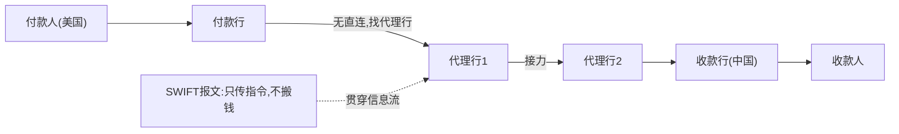

> 💡 链条越长越慢、越贵（每个中间行雁过拔毛）、越不透明（看不到钱到哪一棒）。这就是跨境痛点的根源。

#### 4.1.1 接力中清算/结算怎么实现 + 三个易混点 🔧

> 🔑 回到模块0 公理：**钱不会移动，只是各账本改数字**。代理行接力的本质就是——**链上每相邻两方在彼此的 Nostro/Vostro 账户上改数字；清算=传指令对账，结算=在账户上真正落定。** 以"美国付款人付 USD → 中国收款人"为例：

**① 清算（Clearing）= 传指令 + 对账，不动终极的钱**
- SWIFT 报文（MT103/pacs.008）沿链传递"谁付谁多少美元"——**信息流，SWIFT 只送信不搬钱**（上图已强调）。每一棒据此知道"该在谁的账户记多少"。

**② 结算（Settlement）= 在 Nostro/Vostro 账户上借贷改数字、落定**
- 相邻两行在**往来账户**上借一方、贷另一方，层层接力：付款行扣付款人 →…→ **工行在美国代理行（如花旗）的美元账户(Nostro)被贷记** → 工行再在境内把等值记给收款人。
- **美元真正"落定不可撤销"（finality）那一刻，发生在美国的终极账本 Fedwire（逐笔）/CHIPS（净额）上**（§4.2）。相邻行间常**先记 Nostro/Vostro、定期轧差净额**再走终极清算，不是每笔都动 Fedwire。

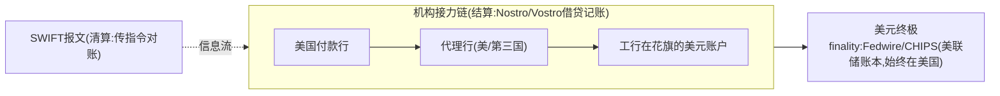

**③ 三个高频易混点（务必分清）：**

- **易混点一：机构所在地 ≠ 美元结算地。** 上图节点跨国分布（付款行在美、代理行可能在美或第三国、**收款行工行在中国**），但**美元的最终结算始终在美国**（Fedwire/CHIPS）——因为美元终极账本只有美国有。工行"收到"的美元，物理上仍在它**美国代理行的账户**里。
- **易混点二：钱没真飞过国境。** 美元始终在美国银行体系内各账户间挪，中国这端只是**工行在花旗的账户被贷记**、再在境内记给收款人（呼应 §4 "钱往往没真飞过国境"、03b "两个资金池"）。
- **易混点三：结算 ≠ 结汇 ≠ 提现（三件先后分离的事，最易叠混）：**

| 步骤 | 是什么 | 动的是什么 |
|---|---|---|
| **代理行→工行** | 银行间**结算**（代理记账） | **美元**，在美国体系内记账（币种没变、没换汇）|
| **结汇（FX）** | **换汇**：美元→人民币 | 货币种类变了，受外汇管理 SAFE 管（另一独立动作）|
| **提现/到账** | 人民币**到账** | 人民币打到收款人境内银行卡 |

> 🔑 **一句话总结**：**清算=SWIFT 传报文对账；结算=各行在 Nostro/Vostro 上借贷记账、美元 finality 落在美国 Fedwire/CHIPS**。"代理行→工行"是**美元的银行间结算**（钱在美国、记到工行美元账户），**不是结汇也不是提现**——结汇（换人民币）和提现（人民币到账）是它**之后、另外两个独立步骤**（详见 03b §5 结汇 / §8 两个资金池）。

### 4.2 各币种的"终极账本"系统 📌一手事实

| 系统 | 主体 | 币种/机制 | 关键数据 |
|---|---|---|---|
| **Fedwire** | 美联储 | 美元 RTGS（逐笔、实时、最终、不可撤销） | 美元大额终极结算 |
| **CHIPS** | 私营 | 美元净额清算，是 Fedwire 的私营搭档 | 日均 ~$2.2 万亿 |
| **CHAPS** | 英格兰银行 | 英镑同日 RTGS | — |
| **T2** | 欧洲央行 | 欧元 RTGS，2023.3 上线替代 TARGET2 | 原生 ISO 20022 |
| **CIPS** | 中国 | 人民币跨境清算，两层结构 | 📌 ~194 直接/1597 间接参与者，2025 年约 180 万亿元（已核查）；2015 年上线 |

> 🔧 **RTGS vs 净额的第一性权衡**：RTGS（Fedwire）逐笔全额→安全即时但极耗流动性；净额（CHIPS）轧差只付净额→省流动性但批处理+有风险敞口。**美元同时需要这两个系统**——大额求稳走 Fedwire，海量求省走 CHIPS，互补而非竞争。

#### 4.2.1 中国跨境贸易主要走哪些币种结算？（量级与趋势）🟡量级判断

> ⚠️ **先分清两套口径——这是最容易被混淆、数字差很多的地方**：

| 口径 | 量什么 | RMB 占比量级 | USD 占比量级 |
|---|---|---|---|
| **A. 跨境收付总额** | 所有跨境资金往来——含**货物贸易 + 服务 + 资本/金融账户**（投资/证券/融资） | 🟡 **已超 50%，第一大币种** | 约 40% 多 |
| **B. 货物贸易结算** | **只看进出口货物**这一项 | 🟡 约 **25%~30%** | 🟡 **仍居首/接近半数（主导）** |

- 🔑 **为什么差这么多**：口径A 把**资本项目**（RMB 计价的债券/股票投资、跨境融资）算进去，这块人民币占比高，把整体拉过 50%。新闻常说的"**人民币超美元成第一大跨境结算货币**"指的是**口径A，不是货物贸易**。你若关心"做生意（货物进出口）用什么币种"，看口径B——**美元在货物贸易里仍是主导**。
  - 💡 **什么是"投资/融资业务"（资本项目）**：跨境资金往来分两大类——**经常项目**（做生意：货物进出口、服务、利润汇回）和**资本项目（=金融账户）**。后者就是**钱以"投资/借贷"身份过境**，不是买卖货物：
    - **投资业务**：外资买中国债券/股票（如境外机构通过"债券通/沪深港通"买 RMB 计价资产）、企业对外直接投资(ODI)/外商直接投资(FDI)、并购入股等——本质是**把钱投出去/引进来换取资产或股权**。
    - **融资业务**：跨境借钱——中资企业到境外发**人民币债券（点心债/熊猫债）**、向境外银行借**跨境人民币贷款**、贸易融资等——本质是**借入资金、未来还本付息**。
  - 🔑 **为什么这块把 RMB 占比拉高**：近年大量境外机构买**人民币计价**的债券、中资企业发**人民币**债融资——这些天然用 RMB 计价结算，金额又大（一笔债券投资可抵海量小额贸易），所以口径A 里人民币占比被显著抬升；而货物贸易（口径B）报价习惯仍偏美元，RMB 渗透较慢。
- ✅ **高置信结构判断**：① **美元仍是中国货物贸易结算的主导币种**；② 全球范围美元更绝对（SWIFT 全球支付口径美元长期约 47%-48%、欧元约 22%、人民币仅个位数 ~3%-4%）；③ 与拉美等新兴市场贸易**绝大多数仍走美元**（本币结算占比还很小，呼应 §14 中拉美元案例与 §7 mBridge"去美元"动因）。
- 🟡 **中高置信趋势**：约 **2023 年起**人民币在**口径A**中首次超美元升至第一、2024 维持 50%+；货物贸易（口径B）中 RMB 占比约 25%-30% 且逐年上升。
- ⚠️ **数据警示（务必遵守）**：以上为**量级与趋势**（建心智模型够用），**具体百分比随季度漂移**，**不可作为精确事实引用**。要写进对外材料须核一手：**PBOC《人民币国际化报告》/ SAFE 跨境收付币种结构 / SWIFT RMB Tracker / 海关总署**。⚠️ 本节未跑 deep-research 核验，标 🟡 量级判断。

### 4.3 报文演进（概要，细节见技术篇 §2）

- **旧报文（SWIFT MT）**：MT103=客户汇款、MT202=银行间、MT202 COV=2009 引入补全 cover 支付的合规信息（📌已核查）。
- **新报文（ISO 20022 MX）**：XML、字段丰富。MT103→pacs.008、MT202→pacs.009、pain.001=付款发起。
- 📌 **时间表**：CBPR+ 2023.3.20 启动，跨境 MT/MX 共存期已于 **2025.11 结束**——受监管金融机构必须用 ISO 20022。
- ⚠️ **澄清两点（易误解）**：① 这里"新旧报文"是**同一件事的两代标准，都是 SWIFT 报文网络上跑的格式**——旧的 MT 是 SWIFT 几十年的**私有格式**，新的 MX 是 SWIFT 改用 ISO 20022 后的格式。② 但 **ISO 20022 本身不是 SWIFT 专有**，它是**通用的国际报文标准**，很多清算系统原生就用（欧洲 **T2 原生 ISO 20022**，Fedwire/CHAPS/CIPS 等也在用/迁移）；SWIFT 只是把它包装成跨境场景的 **CBPR+** 用法指引。无论 MT 还是 MX，**SWIFT 传的都只是指令/信息流，不搬钱**（资金仍走各国清算系统）。

### 4.4 遗留痛点（催生后续技术）

> ⚠️ 📌 **de-risking（去风险）现象**：银行嫌小国/小币种走廊不赚钱、合规风险高，砍掉代理关系。代理行走廊从 2011 年约 13,000 降到 2015 年约 12,600。结果：穷国/小币种被"断网"= G20 说的"可达性差"，这正是催生稳定币和 CBDC 创新的动力。

---

## 5. 管道②：卡组织（另一套完全不同的逻辑）

### 5.1 第一性区别：推 vs 拉

🔧 电汇 = "推"（付款人主动打钱）；刷卡 = "拉"（商户事后去你账户拉钱，你只是签授权书）。**因为是"拉"+ 商户先交货后收钱，整套体系是为解决"先发货后收钱的信任问题"而生**。

### 5.2 支付被劈成三段（快与准的时间分离）

| 阶段 | 时机 | 干什么 | 钱动了吗 |
|---|---|---|---|
| ① 授权 | 刷卡瞬间（秒） | 验真伪+额度，冻结额度 | **没动，只占座** |
| ② 清算 | 当晚/次日（批量） | 算账+换汇 | 算账 |
| ③ 结算 | T+1/T+2 | 真划钱 | **这时才动钱** |

> 💡 日常体验：刷卡立刻收"消费短信"（授权），但账单几天后出、商户几天后到账（结算）。

### 5.3 四方模型 + 交换费引擎

🔧 **四方模型**：`持卡人 — 发卡行(Issuer) — 卡组织(Visa/MC/银联，不碰钱只做网络) — 收单行(Acquirer) — 商户`。对比三方模型（Amex/Discover）= 自己既发卡又收单。

📌 **交换费（Interchange）= 生态激励引擎**：商户付的 MDR 分三块——交换费（→发卡行，大头约 7 成）+ 卡组织费 + 收单加价。**深层含义**：收单侧（商户）付钱补贴发卡侧（银行）。**这就是为什么银行抢着给你发卡送积分**——你刷得越多，发卡行赚越多，你的消费就是它的资产。

### 5.4 跨境刷卡的优势与陷阱

- **优势**：卡组织自带全球封闭网络，货币转换在清算环节内部完成，**不需代理行接力**。
- ⚠️ **DCC 坑**（动态货币转换）：境外刷卡**永远选当地货币结算**；选人民币（DCC）会被偷加 3%~7%。
- 🔧 **银联的战略地位**：中国的卡组织，战略意义同 CIPS——人民币计价、自主可控的卡清算通道。

---

## 6. 管道③：稳定币（题眼：重做一个全球开放账本）

### 6.1 第一性出发点

🔧 与其忍受"没有共同账本"，不如**造一个全球开放账本**——区块链。它的核心作用：在没有可信中心的情况下，让一群互不信任的人共享同一本改不了的账（账本人人有副本 + 私钥签名 + 共识机制）。

📌 **稳定币的创新**：原生币价格会跳，没法当钱。稳定币 = 链上账本（全球/即时/7×24）+ 法币的稳定性（1:1 储备锚定）。主流：USDC(Circle)、USDT(Tether)、PYUSD(PayPal/Paxos)、RLUSD(Ripple)。法币储备型原理：你存 1 美元，发行方铸 1 个币、把美元存银行/买国债兜底。

### 6.2 转账即结算（atomic settlement）的魔法

📌 链上一笔交易写进区块的瞬间，账本已改且不可逆——**算账和动钱是同一个动作**，没有清算/结算时滞。这**消灭了传统跨境最大的两个慢源**：代理行接力 + 清算结算时滞。

### 6.3 关键认知：接缝问题（最独特的洞察，不在教科书里）

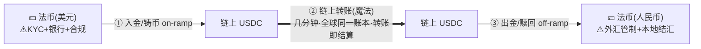

> 📌 **核心洞察**：稳定币**没有消灭**外汇管制/KYC/AML/本地结汇，只是把它们从"链路中间"**推到了两端的入金/出金口（on/off-ramp）**。中间段确实快了便宜了，但只要最终要落地成某国法币，两端的合规和外汇问题一个都跑不掉。**瓶颈搬到了 on/off-ramp**。

### 6.4 已核查的落地形态 = "嵌入"而非"替代" 📌一手

- 📌 **Stripe Bridge × Visa**（2025-04-30，Stripe 官方新闻稿 [12]）：一个 API 在多国发"绑定稳定币的 Visa 卡"，刷卡时 Bridge 从稳定币余额扣款转法币，商户照常收本地货币——**用卡组织网络当 off-ramp**，覆盖 Visa 的 1.5 亿+ 商户，首发拉美。
- 📌 **Ripple × Mastercard × WebBank × Gemini**（2025-11-05，Ripple 官方新闻稿 [13]）：用 RLUSD 在 XRP Ledger 结算法币卡交易，结算发生在 Mastercard 与 WebBank（Gemini 卡发卡行）之间——**把稳定币塞进银行间结算层**。⚠️ **以获得必要监管批准为前提，尚未上线**。

---

## 7. 管道④：CBDC / mBridge（央行版的共同账本）

### 7.1 第一性出发点

🔧 稳定币是**私人**造账本（借条），你得信 Circle。**CBDC 的逻辑**：为什么不让最有信用的央行亲自造？央行的钱就是钱本身，不是借条。**CBDC = 央行亲自发行的数字法定货币**——同思路、不同发行人。

🔧 **两种 CBDC（必须分清）**：

| | 零售型 | 批发型 |
|---|---|---|
| 给谁 | 老百姓（数字现金，如 e-CNY） | 银行间结算（如 mBridge） |
| 争议 | **极大**（隐私：央行能看每笔消费；银行脱媒：危机时挤兑存款换央行货币） | 较小 |

> 📌 **所以跨境创新的主战场 = 批发型**（零售型争议大、落地慢）。

### 7.2 mBridge 详解 📌已核查·BIS [11]

- **定义**：多边 CBDC 共享平台，跑在定制的许可型分布式账本（mBridge ledger / mBL）上，由 BIS 创新中心发起。
- **四家创始央行**：泰国央行、阿联酋央行、中国人民银行数字货币研究所、香港金管局 + 25+ 观察方。
- **核心机制**：付款方与收款方本地银行之间**直接双边连接**，用**央行货币**数秒内近实时结算，**绕开传统代理行中介**。
- **厉害之处**：① 去掉代理行链 ② 用最硬的央行货币 ③ 本币 CBDC 直接互换、**绕开美元/CHIPS/Fedwire**（地缘金融含义）。

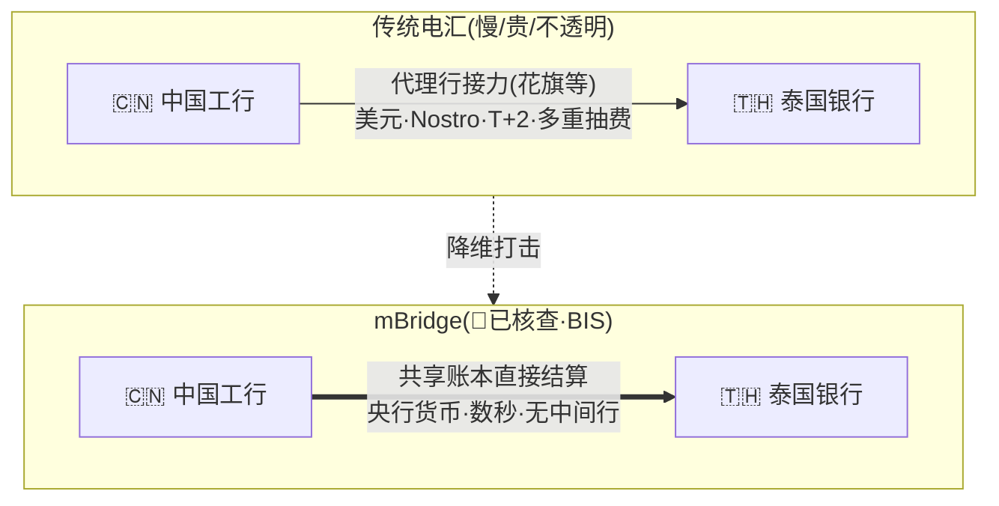

> ⚠️ **状态告诫**：mBridge 是实验性 **MVP**，**BIS 已于 2024.10 退出**（后沙特央行加入创始方）。是"设计意图"非"现实"——技术可行但未实装。

### 7.3 最深洞察（这门课的终极一句）

> 🧠 mBridge 技术上能跑通，BIS 退出是因为撞上**比技术难一万倍的问题：谁来管这个跨国账本？** 一个绕开美元和制裁的体系，政治上 BIS 主导不下去。**新基础设施最大的障碍从来不是技术，而是治理与地缘政治——谁主导、谁信任、是否触动现有权力格局。** 这也解释了为什么又慢又贵的代理行老体系几十年还长青：换掉它的阻力是政治性的。

---

## 8. 核心业务场景：跨境支付用在哪

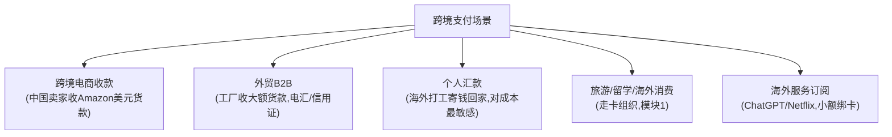

| 场景 | 特点 | 主要玩家 |
|---|---|---|
| **跨境电商收款** | 小额、高频、平台代收、需本地收款账户 | 连连/PingPong/Airwallex/Payoneer/万里汇 |
| **外贸 B2B** | 大额、低频、电汇(T/T)/信用证(L/C)，走 SWIFT | 银行、XTransfer |
| **个人汇款** | 中小额、高频、**对成本极敏感**（6.36% 痛点在这） | Western Union/MoneyGram/Wise/银行 |
| **旅游/留学/消费** | 走卡组织清算（模块1） | Visa/MC/银联 |
| **海外订阅** | 小额、订阅、绑卡 | 卡组织+跨境收单 |

---

## 9. 参与方与角色：谁在牌桌上

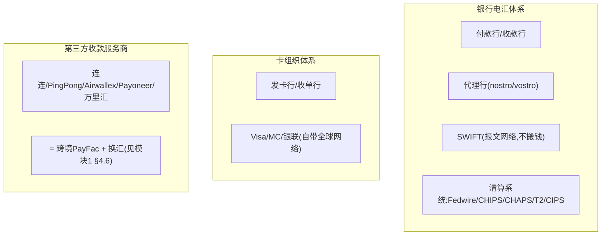

📌 **关键玩家**：
- **付款人/收款人 + 付款行/收款行**：买卖双方及其开户行。
- **代理行（Correspondent Bank）**：中间接力银行（nostro/vostro）。
- **SWIFT**：全球银行间报文网络——**只传信息流，不搬钱**。
- **各币种清算系统**：Fedwire/CHIPS（美元）、CHAPS（英镑）、T2（欧元）、**CIPS（人民币跨境）**——各币种的"终极账本"。
- **卡组织**：Visa/Mastercard/银联/Amex，自带全球封闭网络。
- **PSP / 第三方收款服务商**：Stripe/Adyen/PayPal（PSP）；连连/PingPong/Airwallex/Payoneer/万里汇（中国出海收款，本质=跨境 PayFac + 换汇，模块1 `01-cards-business.md` §4.6 已讲透；企业画像见 `03c-crossborder-players/`）。

> 🎯 **交流要点**：能说"SWIFT 传报文、清算系统才是各币种的终极账本、CIPS 是人民币绕开美元体系的自主通道"——抓住了跨境管道的骨架。

---

## 10. 各方怎么赚钱：手续费 + 汇差 + 浮存

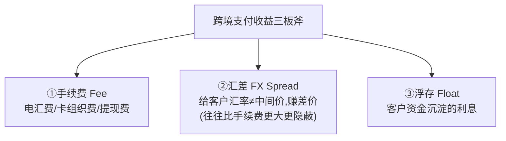

| 三板斧 | 含义 | 谁在用 |
|---|---|---|
| **① 手续费** | 按笔或按比例收费 | 几乎所有人：电汇费、卡组织费、收款服务商提现费 |
| **② 汇差（FX Spread）** | 给客户的汇率 ≠ 真实中间价，赚中间差价 | 收款服务商、银行换汇、Wise/Revolut；**往往比手续费更大、更隐蔽** |
| **③ 浮存（Float）** | 客户的钱"过夜"，机构拿去赚利息 | Payoneer/Wise/Revolut；高利率环境下利息收入可观 |

> 📌 **关键洞察**：**汇差往往是比手续费更大、更隐蔽的利润来源**。跨境收款服务商（连连/PingPong）的核心收益就是"提现费 + 汇差 + 浮存"。

#### 10.1 三板斧各占多少？——没有通用比例，随玩家类型 + 利率而变

⚠️ **先破执念**：三板斧**没有一个标准固定比例**。它由三件事决定，且多数公司**不单独披露**（尤其汇差天然藏在"给客户的汇率"里）：① **玩家类型**（纯收款商/钱包/收单/银行结构天差地别）② **利率环境**（浮存=客户备付金利息，2022-24 加息周期暴涨、降息即缩水）③ **披露口径**（财报通常只给合并营收，不拆这三块）。

📌 **能核实的一手锚点**（来自 `03c` 企业画像 deep-research，注意是单一指标、非完整三分拆解）：

| 公司 | 一手数据（标年份） | 说明 |
|---|---|---|
| **Payoneer**（FY2025）📌 | **浮存利息 $231.6M ÷ 总营收 $1,052.8M ≈ 22%** | 钱包型玩家浮存占比的真实标尺；公司正主动从"利息驱动"转向"费率驱动"（剔除利息收入 +14%） |
| **dLocal**（FY2025）📌 | 净收入/TPV ≈ **2.68%**（含交易费+FX费） | 但**不拆**多少是交易费、多少是 FX 费 |
| **Adyen**（FY2025）📌 | 净收入/TPV ≈ **0.17%** | 全栈收单服务大商户，**几乎全是处理/结算费**，汇差占比极小 |

🔧 **定性规律**（针对中国跨境电商收款商如连连/PingPong/万里汇，方向性非精确）：
- **汇差**：通常**最大、最隐蔽**（藏在每笔结汇里，规模越大越赚）。
- **手续费**：中等，且**持续被价格战压缩**（费率透明、易被卷低）。
- **浮存**：**看利率脸色**，高利率时可观、低利率时缩水。

> 🎯 **诚实结论**：**唯一较硬的一手数字是"Payoneer 浮存≈22%营收(2025)"**；收单型（Adyen）几乎全是手续费、汇差极小；纯收款商汇差最大。⚠️ **"手续费 X% / 汇差 Y% / 浮存 Z%"这种精确通用拆分公开渠道查不到、不应编造**——谁给你一个精确三分比，基本是某家特例或臆造。各家细节见 `03c-crossborder-players/`。

---

## 11. 行业痛点与 G20 路线图（行业"北极星"）

> 🔧 **先认三个缩写**：**G20**=二十国集团（全球主要经济体的经济合作论坛，定方向）；**FSB**=金融稳定理事会（Financial Stability Board，受 G20 委托定量化目标）；**BIS**=国际清算银行（Bank for International Settlements，出技术蓝图与试点，Nexus/mBridge 即其项目）。分工：**G20 定方向 → FSB 定 KPI → BIS 出图纸**。

### 11.1 四大痛点（G20/FSB/BIS 官方框架）📌已核查 [1][2][3]

📌 跨境支付**四大病症**：**贵、慢、不透明、可达性差**。这是 G20 通过 FSB 和 BIS 在 2020 年正式确立的框架（CPMI 2020 年报告提出 **19 个 building blocks**，分 A–E 五个重点领域 [1]）。

- **贵**：手续费 + 汇差叠加。📌 截至 **2025 Q3，全球平均汇款成本 6.36%**（World Bank SDG 10.c.1 官方基准 [8]）——汇 $100 平均被吃掉 $6.36。
- **慢**：传统银行电汇常需 **T+2 ~ T+5 个工作日**（多中间行接力 + 时区 + 合规）。
- **不透明**：付款人常不知道钱到哪了、会被扣多少、何时到。
- **可达性差**：欠发达地区、小额、长尾走廊往往无人服务或费率畸高（de-risking，§4.4）。

### 11.2 G20 量化目标（2021 确立）📌已核查 [4][5]

📌 2021 年 G20 通过报告，确立跨越三大市场分段（批发 wholesale / 零售 retail / 汇款 remittance）的 **11 个全球量化目标**，统一目标日期 **2027 年底**（汇款成本沿用 UN SDG 的 2030 期限）：

| 维度 | 目标 |
|---|---|
| **零售成本** | 全球平均 **≤ 1%**，且没有任何走廊高于 3%，2027 年底前 |
| **汇款成本** | $200 转账成本 **≤ 3%**，且没有走廊高于 5%，2030 年前（重申 UN SDG） |
| **速度** | **75% 的跨境支付在发起后 1 小时内到账/可用**，其余 1 个工作日内，三大分段均适用，2027 年底前 |

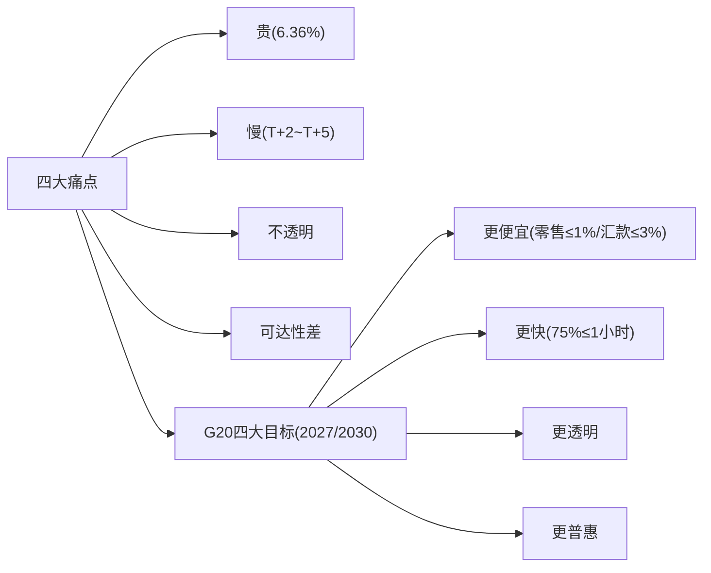

> 📌 **对比现实**：6.36% vs 目标 1%~3%，**行业离目标还有巨大差距**——这正是所有新兴技术（§12）试图填补的鸿沟。"目标 vs 现实"的鸿沟是未来几年跨境支付的主旋律。

---

## 12. 新兴技术：沿三条主线收敛，各攻不同痛点

📌 新兴技术不是乱七八糟一堆，而是沿三条主线收敛，分别攻击不同的痛点（每条都对应 §1 那两个总根问题）。

### 12.1 主线一：即时支付系统互联（BIS Project Nexus）—— 攻"慢"和"可达性" 📌 [6][7]

- **目标**：通过一个**标准化的中枢（hub）**把各国国内的即时支付系统连起来。运营方**只需接一次 Nexus 平台，就能触达网络上所有国家**（而不是 N×N 两两对接）。
- **类比**：以前每两个国家修一条专线（10 国要修 45 条）；Nexus 像建"国际机场枢纽"，每国接一条线到枢纽即可互通——复杂度从 N² 降到 N。
- 📌 **预期到账约 60 秒内**（付款人到收款人）。**五国央行合作**：印尼、马来西亚、菲律宾、新加坡、泰国。
- ⚠️ **状态**：2025 年已在新加坡成立"Nexus 方案组织"，处于**建设/上线前阶段，尚未全面生产运行**。
- 🔧 先行验证：印度 **UPI** 是全球最成功的即时支付系统，已和新加坡 **PayNow** 实现跨境互通（UPI–PayNow Linkage），是 Nexus 理念的先行案例。

### 12.2 主线二：批发型多边 CBDC（BIS Project mBridge）—— 攻"代理行链条"

详见 §7.2——多边 CBDC 共享平台，许可型 DLT，四创始央行 + 25 观察方，直接双边连接用央行货币数秒结算。📌已核查 [11]。⚠️ MVP，BIS 已 2024.10 退出，"设计意图"非"现实"。

### 12.3 主线三：稳定币进入卡组织/结算轨道 —— 攻"成本"和"7×24 可用性"

详见 §6.4——Stripe Bridge×Visa [12]、Ripple×Mastercard×WebBank×Gemini [13]。标志稳定币正被缝进**已有的卡组织受理网络**，从"投机"转向"支付基础设施"。

> 🔧 SWIFT 也在推进 **gpi**（global payments innovation）——给跨境支付加端到端追踪、更快到账。⚠️ 本轮核查未取得 gpi 的可证伪一手数据，仅作背景，不作事实断言。

---

## 13. 中国出海专题

### 13.1 国家队基础设施 🔧

| 系统 | 功能 | 备注 |
|---|---|---|
| **CIPS**（人民币跨境支付系统） | 人民币跨境清算的"终极账本"，人民币国际化关键管道 | 2015 上线；与 SWIFT（报文）配合；📌约 194 直接/1597 间接参与者，2025 约 180 万亿元 |
| **银联国际** | 把银联卡受理网络铺向全球 | 中国游客海外刷银联卡；境外发行银联卡 |
| **支付宝/微信跨境、Alipay+** | 和境外钱包/收单机构合作 | 境外扫码、跨境收付 |

### 13.2 第三方跨境收款服务商（出海卖家核心工具）🔧

📌 **主角**：连连/PingPong/Airwallex/Payoneer/万里汇——本质是**跨境 PayFac + 多币种账户 + 换汇 + 多国牌照**。

🔧 **核心运作模式**（详见 §14 案例 + `03b` 全链路）：① 境外为卖家开**本地虚拟收款账户**对接 Amazon/eBay/Shopify 代收 ② 境内通过牌照+合作银行结汇付人民币 ③ 把一笔跨境拆成"两段境内 + 一次换汇"避开 SWIFT ④ 盈利=提现费+汇差+浮存。

📌 **合规底座**（已核查·政府网一手 [10]）：国家外汇管理局（SAFE）**《支付机构外汇业务管理办法》（汇发〔2019〕13 号，2019）**——规范支付机构跨境外汇业务、便利跨境电商结算、防范外汇支付风险。
> ⚠️ **已证伪说法**：关于"支付机构须在办法生效后 3 个月内完成名录登记"的说法**被核查证伪（剔除）**，登记时限以监管原文最新细则为准，不要采信。

🔧 **SAFE 监管要点**：跨境电商收款需做交易真实性核验、国际收支申报、限额与展业管理——合规是这门生意的牌照护城河。详见 `03b §6` 合规申报环节、模块1 `01-cards-business.md` §4。

### 13.3 跨境收款 vs 海外本地收单：两种角色，别混为一谈

📌 §13.2 讲的都是**跨境收款**（帮中国卖家把海外平台的钱合规收回国）。但有些跨境企业还做**海外本地收单**——另一套逻辑。两者常被混着说"做收单"，必须掰开。

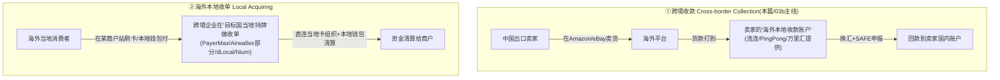

| | ① 跨境收款 | ② 海外本地收单 |
|---|---|---|
| **客户是谁** | 中国出口卖家（收钱的人） | 商户（出海中国商户 或 当地商户） |
| **解决什么** | 把海外平台的钱**合规收回国**（换汇+申报是核心） | 在**目标国当地**帮商户**受理**消费者付款 |
| **谁付钱给谁** | 平台 → 卖家 | 当地消费者 → 商户 |
| **代表玩家** | 连连、PingPong、万里汇、XTransfer、Payoneer | PayerMax、Airwallex(部分)、dLocal、Nium、EBANX |

#### 海外本地收单 ≠ 模块1/2 的境内收单：三处本质不同

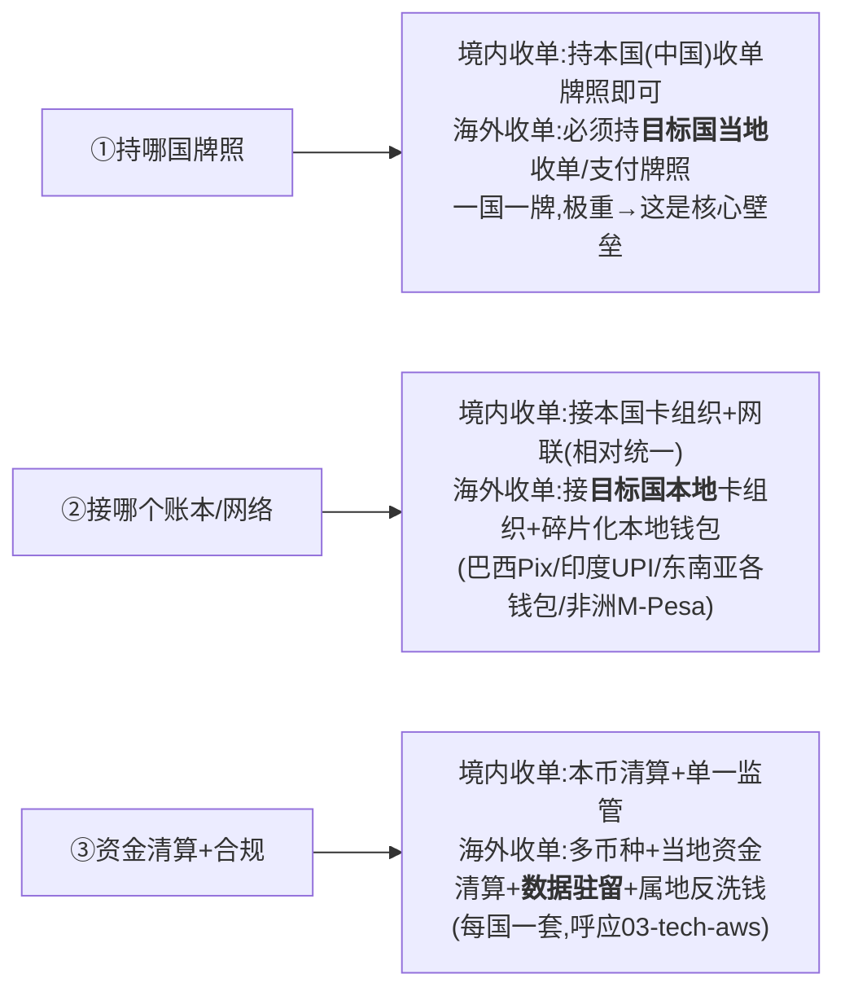

- **① 牌照——从"一国一牌"到"每进一国都要当地牌照"**：收单是强属地监管的。**PayerMax/dLocal 这类公司的核心资产，正是"已在几十个新兴市场拿齐本地牌照"**——让出海商户"接一个 API = 落地几十国"。
- **② 受理网络——从"对接银联"到"对接几百种本地支付方式(LPM)"**：新兴市场支付方式极度碎片化（Pix/UPI/GCash/DANA/M-Pesa…），这是模块1 卡收单没有的复杂度。
- **③ 资金与合规——从"单一本币单一监管"到"多币种+属地合规"**：当地资金清算、多币种、**数据驻留**（很多国家要求支付数据不出境）、各国反洗钱/制裁——呼应技术篇 `03-crossborder-tech-aws.md` 的多 Region 数据驻留。

> 🎯 **交流要点**：能区分"跨境收款（收回国，连连/PingPong）vs 海外本地收单（在当地受理，PayerMax/dLocal）"，并指出**海外收单的护城河 = 本地牌照矩阵 + 本地支付方式接入 + 属地合规能力，不是支付技术本身**（呼应 `02-epayment-business §7.1`）。
> 📌 **对企业画像的意义**：`03c-crossborder-players/` 里每家须标清是 **①跨境收款 / ②海外本地收单 / ③跨境清算派付网络 / 多者兼具**。
> ⚠️ **可信度**：两种角色划分、海外收单三维差异为行业通行机制 + 第一性推理（🔧 公知/推理级）；各公司具体做哪类、持哪些牌照=需在企业画像中逐家 deep-research 核查。

---

## 14. 真实案例（对比记忆）

### 14.1 深圳工厂收美国 5 万美元货款——两条路对比

**传统电汇路线**（T+2~T+5）：
```
美国账户 →(SWIFT报文 pacs.008)→ 美国小银行 →(CHIPS/Fedwire清算)→
工行美国代理行(花旗,工行在此有Nostro) →(SWIFT通知)→ 中国工行 →(合规+外汇局申报+结汇)→ 深圳账户
```
本质：两个账本靠代理行接力 + 汇率缝合；慢和贵发生在接力、对账、合规、换汇上。

**稳定币路线**：
```
美国钱包 ──直接转5万USDC──► 深圳钱包(几分钟) ──③出金──► 结汇成人民币
```
本质：同一个账本里 A 减 B 加；瓶颈在出金口的结汇与合规（§6.3 接缝问题）。

### 14.2 跨境电商收款七步（收款服务商怎么做）📌 [10]

💡 深圳卖家小王在 Amazon 美国站卖货：① 美国买家刷 Visa → ② Amazon 扣佣金后把货款打到小王在收款服务商的"**美国本地虚拟账户**" → ③ 服务商在美国当地收到美元（**钱还在美国境内，没出境**）→ ④ 小王 App 点"提现/结汇" → ⑤ 服务商做两件事：(a) USD→CNY 换汇（赚**汇差**）(b) 向中国 SAFE 申报 → ⑥ 通过牌照+境内银行把人民币打入小王国内卡 → ⑦ 到账（扣手续费+汇差）。

> 📌 **核心商业机密**：用"**美国境内收美元 + 中国境内付人民币 + 中间自己平外汇头寸**"，把一笔本要走 SWIFT 电汇（慢、贵）的跨境支付，变成"**两段境内 + 一次内部换汇**"，做到小额、快速、低费率。**完整七环节 + 两个资金池 + 反向拒付风险见 `03b-crossborder-collection-deepdive.md`**。

### 14.3 东京买 10000 日元手表（卡组织三段）

💡 授权(秒)：刷卡→收单行→Visa 路由→招行验真+冻额度→批准→签字走人（**钱没动**）；清算结算(T+1~2)：手表店打包→Visa 换汇(JPY→CNY)+算账→各行划钱→月底你还信用卡钱才真流出。

---

## 15. 行业趋势判断 🔧

综合已核查事实与行业格局，方向性判断：

1. **"互联"压倒"重建"**：短期最现实的提速降本路径不是推倒 SWIFT，而是把各国已有即时支付系统连起来（Nexus 模式）——监管最支持、落地最快。
2. **稳定币从"投机"转向"支付基础设施"**：Stripe/Bridge×Visa、Ripple×Mastercard 标志稳定币被缝进卡组织受理网络。2025 起关键变量=**监管框架成熟度**（美国 GENIUS 法案、香港稳定币条例），谁先拿合规通行证谁先规模化。
3. **CBDC 走"批发先行"**：零售型争议大、落地慢；批发型 mBridge 直击代理行痛点。**但 BIS 退出说明：多边治理（谁主导、是否被用于规避制裁）是比技术更难的障碍**。
4. **ISO 20022 是"水电煤"级确定性趋势**：全球报文迁移已是既定事实，数据更丰富持续释放在合规自动化、实时对账、欺诈监测上的价值。
5. **中国出海服务商持续整合上行**：从单纯收款走向"收款+换汇+全球账户+财资管理+发卡"一站式（Airwallex 路线），竞争从费率战转向产品深度与全球牌照网络。
6. **"目标 vs 现实"的鸿沟仍是主旋律**：6.36% vs 1%~3%，2027/2030 deadline——所有创新都会以"是否真让支付更快、更便宜、更透明、更普惠"来检验。

---

## 16. 自测题（能答上来才算真懂）

1. 为什么说"钱从不移动"？这对理解跨境支付意味着什么？
2. 跨境支付的"唯一总根源"是什么？四套管道分别如何回答它？
3. 清算和结算的区别？SWIFT 在其中扮演什么角色（不扮演什么）？
4. 为什么美元同时需要 Fedwire 和 CHIPS 两个系统？
5. 刷卡为什么要把支付劈成"授权/清算/结算"三段？
6. 为什么银行抢着给你发信用卡送积分？（提示：交换费流向）
7. 稳定币的"转账即结算"消灭了传统跨境的哪两个慢源？
8. 稳定币真的消灭了外汇管制和 KYC 吗？它把问题推到了哪里？
9. CBDC 和稳定币的根本区别是什么？（提示：钱的等级）
10. mBridge 技术可行，BIS 为什么还退出？这说明了什么最深的道理？
11. 跨境收款和海外本地收单有什么区别？后者的护城河是什么？
12. 全球平均汇款成本是多少？G20 的目标是多少？差距说明了什么？

---

## 17. 本篇小结（背下来）

1. **跨境唯一总根源 = 没有共同账本**（货币/系统/监管/时区/标准 五重不同）→ 引出两个总根问题（接力 ❶ / 换汇 ❷）。
2. **四套管道 = 四种答案**：代理行电汇（中间行接力）/卡组织（自建封闭网络）/稳定币（开放账本）/CBDC（央行共建账本）；差别在"账本由谁造 + 记哪种等级的钱"。
3. **钱往往没真飞过国境**——靠代理行 nostro/vostro 记账 + 汇率缝合；SWIFT 只传报文不搬钱。
4. **三个贯穿概念**：清算≠结算、信息流≠资金流、钱的等级。
5. **各币种终极账本**：Fedwire/CHIPS(美元)、CHAPS(英镑)、T2(欧元)、CIPS(人民币)。
6. **收益三板斧**：手续费 + 汇差（最隐蔽最大）+ 浮存。
7. **痛点**：贵(6.36%)/慢/不透明/可达性差；**G20 目标**：零售≤1%/汇款≤3%/75%≤1小时（2027/2030）。
8. **新兴技术三主线**：Nexus（系统互联）/ mBridge（批发 CBDC）/ 稳定币嵌入卡网络——全是试点/MVP/待批，**区分"设计意图"与"已上线"**。
9. **中国出海**：CIPS/银联国际/支付宝跨境 + 第三方收款商（跨境 PayFac + 换汇 + 多国牌照，SAFE 13 号合规底座）。
10. **元洞察**：决定新管道胜出的，往往不是技术，而是**治理与地缘政治**——谁主导、谁信任。

---

## 18. 通向下一层

### 18.0 模块3 深化阅读地图（推荐按"业务逻辑序"而非字母序读）🗺️

> 🔑 模块3 有三篇业务文档，**字母编号（03 → 03b → 03d）≠ 业务逻辑顺序**。按"先有贸易、再有收款"的真实业务时序，**推荐阅读序是 03 → 03d → 03b**：

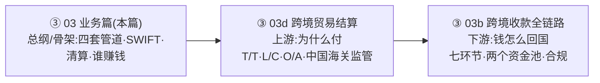

| 读序 | 文件 | 定位 | 回答 |
|---|---|---|---|
| 1️⃣ | **`03-crossborder-business.md`**（本篇） | **总纲/骨架** | 跨境为什么难、四套管道、谁在牌桌、怎么赚钱 |
| 2️⃣ | **`03d-trade-settlement.md`** | **上游：贸易模式** | 一笔国际买卖怎么结算（T/T·L/C·O/A）、中国进出口海关监管方式、为什么会产生跨境收款需求 |
| 3️⃣ | **`03b-crossborder-collection-deepdive.md`** | **下游：收款链路** | 货款从海外买家→中国卖家的七环节、两个资金池、合规 |

> ⚠️ **为什么 03d 排在 03b 之后却建议先读**：03d 是后补的（编号只能排字母序），但它逻辑上是 03b 的**上游**（先有贸易/交易，才有收款需求）。读时按 **03d→03b** 更顺：先懂"为什么有这笔跨境钱要付"，再看"这笔钱怎么收回国"。

### 18.1 其他延伸

- **技术怎么实现？** → `03-crossborder-tech-aws.md`（SWIFT 报文/ISO 20022/多币种账务/汇率引擎/制裁筛查 + AWS）
- **跨境头部企业画像（13 家）** → `03c-crossborder-players/`
- **稳定币如何重做共同账本（管道③深入）** → 模块4
- **跨境收款公司=跨境 PayFac 的产业链拆解** → 模块1 `01-cards-business.md` §4
- **电商支付全景（买家付/卖家收，跨境零售收款的场景上游）** → `e-payment/02b-ecommerce-payment.md`

---

## 附 A：引用来源清单（已核查·一手）

> 本篇 📌 标注的论断，来源可追溯到下表。原始核查报告（含可信度投票记录）已整合进本篇，不再单独保留。

| 编号 | 来源 | URL | 可信度 | 涵盖论断 |
|---|---|---|---|---|
| [1] | BIS/CPMI — *Enhancing cross-border payments: building blocks of a global roadmap* | bis.org/cpmi/publ/d193.htm | Primary | 19 模块/五领域；四摩擦四目标 |
| [2] | FSB — *Enhancing Cross-border Payments: Stage 3 Roadmap*（2020） | fsb.org/2020/10/enhancing-cross-border-payments-stage-3-roadmap/ | Primary | 四目标表述 |
| [3] | FSB — Cross-border Payments 工作专页 | fsb.org/work-of-the-fsb/financial-innovation-and-structural-change/cross-border-payments/ | Primary | 四目标表述 |
| [4] | （同3）FSB 11 个量化目标 | — | Primary | 11 量化目标/三分段/2027 期限 |
| [5] | FSB — *Targets for Addressing the Four Challenges of Cross-Border Payments: Final Report*（2021, Table 1） | fsb.org/2021/10/targets-for-addressing-the-four-challenges-of-cross-border-payments-final-report/ | Primary | 完整量化目标（零售≤1%/汇款≤3%/75%≤1h） |
| [6] | BIS — *Project Nexus* | bis.org/about/bisih/topics/fmis/nexus.htm | Primary | 标准化中枢/单次接入/约60秒/五国 |
| [7] | BIS — Nexus 蓝图报告 | bis.org/publ/othp86.htm | Primary | Nexus 详细设计 |
| [8] | World Bank — *Remittance Prices Worldwide*（2025 Q3 全球均价 6.36%，SDG 10.c.1 基准） | remittanceprices.worldbank.org/ | Primary | 全球汇款成本基准 |
| [9] | Wikipedia — *ISO 20022* | en.wikipedia.org/wiki/ISO_20022 | Secondary | 定义/UML/XML/覆盖范围 |
| [10] | 中国政府网 — 国家外汇管理局《支付机构外汇业务管理办法》汇发〔2019〕13号 | gov.cn/zhengce/zhengceku/2019-10/26/content_5445324.htm | Primary | 中国跨境支付合规框架 |
| [11] | BIS — *Project mBridge* 宣传册 | bis.org/innovation_hub/projects/mbridge_brochure_2311.pdf | Primary | 多边CBDC/许可型DLT/四创始央行/直接双边结算 |
| [12] | Stripe Newsroom — *Bridge partners with Visa*（2025-04-30） | stripe.com/newsroom/news/bridge-partners-with-visa | Primary | 单API稳定币Visa卡/扣稳定币转法币/1.5亿+商户 |
| [13] | Ripple Press — *Ripple teams up with Mastercard, WebBank and Gemini*（2025-11-05） | ripple.com/ripple-press/ripple-teams-up-with-mastercard-webbank-and-gemini/ | Primary | RLUSD在XRPL结算卡交易，待监管批准 |

**方向性参考**（二手/博客级，仅供商业模式方向理解，未做强核查）：
- [a] fxcintel — 跨境支付营收/利息收入分析 fxcintel.com/research/analysis/interest-income-payoneer-wise-revolut
- [b] fxcintel — 10 亿美元营收玩家（2024）fxcintel.com/research/analysis/cross-border-payments-1bn-revenue-players-2024
- Forbes — Airwallex $6.2B 估值；Contrary Research — Airwallex 公司分析

### ⚠️ 已知核查空白（诚实声明）
以下主题本轮按"行业公知"讲解、未逐条引用一手来源（争议小、记载稳定，作扫盲可靠；写入正式材料请二次核实）：SWIFT gpi 当前机制与采用指标、SWIFT MT/MX 逐字段机制、IBAN/BIC 完整规则、CHIPS/CHAPS/CIPS/Fedwire/T2 端到端细节、代理行精确记账流程、UPI/PayNow 跨境互通量级、CIPS/银联/支付宝/微信跨境内部运作、各收款服务商具体牌照费率（除 SAFE 13 号底座外，企业画像 `03c` 已做部分一手核查）。

---

## 附 B：常见追问（FAQ）

**Q：跨境电商收款公司到底是不是银行？它们怎么合规收汇结汇？**
A：不是银行，是持牌支付机构（境内持 SAFE 跨境外汇业务资质，境外持各国 MSB/EMI/MSO 等牌照）。靠"境外本地账户收外币 + 境内结汇付人民币 + 向外管局申报"完成合规收款。详见 §13、`03b`、模块1 §4。

**Q：SWIFT 被制裁"踢出"是什么意思？它不是不搬钱吗？**
A：SWIFT 是报文网络——被踢出意味着该国银行**无法和全球银行交换支付指令**，等于"断了通信"，跨境支付实际瘫痪（虽然 SWIFT 本身不搬钱，但没有报文，代理行不知道该怎么记账划钱）。这也是各国建自主报文/清算系统（如 CIPS）的动因。

**Q：为什么跨境电商收款比传统电汇快、便宜？**
A：收款服务商把跨境支付"拆成两段境内"——美国境内收美元（不出境）、中国境内付人民币（不出境），中间自己平外汇头寸。避开了"代理行接力+SWIFT电汇"这条又慢又贵的链路。本质是用规模化的"两段境内+内部换汇"替代"一笔真跨境"。

**Q：稳定币真能取代代理行电汇吗？**
A：中间段（链上转账）确实快了便宜了，但 §6.3 的"接缝问题"决定了——只要最终要落地成某国法币，两端的 on/off-ramp（KYC/外汇管制/结汇）一个都跑不掉。所以现实落地形态是"嵌入"卡组织/银行网络（§6.4），而非"替代"。
