# 模块 3 · 跨境支付（技术篇）：管道、账务、合规与 AWS

> **学习者**：AWS 技术架构师 · 支付小白
> **本篇目标**：把跨境支付的"管道"翻译成工程。回答：SWIFT 报文长什么样、ISO 20022 迁移是怎么回事？多币种账务怎么设计？汇率引擎和外汇头寸怎么管？制裁名单筛查（最硬的跨境合规）怎么做？跨境对账难在哪？——每项映射 AWS。
> **前置**：业务篇 `03-crossborder-business.md`（含四套管道、G20 目标、新兴技术、引用来源）、模块0技术篇（账本/CP）、模块1技术篇（清结算/HSM）
> **组织方式**：top-down 主线。零散追问见 FAQ。
> 标注：🔧 通用技术 · ☁️ AWS · 📌 关键 · ⚠️ 坑点 · 🎯 交流要点

---

## 1. 全景：跨境支付的技术栈

跨境相比境内（模块1/2），技术上多了四个挑战：**多套报文标准、多币种账务、外汇风险、跨境合规（制裁/反洗钱）**。

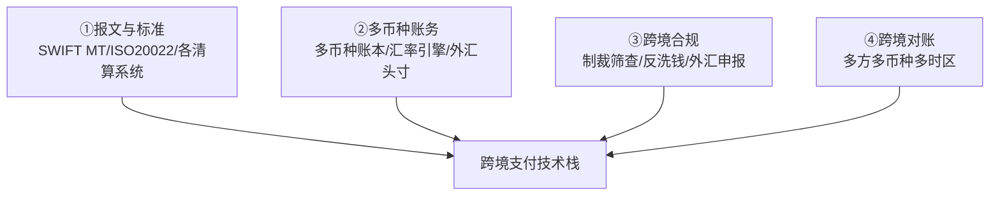

> 🎯 **交流要点**：境内支付的技术核心是"账本+清结算"，跨境**额外**要解决"报文跨标准翻译、多币种账务与换汇、制裁合规、跨时区对账"。这四块是跨境支付公司的技术重头，也是 AWS 能发力的地方。

---

## 2. 报文标准：SWIFT MT 与 ISO 20022 迁移

### 2.1 SWIFT 报文（跨境的"信息流"）

🔧 模块0 讲过信息流/资金流分离——SWIFT 传的是信息流（报文）。常见报文：
- **MT103**：单笔客户跨境汇款（你给境外个人/公司汇钱）。
- **MT202 / MT202 COV**：银行间资金划拨 / 掩护支付（带原始客户信息）。
- **MT940/MT950**：账户对账单。

### 2.1.1 这些报文跑在什么网络上？——SWIFTNet 的物理/逻辑/安全分层

📌 **先破一个常见误解**：SWIFT 的"网络"**不是它自己铺的跨国光缆**，SWIFT 不是电信公司、一寸海底光缆都不拥有。它运营的是一套叫 **SWIFTNet** 的**私有、封闭、安全的报文网络（逻辑网络）**，承载网叫 **SIPN（Secure IP Network）**。把它分层拆开就清楚了：

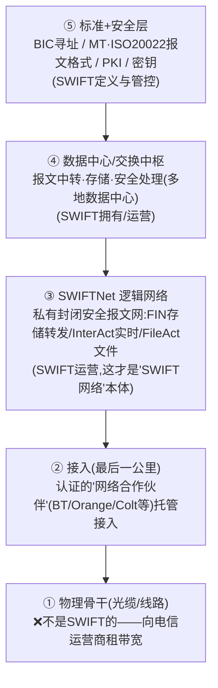

📌 **所有权一句话**：**SWIFT 拥有"逻辑网络 + 数据中心 + 报文标准 + 安全体系"，不拥有物理光缆**——像"在租来的公路上开了一套自己的封闭专线邮政系统"。🔧 SWIFT 本身是 **1973 年由成员银行联合创立的会员制合作社**（比利时法律下 cooperative，总部布鲁塞尔附近），**由成员银行共同拥有**，不是某公司/某国政府的。

📌 **"专用、隔离、强加密"具体怎么实现**（不是一句 VPN 能概括，是多层叠加）：

| 层 | 技术 | 防什么 |
|---|---|---|
| **网络层（专用/隔离）** | **SIPN 私有 IP 专网**，与公网逻辑隔离；接入两种形态：**专线接入**（大行/高量）或**安全 VPN 隧道接入**（中小机构/备份） | 防接入公网、防外部窥探 |
| **传输层** | **TLS** 加密会话 | 防中间人、防窃听 |
| **报文/应用层（核心）** | **PKI 公钥体系**：每家机构有数字证书+私钥，报文**数字签名（防篡改+不可否认）+ 端到端加密** | 防伪造、防抵赖、防内容被改 |
| **身份/接入层** | **HSM** 保管私钥（私钥永不出硬件，呼应 `01c` HSM）；强身份认证；**RMA**（关系管理白名单，控制"谁能给谁发报文"） | 防密钥泄露、防越权通信 |

> 📌 **关键认知**：你问"VPN 还是私有专线"——**本质是私有 IP 专网（SIPN），接入既可走专线也可走 VPN**；VPN/专线只是"怎么接进去"的物理通路，真正的隔离是"整个网络与公网自成封闭域"。而**安全核心在应用层 PKI 而非网络层 VPN**——哪怕底层网络被攻破，报文本身带数字签名+加密，签名保证"确实是工行发的、内容没被改"，这是金融报文不可否认性的根。
>
> 🎯 **交流要点**：能讲"SWIFT 不铺光缆、是会员制合作社、运营的是 SWIFTNet/SIPN 逻辑专网，安全靠 SIPN 隔离 + TLS + 应用层 PKI 签名 + HSM 护私钥 + RMA 白名单"——直击"SWIFT 到底是什么"的工程实底，远超"它是个报文网络"的表层。这也解释了业务篇为什么强调 **SWIFT 只传报文不搬钱**（它本质是通信/报文层，连物理传输都是租的）、**被踢出 SWIFT 为何致命**（不是断光缆，而是从全球统一报文寻址体系里除名 = 通信断网）。
>
> ☁️ **AWS 对照视角**：SWIFTNet 是金融业自建的"封闭专网 + 端到端密码学"范式；云上对应的同类能力是 **PrivateLink/专有网络隔离 + TLS + KMS/CloudHSM 管私钥 + IAM 强身份**——理解 SWIFT 的安全分层，正好类比云上"网络隔离 + 传输加密 + 密钥硬件保护 + 身份白名单"的纵深防御。SWIFT 也提供云接入方案（如经 AWS 托管的 connectivity），是支付公司上云时的对接点。
>
> ⚠️ **可信度**：SWIFTNet/SIPN 私有专网、专线/VPN 接入、PKI 数字签名+TLS、HSM 护私钥、RMA、会员制合作社/1973 创立——均为通行公知（🔧）；各层精确协议版本、数据中心具体站点（行业记载为荷兰/美国/瑞士等，含欧洲数据驻留安排）、网络合作伙伴名单会演进，本节未做一手核查，写入正式材料请查 SWIFT 官方（swift.com，尤其 CSP 客户安全计划与 PKI 文档）。

### 2.1.2 对比：SWIFT 网络 vs 卡组织网络——同是私有专网，一个只送信、一个自带账本

📌 业务篇 §2 四管道表里，卡组织那格写的是"**私人封闭全球网络**"。它和上面的 SWIFTNet 是一回事吗？——**网络形态神似（都是租线组私有专网），但本质角色完全不同**。这正是业务篇把"电汇"和"卡组织"列为两套独立管道的技术根因。

🔧 卡组织也有自己的全球网络：Visa 的叫 **VisaNet**、Mastercard 的叫 **Banknet**，走 **ISO 8583** 报文（模块1）。

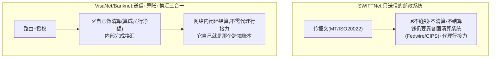

| | SWIFT（SWIFTNet） | 卡组织（VisaNet/Banknet） |
|---|---|---|
| **网络形态** | 租电信线路组私有封闭专网（SIPN） | **同样**租线组私有封闭专网（卡组也不铺光缆） |
| **报文标准** | MT / ISO 20022 | ISO 8583（模块1） |
| **干什么** | **只传报文**（邮政系统） | **报文路由 + 授权 + 清算 + 换汇** 一条龙 |
| **碰钱/算账** | ❌ 不碰钱、不清算 | ✅ **自己做清算**（算成员行净额）、内部换汇 |
| **底层账本** | 没有账本（钱在各国清算系统动） | **自己就是那个跨境账本**（四方模型在网内闭环） |
| **跨境怎么结** | 报文传完，钱还得靠代理行接力 | **网络内清算+换汇，不需代理行接力**（业务篇 §5.4） |

> 📌 **回到业务篇 §1 元洞察（账本由谁造）**：SWIFT **不造账本**（只是通信层，钱在 Fedwire/CIPS 那层动）；**卡组织造了一个账本**——它自建封闭全球网络**当账本用**，跨境刷卡的清算和换汇在网络内部就完成，绕开了代理行接力。这就是"私人封闭全球网络"作为**管道②**独立于**管道①电汇**的根本原因。
> 🎯 **交流要点**：能说"SWIFTNet 和 VisaNet 都是租线组的私有专网，但 SWIFT 只送信不碰钱、卡组织把清算换汇都包进网络自带账本"——一句话点透两套管道的本质差异。
> ⚠️ VisaNet/Banknet 名称与 ISO 8583 为通行公知（🔧）；网络物理实现细节未做一手核查。

### 2.2 ISO 20022 迁移（正在发生的全球大工程）

📌 **从 SWIFT MT 到 ISO 20022（MX）**：旧 MT 报文字段短、信息易截断；ISO 20022 用 XML、字段丰富，能装下完整收付款人/用途/合规信息。

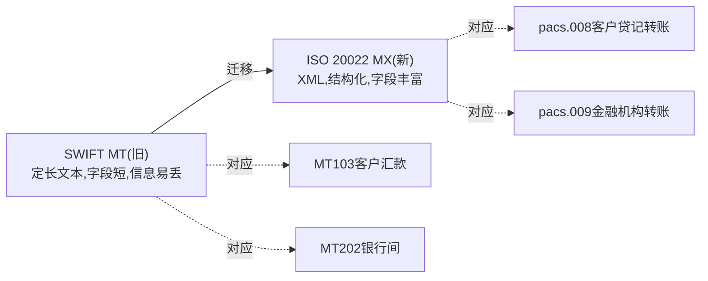

📌 **关键映射**：MT103→**pacs.008**、MT202→**pacs.009**、pain.001（付款发起）。
📌 **迁移时间表**（已核查）：CBPR+ 迁移 2023.3 启动，跨境支付的 **MT/MX 共存期已于 2025.11 结束**——之后受监管金融机构必须用 ISO 20022 MX。

> ⚠️ **澄清"新旧报文"的归属（呼应业务篇 §4.3，工程上务必分清）**：
> - **旧 MT 是 SWIFT 私有格式**；**新 MX 用的 ISO 20022 是 ISO 通用国际标准，不是 SWIFT 专有**。SWIFT 只是把 ISO 20022 裁剪成自己跨境场景的 **CBPR+ 用法指引（usage guideline）**——即"SWIFT 上的 ISO 20022 长什么样"。
> - 别的系统**各有自己的 ISO 20022 用法档（usage guideline）**：欧洲 **T2/TIPS** 原生 ISO 20022、英国 **CHAPS**、美国 **Fedwire/FedNow** 迁移中、人民币 **CIPS** 也支持——见下表 §2.3。**同一套 ISO 20022 标准，各系统的字段裁剪/必填规则不同**，这正是工程上"报文转换/校验"要按目标系统分别适配的根因。
> - 不论 MT 还是 MX，**SWIFT 始终只传报文（信息流），不搬钱**——资金仍走各国清算系统（§2.3）。所以 §2.3 里 Lambda 做的 **MT↔MX 转换**，本质是"在不同报文方言间翻译"，与"钱怎么清算"是两条独立轨道。

> 🔧 **第一性意义**：报文从"信息贫乏"到"信息丰富"，直接服务 G20 的"更透明、更快"——合规筛查能自动化、对账能精准匹配、人工干预减少。这是当前全球银行 IT 最大工程之一。
> 🎯 **交流要点**：能说"MT103→pacs.008、MT202→pacs.009、2025.11 共存期结束"，证明你跟得上跨境支付的报文现代化。
> 📌 ISO 20022 定义、UML 建模、XML 渲染、覆盖支付/证券/卡交易——业务篇附A [9] 有来源（Wikipedia, Secondary）。动手建议：去 iso20022.org 找一手 schema，精读 pacs.008/pacs.009/pain.001 结构。

### 2.3 各清算系统的技术差异

🔧 各币种"终极账本"的技术特性（模块0笔记已对比）：
| 系统 | 币种 | 机制 | 报文 |
|---|---|---|---|
| Fedwire | 美元 | RTGS（逐笔实时全额） | 专有/ISO20022 迁移中 |
| CHIPS | 美元 | 净额清算 | 专有 |
| T2 | 欧元 | RTGS | **原生 ISO 20022** |
| CHAPS | 英镑 | RTGS | ISO 20022 迁移中 |
| CIPS | 人民币跨境 | 实时全额+净额 | 支持中英文，可借 SWIFT |

☁️ **AWS**：对接多个清算系统/SWIFT 需要**协议适配层**——用 ECS/EKS 跑各系统的接入网关，**AWS Transfer Family**（SFTP）交换批量报文文件，报文解析/转换（MT↔MX）用 Lambda/ECS，**MQ/MSK** 做报文队列。

### 2.4 账户与机构标识：IBAN / BIC

🔧 跨境报文里要标清"钱从哪个账户来、到哪个银行去"，靠两个标识：

- **IBAN（国际银行账户号）**：欧洲等地区标准化账户号，结构 = 国家代码(2位) + 校验位(2位) + 国内账号(BBAN)。**校验机制**：把前 4 位移到末尾、字母转数字后，整串对 97 取模应 = 1（ISO 7064 Mod-97-10）——可在客户端本地拦截大量录入错误，不必等银行退票。
- **SWIFT BIC（银行识别码）**：标识一家银行的 8 或 11 位代码 = 银行代码(4) + 国家(2) + 地区(2) + 分行(3，可选)。例 `ICBKCNBJ` = 工商银行(ICBK)中国(CN)北京(BJ)。

> 🎯 **工程动手**：写一个 IBAN 校验器（Mod-97）+ BIC 格式校验，是跨境支付系统"受理层"最基础的防错。⚠️ IBAN/BIC 完整规则本轮未逐条核一手（业务篇附A 已知空白），实现时以 ISO 13616(IBAN)/ISO 9362(BIC) 原文为准。

---

## 3. 多币种账务与汇率引擎

### 3.1 多币种账本

📌 跨境的账务比境内复杂：一个客户/机构要**同时持有多个币种的余额**，每个币种独立记账（复式记账，模块0），还要处理币种间的兑换。

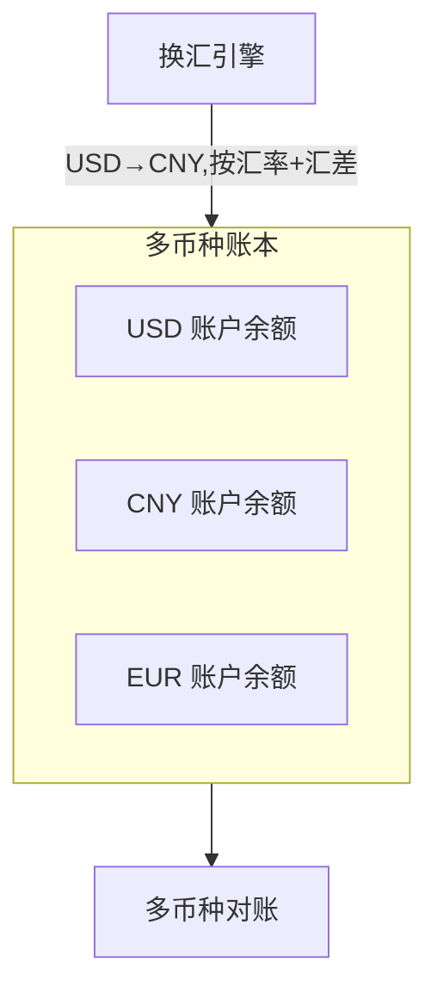

🔧 关键设计：
- **每币种独立账户 + 独立复式记账**（不能把不同币种混记）。
- **换汇是两笔分录**：借 USD 账户、贷 CNY 账户，中间按汇率换算 + 赚汇差（记汇差收入）。
- ⚠️ **币种精度**：日元无小数、多数币种 2 位、加密资产 8+ 位——账本要处理不同精度，**绝不能用浮点数**（金融用定点/整数最小单位，否则精度误差=资损）。

☁️ **AWS**：多币种账本用 **Aurora**（强一致复式记账，每币种独立账户表），DynamoDB 做高频余额读，金额用整数最小单位存储。

### 3.2 汇率引擎与外汇头寸

📌 **汇率引擎**：实时获取/计算汇率，给客户报价（中间价 + 汇差），并管理汇率的时效（汇率几秒就变）。

📌 **外汇头寸（FX Position）与对冲**：收款服务商"美国收美元、中国付人民币"之间有**时间差**，期间汇率会波动——这就是**外汇风险敞口（头寸）**。要用远期/即期对冲锁定。

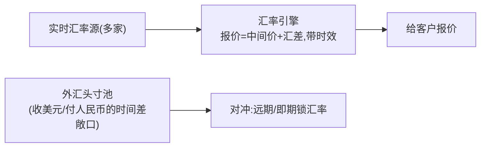

#### 📖 概念深挖：什么是"远期/即期对冲锁定"？（第一性）

**① 世界上本来存在什么问题——汇率敞口（FX exposure）。** 跨境收款公司给卖家**承诺了一个汇率**（"你这 100 美元，我按 7.2 给你结成 720 元"），但它**当下并没有真的把美元换成人民币**——可能 T+2 才统一换汇结算。这中间的时间差里，汇率会动：若人民币升值到 7.0，公司只能换到 700 元，但已答应给卖家 720 元——**自掏 20 元差价**。这个"已承诺但未平盘"的美元余额，就是**外汇敞口/头寸（position）**。

> 🔑 **本质**：敞口 = "**我手上持有/欠付的某种货币净额，其本币价值会随汇率波动**"。头寸为正（净持有美元）→ 美元贬值就亏；为负（净欠付美元）→ 美元升值就亏。

**② 如果不对冲会怎样——利润被汇率赌博吞掉。** 跨境收款公司真正赚的是**稳定的汇差点差**（中间价 + 0.2%~0.5%），这是它的商业模式。但如果敞口不管，一次汇率大幅波动的亏损可能**吃掉几个月的点差利润**——等于把"赚手续费的生意"变成"赌汇率的生意"。所以**对冲的目的不是赚汇率，而是把汇率波动这个变量消掉，锁住确定的点差利润**。

**③ 用什么机制解决——即期 + 远期两种工具：**

| 工具 | 英文 | 是什么 | 交割时间 | 锁定什么 | 用在哪 |
|---|---|---|---|---|---|
| **即期** | **Spot** | 按**当前市场汇率**立刻成交换汇 | 通常 **T+2** 内交割 | 锁定**当下**这一刻的汇率 | 敞口产生后**马上平盘**：收到美元立即在市场换成人民币，敞口归零 |
| **远期** | **Forward** | 现在就**签约定死一个未来某日的汇率**，到期按约定价交割（无论届时市价多少） | **未来某约定日**（如 T+30/T+90） | 锁定**未来**某日的汇率 | 已知未来要换汇（如月底统一给一批卖家结算），提前把那天的汇率锁死，消除等待期的不确定性 |

> 🔧 **即期 vs 远期一句话**：**即期 = "现在就换、锁现在的价"**（消除敞口最直接）；**远期 = "现在签约、约定未来某天按这个价换"**（消除"未来要换但怕汇率变"的不确定性）。远期价 ≈ 即期价 + 两种货币的利差（这叫 forward points / 掉期点，是利率平价的结果，不是预测涨跌）。

**④ 实际怎么用——净额对冲（netting）+ 阈值触发：** 收款公司不会每笔单独对冲（成本高），而是**把同方向敞口轧差成净头寸**再对冲。如同时"收 100 万美元、欠付 30 万美元"，净敞口仅 70 万美元，只需对冲这 70 万。系统**实时算各币种净敞口**，超过风控阈值就自动触发即期平盘或加一笔远期。

#### 📖 追问：远期"签约定死一个未来汇率"——和谁签？那个价怎么定？

**(a) 和谁签——场外(OTC)双边合约，没有中央交易所。** 远期是**你和一家愿意承接反向风险的金融机构之间的私下约定**，对手通常是:

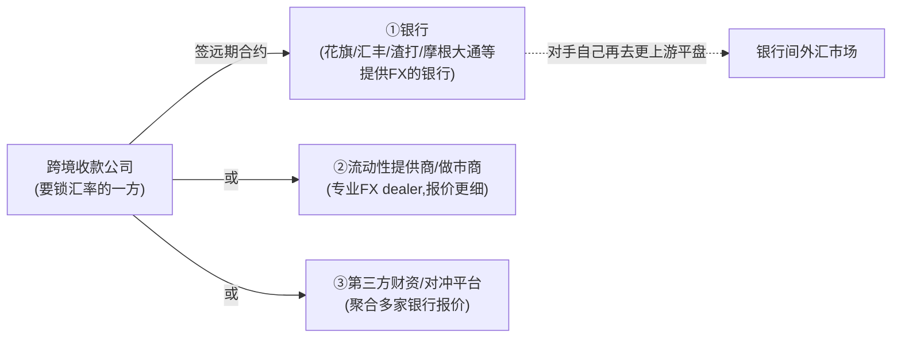

| 对手 | 是谁 | 说明 |
|---|---|---|
| **①银行** | 提供 FX 的商业/投行 | 最主流。收款公司先在银行开 **FX 授信额度**，再签即期/远期/掉期 |
| **②流动性提供商(LP)** | 专业 FX 做市商 | 点差更优，量大的玩家直连 |
| **③财资/对冲平台** | treasury/FX SaaS | 帮中小机构聚合多家银行报价 |

> 🔑 **本质**：你锁住了价，**对手承接了你转移出去的汇率风险**（它再去银行间市场自己平盘）。因无中央交易所，远期带**交割对手违约风险**，故需**授信/保证金**。

**(b) 那个价怎么定——不是猜涨跌，是"利率平价"算出来的。** 🔧 这是对远期最大的认知纠偏:

```
远期汇率 ≈ 即期汇率 ×（1 + 报价货币利率 × 天数/360）/（1 + 基础货币利率 × 天数/360）
```

> **为什么是这个公式（无套利）**：想要"90 天后用美元换人民币"，有两条等价路径——**A. 现在即期换成人民币、存 90 天吃人民币利息**；**B. 签 90 天远期、到期再换**。若两条结果不等，就有人无风险套利、市场瞬间抹平。**让套利消失的那个远期价 = 公式算出的数**。所以远期价 = 即期价 + **两种货币的利差**（叫 forward points / 掉期点）。

- ⚠️ **掉期点 ≠ 涨跌预测**：远期比即期高/低纯粹反映**利差**，不代表"市场认为人民币会贬"。
- **签约定死的四要素**：① 货币对（如 USD/CNH）② 金额 ③ **交割日** ④ **远期汇率**。到期那天**无论市价多少都按此价交割**。
- **真正"谈"的部分**：公式给出理论中间价，对手在此加一点**点差/信用调整**；量大、授信好的客户拿到的价更贴近理论值——**谈的是点差，不是汇率本身**。

**⑤ 还剩什么问题（边界）：** 对冲本身有成本（点差、远期点、保证金占用）；远期锁死后若汇率反向变动，等于"少赚了"（但这是放弃投机收益换确定性，符合商业模式）；小币种/受管制货币（如人民币离岸 CNH vs 在岸 CNY）远期市场流动性差、可对冲工具有限。

⚠️ **汇率的技术挑战**：
- **实时性**：汇率秒级变动，报价有时效（quote 过期要重新报）。
- **多源聚合**：聚合多家汇率源，选最优/做风控（防异常汇率）。
- **头寸管理**：实时计算各币种净敞口，触发对冲。

☁️ **AWS**：实时汇率管道用 **Kinesis**（流式接入多源汇率）+ ElastiCache（低延迟报价缓存）+ Lambda（计算汇差报价），头寸计算用 **Aurora/Kinesis Analytics** 实时聚合各币种净敞口，**EventBridge** 触发对冲阈值告警（净敞口超限→自动发起即期平盘或远期建仓的工作流，可接 Step Functions 编排）。

> 🎯 **交流要点**：能讲"多币种独立账本+换汇两笔分录+金额用整数防浮点误差+汇率引擎报价时效+**外汇头寸=已承诺未平盘的净敞口**+**即期平盘/远期锁价对冲消除波动、锁住点差利润**"，是跨境账务的核心。汇差是跨境收款公司最大利润来源，汇率引擎+头寸对冲是其核心系统。

---

## 4. 跨境合规：制裁筛查与反洗钱（最硬的跨境技术）

📌 **第一性**：跨境最大的合规风险是**违反制裁**（如给 OFAC 名单上的人/国家付款）——罚款可达数十亿美元甚至刑事责任。所以**制裁名单筛查**是跨境支付的硬性技术。

### 4.1 制裁名单筛查（Sanctions Screening）

🔧 对每笔跨境交易的**收付款人姓名/地址/机构**，比对各国制裁名单（OFAC、UN、EU、HMT），命中则拦截上报。

#### ① 四大名单分别是谁发的、管什么 📌

> ⚠️ 命名口径：常说的 "OFAC/UN/EU/HMT" 不是"某国名单"那么简单，而是**四个不同发布主体**——一个美国机构、一个国际组织、一个区域联盟、一个英国机构。

| 简称 | 全称 | 发布主体 | 属于谁 | 管辖范围（约束谁） | 代表名单 |
|---|---|---|---|---|---|
| **OFAC** | Office of Foreign Assets Control（海外资产控制办公室） | 美国**财政部**下属机构 | 🇺🇸 美国 | **最强、最广**：约束所有美国人/美国实体 + **任何用美元清算**的交易（美元经美国代理行→落入美国管辖，俗称"长臂管辖"） | **SDN List**（Specially Designated Nationals 特别指定国民清单）、Sectoral/Non-SDN 等 |
| **UN** | United Nations Security Council Consolidated List | **联合国安理会** | 🌍 国际组织 | 全体成员国**应**执行（安理会决议），是各国名单的"国际基线" | UN Consolidated List（恐怖组织/特定国家个人实体） |
| **EU** | EU Consolidated Financial Sanctions List | **欧盟**（理事会 Council of the EU） | 🇪🇺 欧盟 27 国 | 约束欧盟境内主体及欧盟管辖交易 | EU Consolidated List（CFSP 框架下） |
| **HMT** | His Majesty's Treasury — OFSI（Office of Financial Sanctions Implementation） | 英国**财政部**（具体由 OFSI 执行） | 🇬🇧 英国 | 约束英国境内主体及英镑/英国管辖交易（脱欧后独立于 EU 名单） | UK Sanctions List |

> 🔑 **为什么四个都要查**：一笔跨境交易常**同时触及多个法域**——美元清算→落 OFAC；经欧盟银行→落 EU；英国主体→落 HMT；联合国是基线。**只要交易链路碰到哪个法域，就得过哪个名单**。OFAC 因美元霸权"长臂"最广，是重中之重。其他还有各国本地名单（如 AU DFAT、CA、日本、中国相关清单等），大机构会订阅一个**合并库（consolidated）**覆盖全部。

#### ② 企业怎么获取、怎么定期更新名单 🔧

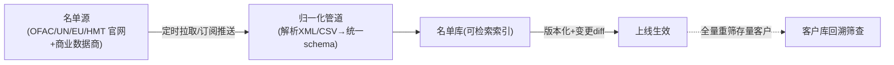

- **两种获取途径**：① **直接从官方**免费下载——OFAC/UN/EU/HMT 都提供机读格式（XML/CSV/JSON），OFAC 还有 SDN 的多种格式与 delta（增量）文件；② **买商业数据商的合并库**——如 **Dow Jones Risk & Compliance、Refinitiv World-Check、LexisNexis、ComplyAdvantage** 等，它们把全球数百个名单 + PEP（政治公众人物）+ 不良媒体（adverse media）**清洗归一、去重、补别名**后统一推送（中大型机构基本都买，因为自己维护几百个源不现实）。
- **更新机制**：名单**不定期更新**（OFAC 可能一天多次），所以不能手动——要**自动定时拉取（如每小时）或订阅推送**，下载后经 ETL 归一化、做**变更 diff**（新增/删除/修改了哪些条目）、**版本化**后上线。
- **关键动作：变更后回溯重筛（rescreening）**。名单一更新，不只是筛新交易——还要**把存量客户/历史在途交易全量重筛一遍**（昨天合规的客户今天可能上了名单）。这是合规硬要求，也是算力大头。

#### ③ 合规怎么执行筛查——什么时候、什么方式、怎么做 🔧

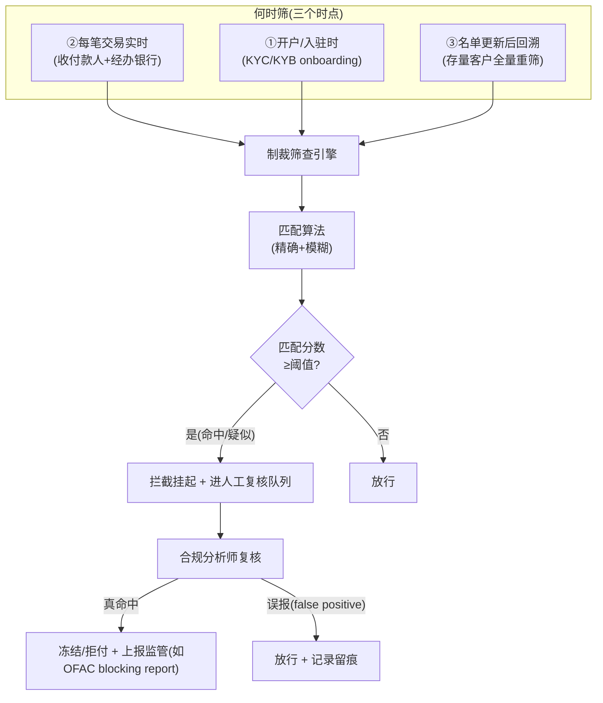

- **什么时候筛（三个时点）**：① **开户/入驻时**（KYC/KYB，把客户与名单比对）；② **每笔交易实时**（交易链路里同步筛收款人、付款人、双方银行/中间行——必须低延迟，否则卡住支付）；③ **名单更新后回溯**（存量全量重筛，见上）。
- **什么方式**：拿交易里的**姓名、别名、地址、国籍、出生日期、机构名、BIC/银行**等字段，与名单条目做**精确匹配 + 模糊匹配**，算一个匹配分数，**超阈值就拦截挂起**、进**人工复核队列**。
- 🔴 **必须穿透到 UBO（最终受益人），不只筛直接对手方**：制裁规避最典型的手法就是**用一家本身干净的壳公司**当门面，背后的实际控制人/受益人却在名单上。所以入驻(KYB)时要**穿透股权结构、把每一层 UBO（通常持股≥25%）都拉出来筛制裁**——只筛交易直接对手方会漏掉这类"干净壳+脏 UBO"。这也是制裁筛查与 KYB 深度耦合之处（KYB 的综合风险分里，"制裁/UBO 命中"是关键一档）。
- **怎么处置（三档，不是二元）**：复核确认**真命中**→冻结/拒付该笔 + 按法域要求**上报监管**（如 OFAC 要求冻结后 10 个工作日内提交 blocking report）；**疑似但证据不足**→转 **EDD（强化尽调 Enhanced Due Diligence）** 补material 再决策（而非直接放行/拒绝）；判定**误报**→放行并留痕（所有决策都要可审计）。

#### ③′ 筛查引擎的实现原理——是规则引擎吗？ 🔧

> ❓ 常见误解："筛查引擎"听起来像 `IF 命中名单 THEN 拦截` 的规则引擎。**其实不是。** 它的**内核是"模糊名称匹配 / 记录链接(record linkage)引擎"——本质是文本相似度搜索 + 打分**；规则只在外围做数据清洗和决策编排。

**为什么不是规则引擎**：制裁筛查的核心难题是"**这个名字是不是名单上那个人**"，而名字有别名/音译/拼写变体/词序颠倒——**没有任何一组 IF-THEN 能穷举 "Mohammed = Muhammad = Mohamed = محمد"**。这是个**相似度/概率**问题，不是布尔条件问题。一句话：**规则引擎答"满足条件吗(yes/no)"；筛查引擎答"有多像(0~100分)"**——后者才是内核。

**引擎真实分层架构**（5 层）：

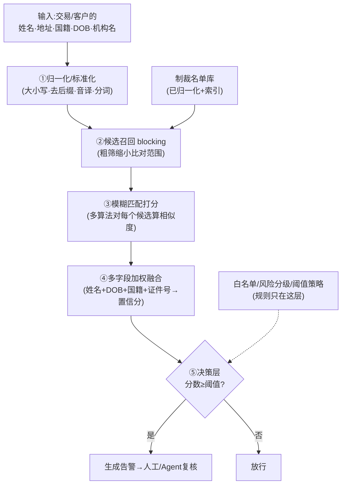

| 层 | 干什么 | 用什么技术 | 是规则吗 |
|---|---|---|---|
| **①归一化** | 名字洗成可比形态：转大写、去公司后缀(Ltd/有限公司)、全半角统一、**音译/转写**(中俄阿名字→标准罗马化)、分词 | 规范化规则 + 转写库 | 是**清洗规则**(非决策) |
| **②候选召回** | 名单几十万~百万条不可能两两比，先粗筛出"可能像"的一小撮 | 倒排索引 / n-gram / 编辑距离索引 | 否(检索) |
| **③模糊匹配打分** | 对每个候选算名字相似度 | **编辑距离**(Levenshtein/Jaro-Winkler) + **语音算法**(Soundex/Metaphone) + **词序无关**(Jaccard/cosine) + 可选语义向量 | 否(算分) |
| **④多字段融合** | 不只看名字——DOB/国籍/地址/证件号**加权融合**成置信分(强标识符匹配则大幅提分) | 加权评分 / 可叠 ML 分类器 | 否(打分) |
| **⑤决策层** | 分数≥阈值→出告警；叠白名单(已判误报对子自动放行)、风险分级 | **← 规则/策略引擎在这里** | **是**(但只管"命中后怎么办") |

> 🔑 **准确表述**：筛查引擎 = **"模糊匹配/相似度搜索引擎"为内核(②③④) + "规则/策略引擎"为外壳(⑤ + ①清洗规则)** 的复合体。**内核技术上最像一个专用搜索引擎 + 记录链接系统，不是规则引擎**；规则决定"像了之后怎么处置"，不决定"像不像"。这正是为什么 §4.1 末尾 AWS 用 **OpenSearch**(自带模糊匹配/编辑距离/语音分析器/n-gram)做匹配引擎、而非规则引擎产品。
>
> 🔧 **演进**：传统是 ②③④ 全确定性算法(可解释、可审计=合规刚需，但误报率 90%+)；进阶在 ④ 用 ML 压误报；前沿(§4.1 ⑥)是**不改内核、在 ⑤ 之后的复核环节用 LLM Agent 读全上下文消歧**。⚠️ **红线**：内核打分必须**可解释**(为什么命中、相似度怎么算)，纯黑盒模型在制裁这种零容忍领域过不了审计——所以确定性匹配引擎至今是骨干，AI 是增强非替代。

#### ④ 当前的困难是什么 ⚠️

- **核心矛盾 = 模糊匹配的松紧权衡**：名字有**别名、音译、拼写变体、顺序颠倒**（"Mohammed" vs "Muhammad"、中文名多种罗马化）——必须模糊匹配（编辑距离、语音算法 Soundex/Metaphone、分词）。但**太松→海量误报**（好交易被拦，体验差+人工成本爆炸）；**太紧→漏掉真名单**（合规风险，巨额罚款）。
- **误报率极高是行业老大难**：🔧 业界普遍口径，**制裁筛查的误报率常高达 90%~95%+**（命中告警里绝大多数是同名/近似的无辜者）——合规团队大量人力耗在人工清理误报上。
- **数据脏 + 多语言**：交易里的名字字段缺失/简写/混合语言/全半角/含公司后缀（Ltd/有限公司），名单里同一人有几十个别名——**实体歧义**严重。
- **上下文缺失**：单看名字无法区分"名单上的张三"和"另一个张三"，需结合国籍、地址、生日、关联关系才能判断，但传统规则引擎不擅长综合上下文。
- **名单频繁变动 + 回溯算力**：全量重筛存量客户是周期性大计算负担。

#### ⑤ 如何提升筛查准确率 🔧

- **更聪明的匹配算法**：不只编辑距离——叠加**语音匹配**（发音相近）、**音译/转写规则库**（中/俄/阿拉伯名字的标准罗马化）、**分词与词序无关匹配**、**字段加权**（生日/国籍/护照号等强标识符匹配上则大幅提分，仅名字相似则降权）。
- **多字段联合打分**而非只看名字：把姓名 + DOB + 国籍 + 地址 + 证件号综合成一个置信分，显著压误报。
- **白名单/已决策记忆（whitelisting）**：对已人工判定为误报的"客户×名单条目"对子做**留痕复用**，下次同样的命中自动放行（risk-based，需定期复审），避免反复人工。
- **风险分级（risk-based）**：高风险走道（高风险国家/大额/特定行业）从严，低风险从简，把人力集中到真正可疑的告警上。
- **数据治理**：入口处规范化客户数据（统一编码、补全字段），名单侧用高质量商业合并库（别名补全好）。

#### ⑥ 基于 AI Agent 的新工具如何辅助提效 🔧+⚠️前沿

> 🎯 **痛点回到 ④**：90%+ 的误报靠人工逐条清理——这正是 **AI Agent 最能提效的环节**（不是替代合规决策，而是**自动化"复核"这个重复判断**）。

- **告警分诊与自动消歧（alert triage）**：让 LLM/Agent 读取告警的**全部上下文**（交易详情、客户档案、名单条目的别名/生日/国籍），自动判断"这是同名误报还是真疑似"，**给出带理由的建议处置 + 置信分**，把明显误报自动降级、把真疑似升级给人——可消化掉大部分 L1 复核工作量。
- **自动生成复核纪要与上报草稿**：Agent 把"为什么判误报/真命中"的依据、引用的字段、参考的名单条目**自动写成可审计的复核说明**，并起草监管上报（SAR/blocking report）初稿，人工只需审核确认（呼应 reference 里 `TechSummit_Quick合规` 的 SAR/STR 起草 Agent、`Agentic_AI_on_payment` 的 KYB 评分 Agent）。
- **实体解析增强**：用嵌入向量/语义匹配做**跨语言、跨写法的实体对齐**，比纯字符串模糊匹配更懂"同一个人/机构"。
- **adverse media / 关联网络**：Agent 自动检索不良媒体、用图分析查关联方（壳公司、UBO、规避制裁的中转方），补传统名单查不到的隐性风险。
- ⚠️ **红线（必须 human-in-the-loop）**：制裁是**强监管、零容忍**领域——AI 可做**分诊、消歧、起草、提效**，但**最终拦截/放行/上报的决策必须由持牌合规人复核担责**，且全流程**可解释、可审计、决策留痕**。AI 给建议+理由+证据，人拍板。这与 reference PPT 反复强调的"全程 human-in-the-loop"一致。

⚠️ **技术难点小结 = 模糊匹配的松紧权衡 + 海量误报**（见 ④），这是制裁筛查一切优化的核心矛盾。

☁️ **AWS**：制裁筛查用 **OpenSearch**（内置模糊匹配/编辑距离/同义词/语音分析器）做名单匹配引擎，名单库经 **Glue/Lambda** ETL 归一化后**定期更新**到 OpenSearch 并做版本化；筛查服务用 **Lambda/ECS**（在交易链路上低延迟同步筛查）；**Comprehend** 辅助实体识别/多语言名称处理；**回溯重筛**用批处理（Batch/EMR）；**AI Agent 告警分诊**可用 **Bedrock**（LLM 读上下文做消歧+生成复核纪要/上报草稿，AgentCore 编排），决策结果回写审计库（呼应 reference 的 KYB/AML Agent 案例，全程 human-in-the-loop）。

> ⚠️ **与 reference PPT（`TechSummit_Quick合规`）的差异（交叉核对结论）**：PPT 把制裁筛查嵌在 **KYB 评分 Agent**（含 World-Check 命中 + UBO 穿透 + 综合 72/100 分）与 **AML 告警 Agent**（自动起草 SAR/STR）里，与本节 ⑥ 的 AI 提效方向**一致、互证**。但有三点本节有意补全/留意：① PPT 的"持续盯"是**交易监控(AML)**，**缺"名单更新后对存量客户回溯重筛(rescreening)"**这一制裁硬动作（见 ②）；② PPT 演示聚焦"**复核提效(治标)**"，但它手里的牌（大模型 + World-Check 富字段：DOB/国籍/别名/关联实体）**完全有能力延伸到"源头多字段联合打分、降低告警量(治本)"**（见 ⑤）——只是受**制裁"宁可错杀"的监管文化 + 初筛环节的可解释性要求**，AI 在源头能砍的幅度有限，业界更倾向把 AI 放在**有人兜底的复核环节**。所以不是"做不到治本"，而是"**治本的空间被合规红线压窄了**"；③ PPT 的 XPay/星辰/鸿运及 PSO-N02、S$5M、World-Check 命中数均为**虚构脱敏演示设定**，引用时只取其"工作流/Agent 模式"，**数字不可当事实**。详见 `reference/PPT修改建议_TechSummit_Quick合规.md`。

### 4.2 反洗钱（AML）与外汇申报

🔧
- **AML**：监测可疑交易模式（拆分、异常频率、高风险国家），上报可疑活动报告（SAR）。
- **外汇申报**：中国向 SAFE（外管局）申报跨境收支——交易真实性核验、限额管理、国际收支申报。
- ☁️ **AWS**：AML 模式监测用 SageMaker/Fraud Detector + 图分析（Neptune，识别关联交易团伙，呼应 reference PPT 的 GNN）；申报数据管道用 Glue/Athena。

> 📖 制裁/AML/KYC 的体系化讲解见模块6 横向专题；reference PPT 总结里有 KYB/反欺诈 Agent 的 AWS 案例。

---

## 5. 跨境对账：多方多币种多时区

🔧 跨境对账比境内难得多：
- **多方**：代理行、清算系统、卡组织、各币种渠道
- **多币种**：USD/CNY/EUR… 各自对账 + 换汇损益归因
- **多时区**：各系统结算时点不同，T+N 不一致
- **FX 损益归因**：差异里要分清是"汇率波动"还是"真差错"

☁️ **AWS**：S3 存各方多币种对账文件 + Glue/EMR/Athena 大规模比对（复用模块0对账架构）+ Step Functions 编排 + SageMaker（可辅助 FX 损益归因分析，呼应 reference PPT 的"多币种对账 Sub-Agent"）。

---

## 6. 完整技术架构图

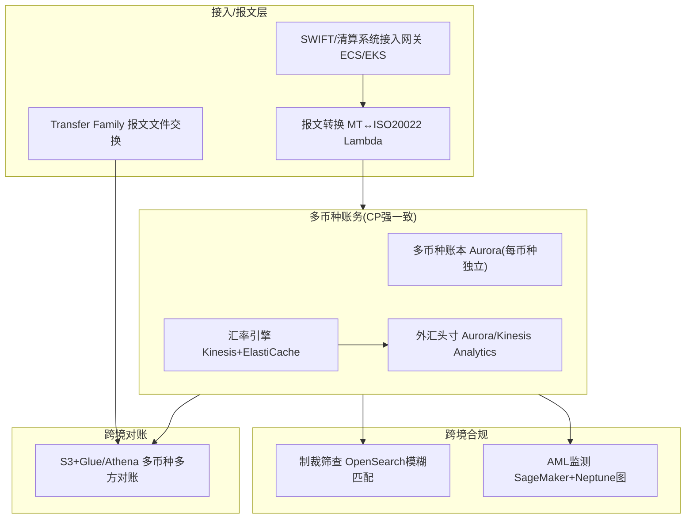

| 跨境能力 | ☁️ AWS |
|---|---|
| SWIFT/清算系统接入 | ECS/EKS 协议网关 + Transfer Family + MQ/MSK |
| 报文转换 MT↔ISO20022 | Lambda/ECS |
| 多币种账本(强一致) | Aurora（每币种独立账户，整数最小单位） |
| 汇率引擎/报价 | Kinesis（多源流）+ ElastiCache（低延迟报价） |
| 外汇头寸/对冲告警 | Aurora/Kinesis Analytics + EventBridge |
| 制裁名单筛查 | **OpenSearch（模糊匹配）** + Comprehend |
| AML/反洗钱 | SageMaker/Fraud Detector + Neptune（图） |
| 跨境对账 | S3 + Glue/Athena + Step Functions |
| 数据驻留合规 | Region 隔离（数据/资金不违规出境） |

> 🎯 **交流杀手锏**：跨境支付公司最头疼的技术是"多套报文标准对接 + 多币种账务 + 制裁筛查（模糊匹配误报）+ 跨时区对账"。你能给出 **ECS协议网关 + Aurora多币种账本 + Kinesis汇率管道 + OpenSearch制裁筛查 + Glue跨境对账 + Region数据驻留** 的成体系 AWS 方案，直击跨境技术痛点。

---

## 7. 本篇小结（背下来）

1. **跨境技术四块**：多报文标准、多币种账务、外汇风险、跨境合规。
2. **报文**：SWIFT MT(MT103/MT202)→ISO 20022(pacs.008/pacs.009)，2025.11 共存期已结束。
3. **多币种账本**：每币种独立复式记账，换汇=两笔分录+汇差，金额用整数最小单位（防浮点资损）。
4. **汇率引擎**：实时多源报价+时效+外汇头寸对冲；汇差是跨境收款最大利润。
5. **制裁筛查是最硬合规**：核心难点是模糊匹配（别名/音译），误报率是核心矛盾——用 OpenSearch。
6. **跨境对账**：多方多币种多时区 + FX 损益归因。
7. **AWS 跨境栈**：ECS协议网关+Aurora多币种账本+Kinesis汇率+OpenSearch制裁筛查+Glue对账+Region数据驻留。

---

## 8. 通向下一层

- **业务全景 + 四套管道 + G20 目标 + 新兴技术 + 引用来源** → `03-crossborder-business.md`
- **一笔货款七环节全链路 + 两个资金池** → `03b-crossborder-collection-deepdive.md`
- **跨境头部企业画像（13 家）** → `03c-crossborder-players/`
- **稳定币如何用链上账本重做跨境** → 模块4
- **制裁/AML/KYC 体系化 + AI 改造** → 模块6 + `reference/summary/`
- **跨境收款公司=跨境PayFac 技术底座** → 模块1 `01-cards-tech-aws.md` §7(PayFac平台) + `01-cards-business.md` §4.6

---

## 附：常见追问（FAQ）

**Q：金额为什么绝不能用浮点数？**
A：浮点数（float/double）有精度误差（0.1+0.2≠0.3）。金融场景哪怕 0.01 的误差累积起来就是资损和对不平的账。所以金融系统用**整数存最小货币单位**（如美元用"分"、日元用"元"因无小数）或定点数（Decimal），换汇时按精度规则四舍五入并明确记录。这是跨境多币种账务的铁律。

**Q：制裁筛查为什么不能精确匹配，非要模糊匹配？**
A：因为制裁名单上的名字有大量变体——音译不同（阿拉伯/俄文名转拉丁字母有多种拼法）、别名、拼写错误、姓名顺序颠倒、公司名简称。精确匹配会漏过"换个拼法"的同一个人（合规灾难）。所以必须模糊匹配（编辑距离、语音算法、分词匹配）。但模糊匹配带来大量误报（正常人名撞上名单），所以要平衡阈值 + 人工复核 + 白名单。OpenSearch 内置这些模糊匹配能力。

**Q：SWIFT gpi 解决了什么，和 ISO 20022 是一回事吗？**
A：不是一回事。ISO 20022 是**报文标准**（内容怎么写）；SWIFT gpi 是 SWIFT 在现有管道上加的**端到端追踪+SLA 服务**——给每笔跨境支付一个全球唯一追踪号（UETR），像快递单号一样能查到钱到哪一棒了、加快到账。一个是"报文格式升级"，一个是"在老管道上加追踪和提速"。⚠️ gpi 本轮未取得一手核查数据，属行业公知（业务篇附A 已知空白已注明）。

**Q：为什么跨境支付公司特别在意"数据驻留"？**
A：跨境涉及多国监管，很多国家要求**本国公民/交易数据不得出境**（数据本地化），中国有外汇数据、个保法要求。所以跨境支付的技术架构要做 **Region 隔离**——数据存在合规要求的区域，用 PrivateLink 等隔离网络。AWS 的多 Region + 合规框架正好支撑这点（reference PPT 里 iPaylinks 答疑反复强调）。
