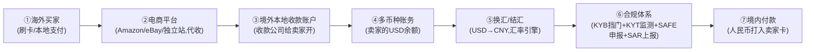
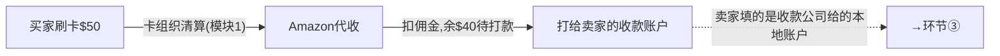
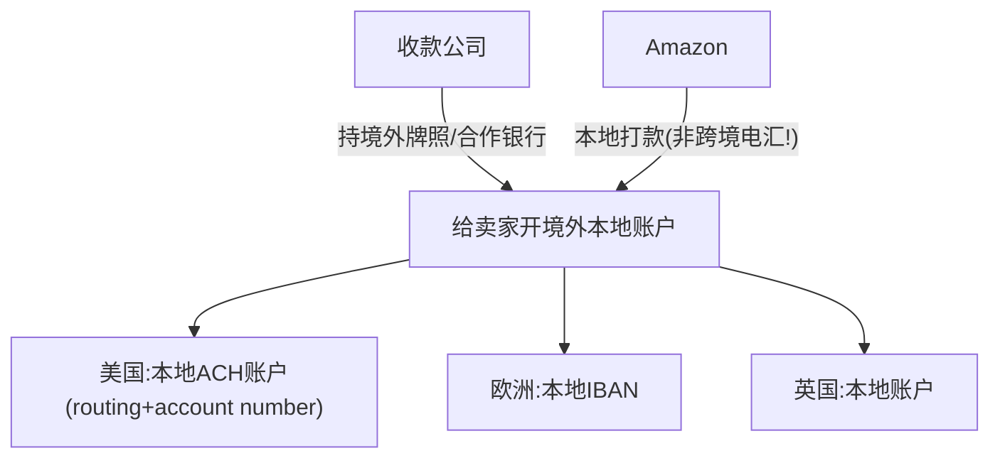
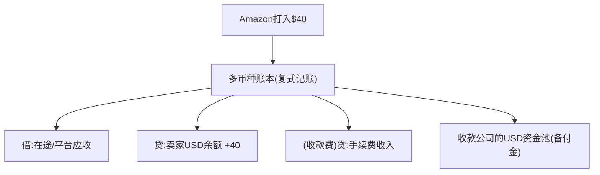
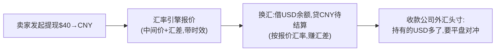
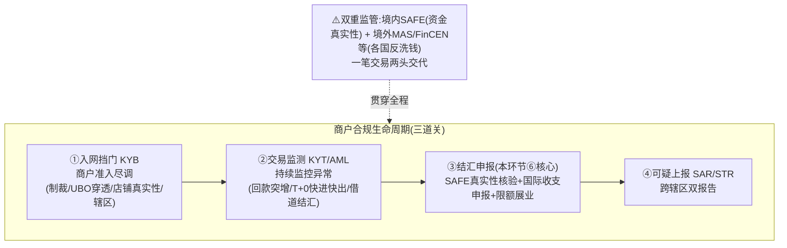
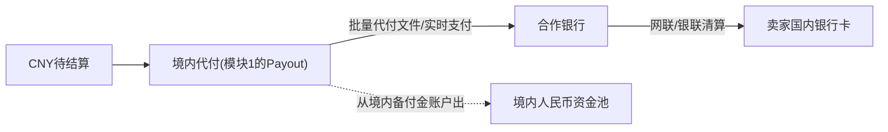
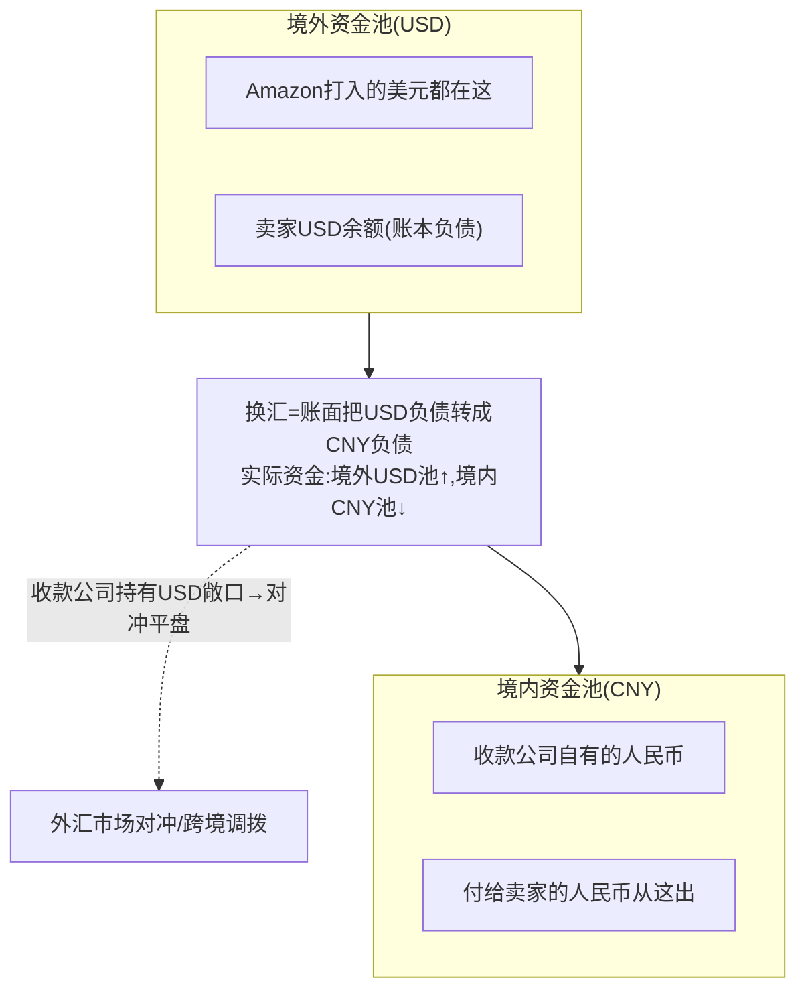
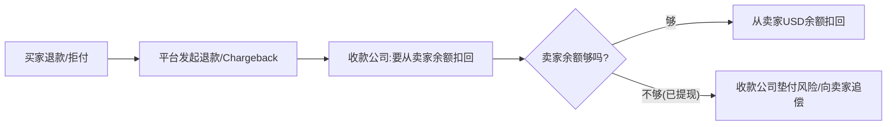
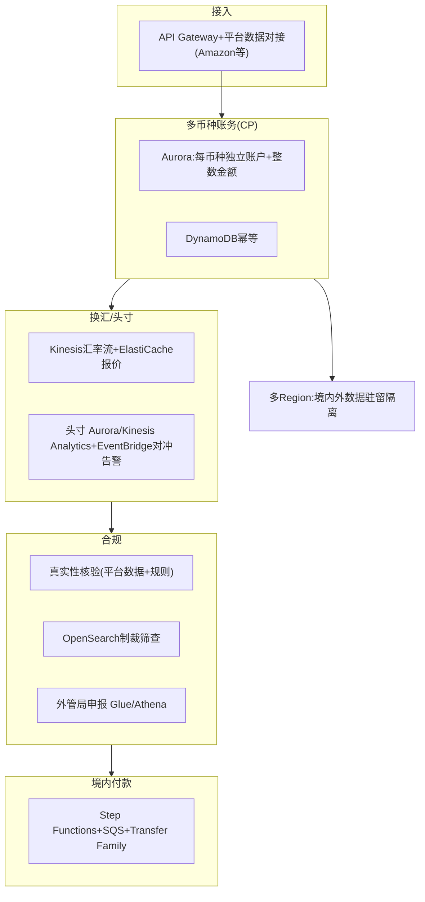

# 模块 3 深化 · 跨境收款全链路：从买家到卖家逐环节剖开

> **学习者**：AWS 技术架构师 · 支付小白
> **本篇目标**：把"一笔跨境电商货款从海外买家到中国卖家"的全链路**逐环节挖透**——每一步的资金流、账务、谁持牌、技术实现、AWS。以连连/PingPong/Airwallex 为例。这是直击"和跨境收款公司深度交流"目标的实战深化。
> **前置**：模块3 业务篇 `03-crossborder-business.md`（§14.2 案例 + §13 中国出海）、模块1深化01b(跨境收款=跨境PayFac)
> **组织方式**：top-down 全链路。零散追问见 FAQ。
> 标注：🔧 通用 · ☁️ AWS · 📌 关键 · ⚠️ 合规/坑点 · 🎯 交流要点
> ⚠️ **可信度**：SAFE 汇发〔2019〕13号、收款服务商"两段式"已核查（来源见业务篇 `03-crossborder-business.md` 附A [10]）；各公司具体牌照/费率见企业画像 `03c-crossborder-players/`，本文为机制层讲解(🔧公知级)。

---

## 1. 全景：一笔货款的完整链路

📌 跨境收款公司（连连/PingPong/Airwallex/Payoneer/万里汇）的本质（模块1深化01b）：**跨境 PayFac + 多币种账户 + 换汇 + 多国牌照**。它把一笔"真跨境"拆成"**境外收 + 境内付 + 中间平头寸**"。

> 🎯 **核心洞察**：钱**从未真正"飞过国境"**——美元始终在美国银行体系内（步骤①-④），人民币始终在中国境内（步骤⑦），中间靠收款公司**自己平外汇头寸**缝合。这就是为什么它比 SWIFT 电汇快、便宜（避开代理行接力）。下面逐环节剖开。

---

## 2. 环节①②：海外买家付款 → 平台代收

🔧 **发生了什么**：买家在 Amazon 刷卡（走卡组织，模块1）或用本地支付方式。**平台（Amazon）先代收**全部货款，扣除平台佣金后，把卖家应得部分准备打给卖家。

📌 **关键**：此时收款公司还没出现——是**平台**在代收。收款公司的角色从"平台要把钱打给卖家"开始（卖家把收款账户填成收款公司给的账户）。

> 🎯 **交流要点**：能区分"平台代收(Amazon)"和"收款公司收款"两个阶段——很多人以为收款公司从买家那收钱，其实是从**平台的卖家打款**那一环接入。

📌 **谁是主商户、谁是子商户？（PayFac 结构，呼应模块1 §4.6）**：
- **主商户(master merchant) = 收款公司（连连）**：在境外注册的"大商户"。
- **子商户(sub-merchant) = 中国卖家**：挂在收款公司主商户号下。
- ⚠️ **中国卖家的双重身份**：在 **Amazon 眼里**是"Amazon 平台卖家"（链路A，Amazon 收单，连连不参与）；在 **连连眼里**是"连连的子商户"（链路B，连连 PayFac）。**两条链路，"商户"指代不同**——连连只在链路B（卖家收款）出现，不碰买家付款那段。这是跨境收款里最容易绕晕的点。

---

## 3. 环节③：境外本地收款账户（收款公司的核心产品）

📌 **这是收款公司最核心的产品**：给中国卖家开一个**境外本地账户**（美国的 ACH/Routing 账户、欧洲的 IBAN 等），让 Amazon 能像给本地卖家打款一样把美元打进来。

🔧 **为什么是"本地账户"是关键**：
- Amazon 给这个账户打款，对 Amazon 来说是**美国境内的本地转账（ACH）**——快、便宜、Amazon 无感知。
- 美元此时**进入收款公司在美国的银行账户体系**（收款公司持美国 MSB/MTL 牌照或合作持牌银行）。
- ⚠️ **钱还在美国境内，没出境**——这是"两段式"的第一段。

📌 **谁持牌**（机制层，具体以各公司披露为准）：
- 美国：MSB（Money Services Business）注册 / 各州 MTL（Money Transmitter License）
- 欧盟：EMI（电子货币机构）；英国：FCA EMI；香港：MSO；新加坡：MAS MPI
- 中国境内：SAFE 跨境外汇业务资质
> 📖 Airwallex 等各家多国牌照矩阵已逐家 deep-research 核查，详见企业画像 `03c-crossborder-players/airwallex.md`（含英FCA EMI/荷兰DNB EMI/新MAS MPI/港MSO/美40州MTL 等）。

☁️ **AWS**：境外本地账户的管理（账户开立、状态、与各国合作银行对接）= 商户管理系统(Aurora)+多区域部署(就近合规)+各国银行接口(ECS网关)。

> 🎯 **交流杀手锏**：能讲"收款公司的核心产品是境外本地收款账户，让平台打款变成本地转账而非跨境电汇"——这是理解整个商业模式的钥匙。多国本地账户矩阵 = 它的核心资产和牌照护城河。

---

## 4. 环节④：多币种账务（卖家的余额）

📌 美元进来后，记在卖家的**多币种账户余额**里（卖家可能同时有 USD/EUR/GBP 余额）。这是模块3技术篇讲的多币种账本。

🔧 **关键账务点**：
- 每个卖家、每个币种**独立余额**，复式记账（模块6.3）。
- 金额用**整数最小单位**（美分），绝不用浮点（模块3/6.3）。
- 卖家的钱沉淀在收款公司的**境外资金池（备付金）**——这是浮存收益来源(模块3三板斧)，也是合规重点(隔离保管)。
- ⚠️ 卖家此时看到的是"USD 余额"，还没换成人民币——**换汇是卖家主动发起的下一步**。

☁️ **AWS**：多币种账本=Aurora(每币种独立账户表,整数金额)+DynamoDB(高频余额读)+QLDB理念/CloudTrail(审计)。

---

## 5. 环节⑤：换汇/结汇（汇差是核心利润）

📌 卖家在 App 点"提现"，选择把 USD 换成 CNY。收款公司的**汇率引擎**报价（中间价+汇差），换汇。

🔧 **关键**（模块3技术篇汇率引擎）：
- **汇差是最大、最隐蔽的利润**：给卖家的汇率 ≠ 银行间中间价，差价就是收益（往往比手续费大）。
- **外汇头寸管理**：收款公司"境外收一堆美元、境内付人民币"，中间有美元敞口，要用远期/即期**对冲平盘**。
- **报价时效**：汇率秒级变，报价有有效期。

☁️ **AWS**：汇率引擎=Kinesis(多源汇率流)+ElastiCache(低延迟报价)+Lambda(汇差计算)；头寸=Aurora/Kinesis Analytics实时净敞口+EventBridge对冲告警。

> 🎯 **交流要点**：能讲"汇差=给客户汇率与中间价的差，是收款公司最大利润；外汇头寸要对冲平盘"——直击其盈利模式和风险管理核心。

---

## 6. 环节⑥：合规体系（最硬的一环，贯穿商户全生命周期）

📌 ⚠️ **合规是跨境收款公司的命门和牌照护城河**。但合规**不是换汇时的一个孤立动作**——它是一套**贯穿商户全生命周期**的体系，且面临**双重监管**。先破一个常见的窄化理解：很多人以为跨境合规就是"结汇时向外管局申报真实性"，那只是其中一个环节。

### 6.0 全景：合规贯穿"入网 → 交易 → 上报"全生命周期 + 双重监管

> 📌 **跨境收款合规 = 三道关 + 双重监管**：① **入网挡门(KYB)** → ② **交易中持续监测(KYT/AML)** → ③ **结汇时申报(SAFE)** → ④ **发现可疑则上报(SAR/STR)**；全程同时受**境内 SAFE + 境外当地监管**双重约束。本环节⑥（换汇结汇）只是第③道关——下面逐道展开。

#### 6.0.1 合规人的一天：四道关在一天里怎么同时开火 🔧

> 💡 上面的"四道关"是**静态体系**；换个**动态视角**——一个合规专员的一天，这四道关是**并发、抢人、不能拖**的。下表用"一天 7 件事"的场景画像，映射回我们的四道关，帮你建立"合规为什么累、AI 能省哪一块"的直觉。
> ⚠️ **可信度**：场景结构（一天多件事并发、三条战线模型）来自 reference 脱敏演示 PPT《重塑跨境支付合规》；**其中的具体数字（告警条数/罚款额/天数）均为演示虚构，本表一律不引用**，只取"场景→哪道关"的机制映射（机制依据见本节 §6.1–§6.5 已核查体系）。

| 一天的场景（合规专员视角） | 对应哪道关（§6.x） | 真实痛点本质 |
|---|---|---|
| **交易告警逐条研判**（规则引擎报一批异常，漏判即罚单） | ② KYT/AML 监测（§6.2） | **误报率高、逐条人工研判**——AML 第一大人力黑洞 |
| **BD 催商户入网**（查制裁/UBO/店铺，一单耗几小时） | ① KYB 准入（§6.1） | **业务要快入网 vs 合规要尽调**的张力；UBO 穿透+店铺真实性最耗时 |
| **境外新规将生效**（如新加坡 MAS 新规，几十页要人读、比对 SOP） | 监管变动（§6.0/§6.5 境外侧） | 多辖区监管一周一变，人读人改 SOP |
| **可疑→起草 SAR**（中+新两地，格式各异都要交代） | ④ SAR 上报（§6.4） | **跨辖区双报告**——同一可疑交易两地各报一次、格式不同 |
| **付款制裁命中**（同名误报一堆，人工逐个清洗放行） | ① 制裁筛查（§6.1，付款实时拦截） | 制裁名单**模糊匹配的同名误报(false positive)**卡住付款 |
| **复审/牌照到期**（没人盯就漏，漏了即违规） | 持续合规+牌照维护（§6.5） | 商户定期复审(ongoing CDD)+多法域牌照续期/报送 |
| **要风险日报**（数据散落多系统，靠人汇总） | 合规报送/管理 | KYB/KYT/制裁数据分散，人工拼 Dashboard |

> 🔑 **两个最值得记的洞察**：
> - **"制裁筛查"和"AML 监测"是两个不同动作，别混**：制裁筛查=比对 OFAC 等名单（含**付款时实时拦截**，痛在同名误报）；AML 监测=看**行为模式**捞可疑集群（痛在告警研判）。演示里它们是一天里**不同时间点的两件事**。
> - **KYB 不是一次性入网动作**：入网后还有**持续尽调(ongoing CDD)+ 定期复审 + 触发式 EDD**——所以"复审/牌照到期"才会单独占一件事。
>
> ⚠️ **这套"合规人的一天"画像仍缺一条中国独有的硬核关**：**SAFE 结汇真实性核验**（§6.3，对接平台订单/物流证明贸易真实）。纯境外视角的演示常省略它，但对**中国出海**收款公司（如连连），它是**不可省的第③道关**——和上表 7 件事并列、甚至更硬。
> 🎯 **交流要点**：能把"合规体系（四道关）"和"合规人的一天（并发抢人的具体场景）"两个视角打通，并指出"制裁筛查≠AML 监测、KYB 要持续做、SAFE 真实性是中国独有硬关"——既懂体系又懂落地痛点，是和合规团队对话的高信号。

### 6.1 入网挡门：KYB 商户准入（在收款链路之前）

🔧 **KYB（Know Your Business，商户尽职调查）**：卖家/商户**入网前**就要查清楚，这是合规的第一道关（在环节①买家付款之前就发生）。核查维度：
- **制裁名单筛查**：商户及其关联方比对 OFAC/UN/EU/World-Check 等名单（模糊匹配，技术篇 §4）。
- **UBO 穿透（Ultimate Beneficial Owner，最终受益人穿透）**：层层穿透股权找到真正控制人——防"借壳"规避制裁/洗钱。
- **店铺/经营真实性**：核验店铺是否真实经营（平台店铺数据、营业资质）。
- **辖区匹配**：商户经营地/注册地是否与申报一致、是否高风险辖区。
- **综合风险评分 → 准入决策**：低风险放行 / 高风险拒绝或转 **EDD（Enhanced Due Diligence，强化尽调）** + 人工复核（human-in-the-loop）。

> ⚠️ **可信度**：KYB 评分维度（制裁/UBO/店铺真实性/辖区）来自 reference 合规 PPT 的业务画像（脱敏演示材料，作"合规怎么做"的机制参考，**不引用其虚构数字**）；UBO/EDD 等为反洗钱通行概念（🔧公知）。体系化讲解见 `_topics/62-compliance.md`。

### 6.2 交易中：KYT/AML 持续监测

🔧 **KYT（Know Your Transaction，交易监测）/ AML（反洗钱）**：商户入网后，**每一笔交易持续监控**异常模式，捞可疑集群。跨境收款典型**异常信号**：
- **回款突增**（单周/单月交易额异常飙升，如某店突增数倍）。
- **资金 T+0 快进快出**（钱进来立刻提走，无真实经营沉淀）。
- **关联店铺集群**（多个店铺资金互通、共用收款账户）。
- **借道结汇 / 贸易背景不真实**（用跨境收款通道为无真实贸易的资金结汇——这是 §6.3 SAFE 真实性要堵的核心风险，在交易监测层就要预警）。

### 6.3 结汇申报：SAFE 真实性核验（本环节⑥的原核心，仍是最硬一环）

📌 换汇结汇涉及**外汇管制**，收款公司必须向**外管局(SAFE)**申报并核验交易真实性。🔧 **关键合规点**（SAFE 汇发〔2019〕13号，📌 已核查·业务篇附A [10]）：
- **交易真实性**：跨境收入必须对应**真实贸易**（订单/物流/平台交易数据佐证）——防虚假交易洗钱/套现。**这是收款公司要深度对接 Amazon 等平台交易数据的根本原因**。
- **国际收支申报**：向 SAFE 系统申报每笔跨境收支。
- **限额与展业**：个人结汇有年度便利化额度，企业按贸易背景。

### 6.4 发现可疑：SAR/STR 上报（跨辖区双报告）

🔧 监测命中可疑后，要起草并上报**可疑交易报告**：
- 境内：向中国**反洗钱监测分析中心 / 人民银行**报 **STR/可疑交易报告**。
- 境外：向当地监管报（如新加坡 **MAS/STRO**、美国 **FinCEN SAR**）。
- ⚠️ **跨辖区双报告**：同一笔可疑交易，因双重监管可能要**同时向境内外两边上报**——这是出海公司合规的独特负担（一笔交易两头交代）。

### 6.5 双重监管：SAFE + 境外当地监管

> ⚠️ 出海跨境收款公司面临**双重监管**：**境内 SAFE 盯资金真实性/外汇管制**，**境外（新加坡 MAS、美国 FinCEN、香港等）各有反洗钱/牌照规矩**。同一笔业务要同时满足两边——这也是为什么这类公司要在多法域持牌（见 `03c-crossborder-players/`）、维护多套合规 SOP。

☁️ **AWS**：KYB 真实性/UBO 穿透=对接平台数据(API)+规则引擎(Lambda)+图分析(Neptune 查关联)+Textract/Bedrock 核验单据(reference KYB Agent 案例)；制裁筛查=OpenSearch(模糊匹配,技术篇 §4)；KYT 监测=Fraud Detector/SageMaker+Neptune(关联集群)；SAFE 申报数据管道=Glue/Athena；多辖区数据驻留=多 Region 隔离。

> 🎯 **交流杀手锏**：能讲"跨境收款合规是**三道关(KYB 挡门→KYT 监测→SAFE 申报)+ SAR 跨辖区上报 + 双重监管**的完整体系，不只是结汇申报一个动作"，并点出"真实性核验=对接平台交易数据、UBO 穿透防借壳、借道结汇是核心风险"——是和中国跨境收款公司聊合规最显专业的点。
> 📌 合规体系化（KYB/KYC/KYT/AML/制裁/Travel Rule/SAR）详见 `_topics/62-compliance.md`；AI 改造合规工作流（监管追踪→KYB 评分→AML 调查→SAR 起草）见 `reference/summary/TechSummit_Quick合规_总结.md`。

---

## 7. 环节⑦：境内付款（人民币到卖家卡）

📌 合规通过后，收款公司通过**境内牌照+合作银行**把人民币打到卖家国内银行卡。这是"两段式"的第二段——**境内付款**。

🔧 **关键**：
- 这一段就是模块1技术篇 §4.7 讲的**Payout（境内代付）**——批量代付走网联/人行小额，或实时支付。
- 钱从收款公司的**境内人民币备付金账户**出（客户资金隔离，中国集中存管央行）。
- ⚠️ **两段式的本质**：境外那段(USD)和境内这段(CNY)**资金不直接连**——收款公司在两边各有资金池，靠换汇+头寸对冲在内部"缝合"。卖家拿到人民币，但那笔美元其实留在了境外资金池(等收款公司平盘)。

☁️ **AWS**：境内Payout=Step Functions编排+SQS重试+Transfer Family(银行文件)+Aurora(备付金账本)，复用模块1 §4.7架构。

---

## 8. 全链路账务视角：钱的"两个池子"

📌 把全链路从账务看，关键是理解收款公司维护**两个资金池**：

> 📌 **第一性**：卖家"提现到账人民币"的瞬间，**没有美元跨境**——收款公司用**自己境内的人民币**先付给卖家，自己**留下境外的美元**（形成美元头寸，再择机对冲或合规调拨回境内）。这就是"两段境内+内部换汇"的资金真相。
>
> 🎯 这解释了收款公司为什么需要**两边的资金池+牌照+外汇头寸管理能力**——它本质是在做"垫资+换汇+头寸管理"的金融生意，不只是"通道"。

---

## 9. 反向链路：跨境退款与拒付怎么处理

⚠️ 正向讲完，别忘反向——跨境的退款/拒付（模块1拒付+模块3跨境）更复杂：

🔧 **关键风险**：如果卖家已经把钱提现结汇走了，又发生买家拒付——收款公司面临**垫付/追偿风险**（钱已换成人民币付给卖家，但美元那头被买家要回）。这是跨境收款公司的核心风险，要靠**风控+保证金+提现延迟(rolling reserve)**管理。

> 🎯 **交流要点**：能问"你们怎么处理卖家提现后又发生拒付的垫付风险？rolling reserve 怎么设？"——直击跨境收款公司的核心风控痛点。

---

## 10. 全链路 AWS 参考架构

| 环节 | ☁️ AWS |
|---|---|
| 平台数据对接/受理 | API Gateway + ECS 各平台接口 |
| 多币种账务 | Aurora(每币种独立,整数) + DynamoDB(幂等) |
| 汇率引擎/头寸 | Kinesis + ElastiCache + Aurora/Kinesis Analytics + EventBridge |
| 真实性核验 | 平台数据API + 规则引擎(Lambda) + Textract/Bedrock(单据) |
| 制裁筛查 | OpenSearch(模糊匹配) |
| 外管局申报 | Glue/Athena 数据管道 |
| 境内Payout | Step Functions+SQS+Transfer Family+Aurora备付金 |
| 数据驻留 | 多Region隔离(境内数据不出境)+PrivateLink |
| 反向拒付/风控 | Fraud Detector+保证金账户(Aurora) |

> 🎯 **交流杀手锏**：能给出跨境收款全链路的 AWS 方案——**境内外多Region数据驻留 + Aurora多币种账本 + Kinesis汇率头寸 + OpenSearch制裁 + 平台数据真实性核验 + Step Functions境内Payout + 拒付垫付风控**——并讲清每环节的合规/资金/技术，是 AWS SA 切入跨境收款公司最有杀伤力的能力。

---

## 11. 本篇小结（背下来）

1. **全链路七环节**：买家付→平台代收→境外本地账户→多币种账务→换汇→合规申报→境内付款。
2. **核心产品=境外本地收款账户**：让平台打款变本地转账(非跨境电汇)，多国账户矩阵是核心资产。
3. **两个资金池**：境外USD池+境内CNY池，换汇时账面转移、实际资金不跨境，收款公司平头寸缝合。
4. **钱从未真飞国境**：卖家提现到账人民币时，用收款公司境内人民币先付，美元留境外形成头寸。
5. **汇差是最大利润**+外汇头寸要对冲；浮存来自境外资金池沉淀。
6. **合规是命门**（贯穿全生命周期的体系，非单点申报）：**三道关**=入网 KYB 挡门(制裁/UBO 穿透/店铺真实性/辖区)→交易 KYT/AML 监测(回款突增/T+0 快进快出/借道结汇)→结汇 SAFE 真实性核验+申报+限额(13号)→可疑 SAR/STR **跨辖区双报告**；全程 **双重监管**(境内 SAFE + 境外 MAS/FinCEN)。
7. **反向风险**：卖家提现后买家拒付→垫付/追偿，靠风控+保证金+rolling reserve。
8. **AWS全链路**：多Region数据驻留+Aurora多币种+Kinesis汇率头寸+OpenSearch制裁+平台数据核验+Step Functions境内Payout。

---

## 12. 通向

- **跨境业务/技术全景** → 模块3 `03-crossborder-business/tech-aws.md`
- **收款公司=跨境PayFac产业链定位** → 模块1深化 `01-cards-business.md` §4.6
- **带引用的来源清单(SAFE/G20/新兴技术)** → `03-crossborder-business.md` 附A
- **跨境头部企业画像(13家)** → `03c-crossborder-players/`
- **稳定币能否绕开这套(on/off-ramp合规)** → 模块4 + `stablecoin_cross_border_compliance.md`
- **合规/风控体系** → 模块6.1/6.2

---

## 附：常见追问（FAQ）

**Q：收款公司到底有没有"跨境汇款"？钱怎么从美国到中国的？**
A：严格说，**单笔交易里钱没有跨境**——美元留在境外资金池，人民币从境内资金池出。收款公司用"境外收美元、境内付人民币"两段境内操作 + 内部换汇平头寸，**等效**实现了跨境。真正的跨境资金调拨（把境外沉淀的美元合规调回境内，或反向）是收款公司**批量、择机、合规**做的（走正规跨境通道+外管局合规），和单个卖家的提现解耦。这就是为什么卖家提现能"快"——不用等真实跨境清算。

**Q：为什么收款公司比银行电汇便宜那么多？**
A：三个原因。①**避开代理行接力**：传统电汇走 SWIFT+多级代理行，每级抽费；收款公司两段境内，没有中间行。②**规模化轧差**：大量卖家的收付可以内部轧差，减少实际跨境调拨。③**汇差替代明费**：表面费率低，利润藏在汇差里。本质是用"规模化的两段境内+内部换汇+头寸管理"替代"一笔真跨境电汇"。

**Q：rolling reserve（滚动保证金）是什么？**
A：收款公司为防"卖家提现后买家拒付导致垫付损失"，会**扣留卖家一定比例的资金一段时间**（如扣 10%、留 90 天）作为风险准备金。期满无拒付才释放。这和模块1收单的拒付风险管理同理——跨境因为拒付追偿更难（跨境、卖家可能跑路），rolling reserve 更重要。高风险卖家/类目的 reserve 比例更高。

**Q：稳定币能取代这套跨境收款吗？**
A：理论上稳定币"转账即结算"可以让美元以 USDC 形式秒到中国卖家——但卡在 **off-ramp**（模块4）：中国卖家最终要人民币落地，撞上外汇管制，境内人民币↔稳定币换汇"合规不可行"。所以稳定币能优化"境外那段"（美元→USDC 跨境快），但"落地人民币"这最后一段仍要走传统结汇+外管局合规——和现在收款公司做的事一样。详见 `stablecoin_cross_border_compliance.md`。
