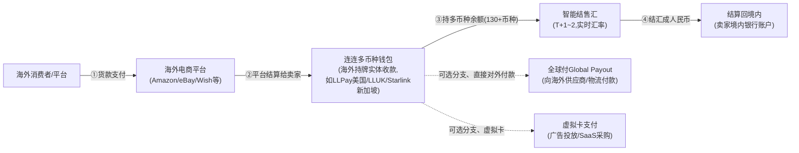
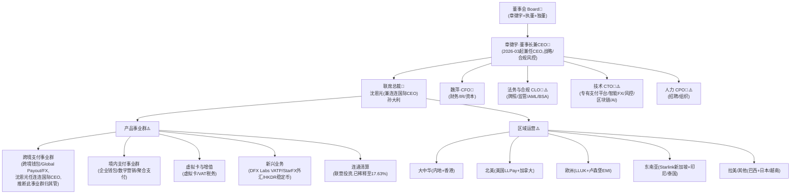
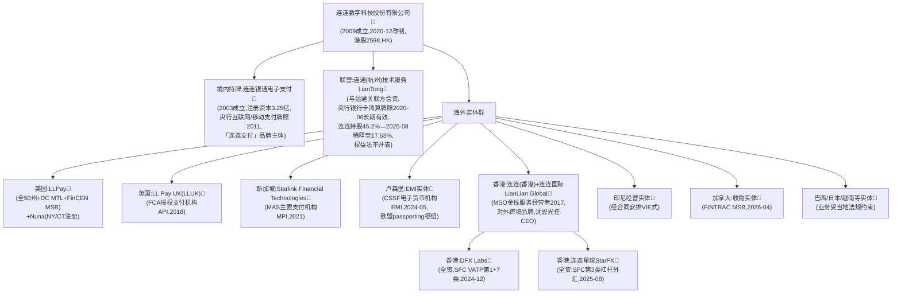

# 连连数字 LianLian DigiTech（2598.HK；出海品牌 LianLian Global）

> 📌 **一句话定位**：中国头部独立第三方跨境数字支付服务商——核心是"跨境收款"(帮跨境电商卖家把海外平台/消费者的钱汇集结算回国)，并通过与运通合资的"连通"切入**境内银行卡清算**。
> 🏷️ **角色归类**：**主要做"跨境收款"**（呼应 `03-crossborder-business §13.3`）；境内清算经合资连通(LianTong)做 switching，非海外本地收单。
> ⚠️ **数据时效**：截至 2026-06。📌 **财务/牌照/管理层经 HKEX 招股书+2024年报+2025中报+公司公告一手核对**（深度研究，见 §15）。

---

## 1. 基本信息
- **成立**：2009-02-02(杭州，前身浙江君宝通信科技) 📌｜**总部**：浙江杭州
- **创始人/董事长**：**章徵宇**(2026-03 起兼任 CEO) 📌
- **当前状态**：**已上市，港交所主板 2598.HK**，2024-03-28 上市(中金+摩根大通联席保荐，招股价≤10.95 港元) 📌

## 2. 背景与沿革（里程碑时间线）📌招股书沿革表
| 时间 | 里程碑 |
|---|---|
| 2009-02 | 成立(前身浙江君宝通信) |
| 2011 | 获央行移动及互联网支付牌照，进军第三方支付 |
| 2013 | 推商户移动支付，**首批进入跨境电商支付**企业之一 |
| 2016 | 启动全球扩张，香港设首个海外办事处 |
| 2017 | 香港 MSO 牌照+设跨境业务中心；与美国运通关联公司签合资协议设**连通**；联合浙大设研究院 |
| 2018 | 扩张英国/爱尔兰/巴西 |
| 2020-06 | **连通获银行卡清算业务许可证(中国首家中外合资卡清算机构)** |
| 2021 | Starlink 获新加坡 MAS MPI；**集齐美国全部 50 州 MTL** |
| 2022 | 为美国电商推多币种钱包；累计 64 项牌照覆盖七大市场 |
| 2023-06 | 首次递表 HKEX；与中远海运物流+普泰集团设合资中普连科技 |
| 2024-03-28 | **港股主板上市(2598)**；5月卢森堡 EMI；12月 DFX Labs 获 SFC VATP |
| 2025-08 | StarFX 获 SFC 第3类外汇牌照；**完成向运通转让连通股权(稀释至17.63%)** |
| 2025-11 | 管理层换届(辛洁辞 CEO、章徵宇接任) |
| 2026-04 | 加拿大 FINTRAC MSB，**牌照达 67 项、客户约 1040 万家** |

> 战略主线：单点第三方支付 → 跨境电商支付 → 全球牌照网络 → 港股上市 → 押注香港虚拟资产/稳定币 + AI 原生。

## 3. 股东与资本 📌招股书一手
- **控股股东组**：章徵宇 + 创连致新 + 吕钟霖(约30.77%, 招股前) + 肖瑟秋，2021-01-01 签一致行动协议，合计约 **38.91%**(招股前)；FY2024 年报截止日章徵宇 SFO 下合计稀释至 **26.84%**
- 早期投资人：红杉/赛智伯乐、光大、中金等(自述，IPO 前目标估值约 150 亿元)
- 2025-07 配售约 3,840 万新股(约占扩大后股本 3.44%)

## 4. 牌照与资质 📌经招股书+年报一手核对（逐个实体）

⚠️ **先讲口径**："牌照及相关资质"组合（**非全为正式金融牌照**，含大量"相关资质"）：64项(2022/2023)→**65项(2024年报，最硬口径)**→67项(2026-04 加拿大后，公司公告)。⚠️ "67项"数字勿照搬，含大量非正式牌照的资质。

**按持牌实体逐个**（📌 招股书"监管概览"+主要子公司表）：
| # | 实体 | 牌照 | 监管/法域 | 时间 |
|---|---|---|---|---|
| ① | **连连银通电子支付**(2003成立, 注册资本3.25亿; "连连支付"品牌持牌主体) | **互联网支付/移动电话支付**(央行《支付业务许可证》) | 中国央行 | 2011 |
| ② | **连通(杭州)技术服务 LianTong**(与运通关联方合资) | **银行卡清算业务许可证(中国首家中外合资,长期有效)** | 中国央行 | 2020-06 |
| ③ | 连连(香港) | 金钱服务经营者 **MSO** | 香港海关 | 2017 |
| ④ | **DFX Labs**(全资) | **虚拟资产交易平台 VATP**(第1类证券交易+第7类自动化交易) | 香港 SFC | 2024-12 |
| ⑤ | **连连星球 StarFX**(全资) | **第3类 杠杆式外汇交易** | 香港 SFC | 2025-08 |
| ⑥ | **LLPay**(美国) | **全美 50 州+DC 货币转移 MTL** + FinCEN MSB(自称唯一持全美 MTL 的中国数字支付商)；Nuna 在 NY/CT 注册 | 美国各州/FinCEN | 2021 集齐 |
| ⑦ | **LL Pay UK**(LLUK) | FCA **授权支付机构 API** | 英国 FCA | 2018 |
| ⑧ | **Starlink Financial Technologies**(2018成立) | **主要支付机构 MPI** | 新加坡 MAS | 2021 |
| ⑨ | 卢森堡实体 | **电子货币机构 EMI**(欧盟 passporting 枢纽) | 卢森堡 CSSF | 2024-05 |
| ⑩ | 印尼经营实体 | 经合同安排(VIE 式)开展支付 | 印尼(外资限制) | — |
| ⑪ | 加拿大收购实体 | **MSB**(外汇/汇款/虚拟货币/支付) | FINTRAC | 2026-04 |
| ⑫ | 日本/越南/巴西等 | 业务受当地法规约束(招股书未逐一展开) | — | — |

⚠️ 完整 67 项逐项清单(各州 MTL 视作多项、各类资质)公司未穷举，需查各国监管名录(美 NMLS/MAS/FCA/CSSF/HK SFC/FINTRAC)。

### 4.1 这些牌照对应资金链哪一环？——以「Amazon 卖家收款」为例 🔧+📌

> 🔑 **为什么要这么多牌照**：连连在 Amazon 做的是**"收款通道"**——资金路径 = **Amazon 把美元货款 → 打进连连海外收款账户 → 换汇 → 结售汇成人民币 → 提现到卖家国内银行卡**。这条链**横跨多法域、代持客户资金、做外汇兑换**，每一段都踩在持牌业务上。所谓"60+ 项牌照"本质就是把这条链每一段、每一法域都合规覆盖——没有任何单一牌照能干完整条链，这正是跨境收款的高门槛。

| 资金链环节 | 干了什么 | 对应连连牌照（上表#） | 监管 |
|---|---|---|---|
| **① 海外代收 Amazon 货款** | 在美/欧/港代收并持有客户资金、做资金转移 | 美 **MTL+MSB**(LLPay #⑥)、卢森堡 **EMI**(#⑨)、香港 **MSO**(#③)、英 **API**(#⑦)、新 **MPI**(#⑧)、加 **MSB**(#⑪) | FinCEN/各州、CSSF、HK海关、FCA、MAS、FINTRAC |
| **② 换汇(FX)** | 美元换人民币、130+ 币种兑换 | 各地外汇/汇款资质、香港 **StarFX 第3类**(#⑤) | 对应法域外汇监管 |
| **③ 结售汇+提现回境内** | 外汇结汇成人民币、打进国内卖家账户 | 中国央行 **《支付业务许可证》**(连连银通 #①) + **外管局 SAFE** 跨境结售汇监管 | **PBOC + SAFE** |

> ⚠️ **对中国卖家最要命的两点合规**：① **境内端必须持央行支付牌照 + 受 SAFE 管**——钱要合规进中国、结汇成人民币，绕不开 PBOC《支付业务许可证》和外管局跨境收支/结售汇真实性审核（这也是"二清"在中国是红线的原因）。② **海外端必须持当地资金转移牌照**——在美代收代持客户资金=货币转移业务，没 MTL+MSB 即非法。

### 4.2 关键辨析：连连@Amazon 的「收款通道」≠「收单」（牌照层面本质不同）📌

> ⚠️ 最易被含糊带过的点：**"收款通道"和"收单"是两类不同持牌业务**，碰的钱、担的风险、要的牌照都不同。

| | **收单(Acquiring)** | **连连@Amazon 收款通道** |
|---|---|---|
| **干什么** | **直接受理买家刷卡**——接卡组织、向发卡行发授权/清算 | **不碰买家刷卡**——从"Amazon 已收好、要打款给卖家"那一环接入 |
| **核心牌照** | **收单牌照 + 卡组织会员资格**(对资金清算负最终责任) | **资金转移/电子货币牌照(MTL/MSB/EMI/MSO) + 境内支付牌照 + 外汇结售汇资质** |
| **和卡组织关系** | 必须是 Visa/MC 会员、直连清算 | **不需要**——不接入卡组织清算 |
| **承担风险** | 商户的**拒付/欺诈最终风险** | 主要是**反洗钱/制裁/外汇真实性**风险，不担刷卡拒付 |
| **本质** | "让商户**收得了卡**"(受理+清算) | "让卖家**把海外货款合规换汇拿回国**"(资金转移+换汇+结售汇) |

> 🔑 **一句话**：**收单**解决"买家刷的卡，钱怎么从发卡行授权清算出来"(需卡组织会员+收单牌照)；**连连@Amazon** 解决"Amazon 已收好的货款，怎么跨境换汇合规结汇回中国卖家"(需多法域资金转移牌照+境内支付牌照+外汇资质)，**与卡组织/收单清算完全不沾边**。这正印证 `01-cards-business §4.6.1`：在 Amazon 连连不是收单 PayFac、是"跨境资金转移+换汇结售汇"通道。⚠️ 而在**卖家独立站**场景连连亲自受理刷卡时，才额外需触及收单能力(通常靠当地收单牌照/合作)。

> ⚠️ **可信度**：各持牌实体(LLPay 全美 MTL+MSB、卢森堡 EMI、央行支付牌照、香港 MSO/SFC)均经招股书+年报一手核对(见上表§4)；"收单 vs 收款通道的牌照级区别"属🔧机制性判断，结合卡组织会员制推演，未逐条引用一手监管条文，写正式材料请核 NMLS/CSSF/SAFE 原始牌照范围。

## 5. 定位与商业模式（收入构成）📌2024年报分部一手
**FY2024 总收入 RMB 13.15 亿，按业务线分部**：
| 分部 | 收入 | 占比 | 同比 | 毛利率 |
|---|---|---|---|---|
| **全球支付(跨境)** | 8.078 亿 | 61.4% | +23.1% | **72.0%(高毛利核心)** |
| **境内支付** | 3.429 亿 | 26.1% | +57.1% | **仅 19.7%(拖累综合毛利)** |
| 数字支付小计 | 11.506 亿 | 87.5% | +31.6% | — |
| 增值服务(数字营销/虚拟卡/技术) | 1.462 亿 | 11.1% | +9.5% | — |
| 其他(物业租金) | 0.181 亿 | 1.4% | — | — |
| **综合** | **13.15 亿** | 100% | +27.9% | **51.9%** |

🔧 **收入性质**：年报**未单列 take rate/汇差/利息**。变现率可测算(🔧 非年报披露)：全球支付 8.078亿÷TPV 2815亿 ≈ **0.29%**；境内支付 3.429亿÷TPV 约3.0万亿 ≈ **0.011%**(大额低费率)。全球支付收入含通道费+结售汇汇差(130+币种)，汇差未单列。利息收入受备付金 100% 集中存管压缩。连通清算收入不并表(联营，权益法，持续亏损)。

> ⚠️ **结构性矛盾**：境内支付 TPV 占大头(3万亿)但毛利率仅 19.7%，拉低综合毛利；**高毛利在跨境(72%)，增长靠跨境放量**(2025H1 全球支付 TPV +94% 是亮点)。

## 6. 核心产品与业务范围 📌年报"业务概览"

> 🧭 **本节读法**：§5 讲"靠这些产品怎么赚钱"，本节讲"**每个产品本身**:定位/目标客户/功能/市场位置/核心竞争力/vs 竞品差异化"。先一张**产品全景速查表**，再按层逐个展开。

📌 **产品全景速查表**（归 6 层）：

| 层 | 产品 | 一句话定位 | 在 §5 商业模式的角色 |
|---|---|---|---|
| **A 跨境收款核心** | 跨境钱包/多币种钱包、Global Payout、卡收单 | 跨境电商卖家收款+结汇+对外付款 | 高毛利核心(72%) |
| **B 全球付与外汇** | 全球付(Global Payout)、智能结售汇(FX) | 向海外供应商批量付款、130+ 币种 | 跨境分部核心能力 |
| **C 虚拟卡与增值** | 虚拟卡、聚合支付、VAT 税务 | 企业线上支付/广告投放/税务 | 增值服务分部(11.1%) |
| **D 境内支付** | 企业钱包、数字营销、境内收单 | 企业因公收付费控、营销 | 境内分部(26.1%，低毛利 19.7%) |
| **E 卡清算基础设施** | 连通(LianTong)银行卡清算 | 境内 Visa/MC 竞品、switching | 联营投资(已稀释至 17.63%) |
| **F 新兴/前沿** | DFX Labs(VATP)、StarFX(外汇)、HKDR 稳定币 | 虚拟资产交易、杠杆外汇、稳定币 | 战略押注(尚未规模化) |

---

### 6.A 跨境收款核心层（高毛利 72%，战略主攻）

#### 跨境钱包/多币种钱包 —— 旗舰产品
- **定位/目标客户**：面向中小跨境电商卖家(在亚马逊/eBay/Wish 等平台开店)，这是连连最核心的产品。
- **功能**：① 海外平台(Amazon/eBay 等)货款收入连连多币种钱包 ② 持多币种余额(130+ 币种) ③ 智能结汇回境(T+1~2) ④ 对接物流/税务/ERP ⑤ 虚拟账户收款(本地化收款方式)。
- **市场位置**：🔧 与 **PingPong、Airwallex、万里汇(蚂蚁)、Payoneer** 同列跨境收款第一梯队，FY2024 全球支付 TPV 2815 亿人民币。
- **核心竞争力**：① **牌照网络**(全美 50 州 MTL + 卢森堡 EMI + 境内央行支付)覆盖主流跨境电商市场 ② **130+ 币种结售汇能力** ③ 与全球主流电商平台 API 深度对接 ④ **上市透明**(港股 2598，竞品多未上市) ⑤ 客户规模(2026Q1 约 1040 万家)。
- **vs 竞品差异化**🔧：
  - **vs PingPong**：PingPong 专注跨境收款(无境内央行支付牌照、无卡清算)，费率竞争激进；连连产品线更全(境内+清算+VATP/外汇)、牌照更广，但 PingPong 在纯跨境收款市场份额与连连接近。
  - **vs Airwallex**：Airwallex 澳洲背景、强企业级 API/全球账户/跨境支付基础设施、估值高(>$5B)；连连强在境内牌照根基(央行支付+连通)、中小电商卖家覆盖广。
  - **vs 万里汇**：万里汇背靠蚂蚁生态(支付宝协同、境内牌照完整)；连连差异在全美 50 州 MTL + 连通卡清算 + 港股上市透明度。
  - **vs Payoneer**：Payoneer 美股老牌(NASDAQ PAYO)、全球收款网络成熟、企业级客户多；连连强在中国本土根基、境内结汇通道、与中国电商卖家生态深度绑定。
  - **vs Stripe**：Stripe 主打"面向开发者的收单 API"、不做跨境卖家收款服务商；连连是"**卖家找服务商**"模式(§4 场景② 连连式 vs Connect 对比)——两者主体关系相反、场景不冲突。

> 🎯 **一句话**：连连跨境钱包解决的是"**中国跨境电商卖家怎么把海外平台的货款收回国**"，出发点是卖家本人(卖家是连连的直接客户)；这与 Stripe Connect(平台是客户、卖家是被托管子账户)本质不同。

#### 卡收单(Acquiring)
- **定位**：境内外商户收卡(Visa/MC/银联)，含线上+线下(POS)。
- **功能**：受理 Visa/MC/银联等卡支付，面向商户提供收单通道。
- **市场位置**：🔧 境内卡收单市场被银联商务/拉卡拉/通联支付等传统收单行垄断；海外市场 Stripe/Adyen/Checkout.com 主导。连连卡收单**非主战场**(主力是跨境收款)，是产品线补充。
- **核心竞争力**：与跨境钱包/全球付一体化，商户可"收款+付款+结汇"一站完成。

---

### 6.B 全球付与外汇层（跨境分部核心能力）

#### 全球付(Global Payout)
- **定位/目标客户**：企业需要向海外供应商/个人(如跨境电商平台向海外仓/物流/网红)批量付款。
- **功能**：向 **100+ 国**批量付款(银行转账/电子钱包/本地支付方式)，支持多币种、批量导入、API 对接。
- **市场位置**：🔧 对标 **Payoneer Payouts、PingPong 福贸、Airwallex Global Payouts、Wise Business**。
- **核心竞争力**：① 与收款同栈(商户在连连收到钱、直接用余额对外付) ② 覆盖 100+ 国本地支付方式 ③ 智能路由(自动选最优通道降费率/到账时间)。
- **vs 竞品差异化**🔧：**vs Wise**(欧美 C 端个人汇款起家、透明费率)：连连强 B 端批量付款、与跨境收款一体；Wise 强 C 端体验、欧美市场覆盖。

#### 智能结售汇(Smart FX)
- **定位**：跨境贸易企业多币种结汇换汇需求。
- **功能**：支持 **130+ 币种**、智能报价(实时汇率+点差)、锁汇/远期、API 对接 ERP。
- **市场位置**：🔧 对标银行结售汇、**XTransfer(专注 B2B 外贸结汇)**、Airwallex FX。
- **核心竞争力**：① 与收款/付款同栈、钱在连连体系内流转无需转出银行再换汇 ② 130+ 币种覆盖主流跨境市场 ③ API 深度对接(自动化结汇)。

---

### 6.C 虚拟卡与增值层

#### 虚拟卡
- **定位/目标客户**：企业线上支付/广告投放(Facebook/Google Ads)/SaaS 采购。
- **功能**：API 批量发虚拟卡、单卡设限额/限商户类目、实时控费、对接企业费控系统。
- **市场位置**：🔧 对标 **Stripe Issuing、Marqeta、Airwallex 虚拟卡、易宝/汇付天下(境内)**。
- **核心竞争力**：① 与跨境收款一体(收到的多币种余额直接发卡支付) ② 2024 起贡献增值服务收入增长。
- **vs 竞品差异化**🔧：**vs Stripe Issuing**(发卡行 BIN 赞助、全栈 API)：Stripe 强开发者体验+发卡规模(>100家平台用)；连连强跨境电商场景(广告投放/采购一体化)。

#### VAT 税务 / 聚合支付
- **VAT 税务**：帮跨境电商卖家处理欧盟/英国 VAT 申报(增值服务，外包税务服务商)。
- **聚合支付**：境内商户聚合微信/支付宝/银联等支付方式。

---

### 6.D 境内支付层（低毛利 19.7%，拖累综合毛利）

#### 企业钱包
- **定位**：企业因公收付费控(差旅/餐饮/物流报销/工资代发)。
- **功能**：企业充值到连连钱包、员工刷企业钱包消费、自动对账/报销/费控。
- **市场位置**：🔧 对标 **分贝通、易快报、汇联易**等企业费控 SaaS。
- **核心竞争力**：连连自有央行支付牌照、可直接做资金账户，无需对接第三方支付。
- ⚠️ **问题**：境内支付 TPV 占大头(3 万亿)但毛利率仅 19.7%，原因是大额低费率(企业 B2B 支付、工资代发等单笔金额大但费率极低)。

#### 数字营销
- **定位**：商户营销工具(券/积分/会员)。
- 🔧 境内支付配套增值服务，非核心产品线。

---

### 6.E 卡清算基础设施层（联营投资，已稀释至 17.63%）

#### 连通(LianTong)银行卡清算
- **定位**：**境内首张且唯一的中外合资银行卡清算牌照**(2020-06 央行颁发，长期有效)——与银联竞争、为 Visa/MC 提供境内 switching。
- **功能**：银行卡清算网络(授权路由/清算结算/转接交换)，服务发卡行与收单行。
- **市场位置**：📌 **境内卡清算三家**(银联/网联/连通)之一；银联垄断、网联专注线上、连通为中外合资开放通道(Visa/MC 可经连通在境内落地)。
- **股权结构**：📌 连连数字原持 45.2% → 2025-08 完成向运通转让、稀释至 **17.63%**(运通系控股，联营不并表、权益法核算)，确认约 **16 亿一次性处置收益**(计入 2025H1 净利)。
- **核心价值**：① **境内首张中外合资卡清算牌照**(战略稀缺性) ② 与运通战略绑定(运通在华落地需连通 switching) ③ **但已稀释至财务投资、退出经营控制**(2025-08)。
- ⚠️ **风险**：连通自设立以来持续亏损(联营投资损失)，股权稀释后不再是连连主营、仅作财务投资。

---

### 6.F 新兴/前沿层（战略押注，尚未规模化）

#### DFX Labs —— 香港虚拟资产交易平台(VATP)
- **定位**：香港持牌虚拟资产交易平台(第 1 类证券交易 + 第 7 类自动化交易)。
- **功能**：法币出入金、BTC/ETH/USDT 等交易、托管。
- **市场位置**：📌 香港 SFC 已颁约 5 张 VATP 牌照(OSL/HashKey/DFX Labs 等)；全球对标 Coinbase/Binance(合规交易所)。
- **牌照获取**：📌 2024-12 获 SFC VATP，连连是中国上市支付公司中首家获 VATP 的。
- **战略意义**：押注香港虚拟资产中心、稳定币合规化，与 §6.F HKDR 稳定币协同。
- ⚠️ **风险**：VATP 业务尚未规模化、2024/2025 未单列收入，仍在牌照获取/业务搭建期。

#### StarFX —— 香港杠杆式外汇交易
- **定位**：零售/机构外汇保证金交易(杠杆)。
- **牌照获取**：📌 2025-08 获 SFC 第 3 类牌照。
- **市场位置**：🔧 对标 OANDA、嘉盛、盛宝银行等外汇经纪商；香港持牌外汇平台竞争激烈。
- **战略意义**：与智能结售汇(FX)形成"即期+杠杆"产品矩阵，服务企业套保/投机需求。

#### 连连国际 × HKDR 港元稳定币
- **定位**：📌 2025-05 香港《稳定币条例》通过后，连连国际与圆币科技合作发行**港元稳定币 HKDR**，接入 DFX Labs VATP。
- **功能**(自述，⚠️ 未独立核实)：1:1 港元锚定、储备透明、跨境支付/贸易结算。
- **市场位置**：🔧 香港稳定币赛道(Circle USDC、Tether USDT、JPEX 稳定币等)；港元稳定币尚处试点期、未大规模商用。
- **战略意义**：押注稳定币成为跨境支付新轨道(呼应主目录"第③套管道")，与 DFX Labs VATP/StarFX 外汇形成"法币-虚拟资产-稳定币"闭环。
- ⚠️ **风险**：稳定币商业化尚早、HKDR 未见大规模采用、多为公司自述。

> 🎯 **一句话**：连连押注"香港虚拟资产/外汇/稳定币"三件套(DFX Labs VATP + StarFX Type3 + HKDR 稳定币)，试图在"传统跨境支付"之外卡位"稳定币/虚拟资产"新轨道——**但 2024/2025 均未规模化，仍是战略投入期**。

---

### 6.G 跨境收款资金流图 📌（核心业务模型）

> 📌 **资金流核心逻辑**：① 海外货款→ ② 电商平台结算→ ③ 连连海外持牌实体收入多币种钱包→ ④ 智能结汇(130+ 币种)→ ⑤ 结算回境内卖家账户(T+1~2)。钱在连连体系内持多币种、可选"结汇回境"或"直接对外付款(Global Payout)/发虚拟卡"。
> 🎯 **连连的价值**：解决"**跨境电商卖家怎么把海外平台的钱收回国**"——持牌收款(全美 50 州 MTL + 卢森堡 EMI + 境内央行) + 多币种钱包 + 智能结汇 + 一站式对外付款，卖家无需自己开海外银行账户、无需自己换汇。

## 7. 业务区域 📌按大区+国家+现状

> 🧭 **读法**：按"规模分量 → 牌照根基 → 业务重点 → 主要客户"逐区拆。⚠️ **各区收入占比连连未披露**(年报仅分"全球支付/境内支付"，未按地理区域细分)，"规模分量"为结构判断+牌照布局+公开动作，非精确营收数字。

📌 **区域速查表**：

| 区域 | 规模分量 | 牌照根基 | 业务重点 | 主要客户 |
|---|---|---|---|---|
| **大中华(内地)** | **核心基本盘**(总部+境内牌照根基) | 央行互联网/移动支付+连通卡清算(已稀释) | 跨境收款结汇回境、境内支付(企业钱包)、连通清算 | 中小跨境电商卖家(亚马逊/eBay/Wish 中国卖家) |
| **大中华(香港)** | **新兴战略前沿**(2016 首个海外办事处→现为虚拟资产/稳定币枢纽) | MSO+DFX Labs VATP+StarFX Type3 | 虚拟资产交易、杠杆外汇、HKDR 稳定币 | VATP 机构/零售客户(尚未规模化) |
| **北美(美国)** | **跨境收款第一市场**(亚马逊美国站主战场) | LLPay 全 50 州+DC MTL+FinCEN MSB | 收款+多币种钱包+全球付 | 中国卖家(亚马逊美国站/独立站)、美国本土电商 |
| **北美(加拿大)** | **扩张中**(2026-04 新增) | FINTRAC MSB(外汇/汇款/虚拟货币/支付) | 深耕北美、补全覆盖 | 跨境电商卖家 |
| **欧洲** | **第三据点**(卢森堡 EMI 为 passporting 枢纽) | LLUK FCA API+卢森堡 EMI(2024-05) | 欧盟本地收款+欧洲卖家结汇 | 中国卖家(亚马逊欧洲站)、欧洲本土商户 |
| **东南亚** | **扩张中**(新加坡 MPI+印尼/泰国) | Starlink MAS MPI+印尼实体(合同安排) | 本地收款+东南亚电商(Lazada/Shopee) | 中国卖家+东南亚本土商户 |
| **拉美/其他** | **新兴**(巴西 2018+日本/越南) | 各国本地运营(牌照未逐一披露) | 本地收款+全球付 | 跨境电商卖家 |

---

### 7.1 大中华(内地) —— 核心基本盘

- **规模/分量**：📌 **总部杭州**，境内牌照根基(央行支付+连通卡清算)，境内支付 FY2024 收入 3.429 亿(占 26.1%)、TPV 约 3 万亿——**TPV 占大头但毛利率仅 19.7%，拖累综合毛利**。
- **牌照根基**：① **连连银通**持央行《支付业务许可证》(互联网/移动电话支付，2011) ② **连通(LianTong)**持银行卡清算业务许可证(2020-06，中外合资唯一，连连已稀释至 17.63%)。
- **业务重点**：① **跨境收款结汇回境**——中小跨境电商卖家把海外货款(亚马逊/eBay 等)经连连海外实体收款、结汇后回境内银行账户，这是连连核心价值链的"落地一端" ② **境内支付**(企业钱包/数字营销/聚合支付)——大额低费率、毛利薄 ③ **连通卡清算**——为 Visa/MC 提供境内 switching，但已退为财务投资。
- **主要客户**：📌 **中小跨境电商卖家**(在亚马逊/eBay/Wish 等平台开店、需收款结汇回国的中国商户)——2026Q1 累计约 **1040 万家客户**，绝大部分在此类。

### 7.2 大中华(香港) —— 新兴战略前沿

- **规模/分量**：📌 **2016 首个海外办事处** → 现为**虚拟资产/外汇/稳定币新业务前沿**——DFX Labs(VATP，2024-12)/StarFX(Type3，2025-08)/连连国际(HKDR 稳定币)落地香港。⚠️ 2024/2025 均未单列收入，仍是战略投入期。
- **牌照根基**：① 连连(香港)**MSO**(金钱服务经营者，香港海关，2017) ② **DFX Labs VATP**(SFC 第 1+7 类，2024-12) ③ **StarFX 第 3 类**(杠杆式外汇交易，2025-08)。
- **业务重点**：① **虚拟资产交易**(DFX Labs VATP，法币出入金+BTC/ETH/USDT 交易) ② **杠杆外汇**(StarFX，零售/机构外汇保证金) ③ **港元稳定币 HKDR**(连连国际×圆币科技，自述未独立核实，接入 VATP)——押注"香港虚拟资产中心"政策红利。
- **主要客户**：⚠️ VATP/外汇/稳定币均未规模化，客户未披露。

### 7.3 北美(美国) —— 跨境收款第一市场

- **规模/分量**：📌 **跨境收款第一市场**(亚马逊美国站是全球最大电商市场、中国卖家主战场)——推断美国贡献全球支付 TPV 最大份额(FY2024 全球支付 2815 亿、2025H1 1985 亿/+94%)。
- **牌照根基**：📌 **LLPay 持全美 50 州+DC 货币转移牌照(MTL)** + FinCEN **MSB**(公司自称"唯一持全美 MTL 的中国数字支付商")；Nuna 在 NY/CT 注册。
- **业务重点**：① **收款**(亚马逊美国站/eBay/独立站 Shopify 商户收款进连连多币种钱包) ② **多币种持有+结汇** ③ **全球付**(向美国仓储/物流/供应商付款) ④ **虚拟卡**(美国 Facebook/Google Ads 广告投放)。
- **主要客户**：① **中国跨境电商卖家**(亚马逊美国站主力) ② **美国本土电商/企业**(2022 起推多币种钱包面向美国企业)。

### 7.4 北美(加拿大) —— 扩张中

- **规模/分量**：⚠️ **2026-04 新增**(收购实体获 FINTRAC MSB)，"深耕北美关键落子"(公司口径)，体量尚小。
- **牌照根基**：📌 **FINTRAC MSB**(外汇/汇款/虚拟货币/支付服务，2026-04)。
- **业务重点**：补全北美覆盖(美国+加拿大)，服务加拿大本土商户+中国卖家(亚马逊加拿大站)。

### 7.5 欧洲 —— 第三据点

- **规模/分量**：📌 **卢森堡 EMI 为欧盟 passporting 枢纽**(2024-05)，英国 FCA API(2018)——覆盖欧盟/EEA/英国。推断欧洲贡献全球支付 TPV 第二大份额(仅次美国)。
- **牌照根基**：① **卢森堡 EMI**(CSSF，2024-05，可 passporting 通行欧盟 27 国) ② **LLUK FCA 授权支付机构(API)**(2018，英国脱欧后独立持牌)。
- **业务重点**：① **欧盟本地收款**(亚马逊欧洲站/eBay 欧洲) ② **欧洲卖家结汇**(欧元→人民币) ③ **VAT 税务**(帮中国卖家处理欧盟 VAT 申报，增值服务)。
- **主要客户**：① **中国跨境电商卖家**(亚马逊欧洲站主力) ② **欧洲本土商户**(少量)。

### 7.6 东南亚 —— 扩张中

- **规模/分量**：⚠️ **扩张中**，新加坡 MPI(2021)+印尼/泰国——东南亚电商市场(Lazada/Shopee)增长快，是连连重点扩张区。
- **牌照根基**：① **Starlink Financial Technologies 持新加坡 MAS 主要支付机构(MPI)**(2021) ② **印尼经营实体**(经合同安排，VIE 式，外资限制) ③ 泰国(业务受当地法规约束，招股书未展开)。
- **业务重点**：① **本地收款**(Lazada/Shopee 等东南亚电商平台) ② **东南亚本土商户**(新加坡/印尼/泰国本地企业) ③ **中国卖家**(东南亚电商出海)。
- **主要客户**：中国卖家+东南亚本土商户(各半)。

### 7.7 拉美/其他 —— 新兴

- **拉美**：📌 **巴西**(2018 进入)——拉美最大电商市场(Mercado Libre 等)，本地收款+全球付。
- **其他**：**日本/越南**(招股书提及，牌照/规模未逐一披露)。
- **业务重点**：本地收款+全球付，服务中国卖家出海拉美/亚太。

---

📌 **跨区能力·全球付覆盖**：自述服务 **100+ 国/地区、130+ 币种**——连连可向全球 100+ 国批量付款(Global Payout)，覆盖主流跨境电商/贸易市场。

> 🎯 **一句话**：连连业务区域的核心逻辑是"**跟着中国跨境电商卖家走**"——卖家在哪个平台开店(亚马逊美国/欧洲/日本、eBay、Lazada、Shopee)，连连就去哪里布局持牌实体(全美 50 州 MTL + 卢森堡 EMI + 新加坡 MPI + 印尼/泰国/巴西)，提供"本地收款→多币种持有→结汇回境"全链条服务。**香港**(VATP/外汇/稳定币)是战略新曲线、尚未规模化。

## 8. 规模与数据 📌招股书+年报一手（多年趋势）
- **营收曲线**：2020 **5.885亿** → 2021 6.436亿 → 2022 7.427亿 → 2023 **10.283亿(+38.4%)** → 2024 **13.15亿(+27.9%)** → 2025H1 7.83亿(+26.8%)
- **TPV**：2024 数字支付 **3.3万亿(+64.7%)**(全球支付 2815亿/+63.1% + 境内 3.0万亿/+64.9%)；2025H1 2.1万亿(+32%，全球支付 1985亿/**+94%**)
- ⚠️ **盈亏(关键)**：2022 净亏约 9.17亿、2023 年度亏 6.54亿、**2024 IFRS 仍净亏 1.665亿**(但"经调整年内利润"7869万首次扭亏)；**2025H1 归母净利 15.11亿——但约 16亿为连通股权处置一次性收益，剔除后经营性利润仅 6300万(+85%)**——**主营仅微利刚转正，巨额净利靠一次性收益，勿误读**
- **累计客户**：2024 590万 → 2025H1 790万 → 2026Q1 约 1040万家

## 9. 组织架构 + 管理层 📌招股书+2025-11换届公告

> ⚠️ **可信度分层**：连连已上市、有 HKEX 招股书+年报，但**内部详细组织架构图未公开**。本节区分：**📌 已核实**(高管姓名/头衔、法律实体——来自招股书/年报/公告);**🔧 通行结构**(支付公司普遍职能部门);**⚠️ 推断**(按产品线映射事业群——非连连官方披露)。

### 9.1 高管层(C-Suite) 📌已核实

- **章徵宇** — **董事长兼 CEO**(2026-03 起兼任 CEO，接替辛洁)、创始人、执行董事，任合规风控委员会+战略委员会主席
- **辛洁** — IPO 时 CEO，因个人原因 **2026-03 辞 CEO 转顾问**(2025-11-12 公告)
- **沈恩光** — **联席总裁**(2025-11 起)；**连连国际(LianLian Global)CEO**(2025-03 起)
- **孙大利** — 公司总裁、**联席总裁**(2025-11 起，48 岁)
- **魏萍** — **CFO**(2024 业绩会口径)
- 其他执董：薛强军/朱晓松/王愚
- 独立董事：Chun Chang/黄志坚/林兰芬

### 9.2 整体组织架构(树状图)

> 📌 实线=已核实高管/实体;🔧/⚠️=通行职能部门与推断映射(非官方汇报线)。连连内部以**产品事业群(跨境/境内/新兴)+ 职能中台(财务/法务/合规/技术)矩阵式**运作是合理推断，但具体汇报关系未披露。

### 9.3 法律实体结构(树状图) 📌已核实实体

### 9.4 部门职责与角色 🔧⚠️

> 🔧⚠️ **以下为支付公司通行结构 + 按已知信息推断的还原**(教学用,非连连官方建制)。

**A. 连连数字科技(顶层)——总部职能中台** 🔧通行结构

| 部门 | 职责 | 典型角色 | 角色职责 |
|---|---|---|---|
| **管理层** | 战略决策、对外关系、资本 | **董事长兼CEO章徵宇📌** / 联席总裁沈恩光+孙大利📌 / CFO魏萍📌 | CEO 定战略+合规风控;联席总裁管产品事业群/区域;CFO 管财务/IR/上市公司治理 |
| **财务(Finance)** | 财务/IR/资本/司库 | **CFO魏萍📌** / FP&A / 司库 Treasurer / 会计 | CFO 管 HKEX 披露/融资/估值;司库管备付金(100%集中存管)+多币种资金池 |
| **法务与合规(Legal & Compliance)** | 牌照、监管、反洗钱、风控合规 | CLO🔧⚠️ / 合规官 CCO / BSA Officer / 反洗钱分析师 | 维护 67 项牌照(全美 50 州 MTL/卢森堡 EMI/MAS/FCA/VATP/Type3);BSA Officer 负责 KYC/AML/SAR/OFAC 筛查 |
| **技术(Technology)** | 专有支付平台、智能结售汇、风控、AI | CTO🔧⚠️ / 平台工程 / 算法工程师 / 数据 | CTO 管专有技术平台(支付/FX/风控/真实性核查)+区块链探索+AI 原生战略(2026 明确) |
| **产品(Product)** | 定义产品路线、需求、定价 | CPO🔧 / 产品总监 / PM | 按事业群(跨境/境内/虚拟卡/VATP)负责路线图 |

**B. 连连银通(境内持牌主体)** 📌实体确证,🔧职责还原

| 部门/职能 | 职责 | 角色 |
|---|---|---|
| **持牌运营** | 作为央行互联网/移动支付持牌人,合法收/转资金 | 合规负责人、央行牌照维护 |
| **资金运营(Money Movement)** | 管备付金账户(100%集中存管)、清结算 | 资金运营经理、对账团队 |
| **BSA/AML 合规** | KYC/KYB、交易监测、真实性核查 | BSA Officer、AML 分析师 |

**C. 连通(LianTong)——卡清算联营实体** 📌实体确证

| 部门/职能 | 职责 | 备注 |
|---|---|---|
| **银行卡清算** | 授权路由/清算结算/转接交换,服务发卡行与收单行 | 📌 连连持股 17.63%(2025-08 稀释后),权益法不并表,持续亏损 |

**D. 海外持牌实体群** 📌实体确证

| 实体 | 职责 | 负责人/备注 |
|---|---|---|
| **连连国际(LianLian Global)** | 跨境品牌对外统一门户,协调全球业务 | 📌 **CEO 沈恩光**(2025-03 起,兼联席总裁) |
| **LLPay(美国)** | 全美 50 州+DC MTL 持牌运营,收款+多币种钱包 | 美国牌照合规、资金运营 |
| **LLUK(英国)** | FCA API 持牌运营,欧洲收款(脱欧后独立) | 英国牌照合规 |
| **卢森堡 EMI** | 欧盟 passporting 枢纽,通行 EEA 27 国 | 欧盟 EMI 合规、CSSF 监管 |
| **Starlink(新加坡)** | MAS MPI 持牌运营,东南亚收款 | 新加坡牌照合规 |
| **DFX Labs(香港)** | VATP 虚拟资产交易平台,法币出入金+BTC/ETH/USDT 交易 | SFC 牌照合规、虚拟资产运营 |
| **StarFX(香港)** | 杠杆式外汇交易(零售/机构) | SFC Type3 牌照合规 |
| **印尼/加拿大/巴西等** | 各国本地持牌运营 | 本地牌照合规 |

> 🎯 **看组织架构的三个要点**：① **章徵宇回归一线**(2026-03 接任 CEO，辛洁退居顾问)，创始人重掌经营权；② **沈恩光掌跨境**(兼连连国际 CEO+联席总裁)，跨境是高毛利(72%)战略主攻方向；③ **法律实体 = 牌照地图的镜像**——境内连连银通(央行支付)、联营连通(卡清算、已稀释)、海外 LLPay(全美 50 州 MTL)/LLUK(FCA)/卢森堡(EMI)/Starlink(MAS)/DFX Labs(VATP)/StarFX(Type3)各自承接对应法域持牌运营(与 §4 牌照、§7 区域一一对应)。

## 10. 技术架构特点 📌年报
自建**专有技术平台**：支付/资金转移/全球付款/**智能结售汇(smart FX)**/**智能风控**/真实性核查；与全球电商平台 API 深度对接；用云数据中心(不受中国本地化约束的部分)。前沿：探索**区块链**(关联杭州趣链/超块链 Hyperchain 投资)、**AI/ML**(2024 起嵌入产品，2025/26 明确"**AI 原生 + 全球化**"核心战略)。⚠️ 具体云厂商/微服务架构/技术栈未公开。

## 11. 护城河与差异化
① **牌照网络 + 全美 50 州 MTL 唯一性**(中资同行领先) ② **境内首张且唯一的中外合资银行卡清算牌照(连通)**——但已稀释至 17.63% 退为财务投资 ③ 商户规模(2026Q1 约 1040万客户) ④ 130+ 币种结售汇 ⑤ 运通战略绑定。⚠️ 同行(PingPong/Airwallex/万里汇)在追赶；"67项牌照"含大量资质、数量叙事需警惕

## 12. 主要竞争对手 📌横评综合(定性)
独立第三方跨境支付第一梯队：**PingPong、Airwallex、万里汇(蚂蚁系)、Payoneer、XTransfer(偏B2B)**。
- **牌照**：连连差异化=全球牌照网络+唯一全美 50州 MTL+央行境内支付+连通卡清算(中外合资唯一)+卢森堡EMI+香港VATP/Type3——广度中资领先；PingPong 持多国牌照但**无境内央行支付牌照与卡清算**；万里汇背靠蚂蚁生态+境内牌照；Airwallex 澳洲背景全球 EMI/MTL 强、估值高；Payoneer 美股老牌全球收付
- **产品**：连连产品线最"全"(境内+卡清算+跨境+FX+虚拟卡+VATP/外汇/稳定币)；Airwallex 强企业级 API/全球账户；Payoneer 强全球收款网络；万里汇强电商收款+蚂蚁协同
- ⚠️ 费率/份额/各家最新 TPV 无统一权威口径(连连 TPV 含境内大额，跨境净额需单看全球支付分部)

## 13. 最新动态与风险 ⚠️时效 2025-2026
- 📌 2025-03 沈恩光任连连国际 CEO；完成向运通转让连通股权(稀释至 17.63%，确认约 16亿一次性收益计入 2025H1)
- 📌 2025-05 香港《稳定币条例》通过，连连国际与圆币科技合作发**港元稳定币 HKDR**接入 VATP(⚠️ 自述/媒体，未独立核实)
- 📌 2025-08-21 StarFX 获 SFC 第3类外汇牌照；2025-08 中期业绩(收入 7.83亿/TPV 2.1万亿/归母净利 15.11亿含一次性)
- 📌 2025-11 管理层换届；2026-04-27 加拿大 FINTRAC MSB、牌照达 67、客户约 1040万，推"AI 原生+全球化"
- ⚠️ **风险**：① **盈利质量**——主营仅微利刚转正，2025H1 巨额净利靠连通一次性处置，需看全球支付能否持续放量 ② 境内支付低毛利(19.7%)拉低综合 ③ 监管处罚(见下) ④ 稳定币 HKDR 等多为自述、商业化尚早

## 14. 监管处罚史 📌已核查
- **2024-11-07 央行浙江省分行处罚**：连连银通因**六项违规**(账户管理/清算管理/格式条款/信息披露等)被警告，**没收违法所得 72.9万 + 罚款 445.6万 = 罚没约 518.54万元**(财联社+央行公示)；公司称系 2022 综合检查问题、已整改。同期关联杭州通策支付罚 6万(预付卡)，两家合计约 554.54万
- ⚠️ 海外各法域未查到重大公开处罚(不等于无)；连通股权稀释需经央行事先批准(合规程序非处罚)

## 15. 与本研究 / AWS 对话的衔接
- **可聊**：**唯一港股上市的中国跨境收款龙头**(财报最透明)；**境内首张中外合资卡清算牌照(连通)**及其稀释退出的战略取舍；"扭亏靠一次性收益、主营微利"的盈利质量；香港虚拟资产/稳定币(VATP/Type3/HKDR)新曲线
- **AWS 角度**：智能结售汇/智能风控引擎(SageMaker)、多币种账务一致性、多 Region 数据驻留、KYT/AML、"AI 原生"战略落地(Bedrock/AgentCore)；其明确押注 AI-Native 是云对话的天然切入点

## 16. 来源清单 📌HKEX 一手为主
- **招股书**(2024-03-20)：hkexnews .../2024/0320/2024032000032_c.pdf — 64项牌照/各法域实体/沿革/2020-2022财务/董事/连通+连连银通牌照
- **FY2024 业绩公告**(2025-03-18)：.../2025/0318/2025031801795.pdf — 分部收入/毛利率51.9%(全球72%)/TPV 3.3万亿/65项/卢森堡EMI/DFX Labs VATP/连通稀释17.63%
- **FY2024 年报**(2025-04-22)：.../2025/0422/2025042201365.pdf
- **StarFX 第3类牌照公告**(2025-08-21)：.../2025/0821/2025082100294.pdf
- **央行处罚**(连连银通约518.54万)：财联社 cls.cn/detail/1851849(2024-11，二手)
- **管理层换届**：上海证券报 cnstock.com/commonDetail/588042 + PR Newswire(2025-11-12)
- **加拿大MSB/67项/客户1040万**：新浪财经(2026-04-27，公司公告/二手)
- 中期业绩/竞品横评/HKDR：网易/雪球/搜狐/凤凰(2025-2026，二手，口径不一)
