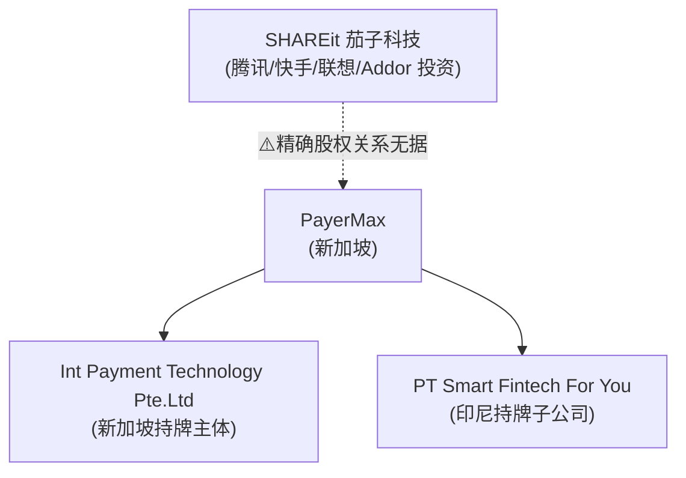

# PayerMax

> 📌 **一句话定位**：**面向新兴市场的一站式跨境收单/代付聚合平台**——帮出海商户（尤其游戏/直播/电商/SaaS）在亚太/中东/拉美用本地支付方式收单(pay-in)、批量代付(payout)、本地收款与资金管理。产业链上扮演"出海商户的全球支付网关/收单聚合服务商"。
> 🏷️ **角色归类**：**以"海外本地收单(Global Acquiring)"为主 + 跨境结算/全球代付**（呼应 `03-crossborder-business §7.1`）。在印尼(BI PJP)、沙特(SAMA PTSP)等**持本地牌照受理当地消费者付款**=典型海外本地收单；客群是"**出海商户（把生意做到海外）**"，而非帮国内卖家把海外钱收回国（与连连/PingPong 主场相反，见 §12）。
> ⚠️ **数据时效**：抓取 2026-06。📌 三张牌照(新/印尼/沙特)+产品线+本地支付方式经监管/官网核；⚠️ **所有规模数(150+国/600+方式/70+币种)均为公司营销自述、未独立核实**；TPV/营收/估值/客户数**全无独立来源**。
> ⚠️ **可信度总则**：📌=监管名册/官网逐字已核；🔧=行业公知/推断；⚠️=营销自述或待核。**绝不编造**——成立年份、母公司股权、UAE 牌照性质、规模数等未核到的显式标注。

---

## 1. 基本信息

| 项 | 内容 | 来源 |
|---|---|---|
| **总部** | **新加坡** | 📌 多源(The Asset/aggregators) |
| **成立年份** | ⚠️ **存疑**：坊间"2020"是假设、"2018"自述时间线**被对抗核查驳回**——本轮无可靠一手 | ⚠️待核 |
| **归属** | 广泛报道**关联 SHAREit（茄子科技）集团**（腾讯/快手/联想/Addor 投资）；⚠️ **精确股权/子公司关系无据** | 🔧 medium |
| **联合创始人** | **汪浒（Wang Hu）**，co-founder（一说 co-founder & President） | 📌 中文二手 |
| **当前状态** | **未上市，无股票代码** | 📌 |

## 2. 背景与沿革 📌+⚠️

| 时间 | 里程碑 | 可信度 |
|---|---|---|
| ⚠️~2020 | 成立于新加坡，背靠 SHAREit（新兴市场出海背景）；以游戏/直播高客单跨境刚需切入新兴市场本地收单 | ⚠️ 年份存疑 |
| **2023-01** | **获新加坡 MAS 大型支付机构 MPI**（实体 Int Payment Technology Pte. Ltd.）| 📌 BusinessTimes+多源 |
| **2023-06** | **获印尼 Bank Indonesia PJP**（子公司 PT Smart Fintech For You）| 📌 The Asset+监管 |
| **2024-09** | **获沙特 Saudi Payments/SAMA 的 PTSP**（支付技术服务商资质）| 📌 |
| 2024-2025 | 密集参展游戏/出海展会(G-STAR/ChinaJoy/Gamescom/新加坡金融科技节)拓客；获 The Asset Triple A 奖 | 📌 |

> ❌ **核查驳回（勿采用）**：① "2018 年成立"（0-3 否决）；② "利雅得设 MENA RHQ、首家亚洲 fintech"（1-2）；③ "首个拿 UAE 牌照的亚洲公司"（0-3）——均未获证实。

## 3. 股东与资本 ⚠️多未公开

- ⚠️ **被定位为 SHAREit 旗下支付板块**（依据高管交叉、媒体报道），但 **SHAREit 与 PayerMax 的精确股权/子公司关系无官方文件确认**（medium）。
- ⚠️ **融资轮次/投资人/估值：无任何公开记录**。
- ⚠️ **纠偏**：坊间"Shopee 系/上海钱进系"提法**未获证实**——现有证据指向 SHAREit，无 Shopee(Sea) 股权关联。

## 4. 牌照与资质 📌分层核实

> 🔑 牌照可信度**分三档**：监管+多源确认（强）> 公司+trade press（中）> 自述（弱）。

| 法域 | 牌照 | 持牌实体 | 可信度 |
|---|---|---|---|
| **新加坡** | **MAS 大型支付机构 MPI**（PSA 最高档、无 SPI 限额；含跨境+境内汇款+收单）| **Int Payment Technology Pte. Ltd.**（2023-01）| 📌 强（多源；⚠️ MAS 名册因 JS 渲染未直查到该实体）|
| **印尼** | **Bank Indonesia PJP** 支付牌照 | **PT Smart Fintech For You**（2023-06）| 📌 强 |
| **沙特** | **Saudi Payments/SAMA 的 PTSP**（支付技术服务商）| —（2024-09）| 📌 强 |
| **香港** | 海关 MSO | — | ⚠️ 中（公司+trade press）|
| **泰国/菲律宾** | 当地支付牌照（BOT/BSP）| — | ⚠️ 中（公司自述）|
| **阿联酋** | ADGM FSRA——⚠️ **可能只是"原则性批准 IPA"、非完整牌照** | — | ⚠️ 待核 |
| 美国/欧盟/中国 | ⚠️ **未查到** MSB/MTL、EMI、中国央行牌照 | — | — |

- 📌 **合规认证**：ISO/IEC 27001:2022 + PCI DSS（公司自述）。
- ⚠️ 综述称"在 7 市场持牌(新/港/印尼/泰/菲/阿联酋/沙特)"——其中**强证据仅新加坡/印尼/沙特三张**，其余待核。

## 5. 定位与商业模式 🔧

- **产业链位置**：出海商户 ↔ 各国本地支付网络/银行 之间的"**全球收单聚合 + 收付款服务商**"。
- 🔧 **怎么赚钱**（行业公知，无官方费率）：① 收单/交易手续费（按 GMV 抽 MDR/通道费）② 跨境结算汇兑价差（FX markup）③ 代付笔费/通道费 ④ 增值（风控/资金管理）。
- **目标客群**：📌 **游戏/直播/电商/SaaS** 等高客单、强跨境刚需行业（游戏方案叫 "Play Beyond Pay"）。

## 6. 核心产品与业务范围 📌官网逐字

| 产品 | 一句话 |
|---|---|
| **Global Acquiring**（收单·核心）| 各市场本地或跨境 pay-in，API 到收银台多场景集成 |
| **Global Payout**（代付）| 批量即时代付（⚠️ payout 文档口径 40+ 币种，窄于平台级 70+）|
| **Global Collection**（本地收款）| 用海外本地账户即时收款 |
| **Risk Control / FX Management / Fund Management** | 风控 / 锁汇对冲 / 多币种账户管理 |

- 📌 **本地支付方式（官网逐字、可验证）**：印尼 **DANA/GoPay/ShopeePay/OVO/LinkAja/QRIS**；沙特 **stc pay/mada**；巴西 **Pix/NuPay/PicPay/Mercado Pago/ELO/Hipercard**。
- ⚠️ **"600+ 支付方式/70+ 币种/20+ 语言"= 公司营销自述、未独立核实**（press-kit 数字，媒体多为转引）。

## 7. 业务区域 📌定位+⚠️覆盖数自述

- 📌 **主攻新兴市场三大区**：东南亚（印尼/泰/菲/新）、中东（沙特/阿联酋）、拉美（巴西，支持 Pix/Mercado Pago）；扩张韩国（游戏）。
- ⚠️ **"150+ 国/地区、95%+ 本地支付方式覆盖、90% 新兴市场覆盖"= 公司自述**，无定义口径/分母，**勿当独立事实**。
- 合作本地银行（自述）：CIMB/Bangkok Bank/Maybank/DBS/Emirates NBD 等。

## 8. 规模与数据 ⚠️基本未公开

- ⚠️ **TPV/营收/商户数/用户数/估值：无任何独立或审计来源**——本轮核查**无一条规模硬数据存活**。
- ⚠️ 仅营销单点：支付方式数 350+(2021)→530+(2022)→600+(2024) 的增长时间线（公司自述）；案例称"某韩国 Top20 游戏公司交易量+91%、成功率+近20%"（2025 公司自述，未核）。

## 9. 组织架构与管理层 ⚠️多未公开

- 📌 **联合创始人 汪浒（Wang Hu）**（中文二手，非官方 leadership 页）；⚠️ CEO/完整高管 roster、与 SHAREit 人员重叠未获官方确认。
- **法律实体**：新加坡 **Int Payment Technology Pte. Ltd.**（持牌）、印尼 **PT Smart Fintech For You**（持 BI PJP）；各国通过本地子公司持牌运营。完整控股链未公开。

## 10. 技术架构特点 ⚠️未公开

- 📌 ISO 27001:2022 + PCI DSS；强调本地支付方式深度接入 + 游戏场景支付成功率优化。
- ⚠️ 是否用公有云、技术栈未公开。

## 11. 护城河与差异化 🔧

① **新兴市场本地牌照矩阵**（东南亚+中东本地收单资质=准入壁垒，强证据三张：新/印尼/沙特）② 本地支付方式深度接入 + 本地银行合作 ③ 背靠 SHAREit 的新兴市场出海资源 ④ 垂直行业（游戏/直播）高客单跨境场景沉淀+成功率优化 ⑤ 一站式收单+代付+收款+FX+风控。⚠️ 多为定性，**缺规模数据佐证**。

## 12. 主要竞争对手 📌+🔧

> 🔑 **同赛道=新兴市场本地收单**，与"帮中国卖家收款回国"的连连/PingPong **主场相反**（PayerMax 服务出海商户在海外本地收单）。

| 对手 | 关系 |
|---|---|
| **dLocal**（拉美/新兴市场本地收单，已上市）| **最直接对标** |
| **Nuvei / Checkout.com / Adyen** | 全球收单巨头，也做新兴市场 |
| **Airwallex** | 全栈跨境，部分重叠 |
| 连连 / PingPong / Payoneer | ⚠️ 主场不同（帮卖家收款回国 vs PayerMax 帮出海商户海外收单）|

## 13. 监管与最新动态 ⚠️时效 2024-2026

- 📌 2024-09 沙特 PTSP；2024-11 首参展韩国 G-STAR；2025 展会密集（ChinaJoy 升级游戏方案/Gamescom 首秀/新加坡金融科技节）；2024 获 The Asset Triple A 奖。
- ⚠️ **风险**（行业公知）：新兴市场支付牌照+外汇管制政策多变、合规成本高；跨境资金涉 AML/KYT/制裁；游戏/直播本身高欺诈/拒付。**未查到针对 PayerMax 的具体监管处罚**。

## 14. 与本研究 / AWS 对话的衔接

- **可聊**：① **新兴市场海外本地收单的代表**（与 dLocal 对标，呼应 §7.1）；② **本地支付方式(LPM)深度接入的工程复杂度**（600+ 方式、各国本地钱包/RTP）；③ 游戏/直播垂直支付成功率优化；④ 背靠 SHAREit 的出海打法；⑤ **与连连/PingPong 主场相反**（出海商户海外收单 vs 帮卖家回款）。
- **AWS 角度**：多 Region 数据驻留（新兴市场各国数据本地化）、支付成功率优化（智能路由/SageMaker）、风控反欺诈（模块6）、PCI 合规（Payment Cryptography/Nitro Enclaves）。⚠️ 是否用 AWS 未公开。

## 15. 来源清单 📌

- **强（监管+多源）**：MAS MPI（BusinessTimes 等多源，2023-01）、印尼 BI PJP（The Asset，2023-06）、沙特 PTSP（2024-09）。
- **官网一手**：payermax.com /about /products（产品线、本地支付方式逐字）。
- **二手**：The Asset、The Digital Banker、fintechnews.sg、中文媒体（汪浒）。
- ⚠️ **已知核查空白（诚实声明）**：① 成立年份（2018 被驳、2020 是假设，无可靠一手）；② SHAREit 与 PayerMax 精确股权关系；③ 所有规模数（150+/600+/70+ 均营销自述）、TPV/营收/估值/客户数（无独立来源）；④ UAE 是 IPA 还是完整牌照、港 MSO/泰/菲牌照仅公司自述；⑤ CEO/完整高管、技术架构。以上需监管名册/官方披露/审计源一手补核。
