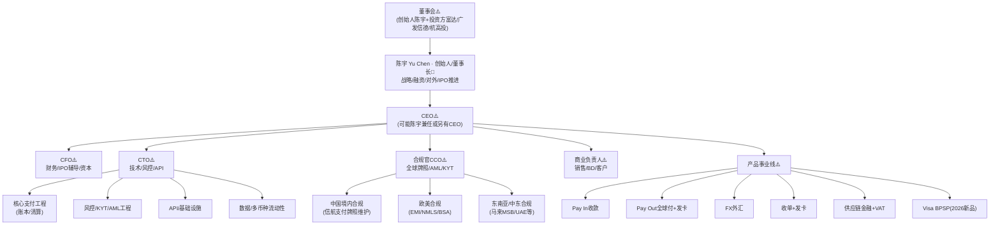
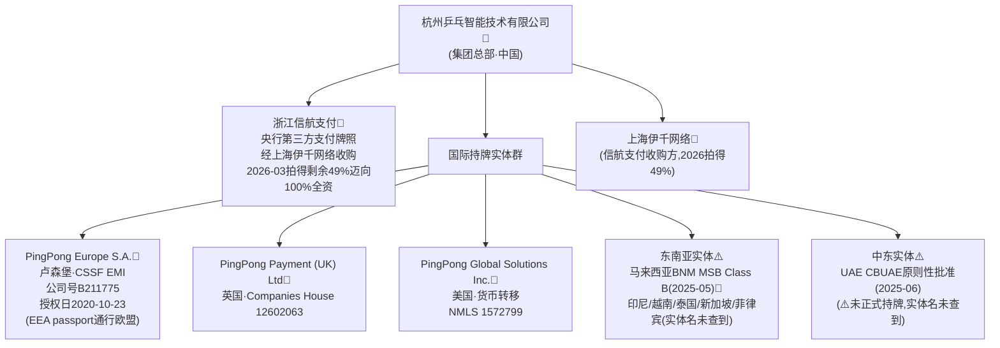

# PingPong（杭州乒乓智能技术有限公司 / "呯嘭智能"；国际站 international.pingpongx.com）

> 📌 **一句话定位**：中国跨境电商收款/跨境支付头部企业，未上市。起家于"帮中国跨境电商卖家把海外平台的钱收回国"，现扩展为收款(Pay In)+付款(Pay Out)+外汇+收单+发卡+供应链金融的一体化跨境支付基础设施。
> 🏷️ **角色归类**：**以"跨境收款"起家，现"两者都做"，收款仍是核心**（呼应 `03-crossborder-business §13.3`）。
> ⚠️ **数据时效**：截至 2026-06。⚠️ 未上市、未公开财报，规模多公司自述、人民币/美元口径混用且随年份漂移；本轮**纠正了若干旧数据**(见 §10)。

---

## 1. 基本信息
- **成立**：2015-06，陈宇于纽约创立，后总部迁回杭州
- **总部**：杭州；集团及国际实体分布美国/英国/卢森堡等；15 国 35+ 办公室
- **创始人/董事长**：**陈宇(Yu Chen)**(1980 生于湖北随州，复旦本科+美国康涅狄格大学数学硕士，曾任平安集团投资管理中心、德勤咨询纽约总部经理)
- **当前状态**：⚠️**未上市**——2020-09 与中信证券签创业板 IPO 辅导，**5 轮辅导排队三年无果**，有报道称或转道港交所(未证实)

## 2. 背景与沿革（里程碑时间线）📌
| 时间 | 里程碑 |
|---|---|
| 2015-06 | 陈宇于纽约创立，后迁杭州 |
| 2017 | 获欧洲支付牌照(百科口径) |
| 2020-10-23 | **卢森堡 PingPong Europe S.A. 获 CSSF EMI 授权**(欧盟护照展业) |
| 2020-09-26 | 与中信证券签 IPO 辅导，备案深交所创业板(投资方含富达/广发信德/杭高投) |
| 2021 起 | 经子公司股权收购控股**浙江信航支付**，转向合规跨境支付 |
| 2021-06 | 进入第 4 轮 IPO 辅导；后 5 轮辅导排队三年无果 |
| 2025-05-29 | **获马来西亚 BNM MSB Class B 牌照**(自称中国首家获此牌的 To B 跨境支付机构) |
| 2025-06-04 | **获 UAE CBUAE 支付牌照原则性批准**(⚠️ 非正式持牌) |
| 2026-03 | 旗下上海伊千约 **3760万元拍得信航支付剩余 49% 股权**，待审批后 **100% 全资控股**境内支付牌照(隐含整体估值约 7673万元) |
| 2026-05-27 | **伦敦发布与 Visa 合作的 BPSP"卡到账户"方案**(英/欧/港上线) |

> 战略主线：以"全球牌照网络+境内央行牌照+全栈产品+平台卖家客群"构筑护城河，2025-2026 重点向东南亚/中东扩张并切入 B2B 大额企业支付(Visa BPSP)。

## 3. 股东与资本 ⚠️二手
- **投资方**：富达、广发信德、杭高投(IPO 辅导披露)
- **估值**：约 10 亿美元(独角兽，格隆汇引用，时点不明)⚠️二手
- 创业板 IPO 辅导五轮无果，市场有"转港交所"传闻(未证实)

## 4. 牌照与资质 📌部分监管登记可验证（⚠️"60+"为公司自述、无逐张公开清单）
官网自述"**60+ 全球金融牌照与许可**"(2026)。已确认/可在监管登记处核实：
| 法域 | 实体 | 牌照 | 监管/证号 | 时间 |
|---|---|---|---|---|
| **中国境内** | **浙江信航支付**(经上海伊千网络收购) | 央行第三方支付牌照 | 央行 | 2021 起控股，**2026-03 拍得剩余 49% 迈向 100% 全资** |
| **卢森堡/EEA** | **PingPong Europe S.A.** | **EMI(电子货币机构)** ⚠️非 PI | CSSF，公司号 **B211775**，授权日 2020-10-23，LEI 8945002KDPSV23IO3834，荷兰 DNB 关联 R180541 | 2020-10 |
| **英国** | PingPong Payment (UK) Ltd | — | Companies House 公司号 **12602063** | — |
| **英国** | **PingPong Payment (UK) Limited** | **EMI** | FCA **FRN 974154**，英国公司号 12602063，授权 2023-04-13（📌FCA+Companies House 双重确认） | 2023-04 |
| **美国** | PingPong Global Solutions Inc. | 货币转移 | **NMLS ID 1572799** | — |
| **马来西亚** | — | **MSB Class B** | Bank Negara(BNM) | 2025-05-29 |
| **阿联酋** | — | 支付牌照**原则性批准**(⚠️未正式上线) | CBUAE | 2025-06-04 |
| 日本/香港/澳/加 | 官网称持牌或受监管 | (MSO 等) | — | 公司自述 |
- ⚠️ **原画像勘误**：① 卢森堡 B211775 是 **EMI 非 PI**；② **FinCEN MSB 注册本轮未独立确认**；③ Visa BPSP 是 **2026-05 发布非 2025**；④ Shopify/TikTok Shop/Temu/SHEIN 作为官方标杆客户**未独立确认**(仅可定性服务这些平台卖家群体)
- ❌ **被驳回(2026-06 核查)**：坊间称"PingPong 持**新加坡 MAS MPI + 香港 MSO**"——本轮**未能在一手监管来源核实**(属营销自述)，不采纳；上表日本/香港/澳/加仍为公司自述、证号未查到。
- ⚠️ "60+"无逐张公开清单，日本/香港 MSO/澳/加具体牌照号未查到

## 5. 定位与商业模式（盈利结构）⚠️未公开占比

未查到收入分项占比(未上市、未公开财报)。收入来源(公司自述+行业):① **收款(Pay In)提现/汇款手续费**(行业可比平台收款费率约 0.3%-1.5%+提现费，非 PingPong 专属) ② **外汇汇差**(30 持有货币、400+ 货币对) ③ B2B 付款(Pay Out)手续费 ④ 全球收单 ⑤ 发卡 ⑥ 供应链金融/保理利息 ⑦ VAT 税务/退税增值费。⚠️ 各来源占比均未公开，仅业务线定性拆解

---

### 5.1 核心资金流图：Pay In 跨境收款全链路 🔧机制还原

> 📌 **这是PingPong起家+核心业务的完整资金流**(解释"中国卖家的海外货款怎么回到国内账户、PingPong在哪几个环节赚钱")。

```mermaid
flowchart LR
    BUYER["海外终端消费者<br/>(在Amazon/Shopee刷卡)"]
    PLATFORM["海外电商平台<br/>(Amazon/eBay/Shopee/Lazada)"]
    PINGPONG_OS["PingPong境外持牌实体<br/>(卢森堡EMI/美国NMLS/马来MSB等)<br/>收款+持有外币余额"]
    FX["换汇环节<br/>(外币→人民币)<br/>🔧赚汇差1%-1.5%左右"]
    XINHANG["浙江信航支付<br/>(央行牌照·境内通道)<br/>合规落地+人民币清算"]
    SELLER_CN["中国跨境电商卖家<br/>国内银行账户<br/>(提现到账)"]
    
    BUYER -->|"刷卡付款"| PLATFORM
    PLATFORM -->|"货款结算给卖家<br/>(卖家绑定PingPong提供的'类本地账户号')"| PINGPONG_OS
    PINGPONG_OS -->|"①收款手续费0.3%-1.5%<br/>(行业可比口径)"| FX
    FX -->|"②汇差利润<br/>(买卖汇率价差)"| XINHANG
    XINHANG -->|"③提现费<br/>(人民币打国内账户)<br/>T+0/T+1到账"| SELLER_CN
    
    PINGPONG_OS -.持有多币种余额、400+货币对流动性管理.-> FX
    XINHANG -.外管局/央行跨境资金申报合规.-> SELLER_CN
```

> 🔧 **盈利点拆解**(从左到右三个环节)：
> 1. **收款手续费**(境外段)：平台货款→PingPong境外实体,收**0.3%-1.5%手续费**(行业可比口径,非PingPong官方公开费率,实际因客户体量/币种/路径浮动)。
> 2. **外汇汇差**(核心利润源)：外币→人民币换汇时,PingPong给卖家的汇率与银行间汇率有价差(买卖价差),这是**跨境收款最主要利润来源**(估计**1%-1.5%左右汇差**,各家不公开精确点差)。掌握**30币种持有+400+货币对**的流动性池是这一环的护城河。
> 3. **提现费**(境内段)：人民币经信航支付打给卖家国内账户,可能收**小额提现费**(或按T+0/T+1到账速度分档收费,具体未查到)。
>
> 💡 **为什么"汇差"是核心**：收款手续费0.3%-1.5%看着不高(对标Stripe收单net take rate 0.4%),但**跨境收款加上换汇这一层,汇差1%-1.5%是纯增毛利**(不分给卡组织/发卡行)——这正是"跨境收款"比"本地收单"多赚的那块,也是连连/万里汇/Payoneer等跨境玩家的共同盈利模型。
>
> 🎯 **对比Stripe**：Stripe的资金流是"消费者刷卡→Stripe收单→扣net 0.4%→payout给商户(同一国/币种)",**不经过换汇、没有汇差利润**;PingPong的资金流多了"**跨境+换汇**"两层,所以能在收款手续费之外**再赚一层汇差**。这就是"跨境收款服务商"与"本地收单服务商"盈利结构的根本差别。

## 6. 核心产品与业务范围 📌官网+🔧vs竞品推断

> 🧭 **本节读法**：先看**产品全景速查表**(按业务层归类)，再逐产品深挖"定位/目标客户/功能/市场位置/核心竞争力/vs竞品差异化"。⚠️ **竞品对比多为🔧行业公知/推断，非PingPong官方口径，具体排名会随时间漂移**。

📌 **产品全景速查表**(归6层)：

| 层 | 产品 | 一句话定位 | 在§5商业模式的角色 |
|---|---|---|---|
| **A Pay In 收款** | 本地账户收款+网络支付+卡/替代支付 | 跨境电商卖家把海外货款收回国 | ①核心入口·手续费+汇差 |
| **B Pay Out 全球付** | 网络付款+银行账户付款+全球发卡 | 跨境企业/卖家向海外供应商/员工付款 | ②双向闭环·手续费 |
| **C FX 外汇** | 30币种持有+400+货币对+远期/锁汇 | 汇率风险管理 | ③汇差核心利润源 |
| **D 收单+发卡** | Acquiring全球收单 / Card Issuing发卡 | 补齐支付闭环 | ④价值链延伸 |
| **E 供应链金融+VAT** | 保理融资 / VAT缴纳+出口退税 | 卖家营运资金/税务合规增值 | ⑤金融增值·利息/服务费 |
| **F 2026新品·Visa BPSP** | 卡到账户(Card to Account) | B2B大额企业支付·延长45天营运资金 | ⑥战略主攻·切B2B赛道 |

---

### 6.A Pay In 收款层 —— 起家核心

#### Pay In 收款 —— 跨境电商收款入口
- **定位/目标客户**：中国跨境电商卖家把海外平台(Amazon/eBay/Shopee等)的货款收回国，这是PingPong起家+核心业务。
- **功能**：① **本地账户收款**(欧美等23币种本地账户，卖家在平台绑定"像本地银行账户"的收款号) ② **网络支付收款**(对接平台API) ③ **卡及替代支付方式收款**；资金路径：海外平台货款→PingPong境外实体账户→换汇→通过**信航支付**境内牌照落地→人民币提现到卖家国内账户。
- **市场位置**：🔧与**连连国际、万里汇(WorldFirst/蚂蚁)、Payoneer、XTransfer**同列中国跨境收款第一梯队。
- **核心竞争力**：① **境内外双牌照闭环**(信航支付央行牌照+卢森堡EMI+多法域，钱能合规进出中国) ② **低费率+快速回款**(公司自述，行业可比0.3%-1.5%+提现费) ③ **与主流电商平台深度绑定**(覆盖50+平台，定性服务Amazon/Shopee/Walmart等平台卖家)。
- **vs竞品差异化**🔧：
  - **vs 连连国际**：连连规模更大(2026Q1服务1040万客户、TPV2.1万亿元人民币)且有卡清算牌照；PingPong强在"率先拿东南亚/中东牌照"(马来MSB/UAE原则性批准)+Visa BPSP切B2B。
  - **vs 万里汇(WorldFirst/蚂蚁)**：万里汇背靠蚂蚁/支付宝生态+WorldFirst全球账户体系，客户黏性强；PingPong强在"全栈自有牌照网络+供应链金融"。
  - **vs Payoneer**：Payoneer国际老牌、全球覆盖广且与平台(亚马逊官方合作)深度绑定；PingPong强在"中国境内牌照+人民币落地+本土化服务"。
  - **vs XTransfer**：XTransfer聚焦**B2B外贸**(制造/批发大额)，PingPong更偏**B2C跨境电商小额高频**收款。
  - **vs Airwallex**：Airwallex偏"全球账户+API/嵌入式金融"打法(总部新加坡、四位澳籍华人创办2015)，服务数字原生企业；PingPong更接地气服务中国中小跨境电商卖家。
  - **vs Stripe**(参考)：Stripe是"为开发者/平台提供收单API"(2B2C)，不做"跨境卖家收款"；PingPong是"为卖家收海外货款回国"，两者客户群与痛点不同——Stripe解决"商户怎么收终端消费者的钱"，PingPong解决"卖家怎么把平台的钱收回中国"。

#### 多币种账户 —— 收款基础设施
- **定位/目标客户**：跨境卖家/企业需同时持有多币种余额、灵活换汇。
- **功能**：**23种本地账户货币、40+付款货币、400+货币对、30种持有及兑换货币**；支持实时汇率+智能锁汇(见§6.C)。
- **核心竞争力**：400+货币对深度是差异化卖点(对比连连/万里汇公开币种数未查到精确可比数字)。

---

### 6.B Pay Out 全球付层 —— 双向闭环

#### Pay Out 全球付 —— 向海外付款+发卡
- **定位/目标客户**：跨境电商卖家/企业向海外**供应商/服务商/员工**付款(如采购货源、跨境广告费、员工工资)。
- **功能**：① **网络付款**(经平台/API付) ② **银行账户付款**(直接打海外账户) ③ **全球发卡**(给员工/代理发虚拟/实体卡，用于广告投放/采购/差旅)。
- **市场位置/差异化**🔧：对标连连/万里汇/Airwallex的全球付+发卡功能。差异=**与Pay In同栈**——卖家收款+付款+发卡在一个平台，省去在多家服务商之间搬钱、资金留存提高PingPong浮存收益。

---

### 6.C FX 外汇层 —— 汇差核心利润源

#### FX 外汇服务 —— 汇率风险管理
- **定位/目标客户**：跨境企业/大卖家需对冲汇率风险、锁定成本。
- **功能**：① **即期换汇**(30币种持有、400+货币对) ② **远期锁汇**(提前锁定未来汇率) ③ **对冲策略**(期权等衍生品，⚠️具体产品未查到) ④ **实时汇率+智能锁汇**(系统推荐最佳换汇时机)。
- **核心竞争力**：**汇差是跨境收款核心利润源**(§5，收1%-1.5%左右汇差+提现费是行业通行模式)；400+货币对深度覆盖长尾需求。
- **vs竞品差异化**🔧：各家(连连/万里汇/Payoneer/Airwallex)均提供换汇，差别在**费率透明度+换汇深度+衍生品**——PingPong强在400+货币对广度，连连/万里汇体量大可能拿到更优银行汇率，Airwallex强API/实时透明，精确费率对比需逐笔询价(各家不公开)。

---

### 6.D 收单+发卡层 —— 价值链延伸

#### Acquiring 全球收单 / Card Issuing 发卡
- **定位/目标客户**：① **收单**：商户需在自己网站/线下收卡 ② **发卡**：企业/卖家给员工/代理发企业卡控费。
- **功能**：收单=接Visa/MC等卡网络，商户收终端消费者刷卡；发卡=虚拟/实体企业卡，限额/限商户类目，用于广告投放/采购。
- **市场位置/差异化**🔧：这是**补齐支付闭环**的战略布局——收单对标Stripe/Adyen(但PingPong主战场非开发者API收单)，发卡对标Stripe Issuing/Marqeta(但PingPong聚焦跨境卖家场景非通用BaaS)。差异=**与收款同栈、服务同一批跨境卖家客户**，卖家收款+付款+发卡一站完成，而非独立收单/发卡产品。

---

### 6.E 供应链金融+VAT层 —— 金融增值

#### 供应链金融/保理 —— 卖家营运资金
- **定位/目标客户**：跨境电商卖家资金周转紧张(货款在路上、需提前备货)。
- **功能**：基于卖家在PingPong的**流水数据**授信，提前垫付货款或给信用额度，卖家按约定还款，PingPong收**固定费或利息**。
- **核心竞争力**：**数据是护城河**——掌握卖家实时收款流水，风控模型比传统银行精准(类比Stripe Capital用支付流水授信)；且还款可从未来收款自动扣，坏账可控。
- **vs竞品差异化**🔧：连连/万里汇/Payoneer均有类似保理融资，差别在**授信额度/利率/风控模型**，PingPong累计TPV $300B量级的数据沉淀是基础。

#### VAT 税务缴纳+出口退税 —— 合规增值
- **定位/目标客户**：中国卖家在欧盟/英国卖货需缴VAT，退税流程复杂。
- **功能**：① **VAT代缴**(对接德/法/意等欧盟VAT系统接口，自动算税+代缴) ② **出口退税**(帮卖家办中国出口退税)。
- **核心竞争力**：**与收款同栈**——货款进来时即时算税扣税，无需把数据导到独立税务系统；税务合规由PingPong对监管负责。
- **vs竞品差异化**🔧：对标Stripe Tax(全球100+国税率库)、Avalara(独立税务SaaS)。差异=**专为中国跨境电商场景**(欧盟VAT+中国出口退税双向)，Stripe Tax覆盖更全但不做中国退税。

---

### 6.F 2026新品·Visa BPSP —— 战略主攻·切B2B

#### 卡到账户(Card to Account) —— B2B大额企业支付
- **定位/目标客户**：B2B企业(非电商卖家)向**不收卡的供应商**付大额发票，需现金流管理。
- **功能**：基于Visa **BPSP**(Business Payment Solution Provider)，企业用现有**商业信用卡**支付供应商发票(即便供应商不收卡)，**最多延长营运资金45天**(信用卡账期)，覆盖**170国/25币种**；2026-05-27伦敦发布，已上线**英/欧/港**，2026拟扩美国/新加坡。
- **市场位置**：🔧Visa BPSP生态玩家含美国老牌(WEX/Fleetcor等)与新兴(Pliant/Vartana等)，PingPong是**中国首家**拿此能力的跨境支付机构(公司自述)。
- **核心竞争力**：① **从小额高频电商收款→切入B2B大额企业支付**，打开新赛道 ② **45天账期延长**=为企业"买"时间，现金流管理刚需 ③ **与Visa深度合作**(呼应牌照网络护城河)。
- **vs竞品差异化**🔧：
  - **vs 连连/万里汇/Payoneer**：它们尚未公开宣布Visa BPSP合作，PingPong**率先卡位B2B企业支付赛道**。
  - **vs Stripe**(参考)：Stripe主战场是"开发者/平台收单API"(小额高频)，Visa BPSP是"B2B大额发票支付"(低频大额)，两者场景不同——Stripe强收单+订阅，PingPong借BPSP补B2B短板。

---

> 🎯 **产品层总结**：PingPong产品演进=**从Pay In收款单腿→Pay In+Pay Out双向闭环→+FX+收单+发卡+供应链金融全栈→2026借Visa BPSP切B2B企业支付**。护城河=**全球牌照网络+境内外双轨+全栈产品+卖家数据**，差异化偏"**低费率+快速回款+东南亚/中东本地化+率先拿新牌照(马来MSB/UAE/Visa BPSP)**"。⚠️竞品对比为🔧行业公知/推断，精确费率/市场份额各家不公开。

## 7. 业务区域 📌官网+媒体+🔧推断

> 🧭 **读法**：先看**区域速查表**(规模分量→牌照根基→业务重点→主要客户)，再读逐区下钻。⚠️ **各区收入占比PingPong未披露**(未上市无分部报表)，"规模/分量"为结构判断+公开信号(牌照布局/办公室/落地动作)，非精确营收数字。

📌 **四大区一览速查**：

| 区域 | 规模/分量 | 牌照根基 | 业务重点 | 主要客户(定性) |
|---|---|---|---|---|
| **欧美** | **核心基本盘**(最大，推断占比过半) | 卢森堡EMI(EEA passport)+英国+美国NMLS | Pay In收款主战场+Visa BPSP首发(英/欧) | 在Amazon/eBay/Shopee等平台的中国跨境电商卖家 |
| **中国境内** | **合规枢纽**(营收可能小但战略必需) | 浙江信航支付(央行牌照，2026迈向100%全资) | 人民币落地/提现通道，合规必需 | 中国跨境电商卖家(资金最终落地方) |
| **东南亚** | **扩张重点**(增速快) | 马来MSB(2025-05首家)+印尼/越南/泰国/新加坡/菲律宾运营 | 本地化收款+服务中国卖家出海东南亚 | 在Shopee/Lazada等东南亚平台的中国卖家 |
| **中东** | **新兴突破口**(试点) | UAE CBUAE原则性批准(2025-06，⚠️未正式持牌) | 卡位中东市场，押注"一带一路"+跨境电商增长 | 布局阶段，客户群尚在培育 |

---

### 7.1 欧美 —— 核心基本盘

- **规模/分量**：📌 **最大市场**，跨境电商收款主战场(Amazon/eBay/Walmart等平台货款来源地)；⚠️营收占比未披露，但从牌照布局(卢森堡EMI首发2020、美国NMLS、英国实体)与业务逻辑(中国卖家主要向欧美卖货)判断，**欧美是绝对主力(推断过半)**。
- **牌照根基**：① 卢森堡**PingPong Europe S.A.**持**CSSF EMI**(2020-10授权，公司号B211775)，凭**EEA passport**通行整个欧盟；② 英国**PingPong Payment (UK) Ltd**(Companies House 12602063)；③ 美国**PingPong Global Solutions Inc.**持各州货币转移牌照(NMLS 1572799)。
- **业务重点**：① **Pay In收款核心**——卖家在Amazon/eBay等平台绑定"类本地账户"收款号，货款→PingPong境外实体→换汇→经信航支付落地中国；② **Visa BPSP首发区**(2026-05英/欧/港上线)，切B2B企业支付；③ **VAT税务**(对接德/法/意等欧盟VAT系统)。
- **主要客户**(定性)：在欧美电商平台(Amazon/eBay/Walmart)销售的**中国跨境电商卖家**(官网自述覆盖50+平台，服务"150万中国卖家"口径⚠️未核实)。

### 7.2 中国境内 —— 合规枢纽

- **规模/分量**：⚠️ **营收占比可能不大**(境内主要是"资金落地通道"而非新增收款量)，但**战略地位必需**——没有境内央行牌照，钱合规进不了中国。
- **牌照根基**：**浙江信航支付**(央行第三方支付牌照)，PingPong 2021起经上海伊千网络收购控股，**2026-03拍得剩余49%股权、迈向100%全资控股**(拍卖价约3760万元，隐含整体估值约7673万元，待审批)。
- **业务重点**：① **人民币提现通道**——海外收款→换汇→经信航支付落地→打给卖家国内银行账户；② **合规必需**——外管局/央行监管下的跨境资金进出须经持牌机构；③ 总部杭州(15国35+办公室中的核心)。
- **主要客户**：同§7.1，最终都要把钱提现到中国境内账户的跨境电商卖家。

### 7.3 东南亚 —— 扩张重点

- **规模/分量**：⚠️ **扩张中**，体量小于欧美但被列为增长重点(中国跨境电商"出海东南亚"+东南亚本地电商增长双驱动)。
- **牌照根基**：📌 **马来西亚BNM MSB Class B**(2025-05-29获批，自称**中国首家**获此牌的To B跨境支付机构)；印尼/越南/泰国/新加坡/菲律宾已运营(具体牌照号未查到)。
- **业务重点**：① **本地化收款**——服务中国卖家在**Shopee/Lazada/TikTok Shop**等东南亚平台收款；② **本地货币**——泰铢/越南盾/马来西亚林吉特等本地币种持有+换汇(呼应400+货币对)；③ **率先拿马来MSB**，卡位东南亚支付网络。
- **主要客户**(定性)：在东南亚平台销售的中国跨境电商卖家+东南亚本地跨境商户(后者占比未知)。

### 7.4 中东 —— 新兴突破口

- **规模/分量**：⚠️ **试点阶段**，营收贡献尚小，但**战略卡位**——"一带一路"+中东跨境电商增长+中国品牌出海中东。
- **牌照根基**：📌 **UAE CBUAE支付牌照原则性批准**(2025-06-04)——⚠️ **注意：这是"原则性批准(in-principle approval)"，非正式持牌上线**，需完成后续审批/资本金注入等才能运营。
- **业务重点**：以UAE为突破口，布局中东本地收款+人民币/美元/当地货币换汇；业务形态与东南亚类似(服务中国卖家出海中东平台)。
- **主要客户**(定性)：布局阶段，客户群尚在培育。

---

📌 **跨区能力·多币种覆盖**：官网自述"服务**200+国家/地区**"(⚠️此为支付网络可达范围、非每国都持牌/设办公室)；**23种本地账户货币、40+付款货币、400+货币对、30种持有及兑换货币**；15国35+办公室。

> ⚠️ **关键认知**：PingPong的"区域覆盖"与Stripe不同——Stripe是"在各区本地收单(商户收终端消费者的钱)"，PingPong是"**帮中国卖家把各区平台的钱收回中国**"(钱的起点=欧美/东南亚平台、终点=中国境内账户)。所以**欧美是收款来源地(货款从这里出发)、中国境内是落地枢纽(钱最终到这里)、东南亚/中东是新增收款来源地扩张**。这正是"跨境收款服务商"与"本地收单服务商"(Stripe/Adyen)的根本区别。

## 8. 规模与数据 ⚠️公司自述+第三方估算（口径不一）
- **累计 TPV**：官网(2026)"**$300B 累计**"(公司自述)；Frost & Sullivan(经 vzkoo)：2022 年 TPV 约 **2310 亿元人民币**、截至 2024 年底累计"近 2 万亿元人民币"——⚠️ **原画像 $90B→$250B→$300B 逐年美元进阶未能独立核实**，仅确认期末口径 $300B(官网)与人民币口径
- **卖家/客户数**：一中文源称"服务超 150 万中国卖家、覆盖 50+ 电商平台"⚠️(与官网口径不一)；原画像 75万→100万未核实
- **日处理额**：原画像 $150M/日**未查到来源、未核实**
- **员工**：官网 1500 人

## 9. 组织架构 + 管理层 📌部分确证+⚠️高管明细有限

> ⚠️ **可信度分层(本节务必先读)**：PingPong **未上市、无公开组织架构图、高管团队明细极少披露**。因此本节区分三层：**📌已确证**(创始人陈宇、法律实体——来自官网/监管登记/工商);**🔧行业通行结构**(跨境支付公司普遍设的职能部门与典型角色，教学性还原);**⚠️推断**(按业务线/牌照主体映射部门——非PingPong官方披露的汇报线)。**勿把🔧/⚠️的部门/角色当成PingPong实际内部建制的事实**。

### 9.1 高管层(已知) 📌部分确证

- **陈宇(Yu Chen)** — **创始人/董事长**📌(1980生于湖北随州，复旦本科+美国康涅狄格大学数学硕士，曾任平安集团投资管理中心、德勤咨询纽约总部经理；2015-06纽约创立PingPong后迁回杭州；2020《财富》中国40 Under 40、浙江省优秀企业家)
- ⚠️ **其他高管(CEO/CFO/CTO等)姓名未查到公开明细**——与Stripe(高管全披露)对比，PingPong高管信息透明度低，本节无法列出完整C-suite。

### 9.2 整体组织架构(树状图) ⚠️推断为主

> 📌实线=已确证创始人/法域实体；🔧/⚠️=行业通行职能部门与推断映射(非官方汇报线)。PingPong内部以**产品线(Pay In/Pay Out/FX/供应链金融)+法域持牌实体矩阵式**运作是合理推断，但具体汇报关系未披露。

### 9.3 法律实体结构(树状图) 📌已确证实体

> 📌 **看法律实体树的要点**：① **"一个中国总部+一个境内持牌通道(信航支付)+多个境外持牌实体"**结构——钱从境外实体收进来→换汇→经信航支付落地中国；② **欧盟用卢森堡EMI作单一passport入口**(不必每国单独持牌)，类比Stripe用爱尔兰EMI通行EEA；③ **2026-03拍得信航49%是关键资本动作**——从"控股"迈向"100%全资"，强化境内合规根基；④ 东南亚/中东实体名称未查到，仅知持牌状态。

### 9.4 各实体/事业线：部门—职责—角色—角色职责 🔧⚠️行业通行结构

> 🔧⚠️ **以下为行业通行结构+按已知信息推断的还原**(教学用，非PingPong官方建制)。目的是建立"一家这种规模的跨境支付公司内部大致怎么分工"的心智模型。

**A. 杭州乒乓智能(集团总部)——总部职能中台** 🔧通行结构

| 部门 | 职责 | 典型角色 | 角色职责 |
|---|---|---|---|
| **工程(Engineering)** | 建设并运维支付平台、风控、数据、多币种流动性 | CTO⚠️ / VP工程 / 工程总监 / 高级工程师 / SRE | CTO定技术战略;VP/总监管事业线工程团队;工程师攻核心系统(账本/清算/换汇引擎);SRE保高可用 |
| **产品(Product)** | 定义产品路线、需求、定价 | CPO⚠️ / 产品总监 / PM | 按事业线(Pay In/Pay Out/FX/BPSP…)负责路线图与商业化 |
| **财务(Finance)** | 财务/IPO辅导/资本/资金/浮存管理 | **CFO⚠️** / FP&A / 司库Treasurer / 会计 | CFO管IPO辅导(五轮排队)/融资;司库管多币种流动性+浮存;FP&A做预算 |
| **法务与合规(Legal & Compliance)** | 全球牌照、监管、反洗钱、KYT、外管局/央行合规 | **CCO合规官⚠️** / BSA Officer / 反洗钱分析师 / 各法域牌照维护 | 维护60+牌照(自述);BSA/AML/KYT实时监测;外管局跨境资金合规;牌照申请(马来MSB/UAE等) |
| **商业/GTM(Go-to-Market)** | 销售、BD、客户、平台合作 | **CBO⚠️** / 销售VP / 客户经理 / 平台BD | 拓展跨境电商卖家客户;与Amazon/Shopee/Lazada等平台合作对接;Visa BPSP等战略BD |
| **人力(People)** | 招聘、组织 | CPO⚠️ / HRBP / 招聘 | 支撑1500员工+15国35+办公室的组织 |

**B. 浙江信航支付——境内持牌运营主体** 📌实体确证，🔧职责还原

| 部门/职能 | 职责 | 角色 |
|---|---|---|
| **持牌运营** | 作为央行第三方支付牌照持有人,合法在境内收/付/汇资金,为跨境卖家提现到国内银行账户 | 合规负责人、央行牌照维护、资金运营 |
| **资金运营(Money Movement)** | 管境内清算账户、与国内银行对接、人民币提现 | 资金运营经理、对账团队 |
| **合规** | 外管局跨境资金申报、央行反洗钱、大额交易报送 | AML分析师、外管合规 |

**C. PingPong Europe S.A.(卢森堡)/UK/US——境外持牌主体** 📌实体确证

| 法域/实体 | 职责 | 角色 |
|---|---|---|
| **卢森堡EMI** | 凭CSSF EMI牌照在EEA展业,收卖家在欧盟平台的货款、持有多币种余额、换汇 | 牌照负责人、欧盟合规官、多币种流动性管理 |
| **英国UK Ltd** | 英国本地运营、Visa BPSP首发区之一(2026-05) | 英国合规、BPSP产品落地 |
| **美国NMLS** | 美国各州货币转移,收卖家在美国平台(Amazon/eBay/Walmart)的货款 | 美国合规、各州MTL维护、BSA/AML |

**D. 东南亚/中东实体——新兴扩张** 📌部分确证

| 法域 | 职责 | 角色 |
|---|---|---|
| **马来西亚MSB** | 马来本地支付,服务卖家在Shopee/Lazada等东南亚平台收款 | 马来牌照合规、本地货币运营 |
| **UAE(原则性批准)** | 中东试点,卡位"一带一路"+中东跨境电商 | UAE合规(待正式持牌)、中东BD |
| **印尼/越南/泰国/新加坡/菲律宾** | 东南亚本地化收款+换汇 | 各国本地团队(实体名/人员未知) |

> 🎯 **看组织架构的三个要点**：① **陈宇是决策核心**(创始人/董事长,推动IPO/融资/全球牌照扩张),其他高管未披露;② **"产品线(Pay In/Pay Out/FX/BPSP)×法域持牌实体"矩阵**——产品按收付汇分线,法域按牌照属地运营;③ **法律实体=牌照地图的镜像**——中国信航支付(央行)、欧盟卢森堡(EMI passport)、英/美、东南亚(马来MSB首发)、中东(UAE试点)各自承接对应法域的持牌运营(与§4牌照、§7区域一一对应)。⚠️本节大量⚠️标注,提醒这是教学性还原、非PingPong实际建制。

## 10. ⚠️原画像勘误汇总（本轮深度研究修正）
| 项 | 旧画像 | 修正 |
|---|---|---|
| Visa BPSP 合作 | 2025 | **2026-05-27 发布** |
| 卢森堡 B211775 | PI | **EMI(电子货币机构)** |
| 逐年 TPV | $90B→$250B→$300B | **未独立核实**，仅确认期末 $300B(自述)/人民币口径 |
| 日处理 $150M | — | **未查到来源** |
| 卖家数 75万→100万 | — | **未核实**(另有"150万"二手口径) |
| FinCEN MSB | 已注册 | **本轮未独立确认**(NMLS 1572799 已核) |
| 标杆平台客户 | Shopify/TikTok Shop/Temu/SHEIN | **未独立确认官方合作**，仅定性服务其卖家群体 |

## 11. 护城河与差异化
① **全球牌照网络 + 境内央行支付牌照(信航)**(同时握中国境内+欧美东南亚中东多法域，"中国首家"叙事：马来 MSB/UAE 原则性批准) ② **全栈产品**(收付汇+发卡+收单+供应链金融+VAT) ③ 银行合作网络(花旗/富国/渣打/摩根大通等本地账户能力，知乎口径 100+ 金融机构) ④ 先发+规模($300B 累计 TPV 量级) ⑤ 与主流电商平台及卖家深度绑定。差异化偏"低费率+快速回款+东南亚/中东本地化"

## 12. 主要竞争对手 📌定性对比
**连连国际、Airwallex、Payoneer、万里汇(蚂蚁)、XTransfer**
- **牌照**：PingPong 强项=中国境内央行牌照(信航)+欧美东南亚中东多法域+率先拿马来 MSB/UAE 原则性批准；连连国际牌照布局亦广且有卡清算牌照；万里汇背靠蚂蚁/WorldFirst 体系；XTransfer 聚焦 B2B 外贸；Airwallex 偏全球账户+API/嵌入式
- **规模**：连连 2026Q1 服务超 1040 万客户/支付额 2.1 万亿元；PingPong 累计 TPV $300B(2026 自述)/Frost&Sullivan 2022 TPV 2310 亿元；Airwallex 同为 2015 成立、四位澳籍华人创办、总部新加坡
- **产品**：PingPong/连连/万里汇偏全栈；XTransfer 聚焦 B2B；Airwallex 偏全球账户+嵌入式
- ⚠️ 各家精确费率/TPV/卖家数缺统一可比一手数据

## 13. 监管与最新动态 ⚠️时效
- **走"合规先行+境内外双牌照"路线**：境内须设持牌实体(故 2021 起控股信航支付，2026 推 100% 全资)；境外 2017 欧洲→2020 卢森堡 EMI→英/美 NMLS→2025 马来 MSB/UAE 原则性批准。⚠️ 未见公开监管处罚记录(本轮未查到，不等于无)
- **最新**：2025-05 马来 MSB、2025-06 UAE 原则性批准、2026-03 拍得信航 49%、2026-05 Visa BPSP；行业背景：2025 中国跨境电商进出口约 2.7 万亿元、2026 预计破 3 万亿，稳定币成跨境新变量

## 14. 技术架构特点 ⚠️公司自述
跨境支付基础设施，API 直连嵌入式接入；数字化风控系统实时监测；风控/技术团队来自华尔街/硅谷/世界 500 强；三大核心=合规引擎+多币种流动性管理+税务自动化(对接欧盟 VAT 系统接口)；全球 30+ 分支 7×24 中文支持；与花旗/摩根大通等 100+ 金融机构对接实现本地账户/清算。⚠️ 未见独立技术架构披露(底层云/清算对接细节)

## 15. 标杆客户 📌+二手
- 定位平台卖家收款/支付服务商，覆盖 50+ 电商平台；对接 **Amazon/eBay/Walmart/Shopee**(二手列举)
- 金融机构合作：花旗/富国/渣打/摩根大通等(知乎/百科称 100+)
- ⚠️ Shopify/TikTok Shop/Temu/SHEIN 仅可定性服务其卖家群体，官方合作未逐一确认

## 16. 与本研究 / AWS 对话的衔接
- **可聊**：中国跨境电商收款头部的演进(收款→收单+发卡+供应链金融)；**经收购拿境内牌照(信航支付)的资本运作**(2026 全资控股)；东南亚/中东扩张+Visa BPSP 切 B2B 大额；与连连/Airwallex 竞争格局；IPO 五轮无果的资本困境
- **AWS 角度**：多币种账务+400 货币对、KYT/AML 实时风控、多 Region 数据驻留、VAT 税务自动化、API 嵌入式基础设施；其 IPO 受阻可对比连连(已港股)/XTransfer(冲刺中)的资本化差异

## 17. 来源清单
- 一手/可验证：international.pingpongx.com(官网，⚠️自述)、CSSF/欧盟支付登记(B211775 EMI)、英国 Companies House(12602063)、NMLS(1572799)、Yicai Global/Malay Mail/fintechnews.my(2025 马来 MSB/UAE)、中文财经(2026-03 信航 49% 拍卖)、Visa BPSP 发布稿(2026-05-27)
- 二手：百度百科/知乎/雪球/格隆汇(创始人陈宇背景/合作机构/IPO 辅导/估值)、vzkoo 引 Frost & Sullivan(2022 TPV 2310 亿)、Sinotf/经济观察网(60+ 牌照/行业语境)
