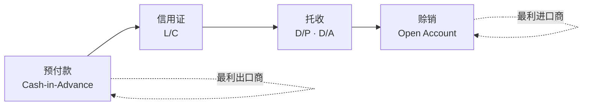
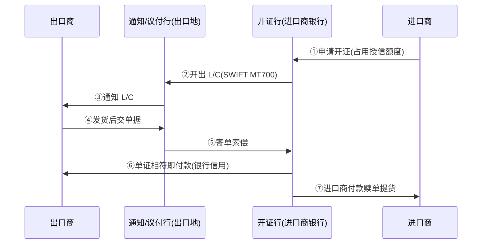

# 模块 3 深化 · 跨境贸易的业务模式与结算方式：钱货怎么对、风险归谁、中国进出口怎么走

> **学习者**：AWS 技术架构师 · 支付小白
> **本篇目标**：把"跨境贸易"这件事讲透——**一笔国际买卖用什么方式结算（T/T 电汇、L/C 信用证、托收、O/A 赊销）、各自谁先动钱谁担风险、为什么 O/A 成了主流；以及中国进出口在海关监管方式（一般贸易/跨境电商/市场采购/保税）下，货物流与资金流怎么匹配、收结汇与退税有何不同**。这是"跨境收款（03b）"的上游——先有贸易模式，才有收款需求。
> **前置**：模块3 业务篇 `03-crossborder-business.md`（四套管道/代理行电汇/SWIFT）、`03b-crossborder-collection-deepdive.md`（跨境电商收款七环节）、`02b-ecommerce-payment.md`（电商支付场景）
> **组织方式**：top-down——结算方式风险光谱 → 逐方式 → 全球趋势 → 中国海关监管方式 → 外综服 → 收结汇合规。零散追问见 FAQ。
> 标注：🔧 行业公知 · 📌 已核查·一手 · ⚠️ 告诫/未核实 · 🎯 交流要点
> ⚠️ **可信度总则**：本篇**结算方式机制/风险分配**（预付款/L/C/托收/O/A）经 deep-research 核查、引 **trade.gov(美商务部)/WTO/ICC/IMF** 一手来源（标 📌，来源见附A）；**中国海关监管方式代码**经 deep-research 核查、引 **海关总署/商务部/税务总局/外汇局**一手公告发文号（标 📌）。**未核实到一手原文的（0110 逐字定义、退税时点差异、外汇监测差异化处理）一律标 ⚠️ 未核实，不编造**。

---

## 1. 全景：贸易结算的核心矛盾——"先货还是先款"

> 🔑 **第一性**：跨境贸易结算要解决的根本矛盾是**时间错配 + 信任缺失**——📌 **进口商希望"最早在收货验货后才付款"，出口商希望"装运时就收到钱"**（WTO）。两个时间偏好天然冲突，隔着国境、互不信任，于是需要一整套"用谁的信用、谁先动钱、银行介入多深"的安排来弥合。

📌 **正因如此，约 80% 的世界贸易依赖贸易融资**（信贷或信用保险，WTO/IMF，附A[6]）——纯预付款只占一小部分。各种结算方式，本质是在**出口商风险 ↔ 进口商风险**之间选一个平衡点。

### 1.1 结算方式风险光谱 📌

📌 **四种主流结算方式构成一条"风险光谱"**（来源：trade.gov 美国商务部，附A[1]）：

| 方式 | 谁先动钱 | 银行介入 | 出口商风险 | 进口商风险 | 适用场景 |
|---|---|---|---|---|---|
| **预付款** | 进口商先付（装运前） | 仅转账 | **几乎为零** | **几乎全部** | 高风险关系/小额（trade.gov）📌 |
| **信用证 L/C** | 银行担保、装运后凭单付 | **深度介入（担保）** | 低（有银行付款保证） | 中（先开证占额度） | 新关系/买方信用不可得 📌 |
| **托收 D/P·D/A** | 出口商先发货、凭单托收 | 仅代理（**不担保**） | 中高 | 低 | 有一定互信 📌 |
| **赊销 O/A** | 出口商先发货，30/60/90 天后收款 | 不介入 | **最大** | **最小** | 竞争市场常态 📌 |

> 🎯 **交流要点**：能把结算方式画成"出口商风险 ↔ 进口商风险"的光谱，并说清"预付款=进口商扛全险、L/C=银行信用居中、O/A=出口商扛全险"——是聊国际贸易结算的总纲。

---

## 2. 逐方式拆解：谁先动钱、银行担不担、风险归谁

### 2.1 预付款（Cash-in-Advance）：出口商最安全 📌

📌 进口商在货物**装运之前**支付全部或大部分款项。**对出口商最安全、对买方最不利**——风险几乎完全压给进口商（付了钱还没拿到货）；trade.gov **推荐用于高风险贸易关系或小额出口**（附A[1]）。
- 形式：电汇预付（前 T/T）、信用卡预付等。
- ⚠️ 买方不愿用——现金流压力 + 怕出口商收钱不发货。

### 2.2 信用证 L/C：用银行信用替代买方信用 📌

📌 **L/C 是开证行（买方银行）对出口商作出的、独立的付款承诺**——在出口商发货并提交相符单据后付款。它**用银行的信用替代了买方的信用**（WTO）；**银行深度介入但只处理单据、不处理货物**（UCP600 Art.5）。风险在买卖双方间**平衡**：出口商获付款保证、进口商获合理账期（trade.gov/ICC/WTO，附A[2]）。

- **关键角色**：开证行（买方银行，付款义务方）、通知行/议付行（出口地银行）、保兑行（📌 因开证行本身仍有不付风险，出口地银行常**保兑 confirm** 该 L/C、承担付款，IMF，附A[8]）。
- **即期/远期**：即期 L/C 见单即付；远期 L/C 约定未来到期日付（给进口商账期）。
- **底层管道**：L/C 报文走 **SWIFT MT700**（开证）等（🔧；模块3 §4.3 报文）。
- ⚠️ 📌 **代价**：L/C **劳动密集、因银行费用相对昂贵**，且**仍大量依赖纸质/人工**（ICC，附A[2][8]）——这是它占比下降的重要原因（§3）。

### 2.3 托收（Documentary Collection）：银行只当代理，不担保 📌

📌 **托收下银行仅作代理、不担保付款**，只按托收指示行事（受 ICC **URC522** 管辖）。⚠️ 银行**不核实单据准确性、不担保付款，不付款时追索有限**（trade.gov/ICC，附A[3]）。两种：

| 类型 | 全称 | 机制 📌 |
|---|---|---|
| **D/P** | 付款交单 | 进口商**先全额付款**才能拿到单据（发货后、放单前付款） |
| **D/A** | 承兑交单 | 进口商**承兑汇票（承诺未来付款）**即可拿单提货，到期日再付款 |

> ⚠️ D/A 对出口商风险更高——货已凭承兑放出，到期不付就只剩追索。

### 2.4 赊销 / 开放账户（Open Account, O/A）：出口商风险最大 📌

📌 **O/A = 货物先发运交付，之后（通常 30/60/90 天）才到期付款**——对出口商是**风险最高的选项之一**（买方可能拿货后违约）。但 📌 **因出口市场竞争激烈，外国买方普遍要求 O/A，拒绝的出口商可能把订单输给竞争对手**（trade.gov，附A[4]）。
- 🔧 出口商常配套**出口信用保险 / 应收账款融资（保理）** 来对冲风险（行业公知；与 §3 趋势呼应）。

---

## 3. 全球趋势：为什么 O/A 成了主流、L/C 在下降 📌

📌 **核心结构性结论（已核查，IMF/WTO/ICC，附A[6][7][9]）：**
- **开放账户（赊销）已成主流**，可能**占贸易融资的 70-90%**（IMF）。
- **全球价值链（GVC）已大幅淘汰银行中介的信用证、转向公司间赊销**（常辅以第三方供应商融资）——这一结构性转变在 2008 危机前就已开始（IMF）。
- ICC Trade Register（2024）印证：**应收账款融资正超越传统单据类产品**，L/C 增长较低。

📌 **历史佐证（⚠️ 数据较旧，仅作迁移方向）**：IMF-BAFT 全球调查显示 2007.10→2009.1，预付款占比 **48%→42%**、开放账户 **19%→22%**、银行中介 33%→36%（WTO 引，附A[9]）。⚠️ 此为 2009 年调查、口径不一，**不可作当前精确份额**。

> 🔑 **为什么会这样**：买方市场下话语权在进口商，O/A 对买方最有利；GVC 内长期合作的上下游互信度高、又有保理/信用保险兜底风险，于是"先货后款"成了常态，而 L/C 那套"纸质+银行费+人工"既慢又贵，份额持续被挤压。

> 🎯 **交流要点**：能说"全球贸易 ~80% 靠贸易融资、O/A 已占 70-90%、GVC 淘汰 L/C 转向赊销+保理"——抓住了贸易结算演进的大势，远超"国际贸易就是开信用证"的旧印象。

---

## 4. 中国进出口：海关监管方式（报关方式）决定资金流怎么走

> 🔑 中国做进出口，**第一件事是确定"海关监管方式代码"**——它决定了**谁报关、货物流如何申报、能不能退税、收结汇怎么合规**。下面逐码讲（📌 均引海关总署/商务部一手公告发文号；⚠️ 退税时点等未核实处明确标注）。

### 4.1 监管方式代码速查（📌 带发文号）

| 代码 | 全称/简称 | 设立公告（一手）📌 | 主要场景 | 退税 |
|---|---|---|---|---|
| **0110** | 一般贸易 | ⚠️ 逐字定义本轮未核实 | 企业以自身名义正常进出口 | 🔧 凭报关单+增值税发票办退税（免抵退，⚠️未核一手） |
| **9610** | 跨境贸易电子商务（零售出口 B2C） | **海关总署 2014年第12号**（2014-02-10 施行）📌 | 电商平台零售小包，"清单核放、汇总申报" | 综试区"无票免税"（财税〔2018〕103号）📌 |
| **9710** | 跨境电商企业对企业直接出口（B2B） | **海关总署 2020年第75号**（2020-07-01，137号为最初试点）📌 | 跨境电商 B2B 直接出口 | ⚠️ 与9610区别/退税细则未核实 |
| **9810** | 跨境电商出口海外仓 | **海关总署 2020年第75号** 📌 | 货先发海外仓、需办"出口海外仓业务模式备案" | ⚠️ 退税时点（报关即退 vs 售后退）未核实 |
| **1039** | 市场采购 | **海关总署 2019年第221号**（2019-12-27）📌 | 经认定的市场集聚区采购、符合条件经营者报关（义乌等） | **免征不退**（税务总局 2015年第89号）📌 |
| **1210** | 保税跨境贸易电子商务（网购保税进口） | **海关总署 2014年第57号**（2014-08-01）📌 | 主要进口：限特殊监管区/保税物流中心B型保税仓 | （进口为主，涉进口税） |

> ⚠️ **重要纠错（核查发现）**：坊间常把 9610 归于"2014年第57号"——**错**。📌 9610 是**2014年第12号**；57号增列的是 **1210**（来源：海关总署公告原文，附A[10][12]）。

### 4.2 几个关键代码的资金流/退税要点 📌

**① 9610 跨境电商零售出口（B2C）📌**
- 📌 定义（2014年第12号原文）：境内个人或电商企业通过电商交易平台交易、采用**"清单核放、汇总申报"**办理通关的零售进出口商品（经特殊监管区一线进出口的除外）。
- 📌 要求电商/支付/物流/监管场所企业**向海关备案 + 实时传送交易/支付/仓储/物流数据**。⚠️ 但 9610 设立公告**本身不含收结汇/退税细则**（全文无"结汇/退税"字样）——退税靠配套的**财税〔2018〕103号综试区"无票免税"**（对未取得有效进货凭证、符合条件的出口货物试行增值税/消费税免税）📌。

**② 9710 / 9810 跨境电商 B2B 📌**
- 📌 由 **2020年第75号**全国推广（首批北京/天津/南京/杭州/宁波/厦门/郑州/广州/深圳/黄埔 10 个直属海关试点）。
- 📌 **9810 海外仓**：企业除注册登记外**还须办"出口海外仓业务模式备案"**，经"单一窗口/互联网+海关"申报（medium 置信）。
- ⚠️ **被否决的说法**："9810 官方定义=先出口海外仓后零售"在核查中**未通过（1-2）**，本篇**不采纳**该表述；9810/9710 与 9610 在退税/收汇上的精确区别本轮**未核实**。

**③ 1039 市场采购 📌**
- 📌 定义（2019年第221号）：在经认定的市场集聚区采购商品、由符合条件的经营者办理出口通关的贸易方式（义乌等试点）。
- 📌 **增值税"免征不退"**：免征增值税但不办出口退税（税务总局 2015年第89号；法定主体是税务总局/财政部，商务部主导的是试点认定）。
- 📌 **收结汇便利化**（外汇局 **汇发〔2023〕28号**，2023-12-11，正式改革非试点）：**支持委托第三方报关的市场采购商户以自身名义线上办理收结汇**——直接解决"代理报关下谁能收汇"的痛点。

**④ 1210 保税电商（主要进口）📌**
- 📌 定义（2014年第57号）：境内个人/电商企业在海关认可平台跨境交易、经特殊监管区或保税监管场所进出的零售进出境商品；**进口时仅限经批准开展进口试点的特殊监管区和保税物流中心(B型)**——即**保税仓进口**模式。

> 🎯 **交流要点**：能说清"9610=零售出口清单核放(2014年第12号)、9710/9810=B2B及海外仓(2020年第75号)、1039=市场采购免征不退(221号)、1210=保税进口(57号)"，并点出"9610 退税靠综试区无票免税(财税103号)、1039 收结汇便利化(汇发28号)"——是和外贸/跨境电商企业聊"走哪个监管方式、能不能退税收汇"的硬核认知。

---

## 5. 外贸综合服务企业（外综服）：替中小企业打包代办 📌

📌 **外汇局官方界定**（SAFE《外贸综合服务企业外汇监管制度》，附A[14]）：外综服企业是**代理中小企业及个体工商户办理通关、收付汇、退税等全流程进出口服务的企业**，核心目标是**确保客户贸易收付汇具有真实、合法的进出口交易基础**。
- 📌 **准入硬要求**：建电子化系统实现每笔交易**订单/物流/收付汇"三流合一"**，外汇局可通过系统查询下载任一客户的三流合一明细。
- 📌 **报送**：每月前 5 个工作日向外汇局报备进出口收付汇差额（预收/预付/延收/延付轧差）及客户明细，据此**可不在货贸系统逐笔做贸易信贷报告**。
- ⚠️ 以上来自 **SAFE 浙江分局**发布的省级实施附件，引用时注明发布主体，勿误作全国统一单独通知。

### 5.1 外综服 vs 跨境收款服务商（连连/PingPong）📌+🔧

> 🔑 这俩常被混——**根本区别在"代不代办报关退税、以谁名义报关"**：

| 维度 | **外综服（如阿里一达通）** | **跨境收款服务商（连连/PingPong）** |
|---|---|---|
| **干什么** | 📌 代办**通关+收付汇+退税+物流全流程** | 主要做**收款+换汇+结售汇**（不代办报关退税） |
| **以谁名义报关** | 📌 常以**自身名义**为客户报关 | 不报关 |
| **三流合一** | 📌 须建系统实现订单/物流/收付汇三流合一、受外汇局专项监管 | 对接平台交易数据做真实性核验（03b §6.3） |
| **本质** | 中小外贸企业的"进出口托管管家" | 跨境电商卖家的"收款+回款通道"（03b、`01 §4.6`） |

> 🎯 **交流要点**：能区分"外综服=代办报关/退税/收结汇全流程(以自身名义报关、三流合一)"和"收款服务商=只做收款换汇(不碰报关退税)"——是聊中国外贸服务生态的关键分野。

---

## 6. 出口收汇与结汇合规：小微跨境电商的名录登记线 📌

📌 **小微跨境电商收结汇关键规则**（SAFE《货物贸易外汇业务政策问答》2024，引汇发〔2019〕13号+经常项目指引，附A[15]）：
- 📌 **20 万美元线**：年度货物贸易**收汇或付汇累计超等值 20 万美元**的小微跨境电商，原则上**应先办"贸易外汇收支企业"名录登记**再办收付汇；**低于 20 万美元可免**名录登记。⚠️ 免登记有边界——在贸易电子信息渠道之外办理仍需登记。
- 📌 **监测比对**：外汇局**每月通过"货物贸易外汇监测系统(银行版)"公布**超 20 万美元、以及超 18 万不足 20 万的非名录企业名单，供银行和支付机构与自身客户名单**比对核验**。

> ⚠️ **未核实声明**：各监管方式下"出口退税与收汇核销的精确关联""退税时点差异""外汇监测对各代码的差异化处理"，本轮**未核到一手原文**，需另查 SAFE《货物贸易外汇管理指引》及实施细则、海关/税务总局文件——**不在本篇编造**。

---

## 7. 本篇小结（背下来）

1. **结算方式风险光谱**：预付款（出口商零险/进口商全险）→ L/C（银行信用居中）→ 托收 D/P·D/A（银行仅代理不担保）→ O/A（出口商全险）。
2. **L/C 本质**：用银行信用替代买方信用、只管单据不管货（UCP600）、有保兑行兜底；但纸质+人工+银行费贵。
3. **大势**：~80% 贸易靠融资；**O/A 已占贸易融资 70-90%、GVC 淘汰 L/C 转赊销+保理**。
4. **中国海关监管方式**：9610 零售出口(2014年第12号)/9710·9810 B2B 及海外仓(2020年第75号)/1039 市场采购免征不退(221号)/1210 保税进口(57号)；9610 退税靠综试区无票免税(财税103号)、1039 收结汇便利化(汇发28号)。
5. **外综服 vs 收款商**：外综服代办报关/退税/收结汇全流程(自身名义报关、三流合一)；收款商只做收款换汇。
6. **小微跨境电商**：年度收/付汇超 20 万美元须先办名录登记，外汇局月度公布名单供银行比对。

---

## 8. 通向下一层

> 🗺️ **本篇是上游**：本篇讲"为什么有这笔跨境钱、怎么结算"；**接下来看下游"这笔钱怎么收回国"**（业务逻辑序 03→03d→本篇→03b，见 `03-crossborder-business.md §18.0`）。

- **▶ 下游：跨境收款七环节全链路（货款怎么从海外买家回到中国卖家）** → `03b-crossborder-collection-deepdive.md`
- **跨境支付四套管道/代理行电汇/SWIFT（总纲）** → `03-crossborder-business.md`
- **电商支付场景（买家付/卖家收，零售侧上游）** → `../e-payment/02b-ecommerce-payment.md`
- **跨境收款企业画像/牌照** → `03c-crossborder-players/`（连连见 `lianlian.md`）

---

## 附A：引用来源清单（已核查·一手）

> 📌 经 deep-research 对抗式核查（两轮共 48 条断言、各 24/25 通过 3-0）。⚠️ 标注的未核实项（0110 逐字定义、退税时点、外汇监测差异）不在已核查之列。

| # | 来源 | 类型 | 支撑内容 |
|---|---|---|---|
| [1] | trade.gov（美国商务部 ITA）— Export Solutions / Cash-in-Advance | Primary | 风险光谱/预付款 |
| [2] | trade.gov — Letter of Credit + ICC Academy + WTO Trade Finance | Primary | L/C 银行信用替代买方信用/只管单据 |
| [3] | trade.gov + ICC Academy | Primary | 托收 D/P·D/A、银行仅代理（URC522） |
| [4] | trade.gov — Open Account | Primary | O/A 出口商风险最大/竞争市场常态 |
| [5] | ICC — Trade Finance（iccwbo.org）| Primary | ICC 为贸易融资标准制定者（UCP/URC） |
| [6] | IMF WP/19/165 + WTO Trade Finance and SMEs | Primary | ~80% 贸易依赖融资/时间错配 |
| [7] | IMF WP/19/165 + ICC Trade Register 2024 | Primary | O/A 占融资 70-90%/GVC 淘汰 L/C |
| [8] | IMF WP/19/165 | Primary | L/C 以买方银行为中心/保兑/纸质成本高 |
| [9] | WTO Trade Finance and SMEs（引 IMF-BAFT 2009）| Primary | ⚠️48%→42% 等历史占比（2009 旧数据）|
| [10] | 海关总署公告 **2014年第12号**（MOFCOM 转载）| Primary | 9610 定义/清单核放汇总申报 |
| [11] | 同上 | Primary | 9610 备案+实时传数、无收结汇/退税条文 |
| [12] | 海关总署公告 **2014年第57号** | Primary | 1210 定义/保税进口试点区限制 |
| [13] | 海关总署公告 **2020年第75号** | Primary | 9710/9810 定义/10 试点海关/全国推广 |
| [14] | SAFE《外贸综合服务企业外汇监管制度》（浙江分局 2024-03）| Primary | 外综服界定/三流合一/月度报备 |
| [15] | SAFE《货物贸易外汇业务政策问答》2024（引汇发〔2019〕13号）| Primary | 小微电商 20 万美元名录登记线/监测比对 |
| [16] | 海关总署公告 **2019年第221号** | Primary | 1039 市场采购定义 |
| [17] | 税务总局公告 **2015年第89号** | Primary | 1039 增值税"免征不退" |
| [18] | 财税〔2018〕103号（四部门）| Primary | 综试区零售出口"无票免税" |
| [19] | 外汇局 **汇发〔2023〕28号** | Primary | 市场采购收结汇便利化（自身名义线上收结汇）|

## 附B：常见追问（FAQ）

**Q：跨境电商和传统外贸，结算方式一样吗？**
A：不一样。传统外贸 B2B 大额，走 T/T 电汇 / L/C 信用证 / O/A 赊销（§2，走 SWIFT+代理行）；跨境电商 B2C 小额高频，买家用卡/钱包/本地支付付款（`02b`），卖家靠收款服务商回款（`03b`）。本篇 §4 的海关监管方式正是区分两者的关键（9610/9710/9810 是电商专设代码）。

**Q：为什么现在很少听到信用证了？**
A：📌 GVC 长期合作+买方市场+保理/信用保险兜底，让 O/A 赊销成主流（占贸易融资 70-90%），而 L/C 纸质+人工+银行费贵，份额持续下降（§3）。但在新关系、买方信用不可得、高风险市场，L/C 仍是重要工具。

**Q：9610 和 9710 到底差在哪？**
A：📌 9610=跨境电商**零售出口（B2C）**、清单核放汇总申报；9710=跨境电商**B2B 直接出口**（企业对企业）。⚠️ 两者在退税/收汇上的精确区别本轮未核实到一手原文，写正式材料请核海关/税务总局文件。

**Q：市场采购(1039)为什么"免征不退"还有人用？**
A：📌 1039 适合义乌式"多品种、小批量、多商户"采购出口——它免增值税（虽不退税）、且收结汇便利化（汇发28号支持商户以自身名义线上收结汇），对大量无法取得进项发票的小商品出口反而是合规可行的通道。
