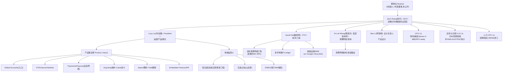
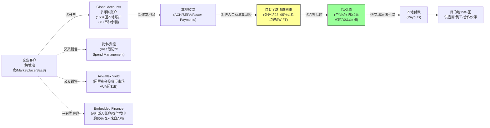

# Airwallex（空中云汇）

> 📌 **一句话定位**：面向企业(B2B)的全球支付与金融基础设施平台——多币种账户+跨境收付款+外汇为核心，**自建全球清算网络(自述处理约 93–95% 交易于自有网络、绕过 SWIFT)**，并在多国持牌提供本地账户、发卡、收单、费控、嵌入式金融与理财。
> 🏷️ **角色归类**：**两者都做，以"跨境收付款+全球账户"为主、"本地收单"为辅**（呼应 `03-crossborder-business §13.3`）。
> ⚠️ **数据时效**：截至 2026-06。📌 牌照实体经官方 Global Entities 页核对；未上市无审计财报，TPV/营收/估值多 Sacra/FXC 二手口径，且来源间冲突(尤其 TPV $130B vs $266B)。

---

## 1. 基本信息
- **成立**：2015 年(墨尔本)——起因 Jack Zhang 与 Max Li 投资的咖啡馆遭遇跨境收款贵；5 位创始人共投约 $1M
- **总部**：**双总部 旧金山 + 新加坡**(原墨尔本起家)
- **当前状态**：⚠️**未上市**(估值 $8B)，被广泛报道"2026 IPO-ready"但尚未提交招股书

## 2. 背景与沿革（里程碑时间线）📌Wikipedia+新闻
| 时间 | 里程碑 |
|---|---|
| 2015 | 墨尔本 5 人创立，closed beta |
| 2017 | ANZ 提供交易服务；TPV 仅约 $5M |
| 2018 | HQ 迁香港；**拒绝 Stripe 约 $10 亿收购要约**；融资 $80M |
| 2019 | 澳洲第三只科技独角兽($1B) |
| 2020 | TPV 约 $10B |
| 2021 | 进入美国/新加坡；发 Visa 借记卡；获荷兰 EMI(5月)、马来西亚(9月)；Series E1 **$5.5B**(11月) |
| 2023 | 收购墨西哥 MexPago；**获中国第三方支付牌照**；上线 **Airwallex Yield**(澳洲) |
| 2024 | 扩张法国；McLaren F1 合作；7月获 ASIC AFSL；8月宣布 $500M 收入 run-rate |
| 2025 | 进入新西兰/日本(11月)/印尼；Arsenal 合作；Series F **$6.2B**(5月)；Series G **$8B**(12月)；Q4 达 EBITDA 盈利 |
| 2026 | 收购韩国 Paynuri；扩张德国；**1月 AUSTRAC 下令外部审计** |

> 战略主线：从"跨境收款/外汇"单点 → 自建全球清算网络 → 叠加账户/发卡/费控/Yield → API 化做嵌入式金融平台，从"**FX 玩家**"转型为"**全球银行/金融基础设施平台**"。

## 3. 股东与资本 📌
- **估值曲线**：2019 $1B → 2021-11 **$5.5B**(Series E1) → 2022 $5.6B → 2025-05 **$6.2B**(Series F, $300M) → 2025-12 **$8B**(Series G, $330M，较 F 轮 +约30%)；累计融资约 $1.5–1.57B
- **投资人**：Addition(2025-12 领投)、Visa Ventures、Blackbird、Airtree、T. Rowe Price、Activant、Robinhood Ventures、TIAA Ventures；早期股东含腾讯、李嘉诚系、红杉中国(媒体)

## 4. 牌照与资质 📌官方 Global Entities 页（⚠️ 除澳洲 AFSL 外多未列证号）
自述约 **80 项牌照/许可**(公司口径，非穷举)。已确认实体：
| 法域 | 实体 | 牌照 | 监管 |
|---|---|---|---|
| **澳大利亚** | Airwallex Pty Ltd / SVF / Capital | **AFSL 549026**(📌证号已核查) + AUSTRAC 注册 | ASIC/AUSTRAC |
| **荷兰/EEA** | Airwallex (Netherlands) BV | **EMI**(2021-05，EEA passporting) | 荷兰 DNB |
| **英国** | Airwallex (UK) Ltd | EMI/支付机构 | FCA |
| **新加坡** | Airwallex (Singapore) | 主要支付机构 MPI | MAS |
| **香港** | Airwallex (HK) Ltd | 货币服务经营者 MSO | 香港海关 |
| **美国** | Airwallex US, LLC | FinCEN MSB + 各州 MTL | 各州/FinCEN |
| **加拿大** | Airwallex (Canada) | MSB | FINTRAC |
| **马来西亚** | Airwallex (Malaysia) | 2021-09 获牌 | BNM |
| 新西兰/以色列 | 各本地实体 | — | — |
| **中国大陆** | 经收购获第三方支付牌照(2023) | — | 央行(实体名/证号未核) |
| 日本 | 2025-11 完成注册 | 资金移动业相关 | — |
| 墨西哥/韩国 | MexPago(2023收购)/Paynuri(2026收购) | 本地资质 | — |
- ⚠️ "约 80 项"逐项归属未穷举，需查 ASIC/DNB/FCA/MAS/NMLS/FINTRAC 等名录

## 5. 定位与商业模式（收入结构）📌Sacra/FXC 二手
- **收入结构**(Sacra)：跨境支付 ≈ **60%**(服务初创/marketplace 如京东)、全球账户产品 ≈ **40%**；另口径"约 60% 收入来自 API/嵌入式产品"(与前者有重叠归类)
- 📌 **结构性转型(关键)**：截至 2025 年中，"**超 50% 毛利来自境内支付(domestic payments)+发卡(card issuing)**"——从历史依赖跨境 FX 价差，转向收单+发卡+账户多元结构；**FX 仅占约 20% 交易**(FXC 2025-07)，印证已从"换汇商"转型为"全球银行平台"
- **费率**：交易按百分比收费(低于银行)+SaaS 分层定价；FX 在中间价加约 **0.2% margin**(比传统外汇便宜 50–80%)
- ⚠️ 未上市无审计财报，以上百分比均 Sacra/二手口径，绝对收入额未公开

## 6. 核心产品与业务范围 📌官方+二手

> 🧭 **本节读法**：先一张**产品全景速查表**(按 8 层归类)，再对核心产品逐个深挖定位/目标客户/功能/市场位置/核心竞争力/vs竞品差异化。⚠️ **竞品对比多为 🔧 行业公知/分析机构口径，具体排名会随时间漂移**。§12 已有 vs Wise/Stripe/Nium/Payoneer 深度对比，此处简化引用、避免重复。

📌 **产品全景速查表**(归 8 层)：

| 层 | 产品 | 一句话定位 | 在 §5 商业模式的角色 |
|---|---|---|---|
| **A 入口·全球账户** | Global Accounts | 150+国本地收款账户+60+币种余额 | 入口产品·锁客户·带出全栈 |
| **B 外汇** | FX/Financial Markets | 实时换汇/锁汇/远期，中间价+约0.2% | 历史核心(曾主导)，现仅占约20%交易 |
| **C 跨境收付** | Payments / Payouts | 向150+国本地付款，自有网络处理约93–95% | 收入主体·跨境支付≈60%收入 |
| **D 收单** | Acquiring | 电商/平台收单+MoR模式 | 境内支付+发卡已占>50%毛利 |
| **E 发卡** | Cards/Issuing | Visa借记卡/虚拟卡/费用卡 | 境内支付+发卡已占>50%毛利(主力) |
| **F 费控** | Spend Management | 企业支出/报销/预算管控+卡 | 与卡/账户绑定·提升ARPU |
| **G 嵌入式** | Embedded Finance/Payments for Platforms | API嵌入账户/收付/发卡/外汇 | 约60%收入来自API/嵌入式 |
| **H 理财** | Airwallex Yield | 闲置资金投货币市场基金 | 新增(2023澳洲上线)，AUA已超$1B |

---

### 6.A Global Accounts(入口产品)——全球账户
- **定位/目标客户**：B2B 企业跨境经营入口，从初创到成长型企业，尤其跨境电商/marketplace/SaaS。
- **功能**：在 **150+ 国/地区**开本地收款账户(收本地 ACH/SEPA/Faster Payments)，持 **60+ 币种余额**，无需各国开本地银行账户；支持多账户管理。
- **市场位置**：🔧 对标 **Wise Business(多币种账户)、Revolut Business、Payoneer(收款账户)**。
- **核心竞争力**：① **账户覆盖 150+ 国**(广度胜出)；② **无需各国开行账户**(降门槛)；③ **锁客入口**(开户后带出 FX/Payments/Issuing/Yield 交叉销售，见 §5 结构转型)。
- **vs 竞品差异化**🔧：**vs Wise**(Wise 账户网络更广、C 端品牌更强，Airwallex 更偏 B 端全栈/API 化)；**vs Payoneer**(Payoneer 强 marketplace 卖家、Airwallex 客群上探成长型企业+自有清算网络更深)。

### 6.B FX/Financial Markets——外汇
- **定位/目标客户**：需跨币种换汇的企业、锁汇需求、套期保值。
- **功能**：实时换汇/锁汇/远期，中间价加约 **0.2% margin**(比传统外汇便宜 50–80%)。
- **市场位置/竞争力**：🔧 对标 **Wise(透明定价)、传统银行外汇(贵 2–3%)**。FX 曾是 Airwallex 起家核心(2015 咖啡馆换汇痛点)，但📌 **现仅占约 20% 交易**(FXC 2025-07)——已从"换汇商"转型"全球银行平台"(见 §5)。
- **vs 竞品差异化**🔧：比银行便宜但不如 Wise 激进透明；差异化在**与账户/收付/发卡一体**，非单纯 FX。

### 6.C Payments/Payouts——跨境收付款
- **定位/目标客户**：需向海外员工/供应商/合作伙伴付款的企业。
- **功能**：向 **150+ 国本地付款**，📌 **自有网络处理约 93–95% 交易绕过 SWIFT**(公司自述，核心护城河)。
- **市场位置**：🔧 对标 **Wise(C2C+中小 B)、Nium(纯 B2B payout rails)、Payoneer(卖家收款)、传统 SWIFT(慢+贵)**。
- **核心竞争力**：**自建全球清算网络**(处理约 93–95%，降本提速、难复制)——这是技术护城河核心(§11)。
- **vs 竞品差异化**🔧：**vs Nium**(Nium 纯 payout rails+发卡 API，Airwallex 产品线更全含前台账户/费控/Yield)；详见 §12。

### 6.D Acquiring(收单)
- **定位/目标客户**：电商/平台需收单。
- **功能**：为电商/平台收单，支持多本地支付方式；**Merchant of Record(MoR)模式**可由 Airwallex 承担合规。
- **市场位置/竞争力**：🔧 对标 **Stripe(线上收单王者)、Adyen(企业级)、Checkout.com**。📌 **境内支付+发卡已占 >50% 毛利**(§5，2025)——从依赖跨境 FX 转向本地收单+发卡。
- **vs 竞品差异化**🔧：**vs Stripe**(Stripe 强线上开发者生态/美国核心，Airwallex 强多币种账户+跨境付款+自有清算/亚太起家)；详见 §12。

### 6.E Cards/Issuing(发卡)
- **定位/目标客户**：企业需给员工发费用卡、虚拟卡控费。
- **功能**：Visa **借记卡/虚拟卡/费用卡**，实时控额/限商户类目。
- **市场位置/竞争力**：🔧 对标 **Brex/Ramp(美国费控+卡)、Marqeta(发卡 API)**。📌 **已成毛利主力之一**(境内支付+发卡 >50% 毛利，§5)。
- **vs 竞品差异化**🔧：**与账户/收付/Yield 一体**(一站买齐)，非单纯发卡；Brex/Ramp 强美国市场+信用卡，Airwallex 借记卡+全球覆盖。

### 6.F Spend Management(费控)
- **定位/目标客户**：企业需管控员工支出/报销/预算。
- **功能**：企业支出/报销/预算管控+卡，对标 **Brex/Ramp**。
- **vs 竞品差异化**🔧：绑定 Airwallex 账户+卡，提升 ARPU；Brex/Ramp 美国本土深耕+信用产品，Airwallex 全球覆盖+借记。

### 6.G Embedded Finance/Payments for Platforms——嵌入式金融
- **定位/目标客户**：平台型客户(marketplace/SaaS)想白标嵌入支付/账户/发卡能力。
- **功能**：API 让平台嵌入账户/收付/发卡/外汇；📌 **约 60% 收入来自 API/嵌入式**(§5，与"跨境支付 ≈ 60%"有归类重叠)；正探索"嵌入式信贷"。
- **市场位置**：🔧 对标 **Stripe Connect(平台分账)、Nium(嵌入式 payout/发卡)**。
- **核心竞争力**：**API 化+白标**，平台客户切换成本高；**60% 收入占比**印证平台绑定成功。
- **vs 竞品差异化**🔧：**vs Stripe Connect**(Stripe 开发者生态+美国强，Airwallex 亚太起家+自有清算+多币种账户深)；详见 §12。

### 6.H Airwallex Yield——企业理财
- **定位/目标客户**：企业有闲置资金想赚收益。
- **功能**：企业闲置资金投货币市场基金赚收益(2023 澳洲上线，扩至香港/新加坡/荷兰)。
- **市场位置/规模**：📌 **AUA 超 $1B**(§8)，新增产品(2023 起)。
- **vs 竞品差异化**🔧：与账户绑定、一站配置，对标 **Brex Cash(美国企业现金管理)**；差异在 Airwallex 全球多法域、Brex 美国本土深。

---

> 🎯 **产品全景总结**：**Global Accounts(入口锁客)→ 交叉销售 FX/Payments/Acquiring/Cards/Spend/Yield → 用 Embedded Finance(API)绑定平台型大客户**——从单点"换汇"已转型为"全球账户+收付+发卡+费控+理财"的 B2B 全栈金融平台。核心护城河=**自建全球清算网络(约 93–95%)+约 80 项牌照+API 平台绑定**(§11)。

## 7. 业务区域 📌按大区+国家+现状

> 🧭 **读法**：按"规模分量 → 牌照根基 → 业务重点 → 主要客户"逐区拆。⚠️ **各区收入占比未披露**(未上市)，"规模分量"为结构判断+公开信号(总部/牌照/增速)，非精确营收数字。

📌 **三大区+新兴一览速查**：

| 区域 | 规模分量 | 牌照根基 | 业务重点 | 增速/代表客户 |
|---|---|---|---|---|
| **亚太** | **核心基本盘**(发源地，双总部之一在新加坡) | 澳洲AFSL+新加坡MPI+香港MSO+中国支付牌照+马来/日本/韩国/印尼 | 全产品主战场、工程重镇(香港/中国) | 澳洲起家、香港工程、中国争议 |
| **欧洲/EMEA** | **第二据点**(荷兰EMI枢纽) | 荷兰EMI(EEA passport)+英国FCA+中东扩张 | 企业跨境收付、欧盟账户 | 📌 **+116%**(2025 同比，Sacra) |
| **北美** | **扩张中**(双总部之一在旧金山) | 美国MSB+州MTL+加拿大FINTRAC | 企业扩张、对标Brex/Ramp客群 | 📌 **+171%**(2025 同比，增速最快) |
| **拉美/中东/非洲** | **新兴**(本地化收购打法) | 墨西哥MexPago+UAE扩张 | 本地账户+收付 | 墨西哥2023收购 |

---

### 7.1 亚太 —— 核心基本盘(发源地)
- **规模分量**：📌 **最大市场**，墨尔本起家(2015)、香港曾为总部(2018–2021)、新加坡为**双总部之一**；⚠️ 营收占比未披露，但从起家地、工程团队(香港/中国)、客户名单判断，**亚太是绝对主力**。
- **牌照根基**：澳洲 **AFSL 549026**(§4 唯一有证号)、新加坡 **MPI**(MAS)、香港 **MSO**、中国大陆**第三方支付牌照**(2023 收购)、马来西亚(2021)、日本(2025-11)、韩国 Paynuri(2026 收购)、印尼。
- **业务重点**：**全产品线主战场**——Global Accounts/FX/Payments/Issuing/Yield 几乎都在亚太先跑通；**香港/中国大陆是工程重镇**(但 2025 底因数据争议据报将部分员工迁出，§13)。
- **主要客户**：📌 **Brex(Airwallex 为其提供全球资金移动)、京东(跨境支付)**、SHEIN、Zip、Bird(亚太)；McLaren/Arsenal 为全球体育营销非单区。

### 7.2 欧洲/EMEA —— 第二据点(荷兰枢纽)
- **规模分量**：📌 **第二大据点**，荷兰为**欧盟枢纽**(2021 获 EMI，EEA passporting)。
- **牌照根基**：荷兰 **Airwallex (Netherlands) BV**(DNB 颁 **EMI**，通行 **EEA**)；英国 **Airwallex (UK) Ltd**(FCA EMI/支付机构)。
- **业务重点**：① 用 EMI 牌照在 EEA 自主运营账户/收付；② 企业客户扩张(法国 2024、德国 2026)；③ **Airwallex Yield** 已扩至荷兰(澳洲/香港/新加坡后)。
- **增速**：📌 **EMEA 收入 2025 同比 +116%**(Sacra)——第二快(仅次北美)。

### 7.3 北美 —— 扩张中(增速最快)
- **规模分量**：⚠️ **扩张中**，体量小于亚太但被列为增长重点；双总部之一在**旧金山**(2021 起)。
- **牌照根基**：美国 **Airwallex US, LLC**(FinCEN **MSB** + 各州 **MTL**)；加拿大(FINTRAC **MSB**)。
- **业务重点**：**对标 Brex/Ramp 客群**——企业费控+发卡+账户；跨境收付(向拉美/亚太付款)。
- **增速**：📌 **Americas 收入 2025 同比 +171%**(Sacra，增速最快)——印证北美为扩张主攻方向。
- **主要客户**：Brex(反向是 Airwallex 客户)、Rippling、Deel、Navan(全球企业，北美总部)。

### 7.4 拉美 / 中东 / 非洲 —— 新兴(本地化打法)
- **拉美**：墨西哥(2023 收购 **MexPago**，本地牌照+账户)——以收购本地化进入。
- **中东**：UAE 为新扩张(媒体，牌照状态未核)。
- **非洲**：⚠️ 未查到实质自营(与 Stripe 收购 Paystack 对比，Airwallex 未覆盖非洲)。
- **业务重点**：本地账户+收付，打法=**收购本地实体(MexPago/Paynuri)**，而非全产品线复制。

---

📌 **跨区能力·全球收付**：自述可向 **150+ 国转账**，自有网络处理约 **93–95% 交易绕过 SWIFT**(§6)——这是跨区核心能力，但各区业务成熟度差异大：亚太/EMEA 成熟、北美高速增长、拉美/中东新兴。
> ⚠️ 这条揭示一个边界：Airwallex 强在"**自有清算网络+多法域账户**"，但各区**本地合规/运营成熟度**不一(如中国数据争议 §13、AUSTRAC 审计 §13)——这是快速全球化的结构性风险。

## 8. 规模与数据 ⚠️Sacra/二手（口径冲突已标注）
- **TPV(年化)**：2017 约 $5M → 2020 $10B → 2025 约 **$130B**(较早口径) → Sacra 最新 **$266B**(⚠️ 两口径差异大)
- **收入/ARR**：2024-08 约 $500M run-rate → 2025-07 接近 $900M、目标 Q4 破 $1B → 2025 底 ARR **$1.1B** → 2026-04 **$1.3B**(2025 同比 +约70%)
- **盈利**：Sacra 称 2025 Q4 达 **EBITDA 盈利**；H1 2025 毛利同比 +78%
- **客户**：FXC(2025-07)15 万家已开户、月活不到 10万；Sacra 最新 **20万+ 企业**；目标 2030 月活破百万
- 员工 ~2,000(2026)；Yield AUA 超 $1B

## 9. 组织架构 + 管理层 📌5 创始人

> ⚠️ **可信度分层(本节务必先读)**：Airwallex **未上市、无 10-K、不公开详细组织架构图**。因此本节区分三层：**📌 已核实**(5 创始人姓名/头衔+法律实体——来自官方 Global Entities 页/Wikipedia)；**🔧 行业通行结构**(金融科技公司普遍设的职能部门与典型角色，教学性还原)；**⚠️ 推断**(把已知信息映射到部门——非 Airwallex 官方披露的汇报线)。**勿把🔧/⚠️的部门/角色当成 Airwallex 实际内部建制的事实**。

### 9.1 高管层(C-Suite) 📌已核实 5 创始人
- **Jack Zhang(张乐)** — **CEO** 兼联合创始人(曾为 NAB/ANZ 设计数字外汇平台、墨尔本大学背景，2025 对外回应数据争议的主要发声人)
- **Lucy Liu(刘洁微)** — **President(总裁)** 兼联合创始人(墨尔本大学金融)
- **Max Li(李锦桐)** — 联合创始人，**设计负责人**(与 Zhang 共同投咖啡馆遇换汇痛点触发创业)
- **Xijing "Jacob" Dai(戴希菁)** — 联合创始人兼 **CTO**
- **Ki-Lok Wong(黄基乐)** — 联合创始人，**首席架构师**
- 5 人多为墨尔本大学校友。⚠️ CFO/COO/CLO 等非创始高管姓名、董事会成员未查到

### 9.2 整体组织架构(树状图)

> 📌 实线=已核实创始人/实体；🔧/⚠️=行业通行职能部门与推断映射(非官方汇报线)。Airwallex 内部以**产品线(product lines)+ 地域(geography)+ 职能中台(functions)矩阵式**运作是公开口径(双总部+多法域实体)，但具体汇报关系未披露。

### 9.3 法律实体结构(树状图) 📌已核实实体

```mermaid
flowchart TB
    GROUP["Airwallex 集团📌<br/>双总部:旧金山+新加坡"]
    
    GROUP --> APT["亚太实体群"]
    APT --> AU["Airwallex Pty Ltd / SVF / Capital📌<br/>澳大利亚:AFSL 549026(ASIC/AUSTRAC)"]
    APT --> SG["Airwallex(Singapore)📌<br/>新加坡:MPI(MAS)"]
    APT --> HK["Airwallex(HK) Ltd📌<br/>香港:MSO(香港海关)"]
    APT --> CN["中国实体📌<br/>第三方支付牌照(2023收购,实体名未核)"]
    APT --> MY["Airwallex(Malaysia)📌<br/>马来西亚:2021-09获牌(BNM)"]
    APT --> JP["日本实体📌<br/>2025-11注册(资金移动业)"]
    APT --> KR["Paynuri📌<br/>韩国:2026收购,本地牌照"]
    APT --> ID["印尼(Skye Sab)⚠️"]

    GROUP --> EMEA["欧洲/EMEA实体群"]
    EMEA --> NL["Airwallex(Netherlands) BV📌<br/>荷兰:EMI(DNB,EEA passport)"]
    EMEA --> UK["Airwallex(UK) Ltd📌<br/>英国:EMI/支付机构(FCA)"]
    EMEA --> IL["以色列实体📌(具体牌照未核)"]
    EMEA --> UAE["UAE扩张⚠️(牌照状态未核)"]

    GROUP --> AMER["北美实体群"]
    AMER --> US["Airwallex US, LLC📌<br/>美国:FinCEN MSB+各州MTL"]
    AMER --> CA["Airwallex(Canada)📌<br/>加拿大:MSB(FINTRAC)"]

    GROUP --> LATAM["拉美实体群"]
    LATAM --> MX["MexPago📌<br/>墨西哥:2023收购,本地牌照"]
```

### 9.4 各实体/事业群：部门—职责—角色—角色职责

> 🔧⚠️ **以下为行业通行结构 + 按已知信息推断的还原**(教学用，非 Airwallex 官方建制)。目的是建立"一家这种规模的跨境金融科技公司内部大致怎么分工"的心智模型。

**A. Airwallex 集团(双总部)——总部职能中台** 🔧通行结构

| 部门 | 职责 | 典型角色 | 角色职责 |
|---|---|---|---|
| **工程(Engineering)** | 建设并运维自有清算网络+多币种账户+发卡+API | **CTO Jacob Dai📌** / **首席架构师 Ki-Lok Wong📌** / VP Eng / 工程总监 / Staff·Sr 工程师 / SRE | CTO 定技术战略；首席架构师管清算网络架构；VP/总监管事业群工程团队；Staff 工程师攻核心系统(自有清算网络/Ledger/FX 引擎)；SRE 保高可用(处理约 93–95% 交易,§6) |
| **产品(Product)** | 定义产品路线、需求、定价 | CPO🔧 / **Max Li(设计负责人)📌** / 产品总监 / PM | 按事业群(Global Accounts/Payments/Issuing/Yield…)负责路线图与商业化；Max Li 管产品设计 |
| **财务(Finance)** | 财务/融资/IPO 筹备 | **CFO🔧⚠️**(姓名未公开) / FP&A / 司库 Treasurer / 会计 | CFO 管融资(Series G $8B)、估值、IPO-ready；司库管浮存+Yield 底层基金；FP&A 做预算预测 |
| **法务与合规(Legal & Compliance)** | 约 80 项牌照、监管、反洗钱、AUSTRAC 审计应对 | CLO🔧⚠️ / 合规官 CCO / BSA Officer / 反洗钱分析师 / 数据保护官 DPO | 维护各法域牌照(AFSL/EMI/MPI/MSB/MTL)；应对 **AUSTRAC 2026-01 外部审计**(§13)；AML/KYC/KYB/OFAC 筛查；数据驻留(中美争议,§13) |
| **商业/GTM(Business)** | 销售、BD、合作、市场 | CBO🔧⚠️ / 销售VP / 客户经理 / 合作经理 | 企业销售攻成长型企业/平台型客户；合作经理管 Visa/银行伙伴关系；体育营销(McLaren/Arsenal) |
| **人力(People)** | 招聘、组织、文化 | CPO🔧⚠️ / HRBP / 招聘 | 支撑约 2,000 员工的招聘与组织设计；跨法域团队协同(2025 底因数据争议迁出部分中国员工,§13) |

**B. 各地域实体——按法域持牌运营** 📌实体确证，🔧职责还原

| 实体/法域 | 职责 | 关键牌照/角色 |
|---|---|---|
| **澳洲 Airwallex Pty Ltd / SVF / Capital** | 作为 **AFSL 549026** 持牌人，合法提供账户/收付/发卡/Yield；**接受 AUSTRAC 监管**(2026-01 外部审计,§13) | 澳洲合规负责人、AUSTRAC 对接、Yield 产品(2023 首发澳洲) |
| **新加坡 Airwallex(Singapore)** | 作为 **MPI**(主要支付机构)持牌人，提供账户/收付/发卡；**双总部之一**(商业枢纽) | 新加坡合规、MAS 对接、亚太销售 |
| **香港 Airwallex(HK) Ltd** | 作为 **MSO** 持牌人，提供货币服务；**工程重镇**(与中国大陆团队协同，2025 底争议后部分迁出) | 香港合规、海关对接、工程团队 |
| **中国大陆实体** | 作为**第三方支付牌照**持牌人(2023 收购)；**工程团队**(但 2025 底因数据争议据报将部分员工迁出,§13) | 中国合规、央行对接、工程团队(数据访问权争议焦点) |
| **荷兰 Airwallex(Netherlands) BV** | 作为 **EMI** 持牌人(DNB)，凭 **EEA passporting** 通行欧盟，提供账户/收付；**欧盟枢纽** | 欧盟合规负责人、DNB 对接、Yield 扩至荷兰 |
| **英国 Airwallex(UK) Ltd** | 作为 **EMI/支付机构**(FCA)持牌人，提供英国账户/收付 | 英国合规、FCA 对接 |
| **美国 Airwallex US, LLC** | 作为 **FinCEN MSB + 各州 MTL** 持牌人，提供账户/收付/发卡；**双总部之一**(旧金山，商业扩张主攻) | 美国合规、FinCEN/各州对接、北美销售(对标 Brex/Ramp 客群) |
| **加拿大 Airwallex(Canada)** | 作为 **MSB**(FINTRAC)持牌人，提供账户/收付 | 加拿大合规、FINTRAC 对接 |
| **墨西哥 MexPago** | 2023 收购，**本地牌照+账户**，拉美入口 | 墨西哥本地团队 |
| **韩国 Paynuri** | 2026 收购，**本地牌照**，亚太扩张 | 韩国本地团队 |

**C. 核心技术组件——自有清算网络** 📌公司自述(§6/§10)

| 组件 | 职责 | 角色 |
|---|---|---|
| **自有全球清算网络** | 处理约 **93–95% 交易绕过 SWIFT**(§6)，降本提速 | **首席架构师 Ki-Lok Wong📌**、清算网络工程、资金路由、多法域合规清算 |
| **多币种账户/Ledger** | 支撑 **60+ 币种余额**、150+国本地账户 | 账本工程、余额管理、对账 |
| **FX 引擎** | 实时换汇、锁汇、远期，中间价+约 0.2% | FX 定价、流动性管理 |
| **基础设施**(on Google Cloud,§10) | **Google Cloud + Apache APISIX**(边缘网关) | SRE、API 网关、数据驻留(按地域隔离,§13 争议核心) |

> 🎯 **看组织架构的三个要点**：① **5 创始人紧密协作**(Jack Zhang CEO/Lucy Liu President/Jacob Dai CTO/Ki-Lok Wong 首席架构师/Max Li 设计)是公司决策核心；② **"产品线 × 地域 × 职能中台"三维矩阵**——产品按 Global Accounts/FX/Payments/Issuing/Spend/Yield/Embedded 分线，地域按亚太/EMEA/北美分区(双总部)，工程/财务/法务/合规横向支撑；③ **法律实体 = 牌照地图的镜像**——澳洲 AFSL/新加坡 MPI/荷兰 EMI/美国 MSB+MTL/墨西哥 MexPago/韩国 Paynuri 各自承接对应法域的持牌运营(与 §4 牌照、§7 区域一一对应)。

## 10. 技术架构特点 📌（⚠️ 用 Google Cloud，非 AWS）

### 10.0 核心模型资金流图(一张图看清 Airwallex 怎么工作)

> 🎯 **一句话看懂**：企业客户 → 开 **Global Accounts 多币种账户**收 150+国本地款 → 进 **自有清算网络**(处理约 93–95%，绕过 SWIFT) → 经 **FX 换汇**(约 0.2% margin) → 向 150+国本地付款。核心竞争力=**自有清算网络**(黄色框)降本提速，再交叉销售**发卡/费控/Yield/嵌入式**(虚线)提升 ARPU。这正是 §5 结构转型的可视化：从单纯"FX 价差"(绿色框，现仅占约 20%)转向"境内支付+发卡+账户+嵌入式"多元结构(>50% 毛利)。

---

### 10.1 是否用 AWS：⚠️ 用 Google Cloud，非 AWS
- **自有全球清算网络**：自述处理约 **93–95% 交易于自有网络**(绕过 SWIFT)，是核心技术护城河
- **云**：📌 **有 Google Cloud 客户案例**(cloud.google.com/customers/airwallex-ai)，指向用 GCP+AI；⚠️ **未见证据主用 AWS**
- **API 网关**：用开源 **Apache APISIX**，部署在自有私有网络边缘强化数据主权，是 APISIX 知名用户/贡献者
- **API 能力**：money movement API(多币种账户/FX/付款/connected accounts/嵌入式金融)
- **AI**：ML+生成式 AI 用于客户 onboarding、运营。⚠️ 架构细节(数据库/清算网络拓扑/资金路由)未公开

## 11. 护城河与差异化
① **自有全球清算网络**(处理约 93–95% 交易，降本提速，难复制) ② **约 80 项牌照矩阵** ③ **B 端全栈**(账户→FX→收付→发卡→费控→嵌入式→Yield)交叉销售 ④ 约 60% 营收来自 API/嵌入式绑定平台型客户、切换成本高 ⑤ **毛利已从依赖 FX 价差转向境内支付+发卡(>50% 毛利)，抗周期性增强**

## 12. 主要竞争对手 📌+🔧具体对比
- **vs Wise**：Wise 强 C 端+中小企业廉价透明汇款、本地账户网络更广、合规历史更长(已上市)；Airwallex 更偏 B 端全栈、产品广度更宽
- **vs Stripe**：Stripe 强线上收单/开发者生态(美国核心)，Airwallex 强多币种账户+跨境付款+自有清算(亚太起家、150+国收付款)；两者在"嵌入式金融/Payments for Platforms"正面竞争；2018 Airwallex 曾拒 Stripe 约 $10 亿收购
- **vs Nium**：同为 B2B 跨境基础设施，Nium 更纯做 payout rails+发卡 API；Airwallex 产品线更全(含 SMB 前台账户/费控/Yield)、自有账户体系更重
- **vs Payoneer**：Payoneer(已上市)强 marketplace 卖家收款+新兴市场、客群偏中小卖家；Airwallex 客群上探成长型企业/平台
- **差异化**：自建全球清算网络(自有处理约 93–95%)+B 端全栈+亚太基因+约 80 项牌照

## 13. 监管与最新动态 ⚠️时效 2025-2026（两大悬而未决风险）
- 📌 **2026-01-22 AUSTRAC 外部审计**：依《AML/CTF Act 2006》第 162 条对 Airwallex Designated Business Group 指定**独立外部审计师**，审查 AML/CTF 程序、客户尽调与可疑事项报告；AUSTRAC CEO 称公司"未能展示对客户身份的可接受理解"；审计费用 Airwallex 承担，须任命后 **180 天内报告**，结果决定是否进一步监管行动。公司称将配合、认为控制适当——⚠️ **结论 180 天内出，若指向系统性 AML 缺陷可能引发处罚/影响 IPO**
- 📌 **2025-12 中美数据争议**：Khosla Ventures、早期 Stripe 投资人 Keith Rabois 公开指 Airwallex 公司结构/工程团队/中国投资人可能使美国金融数据暴露给中国政府(Forbes 称"China backdoor allegations")；参议员 Tom Cotton 援引 **EO 14117** 致函 DOJ 要求调查；CEO Jack Zhang 断然否认(称美国数据仅存美/荷/新加坡、中港员工无访问权)，据报将员工迁出中国——⚠️ **中美地缘风险是结构性悬而未决**
- 历史：2019-2021 香港约 US$18.2M 资金因洗钱嫌疑被冻结，后经法院驳回获释
- **最新**：2025-05 Series F $6.2B、2025-11 进日本、2025-12 Series G $8B+Q4 EBITDA 盈利、2026 收购韩国 Paynuri+扩德国

## 14. 标杆客户 📌
- 企业客户/平台：**Brex(Airwallex 为其提供全球资金移动)**、Rippling、Deel、Navan、SHEIN、Zip、Bird、Circles、PartnerStack；**京东(JD.com)**(跨境支付客户)
- 体育营销：**McLaren Racing(F1, 2024起)**、**Arsenal FC(2025)**
- ⚠️ 多为客户名单/合作公告，缺深度量化案例；"$235B AI 支付"口径与其他 TPV 不一致，谨慎

## 15. 与本研究 / AWS 对话的衔接
- **可聊**：**自建全球清算网络**(vs 依赖 SWIFT，处理约 93–95%)；从"FX 玩家"转型"全球银行平台"(毛利 >50% 来自境内+发卡)；约 80 项牌照矩阵；B 端全栈打法；两大悬而未决风险(AUSTRAC 审计/中美数据争议)
- **⚠️ AWS 角度(诚实)**：**公开证据指向 Airwallex 用 Google Cloud + 自建网络 + APISIX，非 AWS**。AWS 切入点更多在**"数据主权/数据驻留"**(正是其面对中美争议的核心痛点——按地域隔离美/荷/新数据)、多区域合规清算、AI onboarding/反洗钱 KYT、IPO 前可审计性/可观测性建设——但需正视它已是 GCP 客户

## 16. 来源清单
- 一手：airwallex.com/terms/airwallex-global-entities(牌照实体)、/platform-api-and-embedded-finance、AUSTRAC 官方新闻稿、cotton.senate.gov、businesswire(Series F)
- 权威二手：en.wikipedia.org/wiki/Airwallex、sacra.com/c/airwallex(收入/TPV/估值/毛利)、fxcintel.com(2025 增长)、Forbes/AFR(数据争议)、cloud.google.com/customers/airwallex-ai(GCP)、api7.ai/apisix.apache.org(APISIX)
