# 模块 2 · 互联网电子支付（业务篇）：网关、第三方支付与钱包

> **学习者**：AWS 技术架构师 · 支付小白
> **本篇目标**：搞懂互联网时代支付的新角色与新模式。学完你能回答：线上没有 POS 机怎么收款？支付网关解决什么问题？第三方支付（支付宝/微信/PayPal/Stripe）凭什么崛起、怎么赚钱？担保交易如何解决"先付钱还是先发货"的信任死结？钱包/二维码/聚合支付各是什么？为什么中国走出了和欧美完全不同的路？
> **前置**：模块1（四方模型/收单/清结算）；**配套技术篇**：`02-epayment-tech-aws.md`
> **组织方式**：top-down 主线叙述（见 `CLAUDE.md` 1.5）。零散追问见文末「附：常见追问」。
> 标注：📌 关键定义 · 💡 案例 · 🎯 与支付公司交流要点 · ⚠️ 常见误区

---

## 1. 全景：互联网给支付带来了什么新问题

模块1 的四方模型是为**线下刷卡**设计的——有物理 POS 机、卡在手上、人在现场。但互联网把交易搬到了线上，立刻冒出两个模块1 解决不了的新问题：

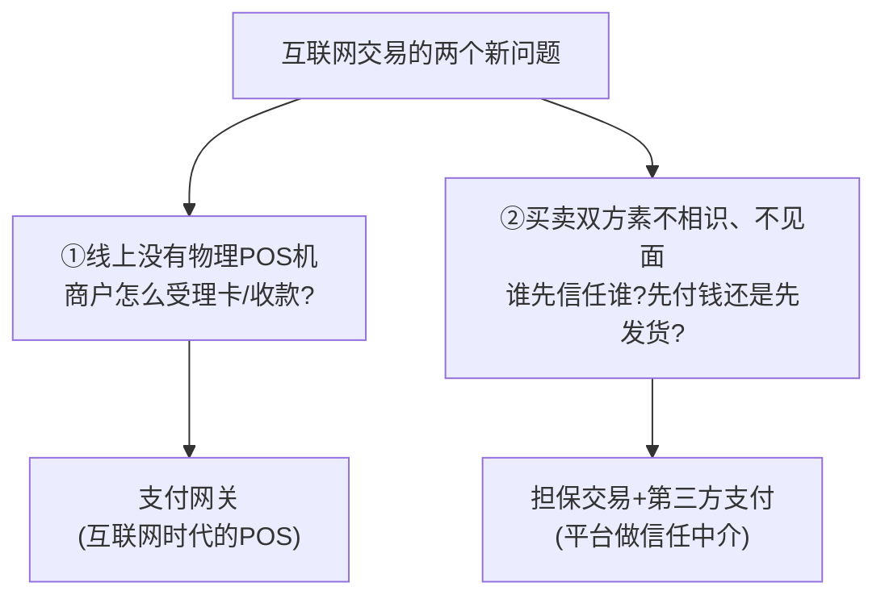

📌 **本篇主线**：互联网电子支付的核心，就是围绕这两个问题长出的新角色和新模式：
1. **支付网关**——线上受理入口（解决问题①）
2. **第三方支付 + 担保交易**——平台型信任中介（解决问题②）
3. **钱包/账户体系**——预存价值、绕开卡组织
4. **二维码/聚合支付**——中国特色的受理革命
5. **新的商业模式与护城河**——浮存、流量、场景

> 🎯 **交流要点**：模块1是"卡的世界"，模块2是"账户+互联网的世界"。中国的支付宝/微信走的是模块2的极致（账户+二维码绕开卡组织），欧美的 Stripe/PayPal 则是模块1+模块2 的融合。理解这个分野，是看懂全球支付格局的钥匙。

---

## 2. 支付网关：互联网时代的 POS

### 2.1 它解决什么问题

📌 **第一性**：线下刷卡，受理入口是**物理 POS 机**（读卡、加密、连收单行）。线上没有 POS 机，商户网站怎么安全地收一笔卡支付？**支付网关（Payment Gateway）就是"软件形态的 POS"——互联网时代的线上受理入口。**

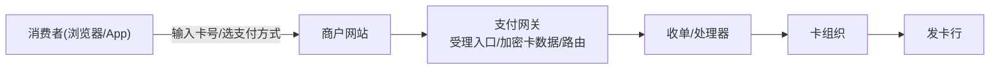

🔧 **网关做的事**（对应线下 POS 的功能）：
- 接住商户的支付请求（API/SDK/收银台页面）
- **加密敏感卡数据**（持卡人卡号绝不能明文经过商户服务器，降 PCI 范围）
- 路由到正确的收单/处理器/支付方式
- 处理异步通知、回调（线上交易结果不是同步秒回的）

### 2.2 网关 vs 处理器 vs 收单（厘清角色）

⚠️ 这三个常被混淆（模块1深化讲过系统分层，这里从业务角色再厘清）：

| 角色 | 业务定位 | 类比 |
|---|---|---|
| **支付网关 Gateway** | 线上受理入口，连接商户与后端 | 线上的"POS 机/收银台" |
| **支付处理器 Processor** | 交易处理、对接卡组织清算 | 后端"交易引擎" |
| **收单 Acquirer** | 持牌、担风险、结算给商户 | 资金的"持牌责任方" |

> 💡 现代很多玩家（Stripe/Adyen）把网关+处理器+收单**一体化**——商户接一个 API 就全搞定，这正是它们体验好的原因（模块1深化的"全栈一体"）。

### 2.3 担保交易：解决"先付钱还是先发货"的信任死结

📌 **第一性问题**（互联网交易问题②）：你网购，和陌生卖家：你怕"付了钱不发货"，卖家怕"发了货收不到钱"。这是经典的**信任死结**。

📌 **担保交易（Escrow）= 平台做中间担保人**：

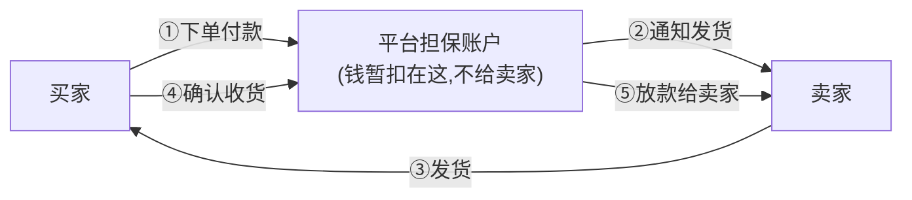

💡 **这就是支付宝的起家之本**：2003 年淘宝推出担保交易——买家付的钱先到支付宝（不直接给卖家），买家确认收货后才打给卖家。**用"平台暂扣资金"破解了陌生人交易的信任死结**，这是中国电商和第三方支付起飞的关键一步。

> 🎯 **交流要点**：担保交易是第三方支付最重要的"信任创新"。它让支付平台从"通道"变成了"信任中介"，这也是为什么支付宝/微信能沉淀巨额资金（浮存）和用户信任——它们持有的不只是通道，是信任。

---

## 3. 第三方支付：平台型支付中介

### 3.1 它是什么、解决什么

📌 **第三方支付（Third-Party Payment）**：独立于买卖双方和银行的**支付中介平台**（支付宝、微信支付、PayPal、Stripe）。它聚合了多种支付方式、多家银行/卡组织，让商户"接一个就够"，让消费者"一个账户走天下"。

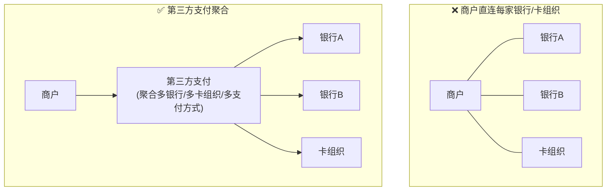

📌 **它解决的问题**：
- 对**商户**：一次接入，支持所有支付方式（降低接入成本）
- 对**消费者**：一个账户+免密支付，不用每次输卡号（体验）
- 对**信任**：担保交易（解决陌生人交易）

### 3.2 中美两条路：闭环 vs 开放

⚠️ 这是理解全球支付格局的关键分野：

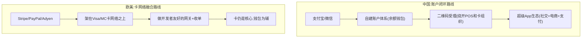

| | 中国（支付宝/微信） | 欧美（Stripe/PayPal） |
|---|---|---|
| 核心 | **账户余额 + 二维码**，绕开卡组织 | 架在**卡网络**之上 |
| 受理 | 二维码（无需 POS 硬件） | 网关+收单（卡为主） |
| 模式 | 闭环（类三方模型） | 开放（四方模型之上） |
| 生态 | 超级 App（社交/电商/生活） | 开发者/商户工具 |

> 🎯 **交流要点**：中国第三方支付"换赛道"绕开了卡组织（模块1 护城河那节讲的破局方式）——用账户+二维码自建网络。这是为什么中国是全球移动支付渗透率最高、却也是 Visa/MC 影响力最弱的市场之一。能讲清这个分野，体现你对全球支付格局的理解。

📌 **澄清高频误区：二维码 vs Stripe/PayPal 的核心区别，不是"扫码 vs 刷卡"**

⚠️ "二维码（无需 POS 硬件）"容易被理解成"区别在受理方式"——其实**二维码只是受理载体**（替代 POS 读卡那个动作，Stripe 也支持扫码、微信也能刷卡）。**真正的区别在更深一层：扫完之后这笔钱走谁的账本清算？**

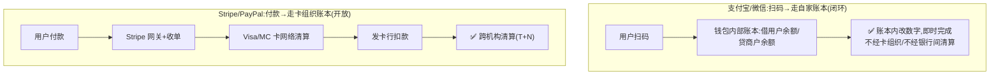

| | 支付宝/微信（二维码） | Stripe / PayPal |
|---|---|---|
| **清算走谁的账本** | **自己的账本**（钱包余额体系） | **Visa/MC 卡组织的账本** |
| **卡组织在不在链路** | ❌ 余额付时**完全绕开** | ✅ 卡是核心，**离不开** |
| **二维码/网关的角色** | 把交易导进**自家闭环账本**的入口 | 把交易导进**卡网络**的入口（网关+收单） |
| **本质** | **闭环**（自己既是钱包又是清算，类三方模型） | **开放**（架在四方模型/卡网络之上，是卡网络的代理人） |

> 📌 **第一性**（呼应模块0 账本公理）：支付宝/微信**自己造了一个账本**——买卖双方都在它钱包里有账户时，一笔扫码就是它账本内部"借用户、贷商户"的数字调整（§4.1），所以能绕开卡组织、即时到账、成本极低；**二维码只是这个闭环账本的"零硬件受理入口"**（一张纸/一块屏替代 POS，铺到街边小摊）。Stripe/PayPal **没有自己的清算账本**，本质是**卡网络的网关+收单代理**，无论扫码刷卡，钱最终都回 Visa/MC 账本清算。
> 🎯 **一句话**：核心不同不在"扫码还是刷卡"，而在"**走自家账本 vs 走卡网络账本**"——二维码能成立的前提是背后那个**自建账本**，而非二维码本身。

📌 **延伸追问：Stripe/PayPal 为什么没长出"支付宝式超级钱包"？**

⚠️ 先纠一个前提：**PayPal 其实有钱包/余额**（PayPal 余额、Venmo 社交钱包，C 端起家）；**真正刻意不做余额钱包的是 Stripe**。所以拆两半看。

**① Stripe 为什么刻意不做钱包**：

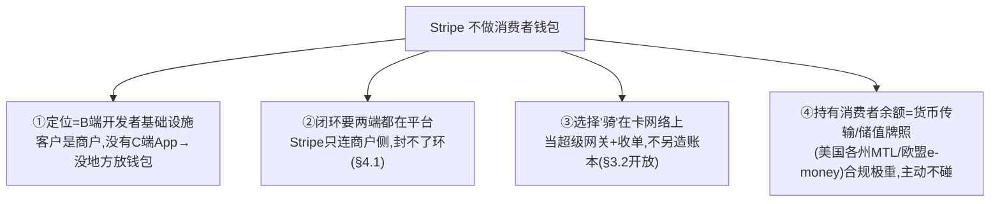
> 核心两条：**它没有"环"可闭**——余额支付要买卖双方都在同一平台有账户（§4.1），而 Stripe 客户只有商户(B端)、没有亿级消费者账户；**它选择骑在卡网络上**（§3.2 开放路线极致版），价值是"把对接 Visa/MC 做得对开发者极友好"，不和卡组织争"谁是账本"，更不想扛储值牌照。
> 💡 注：Stripe 有 **Link**（保存支付信息加速结账，仍骑在卡上、非储值余额）和 **Treasury**（给平台客户的嵌入式账户 BaaS，是 B2B2C 基础设施）——但**都不是 Stripe 自己的 C 端储值钱包**。

**② 最深一层：为什么美国市场不奖励钱包、中国却奖励**（回扣 §3.2 + 账本公理）：

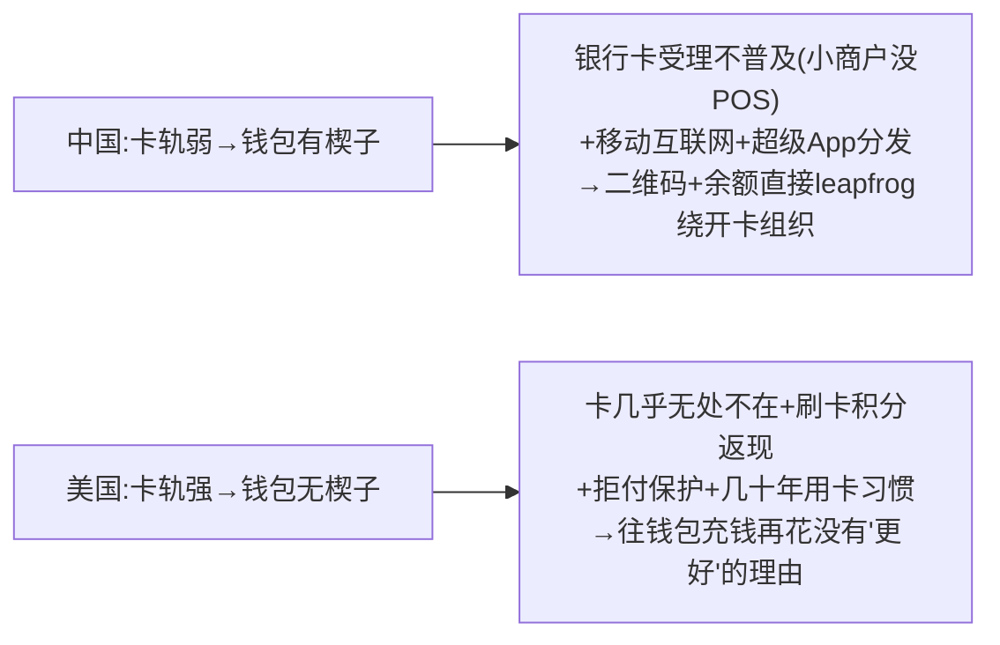
> 📌 **第一性**：**钱包的"闭环账本"只有在卡轨又弱又贵又不普及时，才比刷卡更香**。中国当年卡受理不普及+移动互联网爆发+超级 App 分发→支付宝/微信用二维码+余额账本**直接跳过卡组织**；美国/欧洲卡轨早已无处不在、有积分返现和拒付保护→消费者"充钱进钱包再花"**没有比刷卡更好的理由**。所以即便 PayPal 有余额，**美国人多把它当"绑卡的支付按钮"用，余额没长成"超级账户"**。
> 🎯 **一句话**：不是 Stripe/PayPal 不会做钱包，是**市场不奖励**——卡轨强的市场长不出闭环超级钱包；这正是 §3.2"闭环 vs 开放"由市场禀赋决定、而非单纯战略选择的体现。
> ⚠️ **可信度**：Stripe B2B 定位/骑卡网络/有 Link·Treasury 但无 C 端储值钱包、PayPal·Venmo 是消费者钱包、美国卡轨成熟致钱包无楔子——**行业格局确定事实 + 第一性推理（🔧 公知/推理级）**，未逐条一手核查；各公司产品线演进中，留意时间戳。

---

## 4. 钱包与账户体系：预存价值，绕开卡组织

### 4.1 钱包的本质

📌 **电子钱包/储值账户**：第三方支付给用户开的**预存价值账户**（支付宝余额、微信零钱、PayPal 余额、八达通）。

📌 **第一性洞察——余额支付为什么能绕开卡组织**：
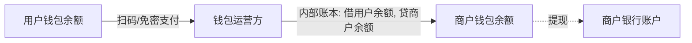
> 当买卖双方都在同一个钱包平台有账户，一笔支付就是**钱包内部账本的数字调整**（借用户、贷商户）——**不经过卡组织、不经过银行间清算，即时完成**。这就是模块0"同一账本内改数字"的体现，也是钱包支付又快又便宜的原因。

### 4.2 钱包相关的业务动作

🔧
- **充值 / 提现**：资金进出钱包（充值=银行→钱包，提现=钱包→银行）
- **绑卡 / 快捷支付**：钱包绑定银行卡，余额不足时直接从卡扣（这一步把钱包和银行卡打通，是中国移动支付起飞的关键技术）
- **代扣协议 / 免密支付**：用户一次授权，后续自动扣款（订阅、自动续费、滴滴下车自动付）
- **备付金**：用户存在钱包里的钱（沉淀资金），是浮存收益的来源（也是监管重点）

> 🎯 **交流要点**：能区分"余额支付"（钱包内部记账，不经卡组织/不经银行间清算）vs"绑卡快捷支付"（资金从银行卡出，断直连后经**网联**清算）——这是钱包业务的核心。一个钱包平台同时支持两者，按用户余额是否充足、成本路由选择。

#### 4.2.1 深挖：中国"绑卡"到底绑了什么？谁担 PCI？卡号/密码怎么存？

绑卡是高频盲点。先破一个误区：**中国的"绑卡"不是"把你的卡号拷贝存进钱包"，本质是建立一个"扣款授权协议"**——这套机制支付宝、微信**完全一样**，业内叫**快捷支付（支付宝）/ 代扣协议支付（微信）**。

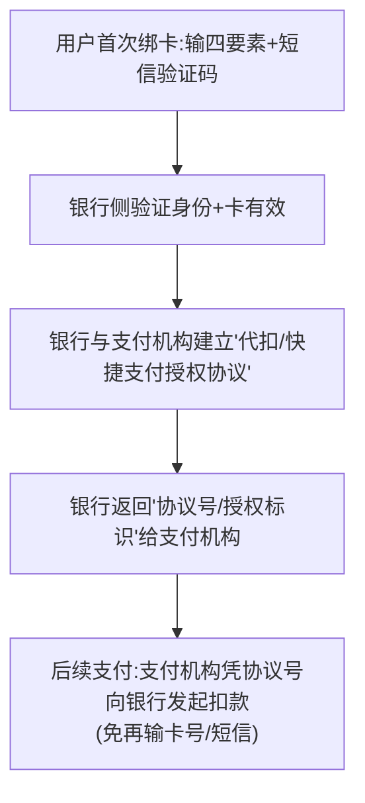

📌 **四要素是哪四要素**（银行核身"是本人本卡"）：① 姓名 ② 身份证号 ③ 银行卡号 ④ 银行预留手机号；**外加**向预留手机号下发**短信验证码**做动态核验（证明操作人持有该手机）。
- 三要素=姓名+身份证号+卡号；四要素=三要素+预留手机号；信用卡有时再加 CVV2+有效期。

📌 **绑卡存的是"协议标识"，不是"卡号 token"——两个 token 别混**：

| | A. 扣款协议标识（绑卡产物） | B. 卡号 token（Tokenization） |
|---|---|---|
| 是什么 | 银行发的"该用户授权从此卡扣款"的协议编号 | 用无意义编号替代卡号 PAN 本身 |
| 解决 | **授权 + 免密扣款能力** | **不暴露真实卡号、缩 PCI scope** |
| 谁生成 | **银行**（基于代扣协议） | 卡组织/发卡行或支付机构 vault |
| 中国快捷支付主要用 | ✅ **这个** | 部分场景也对 PAN 做 |

> 📌 **关键**：绑卡建立的是**协议关系**，"凭卡号直接扣款"的能力其实留在银行侧协议里。支付宝/微信**主要存协议标识**；真实卡号 PAN 在绑卡时虽接触过（要传银行验证），是另一套按 PCI 加密+token 化处理。

📌 **谁担 PCI DSS？卡号/密码怎么存？**

| 数据 | 能否存 | 怎么处理 |
|---|---|---|
| **完整卡号 PAN** | 可存，但须**加密+token 化** | 明文 PAN 进 Token Vault，业务层只用 token；明文处理收敛进隔离环境（呼应 `01c §4.5.1` Nitro Enclaves，缩 PCI scope） |
| **卡号首6尾4** | 可明文展示 | 用于界面"尾号1234"+BIN 路由 |
| **CVV2（背面3位）** | ❌ **绝对禁止存储**（PCI 红线） | 交易瞬间用、用完即弃，永不落库 |
| **银行卡密码 PIN** | 京东/支付宝/微信**不碰** | 快捷支付靠"短信验证码+协议"授权，卡 PIN 由银行侧验证（线上链路拿不到、也不需要） |

> 📌 **承担 PCI 的是持牌主体**：是"京东支付/支付宝/财付通"这个**持牌支付机构**（通常 PCI DSS Level 1）担合规，不是抽象的"钱包"。核心策略=**缩 scope**：大部分系统只摸 token，明文 PAN 收敛进 vault+隔离环境，密钥交给 HSM/KMS（`01c §2.8.1`）。

📌 **余额支付也要走网联吗？——分两层看**：

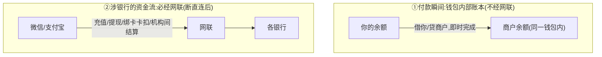

> **业务层**在钱包内改数字（余额→余额那笔，瞬间不经网联）；**资金层**只要碰银行（充值/提现/**卡扣**/机构间净额结算）就**必经网联**——这是 2018 年"断直连"的硬规定（第三方支付涉银行交易不得再直连银行）。§8 案例那句"余额支付:内部账本+网联清算"就是这两层。

📌 **"直接卡扣" vs "先充余额再付"**（⚠️ 产品策略示例，行业通行认知）：

| 模式 | 怎么走 | 例子 |
|---|---|---|
| **直接卡扣** | 钱不进余额，直接从绑定银行卡扣给商户（经网联） | 付款时**选"某银行卡"**而非"零钱"；京东收银台选"银行卡"；超零钱限额的大额 |
| **先充余额再付** | 先充值进零钱（经网联），再用余额付（内部账本） | 主动"零钱充值"；红包/收款进零钱后再花；营销诱导充值 |

> 💡 **平台为何引导"先充余额"**：余额内部划转成本极低（卡扣每笔要付银行/网联通道费），且能做余额宝等金融导流、提升黏性。⚠️ 但"吃浮存利息"这条老动机**已被备付金集中存管掐断**（§6.1）。

> ⚠️ **可信度**：绑卡=快捷支付/代扣协议、四要素+短信、协议标识机制、CVV/PIN 不存、PAN token 化、断直连必经网联、持牌主体担 PCI——均为中国支付**确定机制 + PCI 确定规则**（🔧 公知级）；各家协议标识的确切技术形态、是否网络令牌化、"先充余额"的具体产品策略=**企业内部实现，未独立核实**，按行业通行架构推断。

#### 4.2.2 做钱包的两类合规：牌照（能不能持钱）vs PCI-DSS（怎么安全碰卡）🔧+📌

> 🔑 **最易混的点**：做钱包要满足的合规是**两个不同维度**，触发逻辑完全不同——别把它们当一回事：
> - **牌照** = 监管准入：你**有没有资格持有/转移用户的钱**（政府/央行管）。
> - **PCI-DSS** = 卡数据安全标准：你**碰不碰持卡人卡数据（PAN/CVV）**（卡组织 Visa/MC 要求，非政府法律）。
> 现实中主流账户型钱包**两者通常都要满足**，但一个管"能不能持钱"、一个管"怎么安全碰卡"。

**① 需要牌照吗？——只要"持有用户余额"就必须持牌（硬牌照，不分国内外）📌**

> 触发点是"**你持不持有用户的钱**"。持有公众预存余额=拿了别人的钱沉淀在账上，监管必须管（防挪用/洗钱/跑路）。

| 地区 | 持有用户余额需要什么牌照 | 监管 |
|---|---|---|
| **中国** | 央行**《支付业务许可证》**（网络支付/预付卡类）；持有的用户余额=**备付金**，须 **100% 集中交存央行**，不得挪用、不得吃浮存（呼应 §6.1） | 中国人民银行 |
| **美国** | **各州 MTL（货币转移牌照）+ 联邦 FinCEN MSB**（持有客户余额=money transmission，见 §3.2 第178行） | 各州 + FinCEN |
| **欧盟/英国** | **EMI（电子货币机构）**——发行电子货币+持有客户余额的专门牌照，一张经 passporting 覆盖全 EEA | CBI/CSSF/DNB/FCA（见 `支付牌照术语速查.md`） |

> ⚠️ **关键分野——账户型 vs token 型钱包**（呼应 `02b §2.4` 钱包两种底座）：
> - **账户型钱包（持有余额）**：支付宝/微信/PayPal/Cash App → **必须持储值/MTL/EMI 类重牌照**。
> - **token 型钱包（不持余额，只把卡包一层）**：Apple Pay/Google Pay → **本质不是储值钱包**，钱从没进它账上、底层走卡轨道由发卡行/收单方持牌，**它自己通常不需要储值牌照**。
> 💡 这正解释了 §3.2 里 **Stripe 刻意不做 C 端储值钱包**——就是为了**不扛储值牌照**（牌照之重的反证）。

**② 必须过 PCI-DSS 吗？——看"碰不碰卡数据",不看"是不是钱包"📌**

> 判断只问一句：**你的系统接触/传输/存储信用卡卡号(PAN)等持卡人数据吗？**

| 钱包形态 | 碰卡数据吗 | 要不要 PCI-DSS |
|---|---|---|
| 账户型钱包 + 支持绑卡/卡充值（支付宝/微信/PayPal） | ✅ 绑卡/充值要接触卡号传银行验证 | ✅ **要**，通常 **PCI-DSS Level 1**（§4.2.1 第256行已确证持牌主体担 L1） |
| 纯余额钱包，完全不支持卡充值 | ❌ 理论上不碰卡 | ⚠️ 这段不直接受 PCI 管，但只要有卡充值入口就回到上一行 |
| Apple Pay/Google Pay（token 型） | 已 token 化封装 | ⚠️ 卡数据责任主要在卡组织 token 体系/发卡行/收单方，集成方可**缩小自己 PCI scope** |

> 🔑 **一句话收口**：**持有用户余额 → 必须持牌**（储值/MTL/EMI，几乎绝对）；**接触卡数据 → 必须过 PCI-DSS**（通常 L1，取决于碰不碰卡）。现实中主流账户型钱包都支持绑卡/卡充值，所以**牌照 + PCI 通常都要**。⚠️ 哪怕要过 PCI，主流策略是**缩 scope**：明文 PAN 收敛进隔离 Token Vault + HSM/KMS，业务系统只摸 token（§4.2.1、`01c`）。

> ⚠️ **可信度**：牌照触发点（持余额=储值/EMI/MTL）、PCI 触发点（碰卡=PCI L1）、缩 scope 策略，均为本文件 §4.2.1 + `支付牌照术语速查.md` 中**已核查/确定规则**（🔧 公知级 + 📌 牌照已核查）；"纯余额完全免 PCI"属边界推断，实务中极少有钱包完全不支持卡充值，写正式材料请按具体产品形态核 PCI-DSS SAQ 适用类型。

---

## 5. 二维码与聚合支付：中国特色的受理革命

### 5.1 二维码支付：绕开 POS 硬件

📌 **第一性**：模块1 的线下受理要 POS 机（贵、小商户装不起）。**二维码把"受理终端"变成了一张纸/一个手机屏**——成本趋近于零，这是中国小微商户移动支付爆发的根本原因。

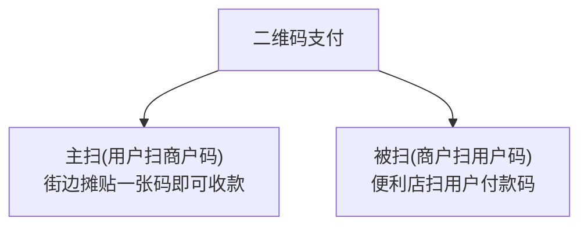

| 模式 | 谁扫谁 | 场景 |
|---|---|---|
| **主扫（C扫B）** | 用户扫商户的码 | 街边摊、小店贴一张静态码 |
| **被扫（B扫C）** | 商户扫用户的付款码 | 便利店/超市用扫码枪 |

💡 二维码受理成本几乎为零（一张打印的纸 vs 几百上千元的 POS 机），让中国数千万小微商户瞬间接入移动支付——这是模块1的卡组织体系做不到的。

### 5.2 聚合支付：一个码聚合多通道

📌 **聚合支付（Aggregated Payment）**：把多种支付方式（支付宝/微信/银联/各银行）**聚合到一个入口/一个码**，商户接一个就支持所有。代表：收钱吧、哆啦宝、Ping++。

⚠️ **聚合支付的红线（模块1深化讲过）**：聚合支付**只做技术聚合和引流，不得碰清算资金**——资金必须由持牌方清算，聚合支付碰了就是"**二清**"，违规。它本质是"ISO 角色 + 多通道技术聚合"。

> 🎯 **交流要点**：聚合支付商赚的是"服务费/技术费/分润"，不是资金沉淀。能区分"聚合支付（不碰钱）vs 持牌第三方支付（碰钱、有备付金）"，以及"一清 vs 二清"红线——是中国支付合规的基本功。

#### 5.2.1 厘清"收银台 / 网关 / 收单"三角色：一台收银台，挂多条链路

聚合场景最容易混的是这三个角色。先给第一性定义，再看一个收银台为什么背后挂多条链路。

| 角色 | 解决什么 | 在链路哪段 | 碰不碰钱 |
|---|---|---|---|
| **收银台 Checkout** | 给用户看的"选支付方式"界面 + 订单聚合 + **支付路由编排** | 最前端 | ❌ 不碰钱 |
| **网关 Gateway** | 把交易请求翻译并安全送进对应清算通道（协议转换/加密/风控） | 中间 | ❌ 不碰钱 |
| **收单 Acquiring** | **持牌**、把钱从付款方清算进商户账户、担资金与合规责任 | 后端 | ✅ 碰钱、担责 |

📌 **关键认知：一个收银台背后挂多条不同的"网关+收单"链路**——因为"银行卡/微信/支付宝"分属**三个不同清算账本**（§3.2 账本公理）。收银台的作用就是"按用户选的方式，把交易路由到对应链路"。以**京东收银台**为例：

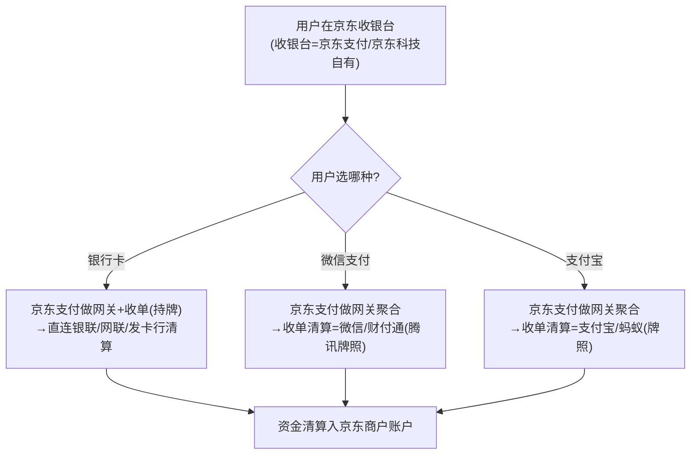

> 📌 **回答"收银台/网关/收单分别是谁"**：**收银台=平台自有**（京东支付，不碰钱）；**网关=平台聚合编排**（对所有方式）；**收单随支付方式而变**——刷**银行卡→京东支付自己收单**（它持牌）；选**微信→财付通收单清算**；选**支付宝→蚂蚁收单清算**。第一性原因：钱分属三个账本，**没有任何一方能替另一方清算**，所以收单方必随"用哪个账本"切换；平台能统一的只有最前面的收银台体验和网关聚合。

#### 5.2.2 三种"聚合"模式：别把"无牌技术层"和"持牌收单"混为一谈

⚠️ "聚合"有三种主体，资金/牌照角色完全不同——这是最容易踩二清红线的混淆点：

| 模式 | 谁 | 持牌? 碰钱? | 例子 ⚠️牌照状态需核实 |
|---|---|---|---|
| **无牌聚合服务商** | 纯技术层：收银台+网关+路由+对账 | ❌不持牌 ❌不碰钱，钱由通道直接清算给商户 | 收钱吧、哆啦宝、Ping++、BeeCloud |
| **持牌机构兼做聚合** | 自己有收单牌照，既做聚合界面、又能自营收单清算 | ✅持牌，刷卡这条自己收单 | 拉卡拉、富友、汇付天下、随行付 |
| **平台自建聚合** | 平台把聚合做成内部基础设施（含自有牌照） | ✅多数持牌 | 京东收银、美团收银 |
| **海外/跨境** | 多为"持牌网关+收单"一体 | ✅一体化 | Stripe/Adyen/Checkout.com；出海:PingPong/连连/Airwallex |

> 📌 **二清红线再强调**：**真正合规的无牌聚合服务商，钱绝不能先进它的账户再转给商户**（那是"二清"，违法）——钱必须由持牌收单方（财付通/蚂蚁/银行/持牌收单机构）**直接清算给商户**，聚合商只赚技术服务费/分润。所以严格说："聚合商提供收银台+网关+路由+对账（**技术层**），收单资质与资金清算落在持牌通道方（**资金+牌照层**）"——技术归聚合，钱和牌照归通道。
> ⚠️ **可信度**：二清违规、收单外包机构不得碰资金=中国支付监管**确定规则**；但**各公司当前牌照状态/模式会变动**（如 Ping++、收钱吧的最新合作/牌照），上表按行业通行认知，引用前请核实。

---

## 6. 商业模式与收益：钱从哪赚

互联网电子支付玩家的盈利模式，比模块1的卡组织更丰富：

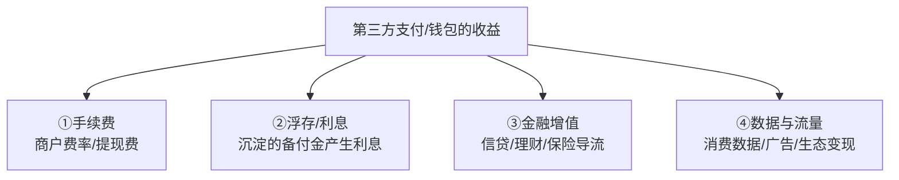

| 收益来源 | 说明 |
|---|---|
| **手续费** | 商户交易费率、用户提现费 |
| **浮存（Float）** | 用户备付金/在途资金沉淀产生的利息（⚠️ 中国已要求备付金集中存管央行、不计息，断了这块） |
| **金融增值** | 用支付入口导流信贷（花呗/借呗）、理财（余额宝）、保险——这才是支付平台最大的利润 |
| **数据与流量** | 消费数据、精准营销、超级 App 生态变现 |

> 🎯 **交流要点**：第三方支付的真正商业逻辑——**支付本身不赚钱（甚至补贴），它是"入口"，靠后面的金融增值和流量变现赚钱**。余额宝、花呗才是支付宝的利润引擎。理解"支付是入口不是利润"，是看懂这个行业商业模式的关键。

### 6.1 收入构成比例：用蚂蚁招股书坐实"支付是入口不是利润"

📌 **已核查·一手**：上面那句"支付是入口、金融增值才是利润"不是泛泛而谈——**蚂蚁集团 2020 年 IPO 招股书的收入拆分直接坐实了它**。以下为招股书合并损益表逐字数据：

**蚂蚁集团收入构成（2020 上半年 H1 2020）** ⚠️ **这是 2020 上半年快照，非现状**（见下方告诫）

| 业务板块 | 占总收入 | 对应 §6 哪类 |
|---|---|---|
| **微贷 CreditTech**（花呗/借呗导流） | **39.4%** | ③金融增值·信贷 |
| **数字支付与商家服务**（手续费） | **35.9%** | ①手续费 |
| **理财 InvestmentTech**（余额宝等） | **15.6%** | ③金融增值·理财 |
| **保险 InsureTech** | **8.4%** | ③金融增值·保险 |
| 创新业务/其他 | 约 0.7% | ④数据/创新 |
| 金融科技平台合计（微贷+理财+保险） | **63.4%** | — |

> 📌 **杀伤力**：**支付手续费只占约 1/3（35.9%），金融增值合计约 2/3（63.4%），其中信贷一项（39.4%）就超过了支付**——这是"支付不赚钱、是入口，靠后面金融变现赚钱"最硬的一手证据。H1 2020 总收入 RMB 725.28 亿（同比 +38%）。
> 📌 **趋势**：支付占比从 2017 年约 55% 一路降到 H1 2020 的 36%，**金融科技分部收入在 2019 年首次超过支付**——结构性"从支付主导转向金融科技主导"。
>
> ⚠️ **时效告诫（关键）**：以上**全部是 H1 2020 招股书快照**。蚂蚁 2020 年 11 月 IPO 被叫停、此后转金控整改且未再上市，**至今无同口径的整改后/最新收入拆分公开**。监管整改大幅约束了信贷业务，**当前实际占比已明显漂移、信贷那块很可能已显著回落**——**严禁把这组数当"现在的"比例引用**。
> 📌 **来源**：蚂蚁集团 HKEX 招股书（[hkexnews 2020102600165.pdf](https://www1.hkexnews.hk/listedco/listconews/sehk/2020/1026/2020102600165.pdf)），经多源二次印证（TechNode/Caixin/EqualOcean）。

📌 **已核查·一手｜腾讯/财付通——拆不出"支付"独立口径**：腾讯年报**只披露合并的"金融科技及企业服务"分部**（2023 = RMB 2037.63 亿、占集团 33%；2024 = RMB 2119.56 亿、占 32%），**不单独拆出支付/理财/贷款各自收入**，也不披露任何费率/TPV。年报仅定性说明金融科技收入是"**按交易金额的百分比**"（take-rate）模式。⚠️ **所以 2038 亿/2120 亿不能当作"财付通支付收入"**——它含云和企业服务。来源：[腾讯 2023 年报](https://static.www.tencent.com/uploads/2024/04/08/e95c902973fc282be3b3e285c6245281.pdf)、[2024 年报](https://static.www.tencent.com/uploads/2025/04/08/1132b72b565389d1b913aea60a648d73.pdf)。

🔧 **行业公知·未核实｜各支付方式费率（take rate）区间**：⚠️ **下列费率本轮 deep-research 未取得权威一手来源核实**，仅为行业大致认知、随政策/商户类别/议价大幅浮动，**不可作精确报价引用**：

| 方式 | 大致区间（🔧未核实） | 说明 |
|---|---|---|
| 线下扫码（微信/支付宝→普通商户） | 约 0.38%–0.6% | 公益/小微可 0 费率 |
| 银行卡收单（信用卡，"96 费改"后） | 约 0.6% 起 | 借贷记分离、取消封顶 |
| 个人提现费 | 约 0.1% | 提现到银行卡 |
| 聚合支付服务商分润 | 几 bp~几十 bp | 通道底价加价，赚差额（§5.2.2，不碰本金） |

> ⚠️ 要把费率写成"已核查"，需另起一轮核查 96 费改原文（央行《关于完善银行卡刷卡手续费定价机制的通知》）+ 微信/支付宝官方费率页 + 收单机构公告——本轮未覆盖。

📌 **已核查·一手｜浮存被切断的时点**：客户备付金自 **2019 年 1 月 14 日起 100% 集中交存人民银行存管**（[国务院官网 2019-01-09](https://www.gov.cn/zhengce/2019-01/09/content_5356286.htm)，央行副行长在政策吹风会陈述）。这从制度上掐断了支付机构靠备付金沉淀吃浮存利息的老模式（§6 表已注）。⚠️ "**不计息**"这一具体表述未在该一手引文中逐字出现，属与政策一致的合理推断，精确条款需另查银发〔2018〕114 号/存管细则。

---

## 7. 护城河：第三方支付凭什么守得住

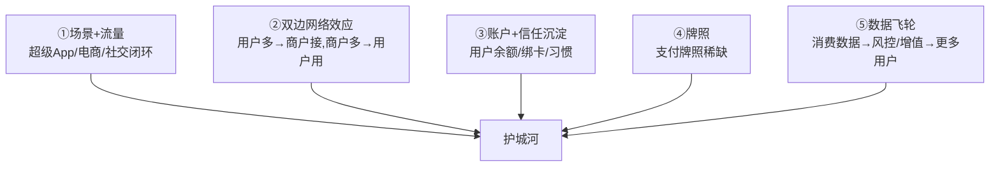

📌 **核心 = 场景+流量+账户沉淀**：支付宝/微信的护城河不在"支付通道"本身（通道可复制），而在**它绑定的场景（淘宝/微信社交）+ 用户账户习惯 + 数据飞轮**。这也是为什么后来者很难撼动——你能做一样的二维码，但做不出一样的场景生态。

> 🎯 **交流要点**：对比模块1卡组织的护城河（双边网络效应+转换成本），第三方支付多了"**场景绑定+超级App生态**"这一层——这是中国独有的现象（支付嵌在社交/电商/生活服务里）。

### 7.1 聚合支付服务商的护城河：天然浅，只能靠 B 端商户关系守

⚠️ 上面 §7 讲的是**支付宝/微信（持牌超级 App）**的护城河——很深。但**聚合支付服务商**（收钱吧/Ping++/哆啦宝那类，§5.2）完全不同：它**夹在商户和持牌通道之间，本质是"通道的二道贩子+技术服务商"，护城河天然很浅**。

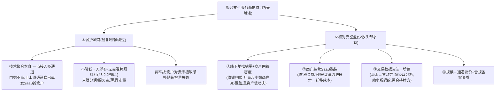

📌 **为什么浅**：① 技术聚合可复制，**且上游通道（微信/支付宝/银联）自己就在直发 SaaS 抢商户**，聚合商随时被上下游通吃；② 不碰钱（§5.2.2 二清红线）→**没有支付宝那种"金融增值 63%"的利润引擎（§6.1）**，只能赚薄分润；③ 商户对费率极敏感，易陷价格战。

📌 **真正能立的壁垒**（少数头部才建得起，且都不是"支付技术"）：**①线下地推铁军+商户网络密度**（收钱吧最硬的壁垒，重资产新玩家短期堆不出）；**②把"收款工具"升级成"商户经营 SaaS/操作系统"**制造迁移成本；**③交易数据沉淀做增值变现**（贷款导流/经营分析，但自己无牌照、需合持牌方）。

> 🎯 **一句话**：**聚合支付不能靠"支付"守，只能靠"商户关系+经营服务+数据"守**——所以头部（收钱吧/拉卡拉）都在拼命从"收款工具"转型"商户数字化经营平台"。**对比：支付宝/微信护城河在 C 端场景+账户（§7）；聚合支付只能在 B 端商户关系+经营服务——一个守用户、一个守商户，深浅天差地别。**
> ⚠️ **可信度**：本节为**行业格局分析+第一性推理（🔧 公知/推理级，非核查报告）**；"收钱吧地推网络、拉卡拉转型经营服务"等为行业通行认知、未逐条一手核实，引用前请核实。

---

## 8. 综合案例：一笔扫码支付的完整业务视角

💡 你在便利店用微信扫码买一瓶 10 元的水（余额支付）：

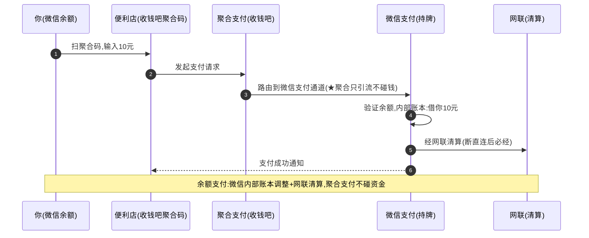

**这个例子里藏着**：支付网关/聚合受理、二维码、余额支付（内部账本）、第三方支付、网联清算、聚合支付不碰钱的红线——模块2的核心要素全在这。

---

## 9. 本篇小结（背下来）

1. **互联网带来两个新问题**：线上没 POS（→支付网关）、陌生人不信任（→担保交易+第三方支付）。
2. **支付网关 = 互联网时代的 POS**，线上受理入口；现代玩家常把网关+处理器+收单一体化。
3. **担保交易**破解"先付钱还是先发货"信任死结，是支付宝起家之本、第三方支付的核心信任创新。
4. **中美两条路**：中国账户闭环（余额+二维码绕开卡组织）vs 欧美卡网络融合（架在 Visa/MC 上）。
5. **钱包余额支付**=内部账本调整，绕开卡组织，又快又便宜；绑卡快捷支付仍走卡组织。
6. **二维码**把受理成本降到趋零（小微商户爆发）；**聚合支付**聚合多通道但不得碰钱（二清红线）。
7. **支付是入口不是利润**：靠金融增值（信贷/理财）和流量变现赚钱，浮存曾是重要收益（中国已收紧）。
8. **护城河 = 场景+流量+账户沉淀+数据飞轮**，比卡组织多了超级App生态这一层。

---

## 10. 通向下一层

- **技术怎么实现？** → `02-epayment-tech-aws.md`（网关架构、异步回调、对账、幂等、聚合路由、AWS 方案）
- **跨境时这套怎么变？** → 模块3（代理行/SWIFT/换汇）
- **账户余额绕开卡组织的极致——链上账本** → 模块4（稳定币）
- **范式对比** → `支付范式资金流对比.md`（电商网关/钱包余额两种范式）

---

## 附：常见追问（FAQ）

**Q：支付网关和收银台（Checkout）是一回事吗？**
A：不完全是。收银台（Checkout）是面向消费者的**前端支付页面/组件**（输卡号、选支付方式的那个界面）；支付网关是后端的**受理与路由引擎**。现代产品（如 Stripe Checkout）把两者打包，但概念上收银台是"脸"，网关是"引擎"。

**Q：余额支付和绑卡快捷支付，对商户有区别吗？**
A：有。余额支付走钱包内部账本（成本低、即时、不走卡组织），绑卡快捷支付要走卡组织/银行（有交换费等成本）。钱包平台会做**成本路由**——优先引导用余额（自己成本低），余额不足才走绑卡。对商户而言到账体验相似，但平台的成本结构不同。

**Q：第三方支付的"备付金"和模块1收单的"备付金"是一回事吗？**
A：本质都是"机构代客户保管的资金，需隔离"。第三方支付的备付金是**用户存在钱包里的钱**（沉淀量巨大）；收单的备付金是**待结算给商户的在途资金**。中国都要求集中存管在央行、不得挪用、不计息——这切断了"浮存吃利息"的老商业模式。

**Q：为什么中国要"断直连"、成立网联？**
A：早期第三方支付直连各家银行，绕开了央行的清算监管，资金流向不透明（洗钱/挪用风险）。2018 年"断直连"要求第三方支付的银行账户类交易必须经**网联**（或银联）清算，让央行能穿透监管资金流。这也确立了"第三方支付不能自己当清算所"的红线。
