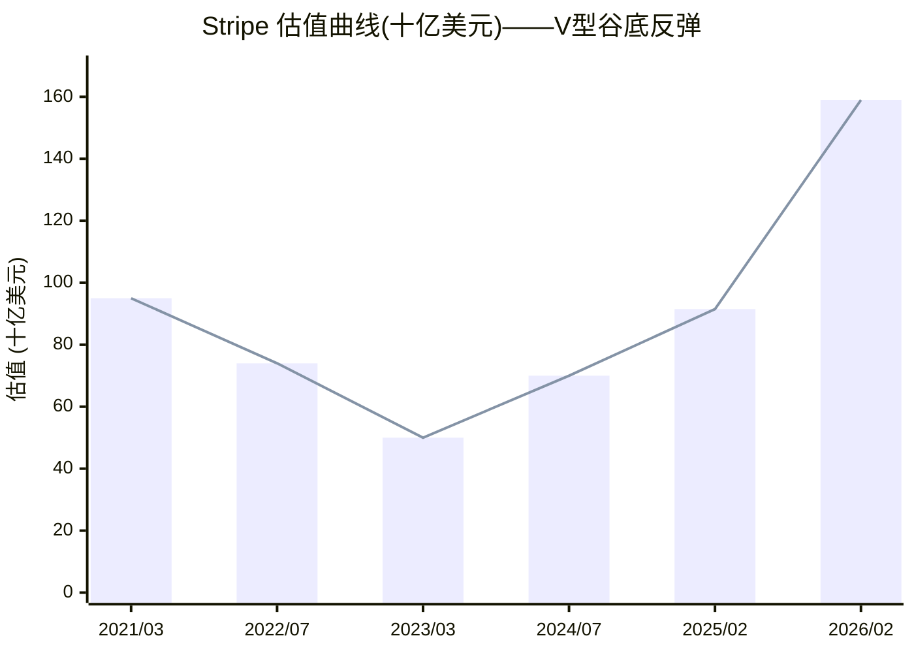
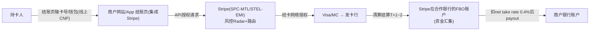
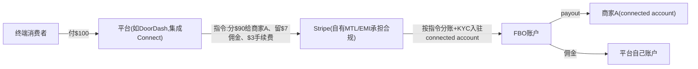
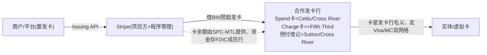
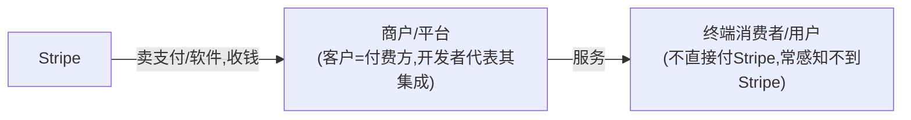
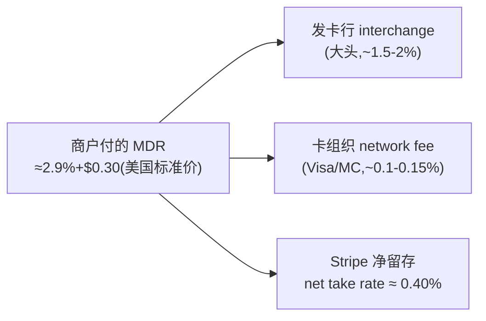
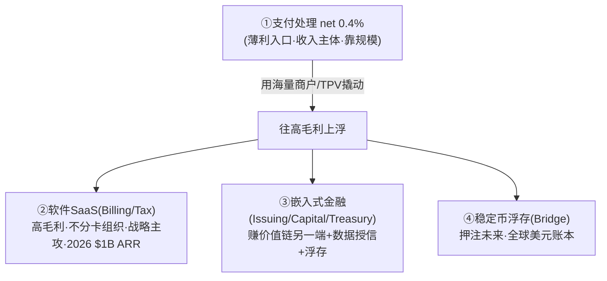
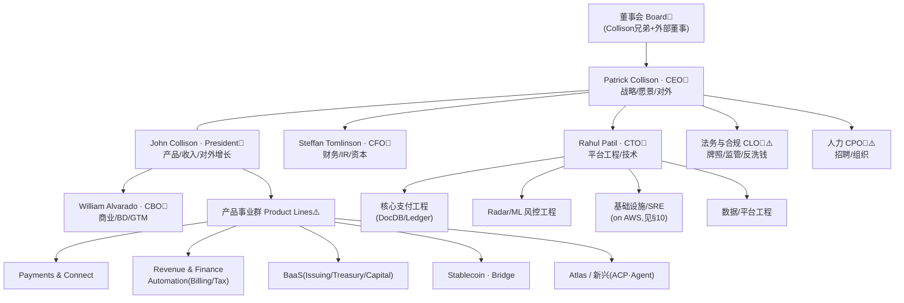
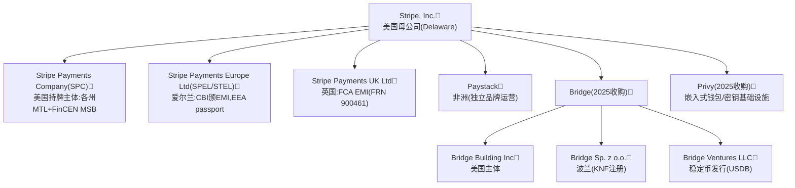

# Stripe, Inc.

> 📌 **一句话定位**：面向开发者的支付基础设施公司("互联网的经济基础设施")，以 API 为企业提供线上线下收款、订阅计费、平台分账、发卡、资金账户、税务等全栈金融服务，骑在 Visa/MC 等卡网络之上。
> 🏷️ **角色归类**：**全栈型(收单 PayFac + 网关 + 聚合 + 增值金融)**（呼应 `02-epayment-business §3.2` 开放路线、`§3.2 延伸` 为何不做钱包）。
> ⚠️ **数据时效**：截至 2026-06。📌 财务/估值/产品经 Sacra + Wikipedia + stripe.com 官方页深度核对；私有公司不披露细分财报，收入按产品线占比无官方拆分。

---

## 1. 基本信息
- **成立**：2010 年(Palo Alto)，**Patrick Collison(CEO)+ John Collison(President)** 兄弟创立(此前已把 Auctomatic 卖给 Live Current Media)
- **总部**：**双总部**——美国 South San Francisco + 爱尔兰都柏林(2025-10 开第二个都柏林 HQ)
- **当前状态**：⚠️**未上市**(私有)，无股票代码；靠 tender offer(要约收购)给员工/股东流动性，不急于 IPO；Collison 兄弟持控制权

## 2. 背景与沿革（里程碑时间线）📌
| 时间 | 里程碑 |
|---|---|
| 2010 | Collison 兄弟创立 |
| 2011-09 | 公开上线，获 Thiel/Musk/Sequoia/a16z 等 $2M |
| 2012 | 推 **Connect**(平台分账) |
| 2016/18 | Atlas(公司注册)/Stripe Press；推 **Issuing 发卡、Radar 风控** |
| 2019 | 推 Terminal(线下)、Capital(融资) |
| 2020 | 收购 **Paystack**(~$200M，进入非洲) |
| 2021 | 收购 TaxJar/Recko；推 **Link、Tax、Treasury**；估值高点 **$95B**(3月) |
| 2024-04 | 重启加密 pay-in(USDC) |
| 2025-02 | **完成收购 Bridge($1.1B，迄今最大收购)**——稳定币战略核心 |
| 2025-05 | 发布**支付 AI 基础模型** + **稳定币金融账户(101 国)** |
| 2025-06 | 收购 **Privy**(嵌入式加密钱包)；与 Shopify 推全商户稳定币支付 |
| 2025-09 | Link 破 2亿用户；与 **OpenAI 共建 Agentic Commerce Protocol(ACP)** 驱动 ChatGPT Instant Checkout |
| 2025-12 | 发布 Agentic Commerce Suite；宣布收购 Metronome；BFCM 四天处理超 $40B |
| 2026-02 | tender offer 估值 **$159B**(较 2025-02 的 $91.5B 增约 70%) |
| 2026-04 | Sessions 2026 发布 **288 项**新产品/功能 |

> 战略主线：单点"开发者友好收单 API" → 平台化"全栈金融基础设施"(收单+计费+发卡+银行+税务+注册) → 当前向"**AI 时代经济基础设施 + 稳定币 + Agentic Commerce**"延伸。

## 3. 股东与资本 📌
- **早期投资人**：Peter Thiel、Elon Musk、Sequoia、a16z、SV Angel(2011 种子 $2M)
- **估值曲线(剧烈波动)**：2021-03 **$95B** → 2022-07 内部降 **$74B** → 2023-03 Series I($6.5B+)按 **$50B**(谷底) → 2024-07 409A **$70B** → 2025-02 约 **$91.5B** → **2026-02 tender offer $159B**



| 时点 | 2021/03 | 2022/07 | 2023/03 | 2024/07 | 2025/02 | 2026/02 |
|---|---|---|---|---|---|---|
| **估值($B)** | **95**(高点) | 74 | **50**(谷底) | 70 | 91.5 | **159**(新高) |
| 事件 | 互联网泡沫顶 | 内部下调 | Series I | 409A | tender | tender |

> 📌 **看曲线**(⚠️ xychart 不显示点上数字，精确值见上表)：2021 高点 $95B → 2022-2023 互联网估值寒冬腰斩至 **$50B 谷底**(几乎砍半) → 2024-2026 随盈利兑现+稳定币/AI 叙事反弹至 **$159B**(为谷底的 **3.2 倍**、超 2021 高点 **67%**)。典型"高点→腰斩→新高"的 V 型，反映私募估值对宏观利率与赛道叙事的高度敏感。
- 累计融资约数十亿美元；Collison 兄弟持控制权

## 4. 牌照与资质（逐法域：牌照类型+业务范围+怎么开展+合规）📌

> 🔑 **术语不懂先看**：MTL/EMI/MSB/NMLS/passporting/FBO 等牌照术语+"持牌支付机构如何挂靠银行碰钱"的通用机制，见 `支付牌照术语速查.md`。
> 💡 **找牌照的替代办法**(主页 stripe.com/legal/licenses 常 404，但这些可达/可查)：① **SPC 子页 stripe.com/legal/spc/licenses**(列约 50 法域监管机关+NMLS#) ② **Bridge bridge.xyz/legal**(稳定币逐州证号最全) ③ **NMLS Consumer Access**(查各州证号) ④ **FCA Register / 爱尔兰央行 registers.centralbank.ie**(查 EMI 号) ⑤ **docs.stripe.com**(各产品合规/银行合作页)。**牌照是公开监管事实，不靠官网披露**。

📌 **总体结构**：Stripe 把"持牌"分散在不同法人实体，**自持支付类牌照(MTL/EMI)打底 + 需银行牌照的功能(存款/发卡/放贷)统统挂靠合作银行**。

### 4.1 逐法域牌照与业务范围

| 法域 | 持牌实体 | 牌照类型/证号 | **法律允许做什么** |
|---|---|---|---|
| **美国** | **Stripe Payments Company(SPC)** | 各州 **MTL** + FinCEN **MSB**(NMLS **#1280479**，官方页口径；⚠️坊间 913460 未在 NMLS 复核) | 接收并按指令转移/汇出资金、为平台代收代付、持有客户资金(stored value)——这是 Connect payout、Treasury 资金账户的法律基础。NY 等少数州虚拟货币另需 BitLicense |
| **欧盟/EEA** | **Stripe Technology Europe Ltd(STEL)**，爱尔兰 | 爱尔兰央行 **EMI**，参考号 **C187865**，授权 2019-03-22(LEI 549300T7WU87LQYO0K16) | 发行电子货币+执行支付+汇款+**发行并受理(acquire)支付工具**+支付发起(PIS)+账户信息(AIS)，经 **EU passporting** 覆盖整个 EEA。⚠️ 签约主体是 SPEL，但**牌照挂在 STEL**(区分) |
| **英国** | **Stripe Payments UK Ltd** | FCA **授权电子货币机构(EMI)**，FRN **900461**，授权 2018-05-02 | 发行电子货币+相关支付服务，脱欧后独立持牌覆盖英国 |
| **美国稳定币** | **Bridge Building Inc**(2024 收购) | 逐州 **MTL+虚拟货币牌照**，NMLS **#2450917**(已抓到逐州证号：AK AKMT-018580、AZ MT-1047501、FL FT230000461、OH OHMT 275、VA MO-484、PA 116659…) | 货币转移+**稳定币(虚拟货币)发行/兑付/转移**——USDB、Issuing 稳定币担保卡的持牌基础 |
| **欧盟稳定币** | **Bridge Building Sp. z o.o.**(波兰) | 波兰金融监管局 **KNF 虚拟货币活动登记 RDWW-794**(2025-04-18) | 非美稳定币业务承接 |
| **新加坡** | Stripe SG | ⚠️ PSA 下**临时豁免运营**，MPI 牌照**申请中未获批** | (豁免期可运营) |
| 非洲 | Paystack(2020 收购) | 当地持牌(独立品牌) | 尼日利亚/加纳/南非收单 |
- ⚠️ 澳/加/日/印等法域持牌实体与证号、SPC 逐州证号(NMLS 直链 403)未独立核实

### 4.2 Stripe 怎么开展业务：逐场景运作流程 📌docs

🔑 **总原则**(详见 `支付牌照术语速查.md`)：**收单+平台分账=自持牌照(MTL/EMI)直接做；存款/发卡/放贷等需银行牌照的功能=挂靠合作银行，Stripe 只做账本+指令+合规层**。下面用 4 个核心场景讲清"一笔钱具体怎么走、谁碰钱、Stripe 干什么"。

**场景① 基础收单(一个商户直接收卡)**：Stripe 自持牌照+卡组织通道直接做
> ⚠️ **这是线上收单(CNP,卡不在场)，不是线下 POS 刷卡**——入口是电商/App 的**结账页**(手输卡号/数字钱包)，是 Stripe 起家+主业+绝大部分 TPV。线下 POS(插卡/挥卡/Tap to Pay)是另一条产品线 **Stripe Terminal**(见 §6)，非主战场。这正是 Stripe(起家线上 API)与 Block(Square)/银联商务/拉卡拉(起家线下 POS)的根本区别。

> Stripe 角色：**受理+风控+路由+按指令把钱(扣费后)payout 给商户**；钱物理上经卡网络清算→落 FBO 账户→ACH 打给商户。欧盟/英国凭 EMI 的 acquire 权限自己受理；美国经 SPC 的 MTL + 卡组织通道(历史经合作收单行)。

**场景② Connect 平台分账(给 Shopify/DoorDash 这类平台)**：用自有牌照做"一对多"分账

> 📌 关键：**Connect 用 Stripe 自有 MTL/EMI，合规(KYC/AML/制裁)由 Stripe 承担**——平台无需自持牌照即可做分账。⚠️ 但 **Global Payouts(直付第三方银行账户)把合规推给平台方、平台可能需自持 MTL**。自助跨境 payout 限 US/UK/EEA/CA/CH 互转。

> 🧭 **①vs② 速辨**(同样是刷卡收款，核心差别在"收款方有几个、钱要不要拆、谁给卖家做合规")：
>
> **本质**：①=一对一「直接收款」(Stripe 服务**一个自产自销商户**，钱直接结给它)；②=一对多「平台分账」(Stripe 服务**一个平台**，平台底下挂着**成千上万第三方卖家**，一笔付款要拆开分别结给多方，且 Stripe 替平台逐个做卖家 KYC)。Connect 解决的新问题=**平台经济下"钱怎么拆、谁给卖家做合规、平台要不要自己持牌"**——答案是 Stripe 碰钱+分账+逐个 KYC，**平台因此不必自持 MTL/EMI**。
>
> | 维度 | ① 基础收单 | ② Connect 平台分账 |
> |---|---|---|
> | **谁是 Stripe 客户** | 一个商户(自产自销) | 一个**平台/市场**(自己通常不卖货、做撮合) |
> | **底下收款方** | **1 个** | **N 个第三方卖家**(connected accounts，几千~几万) |
> | **典型例子** | DTC 品牌官网、独立 SaaS、单店电商 | DoorDash(餐厅)/Shopify(店主)/Lyft(司机)/Airbnb(房东)/Instacart |
> | **购物场景** | 买**这一家自己的**商品 | 买平台上**第三方卖家**的商品(平台只撮合+履约) |
> | **付款方式** | 🟰 结账页刷卡/钱包(CNP) | 🟰 **相同**——此维度不区分两者 |
> | **订单流** | 两方:买家→1 卖家 | 三方:买家→平台→实际履约的第三方卖家 |
> | **信息流(给 Stripe 的指令)** | "向商户 X 收 \$100" | "收 \$100 再按规则**拆**:卖家 A \$80、平台佣金 \$15、手续费 \$5"＋每个卖家 KYC 资料 |
> | **资金流** | 钱→FBO→扣费→payout 给**1 个**商户 | 钱→FBO→**拆成多笔** payout(卖家+平台佣金+手续费) |
> | **谁做卖家合规** | 只核这 1 个商户 | **Stripe 替平台逐个核**每个 connected account(46+国/14语言嵌入式入驻) |
> | **平台是否自持牌照** | 不涉及 | **不用**——借 Stripe 的 MTL/EMI(Connect 核心价值) |
>
> 💡 **DoorDash 例子**：你点 \$100 外卖，**做菜的是餐厅(第三方)不是 DoorDash**。你付 \$100 给 DoorDash 收银台→Stripe 按 split 指令拆成:\$80 给餐厅、\$15 给 DoorDash 佣金、\$5 手续费→分别 payout；而几万家餐厅的入驻 KYC 全由 Stripe 替 DoorDash 做，所以 DoorDash 不必自己申请支付牌照、不必自己碰钱担合规。对比场景①(独立 T 恤品牌官网):品牌自产自销，你刷 \$100→Stripe 扣费→直接结给**这一个**品牌账户，一对一。

> 🔑 **卖家(connected account)到底是不是"Stripe 的子商户"？——看账户类型**📌(docs.stripe.com/connect/accounts)。Connect 的核心抽象是 **connected account(连接账户)**，但"卖家归谁管、谁是 Merchant of Record(MoR，对卡组织/监管登记在册的法律收款主体)、谁担合规"随账户类型大不同：
>
> | 账户类型 | 卖家是不是"Stripe 托管子账户" | 卖家界面/品牌 | 谁做 KYC·担合规 | MoR(登记收款主体) | 提现(payout)谁放款 | 典型用法 |
> |---|---|---|---|---|---|---|
> | **Standard** | ❌ **否**——卖家有**自己独立的 Stripe 账户**，平台仅经 OAuth 被授权"连接"它 | 卖家看得到 Stripe 仪表盘、收 Stripe 邮件 | **卖家自己**(Stripe 直接面对卖家) | **卖家自己** | Stripe→卖家(卖家自管) | 平台想最省事、不想碰合规(如早期 SaaS 插件) |
> | **Express** | ✅ 是(轻量托管)——Stripe 开的受管子账户，但带一个 Stripe 托管的简易入驻/提现页 | 半白标:有个 Stripe 托管的 Express Dashboard | **Stripe 为主**(平台触发、Stripe 执行) | 平台/Stripe | Stripe→卖家 | 多数 marketplace(打车/外卖/零工) |
> | **Custom(白标)** | ✅ **完全是**——Stripe 全托管子账户，**卖家可完全不知道 Stripe 存在** | 全白标:界面 100% 平台自己的 | **Stripe**(平台代收资料、Stripe 兜底) | 平台/Stripe | Stripe→卖家 | 深度嵌入式(Shopify Payments 即此路线) |
>
> 📌 **回答"Shopify 上卖家是不是 Stripe 子商户"**：是——Shopify Payments 走 **Custom/嵌入式** 路线，卖家界面全是 Shopify 的，但底层资金账户、KYC、payout 全在 Stripe，**卖家就是 Stripe 的受管 connected account**；只是他"挂在 Shopify 平台名下、由 Stripe 托管"，自己通常感知不到 Stripe。

> 💰 **追问"消费者刷卡的钱，第一站进谁的银行账户？"——答案是 FBO 账户，不是商家账户**📌。这是 PayFac 模式最反直觉的一点，务必厘清：
>
> - **FBO（For Benefit Of）账户是什么**：Stripe **以自己名义、在合作银行**（如 Fifth Third）开的一个**资金归集/托管账户**，里面的钱"名义归 Stripe 管、实际受益权属于底下商户/卖家"——本质是个**为客户代持资金的池子**（详见 `支付牌照术语速查.md`）。它就是 PayFac"代收资金"那笔钱**物理落地的地方**。
> - **资金两段式，商家账户是第二站**：
>
> ```mermaid
> flowchart LR
>     BUYER["买家发卡行<br/>(钱从这扣)"] -->|"卡网络清算 T+1~2"| FBO["①钱先落 Stripe 的 FBO 账户<br/>(在合作银行,资金池,Stripe名义持有)"]
>     FBO -->|"②扣手续费后,按周期 payout(ACH)"| MBANK["③商家自己绑定的<br/>银行账户(最终到账)"]
> ```
>
> - **第一站 = Stripe 的 FBO 账户**：买家的钱经卡网络清算后，**先汇集进 Stripe 在合作银行的 FBO 池子**，此刻钱"在 Stripe 手里、记在商家名下"，商家还拿不到现金。
> - **第二站 = 商家自己绑定的银行账户**：Stripe 扣掉手续费（≈2.9%+30¢）后，**按结算周期（如 T+2）payout 到商家开店时绑定的那个银行账户**——这才是商家"实际收到钱"的账户，且收到的是**已扣费的净额**，不是买家刷卡的即时原始款。
> - 🔑 **Shopify+Stripe 组合的精确表述**：台前是 **Shopify Payments**（Shopify 的品牌），底层引擎是 **Stripe Connect（Custom/白标路线）**；钱**第一站进的是 Stripe 的 FBO 资金池（其合作银行），不是商家账户**，扣费后再 payout 到商家自己绑定的银行账户。这正是 PayFac"先代收进池、再分账给子商户"模型的教科书案例（呼应 `01-cards-business §4.2/4.3`）。

> ⏱️ **追问"钱什么时候、以什么方式 payout 给商户？商户能选通道吗？"**🔧机制为行业公知，⚠️具体天数/频率/费率随国家·店铺·政策漂移，写正式材料须核 Shopify Help Center(Payouts)+Stripe Connect docs。
>
> **何时(when)——非实时，按结算周期批量**：① 一笔交易先过 **pending(待结算)滚动期**（⚠️美国常见 T+2 量级，新店/高风险类目更长，随国别不同）；② 过期后按商户设的 **payout schedule** 批量打款，常见可选 **每日/每周/每月**。所以到账时间 = pending 期 + 结算频率，不是刷卡即到。
>
> **何方式(how)**：通过 **ACH(美国)/本地银行转账(他国)**，把**已扣手续费的净额**打进商户在 **Shopify 后台**绑定的银行账户；收到的是批量净额(非每笔原始款)，对账靠 payout 报告还原"这批=哪些交易−费用−退款/拒付"。**节奏由 Shopify 控制(它是 Connect 平台/Custom 账户主体)、Stripe 做底层放款**——故频率/收款账户在 Shopify 后台设，不在 Stripe 后台。
>
> **能否选通道——分两层**：
> - **层面A：选不选 Shopify Payments(✅能)**：用 **Shopify Payments**(默认，无额外平台抽成) vs 换 **第三方网关**(PayPal/Adyen/本地收单等数百家)。⚠️ 换走第三方，Shopify 额外收一笔 **"第三方交易费"**(这是 Shopify 力推自家 Payments 的动机)，且 payout 周期/方式改由那个第三方决定。
> - **层面B：选定 Shopify Payments 后(只能调频率)**：✅ 能调 **结算频率(日/周/月)+收款银行账户**；❌ 不能选底层走哪个收单行/清算网络、pending 期长短(由 Stripe/Shopify 风控与合作银行定)。

> 🇨🇳 **追问"中国卖家在 Shopify 收款并回到国内怎么办？"**📌+🔧——核心障碍：**中国大陆不在 Shopify Payments 支持地区内**，无法直接用它收款回国，必须绕道。三条现实路径：
>
> ```mermaid
> flowchart TB
>     SELLER["中国卖家的 Shopify 独立站"] --> Q{"用什么收款?"}
>     Q -->|"路径1:绑海外主体"| SP["Shopify Payments<br/>(需海外公司+海外银行账户)"]
>     Q -->|"路径2:第三方收单(最常见)"| TP["跨境收款服务商<br/>连连/PingPong/Airwallex/Payoneer"]
>     Q -->|"路径3:PayPal等钱包"| PP["PayPal"]
>     SP -->|海外账户余额| BACK["换汇+结售汇<br/>提现回国(外管局申报)"]
>     TP -->|本身就带这能力| BACK
>     PP -->|提现| BACK
> ```
>
> - **路径1:海外主体开 Shopify Payments**——用香港/美国等公司主体+当地银行账户满足支持地要求，钱落海外账户，再换汇结售汇回国。⚠️门槛高(海外公司/银行/税务)，适合规模较大卖家。
> - **路径2:接第三方跨境收款服务商(中国卖家最常见)**——后台不用 Shopify Payments，改接 **连连/PingPong/Airwallex/Payoneer** 的收单通道。此时**收单方=该服务商(它才是真·跨境 PayFac，受理买家刷卡)**，钱进它体系→直接**换汇+结售汇+提现到国内银行卡(走外管局申报)**。⚠️代价:Shopify 额外收第三方交易费，但换来"能回国+合规结汇"。
> - **路径3:PayPal 等钱包**——简单，但费率/汇率通常不优。
>
> 🔑 **和 Amazon 场景的关键区别(呼应 `01-cards-business §4.6.1`)**：Amazon 是平台自己收单、连连等只是"回款通道"(不收单)；**Shopify 独立站没有平台帮你收单，收单方就是你接的那个服务商**——所以这里连连/PingPong/Airwallex **是真·跨境 PayFac(收单+回款一条龙)**，正对应"独立站才是收单 PayFac"。⚠️ Shopify Payments 支持地清单/各服务商是否提供 Shopify 接入/费率随时间漂移，须核官网。

> ⚖️ **关键消歧:Connect 平台分账 ≠ 连连式"跨境卖家收款"**(两者主体关系相反，常被混淆)：
>
> | 维度 | **连连式卖家收款**(收款服务商) | **Stripe Connect**(平台基础设施) |
> |---|---|---|
> | **服务商的直接客户是谁** | **卖家本人**(卖家自己签约) | **平台**(Shopify/DoorDash 签约,平台再帮卖家入驻) |
> | **卖家账户归属** | 卖家是**连连的客户**(一对一服务) | 卖家是 **Stripe 的 connected account(子账户)**,挂平台名下 |
> | **谁给卖家做 KYC** | 连连(直接面对卖家) | **Stripe 替平台**逐个做 |
> | **平台(Amazon/Shopify)的角色** | 只是货款来源,**不参与**收款服务 | **是服务商的客户**,主动集成并帮卖家入驻 |
> | **谁放款给卖家(提现)** | 连连用自有牌照换汇+提现到国内 | Stripe 用自有 MTL/EMI 做 payout |
> | **一句话** | "**卖家找服务商**"——卖家=客户 | "**平台找服务商,服务商替平台托管卖家**"——平台=客户、卖家=被托管子账户 |
>
> 💡 **本质差别**:连连解决的是"**卖家**怎么把海外平台的货款收回国",出发点是卖家;Connect 解决的是"**平台**怎么不持牌就能给底下成千上万卖家分账+放款",出发点是平台。所以同样叫"收款",连连的"收款方"是**它的客户卖家本人**,Connect 的"收款方"是**它客户(平台)底下的被托管子账户**。

**场景③ Issuing 发卡(商户给员工/用户发卡)**：自己不发卡，挂合作发卡行 BIN

> 📌 Stripe 是**项目方**(定义卡逻辑/限额/实时授权)，**发卡行是卡组织的网络成员**(借其 BIN)。卡可单/双 Visa+MC 网络；发卡须附法定发卡行声明。
> 💡 **虚拟卡+实体卡都发，虚拟卡是主流**：**虚拟卡**=API 秒级批量创建、实时控费(每张设限额/限商户类目/一次性)，平台/企业费控场景(Brex/Ramp 类、广告投放/SaaS 采购)海量用；**实体卡**=塑料卡需印制寄送，给员工日常/线下刷卡，是补充。两者**持牌结构完全相同**(都挂合作行 BIN)，区别只是卡的载体形态。卡可加进 Apple Pay/Google Pay，亦可由**稳定币余额担保**(Bridge 集成，§5.4)。

**场景④ Treasury 存款 + Capital 放贷**：纯挂银行
- **Treasury**：账户是 **Fifth Third Bank N.A. 名下的 FBO(stored-value)账户**，FDIC pass-through，⚠️ **Stripe 非银行**——只做项目管理+资金转移(SPC)。
- **Capital**：基于 Stripe 商户流水数据授信，但**放贷经合作行**(常见说法 YouLend/Celtic，⚠️未官方核实)，Stripe 提供数据风控技术。

> 🎯 **一句话总结**：**场景①②(收单/分账)Stripe 凭自有 MTL/EMI 直接做、自担合规；场景③④(发卡/存款/放贷)需银行牌照→挂靠 Celtic/Cross River/Sutton/Fifth Third 等，Stripe 只做技术+项目+数据风控层**。所有场景里"碰钱+最终结算"都在银行轨道，Stripe 是账本+指令+合规层(呼应 `支付牌照术语速查.md` 核心模型)。

### 4.3 合规要求 📌
- **AML/KYC/制裁**：美国 MSB 受 BSA 约束(KYC/KYB+UBO≥25%识别、交易监测、SAR/CTR、OFAC 筛查、记录留存≥5年)；Connect 按国别核验(新加坡 PSA Singpass+未核验 120 天关户、巴西 BCB 3978/20、美国 payout 阈值 $600/$3k/$10k/$500k SSN)
- **PCI-DSS Level 1**(最高等级，处理卡数据；商户接 Stripe 可降自身 PCI 负担)
- **资金隔离/safeguarding**：欧盟/英国 EMI 按 EMD2/PSD2 隔离客户资金；美国按各州 MTL 备付金/许可投资；Treasury 资金存 Fifth Third FBO(⚠️"FDIC pass-through"非"FDIC insured"，营销措辞受限)
- **PSD2/SCA**：欧盟/英国收单受强客户认证(3DS)+资本金(EMI 初始 €350k 起)
- **卡组织成员合规**：遵守 Visa/MC 运营规则、BIN 赞助、拒付流程；发卡须附法定发卡行声明(Celtic/Cross River/Fifth Third/Sutton 逐字模板)
- **稳定币新规**：美国 **GENIUS Act(2025)**+各州虚拟货币牌照(储备/兑付/披露)；欧盟 **MiCA**(稳定币发行须授权)

### 4.4 与卡组织(Visa/MC)的关系 📌
- **发卡侧**：Stripe 与 **Visa+Mastercard 双网络**合作，可单/双发卡，但实际经**合作发卡行的 BIN 赞助**进行(Stripe 是项目方、发卡行是网络成员)
- **收单侧**：**欧盟/英国凭 EMI 牌照具备直接受理(acquire)的法定权限**(已核查)；⚠️ 是否在每个市场都是卡组织 **principal member**、以及美国精确成员身份(历史经 Wells Fargo 系合作收单行)**未独立核实**

## 5. 定位与商业模式（收入结构）📌Sacra + 结构判断

### 5.00 先分清"客户 vs 用户"：Stripe 永远只向商户收钱(2B2C)

📌 **理解一切的前提**：Stripe 是 **B2B(更准确是 2B2C)**——**付钱给 Stripe 的是"商户/平台"(客户)，终端消费者(用户)不直接付 Stripe、也往往感知不到 Stripe 存在**。



| 模式 | 客户(付 Stripe 钱) | 用户(终端) | 用户触达入口/场景 | 技术上怎么调到 Stripe |
|---|---|---|---|---|
| **Payments 收单** | 普通商户(电商/SaaS) | 消费者 | 商户网站/App **结账页** | 后端调 Payments API，或前端嵌 Checkout/Elements/Payment Links |
| **Connect 平台分账** | 平台(Shopify/DoorDash/Lyft) | 平台的卖家+买家 | 平台 App 内下单/卖家提现 | 平台调 Connect API 做入驻(KYC)+分账+payout |
| **Billing/Tax 等 SaaS** | 已用 Stripe 的商户 | (商户的订阅用户) | 商户的订阅/账单后台 | 商户调 Billing/Tax API(后台财务自动化，用户无感) |
| **Issuing 发卡** | 要发卡的企业/平台 | 持卡员工/用户 | 拿到卡后刷卡消费 | 企业调 Issuing API 发卡/设限额/实时授权 |
| **Treasury 账户** | 平台(给其用户开账户) | 平台的终端用户 | 平台 App 内"钱包/账户"界面 | 平台调 Treasury API(白标，账户挂 Fifth Third) |

> 📌 **三种调用入口**(用户技术上怎么"碰到"Stripe)：① **嵌入式 UI 组件**(Checkout 整页/Elements 表单/Payment Links 链接)——挂在商户域名下、界面是 Stripe 的；② **API 直调**——用户完全无感、只看到商户界面；③ **白标/嵌入式金融**(Connect/Treasury/Issuing)——终端用户以为是平台功能、Stripe 隐身在后。
> 🎯 **一句话**：**Stripe 只向商户/平台(2B)收钱，终端消费者(2C)只在商户的结账页/App 里间接用到它——要么以"挂商户域名的嵌入组件"露脸、要么完全隐身在 API/白标背后**。这正是它"开发者优先、不做 C 端钱包"(§3.2 延伸)的根本原因：它卖的是给开发者集成的"管道"，不是给消费者用的"App"。

### 5.0 先理解一个关键区分：毛费率 3% vs 净 take rate 0.4%

📌 **这是看懂 Stripe 盈利的钥匙**。商户刷卡付的"3% 手续费"**绝大部分不归 Stripe**：



> 📌 **net take rate ≈ 0.40%**(Sacra)：毛费率约 3%(美国 2.9%+$0.30、日本 3.6%)扣除付给发卡行的 interchange(大头)、卡组织 network fee、合作方后，**Stripe 实际只留约 0.4%**。所以 **Stripe 公布的"收入"指净收入(net revenue)而非毛流水(TPV)**——2025 净收入 ~$6.9B ÷ TPV $1.9T ≈ 0.36%，与 0.4% 量级吻合。
> 🎯 **这决定了 Stripe 的根本逻辑**：单笔赚得薄(0.4%)，**利润靠两条腿——① 规模(TPV $1.9T 摊薄固定成本) ② 往高毛利的软件/金融服务"上浮"**。下面拆四种赚钱模式。

### 5.1 模式一：核心支付处理（Payments/Connect 抽佣）——收入主体、薄利、靠规模

🔧 **机理**：每笔成功交易抽 net take rate ~0.4%。**Connect(平台分账)是放大器**——给 Shopify/DoorDash 这类平台做底层处理，一个平台带来成千上万子商户的交易量，**用一个集成撬动海量 TPV**。
- **为什么能赚**：开发者体验+全栈集成形成高切换成本，TPV 黏在平台上持续抽佣。
- **赚多少**：收入主体(占大头)，但**毛利薄**(0.4% 里还要扣自身成本)，是"规模生意"非"高毛利生意"。
- **天花板**：take rate 受卡组织 interchange 挤压，难提价 → 这正是 Stripe 必须往 §5.2/5.3 升级的原因。

### 5.2 模式二：软件/SaaS 增值（Revenue & Finance Automation）——高毛利、战略主攻

📌 **先破误区：这套 SaaS 不是"另找一批客户"，而是向"已经在用 Stripe 收款的商户"多卖软件**。逻辑：你已经用 Stripe 收钱了，那么"**钱进来之后的一堆财务杂活**"(订阅计费/开票/算税/对账/收入确认)干脆也在 Stripe 上一并解决。这套叫 **"Revenue & Finance Automation"(营收与财务自动化)** 套件——**2026 年有望达 $1B 年化运行率**(较 2025-02 ~$500M 翻倍)。

**逐个产品：谁订阅 / 解决什么痛点 / 提供什么能力**：

| 产品 | 谁订阅 | 解决什么痛点(没有它会怎样) | 提供什么能力 | 收费 |
|---|---|---|---|---|
| **Billing** | 做订阅制的公司(SaaS/会员/媒体,如 Notion) | 订阅计费极复杂:月付/年付/升降级/按量/试用转正/优惠券/失败重试…自建要养团队 | 订阅生命周期+用量计费(meters)+自动账单+**Smart Retries(失败扣款重试,平均挽回 55%)** | 按订阅收入比例 |
| **Invoicing** | B2B/开票收款企业 | 手动开发票/催款/对账,易错又慢 | 自动生成发送发票+在线支付链接+自动对账 | 按发票 |
| **Tax** | 跨州/跨国卖货企业(电商/SaaS) | 销售税/VAT/GST 各州各国规则不同(美国就 1 万多税区),算错=合规风险+罚款 | 自动判税率+代收+申报(100+国+全美各州,600+类目) | **0.5%/笔** |
| **Revenue Recognition** | 要做合规财报的公司(尤其拟融资/上市) | 收入确认须符 ASC 606/IFRS 15,订阅业务手工算极痛苦 | 自动把现金流转成"确认收入"出财报 | 订阅 |
| **Sigma** | 要分析自身交易数据的企业 | 想用 SQL 查支付数据,但数据散乱 | 在 Stripe 内直接写 SQL 查交易/客户/收入 | 订阅 |

🔧 **为什么商户愿意订阅**(三个理由)：① **省一个工程团队**(计费/算税/收入确认都是"看着简单做起来全是边界条件"的活,自建贵又易出合规错) ② **天然集成**(钱本来从 Stripe 进,财务直接接着支付数据跑,不用搭数据管道) ③ **合规背书**(税率库/会计准则由 Stripe 维护并对监管负责,商户不用自己追各国税法)。

📌 **为什么是战略主攻/改善 margin 的关键**：支付处理 net take rate 仅 0.4%、受 interchange 封顶；而软件**按订阅费/0.5% 税费收钱、不分给卡组织/发卡行 → 几乎纯增毛利**。且商户把计费/税务/对账都跑在 Stripe 上后**迁移成本极高，反过来锁死那条薄利但走量的支付处理**。这是 Stripe **从"支付公司"变"金融软件公司"**的核心叙事，也是估值能给到 $159B(远超纯支付倍数)的支点。
> 🎯 **一句话**：SaaS = 把"已用 Stripe 收款的商户"在"钱进来之后的财务杂活"上的痛点，做成现成模块按订阅卖——商户省团队+天然集成+合规背书，Stripe 赚不分卡组织的高毛利、还锁死支付那条腿。

### 5.3 模式三：嵌入式金融服务（Issuing/Capital/Treasury）——赚金融的钱

🔧 把支付能力延伸到发卡、放贷、银行账户，**赚金融服务的钱**(比支付处理毛利高)：
- **Issuing(发卡)**：商户用 Stripe 发企业卡，Stripe 分 **interchange**(发卡侧那块大头的分成)——从"替别人收单付 interchange"变成"自己发卡赚 interchange"，**赚价值链的另一端**。
- **Capital(商户融资)**：基于 Stripe 掌握的商户流水数据授信、放现金垫款，收**固定费**(非利息，按日销售额比例扣还)——**数据是护城河**(别人没有商户实时流水，授信风控做不准)。美国由 YouLend 用 Stripe 技术提供。
- **Treasury(BaaS 银行即服务)**：给平台的终端用户开资金账户，赚账户/资金沉淀(**浮存利息**)。⚠️ Stripe 非银行，存款靠合作行 **Fifth Third Bank**(FDIC pass-through)。
- 📌 **共同逻辑**：支付只是入口，**把商户的"钱流"变成"金融关系"**(发卡/借贷/存款)，每一层都比 0.4% 的支付抽佣更赚。

### 5.4 模式四：稳定币浮存（Bridge）——新兴、押注未来

🔧 **机理**：Bridge 的稳定币(USDB 等)储备金**投美国国债赚 3-4% 利息**(浮存)——用户持有稳定币余额，Stripe 赚储备金的利息差。
- **占比**：尚小、未披露，是**押注未来**而非当下利润。
- **战略意义**：稳定币是"**可编程的全球美元账本**"，若 Agentic Commerce/跨境支付规模化，**稳定币浮存可能成为继支付处理后的新基本盘**——这也是 Stripe 花 $1.1B(最大收购)买 Bridge 的原因。

### 5.5 四种模式的关系：薄利入口 → 高毛利上浮 → 金融变现 → 未来押注



> 📌 **一句话**：Stripe 用**薄利(0.4%)但高黏性的支付处理**当入口锁住海量商户，再把它们**往高毛利的软件、金融服务、稳定币上浮**——这是"支付不赚钱、是入口"在 B 端的精确演绎(对比 `02-epayment-business §6.1` 支付宝 C 端"支付是入口、金融增值是利润")。
> 📌 **盈利结果**：2024 税前利润 $101.9M(首次扭亏)→ 2025 **EBITDA 约 $1.2B**(Sacra)——薄 take rate 靠规模+软件化升级，终于跑出利润。⚠️ 各模式具体收入百分比 Stripe 未上市不披露，以上为 Sacra/结构判断。

## 6. 核心产品与业务范围 📌stripe.com 官方页逐个核实

> 🧭 **本节读法**：§5 讲"靠这些产品怎么赚钱"(商业模式)，本节讲"**每个产品本身**:定位/目标客户/功能/市场位置/核心竞争力/vs 竞品差异化"(产品视角)。先一张**产品全景速查表**，再按 5 大层逐个深挖。⚠️ **竞品对比与市场份额多为 🔧 行业公知/分析机构口径，非 Stripe 官方,具体排名会随时间漂移**。

📌 **产品全景速查表**(归 5 层)：

| 层 | 产品 | 一句话定位 | 在 §5 商业模式的角色 |
|---|---|---|---|
| **A 收款核心** | Payments / Checkout·Elements·Payment Links / Connect / Terminal | 线上线下+平台收单 | ①薄利入口(net 0.4%) |
| **B 营收财务自动化** | Billing / Invoicing / Tax / Revenue Recognition / Sigma | 钱进来之后的财务杂活 | ②高毛利 SaaS(2026 $1B ARR) |
| **C 嵌入式金融** | Issuing / Capital / Treasury | 发卡/放贷/银行账户 | ③赚价值链另一端 |
| **D 平台与数据基础设施** | Radar / Identity / Financial Connections / Data Pipeline / Atlas / Apps | 风控/身份/数据/注册/扩展 | 横向赋能①②③ |
| **E 网络与新兴** | Link / Bridge 稳定币 / ACP·AgentCore | 结账网络/稳定币/Agent 支付 | 网络效应+④押注未来 |

---

### 6.A 收款核心层

#### Payments —— 旗舰收单引擎
- **定位/目标客户**：在线+移动收单核心，从 DTC 初创到大型企业全覆盖；是 Stripe 一切产品的入口。
- **功能**：支持 Visa/MC/Amex/JCB/Discover/银联 + 数字钱包(Apple/Google Pay/PayPal/Alipay/微信/Cash App) + 本地方式(Boleto/OXXO/PromptPay/PayNow 等)；**135+ 货币、30+ 国直接收单**；UI 组件 Checkout(整页托管)/Elements(可嵌表单)/Payment Links(无代码链接)；**收入优化套件**:Adaptive Acceptance(动态优化授权)、智能路由、自动卡更新(Card Account Updater)、3DS2、网络 token 化。
- **市场位置**：🔧 与 **Adyen** 同列全球企业级收单第一梯队(2024 TPV Stripe $1.4T vs Adyen €1.29T，量级相当)；在**开发者/数字原生/中小+长尾平台**市场份额领先。
- **核心竞争力**：① **开发者体验**——API/文档/SDK 业界标杆,集成最快;② **收入优化的网络效应**——全网数据驱动 Adaptive Acceptance,授权率可比自建高个位数百分点(§5 Twilio +10%);③ **全栈一站**——收单之上直接叠计费/税务/风控,无需拼装多供应商。
- **vs 竞品差异化**🔧：
  - **vs Adyen**:Adyen 单平台 unified commerce、大企业/全渠道零售/线下更强、自持银行牌照度高、长期盈利;Stripe **开发者体验+可定制+长尾平台生态**胜,产品广度更高。
  - **vs PayPal/Braintree**:PayPal 强 C 端钱包网络与消费者信任;Stripe 强 B 端开发者集成与企业可定制。
  - **vs Checkout.com**:Checkout.com 主打企业级跨境+高定制,Stripe 胜在生态广度与自助上手。

#### Connect —— 平台/市场分账基础设施
- **定位/目标客户**：给**平台与市场**(Shopify/DoorDash/Lyft/Instacart/GitHub/Salesforce)做底层"一对多"收单+分账+给卖家放款,平台借 Stripe 牌照不必自持。
- **功能**：**16,000+ 平台、1,100万+ 注册账户**;三种账户类型(Standard/Express/Custom,详见 §4 场景②);嵌入式 KYC 入驻(**46+国/14语言**,含 AML/MATCH list);split 分账+多方 payout;Connect 跨境 payout(自有 MTL)。
- **市场位置**：🔧 平台经济收单的**事实标准之一**,与 Adyen for Platforms、PayPal Commerce Platform 竞争高端,与 Finix/Rainforest 等新锐竞争"payfac-as-a-service"。
- **核心竞争力**：① **嵌入式合规**——Stripe 替平台逐个做卖家 KYC/AML,平台零牌照即可上线;② **放大器效应**——一个平台集成撬动成千上万子商户 TPV(§5.1);③ 与 Payments/Treasury/Issuing 同栈,平台可一站做"收单+开户+发卡"。
- **vs 竞品差异化**🔧：**vs Finix/Rainforest**(它们主打"帮你成为 payfac、费率更透明"):Stripe 牌照覆盖广、产品全栈、入驻自动化成熟,但费率不如新锐激进;**vs Adyen for Platforms**:Adyen 大客户/线下强,Stripe 开发者集成与中长尾平台广。

#### Terminal —— 线下/全渠道收单
- **定位/目标客户**：把 Stripe 在线能力延伸到**面对面收单**,服务零售/餐饮/上门服务/活动,以及要线上线下统一的平台。
- **功能**：预认证读卡器(Reader S700 等)+ **Tap to Pay**(仅用 iPhone/Android 收非接触、零硬件)+ 云端硬件管理 + 线上线下统一客户视图/对账。
- **市场位置**：⚠️ 线下市场 **Square/Block、Clover、Toast(餐饮垂直)、SumUp** 根基深;Stripe Terminal 是"**线上玩家向线下延伸**"的打法,强在已用 Stripe 的平台/商户做全渠道,纯线下中小商户非其主场。
- **核心竞争力**：单一 Stripe 集成管所有线上线下销售、统一报表对账、开发者可编程硬件;Tap to Pay 零硬件门槛。
- **vs 竞品差异化**🔧：**vs Square**:Square 强线下中小商户/开箱即用 POS 软硬一体;Stripe 强**可编程+全渠道统一+平台场景**,适合已在 Stripe 上的企业把线下也并进来。

---

### 6.B 营收与财务自动化层(Revenue & Finance Automation，战略主攻·高毛利)

> 📌 这一层是 Stripe **从"支付公司"变"金融软件公司"**的核心,2026 有望 $1B ARR(§5.2)。共同逻辑:向已用 Stripe 收款的商户,多卖"钱进来之后的财务杂活"软件。

#### Billing —— 订阅与计费全生命周期
- **定位/目标客户**：订阅制/SaaS/会员/媒体/用量计费企业(如 Notion)。
- **功能**：**35万企业、~2亿活跃订阅**;订阅生命周期(月付/年付/升降级/试用转正/优惠券)+ 用量计费(meters)+ 自动账单 + **Smart Retries(失败扣款重试,平均挽回 55%)**;企业级用量计费经 **Metronome**(2026-01 收购)增强。
- **市场位置**：🔧 与 **Chargebee、Recurly、Zuora、Maxio** 竞争订阅计费;用量计费新赛道对 **Orb、m3ter**(Metronome 补位)。
- **核心竞争力**：**与支付同栈**——计费引擎直接坐在收单数据上,Smart Retries 用 Stripe 全网信号优化重试时机(自建/第三方拿不到);无需在"计费工具↔支付网关"之间搭管道。
- **vs 竞品差异化**🔧：**vs Zuora**(企业级老牌、重、贵、实施周期长):Stripe 上手快、与支付天然一体;**vs Chargebee/Recurly**(独立计费 SaaS,需对接支付网关):Stripe 省掉集成层、数据更准、Smart Retries 更强。

#### Tax —— 自动销售税/VAT/GST
- **定位/目标客户**：跨州/跨国卖货的电商与 SaaS。
- **功能**：自动判税率+代收+申报,**100+国+全美各州、600+类目**;基于 **2021 收购 TaxJar** 的税率引擎。收费 **0.5%/笔**。
- **市场位置**：🔧 对标 **Avalara、Vertex、Sovos**(企业级老牌)与 **Anrok**(SaaS 税务新锐)。
- **核心竞争力**：**嵌入收单流**——交易发生处即时算税代收,无需把交易数据导出到独立税务系统;税率库/申报合规由 Stripe 维护。
- **vs 竞品差异化**🔧：**vs Avalara**(独立、覆盖最全、企业级集成多但需对接):Stripe 胜在"已在 Stripe 上就一键开",对中小/数字原生最省事;Avalara 在复杂跨国大企业、非 Stripe 渠道仍占优。

#### Invoicing / Revenue Recognition / Sigma —— 财务杂活套件
- **Invoicing**:B2B 开票收款,自动生成发送发票+在线支付链接+自动对账。🔧 对标 Bill.com,差异=与支付同栈、收款即对账。
- **Revenue Recognition**:自动按 **ASC 606/IFRS 15** 把现金流转成确认收入出财报,服务拟融资/上市公司。差异=直接读 Stripe 订阅/支付数据,无需手工建模。
- **Sigma**:在 Stripe 内直接写 **SQL** 查交易/客户/收入。差异=数据本就在 Stripe、零 ETL;配合 **Data Pipeline**(把 Stripe 数据同步到 Snowflake/Redshift)。

---

### 6.C 嵌入式金融层(赚价值链另一端)

#### Issuing —— 发卡平台
- **定位/目标客户**：要给员工/用户/平台卖家发卡的企业与平台(费用卡、虚拟卡、平台卡)。
- **功能**：虚拟+实体卡发行;额度可由信用/**已赚收入**/**稳定币余额**支撑;挂合作发卡行 BIN(Celtic/Cross River/Fifth Third/Sutton);赚 **interchange 分成**;已与 Bridge 集成发"稳定币支撑卡"。
- **市场位置**：🔧 直接对标 **Marqeta**(发卡 API 领头羊)、**Galileo**、**Lithic** 等。
- **核心竞争力**：**与收单同栈**——商户已在 Stripe 收钱,发卡/对账/资金账户一体;稳定币支撑卡是差异化新卖点。
- **vs 竞品差异化**🔧：**vs Marqeta**:Marqeta 发卡处理规模与大客户(如早期 Square/DoorDash 卡)深;Stripe 胜在**全栈一体+开发者体验+稳定币集成**,中小/平台自助发卡更省事。

#### Capital —— 商户现金垫款
- **定位/目标客户**：已在 Stripe 收款、需要快速周转资金的中小商户。
- **功能**：基于 Stripe 掌握的**商户实时流水**授信,放现金垫款,收**固定费**(非利息,按日销售额比例扣还);美国由 **YouLend** 用 Stripe 技术提供。
- **市场位置/竞争力**：🔧 对标 **Square Loans、PayPal Working Capital、Shopify Capital**——都是"平台用自有流水数据放贷"。**护城河=数据**:别人没有商户实时流水,授信风控做不准;且还款自动从流水扣、坏账可控。

#### Treasury —— BaaS 银行即服务
- **定位/目标客户**：要给终端用户/卖家开资金账户的平台。
- **功能**：嵌入式资金账户(收付款/转账/余额),赚账户费+资金沉淀**浮存利息**;⚠️ Stripe 非银行,存款靠合作行 **Fifth Third Bank**(FDIC pass-through)。
- **市场位置/差异化**🔧：对标 **Unit、Synctera、Marqeta、Galileo** 等 BaaS 平台。差异=与 Connect/Payments/Issuing 同栈,平台可"收单+开户+发卡"一站搞定,无需拼多家 BaaS+发卡+收单供应商。

---

### 6.D 平台与数据基础设施层(横向赋能)

#### Radar —— ML 反欺诈(王牌护城河)
- **定位/目标客户**：所有 Stripe 收款商户(内置)+ 需要更强风控的企业(Radar for Fraud Teams)。
- **功能**：每笔交易实时 ML 风险评分,基于全网规模数据训练(**92% 的卡此前在 Stripe 网络见过**)、覆盖 197 国;每笔 **<100ms 评估 1000+ 特征**、误拦 **0.1%**;含 **Verifi/Ethoca** 争议预防。BFCM2025 拦 2460 万笔欺诈。
- **市场位置**：🔧 对标独立反欺诈 **Sift、Forter、Riskified、Signifyd、Kount**。
- **核心竞争力**：**全网数据网络效应**——这是 Stripe 最硬的护城河之一:见过全球绝大多数卡的行为,新商户开箱即享全网风控,独立厂商与自建都拿不到这个数据广度;**零集成内置**+授权率提升(降欺诈同时少误拦,直接增收)。
- **vs 竞品差异化**🔧：**vs Forter/Riskified**(主打电商、可做交易担保/拒付兜底):它们跨支付网关、可担保;Stripe Radar 强在**与收单同栈、零集成、全网数据**,但默认不做拒付金额担保(那是 Forter/Signifyd 的卖点)。

> 🔍 **"见过这张卡的行为"——"卡的行为"到底是什么？** 不是单条信息,而是 Stripe 全网为**这张卡/这个持卡人/这台设备**沉淀的**模式画像 + 当前这笔与画像的偏离度**。📌 因 92% 的卡此前在 Stripe 网络刷过,Radar 对一张卡不是"第一次见",而是带着它**过去在别的 Stripe 商户处的历史**来打分。每笔 <100ms 取 1000+ 特征,可归 6 类(🔧行业通行+Radar docs 信号分类还原;⚠️ Stripe **不公开完整特征清单**,下表逐条为示例、非确认在用的精确特征):
>
> | 信号类别 | "行为"是什么 | Sample 特征举例 | 可信度 |
> |---|---|---|---|
> | **① 卡的全网历史** | 这张卡号在整个 Stripe 网络的过往表现 | 过去 7/30 天在**几个不同商户**出现过;历史是否被标记 fraud/拒付;是否刚被多商户**连续试刷小额**(card testing);距上次成功交易多久 | 📌网络效应确证·🔧特征 |
> | **② 速度/频率(velocity)** | 同卡/邮箱/IP 在**短时间内**的交易节奏 | 一张卡**1 分钟内试 20 笔**(盗刷脚本);同一 IP 背后**上百张不同卡**刷同一站;一个邮箱关联异常多卡 | 🔧 |
> | **③ 持卡人 vs 交易一致性** | 卡归属信息与这笔交易是否对得上 | 发卡国=美国但 **IP 在尼日利亚、账单地址填巴西**(三者矛盾);AVS 账单地址不匹配;CVV 校验失败 | 🔧 |
> | **④ 设备/会话指纹** | 下单这台设备/浏览器的特征(Radar JS 采集) | 该设备过去关联过欺诈;用 **代理/VPN/Tor**、时区与 IP 地理矛盾;浏览器指纹与已知欺诈团伙**同源** | 📌采集确证·🔧特征 |
> | **⑤ 金额/商品模式** | 这笔买什么、金额是否合套路 | 盗刷常**先小额($1)试探**成功后立刻大额;买**高变现商品**(礼品卡/电子码);金额远超该卡历史常态 | 🔧 |
> | **⑥ 关联网络(graph/link)** | 把卡/邮箱/设备/地址连成关系图找团伙 | "新卡"实则与**已知欺诈邮箱**共享过设备;一批卡共用一个收货(骡子)地址;特征平台 **Shepherd** 实时取这些跨实体关联(§10.3) | 📌Shepherd 确证·🔧特征 |
>
> 🎯 **护城河本质**:一张卡哪怕第一次到你这商户,对 Stripe 却是**"老熟人"**——它知道这卡上周在另外 5 个商户正常消费、还是刚被脚本连刷 50 次。这是 Sift/Forter 等独立厂商和自建系统**拿不到的全网广度**。⚠️ 信号"分类"与"网络效应"是官方口径,**1000+ 特征完整清单是 Stripe 核心机密、未公开**。

#### Identity / Financial Connections / Data Pipeline / Atlas / Apps
- **Identity**:身份验证(证件+自拍活体),用于 KYC/防欺诈。🔧 对标 **Persona、Onfido、Jumio**。差异=与 Connect 入驻/Radar 同栈。
- **Financial Connections**:连接用户银行账户(验账户/查余额/拉交易),用于 ACH 验证/承保。🔧 **直接对标 Plaid**;差异=与 Stripe 收单/Treasury 同栈,做 ACH/账户验证天然一体。⚠️ 美国市场 Plaid 覆盖与开发者心智仍领先。
- **Data Pipeline**:把 Stripe 全量数据同步到 **Snowflake/Redshift** 数仓,零 ETL。
- **Atlas**:创业公司一键注册(Delaware C-Corp + EIN + 83(b),与 Cooley 合作)。🔧 对标 **Clerky、Firstbase、Doola**;战略意义=把初创"从成立第一天"装进 Stripe 生态(AWS 创业生态天然交集)。
- **Apps/App Marketplace**:第三方应用扩展 Stripe(类比 Salesforce AppExchange),增强平台黏性。

---

### 6.E 网络与新兴层

#### Link —— 加速结账网络(消费者侧网络效应)
- **定位/目标客户**：终端消费者(一次保存、全 Stripe 商户复用)+ 希望提高转化的商户。
- **功能**：保存支付/地址信息,一键结账;**2亿+ 用户**(2025-09 破);回头客完成率 **+14%**;OpenAI 案例结账 **+40%**。
- **市场位置/差异化**🔧：对标 **Shop Pay(Shopify)、PayPal/Venmo、Apple Pay**,以及已消亡的 Fast/Bolt。差异=**跨所有 Stripe 商户的网络**——用户在任一 Stripe 商户存过,在其他 Stripe 商户即可一键付,商户侧零额外集成即享转化提升;这是 Stripe 在**消费者侧**罕见的网络效应资产(对冲"无 C 端钱包"短板)。

#### Bridge 稳定币 / ACP·AgentCore —— 押注未来
- **Bridge 稳定币(Open Issuance/USDB)**:API 创建/铸造/销毁/管理品牌稳定币+储备流动性编排+合规原语;USDC 收款法币结算入 Stripe 余额;Visa+Bridge 稳定币关联卡。详见 §5.4/§10.5。🔧 稳定币卡位**竞品中最激进**($1.1B 收购 Bridge + Privy)。
- **ACP(Agentic Commerce Protocol，与 OpenAI 共建)+ AgentCore Payments(与 AWS/Coinbase 共建)**:让 AI Agent 在对话内/自主完成下单结算与微支付。详见 §10.5。差异=抢占"Agent 成为新付款主体"的入口(对应主目录"第⑤套管道")。

## 7. 业务区域 📌

> 🧭 **读法**：按"规模/分量 → 业务重点 → 主要客户"逐区拆。⚠️ **各区收入占比 Stripe 不披露**(未上市无分部报表),"规模/分量"为结构判断+公开信号(总部布局/牌照/落地动作),非精确营收数字。

📌 **四大区一览速查**：

| 区域 | 规模/分量 | 牌照根基 | 业务重点 | 代表客户 |
|---|---|---|---|---|
| **北美** | **核心基本盘**(最大,推断占比过半) | 美各州 MTL + FinCEN MSB | 全产品主战场、企业大客户、Issuing/Treasury/Capital | OpenAI/Amazon/Shopify/DoorDash/Lyft |
| **欧洲** | **第二据点**(双总部之一) | 爱尔兰 CBI EMI(EEA passport)+ 英国 FCA | EMI 自主受理、企业扩张、小微下沉 | BMW/Maersk/Le Monde |
| **亚太** | **扩张中**(增速重点) | 各国本地直运/合作 | 本地支付方式接入、线下(Terminal) | 各国数字原生+跨境电商 |
| **拉美/非洲** | **新兴**(本地化打法) | 本地方式/Paystack 品牌 | 本地支付方式、经独立品牌渗透 | 非洲经 Paystack 本地商户 |

---

### 7.1 北美 —— 核心基本盘
- **规模/分量**：📌 **最大市场**,公司双总部之一在旧金山;⚠️ 营收占比未披露,但从总部、客户名单、产品首发地判断,**北美是绝对主力(推断过半)**。
- **牌照根基**：美国 **Stripe Payments Company** 持各州 **MTL** + FinCEN **MSB**(NMLS #1280479);Treasury 存款托管于合作行 **Fifth Third Bank**(FDIC pass-through);加拿大直接运营。
- **业务重点**：**全产品线主战场**——不止收单,Issuing/Treasury/Capital/Tax/Atlas 等高毛利与金融产品几乎都先在美国跑通;企业级大客户攻坚(NAMER 是多份 AWS 售前 deck 点名的目标区,见 §10.6 W2/W3)。
- **主要客户**：📌 **OpenAI、Amazon、Shopify、DoorDash、Instacart、Lyft、GitHub、Salesforce、Substack** 等数字原生巨头;传统大企业 Ford 等。

### 7.2 欧洲 —— 第二据点(双总部)
- **规模/分量**：📌 **第二大据点**,爱尔兰都柏林是**双总部之一**——分量仅次北美。
- **牌照根基**：爱尔兰 **SPEL**(实为 STEL,CBI 颁 **EMI**,凭 passport 通行 **EEA**)——**欧洲靠 EMI 自主受理收单**(不像美国靠 MTL+合作行);英国 **Stripe Payments UK**(FCA EMI,FRN 900461)。
- **业务重点**：① 用 EMI 牌照在 EEA **自主 acquire**;② 企业客户扩张("在法国十年"2026-05);③ **小微下沉**——2026-06 与 **Lloyds** 合作服务英国小微商户。
- **主要客户**：📌 **BMW、Maersk、Le Monde** 等欧洲大企业。

### 7.3 亚太 —— 扩张中(增速重点)
- **规模/分量**：⚠️ **扩张中**,体量小于欧美但被列为增长重点;多国直接运营。
- **牌照根基**：日本、新加坡、澳大利亚、印度等**本地直运**;新加坡受 **PSA**(MAS)框架。
- **业务重点**：**接本地支付方式**是关键——支持 **PayNow/PromptPay/GrabPay/KakaoPay/PayPay**;2025-09 推 **Terminal Japan(支持 PayPay)** 把线下能力带入日本。
- **主要客户**：各国数字原生企业 + 做出海/跨境电商的商户(本地收单 + 全球 payout)。

### 7.4 拉美 / 非洲 —— 新兴(本地化打法)
- **拉美**：墨西哥(本地方式 **OXXO**)、巴西(**Boleto**)——以接本地非卡支付方式为切入。
- **非洲**：📌 经 **Paystack**(2020 收购,保留**独立品牌**运营)覆盖**尼日利亚/加纳/南非**等——本地团队、本地品牌渗透,而非直接以 Stripe 品牌进入。
- **业务重点**：本地支付习惯差异大,打法=**本地方式接入 + 本地品牌(Paystack)**,而非全产品线复制。

---

📌 **跨区能力·跨境 payout**：自助跨境 payout 限 **US/UK/EEA/CA/CH** 五区互转(**0.25%/笔**),其余需联系销售;整体支持 **135+ 货币、30+ 国直接收单**。
> ⚠️ 这条揭示一个边界:Stripe 强在"**各区本地收单**",但"**跨区把钱搬来搬去(全球 payout)**"自助覆盖仍限发达市场五区——这正是连连/Airwallex/PingPong 等**跨境收款/全球账户**玩家的差异化空间(详见同目录 03c 跨境企业画像)。

## 8. 规模与数据 📌Sacra+Wikipedia+年报（多年趋势）
- **净收入**：2023 **$3.82B** → 2024 **$5.1B(+34%)** → 2025 **~$6.9B**(口径 28%~36% 有差异)
- **TPV**：2024 **$1.4T** → 2025 **超 $1.9T(+34%)**，为 500 万家企业处理
- **盈利曲线(显著改善)**：2023 税前亏 $1.2B → 2024 税前利润 $101.9M(**扭亏**) → 2025 EBITDA 约 $1.2B
- 员工 ~8,500(2025)；BFCM 2025 四天处理超 $40B

## 9. 组织架构 + 管理层 📌Stripe leadership 页

> ⚠️ **可信度分层(本节务必先读)**：Stripe **未上市、无 10-K、不公开详细组织架构图**。因此本节区分三层：**📌 已核实**(高管姓名/头衔、法律实体——来自 Stripe leadership 页/官方牌照页/Wikipedia);**🔧 行业通行结构**(支付科技公司普遍设的职能部门与典型角色,教学性还原);**⚠️ 推断**(把已知高管/事业群映射到部门——非 Stripe 官方披露的汇报线)。**勿把🔧/⚠️的部门/角色当成 Stripe 实际内部建制的事实**。

### 9.1 高管层(C-Suite) 📌已核实
- **Patrick Collison** — **CEO** 兼联合创始人/董事(1988 生于爱尔兰 Limerick,MIT 辍学)
- **John Collison** — **President** 兼联合创始人/董事(Patrick 之弟,哈佛辍学)
- **Steffan Tomlinson** — **CFO**(前 Google Cloud / Palo Alto Networks CFO)
- **Rahul Patil** — **CTO**(新晋,接替 David Singleton;负责 ledger/billing/监管税务等平台工程)
- **William Alvarado** — **CBO**(Chief Business Officer)
- **董事会**:Mark Carney 2021 入、2025 离任(竞选并当选加拿大自由党领袖/总理)

### 9.2 整体组织架构(树状图)

> 📌 实线=已核实高管/实体;🔧/⚠️=行业通行职能部门与推断映射(非官方汇报线)。Stripe 内部以**产品事业群(product lines)+ 职能中台(functions)矩阵式**运作是公开口径,但具体汇报关系未披露。



### 9.3 法律实体结构(树状图) 📌已核实实体


### 9.4 各实体/事业群:部门—职责—角色—角色职责

> 🔧⚠️ **以下为行业通行结构 + 按已知信息推断的还原**(教学用,非 Stripe 官方建制)。目的是建立"一家这种规模的支付科技公司内部大致怎么分工"的心智模型。

**A. Stripe, Inc.(美国母公司)——总部职能中台** 🔧通行结构

| 部门 | 职责 | 典型角色 | 角色职责 |
|---|---|---|---|
| **工程(Engineering)** | 建设并运维支付平台、风控、数据、基础设施 | CTO📌 / VP Eng / 工程总监 / Staff·Sr 工程师 / SRE | CTO 定技术战略;VP/总监管事业群工程团队;Staff 工程师攻核心系统(DocDB/Ledger);SRE 保 99.999% 可用(§10) |
| **产品(Product)** | 定义产品路线、需求、定价 | CPO🔧 / 产品总监 / PM | 按事业群(Payments/Billing/Issuing…)负责路线图与商业化 |
| **财务(Finance)** | 财务/IR/资本/资金 | **CFO Steffan Tomlinson📌** / FP&A / 司库 Treasurer / 会计 | CFO 管融资/估值/IR(tender offer);司库管自有资金与浮存;FP&A 做预算预测 |
| **法务与合规(Legal & Compliance)** | 牌照、监管、反洗钱、风控合规 | CLO🔧⚠️ / 合规官 CCO / BSA Officer / 反洗钱分析师 | 维护各法域牌照(MTL/EMI);BSA Officer 负责 KYC/AML/SAR/OFAC 筛查(§4) |
| **商业/GTM(Business)** | 销售、BD、合作、市场 | **CBO William Alvarado📌** / 销售VP / 客户经理 / 合作经理 | CBO 统管收入与 GTM;企业销售攻大客户;合作经理管卡组织/银行/AWS 等伙伴关系 |
| **人力(People)** | 招聘、组织、文化 | CPO🔧⚠️ / HRBP / 招聘 | 支撑 ~8,500 员工的招聘与组织设计 |

**B. Stripe Payments Company(SPC)——美国持牌运营主体** 📌实体确证,🔧职责还原

| 部门/职能 | 职责 | 角色 |
|---|---|---|
| **持牌运营** | 作为各州 MTL+MSB 持牌人,合法收/转/汇资金,为平台代收代付、持有客户资金 | 合规负责人、州牌照维护、资金运营 |
| **资金运营(Money Movement)** | 管 FBO 账户、与合作行(Fifth Third)对接、清结算 | 资金运营经理、对账团队 |
| **BSA/AML 合规** | KYC/KYB、交易监测、SAR/CTR 申报、OFAC 筛查、记录留存≥5年 | BSA Officer、AML 分析师、制裁筛查 |

**C. SPEL(爱尔兰)/ Stripe Payments UK ——欧洲持牌主体** 📌实体确证

| 部门/职能 | 职责 | 角色 |
|---|---|---|
| **EMI 持牌运营** | 凭 CBI/FCA 的 EMI 牌照在 EEA/英国**自主受理(acquire)** | 牌照负责人、欧洲合规官 |
| **欧洲合规** | 遵 PSD2/EMD、本地反洗钱、数据驻留(GDPR) | DPO、欧洲 AML 团队 |
| **本地 GTM** | 欧洲企业客户、小微下沉(Lloyds 合作)、本地支付方式 | 欧洲销售、本地 BD |

**D. Bridge(稳定币)/ Privy(钱包)——新兴实体** 📌实体确证

| 实体 | 职责 | 角色 |
|---|---|---|
| **Bridge Ventures LLC** | 发行/管理稳定币 USDB,储备(国债)管理、流动性编排 | 稳定币产品、储备/资金管理、链上工程 |
| **Bridge Building Inc / Sp. z o.o.** | 美国/波兰持牌运营,稳定币 API(Open Issuance) | 牌照合规、API 工程 |
| **Privy** | 嵌入式钱包、TEE 密钥分片基础设施(支撑 Agent 支付) | CEO Henri Stern📌、密码学/钱包工程 |

> 🎯 **看组织架构的三个要点**：① **Collison 兄弟双核**(Patrick 战略对外 / John 产品收入)是公司决策中枢;② **"产品事业群 × 职能中台"矩阵**——产品按 Payments/RFA/BaaS/Stablecoin/Atlas 分线,工程/财务/法务/合规横向支撑;③ **法律实体 = 牌照地图的镜像**——美国 SPC(MTL)、欧洲 SPEL/UK(EMI)、Bridge(稳定币)、Paystack(非洲)各自承接对应法域的持牌运营(与 §4 牌照、§7 区域一一对应)。

## 10. 技术架构特点 📌（经 AWS 官方案例+Stripe 工程博客+re:Invent 深度核查）

> ⚠️ **可信度分层**：Stripe 以基础设施不透明著称。本节区分 **📌官方证实 / 🔧权威二手 / ⚠️架构推断**——"全平台在 AWS"已确证，但**核心支付链路用了哪些 AWS 服务，官方从未点名，凡 AWS 服务映射均为推断、非 Stripe 实际在用**。

### 10.1 是否用 AWS：📌确证"全平台 entirely on AWS"，但服务清单是黑箱
- 📌 **AWS 官方 Stripe 案例页(一手)**："**Since 2011, Stripe has delivered its PCI-compliant payment platform entirely on AWS**"——自 2011 年整个 PCI 合规支付平台**完全跑在 AWS 上**，非自建数据中心、非多云。⚠️ 系 AWS 营销页+Stripe 自述口径，但"是否用 AWS"这一层确证；"自建数据中心"传闻经多源检索**无任何权威支撑、判定不成立**。
- 📌 **唯一被官方详细点名的服务=可观测性栈**：Amazon **Managed Service for Prometheus(AMP)**+**Managed Grafana**+**CloudWatch**(re:Invent 2023 session "Architecting for Observability at Massive Scale"，讲者 Cody Rioux/Stripe+Hasan Tariq/AWS；AWS mt 博客 2024-10-24)。规模：约 **3000 工程师/360 团队/每 10 秒 5 亿条指标**；迁移后成本降一个数量级。
- 📌 **Amazon S3**：用于核心数据链路的 CDC 归档(DocDB Oplog→Kafka→S3)——少数能确证在核心链路的 AWS 服务。
- ⚠️ **EC2/RDS/Aurora/DynamoDB/EKS/Lambda/SageMaker 等**：官方从未点名，"全平台在 AWS 必有 EC2 等基础服务"是合理推断、**不应硬编为事实**。关键认知：**Stripe 在 AWS 公有云之上自建了 DocDB/Ledger/Radar/Shepherd 等核心系统，而非直接消费 AWS 托管服务**。

### 10.2 底层地基：自建 DocDB + Ruby 巨型单体 📌+🔧
- **主存储=自研 DocDB**(扩展 MongoDB Community，**非** Mongo Atlas/DynamoDB/Aurora)：约 **500 万 queries/sec、2000+ shards、5000+ collections、PB 级、99.999% 可用、2023 处理约 $1T**；Go 写的**分片 proxy** 按 chunk 元数据路由；每 shard 为 replica set；**Data Movement Platform** 零停机跨 shard 迁移(靠"先排序再插入"利用 B-tree 拿 10 倍写吞吐、versioned gating 切流 <2 秒)。
- **主语言**：📌 **Ruby 巨型单体**(>1500 万行/15 万文件，为此自研静态类型检查器 **Sorbet**)；Go(基础设施)；Scala+Spark(数据/ML)；前端 TypeScript/React(曾单 PR 迁 370 万行)。
- **CDC 管道**：DocDB Oplog→Kafka→S3 归档。

### 10.3 逐组件技术架构与攻克的难点 📌+⚠️

| 组件 | 已知架构(📌官方/🔧二手) | 攻克的难点 | AWS 映射(⚠️推断) |
|---|---|---|---|
| **Payments 收单** | 全 POST 端点 **Idempotency-Key** + SDK 指数退避+jitter 重试=exactly-once📌(2017博客；key 存储未公开) | 网络不可靠下"恰好一次"、防重复扣款 | DynamoDB 条件写幂等表/Step Functions Saga(⚠️实为自建 DocDB) |
| **Connect/Ledger 账本** | 独立系统 **Ledger**📌(2024-02博客)：**不可变事件日志+复式记账**(借贷平衡=数学正确性证明)，每天约 **50 亿 events**，**>99.9999% 资金可解释性**，查询用 Presto | 多方资金归属强一致+可审计("钱不能凭空多/少") | QLDB(理念最近但 Stripe 自建未用)/Athena 对应 Presto |
| **Radar 反欺诈** | 📌每笔 **<100ms 评估 1000+ 特征**、误拦仅 **0.1%**；模型 逻辑回归→XGBoost+DNN→2022 纯 DNN(ResNeXt 启发，训练时间降 85%)；特征平台 **Shepherd**(改造 Chronon)；相关检索用 Elasticsearch；BFCM2025 拦 2460 万笔欺诈 | <100ms 内取千级特征(在线 feature store)+延迟/精度双约束 | SageMaker 训推/DynamoDB 在线特征/OpenSearch 对应 ES(⚠️大概率自建模型服务) |
| **多币种/全球清算** | 经 Ledger 复式记账天然支持多币种 | 跨币种/跨区域一致+数据驻留 | 多 AWS 区域(🔧二手称，无一手) |
| **Issuing/Treasury** | 组件级架构**未公开**，推断构建在 Ledger 之上 | — | — |
| **Bridge 稳定币/AgentCore** | 📌2026-05 AWS×Stripe 把 Stripe 钱包基础设施(**Privy 提供，a Stripe company**)集成进 **Amazon Bedrock AgentCore Payments**(preview)，首发 x402 协议 stablecoin 微支付(常<$1)，计划扩法币；Bridge 链上架构未公开 | Agent 自主支付的钱包/限额/微支付 | Bedrock AgentCore(📌确证) |

### 10.4 可靠性与峰值 📌
- 📌 **99.999%**(五个9)：文档数据库可用性(Stripe 工程博客标题即此，2024-06)；靠 DocDB 分片+replica set+零停机迁移(升级在线进行、不靠维护窗口)。
- 📌 **BFCM 2025**：四天结算额 **>$40B**(史上最大)、**5.78 亿+笔**、峰值 **>152,000 笔/分钟**、Cyber Monday 单日 >$10B；API 维持 **99.9999%+**(⚠️促销季公关峰值口径非全年 SLA)。
- ⚠️ **纠偏**："Radar 用 $1.9T 全网数据训练"该精确值未在官方 Radar 博客出现，宜表述为"基于全网规模数据训练"(§5/§6 提及处同此)。
- ⚠️ 未找到 Stripe 官方带根因的重大事故 post-mortem(透明度低于 Cloudflare/AWS)；二手记 2023-06-30 Dashboard 遭 DDoS(影响后台非支付链路)。

### 10.5 Agentic/稳定币技术栈 📌
- **ACP 协议**：与 OpenAI 共建(AI agent 对话内下单结算)
- **AgentCore Payments**(2026-05-07 preview)：与 Coinbase/Stripe 共建，预览区域 US East/West、欧洲法兰克福、亚太悉尼
- **Privy**(Stripe 收购，CEO Henri Stern)：TEE 硬件隔离+分布式密钥分片嵌入式钱包，提供 stablecoin 钱包/支付 rails
- **Bridge**：自有稳定币 USDB(1:1 USD+BlackRock 基金支撑)

> 🎯 **与 AWS 对话的硬抓手**(基于已确证事实)：① Stripe 是 **"entirely on AWS 自 2011"** 的标杆客户——可正面引用；② **可观测性(AMP+Managed Grafana，每10秒5亿指标)** 是唯一公开的深度合作领域，是探讨大规模可观测性的真实案例；③ **2026-05 AgentCore Payments 合作**(经 Privy)是当下最热的 agent 支付入口。⚠️ 但**别假装知道 Stripe 核心链路的 AWS 服务清单**——那是黑箱，硬编会被内行识破。

### 10.6 按 Workload 看 Stripe on AWS 🔧售前口径（AWS Highspot 售前资料汇总，10 份 PPTX）

> ⚠️ **本节口径说明**：以下整理自 **AWS Highspot 内部售前资料库**(Sales Play/Tech Talk decks，2026-05~06 更新)。这是 **AWS 视角对 Stripe on AWS 的打包叙述**，与 §10.1~10.5 互补——前几节是"Stripe 工程博客/官方案例"的内核确证，本节是"AWS 怎么把 Stripe 拆成可售卖的 workload"。⚠️ **关键告诫**：多数 deck 的"AWS 服务"栏标注 *"基于 Stripe 整体 AWS 架构(推断)"*，即 **EC2/S3/Graviton 等映射是 AWS 售前推断、非 Stripe 点名确证**——与 §10.1"核心链路服务清单是黑箱"一致，**勿当成 Stripe 实际在用的事实**。仅少数(Bedrock/Minions、AgentCore、可观测性栈)是双方确证的真实合作。

把 10 份 deck 按技术 workload 归为 **7 类**，每类一行看清"做什么 / AWS 栈 / 关键数字 / 可信度"：

> 📎 **Deck 列可点击**：每个 workload 末列是对应 PPTX 的 **AWS Highspot 下载/在线浏览链接**(点击在**新页签**打开;⚠️ 需具备 AWS Highspot 访问权限,内部资料链接)。

| # | Workload | 做什么(对客户的价值) | AWS 栈(deck 口径) | 关键数字 | 可信度 | 📎 Deck |
|---|---|---|---|---|---|---|
| **W1** | **核心支付处理**(Payments / Instant Payments) | 在线+线下统一收款 API，含计费/发票/发卡/平台分账，135+ 货币、数十种本地支付方式 | EC2 / S3 / Graviton(⚠️推断) | $1.9T 年处理额 · 500M+ API 请求/天 | 🔧售前+§10内核确证 | <a href="https://aws.highspot.com/items/68da9b7eac15c9a8ac3c876b" target="_blank" rel="noopener">Stripe Payments↗</a> |
| **W2** | **优化结账套件**(Optimized Checkout Suite) | 预构建模块化 UI 组件、40+ 支付方式、Link 一键结账、无代码移动端 | EC2 / S3 / Graviton(⚠️推断) | 迁移企业**平均收入 +10.5%**；数百/千工程时→一下午 | 🔧售前 | <a href="https://aws.highspot.com/items/6a19e9d6df6c27ea794f671c" target="_blank" rel="noopener">Checkout Suite↗</a> |
| **W3** | **线下/全渠道**(Tap to Pay + Terminal) | Tap to Pay:仅用 iPhone/Android 收非接触支付、零硬件;Terminal:预认证读卡器+云端硬件管理+线上线下统一客户视图 | EC2 / S3 / Graviton(⚠️推断) | 几分钟启用;单一集成管所有线上线下销售 | 🔧售前 | <a href="https://aws.highspot.com/items/6a19eacf57e90e31a27a6266" target="_blank" rel="noopener">Tap to Pay↗</a> · <a href="https://aws.highspot.com/items/6a19e6514574b3e156635610" target="_blank" rel="noopener">Terminal↗</a> |
| **W4** | **AI 反欺诈**(Radar) | 每笔交易实时 ML 风险评分，全网模式检测 | 基于 Stripe 整体架构(⚠️;§10.3 内核:特征平台 Shepherd、<100ms 千级特征、误拦 0.1%) | **欺诈率↓25%** · 批准率↑3.5% · 人工审查↓60% · Twilio 授权率+10% | 🔧售前+§10确证 | <a href="https://aws.highspot.com/items/68e013a52fd4049e769ca4b5" target="_blank" rel="noopener">Radar↗</a> |
| **W5** | **可靠性工程**(5.5 个 9 on AWS) | 单元架构+混沌工程支撑万亿级交易高可用 | **EC2 / EBS / CloudWatch**(异常检测) | **99.9995%**(每月仅 **13 秒**停机) | 📌官方案例(见下) | <a href="https://aws.highspot.com/items/6a0e1bf6618f669bc1eea341" target="_blank" rel="noopener">5.5 个 9↗</a> |
| **W6** | **AI 工程效能**(Minions on Bedrock) | 自主编码代理:Slack 触发→自动写码合 PR | **Amazon Bedrock** + EC2(DevBoxes) | **1,300+ PR/周**(零人工代码) · 80% 成功率 · 99.999% 平台 uptime · 50k builds/周 | 📌双方确证 | <a href="https://aws.highspot.com/items/69eb0d248aee8a8aac1bc808" target="_blank" rel="noopener">Minions Tech Talk↗</a> |
| **W7** | **AI 就绪数据架构**(Modern Data Arch for Payments) | 实时流+湖仓一体+治理+图分析，喂支付 AI/反欺诈 | Kinesis / MSK / Flink / Glue / EMR / DMS / EventBridge / S3 Tables / **Iceberg** / Redshift / **SageMaker Lakehouse** / Lake Formation / Athena / Bedrock Guardrails | 67% AI 项目因数据就绪失败(McKinsey);Zeta 案例 2.08 亿账户 40 分钟→迁 S3 Express One-Zone 后 <7 分钟 | 🔧售前(多客户案例) | <a href="https://aws.highspot.com/items/6651250c82143bf2e37f954e" target="_blank" rel="noopener">Modern Data Arch↗</a> |
| **W8** | **稳定币 / 代币化**(Open Issuance·Bridge) | API 创建/铸造/销毁/管理品牌稳定币,储备+流动性编排+合规原语;USDC 收款法币结算入 Stripe 余额 | 基于 Stripe 整体架构(⚠️;§10.5 内核:Bridge/USDB+Privy 钱包) | Visa+Bridge 稳定币关联卡 | 🔧售前+§10确证 | <a href="https://aws.highspot.com/items/690b72af9c2f1165392e714a" target="_blank" rel="noopener">Stripe Crypto↗</a> |
| **W9** | **Agentic 支付**(AgentCore Payments) | AI 代理自主发现/授权/执行微交易,x402 加密支付+内置限额 | **Bedrock AgentCore + AgentCore Payments**(preview);Coinbase 链上钱包 + Stripe 链下钱包 | x402 单笔成本 **~$0.0001** · 亚秒级结算 | 📌确证(详见 §10.3/§10.5) | <a href="https://aws.highspot.com/items/69fcb5abab1d4e543d990056" target="_blank" rel="noopener">AgentCore Payments↗</a> |

> 📌 **W5 五个半 9 是本节最硬的一手补充**(此前 stripe.md 未收)：AWS 案例《Stripe achieves five and a half 9s of availability on AWS》——**99.9995%**(每月仅 13 秒停机)。技术策略 6 条：① **基于单元的架构(Cell-based)** 隔离故障;② **CloudWatch 异常检测**发现低性能节点;③ **混沌测试**评估自动修复;④ 合成流量负载测试;⑤ 持续交付减少人为错误;⑥ 网络内重试降延迟。文化:"练习最糟糕的一天"、自动化优于人工、极端 ownership。引言(Abhishek Chatterjee, Head of Core Infrastructure):"从头设计零停机数据迁移，可在流量激增时实时拆分分片"(印证 §10.2 的 Data Movement Platform)。商业理由:**40% 用户会因支付失败放弃商家**。
>
> ⚠️ **可用性数字三者别混**：① **99.9995%**=平台整体(cell-based, AWS 案例);② **99.999%**=文档数据库(DocDB, §10.4);③ **99.9999%+**=BFCM 促销季 API 公关峰值口径(§10.4)。三个数来自不同层、不同口径。

> 📌 **W6 Minions 是除可观测性外、第二个"深度且双方确证"的 AWS 合作**(此前 stripe.md 未收)：Tech Talk《How Stripe Built Autonomous AI Agents that Ship 1,300 PRs a Week》(讲者 Hasan Tariq/AWS + Soam Vasani/Stripe)。**构建在 Amazon Bedrock 上**,EC2 跑 DevBoxes。AI 编码三模式:Assisted(IDE)→Attended(Claude Code/Kiro 半监督)→**Autonomous(Minions, fire-and-forget)**——高判断力工作用前两种,可并行化任务交 Minions。**五大设计原则**(对 AWS 做 agent 平台极有参考价值):① 叠加现有工作流(Slack 触发→高采纳率) ② 把 LLM 放进盒子(只在需创造力处用 LLM,可预测部分用确定性代码) ③ 限定上下文(目录级规则) ④ 左移反馈(本地先跑廉价检查再上 CI) ⑤ **投资平台>选模型**。

> 🎯 **本节给 AWS 对话新增的抓手**：除原有"entirely on AWS / 可观测性 / AgentCore"三条外，再补：④ **W5 五个半 9 的 cell-based 可靠性工程**——和 AWS Well-Architected 弹性支柱、混沌工程直接对话;⑤ **W6 Minions(Bedrock 自主编码代理)**——AWS AI 工程效能的旗舰客户证言,五大原则可直接复用到客户的 agent 平台;⑥ **W7 数据架构**——把 Stripe 反欺诈/AI 负载落到 Kinesis/MSK/Iceberg/SageMaker Lakehouse 的完整参考栈。⚠️ W1/W2/W3 的 EC2/S3/Graviton 仍是售前推断口径,引用时说"AWS 售前资料按此映射",别说成 Stripe 确认。

## 11. 护城河与差异化
① **开发者体验/API 标准**(开发者心智+高切换成本) ② **全栈产品锁定**(收单→发卡/银行/税务/注册，交叉销售) ③ **Radar 全网数据网络效应**(92% 卡见过) ④ 多区域牌照(爱尔兰 EMI+美国 MTL) ⑤ **Link 一键结账网络效应**(2亿用户) ⑥ **稳定币卡位最激进**(Bridge $1.1B+Privy 双收购+自有 USDB，把"全球美元账本"卡进自家栈)

## 12. 主要竞争对手 📌+🔧具体对比
- **vs Adyen(最直接企业级对手)**：2024 TPV Stripe $1.4T vs Adyen €1.29T，量级相当。Stripe="开发者最爱"API/可定制强、中小+数字原生+长尾平台广；Adyen=单一平台 unified commerce、线上线下一体、**大企业/全渠道零售更强**且长期盈利(Stripe 2024 才扭亏)。牌照：Adyen 自持银行牌照度高，Stripe 美国靠 MTL/欧洲靠 EMI、银行能力靠合作行
- **vs PayPal/Braintree**：Stripe 在开发者/企业集成胜，PayPal 强 C 端钱包网络
- **vs Block(Square)**：Square 强线下中小商户/POS，Stripe 主战线上+平台
- **差异化护城河**：产品广度 + Radar 全网数据 + 开发者生态 + 稳定币卡位(竞品中最激进)

## 13. 监管与最新动态 ⚠️时效 2025-2026
- 📌 **2026-03-26 FTC 警告信**：FTC 主席致信 Stripe/PayPal/Visa/MC，警告"**debanking**"(因政治/宗教观点拒服务)可能违反 FTC Act 第5条——属警告非处罚
- 📌 裁员：2022-11 约 14%；2025-01 约 300 人(因"卡通鸭子"通知图争议道歉)
- ⚠️ 未查到 Stripe 受重大监管罚款/牌照吊销公开记录(未上市无 10-K，非穷举)
- **最新动态**(详见 §2 时间线)：2025-05 稳定币账户/支付AI模型、2025-06 Privy、2025-09 ACP/Link 2亿、2025-12 Agentic Commerce Suite/Metronome、2026-02 估值 $159B、2026-04 Sessions 288 项、2026-05 AWS AgentCore 合作

## 14. 标杆客户 📌
- **数字原生巨头**：Amazon、Airbnb、Uber、**OpenAI**、Atlassian、**Shopify**、DoorDash、Instacart、Lyft、GitHub、Salesforce、Substack
- **传统大企业**：BMW、Ford、Maersk、Le Monde
- **代表案例**：Shopify(Stripe 是 Shopify Payments 底层处理方，2025-06 推全商户稳定币)；OpenAI(Link 提速 40%+ACP 驱动 ChatGPT Instant Checkout)；Deel(2026-06 承包商稳定币钱包)；Bridge 稳定币 API 客户含 Klarna/MetaMask/Bitso 等
- ⚠️ Amazon 在名单确认，但具体使用范围(全量 vs 特定业务线)未独立核实

> 🤝 **专栏:Amazon 既是 Stripe 客户、又有自己的 Amazon Pay——两者什么关系？** 📌客户关系确认(Wikipedia 引"Amazon to 'Significantly Expand' Use of Stripe"，2023-08)；🔧 业务线/区域细节为业界广泛报道、未独立复核。
>
> **核心:两者重叠面比"钱包 vs 处理"小得多——典型"竞合(coopetition)"。** ⚠️ **先纠一个常见简化**:Amazon Pay **不只是前端钱包按钮**——它**自己也做"绑定自家钱包流"的收单/支付处理(captive acquiring)**:📌 Wikipedia 明确称其为 "online payments **processing** service";📌 官方 fees 页显示它**签约第三方商户、按 2.9%+\$0.30(国内)/3.9%+\$0.30(跨境)收处理费、管结算(Settlement reports/Seller Central 提现)/准备金/拒付费**——这就是收单方的完整收费与资金模型(模式同 PayPal)。
>
> 一笔线上支付分两层,但钱包玩家通常"钱包+自家那条流的处理"一起做:
>
> ```mermaid
> flowchart TB
>     BUYER["消费者(用 Amazon 账户里存的卡/余额)"] --> WALLET["① 前端钱包层<br/>Amazon Pay 按钮 / PayPal / Apple Pay / Stripe Link"]
>     WALLET --> PROC["② 后端处理层<br/>(连卡组织·授权·风控·清算·结算给商户)"]
>     PROC --> NET["Visa/MC 卡网络 → 发卡行"]
>     PROC -->|"扣费后结算"| MERCH["接入的第三方商户"]
> ```
>
> | | **Amazon Pay** | **Stripe(Amazon 用的部分)** |
> |---|---|---|
> | 是什么 | **钱包 + 绑定自家钱包流的收单**(captive) | **通用支付处理/收单**(后端管道) |
> | 能处理什么 | **只处理"走 Amazon Pay 按钮"那笔**(用 Amazon 账户存的卡/余额付) | **任意卡、任意录入方式**(整个收银台) |
> | 卖给谁 | 卖给**第三方商户**(像 PayPal,装别人网站) | 卖给商户/平台当后端(像 Adyen) |
> | 收费 | 📌 2.9%+\$0.30 国内 / 3.9%+\$0.30 跨境 | net take rate ~0.4%(§5) |
> | 真正竞品 | PayPal/Shop Pay/Apple Pay/**Stripe Link** | Adyen/Checkout.com |
>
> 🔑 **差别的根**:Amazon Pay 是**"钱包绑定的收单(captive acquiring)"**——只处理走它按钮的那条流;Stripe/Adyen 是**"通用收单"**——处理结账页任意卡。所以商户常**两个都装**:Stripe 当通用收单处理所有卡,再加个 Amazon Pay 按钮多给消费者一个选项,不冲突。
>
> **Amazon 为何能同时用 Stripe**:① **build vs buy 分治**——核心电商(amazon.com 零售)体量巨大、几十年自建处理栈不外包,但🔧据报道一批长尾业务(Prime/Audible/Kindle/Buy with Prime,US/欧洲/加拿大)交易量不值得单独养团队,**直接买 Stripe 更划算**(正是 §6 "自建只在极致规模处划算"的逻辑);② **AWS 层互惠**——Stripe 整个平台自 2011 跑在 AWS 上(§10)是 AWS 超大客户,Amazon 反过来把部分处理交给 Stripe,**互为大客户**。
>
> ⚠️ **未独立核实(不杜撰)**:① Amazon Pay 美国 MTL/MSB、欧洲 Amazon Payments Europe 卢森堡 EMI 的**具体证号**未取一手监管页;② **底层是否自直连卡网络当 principal member**——📌 2019 与 **Worldpay** 合作(Worldpay 客户可同一集成启用 Amazon Pay)表明它**至少部分依赖外部处理商**,而非纯自营端到端;③ 📌 与 **Shopify Payments(Stripe 底层)** 同用时不收 Amazon Pay 费。
>
> 🎯 **一句话**:Amazon Pay = **钱包 + 绑定自家钱包流的收单**(对外卖、抽 2.9%/3.9%);Stripe = **通用收单**(Amazon 自用买、处理任意卡)。两者收单业务**只在"走 Amazon Pay 按钮的那条流"上重叠**,其余各行其道;消费者侧真正正面竞争的是 **Amazon Pay vs Stripe Link**。

## 15. 与本研究 / AWS 对话的衔接
- **可聊**：**开放路线全栈收单的极致**(§3.2)；为何刻意不做 C 端钱包(§3.2 延伸)；**净 take rate 仅 0.4%、靠规模+软件化升级利润**的盈利结构；**稳定币卡位最激进**(Bridge/USDB/Privy，与模块4/模块5 强衔接)；ACP/Agentic Commerce(模块5)
- **AWS 角度**：① **2026-05 已与 AWS AgentCore 合作做 agent 支付**——直接对话入口；② 支付基础模型/Agentic Commerce 是大规模 AI 推理+实时风控负载(Bedrock 协同)；③ 稳定币账户多法域合规+低延迟清结算(多 Region/HSM/KYT)；④ Atlas 客户群是 AWS 创业生态天然交集
- **风险信号**：估值剧烈波动(宏观敏感)、长期未上市靠 tender offer、2026-03 FTC debanking 警告(政治监管风险上升)、净 take rate 仅 0.4%

## 16. 来源清单 📌
- **牌照(一手)**：**stripe.com/legal/spc/licenses**(SPC 美国约50法域+NMLS #1280479)、**bridge.xyz/legal/licenses/us-licenses-and-registrations**(Bridge NMLS #2450917 逐州证号)、/non-us-licenses(波兰 KNF RDWW-794)、FCA Register(Stripe Payments UK EMI FRN 900461)、爱尔兰央行名录(STEL EMI C187865)
- **怎么开展/合规(一手 docs)**：docs.stripe.com/connect/cross-border-payouts(自有 MTL)、/issuing/compliance-us(发卡行 Celtic/Cross River/Fifth Third/Sutton+声明模板)、/treasury/marketing-treasury(Fifth Third FBO+FDIC pass-through)、/issuing/how-issuing-works(Visa+MC)、/connect/required-verification-information(各国 KYC/PSA/BCB)
- 产品/公司：stripe.com 各产品页+newsroom、privy.io、Stripe leadership 页
- **§10.6 按 workload 整理**(🔧AWS 售前口径)：AWS Highspot 内部资料库 10 份 PPTX 汇总(`reference/Stripe on AWS 分析.md`)——含五个半 9 案例(items/6a0e1bf6…)、Minions Tech Talk(items/69eb0d24…)、Radar/Checkout/Tap to Pay/Terminal/crypto Sales Play、AgentCore Payments Deep Dive(64页)、Modern Data Architectures for Payments(85页)。⚠️ 多数 deck 的 AWS 服务映射为售前推断、非 Stripe 点名
- 权威二手：en.wikipedia.org/wiki/Stripe,_Inc.、/Patrick_Collison、sacra.com/c/stripe(估值/收入/TPV/EBITDA)
- ⚠️ 仍未核：SPC 逐州证号(NMLS 直链 403)、Capital 放贷行、美国收单 principal member 状态、澳/加/日/印法域、收入按产品线百分比(不披露)；FCA/CBI 官方页因前端鉴权未直连(经搜索命中转述，FRN/参考号互相印证)
