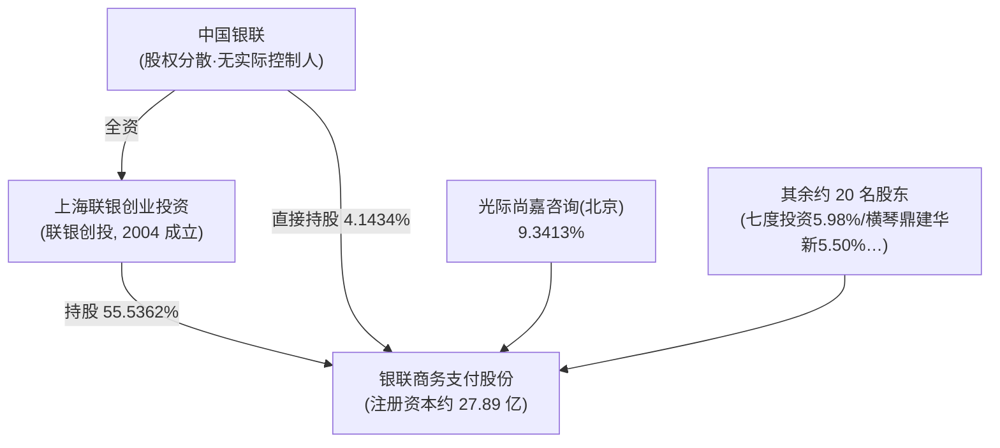
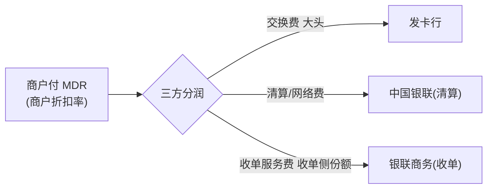

# 银联商务（China UMS）

> 📌 **一句话定位**：中国银联系的全国性第三方**银行卡收单与综合支付巨头**——按尼尔森口径连续十二年（自 2013）亚太收单交易金额第一，但深陷"**规模亚太第一、盈利近乎盈亏平衡**"的费率市场化困境。
> 🏷️ **角色归类**：**收单机构（Acquirer）为核心**，向"全栈商户综合服务商（支付+科技+信息+营销）"延伸。**受理侧收单方，不是卡组织/清算机构**——清算属中国银联（呼应 `01-cards-business §4.2` 收单产业链）。
> ⚠️ **数据时效**：抓取于 2026-06-11。📌 官网自述项以官网为准一手；财务/股权/估值多为**上海联合产权交易所挂牌公告（准一手·附审计）经财经媒体一致转引**；IPO 辅导逾 5 年停滞；数据会漂移。
> ⚠️ **重要区分**：很多"180 国/全球受理网络"成绩属**中国银联（发卡+清算）+ 银联国际**主体，银联商务是其中**收单运营/商户侧执行方**，法人不同（详见 §7）。
> ⚠️ **可信度总则**：本篇 📌=官网自述或准一手挂牌/监管披露已核；🔧=行业公知/机制推断；⚠️=媒体转引未独立核实或时点快照。**绝不编造**——未核到的（如 2022 年 6516万罚单细节、2023+ 分板块财务、牌照证号续展、技术架构云）显式标注。

---

## 1. 基本信息

| 项 | 内容 | 来源 |
|---|---|---|
| **官方全称** | 银联商务支付股份有限公司（China UMS Payment Co., Ltd.）⚠️ 工商登记历史名为"银联商务股份有限公司"（无"支付"），本轮工商源反爬未直连核 | 📌 官网 |
| **总部** | 上海浦东新区张衡路 1399 号（201203）；客服 95534 | 📌 官网 |
| **成立** | 2002 年（中国银联体系下设立，定位银行卡受理市场建设主体）⚠️ 确切设立日未一手核实 | 🔧 |
| **当前状态** | ⚠️ **未上市**，冲科创板辅导**长期停滞**（详见 §3），无股票代码 | 📌 |
| **规模自述** | 截至 **2025-12 累计服务商户超 2800 万家、铺设终端超 4400 万台** | 📌 官网自述（未经审计运营指标）|

---

## 2. 背景与沿革（里程碑时间线）📌+⚠️

| 时间 | 里程碑 | 可信度 |
|---|---|---|
| 2002 | 中国银联体系下设立，承接银行卡受理/收单 | 🔧 |
| 2011-05-03 | **首批获央行《支付业务许可证》**（首批 27 家之一，自述证号 Z2000231000010）| 📌官网自述/⚠️证号未一手核 |
| 2013 起 | 尼尔森口径**连续登顶亚太收单交易金额第一**（公司自述引尼尔森）| 📌自述（付费墙未独立核）|
| 2017-2019 | 营收高位平台期 **79.4 / 80.1 / 80.4 亿**、归母净利 **6 / 6.3 / 4 亿**（收入停滞、净利已下滑）| ⚠️挂牌/债券披露转引 |
| 2020-09 | 与**中金签约辅导**、冲科创板 | 📌上海证监局披露 |
| 2022 | 营收 72.70亿、**净利仅 1402万、利润总额 -4229万（税前亏损）**；天满 SaaS 新平台 | ⚠️产权所挂牌审计转引 |
| 2022-12 | ⚠️ 媒体曾报"央行 6516万元大额罚单（9项违法）"——**本轮 deep-research 未核到一手/权威转引，存疑待核** | ⚠️待核 |
| 2023-10 | 少数股权挂牌，倒推整体估值**约 230亿**（与 2018 持平、五年停滞）| ⚠️产权所披露转引 |
| 2024-05 | 因**违反清算管理规定**被人行上海分行罚 **55万**（责任人孙某平罚 5万；源于 2023 对 2019-2021 业务检查）| 📌人行处罚公示 |
| 2025-01 | 中金完成**第 16 期辅导**（覆盖 2024Q4）——仍**未申报/未过会/未终止** | 📌辅导报告 |
| 2025-08/09 | 推"银商大脑"大模型；服贸会展千亿级金融大模型 | ⚠️自述 |
| 2025-10-24 | **管理层换届：邵阔义接替王炎方任总经理**，人行核准新董事会 | 📌人行核准披露 |

> 战略主线：单一银行卡收单 → 全场景支付 → "支付+科技+信息+营销"综合服务平台；**剥离类金融、聚焦主业、推 AI 大模型、铺路 IPO**（但 IPO 长期停滞）。

---

## 3. 股东与资本 📌准一手（产权所挂牌+证监局辅导披露，媒体一致转引）

- 📌 **中国银联合计控制约 59.68%**（联银创投 55.5362% + 直接 4.1434%）；**共 23 名股东**，前十大合计 91.9087%。
- ⚠️ **"无实际控制人"的双重表述**：监管形式上因**中国银联自身股权分散、无实控人**，银联商务**亦被表述为无实际控制人**；但**实质最终控制人是中国银联**——画像两种说法并列，勿混。
- 📌 **估值约 230 亿元**（2018→2023 五年基本停滞，按少数股权挂牌底价倒推的隐含值，⚠️ 非成交价/非独立评估）。

### 3.1 IPO：辅导逾 5 年停滞（关键资本看点）📌

📌 2020-09 与中金签辅导协议冲科创板；到 **2025-01 已完成第 16 期辅导**（第 11 期 2023Q3、第 13 期 2024-04…），但**始终停在辅导阶段——未正式申报、未过会、未撤回、未终止**。
> ❌ **核查纠偏**：网传"2020-12 已完成辅导、即将报材料"被**对抗式核查 3-0 否决**——辅导远未结束、5 年仍在辅导期。这本身就是"盈利困境拖累 IPO"的信号（§5）。

---

## 4. 牌照与资质 📌官网自述+⚠️证号待核

- 📌 官网页脚自述"**首批获得央行《支付业务许可证》**"，并持**增值电信业务经营许可证**（沪ICP备05003469号-1）。
- ⚠️ **母公司支付牌照**：现有画像记证号 **Z2000231000010**、业务范围**互联网支付+移动电话支付+银行卡收单+预付卡受理（全国）**、约 2026-04 到期——⚠️ **本轮央行名录未直连核实证号与续展状态**，沿用旧记录、标待核。
- ⚠️ **"几十项牌照"实为集团/关联体系分散持有**（小贷/基金销售/保理/CFCA电子认证等），本轮**未获一手清单**：
  - 中金同盛小贷（全国网络小贷，2017 成立，2023-03 转让 52% 给湖北宏泰——**聚焦主业、降类金融合规压力、为 IPO 扫障碍**）。
  - 子公司是否独立持牌未逐项核实，需查央行/金融监管总局/证监会名录。

---

## 5. 定位与商业模式（盈利结构）📌财务准一手 + 🔧机制

### 5.1 收单分润机制：钱怎么分 🔧

🔧 银行卡收单的钱按"**发卡行 — 卡组织清算 — 收单机构**"三方分（呼应 `01-cards-business §6` MDR/交换费）：

- 🔧 银联商务赚的是**收单侧那一份服务费**——它**不是清算方**（清算是中国银联）、**不是发卡方**。
- ⚠️ 📌 **盈利困境根因（"96 费改"）**：2016 年"**96 费改**"后费率市场化、取消行业分类定价 → 收单费率被价格战压薄；叠加类金融剥离、合规成本 → **收单薄利、高度依赖规模**。

### 5.2 "规模大不赚钱"：核心矛盾 📌准一手

| 指标 | 数值 | 说明 |
|---|---|---|
| **2022 营收** | **72.70 亿** | 较 2017-2019（约 80 亿）**微降** |
| **2022 净利润** | **仅 1402.38 万**（净利率 **0.19%**）| 利润总额 **-4229万（税前亏损、税后微利）** |
| 2017-2019 归母净利 | 6 / 6.3 / 4 亿 | **净利率从约 8% 断崖跌到 0.2%** |
| 2020H1 毛利率 | 48.14%（↓，2019 为 51.47%）| 毛利率持续承压 |

> 🔑 **典型"规模大不赚钱"**：亚太收单第一的体量，净利率却近乎盈亏平衡——**96 费改后费率市场化 + 价格战 + 类金融剥离 + 合规罚款**共同碾薄利润。这是和支付公司聊"收单生意本质"的活案例。
> ⚠️ **数据边界**：以上为 2022 及历史时点（产权所挂牌审计经媒体一致转引），**2023/2024/2025 完整年度及分板块（支付/科技/营销）占比未获一手**。

### 5.3 第二曲线

🔧 力推**金融信息服务/行业科技/数字营销/大数据/SaaS** 提升盈利质量（摆脱纯收单薄利），但⚠️ **各板块收入占比未公开**。

---

## 6. 核心产品与业务范围 📌官网六大板块

| 板块 | 内容 | 角色 |
|---|---|---|
| **综合支付服务（旗舰：全民付）** | 线下/线上/境外；POS/智能POS、B扫C·C扫B、App/H5/小程序、刷脸/NFC，对接多电子钱包与银行账户；收单+跨境收付 | **收单主入口** |
| **金融信息服务** | 商户/用户与金融机构信息撮合（贷款/理财），**非自营放贷**（类金融已剥离）| 撮合 |
| **行业商户科技服务** | 物流/餐饮/智慧商圈/园区的 ERP/电子发票/自助终端/行业方案 | 科技变现 |
| **数字营销服务** | 基于交易+商户大数据的精准营销/消费券/引流 | 数据变现 |
| **支付运营服务** | 商户支付运营/对账/资金管理外包 | 运营 |
| **天满（Tianman）SaaS 平台** | 📌"面向商户、合作商、开发者提供开放、便捷的 SaaS 服务生态"，开放 API | 平台生态 |

- 📌 **银商大脑（UMS Brain）AI**：官网列 **RPA / 低代码 / BI** 三款工具；⚠️ "2025 自然语言/千亿金融大模型"为自述、本轮未一手确证能力。
- 💡 **受理多入口**（重要）：全民付不止二维码——POS/App/刷脸/NFC 都有（呼应 `02-epayment-business §3.2` 澄清"中国受理不止二维码、网关收单逻辑都在"）。

---

## 7. 业务区域 📌+⚠️法人边界

- 📌 **中国大陆（核心）**：全国 31 省市收单网络，深入**县域、乡镇**——"国家队"全域覆盖龙头。
- 📌 **境外业务（官网七项）**：跨境货款支付、跨境电商付款、**跨境全球收单**、跨境电商收款、跨境学费、国际汇款、**外卡收单**。
- ⚠️ **关键法人边界**：常被引用的"**180 国受理网络/70+ 国发行银联卡**"成绩属**中国银联 + 银联国际**主体；银联商务是其中**收单运营/商户侧执行方**，二者法人不同。⚠️ "一带一路/迪拜枢纽具体业务""与银联国际的精确分工"本轮未获一手核实。

---

## 8. 规模与数据 📌ESG自述+⚠️转引

- 📌 **2023 交易规模（公司 ESG 报告）**：综合支付**笔数 167.9 亿笔、金额 18.7 万亿元**，同比 +20.6% / +0.9%——🔑 **笔数高增、金额近停滞 = 客单价下移约 16%**（小额高频化）。
- ⚠️ 营收/净利曲线见 §5.2；2024/2025 完整年度未获一手。

---

## 9. 组织架构 + 管理层 📌2025-10 换届一手

- 📌 **2025-10-24 换届**（人行上海分行核准）：**邵阔义接替王炎方任总经理**；新董事会：邵阔义、王立新、徐竹、金正、刘继、杨高宇、王良柱；**吴俊峰=合规风控负责人、冀乃庚=技术负责人**。
- ⚠️ **原画像"田林董事长"存疑**：2025-10 换届董事名单**未见田林**——是否仍任董事长/已卸任，本轮未确证，标待核（勿沿用旧表述为定论）。
- ⚠️ 完整 CFO/COO、事业群/分公司架构、员工规模未获一手。
- 📌 **法律实体**：中国银联控股的非银行支付机构，经全资子公司联银创投持 55.5362%。

---

## 10. 技术架构特点 📌自述+⚠️云未知

- 📌 **银商大脑（AI 中台）**：RPA/低代码/BI 三款；自述 2025 推大模型。
- 📌 **天满 SaaS 开放平台**：多租户、开放 API、开发者接入。
- 📌 **全民付**：多入口受理（POS+二维码+线上）对接多钱包与银行账户。
- ⚠️ **是否用公有云（含 AWS）、底层架构（容器/微服务/HSM）未公开**；作银联系国企，**基础设施大概率倾向国资云/自建数据中心**——🔧 无一手证据，属合理推断。

---

## 11. 护城河与差异化

- ① **规模与网络效应**：尼尔森连续十二年亚太收单第一（2012 还仅全球第 21，十年跃至全球第六）。
- ② **中国银联清算网络背书** + 全国/县域/港澳/境外全场景受理覆盖，牌照合规壁垒高。
- ③ **海量交易数据资产**（风控/营销/行业科技）。
- ④ **渠道下沉**（县域乡镇）。
- ⚠️ **劣势**：国企体制盈利能力弱、净利率（0.2%）远低于民营龙头（如拉卡拉）；IPO 停滞。

---

## 12. 主要竞争对手 📌+🔧

> **定位反差：国家队/银联系龙头（银联商务）vs 民营第三方龙头（拉卡拉）**

| 对比 | 银联商务 | 拉卡拉 / 其他民营 |
|---|---|---|
| **上市** | ❌ 未上市（IPO 停滞） | 拉卡拉 A 股 300773（已上市）|
| **交易规模** | 约 18.7 万亿/年（2023）| 拉卡拉约近 4 万亿（2020）——银联商务体量数倍 |
| **打法** | 全国+县域+港澳+境外广度、银联清算背书 | 收钱吧/富友/乐刷等在中小微长尾更灵活、价格更激进 |
| **盈利** | 净利率约 0.2%（规模大不赚钱）| 民营价格战反过来挤压银联商务费率 |

⚠️ 数据跨年（2020-2025）不完全可比，份额口径不一。

---

## 13. 监管与最新动态 ⚠️时效

- 📌 **2024-05 罚 55万**（违反清算管理规定，人行上海分行；责任人孙某平罚 5万；源于 2023 对 2019-2021 业务检查）。
- ⚠️ **2022-12 "6516万元大额罚单（9项违法）"**：现有画像曾记此为"2022 年支付领域最大单笔罚单"——但**本轮 deep-research 未核到一手/权威转引来源，降级为"媒体曾报、待独立核实"**，勿当确证事实引用。
- 📌 **2025-10 管理层换届**（§9）；2025 银商大脑大模型/服贸会千亿金融大模型（自述）。
- ⚠️ 2025-2026 IPO 是否重启/终止无一手结论。

---

## 14. 标杆客户与案例 📌+⚠️

- 📌 交通银行（2024-09 数字人民币战略合作）、上海豫园（"Meet China"外籍游客文旅消费自助系统）、大湾区跨境保险结算（⚠️ 部分属银联/银联国际主体）。
- ⚠️ 客户高度分散（千万级中小商户为主），无单一"超级客户"；公开具名标杆有限，多为行业解决方案层面。

---

## 15. 与本研究 / AWS 对话的衔接

- **可聊**：① **银联系收单龙头**（与民营拉卡拉对照）；② **"规模大不赚钱"的盈利困境**（72.70亿营收 vs 1402万净利、净利率 0.19%、利润总额 -4229万——96 费改+价格战的活案例）；③ 尼尔森亚太十二连冠；④ **IPO 辅导 5 年停滞 + 类金融剥离**的资本路径；⑤ 银商大脑金融大模型。
- **AWS 角度**：⚠️ 银联系国企**大概率用国资云/自建**，AWS 直接切入有限；潜在切口=全民付/天满 SaaS 多租户开放平台大促弹性、银商大脑大模型推理/向量检索/KYT 实时风控、跨境收单海外节点。⚠️ 数据受《个保法》《数据安全法》《非银支付条例》强约束，**数据本地化是硬约束**。

---

## 16. 来源清单 📌

- **准一手（受监管平台/监管披露，经媒体一致转引）**：上海联合产权交易所股权挂牌公告（2022 财务/股权/估值，2023-10）、上海证监局/CSRC 中金 IPO 辅导报告（IPO 进程）、人行上海分行行政处罚公示（2024-05 罚 55万、2025-10 换届核准）。
- **一手（公司自述）**：chinaums.com 官网（全称/地址/商户终端数/尼尔森连续第一/六大产品/天满/银商大脑/境外七项服务/首批支付牌照）——"公司说了什么"的一手，客观真实性（尤其尼尔森因付费墙）未独立核实。
- **二手转引**：财联社 cls.cn、搜狐、东方财富、网易、界面、36氪、中国青年网（财务/股权/估值/IPO/罚单）。
- ⚠️ **已知核查空白（诚实声明）**：① 2023/2024/2025 完整及分板块财务；② 母公司牌照证号/续展、子公司分散牌照清单；③ 2022-12 6516万罚单真伪与细节；④ 田林是否仍任董事长、完整高管 roster、员工规模；⑤ 跨境与银联国际法人边界、迪拜枢纽；⑥ 技术架构（云/自建/技术栈）。以上均需央行名录/工商/产权所原始页/公司财报一手补核。
