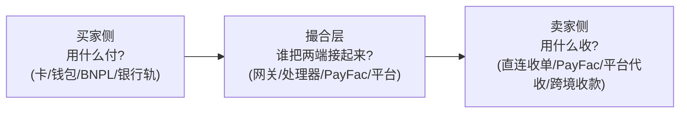
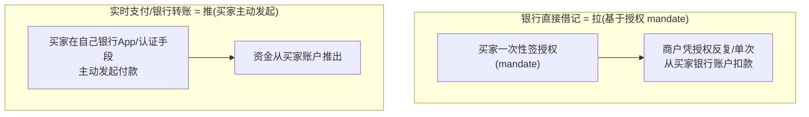
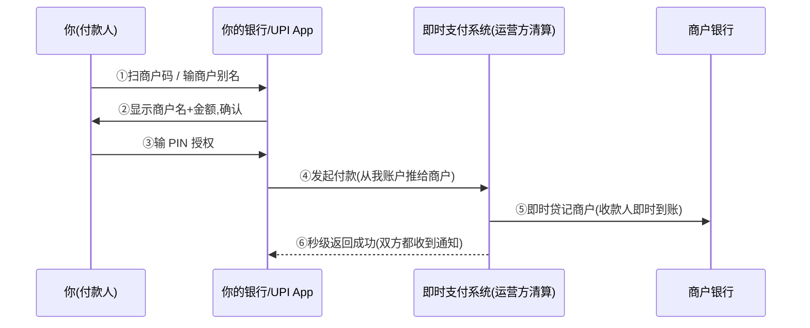
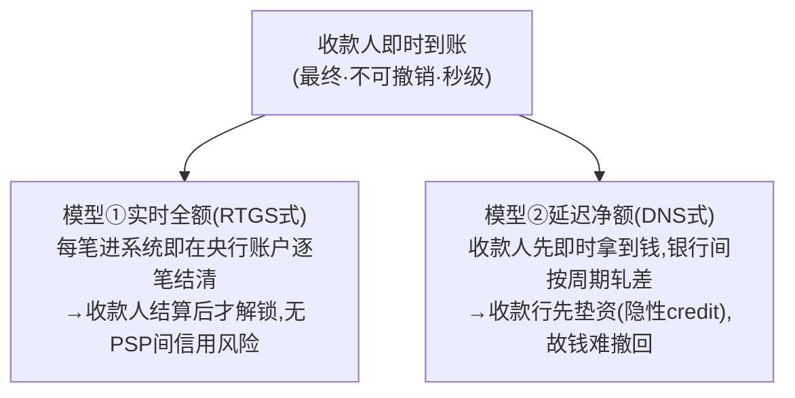
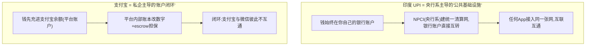
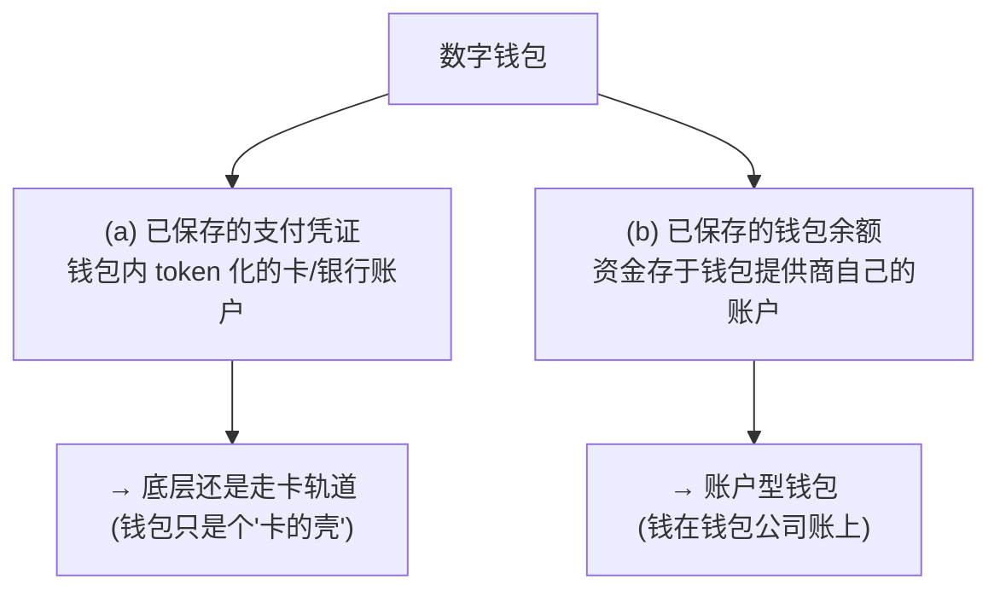
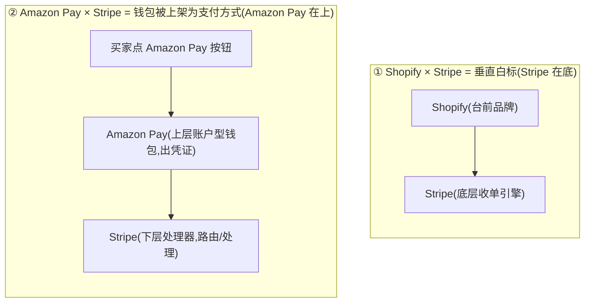
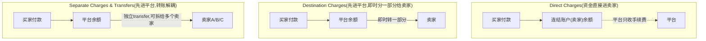
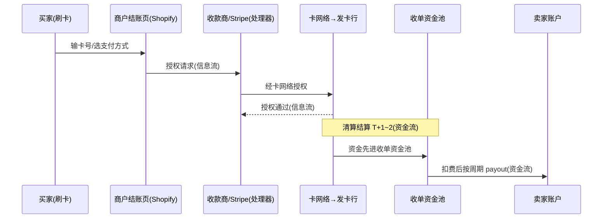

# 模块 1·2 深化 · 电商支付业务场景：买家怎么付、卖家怎么收

> **学习者**：AWS 技术架构师 · 支付小白
> **本篇目标**：把"电商场景里一笔钱怎么走"讲透——**买家侧有哪些支付方式、卖家侧有哪些收款方式、各自底层走什么引擎、是推还是拉、信息流/资金流如何分离、谁担风险**。这是横跨"银行卡(模块1)+电子支付(模块2)"的综合业务场景，直击"和支付公司深聊业务"目标。
> **前置**：模块1 `01-cards-business.md`（四方模型/收单产业链/推拉/PayFac）、模块2 `02-epayment-business.md`（网关/第三方支付/钱包）；企业画像见 `02c-epayment-players/stripe.md`、`03c-crossborder-players/`。
> **组织方式**：top-down——全景 → 买家侧 → 卖家侧 → 撮合层 → 场景矩阵 → 完整链路。零散追问见末尾 FAQ。
> 标注：🔧 行业公知 · 📌 已核查·一手 · ⚠️ 告诫/坑点 · 🎯 交流要点
> ⚠️ **可信度总则**：本篇支付方式分类骨架、钱包两种资金底座、Apple Pay/Amazon Pay 机制、Stripe Connect 三种收款模型与到账周期，均经 **deep-research 对抗式核查、引 Stripe 官方 docs 等一手来源**（标 📌，来源见末尾附A）；BNPL 资金流、各本地支付轨道细节、跨境收款商资金落点等**本轮未完成一手核查**，标 🔧 行业公知或 ⚠️ 待核，写正式材料请二次核实。

---

## 1. 全景：电商支付 = 买家侧 × 撮合层 × 卖家侧

> 🔑 **第一性**：电商支付要解决的，是"**素不相识的买家和卖家，隔着一根网线，怎么安全地完成一次钱货交换**"。它天然被切成三段——买家用什么把钱付出去、卖家用什么把钱收进来、中间用什么把两者接起来。

- **买家侧（付款方式 payment method）**：买家在结账页能点的选项——刷卡、Apple Pay、PayPal、花呗分期、扫码…… 每种背后走的"轨道"和"推拉"完全不同（§2、§3）。
- **撮合层（处理/受理）**：网关、处理器、PayFac、平台——负责把买家的付款指令路由出去、把钱收下来再结给卖家（§4）。
- **卖家侧（收款方式）**：卖家怎么把钱收进自己口袋——自己对接收单行、挂靠 PayFac、靠平台代收、用跨境收款商回国（§5）。

> 🎯 **交流要点**：能把"电商支付"拆成"买家付款方式 × 撮合层 × 卖家收款方式"三段，并对每段追问"走什么轨道、推还是拉、钱第一站进谁账户、谁担风险"——这套框架能套住几乎所有电商支付问题。

---

## 2. 买家侧：有哪些支付方式，各走什么轨道

### 2.1 官方骨架：支付方式的 8 大类 📌

📌 **Stripe 官方把所有支付方式归为 8 大类**（这是业内最权威、可直接拿来当全集骨架的分类）——卡、银行直接借记、银行重定向、银行转账、BNPL（先买后付）、实时支付、代金券/店内支付、钱包（来源：Stripe Payments Methods Overview，附A[1]）。

把这 8 类按"底层轨道"归并，其实就**三条主线 + 一个特殊层**：

| 主线 | 包含的类别 | 推/拉 | 本质 |
|---|---|---|---|
| **① 卡轨道** | 卡（信用卡/借记卡） | **拉** | 走 Visa/MC/银联网络，实时授权，商户凭授权拉款（模块1） |
| **② 银行轨道** | 银行直接借记、银行重定向、银行转账、实时支付 | **借记类=拉、转账/实时=推** | 直接动银行账户，不经卡网络（详见 §2.3） |
| **③ 钱包层（特殊）** | 钱包（Apple Pay/Google Pay/PayPal/Amazon Pay…） | **取决于底层资金源** | ⚠️ **不是单一机制**——见 §2.4，这是最大的认知陷阱 |
| 其他 | BNPL、代金券/店内 | BNPL 特殊（§6.2） | BNPL 由第三方垫付、消费者分期 |

### 2.2 卡轨道（最主流）：实时授权的"拉" 🔧

🔧 信用卡/借记卡是电商最主流的支付方式，机制就是模块1 讲的**四方模型 + 拉支付**：买家在结账页输卡号（CNP 卡不在场），商户经收单方→卡组织→发卡行**实时授权**，事后清算。

- **推/拉**：**拉**——商户凭买家授权去发卡行扣款。
- **信息流/资金流**：授权信息走卡网络实时往返；资金走清算结算（T+1~2）（模块1 §5）。
- **谁担风险**：商户承担**拒付（chargeback）**风险（持卡人可绕过商户找发卡行要回钱，模块1 §5.2）。

### 2.3 银行轨道：借记是"拉"、转账/实时是"推" 📌

不走卡网络、直接动银行账户的一大类，内部按"谁发起"分两种，**这是最值得记的区分**：

**① 银行直接借记（ACH Direct Debit、SEPA Direct Debit、Bacs、BECS、PAD）= 拉 📌**
- 📌 机制：买家结账时录入银行账户信息并签一份**授权（mandate）**，商户据此**直接从买家银行账户扣款**，支持一次性和周期性（来源：Stripe Bank Debits docs，附A[2]）。
- ⚠️ 📌 **确认慢**：付款确认需**数个工作日**（ACH 标准 T+4、加急 T+2），不像卡是实时授权——**Stripe 明确告诫：别在支付流程一结束就发货**（附A[2][3]）。
- ⚠️ 📌 **风险归属**：**部分银行借记方式在争议时"判客户赢"**，商户担拒付风险；Stripe 建议争议高发业务慎用（附A[2]）。

**② 实时支付 / 银行重定向 / 银行转账（Pix、UPI、PayNow、PromptPay、iDEAL…）= 推 📌**
- 📌 机制：买家用**电话号码等认证手段，从自己银行账户主动发起**付款。流程上 Stripe 发给买家一个代表总额的 ID → 买家经银行 App/第三方服务付款 → 该服务与买家银行通信锁定资金（来源：Stripe Real-time Payments docs，附A[4]）。
- 这是**"从银行推钱"**的模型，对账单上出现的是该 App/服务，而非卡网络。
- ⚠️ 注：UPI 等技术上是 push-pull 混合（PayTo/mandate 是被授权的拉），但"资金源直接借记 + 认证手段发起 vs 卡网络拉"这一**承重区分成立**（附A[4]）。

> 🎯 **交流要点**：能说"银行借记是基于 mandate 的拉、确认要几天、争议常判客户赢；实时支付是从银行账户主动推"——直接区分了两类"绕开卡网络"的支付，远超"都是银行付款"的笼统认知。

#### 2.3.1 即时支付深挖：到账 ≠ 结算、走什么标准/网络、和刷借记卡的区别 📌

> 即时支付（UPI/PIX/FedNow/RTP/TIPS）是一个独立物种，常被三件事搞混：①"即时"到底指什么 ②它走什么清算结算/标准/网络 ③它和"刷借记卡"是不是一回事。下面逐个讲透（机制经 deep-research 一手核查，来源见附A）。

**A. 用户视角流程（以 UPI 扫码付款为例）🔧**

全程你在**自己的银行/支付 App** 里操作：扫码/输对方别名 → 确认金额 → 输 PIN → 钱**从你账户主动推出**。和刷卡最大区别：**你主动发起的一笔转账（推），不是商户来拉你**。

**B. 🔑 核心认知："收款人即时到账" ≠ "银行间即时结算" 📌**

📌 **BIS/CPMI 权威定义显式把这两件事解耦**（来源：BIS Quarterly Review 2020.3、CPMI d154，附A[18][19]）：即时支付保证的是**收款人即时获得"最终、无条件、不可撤销"的资金**（funds availability），但**PSP（银行）之间真正结清**未必同时发生。据此分两种结算模型：

📌 **DNS 的本质（核查确证）**：延迟净额下，**收款行在收到付款行的钱之前就先给收款人放款**=向付款行**隐性垫资（implicit credit extension）**；也正因如此，这笔即时支付**在没有收款人配合时无法逆转**（CPMI d154，附A[19]）。

**C. 五大系统：结算模型 / 报文标准 / 运营网络 📌**

| 系统 | 运营方 | 结算模型 | 报文标准 | 可信度 |
|---|---|---|---|---|
| **美国 FedNow** | **美联储** | 实时全额、央行货币、7×24×365 | **ISO 20022** | 📌一手(附A[20]) |
| **欧洲 TIPS** | **欧央行/欧元体系** | 实时全额、央行货币、终局不可撤销 | ISO 20022 | 📌运营/机制一手;ISO 属🔧公知(附A[21]) |
| **美国 RTP** | **The Clearing House** | 逐笔实时终局、经美联储**预筹联合账户**结算 | **ISO 20022** | 📌逐笔终局一手;预筹账户机制为补充(附A[22]) |
| **印度 UPI** | **NPCI**（架在 IMPS 之上） | **即时到账 + 银行间延迟净额(DNS)**(OC122 的 10 个结算周期，经 RTGS 轧 MNSB 净额) | **NPCI 自有 API（非 ISO 20022）** | 📌运营/即时到账一手;DNS 细节核查为 2-1 medium(附A[23]) |
| **巴西 PIX** | 巴西央行 BCB（SPI 系统） | ⚠️ 接近实时全额、央行货币（**本轮未取得一手确证**） | ⚠️ ISO 20022（**未独立核实**） | ⚠️待核 BCB 官方 |

> ⚠️ **诚实声明**：**PIX 这一行本轮 deep-research 无幸存一手断言**——SPI/央行货币/ISO 20022 均**未独立核实**，按行业认知列出、写正式材料须核 BCB 官方文档。**别名寻址机制（UPI 的 VPA、PIX Key=手机号/邮箱/税号/随机密钥 如何映射真实银行账号）本轮亦未覆盖**，下文 D 节按🔧公知讲、标待核。

**D. 别名寻址：商户账号怎么"给"消费者 🔧待核**

🔧（⚠️ 机制未一手核实，待核 NPCI/BCB 规范）即时支付不暴露真实银行账号，中间加一层**别名**：UPI 用 **VPA**（如 `merchant@bank`）或二维码、PIX 用 **PIX Key**（手机号/邮箱/税号/随机密钥）或二维码——商户把银行账号注册成别名/码，你拿到的是别名，系统后台解析回真实账号再推钱。好处：**隐私安全 + 商户零硬件**（一个码就能收款，普及到路边摊）。

**E. 适用场景 🔧**

| 适合 ✅ | 不那么适合 ⚠️ |
|---|---|
| P2P 个人转账（推、秒到、低费） | 大额"先货后款"（推完难撤、无卡的拒付兜底，消费者保护弱） |
| 线下小额零售/路边摊（零硬件、费率近零） | 跨境（各国系统本地化，互通在早期，BIS Project Nexus 在做，模块3 §12.1） |
| 账单/工资批量推（即时到账+即时对账） | 需信贷/分期（它是借记型，无授信） |

**F. 和"刷借记卡"是两条平行管道（最易混）📌+🔧**

| | **刷借记卡** | **即时支付（UPI/PIX/FedNow）** |
|---|---|---|
| 走什么轨道 | **卡组织网络**（Visa/MC/银联） | **银行轨道**（央行/运营方即时清算，绕开卡网络） |
| 报文标准 | **ISO 8583**（模块1） | **ISO 20022**（UPI 例外=NPCI 自有 API） |
| 推/拉 | **拉**（商户凭授权去发卡行拉款） | **推**（你从账户主动推给商户） |
| 用什么钱结算 | 商业银行货币、T+1~2 清算 | **多为央行货币**、秒级/近实时结算 |
| 可撤销性 | 有拒付 chargeback | 推完难撤、终局性强 |

> 🔑 **一句话**：刷借记卡虽花的是银行账户的钱，但它**走卡网络、是拉、ISO 8583、T+1~2**——骨子里是卡组织四方模型；即时支付**走银行轨道、是推、（多为）ISO 20022、央行货币秒级结算**——这正是各国央行单独建即时支付系统的动因：**摆脱卡组织这条"拉"的中间轨道**。

#### 2.3.2 为什么印度走 UPI、中国走支付宝？——两条绕开卡组织的路 🔧

> 两条路都能绕开卡组织、做到扫码零售，但**谁主导、钱存哪、账本归谁**根本不同（⚠️ 国情/主导方分析为🔧公知级推理，UPI 治理细节见附A[23] BIS）：

| 维度 | **印度 UPI** | **支付宝/微信** |
|---|---|---|
| **谁主导** | NPCI（央行+银行联合体），定位**公共基础设施** | 私营企业先跑出来 |
| **钱存哪**（最本质） | **始终在你自己银行账户**，UPI 只做清算层、不持有你的钱 | **先充进平台余额**（账户型钱包，持沉淀资金，呼应 §2.4、`02 §4.2`） |
| **要不要重牌照** | UPI 本身不持余额→监管较轻 | 持余额→**储值牌照+备付金集中存管**（`02 §4.2.2`） |
| **互通性** | 任何 App 接入即互通 | 平台间故意不互通（竞争壁垒） |
| **国情背景** | 借 Aadhaar 身份+Jan Dhan 普惠开户，**激活已有银行账户** | 2003 年银行卡/信任体系弱，**钱包余额+担保交易填空白** |

> 🔑 **收口**：印度选 UPI（钱在银行账户、央行系建公共网、天然互通、轻平台）vs 中国走支付宝（钱进平台余额、私企闭环、重牌照、跑出超级 App）——决定走哪条的从来不只是技术，而是**谁主导、钱归谁管、监管想要什么**（呼应主目录"四套管道"：决定胜负的是信任与权力的分配）。💡 中国扫码支付也绕开卡组织，但走的是**第三方支付内部账本+网联**（`02 §3.2/§5`），和 UPI 的"银行账户直接互转"又是另一条路——三条都在回答"怎么不靠卡组织做零售支付"，但各走各的账本。

### 2.4 钱包：最大的认知陷阱——它不是单一机制 📌

> 🔑 **核心结论（已核查）**：📌 **Stripe 官方把"钱包"明确定义为两种资金底座**（来源：Stripe Wallets / Payment Methods Overview，附A[1][5]）：

| 资金底座 | 本质 | 典型代表 | 走什么轨道 |
|---|---|---|---|
| **(a) token 化的卡/银行凭证** | 钱包只是把卡"包了一层"，付款时解出卡去走卡网络 | **Apple Pay、Google Pay** | **卡轨道**（同卡费率） |
| **(b) 独立钱包余额** | 钱存在钱包公司账户里，付款=动钱包余额 | **PayPal、Cash App、Amazon Pay** | 钱包账户体系（账户型） |

⚠️ **可信度**：📌"钱包分两种底座"是 Stripe 官方直陈；但"**具体哪个钱包落哪一桶**"（Apple/Google=token 卡、PayPal/Amazon=余额）是**机制一致性推断（🔧 行业公知），Stripe 文档未逐一映射**——写正式材料勿当官方定论。

**两个已核查的代表案例：**

**① Apple Pay = 卡的 token 化封装 📌**
- 📌 Stripe 把 Apple Pay 归为"钱包"类型，**适用与其他卡交易相同的费率、不收额外处理费**（证明它走卡轨道）。
- 📌 支持 **merchant token（MPAN）** 启用周期/后付/自动充值等商户发起交易（MIT），MPAN 跨设备持久、设备丢失后仍有效（来源：Stripe Apple Pay docs / merchant-tokens，附A[6][7]）。⚠️ MPAN 仅发卡行支持时签发，否则返回 DPAN。

**② Amazon Pay = 账户型钱包 + 重定向 📌**（详见 §4.3，它和 Stripe 的关系是常被问的点）
- 📌 买家选 Amazon Pay → **被重定向到 Amazon 网站**，用其 Amazon 账户内**已保存的配送与支付信息**完成购买 → 再跳回商户（来源：Stripe Amazon Pay docs，附A[8]）。措辞为"账户内已保存的支付信息"（账户型 UX），未否认底层资金工具仍可能是账户内绑定的卡。

### 2.5 信息流 / 资金流分离（谨慎下定论）⚠️

🔧 模块0 讲过"信息流≠资金流"。钱包场景下，付款时钱包做完认证，把支付信息/token 交给处理器，处理器再去对应轨道完成扣款——信息流和底层资金源在体验上是分离的。

> ⚠️ **核查告诫**：有一种常见说法是"钱包 token 化**使 Stripe（处理器）完全不接触敏感卡号**，信息流因此与资金源彻底隔离"——这条在本轮**对抗式核查中被否决（1-2）**，**不能作为已核实事实下定论**。讲信息流分离时，停在"体验/指令层分离"即可，不要断言"处理器绝不接触卡数据"。

---

## 3. 买家侧支付方式速查表（推拉 × 轨道 × 风险）

> 综合 §2，把主流方式列成一张速查表。📌=已核查机制，🔧=行业公知/推断。

| 支付方式 | 底层轨道 | 推/拉 | 谁担拒付/欺诈 | 可信度 |
|---|---|---|---|---|
| 信用卡/借记卡 | 卡网络（Visa/MC/银联） | 拉 | 商户（chargeback） | 🔧 |
| Apple Pay / Google Pay | **卡轨道**（token 化卡，同卡费率） | 拉 | 商户（同卡） | 📌 |
| PayPal / Cash App / Amazon Pay | **账户型钱包余额** | 取决于资金源 | 钱包规则各异 | 📌(分类)+🔧(映射) |
| 银行直接借记（ACH/SEPA DD） | 银行轨道 | **拉（mandate 授权）** | **常判客户赢→商户担** | 📌 |
| 实时支付（Pix/UPI/PayNow） | 银行轨道 | **推（买家发起）** | 推式欺诈风险归买家侧居多 | 📌 |
| iDEAL（银行重定向） | 银行轨道 | 推 | 🔧 推式 | 🔧 |
| BNPL（Klarna/Afterpay/Affirm） | 第三方信贷垫付 | 特殊（§6.2） | **BNPL 公司担**（垫付方） | 🔧 待核 |
| 支付宝/微信 | 账户型钱包+绑卡 | 偏推（含 escrow，模块2） | 担保交易/平台规则 | 🔧 |

---

## 4. 撮合层：买卖两端怎么被接起来

### 4.1 撮合层的角色（复用模块1/2）🔧

🔧 买家的付款指令要变成卖家账上的钱，中间要经过（模块1 §4、模块2 §2）：**网关（受理入口）→ 处理器（技术处理）→ 收单/PayFac（持牌代收）→ 卡组织/银行轨道（清算）**。不同玩家覆盖不同环节，全栈型（如 Stripe）一家通吃。

### 4.2 两种易混的"合作关系"：平台白标处理器 vs 处理器上架钱包 📌

> ⚠️ 这是前几轮反复出现、最易混的点。**同样叫"和 Stripe 合作"，方向可能完全相反**：

| 维度 | **Shopify × Stripe** | **Amazon Pay × Stripe** |
|---|---|---|
| 合作性质 | **白标**（Shopify Payments = Stripe Connect 白标） | **支付方式集成**（Stripe 把 Amazon Pay 当 wallet 上架） |
| 谁在上层 | Shopify（建站平台） | **Amazon Pay（消费者钱包）** |
| 谁在下层 | **Stripe（收单引擎）** | **Stripe（处理器）** |
| Stripe 角色 | 底层引擎，干实际收单 | 编排者，去对接/路由这个钱包 |
| 类比 | "贴牌代工"——壳 Shopify、芯 Stripe | "超市上架"——货架上摆了 Amazon Pay 这个牌子 |

> 🔑 别把这两种混成一类：一个问"**谁是底层引擎**"，一个问"**结账页多一个钱包按钮**"。Amazon Pay 的竞品是 PayPal/Shop Pay/Stripe Link（钱包），**不是 Stripe（处理器）**。

### 4.3 Amazon Pay × Stripe 的确切机制 📌

📌 **已核查**（来源：Stripe Wallets / Amazon Pay docs，附A[5][8]）：
- Stripe **官方支持 Amazon Pay 作为"钱包"类型支付方式**，API 枚举值为 **`amazon_pay`**，归入 wallet 类型。
- **Dashboard 一键开启**，经 **Checkout、Payment Links、Payment Element、Express Checkout Element、Connect** 集成（Express Checkout Element 下不支持 setup_future_usage）。
- 用前端产品时 Stripe 自动判断并展示最相关的支付方式。
- 流程：买家点 Amazon Pay → 重定向到 Amazon 登录、选已存的卡和地址 → Amazon Pay 把授权交回 Stripe → **Stripe 完成后续处理/路由**。

> 🎯 **交流要点**：能讲"Amazon Pay 是账户型钱包、以 `amazon_pay` 作 wallet 被 Stripe 接入、走重定向、Dashboard 一键开"，并点破"它和 Shopify 白标 Stripe 是相反方向的两种合作"——这是支付生态里区分"处理器 vs 钱包"的关键认知。

---

## 5. 卖家侧：有哪些收款方式，钱第一站进谁账户

### 5.1 四种收款路径 🔧

🔧 卖家把钱收进口袋，主流四条路径（机制见模块1 §4）：

| 路径 | 卖家与谁签约 | 谁收单 | 钱第一站 | 典型 |
|---|---|---|---|---|
| **① 直连收单行** | 收单行 | 收单行 | 卖家账户 | 大商户 |
| **② 挂靠 PayFac** | PayFac | PayFac（主商户） | **PayFac 资金池** | Stripe/Square/Adyen |
| **③ 平台代收** | 平台 | 平台/其底层引擎 | **平台账户** | Amazon/Shopify Payments |
| **④ 跨境收款商** | 收款商 | 独立站时它收单/平台店时平台收单 | **收款商海外账户** | 连连/PingPong/Airwallex（详见 `01 §4.6`、`03b`） |

### 5.2 钱第一站进谁账户：Stripe Connect 三种收款模型 📌

> 🔑 用 PayFac/平台代收时，"钱第一站进谁账户"由收款模型决定。📌 **Stripe Connect 官方提供三种**（来源：Stripe Connect docs / 营销页，附A[9][10]）：

| 模型 | 钱第一站 | 谁担拒付/退款 | 示例 | 客户感知平台吗 |
|---|---|---|---|---|
| **Direct Charges** | **卖家（连结账户）余额** | 卖家（它是与买家直接交易的商户） | **Shopify**/Thinkific 类 SaaS | 通常感知不到平台 |
| **Destination Charges** | **平台余额**（即时分一部分给卖家） | 平台 | Lyft | — |
| **Separate Charges & Transfers** | **平台余额**（再独立 transfer 拆给多卖家） | 平台 | ClassPass | — |

📌 三种模型共同回答了"用 PayFac/平台代收时钱第一站进谁账户"——**要么直接进卖家（Direct）、要么先进平台再分（Destination/Separate）**。⚠️ 这些是 **Stripe 专有实现**，泛化到 Square/其他 PayFac 需另行核实。

### 5.3 到账周期 📌

📌 **已核查**（来源：Stripe Connect / Payouts、Shopify Help、Adyen docs，附A[9][10][11][12][13]）：
- **Stripe Connect**：标准银行 payout 约 **T+2（US/澳）~ T+3（UK/EU）** 到账；另有 **Instant Payouts**（约 30 分钟内，可随时含周末）。⚠️ 时效按国家差异大（日本每周、UAE 5 天、泰国 7 天；首笔 7–14 天）。
- **Shopify Payments**：商户可选 **每日/每周/每月** payout（日本仅周/月）；📌 **资金先在 Shopify 沉淀、按节奏批量结算**，且 payout 由 Shopify 发出、**实际由外部处理伙伴处理**（美/法用多个处理伙伴）——印证它**架在第三方处理器之上**而非自有完整结算轨道。
- **Adyen for Platforms**：📌 资金留在 **Adyen 持牌主体（EMI/银行）控制的 balance account** 直到 payout，可在平台内部账户间移动资金借贷子商户——印证"平台/PayFac 先持有资金"。

### 5.4 持牌与合规归属 📌

📌 **Stripe Connect 代平台承担与支付相关的合规义务**，依托自有牌照——**美国 MTL + 欧盟 EMI**，执行 KYC/AML 与禁止业种/MATCH 名单筛查（来源：Stripe Connect 页 + 爱尔兰央行对 Stripe Technology Europe 授权 ref C187865 + Stripe 牌照页，附A[10][14][15]）。⚠️ 承担程度随账户类型（Standard/Express/Custom）而异（见 stripe.md §4.2）；用户自身商品/主体合规仍归用户。

> 🔑 **跨境收款商（连连等）的持牌与"钱第一站"**：本轮 deep-research **未覆盖**，沿用前几轮已核查结论——连连@Amazon 是回款通道（钱第一站=连连海外账户）、@独立站是收单 PayFac，持牌体系见 `03c-crossborder-players/lianlian.md §4.1/4.2`。

---

## 6. 场景组合与特殊方式

### 6.1 场景矩阵：平台店 vs 独立站 × 境内 vs 跨境 🔧

🔧 把买家侧、卖家侧套进真实电商场景（连连双重角色见 `01 §4.6.1/4.6.2`，下钻见 §6.1.1）：

| 场景 | 谁收单 | 卖家收款 | 买家常用方式 |
|---|---|---|---|
| **Amazon 平台店** | Amazon 自己 | 接回款通道（连连/Payoneer…） | 卡/Amazon 账户 |
| **Shopify 独立站(海外主体)** | Shopify Payments(底层 Stripe) | Stripe Connect payout | 卡/钱包/BNPL/本地支付 |
| **Shopify 独立站(中国卖家)** | 第三方收款商(连连/Airwallex=收单 PayFac) | 收款商换汇结售汇回国 | 卡/钱包/本地支付 |
| **国内电商(淘宝/天猫)** | 支付宝(escrow) | 担保交易确认收货放款 | 支付宝/微信(推+托管) |

#### 6.1.1 平台店 vs 独立站(DTC)：买家体验 & 卖家经营差异 🔧

> 🧭 **先对齐术语**：**DTC 独立站 = 品牌直营独立站**，**Shopify 只是搭 DTC 站最主流的工具**，二者同类。真正的对比轴是 **独立站(DTC，Shopify 为代表) vs 平台店(Amazon 为代表)**。两者所有差异的根子，都连着"**有没有平台站在你和买家中间**"（即 §6.1"谁收单"）。

**① 对买家：入口与体验**

| 维度 | **平台店（Amazon）** | **独立站（DTC/Shopify）** |
|---|---|---|
| **入口** | 站内搜索而来，先信平台再看到你 | 广告/社媒/网红/Google 点进来，冲品牌/这款货而来 |
| **信任来源** | 信 Amazon（平台背书、退货保障） | 信品牌本身，靠口碑/网站质感建立 |
| **比价环境** | 同页竞品并列，比价激烈 | 无旁边竞品，注意力只在品牌世界 |
| **结账体验** | 一键下单极丝滑（卡已存，Amazon 收单） | 跳品牌结账页，体验取决于卖家集成水平 |
| **售后** | Amazon 统一客服+退货，安心 | 找品牌自己，好坏全看卖家 |
| **整体感受** | 像逛"超市货架"，高效无品牌记忆 | 像进"品牌专卖店"，有调性但信任要品牌自挣 |

**② 对卖家：经营（差异更大，是关键）**

| 维度 | **平台店（Amazon）** | **独立站（DTC/Shopify）** |
|---|---|---|
| **流量** | 平台自带海量流量，靠站内广告/排名抢 | 无自然流量，自己花钱买量，获客成本高 |
| **客户数据** | ❌ 拿不到（买家归平台） | ✅ 完全归自己，可反复触达/再营销 |
| **收单/收款** | Amazon 收单，卖家只接回款通道 | 自己解决收单（连连/Airwallex=收单PayFac，或海外主体用 Shopify Payments） |
| **成本结构** | 平台佣金+FBA仓配+广告费，抽成重 | 建站订阅+支付手续费+流量费，无平台佣金但获客贵 |
| **品牌资产** | 几乎为零（做大也是个 listing） | ✅ 沉淀自己手里，可做会员/复购/估值溢价 |
| **规则风险** | ⚠️ 受平台强约束（封号/改算法/跟卖） | 自己掌控，不怕被一夜封店（但自担合规风控） |
| **启动门槛** | 低，开店上架蹭流量 | 高，建站/引流/收单/客服全自搭 |

> 🔑 **一句话**：**Amazon=借平台流量、低门槛起量，但抽成重、数据品牌不归你、命脉攥在平台手里；独立站=流量靠自己买、门槛高，但客户数据/品牌/利润率都归自己、能沉淀长期资产。** 故成熟卖家多"两条腿走路"：**用 Amazon 起量验证选品、用独立站沉淀品牌抓数据提利润**，甚至用 Amazon 流量反哺 DTC 站做复购。

### 6.2 BNPL：第三方垫付、消费者分期 🔧待核

🔧 **机制概述**（⚠️ 本轮未完成一手核查，待核 Klarna/Affirm 商户文档+CFPB 报告）：
- BNPL（Klarna/Afterpay/Affirm）的本质是**第三方信贷**：**BNPL 公司先把（扣费后的）全额一次性垫付给商户**，再向消费者**分期收款**。
- **谁担风险**：消费者违约风险由 **BNPL 公司承担**（它是放贷方），不是商户。
- **商户费率为何更高**：🔧 因为 BNPL 公司承担了信贷风险+垫资成本+往往带来转化率/客单价提升，故 MDR 通常**显著高于卡**——商户用更高费率换"更高转化"。
- ⚠️ 以上 take rate/垫付时点为机制性判断，**具体数字与流程须核一手**（Affirm/Klarna 商户页、CFPB《BNPL Market Trends》2022，附A[16][17]）。

---

## 7. 一笔钱的完整链路（信息流 / 资金流）

> 🔧 综合全篇，以"海外买家在中国卖家的 Shopify 独立站、用卡付款"为例串一遍（资金流为主线，信息流为辅）：

- **信息流**：授权请求/响应实时往返（毫秒级），决定"这笔能不能成"。
- **资金流**：清算结算滞后（T+1~2），钱**先进收单/平台资金池**，扣费后**按 payout 周期**结给卖家——**钱第一站从不是卖家账户**（§5.2）。
- 🔑 两条流**分离**：信息流先行确认交易，资金流后到、且中间在资金池停留——这是理解"为什么刷卡即时成功、但卖家几天后才到账"的关键。

---

## 8. 本篇小结（背下来）

1. **电商支付三段**：买家付款方式 × 撮合层 × 卖家收款方式——每段都追问"轨道/推拉/钱第一站/谁担风险"。
2. **买家侧三条轨道**：卡（拉、实时授权、商户担拒付）、银行（借记=拉确认慢争议判客户赢、实时=推）、钱包（📌**两种底座**：token 化卡走卡轨道 vs 账户余额型）。
3. **钱包不是单一机制**——Apple Pay=卡的壳（同卡费率），Amazon Pay=账户型（重定向）。
4. **两种合作别混**：Shopify×Stripe=白标（Stripe 在底）；Amazon Pay×Stripe=上架钱包（Amazon Pay 在上）。
5. **卖家侧钱第一站**：Connect 三模型——Direct 直接进卖家、Destination/Separate 先进平台再分；到账 T+2/T+3 或 Instant；资金先在池子沉淀。
6. **跨境**：中国卖家平台店接回款通道、独立站用收款商收单回国（呼应 `01 §4.6`、`03b`、`lianlian.md`）。

---

## 9. 通向下一层

- **卡支付底层机制**（四方模型/授权清算结算/拒付）→ `01-cards-business.md`
- **网关/第三方支付/钱包/二维码**→ `02-epayment-business.md`
- **Stripe 怎么逐场景运作**（基础收单/Connect/Issuing/Treasury、FBO 资金池、Shopify 白标）→ `02c-epayment-players/stripe.md`
- **跨境收款全链路**（买家→中国卖家逐环节）→ `03b-crossborder-collection-deepdive.md`
- **连连牌照体系**（收款通道 vs 收单的牌照区别）→ `03c-crossborder-players/lianlian.md`

---

## 附A：引用来源清单（本轮 deep-research 已核查·一手）

> 📌 以下为本篇标 📌 内容的一手来源，经 deep-research 对抗式核查（24/25 条 3-0 通过）。⚠️ 多为 Stripe 官方 docs（processor 视角），费率/时效按区域差异大，具体数字仅对所引区域成立。

| # | 来源 | 类型 | 支撑内容 |
|---|---|---|---|
| [1] | Stripe — Payment Methods Overview (docs.stripe.com/payments/payment-methods/overview) | Primary | 8 大类分类骨架 |
| [2] | Stripe — Bank Debits (docs.stripe.com/payments/bank-debits) | Primary | 借记=拉/mandate/确认慢/争议判客户赢 |
| [3] | Stripe — ACH Debit (docs.stripe.com/payments/ach-debit) | Primary | ACH T+4/加急 T+2 |
| [4] | Stripe — Real-time Payments (docs.stripe.com/payments/real-time) | Primary | 实时支付=从银行推 |
| [5] | Stripe — Wallets (docs.stripe.com/payments/wallets) | Primary | 钱包两种资金底座/Amazon Pay 接入矩阵 |
| [6] | Stripe — Apple Pay (docs.stripe.com/apple-pay) | Primary | Apple Pay=钱包/同卡费率 |
| [7] | Stripe — Apple Pay Merchant Tokens (docs.stripe.com/apple-pay/merchant-tokens) | Primary | MPAN/MIT |
| [8] | Stripe — Amazon Pay (docs.stripe.com/payments/amazon-pay) | Primary | Amazon Pay=账户型钱包/重定向 |
| [9] | Stripe — Connect Charges (docs.stripe.com/connect/charges) | Primary | Direct/Destination/Separate 三模型 |
| [10] | Stripe — Connect (stripe.com/connect) | Primary | 到账 2-3 天/Instant/合规归属 |
| [11] | Stripe — Payouts (docs.stripe.com/payouts) | Primary | T+2/T+3/Instant 时效 |
| [12] | Shopify — Payout Schedule (help.shopify.com/.../schedule-payouts) | Primary | 日/周/月/资金先沉淀/处理伙伴 |
| [13] | Adyen — Platforms (docs.adyen.com/platforms) | Primary | balance account 持有资金至 payout |
| [14] | 爱尔兰央行 — Stripe Technology Europe 授权 (ref C187865) | Primary | EU EMI 牌照独立佐证 |
| [15] | Stripe — Licenses (stripe.com/legal/licenses) | Primary | 美国 MTL |
| [16] | CFPB — BNPL Market Trends 2022 | Primary | ⚠️ BNPL(待精读核实) |
| [17] | Affirm/Afterpay — How it works / business | Primary | ⚠️ BNPL 商户侧(待核实) |
| [18] | BIS Quarterly Review 2020.3 (bis.org/publ/qtrpdf/r_qt2003f) | Primary | 即时支付定义/RTGS vs DNS |
| [19] | BIS CPMI d154《Fast payments》(bis.org/cpmi/publ/d154) | Primary | 到账≠结算解耦/DNS隐性垫资/难撤回 |
| [20] | 美联储 FedNow (frbservices.org/financial-services/fednow + federalreserve.gov) | Primary | 美联储运营/7×24×365/即时全额/ISO 20022 |
| [21] | 欧洲央行 TIPS (ecb.europa.eu/paym/target/tips) | Primary | 欧元体系/央行货币实时终局 |
| [22] | The Clearing House — RTP (theclearinghouse.org/payment-systems/rtp) | Primary | 逐笔实时终局不可撤销/ISO 20022 |
| [23] | NPCI UPI/IMPS 产品页 + BIS Quarterly r_qt2403c | Primary | NPCI运营/UPI架在IMPS/DNS(OC122 10周期,2-1)/NPCI自有API |

## 附B：常见追问（FAQ）

**Q：钱包到底接触不接触我的卡号？**
A：⚠️ 这条要谨慎——"钱包 token 化使处理器完全不接触卡号"的说法在本轮核查中**被否决**，不能下定论。能确定的是：📌 钱包分两种底座（token 化卡 vs 账户余额），Apple Pay 这类走卡轨道、同卡费率。具体数据触达边界需查 PCI/各钱包技术文档。

**Q：为什么刷卡显示成功了、卖家却几天后才到账？**
A：信息流（授权）实时、资金流（清算结算）滞后 T+1~2，且钱先进收单/平台资金池、按 payout 周期才结给卖家（§5.2/§7）。

**Q：Amazon Pay 是不是 Amazon 平台收单？**
A：不是。Amazon Pay 是**面向第三方网站的账户型钱包/快捷结账按钮**（买家复用 Amazon 账户里的卡和地址），和"Amazon 平台店收单"是两回事。它作为 `amazon_pay` 被 Stripe 等处理器上架（§4.3）。

**Q：BNPL 商户为什么愿意付更高费率？**
A：🔧 BNPL 公司垫付全额+担信贷风险+往往提升转化/客单价，商户用更高 MDR 换更高转化（§6.2，⚠️ 数字待核）。
