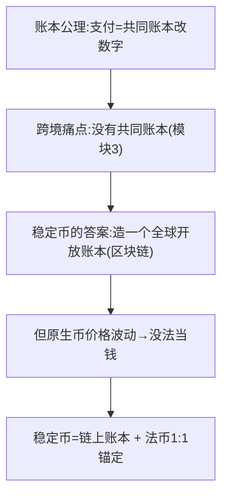
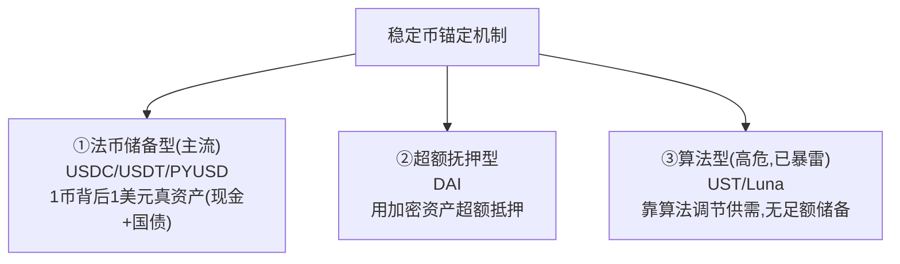
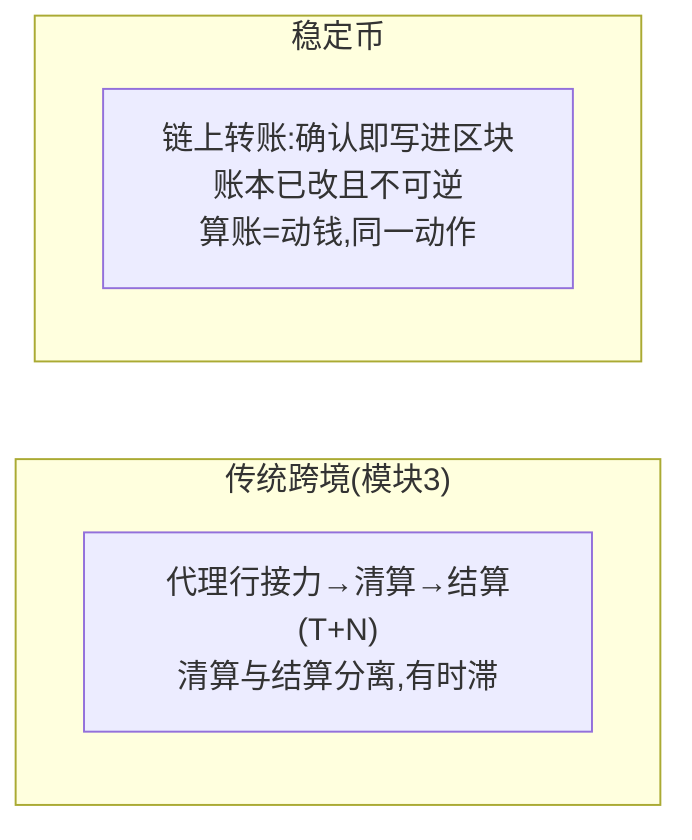
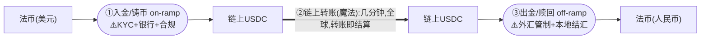
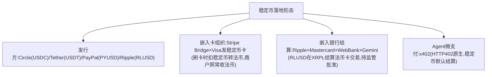
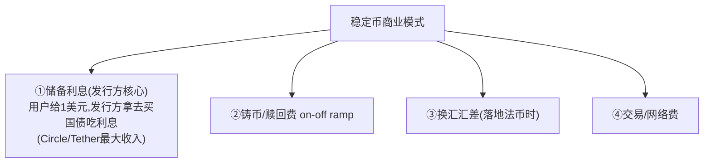

# 模块 4 · 稳定币支付（业务篇）：重做一个全球开放账本

> **学习者**：AWS 技术架构师 · 支付小白
> **本篇目标**：搞懂稳定币的本质、解决什么问题、玩家格局、商业模式，以及它和传统支付/跨境的关系。学完你能和支付公司聊清楚"稳定币为什么是支付基础设施而非炒币""转账即结算的意义""on/off-ramp 才是真瓶颈""卡网络 vs 稳定币双轨"。
> **前置**：模块0（账本公理/清结算/货币等级）、模块3（跨境=没有共同账本）
> **配套**：
> - 技术篇 `04-stablecoin-tech-aws.md`（区块链账本/钱包私钥/链上转账/AWS）
> - **深度参考**：同目录 `stablecoin_research.md`（机制/监管/对比，带核实来源）、`stablecoin_cross_border_compliance.md`（人民币/东南亚换汇合规）、`LEARNING_NOTES_小白到架构师.md`（六站学习链+自检）
> - reference 总结：`reference/summary/`（卡网络vs稳定币双轨、Stripe/Visa/x402）
> **组织方式**：top-down 主线。零散追问见 FAQ。
> 标注：📌 关键 · 💡 案例 · 🎯 交流要点 · 📖 指向深度参考

---

## 1. 全景：稳定币是对账本公理的直接挑战

模块0 公理：支付=共同账本上改数字。模块3 总根源：跨境**没有**共同账本，只能靠代理行接力+汇率缝合（慢/贵/不透明）。

📌 **稳定币的第一性出发点**：与其忍受"没有共同账本"，**不如造一个全世界都能用、不属于任何一国央行的全球开放账本**。

📌 **稳定币 = 区块链账本（全球/即时/7×24/谁都改不了）+ 法币的稳定性（1:1 储备锚定）**。它是两个世界的缝合——既要链上账本的"全球开放"，又要法币的"币值稳定"。

> 🎯 **交流要点**：稳定币不是"又一个支付公司"，它是**重新制造"共同账本"本身**。能把它放回模块0的账本公理来理解（而非当成炒币或某个产品），是看穿它革命性的关键。
> 📖 区块链/账本基础详见 `stablecoin_research.md` 第1节、`LEARNING_NOTES` 第1-2站。

---

## 2. 稳定币是什么：三种锚定机制

📌 稳定币靠什么"稳"住 1 美元？三种机制（风险等级不同）：

| 机制 | 代表 | 怎么稳 | 风险 |
|---|---|---|---|
| **法币储备型**（主流） | USDC(Circle)/USDT(Tether)/PYUSD(PayPal)/RLUSD(Ripple) | 存 1 美元铸 1 币，储备买现金+国债 | 看储备真实性/透明度 |
| **超额抵押型** | DAI | 用加密资产超额抵押（如 150%） | 抵押品波动/清算风险 |
| **算法型** | UST/Luna（已崩） | 靠算法调供需，**无足额储备** | ⚠️ 极高，2022 已暴雷 |

> 📌 **货币等级视角（模块0）**：稳定币是**最软的"私人货币"**（发行方的借条）——你信的是 Circle/Tether，不是国家。这决定了它的风险本质和监管方向。
> 📖 三种机制、主流稳定币对比（储备/透明度/监管）详见 `stablecoin_research.md` 第2-3节。

---

## 3. 核心价值：转账即结算

📌 **稳定币最大的支付价值 = 转账即结算（atomic settlement）**。

📌 **第一性**：回到模块0"清算(算账)≠结算(真划钱)"。传统体系两者分离 → T+N 时滞。**链上一笔交易写进区块的瞬间，账本已改且不可逆——算账和动钱是同一个动作（原子结算）**。这消灭了传统跨境最大的两个慢源：**代理行接力 + 清算结算时滞**。

> 🎯 **交流要点**：稳定币的"几分钟到账、7×24、全球同一账本"全源于"转账即结算"。能从模块0清结算概念解释这一点，比只说"区块链快"深刻。
> 📖 清结算特性的稳定币 vs 传统详细对比见 `stablecoin_research.md` 第4节、`LEARNING_NOTES` 第4站。

---

## 4. 关键认知：on/off-ramp 才是真瓶颈

⚠️ 别上头——稳定币解决了"账本内部"的转账，但**账本和现实法币世界的接缝处，问题全冒出来**。

📌 **最关键的认知**：
> **稳定币没有消灭外汇管制/KYC/AML/本地结汇——它只是把这些从"链路中间"推到了"两端的入金/出金口（on/off-ramp）"**。中间那段确实快了、便宜了、全球了；但只要最终要落地成某国法币，两端的合规和外汇问题一个都跑不掉。瓶颈搬到了 on/off-ramp。

💡 这解释了一个矛盾现象：稳定币明明"几秒到账"，但实际跨境到手没那么神——因为瓶颈在两端的法币兑换口，那里仍是传统的银行、牌照、外汇世界。

> 🎯 **交流要点（直通中国）**：在中国，境内人民币↔稳定币换汇"理论可行、合规不可行"——off-ramp 撞上外汇管制。香港/新加坡是离岸合规通道但不含人民币。这是连连等出海公司最关心的现实约束。
> 📖 人民币/东南亚换汇的合规路径、每一跳谁持牌，详见 `stablecoin_cross_border_compliance.md`（很深，必读）。

---

## 5. 玩家格局与落地形态：嵌入而非替代

📌 现阶段稳定币的真实落地形态是**"嵌入传统体系当快管道"，而非推翻替代**。

📌 **双轨格局**（reference 总结的核心判断）：
- **卡网络轨道**：高价值、消费者保护、T+1~2（Visa/MC/Amex）
- **稳定币轨道**：微支付、Agent间、跨境、<2秒（x402/USDC/Stripe Bridge）
- 两轨通过 Stripe Bridge 等互通；**Stripe 是唯一全赛道玩家**（传统+链上）。

> 🎯 **交流要点**：稳定币的革命性在"重做开放账本"，但现阶段受制于 on/off-ramp 和监管，所以以"嵌入已有卡组织/银行结算当快管道"落地，而非纯替代。能区分"革命性（账本层）vs 落地形态（嵌入）"，是对稳定币务实的理解。
> 📖 玩家格局、Stripe ACP/Bridge、Visa/x402 详见 `reference/summary/`（Agentic_Commerce_Overview、Payment_Agentic_AI）。

---

## 6. 商业模式：钱从哪赚

📌 **关键洞察**：稳定币**发行方的核心利润是"储备利息"**——用户把美元给发行方换稳定币，发行方拿这些美元买美国国债吃利息（高利率环境下极可观），用户的稳定币不计息。这和模块2"浮存"是同一逻辑的极致版。

> 🎯 这也是为什么稳定币发行是门好生意、各路玩家（PayPal/Stripe）都想发自己的稳定币——本质是"拿着别人的钱买国债吃息"。

---

## 7. 本篇小结（背下来）

1. **稳定币 = 链上账本(全球/即时/7×24/改不了) + 法币1:1锚定**——重做一个全球开放账本。
2. **三种锚定**：法币储备型(主流,USDC/USDT)/超额抵押(DAI)/算法型(UST已暴雷)。货币等级上是最软的私人货币。
3. **核心价值=转账即结算**：算账和动钱合一，消灭代理行接力+清结算时滞。
4. **on/off-ramp 才是真瓶颈**：稳定币没消灭外汇/KYC/结汇，只是推到了两端入金出金口。
5. **落地=嵌入非替代**：Stripe Bridge×Visa稳定币卡、Ripple×MC银行结算、x402 Agent微支付；卡网络vs稳定币双轨。
6. **发行方核心利润=储备利息**(拿用户的钱买国债)——浮存逻辑的极致。
7. **中国现实**：境内人民币↔稳定币换汇合规不可行(外汇管制),香港/新加坡离岸通道不含人民币。

---

## 8. 通向下一层

- **技术怎么实现？** → `04-stablecoin-tech-aws.md`（区块链账本/钱包私钥/链上转账/Travel Rule/AWS）
- **机制/监管/对比深度参考** → `stablecoin_research.md`
- **人民币/东南亚换汇合规** → `stablecoin_cross_border_compliance.md`
- **六站学习链+自检** → `LEARNING_NOTES_小白到架构师.md`
- **CBDC/mBridge（央行版共同账本）** → `crossborder-payment/03-crossborder-business.md` §7（管道④）+ §12.2
- **稳定币如何成为 Agent 支付的结算资产** → 模块5

---

## 附：常见追问（FAQ）

**Q：稳定币和 CBDC 什么区别？**
A：同思路（链上账本），不同发行人。稳定币是**私人公司**发的（Circle/Tether），是"私人借条"，你信公司；CBDC 是**央行**发的数字法币，是"钱本身"（最硬的央行货币）。货币等级上 CBDC > 商业银行货币 > 稳定币。详见 `crossborder-payment/03-crossborder-business.md` §6/§7（管道③④对比）。

**Q：稳定币"转账即结算"，那还要银行和卡组织干嘛？**
A：因为 on/off-ramp（法币↔稳定币的入金出金口）还在传统世界——你最终要花法币、收法币，就绕不开银行账户、合规、外汇。所以现阶段稳定币是"嵌入"卡组织/银行当快管道（如 Stripe Bridge 用卡组织网络当 off-ramp），而非取代它们。链上那段快，但两端落地仍靠传统体系。

**Q：USDT 和 USDC 哪个更"安全"？**
A：都是法币储备型，核心看**储备的真实性与透明度**。USDC（Circle）储备透明度和合规性通常被认为更高（受美国监管、定期审计）；USDT（Tether）规模最大、流动性最好，但储备透明度历史上受质疑。具体对比（储备构成/审计/监管）见 `stablecoin_research.md` 第3节。⚠️ 数据会变，以最新审计报告为准。

**Q：为什么算法稳定币（UST）会崩？**
A：算法稳定币**没有足额法币储备**，靠算法和套利机制维持锚定（如 UST 靠和 Luna 的铸销机制）。一旦市场信心崩溃、出现挤兑，算法无法提供真实价值支撑，就会进入"死亡螺旋"——2022 年 UST/Luna 崩盘几天内归零。这也是监管要求稳定币"足额、高质量储备"的原因。
