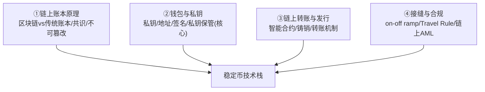
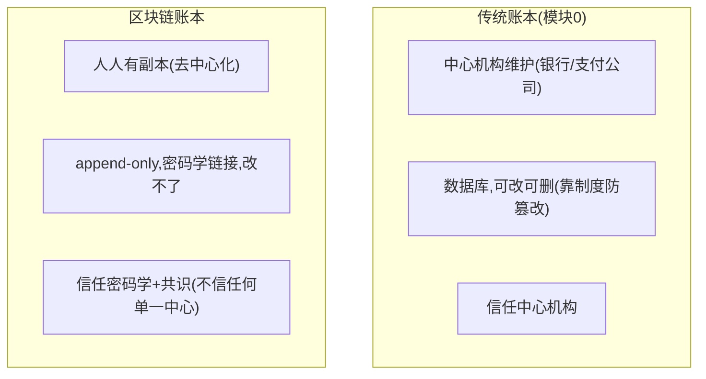
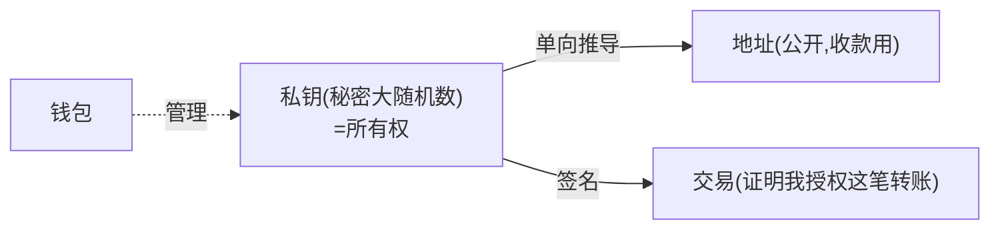
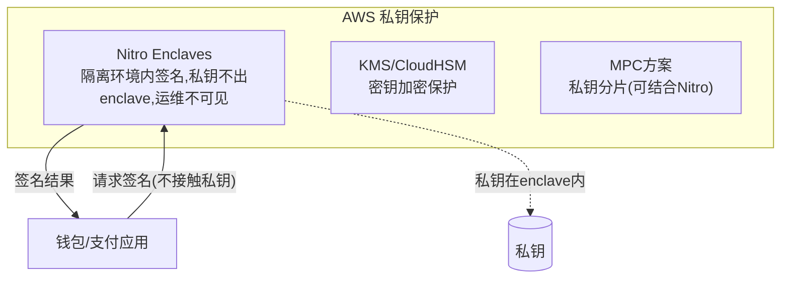
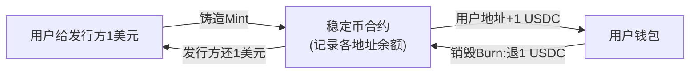
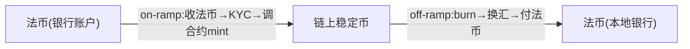
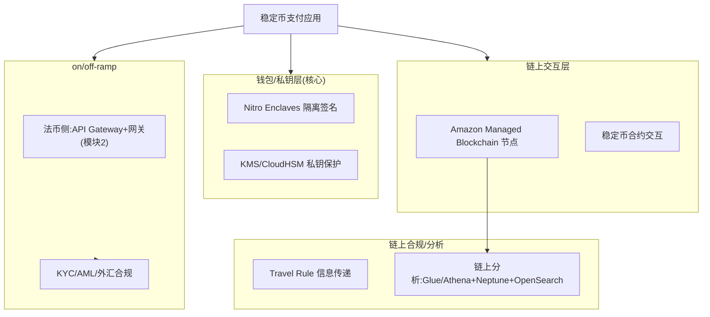

# 模块 4 · 稳定币支付（技术篇）：链上账本、钱包私钥与 AWS

> **学习者**：AWS 技术架构师 · 支付小白
> **本篇目标**：把稳定币的"链上账本"翻译成工程。回答：区块链账本和传统账本(模块0)本质差在哪？钱包/私钥/地址是什么，私钥怎么安全保管？一笔链上稳定币转账技术上发生了什么？on/off-ramp 怎么实现？链上合规(Travel Rule)怎么做？——每项映射 AWS，重点是**私钥保护**（你 AWS SA 的强项）。
> **前置**：业务篇 `04-stablecoin-business.md`、模块0技术篇（账本/CP）、模块1技术篇（HSM/密钥）
> **配套深度参考**：`stablecoin_research.md` 第1节（区块链基础）
> **组织方式**：top-down 主线。零散追问见 FAQ。
> 标注：🔧 通用技术 · ☁️ AWS · 📌 关键 · ⚠️ 坑点 · 🎯 交流要点

---

## 1. 全景：稳定币技术栈

稳定币相比传统支付（模块0-3），技术上是**完全不同的账本范式**——从"中心化数据库账本"变成"去中心化区块链账本"。技术栈四块：



> 🎯 **交流要点**：传统支付的账本是"中心机构的数据库"（模块0），稳定币的账本是"去中心化区块链"——没有中心机构，靠密码学+共识保证。理解这个范式差异是技术篇的起点。

---

## 2. 链上账本 vs 传统账本：本质差异

📌 模块0 讲账本=记录"谁拥有多少"。区块链也是账本，但**实现方式根本不同**：



🔧 **三个关键技术机制**（区块链怎么做到"无中心也可信"）：
- **去中心化**：账本人人一份副本，没有中心服务器可被关停/篡改。
- **密码学链接**：每个区块含上一区块的哈希，改任一笔=改之后全部，全网立刻发现（不可篡改）。
- **共识机制**：全网按同一套规则确认交易才入账（PoW/PoS），单方改不了历史。

📌 **和模块0账本的呼应**：区块链账本仍是"append-only 流水 + 由流水推导余额"（模块0技术篇讲过的账本工程模型）——只是从"中心数据库"变成"全网分布式 + 密码学保证"。**记账本质没变，信任来源变了**（从信中心机构 → 信数学）。

> 📖 区块链基础（区块/哈希/共识，用清算语言讲）详见 `stablecoin_research.md` 第1节。

---

## 3. 钱包与私钥：稳定币安全的命根子

### 3.1 私钥/地址/钱包是什么

📌 第一性：
- **私钥（Private Key）**：一个秘密大随机数——**谁拥有私钥，谁就能动这个地址里的钱**。私钥即所有权。
- **地址（Address）**：由私钥经单向密码学推导出的公开标识（类似"账号"），别人往这里转钱。
- **钱包（Wallet）**：管理私钥的工具（不是"装钱"，钱在链上，钱包装的是"私钥"）。



⚠️ **第一性铁律**：**私钥丢了=钱永久丢失（没有"找回密码"）；私钥被盗=钱被人转走（不可逆）**。链上转账没有客服、没有撤销、没有冻结（除非合约支持）。所以**私钥保管是稳定币技术的命根子**——这正是你 AWS SA 的发力点。

### 3.2 私钥保管：AWS 的强项

🔧 私钥保管方案（按安全等级）：
- **托管钱包（Custodial）**：服务商替用户保管私钥（交易所/支付平台模式）——用户体验好，但私钥集中=高价值攻击目标。
- **MPC（多方计算）**：私钥分片，多方各持一片，签名时协作但谁都不掌握完整私钥（类似密钥分量思想，模块1）。
- **冷/热钱包分离**：大额私钥离线（冷），小额在线（热）。

☁️ **AWS 私钥保护方案**（核心价值）：



| 私钥保护需求 | ☁️ AWS |
|---|---|
| 隔离签名（私钥不暴露给应用/运维） | **Nitro Enclaves**（可信执行环境） |
| 私钥加密存储 | **KMS / CloudHSM** |
| MPC 多方签名钱包 | Nitro Enclaves + 自定义 attestation（AWS 有 sample） |
| 区块链节点托管 | **Amazon Managed Blockchain** |

> 🎯 **交流杀手锏**：稳定币/Web3 公司最大的技术风险是私钥泄露（一泄全完）。你能给出 **Nitro Enclaves 隔离签名（私钥不出 enclave、连运维都看不到）+ KMS/CloudHSM + MPC 分片** 的私钥保护方案——这是 AWS SA 切入稳定币/数字资产客户的核心能力。AWS 有现成 sample：Nitro Enclave Blockchain Wallet、MPC 多方签名钱包（见 reference/Payment_Agentic_AI 总结）。

---

## 4. 链上转账与稳定币发行机制

### 4.1 智能合约与稳定币发行

📌 **智能合约**：部署在链上的可编程逻辑。稳定币（如 USDC）本质是一个**智能合约**，记录每个地址的余额，并实现转账/铸造/销毁逻辑（ERC-20 标准）。



🔧 **铸造/销毁（Mint/Burn）= on/off-ramp 的链上动作**：
- **铸造**：用户给发行方 1 美元 → 发行方调合约 mint → 用户地址 +1 USDC。
- **销毁**：用户退 1 USDC → 合约 burn → 发行方还 1 美元。
- 链上流通的稳定币总量 = 储备的法币总量（足额锚定）。

### 4.2 一笔链上稳定币转账技术流程

```mermaid
sequenceDiagram
    autonumber
    participant A as 付款方钱包
    participant SIGN as 私钥签名(Nitro Enclave)
    participant NET as 区块链网络
    participant CONTRACT as 稳定币合约
    participant B as 收款方钱包
    A->>SIGN: 构造转账交易(转50 USDC给B)
    SIGN->>SIGN: 用私钥签名(私钥不出enclave)
    SIGN->>NET: 广播已签名交易
    NET->>NET: 矿工/验证者打包,共识确认
    NET->>CONTRACT: 执行:A地址-50,B地址+50
    CONTRACT-->>B: B余额+50 USDC(写进区块=最终)
    Note over A,B: 确认即结算,不可逆;无中心机构参与
```

🔧 关键：**交易要用私钥签名**（证明授权）→ 广播 → 共识确认 → 合约执行余额变更 → 写进区块即最终（转账即结算）。⚠️ 注意 **gas 费**（链上手续费）、**确认数**（等几个区块才算最终，防回滚）。

---

## 5. 接缝与合规：on/off-ramp + Travel Rule

### 5.1 on/off-ramp 技术

📌 业务篇说 on/off-ramp 是真瓶颈。技术上它是"法币世界 ↔ 链上世界"的桥：



🔧 on/off-ramp 要对接：法币侧（银行/支付网关，模块2）+ 链上侧（钱包/合约）+ 合规（KYC/AML/外汇）。这是稳定币系统里**最复杂、最受监管**的部分。

### 5.2 链上合规：Travel Rule 与链上 AML

📌 **Travel Rule**：FATF 要求——虚拟资产转账（超过阈值）也要像传统电汇一样**传递收付款人信息**（VASP 之间）。链上转账本身只有地址，要额外建立机构间的信息传递。

🔧 **链上 AML/分析**：链上交易公开可查，可用**链上分析**追踪资金流向、识别高风险地址（混币器、被制裁地址、诈骗）。
☁️ **AWS**：链上数据分析用 **Managed Blockchain（节点/查询）+ Glue/Athena**（链上数据 ETL）+ Neptune（地址关系图，识别团伙，呼应模块3/reference GNN）+ OpenSearch（制裁地址匹配）。

> 🎯 **交流要点**：稳定币合规的两个特殊点——Travel Rule（链上也要传收付款人信息）+ 链上分析（公开账本可追踪，反而比传统更透明）。能讲这两点，体现你懂稳定币的合规技术。

---

## 6. 完整技术架构图



| 能力 | ☁️ AWS |
|---|---|
| 私钥隔离签名 | **Nitro Enclaves** |
| 私钥加密/MPC | KMS / CloudHSM |
| 区块链节点 | **Amazon Managed Blockchain** |
| 链上数据分析 | Glue/Athena + Neptune（地址图）+ OpenSearch（制裁地址） |
| on/off-ramp 法币侧 | API Gateway + 支付网关（模块2架构） |
| 账务/对账（链上 vs 法币储备） | Aurora（储备账本）+ Glue（链上链下对账） |
| 不可变审计账本 | QLDB（理念）/ CloudTrail |

> 🎯 **交流杀手锏**：稳定币系统的 AWS 核心 = **私钥保护（Nitro Enclaves，最关键）+ 节点托管（Managed Blockchain）+ 链上分析（Glue/Neptune）+ on/off-ramp（复用模块2网关）+ 储备对账（Aurora）**。其中私钥保护是 Web3 客户最痛、AWS 最有差异化的点。

---

## 7. 本篇小结（背下来）

1. **链上账本 vs 传统账本**：记账本质没变（append-only流水+派生余额），但信任从"信中心机构"变成"信密码学+共识"。
2. **私钥=所有权，是命根子**：丢=永久丢，盗=不可逆。私钥保护是稳定币技术核心。
3. **AWS 私钥保护**：Nitro Enclaves 隔离签名（私钥不出enclave）+ KMS/CloudHSM + MPC——AWS SA 的杀手锏。
4. **稳定币=智能合约**：mint/burn 实现 on/off-ramp 链上动作，流通量=储备量。
5. **链上转账**：私钥签名→广播→共识→合约执行→写区块即结算（注意 gas/确认数）。
6. **合规两特殊点**：Travel Rule（链上传收付款人信息）+ 链上分析（公开可追踪）。
7. **AWS 栈**：Nitro(私钥)+Managed Blockchain(节点)+Glue/Neptune(链上分析)+网关(ramp)+Aurora(储备对账)。

---

## 8. 通向下一层

- **业务全景** → `04-stablecoin-business.md`
- **区块链基础深度** → `stablecoin_research.md` 第1节
- **CBDC/mBridge 技术（央行版链上账本）** → `traditional-payment/03-crossborder-business.md` §7/§12.2
- **稳定币作为 Agent 支付结算资产、x402** → 模块5 + `stablecoin_research.md` 第7节
- **合规体系（Travel Rule/链上AML）** → 模块6 横向专题

---

## 附：常见追问（FAQ）

**Q：稳定币的钱到底存在哪？钱包里吗？**
A：钱（余额）记录在**链上的智能合约里**（合约维护每个地址的余额）。钱包**不装钱，装的是私钥**——私钥证明你对某个地址的所有权。所以"丢钱包"分两种：丢了私钥=永久失去对那些钱的控制权；但只要私钥还在（备份了），换个钱包工具仍能控制链上的钱。

**Q：链上转账真的不可逆？出错了怎么办？**
A：基本不可逆——转错地址、被盗，链上没有"撤销/找回"（除非是支持冻结的合约，如 USDC 发行方可冻结被盗/被制裁地址，但这需要发行方介入，且引发"去中心化"争议）。所以稳定币系统的工程重点是**事前防范**：私钥保护、转账前地址校验、大额多签/审批、确认数等待。这和传统支付"可拒付可撤销"是相反的安全模型。

**Q：为什么私钥保护非要用 Nitro Enclaves，不能加密存数据库吗？**
A：加密存数据库的问题：用的时候要解密成明文私钥放进应用内存——这一刻私钥就暴露在普通服务器内存里，运维、被入侵的进程都可能读到。Nitro Enclaves 是**隔离的可信执行环境**：私钥在 enclave 内使用（签名），明文私钥**永不离开 enclave、连母实例的运维都看不到**。这和模块1 HSM"密钥不出硬件边界"是同一思想，是金融级私钥保护的要求。

**Q：稳定币转账的 gas 费谁付？会不会很贵？**
A：gas 费（链上手续费）由发起交易方付，给验证者/矿工。费用取决于链的拥堵程度和链本身——以太坊主网高峰期可能贵，但 Layer 2（如 Base）或其他高性能链（Solana）的 gas 费极低（fraction of cent）。这也是为什么稳定币微支付（x402，模块5）多选低费率链。商业上 on/off-ramp 服务商常把 gas 费包进手续费里，用户无感。
