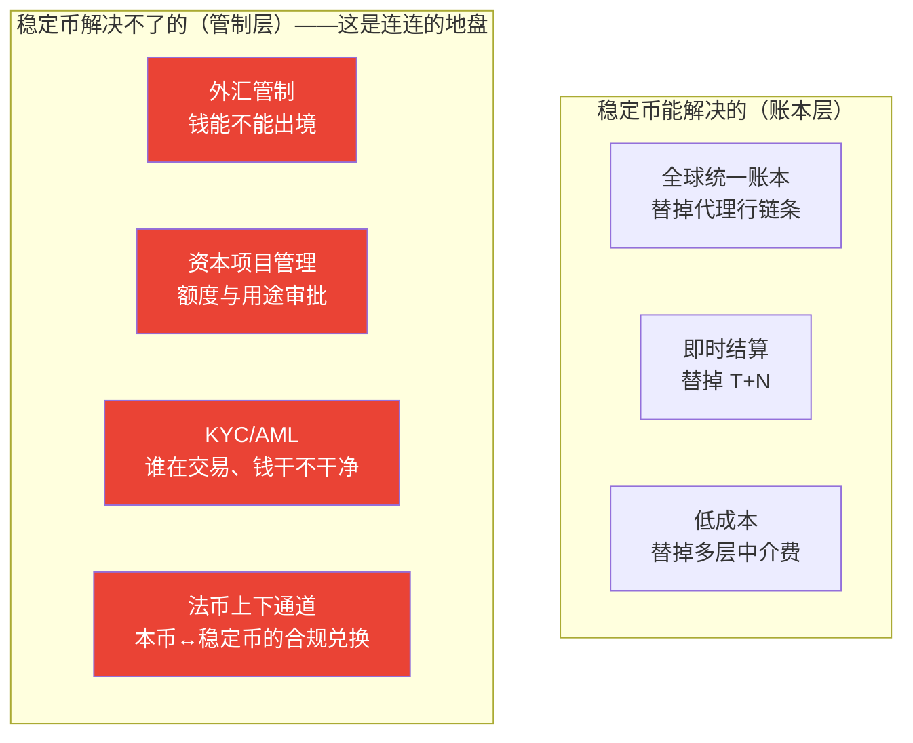
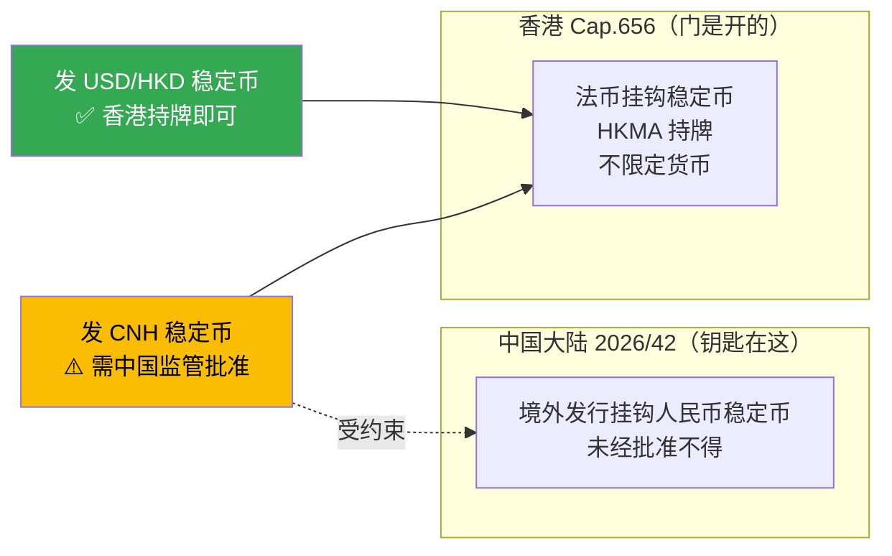
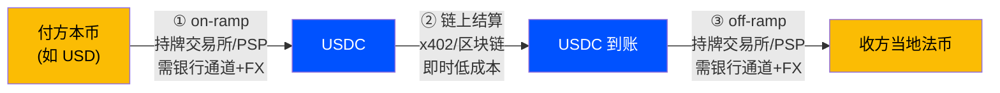
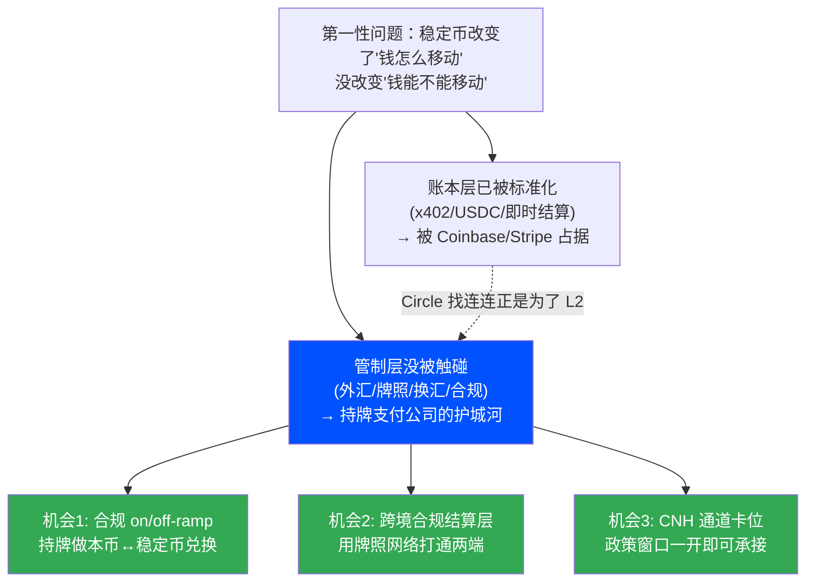

# 稳定币跨境换汇的合规路径与现实障碍（人民币与东南亚聚焦）

> **这是什么**：[稳定币主报告](stablecoin_research.md) 第 6 节"跨境换汇"的专项补深研，用于补全那份报告里标 `[待核实]` 的最关键一块——**人民币↔USDC↔各国法币的换汇路径，在中国外汇管制下到底合规不合规**。
> **方法**：deep-research 多源检索（6 角度、25 源、106 条 claim、25 条经 3 票对抗验证、25 条全部确认、0 否决），以一手监管源（中国 gov.cn/csrc、HKMA、MAS、BIS）为准。
> **写法**：遵循**第一性原理**——每个机制先讲"它是什么、解决什么问题、怎么解决"，从底层约束讲起，而非罗列条文。
> **标记**：**[事实✓]** = 已联网 3 票验证；**[报道]** = 权威媒体报道但非官方定论；**[推断]** = 战略分析。
> **数据时点**：2026-06-04。中国稳定币政策演进极快，引用前重新核对。

---

## 0. 第一性原理：先把根问题立住

在讲任何监管条文之前，先回答一个最底层的问题——**为什么稳定币解决不了跨境换汇？**

> **本质区分（全文的地基）**：
> 跨境支付有两层完全不同的东西——
> - **账本层**：钱怎么从 A 移动到 B（记账、清算、结算）。
> - **管制层**：钱**被不被允许**从 A 国移动到 B 国（外汇管制、资本项目管理、反洗钱）。
>
> **稳定币是一项"账本层"创新**：它用一条全球共享的区块链账本，替掉了多层代理行的记账与清算。这一段它做得极好（即时、低成本，见主报告第 4 节）。
>
> **但跨境的真正难点从来不在账本，在管制层。** 外汇管制要管的是"资本是否被允许跨境流动"，**它不在乎你用什么工具流动**。稳定币换了个更快的工具，**没有、也无法改变"人民币出境需要许可"这个底层约束**。

**一句话结论**：稳定币把跨境支付的"中间一段"标准化了，但**两端的换汇和合规它碰不了——因为那不是账本问题，是牌照和管制问题**。这就是连连机会的第一性来源。下面逐层证明。

---

## 1. 中国大陆：境内人民币↔稳定币换汇为何"理论可行、合规不可行"

### 1.1 概念：什么是"理论可行 vs 合规可行"

- **理论可行**：技术上，区块链能完成 RMB→USDC→当地法币 的链上转移，没有技术障碍。
- **合规可行**：这条链条里的**关键一跳**——人民币与稳定币的兑换——在中国大陆**是否被法律允许**。

> **本节结论 [事实✓]**：在中国大陆境内，**法币与虚拟货币兑换、币间兑换被定性为"非法金融活动"，一律严格禁止、坚决依法取缔，构成犯罪的追究刑事责任**。所以这条路径**理论可行，但在中国大陆合规不可行**。

### 1.2 这个禁令解决的是什么问题（第一性）

中国的外汇管制要解决的根本问题是:**防止资本无序跨境流动冲击汇率稳定和金融安全**。虚拟货币/稳定币提供了一条**绕开传统银行体系、难以监测的跨境资金通道**——这恰好是外汇管制最要堵的口子。所以禁令的本质不是"反对技术"，而是**"封堵一条监管看不见的资本外流通道"**。理解了这个根问题，就能理解为什么中国的态度比香港/新加坡严厉得多。

### 1.3 最新监管：2026 新规取代 2021 旧规 [事实✓]

> **关键时效更新**：很多资料还停留在 2021 年的"九二四禁令"。本次研究核实到**更新的一手监管文件**：

| 文件 | 时间 | 关键内容 |
|---|---|---|
| **银发〔2021〕237号**《关于进一步防范和处置虚拟货币交易炒作风险的通知》 | 2021-09（俗称"924 禁令"）| 确立：法币↔虚拟货币兑换、币间兑换属非法金融活动，一律严格禁止；境外交易所通过互联网向境内居民提供服务同属非法金融活动 |
| **银发〔2026〕42号**《关于进一步防范和处置虚拟货币等相关风险的通知》 | **2026-02-06**（八部门联合）| **重申**上述禁令、**废止** 2021/237 号，并**新增两条关键限制**（见下）|

> 来源 [事实✓]：[gov.cn 2021/237 号原文](https://www.gov.cn/zhengce/zhengceku/2021-10/08/content_5641404.htm)、[csrc.gov.cn 2026/42 号](http://www.csrc.gov.cn/csrc/c100028/c7614318/content.shtml)、[新浪财经 2026-02-07 报道](https://finance.sina.cn/cj/2026-02-07/detail-inhkyrif4174371.d.html)。澎湃、央视等多源印证日期、文号、部门构成。

### 1.4 2026 新规的两条新增限制（对连连最关键）[事实✓]

**新增 1：首次明确限制离岸人民币（CNH）稳定币的发行**
> 2026/42 号一手原文：**"未经相关部门依法依规同意，境内外任何单位和个人不得在境外发行挂钩人民币的稳定币。"**

这一条**直接改写了 CNH 稳定币的判断**——它不是绝对禁止，而是**条件式禁止（未经批准不得）**。意味着：即使在香港，发行挂钩人民币的稳定币也要过中国监管这一关。

**新增 2：封堵境外 on/off-ramp 向境内提供服务**
> 一手原文：**"境外单位和个人不得以任何形式非法向境内主体提供虚拟货币相关服务"**，国家外汇局列入跨部门跨境监测协调机制。

> **措辞精确性 [事实✓ + 推断]**：禁令严格限定于**"兑换业务活动"**和**"发行行为"**，一手源**未主张个人单纯持有违法**。"封堵 on/off-ramp"是基于"金融机构禁止提供账户/资金划转/清结算服务"条款的**合理推断**——外汇局的角色是**监测协调**，非直接查封。引用时保留这个 nuance。

### 1.5 USDT 等同样被纳入 [事实✓]

> 2021/237 号一手原文：**"比特币、以太币、泰达币（USDT）等虚拟货币……不具有法偿性，不应且不能作为货币在市场上流通使用。"**

即：USDT 这类稳定币在中国监管定性上**与比特币并列为"虚拟货币"**，不享受任何特殊待遇。

---

## 2. 香港：为什么是合规通道，以及它的"人民币关卡"

### 2.1 概念：香港和中国大陆是两套体系

> **第一性区分**：香港有独立的金融监管体系（"一国两制"）。中国大陆的禁令**不直接适用于香港**。所以稳定币在香港**合法、持牌、受监管**——和大陆的"严禁"是两回事。这是整份报告必须反复强调的分界。

### 2.2 香港稳定币条例解决的问题

香港要解决的问题和大陆相反:**不是"堵",而是"在可控前提下抢占稳定币这个新金融基础设施的离岸枢纽地位"**。所以它用**发牌制**——既允许发行，又能管住储备、赎回、反洗钱。

### 2.3 一手条款 [事实✓]

| 维度 | 内容 |
|---|---|
| 法例 | 《稳定币条例》Cap.656 |
| 生效 | **2025-08-01** |
| 监管对象 | **法币挂钩稳定币（fiat-referenced stablecoins, FRS）**——发行成为受监管活动，须 HKMA 牌照 |
| 货币范围 | 官方页面**未限定任何单一货币**（未指明 HKD/USD/CNH）——**理论上不排除 CNH 参照型稳定币** |
| 持牌要求 | 储备充足、客户资产隔离、稳健稳定机制、合理条件下按面值赎回、AML/CFT |

> 来源 [事实✓]：[HKMA 稳定币发行人页面](https://www.hkma.gov.hk/eng/key-functions/international-financial-centre/stablecoin-issuers/)。

### 2.4 关键洞察：香港不禁 CNH 稳定币，但中国大陆设了关卡 [事实✓ 组合]

> **这是本报告最重要的一个 nuance，务必讲准**：
> - **香港制度本身**：以"法币挂钩稳定币"为受监管类别，**不限定货币，不禁止 CNH 稳定币**。
> - **但**：发行挂钩人民币的稳定币，**另受中国大陆 2026/42 号"境外发行挂钩人民币稳定币须经批准"的跨境约束**。
>
> 即：**香港这扇门是开的，但人民币要走这扇门，得先拿到北京的钥匙。**

### 2.5 京东、蚂蚁的游说与"叫停" [报道，medium confidence]

> **[报道]** 以下为权威媒体报道，**非官方政策结果**，引用须谨慎。

- 京东、蚂蚁集团曾游说 PBOC 授权发行人民币稳定币，提议**先在香港发 CNH 稳定币、再扩展到自贸区离岸市场**，论证"港元盯住美元无助推人民币、故需人民币挂钩稳定币"。两家均计划在香港 2025-08-01 新法生效后发行港元稳定币。[来源：[Reuters 2025-07-03](https://www.reuters.com/world/china/chinas-tech-giants-lobby-offshore-yuan-stablecoin-sources-say-2025-07-03/)]
- **但后续报道称**：北京已要求蚂蚁、京东**暂停/叫停**稳定币项目，截至报道**未获 PBOC 批准**。

> **判断 [推断]**：这印证了 2.4 的结论——CNH 稳定币的技术和商业意愿都已就位，**卡点纯粹在中国监管的批准**。这是一个"政策窗口未开"的状态，不是"技术或商业不可行"。

---

## 3. 新加坡 MAS：另一条离岸通道，但同样不含人民币

### 3.1 MAS SCS 框架解决的问题

新加坡和香港类似——**用清晰的发牌规则，把自己做成稳定币的可信离岸枢纽**。它的设计重点是**赎回保障和储备质量**（防止脱锚伤害持有人）。

### 3.2 一手条款 [事实✓]

| 维度 | 内容 |
|---|---|
| 框架 | 单一货币稳定币（Single-Currency Stablecoin, SCS）监管框架，2023-08-15 定稿 |
| **货币范围** | **仅适用于锚定新元或任一 G10 货币、且在新加坡发行的稳定币** |
| **关键：不含人民币** | **人民币非 G10 货币 → 锚定人民币的稳定币落在 MAS SCS 框架之外** |
| 赎回 | 收到赎回请求后**五个工作日内按面值返还** |
| 资本 | 维持最低基础资本与流动资产，支持有序清盘 |
| 储备 | 构成、估值、托管、审计需满足要求 |

> 来源 [事实✓]：[MAS 2023-08-15 新闻稿](https://www.mas.gov.sg/news/media-releases/2023/mas-finalises-stablecoin-regulatory-framework)。G10 货币 = USD/EUR/JPY/GBP/CHF/AUD/CAD/NZD/SEK/NOK，**不含 CNY**。

### 3.3 含义 [推断]

香港和新加坡是当前两条最现实的**离岸合规通道**，但**都不天然覆盖人民币**——香港需中国批准，新加坡框架直接不含。这意味着**做美元/G10 稳定币结算，离岸通道成熟；做人民币稳定币结算，无论走哪都绕不开中国监管**。

---

## 4. 跨境换汇的实际路径：每一跳谁持牌（第一性拆解）

### 4.1 概念：on/off-ramp 是什么，解决什么问题

> **on-ramp（入金通道）**：法币 → 稳定币。**off-ramp（出金通道）**：稳定币 → 法币。
> **它解决的问题**：区块链上只有 crypto，没有法币。要让稳定币和现实世界的钱打通，必须有一个**持牌主体**在"链上世界"和"银行世界"之间做兑换。**这就是支付公司的天然位置。**

### 4.2 一笔跨境稳定币支付的每一跳 [事实✓ 框架，BIS 源]

> **BIS CPMI 报告 d220 一手原文 [事实✓]**：
> - on/off-ramp **主要由加密交易平台、交易所、托管钱包承担**（通常依赖银行服务商或合作以接入支付系统），**PSP 也已开始提供**这些功能。
> - 当**稳定币锚定货币与当地货币不同时，需在 ramp 处进行外汇兑换（FX conversion）**。
> - **对外币稳定币的高需求会给资本管制辖区带来重大挑战**，可能退化为"类代理行安排"并伴随显著摩擦。
> - **部分辖区限制受监管金融机构服务加密实体，使 ramp 不可得**，削弱稳定币的跨境机会。
>
> 来源：[BIS CPMI d220（2023-10）](https://www.bis.org/cpmi/publ/d220.pdf)。

### 4.3 第一性结论：中间快了，两端没变 [推断]

- **第 ② 跳（链上结算）**：稳定币真正的创新，即时、低成本——这段被 Coinbase/Stripe/x402 标准化了。
- **第 ①③ 跳（on/off-ramp + FX）**：**仍然需要持牌主体、银行通道、外汇兑换**——这和传统跨境支付要解决的问题**一模一样**。稳定币把中间从"代理行链条"换成了"一条链"，但**两端的换汇和合规没有消失，只是换了个位置继续存在**。

> **这正是主报告"稳定币不消除外汇风险"（美联储 FEDS Note [事实✓]）的微观机制**：因为 on/off-ramp 处的 FX 兑换，本质就是外汇业务，需要外汇牌照和对手方。

---

## 5. 持牌支付公司的机会：从理论到已发生的事实

### 5.1 概念：为什么是持牌支付公司，而不是 crypto 原生玩家

> **第一性**：on/off-ramp 的本质是**外汇业务 + 合规清算**，不是技术业务。crypto 原生玩家（交易所、钱包）有链上技术，**但缺多国外汇/支付牌照**；持牌跨境支付公司（连连、Airwallex）有**牌照、银行网络、换汇能力**——正好是 ramp 处最稀缺的东西。所以稳定币跨境的"两端"，天然是持牌支付公司的活。

### 5.2 已经发生的事实 [事实✓]

> **Circle × 连连国际（LianLian Global）**：
> 2025-12-17，USDC 发行方 Circle 与**持牌跨境支付商连连国际**签署 MOU，探索将 USDC 整合进连连面向企业和平台的跨境解决方案，目标是"现代化支付基础设施、降本、简化结算"。
> 来源 [事实✓]：[Circle 官方新闻室](https://www.circle.com/pressroom/circle-and-lianlian-global-announce-collaboration-to-explore-next-generation-cross-border-payments)；Ledger Insights、The Asian Banker 等多源印证。
> **边界**：这是**探索性 MOU**（由 Circle 关联方签署），**非已落地产品**。

> **判断 [推断]**：这条新闻直接验证了本报告和主报告的核心论点——**连连已经在做这件事了**。Circle 找连连，要的正是连连的**持牌 + 跨境换汇能力**（它自己没有），连连贡献的恰是 x402/稳定币留白的那一段。这不是"连连应不应该做"的假设，而是"连连已经被选中做"的事实。

### 5.3 东南亚的同类实践 [报道]

- **StraitsX × Kasikornbank（泰国）**：东南亚持牌主体做稳定币跨境的案例。
- **Grab × StraitsX**：超级 App 接入稳定币。
- 来源：fintechnews.sg 多篇报道（secondary）。
> 含义 [推断]：东南亚（新加坡持牌主体牵头）已有持牌机构跑通稳定币 on/off-ramp——连连在东南亚的牌照布局可对标这条路径。

---

## 6. 现实障碍清单（写入方案前的风险地图）

| 障碍 | 本质（第一性）| 对"人民币跨境稳定币支付"的具体影响 |
|---|---|---|
| **外汇管制** | 管"钱能不能出境" | 中国大陆境内人民币↔稳定币兑换**合规不可行** [事实✓] |
| **CNH 发行限制** | 管"谁能造离岸人民币代币" | 境外发行挂钩人民币稳定币**须中国批准**，政策窗口未开 [事实✓] |
| **on/off-ramp 摩擦** | ramp 处仍需 FX + 牌照 + 银行通道 | 资本管制辖区 ramp 可能不可得或退化为类代理行 [事实✓ BIS] |
| **监管碎片化** | 各国框架不一致（中禁、港发牌、新加坡不含 RMB）| 同一笔交易跨多法域，合规要逐一满足，无统一规则 [事实✓ 组合] |
| **AML/反洗钱** | 协议只验签名不验身份 | 跨境资金需 KYC/AML，稳定币协议层不提供 [常识] |
| **税务** | 跨境 + 加密资产税务处理不明 | 本轮未取一手案例 [待核实] |

---

## 7. 给连连的战略结论（第一性推导）

**三句话总结**：
1. **稳定币的创新在账本层，且这一层已被 x402/Circle/Stripe 标准化、占据**——连连不该去抢这块。
2. **跨境的真正难点在管制层（外汇、牌照、换汇、合规），稳定币原理上碰不了**——这是连连十几年牌照和清算网络的护城河，crypto 原生玩家抄不走。
3. **人民币是最特殊的一档**：境内禁兑换、境外发 CNH 稳定币须批准。连连的现实落点是**先做美元/G10 稳定币的合规跨境结算（Circle MOU 已启动），同时在香港卡位 CNH 通道，等政策窗口开启**。

---

## 8. 待核实清单（写入正式方案前必做）

> 本次研究的 open questions，写入对外方案前需专项补证：

1. **香港 Cap.656 下是否已有 CNH/HKD 稳定币牌照实际下发？** 首批持牌人名单与具体储备/赎回条款？
2. **京东、蚂蚁项目"叫停"后的最新状态**（截至 2026 年中）：PBOC 是否转向许可？自贸区离岸试点是否启动？
3. **连连国际具体持有哪些国家支付牌照**可合法承担 ramp 换汇？Circle MOU 是否已进入生产（而非 MOU）阶段？**资金流如何在不触碰中国大陆兑换禁令的前提下闭环？**（这是最关键的合规设计问题）
4. **东南亚/拉美/非洲**具体的稳定币 ramp 合规实践、持牌主体、跨境税务处理——本轮未取一手案例。
5. **中国监管时效**：2026/42 号为截至 2026-06 最新，但政策演进极快，引用前重新核对。

---

## 9. 来源（本次已联网核实）

### 一手监管源（primary）
- [中国 gov.cn — 银发〔2021〕237 号](https://www.gov.cn/zhengce/zhengceku/2021-10/08/content_5641404.htm)
- [中国 csrc.gov.cn — 银发〔2026〕42 号](http://www.csrc.gov.cn/csrc/c100028/c7614318/content.shtml)
- [HKMA — 稳定币发行人页面（Cap.656）](https://www.hkma.gov.hk/eng/key-functions/international-financial-centre/stablecoin-issuers/)
- [MAS — SCS 监管框架（2023-08-15）](https://www.mas.gov.sg/news/media-releases/2023/mas-finalises-stablecoin-regulatory-framework)
- [BIS CPMI d220 — 稳定币与跨境支付（2023-10）](https://www.bis.org/cpmi/publ/d220.pdf)
- [Circle — 连连国际合作新闻室（2025-12-17）](https://www.circle.com/pressroom/circle-and-lianlian-global-announce-collaboration-to-explore-next-generation-cross-border-payments)

### 权威报道与分析（secondary）
- [Reuters — 中国科技巨头游说离岸人民币稳定币（2025-07-03）](https://www.reuters.com/world/china/chinas-tech-giants-lobby-offshore-yuan-stablecoin-sources-say-2025-07-03/)
- [新浪财经 — 2026 新规报道](https://finance.sina.cn/cj/2026-02-07/detail-inhkyrif4174371.d.html)
- [Morgan Lewis — 香港稳定币条例综述](https://www.morganlewis.com/pubs/2025/06/hong-kongs-stablecoins-ordinance-to-take-effect-august-1-an-overview-of-the-regulatory-framework)
- [Allen & Gledhill — MAS 框架解读](https://www.allenandgledhill.com/sg/publication/articles/26075/mas-finalises-stablecoin-regulatory-framework)
- [Ledger Insights — 连连 × Circle](https://www.ledgerinsights.com/chinese-payments-firm-lianlian-global-partners-with-stablecoin-issuer-circle/)
- fintechnews.sg — StraitsX/Kasikornbank、Grab/StraitsX、APAC 采用（东南亚实践）

---

> **研究方法**：deep-research（6 角度、25 源、106 claim 提取、25 条经 3 票对抗验证、25 确认 / 0 否决）+ 第一性原理整合。中国监管结论严格基于一手政府源，区分"理论可行/合规可行"、"中国大陆/香港"、"官方定论/媒体报道"。**[事实✓]** 截至 2026-06；**[报道]/[推断]/[待核实]** 见正文标注与第 8 节。
