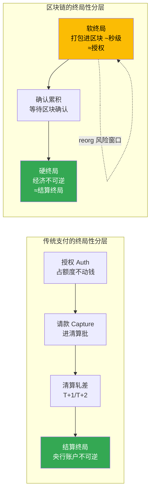
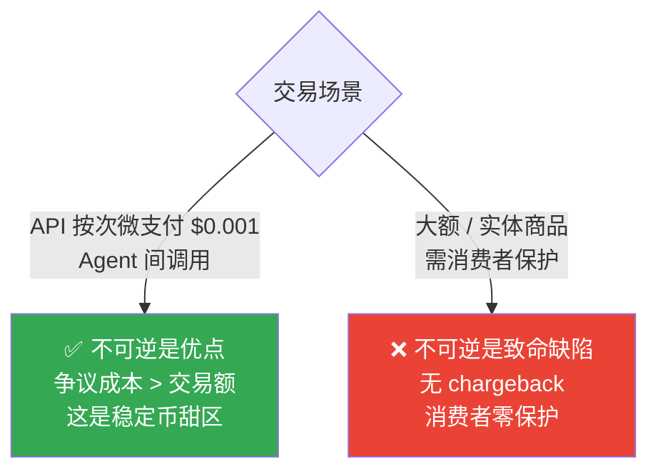
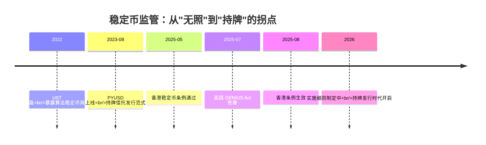
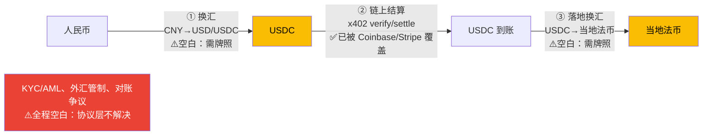
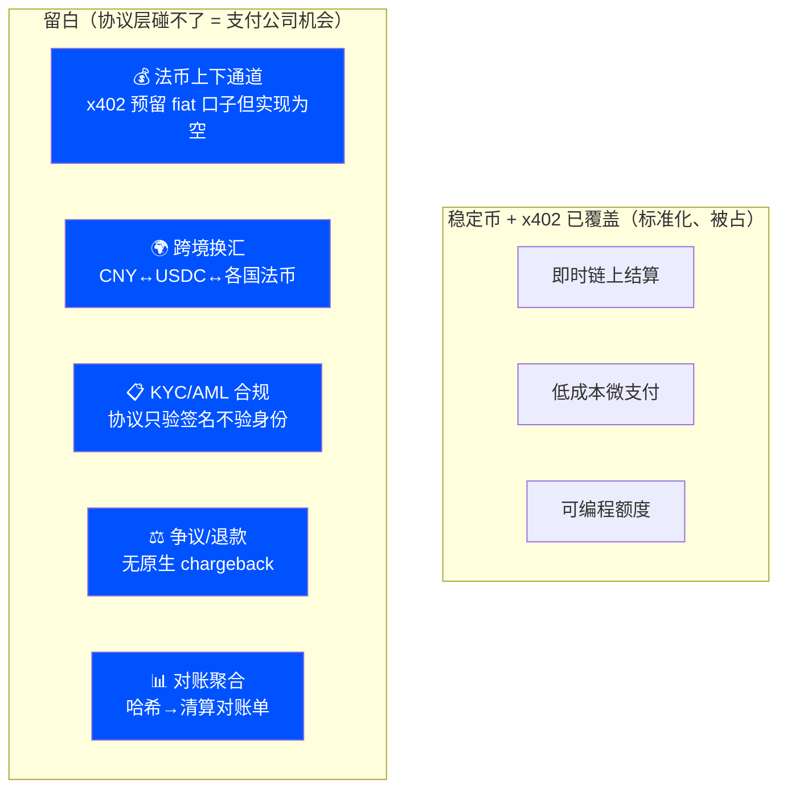

# 稳定币深度研究报告（支付从业者视角）

> **读者画像**：资深支付架构师——熟悉卡组织、收单、清算、T+N 对账、跨境支付、KYC/AML，但对 crypto/区块链零基础。
> **写法**：全程用支付行业的概念（清算、结算终局性、对账、预授权/请款、外汇、合规牌照）来类比 crypto 概念，最后衔接到 agentic payment / x402 这条线。
> **标记**：**[事实✓]** = 本次已联网多源核实并通过 3 票对抗验证；**[常识]** = 行业公认基础知识；**[推断]** = 战略分析或解释性框架，非已验证事实；**[待核实]** = 研究未覆盖、写入正式方案前需补证。
> **数据时点**：2026-06。crypto 数据（流通量、费率）实时变动，引用时请重新核对。
>
> 关联阅读：[../5.conibase_x402/coinbase_x402_research.md](../5.conibase_x402/coinbase_x402_research.md)、[../agentcore-payment.md](../agentcore-payment.md)

---

## 0. 一页纸速览（先给结论）

| 你关心的支付问题 | 稳定币的答案 | 一句话类比 |
|---|---|---|
| 这东西是什么？ | 锚定法币（多为 1:1 美元）的、跑在区块链上的数字代币 | **链上的"代币化美元"**——像预付卡余额，但载体是公链账本 |
| 结算多快？ | 数分钟内、7×24×365，无 cut-off **[事实✓]** | 没有"日终批处理""节假日不清算" |
| 多便宜？ | 链上协议成本每笔数美分（低费链）**[事实✓]** | 对比全球平均汇款费 6.49% **[事实✓]** |
| 能退款/拒付吗？ | **不能**，链上交易不可逆 **[常识]** | 没有 chargeback、没有争议仲裁 |
| 谁来兜底？ | 发行方的储备金（现金+短债），按月**鉴证**非**审计** **[事实✓]** | 像预付卡发行人的备付金，但透明度参差 |
| 谁能管？ | 美国 GENIUS Act、香港稳定币条例等已落地 **[事实✓]** | 正在从"无照经营"走向"持牌发行" |
| 跨境换汇解决了吗？ | **没有**。稳定币消除部分成本，但外汇风险、合规、法币上下通道仍在 **[事实✓]** | 这恰是支付公司的地盘 |

**贯穿全文的一句话**：稳定币把"美元的价值"搬上了一条**全球统一、即时、可编程**的结算轨道，但它**只搬了结算这一段**——身份、合规、外汇、争议、法币进出，全留白了。这些留白，正是持牌支付公司的护城河。

---

## 1. 够用就好的区块链基础（用清算语言讲）

> 目标：不讲区块链全景，只讲理解稳定币**必须**懂的那几个概念，每个都对标你熟悉的清算概念。

### 1.1 五个核心概念的支付对照表

| 区块链概念 | 是什么 | 支付行业类比 |
|---|---|---|
| **区块链 / 账本** | 一个全网共享、只能追加、不能篡改的分布式账本 | 一本**所有人共用、无法涂改的总账**——像把 RTGS 的中央账本变成大家各存一份、实时对齐 |
| **钱包 / 私钥** | 私钥是一串密钥，控制某地址里的资产；签名=授权 | 私钥 ≈ **印鉴 + U盾合一**。丢了私钥 = 丢了金库钥匙，**没有客服能帮你找回** |
| **地址** | 一串公开的收款标识（如 `0x833...913`） | ≈ **匿名的银行账号**。链上可见余额和流水，但默认不绑身份 |
| **Gas 费** | 每笔链上交易付给网络的手续费 | ≈ **清算网络的过网费/报文费**，但由发起方实时支付、价格随网络拥堵浮动 |
| **链 / L2** | 不同的底层网络（Ethereum、Solana、Base 等） | ≈ **不同的清算网络**（像 SWIFT vs 银联 vs 本地 RTGS），各有速度/成本/覆盖差异 |

### 1.2 最关键的一个概念：结算终局性（Finality）

这是支付架构师最该死磕的概念，因为它直接决定"钱到底算不算到账了"。

**传统支付的终局性**：你熟悉的是分层的——授权（auth）只是占额度、不动钱；请款（capture）后进入清算批；T+1/T+2 完成清算轧差；最终在央行账户层面达到**结算终局性**（settlement finality），此后不可撤销。这中间有明确的状态机和对账闭环。

**区块链的终局性**：分两层 **[常识]**：
- **软终局（soft finality）**：交易刚被打包进区块，几百毫秒到几秒。**类比"授权成功"**——大概率成了，但理论上还可能被回滚。
- **硬终局（hard finality）**：经过足够确认后，在经济上不可逆。

> **以太坊的硬终局 [事实✓]**：主网一个区块达到最终性**约需 15 分钟**（跨越两个 epoch，每 epoch 含 32 个 slot，每 slot 12 秒，2×32×12≈12.8 分钟）。其经济保证是：**要篡改一个已最终化的区块，攻击者必须销毁至少 33% 的全网质押 ETH**，且任何状态推进需代表**至少 2/3 全网质押 ETH** 的验证者投票确认。
> 来源：ethereum.org（[PoS 共识机制](https://ethereum.org/en/developers/docs/consensus-mechanisms/pos/)、[单 slot 终局路线图](https://ethereum.org/en/roadmap/single-slot-finality/)）

**这个数字的支付含义**：以太坊主网的"硬终局"≈ 15 分钟，**类比 T+N 的结算终局**——只是把"批处理日"压缩成了 15 分钟，且 7×24 不间断。而 Base/Solana 等更快的链软终局在亚秒~秒级 **[常识]**，但要注意软终局≠结算终局。

### 1.3 reorg 风险（你必须知道的"伪到账"陷阱）

**reorg（链重组）[常识]**：在交易达到硬终局前，区块链可能因网络分叉而"回滚"几个区块——已经看到的交易**可能消失**。

> **支付类比**：这就像**授权成功了但请款失败**，或者更糟——像一笔你以为已入账、对账时却发现被冲正的交易。**x402 宣传的"2 秒到账"是软终局**，落到支付公司的对账标准上，**2 秒到的是"授权"，不是"清算终局"**。

**对连连的实操含义 [推断]**：做 Agent 支付的结算服务时，"等几个区块确认才算真正到账"是一个**专业的风险参数**——等太少有 reorg 风险，等太久损失即时性。这种 finality 风险管理，正是支付公司的专业判断，协议本身不替你做。

---

## 2. 稳定币是什么：三种"锚定"机制

稳定币的核心使命：让一种 crypto 代币**稳定地等于 1 美元**（或其他法币）。怎么做到"稳定"，分三大流派——**风险等级天差地别**。

### 2.1 三种类型对照

| 类型 | 怎么锚定 1 美元 | 支付类比 | 代表 | 风险 |
|---|---|---|---|---|
| **法币抵押型**（主流） | 发行方收 1 美元，铸 1 枚币，把美元存进储备 | ≈ **预付卡 / 备付金模式**：你充多少，发行人存多少 | USDC、USDT、PYUSD | 取决于储备真实性与流动性 |
| **超额抵押型** | 用户超额抵押 crypto（如押 $150 的 ETH 借出 $100 的币） | ≈ **超额质押放款**，抵押物价跌就强平 | DAI **[常识]** | 抵押物价格剧烈波动时的清算风险 |
| **算法型**（已基本证伪） | 不靠储备，靠算法和套利激励维持锚定 | ≈ **没有备付金、只靠"信心"的庞氏结构** | UST（已崩盘）**[常识]** | **极高，会归零** |

### 2.2 算法稳定币的教训：UST / Luna 崩盘 [常识，本次研究未单独取证，写入方案前建议补证]

> **[待核实]** 本次联网验证未覆盖 UST/Luna 细节，以下为行业公认常识，引用具体数字前请补证。

2022 年 5 月，算法稳定币 **UST**（TerraUSD）及其姊妹币 Luna 在数天内从约 400 亿美元市值归零。机制缺陷：UST 没有真实储备，靠"销毁 Luna 铸 UST / 销毁 UST 铸 Luna"的套利来维持 1 美元锚定。一旦市场信心崩溃，形成"死亡螺旋"——UST 脱锚→套利者狂铸 Luna→Luna 超发暴跌→进一步击穿 UST。

**支付类比**：这相当于一家预付卡公司**根本没有备付金**，声称"卡余额永远值 1 美元"，靠不断发行自己的股票来兑付——挤兑一来，瞬间归零。

**给架构师的判断锚点 [推断]**：聊稳定币时，**先问对方说的是哪一类**。算法稳定币已被市场证伪；真正能进入支付场景讨论的，基本只有**法币抵押型**（USDC/USDT/PYUSD 这一档）。把这条说出来，立刻显出你不是被"稳定币"三个字笼统忽悠的人。

### 2.3 法币抵押型的命门：储备、赎回、脱锚

法币抵押型稳定币的信任，全压在三件事上——**这三件事和你审视一家预付卡/备付金机构的逻辑完全一样**：

1. **储备（Reserve）**：发行的每一枚币，背后是否真有 1 美元的优质资产？是现金、短期美债，还是高风险资产？
2. **赎回（Redemption）**：持有人能否随时 1:1 换回美元？通道对谁开放？
3. **脱锚（De-peg）**：极端情况下币价能否守住 1 美元？

> **真实案例：USDC 的 SVB 脱锚 [事实✓，研究证据中佐证]**
> 2023 年硅谷银行（SVB）倒闭时，Circle 约 **33 亿美元（约 8% 储备）**现金被困在 SVB，USDC 一度脱锚跌到约 $0.87。这印证了：**即使是合规储备型稳定币，其"现金部分"仍有银行对手方风险**——和你评估备付金存放银行的集中度风险是同一回事。

---

## 3. 主流稳定币对比（发行方 / 储备 / 透明度 / 监管）

> 核心提醒 **[事实✓]**：USDC、USDT、PYUSD 的"100% 支持"声明，**均来自发行方自身披露或第三方鉴证（attestation），而非完整的 GAAP 独立审计**。报告全程严格区分 **审计（audit）** 与 **鉴证（attestation）**——这对支付架构师是关键的尽调区别。

### 3.1 三大法币抵押型稳定币

| 维度 | **USDC** | **USDT** | **PYUSD** |
|---|---|---|---|
| 发行方 | Circle | Tether | **Paxos Trust**（非 PayPal 直接发行）|
| 规模（2026-06）| 约 **$759 亿** | 约 **$1874 亿**（最大，约 USDC 2.5×）| 较小 |
| 储备结构 | 大部分在 **Circle Reserve Fund（USDXX）**——SEC 注册的 2a-7 政府货币市场基金，BlackRock 管理、BNY Mellon 托管；其余为现金存于大型银行 | 自报 100% 储备、资产超负债 | 美元存款 + 美国国债 + 现金等价物 |
| 透明度 | **月度**第三方鉴证（四大之一，AICPA 标准）+ **每周**披露 + mint/burn 流水；Deloitte 自 2022 财年审计 Circle **公司财务**（非储备）| **季度**鉴证（BDO Italia，2022-07 起），**从未完整审计** | **月度**独立鉴证（KPMG，2025-02 起）|
| 历史合规记录 | 较干净 | **CFTC 2021-10 罚 $4160 万；NYAG 2021-02 和解 $1850 万** | 较干净（2023-08 上线，无脱锚记录）|
| 赎回 | 1:1 赎回美元，但 **Circle Mint 仅机构开放，不对个人** | 1:1（实践中有门槛）| 1:1 赎回美元 |
| 法律定性 | — | — | **"金融科技公司而非银行；PYUSD 不是存款、不是法定货币"**（PayPal 官方原文）|

> 来源 **[事实✓]**：[circle.com/usdc](https://www.circle.com/usdc)、[circle.com/transparency](https://www.circle.com/transparency)、[tether.to/transparency](https://tether.to/en/transparency/)、[paypal.com PYUSD](https://www.paypal.com/us/digital-wallet/manage-money/crypto/pyusd)、[paxos.com/pyusd-transparency](https://paxos.com/pyusd-transparency)；规模经 CoinGecko/CoinMarketCap 佐证。

### 3.2 给支付架构师的尽调结论 [推断]

- **USDT**：规模最大、流动性最好（跨境/新兴市场实际用得最多），但**透明度最弱**（仅季度鉴证、从未完整审计、有历史处罚）。把它当"高流动性但治理记录有瑕疵"的标的看。
- **USDC**：**合规叙事最干净**、披露最勤（每周）、储备结构最清晰（货基为主）。这也是为什么它成了 agentic payment 的默认资产（见第 7 节）。
- **PYUSD**：传统支付巨头（PayPal）背书 + 持牌信托（Paxos）发行，法律定性最审慎。**对支付公司而言，这是最"看得懂"的范式**——预付式、持牌、月度鉴证。

> **一句话话术**："稳定币的尽调，本质和你评估一家预付卡发行人的备付金没区别——看储备质量、看托管银行集中度、看是真审计还是只做鉴证、看赎回通道对谁开放。USDT 大但不透明，USDC 透明但赎回不对个人，PYUSD 最像传统持牌玩法。"

---

## 4. 清算结算特性：稳定币 vs 传统支付（核心对比）

这是整份报告对支付架构师**冲击力最大**的一节。

### 4.1 六维对比

| 维度 | 传统支付（卡/电汇）| 稳定币 | 对你的含义 |
|---|---|---|---|
| **结算速度** | 银行电汇可能数天；卡 T+1/T+2 | **数分钟内，7×24×365** **[事实✓]** | 无 cut-off、无节假日、无时区 |
| **协议成本** | 卡 ~2.9% + $0.30；全球平均汇款费 **6.49%** **[事实✓]** | 低费链**每笔数美分**（链上协议成本）**[事实✓]** | 微支付首次在经济上可行 |
| **终局性** | 分层、有清算闭环、可冲正 | 链上硬终局、**不可逆** **[常识]** | 见 4.2 的双刃剑 |
| **争议/退款** | 完善的 chargeback/争议仲裁 | **无原生 chargeback** **[常识]** | 消费者保护是空白 |
| **托管模式** | 账户托管（钱在银行/机构）| **自托管**（钱在自己钱包）| 无账户冻结风险，但也**无客服找回** |
| **对账** | 清算文件、批次、状态机、差错处理 | 一堆 **tx hash**，无批次无对账单 | 见 4.3 |

> 速度与成本来源 **[事实✓]**：[Stripe 稳定币汇款说明](https://stripe.com/resources/more/stablecoin-remittances-explained)（2025-10 更新）；6.49% 全球均值为世界银行 2025 Q1 数据（最新 Q3 已降至 6.36%，属正常季度漂移）。
> **重要边界**：稳定币的"数美分"是**链上协议成本**，**不含**法币上下通道（on/off-ramp）费用与汇兑点差——后两者恰恰是支付公司的收入来源。

### 4.2 不可逆性：是优点也是致命缺陷 [推断]

- **微支付场景**：不可逆**无所谓**——争议处理成本比交易额还高，自动化即时结算反而是优势。这正是 x402/agentic payment 的甜区。
- **大额/实体商品场景**：不可逆是**硬伤**——传统卡组织的 chargeback 背后是发卡行垫付 + 规则强制力 + 仲裁体系，稳定币协议层**完全没有**。

> **机会点 [推断]**：可逆性需要一个**有牌照、能垫资、有信用的中介**——这正是支付公司的定义。在稳定币结算之上叠加"T+N 内可争议"的托管/担保层，是支付公司能做、加密原生玩家做不了的增值服务。

### 4.3 对账差异（财务最头疼的一点）[推断，基于已验证的 finality 事实]

传统支付给财务的是：**清算文件 + 批次总额 + 状态机 + cut-off + 差错处理**。
稳定币给的是：**一堆 tx hash**——逐笔、即时、无批次、无对账单、无"今天收了多少笔/总额/哪笔有争议"的聚合视图。

> **机会点**：把逐笔 tx 聚合成企业能用的清算对账文件、提供状态机、做 finality 风险管理——**"对账即服务"**是支付公司的天然切口。**话术**："链给的是哈希，财务要的是对账单——这中间的翻译层，是你们的活。"

---

## 5. 监管全景（重点）：从"无照"走向"持牌"

> 已联网核实：**美国 GENIUS Act** 与 **香港稳定币条例** 有一手监管源 **[事实✓]**；**欧盟 MiCA** 与 **新加坡 MAS** 本次未取到一手条款 **[待核实]**，以下为常识框架，写入方案前需补证。

### 5.1 美国 GENIUS Act [事实✓]

- **时间线**：众议院 2025-07-17 以 308-122 通过，**2025-07-18 总统签署**（Pub. L. 119-27）。
- **核心要求**：发行方维持 **1:1 储备**、提交**月度储备报告**、披露**赎回政策**。
- **关键限制**：**禁止支付型稳定币发行方直接向持有人支付利息**（注意"直接"——通过关联方的间接奖励未被排除）。
- **生效状态 [事实✓]**：法已颁布，但**运营义务尚未生效**，待监管指引——生效日为"颁布后 18 个月"或"终规发布后 120 天"孰早。**截至 2026-06，实施细则仍在制定中**。
- 来源：[美联储 FEDS Note 2026-03-30](https://www.federalreserve.gov/econres/notes/feds-notes/payment-stablecoins-and-cross-border-payments-benefits-and-implications-for-monetary-policy-20260330.html)、[Stripe](https://stripe.com/resources/more/stablecoin-remittances-explained)、[Wikipedia: GENIUS Act](https://en.wikipedia.org/wiki/GENIUS_Act)。

### 5.2 香港《稳定币条例》[事实✓]

- **时间线**：立法会 **2025-05-21 通过**，**2025-08-01 生效**，截至 2026-06 有效。
- **制度**：由**金管局（HKMA）**管理的**法币参照稳定币（FRS）发牌制度**。
- **牌照覆盖范围**（很宽）：在香港**以业务形式发行 FRS** 者，**或发行任何参照港元的 FRS** 者（无论在港内外）——都须领牌。
- **零售限制**：**仅持牌发行人可向零售投资者提供 FRS**。
- **持牌要求**：客户资产隔离、稳健的稳定机制、合理条件下**按面值赎回**、AML/CFT 合规。
- 来源：[HKMA 2025-05-21 新闻稿](https://www.hkma.gov.hk/eng/news-and-media/press-releases/2025/05/20250521-3/)。

### 5.3 欧盟 MiCA / 新加坡 MAS [待核实，常识框架]

> **[待核实]** 以下为行业常识，本次未取一手条款。

- **欧盟 MiCA**：将稳定币分为 EMT（电子货币代币）和 ART（资产参照代币），要求发行方持牌、储备隔离、赎回权保障。已全面适用。
- **新加坡 MAS**：单一货币稳定币（SCS）监管框架，要求储备、资本、赎回（5 个工作日内按面值），针对在新加坡发行的特定稳定币。

### 5.4 对跨境支付公司意味着什么 [推断]

**核心判断**：监管落地 = **稳定币发行从"科技公司行为"变成"持牌金融行为"**。这对连连这类**已持有多国支付牌照**的公司是**利好**——
1. 门槛抬高，淘汰无照玩家，**牌照成为稀缺资产**；
2. 合规要求（储备隔离、赎回保障、AML/CFT）**正是持牌支付机构的日常能力**；
3. 发行参照港元/其他法币的稳定币、或做合规的法币上下通道，**需要的恰是牌照** [推断]。

---

## 6. 稳定币在跨境支付与换汇中的角色

### 6.1 为什么稳定币对跨境有吸引力 [事实✓ + 推断]

传统跨境靠**代理行网络（correspondent banking）**——多层中介、慢、贵、不透明。稳定币理论上能**缩短支付链条**：

> **[事实✓]** 美联储 FEDS Note（2026-03-30）：当前**超过 60% 的批发支付经一个或多个中介路由**，过去十年**活跃代理行数量下降约 30%**。稳定币可减少对代理行中介的依赖。

### 6.2 但它没有消除外汇风险（关键 [事实✓]）

> **[事实✓]** 同一份美联储研究明确指出：**使用稳定币并不消除外汇风险**——在跨境换汇场景中，小银行仍需依赖大银行来卸载外汇风险；不想持有外币敞口的个人/机构，**仍需要一个对手方**来买卖外币计价的稳定币。"稳定币可消除部分成本，但不消除全部成本。"

### 6.3 人民币 ↔ USDC ↔ 各国法币的现实障碍 [待核实 + 推断]

> **本节已由专项深研补全 [事实✓]**：完整论证见 [stablecoin_cross_border_compliance.md](stablecoin_cross_border_compliance.md)。以下是核心结论。

- **中间环节（②链上结算）**：技术上成熟，已被 Coinbase/Stripe 等覆盖。
- **两端（①③换汇 + 法币上下通道）**：**这才是真正的难点和空白**——
  - **中国大陆境内人民币↔稳定币兑换"理论可行、合规不可行"** [事实✓]：被定性为非法金融活动（**2026-02-06 银发〔2026〕42 号**重申禁令并废止 2021 旧规）；
  - **境外发行挂钩人民币（CNH）稳定币须经中国监管批准** [事实✓]：2026/42 号首次明确"未经同意不得在境外发行挂钩人民币的稳定币"——香港的门是开的，但人民币走这扇门要北京的钥匙；
  - on/off-ramp 处仍需 **FX 兑换 + 牌照 + 银行通道**（BIS d220 [事实✓]）——稳定币把中间换成"一条链"，但两端换汇没消失，只是换了位置继续存在。

**这正是连连的地盘——而且已经在发生 [事实✓]**：**2025-12-17，Circle（USDC 发行方）与持牌跨境支付商连连国际签署 MOU**，探索把 USDC 整合进连连的跨境方案。Circle 找连连，要的正是连连的牌照+换汇能力（它自己没有），连连贡献的恰是 x402/稳定币留白的那一段。crypto 原生玩家有技术没牌照；持牌支付公司有牌照、清算网络和换汇能力。**稳定币把中间结算这段标准化了，但两端的换汇和合规它碰不了。**

---

## 7. 衔接 agentic payment：稳定币为什么是 x402 的默认结算资产

### 7.1 为什么是稳定币 [事实✓]

> **[事实✓]** x402 是 Coinbase 推出的支付协议，**复用休眠的 HTTP 402 "Payment Required" 状态码**，让稳定币（如 USDC）支付直接嵌入标准 HTTP 交互，支持 API/应用/AI agent 即时自动结算。**USDC 是 x402 的默认/主要结算资产**，Circle 是首发合作方（与 AWS、Anthropic、NEAR 并列）。协议本身**网络/代币无关**、**零协议费**，USDC 为事实上的默认资产而非硬编码强制。
> 来源：[Coinbase x402 launch](https://coinbase.com/developer-platform/discover/launches/x402)、[CDP 文档](https://docs.cdp.coinbase.com/x402/welcome)、[x402.org](https://x402.org)、[GitHub](https://github.com/coinbase/x402)。

**稳定币恰好满足机器支付的四个硬要求**：

| Agent 支付的要求 | 稳定币为何满足 |
|---|---|
| **即时** | 数分钟内结算，机器不能等 T+2 **[事实✓]** |
| **低成本** | 每笔数美分，撑得起高频微支付 **[事实✓]** |
| **可编程** | 链上资产，天然可被代码控制额度/条件 **[常识]** |
| **机器友好** | 无需账户注册/信用卡/KYC 表单，有钱包就能付 **[常识]** |

### 7.2 稳定币 + x402 留下的空白 = 支付公司的机会 [推断]

> **[推断]** 以下论点为战略分析，非已验证事实，但建立在前文已核实的事实之上。

**结论（与 [../agentcore-payment.md](../agentcore-payment.md) 第 7 节呼应）**：

> 稳定币提供了**链上结算终局性与可编程性**，但**不消除外汇风险、合规要求、争议处理与法币通道需求** **[事实✓ 部分]**。"怎么发起一笔 Agent 付款"已被 x402/稳定币标准化；但**怎么换汇、怎么过各国合规、出问题怎么退怎么查、怎么对账**——全是空白。**这恰是连连十几年牌照和清算网络的护城河。**

---

## 8. 给支付架构师的快速记忆卡

| 你问 | 一句话答案 |
|---|---|
| 稳定币本质是什么？ | 跑在公链上的"代币化美元"，主流是法币抵押型（备付金模式）|
| 最该信哪个？ | USDC 最透明、PYUSD 最像持牌玩法、USDT 最大但不透明 |
| "审计"还是"鉴证"？ | 全是**鉴证（attestation）**，不是完整审计——尽调时务必区分 |
| 多快？多便宜？ | 数分钟、7×24、每笔数美分（vs 汇款均费 6.49%）|
| 最大的坑？ | 不可逆（无 chargeback）+ reorg（软终局≠到账）+ 对账只有哈希 |
| 监管到哪了？ | 美国 GENIUS Act、香港条例已落地，进入持牌发行时代 |
| 跨境解决了吗？ | 中间结算解决了，**两端换汇+合规没解决——那是支付公司的活** |
| 和 x402 啥关系？ | 稳定币是 x402 的默认结算资产；x402 标准化了"怎么付"，留白了"怎么合规换汇" |

---

## 9. 待补证清单（写入正式方案前必做）

本次深度研究的 caveat 与未覆盖项，**写入对外方案前需专项补证**：

1. **储备性质**：USDC/USDT/PYUSD 的"100% 支持"是**鉴证非审计**，引用时严格区分措辞 **[已在文中标注]**。
2. **算法稳定币（UST/Luna）**、**超额抵押 DAI** 的机制细节——本次未取一手源 **[第 2 节已标注]**。
3. **欧盟 MiCA、新加坡 MAS** 的具体牌照/储备/赎回条款——未取一手源 **[第 5.3 节已标注]**。
4. **人民币↔USDC↔各国法币换汇路径**在中国外汇管制下的合规可行性——**最关键的未解项** **[第 6.3 节已标注]**。
5. **稳定币不可逆性与 chargeback 的对接方案**——是否已有协议层/服务层的争议退款方案，是"支付公司机会"论点的核心未解部分。
6. **时效**：USDT 流通量、汇款费率、GENIUS Act 实施细则均在变动，引用前重新核对。

---

## 10. 来源（本次已联网核实）

### 一手源（primary）
- [ethereum.org — PoS 共识机制](https://ethereum.org/en/developers/docs/consensus-mechanisms/pos/)、[单 slot 终局路线图](https://ethereum.org/en/roadmap/single-slot-finality/) — 区块链最终性
- [circle.com/usdc](https://www.circle.com/usdc)、[circle.com/transparency](https://www.circle.com/transparency) — USDC 发行与储备
- [tether.to/transparency](https://tether.to/en/transparency/) — USDT 储备声明
- [paypal.com PYUSD](https://www.paypal.com/us/digital-wallet/manage-money/crypto/pyusd)、[paxos.com/pyusd-transparency](https://paxos.com/pyusd-transparency) — PYUSD
- [美联储 FEDS Note 2026-03-30](https://www.federalreserve.gov/econres/notes/feds-notes/payment-stablecoins-and-cross-border-payments-benefits-and-implications-for-monetary-policy-20260330.html) — 跨境支付与货币政策
- [HKMA 2025-05-21 新闻稿](https://www.hkma.gov.hk/eng/news-and-media/press-releases/2025/05/20250521-3/) — 香港稳定币条例
- [Stripe 稳定币汇款说明](https://stripe.com/resources/more/stablecoin-remittances-explained) — 速度与成本
- [Coinbase x402 launch](https://coinbase.com/developer-platform/discover/launches/x402)、[CDP 文档](https://docs.cdp.coinbase.com/x402/welcome)、[x402.org](https://x402.org)、[GitHub](https://github.com/coinbase/x402) — agentic payment 衔接
- [FXC Intelligence — State of Stablecoins 2025](https://www.fxcintel.com/research/reports/ct-state-of-stablecoins-cross-border-payments-2025) — 跨境用例
- [McKinsey — The stable door opens](https://www.mckinsey.com/industries/financial-services/our-insights/the-stable-door-opens-how-tokenized-cash-enables-next-gen-payments) — 行业分析

### 二手源（secondary）
- [Wikipedia: GENIUS Act](https://en.wikipedia.org/wiki/GENIUS_Act)、[MiCA](https://en.wikipedia.org/wiki/Markets_in_Crypto-Assets)、[Stablecoin](https://en.wikipedia.org/wiki/Stablecoin)、[TerraUSD](https://en.wikipedia.org/wiki/TerraUSD)、[DAI](https://en.wikipedia.org/wiki/Dai_(cryptocurrency))
- CoinGecko / CoinMarketCap — 流通量佐证

---

> **研究方法说明**：本报告基于 deep-research 多源检索（5 角度、23 源、110 条 claim 提取、25 条经 3 票对抗式验证、24 条确认）+ 战略推断整合。**[事实✓]** 部分截至 2026-06 已联网核实；**[推断]/[待核实]** 部分为分析框架或未覆盖项，写入正式方案前请按第 9 节补证。crypto 数据实时变动，引用前重新核对。
