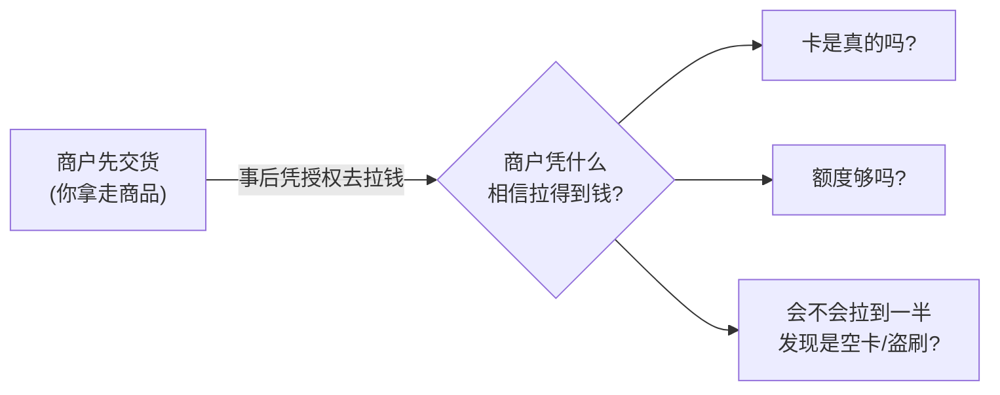
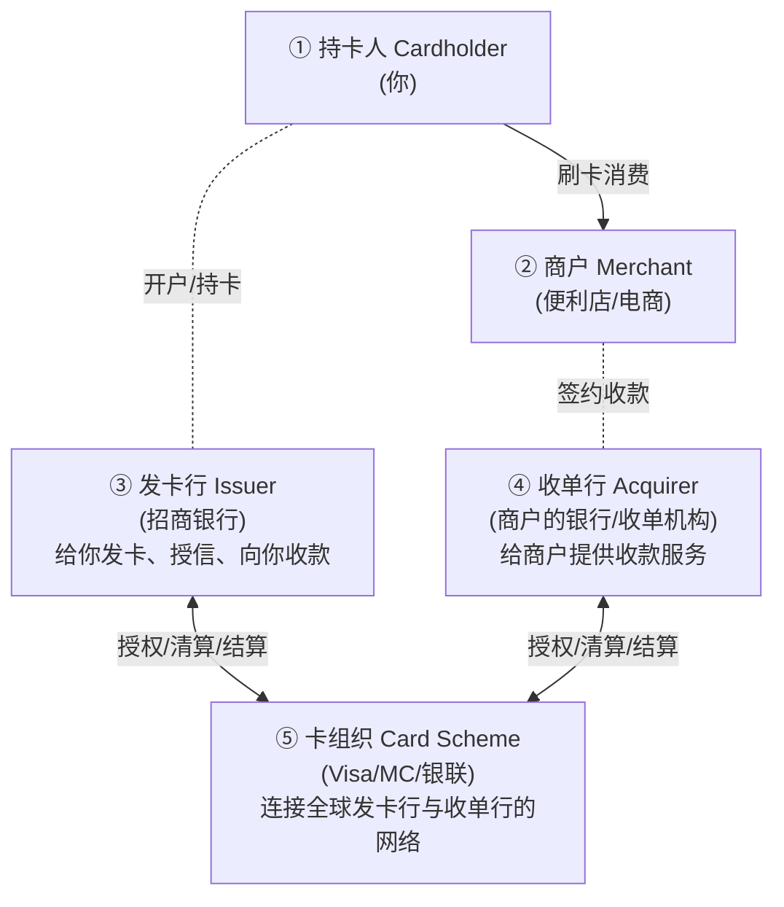
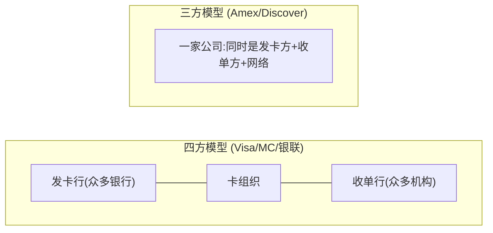
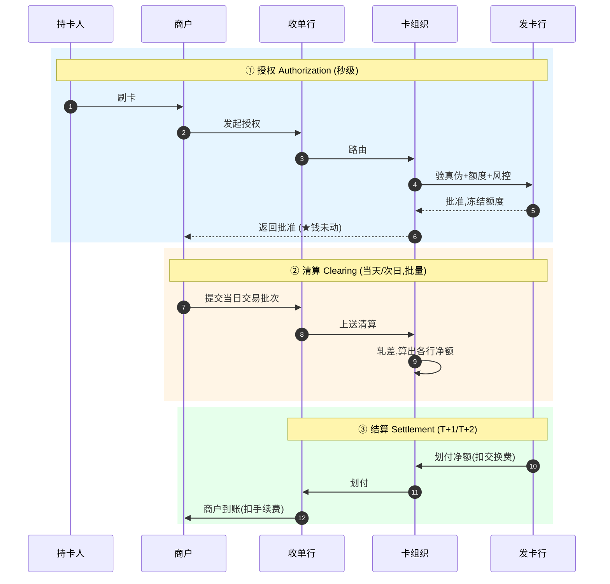
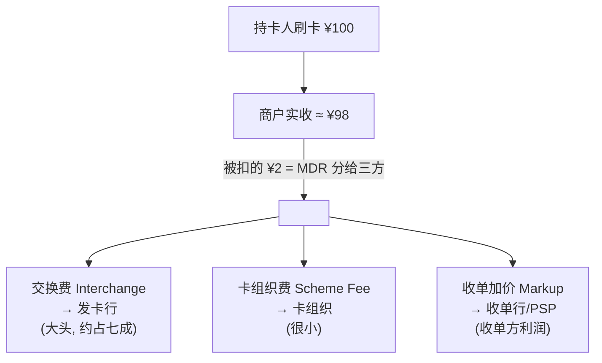
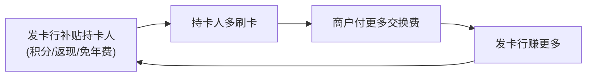
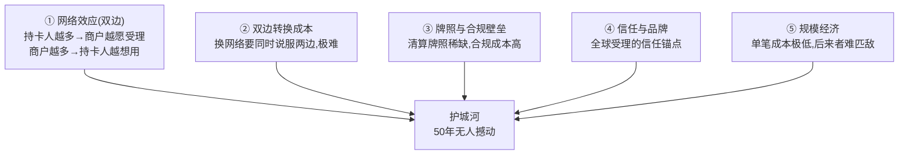
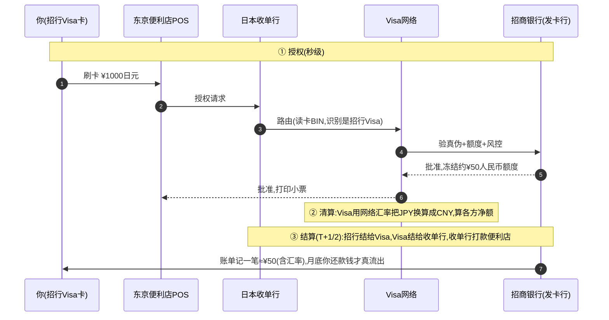

# 模块 1 · 传统支付（业务篇）：银行卡与四方模型

> **学习者**：AWS 技术架构师 · 支付小白
> **本篇目标**：搞懂现代支付的骨架——银行卡四方模型。学完你能回答：发卡和收单到底各干什么？为什么需要卡组织这个"中间人"？交换费为什么是整个生态的发动机？钱在五方之间怎么分？这套体系的护城河为什么 50 年没人能撼动？
> **前置**：模块0 地基（账本/清结算/三流）；**配套**：技术篇 `01-cards-tech-aws.md`
> 标注：📌 关键定义 · 💡 案例 · 🎯 与支付公司交流要点 · ⚠️ 常见误区

---

## 开篇：为什么从银行卡讲起

你在模块0 学了"支付=改账本"。但有个问题没解决：**你和一个素不相识的商户，账本根本不在同一家银行——你的钱在招行，商户的钱在工行，怎么改？**

模块0 的答案是"靠中间机构接力"。**银行卡四方模型，就是人类设计出的第一套、也是至今最成功的一套"标准化接力网络"。** 它的伟大之处在于：让全球任意一张卡，能在全球任意一台机器上完成支付——这背后是一套精妙的角色分工和利益分配机制。

> 🎯 **交流要点**：跨境支付、电子支付、甚至 Apple Pay、稳定币卡，全都架在四方模型之上或与之交互。和任何支付公司交流，四方模型是"普通话"。讲不清四方模型，后面都是空中楼阁。

---

## 第一性追问 1：支付为什么是"推"和"拉"两种，卡支付是"拉"

先建立一个贯穿全模块的根本区分（模块0 提过，这里深化）：

📌 **推（Push）vs 拉（Pull）**：
- **推支付**：付款人主动把钱推出去（电汇、转账）。"我要给你打钱"，付款人发起，付款人账户先减。
- **拉支付**：收款方凭一个授权，主动去付款人账户**拉**钱（银行卡、代扣）。你刷卡时没"打钱"，你只是**签了一张授权书**："准许这个商户来我的发卡行扣款。"

**银行卡是典型的"拉"支付。** 这个性质决定了它的一切设计难题：

> ⚠️ **核心洞察**：因为是"拉"且"商户先交货后收钱"，整个卡组织体系的存在意义，就是**为商户解决"我凭什么相信能拉到钱"的信任问题**。记住这点，下面所有角色和机制都是为它服务的。

---

## 第一性追问 2：四方模型——五个角色，各解决什么问题

### 2.1 全景图

📌 **四方模型（Four-Party Model）**：

> "四方"指持卡人、商户、发卡行、收单行四个**参与方**；卡组织是连接它们的**网络/平台**（所以严格说是"四方+网络"，但习惯叫四方模型）。

### 2.2 每个角色解决什么问题（第一性）

| 角色 | 解决什么问题 | 它的核心能力/职责 |
|---|---|---|
| **持卡人** | 想便捷消费、不带现金 | 持卡、签授权、最终还款 |
| **商户** | 想多收钱、不想自己管收款风险 | 提供商品/服务、受理卡 |
| **发卡行** | 服务持卡人侧：谁来给持卡人授信、担风险 | 发卡、授信额度、风控、垫资、向持卡人收款 |
| **收单行** | 服务商户侧：谁让商户"有资格"收卡 | 商户签约、提供受理终端、把钱结给商户 |
| **卡组织** | 解决"发卡行和收单行两两直连"的 N×N 难题 | 路由、清算规则、品牌、争议仲裁 |

### 2.3 为什么必须有卡组织？—— N×N 难题

💡 **案例**：全球有几万家发卡行、几千万家商户（背后几千家收单行）。如果每家发卡行要和每家收单行**单独建立连接和协议**，连接数是天文数字（N×N）。

📌 **卡组织的本质 = 把 N×N 变成 N**：所有发卡行、收单行只需连接卡组织一家，就能互通。卡组织提供：
1. **统一的技术标准**（报文、流程）——大家说同一种语言。
2. **统一的规则**（费率、争议处理、安全要求）——大家守同一套规矩。
3. **统一的品牌**（Visa/MC 标志）——持卡人和商户的信任锚点。
4. **清算与结算的组织**——算清谁该给谁多少。

> 🎯 **交流要点**：卡组织**不发卡、不收单、不直接碰持卡人的钱**，它是"规则制定者 + 网络运营者 + 清算组织者"。能说清"卡组织是 two-sided platform（双边平台），核心资产是网络效应和规则话语权"，就抓住了它的商业本质。

### 2.4 四方 vs 三方模型

📌 **三方模型（Three-Party Model）**：发卡、收单、卡组织**由同一家公司承担**。代表：American Express、Discover、以及早期的支付宝/微信闭环。

| | 四方模型 | 三方模型 |
|---|---|---|
| 发卡/收单 | 由成千上万家银行分担 | 自己一家全包 |
| 规模扩张 | 快（借力众多银行） | 慢（自己拓展） |
| 商户费率 | 较低 | 较高（但服务/数据更可控） |
| 控制力 | 分散 | 强（端到端掌控数据与体验） |

> 💡 这个区分在 Agentic Payment 时代会重新变得重要——很多新玩家（含稳定币卡、Agent 钱包）选择"闭环（类三方）"来掌控体验和数据。

---

## 第一性追问 3：一笔卡支付的三段式生命周期

模块0 讲过"清算≠结算"。在卡支付里，它具体表现为**三段分离**。这是卡支付的精髓。

📌 **授权 → 清算 → 结算**：

| 阶段 | 时机 | 干什么 | 钱动了吗 |
|---|---|---|---|
| **授权 Authorization** | 刷卡瞬间(秒) | 验真伪+额度+风控，冻结额度 | **没动，只占座** |
| **清算 Clearing** | 当天/次日(批量) | 商户提交批次，卡组织轧差算净额 | 算账 |
| **结算 Settlement** | T+1/T+2 | 各行间真正划钱，达成 finality | **真动钱** |

> 💡 **解释你的日常体验**：刷卡立刻收到"消费提醒"短信（=授权），但账单几天后才出、商户几天后才到账（=结算）。退款最快——因为钱还没结算，撤销授权即可。
>
> 🎯 **交流要点**：能区分"授权成功 ≠ 钱到账"，理解"预授权/请款（capture）"（酒店押金、加油先冻结后扣实际金额）就是利用这个分离。这是卡支付业务的必考点。

---

## 第一性追问 4：钱怎么分？—— 交换费与 MDR（生态的发动机）

这是整个卡支付**最精妙、最反直觉**的部分。先问一个问题：

> **银行为什么抢着给你发信用卡、送积分送返现，还不收你年费？它图什么？**

答案藏在钱的分配里。

### 4.1 MDR：商户付出的总成本

📌 **MDR（Merchant Discount Rate，商户扣率）**：商户每笔交易要付出的总手续费（如 2%）。这是整个生态的"收入来源"。

💡 **案例**：你刷卡买 100 元商品，商户实际到手约 98 元，被扣的 2 元（MDR）分给三方：

### 4.2 交换费：为什么补贴发卡行

📌 **交换费（Interchange Fee）**：MDR 里最大的一块，由**收单侧（商户）支付给发卡侧（银行）**。

**第一性原因——它是整个生态的激励引擎：**

> **看穿本质**：发卡行承担了最大的风险（持卡人不还钱、盗刷、垫资）和最大的获客成本（积分返现）。所以规则设计成"**收单侧付钱，补贴发卡侧**"。你每刷一笔，商户付的交换费就流进发卡行口袋。
>
> 💡 这就回答了开篇问题：**银行抢着给你发卡，因为你刷得越多，它从商户那边收的交换费越多。你和你的消费数据，就是发卡行的核心资产。**

> 🎯 **交流要点**：交换费是卡支付商业模式的"心脏"。各国监管对交换费设上限（如欧盟 0.3%/0.2%，中国借贷记分开定价）会直接重塑整个市场。能聊"交换费上限如何影响发卡行积分策略和收单定价"，非常专业。

### 4.3 各方的收益模式总览

| 角色 | 怎么赚钱 |
|---|---|
| **发卡行** | 交换费（大头）+ 信用卡利息/分期 + 年费 + 数据价值 |
| **收单行/PSP** | 收单加价（MDR 中扣给发卡行和卡组织后剩下的） |
| **卡组织** | 卡组织费（按交易笔数/金额收，单笔极薄但量极大）+ 跨境费 + 数据服务 |
| **商户** | （付费方）但获得了"接受全球银行卡"的能力，换来更多成交 |
| **持卡人** | （表面免费）享受信用、积分、便利；实际成本隐含在商品价格里 |

> ⚠️ **常见误区**："持卡人不花钱"是错觉——MDR 最终会体现在商品定价里，所有消费者（含用现金的）共同承担。这也是交换费监管的理由之一。

---

## 第一性追问 5：发卡与收单——两端深入

### 5.1 发卡（Issuing）：服务持卡人侧

📌 **发卡业务**：金融机构向持卡人发行银行卡，提供账户、授信、支付能力，并承担相应风险。

**发卡方关注什么：**
- **授信与风险**：信用卡要决定给你多少额度、承担你不还钱的风险（信用风险）。
- **风控**：防盗刷、防欺诈（盗刷损失常由发卡行承担）。
- **获客与活跃**：用积分/返现/权益吸引你办卡、多刷卡。
- **资金成本**：信用卡有免息期，发卡行要垫资。

📌 **虚拟卡（Virtual Card）= 发卡的数字化形态**：
- 无实体卡片，即时在线生成一个卡号。
- 可设**单次使用、限额、限商户、限有效期**。
- 典型用途：线上支付（降盗刷）、企业给员工/供应商**代付与费控**、订阅管理。
- 💡 在跨境场景（模块3）也常用：给海外供应商发虚拟卡付款。

> 🎯 **交流要点**：虚拟卡是 fintech 的热门切入点（如 Marqeta、Stripe Issuing）。其根技术是 tokenization（技术篇讲）。能说"虚拟卡让发卡能力 API 化、可编程"，体现你看到了趋势。

### 5.2 收单（Acquiring）：服务商户侧

📌 **收单业务**：为商户提供受理银行卡、并把交易资金结算给商户的服务。

**收单方关注什么：**
- **商户准入（KYB）**：审核商户真实性、合规性（防止给洗钱/欺诈商户开通）。
- **受理渠道**：提供 POS、支付网关、二维码等受理工具。
- **资金结算**：何时把钱结给商户（T+0/T+1，涉及垫资和风险）。
- **商户风险**：商户跑路、拒付（chargeback）风险——若商户卷款跑路而消费者拒付，损失可能落到收单行。

📌 **相关角色辨析**：
- **收单行（Acquiring Bank）**：有牌照、能直接接入卡组织清算的银行。
- **支付服务商（PSP）/ ISO / 收单机构**：很多不是银行，而是挂靠收单行、做商户拓展和技术服务的机构（如 Stripe、Adyen 早期）。
- 💡 现代很多"收单"其实是 PSP + 持牌收单行的组合。

> 🎯 **交流要点**：跨境收款公司（连连/PingPong/Airwallex）本质就是"跨境收单/收款 + 换汇"。理解收单的"商户准入、资金结算、拒付风险"三大关注点，就能和它们对话。

---

## 第一性追问 6：护城河——为什么四方模型 50 年无人撼动

这是和支付公司聊"竞争格局"时的核心。卡组织（尤其 Visa/MC）的护城河极深：

📌 **核心护城河：双边网络效应 + 双边转换成本**
- **网络效应**：持卡人多→商户愿意装受理→更多持卡人愿用，正循环。
- **致命的转换成本**：要取代 Visa，你得**同时**说服几十亿持卡人和几千万商户切换——任何一边不动，另一边就不动。这是"先有鸡还是先有蛋"的死结，新进入者极难破。

💡 **谁曾撼动过？怎么破的？**
- **银联**：靠国家力量在中国本土建网（监管+本土银行强制接入），证明"网络效应可被主权打破"。
- **支付宝/微信**：不正面挑战卡组织，而是**换赛道**——用二维码 + 账户余额，绕开卡组织建自己的闭环网络（模块2 详讲）。
- **稳定币**：试图用"全球开放账本"绕开整个四方模型（模块4）。

> 🎯 **交流要点**：能讲"卡组织护城河是双边网络效应，破局者都不是正面硬刚，而是换赛道（二维码/账户/链上）"——这是对支付竞争格局的高阶理解。Agentic Payment 的新玩家也在找"换赛道"的机会。

---

## 综合案例：东京便利店刷一张中国信用卡（跨境卡支付）

把所有概念串起来，看一个**跨境**卡支付（比模块0 的境内案例多了货币转换）：

**和境内案例的关键差异**：
1. **多了货币转换**——由 Visa 在清算环节用网络汇率把日元换成人民币。
2. **跨境刷卡比跨境电汇简单**——因为 Visa 本身就是全球封闭网络，自带"共同账本"，不需要代理行接力（对比模块3 的电汇）。
3. ⚠️ **DCC 坑**：店员问你"按日元还是人民币结算"，**永远选当地货币（日元）**——选人民币（DCC）会被商户侧偷加 3%~7% 汇率加价。

---

## 本篇小结：模块1 业务要点（背下来）

1. **卡支付是"拉"支付**：商户先交货后拉钱，整个体系为解决"凭什么相信拉得到钱"。
2. **四方模型**：持卡人/商户/发卡行/收单行 + 卡组织网络。卡组织把 N×N 直连难题变成 N。
3. **卡组织不碰钱**：只做规则、网络、清算组织，是双边平台。
4. **三段分离**：授权(秒,占座) → 清算(算净额) → 结算(T+N,真划钱)。授权≠到账。
5. **交换费是发动机**：收单侧付钱补贴发卡侧，所以银行抢着发卡送积分，你的消费是它的资产。
6. **发卡服务持卡人**（授信/风控/获客），**收单服务商户**（准入KYB/受理/结算/拒付风险）。
7. **护城河 = 双边网络效应 + 双边转换成本**，破局者都靠"换赛道"而非正面硬刚。

---

## 通向下一层

- **技术怎么实现？** → `01-cards-tech-aws.md`（ISO 8583 报文、卡 BIN 路由、EMV/NFC、Tokenization、3DS、HSM 与 PCI-DSS、虚拟卡技术，以及每一项的 AWS 方案）
- **线上没有 POS 怎么办？** → 模块2 `02-epayment-business.md`（支付网关、第三方支付、钱包）
- **范式对比**：把本模块的"POS 卡支付"与其他范式对照 → `支付范式资金流对比.md`

> 🎯 **此刻你已具备的对话能力**：能和任何支付公司用"四方模型 + 三段式 + 交换费 + 护城河"这套普通话交流卡支付的业务逻辑。
