# 模块 1 · 传统支付（技术篇）：卡支付的技术实现与 AWS 方案

> **学习者**：AWS 技术架构师 · 支付小白
> **本篇目标**：把业务篇的四方模型与收单产业链翻译成工程。回答：刷卡瞬间技术上发生了什么？ISO 8583 报文长什么样？收单系统由哪些组件构成、各环节怎么交互、网关怎么路由？清结算在系统层怎么分层？EMV/Tokenization/3DS 各防什么？卡数据合规（PCI-DSS）和密钥（HSM）怎么落地？PayFac 平台怎么搭？——每一项映射到具体 AWS 服务，这是你作为 AWS SA 的差异化价值。
> **前置**：业务篇 `01-cards-business.md`、地基技术篇 `00-foundation-tech.md`
> **组织方式**：top-down 主线叙述（见 `CLAUDE.md` 1.5）。零散追问见文末「附：常见追问」。
> 标注：🔧 通用技术 · ☁️ AWS · ⚠️ 合规/安全坑点 · 🎯 与支付公司技术交流要点

---

## 1. 全景：卡支付技术栈的三大主题

作为架构师，把卡支付技术拆成三个维度，本篇自顶向下展开：

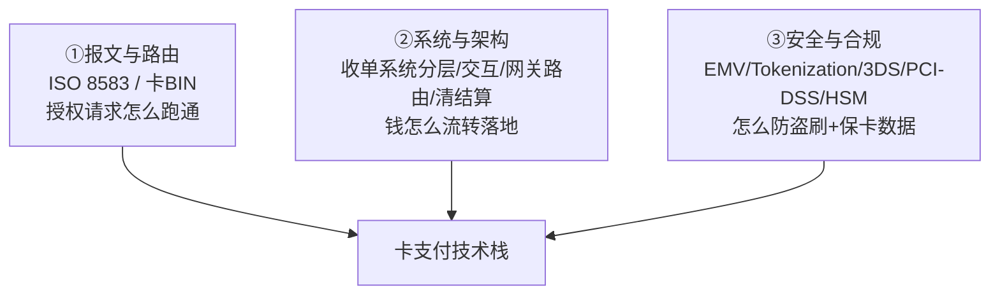

主线（自顶向下）：报文标准 → 刷卡时序 → **收单系统逻辑架构**（组件/交互/路由/清结算）→ 安全四件套 → PCI-DSS与密钥AWS → PayFac平台AWS。其中**③安全合规是你 AWS SA 最能发力的地方**。

> 🎯 **交流要点**：支付系统的根本信仰是"**资金正确性 > 一切**"（CP 不是 AP，见地基技术篇）。这决定了几乎所有技术选型。

---

## 2. 报文标准：ISO 8583 与卡 BIN 路由

### 2.1 ISO 8583：卡支付的"普通话"

🔧 卡支付的授权/清算报文，全球统一用 **ISO 8583**。**为什么需要标准？** 回到业务篇的 N×N 难题——几万家发卡行、几千家收单行要互通，必须说同一种语言。

📌 一条 ISO 8583 报文三部分：
- **MTI（Message Type Indicator）**：4 位，标识消息类型。`0100`=授权请求、`0110`=授权响应、`0200`=金融请求、`0220`=清算上送。
- **Bitmap（位图）**：标识本报文带了哪些数据域（64/128 位）。
- **Data Elements（数据域）**：DE2=卡号(PAN)、DE4=金额、DE11=跟踪号(STAN)、DE39=响应码(00=成功)、DE41=终端ID、DE42=商户号(MID)。

💡 一笔授权 = 收单侧发 `0100`（带卡号/金额/商户号）→ 发卡行回 `0110`（带响应码）。

> ⚠️ ISO 8583 是定长/紧凑二进制格式，字段短、可读性差。对比模块3 跨境的 ISO 20022（XML/结构化、字段丰富）——两代报文标准的差异。
> 🎯 能说出"授权走 0100/0110、清算走 0200/0220、DE39 响应码 00 是成功"，瞬间证明你接触过真实卡系统。

### 2.2 卡 BIN 路由

📌 **BIN（Bank Identification Number）**：卡号前 6-8 位，标识发卡行、卡组织、卡种（借记/信用）。

🔧 **路由本质**：收单侧拿到卡号，看 BIN 就知道"这张卡属于哪个卡组织、哪家发卡行"，从而把授权请求**路由**到正确的网络和发卡行。智能路由还能做成本优化（双标卡选低费率网络）——详见 §4 网关路由。

---

## 3. 刷卡瞬间的技术时序

把业务篇的"授权"展开成技术视角：

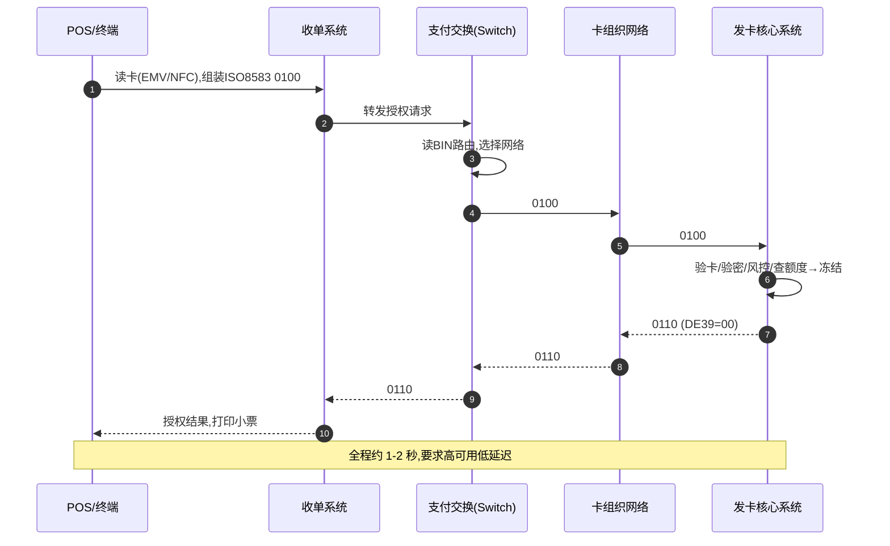

🔧 **Switch（支付交换系统）**：负责报文路由、协议转换、连接各网络的中枢，是延迟和可用性最敏感的组件。

> 🎯 **交流要点**：授权链路是"在线、同步、低延迟、高可用"（秒级），清算结算是"离线、批量"——两套架构完全不同。前者像实时交易系统，后者像大数据批处理。

---

## 4. 收单系统的逻辑架构

业务篇讲了"收单产业链有哪些角色（谁来做）"，这里讲"收单系统由什么构成、怎么连、怎么路由（系统视角）"。

### 4.0 整体架构全景：一张图串起所有角色与组件

先建立全局视图，再逐块下钻。下图把**持卡人、商户、收单系统（网关→网关路由→处理器）、商户清分、风控、清算交互、结算交互**及外部各方放在一起，标出三类数据流。

```mermaid
flowchart TB
    CH["持卡人"]
    M["商户"]
    subgraph ACQSYS["收单系统(收单机构)"]
        GW["网关 Gateway<br/>受理入口/加密/协议适配"]
        ROUTE["网关路由<br/>硬性匹配+择优(least-cost/成功率/failover)"]
        PROC["处理器 Processor<br/>组8583/对接网络/清算文件"]
        RISK["风控引擎<br/>实时反欺诈/限额/拒付防控"]
        SPLIT["商户清分<br/>总额按商户拆分+扣MDR+分账"]
        SETTLE["结算/Payout<br/>按T+N打款给商户"]
        MM["商户管理<br/>入网KYB/MID/费率"]
        RECON["对账<br/>内外账逐笔核对"]
    end
    CSORG["卡组织<br/>(网络清算:轧差算各行净额)"]
    ISS["发卡行<br/>(授权决策/对持卡人记账)"]
    CB["央行/清算机构<br/>(最终资金结算 finality)"]
    BANK["商户银行账户"]

    CH -->|刷卡/输卡| M
    M -->|交易请求| GW
    GW --> RISK
    RISK --> ROUTE
    ROUTE --> PROC
    PROC <-->|① 授权指令流(在线/同步/ISO8583)| CSORG
    CSORG <-->|授权路由| ISS
    CSORG -.->|② 清算文件(批量/T+1)| PROC
    PROC --> SPLIT
    CSORG -.->|③ 结算:成员行净额| CB
    CB -.->|央行货币划拨| SETTLE
    SPLIT --> SETTLE
    SETTLE -->|对商户结算| BANK
    PROC --> RECON
    SPLIT --> RECON
    MM -.配置MID/费率.-> ROUTE
    MM -.商户准入.-> SPLIT
```

📌 **三类数据流的逻辑关系**（这是架构的灵魂，分别对应下面三张场景图）：
- **① 指令流（授权）**：在线、同步、秒级。判断"这笔能不能扣"，钱未动。经 网关→风控→路由→处理器→卡组织→发卡行。
- **② 清算流**：批量、T+1。卡组织下发清算文件，处理器据此做**商户清分**（总额拆到各商户、扣 MDR）。
- **③ 结算流**：资金真正划转。成员行间经央行达成 finality，收单机构再 Payout 给商户。

> 🎯 **交流要点**：能画出"指令流(在线)与清算/结算流(批量)分离、风控在授权前置、清分在清算之后、结算最后落地"这条主线，说明你掌握了收单系统的骨架。下面 §4.1-4.6 是对这张图各组件的下钻。

### 4.0.1 场景流程图（指令流 / 清算 / 结算 / 拒付）

**场景1：支付指令流（授权，在线同步）**

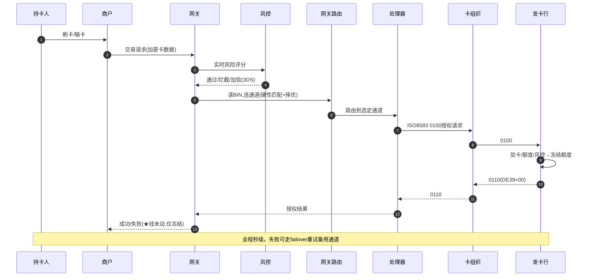

**场景2：清算流（批量，T+1，含商户清分）**

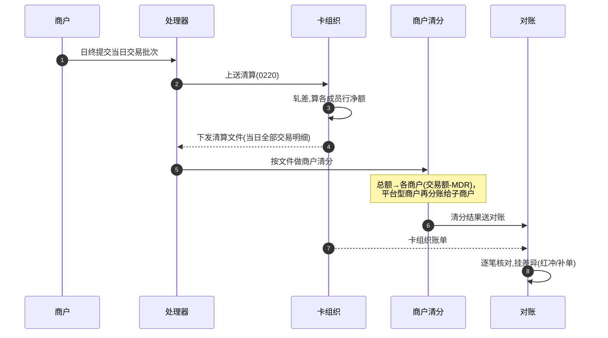

**场景3：结算流（资金真正划转,达成finality）**

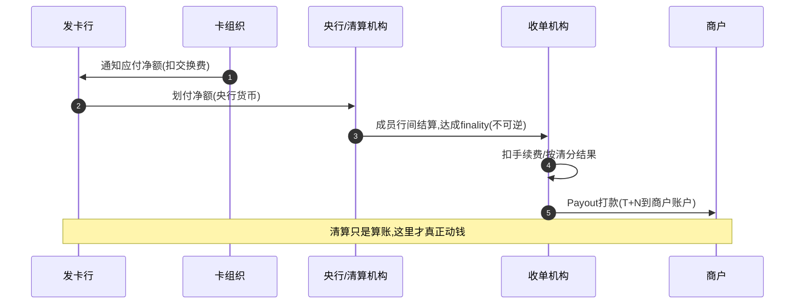

**场景4：拒付/退单流（Chargeback,逆向资金流)** —— 架构师常忽略但很重要

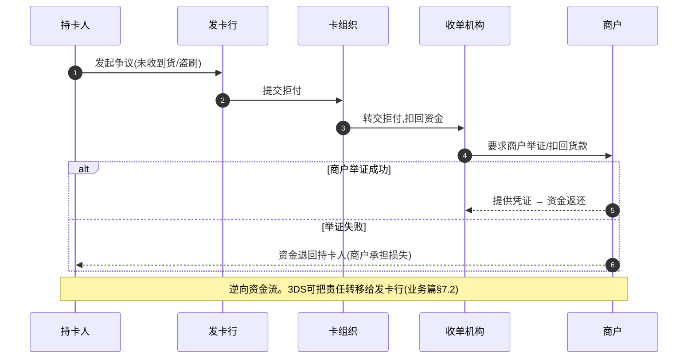

> 💡 **为什么补拒付流**：拒付是收单机构**风险与资损的核心来源**（商户跑路+消费者拒付，损失可能落到收单行），也是风控系统重点防控的对象。架构上它是一条**逆向资金流**，与正向的指令/清算/结算流共同构成收单的完整资金闭环。

---

### 4.1 收单系统的组件与交互关系

📌 从"收单要完成什么"（受理→处理→清结算）推出 5 个核心组件——但关键不是"有哪些盒子"，而是**它们之间怎么交互**：谁调用谁、什么时候、在线还是离线。下图按"在线交易链路 / 离线资金链路 / 配置与数据支撑"三层展示组件间的交互关系：

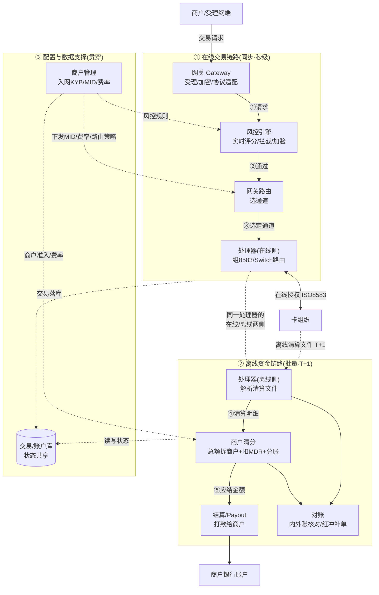

📌 **三层交互关系的逻辑**（这才是架构的本质，不是 5 个孤立的盒子）：
- **① 在线交易链路**：商户→网关→**风控**(前置拦截)→**网关路由**(选通道)→处理器→卡组织。同步、秒级，决定"能不能扣"。
- **② 离线资金链路**：卡组织清算文件→处理器(离线侧)→**商户清分**(拆到各商户、扣MDR)→**结算Payout**(打款)；处理器与清分结果都进**对账**。批量、T+1，决定"钱怎么落地"。
- **③ 配置与数据支撑**：**商户管理**给在线/离线两侧下发 MID、费率、路由策略、风控规则（它是"配置源"，不在交易主链路上）；各组件通过**数据库**共享交易/账户状态（同主体内部，见 §4.4）。

> 🎯 **关键认知**：
> - **同一个"处理器"横跨在线和离线两侧**——在线侧做授权 Switch，离线侧解析清算文件，这是它最容易被忽略的双重角色。
> - **风控是"前置关卡"**（授权前拦截），不是事后环节。
> - **商户管理是"配置源"**，给各组件供给规则/费率/MID，自己不在交易资金流上。
> - **在线链路(同步)和离线链路(批量)的分界**，正是 §3 讲的"授权在线 vs 清算离线"在组件层的体现。

### 4.1.1 风控组件：交易要做哪些检查（简要版）

§4.1 把风控画成"授权前的前置关卡"。这里说清它具体查什么——完整的风控体系（三代演进、图计算、Agent时代风控）留给**模块6 横向专题**，此处只给架构师够用的概览。

📌 **第一性：风控在防三类损失** → ①盗刷/欺诈 ②拒付损失(Chargeback) ③合规违规(洗钱/套现/制裁)。据此，**实时风控从六个维度找"哪里不对劲"**：

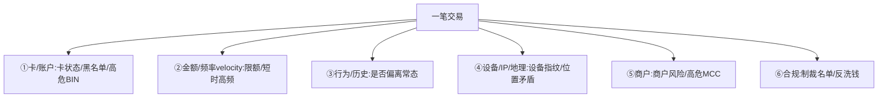

| 维度 | 典型规则示例(🔧教学示意) |
|---|---|
| ①卡/账户 | 卡在止付名单→拒绝 |
| ②频率velocity | 同卡10分钟>3笔→拒绝(盗刷常短时高频试刷) |
| ③行为/历史 | 凌晨大额/首次在该商户且金额异常→加验 |
| ④设备/IP/地理 | 卡归属国≠IP国且金额>阈值→加验;同设备24h绑>5卡→拒绝 |
| ⑤商户 | 高拒付率商户/博彩虚拟币MCC→降低阈值+强制3DS |
| ⑥合规 | 命中OFAC/UN制裁名单→拒绝+上报 |

📌 **规则的"动作"分三档**（不是非黑即白，这是关键）：

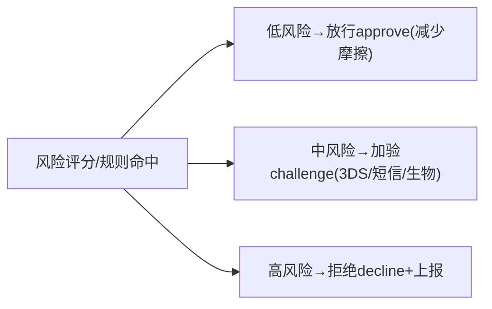

> 🎯 **核心权衡**：风控的根本矛盾是 **漏过欺诈(false negative,资损) vs 误杀好人(false positive,流失)**。规则太松欺诈多，太严好客户被拦、转化率掉。所以"加验(challenge)"档很重要——给中风险交易一次自证机会(3DS)，而非直接拒。
>
> 🔧 **规则形态**从"规则引擎(if-then硬规则)"→"ML评分(模型算欺诈概率)"→"图计算(团伙识别)"三代演进(详见模块6)。

☁️ **AWS 实时风控架构**（要在授权链路上几十毫秒内完成）：

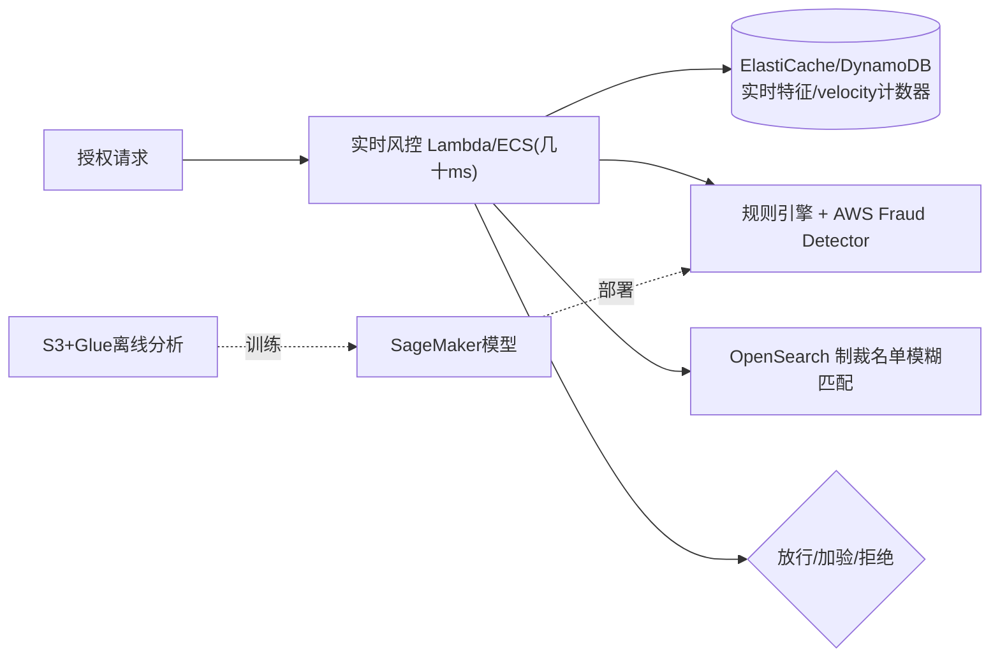

| 风控能力 | ☁️ AWS |
|---|---|
| 实时评分(低延迟) | Lambda/ECS + **Fraud Detector** |
| 实时特征/velocity计数 | ElastiCache / DynamoDB |
| 制裁名单匹配 | OpenSearch(模糊匹配) |
| 规则热更新 | AppConfig |
| 模型训练/离线分析 | SageMaker + S3/Glue |

> 🎯 **交流要点**：实时风控最大挑战是"**在授权链路上、几十毫秒内、调多个数据源完成评分**"——既准又快。能聊"velocity 计数器用内存库、模型推理低延迟、放行/加验/拒绝三档分流"，体现你懂风控工程。
> ⚠️ 上述规则/阈值为 🔧 教学示意，真实阈值由各机构按自身欺诈数据持续调优且保密。

### 4.2 网关 vs 处理器的边界

| | **网关 Gateway** | **处理器 Processor** |
|---|---|---|
| 解决什么 | **受理入口**：接住请求、加密卡数据、初步路由 | **交易处理**：组装 ISO 8583、对接卡组织/发卡行、生成清算文件 |
| 类比 | 商户的"线上 POS / 大门" | 后端的"交易引擎 / 发动机" |
| 位置 | 链路最前端(靠商户) | 链路中后段(靠卡组织) |
| 对接清算 | 一般不直接对接 | **对接卡组织清算网络** |

⚠️ **功能层 ≠ 主体边界**：逻辑上"收单系统含网关+处理器"，不代表同一家公司提供。三种现实组合：

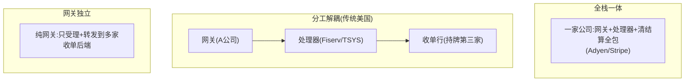

> 💡 **与模块2衔接**：网关在总纲里主要放"模块2 电子支付(线上受理入口)"——不矛盾：网关既是收单系统前端组件，又是互联网时代收单的标志性产物。

### 4.3 处理器（Processor）的系统形态与商业模式

🔧 **Processor 的牌照判断**：钥匙是"碰不碰资金清算"。

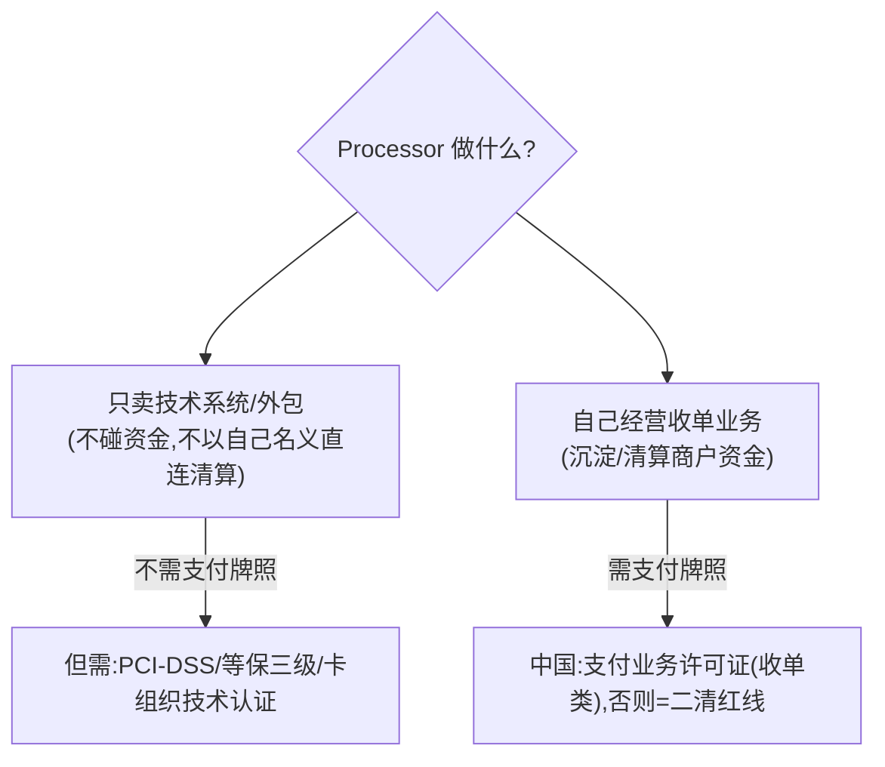

🔧 **三种商业模式**（"系统谁运营、卖不卖给收单行"）：

| 模式 | 谁运营系统 | 卖给收单行吗 | 代表 |
|---|---|---|---|
| **A 卖软件 License** | 买方自运营 | ✅ 卖系统授权 | 中国软件商(长亮/神州信息) |
| **B 处理外包/SaaS** | Processor 自运营 | ✅ 卖服务(按量计费),不卖系统 | Fiserv/TSYS/FIS(美国主流) |
| **C 自营一体** | 持牌机构自建自用 | ❌ 不外卖 | 银联商务/拉卡拉 |

> 📌 **中美对比**：美国网关/处理器/收单行高度分工、各有独立巨头；中国牌照集中+持牌机构倾向自建全栈，纯独立处理器赛道弱，"卖系统"由软件商(长亮/神州信息/宇信/科蓝)承接，"清算转接"被银联/网联国家队垄断。
> ⚠️ 中国公司名单属 🔧 行业公知梳理，未逐家核实牌照状态。

☁️ **Processor 在 AWS = 多租户高并发交易平台**：

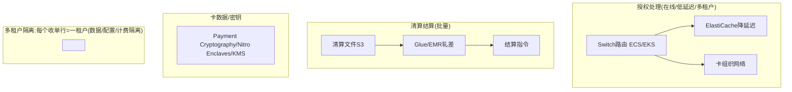

### 4.4 各环节如何交互：API / 文件 / 数据库

🔧 第一性原则：**越靠近用户越要实时(API)，越靠后台越能批量(文件)**。源于"授权在线同步、清算离线批量"。

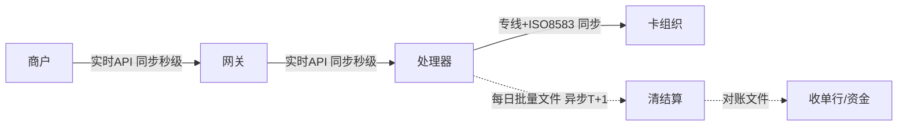

| 交互 | 方式 | 为什么 | 实时性 |
|---|---|---|---|
| Gateway ↔ Processor | **API**(REST/TCP长连+8583) | 用户在等结果 | 同步秒级 |
| Processor ↔ 卡组织 | **专线+ISO 8583** | 接入清算网络 | 同步秒级 |
| Processor ↔ 清结算 | **文件**(SFTP批量) | 日终批量轧差 | 异步T+1 |
| 系统内部各模块 | **数据库** | 同主体状态共享 | — |

⚠️ **数据库≠跨主体交互**：数据库用于同一主体/系统内部状态共享；**跨公司几乎不直接共享数据库**（安全/解耦/责任边界），用 API 或文件。若一家说"和上游直连数据库"，通常意味着同体系深度绑定或架构耦合信号。

🔧 关键技术点：Gateway↔Processor 用**长连接+连接池**（避免每笔握手）、**同步超时控制**（超时走"冲正"撤销防单边账）、双向证书+报文 MAC 签名。

### 4.5 网关路由：基于什么分发交易

网关的核心智能是**路由决策**：为每笔交易在多个可用通道中选最优路径。

**先厘清"多条通道"从哪来（两个层次）**：

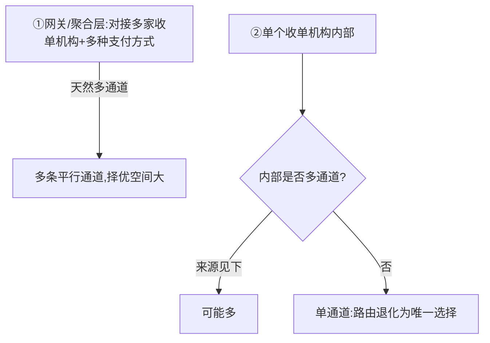

单机构内部多通道来源：**一卡多清算网络**（双标卡银联+Visa；美国 Durbin 法案强制借记卡支持≥2网络）、多上游赞助行、多 MID、主备链路。
> 💡 Durbin Amendment 强制单卡多网络，是 least-cost routing 在美国普遍的法理根基。无多通道则退化为唯一选择——这正是网关/聚合商"对接多家"的价值。

📌 **路由依据 = 硬性匹配 + 择优**：

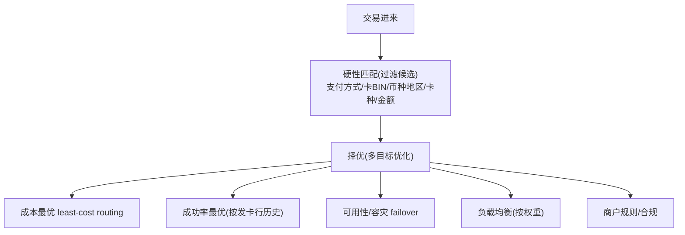

🔧 **实现**：规则引擎驱动（条件→动作，动态可调）；决策数据 = BIN库+通道配置(费率/限额/币种)+实时成功率+健康状态；执行 = 硬性匹配过滤→择优排序→选定→失败 failover。
☁️ **AWS**：Lambda/ECS 跑规则 + DynamoDB/ElastiCache 存通道配置与实时成功率(低延迟) + AppConfig 规则热更新。

> 🎯 **交流要点**：问"路由是静态规则还是动态智能路由？支持 least-cost routing 和基于成功率的动态切换吗？"——说明你懂网关核心价值在"路由决策"而非"转发"。

### 4.6 清结算的系统分层

⚠️ §4.1 组件图里的"清结算"只指收单机构自营段。**整个产业链的清结算是分层的，分属不同主体**：

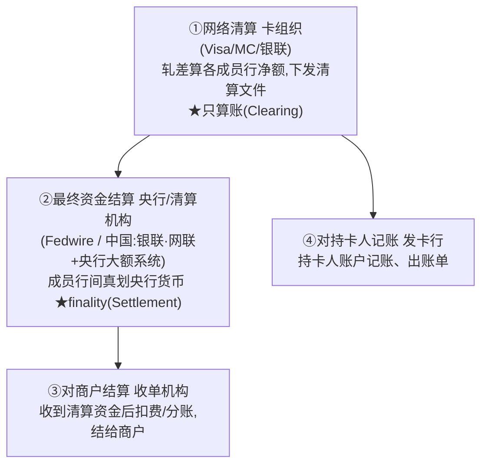

⚠️ **卡组织通常只做"清算"(算净额)，不做大额"最终结算"——最终结算落在央行账本上**。这正是模块0"清算≠结算"在卡体系的体现。中国网络清算被银联/网联国家队垄断，机构不得绕过（二清）。
> 📌 **清算的多层复现**：网络清算(卡组织,对外轧差) vs 内部清分(收单机构总额拆商户、平台型商户分账,对内)——都叫"清算"，本质都是"算清谁该得多少"，只是主体/方向不同。

---

## 5. 安全与防伪：每种技术防什么攻击

卡支付安全技术不是堆砌，每一项对应一类攻击：

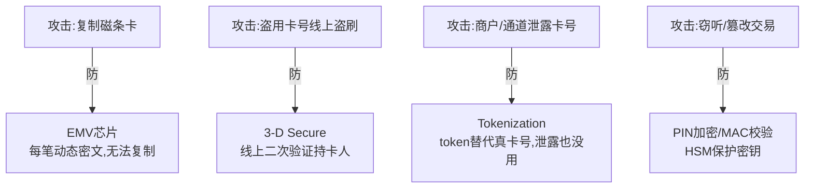

- 🔧 **EMV/芯片卡/NFC**：芯片每笔生成动态密文（cryptogram），防磁条卡被复制重放。NFC/闪付是芯片的非接触形态，Apple/Google Pay 在其上加 tokenization。
- 🔧 **Tokenization（令牌化）**：用无意义 token 替代真卡号(PAN)，让真卡号**永不出现在风险最高环节**（商户/手机/网络）。Apple Pay 存设备token(DPAN)、虚拟卡、网络令牌都基于它。⚠️ 大幅**缩小 PCI 合规范围**。☁️ AWS：DynamoDB+KMS 建 token vault，真卡号加解密在 Nitro Enclaves/Payment Cryptography 进行。
- 🔧 **3-D Secure (3DS)**：线上交易把持卡人重定向到发卡行验证身份（短信/生物）。🔧 **责任转移**：用了 3DS 若仍欺诈，拒付损失从商户转到发卡行——这是商户启用的核心动力。3DS 2.0 引入风险化验证（低风险免验证减流失）。

---

## 6. 合规与密钥：你的 AWS 主场

### 6.1 PCI-DSS：卡数据合规红线

📌 卡组织强制的卡数据安全标准。核心：卡号(PAN)加密存储**绝不明文落库**、CVV**绝对不可存储**、网络隔离/访问控制/审计/扫描。
⚠️ **合规范围(PCI Scope)= 接触卡数据的所有系统**，范围越大审计越贵。核心策略是**缩小 scope**：用 tokenization、外包卡数据处理，让大部分系统"碰不到真卡号"。

### 6.2 HSM 与密钥管理

📌 **HSM（硬件安全模块）**：金融级密钥的"硬件保险柜"，密钥在硬件内生成/使用、**永不明文导出**。用于 PIN 加密、卡数据加解密、EMV 密钥、报文 MAC。

### 6.3 AWS 方案全景（差异化价值）

☁️ **你作为 AWS SA 最该烂熟的一张图**：

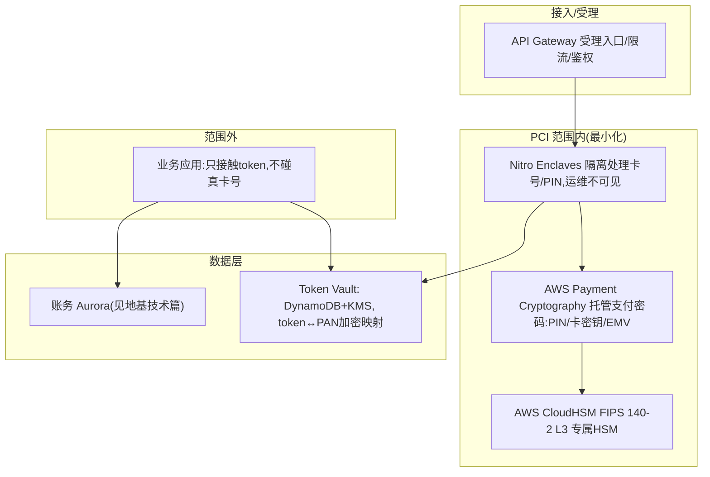

| 需求 | 通用做法 | ☁️ AWS |
|---|---|---|
| 支付专用密码(PIN/EMV/卡密钥) | 自建 HSM 集群 | **Payment Cryptography**(托管,免运维) |
| 通用密钥/合规HSM | HSM | **CloudHSM**(FIPS 140-2 L3)/**KMS**(通用) |
| 卡号/PIN 隔离处理 | 物理隔离区 | **Nitro Enclaves** |
| 令牌库 | 加密DB | **DynamoDB+KMS** |
| 受理入口 | 网关 | **API Gateway**(限流/鉴权/WAF) |
| 审计 | 日志 | **CloudTrail/CloudWatch** |
| PCI 合规基础 | 自建 | AWS 已过 PCI-DSS Level 1,**继承合规基线**缩小自身审计范围 |

> 🎯 **交流杀手锏**：支付公司自建 HSM 集群成本高、运维痛、扩容难。你能给出 **Payment Cryptography(免自建HSM)+Nitro Enclaves(隔离卡数据)+KMS(密钥)+继承AWS PCI-DSS L1** 的成体系方案，直击其最大痛点。这是 AWS SA 在支付领域最有说服力的切入点。

---

## 7. PayFac 平台型架构与 AWS

PayFac（业务篇 §4）是现代收单主流，也是平台/SaaS 公司最爱的模式。其技术架构对你 AWS SA 极有价值。

### 7.1 PayFac 平台要解决的技术问题

```mermaid
flowchart TB
    SUB["子商户自助入网"] --> KYB["①子商户KYB/风控(快速尽调+持续监控)"]
    PAY["支付受理"] --> LEDGER["②多商户账本(每个子商户独立账务)"]
    LEDGER --> SPLIT["③分账/清分(一笔钱拆给平台+多子商户)"]
    SPLIT --> PAYOUT["④资金结算/Payout(按周期打款)"]
    ALL["全流程"] --> RISK["⑤反洗钱/拒付/资金隔离合规"]
```

### 7.2 AWS 参考架构

```mermaid
flowchart TB
    GW["API Gateway 统一受理"] --> KYB["子商户入网:Step Functions编排KYB+Lambda调尽调/制裁筛查+S3/Textract证件核验"]
    GW --> LEDGER["多商户账本(CP强一致):Aurora子商户独立账户+复式记账, DynamoDB幂等"]
    LEDGER --> SPLIT["分账引擎 Lambda/ECS"] --> PAYOUT["Payout:Step Functions编排+SQS重试"]
    GW --> FD["风控:Fraud Detector/SageMaker"]
    LEDGER --> REC["对账:S3+Glue"]
```

| PayFac 能力 | ☁️ AWS |
|---|---|
| 受理入口 | API Gateway + WAF |
| 子商户 KYB 编排 | Step Functions + Lambda + S3/Textract |
| 多商户账本 | Aurora(强一致复式记账) + DynamoDB(幂等) |
| 分账/清分 | Lambda/ECS 规则引擎 |
| 资金结算 Payout | Step Functions + SQS + EventBridge |
| 风控反欺诈 | Fraud Detector / SageMaker |
| 对账 | S3 + Glue/Athena |
| 密钥/卡数据 | Payment Cryptography / Nitro Enclaves / KMS |

> 🎯 **交流杀手锏**：很多平台/SaaS 想做 PayFac 但卡在"多商户账本+分账+KYB+合规"的工程复杂度。你能给出这套完整 AWS 蓝图——切入支付平台客户的高价值场景。**跨境收款公司（连连/PingPong/Airwallex）的技术底座本质就是"跨境 PayFac 平台 + 多币种账本 + 汇率引擎"**（业务篇 §4.6），这套架构直通你的最终目标。

---

## 8. 金融级非功能性在卡支付的体现

🔧 复用地基技术篇 NFR：
- **高可用**：授权链路 99.99%+（断了商户没法收钱），多 AZ、无单点、降级（发卡行不可达时 stand-in 代授权）。
- **低延迟**：授权秒级返回。
- **幂等**：网络重试不能重复扣款（重复 0100 用 STAN/RRN 去重）。
- **强一致**：额度冻结、扣款准确。

☁️ 多 AZ 部署、ElastiCache 降延迟、DynamoDB 幂等表（STAN/RRN 做幂等键）、Aurora 强一致账务。

---

## 9. 本篇小结（背下来）

1. **ISO 8583**：MTI+位图+数据域；授权 0100/0110、清算 0200/0220、DE39=00 成功。**卡 BIN** 决定路由。
2. **授权在线同步低延迟，清算结算离线批量**——两套架构。
3. **收单系统 = 网关(受理)+处理器(交易引擎)+清结算+商户管理+风控**；功能层≠主体边界（全栈/分工/独立）。
4. **各环节交互**：Gateway↔Processor 用 API、Processor↔卡组织专线8583、Processor↔清结算用文件、内部用DB。
5. **网关路由 = 硬性匹配 + 择优**（least-cost/成功率/failover），多通道来自聚合层或单卡多网络(Durbin)。
6. **清结算分层**：网络清算(卡组织)/最终结算(央行)/对商户结算(收单)/对持卡人记账(发卡)。
7. **安全四件套各防一类攻击**：EMV(防复制)/3DS(防线上盗刷+责任转移)/Tokenization(防泄露+缩PCI范围)/HSM(护密钥)。
8. **PCI-DSS 核心是缩小 scope**；**AWS 杀手锏** = Payment Cryptography+Nitro Enclaves+CloudHSM/KMS+继承 PCI L1。
9. **PayFac 平台 = 多商户账本+分账+KYB+Payout**，AWS 有完整蓝图，直通跨境收款公司技术底座。

---

## 10. 通向下一层

- **业务全景回顾** → `01-cards-business.md`
- **线上受理入口（支付网关）与第三方支付** → 模块2 `02-epayment-tech-aws.md`
- **合规深入**（KYC/KYB/AML/PCI 体系化）→ 模块6 横向专题
- **跨境技术** → `跨境支付深度研究报告.md` 与模块3

---

## 附：常见追问（FAQ）

**Q：处理器（Processor）需要支付牌照吗？**
A：钥匙是"碰不碰资金清算"。**纯技术处理（卖系统/外包）不需要支付牌照**，但需 PCI-DSS + 等保三级 + 卡组织技术认证；一旦**沉淀/清算商户资金、以自己名义对接清算网络**就需要牌照（中国=支付业务许可证收单类，否则二清）。

**Q：中国谁在做 Processor 业务？系统卖给收单行吗？**
A：中国缺 Fiserv 式独立巨头。结构是：**持牌机构自营系统**（银联商务/拉卡拉/通联，模式C不外卖）+ **金融科技软件商卖系统**（长亮/神州信息/宇信/科蓝，模式A卖License）+ **银联/网联做转接清算**。美国主流是模式B（Fiserv/TSYS 自运营、按量计费的处理外包/SaaS）。

**Q：为什么 Gateway↔Processor 用接口，Processor↔清结算用文件，不统一？**
A：源于实时性差异。授权是在线同步（用户在收银台等结果，必须秒级，用API）；清算结算是离线批量日终（卡组织每日下发清算文件，用 SFTP 文件批量轧差）。数据库只用于同主体内部状态共享，不做跨主体交互。
