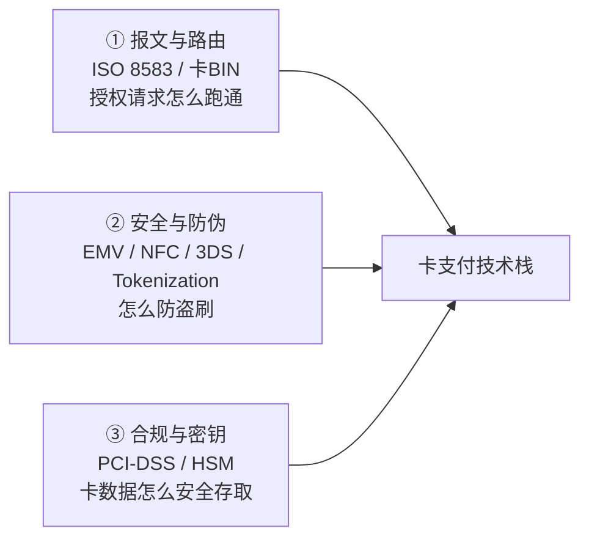
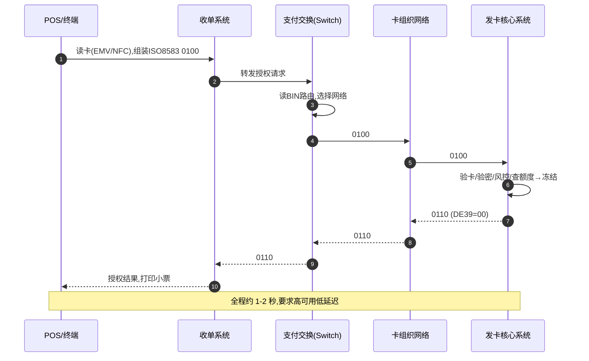
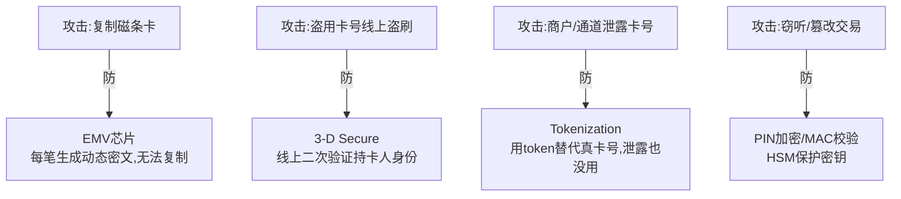
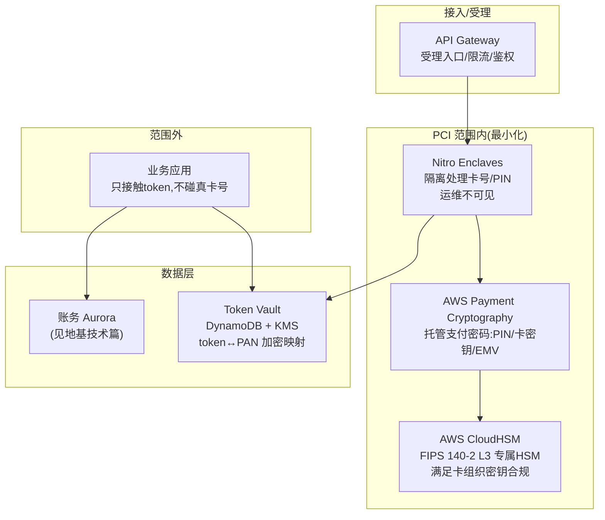
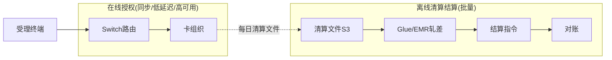

# 模块 1 · 传统支付（技术篇）：卡支付的技术实现与 AWS 方案

> **学习者**：AWS 技术架构师 · 支付小白
> **本篇目标**：把业务篇的四方模型翻译成工程。回答：刷卡瞬间在技术上发生了什么？ISO 8583 报文长什么样？EMV/Tokenization/3DS 各防什么攻击？卡数据的合规（PCI-DSS）和密钥（HSM）怎么落地？——并把每一项映射到具体 AWS 服务，这是你作为 AWS SA 的差异化价值。
> **前置**：业务篇 `01-cards-business.md`、地基技术篇 `00-foundation-tech.md`
> 标注：🔧 通用技术 · ☁️ AWS 映射 · ⚠️ 合规/安全坑点 · 🎯 与支付公司技术交流要点

---

## 开篇：卡支付技术栈的三大主题

作为架构师，把卡支付技术拆成三个你熟悉的维度：

这三块里，**③ 合规与密钥是你 AWS SA 最能发力的地方**——支付公司最头疼、AWS 服务最成体系。

---

## 第一性追问 1：ISO 8583——卡支付的"普通话"

### 1.1 它解决什么问题

🔧 模块0 说过"信息流靠报文"。卡支付的授权/清算报文，全球统一用 **ISO 8583** 标准。

📌 **ISO 8583**：金融交易卡报文的国际标准。定义了一笔卡交易的请求/响应消息格式——用"消息类型 + 位图(bitmap) + 数据域(data elements)"组织。

**为什么需要标准？** 回到 N×N 难题——几万家发卡行、几千家收单行要互通，必须说同一种语言。ISO 8583 就是这门语言。

### 1.2 报文结构（架构师理解级）

🔧 一条 ISO 8583 报文三部分：
- **MTI（Message Type Indicator）**：4 位数字，标识消息类型。例如 `0100`=授权请求、`0110`=授权响应、`0200`=金融请求、`0220`=清算上送。
- **Bitmap（位图）**：标识本报文带了哪些数据域（64 或 128 位，每位对应一个域是否存在）。
- **Data Elements（数据域）**：实际数据。常见域：
  - DE2 = 主账号(PAN，即卡号)
  - DE4 = 交易金额
  - DE11 = 系统跟踪号(STAN)
  - DE39 = 响应码（00=成功）
  - DE41 = 终端ID、DE42 = 商户号(MID)

💡 一笔授权 = 收单侧发 `0100`（带卡号/金额/商户号）→ 发卡行回 `0110`（带响应码 00/拒绝码）。

> ⚠️ ISO 8583 是上世纪的"紧凑二进制/定长"格式，字段短、可读性差。对比模块3 跨境的 ISO 20022（XML/结构化、字段丰富）——这是两代报文标准的差异。卡组织内部仍大量用 8583。

> 🎯 **交流要点**：能说出"授权走 0100/0110，清算走 0200/0220，DE39 响应码 00 是成功"，瞬间证明你接触过真实卡系统。

### 1.3 卡 BIN 路由

📌 **BIN（Bank Identification Number）**：卡号前 6-8 位，标识发卡行、卡组织、卡种（借记/信用）。

🔧 **路由的本质**：收单侧拿到卡号，看 BIN 就知道"这张卡属于哪个卡组织、哪家发卡行"，从而把授权请求**路由**到正确的网络和发卡行。这是收单系统的核心逻辑之一。

💡 智能路由还能做成本优化：一张卡可能同时支持多个网络（如银联+Visa 双标卡），收单方按费率/成功率选最优路由。

---

## 第一性追问 2：刷卡瞬间的技术时序

把业务篇的"授权"展开成技术视角：

🔧 **Switch（支付交换系统）**：收单/发卡核心里负责报文路由、协议转换、连接各网络的中枢。是卡系统里延迟和可用性最敏感的组件。

> 🎯 **交流要点**：授权链路是"在线、同步、低延迟、高可用"的（秒级响应），而清算结算是"离线、批量"的。两者技术架构完全不同——前者像实时交易系统，后者像大数据批处理。能区分这两套架构，是技术深度的体现。

---

## 第一性追问 3：安全与防伪——每种技术防什么攻击

卡支付的安全技术不是堆砌，每一项都对应一类攻击。第一性地理解：

### 3.1 EMV / 芯片卡 / NFC

📌 **EMV**（Europay/Mastercard/Visa 标准）：用**芯片**替代磁条。
- **防什么**：磁条卡信息是静态的，被读卡器一刷就能复制（侧录）。芯片卡每笔交易生成一个**动态密文（cryptogram）**，无法被复制重放。
- 🔧 **NFC / 闪付**：芯片卡的非接触形态（Tap to Pay），近场感应，提速线下受理。Apple Pay/Google Pay 在 NFC 之上加了 tokenization。

### 3.2 Tokenization（令牌化）—— 现代卡安全的核心

📌 **Tokenization**：用一个无意义的**令牌（token）**替代真实卡号（PAN）。Token 即使泄露也无法反推真卡号、且可限定用途。

🔧 **第一性价值**：让真实卡号**永远不出现在风险最高的环节**（商户系统、手机、网络）。
- **Apple Pay**：你的真卡号从不存在手机里，存的是设备专属 token（DPAN）。
- **虚拟卡**：本质就是为特定用途生成的 token。
- **网络令牌（Network Token）**：卡组织提供的 token 服务，订阅类支付即使卡换了 token 仍有效。

⚠️ Tokenization 大幅**缩小 PCI-DSS 合规范围**——商户不碰真卡号，合规负担骤降。这是它被广泛采用的重要商业动因。

☁️ **AWS 映射**：可用 **DynamoDB + KMS** 构建 token vault（令牌库，token↔真卡号映射加密存储）；真卡号的加解密在 **Nitro Enclaves / Payment Cryptography** 中进行，应用层永不接触明文 PAN。

### 3.3 3-D Secure (3DS)

📌 **3DS**：线上交易时，把持卡人**重定向到发卡行验证身份**（短信验证码、银行 App 生物识别）。"3 个域"=商户域、发卡域、互操作域。
- **防什么**：线上交易无法刷芯片，只能输卡号——盗用卡号即可盗刷。3DS 加一道"证明你是持卡人本人"。
- 🔧 **责任转移（liability shift）**：用了 3DS，若仍发生欺诈，**拒付损失从商户转移到发卡行**。这是商户启用 3DS 的核心动力。3DS 2.0 引入风险化验证（低风险免验证，减少流失）。

---

## 第一性追问 4：合规与密钥——你的 AWS 主场

### 4.1 PCI-DSS：卡数据的合规红线

📌 **PCI-DSS（Payment Card Industry Data Security Standard）**：卡组织强制的卡数据安全标准。核心要求：
- 卡号（PAN）加密存储，**绝不明文落库**。
- CVV（卡背三位码）**绝对不可存储**（连加密都不行）。
- 网络隔离、访问控制、审计日志、定期扫描。

⚠️ **合规范围（PCI Scope）= 接触卡数据的所有系统**。范围越大，审计越贵越痛。所以核心策略是**缩小 scope**：用 tokenization、外包卡数据处理，让自己的大部分系统"碰不到真卡号"。

### 4.2 HSM 与密钥管理

📌 **HSM（Hardware Security Module）**：金融级密钥的"硬件保险柜"。密钥在硬件内生成、使用，**永不以明文导出**，连运维都拿不到。用于 PIN 加密、卡数据加解密、EMV 密钥、报文 MAC 校验。

### 4.3 AWS 方案全景（差异化价值）

☁️ **这是你作为 AWS SA 最该烂熟的一张图**：

| 需求 | 通用做法 | ☁️ AWS 服务 |
|---|---|---|
| 支付专用密码运算(PIN/EMV/卡密钥) | 自建 HSM 集群 | **AWS Payment Cryptography**（托管,免运维HSM集群） |
| 通用密钥/合规HSM | HSM | **CloudHSM**（专属,FIPS 140-2 L3）/ **KMS**（通用） |
| 卡号/PIN 隔离处理 | 物理隔离区 | **Nitro Enclaves**（连运维都看不到明文） |
| 令牌库 | 加密DB | **DynamoDB + KMS** |
| 受理入口 | 网关 | **API Gateway**（限流/鉴权/WAF） |
| 审计 | 日志 | **CloudTrail / CloudWatch** |
| PCI 合规基础 | 自建合规 | AWS 已通过 PCI-DSS Level 1，**继承合规基线**，缩小自身审计范围 |

> 🎯 **交流要点（你的杀手锏）**：支付公司自建 HSM 集群成本高、运维痛、扩容难。你能给出 **Payment Cryptography（免自建HSM）+ Nitro Enclaves（隔离卡数据）+ KMS（密钥）+ 继承AWS PCI-DSS Level 1 合规** 的成体系方案，直接命中其最大痛点。这是 AWS SA 在支付领域最有说服力的切入点。

---

## 第一性追问 5：发卡与收单系统的技术形态

### 5.1 发卡核心 & 虚拟卡的 API 化

🔧 **发卡核心系统**：管理卡账户、额度、授权决策、账单。传统是银行的庞大主机系统。
📌 **现代趋势：发卡即服务（Issuing-as-a-Service）/ 虚拟卡 API**——把发卡能力变成 API，开发者几行代码就能发卡（Marqeta、Stripe Issuing）。
- 🔧 实现关键：实时授权 Webhook（每笔交易回调你的系统做决策）、token 管理、额度/限额规则引擎。
- ☁️ AWS：Lambda 处理授权 Webhook（低延迟）、DynamoDB 存卡/额度、Step Functions 编排发卡流程。

### 5.2 收单系统

🔧 **收单核心**：商户管理、受理路由(Switch)、清算文件处理、资金结算、对账。
- **在线授权**：低延迟同步链路（Switch 路由到卡组织）。
- **离线清算结算**：批量处理清算文件、轧差、生成结算指令、商户对账。
- ☁️ AWS：在线侧用 ECS/EKS + ElastiCache（低延迟）；离线侧用 S3 + Glue/EMR + Step Functions（批量清算对账，复用地基技术篇的对账架构）。

> 🎯 **交流要点**：能指出"收单系统是'在线授权(实时系统) + 离线清算(批处理)'双架构"，并分别给出 AWS 选型（实时:ECS/ElastiCache；批处理:Glue/Step Functions），展现你对支付系统架构分层的理解。

---

## 第一性追问 6：金融级非功能性在卡支付的体现

🔧 复用地基技术篇的 NFR，在卡支付的具体表现：
- **高可用**：授权链路要 99.99%+，断了商户没法收钱。多 AZ、无单点、降级策略（发卡行不可达时的 stand-in 代授权）。
- **低延迟**：授权要秒级返回，否则收银台卡顿。
- **幂等**：网络重试不能导致重复扣款（重复 0100 要靠 STAN/RRN 去重）。
- **强一致**：额度冻结、扣款必须准确。

☁️ 对应 AWS：多 AZ 部署、ElastiCache 降延迟、DynamoDB 幂等表（用 STAN/RRN 做幂等键）、Aurora 强一致账务。

---

## 本篇小结：模块1 技术要点（背下来）

1. **ISO 8583** 是卡报文标准（MTI+位图+数据域）；授权 0100/0110，清算 0200/0220，DE39=00 成功。
2. **卡 BIN 路由**：看卡号前 6-8 位决定路由到哪个网络/发卡行。
3. **授权是在线同步低延迟，清算结算是离线批量**——两套架构。
4. **安全四件套各防一类攻击**：EMV(防复制)、3DS(防线上盗刷+责任转移)、Tokenization(防卡号泄露+缩小PCI范围)、HSM(保护密钥)。
5. **PCI-DSS 核心是缩小 scope**：用 tokenization 让系统碰不到真卡号。
6. **AWS 杀手锏**：Payment Cryptography(免自建HSM) + Nitro Enclaves(隔离卡数据) + CloudHSM/KMS(密钥) + 继承 PCI-DSS L1 合规。
7. **发卡/收单都在 API 化、云化**：发卡即服务、收单的在线+离线双架构。

---

## 通向下一层

- **业务全景回顾** → `01-cards-business.md`
- **线上支付：支付网关怎么把卡支付搬到互联网** → 模块2 `02-epayment-tech-aws.md`
- **合规深入**：KYC/KYB/AML/PCI 体系化 → 模块6 横向专题

> 🎯 **此刻你已具备的技术对话能力**：能和支付公司架构师聊 ISO 8583 报文、授权/清算双架构、EMV/3DS/Tokenization 安全机制、PCI-DSS 合规策略，并把卡数据安全与密钥管理完整映射到 AWS 服务体系——这正是 AWS SA 进入支付领域最硬的敲门砖。
