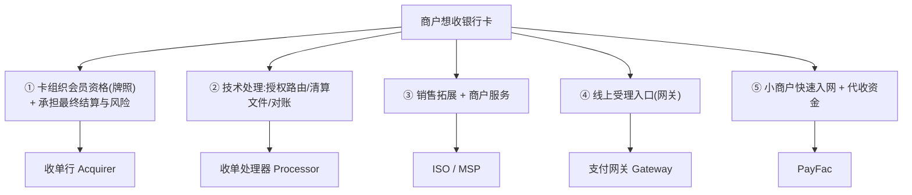
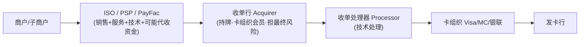
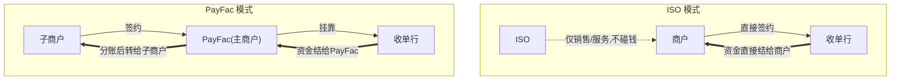
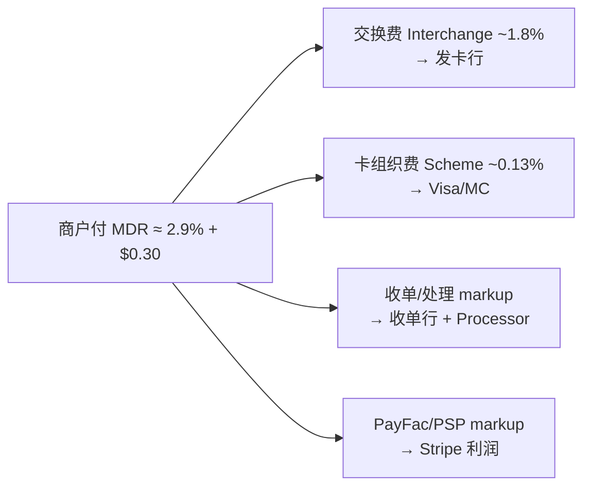
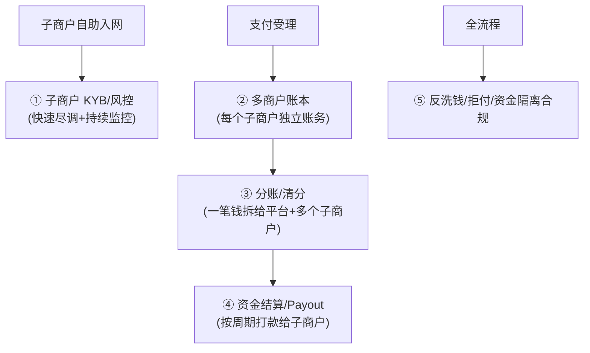
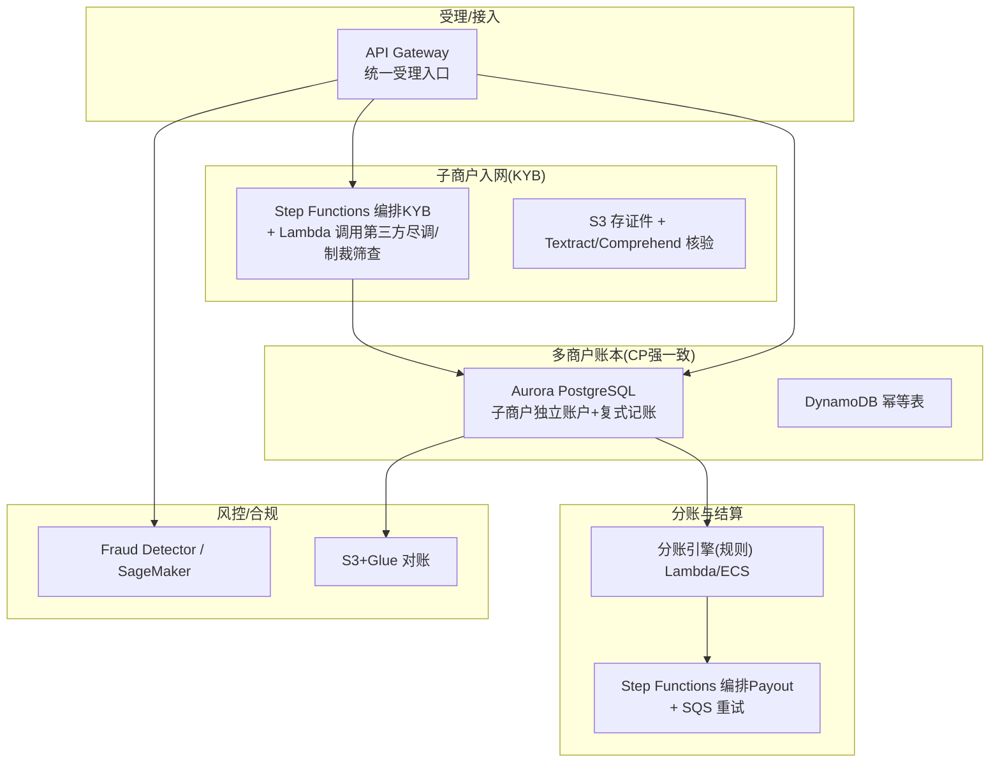
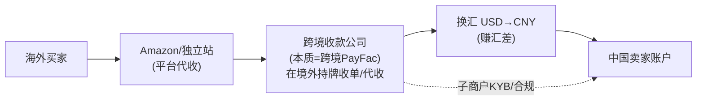

# 模块 1 深化 · 收单产业链：收单行 / Processor / ISO / PayFac / PSP

> **学习者**：AWS 技术架构师 · 支付小白
> **本篇目标**：把模块1 业务篇里"收单"那条线彻底拆开。回答：收单行、收单处理器、ISO、PayFac、PSP 到底各是什么、谁碰钱、谁担风险、怎么分润？为什么 Stripe/Square 是 PayFac、Adyen 是全栈？以及——PayFac 平台型架构在 AWS 上怎么搭，跨境收款公司（连连/PingPong/Airwallex）为什么本质是"跨境 PayFac"。
> **前置**：模块1 业务篇 `01-cards-business.md`、技术篇 `01-cards-tech-aws.md`
> 标注：📌 关键定义 · 💡 案例 · 🎯 交流要点 · ⚠️ 边界/合规 · ☁️ AWS

---

## 开篇：为什么会有这么多"收单"角色

模块1 说过：卡支付是"拉"支付，商户想"收卡"。但**接入卡组织需要 5 种能力，几乎没有一家全包**，于是产业链按能力分工——每个角色的存在，都是因为它独家补上了某一块能力。

📌 **商户收卡需要的 5 种能力**：

> 🎯 **交流要点**：理解"产业链分工源于能力分解"，你就不会被一堆术语绕晕——每个角色对应一种独家能力。

---

## 第一性追问 1：五个角色的精确定位

### 全景产业链图

### ① 收单行（Acquirer / Acquiring Bank）
- 📌 **定位**：卡组织的**正式会员（member）**，持收单牌照。**整条链上唯一能直接接入卡组织清算、并对资金结算负最终责任的角色。**
- **职责**：承接交易、把钱结算给商户、承担**最终风险**（商户跑路 + 消费者拒付时的兜底）。
- **第一性**：它卖的是"**牌照 + 风险承担能力**"。没有它，其他角色都接不进卡组织。
- 💡 案例：摩根大通 Chase Paymentech、Wells Fargo Merchant Services；中国：工行/银联商务等持牌机构。

### ② 收单处理器（Processor）
- 📌 **定位**：纯**技术处理**方——授权报文路由、清算文件生成、对账、风控引擎。
- **第一性**：卖的是"**技术处理规模与稳定性**"。很多收单行把技术外包给它。
- 💡 案例：Fiserv（原 First Data）、TSYS、Global Payments、FIS。

### ③ ISO（Independent Sales Organization）/ MSP（Mastercard 叫法）
- 📌 **定位**：**独立销售组织**，挂靠某家收单行，负责拓展商户、提供服务。
- ⚠️ **关键边界**：**ISO 不碰资金、不承担结算风险**。商户与收单行**直接签约**，ISO 只做"中介 + 服务 + 地推"。
- **第一性**：卖的是"**销售渠道与地推能力**"，赚佣金/分润（residual）。
- 💡 案例：传统美国线下收单大量靠 ISO 地推签商户。

### ④ PayFac（Payment Facilitator，支付便利商）—— 现代主流
- 📌 **定位**：自己在卡组织注册成一个**"主商户（master merchant）"**，下面挂一堆**"子商户（sub-merchant）"**；**代收资金**后再分给子商户。
- **第一性价值**：把小商户入网从"几天的银行审批"压缩到"**几分钟自助开通**"——子商户挂在 PayFac 的主商户号下，无需各自去银行单独签约。
- 💡 案例：**Stripe、Square、PayPal、Adyen for Platforms、Shopify Payments**。

### ⑤ PSP（Payment Service Provider）
- ⚠️ **这是宽泛的"伞形术语"，不是精确角色**。泛指"提供支付受理服务的机构"，在不同语境可能指 Gateway、PayFac、或其组合。
- 🎯 **交流杀手锏**：听到对方说 PSP，**追问一句**"你说的 PSP 是持收单牌照、还是只做网关、还是 PayFac 代收资金？"——立刻显出你懂行。

---

## 第一性追问 2：ISO vs PayFac —— 最关键的分水岭

很多人混淆 ISO 和 PayFac，但它们有**本质区别**，钥匙是两个问题：**钱过不过你的手？风险你担不担？**

| 维度 | ISO | PayFac |
|---|---|---|
| 商户与谁签约 | 直接与**收单行**签 | 与 **PayFac** 签（成为子商户） |
| 资金是否经手 | ❌ 不经手 | ✅ **代收后分给子商户** |
| 风险承担 | ❌ 不担（收单行担） | ✅ **承担子商户风险** |
| 入网速度 | 慢（银行逐个审批） | **快（秒级，挂主商户号下）** |
| 盈利 | residual（剩余分润） | markup（费率差价） |
| 监管要求 | 较轻 | 重（要做子商户 KYB、反洗钱、资金隔离） |

> 🎯 **交流要点**：能说"PayFac 用'主商户-子商户'结构换取入网速度，代价是自己承担子商户风险和合规"——直击 PayFac 商业模式的本质权衡。

---

## 第一性追问 3：分润模式——MDR 在收单侧怎么切

以美国线上典型 **Stripe 2.9% + $0.30** 为例，拆解流向（示意值，随卡种/地区浮动）：

### 两种定价模式（高频考点）

| 模式 | 含义 | 谁用 | 商户视角 |
|---|---|---|---|
| **Flat rate（统一费率）** | 不管底层成本，统一收如 2.9%+30¢ | Stripe/Square | 简单透明，小商户爱；PayFac 赚成本与报价的差 |
| **Interchange++（IC++）** | 成本透明：交换费+卡组织费**实报实销**，只加固定 markup | Adyen | 大商户爱，省钱且议价透明 |

### ISO 的分润：Residual（剩余分润）
📌 **Residual**：ISO 拓来的商户，每笔交易收单行分给 ISO 一定比例。**只要商户还在交易，ISO 持续躺赚**——这是传统美国收单地推的核心商业模式，类似 SaaS 的经常性收入。

> 💡 **三种盈利模式对比**：ISO 赚 residual（持续分润）、PayFac 赚 markup（费率差价）、收单行赚 处理费+承担风险的对价。

---

## 第一性追问 4：真实案例对照

| 公司 | 角色定位 | 定价 | 特点 |
|---|---|---|---|
| **Stripe** | PayFac + Gateway + Processor 一体 | Flat 2.9%+30¢ | 开发者友好，API 化，小商户秒入网 |
| **Square** | PayFac | 2.6%+10¢(线下) | 主打线下小微，自带硬件 |
| **Adyen** | **全栈**：自己持收单牌照(Acquirer) | IC++ | 单一平台覆盖全球大商户(Uber/Spotify/Meta) |
| **PayPal** | PayFac + 钱包(闭环) | Flat | 账户体系 + 受理一体 |
| **传统美国 ISO** | ISO（挂靠 Fiserv/Chase） | 赚 residual | 地推签商户，持续分润 |
| **Marqeta** | 发卡侧 Processor(Issuing) | — | 对照:这是发卡侧,非收单 |
| **中国：银联商务/拉卡拉/通联** | 持牌收单机构 | — | 持央行"银行卡收单"牌照 |
| **中国：收钱吧/哆啦宝** | 聚合支付(≈ISO+多通道聚合) | 服务费/分润 | 聚合多通道，⚠️不得碰清算资金 |

> ⚠️ **中国特殊性（与支付公司交流必知）**：
> - 2018"**断直连**"后，第三方支付**不能直连银行**，必须经 **网联/银联** 清算。
> - 收单需持央行**支付业务许可证（银行卡收单类）**。
> - **聚合支付**（收钱吧等）本质是"ISO 角色 + 多通道聚合"，**不得沉淀/清算资金**——碰了就是"**二清（二次清算）**"，属违规红线。
> - 🎯 和中国支付公司聊，一定要分清"持牌收单机构"vs"聚合支付服务商"，以及"一清 vs 二清"。

---

## 第一性追问 5：PayFac 平台型架构与 AWS（你的主场）

PayFac 是现代收单的主流形态，也是**平台/SaaS 公司最爱的模式**（电商平台、SaaS 都想"嵌入支付"）。它的技术架构对你 AWS SA 极有价值。

### 5.1 PayFac 平台要解决的技术问题

| PayFac 核心能力 | 技术挑战 |
|---|---|
| **子商户 KYB 入网** | 自动化尽调、文档核验、持续风险监控 |
| **多商户账本** | 每个子商户独立余额、待结算、手续费分录（复式记账，见地基技术篇） |
| **分账/清分 Split** | 一笔交易按规则拆给平台抽佣 + 多个子商户 |
| **资金结算 Payout** | 按 T+N 周期把钱打给子商户，处理失败重试、合规 |
| **资金隔离** | 子商户的钱与平台自有资金严格隔离（合规红线） |

### 5.2 AWS 参考架构

| PayFac 能力 | ☁️ AWS 服务 |
|---|---|
| 受理入口 | API Gateway + WAF |
| 子商户 KYB 编排 | Step Functions + Lambda（调用尽调/制裁API）、S3+Textract（证件核验） |
| 多商户账本 | Aurora（强一致复式记账）+ DynamoDB（幂等） |
| 分账/清分 | Lambda/ECS 规则引擎 |
| 资金结算 Payout | Step Functions（编排）+ SQS（失败重试）+ EventBridge（调度） |
| 风控反欺诈 | Fraud Detector / SageMaker |
| 对账 | S3 + Glue/Athena（复用地基技术篇对账架构） |
| 密钥/卡数据 | Payment Cryptography / Nitro Enclaves / KMS（复用模块1技术篇） |

> 🎯 **交流杀手锏**：很多平台/SaaS 公司想做 PayFac 但卡在"多商户账本+分账+KYB+合规"的工程复杂度。你能给出 **Aurora多商户账本 + Step Functions编排KYB/Payout + 分账引擎 + Glue对账 + Payment Cryptography合规** 的完整 AWS 蓝图——这是 AWS SA 切入支付平台客户的高价值场景。

---

## 第一性追问 6：跨境收款公司 = 跨境 PayFac（直通你的目标）

这是本篇与你**最终目标（与跨境支付公司深聊）**的关键串联。

📌 **连连国际 / PingPong / Airwallex / Payoneer 的本质 = "跨境 PayFac/收单 + 换汇"**：

**它们和国内 PayFac 的相同与不同：**

| 维度 | 国内 PayFac (Stripe) | 跨境收款公司 (连连/PingPong) |
|---|---|---|
| 主商户-子商户结构 | ✅ | ✅（中国卖家=子商户） |
| 代收资金后分账 | ✅ | ✅（境外收、境内付） |
| 子商户 KYB | ✅ | ✅（+跨境合规、外管局申报） |
| 额外能力 | — | **多币种账户 + 换汇（汇差是核心收益）+ 跨境合规牌照矩阵** |
| 盈利 | markup | **提现费 + 汇差 + 浮存**（见跨境报告） |

> 🎯 **这就是为什么本篇对你的目标至关重要**：跨境收款公司 = PayFac 模型 + 跨境换汇 + 多国牌照。理解了 PayFac 的"主子商户、代收分账、KYB、资金隔离"，再叠加模块3 的"代理行/换汇/结售汇/外管局合规"，你就能和连连/PingPong/Airwallex 的技术与业务高管**平等对话**。详见 `跨境支付深度研究报告.md` 与模块3。

---

## 本篇小结（背下来）

1. **收单产业链按能力分工**：收单行(牌照+风险)、Processor(技术)、ISO(销售)、PayFac(代收+快速入网)、Gateway(线上入口)、PSP(伞形词需追问)。
2. **ISO vs PayFac 分水岭 = 钱过不过手 + 风险担不担**：ISO 不碰钱不担风险赚 residual；PayFac 代收资金担风险赚 markup。
3. **定价两模式**：Flat rate（简单，小商户）vs IC++（透明，大商户）。
4. **案例**：Stripe/Square/PayPal=PayFac；Adyen=全栈持牌；传统 ISO 赚 residual。
5. **中国红线**：断直连、必须经网联/银联清算、持收单牌照、聚合支付不得二清。
6. **PayFac 平台技术 = 多商户账本+分账+KYB+Payout+资金隔离**，AWS 有完整蓝图（Aurora/Step Functions/分账引擎/Glue/Payment Cryptography）。
7. **跨境收款公司 = 跨境 PayFac + 换汇 + 多国牌照**——这是通向你最终目标的关键认知。

---

## 通向下一层

- **回到模块1主线** → `01-cards-business.md` / `01-cards-tech-aws.md`
- **线上受理入口（支付网关）与第三方支付** → 模块2 `02-epayment-business.md`
- **跨境深入** → `跨境支付深度研究报告.md` 与模块3（代理行/换汇/合规）
- **分账/账务/对账的工程细节** → 模块6 横向专题

> 🎯 **此刻你已具备的对话能力**：能精确区分收单产业链各角色的定位/分润/风险，识别一家支付公司在产业链中的位置，并理解跨境收款公司的 PayFac 本质——和跨境支付公司交流的核心认知已就位。
