# 模块 1 深化 · 收单产业链：收单行 / Processor / ISO / PayFac / PSP

> **学习者**：AWS 技术架构师 · 支付小白
> **本篇目标**：把模块1 业务篇里"收单"那条线彻底拆开。回答：收单行、收单处理器、ISO、PayFac、PSP 到底各是什么、谁碰钱、谁担风险、怎么分润？为什么 Stripe/Square 是 PayFac、Adyen 是全栈？以及——PayFac 平台型架构在 AWS 上怎么搭，跨境收款公司（连连/PingPong/Airwallex）为什么本质是"跨境 PayFac"。
> **前置**：模块1 业务篇 `01-cards-business.md`、技术篇 `01-cards-tech-aws.md`
> 标注：📌 关键定义 · 💡 案例 · 🎯 交流要点 · ⚠️ 边界/合规 · ☁️ AWS

---

## 开篇：为什么会有这么多"收单"角色

模块1 说过：卡支付是"拉"支付，商户想"收卡"。但**接入卡组织需要 5 种能力，几乎没有一家全包**，于是产业链按能力分工——每个角色的存在，都是因为它独家补上了某一块能力。

📌 **商户收卡需要的 5 种能力**：

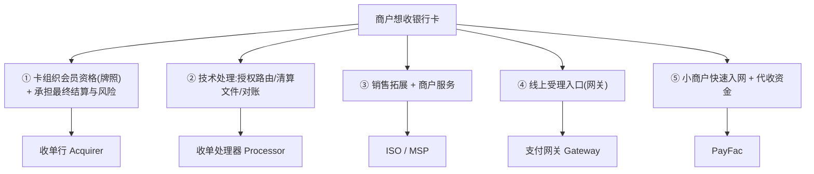

> 🎯 **交流要点**：理解"产业链分工源于能力分解"，你就不会被一堆术语绕晕——每个角色对应一种独家能力。

---

## 第一性追问 1：五个角色的精确定位

### 全景产业链图

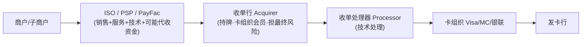

### ① 收单行（Acquirer / Acquiring Bank）
- 📌 **定位**：卡组织的**正式会员（member）**，持收单牌照。**整条链上唯一能直接接入卡组织清算、并对资金结算负最终责任的角色。**
- **职责**：承接交易、把钱结算给商户、承担**最终风险**（商户跑路 + 消费者拒付时的兜底）。
- **第一性**：它卖的是"**牌照 + 风险承担能力**"。没有它，其他角色都接不进卡组织。
- 💡 案例：摩根大通 Chase Paymentech、Wells Fargo Merchant Services；中国：工行/银联商务等持牌机构。

### ② 收单处理器（Processor）
- 📌 **定位**：纯**技术处理**方——授权报文路由、清算文件生成、对账、风控引擎。
- **第一性**：卖的是"**技术处理规模与稳定性**"。很多收单行把技术外包给它。
- 💡 案例：Fiserv（原 First Data）、TSYS、Global Payments、FIS。

### ③ ISO（Independent Sales Organization）/ MSP（Mastercard 叫法）
- 📌 **定位**：**独立销售组织**，挂靠某家收单行，负责拓展商户、提供服务。
- ⚠️ **关键边界**：**ISO 不碰资金、不承担结算风险**。商户与收单行**直接签约**，ISO 只做"中介 + 服务 + 地推"。
- **第一性**：卖的是"**销售渠道与地推能力**"，赚佣金/分润（residual）。
- 💡 案例：传统美国线下收单大量靠 ISO 地推签商户。

### ④ PayFac（Payment Facilitator，支付便利商）—— 现代主流
- 📌 **定位**：自己在卡组织注册成一个**"主商户（master merchant）"**，下面挂一堆**"子商户（sub-merchant）"**；**代收资金**后再分给子商户。
- **第一性价值**：把小商户入网从"几天的银行审批"压缩到"**几分钟自助开通**"——子商户挂在 PayFac 的主商户号下，无需各自去银行单独签约。
- 💡 案例：**Stripe、Square、PayPal、Adyen for Platforms、Shopify Payments**。

### ⑤ PSP（Payment Service Provider）
- ⚠️ **这是宽泛的"伞形术语"，不是精确角色**。泛指"提供支付受理服务的机构"，在不同语境可能指 Gateway、PayFac、或其组合。
- 🎯 **交流杀手锏**：听到对方说 PSP，**追问一句**"你说的 PSP 是持收单牌照、还是只做网关、还是 PayFac 代收资金？"——立刻显出你懂行。

---

## 第一性追问 1.5：收单处理器（Processor）深入——牌照、玩家、商业模式

Processor 是产业链里工程含量最高、却最容易被外行忽视的角色。这里专门展开（含中美产业结构差异）。

### A. Processor 需要牌照吗？—— 钥匙是"碰不碰资金清算"

📌 **核心结论**：牌照管的是"**谁能经营支付业务（碰钱/对接清算）**"，而 Processor 卖的是"**技术能力**"——两者是不同的东西。

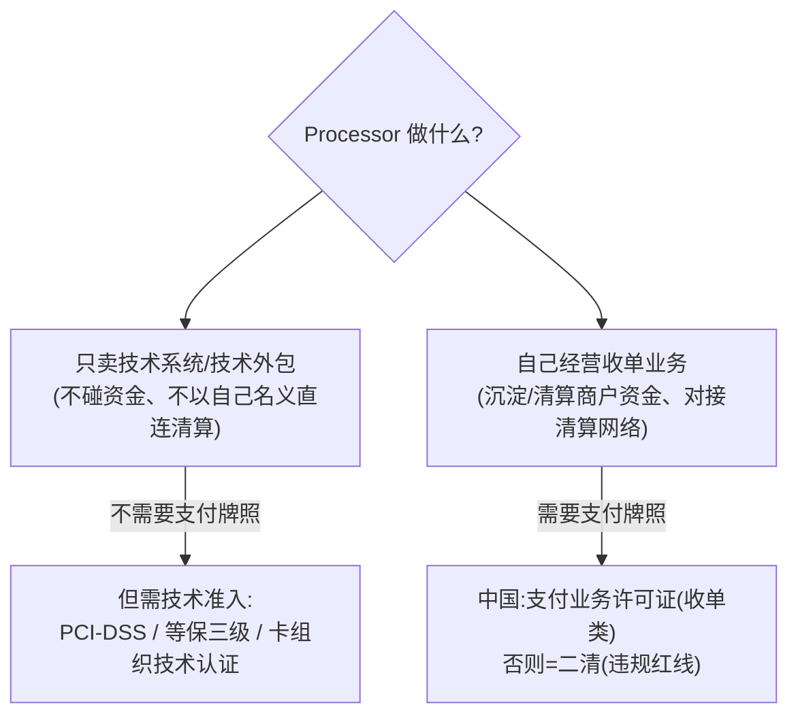

- **纯技术处理（卖系统、做技术外包）→ 不需要"支付牌照"**：不碰资金、不以自己名义经营支付业务。
- **但不是无监管**：需满足 **PCI-DSS（卡数据安全）+ 网络安全等级保护（等保三级）+ 卡组织技术认证/接入测试**——这是"技术准入"而非"业务牌照"。
- ⚠️ **分水岭 = 二清红线**：一旦它**沉淀/清算商户资金、以自己名义对接清算网络**，性质就变了，必须持收单牌照。只能做技术，碰钱就要牌照。

> 🎯 **交流要点**：听到"我们想做 processor 业务"，第一句先问"**你碰不碰资金清算？**"——碰=持牌经营，不碰=技术服务商。这是判断对方法律性质的钥匙。

### B. 中国玩家：产业结构与美国不同

⚠️ **关键差异**：美国有 Fiserv/TSYS 这种"纯第三方 processor 卖给银行"的成熟独立赛道；**中国是"持牌收单机构自营系统 + 软件商供货"的混合结构，缺独立第三方 processor 巨头**。

| 类型 | 代表 | 说明 |
|---|---|---|
| **持牌收单机构（自营系统）** | 银联商务、拉卡拉、随行付、通联、银盛、嘉联 | **既持牌经营收单、又自运营处理系统**——中国的 processor 角色多被持牌机构自己吸收 |
| **国家清算/转接** | **中国银联、网联** | 国家级清算转接基础设施（非商业 processor），断直连后所有交易必经 |
| **金融科技软件商** | 长亮科技、神州信息、宇信科技、高阳捷迅等 | **卖收单/支付系统给银行和机构**——最接近美国"独立 processor"的"卖系统"角色，但它们是**软件供应商，不经营支付** |
| **聚合技术服务商** | 收钱吧、哆啦宝等 | 聚合 + 技术，⚠️不得碰清算资金（否则二清） |

> 📌 **第一性洞察**：牌照管制下，中国收单业务高度集中在持牌机构手里、它们倾向自建系统；"纯卖系统"的活由金融科技软件公司承接。所以中国的 processor 角色被"拆"成了"**持牌机构自营 + 软件商供货**"两块，没有 Fiserv 式的独立巨头。

### C. 系统谁运营？卖给收单行吗？—— 三种商业模式

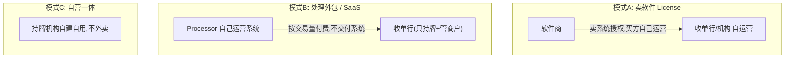

| 模式 | 谁运营系统 | 卖给收单行吗 | 代表 |
|---|---|---|---|
| **A 卖软件授权** | 买方（收单行/机构）自己运营 | ✅ 卖 License（一次性+维护费） | 中国软件商（长亮/神州信息） |
| **B 处理外包/SaaS** | **Processor 自己运营**，收单行把处理托管出去 | ✅ 卖服务（按交易笔数/金额计费），**不卖系统** | **Fiserv/TSYS/FIS**（美国主流）；现代趋势 |
| **C 自营一体** | 持牌机构自建自用 | ❌ 不对外卖 | 银联商务、拉卡拉等 |

> 💡 回答"卖给收单行吗"：**模式A 卖系统本身（License）；模式B 卖处理服务（SaaS/BPO，不交付系统，按量付费）；模式C 不卖自用。**

### D. ☁️ AWS 视角：Processor 本质是多租户高并发交易平台

模式B 的处理外包 processor，本质是**"多租户的高并发、低延迟交易处理平台 + 批量清算"**——这正是云架构的典型场景。

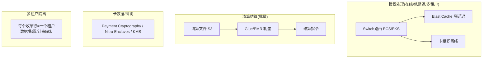

| Processor 能力 | ☁️ AWS |
|---|---|
| 授权链路(低延迟高可用) | ECS/EKS + ElastiCache + 多AZ |
| 多租户隔离 | 账户/VPC/数据分区隔离 + 按租户计费 |
| 清算批处理 | S3 + Glue/EMR + Step Functions |
| 卡数据/密钥合规 | Payment Cryptography / Nitro Enclaves / KMS（继承 PCI-DSS L1） |
| 对账 | S3 + Glue/Athena |

> 🎯 **交流杀手锏**：想做 processor 或想把存量 processor 系统上云的持牌机构/软件商，最关心"多租户隔离 + 授权低延迟 + 清算批处理 + 卡数据合规"。你能给出这套 AWS 蓝图，是 AWS SA 切入收单技术服务商客户的高价值切入点。

> ⚠️ **数据可信度**：本节中国公司名单与定位属 🔧 行业公知梳理，**未逐家核实最新牌照状态**。若用于正式合作判断，请在央行官网核实该公司《支付业务许可证》的最新状态与业务范围。

---

## 第一性追问 1.6：收单"系统"的逻辑分层——它包含网关和处理器吗？

前面讲的是**角色（谁来做）**。这里换一个视角：**系统（由什么构成）**。这是很多人没理清的地方——把"角色"和"系统组件"混为一谈。

### A. 从"收单要完成什么"推出需要哪些组件

收单的本职 = **让商户受理一笔卡支付，并最终把钱拿到手**。这条全流程决定了它需要的系统组件：

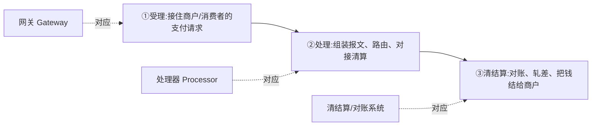

📌 **结论：从逻辑功能看，一个完整的"收单系统" = 网关 + 处理器 + 清结算/对账 + 商户管理 + 风控。** 网关和处理器确实是它的两个核心子环节。

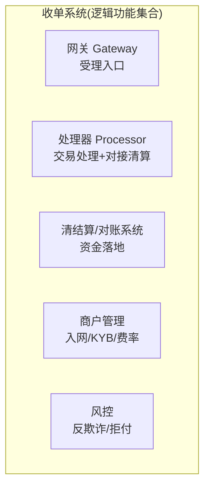

### B. 网关 vs 处理器的边界（关键区分）

| | **网关 Gateway** | **处理器 Processor** |
|---|---|---|
| 解决什么 | **受理入口**：接住线上支付请求、加密卡数据、初步路由 | **交易处理**：组装 ISO 8583 报文、对接卡组织/发卡行、生成清算文件 |
| 类比 | 商户的"线上 POS / 大门" | 后端的"交易引擎 / 发动机" |
| 位置 | 链路**最前端**(靠商户) | 链路**中后段**(靠卡组织) |
| 对接清算 | 一般不直接对接 | **对接卡组织清算网络** |

一笔线上交易的组件流向（对应模块1技术篇时序）：

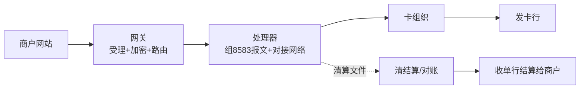

### C. 关键认知：功能层 ≠ 主体边界

⚠️ **逻辑上"收单系统包含网关+处理器"，不代表它们由同一家公司提供。** 功能层是可拆分的，现实有三种组合：

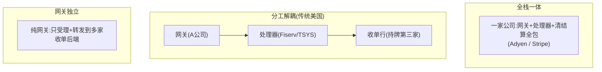

| 组合 | 网关 | 处理器 | 典型 |
|---|---|---|---|
| **全栈一体** | 自有 | 自有 | Adyen、Stripe |
| **分工解耦** | A 公司 | Fiserv/TSYS | 传统美国(网关/处理器/收单行各不同公司) |
| **网关独立** | 独立网关 | 对接多家后端 | 早期网关只做受理+转发 |

> 🎯 **交流要点**：别问"你们有没有收单系统"，而要问"**你们的网关、处理、清结算是自建还是用第三方？哪些环节自己持牌？**"——这才问到真实架构和产业链位置。
>
> 💡 **与模块2的衔接**：网关在总纲里主要放"模块2 电子支付(线上受理入口)"讲——这不矛盾：**网关既是收单系统的前端组件，又是互联网时代收单的标志性产物**。所以它同时属于"收单系统逻辑组件"和"模块2电子支付主题"。

> ☁️ **AWS 视角**：一个全栈收单系统在 AWS 上 = 网关(API Gateway/ALB+WAF) + 处理器(ECS/EKS+ElastiCache 低延迟授权) + 清结算(S3+Glue/EMR 批处理) + 商户管理(Aurora) + 风控(Fraud Detector) + 卡数据合规(Payment Cryptography/Nitro Enclaves)。这张分层图正好对应一套云原生收单平台的参考架构。

---

## 第一性追问 1.7：各环节如何交互？API / 文件 / 数据库的选型逻辑

系统组件之间怎么"连"？第一性原则一句话：**越靠近用户的环节越要"实时"(用 API)，越靠后台的环节越能"批量"(用文件)。** 这直接源于模块1的"授权在线同步、清算结算离线批量"。

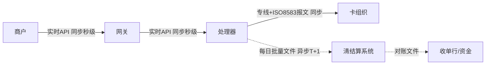

### A. Gateway ↔ Processor：**API 为主**
- **为什么**：授权是在线同步，消费者在收银台等结果，必须秒级返回——**不可能用文件**(文件是异步批量的)。
- **形式**：现代用 **HTTPS/REST(JSON)** 或 gRPC；传统/银行间用 **专有 TCP 长连接 + ISO 8583 二进制报文**(性能高、长连复用)。
- 🔧 关键点：**长连接+连接池**(避免每笔握手)、**同步超时控制**(超时要走"冲正"撤销，防单边账)、双向证书+报文MAC签名。

### B. Processor ↔ 卡组织：**专线 + ISO 8583 报文(实时)**
- 走卡组织专网(Visa/MC专网、银联CUPS)，TCP长连、8583二进制报文。
- ⚠️ 这是处理器的核心壁垒：接入卡组织需通过认证、铺专线、做容灾。

### C. Processor ↔ 清结算：**文件(批量)为主**
- **为什么**：清算结算是离线、批量、日终(T+1)。卡组织每日下发**清算文件**(当天全部交易明细)，处理器据此轧差、对账、生成结算指令。
- **形式**：定长/CSV/XML 清算文件，通过 **SFTP/专用文件通道** 传输；跑批 job 解析入库轧差。
- 🔧 趋势：实时清算(RTP/网联实时)在往"准实时接口"演进，但传统卡清算仍以文件批量为主。

### D. 数据库：内部共享，不是跨主体交互
⚠️ **关键澄清**：数据库用于**同一主体/同一系统内部**的状态共享，**不是跨公司的标准交互方式**。

```mermaid
flowchart TB
    subgraph 内部["同一主体内部:数据库共享状态"]
        A["授权模块"] --> DB[(交易库)]
        B["清算模块"] --> DB
        C["对账模块"] --> DB
    end
    subgraph 跨主体["跨主体/跨公司:用API或文件"]
        X["A公司"] -->|API(实时)/文件(批量)| Y["B公司"]
    end
```
- 跨主体几乎**不直接共享数据库**(安全/解耦/责任边界)——用 API 或文件。
- 🎯 若一家说"和上游直连数据库"，通常意味着**同体系深度绑定**(如银行与其全资科技子公司)或架构耦合信号。

### 交互方式总结
| 交互 | 方式 | 为什么 | 实时性 |
|---|---|---|---|
| Gateway ↔ Processor | **API**(REST/TCP长连+8583) | 用户在等结果 | 同步秒级 |
| Processor ↔ 卡组织 | **专线+ISO 8583** | 接入清算网络 | 同步秒级 |
| Processor ↔ 清结算 | **文件**(SFTP批量) | 日终批量轧差 | 异步T+1 |
| 系统内部各模块 | **数据库** | 同主体状态共享 | — |

### 中国供应商格局（🔧 行业公知梳理，未逐家核实）
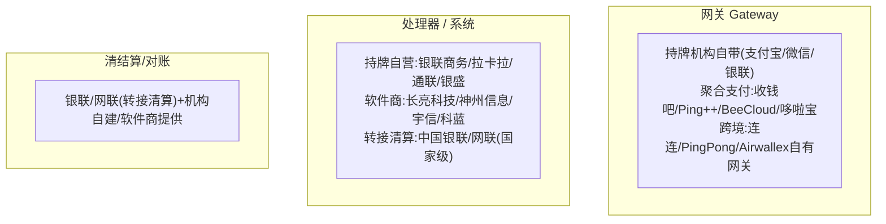

| 环节 | 中国典型玩家 | 说明 |
|---|---|---|
| **网关** | 持牌机构自带(支付宝/微信/银联)；聚合支付(收钱吧/Ping++/BeeCloud)；跨境(连连/PingPong/Airwallex) | 聚合支付≈网关+多通道,⚠️不碰清算 |
| **处理器/系统** | 持牌自营(银联商务/拉卡拉/通联/银盛)；软件商(长亮科技/神州信息/宇信/科蓝) | 软件商"卖系统",持牌机构"自营运营" |
| **转接清算** | 中国银联、网联清算 | 国家级,断直连后必经 |

> 📌 **中美对比**：美国网关/处理器/收单行高度分工、各有独立巨头(网关Authorize.Net、处理器Fiserv/TSYS)；中国牌照集中+持牌机构倾向自建全栈，纯独立处理器赛道弱，"卖系统"由金融科技软件商承接，"清算转接"被银联/网联国家队垄断。
>
> 🎯 **交流杀手锏(问中国支付公司三句见深度)**：① 网关/处理是自研还是用软件商(长亮/神州信息)系统？ ② 授权链路和清算文件分别用API还是文件交互？ ③ 清算走银联还是网联，自己持什么牌照？

---

## 第一性追问 1.8：网关路由——基于什么分发交易？

网关不只是"转发"，它的核心智能是**路由决策**：为每笔交易在多个可用通道中选一条最优路径。

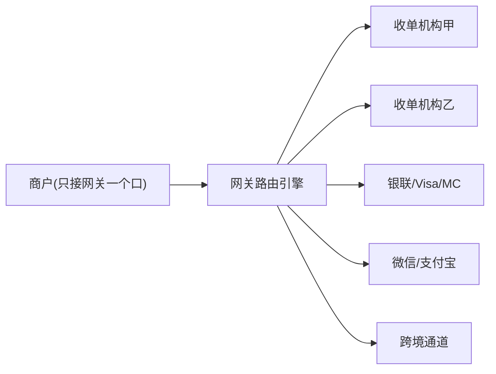

### 先厘清："多条通道"到底从哪来？（两个层次，别混淆）

⚠️ 一个常见困惑：**"多条通道满足硬性匹配"成立与否，取决于做路由的主体站在哪一层。** 上面这张图是**网关/聚合层**的语境，但单个收单机构内部也可能有多通道，来源不同。

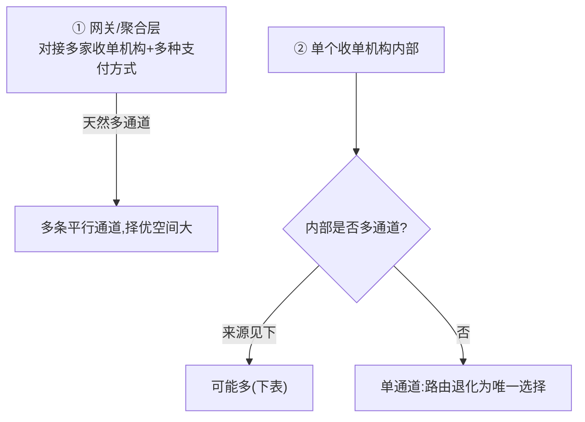

**第①层 网关/聚合层**：本身对接多家收单机构/支付方式，一笔交易天然有多条候选——这是上图和本节路由策略的主语境。

**第②层 单个收单机构内部**：就算只看一家收单行，内部多通道来自这些来源：

| 来源 | 说明 | 例子 |
|---|---|---|
| **① 一卡多清算网络(最常见)** | 一张卡常支持多个网络,收单方可选走哪个 | 双标卡(银联+Visa)→走银联 or Visa清算,费率不同；**美国借记卡受 Durbin 法案强制支持≥2个借记网络** |
| **② 多上游/多赞助行** | 收单机构(尤其PayFac/PSP)同时对接多家上游收单行 | 对接甲、乙两家上游,同笔卡交易两边都能清 |
| **③ 多MID/多费率档** | 同一商户配多个商户号,对应不同费率/风控 | 大额走MID-A,小额走MID-B |
| **④ 主备冗余链路** | 同一通道有主备物理链路 | 主超时切备用(failover) |

> 💡 **重点：美国 Durbin Amendment** 强制每张借记卡至少支持两个不相关借记网络(如 Visa/MC + 本地 STAR/NYCE/Pulse),**立法直接制造"单卡多通道",就是为了让收单方/商户择优路由压成本**——这是 least-cost routing 在美国合法且普遍的法理根基。
>
> 📌 **反过来**：若一家小型收单机构对某笔交易确实只有一条路,路由就退化为"硬性匹配后唯一选择",无择优空间——**这正是大型网关/聚合商'对接多家'的价值由来:把'无选择'变成'有选择'。多通道本身就是网关的核心竞争力。**

📌 **路由依据 = 两大类：硬性匹配(必须满足) + 择优(多目标优化)。** 下面的"多条通道"即指上述任一层次产生的候选集。

### 第一类：硬性匹配（过滤出"能跑通"的候选通道）
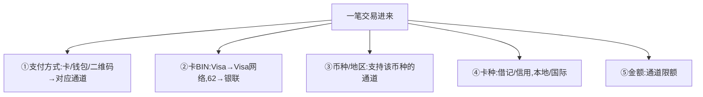

| 依据 | 例子 |
|---|---|
| 支付方式 | 用户选微信→微信通道 |
| 卡 BIN(模块1技术篇) | 62开头→银联，4开头→Visa |
| 币种/地区 | EUR交易→支持欧元的收单行 |
| 卡种 | 本地借记卡走本地清算(更便宜) |
| 金额 | 大额走A,小额走B |

### 第二类：择优路由（多条都能跑通时选最佳——网关的"智能"）
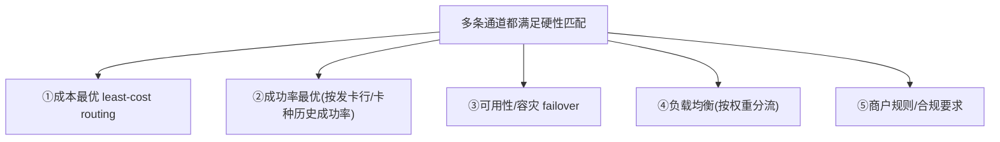

| 优化目标 | 第一性动机 |
|---|---|
| **成本最优(least-cost routing)** | 同笔交易不同通道费率/汇率不同,选最低 |
| **成功率最优** | 不同发卡行对不同通道授权成功率不同,动态选高成功率 |
| **可用性/容灾(failover)** | 通道会宕机/超时,主通道失败自动切备用 |
| **负载均衡** | 避免单通道过载,按权重分流(70%/30%) |
| **商户规则/合规** | 商户偏好或某地区必须走某持牌通道 |

> 💡 **least-cost routing 的威力**：欧洲很多借记卡可走本地方案而非国际Visa/MC网络,费率低得多。聪明网关优先路由本地通道省钱——是Adyen等全栈玩家的核心竞争力。

### 实战案例：一笔跨境卡支付的路由
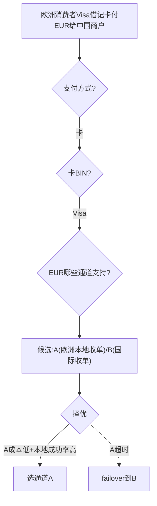

### 技术实现
- 🔧 **规则引擎驱动**：路由规则配在规则引擎(条件→动作),动态调整无需改代码。
- 🔧 **决策数据**：BIN库、通道配置表(费率/限额/币种)、实时成功率统计、通道健康状态。
- 🔧 **执行链路**：硬性匹配(过滤候选)→择优排序(成本/成功率打分)→选定→失败failover。
- ☁️ **AWS**：路由引擎用 Lambda/ECS 跑规则 + DynamoDB/ElastiCache 存通道配置与实时成功率(低延迟读) + BIN库查询；规则用 AppConfig 热更新。

> 🎯 **交流要点**：问"你们的路由是静态规则还是动态智能路由?支持 least-cost routing 和基于成功率的动态切换吗?"——说明你懂网关核心价值不在"转发"而在"路由决策"。

---

## 第一性追问 2：ISO vs PayFac —— 最关键的分水岭

很多人混淆 ISO 和 PayFac，但它们有**本质区别**，钥匙是两个问题：**钱过不过你的手？风险你担不担？**

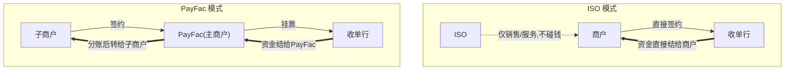

| 维度 | ISO | PayFac |
|---|---|---|
| 商户与谁签约 | 直接与**收单行**签 | 与 **PayFac** 签（成为子商户） |
| 资金是否经手 | ❌ 不经手 | ✅ **代收后分给子商户** |
| 风险承担 | ❌ 不担（收单行担） | ✅ **承担子商户风险** |
| 入网速度 | 慢（银行逐个审批） | **快（秒级，挂主商户号下）** |
| 盈利 | residual（剩余分润） | markup（费率差价） |
| 监管要求 | 较轻 | 重（要做子商户 KYB、反洗钱、资金隔离） |

> 🎯 **交流要点**：能说"PayFac 用'主商户-子商户'结构换取入网速度，代价是自己承担子商户风险和合规"——直击 PayFac 商业模式的本质权衡。

---

## 第一性追问 3：分润模式——MDR 在收单侧怎么切

以美国线上典型 **Stripe 2.9% + $0.30** 为例，拆解流向（示意值，随卡种/地区浮动）：

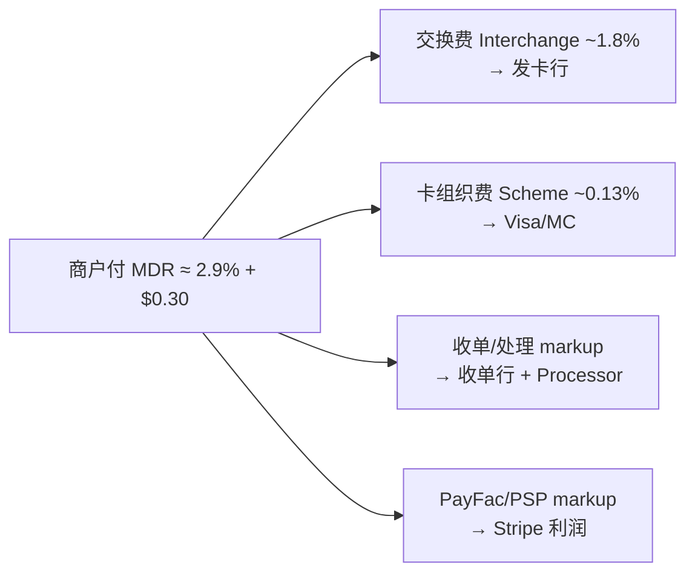

### 两种定价模式（高频考点）

| 模式 | 含义 | 谁用 | 商户视角 |
|---|---|---|---|
| **Flat rate（统一费率）** | 不管底层成本，统一收如 2.9%+30¢ | Stripe/Square | 简单透明，小商户爱；PayFac 赚成本与报价的差 |
| **Interchange++（IC++）** | 成本透明：交换费+卡组织费**实报实销**，只加固定 markup | Adyen | 大商户爱，省钱且议价透明 |

### ISO 的分润：Residual（剩余分润）
📌 **Residual**：ISO 拓来的商户，每笔交易收单行分给 ISO 一定比例。**只要商户还在交易，ISO 持续躺赚**——这是传统美国收单地推的核心商业模式，类似 SaaS 的经常性收入。

> 💡 **三种盈利模式对比**：ISO 赚 residual（持续分润）、PayFac 赚 markup（费率差价）、收单行赚 处理费+承担风险的对价。

---

## 第一性追问 4：真实案例对照

| 公司 | 角色定位 | 定价 | 特点 |
|---|---|---|---|
| **Stripe** | PayFac + Gateway + Processor 一体 | Flat 2.9%+30¢ | 开发者友好，API 化，小商户秒入网 |
| **Square** | PayFac | 2.6%+10¢(线下) | 主打线下小微，自带硬件 |
| **Adyen** | **全栈**：自己持收单牌照(Acquirer) | IC++ | 单一平台覆盖全球大商户(Uber/Spotify/Meta) |
| **PayPal** | PayFac + 钱包(闭环) | Flat | 账户体系 + 受理一体 |
| **传统美国 ISO** | ISO（挂靠 Fiserv/Chase） | 赚 residual | 地推签商户，持续分润 |
| **Marqeta** | 发卡侧 Processor(Issuing) | — | 对照:这是发卡侧,非收单 |
| **中国：银联商务/拉卡拉/通联** | 持牌收单机构 | — | 持央行"银行卡收单"牌照 |
| **中国：收钱吧/哆啦宝** | 聚合支付(≈ISO+多通道聚合) | 服务费/分润 | 聚合多通道，⚠️不得碰清算资金 |
| **连连/PingPong** | **跨境PayFac + 多币种账户 + 换汇** | 提现费+汇差+浮存 | PayFac骨架(代收分账)+跨境外壳(账户/FX/多国牌照) |
| **Airwallex** | **全栈跨境支付**(收单+账户+FX,自持多国牌照) | 类IC++/分层 | 走得更远,像"跨境版Adyen+PayFac" |
| **CardInfoLink(卡信链)** | **Processor / 收单技术服务商** | 技术/处理费 | 卖支付/收单技术系统给银行/机构,不以自己名义清算商户资金 |

### 辨析：跨境收款公司是 PayFac 吗？CardInfoLink 是 Processor 吗？

用"**碰钱 + 担风险 + 持牌**"这把钥匙归类：

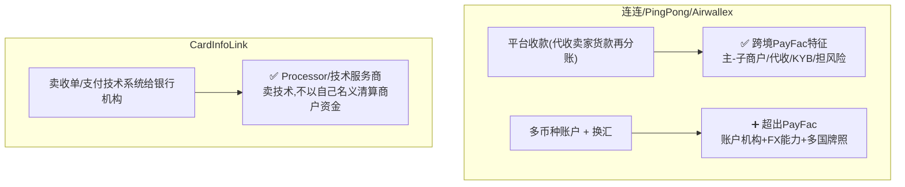

| 公司 | 是 PayFac 吗 | 精确表述 |
|---|---|---|
| 连连/PingPong | **是一半** | PayFac 的"代收分账"骨架 ✅，但叠加了多币种账户+换汇+多国牌照，**更准确叫"跨境PayFac+账户+FX复合体"** |
| Airwallex | **是,且更全** | 自持多国收单/EMI 牌照，是"全栈跨境支付平台"，PayFac 只是其能力之一 |
| CardInfoLink | **不是PayFac,是Processor** | 卖技术系统/处理能力给机构，符合"卖技术不碰资金清算"的 Processor 定位 |

> 🎯 **交流要点**：说"连连是 PayFac"只对一半——**正确说法是"用 PayFac 的代收分账骨架，套上多币种账户+换汇+多国牌照的跨境外壳"**。判断任何一家：先问"碰不碰商户资金清算、担不担风险、在哪持牌"，三个答案一出，归类自然清晰。

> ⚠️ **数据可信度**：连连/PingPong/Airwallex 的 PayFac/账户/FX 定位与 Airwallex 多国牌照，部分已在 `跨境支付深度研究报告.md` 第二轮核查确认；CardInfoLink 的具体业务边界与持牌情况属 🔧 基于角色特征的判断，**未逐项核实**，正式判断请核其官网/牌照披露。

> ⚠️ **中国特殊性（与支付公司交流必知）**：
> - 2018"**断直连**"后，第三方支付**不能直连银行**，必须经 **网联/银联** 清算。
> - 收单需持央行**支付业务许可证（银行卡收单类）**。
> - **聚合支付**（收钱吧等）本质是"ISO 角色 + 多通道聚合"，**不得沉淀/清算资金**——碰了就是"**二清（二次清算）**"，属违规红线。
> - 🎯 和中国支付公司聊，一定要分清"持牌收单机构"vs"聚合支付服务商"，以及"一清 vs 二清"。

---

## 第一性追问 5：PayFac 平台型架构与 AWS（你的主场）

PayFac 是现代收单的主流形态，也是**平台/SaaS 公司最爱的模式**（电商平台、SaaS 都想"嵌入支付"）。它的技术架构对你 AWS SA 极有价值。

### 5.1 PayFac 平台要解决的技术问题

```mermaid
flowchart TB
    SUB["子商户自助入网"] --> KYB["① 子商户 KYB/风控<br/>(快速尽调+持续监控)"]
    PAY["支付受理"] --> LEDGER["② 多商户账本<br/>(每个子商户独立账务)"]
    LEDGER --> SPLIT["③ 分账/清分<br/>(一笔钱拆给平台+多个子商户)"]
    SPLIT --> PAYOUT["④ 资金结算/Payout<br/>(按周期打款给子商户)"]
    ALL["全流程"] --> RISK["⑤ 反洗钱/拒付/资金隔离合规"]
```

| PayFac 核心能力 | 技术挑战 |
|---|---|
| **子商户 KYB 入网** | 自动化尽调、文档核验、持续风险监控 |
| **多商户账本** | 每个子商户独立余额、待结算、手续费分录（复式记账，见地基技术篇） |
| **分账/清分 Split** | 一笔交易按规则拆给平台抽佣 + 多个子商户 |
| **资金结算 Payout** | 按 T+N 周期把钱打给子商户，处理失败重试、合规 |
| **资金隔离** | 子商户的钱与平台自有资金严格隔离（合规红线） |

### 5.2 AWS 参考架构

```mermaid
flowchart TB
    subgraph 接入["受理/接入"]
        GW["API Gateway<br/>统一受理入口"]
    end
    subgraph 入网["子商户入网(KYB)"]
        KYB["Step Functions 编排KYB<br/>+ Lambda 调用第三方尽调/制裁筛查"]
        DOC["S3 存证件 + Textract/Comprehend 核验"]
    end
    subgraph 核心["多商户账本(CP强一致)"]
        LEDGER["Aurora PostgreSQL<br/>子商户独立账户+复式记账"]
        IDEM["DynamoDB 幂等表"]
    end
    subgraph 分账["分账与结算"]
        SPLIT["分账引擎(规则) Lambda/ECS"]
        PAYOUT["Step Functions 编排Payout<br/>+ SQS 重试"]
    end
    subgraph 风控["风控/合规"]
        FD["Fraud Detector / SageMaker"]
        REC["S3+Glue 对账"]
    end
    GW --> KYB --> LEDGER
    GW --> LEDGER --> SPLIT --> PAYOUT
    LEDGER --> REC
    GW --> FD
```

| PayFac 能力 | ☁️ AWS 服务 |
|---|---|
| 受理入口 | API Gateway + WAF |
| 子商户 KYB 编排 | Step Functions + Lambda（调用尽调/制裁API）、S3+Textract（证件核验） |
| 多商户账本 | Aurora（强一致复式记账）+ DynamoDB（幂等） |
| 分账/清分 | Lambda/ECS 规则引擎 |
| 资金结算 Payout | Step Functions（编排）+ SQS（失败重试）+ EventBridge（调度） |
| 风控反欺诈 | Fraud Detector / SageMaker |
| 对账 | S3 + Glue/Athena（复用地基技术篇对账架构） |
| 密钥/卡数据 | Payment Cryptography / Nitro Enclaves / KMS（复用模块1技术篇） |

> 🎯 **交流杀手锏**：很多平台/SaaS 公司想做 PayFac 但卡在"多商户账本+分账+KYB+合规"的工程复杂度。你能给出 **Aurora多商户账本 + Step Functions编排KYB/Payout + 分账引擎 + Glue对账 + Payment Cryptography合规** 的完整 AWS 蓝图——这是 AWS SA 切入支付平台客户的高价值场景。

---

## 第一性追问 6：跨境收款公司 = 跨境 PayFac（直通你的目标）

这是本篇与你**最终目标（与跨境支付公司深聊）**的关键串联。

📌 **连连国际 / PingPong / Airwallex / Payoneer 的本质 = "跨境 PayFac/收单 + 换汇"**：

```mermaid
flowchart LR
    BUYER["海外买家"] --> PLAT["Amazon/独立站<br/>(平台代收)"]
    PLAT --> XPAYFAC["跨境收款公司<br/>(本质=跨境PayFac)<br/>在境外持牌收单/代收"]
    XPAYFAC --> FX["换汇 USD→CNY<br/>(赚汇差)"]
    FX --> SELLER["中国卖家账户"]
    XPAYFAC -.子商户KYB/合规.-> SELLER
```

**它们和国内 PayFac 的相同与不同：**

| 维度 | 国内 PayFac (Stripe) | 跨境收款公司 (连连/PingPong) |
|---|---|---|
| 主商户-子商户结构 | ✅ | ✅（中国卖家=子商户） |
| 代收资金后分账 | ✅ | ✅（境外收、境内付） |
| 子商户 KYB | ✅ | ✅（+跨境合规、外管局申报） |
| 额外能力 | — | **多币种账户 + 换汇（汇差是核心收益）+ 跨境合规牌照矩阵** |
| 盈利 | markup | **提现费 + 汇差 + 浮存**（见跨境报告） |

> 🎯 **这就是为什么本篇对你的目标至关重要**：跨境收款公司 = PayFac 模型 + 跨境换汇 + 多国牌照。理解了 PayFac 的"主子商户、代收分账、KYB、资金隔离"，再叠加模块3 的"代理行/换汇/结售汇/外管局合规"，你就能和连连/PingPong/Airwallex 的技术与业务高管**平等对话**。详见 `跨境支付深度研究报告.md` 与模块3。

---

## 本篇小结（背下来）

1. **收单产业链按能力分工**：收单行(牌照+风险)、Processor(技术)、ISO(销售)、PayFac(代收+快速入网)、Gateway(线上入口)、PSP(伞形词需追问)。
2. **ISO vs PayFac 分水岭 = 钱过不过手 + 风险担不担**：ISO 不碰钱不担风险赚 residual；PayFac 代收资金担风险赚 markup。
3. **定价两模式**：Flat rate（简单，小商户）vs IC++（透明，大商户）。
4. **案例**：Stripe/Square/PayPal=PayFac；Adyen=全栈持牌；传统 ISO 赚 residual。
5. **中国红线**：断直连、必须经网联/银联清算、持收单牌照、聚合支付不得二清。
6. **PayFac 平台技术 = 多商户账本+分账+KYB+Payout+资金隔离**，AWS 有完整蓝图（Aurora/Step Functions/分账引擎/Glue/Payment Cryptography）。
7. **跨境收款公司 = 跨境 PayFac + 换汇 + 多国牌照**——这是通向你最终目标的关键认知。

---

## 通向下一层

- **回到模块1主线** → `01-cards-business.md` / `01-cards-tech-aws.md`
- **线上受理入口（支付网关）与第三方支付** → 模块2 `02-epayment-business.md`
- **跨境深入** → `跨境支付深度研究报告.md` 与模块3（代理行/换汇/合规）
- **分账/账务/对账的工程细节** → 模块6 横向专题

> 🎯 **此刻你已具备的对话能力**：能精确区分收单产业链各角色的定位/分润/风险，识别一家支付公司在产业链中的位置，并理解跨境收款公司的 PayFac 本质——和跨境支付公司交流的核心认知已就位。
