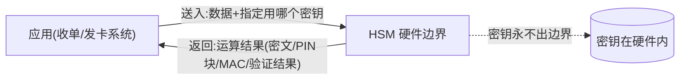
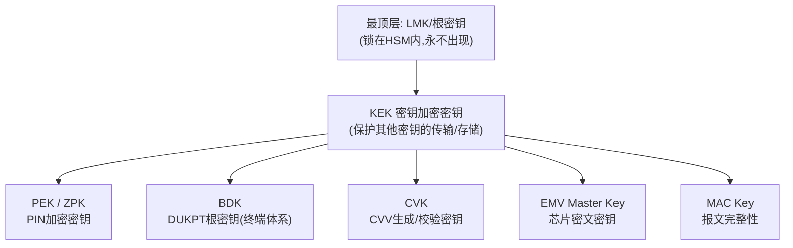
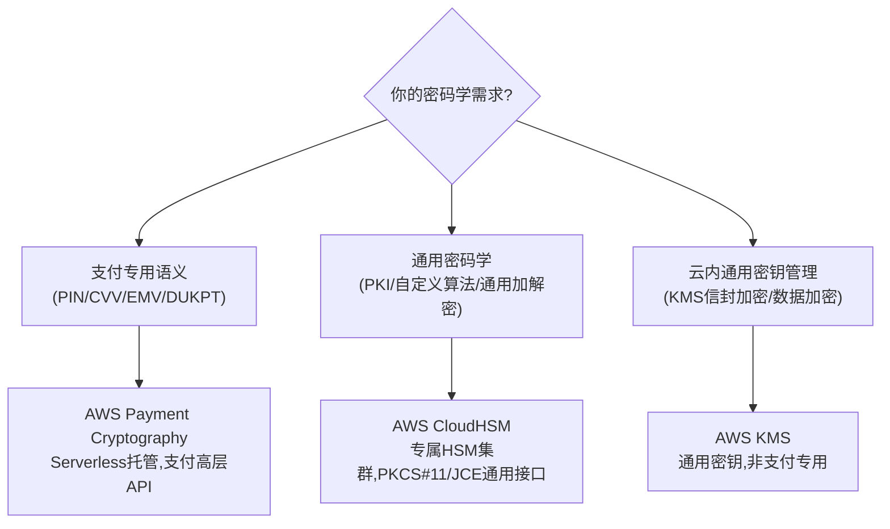
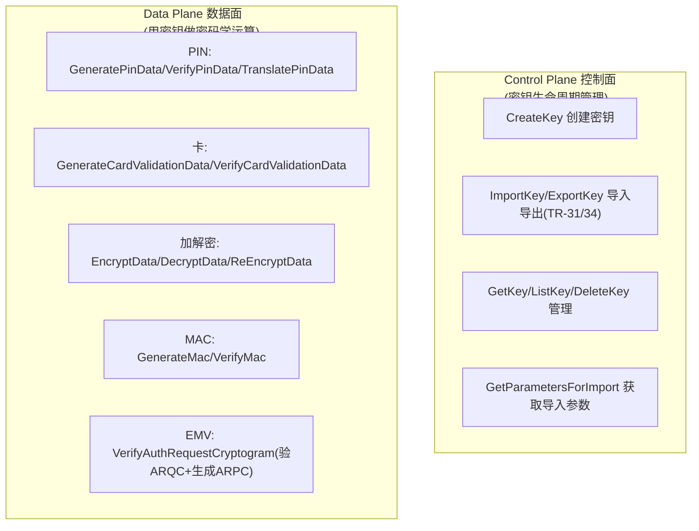
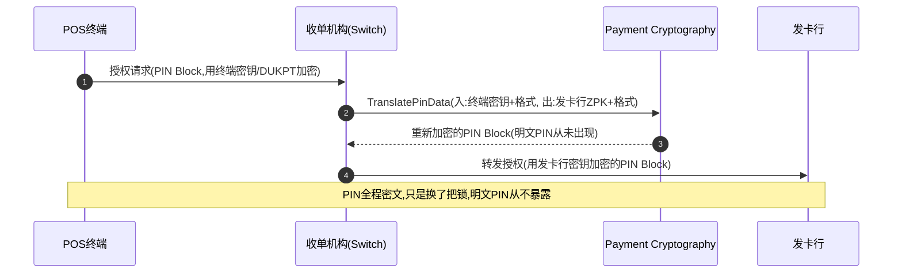
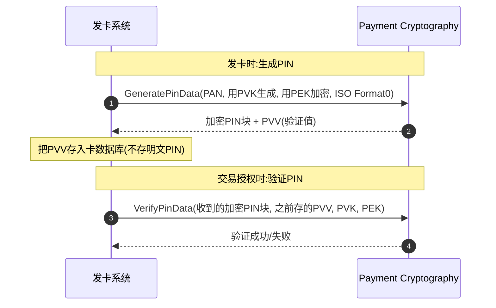
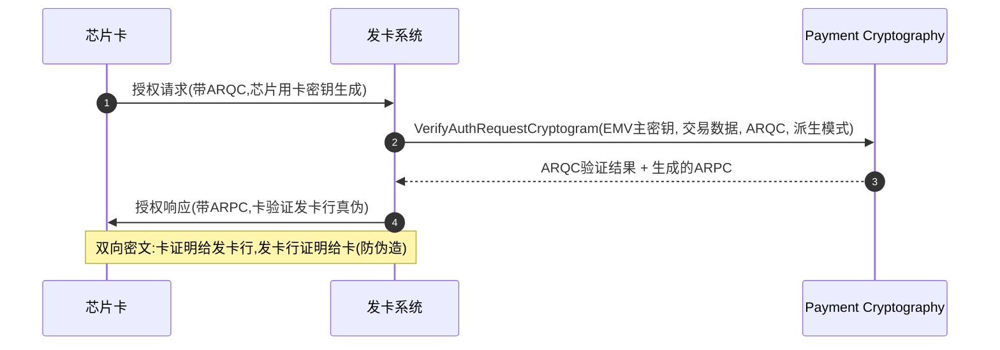
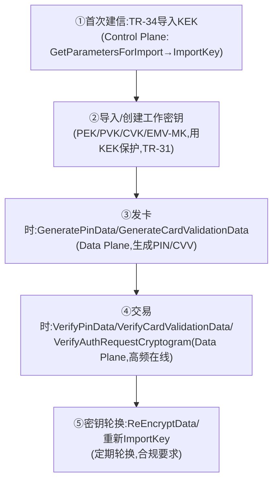
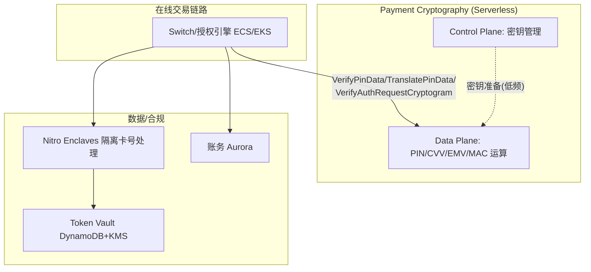

# 模块 1 深化 · CloudHSM 与 Payment Cryptography 在收单/发卡中的实战

> **学习者**：AWS 技术架构师 · 支付小白
> **本篇目标**：把模块1技术篇 §6"密钥与合规"那一节讲透。回答：支付里到底有哪些密钥、怎么分层？CloudHSM 和 Payment Cryptography 各管什么、怎么选？Payment Cryptography 的 Control Plane / Data Plane 有哪些 API？收单（PIN 翻译）、发卡（PIN 验证/CVV/EMV）场景具体调哪些 API？配真实调用链实例。
> **前置**：模块1技术篇 `01-cards-tech-aws.md` §5-6（安全四件套、PCI-DSS）
> **组织方式**：top-down 主线。零散追问见文末 FAQ。
> 标注：🔧 通用技术 · ☁️ AWS · 📌 关键定义 · ⚠️ 坑点 · 🎯 交流要点
> ⚠️ **可信度**：本文的 AWS API 名称、密钥类型、合规级别经 AWS 官方文档核实（2026-06）；具体请求/响应参数以 [Payment Cryptography API Reference](https://docs.aws.amazon.com/payment-cryptography/) 为准。

---

## 1. 第一性：支付为什么离不开 HSM

回到模块0 的信条——**资金正确性 > 一切**，以及模块1 的安全四件套（HSM 护密钥）。支付里有大量**密码学运算**：PIN 加密、CVV 生成/校验、卡数据加解密、报文 MAC、EMV 密文验证。这些运算用的**密钥一旦泄露，整个体系崩塌**（能伪造卡、解密 PIN、篡改交易）。

📌 **HSM（Hardware Security Module）解决的核心问题**：让密钥**在硬件内生成、使用，永不以明文离开硬件**——连运维、连 root 都拿不到明文密钥。所有用密钥的运算"送进 HSM 里做，结果出来，密钥不出来"。



> 🎯 **交流要点**：HSM 不是"存密钥的保险柜"那么简单——它是"**带密钥的运算器**"。应用把数据送进去、指定用哪把密钥做什么运算，HSM 在硬件内完成并只返回结果。这是支付合规（PCI PIN/P2PE）的硬性要求：明文密钥和明文 PIN 绝不能出现在普通服务器内存里。

---

## 2. 支付密钥的层级体系（理解一切的基础）

⚠️ 不懂密钥分层，就看不懂 HSM 的 API。支付密钥不是一把，而是**分层管理**——上层密钥保护下层密钥，最顶层密钥锁在 HSM 里。



📌 **关键密钥类型**（Payment Cryptography 都支持）：
| 密钥 | 全称 | 用途 |
|---|---|---|
| **KEK** | Key Encryption Key | 密钥加密密钥——保护其他密钥的传输与存储 |
| **PEK / ZPK** | PIN Encryption Key / Zone PIN Key | 加密 PIN 块（节点间传 PIN 用） |
| **PVK** | PIN Verification Key | 生成/校验 PIN 验证值（PVV） |
| **BDK** | Base Derivation Key | DUKPT 体系的根密钥（POS/ATM 终端） |
| **CVK** | Card Verification Key | 生成/校验 CVV/CVV2/iCVV |
| **EMV Master Key** | — | 验证芯片卡 ARQC、生成 ARPC |
| **MAC Key** | — | 报文认证码（防篡改） |

📌 **密钥交换标准**（密钥怎么在机构间安全传递，明文密钥绝不裸传）：
- **TR-31**：对称密钥块格式——已建立信任的双方间安全传输密钥，**密钥块自带"用途绑定"**（这把密钥只能干什么，防滥用）。
- **TR-34**：基于 RSA 的非对称协议——**首次建立信任**（无预共享密钥时的初始密钥导入）。
- **DUKPT**（Derived Unique Key Per Transaction）：每笔交易派生唯一密钥，靠 KSN（Key Serial Number=设备ID+交易计数器）+ BDK 派生。用于 POS/ATM——**即使某笔交易密钥泄露，也推不出 BDK 和其他交易密钥**。

> 🎯 **交流要点**：能讲"密钥分层（KEK 保护工作密钥）+ TR-31/34 密钥交换 + DUKPT 一次一密"，是支付密码学的核心功底。和支付公司聊 HSM，他们最关心的就是密钥怎么导入、怎么分层、怎么轮换。

---

## 3. CloudHSM vs Payment Cryptography：怎么选

模块1技术篇给了结论，这里讲清**为什么**和**怎么选**。



| 维度 | **Payment Cryptography** | **CloudHSM** | **KMS** |
|---|---|---|---|
| 定位 | **支付专用托管服务** | 通用专属 HSM 集群 | 通用密钥管理 |
| 管理方式 | Serverless，无需管硬件 | 需管 HSM 集群（选型/扩缩容） | 全托管 |
| API 风格 | **支付高层语义**（GeneratePinData/VerifyAuthRequestCryptogram） | 标准接口（PKCS#11/JCE/CNG） | AWS API（Encrypt/Decrypt/GenerateDataKey） |
| 密钥语义 | PIN/EMV/DUKPT/TR-31/34 支付专用 | 标准密钥，无支付语义 | 通用对称/非对称 |
| 计费 | 按 API 调用次数 | 按 HSM 实例小时 | 按 key + 调用 |
| 合规 | **PCI PIN/P2PE/DSS/3DS** | FIPS 140-2 L3 通用 | FIPS 140-2/3 |
| FIPS | FIPS 140-2 Level 3 | FIPS 140-2 Level 3 | — |

📌 **选型第一性原则**：
- **要做 PIN/CVV/EMV/DUKPT 这些支付专用运算** → **Payment Cryptography**（免自建 HSM 集群，直接调高层 API，自带 PCI PIN/P2PE 合规）。
- **要做通用密码学**（自定义算法、PKI、非支付场景）或**需要 PKCS#11 标准接口对接现有系统** → **CloudHSM**。
- **云内一般数据加密、密钥信封加密**（如加密数据库字段、token vault） → **KMS**。

> 🎯 **交流杀手锏**：支付公司过去自建 HSM 集群（Thales/Futurex/Atalla 物理机），痛点是——贵（一台几十万）、运维难（密钥仪式、双人控制、灾备）、扩容慢、合规审计重。**Payment Cryptography 把这些变成按调用付费的 Serverless API，自带 PCI PIN/P2PE 合规继承**——这是你作为 AWS SA 最有杀伤力的一张牌。但要诚实：存量系统迁移涉及密钥迁移（TR-34 导入）和改造，不是一键切换。

---

## 4. Payment Cryptography 的两个 API 平面

📌 服务分成两个独立的 API 平面（对应两个 SDK 客户端）：



- **Control Plane**（端点 `controlplane.payment-cryptography...`，SDK `payment-cryptography`）：管密钥的**一生**——创建、导入、导出、查询、删除、轮换。
- **Data Plane**（端点 `dataplane.payment-cryptography...`，SDK `payment-cryptography-data`）：**用**密钥做运算——但密钥本身永不返回，只返回运算结果。

> 🔧 这个分离呼应模块1技术篇的"在线 vs 离线"：密钥管理（Control Plane）是低频管理操作；密码学运算（Data Plane）是交易链路上的高频在线调用。

---

## 5. 收单场景：PIN Block 翻译（最经典）

📌 **场景**：持卡人在 POS/ATM 输入 PIN。PIN 在终端用一把密钥加密成"PIN Block"，但**收单机构和发卡行用的密钥不同**——收单机构作为中间节点，要把 PIN Block **从"终端的密钥"翻译成"发往发卡行的密钥"，全程 PIN 明文绝不出现**。这就是 `TranslatePinData`。



🔧 **调用链（收单侧）**：
```
# 准备阶段(Control Plane,低频):导入与终端、与发卡行的密钥
ImportKey(KeyMaterial=<终端密钥TR31块>, ...)        # 收终端的 PIN
ImportKey(KeyMaterial=<发往发卡行的ZPK TR31块>, ...) # 转发给发卡行

# 交易阶段(Data Plane,每笔):翻译 PIN Block
TranslatePinData(
  EncryptedPinBlock=<终端来的密文PIN>,
  IncomingKeyIdentifier=<终端密钥(或DUKPT用BDK+KSN)>,
  IncomingTranslationAttributes={IsoFormat0: {...}},
  OutgoingKeyIdentifier=<发往发卡行的密钥>,
  OutgoingTranslationAttributes={IsoFormat1: {...}}
)
→ 返回:用发卡行密钥重新加密的 PIN Block
```

> 📌 **关键点**：终端常用 **DUKPT**（一次一密），所以入向是 BDK+KSN 派生；出向是和发卡行约定的 ZPK。PIN Block 还有**格式转换**（ISO Format 0/1/3/4），不同节点要求不同格式，Translate 同时换密钥+换格式。

---

## 6. 发卡场景：PIN 验证 / CVV / EMV

发卡行是密钥运算的"大户"——它要生成 PIN、验证 PIN、生成/校验 CVV、验证芯片卡密文。

### 6.1 PIN 生成与验证



🔧 **关键**：发卡行**不存明文 PIN**，只存 **PVV（PIN Verification Value）**——一个由 PIN+PAN+PVK 算出的验证值。验证时重新算一遍比对，明文 PIN 从不落库。

### 6.2 CVV / CVV2 生成与校验

```
# 发卡时生成卡背三位码
GenerateCardValidationData(
  KeyIdentifier=<CVK>,
  PrimaryAccountNumber=<卡号>,
  GenerationAttributes={CardVerificationValue2: {CardExpiryDate:"0128"}}
)
→ 返回 CVV2,印在卡背面

# 交易时校验用户输入的CVV2
VerifyCardValidationData(KeyIdentifier=<CVK>, PAN=..., VerificationAttributes=..., CardVerificationValue=<用户输入>)
→ 成功/失败
```
> 📌 ⚠️ CVV2 **绝不可存储**（PCI-DSS 红线，模块1技术篇讲过）——发卡行用 CVK 实时校验，不留存。

### 6.3 EMV 芯片卡密文验证（ARQC/ARPC）

📌 模块1讲过 EMV 芯片每笔生成动态密文。发卡行要**验证芯片卡的 ARQC（授权请求密文）**，并生成 **ARPC（授权响应密文）**回给卡：



🔧 `VerifyAuthRequestCryptogram` 一个 API 同时做两件事：验证卡来的 ARQC + 通过 `AuthResponseAttributes` 生成 ARPC（不是独立 API）。EMV 主密钥派生出卡级密钥（EMV Option A/B 派生模式），再派生会话密钥验密文——这是芯片卡防复制的核心。

---

## 7. 完整密钥流转：从导入到交易

把 Control Plane 和 Data Plane 串起来看一个发卡行的完整生命周期：



> 🎯 **交流要点**：能画出"TR-34 建信 → TR-31 导工作密钥 → Data Plane 发卡/交易运算 → 定期轮换"这条密钥全生命周期，说明你真懂支付密钥工程，而不只是知道有 HSM 这个东西。

---

## 8. 架构集成：Payment Cryptography 在收单/发卡系统中的位置



| 需求 | AWS 服务 | 调用 |
|---|---|---|
| PIN 翻译(收单) | Payment Cryptography Data Plane | TranslatePinData |
| PIN 验证(发卡) | Payment Cryptography Data Plane | VerifyPinData |
| CVV 生成/校验 | Payment Cryptography Data Plane | Generate/VerifyCardValidationData |
| EMV 密文 | Payment Cryptography Data Plane | VerifyAuthRequestCryptogram |
| 密钥管理/轮换 | Payment Cryptography Control Plane | CreateKey/ImportKey/ExportKey |
| 卡号(PAN)隔离处理 | Nitro Enclaves | — |
| token↔PAN 映射 | DynamoDB + KMS | — |
| 通用密钥/PKI | CloudHSM | PKCS#11 |

---

## 9. 本篇小结（背下来）

1. **HSM 是"带密钥的运算器"**：数据送进去运算，密钥永不出硬件边界——PCI PIN/P2PE 硬性要求。
2. **密钥分层**：LMK→KEK→工作密钥(PEK/PVK/BDK/CVK/EMV-MK/MAC)；TR-31(传输)/TR-34(建信)/DUKPT(一次一密)。
3. **选型**：支付专用运算→Payment Cryptography；通用密码学/PKCS#11→CloudHSM；通用数据加密→KMS。
4. **Payment Cryptography 两平面**：Control Plane(密钥生命周期) + Data Plane(密码学运算,密钥不返回)。
5. **收单经典 = TranslatePinData**：PIN Block 换密钥+换格式，明文 PIN 全程不暴露。
6. **发卡三大运算**：VerifyPinData(存PVV不存明文PIN)、Generate/VerifyCardValidationData(CVV不可存)、VerifyAuthRequestCryptogram(验ARQC+生成ARPC)。
7. **AWS 杀手锏**：Payment Cryptography 把自建 HSM 集群变成 Serverless 按调用付费+继承 PCI 合规——但存量迁移涉及密钥迁移(TR-34)，不是一键切换。

---

## 10. 通向

- **回模块1技术篇** → `01-cards-tech-aws.md`（安全四件套、PCI-DSS、收单系统）
- **合规体系深入** → 模块6 横向专题（KYC/AML/PCI 体系化）

---

## 附：常见追问（FAQ）

**Q：Payment Cryptography 真能完全替代物理 HSM 吗？**
A：对支付专用运算（PIN/CVV/EMV/DUKPT），它提供了 Serverless 替代，免去自建集群的运维和合规负担，且自带 PCI PIN/P2PE 合规。但要注意：①存量系统迁移涉及密钥迁移（TR-34 导入）和应用改造（从 PKCS#11/厂商 SDK 改成调 AWS API）；②极特殊的自定义密码学或某些本地支付标准可能仍需 CloudHSM 或专用 HSM。对绝大多数标准卡支付场景，Payment Cryptography 够用且更省心。

**Q：为什么 PIN 要"翻译"而不是直接传？**
A：因为 PIN 在每一段链路用不同的密钥加密（终端一把、收单到发卡一把），且明文 PIN 绝不能出现在任何节点的内存里（PCI PIN 要求）。TranslatePinData 在 HSM 硬件内完成"解密+用新密钥重新加密"，明文 PIN 只在硬件边界内一闪而过，应用层永远拿不到。这是 PIN 安全的核心机制。

**Q：DUKPT 的"一次一密"和 TR-31 是什么关系？**
A：两个不同层面。TR-31 是"密钥怎么安全传输"的格式（密钥块+用途绑定）。DUKPT 是"终端怎么每笔用不同密钥"的派生机制——终端内置 BDK 派生的初始密钥，每笔交易用 KSN（计数器）派生出唯一的交易密钥。即使某笔交易密钥被截获，也推不出 BDK 和其他交易密钥。POS/ATM 普遍用 DUKPT，密钥导入时可能用 TR-31 格式承载 BDK。

**Q：CloudHSM 在支付里还有什么用，既然有了 Payment Cryptography？**
A：CloudHSM 用于**支付专用运算之外**的通用密码学：如签发/管理 PKI 证书、对接只支持 PKCS#11/JCE 标准接口的现有应用、自定义加密算法、区块链钱包私钥保护（模块4稳定币会用到 Nitro+HSM 保护私钥）、或某些 Payment Cryptography 还未覆盖的特殊密钥运算。两者常配合使用：Payment Cryptography 管支付运算，CloudHSM 管通用密码学。
