# 模块 1 深化 · CloudHSM 与 Payment Cryptography 在收单/发卡中的实战

> **学习者**：AWS 技术架构师 · 支付小白
> **本篇目标**：把模块1技术篇 §6"密钥与合规"那一节讲透。回答：支付里到底有哪些密钥、怎么分层？CloudHSM 和 Payment Cryptography 各管什么、怎么选？Payment Cryptography 的 Control Plane / Data Plane 有哪些 API？收单（PIN 翻译）、发卡（PIN 验证/CVV/EMV）场景具体调哪些 API？配真实调用链实例。
> **前置**：模块1技术篇 `01-cards-tech-aws.md` §5-6（安全四件套、PCI-DSS）
> **组织方式**：top-down 主线。零散追问见文末 FAQ。
> 标注：🔧 通用技术 · ☁️ AWS · 📌 关键定义 · ⚠️ 坑点 · 🎯 交流要点
> ⚠️ **可信度**：本文的 AWS API 名称、密钥类型、合规级别经 AWS 官方文档核实（2026-06）；§2.4 的 TR-34 导入流程经 **AWS 官方 sample 代码核对**（[samples-for-payment-cryptography-service](https://github.com/aws-samples/samples-for-payment-cryptography-service)，`key-import-export/tr34`）；具体参数以 [Payment Cryptography API Reference](https://docs.aws.amazon.com/payment-cryptography/) 为准。

---
---

## 1. 第一性：支付为什么离不开 HSM

回到模块0 的信条——**资金正确性 > 一切**，以及模块1 的安全四件套（HSM 护密钥）。支付里有大量**密码学运算**：PIN 加密、CVV 生成/校验、卡数据加解密、报文 MAC、EMV 密文验证。这些运算用的**密钥一旦泄露，整个体系崩塌**（能伪造卡、解密 PIN、篡改交易）。

📌 **HSM（Hardware Security Module）解决的核心问题**：让密钥**在硬件内生成、使用，永不以明文离开硬件**——连运维、连 root 都拿不到明文密钥。所有用密钥的运算"送进 HSM 里做，结果出来，密钥不出来"。

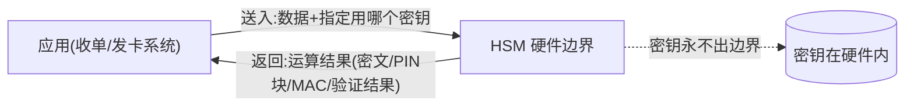

> 🎯 **交流要点**：HSM 不是"存密钥的保险柜"那么简单——它是"**带密钥的运算器**"。应用把数据送进去、指定用哪把密钥做什么运算，HSM 在硬件内完成并只返回结果。这是支付合规（PCI PIN/P2PE）的硬性要求：明文密钥和明文 PIN 绝不能出现在普通服务器内存里。


---

## 2. 支付密钥的层级体系与交换（密钥原理层）

### 2.1 密钥的层级体系

⚠️ 不懂密钥分层，就看不懂 HSM 的 API。支付密钥不是一把，而是**分层管理**——上层密钥保护下层密钥，最顶层密钥锁在 HSM 里。

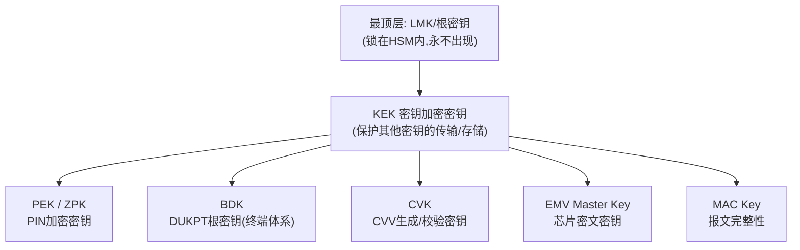

📌 **关键密钥类型**（Payment Cryptography 都支持）：

| 密钥 | 全称 | 用途 | 业务场景解释 |
|---|---|---|---|
| **KEK** | Key Encryption Key | 保护其他密钥的传输与存储 | 你要把一把 PIN 密钥从总行发到分行/从收单机构发给发卡行，明文密钥绝不能裸传——用 KEK 把工作密钥"包起来"加密传输。它是密钥分层的"中间管理层"，本身不直接参与交易运算，只负责"锁住别的密钥"。 |
| **PEK / ZPK** | PIN Encryption Key / Zone PIN Key | 加密 PIN 块（节点间传 PIN 用） | 持卡人在 ATM/POS 输入 PIN，PIN 不能明文在网络上传。PEK/ZPK 把 PIN 加密成"PIN Block"。ZPK 特指**两个机构（zone）之间**约定的 PIN 密钥——收单机构和发卡行之间传 PIN 就用双方约定的 ZPK。PIN 翻译（§4.2）就是把 PIN Block 从一把 ZPK 换成另一把 ZPK。 |
| **PVK** | PIN Verification Key | 生成/校验 PIN 验证值（PVV） | 发卡行**不存明文 PIN**，而是用 PVK 把 PIN+卡号算出一个 **PVV（验证值）**存起来。用户每次输 PIN，发卡行用 PVK 重新算一遍 PVV 比对——对得上就是 PIN 正确。这样数据库泄露也拿不到明文 PIN。发卡行专用。 |
| **BDK** | Base Derivation Key | DUKPT 体系的根密钥（POS/ATM 终端） | 一台 POS 机要做到"每笔交易用不同密钥"（一次一密，防截获），靠的是 BDK。BDK 是收单机构持有的"母密钥"，给每台终端注入一个由 BDK 派生的初始密钥；终端每笔交易再用 KSN（计数器）派生唯一密钥。**即使某笔交易密钥泄露，也推不出 BDK 和其他交易密钥**。收单/终端体系核心。 |
| **CVK** | Card Verification Key | 生成/校验 CVV/CVV2/iCVV | 发卡时用 CVK 根据卡号+有效期算出卡背面的 **CVV2**（那三位数）；交易时用户输入 CVV2，发卡行用 CVK 实时校验。⚠️ CVV2 本身不可存储（PCI 红线），靠 CVK 实时算。iCVV 是芯片卡里的版本。发卡行/3DS 服务商用。 |
| **EMV Master Key** | EMV Issuer Master Key | 验证芯片卡 ARQC、生成 ARPC | 芯片卡每笔交易生成动态密文 ARQC（证明"我是真卡"）。发卡行用 EMV 主密钥派生出"卡级密钥→会话密钥"来验证 ARQC，并生成 ARPC（证明"我是真发卡行"）回给卡。这是芯片卡**双向防伪、防复制**的根。发卡行专用，一张卡一套派生密钥。 |
| **MAC Key** | Message Authentication Code Key | 报文认证码（防篡改） | 收单/发卡/卡组织之间传的授权报文（如 ISO 8583），怕被中途篡改金额或卡号。发送方用 MAC Key 给报文算一个"指纹"（MAC）附在报文后，接收方用同样的 MAC Key 重算比对——不一致说明被篡改。保证报文**完整性与来源真实性**，各节点间都用。 |

📌 **密钥交换标准**：明文密钥绝不能在机构间裸传（一旦被截获就全完）。下面三个标准分别解决"密钥怎么安全传、怎么首次建信、怎么做到一次一密"——是支付密码学的核心。详见 §2.1-2.3。

### 2.2 密钥交换的业务场景全景：谁和谁之间换密钥

讲"怎么换"之前，先搞清"**在哪些实体之间需要换**"。

📌 **第一性规律**：**密钥交换需求出现在"机构/安全域的边界"上**。同一机构内部的系统共享自己的 LMK，不需要交换；**一旦跨越两个独立机构（各自的 LMK 私有、互不知道），双方就必须先建立共享密钥**才能安全通信。

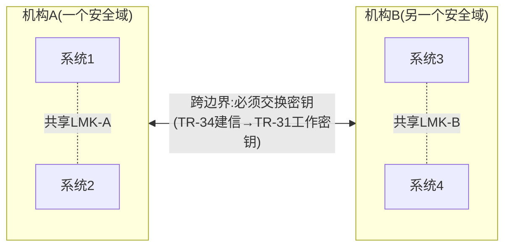

**收单链路上的密钥交换关系**（你最该记住的一条链）：


| 密钥交换关系 | 在什么之间 | 交换/共享什么 | 解决什么 |
|---|---|---|---|
| **① 终端 ↔ 收单机构** | POS/ATM ↔ 收单 HSM | BDK→IPEK（DUKPT） | 终端加密 PIN，一次一密 |
| **② 收单 ↔ 卡组织/转接** | 收单机构 ↔ Visa/MC/银联/网联 | ZMK→ZPK、MAC 密钥 | PIN 翻译、报文防篡改 |
| **③ 卡组织/转接 ↔ 发卡行** | 转接清算 ↔ 发卡行 | ZMK→ZPK | PIN 翻译到发卡行能解的密钥 |
| **④ 发卡行 ↔ 芯片卡** | 发卡行 ↔ EMV 卡 | EMV 主密钥派生的卡级密钥 | 芯片卡 ARQC/ARPC（个人化时注入） |

> 📌 收单的核心密钥交换 = **"终端→收单→卡组织→发卡行"这条链上的每一跳**。PIN 在每跳用不同密钥加密，靠的就是相邻两方预先交换好的密钥（这正是 §4.2 PIN 翻译的前提）。

**全支付域的密钥交换场景**（明确"**谁把什么密钥给谁**"——分发方→接收方的方向）：

| 业务域 | 分发方（谁） | → 接收方（给谁） | 给什么密钥 | 怎么给/业务场景 |
|---|---|---|---|---|
| 收单-终端 | **收单机构**（持 BDK） | → POS/ATM 终端 | 派生的 **IPEK**（BDK 不给，留 HSM） | 终端上线时 KIF 物理注入或 RKL 远程加载（§2.7） |
| 收单-网络 | **收单机构 与 卡组织/网联** 互相 | ↔ 对方 | **ZMK**(先建)→**ZPK**、**MAC 密钥** | 接入清算时双方建 ZMK，再交换工作密钥 |
| 发卡-网络 | **发卡行 与 卡组织/转接** 互相 | ↔ 对方 | **ZMK→ZPK** | 发卡行接入清算 |
| 发卡-制卡 | **发卡行** | → 卡个人化局/制卡商 | **个人化密钥、EMV 密钥** | 把密钥安全送给制卡方，注入到芯片卡 |
| 发卡-芯片卡 | **发卡行**（持 EMV 主密钥） | → 芯片卡 | 主密钥派生的 **卡级密钥** | 卡个人化时注入卡的安全芯片 |
| 银行间/代理行 | **银行 A 与 银行 B** 互相 | ↔ 对方 | **BIK、PEK、MAC** | 跨行/跨境代理行建密钥关系（模块3） |
| 第三方支付-通道 | **合作银行/通道 与 支付机构** 互相 | ↔ 对方 | **渠道加密/签名密钥** | 第三方支付接银行（模块2） |
| 商户-网关 | **支付网关** | → 商户（也下发 API 凭证） | **API 密钥、报文签名密钥** | 商户接入收单（模块2） |
| 机构-云 | **机构本地 HSM**（KDH） | → **AWS Payment Cryptography**（KRD） | KEK/ZMK（TR-34 建信）→ 工作密钥（TR-31） | 密钥迁移上云（§2.8） |

> 📌 **方向的两种类型**：① **单向下发**（一方是密钥拥有者，分发给下游）——如收单机构→终端(IPEK)、发卡行→制卡/芯片卡、机构→AWS。② **双向互建**（两个对等机构协商建立共享密钥）——如收单↔卡组织、银行↔银行。前者"谁给谁"清晰；后者是"双方共建一把都持有的密钥"（一方生成后用 TR-31/TR-34 发给另一方，或各出分量）。

> 🎯 **交流要点**：能画出"终端→收单→卡组织→发卡行"链上每跳的密钥关系，并指出"**密钥交换需求源于机构/安全域边界**"（机构内共享 LMK 无需换、跨机构必须建共享密钥）——是支付密钥管理的全局观，远超"知道有 TR-31/TR-34"的层次。

### 2.3 TR-31：对称密钥块——"已建信任后，怎么安全传密钥"

📌 **是什么**：ANSI X9.143（原 TR-31）定义的**对称密钥块（Key Block）格式**——把一把要传输/存储的密钥，用双方已共享的 KEK 加密、并打包成带"元数据"的标准格式。

📌 **解决什么问题**：
> 早期支付用"裸密钥 + 校验值（KCV）"传密钥，有两个致命问题：①密钥和它的"用途/属性"是**分开的**，攻击者可以拿到一把"PIN 加密密钥"却拿去当"数据加密密钥"用（**密钥用途混淆攻击**）；②没有完整性保护，密钥被篡改难发现。

📌 **怎么做（TR-31 密钥块结构）**：

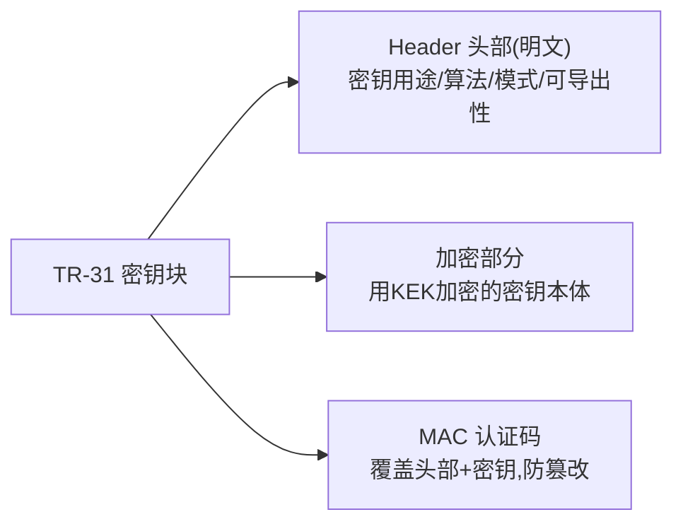

🔧 **三个关键设计**：
- **用途绑定（Key Binding）**：头部用明文标明"这把密钥只能干什么"（如 `P0`=PIN加密、`E0`=EMV、`D0`=数据加密），且 MAC **同时覆盖头部和密钥本体**——改了用途，MAC 就对不上，HSM 拒绝使用。这就堵死了"用途混淆攻击"。
- **机密性**：密钥本体用 KEK 加密。
- **完整性**：MAC 保证头部和密钥都没被篡改。

💡 **业务场景**：总行给分行下发一把新的 PIN 验证密钥、收单机构给发卡行约定一把 ZPK——双方**已经有共享的 KEK**（信任已建立），就用 TR-31 把工作密钥包起来传。这是日常密钥分发的主力格式。

📌 **术语澄清（sample 实证）**：TR-31 里那把"保护密钥块的密钥"正式叫 **KBPK（Key Block Protection Key）**——它就是业务里的 **KEK / ZMK / ZCMK** 的统称（同一个东西的不同叫法）。TR-31 用 KBPK（对称密钥）把工作密钥 `wrap`（包裹）起来。

☁️ **AWS TR-31 导入流程（基于官方 sample 代码核对）**：

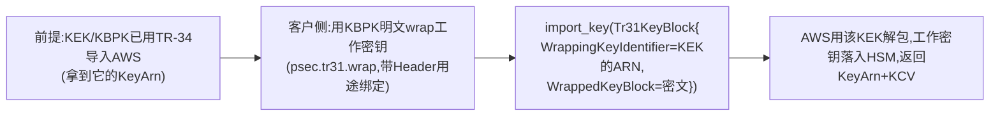

- **`WrappingKeyIdentifier`** 指向**已经在 AWS 里的那把 KEK 的 ARN**——这正是"先 TR-34 建信（把 KEK 导进 AWS）→ 后 TR-31 用这把 KEK 日常传工作密钥"两段式的代码体现。
- **Header 字段**（sample 实证）：`key_usage`（K0=KEK、P0=PIN、B0、D0 等）、`algorithm`（T=TDES/A=AES）、`mode_of_use`（B=加解密、X=派生）、`exportability`（E/S/N）、`version_id`（TDES 用 'B'、AES 用 'D'）。
- ⚠️ **一个真实约束**：用 TR-34 直接导入的 KEK **只能是 3DES**（sample 注释）；要导 AES 密钥，可先用 TR-34 建一把 3DES 的 KEK，再用 TR-31（KBPK 可 3DES、被包裹的工作密钥可 3DES 或 AES）传 AES 工作密钥。
- ⚠️ sample 处理明文密钥仅用于**测试环境**；生产环境工作密钥的 wrap 应在 HSM 内完成。

### 2.4 TR-34：非对称密钥分发——"素不相识，怎么首次建信"

📌 **是什么**：基于 **RSA 公钥密码学**的密钥分发协议——解决 TR-31 的前提问题：**双方还没有共享的 KEK 时，第一把密钥怎么安全传？**

📌 **解决什么问题**：
> TR-31 要求双方**已经共享 KEK**。但"第一把 KEK 本身怎么传"？过去靠**人工密钥仪式**——多个保管人各持一份密钥分量，飞到现场、在 HSM 前手工录入合成（成本高、易出错、慢）。TR-34 用非对称密码学把这个"首次建信"自动化、安全化。

📌 **两个角色**（TR-34 术语）：
- **KDH（Key Distribution Host，密钥分发主机）**：要把密钥**发出去**的一方（如客户的本地 HSM）。
- **KRD（Key Receiving Device，密钥接收设备）**：**接收**密钥的一方（导入到 AWS 时，**AWS Payment Cryptography 就是 KRD**）。

📌 **怎么做（基于 AWS sample 真实代码的 TR-34 导入流程）**：

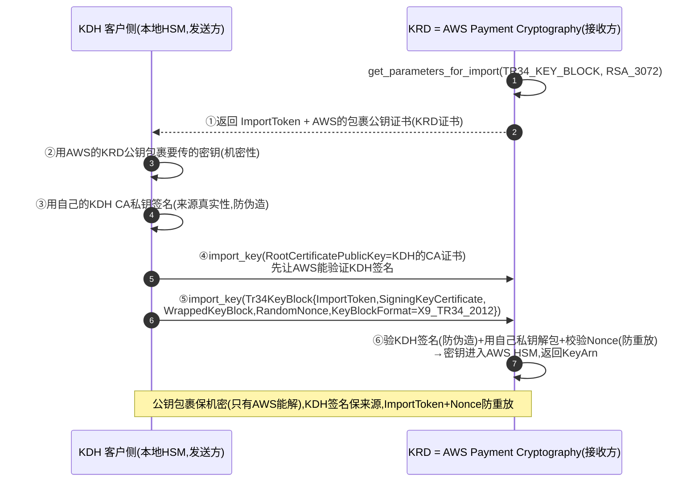

🔧 **流程关键点（sample 验证）**：
- **机密性**：用 AWS 返回的 **KRD 公钥**包裹密钥——只有 AWS 的私钥能解，中途截获没用。
- **真实性/防伪**：KDH 用**自己的 CA 私钥签名**；导入前要先 `import_key(RootCertificatePublicKey=...)` 把 **KDH 的 CA 证书**导入 AWS，AWS 才能验证 KDH 的签名。
- **防重放**：`GetParametersForImport` 返回的 **ImportToken**（一次性）+ **RandomNonce**（2-pass）防止密钥块被重放。
- **格式**：`KeyBlockFormat = X9_TR34_2012`（TR-34 2012 non-CMS）。
- RSA_3072 包裹密钥可支持到 AES-128 的密钥导入。

💡 **业务场景**：一个新接入的机构首次和 AWS（或对方）建立密钥关系——**没有预共享密钥**，用 TR-34 完成首次密钥交换。建信之后，后续日常密钥分发回到更轻量的 TR-31。

☁️ **AWS API（sample 实证）**：`get_parameters_for_import('TR34_KEY_BLOCK','RSA_3072')` 拿 ImportToken+KRD证书 → `import_key(RootCertificatePublicKey=KDH CA)` 导入签名验证证书 → `import_key(Tr34KeyBlock={...})` 提交包裹密钥块。

> ⚠️ **关于"分量"的准确事实（核对 sample 后修正）**：AWS sample 的导入脚本**确实接受 `--component1/2/3` 三个分量**，但**分量的 XOR 合成发生在客户侧（AWS 之外）**——AWS 不"逐个接收分量再合成"，它只接收已合成并用 **TR-34 包裹**好的密钥。`AWS 这边的 API 入口始终是 TR-34/TR-31`。
>
> 但"客户侧合成"要分清**在什么安全边界内合成**（这是密钥安全的关键）：
>
> | | sample 脚本的做法 | 生产环境应有的做法 |
> |---|---|---|
> | 合成位置 | 客户**普通主机内存**里 XOR（Python `a^b^c`） | 客户**自己的物理 HSM 内** XOR |
> | 明文密钥 | 明文完整密钥**短暂出现在普通服务器内存** | 明文只在 **HSM 硬件内**，不落普通主机 |
> | 用途 | ⚠️ **仅测试环境**（sample README 明确） | 生产环境 |
> | 之后 | 都走 TR-34 包裹导入 AWS | 都走 TR-34 包裹导入 AWS |
>
> 📌 **所以准确说**：分量合成在 **AWS 之外的客户侧**——但生产环境应是"**客户自己的物理 HSM 内合成**"（明文分量/明文密钥绝不落普通服务器），**绝非** sample 演示的"普通主机内存里 XOR"（那个仅供测试）。无论哪种，合成后都用 TR-34 导入 AWS。详见 §2.8。

> 🔑 **TR-31 vs TR-34 一句话**：TR-34 用**非对称**解决"**首次**建信"（贵但能从零建立），TR-31 用**对称**解决"**日常**传密钥"（快，但要求已有 KEK）。先 TR-34 建信，后 TR-31 日常——这是密钥分发的标准两段式（AWS sample 的 README 正是这么演示的：先 TR-34 建 KEK，再 TR-31 传工作密钥）。

### 2.5 深度解读：TR-34 凭什么能替代传统人工分量密钥仪式

"TR-34 替代密钥仪式"这句话背后是一个第一性问题——一套延续几十年的物理安全仪式，凭什么能被一次 API 调用取代？拆开看就清楚了。

#### 第一步：传统分量仪式到底在解决什么（目的，不是手段）

两个机构要共享第一把主密钥（ZMK/KEK/LMK），起点是**零预共享密钥**（否则直接对称加密传就行）。在这个起点，要同时达成**三个安全目标**：

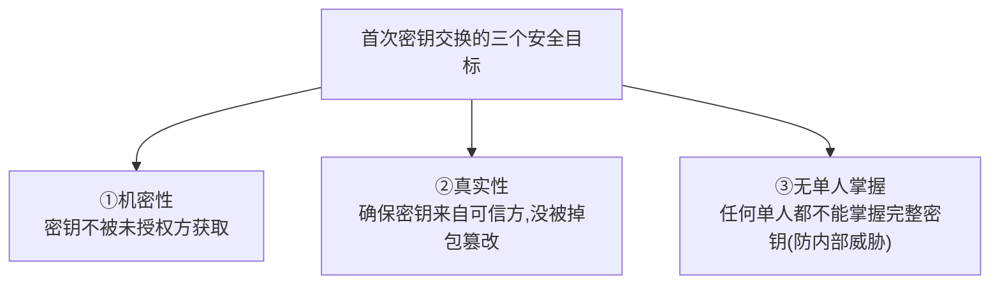

传统分量方案（在没有安全信道的年代发明）：把密钥拆成 N 个随机分量（`分量1 XOR 分量2 XOR 分量3 = 完整密钥`），各交不同保管人物理运送，HSM 内合成。
- ③ **无单人掌握** = 靠"**知识分割**"：单人只持一个分量，任意 N-1 个分量 XOR 仍是随机数，推不出完整密钥。
- ② **真实性** = 靠可信保管人 + 物理链条 + 现场签字。
- ① **机密性** = 靠物理隔离 + 分割（明文密钥只在 HSM 内合成的瞬间完整存在）。
- **双重控制** = 多人同时在场、轮流录入，无人能独自完成。

> 📌 **关键洞察**：「拆分量（知识分割）」是**手段**不是目的。目的是"**没有任何单人能接触/掌握完整密钥**"。在没有安全信道的年代，密钥必须被人以某种形式接触（运送、录入），所以只能靠"拆开让没人知道全部"来达成目的。

#### 第二步：TR-34 的原理——非对称密码学凭空造出"安全信道"

TR-34 的革命：用 RSA 在"零信任起点"造出一条安全信道，于是**密钥根本不需要被任何人接触**。

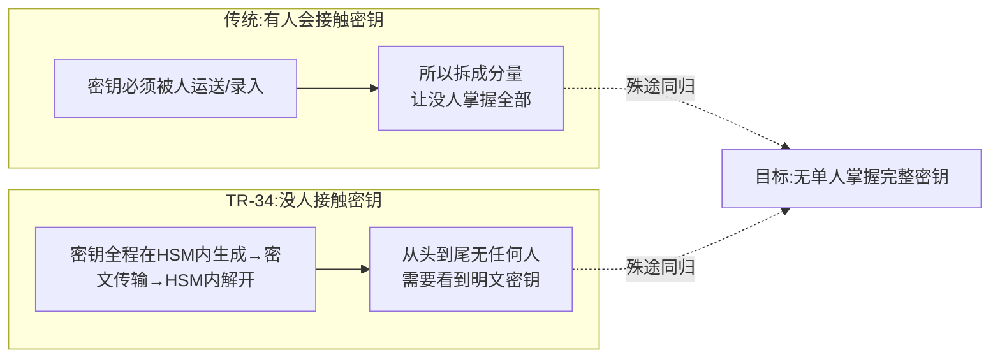

TR-34 分别达成三个目标：
- ① **机密性**：用接收方公钥加密——只有接收方私钥（锁 HSM）能解，网络截获无用。**替代了物理运送+分割的机密性需求**。
- ② **真实性**：发送方私钥签名 + 数字证书——接收方验签确认来源、没被掉包。**替代了可信保管人物理链条**。
- ③ **无单人掌握**：见下一步。

#### 第三步（核心）：「知识分割」被消解，「双重控制」被转移

📌 **知识分割被"消解"**：
> 传统靠"把秘密拆给多人"达到"无单人掌握"；TR-34 靠"**密钥根本不经任何人之手**（全程 HSM 内或密文）"达到同一目标。既然没有任何人接触明文密钥，"拆开防止单人知道"这个需求就**从根上消失了**。

⚠️ **但双重控制没有消失，它"转移"了**（必须诚实讲清，否则误以为 TR-34 牺牲了安全）：

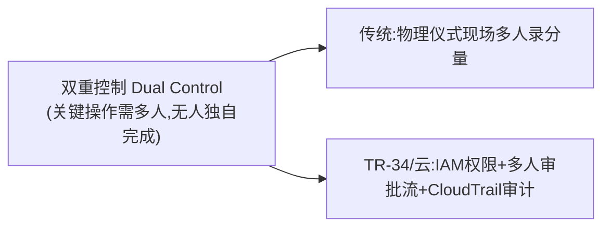

> 传统的双重控制（关键操作需多人参与）在云模型下从"物理仪式"**转移**到"访问治理"：谁能调 `ImportKey`→ **IAM 权限**；要不要多人批准→ **审批工作流**；谁何时导入了什么→ **CloudTrail 审计**。
> **本质**：知识分割被"无人接触明文"**消解**，双重控制被 IAM 治理+审计**转移**——安全目标一个没少，实现从物理世界搬到了密码学+访问治理。

#### 第四步：实操对比

| 环节 | 传统人工分量仪式 | TR-34 |
|---|---|---|
| 排期 | 双方协调，常需数周 | 即时，API 调用 |
| 人员 | 各派 2-3 名保管人到场 | 无需多人到场（权限受 IAM 控制） |
| 密钥载体 | 分量装密封信封/智能卡，物理运送 | 公钥走普通网络（公开），密钥块密文走网络 |
| 合成 | 多人现场轮流在 HSM 录分量，HSM 内 XOR | HSM 内用私钥解包，自动完成 |
| 防重放 | 靠流程控制 | **ImportToken + RandomNonce** 机制 |
| 审计 | 纸质签字、留档 | **CloudTrail 全自动** |
| 耗时 | 天~周级 | 分钟级 |

#### 第五步：为什么这不是降低安全，反而更强

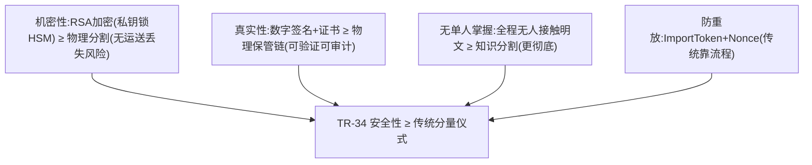

> ⚠️ **前提**：RSA 密钥够长（2048+，sample 用 RSA_3072）、私钥锁在 FIPS 140-2 L3 HSM、证书信任链可靠。满足这些，TR-34 在三个安全目标上都 ≥ 传统分量仪式，还消除了物理运送的丢失/出错风险。

> 🎯 **交流要点（第一性级）**：能讲"传统分量仪式的目的是'无单人掌握'，拆分量只是手段；TR-34 用非对称密码学让密钥全程不经人手，从根上消解了'知识分割'的需求，而双重控制转移到 IAM+审计"——这是把"为什么能替代"讲到第一性，远超"TR-34 是个更方便的密钥导入方式"的表层理解。

---

### 2.6 DUKPT：一次一密——"终端密钥泄露了，怎么把损失关在一笔交易里"

📌 **是什么**：**Derived Unique Key Per Transaction（每笔交易派生唯一密钥）**，ANSI X9.24 定义。让 POS/ATM 终端**每一笔交易都用一把不同的密钥**加密 PIN。

📌 **解决什么问题**：
> POS 终端在不安全的环境（街边、商户柜台），如果所有交易都用同一把固定密钥，**一旦这把密钥被提取，过去和未来所有交易的 PIN 全部暴露**。DUKPT 让每笔交易一把新密钥，且**密钥之间不可反推**——泄露一笔只损失一笔。

📌 **怎么做（DUKPT 派生机制）**：

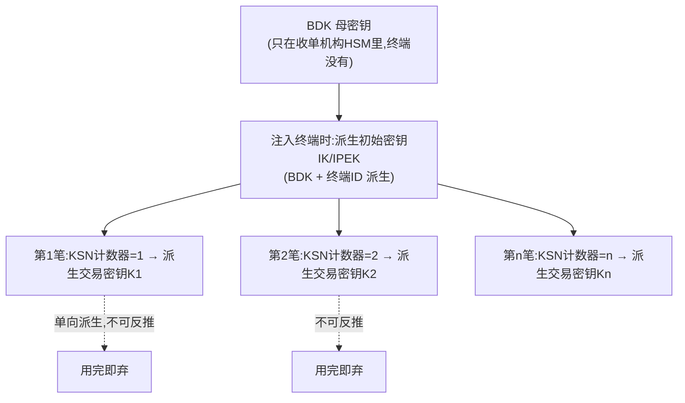

🔧 **三个关键设计**：
- **终端不存 BDK**：终端只存一个由 BDK 派生的**初始密钥（IPEK）**，加上一个**计数器**。BDK 只在收单机构的 HSM 里。
- **KSN（Key Serial Number）**：=设备ID + 交易计数器。每笔交易计数器+1，终端据此派生出**唯一交易密钥**，并把 KSN 随报文上送。
- **收单侧能重算**：收单机构 HSM 拿到 KSN，用 BDK 重新派生出同一把交易密钥来解密——**双方算出同一把密钥，但密钥从不在网络上传输**。
- **单向不可逆**：派生是单向的——**从第 n 笔的密钥推不出 BDK，也推不出其他笔的密钥**。

💡 **业务场景**：所有线下 POS/ATM 的 PIN 加密标准做法。持卡人在 POS 输 PIN → 终端用本笔 DUKPT 密钥加密成 PIN Block + 带上 KSN → 收单机构用 BDK+KSN 重算密钥解密（再 TranslatePinData 转发给发卡行，见 §4.2）。
☁️ Payment Cryptography 支持 TDES 和 AES DUKPT，交易时传 KSN 即可。

> 🎯 **交流要点**：能讲清"TR-34 首次建信（非对称）→ TR-31 日常传密钥（对称，带用途绑定防混淆）→ DUKPT 终端一次一密（KSN 派生，泄露不扩散）"这三件套，并说出各自解决的攻击场景（用途混淆/首次无信任/终端密钥泄露），是支付密码学的硬核功底。和支付公司聊 HSM/密钥管理，这是能立刻建立专业信任的话题。

### 2.7 密钥怎么进终端：BDK 注入 与 SoftPOS

DUKPT 讲了"终端每笔派生唯一密钥"，但有个前提问题：**密钥最初怎么进到 POS 机里？SoftPOS（手机变 POS）没有安全芯片又怎么办？**

📌 **先澄清**：注入终端的**不是 BDK 本身，而是 BDK 派生出的初始密钥 IPEK/IK**。**BDK 母密钥永远留在收单机构 HSM 里，绝不进终端**。

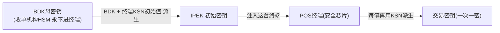

**传统 POS 的注入方式**（IPEK 全程不明文暴露）：

| 方式 | 怎么做 | 说明 |
|---|---|---|
| **KIF 物理注入(传统)** | 在物理安全房间(Key Injection Facility)用专用密钥注入设备(KLD)把 IPEK 灌进终端安全芯片，双重控制 | 出厂/部署前批量注入(又是密钥仪式) |
| **RKL 远程密钥加载(现代主流)** | **Remote Key Loading**：终端内置厂商证书，密钥服务器用终端公钥包裹 IPEK 远程下发，终端私钥解开存入安全芯片 | 远程、规模化、免物理接触 |

> 🔑 **RKL 本质就是 TR-34 思想用在"服务器→终端"**——非对称交换替代物理灌注，和"TR-34 替代密钥仪式"（§2.5）是同一个演进逻辑。
> 🔧 传统 POS 有 **PCI PTS 认证的安全芯片（SCD）**：密钥存防篡改硬件，撬开自毁。

📌 **SoftPOS 难题**：用普通手机（COTS）当 POS，**没有 PCI PTS 防篡改安全芯片**，怎么保证密钥和 PIN 安全？

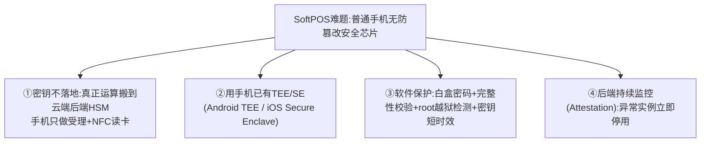

🔧 **SoftPOS 的解法**（遵循 PCI **MPoC / SPoC** 标准）：
- **密钥不长期留手机**：手机做前端受理+读卡，密钥运算放**云端后端 HSM**。
- **利用手机 TEE/SE** 做敏感操作；**软件保护**（白盒密码、完整性校验、环境检测、密钥短时效/频繁轮换）。
- **后端持续监控**：MPoC 要求实时监控每个 SoftPOS 实例安全状态，异常即停。
- **PIN 处理**：PIN on COTS / 加密后送后端，不在手机明文停留。

> 📌 **第一性对比**：传统 POS 靠**硬件**（防篡改芯片）保护密钥；SoftPOS 无可信硬件，改用 **"密钥搬云端 + TEE + 软件保护 + 后端持续监控 + 短时效密钥"** 组合——用纵深防御+持续验证补偿"硬件信任根缺失"。安全模型从"信硬件"变成"信云端+持续验证"。
> 🎯 **交流要点**：能讲"注入的是 IPEK 不是 BDK、RKL=TR-34 用在终端、SoftPOS 靠 MPoC 的云端密钥+TEE+监控补偿无安全芯片"——是支付终端安全的硬核认知。
> ⚠️ **可信度**：BDK 注入(KIF/RKL)、SoftPOS(MPoC/SPoC/TEE) 属支付终端安全专业领域，此处为行业通行机制（🔧 公知级）；落地以 PCI PTS/MPoC 标准最新版与终端厂商方案为准。

### 2.8 实务：ZPK 怎么在收单机构↔发卡行之间约定与交换

§2 列了密钥类型和交换标准，但有个高频实务问题：**ZPK（两机构间的 PIN 密钥）双方到底怎么"约定"出来的？** 答案揭示了密钥分层在落地时的完整链条。

📌 **核心：ZPK 不是直接约定的，而是用上一层 ZMK 加密后传输的**。

📌 **关键概念 ZMK（Zone Master Key，区域主密钥）= 两机构之间的 KEK**：
> "zone（区域）"指"收单机构↔发卡行这一对关系"。ZMK 是这对关系的"信任根"，专门用来加密保护在它们之间传输的工作密钥（ZPK 等）。**先有 ZMK，才能安全传 ZPK。**

**三级密钥分发链**：

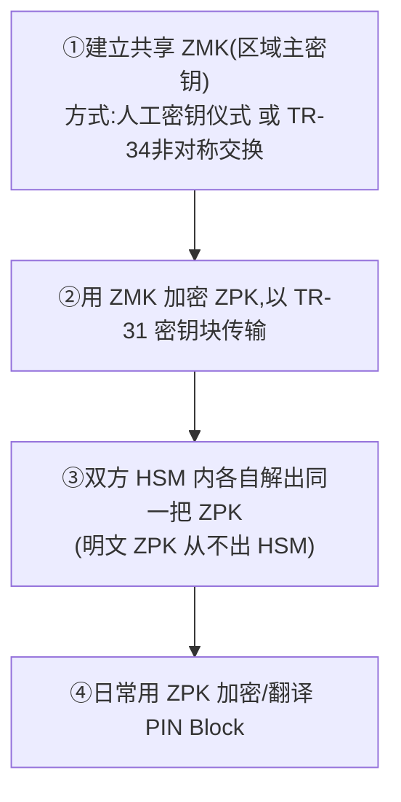

#### 第一把 ZMK 怎么来？——两条路

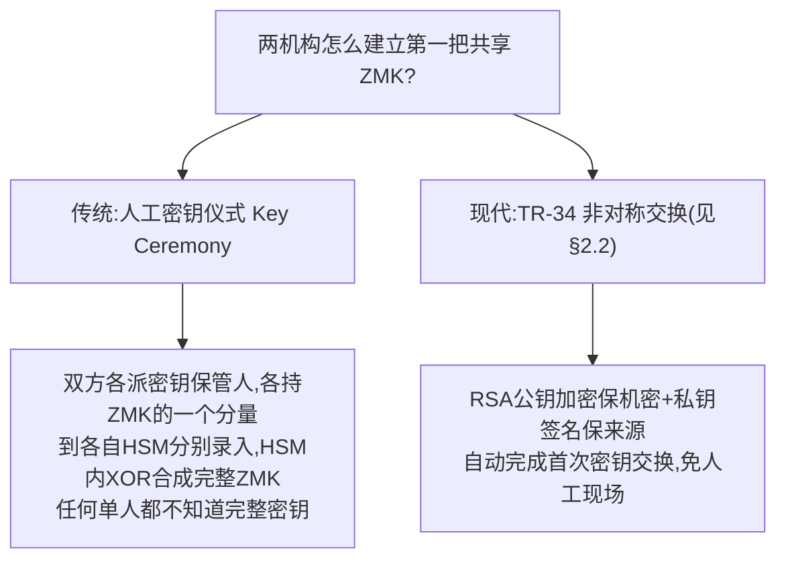

📌 **人工密钥仪式（Key Ceremony）—— 至今仍在用的经典方式**：
- **密钥分量（Key Component）**：把 ZMK 拆成 2~3 个分量，每个分量由一个独立的**密钥保管人（Key Custodian）**保管（密封信封/智能卡）。
- **双重控制 + 知识分割（Dual Control + Split Knowledge）**：**任何单独一人都不知道完整密钥**，必须多名保管人同时在场，各自录入自己的分量，HSM 在硬件内 **XOR 合成**出完整 ZMK——合成全程在 HSM 内，无人见到完整明文。
- 收单机构和发卡行**按约定的同一组分量**在各自 HSM 录入，于是双方 HSM 里有了**同一把 ZMK**。
- 💡 这就是银行"密钥仪式"的由来：几人锁在房间、双人监督、签字留痕地导入密钥。

#### 完整交换流程

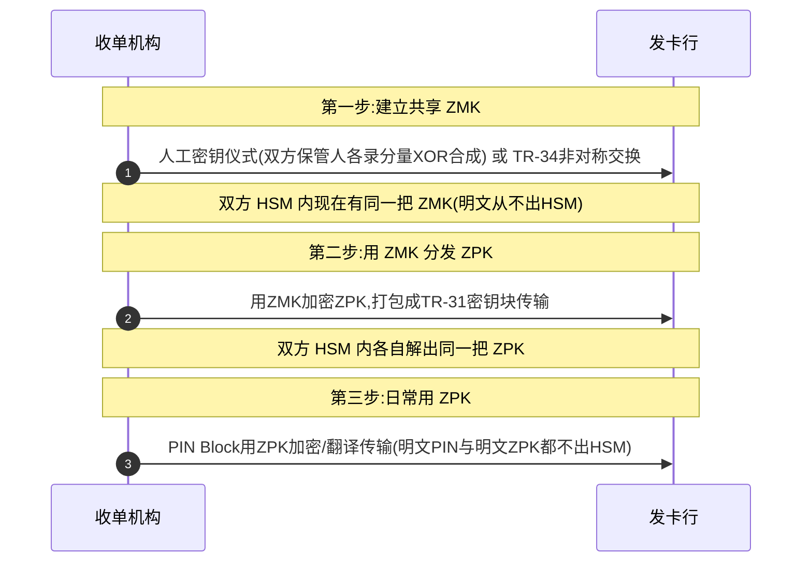

> 📌 **一句话**：ZPK 用上一层 **ZMK 加密**、以 **TR-31** 格式传输；ZMK（第一把共享密钥）通过**人工密钥仪式（传统物理HSM，双重控制+分量XOR）或 TR-34（现代/AWS）** 建立。全程明文密钥和明文 PIN 都不出 HSM。（⚠️ 导入 AWS 时 API 入口是 TR-34/TR-31 密钥块；分量若有，在客户侧 XOR 合成后再走 TR-34——详见下方）
>
> 🎯 **交流要点**：能讲"ZMK 先建（仪式/TR-34）→ ZPK 用 ZMK 包着 TR-31 传 → ZPK 日常加密 PIN"这条三级分发链，并知道"密钥仪式=双重控制+知识分割"，是支付密钥管理的实务核心——银行密钥管理团队日常就干这个。

#### ☁️ AWS Payment Cryptography 怎么处理密钥导入（经官方文档 + sample 代码核实）

⚠️ **关键澄清**：上面的"人工密钥仪式（多人录分量 XOR 合成）"是**传统物理 HSM** 的做法。**AWS Payment Cryptography 的 API 入口不是"逐个录分量"，而是 TR-34/TR-31/RSA Wrap 这类密钥块**。
> 📌 **关于分量（核对官方 sample 后的准确说法）**：AWS 官方 sample 的导入脚本**确实支持 `--component1/2/3` 三分量**，但 **XOR 合成发生在客户侧（KDH 本地）**——本地把分量 XOR 成完整密钥，再走 TR-34 包裹导入 AWS。所以"分量"这一步仍在客户侧/客户 HSM 完成，AWS 收到的是 TR-34 密钥块。且 sample 明确：处理明文分量的脚本**仅测试环境**用，生产环境分量应在物理 HSM 内合成、绝不明文落普通主机。

📌 **`ImportKey` 支持的导入方式**（官方确认）：

| 方式 | 用途 | 何时用 |
|---|---|---|
| **TR-34**（RSA 非对称+数字签名） | 首次建信、导入初始 KEK/ZMK | 无预共享密钥时 |
| **TR-31**（对称密钥块，需已有 KEK） | 日常工作密钥交换 | 建信之后 |
| **RSA Wrap**（公钥包裹对称密钥） | 简单对称密钥导入 | 特定场景 |
| **明文导入** | — | ❌ **不允许**（PCI PIN：密钥绝不以明文进出） |

📌 **传统密钥仪式的场景，在 AWS 下怎么实现**：

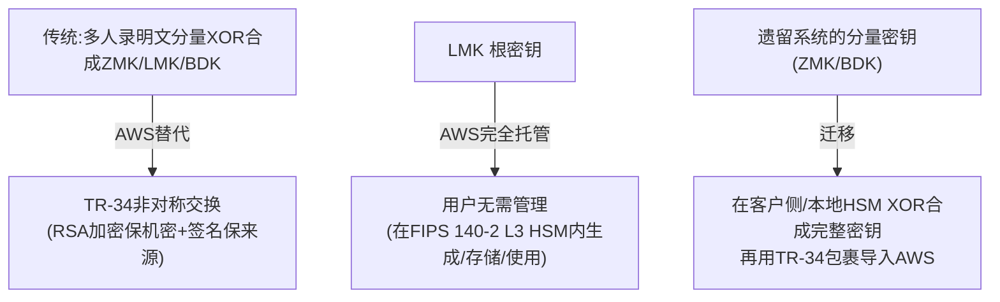

- **首次建信**：用 **TR-34**（`GetParametersForImport` 拿 AWS 包裹公钥证书 → 本地包裹密钥 → `ImportKey`）——RSA 加密保机密、数字签名保来源，效果等价于分量仪式的安全性，但无明文暴露、可远程异步、CloudTrail 全程可审计。
- **LMK（根密钥）**：**AWS 完全托管**——在 FIPS 140-2 L3 HSM 内生成/存储/使用，**用户根本不需要管理 LMK 分量**（传统物理 HSM 才要你管 LMK 仪式）。
- ⚠️ **迁移坑点**：若遗留系统已有"用分量建立的 ZMK/BDK"，AWS 这边**不录分量**——要先**在本地 HSM 把分量合成完整密钥**，再用 TR-34/TR-31 导入 AWS。

> 📌 **一句话**：**AWS Payment Cryptography 用 TR-34 非对称交换替代了传统的人工多方分量密钥仪式**，并托管了 LMK——把"几个人飞到现场录密钥分量"变成 API 调用。安全性等价（甚至更高，无明文暴露），运维大幅简化。
> 🎯 **交流杀手锏**：支付公司最沉重的密钥运维就是"密钥仪式"（多人到场、双重控制、签字留痕、灾备）。你能说清"AWS 用 TR-34 替代分量仪式 + 托管 LMK，但遗留分量密钥要先本地合成再 TR-34 导入"——既讲清了价值，又诚实点出迁移的真实约束，非常专业。

---

## 3. CloudHSM vs Payment Cryptography：怎么选

模块1技术篇给了结论，这里讲清**为什么**和**怎么选**。

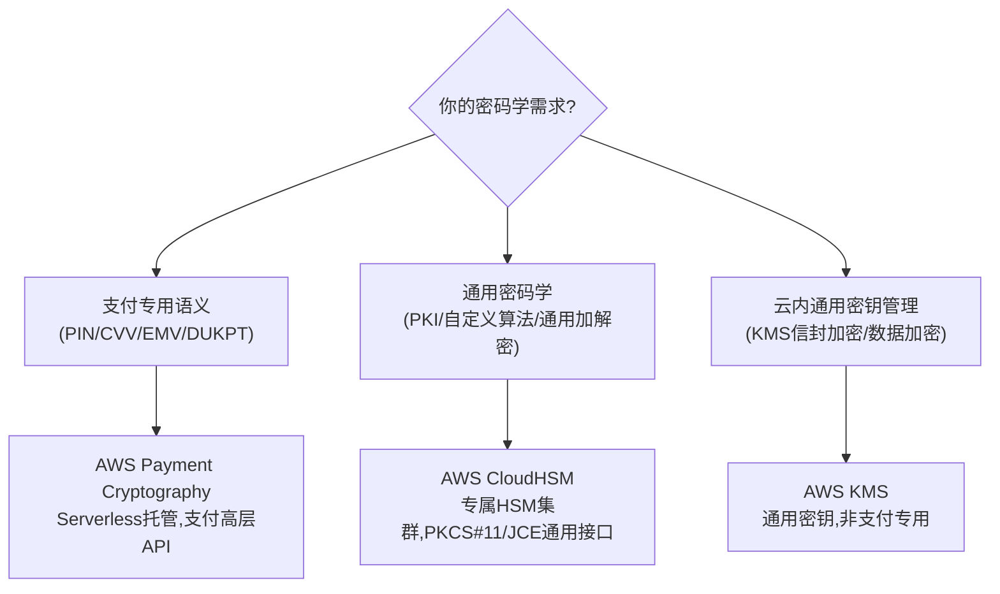

| 维度 | **Payment Cryptography** | **CloudHSM** | **KMS** |
|---|---|---|---|
| 定位 | **支付专用托管服务** | 通用专属 HSM 集群 | 通用密钥管理 |
| 管理方式 | Serverless，无需管硬件 | 需管 HSM 集群（选型/扩缩容） | 全托管 |
| API 风格 | **支付高层语义**（GeneratePinData/VerifyAuthRequestCryptogram） | 标准接口（PKCS#11/JCE/CNG） | AWS API（Encrypt/Decrypt/GenerateDataKey） |
| 密钥语义 | PIN/EMV/DUKPT/TR-31/34 支付专用 | 标准密钥，无支付语义 | 通用对称/非对称 |
| 计费 | 按 API 调用次数 | 按 HSM 实例小时 | 按 key + 调用 |
| 合规 | **PCI PIN/P2PE/DSS/3DS** | FIPS 140-2 L3 通用 | FIPS 140-2/3 |
| FIPS | FIPS 140-2 Level 3 | FIPS 140-2 Level 3 | — |

📌 **选型第一性原则**：
- **要做 PIN/CVV/EMV/DUKPT 这些支付专用运算** → **Payment Cryptography**（免自建 HSM 集群，直接调高层 API，自带 PCI PIN/P2PE 合规）。
- **要做通用密码学**（自定义算法、PKI、非支付场景）或**需要 PKCS#11 标准接口对接现有系统** → **CloudHSM**。
- **云内一般数据加密、密钥信封加密**（如加密数据库字段、token vault） → **KMS**。

> 🎯 **交流杀手锏**：支付公司过去自建 HSM 集群（Thales/Futurex/Atalla 物理机），痛点是——贵（一台几十万）、运维难（密钥仪式、双人控制、灾备）、扩容慢、合规审计重。**Payment Cryptography 把这些变成按调用付费的 Serverless API，自带 PCI PIN/P2PE 合规继承**——这是你作为 AWS SA 最有杀伤力的一张牌。但要诚实：存量系统迁移涉及密钥迁移（TR-34 导入）和改造，不是一键切换。

---

## 4. Payment Cryptography 实战（AWS 实战层）

> §2 是通用密钥原理，§3 是选型，本节起是 Payment Cryptography 的具体用法。

### 4.1 两个 API 平面

📌 服务分成两个独立的 API 平面（对应两个 SDK 客户端）：

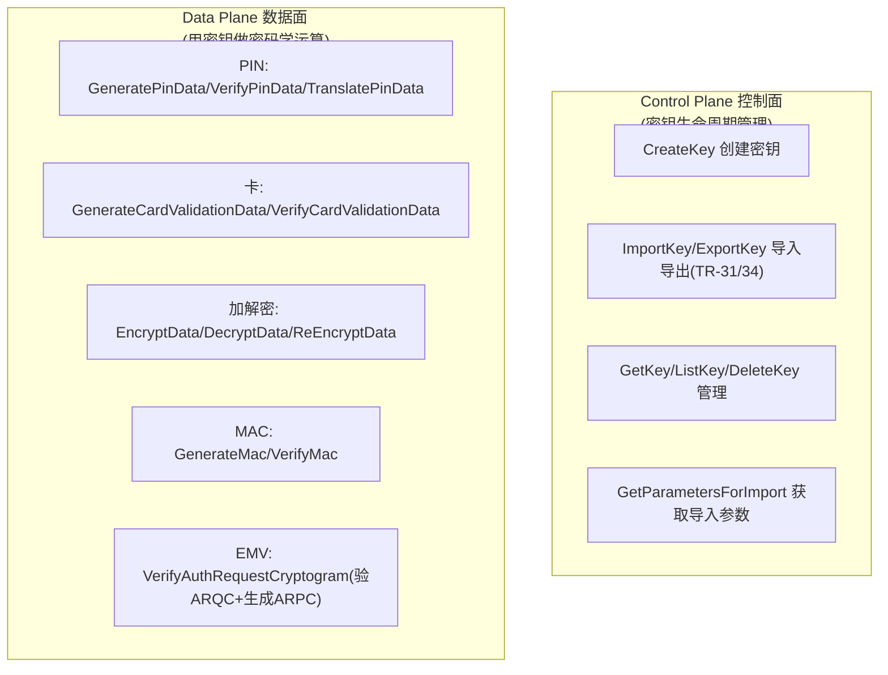

- **Control Plane**（端点 `controlplane.payment-cryptography...`，SDK `payment-cryptography`）：管密钥的**一生**——创建、导入、导出、查询、删除、轮换。
- **Data Plane**（端点 `dataplane.payment-cryptography...`，SDK `payment-cryptography-data`）：**用**密钥做运算——但密钥本身永不返回，只返回运算结果。

> 🔧 这个分离呼应模块1技术篇的"在线 vs 离线"：密钥管理（Control Plane）是低频管理操作；密码学运算（Data Plane）是交易链路上的高频在线调用。

---

### 4.2 收单场景：PIN Block 翻译（最经典）

📌 **场景**：持卡人在 POS/ATM 输入 PIN。PIN 在终端用一把密钥加密成"PIN Block"，但**收单机构和发卡行用的密钥不同**——收单机构作为中间节点，要把 PIN Block **从"终端的密钥"翻译成"发往发卡行的密钥"，全程 PIN 明文绝不出现**。这就是 `TranslatePinData`。

```mermaid
sequenceDiagram
    autonumber
    participant POS as POS终端
    participant ACQ as 收单机构(Switch)
    participant PC as Payment Cryptography
    participant ISS as 发卡行
    POS->>ACQ: 授权请求(PIN Block,用终端密钥/DUKPT加密)
    ACQ->>PC: TranslatePinData(入:终端密钥+格式, 出:发卡行ZPK+格式)
    PC-->>ACQ: 重新加密的PIN Block(明文PIN从未出现)
    ACQ->>ISS: 转发授权(用发卡行密钥加密的PIN Block)
    Note over POS,ISS: PIN全程密文,只是换了把锁,明文PIN从不暴露
```

🔧 **调用链（收单侧）**：
```
# 准备阶段(Control Plane,低频):导入与终端、与发卡行的密钥
ImportKey(KeyMaterial=<终端密钥TR31块>, ...)        # 收终端的 PIN
ImportKey(KeyMaterial=<发往发卡行的ZPK TR31块>, ...) # 转发给发卡行

# 交易阶段(Data Plane,每笔):翻译 PIN Block
TranslatePinData(
  EncryptedPinBlock=<终端来的密文PIN>,
  IncomingKeyIdentifier=<终端密钥(或DUKPT用BDK+KSN)>,
  IncomingTranslationAttributes={IsoFormat0: {...}},
  OutgoingKeyIdentifier=<发往发卡行的密钥>,
  OutgoingTranslationAttributes={IsoFormat1: {...}}
)
→ 返回:用发卡行密钥重新加密的 PIN Block
```

> 📌 **关键点**：终端常用 **DUKPT**（一次一密），所以入向是 BDK+KSN 派生；出向是和发卡行约定的 ZPK。PIN Block 还有**格式转换**（ISO Format 0/1/3/4），不同节点要求不同格式，Translate 同时换密钥+换格式。

---

### 4.3 发卡场景：PIN 验证 / CVV / EMV

发卡行是密钥运算的"大户"——它要生成 PIN、验证 PIN、生成/校验 CVV、验证芯片卡密文。

#### 4.3.1 PIN 生成与验证

```mermaid
sequenceDiagram
    autonumber
    participant ISS as 发卡系统
    participant PC as Payment Cryptography
    Note over ISS,PC: 发卡时:生成PIN
    ISS->>PC: GeneratePinData(PAN, 用PVK生成, 用PEK加密, ISO Format0)
    PC-->>ISS: 加密PIN块 + PVV(验证值)
    Note over ISS: 把PVV存入卡数据库(不存明文PIN)
    Note over ISS,PC: 交易授权时:验证PIN
    ISS->>PC: VerifyPinData(收到的加密PIN块, 之前存的PVV, PVK, PEK)
    PC-->>ISS: 验证成功/失败
```

🔧 **关键**：发卡行**不存明文 PIN**，只存 **PVV（PIN Verification Value）**——一个由 PIN+PAN+PVK 算出的验证值。验证时重新算一遍比对，明文 PIN 从不落库。

#### 4.3.2 CVV / CVV2 生成与校验

```
# 发卡时生成卡背三位码
GenerateCardValidationData(
  KeyIdentifier=<CVK>,
  PrimaryAccountNumber=<卡号>,
  GenerationAttributes={CardVerificationValue2: {CardExpiryDate:"0128"}}
)
→ 返回 CVV2,印在卡背面

# 交易时校验用户输入的CVV2
VerifyCardValidationData(KeyIdentifier=<CVK>, PAN=..., VerificationAttributes=..., CardVerificationValue=<用户输入>)
→ 成功/失败
```
> 📌 ⚠️ CVV2 **绝不可存储**（PCI-DSS 红线，模块1技术篇讲过）——发卡行用 CVK 实时校验，不留存。

#### 4.3.3 EMV 芯片卡密文验证（ARQC/ARPC）

📌 模块1讲过 EMV 芯片每笔生成动态密文。发卡行要**验证芯片卡的 ARQC（授权请求密文）**，并生成 **ARPC（授权响应密文）**回给卡：

```mermaid
sequenceDiagram
    autonumber
    participant CARD as 芯片卡
    participant ISS as 发卡系统
    participant PC as Payment Cryptography
    CARD->>ISS: 授权请求(带ARQC,芯片用卡密钥生成)
    ISS->>PC: VerifyAuthRequestCryptogram(EMV主密钥, 交易数据, ARQC, 派生模式)
    PC-->>ISS: ARQC验证结果 + 生成的ARPC
    ISS->>CARD: 授权响应(带ARPC,卡验证发卡行真伪)
    Note over CARD,ISS: 双向密文:卡证明给发卡行,发卡行证明给卡(防伪造)
```

🔧 `VerifyAuthRequestCryptogram` 一个 API 同时做两件事：验证卡来的 ARQC + 通过 `AuthResponseAttributes` 生成 ARPC（不是独立 API）。EMV 主密钥派生出卡级密钥（EMV Option A/B 派生模式），再派生会话密钥验密文——这是芯片卡防复制的核心。

---

### 4.4 完整密钥流转：从导入到交易

把 Control Plane 和 Data Plane 串起来看一个发卡行的完整生命周期：

```mermaid
flowchart TB
    A["①首次建信:TR-34导入KEK<br/>(Control Plane: GetParametersForImport→ImportKey)"] --> B["②导入/创建工作密钥<br/>(PEK/PVK/CVK/EMV-MK,用KEK保护,TR-31)"]
    B --> C["③发卡时:GeneratePinData/GenerateCardValidationData<br/>(Data Plane,生成PIN/CVV)"]
    C --> D["④交易时:VerifyPinData/VerifyCardValidationData/<br/>VerifyAuthRequestCryptogram(Data Plane,高频在线)"]
    D --> E["⑤密钥轮换:ReEncryptData/重新ImportKey<br/>(定期轮换,合规要求)"]
```

> 🎯 **交流要点**：能画出"TR-34 建信 → TR-31 导工作密钥 → Data Plane 发卡/交易运算 → 定期轮换"这条密钥全生命周期，说明你真懂支付密钥工程，而不只是知道有 HSM 这个东西。

---

### 4.5 架构集成：在收单/发卡系统中的位置

```mermaid
flowchart TB
    subgraph ONLINE["在线交易链路"]
        SW["Switch/授权引擎 ECS/EKS"]
    end
    subgraph PC["Payment Cryptography (Serverless)"]
        DP["Data Plane: PIN/CVV/EMV/MAC 运算"]
        CP["Control Plane: 密钥管理"]
    end
    subgraph DATA["数据/合规"]
        ENCLAVE["Nitro Enclaves 隔离卡号处理"]
        VAULT["Token Vault DynamoDB+KMS"]
        LEDGER["账务 Aurora"]
    end
    SW -->|VerifyPinData/TranslatePinData/<br/>VerifyAuthRequestCryptogram| DP
    SW --> ENCLAVE
    ENCLAVE --> VAULT
    SW --> LEDGER
    CP -.密钥准备(低频).-> DP
```

| 需求 | AWS 服务 | 调用 |
|---|---|---|
| PIN 翻译(收单) | Payment Cryptography Data Plane | TranslatePinData |
| PIN 验证(发卡) | Payment Cryptography Data Plane | VerifyPinData |
| CVV 生成/校验 | Payment Cryptography Data Plane | Generate/VerifyCardValidationData |
| EMV 密文 | Payment Cryptography Data Plane | VerifyAuthRequestCryptogram |
| 密钥管理/轮换 | Payment Cryptography Control Plane | CreateKey/ImportKey/ExportKey |
| 卡号(PAN)隔离处理 | Nitro Enclaves | — |
| token↔PAN 映射 | DynamoDB + KMS | — |
| 通用密钥/PKI | CloudHSM | PKCS#11 |

---

## 5. 本篇小结（背下来）

1. **HSM 是"带密钥的运算器"**：数据送进去运算，密钥永不出硬件边界——PCI PIN/P2PE 硬性要求。
2. **密钥分层**：LMK→KEK→工作密钥(PEK/PVK/BDK/CVK/EMV-MK/MAC)；TR-31(传输)/TR-34(建信)/DUKPT(一次一密)。
3. **选型**：支付专用运算→Payment Cryptography；通用密码学/PKCS#11→CloudHSM；通用数据加密→KMS。
4. **Payment Cryptography 两平面**：Control Plane(密钥生命周期) + Data Plane(密码学运算,密钥不返回)。
5. **收单经典 = TranslatePinData**：PIN Block 换密钥+换格式，明文 PIN 全程不暴露。
6. **发卡三大运算**：VerifyPinData(存PVV不存明文PIN)、Generate/VerifyCardValidationData(CVV不可存)、VerifyAuthRequestCryptogram(验ARQC+生成ARPC)。
7. **AWS 杀手锏**：Payment Cryptography 把自建 HSM 集群变成 Serverless 按调用付费+继承 PCI 合规——但存量迁移涉及密钥迁移(TR-34)，不是一键切换。

---

## 6. 通向

- **回模块1技术篇** → `01-cards-tech-aws.md`（安全四件套、PCI-DSS、收单系统）
- **合规体系深入** → 模块6 横向专题（KYC/AML/PCI 体系化）

---

## 附：常见追问（FAQ）

**Q：Payment Cryptography 真能完全替代物理 HSM 吗？**
A：对支付专用运算（PIN/CVV/EMV/DUKPT），它提供了 Serverless 替代，免去自建集群的运维和合规负担，且自带 PCI PIN/P2PE 合规。但要注意：①存量系统迁移涉及密钥迁移（TR-34 导入）和应用改造（从 PKCS#11/厂商 SDK 改成调 AWS API）；②极特殊的自定义密码学或某些本地支付标准可能仍需 CloudHSM 或专用 HSM。对绝大多数标准卡支付场景，Payment Cryptography 够用且更省心。

**Q：为什么 PIN 要"翻译"而不是直接传？**
A：因为 PIN 在每一段链路用不同的密钥加密（终端一把、收单到发卡一把），且明文 PIN 绝不能出现在任何节点的内存里（PCI PIN 要求）。TranslatePinData 在 HSM 硬件内完成"解密+用新密钥重新加密"，明文 PIN 只在硬件边界内一闪而过，应用层永远拿不到。这是 PIN 安全的核心机制。

**Q：DUKPT 的"一次一密"和 TR-31 是什么关系？**
A：两个不同层面。TR-31 是"密钥怎么安全传输"的格式（密钥块+用途绑定）。DUKPT 是"终端怎么每笔用不同密钥"的派生机制——终端内置 BDK 派生的初始密钥，每笔交易用 KSN（计数器）派生出唯一的交易密钥。即使某笔交易密钥被截获，也推不出 BDK 和其他交易密钥。POS/ATM 普遍用 DUKPT，密钥导入时可能用 TR-31 格式承载 BDK。

**Q：CloudHSM 在支付里还有什么用，既然有了 Payment Cryptography？**
A：CloudHSM 用于**支付专用运算之外**的通用密码学：如签发/管理 PKI 证书、对接只支持 PKCS#11/JCE 标准接口的现有应用、自定义加密算法、区块链钱包私钥保护（模块4稳定币会用到 Nitro+HSM 保护私钥）、或某些 Payment Cryptography 还未覆盖的特殊密钥运算。两者常配合使用：Payment Cryptography 管支付运算，CloudHSM 管通用密码学。
