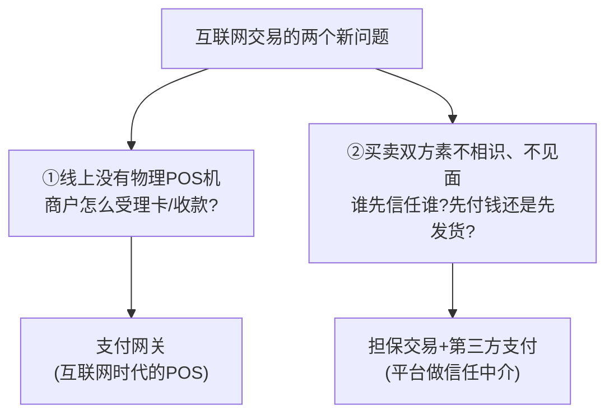
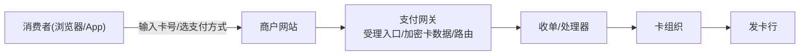
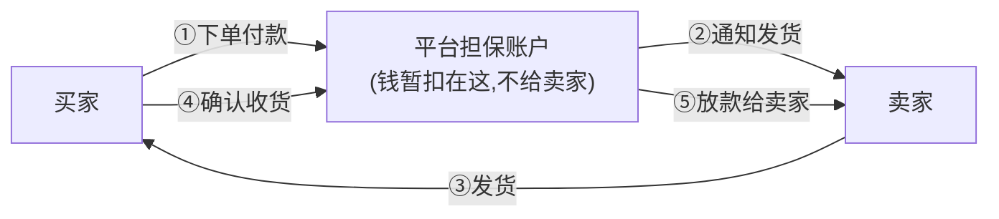
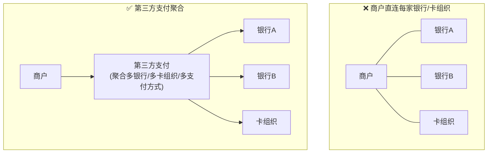
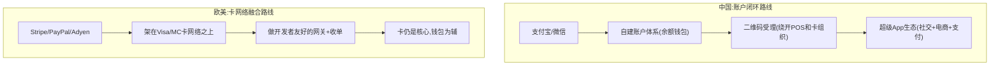
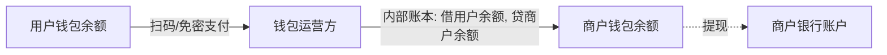
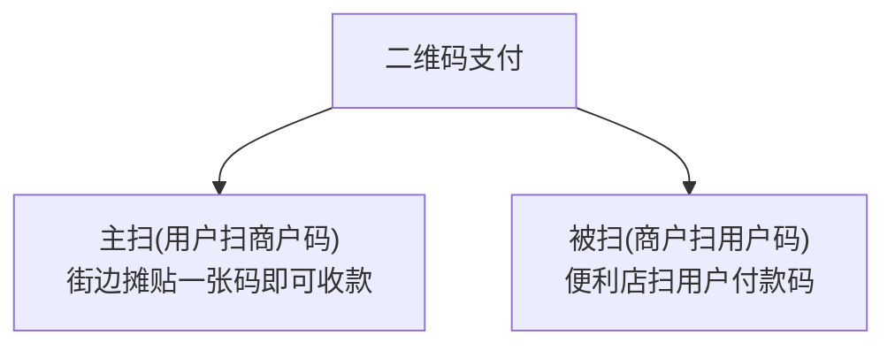
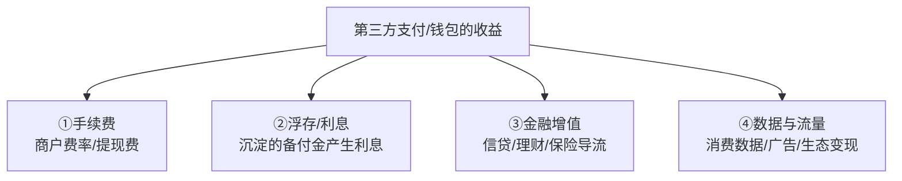
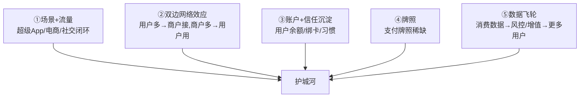
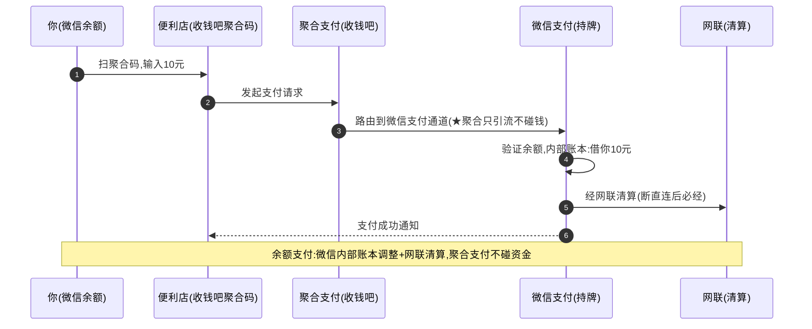

# 模块 2 · 互联网电子支付（业务篇）：网关、第三方支付与钱包

> **学习者**：AWS 技术架构师 · 支付小白
> **本篇目标**：搞懂互联网时代支付的新角色与新模式。学完你能回答：线上没有 POS 机怎么收款？支付网关解决什么问题？第三方支付（支付宝/微信/PayPal/Stripe）凭什么崛起、怎么赚钱？担保交易如何解决"先付钱还是先发货"的信任死结？钱包/二维码/聚合支付各是什么？为什么中国走出了和欧美完全不同的路？
> **前置**：模块1（四方模型/收单/清结算）；**配套技术篇**：`02-epayment-tech-aws.md`
> **组织方式**：top-down 主线叙述（见 `CLAUDE.md` 1.5）。零散追问见文末「附：常见追问」。
> 标注：📌 关键定义 · 💡 案例 · 🎯 与支付公司交流要点 · ⚠️ 常见误区

---

## 1. 全景：互联网给支付带来了什么新问题

模块1 的四方模型是为**线下刷卡**设计的——有物理 POS 机、卡在手上、人在现场。但互联网把交易搬到了线上，立刻冒出两个模块1 解决不了的新问题：

📌 **本篇主线**：互联网电子支付的核心，就是围绕这两个问题长出的新角色和新模式：
1. **支付网关**——线上受理入口（解决问题①）
2. **第三方支付 + 担保交易**——平台型信任中介（解决问题②）
3. **钱包/账户体系**——预存价值、绕开卡组织
4. **二维码/聚合支付**——中国特色的受理革命
5. **新的商业模式与护城河**——浮存、流量、场景

> 🎯 **交流要点**：模块1是"卡的世界"，模块2是"账户+互联网的世界"。中国的支付宝/微信走的是模块2的极致（账户+二维码绕开卡组织），欧美的 Stripe/PayPal 则是模块1+模块2 的融合。理解这个分野，是看懂全球支付格局的钥匙。

---

## 2. 支付网关：互联网时代的 POS

### 2.1 它解决什么问题

📌 **第一性**：线下刷卡，受理入口是**物理 POS 机**（读卡、加密、连收单行）。线上没有 POS 机，商户网站怎么安全地收一笔卡支付？**支付网关（Payment Gateway）就是"软件形态的 POS"——互联网时代的线上受理入口。**

🔧 **网关做的事**（对应线下 POS 的功能）：
- 接住商户的支付请求（API/SDK/收银台页面）
- **加密敏感卡数据**（持卡人卡号绝不能明文经过商户服务器，降 PCI 范围）
- 路由到正确的收单/处理器/支付方式
- 处理异步通知、回调（线上交易结果不是同步秒回的）

### 2.2 网关 vs 处理器 vs 收单（厘清角色）

⚠️ 这三个常被混淆（模块1深化讲过系统分层，这里从业务角色再厘清）：

| 角色 | 业务定位 | 类比 |
|---|---|---|
| **支付网关 Gateway** | 线上受理入口，连接商户与后端 | 线上的"POS 机/收银台" |
| **支付处理器 Processor** | 交易处理、对接卡组织清算 | 后端"交易引擎" |
| **收单 Acquirer** | 持牌、担风险、结算给商户 | 资金的"持牌责任方" |

> 💡 现代很多玩家（Stripe/Adyen）把网关+处理器+收单**一体化**——商户接一个 API 就全搞定，这正是它们体验好的原因（模块1深化的"全栈一体"）。

### 2.3 担保交易：解决"先付钱还是先发货"的信任死结

📌 **第一性问题**（互联网交易问题②）：你网购，和陌生卖家：你怕"付了钱不发货"，卖家怕"发了货收不到钱"。这是经典的**信任死结**。

📌 **担保交易（Escrow）= 平台做中间担保人**：

💡 **这就是支付宝的起家之本**：2003 年淘宝推出担保交易——买家付的钱先到支付宝（不直接给卖家），买家确认收货后才打给卖家。**用"平台暂扣资金"破解了陌生人交易的信任死结**，这是中国电商和第三方支付起飞的关键一步。

> 🎯 **交流要点**：担保交易是第三方支付最重要的"信任创新"。它让支付平台从"通道"变成了"信任中介"，这也是为什么支付宝/微信能沉淀巨额资金（浮存）和用户信任——它们持有的不只是通道，是信任。

---

## 3. 第三方支付：平台型支付中介

### 3.1 它是什么、解决什么

📌 **第三方支付（Third-Party Payment）**：独立于买卖双方和银行的**支付中介平台**（支付宝、微信支付、PayPal、Stripe）。它聚合了多种支付方式、多家银行/卡组织，让商户"接一个就够"，让消费者"一个账户走天下"。

📌 **它解决的问题**：
- 对**商户**：一次接入，支持所有支付方式（降低接入成本）
- 对**消费者**：一个账户+免密支付，不用每次输卡号（体验）
- 对**信任**：担保交易（解决陌生人交易）

### 3.2 中美两条路：闭环 vs 开放

⚠️ 这是理解全球支付格局的关键分野：

| | 中国（支付宝/微信） | 欧美（Stripe/PayPal） |
|---|---|---|
| 核心 | **账户余额 + 二维码**，绕开卡组织 | 架在**卡网络**之上 |
| 受理 | 二维码（无需 POS 硬件） | 网关+收单（卡为主） |
| 模式 | 闭环（类三方模型） | 开放（四方模型之上） |
| 生态 | 超级 App（社交/电商/生活） | 开发者/商户工具 |

> 🎯 **交流要点**：中国第三方支付"换赛道"绕开了卡组织（模块1 护城河那节讲的破局方式）——用账户+二维码自建网络。这是为什么中国是全球移动支付渗透率最高、却也是 Visa/MC 影响力最弱的市场之一。能讲清这个分野，体现你对全球支付格局的理解。

---

## 4. 钱包与账户体系：预存价值，绕开卡组织

### 4.1 钱包的本质

📌 **电子钱包/储值账户**：第三方支付给用户开的**预存价值账户**（支付宝余额、微信零钱、PayPal 余额、八达通）。

📌 **第一性洞察——余额支付为什么能绕开卡组织**：

> 当买卖双方都在同一个钱包平台有账户，一笔支付就是**钱包内部账本的数字调整**（借用户、贷商户）——**不经过卡组织、不经过银行间清算，即时完成**。这就是模块0"同一账本内改数字"的体现，也是钱包支付又快又便宜的原因。

### 4.2 钱包相关的业务动作

🔧
- **充值 / 提现**：资金进出钱包（充值=银行→钱包，提现=钱包→银行）
- **绑卡 / 快捷支付**：钱包绑定银行卡，余额不足时直接从卡扣（这一步把钱包和银行卡打通，是中国移动支付起飞的关键技术）
- **代扣协议 / 免密支付**：用户一次授权，后续自动扣款（订阅、自动续费、滴滴下车自动付）
- **备付金**：用户存在钱包里的钱（沉淀资金），是浮存收益的来源（也是监管重点）

> 🎯 **交流要点**：能区分"余额支付"（钱包内部记账，不走卡组织）vs"绑卡快捷支付"（仍走卡组织，类似模块1）——这是钱包业务的核心。一个钱包平台同时支持两者，按用户余额是否充足、成本路由选择。

---

## 5. 二维码与聚合支付：中国特色的受理革命

### 5.1 二维码支付：绕开 POS 硬件

📌 **第一性**：模块1 的线下受理要 POS 机（贵、小商户装不起）。**二维码把"受理终端"变成了一张纸/一个手机屏**——成本趋近于零，这是中国小微商户移动支付爆发的根本原因。

| 模式 | 谁扫谁 | 场景 |
|---|---|---|
| **主扫（C扫B）** | 用户扫商户的码 | 街边摊、小店贴一张静态码 |
| **被扫（B扫C）** | 商户扫用户的付款码 | 便利店/超市用扫码枪 |

💡 二维码受理成本几乎为零（一张打印的纸 vs 几百上千元的 POS 机），让中国数千万小微商户瞬间接入移动支付——这是模块1的卡组织体系做不到的。

### 5.2 聚合支付：一个码聚合多通道

📌 **聚合支付（Aggregated Payment）**：把多种支付方式（支付宝/微信/银联/各银行）**聚合到一个入口/一个码**，商户接一个就支持所有。代表：收钱吧、哆啦宝、Ping++。

⚠️ **聚合支付的红线（模块1深化讲过）**：聚合支付**只做技术聚合和引流，不得碰清算资金**——资金必须由持牌方清算，聚合支付碰了就是"**二清**"，违规。它本质是"ISO 角色 + 多通道技术聚合"。

> 🎯 **交流要点**：聚合支付商赚的是"服务费/技术费/分润"，不是资金沉淀。能区分"聚合支付（不碰钱）vs 持牌第三方支付（碰钱、有备付金）"，以及"一清 vs 二清"红线——是中国支付合规的基本功。

---

## 6. 商业模式与收益：钱从哪赚

互联网电子支付玩家的盈利模式，比模块1的卡组织更丰富：

| 收益来源 | 说明 |
|---|---|
| **手续费** | 商户交易费率、用户提现费 |
| **浮存（Float）** | 用户备付金/在途资金沉淀产生的利息（⚠️ 中国已要求备付金集中存管央行、不计息，断了这块） |
| **金融增值** | 用支付入口导流信贷（花呗/借呗）、理财（余额宝）、保险——这才是支付平台最大的利润 |
| **数据与流量** | 消费数据、精准营销、超级 App 生态变现 |

> 🎯 **交流要点**：第三方支付的真正商业逻辑——**支付本身不赚钱（甚至补贴），它是"入口"，靠后面的金融增值和流量变现赚钱**。余额宝、花呗才是支付宝的利润引擎。理解"支付是入口不是利润"，是看懂这个行业商业模式的关键。

---

## 7. 护城河：第三方支付凭什么守得住

📌 **核心 = 场景+流量+账户沉淀**：支付宝/微信的护城河不在"支付通道"本身（通道可复制），而在**它绑定的场景（淘宝/微信社交）+ 用户账户习惯 + 数据飞轮**。这也是为什么后来者很难撼动——你能做一样的二维码，但做不出一样的场景生态。

> 🎯 **交流要点**：对比模块1卡组织的护城河（双边网络效应+转换成本），第三方支付多了"**场景绑定+超级App生态**"这一层——这是中国独有的现象（支付嵌在社交/电商/生活服务里）。

---

## 8. 综合案例：一笔扫码支付的完整业务视角

💡 你在便利店用微信扫码买一瓶 10 元的水（余额支付）：

**这个例子里藏着**：支付网关/聚合受理、二维码、余额支付（内部账本）、第三方支付、网联清算、聚合支付不碰钱的红线——模块2的核心要素全在这。

---

## 9. 本篇小结（背下来）

1. **互联网带来两个新问题**：线上没 POS（→支付网关）、陌生人不信任（→担保交易+第三方支付）。
2. **支付网关 = 互联网时代的 POS**，线上受理入口；现代玩家常把网关+处理器+收单一体化。
3. **担保交易**破解"先付钱还是先发货"信任死结，是支付宝起家之本、第三方支付的核心信任创新。
4. **中美两条路**：中国账户闭环（余额+二维码绕开卡组织）vs 欧美卡网络融合（架在 Visa/MC 上）。
5. **钱包余额支付**=内部账本调整，绕开卡组织，又快又便宜；绑卡快捷支付仍走卡组织。
6. **二维码**把受理成本降到趋零（小微商户爆发）；**聚合支付**聚合多通道但不得碰钱（二清红线）。
7. **支付是入口不是利润**：靠金融增值（信贷/理财）和流量变现赚钱，浮存曾是重要收益（中国已收紧）。
8. **护城河 = 场景+流量+账户沉淀+数据飞轮**，比卡组织多了超级App生态这一层。

---

## 10. 通向下一层

- **技术怎么实现？** → `02-epayment-tech-aws.md`（网关架构、异步回调、对账、幂等、聚合路由、AWS 方案）
- **跨境时这套怎么变？** → 模块3（代理行/SWIFT/换汇）
- **账户余额绕开卡组织的极致——链上账本** → 模块4（稳定币）
- **范式对比** → `支付范式资金流对比.md`（电商网关/钱包余额两种范式）

---

## 附：常见追问（FAQ）

**Q：支付网关和收银台（Checkout）是一回事吗？**
A：不完全是。收银台（Checkout）是面向消费者的**前端支付页面/组件**（输卡号、选支付方式的那个界面）；支付网关是后端的**受理与路由引擎**。现代产品（如 Stripe Checkout）把两者打包，但概念上收银台是"脸"，网关是"引擎"。

**Q：余额支付和绑卡快捷支付，对商户有区别吗？**
A：有。余额支付走钱包内部账本（成本低、即时、不走卡组织），绑卡快捷支付要走卡组织/银行（有交换费等成本）。钱包平台会做**成本路由**——优先引导用余额（自己成本低），余额不足才走绑卡。对商户而言到账体验相似，但平台的成本结构不同。

**Q：第三方支付的"备付金"和模块1收单的"备付金"是一回事吗？**
A：本质都是"机构代客户保管的资金，需隔离"。第三方支付的备付金是**用户存在钱包里的钱**（沉淀量巨大）；收单的备付金是**待结算给商户的在途资金**。中国都要求集中存管在央行、不得挪用、不计息——这切断了"浮存吃利息"的老商业模式。

**Q：为什么中国要"断直连"、成立网联？**
A：早期第三方支付直连各家银行，绕开了央行的清算监管，资金流向不透明（洗钱/挪用风险）。2018 年"断直连"要求第三方支付的银行账户类交易必须经**网联**（或银联）清算，让央行能穿透监管资金流。这也确立了"第三方支付不能自己当清算所"的红线。
